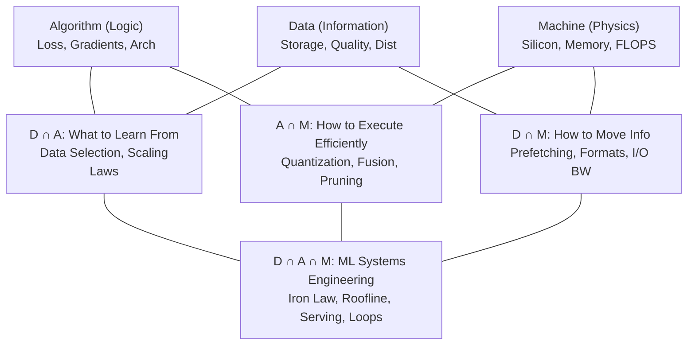

# Appendix A: The D-A-M Taxonomy

## Material Covered in This Chapter

- The D·A·M Taxonomy
- Purpose
- How to Use This Appendix
- Learning Objectives
- A.1 Diagnostic Summary
- A.2 Intersection Landscape
- A.3 Iron Law Mapping
- 2 Arithmetic Intensity
- A.4 Arithmetic Intensity Boundary
- A.5 Rules of Thumb
- A.5.1 Bottleneck diagnostic
- A.6 Anti-Patterns
- A.7 D·A·M Case Studies
- A.7.1 Case 1: The starving accelerator (Data)
- Symptom
- Diagnosis
- The fix
- A.7.2 Case 2: The latency cliff (Algorithm)
- Symptom
- Diagnosis
- The fix
- A.7.3 Case 3: The compute wall (Machine)
- Symptom
- Diagnosis
- The fix
- Checkpoint 17.1: D·A·M diagnosis check
- A.8 Production Troubleshooting
- A.9 Tooling Map
- A.10 D·A·M Scorecard
- A.11 Scaling Laws vs. Roofline
- A.11.1 Scaling laws (the journey)
- A.12 Summary
- Key Takeaways: Where to look first
- A.13 Exercises
- Exercise one: Component identification
- Exercise two: Iron law analysis

---

## Section-by-Section Preserve-and-Extend

# Appendix A: The D·A·M Taxonomy

## A.1 Diagnostic Summary

The Data-Algorithm-Machine (\(\text{D}\cdot\text{A}\cdot\text{M}\)) taxonomy is the primary diagnostic framework for
Machine Learning Systems engineering. It formalizes the tight coupling and interdependence between information flow
(Data), mathematical logic (Algorithm), and physical execution (Machine).

In production, vague symptoms such as "it's slow" or "it's wrong" are insufficient for root-cause analysis. An ML system
may miss its latency Service Level Agreement (SLA) or Service Level Objective (SLO) for fundamentally different reasons
across the three axes:
1. **Data Starvation (Data-bound):** The accelerator sits idle because the input pipeline cannot load and preprocess
data fast enough.
2. **Algorithmic Overhead (Algorithm-bound):** The model performs redundant or inefficient operations, or is too
structurally deep to meet sequential latency budgets.
3. **Hardware Saturation (Machine-bound):** The accelerator is fully saturated and running at its physical limits.

The classification is designed to be **MECE** (Mutually Exclusive, Collectively Exhaustive) to serve as a first-pass
diagnostic checklist, ensuring engineering effort targets the true binding constraint.

The taxonomy maps directly to the iron law of ML systems. Table A.1 summarizes the role, primary physical constraint,
and core optimization pathway for each axis.

### Table A.1: D·A·M Axis Reference
| Axis | Role | Physical Constraint | High-Leverage Optimization | Book Coverage |
| :--- | :--- | :--- | :--- | :--- |
| **Data (D)** | Information (The Fuel) | Bandwidth (\(\text{BW}\)) | Data Selection, ETL pipeline tuning | Chapter 4, Chapter 9 |
| **Algorithm (A)** | Logic (The Blueprint) | Operations (\(O\)) | Model Compression (Quantization, Pruning) | Chapter 5, Chapter 6, Chapter 10 |
| **Machine (M)** | Physics (The Engine) | Throughput (\(R_{\text{peak}}\)) | Hardware Acceleration, Kernel Fusion | Chapter 7, Chapter 11 |

---

## A.2 Intersection Landscape

Production systems rarely exhibit pure single-axis bottlenecks. Rather, performance and design challenges often manifest
at the boundaries where axes overlap.

### Table A.2: D·A·M Intersection Reference
| Zone | Name | Key Concepts & Techniques | Reference |
| :--- | :--- | :--- | :--- |
| **D (pure)** | Information | Storage formats (TFRecord, WebDataset), data quality, distribution properties, label noise. | Chapter 4 |
| **A (pure)** | Logic | Loss functions, architectural designs, gradient computation, backpropagation. | Chapter 5, Chapter 6 |
| **M (pure)** | Physics | Silicon architecture, memory hierarchy, peak compute capability (\(R_{\text{peak}}\)), hardware specifications. | Chapter 11 |
| **D \(\cap\) A** | What to Learn From | Data selection, curriculum learning, active learning, scaling laws (e.g., Chinchilla scaling where \(D \approx 20N\)). | Chapter 8, Chapter 9 |
| **D \(\cap\) M** | How to Move Information | I/O bandwidth, page-locked memory (`pin_memory`), asynchronous host-to-device (H2D) transfer, serialization formats, data gravity. | Chapter 4, Chapter 11 |
| **A \(\cap\) M** | How to Execute Efficiently | Quantization (INT8/FP8), structured/unstructured pruning, custom CUDA kernels, kernel fusion, mixed precision (FP16/BF16). | Chapter 7, Chapter 10 |
| **D \(\cap\) A \(\cap\) M** | ML Systems Engineering | The Iron Law of ML Systems, the Roofline Model, end-to-end training loops, distributed serving topologies, and holistic profiling. | Chapter 8, Chapter 12, Chapter 13 |

---

## A.3 Iron Law Mapping

The execution time (\(T\)) of any ML task is governed by the distribution of variables across the D·A·M axes.

### A.3.1 Component Levers
In a sequential execution model (where data loading, compute, and latency overhead occur serially), the total time is
the sum of the components:

\[
T = T_{\text{data}} + T_{\text{compute}} + L_{\text{lat}}
\]

Expanding this equation into physical variables:

\[
T = \frac{D_{\text{vol}}}{\text{BW}} + \frac{O}{R_{\text{peak}} \cdot \eta_{\text{hw}}} + L_{\text{lat}}
\]

Where:
* **Data Axis Levers:**
  * \(D_{\text{vol}}\) (Bytes): Volume of data transferred. Can be reduced via deduplication, curriculum learning, or
compression.
  * \(\text{BW}\) (Bytes/sec): Memory or I/O bandwidth. Can be optimized by switching to high-speed storage, using local
NVMe drives, or leveraging HBM/HBM3.
* **Algorithm Axis Lever:**
  * \(O\) (FLOPs): Total arithmetic operations required by the model. Reduced through compression (quantization,
pruning, distillation) or architectural efficiency.
* **Machine Axis Levers:**
  * \(R_{\text{peak}}\) (FLOP/sec): Theoretical peak throughput of the hardware. Improved by upgrading accelerators
(e.g., from A100 to H100).
  * \(\eta_{\text{hw}}\) (Dimensionless, \([0, 1]\)): Hardware utilization efficiency. Optimized via kernel fusion,
layout matching (channels-last), or optimizing thread block sizes.
* **Overhead Axis Lever:**
  * \(L_{\text{lat}}\) (Seconds): Serialization overhead, including kernel launch latency, CPU-GPU synchronization
barriers, and host-side execution overhead (e.g., Python runtime dispatch).

### A.3.2 D·A·M Coordination: From Sum to Max
The goal of systems engineering is to run these components in parallel, transforming the additive iron law into a
overlapped maximum:

\[
T = \max\left(\frac{D_{\text{vol}}}{\text{BW}}, \frac{O}{R_{\text{peak}} \cdot \eta_{\text{hw}}}\right) + L_{\text{lat}}
\]

Overlapping only reduces execution time if the workloads on the axes are balanced. If one term dominates (e.g., a highly
memory-bound workload), the execution time remains bound by that axis, and overlapping the smaller axis yields
negligible benefit. The maximum speedup occurs when:

\[
\frac{D_{\text{vol}}}{\text{BW}} \approx \frac{O}{R_{\text{peak}} \cdot \eta_{\text{hw}}}
\]

> [!WARNING]
> The latency term \(L_{\text{lat}}\) (kernel launch, synchronization barriers, Python dispatch) represents
serialization points where all components must wait. It cannot be overlapped. Kernel fusion is critical because it
eliminates \(L_{\text{lat}}\) entirely by combining multiple operator boundaries into a single launch.

### Table A.3: D·A·M Overlap Techniques
| Technique | Axes Overlapped | Implementation |
| :--- | :--- | :--- |
| **Prefetching** | D overlaps M | Utilizing PyTorch `DataLoader` with `prefetch_factor > 0` and `pin_memory=True`. |
| **CUDA Streams** | D overlaps M | Using non-default CUDA streams to overlap Host-to-Device (H2D) memory copies with GPU kernel execution. |
| **Async Gradient Sync** | M (comm) overlaps A | Overlapping bucketed collective communication (`AllReduce`) with the backpropagation computation of preceding layers. |
| **Double Buffering** | D overlaps M | Maintaining ping-pong buffers where buffer \(N+1\) is loaded while the accelerator computes on buffer \(N\). |

---

## A.4 Arithmetic Intensity Boundary

The operational regime of a workload is defined by its **Arithmetic Intensity** (\(I\)), which represents the ratio of
floating-point operations performed to bytes of memory transferred:

\[
I = \frac{\text{Work } (O)}{\text{Memory Traffic } (D_{\text{vol}})} \quad \left[\text{FLOPs/byte}\right]
\]

Comparing \(I\) against the hardware's physical **Ridge Point** determines the bottleneck regime. The ridge point
(\(I_{\text{ridge}}\)) is the ratio of the hardware's peak compute performance to its memory bandwidth:

\[
I_{\text{ridge}} = \frac{R_{\text{peak}}}{\text{BW}} \quad \left[\text{FLOPs/byte}\right]
\]

* **Memory-Bound Regime (\(I < I_{\text{ridge}}\)):** Under this condition, the execution rate is restricted by the
speed at which data can be fetched from memory. The achieved performance is:
  \[
  \text{Performance} = I \cdot \text{BW} \quad \left[\text{FLOP/sec}\right]
  \]
* **Compute-Bound Regime (\(I > I_{\text{ridge}}\)):** Under this condition, execution is restricted by the execution
speed of the arithmetic units. The achieved performance is:
  \[
  \text{Performance} \approx R_{\text{peak}} \cdot \eta_{\text{hw}} \quad \left[\text{FLOP/sec}\right]
  \]

---

## A.5 Rules of Thumb

Use these quantitative heuristics during production incidents to isolate issues:

1. **Accelerator Utilization (\(\eta_{\text{acc}}\)):**
   * \(\eta_{\text{acc}} < 80\%\): The workload is likely data-bound or CPU-bound. The accelerator is starving.
   * \(\eta_{\text{acc}} > 95\%\): The workload is machine-bound (compute-bound) or experiencing heavy memory transfer
overheads.
2. **Batch Size (\(B\)):**
   * \(B = 1\): Workload is typically latency-bound by serial operations or Python overhead (\(L_{\text{lat}}\)).
3. **Arithmetic Intensity (\(I\)):**
   * \(I < 100 \text{ FLOPs/byte}\): The workload is likely memory-bound (Data/Machine boundary).
4. **Environment Discrepancies:**
   * Works in dev, fails in prod: Suspect statistical data drift (Data component) or network configuration mismatches.

### Table A.4: Optimization Targets: What Works vs. What is Wasted
| Workload State | Dominant Term | Optimization That Works | Optimization That is Wasted |
| :--- | :--- | :--- | :--- |
| **Memory-Bound** | \(\frac{D_{\text{vol}}}{\text{BW}}\) | Quantization (FP8/INT8), structured pruning, larger batch sizes, kernel fusion. | Upgrading to a faster accelerator (more raw FLOP/s will not help). |
| **Compute-Bound** | \(\frac{O}{R_{\text{peak}} \cdot \eta_{\text{hw}}}\) | Custom optimized kernels, enabling Tensor Cores, upgrading accelerators, reducing precision. | Increasing memory bandwidth (already compute-saturated). |
| **Latency-Bound** | \(L_{\text{lat}}\) | Request batching, kernel fusion, asynchronous dispatch, compiling graph (e.g., `torch.compile`). | Upgrading compute units or memory bandwidth (overhead dominates). |

---

## A.6 Anti-Patterns

* **The Hardware Crutch:** Purchasing faster accelerators (Machine) to fix an unoptimized Python data loader (Data). The
expensive hardware will simply idle faster.
* **The Model Twiddle:** Adjusting neural network architectures or hyperparameter tuning (Algorithm) when the bottleneck
is actually network bandwidth or slow disk reads (Data).
* **The Premature Optimizer:** Re-writing custom CUDA kernels (Machine) before verifying if the Algorithm is executing
redundant mathematical operations.

---

## A.7 Case Studies

### A.7.1 Case 1: The Starving Accelerator (Data-bound)
* **Symptom:** A training job runs on an NVIDIA A100 GPU. GPU utilization fluctuates wildly between 10% and 40%.
* **Diagnosis:** The Data pipeline cannot load/preprocess data fast enough to keep the GPU busy. The system is I/O
bound.
* **Remediation:**
  1. Transition from small, raw image files (which demand heavy CPU decoding) to sequential binary formats such as
TFRecords, WebDataset, or LMDB.
  2. Increase the number of DataLoader worker processes.
  3. Enable `pin_memory=True` and `prefetch_factor` to preload batches directly into GPU memory.

### A.7.2 Case 2: The Latency Cliff (Algorithm-bound)
* **Symptom:** A real-time recommendation service misses its 20 ms SLA. GPU utilization is low, and the batch size is
pinned at 1.
* **Diagnosis:** The algorithm is too computationally deep (sequential layers) to run within the deadline, and execution
is bound by serialization.
* **Remediation:**
  1. **Quantization:** Compress weights to INT8 to minimize memory fetch overhead.
  2. **Pruning:** Remove redundant attention heads or MLP channels.
  3. **Knowledge Distillation:** Train a shallow student model to replace the deep teacher model.

### A.7.3 Case 3: The Compute Wall (Machine-bound)
* **Symptom:** GPU utilization is pinned at 99%. HBM memory bandwidth is unsaturated. Training is stable but takes
weeks.
* **Diagnosis:** The model is highly compute-bound. The hardware is operating at its capacity.
* **Remediation:**
  1. **Scale Up:** Upgrade hardware (e.g., migrate from A100 to H100 GPUs).
  2. **Scale Out:** Distribute the training workload across multiple nodes using Data Parallelism.
  3. **Lower Precision:** Move from FP32/TF32 to BF16/FP8. On H100 Tensor Cores, BF16 peak performance is double that of
TF32.

### Checkpoint A.7
1. *A training job shows 95% accelerator utilization but loss has plateaued for two epochs. Which D·A·M axis should you
investigate?*
   * **Answer:** Investigate the **Data** or **Algorithm** axis. High utilization proves the Machine is busy, but the
flat loss means the work is useless. Look for label noise, data quality issues, or algorithmic convergence errors (e.g.,
poor learning rate schedules or vanishing gradients).
2. *A colleague suggests adding more data loader workers to a job where GPU utilization is 98%. Using the iron law,
explain why this will not help.*
   * **Answer:** Under the overlapped model, \(T = \max(T_{\text{data}}, T_{\text{compute}}) + L_{\text{lat}}\). Since
GPU utilization is 98%, \(T_{\text{compute}} \gg T_{\text{data}}\). The total time is bound by computation. Decreasing
\(T_{\text{data}}\) further by adding workers will not change the maximum term, resulting in zero overall improvement.
3. *An inference server meets its latency SLO at batch size 1 but fails at batch size 16. Which term in the iron law
changed, and what does this tell you about the bottleneck regime?*
   * **Answer:** Increasing the batch size from 1 to 16 increases both \(D_{\text{vol}}\) (input/output activations and
weights) and \(O\) (total FLOPs). At batch size 1, the system was latency-bound by overhead (\(L_{\text{lat}}\)). At
batch size 16, the system transitions to a bandwidth-bound or compute-bound regime, where either the memory loading time
(\(D_{\text{vol}} / \text{BW}\)) or the execution time (\(O / (R_{\text{peak}} \cdot \eta_{\text{hw}})\)) exceeds the
latency SLO.

---

## A.8 Production Troubleshooting

### Table A.5: D·A·M Diagnostic Matrix
| Symptom | Likely Axis | Diagnostic Question | Recommended Action |
| :--- | :--- | :--- | :--- |
| **Low Accelerator Utilization** | Data | Is the data loader thread pool keeping up with the step time? | Use binary storage formats (e.g., WebDataset) and enable prefetching. |
| **High Latency (P99)** | Algorithm | Does the model depth or sequential execution latency exceed the SLA? | Apply quantization (INT8) or structured pruning. |
| **High Training Cost** | Machine | Is the hardware utilization (\(\eta_{\text{hw}}\)) below the target baseline? | Fusion of element-wise kernels; optimize communication collective bucket sizes. |
| **Silent Accuracy Drift** | Data | Has the statistical distribution of inference data (\(P_t\)) drifted from training data (\(P_0\))? | Trigger automated retraining and update active learning filters. |
| **Out-of-Memory (OOM)** | Algorithm/Machine | Does the model state (weights, gradients, optimizer states, activations) fit in VRAM? | Enable gradient checkpointing, use ZeRO optimizer stages, or reduce batch size. |

---

## A.9 Tooling Map

### Table A.6: D·A·M Tooling Map
| Axis | Key Metric | Primary Tool | Secondary Tool |
| :--- | :--- | :--- | :--- |
| **Data** | Batch Load Time, I/O Wait | `tqdm` (monitor iterations/sec) | `iotop`, `dstat`, `sysstat` (Disk I/O and CPU wait states) |
| **Algorithm** | Operation counts (FLOPs), Model Depth | PyTorch Profiler | DeepSpeed Flops Profiler |
| **Machine** | Accelerator Utilization, SM Occupancy, HBM Bandwidth | `nvidia-smi` | NVIDIA Nsight Systems, Nsight Compute |

---

## A.10 D·A·M Scorecard

### Table A.7: The D·A·M Efficiency Rubric
| Axis | Metric | Definition | Failing Grade | Passing Grade |
| :--- | :--- | :--- | :--- | :--- |
| **Data** | I/O Overhead | \(\frac{\text{Data Wait Time}}{\text{Total Step Time}}\) | \(> 10\%\) | \(< 1\%\) |
| **Algorithm** | Active Params | \(\frac{\text{Nonzero Parameters}}{\text{Total Parameters}}\) | \(100\%\) (Dense) | \(< 50\%\) (Sparse / MoE) |
| **Machine** | MFU (Model FLOPs Utilization) | \(\frac{\text{Achieved Model FLOP/s}}{\text{Peak Hardware FLOP/s}}\) | \(< 30\%\) | \(> 50\%\) |

> [!NOTE]
> MFU (Model FLOPs Utilization) is the gold standard for large-scale training efficiency. Unlike raw accelerator
utilization (which counts any activity on the GPU's streaming multiprocessors), MFU only counts FLOPs that directly
contribute to the model's forward and backward mathematical passes. It excludes overheads like recomputation, gradient
sync, and memory layout adjustments.

---

## A.11 Scaling Laws vs. Roofline

Systems engineering requires distinguishing between growth trajectories (scaling laws) and hard physical limits
(information roofline).

* **Scaling Laws (The Journey):** Empirical power laws that describe how validation loss scales with parameters (\(N\)),
dataset size (\(D\)), and compute (\(C\)).
  * *Kaplan Scaling:* Shows power-law scaling across \(N\), \(D\), and \(C\).
  * *Chinchilla Scaling:* Dictates that for optimal compute allocation, dataset size and parameter count should scale in
a 1:1 ratio:
    \[
    D \approx 20 \cdot N \quad \text{(tokens per parameter)}
    \]
* **Information Roofline (The Destination):** The absolute theoretical limit of what can be learned from a data
distribution, governed by:
  1. *Bayes Error Rate:* The irreducible error rate inherent in the data due to overlapping class distributions or
fundamental label noise.
  2. *Information Density:* The signal-to-noise ratio of the dataset.
  3. *The Data Quality Wall:* The point at which adding more parameter scale or compute fails to reduce validation loss
because the dataset contains no further learnable signal.

---

## A.12 Exercises

### Exercise 1: Component Identification
A production image classification service runs on an NVIDIA A100 GPU. The `nvidia-smi` output shows a steady 25% GPU
utilization, while `iotop` reveals that the host storage disk is saturated at 100% read utilization.
1. Which D·A·M axis represents the bottleneck?
2. Propose two specific optimizations to remediate this issue.

#### Solution:
1. **Bottleneck Axis:** **Data**. The host disk is fully saturated (100% read utilization) while the GPU is
under-utilized (25%), which represents a classic data starvation scenario. The GPU is waiting for the CPU to fetch,
decode, and transfer image bytes.
2. **Optimizations:**
   * **Data Serialization:** Convert the raw individual image files (e.g., JPEGs/PNGs) into a sequential, block-based
binary storage format such as TFRecords or WebDataset. This eliminates random disk seeks, converting the access pattern
to efficient sequential reads, and minimizes CPU decoding overhead.
   * **Pipeline Parallelism (Prefetching):** Adjust the data loader configurations by increasing the number of worker
threads (`num_workers`) and enabling prefetching (`prefetch_factor > 0`) with page-locked host memory
(`pin_memory=True`) to overlap CPU-side ETL with GPU compute.

---

### Exercise 2: Iron Law Analysis
Consider a decoder-only Transformer model with 7B parameters generating a single token in the autoregressive decode
phase at batch size \(B = 1\). Using the standard rule of thumb of 2 FLOPs per parameter, the decode step requires:

\[
\text{Work } (O) = 2 \cdot 7 \times 10^9 = 14 \times 10^9 \text{ FLOPs} = 0.014 \text{ TFLOPs}
\]

On an NVIDIA H100 GPU (which has a theoretical peak of 989 TFLOPS on FP16 Tensor Cores), the measured step latency is 50
ms.
1. Calculate the achieved throughput in TFLOP/s.
2. Calculate the hardware utilization (\(\eta_{\text{hw}}\)).
3. Classify the system bottleneck. Is it Data-bound, Algorithm-bound, or Machine-bound? Justify your calculation.

#### Solution:
1. **Achieved Throughput:**
   \[
   \text{Throughput} = \frac{\text{Work } (O)}{\text{Time } (T)} = \frac{0.014 \text{ TFLOPs}}{0.05 \text{ seconds}} =
0.28 \text{ TFLOP/s}
   \]
2. **Hardware Utilization (\(\eta_{\text{hw}}\)):**
   \[
   \eta_{\text{hw}} = \frac{\text{Achieved Throughput}}{\text{Peak Throughput}} = \frac{0.28 \text{ TFLOP/s}}{989 \text{
TFLOP/s}} \approx 0.000283 \approx 0.028\% \quad (\text{or } 0.03\%)
   \]
3. **Bottleneck Regime Classification:**
   The hardware utilization is extremely low (\(\sim 0.03\%\)). At batch size \(B=1\), autoregressive generation is
highly **Data-bound (specifically memory-bound)**.

   **Justification:** Autoregressive decoding requires loading the entire model's weights from High Bandwidth Memory
(HBM) to the GPU SRAM to compute the activations for a single token. A 7B parameter model stored in FP16 precision takes
up roughly 14 GB of memory.

   To perform \(14 \times 10^9\) FLOPs while reading \(14 \times 10^9\) bytes of weights, the arithmetic intensity is:
   \[
   I = \frac{14 \times 10^9 \text{ FLOPs}}{14 \times 10^9 \text{ bytes}} = 1 \text{ FLOP/byte}
   \]
   Comparing this to the H100 GPU's ridge point:
   \[
   I_{\text{ridge}} = \frac{989 \times 10^{12} \text{ FLOP/s}}{3.35 \times 10^{12} \text{ bytes/s}} \approx 295 \text{
FLOPs/byte}
   \]
   Since \(I = 1 \ll 295\), the workload is deeply memory-bandwidth bound. To improve performance, one must target the
Data/Algorithm boundary:
   * **Quantization:** Compress the weights to INT8 or FP8. This halves the memory traffic (\(D_{\text{vol}}\)) required
to load the parameters, directly cutting the latency in half.
   * **Batching:** Increase the batch size \(B\) via continuous batching. This allows the GPU to reuse the loaded
weights across multiple active sequences, converting the kernel execution from Matrix-Vector Multiplication (GEMV) to
Matrix-Matrix Multiplication (GEMM), which increases arithmetic intensity.
   * **Speculative Decoding:** Generate multiple tokens per weight-load step by using a small draft model.

---

### Exercise 3: Scaling Law vs. Information Roofline
A team trains a sentiment analysis model. Scaling the model parameter size from 125M to 1B parameters (an \(8\times\)
increase in size and compute budget) yields an improvement in validation loss from 0.45 to 0.42 (a \(6.7\%\) relative
improvement). However, Chinchilla scaling laws predict that this budget increase should yield a \(15\%\) validation loss
improvement.
1. What does this discrepancy suggest?
2. Which D·A·M axis should be investigated first?

#### Solution:
1. **Discrepancy Indication:** The discrepancy suggests the training process is hitting the **Information Roofline**
(the "Data Quality Wall"). Power-law scaling formulas assume the data distribution contains unextracted learnable
features. Because the actual gain (\(6.7\%\)) is less than half of the predicted scaling gain (\(15\%\)), the model has
likely extracted almost all learnable signals, and performance is flattening toward the Bayes Error Rate (irreducible
error floor).
2. **Axis to Investigate:** The **Data** axis. Adding more parameters (Algorithm) or upgrading to faster accelerators
(Machine) will yield diminishing returns. The engineers should focus on:
   * Measuring inter-annotator agreement to determine label noise.
   * Cleaning and filtering the training dataset.
   * Acquiring higher-quality, domain-specific data.
   * Checking for distribution alignment/drift.

---

### Exercise 4: Anti-Pattern Detection
A colleague proposes upgrading a training cluster from 4 \(\times\) NVIDIA A100 GPUs to 8 \(\times\) H100 GPUs because
the model training is "too slow." Before approving the $200K capital expenditure, what three diagnostic questions would
you ask to evaluate the D·A·M axes?

#### Solution:
Before approving the budget, ask the following diagnostic questions:
1. **What is the current GPU utilization during training? (Machine Axis):**
   * *Rationale:* Run `nvidia-smi` or query cluster metrics. If GPU utilization is low (e.g., \(< 80\%\)), the GPUs are
idling. Upgrading to H100s will only result in faster idle times.
2. **What percentage of each training step is spent waiting on I/O? (Data Axis):**
   * *Rationale:* Run the PyTorch Profiler to measure the data loading overhead (I/O wait). If the data wait time
exceeds \(1\%\) of the total step time, the bottleneck is in the ETL pipeline. The team should optimize the data loaders
rather than buying faster compute.
3. **Can the batch size scale linearly with the GPU count without hurting convergence? (Algorithm Axis):**
   * *Rationale:* Scaling out to 8 \(\times\) H100 GPUs requires maintaining high local batch sizes to keep the Tensor
Cores saturated. This increases the global batch size. If the model cannot converge at larger global batch sizes, or if
the communication overhead (inter-GPU gradient synchronization) degrades scaling efficiency, the extra GPUs will yield
minimal scaling speedups.

---

## Full Slice Content (Docling Extract, Preserved Verbatim)

> Each section below preserves the source slice content as extracted by docling. Image placeholders are removed; tables,
equations, code blocks, named artifacts, and footnotes are kept intact.

## The D·A·M Taxonomy

## Purpose

When an ML system fails, where should you look first: the data path, the algorithm, or the machine?

This appendix provides a compact diagnostic frameworkData·Algorithm·Machine(D·A·M) -and shows how to map symptoms and
measurements to the term of the iron law that dominates. It serves as a 'first response' checklist before committing to
deeper optimization.

In production, 'it's slow' and 'it's wrong' are rarely informative symptoms. A serving stack can miss its latency
Service Level Objective (SLO) because the accelerator is idle (data starvation), because the model is doing unnecessary
work (algorithmic overhead), or because the accelerator is genuinely saturated (machine-bound). Without a taxonomy,
teams often optimize the wrong thing-buying faster accelerators to fix a slow input pipeline, or rewriting kernels when
the model is simply too large for the latency budget.

## How to Use This Appendix

This appendix is designed as a reference. Start with the scorecard-style metrics, form a hypothesis about which axis
dominates, and then pick the tool that can confirm (or falsify) that hypothesis. Conventions used here follow the
book-wide notation (for example, we reserve 𝐵 for batch size and use BW for bandwidth).

When training is slow, check accelerator utilization, data wait time, and Model FLOPs Utilization (MFU), then map each
to its Data, Algorithm, or Machine axis. When serving misses a Service Level Agreement (SLA), identify whether the
regime is latency-bound (overhead), memory-bound (weight/KV movement), or compute bound. When cost is exploding, use the
D·A·M rubric to ensure that effort targets the dominant term, not a nonbottleneck.

## Learning Objectives

- Classify an ML system bottleneck by its dominant Data, Algorithm, or Machine axis, while recognizing cross-axis
interactions
- Map optimization techniques to their D·A·M intersection zone to understand which axes they span
- Apply the iron law equation to quantitatively diagnose performance problems
- Distinguish between memory-bound and compute-bound workloads using Arithmetic Intensity
- Select appropriate profiling tools and optimization strategies for each D·A·M axis
- Evaluate system health using the D·A·M Scorecard metrics (I/O Overhead, Active Params, MFU)

The Data · Algorithm · Machine (D·A·M) taxonomy is the primary diagnostic framework for ML systems engineering. It
formalizes the interdependence between information flow, mathematical logic, and physical execution. When performance
stalls or behavior degrades, the diagnostic task is to identify where the flow is blocked . This taxonomy helps
practitioners isolate the dominant bottleneck among three collectively exhaustive axes 1, while recognizing that real
systems often

A

1 MECE (Mutually Exclusive, Collectively Exhaustive) : A classification principle from management consulting
(popularized by McKinsey) requiring that categories do not overlap and together cover every possibility. D·A·M uses the
exhaustive part as a first-pass diagnostic: every bottleneck should be explainable through Data, Algorithm, Machine, or
their interactions, even when the cleanest diagnosis names a dominant axis plus a boundary effect.

involve boundary cases where two or more axes interact.

## A.1 Diagnostic Summary

T he taxonomy maps directly to the iron law of ML systems established in Section 1.7. Table A.1 summarizes the role,
primary physical constraint, and core optimization pathway for each axis.

Table A.1: D·A·M Axis Reference: Each axis maps to a distinct physical constraint and a high-leverage optimization
strategy. Start diagnosis here: identify which constraint is binding, then follow the optimization pointer to the
relevant chapter.

| Axis          | Role                   | Physical Constraint   | High-Leverage Optimization         |
|---------------|------------------------|-----------------------|------------------------------------|
| Data (D)      | Information (The Fuel) | Bandwidth (BW)        | Data Selection (Chapter 9)         |
| Algorithm (A) | Logic (The Blueprint)  | Operations ( )        | Model Compression (Chapter 10)     |
| Machine (M)   | Physics (The Engine)   | 𝑂 Throughput ( peak ) | Hardware Acceleration (Chapter 11) |

This clean separation is useful as a first diagnostic step, but production systems rarely suffer from a single pure-axis
bottleneck. More often, the problem sits at the boundary between two axes-a data format choice that determines whether
the GPU can be saturated, or a pruning strategy that changes the memory access pattern. To handle these cases, we need
to map the intersections.

## A.2 Intersection Landscape

Real systems engineering lives at the boundaries between axes. Figure A.1 maps the intersection landscape: what concepts
and techniques emerge when two or three axes overlap.

The center - where Data, Algorithm, and Machine converge - is ML Systems Engineering itself.

Figure A.1: The D·A·M Intersection Landscape: Each circle represents a pure domain: Data (information), Algorithm
(logic), and Machine (physics). The pairwise intersections capture techniques that require reasoning about two domains
simultaneously. The center-where all three converge-is ML Systems Engineering itself: the discipline of balancing data
flow, algorithmic complexity, and hardware constraints within a single system.

𝑅

Table A.2: D·A·M Intersection Reference: Each zone maps specific techniques to the axes they span and the chapters that
cover them. The pairwise intersections require reasoning about two domains simultaneously; the center requires all
three.

| Zone         | Name                       | Key Techniques                                               | Book Coverage                     |
|--------------|----------------------------|--------------------------------------------------------------|-----------------------------------|
| D (pure)     | Information                | Storage formats, data quality, distributions                 | Chapter 4                         |
| A (pure) ∩   | Logic                      | Loss functions, architectures, gradients                     | Chapter 5, Chapter 6              |
| D A          | What to Learn From         | Data selection, curriculum learning, compute-optimal scaling | Chapter 9, Chapter 8              |
| D ∩ M ∩      | How to Move Information    | I/O bandwidth, prefetching, data formats                     | Chapter 4, Chapter 11             |
| A M          | How to Execute Efficiently | Quantization, pruning, kernel fusion, mixed precision        | Chapter 7, Chapter 10             |
| M (pure) ∩ ∩ | Physics                    | Silicon, memory hierarchy, peak FLOPS                        | Chapter 11                        |
| D A M        | MLSystems Engineering      | iron law, Roofline, training loops, serving                  | Chapter 8, Chapter 13, Chapter 12 |

The pure zones contain concepts that belong entirely to one axis: storage formats and distribution properties are purely
Data concerns, loss functions and gradient computations are purely Algorithm, and silicon physics and peak FLOPS are
purely Machine. These are the topics where single-domain expertise suffices.

The center𝐷∩𝐴∩𝑀 -is where all three axes converge. The iron law, the Roofline Model, end-to-end training loops, serving
pipelines, and holistic benchmarking all require simultaneous reasoning about data flow, algorithmic complexity, and
hardware utilization. This center is not a single technique; it is the discipline itself.

The pairwise intersections are where systems thinking begins. D ∩ A ( What to Learn From ) encompasses data selection,
curriculum learning, active learning, and scaling laws like Chinchilla ( 𝐷 ≈ 20𝑁 )-all requiring joint reasoning about
information content and algorithmic capacity. Adding data without considering whether the model can learn from it wastes
compute; choosing architectures without considering data availability wastes engineering time. D ∩ M ( Howto Move
Information ) covers I/O bandwidth, prefetching strategies, data formats, and the energy-movement invariant. This
intersection is where data gravity manifests: the physical cost of moving bytes through the memory hierarchy determines
whether the machine can be fed fast enough. A ∩ M ( How to Execute Efficiently ) spans quantization, pruning, kernel
fusion, mixed precision, and computational graph optimization. A pruning strategy that reduces FLOPs but destroys memory
access patterns can slow down execution on real hardware.

Understanding the landscape reveals where a technique lives. The next step is quantifying which axis dominates for a
given workload-and for that, we need the iron law.

## A.3 Iron Law Mapping

The performance of any ML task is governed by the distribution of work across the D·A·M axes. The iron law mapping
reveals which component's variables dominate the execution time:

Algorithm and Machine share the compute term, separated by which variable the engineer controls. Reducing the total
operations ( 𝑂 ) is an Algorithm lever, while improving the hardware's peak throughput ( 𝑅 peak ) or utilization ( 𝜂 hw
) is a Machine lever.

<!-- formula-not-decoded -->

This equation transforms performance debugging from a qualitative guessing game into a quantitative engineering problem.
Every bottleneck hides in one of these terms. A slow system is one that is moving too much data ( 𝐷 vol ), lacking
bandwidth (BW), executing too many operations ( 𝑂 ), or failing to use the hardware's peak capability ( 𝜂 hw ). The
levers below map specific optimizations to the variable they improve.

## 2 Arithmetic Intensity: The ratio of floating-point operations to bytes transferred (FLOPs/byte), introduced by Williams et al. (2009) as the key parameter in the Roofline Model. It determines whether a workload is memory bound or compute bound by comparison against the hardware's ridge point ( 𝑅 peak / BW).

- A.3.1 Component levers · Data Lever: Reducing the volume of data ( 𝐷 vol ) through deduplication or curriculum
learning, or increasing I/O bandwidth (BW). · Algorithm Lever: Reducing total arithmetic operations ( 𝑂 ) through
pruning, quantization, or architectural refinement.

The additive iron law represents sequential execution -the worst case where Data, Algorithm, and Machine take turns.
Skilled systems engineering, however, transforms the sum into a max:

- Machine Lever: Increasing the denominator of the compute term by improving peak throughput ( 𝑅 peak ) or increasing
the utilization factor ( 𝜂 hw ) via kernel fusion. A.3.2 D·A·M coordination: From sum to max

<!-- formula-not-decoded -->

The systems engineer's job is to make these components run in parallel, not in series. Table A.3 summarizes key D·A·M
Coordination techniques:

Table A.3: D·A·M Overlap Techniques: Each technique allows one D·A·M axis to execute while another is in flight,
converting the iron law's additive terms into overlapped terms. The payoff is transforming 𝑇 = 𝑎+𝑏 into 𝑇 = max (𝑎,𝑏) ,
which can cut latency nearly in half when the terms are balanced.

| Technique           | D·A·M Axes Overlapped       | Implementation                                                 |
|---------------------|-----------------------------|----------------------------------------------------------------|
| Prefetching         | DoverlapsM                  | DataLoader with prefetch_factor, pin_memory=True              |
| CUDAStreams         | DoverlapsM                  | Separate streams for H2D transfer and compute                  |
| Async Gradient Sync | M(communication) overlaps A | Overlap bucketed AllReduce with remaining backward computation |
| Double Buffering    | DoverlapsM                  | Fill buffer N+1 while computing on bufferN                     |

The iron law tells the engineer how much time each axis consumes. One critical question remains: when the bottleneck
sits at the boundary between Data and Machine, which side is binding? The answer lies in a single ratio.

Overlap only helps when the D·A·M axes are reasonably balanced. If one term dominates (for example, severely memory
bound), overlapping the smaller term with the larger yields negligible gain-the max is still dominated by the same
bottleneck. Overlap provides the greatest benefit when 𝐷 vol / BW ≈𝑂/(𝑅 peak ⋅ 𝜂 hw ) . Exclamation-Triangle The
overhead that cannot hide The latency term 𝐿 lat (kernel launch, synchronization barriers, Python dispatch) typically
cannot be overlapped-it represents serialization points where all components must wait. This is why kernel fusion is so
powerful: it eliminates 𝐿 lat by combining operations, not just by speeding up any single component.

## A.4 Arithmetic Intensity Boundary

The Roofline Model provides exact answers when there is time to profile. In the middle of a production incident,
however, a faster heuristic is needed-a set of quick thresholds that points to the right axis within seconds.

The boundary between Data (memory bound) and Machine (compute bound) is not arbitrary; it is defined mathematically by
arithmetic intensity 2 ( 𝐼 ) of the workload. Section D.2.1 provides rigorous definitions of arithmetic intensity and
the roofline model. Use that model to quantitatively distinguish between Data and Machine bottlenecks before applying
the optimizations below.

## A.5 Rules of Thumb

In the heat of a production outage, there is rarely time to solve the full iron law equation. Veteran systems engineers
instead rely on these quantitative heuristics to quickly narrow the search space; the thresholds below serve as a first
line of defense. <

Commonindustry labels map to D·A·M components as follows: memory bound typically indicates a Data bottleneck
(information cannot reach the accelerator fast enough), compute bound indicates a Machine bottleneck (the accelerator is
fully saturated), and latency bound indicates an Algorithm bottleneck (serial operation depth or overhead dominates).

- If accelerator utilization 80 percent: The workload is likely data bound (or CPU bound). The accelerator is starving.
· If accelerator utilization > 95 percent: The workload is likely machine bound. The accelerator is fully saturated. ·
If batch size is one: The workload is likely latency bound (algorithm overhead dominates). · If arithmetic intensity <
100 FLOPs/byte: The workload is likely memory bound (Data/Machine boundary). This threshold is approximate for
current-generation accelerators; compute the hardware's specific ridge point ( 𝑅 peak / BW) for a precise boundary. · If
the system works in dev but fails in prod: Suspect data drift (Data component).

## A.5.1 Bottleneck diagnostic

Once the bottleneck is identified, Table A.4 shows which optimizations help and which ones are wasted:

Table A.4: What Works vs. What Is Wasted: Optimizing the wrong term yields exactly zero improvement. A memory-bound
large language model (LLM) will not speed up from a faster accelerator; the accelerator will simply idle faster while
waiting for memory.

| If the workload is…   | Dominant Term     | Optimization That Works                                           | Optimization That is Wasted                        |
|-----------------------|-------------------|-------------------------------------------------------------------|----------------------------------------------------|
| Memory-Bound          | 𝐷 vol / BW        | Quantization, pruning, batching, kernel fusion                    | Faster accelerator (more FLOP/s will not help)     |
| Compute-Bound         | 𝑂/(𝑅 peak ⋅𝜂 hw ) | Better kernels, Tensor Cores, faster accelerator, lower precision | More memory bandwidth (already saturated)          |
| Latency-Bound         | 𝐿 lat             | Batching requests, kernel fusion, async dispatch                  | Neither compute nor bandwidth (overhead dominates) |

Knowing what works also means recognizing what does not. In practice, teams under deadline pressure repeatedly fall into
the same traps-optimizing the wrong axis with confidence. These failure modes are common enough to deserve their own
names.

## A.6 Anti-Patterns

Diagnosing systems is often a process of elimination. Before committing to complex kernel optimizations, watch for these
common traps that waste engineering cycles.

- The hardware crutch: Buying faster accelerators ( Machine ) to fix a slow Python data loader ( Data ). The new
hardware will just idle faster.
- Themodeltwiddle: Changingneuralarchitectures ( Algorithm ) when the bottleneck is actually network bandwidth or disk
I/O.
- The premature optimizer: Writing custom CUDA kernels ( Machine ) before verifying if the Algorithm is simply doing too
many unnecessary operations.

Each anti-pattern follows the same root cause: acting before diagnosing. The following case studies show what proper
diagnosis looks like-starting from a confusing symptom and systematically narrowing to the dominant D·A·M axis.

## A.7 D·A·M Case Studies

Theoretical constraints often manifest as confusing symptoms in production. These real-world scenarios illustrate how to
apply the taxonomy.

## A.7.1 Case 1: The starving accelerator (Data)

## Symptom

Ateamprovisions a large A100 GPU instance to speed up training, but training time hardly improves. nvidia-smi shows GPU
utilization fluctuating between 10 percent and 40 percent.

## Diagnosis

The Data component cannot supply the Machine fast enough. The workload is I/O bound.

## The fix

This is not a model or hardware problem. You must optimize the extract, transform, load (ETL) pipeline: move from raw
JPEGs (CPU decoding heavy) to TFRecords or WebDataset (sequential reads), increase the number of data loader workers,
and prefetch batches to GPU memory.

## A.7.2 Case 2: The latency cliff (Algorithm)

## Symptom

Your real-time recommendation system fails to meet the 20 ms latency SLA. The accelerator utilization is low, and the
batch size is 1.

## Diagnosis

The Algorithm is too computationally deep for the sequential deadline. You are latency-bound by serial operations.

## The fix

Throwing more hardware (Machine) will not help because latency is limited by the serial execution of layers. You must
change the Algorithm:

- Quantization: Switch to INT8 to reduce memory fetch time.
- Pruning: Remove redundant heads or channels.
- Knowledge Distillation: Train a smaller student model.

## A.7.3 Case 3: The compute wall (Machine)

## Symptom

Accelerator utilization is pinned at 99 percent. Memory bandwidth is unsaturated. Training is stable but takes three
weeks.

## Diagnosis

The system has successfully fed the beast. It is compute bound.

## The fix

You have hit the physical limits of the single chip.

- Scale Up: Move to a newer generation GPU (for example, A100 to H100).
- Scale Out: Distribute training across multiple accelerators (Data Parallelism). · Lower Precision: Switch from
FP32/TF32 training to BF16 where numerically safe; on NVIDIA Tensor Core paths, BF16 peak throughput is typically about
2 × TF32 peak, with realized speedup depending on kernels and bottlenecks.

## Checkpoint 17.1: D·A·M diagnosis check

1. A training job shows 95 percent accelerator utilization but loss has plateaued for two epochs. Which D·A·M axis
should you investigate, and why?
2. Your colleague suggests adding more data loader workers to a job where nvidia-smi shows 98 percent GPU utilization.
Using the iron law, explain why this will not help.
3. An inference server meets its latency SLO at batch size 1 but fails at batch size 16. Which term in the iron law
changed, and what does this tell you about the bottleneck regime?

These three cases illustrate clean, single-axis bottlenecks. Production incidents are rarely so tidy-symptoms often
overlap, and the dominant axis can shift during debugging. The next section provides a systematic troubleshooting matrix
for the messier scenarios encountered in practice.

## A.8 Production Troubleshooting

Identifying the root cause of performance bottlenecks requires systematic elimination. Table A.5 provides a diagnostic
matrix for common failure modes observed in production deployments.

Table A.5: D·A·M Diagnostic Matrix: Root cause identification and remediation strategies for common ML systems failures.
Each row connects a user-visible symptom to the D·A·M axis most likely responsible, reducing the search space before a
profiler is needed.

| Symptom                     | Likely D·A·M Culprit   | Diagnostic Question                                         | Recommended Action                                     |
|-----------------------------|------------------------|-------------------------------------------------------------|--------------------------------------------------------|
| Low Accelerator Utilization | Data                   | Is the data loader keeping up with the accelerator?         | Implement prefetching and use binary formats.          |
| High Latency (P99)          | Algorithm              | Is the model depth or width exceeding the latency budget?   | Apply quantization (INT8) or structured pruning.       |
| High Training Cost          | Machine                | Is the hardware utilization ( 𝜂 hw ) below 30 percent?      | Optimize CUDA kernels or use spot instances.           |
| Silent Accuracy Drift       | Data                   | Has the statistical distribution ( 𝑃 𝑡 ) shifted from 𝑃 0 ? | Trigger retraining and update active learning filters. |
| Out-of-Memory (OOM)         | Algorithm/Machine      | Does the model state fit in available VRAM?                 | Use gradient checkpointing or reduce batch size.       |

The diagnostic matrix indicates what to suspect. The next question is how to confirm that suspicion with evidence-which
requires the right profiling tools.

## A.9 Tooling Map

Once a hypothesis exists (for example, 'the workload appears Machine-bound'), evidence is needed to confirm it. Abstract
concepts must be measured with concrete utilities. Table A.6 connects the theoretical components to the specific Linux
and Python profiling tools that confirm them.

Table A.6: D·A·M Tooling Map: Profiling utilities for diagnosing bottlenecks along each D·A·M axis. Start with the
primary tool for quick triage; use secondary tools for deep-dive analysis when the primary tool's output is
inconclusive.

| Axis      | Key Metric                            | Primary Tool          | Secondary Tool                 |
|-----------|---------------------------------------|-----------------------|--------------------------------|
| Data      | Batch Load Time                       | tqdm (iterations/sec) | iotop, dstat (Disk I/O)       |
| Algorithm | FLOPs, Model Depth                    | PyTorch Profiler      | DeepSpeed Flops Profiler       |
| Machine   | Accelerator Utilization, SM Occupancy | nvidia-smi            | Nsight Compute, Nsight Systems |

Profiling tools generate raw numbers-utilization percentages, FLOP counts, bandwidth measurements. Raw numbers, however,
only become actionable when compared against a standard. The D·A·M Scorecard provides that standard: a set of efficiency
thresholds that distinguish healthy systems from those that need intervention.

3 MFU (Model FLOPs Utilization) : The ratio of achieved model FLOPs to the hardware's theoretical peak FLOPs, introduced
in the PaLM paper (Chowdhery et al. 2022). Unlike raw accelerator utilization (which counts any work the accelerator
performs), MFU measures only useful model computation, excluding overhead like gradient synchronization and memory
management. Chapter 12 covers MFU in depth.

4 Scaling Laws: Empirical relationships, typically power laws of the form 𝐿(𝑥) ∝ 𝑥 -𝛼, that predict model loss as a
function of dataset size, parameter count, or compute budget. First systematically studied by Kaplan et al. (2020) at
OpenAI, then refined by Hoffmann et al. (2022) with the Chinchilla result. Chapter 8 discusses scaling laws in detail.

5 Bayes Error Rate: The lowest achievable error rate for any classifier on a given data distribution, determined by the
overlap between classconditional distributions. Named after Thomas Bayes (1701-1761). No amount of data, parameters, or
compute can reduce error below this theoretical floor.

## A.10 D·A·M Scorecard

To surpass qualitative guessing, the efficiency ratios in Table A.7 grade a system's performance against its theoretical
limit. This 'Report Card' standardizes what 'good' looks like, anchored by MFU 3 -the single most important metric for
large-scale training.

Table A.7: The D·A·M Efficiency Rubric: These three numbers characterize any ML system's maturity. A system that passes
all three thresholds has exhausted its easy optimizations; further gains require architectural changes or hardware
upgrades.

| Axis      | Metric        | Definition                     | Failing Grade       | Passing Grade           |
|-----------|---------------|--------------------------------|---------------------|-------------------------|
| Data      | I/O Overhead  | Data Wait Time Total Step Time | > 10 percent        | 1 percent               |
| Algorithm | Active Params | Nonzero Params Total Params    | 100 percent (Dense) | < < 50 percent (Sparse) |
| Machine   | MFU           | Achieved FLOPs Peak FLOPs      | 30 percent          | 50 percent              |

The Scorecard and the Roofline Model both answer efficiency questions, but at different scales. The Scorecard grades the
current system against known thresholds. Scaling laws and the information roofline address a more strategic question:
what happens as the system scales beyond its current size?

## A.11 Scaling Laws vs. Roofline

Systems engineering requires distinguishing between growth trajectories and fundamental limits .

## A.11.1 Scaling laws (the journey)

Scaling laws 4 are empirical power laws that predict how fast model performance improves as we increase resources. The
two landmark results are Kaplan Scaling (Kaplan et al. 2020), which showed that performance improves predictably with
parameters ( 𝑁 ), data ( 𝐷 ), and compute ( 𝐶 ), and Chinchilla Scaling (Hoffmann et al. 2022), which refined this
insight by defining the optimal ratio of these resources (for example, 𝐷≈20𝑁 tokens per parameter).

The information roofline is the theoretical limit of what can be learned from the data, regardless of scale. Three
quantities define it: the ceiling is the Bayes Error Rate 5 (the irreducible error inherent in the data); the slope is
the information density, or signal-to-noise ratio, of the training distribution; and the bottleneck appears when data
has low information density-as with noisy financial tickerscausing the system to hit the 'Data Quality Wall' long before
the compute wall.

These laws are economic guides, summarizing the trade as: 'If I double my compute budget, my error rate should drop by 𝑋
percent.' They assume the information is there to be learned. A.11.2 Information roofline (the destination)

The diagnostic lesson is this: Scaling laws predict the slope of improvement, while the information roofline predicts
the ceiling . If a loss curve flattens before the scaling law prediction, the system has hit the information roofline.
Adding more accelerators (Machine) or parameters (Algorithm) at this point is futile; Data quality is the only lever
left.

This distinction closes the loop on the D·A·M taxonomy. Whether the task is debugging a single training step (iron law),
evaluating hardware utilization (Roofline), or planning a multi-million-dollar scaling campaign (scaling laws), the
diagnostic question is always the same: which axis dominates, and what lever moves it?

## A.12 Summary

The D·A·M taxonomy provides a systematic framework for diagnosing ML systems bottlenecks. Each axis maps to a distinct
physical constraint: Data is bounded by bandwidth, Algorithm by total operations, and Machine by peak throughput. The
iron law quantifies these constraints, enabling systematic diagnosis. Use arithmetic intensity to determine the
Data/Machine boundary, and the D·A·M Scorecard to evaluate system maturity.

<

>

## Key Takeaways: Where to look first

- Every bottleneck lives in one of three places: Data, Algorithm, or Machine. Identify the dominant axis before
optimizing.
- Profile arithmetic intensity before optimizing to determine whether the regime is Databound or Machine-bound.
- Diagnose the D·A·M axis before proposing solutions: Optimizing the wrong term yields zero improvement.
- Grade the system with the D·A·M Scorecard (I/O Overhead < 1 percent, Active Params < 50 percent, MFU > 50 percent)
before investing in optimizations.

## A.13 Exercises

## Exercise one: Component identification

Aproduction image classification service runs on an A100 GPU. The nvidia-smi output shows 25 percent GPU utilization,
while iotop reveals the disk is saturated at 100 percent. Which D·A·M axis is the bottleneck? What are two specific
optimizations you would recommend?

Answer: The bottleneck is Data . The disk at 100 percent saturation while GPU sits at 25 percent utilization is the
classic 'starving GPU' pattern. The Machine (GPU) has capacity to spare, but the Data pipeline cannot feed it fast
enough. Two optimizations: (1) Convert raw images (JPEG/PNG) to a sequential binary format like TFRecords or WebDataset
to reduce CPU decoding overhead and enable sequential disk reads. (2) Increase DataLoader workers and implement
prefetching to overlap I/O with computation, ensuring the next batch is ready before the GPU finishes the current one.

## Exercise two: Iron law analysis

Consider a decoder-only transformer model with 7B parameters generating one token in the autoregressive decode phase at
batch size 1. Using the 2 FLOPs-per-parameter rule of thumb, the decode step requires 0.014 TFLOPs. On an H100 GPU (989
TFLOPS peak FP16 Tensor Core), the measured latency is 50 ms. Calculate the achieved utilization ( 𝜂 hw ). Is this
system Data-bound, Algorithm-bound, or Machine-bound? Justify your answer. Answer: First, calculate achieved throughput:

Then calculate utilization:

<!-- formula-not-decoded -->

Computed values: Achieved = 0.28 TFLOP/s, Utilization = 0.03 percent.

<!-- formula-not-decoded -->

The fix targets the Data/Algorithm boundary: increasing the batch size transforms GEMV into GEMM, dramatically raising
arithmetic intensity and pushing the workload toward compute bound. Other effective strategies include quantization
(INT8 halves the bytes moved per parameter, directly reducing the 𝐷 vol / BW term) or speculative decoding to amortize
weight loads across multiple tokens.

These numbers prove low Machine utilization, but they do not by themselves prove a saturated HBM path. At batch size 1,
each layer performs a matrix-vector multiply (GEMV) rather than a general matrix multiply (GEMM). The model's 7B
parameters (~14 GB in FP16) must be loaded for every forward pass, so the workload has low arithmetic intensity and is a
strong Data-bottleneck candidate . To classify it as memory-bound rather than overhead/latency-bound, confirm with
profiling evidence such as near-peak HBM bandwidth or most time attributed to weight reads.

Exercise three: Scaling law vs. information roofline Ateam has been training a sentiment analysis model. After scaling
from 125M to 1B parameters (8 × increase), validation loss improved from 0.45 to 0.42 (6.7 percent improvement).
Chinchilla scaling would predict a ~15 percent improvement for this compute increase. What does this discrepancy
suggest? Which D·A·M axis should be investigated first, and why?

Investigate the Data component first. Specifically: (1) Measure the noise level in the labelssentiment is subjective and
inter-annotator agreement may be low. (2) Check for class imbalance or distribution gaps. (3) Evaluate whether the
dataset covers the linguistic patterns in the target domain. Adding more parameters (Algorithm) or faster hardware
(Machine) will not help when the system is hitting the Bayes error rate for this data. The path forward is better data:
cleaner labels, more diverse examples, or domain-specific fine-tuning data.

Answer: The discrepancy points to the Information Roofline -the ceiling imposed by data quality rather than model
capacity. Scaling laws predict the slope of improvement assuming sufficient information in the data. When actual
improvement (6.7 percent) falls well short of predicted improvement (15 percent), the model has likely extracted most
learnable signal from the training distribution.

Exercise four: Anti-pattern detection Acolleague proposes upgrading from 4 × A100 GPUs to 8 × H100 GPUs because training
is 'too slow.' Before approving the $200K hardware purchase, what three diagnostic questions would you ask? Map each
question to the D·A·M axis it investigates.

Answer: Before spending $200K, ask:

1. 'What is the current GPU utilization during training?' → Machine . If utilization is below 80 percent, faster GPUs
will just idle faster. The bottleneck is elsewhere.
2. 'Whatpercentageofeachtrainingstepisspentwaitingfordata?' → Data . Run torch.profiler or check if DataLoader time
exceeds 10 percent of step time. If data loading dominates, the fix is pipeline optimization (binary formats, more
workers, prefetching), not new GPUs.
3. 'Canthe batch size scale with 2 × moreGPUswithoutdegrading convergence?' → Algorithm . Doubling GPUs typically
requires doubling batch size to maintain efficiency. If the model already uses the maximum stable batch size, or if
larger batches hurt convergence, additional GPUs provide diminishing returns. Check the scaling efficiency: if four GPUs
achieve only 3 × speedup over one GPU, the communication overhead suggests eight GPUs might achieve only 4-5 × speedup.
Only if all three answers are favorable-high utilization, minimal data wait, and batch size headroom-does the hardware
upgrade make sense.
