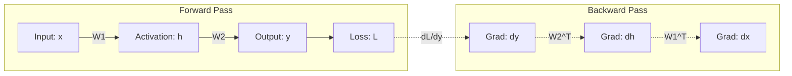

# Appendix C: Algorithm Foundations

## Material Covered in This Chapter

- Purpose
- How to Use This Appendix
- C.1 Linear Algebra
- Systems Perspective 19.1: Why this matters
- C.1.1 Tensor operations and notation
- C.1.2 Memory layouts and performance
- C.1.4 General matrix multiply (GEMM) GEMM 2 is the computational workhorse of deep learning. For matrices of size 𝑀×𝐾
and 𝐾×𝑁, GEMMperforms 2𝑀𝑁𝐾 floating-point operations (multiply-accumulate counts as two operations). The arithmetic
intensity of GEMM scales linearly with matrix dimension. For square 𝑛×𝑛 matrices in FP16 (2 bytes/element): Intensity =
Ops Bytes = 2𝑛 3 3𝑛 2 ×2 = 𝑛 3 FLOP/byte This explains several important phenomena:
- C.1.5 Sparse matrix formats
- C.2 Tensor Programming Primitives
- C.2.1 Computational complexity cheat sheet
- C.2.2 Shapes and strides
- C.2.3 Broadcasting
- C.3 Mechanics of Learning
- Systems Perspective 19.3: Why this matters
- C.3.3 The true cost of training memory
- Checkpoint 19.1: Training memory estimation
- C.3.4 Computational graphs and optimization
- C.3.4.1 Static single assignment
- C.3.4.2 Operator fusion
- C.4 Fallacies and Pitfalls
- Summary

---

## Section-by-Section Preserve-and-Extend

# Appendix C: Algorithm Foundations

## Purpose & Systems Perspective
Deep learning models are, at their core, engines for transforming massive matrices. Performance profiles of modern
networks are often determined not just by the hardware specifications, but by the mathematical and structural design of
the algorithms themselves. This appendix documents the linear algebra, tensor primitives, learning mechanics, and
computational graph structures that govern ML system performance.

It serves as a systems engineering reference to diagnose:
1. **GEMM Efficiency Bottlenecks**: Relates shape layout, size, and arithmetic intensity to hardware constraints (e.g.,
Roofline ridge points).
2. **OutOfMemory (OOM) Errors**: Decomposes training memory into weights, gradients, optimizer states, and activations.
3. **Execution Latency Stalls**: Traces non-contiguous strides and incorrect broadcasting.
4. **Computational Efficiency**: Analyzes operator fusion and sparsity overheads.

---

## C.1 Linear Algebra Foundations

### C.1.1 Tensor Operations & Einstein Summation Notation
Multi-dimensional array transformations are represented concisely via Einstein Summation (`einsum`) notation, which
implicitly sums over repeated indices. It avoids explicit summation signs and makes index contractions clear.

In classical math:
\[ C_{ij} = \sum_{k} A_{ik} B_{kj} \]

In `einsum` notation:
```python
# Matrix Multiplication (C = AB)
C = torch.einsum('ik,kj->ij', A, B)
```

This generalizes to multi-dimensional tensors like batched multi-head attention:
```python
# Batched multi-head attention: (batch, head, seq_q, dim) x (batch, head, seq_k, dim)
scores = torch.einsum('bhid,bhjd->bhij', Q, K)
```

### C.1.2 Memory Layouts and Performance
Data is stored linearly in memory. How logical multidimensional indices map to physical addresses determines cache
locality:
* **Row-Major (C-contiguous)**: Successive elements in a row are contiguous.
* **Column-Major (Fortran-contiguous)**: Successive elements in a column are contiguous.

When a GPU or CPU reads data, it fetches cache lines (typically 64 or 128 bytes). Accessing contiguous elements achieves
spatial cache locality and coalesces memory transactions. Strided, non-contiguous access can degrade memory bandwidth
utilization by **10× to 100×**.
* **Optimization Pattern**: Transpose tensors once before hot loops containing repeated operations to establish
contiguous memory layouts, amortizing the \( O(N) \) transposition cost.

### C.1.3 The Dot Product as Similarity
The dot product represents similarity geometrically:
\[ \mathbf{a} \cdot \mathbf{b} = \|\mathbf{a}\| \|\mathbf{b}\| \cos\theta \]
* **Positive**: Tensors align (point in similar directions).
* **Zero**: Orthogonal (unrelated).
* **Negative**: Oppose each other.

In Attention mechanisms, this forms the foundation:
1. **Query (\(Q\)) & Key (\(K\)) Similarity**: Computes similarity weights via dot products: \( S = Q K^T \).
2. **Value (\(V\)) Aggregation**: Weighted combination based on these similarity weights.

### C.1.4 General Matrix Multiply (GEMM)
GEMM computes the core operation:
\[ C = \alpha A B + \beta C \]

For an \( M \times K \) matrix \( A \) and \( K \times N \) matrix \( B \), GEMM performs:
\[ \text{Compute} = 2MNK \text{ FLOPs} \]
*(Every multiply-accumulate counts as two operations: one multiply and one add).*

For square \( n \times n \) matrices using 16-bit floating-point precision (FP16/BF16, 2 bytes/element), the inputs \(
A, B \) and output \( C \) take \( 3n^2 \) elements or \( 3n^2 \times 2 = 6n^2 \) bytes.
\[ \text{Arithmetic Intensity} = \frac{\text{Ops}}{\text{Memory Traffic}} = \frac{2n^3}{6n^2} = \frac{n}{3} \text{ FLOP/byte} \]

#### Systems Implications:
* **Larger Batches Improve Efficiency**: Scaling the batch size increases \( M \) (and thus \( n \)), raising the
arithmetic intensity and pushing execution from the memory-bandwidth-bound zone to the compute-bound zone of the
Roofline model.
* **Aligned Dimensions**: Hardware units like NVIDIA Tensor Cores process matrices in structural tiles (e.g., \( 8
\times 8 \times 16 \) or \( 16 \times 16 \times 16 \)). Non-aligned dimensions trigger implicit padding, which wastes
compute cycles.
* **Small Matrices are Inefficient**: A square GEMM with \( n=64 \) has an arithmetic intensity of \( \frac{64}{3}
\approx 21.33 \) FLOP/byte. If the hardware's ridge point is 153 FLOP/byte, this GEMM only achieves roughly **13%** of
the device's peak compute capacity.

### C.1.5 Sparse Matrix Formats
When a matrix is dominated by zeros, compressed storage formats bypass storage and compute overhead. The **Compressed
Sparse Row (CSR)** format represents a sparse matrix using three one-dimensional arrays:
1. **`Values`**: Contains all non-zero entries of the matrix stored in row-by-row order.
2. **`Col_Idx`**: Stores the column index of each corresponding value in `Values`.
3. **`Row_Ptr`**: Stores the starting indices in `Values` for the elements of each row. Its size is \( \text{num\_rows}
+ 1 \), where the last element is the total number of non-zero elements (\( K \)).

For a matrix with \( N \) total logical elements, \( R \) rows, and \( K \) non-zero elements, the memory storage drops
from \( O(N) \) to \( O(K + R) \).

#### The Sparsity Memory Trade-off:
Consider a vocabulary embedding matrix of size \( 100,000 \times 10,000 \) (1 billion parameters):
* **Dense Representation (FP32)**:
  \[ 1 \times 10^9 \text{ parameters} \times 4 \text{ bytes/parameter} = 4\text{ GB} \]
* **Sparse CSR Representation (1% density / 99% sparse)**:
  There are \( K = 10 \times 10^6 \) non-zero elements.
  - `Values` (FP32): \( 10 \times 10^6 \times 4 \text{ bytes} = 40 \text{ MB} \)
  - `Col_Idx` (INT32): \( 10 \times 10^6 \times 4 \text{ bytes} = 40 \text{ MB} \)
  - `Row_Ptr` (INT32): \( 100,001 \times 4 \text{ bytes} \approx 0.4 \text{ MB} \)
  - **Total**: \( \approx 80.4 \text{ MB} \) (a **50×** footprint reduction).

---

## C.2 Tensor Programming Primitives

### C.2.1 Deep Learning Tensor Primitives Reference
Table C.1 specifies the output shapes, parameter counts, and FLOP operations for standard deep learning layers.

#### Table C.1: Deep Learning Tensor Primitives

| Layer Type | Output Shape | Parameters (\(P\)) | FLOPs (per Forward Pass) |
| :--- | :--- | :--- | :--- |
| **Linear** | \( (B, d_{\text{out}}) \) or \( (B, S, d_{\text{out}}) \) | \( d_{\text{in}} \times d_{\text{out}} \) | \( 2 \times B \times d_{\text{in}} \times d_{\text{out}} \) or \( 2 \times B \times S \times d_{\text{in}} \times d_{\text{out}} \) |
| **Conv2D** | \( (B, C_{\text{out}}, H', W') \) | \( K^2 \times C_{\text{in}} \times C_{\text{out}} + C_{\text{out}} \) *(with bias)* | \( 2 \times B \times H' \times W' \times K^2 \times C_{\text{in}} \times C_{\text{out}} \) |
| **Attention (Single Head)** | \( (B, S, d) \) | \( 4d^2 \) *(Q, K, V and Output projections)* | \( B \times (4S^2d + 8Sd^2) \) |
| **LayerNorm** | \( (B, S, d) \) | \( 2d \) *(gamma & beta weights)* | \( O(B \times S \times d) \) |

*Note: \(B\) represents batch size, \(S\) is sequence length, \(K\) is kernel spatial dimension, and \(d\) is model
hidden dimension. In Attention, the \( S^2 \) term dominates the compute workload for long sequence lengths, explaining
the computational bottleneck in long-context LLM inference.*

### C.2.2 Shapes and Strides
A tensor in modern frameworks is a logical view mapping to an underlying flat memory block (storage buffer). This
mapping is defined by a metadata header containing:
1. **Shape**: The logical dimensions of the tensor (e.g., `(3, 4)`).
2. **Strides**: The number of elements to skip in the physical buffer to advance by one unit along a specific dimension.
3. **Data Type (`dtype`)**: The byte size per element.
4. **Storage Offset**: The index of the first element of the tensor in the storage buffer.

```
Logical Tensor (3, 4):
[[ 0,  1,  2,  3],
 [ 4,  5,  6,  7],
 [ 8,  9, 10, 11]]

Contiguous Physical Buffer (Row-Major):
[ 0, 1, 2, 3, 4, 5, 6, 7, 8, 9, 10, 11 ]
Shape: (3, 4)
Strides: (4, 1)  -> (To go to next row, skip 4 elements. To go to next col, skip 1 element).
```

* **Strided Manipulation (\( O(1) \) Metadata Operations)**:
  Operations like `.transpose()`, `.view()`, and `.split()` do not copy the underlying data in memory. They simply
update the strides and shape metadata. For instance, transposing a `(3, 4)` tensor changes its strides from `(4, 1)` to
`(1, 4)`.
* **The Contiguity Penalty**:
  Many low-level CUDA kernels (like CUTLASS/cuBLAS GEMM) assume input tensors are contiguous in memory to enable
vectorized loads. When a tensor is non-contiguous, frameworks are forced to copy it to a new contiguous memory space.
Calling `.contiguous()` is an \( O(N) \) memory-copy operation that can bottleneck performance when executed repeatedly
in training loops.

### C.2.3 Broadcasting Rules
Broadcasting allows operations between tensors of mismatched shapes. The shapes are matched element-wise starting from
the rightmost (last) dimension and moving left:
Two dimensions are compatible if:
1. **They are equal.**
2. **One of them is 1.**

When a dimension is 1, it is virtually expanded to match the larger size. This expansion is performed by setting the
stride along that dimension to **0**. The hardware reads the same memory location repeatedly, leading to \( O(1) \)
memory overhead.

#### Example:
Tensor \( A \) shape: `(32, 1, 64)`
Tensor \( B \) shape: `(1, 128, 64)`
1. Dimension 3 (rightmost): Both are 64 (compatible).
2. Dimension 2: Tensor \( A \) has 1, so it virtualizes to match 128 (compatible).
3. Dimension 1 (leftmost): Tensor \( B \) has 1, so it virtualizes to match 32 (compatible).
Result shape: `(32, 128, 64)`.

---

## C.3 Mechanics of Learning

### C.3.1 Chain Rule and Automatic Differentiation
For a nested function \( y = f(g(x)) \), the derivative is:
\[ \frac{dy}{dx} = \frac{dy}{dg} \cdot \frac{dg}{dx} \]

For a deep network of \( L \) layers where \( y = f_L(f_{L-1}(\dots(f_1(x)))) \):
\[ \frac{dy}{dx} = \frac{dy}{df_L} \cdot \frac{df_L}{df_{L-1}} \cdot \dots \cdot \frac{df_2}{df_1} \cdot \frac{df_1}{dx} \]

Automatic differentiation splits the graph into local nodes:
* Each layer computes its local gradient (\( \frac{\partial \text{output}}{\partial \text{input}} \) and \(
\frac{\partial \text{output}}{\partial \text{parameters}} \)) using only its local inputs and outputs.
* **Reverse-Mode Auto-Diff**: Starts from the loss scalar and propagates gradients backward. This computes the gradients
of the loss with respect to all \( N \) parameters in a **single backward pass**, regardless of the size of \( N \).
(Forward-mode would require \( N \) forward passes, one for each parameter).
* Reverse-mode auto-diff bounds the backpropagation compute cost to a small constant multiple of the forward pass,
typically **\( 2 \times \text{ to } 3 \times \)** the forward FLOPS.

### C.3.2 The Backpropagation Algorithm
The computational graph of a two-layer neural network details the interplay of forward and backward passes:



#### Step-by-Step Computational Steps:
1. **Forward Pass**:
   - Compute \( h = x \cdot W_1 \). Cache \( h \).
   - Compute \( y = h \cdot W_2 \). Cache \( y \).
   - Compute Loss \( \mathcal{L} = \text{Loss}(y, \text{target}) \).
2. **Backward Pass**:
   - Compute gradient at output: \( \frac{\partial \mathcal{L}}{\partial y} \).
   - Apply chain rule for the second layer parameters and inputs:
     \[ \frac{\partial \mathcal{L}}{\partial W_2} = h^T \cdot \frac{\partial \mathcal{L}}{\partial y} \]
     \[ \frac{\partial \mathcal{L}}{\partial h} = \frac{\partial \mathcal{L}}{\partial y} \cdot W_2^T \]
     *(Note: Computing the weight gradient \( \frac{\partial \mathcal{L}}{\partial W_2} \) requires the cached
activation \( h \)).*
   - Propagate to the first layer:
     \[ \frac{\partial \mathcal{L}}{\partial W_1} = x^T \cdot \frac{\partial \mathcal{L}}{\partial h} \]
     \[ \frac{\partial \mathcal{L}}{\partial x} = \frac{\partial \mathcal{L}}{\partial h} \cdot W_1^T \]

The backward pass requires **twice the compute** of the forward pass: at each layer, the backward pass runs two GEMM
operations (one to compute the gradient of the input, and one to compute the gradient of the weight parameters) whereas
the forward pass runs only one.

### C.3.3 The True Cost of Training Memory
A major pitfall in systems design is assuming training memory equals the model's weight size. Training memory is
decomposed as:
\[ M_{\text{total}} = M_{\text{weights}} + M_{\text{gradients}} + M_{\text{optimizer}} + M_{\text{activations}} \]

For standard **Adam optimizer in mixed-precision (FP16/BF16 training)**:
1. **Weights (\(M_{\text{weights}}\))**: 2 bytes per parameter (stored in FP16/BF16).
2. **Gradients (\(M_{\text{gradients}}\))**: 2 bytes per parameter (stored in FP16/BF16).
3. **Optimizer States (\(M_{\text{optimizer}}\))**: 12 bytes per parameter:
   - FP32 Master Weights (4 bytes)
   - FP32 First Momentum (4 bytes)
   - FP32 Second Moment Variance (4 bytes)
4. **Activations (\(M_{\text{activations}}\))**: Activations scale with sequence length, batch size, and network depth:
\( O(B \times S \times L \times d) \).

#### Napkin Math 19.1: GPT-2 (1.5B) Training Memory
* **Model Configuration**: \( P = 1.5 \times 10^9 \) parameters, \( L = 48 \) layers, hidden dimension \( d = 1600 \).
* **Model State Memory (Static)**:
  - Weights: \( 1.5\text{B} \times 2\text{ bytes} = 3.0\text{ GB} \)
  - Gradients: \( 1.5\text{B} \times 2\text{ bytes} = 3.0\text{ GB} \)
  - Optimizer state: \( 1.5\text{B} \times 12\text{ bytes} = 18.0\text{ GB} \)
  - **Total Static State**: \( 24.0\text{ GB} \). (Fits on one 80 GB accelerator, leaving 56 GB for activations).
* **Activation Memory (Dynamic)**:
  For a transformer model, the retained activations per layer are approximately \( 12 \times B \times S \times d \) BF16
elements (\( 12 \times B \times S \times d \times 2 \) bytes), which accounts for input activations, QKV projections (\(
3d \)), attention output, FFN intermediate (\( 4d \)), LayerNorm parameters, and dropout masks.
  - For batch size \( B = 8 \), sequence length \( S = 1024 \):
    \[ 48 \text{ layers} \times 12 \times 8 \times 1024 \times 1600 \times 2 \text{ bytes} \approx 15.1 \text{ GB} \]
    *Total Memory*: \( 24\text{ GB} + 15.1\text{ GB} = 39.1\text{ GB} \) (Fits).
  - For batch size \( B = 64 \), sequence length \( S = 1024 \):
    \[ 48 \text{ layers} \times 12 \times 64 \times 1024 \times 1600 \times 2 \text{ bytes} \approx 120.8 \text{ GB} \]
    *Total Memory*: \( 24\text{ GB} + 120.8\text{ GB} = 144.8\text{ GB} \) (Triggers OOM).

#### Memory Mitigation:
* **Gradient Checkpointing**: Reduces activation memory footprint from \( O(L) \) to \( O(\sqrt{L}) \). It keeps only a
subset of activations (checkpoints) and recomputes the remaining ones on-the-fly during the backward pass. This trades a
**~33% increase in compute** for a massive reduction in activation memory.

---

### C.3.4 Computational Graphs & Optimization
Modern ML compilers transform program code into Directed Acyclic Graphs (DAGs) representing dataflows, which allows for
hardware-independent optimizations.

#### C.3.4.1 Static Single Assignment (SSA)
Compilers convert dataflow graphs to SSA form, where every variable is assigned exactly once. This explicitly registers
data dependencies, which lets the compiler safely run optimizations like **operator fusion**.

#### C.3.4.2 Operator Fusion
Without compiler fusion, a chain of consecutive operations (e.g., \( \text{MatMul} \to \text{Bias Add} \to \text{ReLU}
\)) writes intermediate results to High Bandwidth Memory (HBM) and reads them back for the next kernel:
* Elementwise operations (Add, ReLU) have low arithmetic intensity (\( \text{FLOP/byte} \to 0 \)) and are heavily
memory-bound.
* **Fusion** combines these into a single execution block. The hardware reads the input from HBM once, performs all
intermediate additions and activations in registers or shared memory (SRAM), and writes the final result back to HBM
once.
* For a chain of \( k \) elementwise operations on a tensor of size \( N \) bytes, operator fusion reduces memory
bandwidth traffic from \( 2kN \) bytes to \( 2N \) bytes (a **\( k\times \)** memory traffic reduction).

#### FlashAttention: The Ultimate Fusion Optimization
FlashAttention fuses the entire attention calculation (Q, K, V matrix multiplies, Softmax scaling, masking, dropout, and
projection) into structured GPU kernels.
* Operates on block tiles within SRAM instead of writing the intermediate \( S \times S \) attention score matrix to
HBM.
* Reduces attention memory footprint from \( O(S^2) \) to \( O(S) \).
* Yields **2–4× wall-clock speedups** solely by eliminating HBM memory round-trips.

---

## C.4 Fallacies and Pitfalls

### Pitfall: Assuming Sparse Matrices Always Save Memory
Sparse representation formats (like CSR or COO) store non-zero values alongside structural indexing arrays (metadata).
* **Metadata Overhead**: If a matrix is dense or moderately sparse (e.g., 50% sparse), the memory needed to store index
arrays (`Col_Idx`, `Row_Ptr`) can exceed the memory saved by skipping zero values.
* **Systems Rule of Thumb**: Sparsity must generally exceed **90% to 95%** to show net performance or memory gains on
standard dense processors. Custom structured hardware (e.g., NVIDIA's 2:4 structured sparsity) bypasses this by
implementing hardware bitmasks.

### Fallacy: Training Memory Equals Model Size
Training memory is dominated by gradients, optimizer states, and cached activations. For mixed-precision Adam, the
non-activation footprint is **12–16 bytes per parameter** (6–8× larger than the 2-byte weight footprint). When
activations are included, the total memory can be **10–50×** larger than the model weights.

### Pitfall: Ignoring Tensor Layout When Optimizing Performance
GEMM execution throughput depends heavily on memory alignment and tensor contiguity. A non-contiguous tensor layout that
violates hardware alignment tiles can drop performance from **80% of peak to 5% of peak**, due to the overhead of
element-wise memory fetches and silent `.contiguous()` allocation copies.

---

## Key Algorithmic Invariants

1. **GEMM Scaling Invariant**: Square matrix multiplications of size \( n \times n \) have an arithmetic intensity of \(
\frac{n}{3} \) FLOP/byte. Small dimensions are always memory-bound.
2. **Backpropagation Scaling**: Backward passes cost \( 2\times \) the compute of forward passes in FLOPs, but require
caching activations which scales as \( O(B \cdot S \cdot L \cdot d) \).
3. **Sparse Layout Transition Point**: CSR storage formats yield memory savings over dense representations only when
matrix density falls below \( \approx 5\% - 10\% \).
4. **Operator Fusion Efficiency**: Fusing \( k \) element-wise operations reduces memory transfers by a factor of \( k
\).

---

## Full Slice Content (Docling Extract, Preserved Verbatim)

> Each section below preserves the source slice content as extracted by docling. Image placeholders are removed; tables,
equations, code blocks, named artifacts, and footnotes are kept intact.

## Purpose

What algorithmic building blocks determine both what neural networks compute and how efficiently systems can run them?

This appendix collects the compact linear algebra and learning mechanics you need for ML systems work. It focuses on the
pieces that show up repeatedly in profiling traces and back-of-the-envelope estimates: general matrix multiply (GEMM)
intensity, tensor shapes and strides, sparse storage overheads, and the true components of training memory.

Many performance problems that look 'hardware-bound' are actually rooted in the algorithm's structure: a model may be
dominated by matrix multiplies, but its shapes, layouts, and sparsity patterns decide whether those multiplies hit fast
Tensor Cores or fall back to slow kernels. Likewise, training instabilities often trace back to the mechanics of
differentiation and the memory footprint of activations.

## How to Use This Appendix

This appendix is designed as a reference. Reach for it when translating a profiler symptom ('slow matmul,' 'shape
mismatch,' 'OOM during training') into a concrete computational or memory cause. Conventions used here follow the
book-wide notation (for example, we reserve 𝐵 for batch size and use BW for bandwidth).

- When GEMMs are slow: Use Section C.1.4 and compare intensity to the hardware's ridge point.
- Whenmemoryblowsupintraining: Use Section C.3 and the training memory decomposition.
- When tensor code 'should work' but does not: Use Section C.2.2 and Section C.2.3.
- When sparsity is proposed as a fix: Use Section C.1.5 to check density and metadata overhead.

This appendix covers the mathematical and computational machinery that powers neural networks. From the linear algebra
at the heart of every layer to the backpropagation algorithm that enables learning, these foundations explain how models
compute and why certain implementation choices affect performance. The concepts here support the deep learning
foundations in Chapter 5, the framework internals in Chapter 7, and the training strategies in Chapter 8.

## C.1 Linear Algebra

D eep learning systems are, at their core, engines for transforming massive matrices. While frameworks like PyTorch
abstract away the raw math, understanding the underlying linear algebra is essential for performance engineering. Now
that we know how numbers are stored (from Appendix D), we must understand how they are manipulated.

1 Einstein Summation Convention: Introduced by Albert Einstein in 1916 to simplify the notation of general relativity.
The convention states that repeated indices in a product are implicitly summed over, eliminating explicit summation
signs. MLframeworks adopted it because it concisely expresses arbitrary tensor contractions in a single string.

2 General Matrix Multiply (GEMM) : The name comes from the BLAS (Basic Linear Algebra Subprograms) library
specification, first standardized in 1979. The 'GE' prefix stands for 'general' (as opposed to symmetric, triangular, or
banded matrices). GEMM computes 𝐶 = 𝛼𝐴𝐵 + 𝛽𝐶 and is the single most performance-critical routine in deep learning. See
Chapter 8 for how GEMM shapes determine training throughput.

## Systems Perspective 19.1: Why this matters

Many modern dense neural networks, especially transformers and large CNNs, spend much of their compute time in matrix
multiplication or GEMM-like kernels. A single forward pass through a transformer layer executes four large GEMMs (for
the Q, K, V projections and the output projection) plus the attention score computation-all matrix multiplies.
Understanding GEMMperformance characteristics explains why batch size affects throughput, why certain layer dimensions
are 'better' than others, and how to interpret profiler output. Reasoning about matrix dimensions and arithmetic
intensity predicts whether a dense workload is compute bound or memory-bound before any profiler trace runs.

## C.1.1 Tensor operations and notation

We use Einstein summation 1 notation throughout this book because it makes complex operations explicit (implemented as
torch.einsum in PyTorch and np.einsum in NumPy). Matrix multiplication 𝐶 = 𝐴𝐵 becomes: 𝐶 𝑖𝑗 =∑ 𝑘 𝐴 𝑖𝑘 𝐵 𝑘𝑗

Or in einsum notation: ik,kj->ij . This notation extends naturally to the multi-dimensional operations in attention
mechanisms. For example, batched multi-head attention is bhid,bhjd->bhij (batch, head, sequence indices).

## C.1.2 Memory layouts and performance

Data layout in memory (row-major vs. column-major) directly affects cache efficiency. When iterating over a matrix,
accessing contiguous memory locations is dramatically faster than strided access. The difference can be 10 × to 100 × in
effective bandwidth. Acommon optimization pattern: transpose tensors once before repeated operations to ensure
contiguous access in the hot loop. The one-time transpose cost is amortized across many subsequent operations.

C.1.3 The dot product as similarity The dot product a ⋅ b =∑𝑎 𝑖 𝑏 𝑖 is geometrically equivalent to | a || b | cos 𝜃,
which makes it a natural measure of similarity between two vectors: a large positive result means they point in the same
direction, zero means they are orthogonal (unrelated), and a negative result means they oppose each other.

## C.1.4 General matrix multiply (GEMM) GEMM 2 is the computational workhorse of deep learning. For matrices of size 𝑀×𝐾 and 𝐾×𝑁, GEMMperforms 2𝑀𝑁𝐾 floating-point operations (multiply-accumulate counts as two operations). The arithmetic intensity of GEMM scales linearly with matrix dimension. For square 𝑛×𝑛 matrices in FP16 (2 bytes/element): Intensity = Ops Bytes = 2𝑛 3 3𝑛 2 ×2 = 𝑛 3 FLOP/byte This explains several important phenomena:

This geometric interpretation is why dot products appear everywhere in modern architectures. In attention mechanisms,
query ( 𝑄 ) and key ( 𝐾 ) vectors are dot-produced to compute a similarity score that determines how much each token
attends to every other token. The resulting attention weights are then used to form a weighted combination of value ( 𝑉
) vectors-making the dot product the foundation of the transformer's ability to model long-range dependencies.

- Larger batches improve efficiency: Batching increases the effective matrix dimensions, pushing workloads toward the
compute-bound region of the roofline.
- Aligneddimensionshelp: Hardwaretensorcoresareoptimizedforprecision- and architecturespecific tile multiples.
Dimensions that align with these multiples avoid padding overhead and improve kernel efficiency, but they do not need to
be powers of two.

- Small matrices are inefficient: AsquareGEMMwith 𝑛= 64 has intensity 64/3 ≈ 21 FLOP/byte, well below the ridge point
(153), achieving only ~13 percent of peak throughput.

## C.1.5 Sparse matrix formats

When most elements in a matrix are zero, specialized storage formats avoid wasting memory on zeros and enable
computations that skip them entirely.

The Compressed Sparse Row (CSR) format uses three arrays:

- Values: The nonzero elements, stored in row order
- Col\_Idx: The column index of each nonzero element
- Row\_Ptr: The starting position in Values for each row (length = num\_rows + 1)

To see the trade-off concretely, consider a vocabulary embedding matrix with 100,000 rows and 10,000 columns (1 billion
parameters): · Dense (FP32) : 1 ×10 9 × 4 bytes = 4 GB . · Sparse (1 percent density) : Storing only nonzeros requires
roughly 10 ×10 6 × (4 bytes value + 4 bytes index) ≈ 80 MB .

CSR is essential for recommendation systems (sparse embedding tables) and pruned models. For a matrix with 𝑁 elements, 𝑅
rows, and 𝐾 nonzeros, CSR uses 𝑂(𝐾+𝑅) storage instead of 𝑂(𝑁) ; when 𝐾 is large relative to 𝑅, this is often summarized
as 𝑂(𝐾) .

- Result: A50 × reduction in memory footprint, fitting a model that would otherwise OOM (Out of Memory).

Linear algebra tells us what to compute; the next question is how to express those computations in code. Tensor
programming primitives-shapes, strides, and broadcasting-bridge the gap between mathematical notation and the array
operations that actually execute on hardware.

## C.2 Tensor Programming Primitives

Ashape mismatch crash, a silently wrong broadcast, a kernel running at 5 percent of peak because of a noncontiguous
tensor-these common ML engineering failures all trace back to the same layer of abstraction. Tensor programming
translates the abstract math of linear algebra into concrete array manipulations that run on hardware.

Systems Perspective 19.2: Why this matters

The logic may be correct, yet the code crashes with a shape mismatch error-or worse, runs and produces garbage because
dimensions were broadcasted incorrectly. Mastering tensor shapes, strides, and broadcasting is the literacy of ML
engineering.

## C.2.1 Computational complexity cheat sheet

Table C.1 provides a quantitative reference for the most common building blocks. Use these formulas for napkin-math
estimation of model size and compute requirements before hardware is provisioned. Given the layer type and input shape,
the formulas predict whether a model will fit in memory.

Table C.1: Deep Learning Tensor Primitives: Summary of shapes, parameters, and FLOP counts. Note: 𝐵 is batch size, 𝑆 is
sequence length, 𝐾 is kernel size. The Attention FLOPs include QKV projections and the 𝑆 2 attention matrix
interactions. The 𝑆 2 term dominates for long sequences (explaining why LLM inference slows with context length); the 𝑑
2 term dominates for large hidden dimensions. Layer Type 𝑃 Linear

| Layer Type              | Output Shape                | Parameters ( )                                      | FLOPs (per Forward Pass)                |
|-------------------------|-----------------------------|-----------------------------------------------------|-----------------------------------------|
| Linear                  | out                         | in out                                              | in out                                  |
| Conv2D                  | (𝐵,𝑁 ) (𝐵,𝐶 out,𝐻 ′ ,𝑊 ′ ) | (𝑁 +1)×𝑁 𝐾 2 ×𝐶 in ×𝐶 out +𝐶 out if bias is enabled | 2×𝐵×𝑁 ×𝑁 2×𝐵×𝐻 ′ ×𝑊 ′ ×𝐾 2 ×𝐶 in ×𝐶 out |
| Attention (Single Head) | model                       | model                                               | model model                             |

(𝐵,𝑆,𝑑

)

4×𝑑

2

𝐵×(4𝑆

2

𝑑

+8𝑆𝑑

2

)

(𝐵,𝑆,𝑑

)

2×𝑑

𝑂(𝐵×𝑆×𝑑

)

| Layer Type   | Output Shape   | Parameters ( )   | FLOPs (per Forward Pass)   |
|--------------|----------------|------------------|----------------------------|
| LayerNorm    | model          | model            | model                      |

## C.2.2 Shapes and strides

Atensor is a view over an underlying storage buffer, described by shape, stride, dtype, and offset metadata. Only
contiguous tensors lay their logical elements out as one adjacent block.

- Shape: The dimensions of the tensor (for example, (3, 4) ).
- Stride: The number of elements to skip in memory to move to the next element in a dimension.

Operations like transpose() or view() often just change the strides, not the data in memory. This is fast ( 𝑂(1) ) but
can lead to noncontiguous tensors that fail in optimized kernels. When a kernel requires contiguous data-and most
optimized BLAS routines do-calling contiguous() forces a memory copy to realign data, which is an 𝑂(𝑁) operation that
can dominate runtime if triggered repeatedly inside a loop.

## C.2.3 Broadcasting

Broadcasting allows arithmetic operations on tensors of different shapes. The rule is: compare dimensions from the last
to the first. Two dimensions are compatible if:

1. They are equal.
2. One of them is 1.

The dimension with size one is 'stretched' to match the other, as illustrated in Figure C.1. This stretching is virtual:
the data is not copied in memory. Instead, the stride for that dimension is set to 0, allowing the hardware to read the
same value repeatedly with 𝑂(1) memory overhead.

Dashed cells are virtually expanded via stride=0 (no memory allocation)

Figure C.1: Tensor Broadcasting Rules: Visualization of how tensors (3,1) and (1,4) expand to a shared (3,4) result.
This stretching is a virtual operation that modifies strides without allocating new memory.

Consider a concrete case: tensor A has shape (32, 1, 64) and tensor B has shape (1, 128, 64) . Comparing dimensions
right to left, sixty-four matches sixty-four, then one stretches to 128, then one stretches to thirty-two, yielding
result shape (32, 128, 64) . Visualizing this expansion prevents silent logic bugs that accidentally allocate a large
tensor (for example, a (Batch, Batch) matrix instead of an element-wise (Batch,) vector).

Shapes, strides, and broadcasting govern how tensors flow through a model's forward pass. However, training a model
requires more than forward computation-it requires learning from errors . The next section examines the algorithm that
makes learning possible: backpropagation, along with the memory costs it imposes.

## C.3 Mechanics of Learning

With valid tensor programs, we can construct the training loops that power learning. Backpropagation is the algorithm
that orchestrates these tensors to compute gradients, transforming a forward prediction into a backward learning signal.

𝑃

## Systems Perspective 19.3: Why this matters

Whentraining fails-loss goes to NaN, gradients explode, or memory runs out-understanding what backpropagation actually
does is essential for diagnosing the problem. This section provides the mental model for reasoning about gradient flow
and memory usage during training.

C.3.1 The chain rule and automatic differentiation For a composed function 𝑦 = 𝑓(𝑔(𝑥)) , the derivative is 𝑑𝑦 𝑑𝑥 = 𝑑𝑦 𝑑𝑔
⋅ 𝑑𝑔 𝑑𝑥 . In a neural network, 𝑓 and 𝑔 are layers, and the composition can be many levels deep. For a three-layer
network 𝑦 = 𝑓 3 (𝑓 2 (𝑓 1 (𝑥))) , the chain rule extends to:

Each factor in this product is a local derivative-computed at one layer using only that layer's inputs and outputs. This
locality is what makes the algorithm tractable: the entire network never needs to be differentiated as a monolithic
function. Instead, each layer computes its own local derivative during the backward pass and multiplies it by the
gradient flowing in from the layer above.

<!-- formula-not-decoded -->

Modern frameworks use reverse-mode automatic differentiation, which computes gradients for all 𝑁 parameters in a single
backward pass. The key insight is that starting from the output and working backward (reverse mode) requires one pass
regardless of the number of parameters, whereas starting from each input and working forward (forward mode) would
require 𝑁 passesone per parameter. This is why a training step is a small constant multiple of inference, commonly about
2-3 × a forward pass for dense networks, rather than 𝑁 passes. C.3.2 The backpropagation algorithm

Backpropagation 3 implements the chain rule efficiently through two passes: forward to compute outputs, backward to
compute gradients. Figure C.2 illustrates this process for a simple two-layer network, with the forward pass (black
arrows) computing outputs and the backward pass (red dashed arrows) propagating gradients.

Figure C.2: Backpropagation Computational Graph: Atwo-layer network showing the forward pass (black arrows) and backward
pass (red dashed arrows). Each node caches values during the forward pass that are reused during the backward pass.

The diagram lays out a simple two-layer network with both passes annotated: a roadmap for tracing through each step
below.

At this point, the loss has been computed and memory contains the input 𝑥, the cached activation ℎ, the cached output 𝑦,
and the loss ℒ . For a large model, these cached activations dominate memory usage.

Forward pass Start at 𝑥, the input. Multiply by 𝑊 1 to get hidden activation ℎ . Cache ℎ because the backward pass will
need it later. Multiply ℎ by 𝑊 2 to get output 𝑦 . Cache 𝑦 . Compare 𝑦 to the target label to compute loss ℒ .

3 Backpropagation: Short for 'backward propagation of errors.' The algorithm was independently discovered multiple
times-by Linnainmaa (1970) for automatic differentiation and by Rumelhart et al. (1986) for neural network training. Its
key insight is that computing gradients for all parameters requires only one backward pass through the graph, making
training cost roughly 2-3 × inference rather than 𝑁× (once per parameter).

Backward pass Now trace backward from ℒ . The loss function provides 𝜕ℒ 𝜕𝑦, the gradient of loss with respect to the
prediction. This is where the error signal enters the network. Since 𝑦 = ℎ⋅𝑊 2, the chain rule gives us two gradients at
this layer:

Notice that computing 𝜕ℒ 𝜕𝑊 2 requires the cached activation ℎ from the forward pass. This is the fundamental reason
activations must be stored: every layer's weight gradient depends on that layer's input. Now continue backward to the
first layer. Since ℎ = 𝑥⋅𝑊 1, the same pattern gives:

<!-- formula-not-decoded -->

<!-- formula-not-decoded -->

<!-- formula-not-decoded -->

Eachstep backward requires two things: the gradient flowing in from above ( 𝜕ℒ 𝜕ℎ ) and the activation cached during the
forward pass ( 𝑥 ). This is why the backward pass costs roughly 2 × the forward pass in compute: at each layer, it
performs two matrix multiplications (one for the weight gradient, one for the input gradient) vs. one in the forward
pass.

## C.3.3 The true cost of training memory

Acommon mistake is to assume that training memory equals model size. This assumption leads to immediate OOM errors
because it ignores three other components that often dwarf the weights themselves. The actual memory footprint of
training is: 𝑀 total =𝑀 weights +𝑀 gradients +𝑀 optimizer +𝑀 activations For a standard Adaptive Moment Estimation
(Adam) optimizer in Mixed Precision: · Weights: 2 bytes (FP16/BF16) or 4 bytes (FP32).

- Gradients: Same size as weights.
- Optimizer State: 8-12 bytes per parameter (Momentum + Variance + FP32 Master Weights).
- Activations: The hidden giant. Batch Sequence Layers Width .

To see how these components interact in practice, consider a concrete model.

𝑂(

×

×

×

)

- Napkin Math 19.1: Worked example: GPT-2 (1.5B) training memory The model: GPT-2 XL has 𝑃 = 1.5×10 9 parameters, 48
layers, hidden dimension 𝑑 = 1600. Model state (fixed per step) : · Weights (BF16): 1.5×10 9 × 2 bytes = 3.0 GB ·
Gradients (BF16): 1.5×10 9 × 2 bytes = 3.0 GB · Optimizer (FP32 master + momentum + variance): 1.5×10 9 × 12 bytes =
18.0 GB · Total model state: 24 GB -fits on an A100/H100 (80 GB), but leaves only 56 GB for activations.

Activations (scale with batch) : Per-layer retained activations for a transformer are approximately 12×𝐵×𝑆×𝑑 BF16
elements, or 12×𝐵×𝑆×𝑑×2 bytes, where 𝐵 is batch size and 𝑆 is sequence length. The factor twelve accounts for the major
intermediate tensors retained for backpropagation: input activations, QKVprojections ( 3𝑑 ), attention output, FFN
intermediate ( 4𝑑 ), and layer norm/dropout masks. With 48 layers, batch size 8, and sequence length 1024:

48×12×8×1024×1600×2 bytes ≈15 GB Total: ~39 GB -fits on one 80 GB accelerator. However, increase the batch to 64 and
activations grow to ~121 GB, exceeding the remaining capacity. This is the threshold where gradient checkpointing
(trading ~33 percent more compute for 𝑂( √ 𝐿) activation memory) becomes necessary.

C.3.3.1 Activation explosion While weights are fixed ( 𝑂(𝑃) ), activations grow linearly with batch size and sequence
length. For large language models, activations can be 10-50 × larger than the weights themselves. This explosion is why
techniques like gradient checkpointing 4 (Chen et al. 2016) and FlashAttention (tiling attention to reduce memory
round-trips) are mandatory for large-scale training, not optional optimizations.

## Checkpoint 19.1: Training memory estimation

1. Amodel has one billion parameters and is trained with Adam in mixed precision (FP16 weights, FP32 optimizer states).
Without activations, how many GB of memory do the weights, gradients, and optimizer states require?
2. If the same model processes batch size 32 with sequence length 2048 and 24 layers of hidden dimension 1024, would you
expect activations to be larger or smaller than the nonactivation memory? Why?
3. How does gradient checkpointing reduce activation memory, and what is the trade-off?

## C.3.4 Computational graphs and optimization

ML compilers represent models as directed acyclic graphs (DAGs). This representation enables hardware-independent
optimizations.

## C.3.4.1 Static single assignment

Compilers transform graphs into static single-assignment (SSA) form, where each variable is assigned exactly once. This
makes data dependencies explicit, enabling safe optimizations-most importantly, operator fusion .

## C.3.4.2 Operator fusion

Without fusion, each operation in a chain like MatMul → Add (bias) → ReLU produces an intermediate tensor that is
written to High Bandwidth Memory (HBM) and then read back for the next operation. For elementwise operations like Add
and ReLU, the compute is trivial (one FLOP per element) but the memory traffic is not (read the tensor, write it back).
The arithmetic intensity of unfused elementwise operations is therefore close to zero-deeply memory bound.

FlashAttention is the most impactful fusion in modern ML: it fuses the entire attention computation (Q ⋅ K 𝑇 scaling,
masking, softmax, dropout, and V multiplication) into a single kernel that operates on tiles in SRAM, reducing attention
memory from 𝑂(𝑆 2 ) to 𝑂(𝑆) and achieving 2-4 × wall-clock speedups by eliminating the large intermediate attention
matrix that would otherwise be written to and read from HBM.

Fusion combines consecutive operations into a single kernel that reads the input once, applies all operations in
registers or shared memory, and writes the final result once. For a sequence of 𝑘 elementwise operations on a tensor of
size 𝑁 bytes, fusion reduces memory traffic from 2𝑘𝑁 bytes (each op reads and writes) to 2𝑁 bytes (one read, one
write)-a 𝑘× reduction.

Together, the linear algebra foundations, tensor programming mechanics, and training memory model covered in this
appendix form the algorithmic substrate on which all ML systems are built. Before moving on, several common
misconceptions deserve attention because they trip up even experienced practitioners.

4 Gradient Checkpointing: Trades compute for memory. Instead of storing all activations, only a subset (checkpoints) is
kept, and the missing ones are recomputed during the backward pass. This reduces memory usage from 𝑂(𝑁) to 𝑂( √ 𝑁) at
the cost of ~33 percent more compute.

## C.4 Fallacies and Pitfalls

Pitfall: Assuming sparse matrices always save memory.

Fallacy: Training memory equals model size. As shown in Section C.3.3, training memory includes gradients, optimizer
states, and activations in addition to weights. For a model with 𝑃 parameters trained with Adam in mixed precision, the
nonactivation overhead alone is roughly 2 + 2 + 8-12 = 12-16 bytes per parameter-far more than the 2-byte weight
footprint that naive estimates assume.

Sparse formats like CSR and COO add metadata overhead in the form of index arrays. If a matrix is only 50 percent
sparse, the overhead from storing indices often exceeds the savings from skipping zeros. A practical rule of thumb:
sparsity usually needs to exceed 90-95 percent to be worthwhile for performance, though specialized hardware patterns
(like NVIDIA's 2:4 structured sparsity) change this calculus by encoding sparsity in fixed-ratio bitmasks rather than
explicit indices.

Pitfall: Ignoring tensor layout when optimizing performance.

Amatrix multiplication can run at 80 percent of peak throughput or 5 percent of peak depending entirely on whether the
input tensors are contiguous in memory and aligned to the hardware's tile dimensions. Calling .contiguous() or
transposing before a hot loop seems trivial, but neglecting it is one of the most common causes of unexplained slowdowns
in custom model code.

## Summary

- Key Takeaways: When 'hardware-bound' is really algorithm-bound · GEMM arithmetic intensity scales as 𝑛/3 for square
𝑛×𝑛 matrices: small matrices are memory bound and waste most of the hardware's compute capability. Increasing batch size
or aligning dimensions to hardware tile sizes are the primary levers for improving throughput.
- Sparse storage formats only reduce memory when sparsity exceeds roughly 90-95 percent, because index metadata consumes
space proportional to the number of nonzeros.
- Tensor shapes, strides, and broadcasting are the source of many subtle bugs: a noncontiguous tensor can silently
degrade kernel performance by orders of magnitude, and an incorrect broadcast can produce a result of the wrong shape
without raising an error.
- Backpropagation's efficiency comes from computing all parameter gradients in a single backward pass, but it requires
caching forward-pass activations, creating a fundamental memory-compute trade-off that gradient checkpointing partially
resolves.
- Training memory is dominated by four components-weights, gradients, optimizer states, and activations-and the last of
these grows with batch size and sequence length, often exceeding the model's weight footprint by 10-50 × .
- Computational graph representations enable compiler optimizations like operator fusion, which eliminates memory
round-trips between consecutive operations and can dramatically improve throughput for memory-bound workloads.
