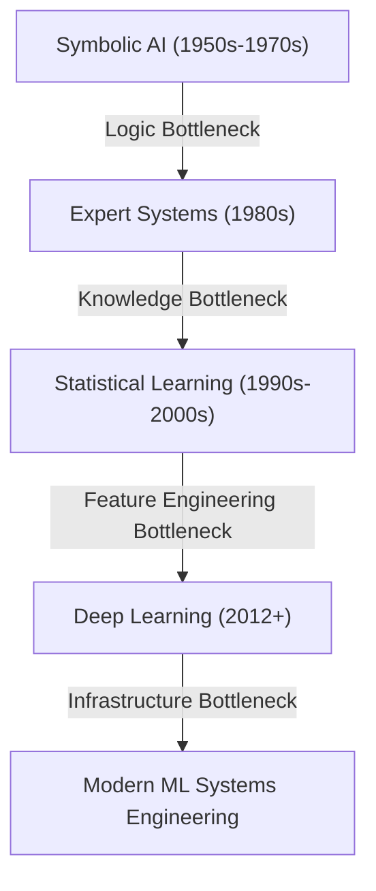
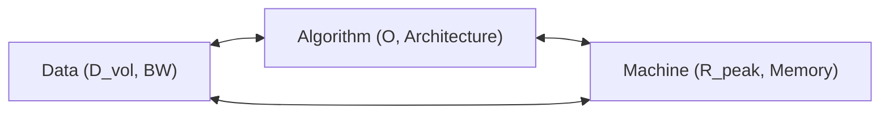
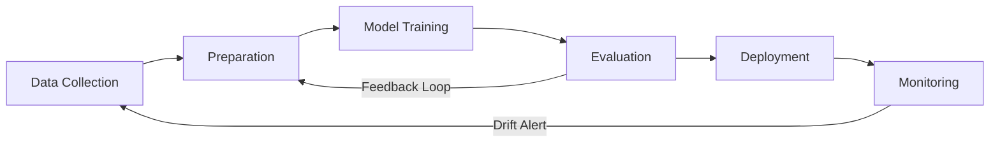

# Chapter 1: Introduction to ML Systems

## Material Covered in This Chapter

- Purpose
- 1
- Learning Objectives
- 1.1 AI Moment
- 1.2 Data-Centric Paradigm Shift
- Checkpoint 1.1: The paradigm shift
- 1.3 AI Paradigm Evolution
- 1.3.1 The prelearning era: Logic and knowledge bottlenecks
- 1.3.1.1 Symbolic AI era: The logic bottleneck
- 1.3.1.2 Expert systems era: The knowledge bottleneck
- 1.3.3 Deep learning era: The infrastructure bottleneck
- 1.4 Bitter Lesson
- 1.5 Defining ML Systems
- Definition 1.1: Machine learning systems
- Definition 1.2: The D·A·M taxonomy
- 1.5.1 The engineering crux: A hierarchy of architecture
- 1.6 MLvs. Traditional Software
- 1.7 Iron Law of ML Systems
- Systems Perspective 1.4: The iron law analogy
- Napkin Math 1.1: Training GPT-3
- 1.7.1 The economic invariant: Return on compute (RoC)
- 1.8 Efficiency Framework
- Systems Perspective 1.5: The efficiency paradox
- 1.9 Defining AI Engineering
- Definition 1.3: AI Engineering
- 1.10 MLSystem Lifecycle
- 1.10.1 The ML development lifecycle
- Systems Perspective 1.6: The engineering missions: Application scenarios
- 1.10.2 The deployment spectrum
- Microcontrollers:
- 26 Model Compression:
- 1.10.3 How deployment shapes the lifecycle
- 1.11 Deployment Case Studies
- 1.12 Five-Pillar Framework
- 1.12.1 The five engineering disciplines
- 1.12.2 Connecting components, lifecycle, and disciplines
- 1.13 Book Organization
- 1.14 Fallacies and Pitfalls
- 1.15 Summary
- Key Takeaways: Constraints drive architecture
- What's Next: From vision to architecture

---

## Section-by-Section Preserve-and-Extend

# Chapter 1 Summary: The Systems Engineering Paradigm in Machine Learning

## 1. Learning Objectives
* **The AI Triad (D·A·M Taxonomy):** Classify and diagnose machine learning system performance bottlenecks across Data,
Algorithm, and Machine axes.
* **Paradigm Evolution:** Trace the trajectory of AI from symbolic logic to deep learning, understanding the transition
of binding constraints from knowledge entry to compute infrastructure.
* **Software 2.0 Shift:** Distinguish ML systems from traditional Software 1.0 based on data dependencies, silent
degradation, and continuous iteration.
* **The Iron Law of ML Systems:** Decompose end-to-end task time into data movement, computation, and system overhead
terms to guide optimization priorities.
* **The Degradation Equation:** Analyze statistical distribution drift quantitatively to establish retraining
thresholds.
* **The Efficiency Framework:** Balance algorithmic, compute, and data-centric optimizations to resolve the Jevons
paradox of scaling.
* **AI Engineering Definition:** Implement stochastic systems with deterministic reliability targets across the
deployment spectrum from Cloud to TinyML.
* **Five-Pillar Framework:** Organize ML systems engineering into Data Engineering, Training Systems, Deployment
Infrastructure, Operations & Monitoring, and Ethics & Governance.

---

## 2. The AI Moment & Dual Mandate
Modern artificial intelligence has transitioned from academic research into the runtime fabric of society. Large-scale
deployments—such as speech-to-text converters, real-time recommendation engines, loan underwriting models, and
autonomous vehicle control loops—operate under a **dual mandate**:
1. **Statistical Uncertainty:** Managing the probabilistic nature of model predictions to deliver reliable outcomes
under real-world input variance.
2. **Physical Constraints:** Executing quintillions of operations and moving terabytes of data within tight latency,
energy, and cost envelopes.

At failure boundaries, traditional software crashes observably (loud failures due to code bugs), whereas machine
learning systems degrade silently (correct execution producing incorrect predictions due to statistical drift,
un-converged training, or transient hardware errors).

---

## 3. The Data-Centric Paradigm Shift: Software 1.0 vs. Software 2.0
Andrej Karpathy formalized the transition of computing paradigms as a shift from instruction-centric to data-centric
software development.

| Feature | Software 1.0 (Traditional) | Software 2.0 (Machine Learning) |
| :--- | :--- | :--- |
| **Source Code** | C++, Python, Java | Training Data + Labels |
| **Compiler** | GCC, LLVM | Training Loop (SGD, Adam, etc.) |
| **Logic** | Explicit (Hand-coded rules: `if x > 0 then y`) | Implicit (Learned parameters: weights \(W\) and biases \(b\)) |
| **Failure Mode** | Loud (Crash, Exception, Segfault) | Silent (Metric/Accuracy degradation) |
| **Debugging** | Trace execution path, print statements, breakpoints | Inspect data distribution, feature engineering |

### Google's Hidden Technical Debt
Sculley et al. (2015) demonstrated that mature production ML systems dedicate only a fraction of their infrastructure to
model execution. Roughly **5%** of the engineering surface is the ML code itself, while the remaining **95%** consists
of auxiliary systems:
* Data collection, verification, and feature extraction.
* Resource management and serving infrastructure.
* Monitoring, metadata logging, and configuration management.

### The Verification Gap
Traditional Software 1.0 logic can be partitioned and evaluated deterministically. In Software 2.0, the high-dimensional
input space is practically unsamplable. For a standard \(224 \times 224\) RGB image, the input space consists of
\(256^{150,528}\) possible pixel configurations. The ImageNet test set evaluates only \(50,000\) configurations. The
structural verification gap is defined as:
\[
\text{Verification Gap} = \text{Total Input Space} - \text{Test Set Coverage} \approx \text{Total Input Space}
\]
Because predeployment verification cannot guarantee correctness across infinite input distributions, continuous
statistical monitoring in production is mathematically required.

---

## 4. AI Paradigm Evolution
AI history is characterized by periods of intense scaling optimism followed by funding collapses ("AI Winters") when
algorithmic ambitions hit the physical ceilings of contemporary hardware.

### 4.1 Symbolic AI Era (1950s–1970s): The Logic Bottleneck
* **Mechanism:** Encoding intelligence as explicit logical rules.
* **Bottleneck:** Hand-crafted rules could not capture real-world ambiguity or edge-case variations.
* **Moravec's Paradox:** High-level logical reasoning (e.g., chess) requires minimal compute, whereas low-level
perception and motor control (e.g., walking, vision) demand massive parallel processing.
* **Winter Trigger (1974–1980):** The 1973 Lighthill Report concluded that combinatorial explosion prevented symbolic
systems from solving real problems. The algorithm ambitions outstripped mainframe-era compute.

### 4.2 Expert Systems Era (1980s): The Knowledge Bottleneck
* **Mechanism:** Injecting domain-specific rules (e.g., MYCIN's 600 rules for blood infection diagnosis) through expert
interviews.
* **Bottleneck:** Knowledge acquisition scaled superlinearly with coverage. Conflicting rules and expert inconsistencies
rendered databases unmaintainable.
* **Winter Trigger (1987–1993):** The collapse of the specialized Lisp Machine market. Cheaper, general-purpose
workstations (PC/Unix) undercut specialized hardware, exposing the high maintenance costs of rule bases.

### 4.3 Statistical Learning Era (1990s–2000s): The Feature Engineering Bottleneck
* **Mechanism:** Probabilistic estimation (\(P(Y \mid X)\)) using statistical algorithms like Support Vector Machines
(SVMs) and Random Forests.
* **Bottleneck:** Performance was bounded by human ingenuity in hand-crafting representation pipelines (e.g., SIFT, HOG,
Gabor filters, or Viola-Jones cascades).
* **Key Invariant:** The *Unreasonable Effectiveness of Data* (Halevy et al., 2009) demonstrated that simpler
statistical models fed with massive data scales outperform sophisticated models trained on limited datasets.

### 4.4 Deep Learning Era (2012+): The Infrastructure Bottleneck
* **Mechanism:** Multi-layered neural networks learning representations directly from raw data end-to-end.
* **Breakthrough:** Unlocked by hardware-algorithm alignment (AlexNet in 2012). The mathematical structure of
convolutional layers (parallel matrix multiplications) mapped directly onto the parallel execution architecture of
consumer GPUs (two NVIDIA GTX 580 GPUs with split memory streams).
* **Current Boundary:** Moving from algorithmic complexity to massive distributed training challenges. For example,
training GPT-3 (175 billion parameters in FP16, consuming 350 GB memory) required processing 300 billion tokens,
consuming \(\approx 3.14 \times 10^{23}\) FLOPs (equivalent to hundreds of V100 GPU-years).

| Aspect | Symbolic AI | Expert Systems | Statistical Learning | Deep Learning |
| :--- | :--- | :--- | :--- | :--- |
| **Key Strength** | Logical reasoning | Domain expertise | Probabilistic versatility | Automated pattern learning |
| **Primary Bottleneck** | Brittleness (Logic breaks) | Knowledge acquisition (Feigenbaum bottleneck) | Feature engineering (Manual preprocessing) | Compute & Data scale (Infrastructure limits) |
| **Data Scaling** | Minimal data required | Hand-crafted facts | Moderate curated datasets | Massive unstructured datasets |

---

## 5. The Bitter Lesson
Richard Sutton's 2019 thesis (*The Bitter Lesson*) posits that general-purpose search and learning methods that leverage
computational scale consistently outperform methods that attempt to encode human domain expertise.

* **Deep Blue (1997):** Defeated Garry Kasparov not by encoding grandmaster chess strategy, but by executing brute-force
tree search evaluating 200 million positions per second on 480 custom VLSI processors.
* **AlphaGo Zero (2017):** Discarded human game databases entirely. It achieved superhuman performance in 3 days by
generating self-play data via reinforcement learning on 4 TPUs (consuming 5,000 TPU-hours), scaling compute rather than
expert rules.
* **Foundation Models (GPT-4, 2023):** Emerges as a general-purpose language simulator by training transformers over
millions of GPU-days (public estimates peg GPT-4 training at \(\approx 2.5 \times 10^4\) A100-class GPUs for 90 days).

---

## 6. Defining ML Systems & The D·A·M Taxonomy

> [!IMPORTANT]
> **Machine Learning Systems** are software systems whose core behavior is determined by parameters learned from data
rather than explicitly programmed rules, making performance a function of data quality, algorithm choice, and hardware
capacity simultaneously.

The **D·A·M Taxonomy** decomposes ML system bottlenecks along three interdependent axes:

1. **Data Axis:** The information fuel. Represented by parameter volume (\(D_{\text{vol}}\)) and data transfer bandwidth
(\(\text{BW}\)).
2. **Algorithm Axis:** The architectural blueprint. Represented by mathematical operation count (\(O\)) and
computational dependencies.
3. **Machine Axis:** The physical hardware engine. Represented by peak arithmetic throughput (\(R_{\text{peak}}\)),
memory capacity, and thermal envelopes.

### Samples per Dollar Economic Invariant
Systems engineers optimize model economics using the samples-per-dollar metric:
\[
\text{Cost} \propto \frac{\text{Model Size} \times \text{Dataset Size}}{\text{Hardware Efficiency}}
\]
* Improving data quality (e.g., active learning) decreases required dataset size.
* Optimizing model architecture (e.g., sparse attention) decreases model operation count.
* Utilizing domain-specific accelerators (ASICs/TPUs) increases hardware efficiency (FLOPs/$).

### The Engineering Crux: Hierarchy of Architecture
ML systems translate high-level mission goals down to physical silicon constraints across four layers:
1. **Missions (Scenarios):** The user application (e.g., Smart Doorbell, Autonomous Vehicle). Sets latency Service Level
Objectives (SLOs) and power limits.
2. **Workloads (Models):** The mathematical description (e.g., Wake Vision CNN, GPT-4 Transformer). Determines operation
count (\(O\)) and parameter volume (\(D_{\text{vol}}\)).
3. **Systems (Platforms):** The deployment envelope (e.g., Sub-Watt Sensor Node, Training Cluster Node). Defines power,
cooling, and network topologies.
4. **Hardware (Silicon):** The physical execution unit (e.g., ESP32-S3, NVIDIA H100 GPU). Defines physical limits
(\(R_{\text{peak}}\), \(\text{BW}\), RAM).

### System Archetypes

| Archetype | Representative Hardware | RAM / Memory Capacity | Peak Compute | Power Budget |
| :--- | :--- | :--- | :--- | :--- |
| **Cloud** | NVIDIA H100 Cluster | 512 GB | 989 TFLOPS (FP8) | 700 W per GPU |
| **Edge** | Jetson Orin Robotics | 32 GB | 25.0 TFLOPS | 25 W |
| **Mobile** | Smartphone SoC | 8 GB | 35.0 TFLOPS | 5 W |
| **TinyML** | ESP32-S3 Microcontroller | 512 KB | 0.0005 TFLOPS | 400 mW |

---

## 7. Failure Modes: Silent Degradation & The Degradation Equation
Unlike traditional software, where bugs trigger immediate exceptions, ML systems suffer from **silent degradation**.
Model weights are fixed post-deployment, but the real-world input distribution (\(P_t\)) drifts away from the training
distribution (\(P_0\)).

### The Degradation Equation
The first-order approximation of accuracy loss over time is given by:
\[
\text{Accuracy}(t) \approx \text{Accuracy}_0 - \lambda \cdot \mathcal{D}(P_t \parallel P_0)
\]
* \(\text{Accuracy}_0\): The baseline model accuracy at deployment.
* \(\lambda\): The model's sensitivity factor to distribution shift (architecture-dependent).
* \(\mathcal{D}(P_t \parallel P_0)\): The statistical divergence (e.g., Kullback-Leibler (KL) divergence, Wasserstein
distance, or Total Variation Distance) between operational data \(P_t\) and training data \(P_0\).

### Three Engineering Levers to Manage Drift
1. **Maximize \(\text{Accuracy}_0\):** Train larger models with higher initial capacity (shifts the degradation curve
upward).
2. **Minimize Sensitivity (\(\lambda\)):** Employ domain generalization, adversarial training, or robust feature scaling
(flattens the slope).
3. **Control Divergence (\(\mathcal{D}\)):** Establish production monitoring pipelines to measure drift and trigger
automated retraining when \(\mathcal{D}(P_t \parallel P_0) > \tau\) for a target threshold \(\tau\).

---

## 8. The Iron Law of ML Systems
The end-to-end execution time (\(T\)) of any machine learning task is governed by data movement, arithmetic throughput,
and fixed system latencies:
\[
T \approx \frac{D_{\text{vol}}}{\text{BW}} + \frac{O}{R_{\text{peak}} \cdot \eta_{\text{hw}}} + L_{\text{lat}}
\]

### Execution Overlap (Pipelined Systems)
In optimized production runtimes where data loading and compute execute in parallel, the additive terms resolve to a
bottleneck-bound `max` function:
\[
T \approx \max\left(\frac{D_{\text{vol}}}{\text{BW}}, \frac{O}{R_{\text{peak}} \cdot \eta_{\text{hw}}}\right) +
L_{\text{lat}}
\]
* **Data-bound regime:** \(\frac{D_{\text{vol}}}{\text{BW}} > \frac{O}{R_{\text{peak}} \cdot \eta_{\text{hw}}}\).
Performance is limited by memory or network bandwidth.
* **Compute-bound regime:** \(\frac{D_{\text{vol}}}{\text{BW}} < \frac{O}{R_{\text{peak}} \cdot \eta_{\text{hw}}}\).
Performance is limited by processor arithmetic throughput.

### Mathematical Variables
* \(D_{\text{vol}}\): Parameter volume + activation footprint (bytes).
* \(\text{BW}\): Memory bandwidth or network bisection bandwidth (bytes/sec).
* \(O\): Algorithmic operations (FLOPs).
* \(R_{\text{peak}}\): Theoretical peak hardware arithmetic performance (FLOPs/sec).
* \(\eta_{\text{hw}}\): Hardware utilization efficiency factor (\(0 \le \eta_{\text{hw}} \le 1\)).
* \(L_{\text{lat}}\): Irreducible overhead (serialization, kernel launch overhead, network round-trip time).

### Napkin Math: Training GPT-3-scale Model
* **Task:** Estimate training time for a model requiring \(O \approx 3.14 \times 10^{23}\) FLOPs on \(N = 1024\) GPUs.
* **Hardware:** NVIDIA A100 (FP16 Tensor Core peak \(R_{\text{peak}} = 312\) TFLOPS).
* **Efficiency:** Standard distributed training utilization \(\eta_{\text{hw}} = 45\%\) (\(0.45\)).
* **Calculation:**
\[
T \approx \frac{3.14 \times 10^{23}}{1024 \times (312 \times 10^{12} \text{ FLOP/s}) \times 0.45} \approx 2.18 \times
10^6 \text{ seconds} \approx 25.2 \text{ days}
\]
* **Systems Insight:** Improving software efficiency (\(\eta_{\text{hw}}\)) from \(45\%\) to \(60\%\) (via kernel
fusion, optimized collective communications, and memory layout adjustment) reduces training time to \(19.0\) days,
saving \(6.2\) days of cluster allocation costs.

### The Energy Tax
For mobile and edge environments, energy consumption is the binding constraint:
\[
E \approx D_{\text{vol}} \cdot E_{\text{move}} + O \cdot E_{\text{compute}}
\]
Because moving bits across wires over macroscopic distances requires charging and discharging physical capacitive lines,
data movement energy vastly exceeds computation energy:
\[
E_{\text{move}} \gg E_{\text{compute}} \quad (\text{typically } 100\times \text{ to } 500\times)
\]
Thus, minimizing memory traffic (\(D_{\text{vol}}\)) via cache localization is the primary lever for energy
minimization.

### Return on Compute (RoC) Economic Invariant
The marginal utility of model performance relative to infrastructural expenditure is defined as:
\[
\text{RoC} = \frac{\Delta \text{Accuracy}}{\Delta \text{Cost}}
\]
If an algorithm change increases execution cost by \(10\times\) but yields only a \(0.5\%\) accuracy gain, the RoC is
negative relative to alternative business investments.

---

## 9. Lighthouse Models as Reference Workloads
Five canonical models serve as architectural probes to test system limits under the Iron Law.

| Lighthouse Model | Architecture Class | Dominant Bottleneck | Key Diagnostic Focus |
| :--- | :--- | :--- | :--- |
| **ResNet-50** | Convolutional Network (CNN) | Compute Throughput | Saturation of tensor cores, batch size scaling, weight reuse. |
| **GPT-2 / Llama** | Decoder-Only Transformer | Memory Bandwidth | Key-Value (KV) caching dynamics, weight-loading overhead per token. |
| **DLRM** | Deep Learning Recommendation | Memory Capacity | Scaling terabyte-scale embedding tables across multi-node RAM. |
| **MobileNetV2** | Depthwise Separable CNN | Latency & Power | Minimizing MACs (multiply-accumulate) on battery constraints. |
| **Keyword Spotting**| Tiny Neural Network | Power Envelope | Sub-milliwatt, always-on execution using extreme quantization (INT4/INT2). |

---

## 10. The Efficiency Framework
The scaling requirements of the Bitter Lesson are countered by algorithmic, compute, and data efficiency breakthroughs:
1. **Algorithmic Efficiency:** Structural modifications (e.g., pruning parameters, weight quantization to INT8/FP4,
knowledge distillation, and depthwise separable convolutions) that reduce \(O\) and \(D_{\text{vol}}\).
2. **Compute Efficiency:** Hardware-software co-design. Aligning memory layouts (e.g., channels-last) and compiling
custom kernels (e.g., FlashAttention) to maximize utilization (\(\eta_{\text{hw}}\)) on specialized silicon.
3. **Data Selection:** Reducing the training dataset size by filtering for high-signal samples (e.g., active learning,
core-set selection, curriculum learning).

### Algorithmic Efficiency Gains (2012–2019)
For ImageNet classification, the compute required to match AlexNet-level accuracy decreased by **\(44.5\times\)** over 7
years (halving every 16 months). This outpaced Moore's Law hardware scaling (\(\approx 16\times\) transistor density
gains over the same window).

### The Efficiency Paradox (Jevons Paradox)
Increasing computational efficiency decreases the marginal cost of executing a single training sample. According to
Jevons Paradox, this price reduction increases the total demand for compute. Instead of spending fewer dollars,
organizations scale model parameters and dataset volumes exponentially to chase higher accuracy. Between 2012 and 2023,
the compute used in state-of-the-art training runs grew by **seven orders of magnitude** (\(10^7\)), doubling every 3.4
months.

---

## 11. Defining AI Engineering
AI Engineering is distinct from machine learning research and traditional software engineering:

> [!NOTE]
> **AI Engineering** is the engineering discipline of designing, deploying, and maintaining systems whose outputs are
inherently probabilistic (stochastic) to meet deterministic reliability targets by simultaneously satisfying constraints
on all three D·A·M axes (Data quality, Algorithm correctness, Machine efficiency) in production.

* **vs. ML Research:** ML Research isolates the Algorithm axis, optimizing validation loss on static, pre-cleansed
datasets. AI Engineering co-optimizes the entire stack, balancing latency, throughput, cost, and safety-critical
reliability constraints on dynamically drifting production distributions.
* **vs. Software Engineering:** Traditional software engineering specifies systems deterministically (discrete inputs
map to predictable execution branches). AI Engineering designs systems for stochastic specifications where outputs are
statistically bounded over dynamic probability distributions.

---

## 12. The ML System Lifecycle & Deployment Spectrum
The ML lifecycle is a closed loop, where evaluation failures route back to data preparation, and production monitoring
alerts trigger new data collection cycles.

### The Deployment Spectrum
The physical runtime target dictates which terms of the Iron Law must be minimized.

| Environment | Primary Constraints | Core Efficiency Strategy |
| :--- | :--- | :--- |
| **Cloud Training** | Infrastructure cost, inter-node network bandwidth | Distributed training scaling (Data Parallelism, Tensor Parallelism), pipeline parallelism. |
| **Cloud Inference**| Serving cost, p99 latency SLOs | Request batching, model serving optimization. |
| **Edge Robotics** | High-rate sensor processing, safety latency limits | Real-time execution, local sensor fusion, structural pruning. |
| **Mobile Systems** | Thermal throttling limits, volatile memory (RAM) | INT8 Quantization, hardware-aware neural architecture search. |
| **TinyML** | Kilobyte-scale SRAM, sub-milliwatt power | Extreme weight binarization/quantization, custom hardware layers. |

---

## 13. Deployment Case Studies

### 13.1 Waymo (Hybrid Cloud/Edge)
* **Data Axis:** Roving data centers processing **1 to 19 Terabytes of sensor data per hour** per vehicle (LiDAR point
clouds, Radar, optical cameras). Employs sensor fusion to handle atmospheric noise (fog, rain).
* **Algorithm Axis:** Real-time perception and control models (e.g., YOLO variants) with strict **\(<10\) ms latency
budgets** at the edge.
* **Machine Axis:** On-vehicle compute units operating at edge power budgets.
* **Systems Challenge:** The *Version Gap*. Edge models must be frozen and validated for safety certification, while the
cloud continuously trains new iterations on global fleet data.

### 13.2 FarmBeats (Resource-Constrained Edge)
* **Data Axis:** Telemetry collected from agricultural sensors. Data transmission is constrained by TV White-Space
networks operating at **kilobits per second**.
* **Algorithm Axis:** Small, lightweight models (under **500 KB**) designed to operate with limited updates.
* **Machine Axis:** Low-power edge processors powered by solar cells.
* **Systems Challenge:** Network bandwidth is the binding bottleneck. Large updates are impossible; the system must
prioritize model freshness over complex feature representations.

### 13.3 AlphaFold (Compute-Intensive Cloud)
* **Data Axis:** Input is the Protein Data Bank (PDB), containing \(\approx 180,000\) structures, used to predict 200
million protein configurations.
* **Algorithm Axis:** Iterative attention mechanisms mapping spatial relations.
* **Machine Axis:** High-throughput cloud infrastructure. Training required **128 TPUv3 cores** running continuously for
weeks.
* **Systems Challenge:** High-throughput batch processing. The system optimizes for overall protein prediction
throughput rather than real-time latency budgets.

---

## 14. The Five-Pillar Framework
To combat the \(60\%\) to \(85\%\) failure rate of production ML projects, systems engineering is structured around five
interconnected pillars:
1. **Data Engineering:** Building pipelines for versioning, clean feature extraction, data lineage tracing, and drift
detection.
2. **Model Training Systems:** Managing distributed GPU orchestration, optimizing parameter synchronization strategies,
and scheduling training jobs.
3. **Deployment Infrastructure:** Implementing low-latency serving runtimes, managing memory bandwidth bottlenecks
(KV-caches), and optimizing compilation paths.
4. **Operations and Maintenance:** Managing four-dimensional monitoring (infrastructure health, statistical model
accuracy, input data quality, and downstream business metrics).
5. **Ethics and Governance:** Implementing auditing tools for subgroup bias detection, enforcing differential privacy
boundaries, and defending against inference attacks.

---

## 15. Fallacies and Pitfalls
* **Fallacy: Better algorithms automatically produce better systems.**
  * *Reality:* A SOTA Vision Transformer may improve benchmark accuracy by \(1\%\) but require \(4\times\) the FLOPs and
\(3\times\) the memory bandwidth of ResNet-50. If the model violates latency SLOs, its utility is zero.
* **Pitfall: Treating ML systems as traditional software that happens to include a model.**
  * *Reality:* Traditional bugs crash with explicit stack traces. ML systems degrade silently as real-world
distributions drift, requiring statistical monitoring instead of simple unit tests.
* **Fallacy: High accuracy on benchmark datasets indicates production readiness.**
  * *Reality:* Benchmarks do not suffer from edge precision drops, network jitter, or downstream pre/post-processing
delays. Slang, emojis, and noise drop accuracy in production.
* **Pitfall: Optimizing individual components without considering system interactions.**
  * *Reality:* Amdahl's Law applies. Reducing model inference time from \(45\) ms to \(15\) ms yields only a \(23\%\)
end-to-end latency reduction if preprocessing (60 ms) and postprocessing (25 ms) dominate.
* **Fallacy: ML systems can be deployed once and left to run indefinitely.**
  * *Reality:* The degradation equation guarantees accuracy loss. Fraud detection models lose \(5\text{--}10\%\)
accuracy per quarter as adversaries adapt.
* **Pitfall: Assuming that ML research expertise is sufficient for ML systems engineering.**
  * *Reality:* Researchers focus on validation loss on static data. Systems engineers must optimize database throughput,
memory latency, pipeline serialization, and API stability.

---

## Full Slice Content (Docling Extract, Preserved Verbatim)

> Each section below preserves the source slice content as extracted by docling. Image placeholders are removed; tables,
equations, code blocks, named artifacts, and footnotes are kept intact.

## Purpose

Why does building machine learning systems require engineering principles so different from those governing traditional
software?

Machine learning systems have a physics . Data must move through memory hierarchies governed by bandwidth limits.
Arithmetic must execute on silicon governed by power budgets. Predictions must arrive within latency windows governed by
the speed of light. These are not implementation details to be abstracted away; they are permanent constraints that
shape every design decision from model architecture to deployment target. At the same time, ML systems have a property
no traditional software shares: their behavior is defined by data, not code. When a traditional program misbehaves,
engineers trace the bug to specific lines of source; when a machine learning system misbehaves, there is often no bug to
find. The code executes correctly, but the learned behavior is wrong because the training data was incomplete, biased,
or stale. ML engineers must therefore simultaneously manage the statistical uncertainty inherent in learned behavior and
the physical constraints of executing that behavior on real hardware. A model that fits comfortably in a data center may
be useless on a phone. A training pipeline that converges (reaches a stable trained state) in a week on one accelerator
may take a month on another. An accurate model trained on last year's data may silently degrade as the world changes.
The engineering principles that made traditional software reliable (testing, modularity, version control) remain
necessary but are no longer sufficient. What is needed is a discipline grounded in the physics of computation, where
decisions at the algorithm level impact the full stack down to the silicon, and hardware constraints flow back up to
reshape model design.

## 1

1.1 AI Moment 1.2 Data-Centric Paradigm Shift 1.3 AI Paradigm Evolution 1.4 Bitter Lesson 1.5 Defining ML Systems 1.6
MLvs. Traditional Software 1.7 Iron Law of ML Systems 1.8 Efficiency Framework 1.9 Defining AI Engineering 1.10 ML
System Lifecycle 1.11 Deployment Case Studies 1.12 Five-Pillar Framework 1.13 Book Organization 1.14 Fallacies and
Pitfalls 1.15 Summary

1 GPU (Graphics Processing Unit) : Originally designed for rendering video game graphics, a workload requiring thousands
of simple, parallel pixel calculations. This hardware-algorithm alignment proved decisive for neural networks, where the
same massively parallel arithmetic structure maps directly onto matrix multiplication, making GPUs the primary physical
enabler of modern training scale (see Chapter 11).

2 Andrej Karpathy: A founding member of OpenAI and former Director of AI at Tesla who pioneered the application of deep
learning to autonomous vehicle fleets. His 'Software 2.0' thesis (2017) crystallized the insight that neural network
weights are the new 'source code,' forcing a new engineering reality: instead of debugging explicit logic, engineers
must curate and version the data that defines program behavior, since a model with millions of parameters cannot be
patched or reasoned about directly.

## Learning Objectives

- Explain the AI Triad (Data, Algorithm, Machine) and apply the D·A·M taxonomy to diagnose ML system bottlenecks
- Explain AI's evolution from symbolic reasoning to deep learning and why computational scale outperforms encoded
expertise (the bitter lesson)
- Distinguish ML systems from traditional software based on silent degradation, data dependencies, and continuous
iteration
- Apply the iron law of ML systems to decompose performance into data movement, computation, and overhead terms
- Describe the three dimensions of efficiency and identify how the five Lighthouse Models stress-test different
bottlenecks
- Distinguish the ML development lifecycle from traditional software development and compare deployment contexts from
cloud to TinyML
- Apply the degradation equation to reason about drift in ML systems
- Apply the five-pillar framework to organize ML systems engineering

## 1.1 AI Moment

Building these systems becomes an engineering challenge distinct from traditional software because of a dual mandate .
Every ML system must simultaneously manage statistical uncertainty, because the model's predictions are probabilistic,
and physical constraints, because executing those predictions requires moving terabytes of data and performing
quintillions of arithmetic operations, often within milliseconds. The difference becomes clearest at failure boundaries.
When a traditional program crashes, an engineer traces the bug to specific lines of code. When an ML system's accuracy
drops by 5 percentage points, there may be no bug to find: the code executes correctly, but the learned behavior has
changed. Concretely, a code bug causes a crash (a loud failure), whereas a data bug causes a wrong prediction (a silent
failure). The training data may have shifted. The hardware may have run out of memory mid-training. The model may not
have converged. Debugging, testing, and architectural design all change when a system's behavior is defined by data
rather than by code.

A rtificial intelligence has moved from research laboratories to the fabric of daily life. For example, when a user asks
a smartphone a question, an AI system converts speech to text, interprets intent, and generates a response. Scrolling
through social media, AI systems decide which posts appear and in what order. Applying for a loan, AI systems assess
creditworthiness. Driving a modern car, AI systems monitor lane position, detect pedestrians, and adjust cruise control.
In each case, the system is not merely retrieving information but making decisions under uncertainty, often controlling
physical outcomes that affect safety, finances, or access to opportunity. These are not future possibilities; they are
present realities affecting billions of people daily.

This dual mandate is visible in every large-scale AI deployment. ChatGPT coordinates thousands of GPUs 1 across data
centers, executing trillions of operations per query while managing memory, network bandwidth, and thermal constraints.
Modern driver-assistance and autonomous-driving systems process high-rate sensor streams, often combining cameras with
radar, LiDAR, or other sensors depending on the vehicle platform, and fuse perception into control decisions within
milliseconds. Google processes 8.5 billion searches per day, each one triggering multiple AI systems for ranking,
knowledge extraction, and spell-checking, all while meeting strict latency targets on globally distributed
infrastructure. These systems do not merely run algorithms. They orchestrate data, computation, and hardware under tight
physical constraints to deliver statistically reliable results at scale.

## 1.2 Data-Centric Paradigm Shift

The shift from rule-based to data-driven systems constitutes a deep reconception of computing. Andrej Karpathy 2
formalized this distinction as the shift from Software 1.0 to Software 2.0 (Karpa- thy 2017), a framing that captures
why MLsystems require entirely new engineering approaches. Table 1.1 summarizes this paradigm shift.

Table 1.1: The Paradigm Shift from Software 1.0 to Software 2.0: In Software 2.0, the 'programmer' does not write the
logic; they curate the dataset that the optimization process uses to write the logic. Debugging therefore moves upstream
from code to data. The 'compiler' analogy is approximate: unlike a deterministic compiler, the training process is
stochastic and may produce different 'executables' from the same 'source code.'

| Feature      | Software 1.0 (Traditional)   | Software 2.0 (Machine Learning)   |
|--------------|------------------------------|-----------------------------------|
| Source Code  | C++, Python, Java            | Training Data + Labels            |
| Compiler     | GCC, LLVM                    | Training Loop (SGD)               |
| Logic        | Explicit (Hand-coded)        | Implicit (Learned)                |
| Failure Mode | Loud (Crash, Exception)      | Silent (Metric Degradation)       |
| Debugging    | Trace execution path         | Inspect data distribution         |

Google researchers quantified these consequences in a landmark 2015 paper.

Example 1.1: The hidden technical debt of ML systems

Context: Google engineers published a landmark paper (Sculley et al. 2015) that changed how the industry views ML
engineering.

Insight: They demonstrated that in mature ML systems, the MLCode (the model itself) is often only a small fraction of
the total system. Their paper's schematic 'ML code' box occupies roughly 5 percent of the surrounding infrastructure
diagram, not as a literal line-count audit but as a useful scale intuition: data collection, verification, feature
extraction, resource management, monitoring, and serving infrastructure dominate the engineering surface.

Systems lesson: 'Machine Learning' is easy; 'Machine Learning Systems' are hard. The friction in deployment rarely comes
from the matrix multiplication alone; it comes from the interface between that math and the messy reality of the
surrounding system. Optimizing only the model optimizes the visible center of a much larger engineering problem.

The critical implication is the data as code invariant (Principle 1). In traditional software, a programmer writes
explicit logic ( if x > 0 then y ). In machine learning, the programmer writes the optimization meta-logic (the training
algorithm), but the actual operational logic is 'compiled' from the training dataset through stochastic gradient descent
3 and related optimization methods. The dataset serves as source code, the training pipeline as compiler, and the model
weights 4 as binary executable.

From a systems perspective, this represents a transition from instruction-centric to data-centric computing (Ng 2021) :

- Instruction-centric computing (traditional): Systems optimized for the efficient execution of hand-crafted logic. The
programmer's job is to write correct instructions.
- Data-centric computing (ML): Systems optimized for the efficient ingestion of data and the iterative refinement of
model parameters. The programmer's job is to curate correct data.

Debugging an ML system therefore means debugging the data, not the Python scripts. Version control must track datasets,
not just git commits. Testing must validate data distributions, not just code paths. Yet even thorough testing cannot
close what amounts to a structural verification gap between finite test sets and the vast continuous input spaces that
ML systems encounter in production.

Systems Perspective 1.1: The verification gap

The verification gap in ML testing: In Software 1.0, logic is discrete. We can write unit tests that cover edge cases
because the input space is often enumerable or partitionable.

3 Stochastic Gradient Descent (SGD) : The algorithm implements the 'compilation' of logic from data by processing one
small, random data sample (a 'batch') at a time, instead of the entire dataset. This trade-off, statistical noise for
computational speed, is the core engine of the training 'compiler.' The choice of batch size becomes a critical
compilation flag; a batch too small (for example, < 32) fails to saturate the parallel processors of an accelerator,
wasting over 90 percent of its potential computation.

4 Model Weights: The learned numerical parameters of a neural network, one value per connection between units. A
GPT-3-scale model stores 175 billion such values, consuming 350 gigabytes in FP16 precision. Because every inference
request must load these weights through the memory hierarchy, weight count is the single largest determinant of both
memory footprint (𝐷 vol ) and serving cost (see Chapter 5).

5 Alan Turing: His 1950 'Imitation Game' reframed intelligence as an output-measurement problem: judge a system by what
it does, not by what it is . This engineering-first stance persists in every ML systems metric we use today: accuracy,
latency, throughput, and FLOPS-per-watt are all output measurements. The iron law decomposes performance into
observable, measurable terms rather than internal architectural properties for exactly this reason.

6 ELIZA: A 1966 natural language program that ran on 256-kilobyte mainframes using pattern-matching rules with no
learned state-its brittleness was a direct systems consequence of zero memory across turns. Every new input variation
required a new hand-written rule, making maintenance cost grow faster than capability and foreshadowing the knowledge
bottleneck that killed expert systems a decade later.

7 AI Winters as Systems Failures: The first AI winter (1974-1980) was precipitated by the 1973 Lighthill Report, which
concluded that AI had failed to deliver on its promises. The underlying cause, however, was a mismatch between algorithm
ambition and available compute. The second winter (1987-1993) was triggered by the collapse of the Lisp Machine market
when cheaper general-purpose workstations undercut specialized AI hardware. Both winters are explicitly systems
failures, not algorithmic dead ends: the algorithms were mathematically sound but required hardware that did not yet
exist. The same compute-constraint pattern drove neural network research underground from 1969 (Minsky's perceptron
critique) to 1986 (the RumelhartHinton-Williams backpropagation paper).

In Software 2.0, the input space is high-dimensional (for example, all possible images). Although technically discrete,
it is so vast that it is practically unsamplable. Consider an image classifier: a 224×224 RGB image has 256 150,528
possible pixel configurations, a number with 362,508 digits. ImageNet's entire test set covers only 50,000 of them. Let
Total Input Space denote the number of possible inputs and Test Set Coverage denote the number of inputs a test suite
actually evaluates. No test suite can sample this space meaningfully. Equation 1.1 captures this disparity: Verification
Gap = Total Input Space -Test Set Coverage ≈ Total Input Space (1.1)

This gap means we must rely on statistical monitoring in production (Chapter 14 develops the monitoring infrastructure
that makes this feasible) rather than predeployment verification alone. Guaranteed correctness is traded for statistical
reliability.

The verification gap is symptomatic of a deeper shift: from deterministic systems where correctness can be proven to
probabilistic systems where it can only be bounded. In classic systems engineering, success is defined by determinism:
the same input always yields the same output. In AI Engineering, variance is inherent; the 'squishiness' of data (its
noise, its drift, its hidden patterns) is the source of the system's intelligence but also its unpredictability.
Traditional systems achieve robustness through resistance to change, while ML systems achieve robustness through
adaptation to change. True robustness in AI therefore comes from engineering observability and adaptation rather than
rigidity.

## Checkpoint 1.1: The paradigm shift

Before tracing the history of AI, verify your understanding of the paradigm shift in how we build software:

- [ ] □ Can you distinguish Software 1.0 (explicit instructions) from Software 2.0 (optimization objectives)?

- □ Do you understand why 'Data is Source Code' implies that debugging must move from code inspection to dataset
inspection?

- □ Can you explain the verification gap: Why correctness for ML systems cannot be mathe- matically guaranteed in the
same way we can for traditional logic?

This data-centric paradigm requires rethinking the entire computing stack. The shift from instruction-centric to
data-centric computing did not happen overnight. It emerged through seven decades of paradigm transitions, each
overcoming the bottlenecks of its predecessor. Each era of AI faced a characteristic bottleneck, and understanding these
bottlenecks reveals why systems engineering became central to progress.

## 1.3 AI Paradigm Evolution

AI's evolution reveals a progression of bottlenecks, each overcome by systems innovations that expanded what was
computationally possible. The field traces its origin to Turing's 5 paper 'Computing Machinery and Intelligence' (Turing
1950), which posed the foundational question: Can machines think? Early systems that attempted to answer this question,
such as the Perceptron (1958) and ELIZA 6 (Weizenbaum 1966), ran into the limits of manual logic and mainframe-era
hardware, resulting in brittleness. Subsequent eras hit the knowledge acquisition bottleneck: manual knowledge entry
could not scale. Modern systems face a different constraint: computational throughput.

The timeline in Figure 1.1 reveals a recurring pattern: periods of intense optimism followed by 'AI winters' 7 when
funding collapsed, each triggered by systems limitations that algorithms alone could not overcome. The boom-and-bust
rhythm spanning seven decades follows a consistent pattern: each winter arrives precisely when the dominant paradigm
hits its systems ceiling, and each resurgence follows a breakthrough in engineering infrastructure rather than in
algorithms alone. Each era represents a paradigm shift attempting to overcome the limitations of the previous approach.

Figure 1.1: AI Development Timeline: Achronological curve traces AI research activity from the 1950s to the 2020s, with
gray bands marking the two AI Winter periods (1974 to 1980, 1987 to 1993). Callout boxes highlight key milestones
including the Turing Test (Turing 1950), the Dartmouth conference (McCarthy et al. 1955), the Perceptron, ELIZA, Deep
Blue, and GPT-3.

## 1.3.1 The prelearning era: Logic and knowledge bottlenecks

Before machine learning existed as a discipline, engineers attempted to build intelligent systems through two successive
paradigms, each of which hit a fundamental scaling barrier. Symbolic AI encoded intelligence as logical rules and hit
the logic bottleneck: rules could not capture realworld ambiguity. Expert systems encoded intelligence as domain
knowledge and hit the knowledge bottleneck: acquiring and maintaining that knowledge became more expensive than the
systems were worth. Together, these two eras reveal a pattern that motivates everything that follows: hand-crafted
representations do not scale.

8 Dartmouth Conference (1956) : The workshop where John McCarthy coined 'artificial intelligence.' Its participants
focused almost entirely on algorithmic logic while ignoring the physical constraints of storage and compute. The same
computeagnostic assumption, that a better algorithm could always overcome a hardware limit, is precisely what this book
exists to correct: every chapter that follows argues that systems constraints are firstclass design variables, not
afterthoughts.

9 STUDENT: Daniel Bobrow's 1964 MIT system exposed the core failure mode of symbolic AI: complexity grows faster than
capability. Every new problem type required new hand-written parsing rules, so the system's maintenance burden scaled
superlinearly with coverage. Data-driven approaches break this trap by learning the mapping from examples rather than
encoding it as rules, which is why the shift to statistical ML in the 1980s-90s was fundamentally a scaling
breakthrough, not merely an accuracy improvement.

10 Moravec's Paradox: Carnegie Mellon roboticist Hans Moravec observed that high-level reasoning (chess) requires little
compute while low-level perception (walking) requires massive parallelism. This paradox explains a central fact of ML
systems engineering: the tasks that seem 'easy' to humans (vision, speech, motor control) are the ones that demand the
most FLOPS, memory bandwidth, and specialized hardware, driving the accelerator revolution that defines modern ML
infrastructure.

## 1.3.1.1 Symbolic AI era: The logic bottleneck

The first era of AI engineering (1950s-1970s) attempted to reduce intelligence to Symbolic AI manipulation. Researchers
at the 1956 Dartmouth Conference 8 (McCarthy et al. 1955) hypothesized that if they could formalize the rules of logic,
machines could 'think.' Even then, some saw a different path: Arthur Samuel at IBM demonstrated in 1959 that a checkers
program could improve through self-play, coining the very term ' machine learning .' But the dominant paradigm remained
symbolic. Daniel Bobrow's STUDENT 9 system exemplifies this approach (Bobrow 1964; Samuel 1959).

While impressive in demonstrations, these systems were operationally brittle . They relied on manually coded rules for
every possible state. A minor variation in input phrasing (for example, 'Tom's client count') would cause system
failure. The engineering lesson: explicit logic cannot scale to handle real-world ambiguity. The complexity of the 'rule
base' grows exponentially until it becomes unmaintainable. This limitation extended beyond language: Hans Moravec's 10
work on autonomous navigation at Stanford revealed that tasks humans find trivial (seeing, walking, grasping) were far
harder to engineer than tasks humans find difficult, like chess or algebra.

## 1.3.1.2 Expert systems era: The knowledge bottleneck

In the 1980s, engineers pivoted from general logic to capturing deep domain expertise. MYCIN, designed to diagnose blood
infections, encoded approximately 600 rules derived from interviews with medical experts (Shortliffe et al. 1975).

MYCIN outperformed junior doctors in specific tests but revealed the knowledge acquisition bottleneck 11 . Extracting
implicit intuition from human experts and formalizing it into IF-THEN rules proved slow, error prone, and contradictory.

Maintaining a system with thousands of conflicting rules became an intractable systems engineering problem. This failure
demonstrated that scalable AI required systems to learn rules from data, rather than having them manually injected by
engineers.

1.3.2 Statistical learning era: The feature engineering bottleneck The 1990s marked the shift to probabilistic systems.
Instead of hard-coded logic, systems estimated probabilities from data ( 𝑃(𝑌 |𝑋) ). This transition was driven by the
availability of digital data and the 'unreasonable effectiveness' 12 of large datasets.

Spam filtering illustrates this shift. Rather than maintaining lists of forbidden words, statistical filters learned the
probability that a word implies spam based on millions of examples.

This era faced the feature engineering bottleneck . Algorithms like Support Vector Machines (SVMs) could learn robustly,
but only after humans converted raw data into structured 'features.' The system's performance was bounded by human
ingenuity in preprocessing, not by the data itself. The traditional computer vision pipeline illustrates the depth of
this manual effort, where multiple hand-crafted stages preceded any learning at all.

This hybrid approach combined human-engineered features with statistical learning. The ViolaJones algorithm 13 (Viola
and Jones 2001) exemplifies this era, achieving real-time face detection using simple rectangular features and cascaded
classifiers. This algorithm powered digital camera face detection for nearly a decade, demonstrating that
well-engineered features could enable practical applications, but only within narrow domains where experts could
hand-craft the right representations.

- Example 1.5: Traditional computer vision pipeline
1. Manual Feature Extraction
- SIFT (Scale-Invariant Feature Transform)
- HOG (Histogram of Oriented Gradients)
- Gabor filters
2. Feature Selection/Engineering
3. 'Shallow' Learning Model (for example, SVM)
4. Postprocessing

## 1.3.3 Deep learning era: The infrastructure bottleneck

Deep learning removed the human feature engineering requirement. Neural networks learn representations directly from raw
data (pixels, audio waveforms), enabling 'end-to-end' learning. This shift was unlocked not by new algorithms (CNNs
existed in the 1980s) but by systems codesign . The AlexNet breakthrough (Krizhevsky et al. 2012) occurred because
algorithmic structure (parallel matrix operations) matched hardware capabilities (GPUs). With 60 million parameters
distributed across two GTX 580 GPUs, AlexNet achieved 15.3 percent top-5 error, a 42 percent relative improvement over
the next-best entry that year, not through algorithmic novelty but through hardware-algorithm alignment. Figure 1.2
makes this co-design visible: the architecture's two parallel processing streams exist not for any algorithmic reason
but because a single GTX 580 GPU lacked sufficient memory, making the network's very structure a product of its hardware
constraints.

Deeplearning effectively traded the feature engineering bottleneck for a new computebottleneck . Modelslike GPT-3 (Brown
et al. 2020) (175 billion parameters) illustrate the scale of this new challenge.

11 Knowledge Acquisition Bottleneck: Named by Feigenbaum in 1982, this bottleneck was fundamentally a throughput
problem: knowledge elicitation consumed 70-80 percent of total expert system project time, and roughly 60 percent of
expert system initiatives failed outright because the acquisition process could not scale. Unlike computational
bottlenecks that yield to faster hardware, this one was bound by the serial bandwidth of human experts, the original
'does not scale' constraint in AI and the direct motivation for the data-driven paradigm that followed.

12 Unreasonable Effectiveness of Data: The principle that a simple statistical model fed with massive amounts of data
often outperforms a more sophisticated model with less data (Halevy et al. 2009). This validated the pivot from brittle,
hand-crafted expert systems to probabilistic models by showing that engineering investment in data scaling yielded more
accuracy than investment in algorithmic complexity alone. For language tasks of that era, increasing a training dataset
by 10 × often reduced error rates more than switching to a completely new, more complex algorithm.

- 13 Viola-Jones Algorithm: The algorithm's realtime speed came from a classifier cascade that used simple,
hand-engineered features to immediately reject nonface regions. This tight coupling to hand-crafted features, however,
is precisely why the method failed to generalize beyond the specific geometry of faces. The first two layers alone could
discard over 80 percent of negative sub-windows while using just eleven of the 6,000+ total features.

14 Richard Sutton: A reinforcement learning pioneer whose 2019 essay crystallized the pattern traced in the preceding
sections: from symbolic AI through expert systems to deep learning, general methods using computation consistently
outperformed hand-engineered expertise. The lesson is 'bitter' because it implies that domain-specific logic is a
depreciating asset, while the durable advantage belongs to systems engineering that can absorb the billion-fold increase
in raw compute since the 1970s.

Figure 1.2: AlexNet Architecture: The network that launched the deep learning revolution at ImageNet 2012. Two parallel
GPU streams process 224×224 input images through convolutional layers (green blocks) that extract spatial features at
decreasing resolutions, converging through three fully connected layers to 1,000 output classes. With 60 million
parameters trained across two GTX 580 GPUs, AlexNet achieved 15.3 percent top-5 error, a 42 percent relative improvement
over the second-place entry.

3

3

Training used about 300 billion tokens from filtered web text, books, and Wikipedia and required an estimated 314
zettaFLOPs of compute; the GPT-3 paper does not specify the exact hardware configuration, but that compute corresponds
to hundreds of V100 GPU-years under common throughput assumptions. (One zettaFLOP equals 10 21 floating-point
operations; the training corpus comprised roughly 420 gigabytes of text.) The primary engineering challenge shifted from
' how do we describe a cat's ear?' to ' how do we coordinate large-scale distributed training without failure?'

With these four paradigm shifts traced, Table 1.2 summarizes the defining bottleneck and strength of each era.

Table 1.2: AI Paradigm Evolution: Each era is defined by the systems bottleneck that constrained it. Deep learning (far
right) overcame the Feature Engineering bottleneck but introduced new infrastructure challenges, necessitating modern ML
systems engineering.

| Aspect        | Symbolic AI               | Expert Systems                       | Statistical Learning                       | Deep Learning                             |
|---------------|---------------------------|--------------------------------------|--------------------------------------------|-------------------------------------------|
| Key Strength  | Logical reasoning         | Domain expertise                     | Versatility                                | Pattern recognition                       |
| Bottleneck    | Brittleness (Rules break) | Knowledge Entry (Experts are scarce) | Feature Engineering (Manual preprocessing) | Compute &Data Scale (Infrastructure cost) |
| Data Handling | Minimal data needed       | Domain knowledge-based               | Moderate data required                     | Massive data processing                   |

The progression through four paradigms reveals a consistent pattern: each era's breakthrough came not from cleverer
algorithms but from removing a systems bottleneck that prevented existing algorithms from using more data and
computation. Symbolic AI had the algorithms for logic but lacked the data; expert systems had domain knowledge but could
not scale it; statistical learning had the data but required human feature engineering; deep learning automated feature
learning but demanded infrastructure that did not yet exist. The recurring theme is that systems innovations, not
algorithmic innovations, enabled each transition. The pattern raises a practical dilemma: given limited resources,
organizations must decide whether to invest in better algorithms, larger datasets, or higher-throughput hardware. One of
AI's leading researchers examined the historical record systematically and reached a conclusion that challenges our
deepest intuitions about how intelligence should be built.

## 1.4 Bitter Lesson

The Bitter Lesson captures this historical pattern: general methods that use increasing computation consistently
outperform approaches that encode human expertise. Richard Sutton 14 crystallized this insight in his 2019 essay 'The
bitter lesson' (Sutton 2019), writing: 'The biggest lesson that can be read from 70 years of AI research is that general
methods that leverage computation are ultimately the most effective, and by a large margin.'

The shift from expert systems to statistical learning to deep learning has dramatically improved performance on
representative tasks, with each transition enabled by increased computational scale rather than cleverer encoding of
human knowledge.

Table 1.3 provides quantitative validation of this principle. Examine the rightmost column carefully: as computational
resources grew from rule evaluation to CPU-era feature pipelines, multi-GPU training, and eventually large-scale
distributed training, performance improved from amateur-level to superhuman. GPT-4's exact training configuration was
not disclosed, but common public estimates put GPT-4-class runs around 25,000 A100-class GPUs for roughly 90 days, or
about 2.2 million GPU-days.

Table 1.3: AI Performance Evolution Across Paradigms: Each paradigm transition correlates with increased computational
scale rather than algorithmic sophistication. Performance improved from amateur-level expert systems (2000 Elo) through
high-accuracy statistical learning on constrained benchmarks to superhuman foundation models (86.4 percent Massive
Multitask Language Understanding (MMLU)), while computational requirements grew from CPU-era feature pipelines to
large-scale distributed training. GPT-4 training details are not official disclosures, so the rightmost value is a
public-estimate scale anchor rather than a benchmark result.

| Era                          | Approach                       | Representative Task           | Performance                                 | Computational Resources                                                                    |
|------------------------------|--------------------------------|-------------------------------|---------------------------------------------|--------------------------------------------------------------------------------------------|
| Expert Systems (1980s)       | Hand-crafted rules             | Chess (Elo rating)            | ~2000 Elo (amateur)                         | Minimal (rule evaluation)                                                                  |
| StatisticalML (1990s-2000s)  | Feature engineering + learning | Handwritten digit recognition | about 98-99 percent on MNIST-era benchmarks | CPU-era feature pipelines; resources varied by implementation                              |
| Deep Learning (2012)         | End-to-end neural networks     | ImageNet top-5 accuracy       | 84.6 percent (AlexNet)                      | 6 days on 2 GPUs                                                                           |
| Modern Deep Learning (2020+) | Large-scale transformers       | ImageNet top-5 accuracy       | 90.0 percent+ (ViT)                         | Hours on distributed systems                                                               |
| Modern Deep Learning (2023)  | Foundation models              | MMLUbenchmark                 | 86.4 percent (GPT-4)                        | Not disclosed; public-estimate regime: 25,000 A100-class GPUs for 90 days (~2.2M GPU-days) |

MMLU(Multitask Multiple-choice Language Understanding) is a standard benchmark for broad knowledge across many subjects;
we formalize benchmarking in Chapter 12.

The principle finds further validation across AI breakthroughs. In chess, IBM's Deep Blue defeated world champion Garry
Kasparov 15 in 1997 (Campbell et al. 2002) not by encoding chess strategies, but through brute-force search evaluating
millions of positions per second.

The table reveals two additional insights. For fixed benchmark tasks such as ImageNet, distributed training pushed
training time from multi-day AlexNet runs back toward hours; frontier foundation-model runs still take days to months
because teams reinvest parallelism into larger scale. The most dramatic improvements occurred at paradigm transitions
(expert systems to statistical learning, statistical learning to deep learning) when new approaches unlocked the ability
to use more computation effectively. The pattern validates Sutton's observation: progress comes from finding ways to use
more compute, not from encoding more human knowledge.

In Go, DeepMind's AlphaGo 16 (Silver et al. 2016) achieved superhuman performance by learning from self-play rather than
studying centuries of human Go wisdom.

Modern language models like GPT-4 and image generation systems like DALL-E illustrate this principle directly. Their
capabilities emerge not from linguistic or artistic theories encoded by humansbutfromtraining general-purpose neural
networks on vast amounts of data using substantial computational resources. Estimates for models at GPT-3's scale
suggest thousands of megawatthours of energy 17 (Patterson et al. 2021), and serving these models to millions of users
demands data centers consuming power comparable to small cities.

The lesson is 'bitter' because our intuition misleads us. We naturally assume that encoding human expertise should be
the path to artificial intelligence. Yet repeatedly, systems that use computation to learn from data outperform systems
that rely on human knowledge given sufficient scale. The pattern has held across symbolic AI, statistical learning, and
deep learning eras.

The implication is that realizing the bitter lesson's promise requires expertise in data engineering, hardware
optimization, and systems coordination 18 that goes far beyond algorithmic innovation. We explore these hardware
constraints quantitatively in Chapter 11, where students will have the prerequisite background to analyze memory
bandwidth limitations and their implications for system design.

15 Deep Blue: IBM's chess system (Campbell et al. 2002) defeated World Champion Garry Kasparov in 1997 not through
strategic understanding but through raw computational power: 200 million positions per second on 480 custom chess
processors. Deep Blue was the first public demonstration that purpose-built silicon (𝑅 peak ) could substitute for human
expertise, foreshadowing the domain-specific accelerator strategy that defines modern ML hardware.

16 AlphaGo: Rather than learning from human games, AlphaGo generated its own training data through millions of self-play
games, trading reliance on a limited expert corpus for the ability to explore the problem space at massive computational
scale. The successor system, AlphaGo Zero, used this principle exclusively: it surpassed the original after just three
days on four Tensor Processing Units (TPUs), winning 100 games to 0, but required roughly 5,000 TPUhours of self-play
compute, making infrastructure budget rather than human expertise the binding constraint.

- 17 GPT-3 Training Energy: Patterson et al. (2021) estimated GPT-3's single training run consumed approximately 1,287
MWh and emitted 552 tonnes of CO2-equivalent, roughly the annual electricity of 120 average US households. The energy
cost is dominated not by arithmetic but by data movement through the memory hierarchy, making the 𝐷 vol / BWterm of the
iron law, not the compute term, the primary driver of the power bill at this scale.

Memory Bandwidth: Therate at which a model's parameters move from memory to the processor. The 'thousands of
megawatt-hours' of energy consumed by GPTscale models are dominated not by computation but by the physically expensive
process of fetching billions of weights through the memory hierarchy. Moving data from offchip memory can consume over
500 × more energy than the actual arithmetic, making this bandwidth, not processor speed, the direct cause of the data
center's massive power draw.

Sutton's bitter lesson explains the motivation for ML systems engineering. If AI progress depends on our ability to
scale computation effectively, then understanding how to build, deploy, and maintain these computational systems is
essential for AI practitioners. Yet this understanding demands more than familiarity with any single technical domain.
Computer Science advances ML algorithms, and Electrical Engineering develops specialized AI hardware, but neither
discipline alone provides the engineering principles needed to deploy, optimize, and sustain ML systems at scale. The
convergence of data management, algorithmic design, and infrastructure optimization into a single engineering challenge
has given rise to a new discipline, one we define formally later in this chapter and develop across the entire book.

The bitter lesson tells us why scale matters. The natural next question is what kind of systems make that scale
practical. A precise characterization begins with a concrete example.

## 1.5 Defining ML Systems

Rather than beginning with an abstract definition, consider a system most people interact with daily: email spam
filtering.

This deceptively simple task reveals what distinguishes machine learning systems from traditional software. The
challenge begins with data: the filter trains on millions of labeled examples, constantly adapting as spammers evolve
their tactics. Traditional software would require programmers to encode rules for every spam pattern manually, but the
ML approach learns patterns automatically from data, adapting to new spam techniques without programmer intervention.

Consider the spam filter protecting a typical inbox. Every day, it processes millions of emails, deciding in
milliseconds which messages deserve attention and which should be quarantined. Gmail alone processes approximately 44
trillion emails annually, with spam comprising roughly 50 percent of all email traffic (Statista Research Department
2024). Production spam filters typically target accuracy above 99.9 percent while processing each email in under 50 ms
to avoid noticeable delays.

The challenge extends to algorithms: the system must generalize from training examples to recognize spam it has never
seen before, balancing precision against recall to avoid false positives that hide legitimate emails while catching
actual spam. This probabilistic decision-making differs fundamentally from deterministic software logic.

These three interconnected concerns, obtaining and managing training data at scale, implementing algorithms that learn
and generalize effectively, and building infrastructure that supports both training and real-time prediction, appear in
every machine learning system. No traditional software system exhibits all three simultaneously. With this concrete
grounding, a machine learning system can be precisely defined as:

The challenge reaches into infrastructure as well: servers must process billions of emails daily, storing models that
encode learned patterns, updating those models as spam evolves, and serving predictions with sub-100 ms latency across
horizontally scaled data centers.

## Definition 1.1: Machine learning systems

Machine Learning Systems are software systems whose core behavior is determined by parameters learned from data rather
than explicitly programmed rules, making performance a function of data quality, algorithm choice, and hardware capacity
simultaneously.

2. Distinction (durable) : Unlike traditional software, whose correctness degrades only when code changes, an ML
system's accuracy degrades when the world changes. Model weights are fixed after deployment, but the distribution of
inputs relative to what the model learned shifts continuously, eroding accuracy silently without any error or exception.
1. Significance (quantitative) : Every performance budget traces back to the iron law: 𝑇 = 𝐷 vol / BW +𝑂/(𝑅 peak ⋅ 𝜂 hw
) + 𝐿 lat . In a production recommendation system serving 10 million requests per day, a 10 percent reduction in 𝐷 vol
per request (via feature compression) reduces total data movement proportionally, while a 2 × increase in 𝑅 peak (via
hardware upgrade) only improves the compute term, meaning the binding constraint must be identified before any
optimization investment yields returns.

3. Common pitfall: Afrequent misconception is that an ML system is the model. Google's analysis of technical debt in
production ML systems used a schematic where the model code is a small central box, roughly 5 percent of the diagram,
surrounded by much larger support infrastructure; data pipelines, serving infrastructure, monitoring, and other support
code often dominate the engineering burden (Sculley et al. 2015).

This definition motivates the Data · Algorithm · Machine (D·A·M) taxonomy, which we now formalize as a diagnostic tool:
when performance stalls or behavior degrades, ask 'Which axis is the bottleneck?'

## Definition 1.2: The D·A·M taxonomy

1. Significance (quantitative) : The diagnostic power is concrete. A ResNet-50 inference run at batch size one is
memory-bandwidth-bound (Machine axis): the A100's 2 terabytes per second bandwidth moves 25 megabytes of weights per
forward pass in 12.5 μs, while the 4 GFLOP compute finishes in 2 μs. This 6 × gap means hardware upgrades to 𝑅 peak
yield no improvement until the bandwidth bottleneck is resolved first.

The D·A·M Taxonomy is a diagnostic framework that classifies any machine learning system performance bottleneck along
three axes: Data ( 𝐷 vol, BW), Algorithm ( 𝑂, model architecture), and Machine ( 𝑅 peak, memory capacity). The goal is
to identify which axis is the binding constraint.

2. Distinction (durable) : Unlike traditional software performance analysis, which treats code and data as separate
concerns, the D·A·M taxonomy recognizes that algorithm choice directly determines both the data volume required (a
transformer needs orders of magnitude more data than a linear model to generalize) and the machine required to run it.
3. Common pitfall: A frequent misconception is that the three axes are independent. Changing the algorithm (for example,
switching from a CNN to a transformer) typically mandates a different machine (more memory for 𝑂(𝑁 2 ) attention) and a
different data distribution (more diverse training data to avoid overfitting the flexible hypothesis space).

The three components can be conceptualized as Data (the fuel), Algorithm (the blueprint), and Machine (the engine).
Without any one component, the others remain theoretical. This conceptual relationship is termed the AI Triad, the
recognition that these three elements are fundamentally interdependent.

Figure 1.3: The D·A·M Taxonomy: Interdependent relationship between Data, Algorithm, and Machine. Each node (dataset,
model, and infrastructure) constrains the capabilities of the others. ML systems engineering is the discipline of
balancing these three axes; optimizing one in isolation often shifts the system bottleneck to another rather than
eliminating it.

To visualize these interdependencies, consider the triangle in Figure 1.3: the bidirectional arrows between Data,
Algorithm, and Machine emphasize that no axis can be optimized in isolation. Each element shapes the possibilities of
the others. The algorithm dictates both the computational demands for training and inference and the volume and
structure of data required for effective learning. The data's scale and complexity influence what machines are needed
for storage and processing while determining which algorithms are feasible. The machine's capabilities establish
practical limits on both model scale and data processing capacity, creating a boundary within which the other axes must
operate.

MLsystems engineering is the discipline of keeping all three axes in balance. Table 1.4 formalizes each axis's role.

Table 1.4: The D·A·M Taxonomy: Every ML system comprises these three interdependent axes, and optimizing one in
isolation typically shifts the bottleneck to another rather than eliminating it. The diagnostic question, 'Which axis is
the bottleneck?' , recurs throughout this text as the first step in any systems analysis.

| Axis      | Definition                           | Role in System                                      |
|-----------|--------------------------------------|-----------------------------------------------------|
| Data      | Information that guides behavior     | The Fuel: Defines what the system learns           |
| Algorithm | Mathematical structures that learn   | The Blueprint: Defines how patterns are captured   |
| Machine   | Hardware and software infrastructure | The Engine: Defines computation speed and location |

The D·A·M taxonomy provides the diagnostic lens, but to build systems, we must organize these axes into a reproducible
hierarchy. This is formalized throughout the book as the engineering crux: a four-layer stack that transforms raw
physical constraints into functional user applications.

## 1.5.1 The engineering crux: A hierarchy of architecture

Every machine learning system analyzed in this text is constructed from four hierarchical layers. This engineering crux
transforms raw physical constraints into functional user applications, ensuring that a decision made at the silicon
level is traceable to its impact on the final mission.

2. Systems (The Platforms) : The integrated deployment unit (The Car). This layer defines the 'Envelope' in which
hardware operates: power budget, thermal limits, and node-level interconnects. Examples include the Training Cluster
Node or the Sub-Watt Sensor Node .
1. Hardware (The Silicon) : The physical foundation (The Engine). This layer defines the raw capabilities: 𝑅 peak, BW,
and memory capacity. We use real-world hardware 'Twins' like the NVIDIA H100 and ESP32-S3 .
3. Workloads (The Models) : The algorithmic demand (The Route). This layer defines the mathematical workload: operation
count (𝑂) , parameter volume (𝐷 vol ) , and data layout. Scenario-specific workloads, such as GPT-4 and Wake Vision,
instantiate these demands for particular missions.
4. Missions (The Scenarios) : The application context (The Destination). This is the top of the stack, where a system is
deployed to solve a specific problem. A Mission, such as the Smart Doorbell, introduces high-level requirements (for
example, 'one-year battery life') that dictate the configuration of every layer below.

This hierarchy ensures that when we build a lab or a case study, engineers are not starting from scratch, but rather
inheriting the constraints of a System Archetype and applying a scenario workload to a specific mission. For instance,
the Smart Doorbell scenario (Section 1.11) inherits the TinyML Archetype, uses the WakeVision model, and operates on
ESP32 hardware. This structured approach allows us to reason about the 'Physics of ML' across any application domain.

The D·A·M taxonomy serves as a diagnostic lens throughout this text. Scale in ML systems is the relentless pursuit of
the moving bottleneck . Alleviating a constraint along one axis often shifts the limitation to another. Upgrading to
faster GPUs (Machine) might reveal that storage cannot feed data fast enough (Data). Collecting a massive dataset (Data)
might reveal that the model lacks capacity to learn from it (Algorithm). Switching to a larger model (Algorithm) might
exceed available memory (Machine). Understanding these dynamics is central to ML systems engineering. Part III
formalizes this diagnostic approach in Table 12.12, and the D·A·M Taxonomy appendix provides the complete diagnostic
guide, intersection landscape, and troubleshooting matrix (Appendix A).

Systems Perspective 1.2: The ML systems landscape: Four archetypes The machine learning systems landscape spans roughly
10 6 in computational power and 10 6 in memory capacity. We categorize this continuum into four System Archetypes that
define the constraints for every subsequent chapter:

| Archetype   | Example System   | RAM/Memory    | Peak Compute   | Power Budget   |
|-------------|------------------|---------------|----------------|----------------|
| Cloud       | H100 Cluster     | 512 gigabytes | 989 TFLOPS     | 700W           |
| Edge        | Jetson Robotics  | 32 gigabytes  | 25.0 TFLOPS    | 25W            |
| Mobile      | Smartphone       | 8 gigabytes   | 35.0 TFLOPS    | 5W             |
| TinyML      | ESP32-S3         | 512 kilobytes | 0.0005 TFLOPS  | 400mW          |

These three components interact through a single economic constraint that systems engineers must optimize: samples per
dollar .

The scaling gap: The gap between the Cloud and TinyML archetypes is roughly 10 6 in memory and 10 6 in compute power.
This divergence is precisely why we cannot simply 'shrink' a cloud model to run at the edge; each tier requires a
fundamental redesign of the D·A·M axes.

Systems Perspective 1.3: Samples per dollar

The systems view: While researchers optimize for accuracy, systems engineers optimize for samples per dollar . Let Model
Size be the parameter count, Dataset Size the number of training samples, and Hardware Efficiency the compute throughput
per dollar (FLOPs/$, where FLOPS are floating-point operations per second, formalized in the iron law below). This
metric unifies the three axes of the D·A·M taxonomy into a single constraint equation, shown in Equation 1.2: Cost ∝
Model Size × Dataset Size Hardware Efficiency (1.2)

- Data (Information): Improving data quality (cleaning, filtering) increases the 'learning value' of each sample,
effectively reducing the numerator.
- Algorithm (Logic): More efficient architectures, such as transformers vs. recurrent neural networks (RNNs), reduce the
compute per sample, lowering the numerator.
- Machine (Physics): Specialized hardware (GPUs/TPUs) increases the denominator, allowing more compute per dollar.

Systems engineering is the art of balancing this equation. As a rough illustration: a 10 percent gain in hardware
efficiency allows for a 10 percent larger dataset, which might yield a 1 percent gain in accuracy. The engineer's job is
to determine if that trade-off is economically viable.

## 1.6 MLvs. Traditional Software

The D·A·M taxonomy reveals what ML systems comprise: data that guides behavior, algorithms that extract patterns, and
machines that enable learning and inference 19 . The critical distinction between ML systems engineering and traditional
software engineering lies not in these components themselves but in how the resulting systems fail .

Traditional software exhibits explicit failure modes. When code breaks, applications crash, error messages propagate,
and monitoring systems trigger alerts. This immediate feedback enables rapid diagnosis and remediation: the system
operates correctly or fails observably. Machine learning systems operate under a different paradigm. They can continue
functioning while their performance degrades silently, without triggering conventional error detection mechanisms. The
algorithms

19 Inference: From Latin inferre ('to bring in' or 'to conclude'). In ML engineering, inference refers to the deployment
phase where a trained model applies learned patterns to novel inputs. The systems distinction matters: training is
throughput-optimized (maximize samples/second), while inference is latency-optimized (minimize milliseconds/prediction),
and these opposing objectives demand fundamentally different hardware configurations and software stacks (see Chapter
13).

continue executing and the machines maintain prediction serving, yet the learned behavior becomes progressively less
accurate or contextually relevant.

The magnitude of this degradation matters in safety-critical contexts. For autonomous vehicles, even 95 percent accuracy
may be inadequate: safety-critical systems typically require 99.9 percent or higher reliability. The 10-percentage-point
degradation from 95 percent to 85 percent is especially concerning because failures concentrate in edge cases where
detection was already marginal, precisely the scenarios where human safety is most at risk.

An autonomous vehicle's perception system illustrates this distinction concretely. Traditional automotive software
exhibits binary operational states: the engine control unit either manages fuel injection correctly or triggers
diagnostic warnings. The failure mode remains observable through standard monitoring. An ML-based perception system
presents a different challenge. The system's accuracy in detecting pedestrians might decline from 95 percent to 85
percent over several months due to seasonal changes, as different lighting conditions, clothing patterns, or weather
phenomena underrepresented in training data affect model performance. The vehicle continues operating, successfully
detecting most pedestrians, yet the degraded performance creates safety risks that become apparent only through
systematic monitoring of edge cases and comprehensive evaluation. Conventional error logging and alerting mechanisms
remain silent while the system becomes measurably less safe.

This silent degradation manifests across all three D·A·M axes. The data distribution shifts as the world changes: user
behavior evolves, seasonal patterns emerge, and new edge cases appear. Meanwhile, the algorithms continue making
predictions based on outdated learned patterns, unaware that their training distribution no longer matches operational
reality. The machines faithfully serve these increasingly inaccurate predictions at scale, amplifying the problem across
every user and every query.

- Accuracy 0: Initial accuracy at deployment · 𝒟(𝑃 𝑡 ‖𝑃 0 ) : Statistical divergence between current data distribution 𝑃
𝑡 and training distribution 𝑃 0 · 𝜆: Model sensitivity to distribution shift (architecture-dependent)

Because this failure mode is silent, crash logs cannot be relied upon for detection; mathematical approaches must be
used. When failures do not announce themselves, quantitative signals are needed that connect measurable distribution
shift to expected performance loss. Just as Patterson and Hennessy's iron law (Patterson and Hennessy 2017) decomposed
CPU performance into fundamental components, we can decompose ML system degradation into constituent factors. The
Degradation Equation in Equation 1.3 captures how model performance evolves over time: Accuracy (𝑡) ≈ Accuracy 0 -𝜆⋅𝒟(𝑃
𝑡 ‖𝑃 0 ) (1.3) where:

This first-order linearization captures the dominant trend: accuracy erodes roughly in proportion to how far the current
data distribution has drifted from the training distribution. The model breaks downfor large shifts (where the
relationship becomes nonlinear) and the specific divergence measure 𝒟(⋅‖⋅) is left deliberately general (common choices
include KL divergence, total variation distance, or Wasserstein distance, each with different sensitivity profiles).
Despite these simplifications, the equation reveals three engineering levers for managing degradation: ( )

The practical implication: knowing when to retrain is as important as knowing how to train . Asystem that retrains when
𝒟(𝑃 𝑡 ‖𝑃 0 ) > 𝜏 for some threshold 𝜏 maintains accuracy within bounds. A system without drift monitoring operates blind
to its own degradation. We develop the monitoring infrastructure and alerting strategies that implement this principle
in Chapter 14.

1. Improve initial accuracy Accuracy 0: Better training, more data, superior architectures. This shifts the curve but
not its slope. 2. Reduce distribution sensitivity (𝜆) : Robust training techniques, domain adaptation, broader training
distributions. These flatten the degradation curve. 3. Monitor and respond to drift ( 𝒟(𝑃 𝑡 ‖𝑃 0 ) ): Continuous
measurement of distribution divergence enables proactive retraining before accuracy falls below acceptable thresholds.

This framework distinguishes ML systems engineering from traditional software engineering at the deepest level.
Traditional systems have no equivalent equation because they do not drift: a function that computed correctly yesterday
computes correctly today. ML systems require continuous investment in monitoring infrastructure that traditional
software never needed, and the degradation equation quantifies why. It is the engineering response to the verification
gap identified earlier (Equation 1.1): since we cannot test exhaustively, we must monitor continuously.

The difference in failure modes demands new engineering practices. Traditional software development focuses on
eliminating bugs and ensuring deterministic behavior, but ML systems engineering must additionally address probabilistic
behaviors, evolving data distributions, and performance degradation that occurs without code changes. Monitoring systems
must track infrastructure health, model performance, data quality, and prediction distributions simultaneously.
Deployment practices must enable continuous model updates as data distributions shift. The entire system lifecycle, from
data collection through model training to inference serving, must be designed with silent degradation in mind.

Arecommendation system illustrates the pattern: it might lose several percentage points under mild seasonal drift or
tens of points under a severe training-serving skew, with the rate depending on the measured distribution shift and the
model's sensitivity to that shift. This degradation often stems from training-serving skew, where features computed
differently between training and serving pipelines cause model performance to degrade despite unchanged code (Chapter 14
develops the detection pipelines and mitigation strategies that catch such skew before it reaches users). This is a
machine issue that manifests as algorithmic failure.

The degradation equation reveals what goes wrong with ML systems: silent reliability decay absent from traditional
software. Knowing that a system will degrade is not the same as knowing why it degrades or where to intervene. For that,
we need to decompose performance itself into its physical constituents. The bitter lesson established that computational
scale drives AI progress; the question now becomes how to reason quantitatively about the data movement, computation,
and overhead that constitute that scale.

## 1.7 Iron Law of ML Systems

To reason about ML systems as engineers, we need more than qualitative descriptions. We need a quantitative framework
that connects every layer of the stack. Just as classical mechanics is governed by Newton's laws and processor
performance is governed by the Iron Law of Processor Performance, machine learning system performance is governed by the
Iron Law of ML Systems, formalized in Equation 1.4:

This equation is the mathematical spine of this book. It decomposes the total time required for any ML task, whether
training a model for weeks or serving an inference in milliseconds, into three terms that correspond directly to the
physical constraints of the Dual Mandate introduced earlier:

<!-- formula-not-decoded -->

1. The data term (𝐷 vol / BW ) : The physical cost of moving bits. 𝐷 vol is the volume of data moved (bytes), and BW is
the memory or network bandwidth (bytes/sec). Whether loading terabytes from cloud storage or fetching weights from
high-bandwidth memory, performance is often limited by I/O physics. This is addressed in Part I: Foundations .
3. The overhead term (𝐿 lat ) : The irreducible 'tax' of system orchestration, networking, and serialization. This fixed
latency dominates in real-time deployment. We address this in Part IV: Deploy .
2. The compute term (𝑂/(𝑅 peak ⋅ 𝜂 hw )) : The cost of arithmetic. 𝑂 is the number of floating-point operations. 𝑅 peak
is the hardware's theoretical peak throughput (FLOPS). 𝜂 hw (eta) is the utilization factor (0 ≤ 𝜂 hw ≤1) , representing
software efficiency. We address this in Part II: Build and Part III: Optimize .

20 'All models are wrong, but some are useful' : Statistician George Box's aphorism applies directly to the iron law:
the additive decomposition ignores pipelining, memory hierarchy effects, and communication overhead. Yet this deliberate
simplification is precisely what makes it diagnostic. Engineers who try to model every interaction before profiling
never ship; engineers who identify which of three terms dominates ship systems that work.

## Systems Perspective 1.4: The iron law analogy

We call this the 'iron law' by analogy to Patterson & Hennessy's Iron Law of Processor Performance (Patterson and
Hennessy 2017). However, there are important differences. P&H's law is a multiplicative decomposition (a tautology
factoring CPU time), whereas our equation is an additive first-order model that approximates performance under
simplifying assumptions. The additive form assumes sequential execution; in practice, systems can overlap these terms,
transforming the sum into a max as Equation 1.5 shows:

Weretain 'iron law' because, like Amdahl's Law, its value lies in diagnostic power: identifying which physical
constraint dominates before optimizing. The iron law is useful precisely because it simplifies the complexity of the
full stack into three manageable terms. Appendix A presents the refined treatment, including pipelining and overlap
techniques that transform the additive model into the max-based formulation used in practice.

<!-- formula-not-decoded -->

As George Box famously said, 'All models are wrong, but some are useful.' 20

Throughout this book, every optimization technique we study, from pruning to kernel fusion, is a method for manipulating
one of these variables. The following notebook demonstrates this by estimating GPT-3-class training time as a worked
example of the iron law in practice.

Appendix D develops the deeper mathematical treatment, including the Roofline Model that visualizes how data movement
and computation trade off on specific hardware.

## Napkin Math 1.1: Training GPT-3

- Problem: What is the training time for a GPT-3 class model on a cluster of A100 GPUs? Variables: · Ops (𝑂) : ≈3.14×10
23 FLOPs (from paper). · Peak (𝑅 peak ) : 312 TFLOPS (A100 FP16 tensor core peak). · Efficiency hw: ≈ 45 percent
(typical for large-scale distributed training). · Scale: 1024 GPUs.

(𝜂

)

(𝑁)

Calculation: · Time ≈ 𝑂 𝑁⋅𝑅 peak ⋅𝜂 hw ≈ 3.14×10 23 1024×(312×10 12 )×0.45 ≈25 days Result: 25 days . Systems insight:
If we improve software efficiency (𝜂 hw ) from 45 percent to 60 percent through kernel fusion and better scheduling,
training time drops to 19 days, saving nearly 6 days of expensive compute time.

The equation is dimensionally consistent: each term resolves to seconds. One cannot add FLOPs to bytes any more than one
can add meters to kilograms; the iron law adds time to time to time. Section D.2.2 provides a formal dimensional
analysis verifying this consistency and demonstrates how unit tracking prevents common modeling errors.

Just as time is governed by physics, so is energy. We must add a fourth term to our mental model: The Energy Tax. In
many modern systems (mobile, edge, and large-scale training), energy, not time, is the hard constraint. Let 𝐷 vol be the
total data volume moved (bytes), 𝐸 move the energy per byte

The iron law governs time, but time is not the only constraint. For mobile devices, edge systems, and large-scale
training clusters, energy often matters more than raw speed.

moved, 𝑂 the total operation count, and 𝐸 compute the energy per operation. Equation 1.6 formalizes this relationship:

<!-- formula-not-decoded -->

The dominant term is data movement: 𝐸 move ≫𝐸 compute . Moving data through the memory hierarchy costs orders of
magnitude more energy than arithmetic; depending on precision and memory level, commonly cited ratios range from roughly
100 × to 500 × or more. The physical reason is that data movement requires charging and discharging wires over
macroscopic distances, while arithmetic is performed locally within a processing unit's circuits. Therefore, minimizing
data movement (𝐷 vol ) is the primary lever for both speed and energy efficiency. The relationship between time, energy,
and data movement forms the central analytical tool of this book.

Checkpoint 1.2: The iron law The iron law (𝑇 ≈ 𝐷 vol BW + 𝑂 𝑅 peak ⋅𝜂 hw +𝐿 lat ) is the analytical backbone of this
book. Before proceeding, verify you can manipulate its terms:

- □ Data Term (𝐷 vol / BW ) : Bound by memory bandwidth. Dominates in transformers and large language models where we
move massive weights for every token.
- □ Latency Term lat: Bound by physics and software overhead. Dominates in Inference and small-batch regimes. Self-Test:
If you double the processor speed (𝑅 peak ) , which term does it improve?
- □ Compute Term (𝑂/𝑅 peak ) : Bound by processor speed. Dominates in ConvNets (ResNet) where we reuse weights many
times. (𝐿 )

## 1.7.1 The economic invariant: Return on compute (RoC)

The decomposition of time is also an economic constraint. In the Hennessy & Patterson tradition of quantitative
reasoning, the return on compute (RoC) is defined as the marginal accuracy gain per dollar of infrastructure investment.

This invariant exposes an economic boundary: a 1 percent gain in accuracy may fail the RoC test if it requires a 10 ×
increase in 𝑂 (Total Operations). Every optimization in the following chapters targets either the numerator (extracting
more signal from the same data) or the denominator (reducing the cost of executing the math). If the RoC is negative or
negligible, the system is over-engineered, regardless of its technical sophistication. This economic lens transforms
'accuracy' from a research target into an engineering budget.

<!-- formula-not-decoded -->

If scale is the ultimate lever for performance, it is also the ultimate consumer of resources. The bitter lesson teaches
that scale works, but the iron law teaches us how to afford it. This tension between scaling and sustainability shapes
the engineering principles that follow.

Abstract equations become concrete through concrete workloads. This textbook employs five recurring Lighthouse Models as
diagnostic tools for the iron law. These canonical workloads reappear across chapters to test how the same physical
constraints affect different architectural patterns.

The iron law provides more than a diagnostic framework. It organizes the entire discipline. Each term in the equation
corresponds to a core engineering imperative. The data term demands that we build robust data pipelines and
infrastructure (Chapter 4). The compute term requires that we optimize algorithms and hardware utilization for
efficiency (Part III). The overhead term necessitates that we deploy and operate systems reliably in production (Chapter
13, Chapter 14). These three imperatives structure this textbook: Parts I and II address building, Part III addresses
optimization, and Part IV addresses deployment and operations.

21 ImageNet: The 2009 dataset that proved data scale was the missing ingredient in computer vision. Fei-Fei Li marshaled
49,000 Mechanical Turk workers to label 14.2 million images across 21,841 categories, a data engineering operation that
dwarfed the algorithmic novelty of everything it subsequently enabled, including AlexNet's 2012 breakthrough (see
Chapter 4).

Each lighthouse model represents a distinct extreme of the iron law. For instance, ResNet-50 allows us to investigate
the compute term in its purest form, while GPT-2/Llama acts as our primary probe for memory bandwidth bottlenecks. By
following these same workloads from data engineering through to edge deployment, each chapter demonstrates how a single
architectural choice propagates physical and economic constraints across the entire system.

Table 1.5 summarizes why each lighthouse model serves as a diagnostic tool for specific system bottlenecks.

Table 1.5: Lighthouse Models as Reference Workloads: Each workload isolates a distinct bottleneck, enabling systematic
investigation of how system constraints affect different architectural patterns. Quantitative specifications and
architectural details appear in Chapter 6.

| Lighthouse Model   | System Bottleneck   | What It Reveals             | Key Engineering Questions                      |
|--------------------|---------------------|-----------------------------|------------------------------------------------|
| ResNet-50          | Compute throughput  | GPU utilization, batching   | Is my hardware doing math or waiting for data? |
| GPT-2/Llama        | Memory bandwidth    | KV caching, weight loading  | How fast can I move model weights to compute?  |
| DLRM               | Memory capacity     | Embedding tables, scale-out | How do I fit terabyte-scale models in memory?  |
| MobileNetV2        | Latency and power   | Efficient operator design   | Can I meet real-time constraints on battery?   |
| Keyword Spotting   | Power envelope      | Extreme quantization        | Can I run always-on inference on milliwatts?   |

The iron law makes these differences precise. ResNet-50 applies the same small weight filters across millions of spatial
positions, reusing each weight thousands of times; its 𝑂/(𝑅 peak ⋅ 𝜂 hw ) term dominates because the processor must
sustain enormous arithmetic throughput while the data footprint remains modest. GPT-2, by contrast, loads billions of
unique weight parameters for every token it generates, and each weight is used only once before the next must be
fetched; its 𝐷 vol / BW term dominates because memory bandwidth, not arithmetic, is the binding constraint. The same
equation, applied to two different workloads, yields opposite diagnoses and therefore opposite optimization strategies:
doubling 𝑅 peak accelerates ResNet-50 but barely affects GPT-2, while doubling BW has the reverse effect.

To see these Lighthouse Models' diagnostic power in action, consider the breakthrough moment that launched the deep
learning era. The D·A·M taxonomy's interdependencies become concrete in the AlexNet victory (Krizhevsky et al. 2012),
which reduced ImageNet 21 (Deng et al. 2009) top-5 error from 26.2 percent to 15.3 percent not through algorithmic
novelty alone but because convolutional neural networks' parallel matrix operations aligned perfectly with GPU hardware
capabilities.

Each lighthouse model manifests different constraints along the D·A·M axes, ensuring that the principles developed
throughout this text are tested against the diversity of real-world systems engineering challenges. Later in this
chapter, these technical workloads are complemented with three deployment case studies, Waymo, FarmBeats, and AlphaFold,
that illustrate how the same core challenges manifest in production systems under radically different constraints.

This interdependence means that optimizing one component often shifts pressure to another. AlexNet's co-design success
came at a cost affordable in 2012 (two consumer GPUs for a week), but modern models demand resources roughly seven
orders of magnitude larger. If the iron law governs how fast a system runs, we still need a framework for reasoning
about how efficiently it uses those resources.

## 1.8 Efficiency Framework

Thebitter lesson establishes that scale drives AI progress, but it also creates a paradox: if advancing AI requires
ever-larger datasets and compute budgets, participation narrows to only the most resourcerich organizations. Even those
organizations face physical limits in data center power constraints, memory bandwidth bottlenecks, and the diminishing
returns of adding more parameters.

Common public estimates for GPT-4-class training place the compute budget above two million A100 GPU-days, representing
millions of dollars in compute costs and substantial environmental impact. Many research institutions and companies
cannot afford to compete through brute-force scaling. The reality motivates a complementary approach: rather than
focusing solely on applying more compute, the field must also address how efficiently existing compute is used.

These three dimensions did not emerge simultaneously; as Figure 1.4 reveals, each progressed through distinct eras at
different rates. Algorithmic efficiency led the way, compute efficiency followed as demand grew, and data-centric
methods matured most recently. While history progressed from algorithmic breakthroughs to hardware acceleration to
data-centric methods, Part III of this book reverses that sequence: we begin with data selection, then model
compression, then hardware acceleration. This pedagogical order reflects how practitioners actually build systems:
quality data is prerequisite to effective model optimization, and understanding the model is prerequisite to mapping it
efficiently onto hardware.

The answer defines the efficiency framework. Three complementary dimensions map directly to our D·A·M taxonomy (Table
1.4), and they matured in a revealing historical sequence. Algorithmic efficiency, the earliest frontier, reduces
computational requirements through better model design and training procedures. Techniques such as model compression
(pruning, quantization, knowledge distillation), efficient architectures like MobileNet, and neural architecture search
all deliver more capability per FLOP. As algorithms demanded ever more computation, compute efficiency became the second
critical dimension. It maximizes hardware utilization by aligning algorithmic logic with machine physics, encompassing
the evolution from general-purpose CPUs to specialized accelerators (GPUs, TPUs) and the hardware-software co-design
principles that translate theoretical TFLOPS into real-world speedups. Most recently, data selection emerged as the
third dimension, extracting more learning signal from limited examples and thereby reducing the data numerator of the
iron law. Techniques including transfer learning, active learning, and curriculum design ensure every sample provides
maximum learning value. Together, these three dimensions provide the engineering tools to overcome the Data, Algorithm,
and Machine walls that pure scaling alone cannot address.

Figure 1.4: Historical Efficiency Trends: Agrouped timeline from 1980 to 2023 summarizes progress in Algorithmic
Efficiency (blue), Compute Efficiency (yellow), and Data Selection (green). Each group progresses through distinct eras:
algorithms advance from early methods through deep learning to modern efficiency techniques; compute evolves from
general-purpose CPUs through accelerated hardware to sustainable computing; data practices shift from scarcity through
big data to data-centric AI.

The magnitude of efficiency improvements is measurable. Between 2012 and 2019, computational resources needed to train a
neural network to achieve AlexNet-level performance on ImageNet classification decreased by approximately 44.5 ×
(Hernandez and Brown 2020). This improvement, which halved every 16 months, outpaced hardware efficiency gains predicted
by Moore's Law 22, demonstrating that algorithmic innovation drives efficiency as much as hardware advances.

These measurements emerge from rigorous empirical methodology that tracked training compute across hundreds of published
models; Chapter 12 develops the measurement frameworks that enable such systematic analysis of ML system performance.
Closing the Systems Gap is the primary objective of this textbook, requiring integrated expertise across the software
and hardware stack.

Simultaneously, the compute used in AI training increased by roughly five orders of magnitude from 2012 to 2018,
doubling approximately every 3.4 months (Amodei and Hernandez 2018). This exponential growth far exceeds Moore's Law and
explains why efficiency optimization is not optional. Without it, only the most resource-rich organizations could
participate in AI development.

22 Moore's Law: Gordon Moore's 1965 observation that transistor density doubles approximately every two years. Over the
same 2012-2019 window where algorithmic efficiency improved 44 × , Moore's Law delivered roughly 16 × in transistor
scaling, meaning algorithmic innovation closed more of the efficiency gap than hardware alone. Simultaneously, demand
for training compute doubled every 3.4 months, outpacing both curves and forcing the shift to domainspecific
accelerators.

To appreciate the magnitude of these gains, consider the trajectory in Figure 1.5: starting from AlexNet as the
baseline, each successive architecture (VGG, ResNet, MobileNet, EfficientNet) achieves comparable accuracy with
dramatically fewer computational resources, culminating in a 44.5 × improvement from AlexNet in 2012 to EfficientNet-B0
in 2019, a roughly seven-year span.

50

Figure 1.5: Algorithmic Efficiency Trajectory: Training efficiency factor relative to AlexNet (2012 baseline) for
ImageNet classification. Each point represents a model architecture that achieves comparable accuracy with fewer
computational resources. The trajectory from AlexNet (1 × ) through VGG, ResNet, MobileNet, and ShuffleNet to
EfficientNet (44 × ) demonstrates that algorithmic innovation has delivered a forty-four-fold reduction in required
compute over seven years, independent of hardware improvements.

Efficiency gains tell only half the story. Figure 1.6 reveals the countervailing trend: even as individual architectures
become more efficient, the field's total appetite for compute has grown exponentially, making efficiency optimization
not a luxury but a necessity for continued progress.

Figure 1.6: The Era of Scale: Illustrative training-compute estimates (FLOPs) vs. year on a log scale. While early deep
learning (blue) showed rapid growth, the transformer era (red) accelerated this trend significantly. From AlexNet (2012)
to public estimates for GPT-4-class training (2023), compute requirements increased by roughly 10 7 (10 million times),
far outpacing Moore's Law. This exponential demand drives the specialized infrastructure described in this book.

Taken together, these two figures reveal a seeming contradiction that defines the economics of modernAIdevelopment:
Figure 1.5 shows efficiency improving 44 × while Figure 1.6 shows compute demand growing by seven orders of magnitude.
The resolution lies in understanding how efficiency and scale co-evolve.

## Systems Perspective 1.5: The efficiency paradox

This apparent contradiction defines the economics of ML systems engineering. Efficiency gains enabled larger
experiments, which demanded more compute, which motivated further efficiency research. Consider: if EfficientNet needs
44 × less compute than AlexNet to reach the same accuracy, organizations invest the savings not into cost reduction but
into training larger models on more data, which is precisely how GPT-3 came to require orders of magnitude more compute
than AlexNet despite enormous per-FLOP efficiency gains. This feedback loop, where efficiency enables scale and scale
demands efficiency, defines the modern AI engineering landscape. Understanding this dynamic is essential for making
informed decisions about where to invest optimization effort.

The specific techniques for achieving these gains (pruning algorithms, quantization strategies, knowledge distillation,
neural architecture search, hardware-aware optimization, and efficient training procedures) are developed systematically
in Chapter 10 (algorithmic techniques) and Chapter 11 (hardware foundations). Chapter 9 addresses data selection as an
efficiency technique, while Chapter 4 covers the pipeline design and quality infrastructure that make selected data
usable.

Which efficiency dimensions to prioritize depends heavily on deployment context: cloud systems optimize for throughput
while edge devices optimize for power. Notice what the last several sections have demanded of the engineer: the iron law
requires reasoning about data movement and computation simultaneously, the degradation equation requires monitoring
statistical drift in production, and the Efficiency Framework requires balancing algorithmic, compute, and data
improvements against each other. No single existing discipline teaches all of these skills. Computer science addresses
algorithms; electrical engineering addresses hardware. Neither addresses the integrated challenge of building ML systems
that are simultaneously efficient, reliable, and scalable. This gap motivates a formal definition of the discipline that
spans them.

## 1.9 Defining AI Engineering

The iron law decomposes performance into physical terms, the degradation equation quantifies silent decay, and the
Efficiency Framework maps the three levers for managing scale. Together, they demand a discipline that integrates all
three:

## Definition 1.3: AI Engineering

AI Engineering is the engineering discipline of designing, deploying, and maintaining systems whose outputs are
inherently probabilistic (stochastic) to meet deterministic reliability targets by simultaneously satisfying constraints
on all three D·A·M axes (Data quality, Algorithm correctness, Machine efficiency) in production.

1. Significance (quantitative) : MLResearch typically optimizes only the Algorithm axis ( 𝑂 and convergence). AI
Engineering jointly optimizes all three: it bounds 𝐷 vol by data governance requirements, bounds 𝑂/(𝑅 peak ⋅ 𝜂 hw ) by
latency SLOs, and bounds total power draw by energy and cost budgets. A production system that achieves 95 percent
accuracy in research but violates a 100 ms p99 SLO is a failed system, regardless of its Algorithm score.
2. Distinction (durable) : Unlike machine learning research, which targets a single objective (validation loss) on a
static dataset, AI Engineering targets a multi-objective constraint surface (latency, throughput, accuracy, cost,
fairness, and robustness) on a distribution that shifts continuously after deployment.

23 Computer Engineering: Formalized as an academic discipline when Case Western Reserve launched the first accredited
program in 1971, recognizing that neither Electrical Engineering nor Computer Science alone could address building
reliable computers from unreliable components. ML systems engineering recapitulates this convergence: the binding
constraint is not algorithmic or hardware in isolation but the integration of both under latency, power, and
data-quality budgets that neither discipline's curriculum addresses.

3. Common pitfall: A frequent misconception is that AI Engineering is just 'Software Engineering for ML.' The critical
difference is that the system specification is probabilistic: an ML system's output is statistically valid or invalid
relative to a shifting distribution, not correct or incorrect relative to a fixed deterministic contract. This makes
continuous monitoring a structural requirement, not an operational choice.

The phrase 'stochastic systems with deterministic reliability' captures a deep lineage. The emergence of AI Engineering
as a distinct discipline mirrors how Computer Engineering emerged in the late 1960s and early 1970s. 23 As computing
systems grew more complex, neither Electrical Engineering nor Computer Science alone could address the integrated
challenges of building reliable computers. Computer Engineering emerged as a discipline bridging both fields. Today, AI
Engineering faces similar challenges at the intersection of algorithms, infrastructure, and operational practices.

Defining a discipline is one thing; practicing it is another. The definition tells us what AI Engineering is, but
engineers need to know how it unfolds in practice. Traditional software follows a well-understood lifecycle: design,
implement, test, deploy, maintain. ML systems follow a different pattern, one shaped by the data-dependent behavior and
silent degradation modes we have identified. Understanding this lifecycle, and how deployment context reshapes it, is
the bridge between abstract principles and daily engineering work.

AI Engineering encompasses the complete lifecycle of production intelligent systems. A breakthrough algorithm requires
efficient data collection and processing, distributed computation across hundreds or thousands of machines, reliable
service to users with strict latency requirements, and continuous monitoring and updating based on real-world
performance. Throughout this text, we use 'ML systems engineering' to describe the practice: the work of designing,
deploying, and maintaining the machine learning systems that constitute modern AI.

## 1.10 MLSystem Lifecycle

Atraditional software project follows a well-understood arc: design, implement, test, deploy, maintain. An ML project
follows a different arc shaped by data-dependent behavior and silent degradation. The development process itself differs
from traditional software engineering, the deployment context reshapes that process, and multiple engineering
disciplines must coordinate across it. We begin with the development lifecycle and its distinctive feedback loops, then
examine how deployment targets from cloud to microcontroller alter what the lifecycle demands, and finally map the
engineering disciplines that sustain it in production.

## 1.10.1 The ML development lifecycle

MLsystems differ from traditional software in their development and operational lifecycle. Traditional software follows
predictable patterns where developers write explicit instructions that execute deterministically. These systems build on
decades of established practices: version control maintains precise code histories, continuous integration pipelines
automate testing, and static analysis tools measure quality. This mature infrastructure enables reliable software
development following well-defined engineering principles.

Unlike traditional software's linear progression from design through deployment, ML systems operate in continuous
cycles. Follow the feedback loops in Figure 1.7 to see why: when monitoring detects performance degradation, the system
does not simply receive a patch. It cycles back through data collection, preparation, training, and evaluation before
redeployment, creating a never-ending loop that has no counterpart in traditional software engineering.

Machine learning systems depart from this paradigm. While traditional systems execute explicit programming logic, ML
systems derive their behavior from data patterns discovered through training. The shift from code to data as the primary
behavior driver introduces complexities that existing software engineering practices cannot address. We address these
challenges and specialized workflows in Chapter 3.

The data-dependent nature of ML systems creates dynamic lifecycles requiring continuous monitoring and adaptation.
Unlike source code that changes only through developer modifications, data reflects real-world dynamics: distribution
shifts can silently alter system behavior without any code changes. Traditional tools designed for deterministic
code-based systems prove insufficient here. Version control excels at tracking discrete code changes but struggles with
large, evolving datasets. Testing frameworks designed for deterministic outputs require adaptation for probabilistic
predictions. We address data versioning and quality management in Chapter 4 and monitoring approaches that handle
probabilistic behaviors in Chapter 14.

Figure 1.7: MLSystem Lifecycle: Asix-box flowchart depicting Data Collection, Preparation, Model Training, Evaluation,
Deployment, and Monitoring. Two feedback loops distinguish this cycle from linear software development: evaluation
returns to preparation when results are insufficient, and monitoring triggers new data collection when performance
degrades.

In production, lifecycle stages create either virtuous or vicious cycles. Virtuous cycles emerge when high-quality data
enables effective learning, robust infrastructure supports efficient processing, and well-engineered systems facilitate
better data collection. Vicious cycles occur when poor data quality undermines learning, inadequate infrastructure
hampers processing, and system limitations prevent data collection improvements, with each problem compounding the
others.

## Systems Perspective 1.6: The engineering missions: Application scenarios

The top of the hierarchy transforms abstract systems into concrete engineering missions. Each mission inherits one of
the four System Archetypes introduced in the Engineering Crux (Section 1.5.1) and pairs it with a scenario-specific
workload. Throughout the book and its associated labs, we focus on these four Application Scenarios:

| Mission               | System Archetype   | Scenario Workload   | Critical Constraint    |
|-----------------------|--------------------|---------------------|------------------------|
| Frontier Training     | Cloud Cluster      | GPT-4               | SLA: 500 ms latency    |
| Autonomous Perception | Edge Robotics      | YOLOv8-nano         | SLA: 10 ms latency     |
| Mobile Assistant      | Smartphone         | Quantized small LLM | Thermal Throttling/RAM |
| Smart Doorbell        | TinyML (MCU)       | Wake Vision         | Power: 100mW           |

These missions act as the end-to-end verification for our engineering decisions. A 2 × increase in memory bandwidth is
an academic result until it is proven to extend the battery life of the Smart Doorbell or enable the safety-critical
latency required for Autonomous Perception .

## 1.10.2 The deployment spectrum

The lifecycle stages apply universally to ML systems, but their specific implementation varies based on deployment
environment. The deployment spectrum spans from megawatt-scale data centers to milliwatt-scale embedded devices, and
each position on that spectrum reshapes how every lifecycle stage is realized in practice.

At one end of the spectrum, cloud-based ML systems run in massive data centers. These systems, including large language
models and recommendation engines, process petabytes of data while serving millions of users simultaneously. They draw
on virtually unlimited computing resources but manage enormous operational complexity and costs. Chapter 2 examines the
architectural patterns for building such large-scale systems, while Chapter 11 explores the hardware foundations that
make this scale economically viable.

24

Single-chip computers whose severe hardware limits (memory in kilobytes, power in milliwatts) are the direct origin of
the constraints mentioned. These resource budgets dictate the feasibility of the use cases described; a keyword-spotting
model for a smart device, for example, must operate on a power budget often below one milliwatt to enable months of
battery-powered operation.

## Microcontrollers:

25 Latency: From Latin latere ('to lie hidden'), a fitting etymology because delay is invisible until it causes failure.
Autonomous braking requires <10 ms end-toend; at highway speeds, every additional millisecond adds roughly 3 cm of
stopping distance. This makes 𝐿 lat rather than throughput the binding constraint for edge deployment, and explains why
latency-critical systems cannot offload inference to distant cloud servers regardless of their superior compute.

## 26 Model Compression:

A required consequence of the architectural choice to deploy on the edge, directly trading a model's predictive accuracy
to satisfy a device's fixed resource budget. This allows a model originally designed for a data center to run within the
kilobyte-scale memory and milliwatt power envelope of an embedded system, often reducing its size by over 90 percent.

At the other end, TinyML systems run on microcontrollers 24 and embedded devices, performing MLtasks with severe memory,
computing power, and energy consumption constraints. Smart home devices like Alexa or Google Assistant must recognize
voice commands using less power than LED bulbs, while sensors must detect anomalies on battery power for months or
years. The efficiency framework developed earlier in this chapter (Section 1.8) introduces the principles underlying
constrained deployment, while Chapter 10 provides the specific techniques (quantization, pruning, distillation) that
make TinyML feasible.

Each position on this deployment spectrum creates distinct bottlenecks that determine which efficiency dimensions matter
most, as summarized in Table 1.6:

The space between these poles contains a rich variety of ML systems adapted for specific contexts. Edge ML systems bring
computation closer to data sources, reducing latency 25 and bandwidth requirements while managing local computing
resources. Mobile ML systems must balance sophisticated capabilities with severe constraints. Modern smartphones
typically have 4-12 gigabytes of RAM, ARM processors operating at 1.5-3 GHz, and power budgets of 2-5 W that must be
shared across all system functions. For example, running a state-of-the-art image classification model on a smartphone
might consume 100-500 mW and complete inference in 10-100 ms, compared to cloud servers that can use 200+ W but deliver
results in under 1 ms. Enterprise ML systems often operate within specific business constraints, focusing on particular
tasks while integrating with existing infrastructure. Some organizations employ hybrid approaches, distributing ML
capabilities across multiple tiers to balance various requirements.

Table 1.6: Efficiency Priorities by Deployment Context: Each deployment environment creates distinct bottlenecks,
requiring tailored optimization strategies. Cloud systems optimize for throughput and cost; edge systems optimize for
memory and power; TinyML systems require extreme efficiency across all dimensions.

| Environment     | Primary Constraint             | Efficiency Focus                               |
|-----------------|--------------------------------|------------------------------------------------|
| Cloud training  | Cost, throughput               | Distributed efficiency, hardware utilization   |
| Cloud inference | Latency, cost per query        | Batching, model serving optimization           |
| Edge devices    | Memory, power                  | Model compression, quantization                |
| Mobile          | Battery, thermal               | Energy-efficient inference                     |
| TinyML          | kilobyte-scale memory, mWpower | Extreme compression, specialized architectures |

## 1.10.3 How deployment shapes the lifecycle

The deployment spectrum represents more than different hardware configurations. Each deployment environment reshapes
every stage of the ML lifecycle, from initial data collection through continuous operation and evolution, creating an
interplay of constraints that traditional software rarely encounters.

Operational complexity increases as systems become more distributed. Centralized cloud architectures benefit from mature
deployment tools and managed services, while edge and hybrid systems must coordinate data collection across sensors with
varying connectivity, track models deployed across thousands of devices, handle staged rollouts with rollback
capabilities, and aggregate monitoring signals from geographically distributed endpoints (Chapter 14). Data
considerations introduce competing pressures: privacy requirements or data sovereignty regulations may push computation

Consider how a single deployment decision cascades through the entire system. Latency-sensitive applications like
autonomous vehicles or real-time fraud detection require edge or embedded architectures despite their resource
constraints, while large language models naturally gravitate toward centralized cloud infrastructure. This initial
architectural choice, however, determines far more than where computation happens. Cloud systems must optimize for cost
efficiency at scale, balancing expensive GPU clusters, storage, and network bandwidth, which in turn shapes how often
models are retrained, what historical data is retained, and how inference load is distributed. Edge and mobile systems
face fixed resource limits that constrain model complexity and update frequency, forcing aggressive model compression 26
and careful scheduling. The strictest constraints arise in embedded and TinyML environments, where every byte of memory
and milliwatt of power matters.

toward the edge through federated learning 27 approaches, while the need for large-scale training data pulls toward
centralized cloud aggregation. Even model updates behave differently across the spectrum: cloud architectures enable
easy A/B testing 28 and rapid iteration, while edge deployments require over-the-air updates 29 with careful bandwidth
management and rollback capabilities.

To make these abstract trade-offs concrete, we examine three production systems that represent the extremes of the
deployment spectrum. Each system faces the same core challenges (data quality, model complexity, and machine scale), but
the constraints of their deployment environments force radically different engineering solutions.

In practice, these trade-offs are rarely simple binary choices. Modern ML systems often adopt hybrid approaches that
span the deployment spectrum. An autonomous vehicle performs real-time perception and control at the edge for latency
reasons, uploads driving data to the cloud for model improvement, and periodically downloads updated models. A voice
assistant runs wake-word detection on-device to preserve privacy and reduce latency but sends full speech to the cloud
for complex natural language processing. The key insight is that a choice to deploy on embedded devices does not just
constrain model size; it affects data collection strategies, training approaches, evaluation metrics, deployment
mechanisms, and monitoring capabilities. These interconnected decisions demonstrate the D·A·M taxonomy in practice,
where constraints along one axis create cascading effects throughout the system.

## 1.11 Deployment Case Studies

Three production systems illustrate how the same engineering principles produce radically different designs under
different deployment constraints:

- Waymo 30 is Alphabet's autonomous vehicle division, operating a fleet of self-driving taxis that must make
safety-critical decisions in real time. Waymo represents the high-stakes hybrid deployment pattern: on-vehicle
perception models run at the edge with <10 ms latency requirements, while massive cloud infrastructure supports training
on petabytes of driving data.
- FarmBeats 31 is Microsoft Research's precision agriculture platform, deploying ML models to farms with limited
connectivity. FarmBeats represents the resource-constrained edge deployment pattern: models under 500 kilobytes run
inference on low-power devices using TV white-space bandwidth measured in kilobits per second.
- AlphaFold (Jumper et al. 2021) is DeepMind's protein structure prediction system that solved a 50-year grand challenge
in biology. AlphaFold represents the compute-intensive cloud deployment pattern: training required 128 TPUv3 cores for
weeks, drawing on the Protein Data Bank's experimentally determined structures, and the trained model was later used to
predict configurations for over 200 million proteins.

These systems complement the Lighthouse Models introduced earlier by illustrating how the same core challenges (data
quality, model complexity, and infrastructure scale) manifest under radically different constraints. Rather than
examining each system in isolation, they are analyzed through the lens of the D·A·M taxonomy. The same data drift
phenomenon that affects Waymo's perception models in changing weather also affects FarmBeats' crop disease detection
across growing seasons, though the engineering responses differ based on machine constraints.

Real-world data is often noisy and inconsistent, presenting the first category of challenges. Waymo's autonomous
vehicles serve as roving data centers, processing between 1 and 19 terabytes of data per hour across their sensor suite,
including LiDAR 32, radar 33, and cameras. Engineers must solve for sensor interference, such as rain obscuring cameras,
and temporal misalignment across asynchronous data streams. Scale compounds these quality issues: while FarmBeats
operates under severe constraints (running inference on models under 500 kilobytes transmitted over TV white-space
bandwidth measured in kilobits per second), AlphaFold occupies the opposite extreme, requiring access to the entire
Protein Data Bank containing over 180,000 experimentally determined structures to predict configurations for more than
200 million proteins.

The interdependencies across the D·A·M axes create specific challenge categories that define the daily work of an ML
systems engineer. By examining our deployment extremes, we can see these challenges in their most rigorous forms.

27 Federated Learning: A distributed training paradigm where models learn from data residing on decentralized devices
without centralizing the raw information (Li et al. 2020). This approach transforms the constraint of data locality into
a privacy feature, but introduces new systems challenges: gradient aggregation across unreliable networks, non-IID data
distributions across devices, and communication BW that often dominates total training time.

28 A/B Testing: A statistical validation method that serves different model versions to distinct user segments,
isolating the causal impact of a model change on business metrics. The 'ease' the triggering sentence describes is
cloud-specific: centralized traffic routing enables instant version switching and rollback. A typical experiment
requires serving over 100,000 users to reliably detect a 1 percent change in a target metric, making A/B testing
impractical on edge deployments with limited user pools.

29 OTA (Over-the-Air) Updates: The delivery mechanism for models on edge devices where, unlike cloud servers, updates
are constrained by system hardware. The 'careful bandwidth management' mentioned is a direct consequence of low-power,
intermittent networks that cannot handle multi-gigabyte model packages. The 'rollback capabilities' are also not free;
they require enough on-device storage to hold both the current and the new model simultaneously, doubling the storage
footprint.

30 Waymo: The hybrid deployment forces a synchronization challenge absent from pure cloud or pure edge systems: the
on-vehicle model must be frozen during deployment for safety certification, while the cloud continuously trains improved
versions on newly collected driving data. This creates a version gap where the deployed model may lag weeks behind the
latest cloud-trained version, requiring rigorous regression testing before any OTA update can be pushed to a
safety-critical fleet.

31 FarmBeats: The system demonstrates that the binding constraint for edge ML is often network BW rather than compute or
model quality. With TV white-space links measured in kilobits per second, even a 500-kilobyte model update takes minutes
to deliver, making model freshness rather than model accuracy the dominant failure mode in connectivity-constrained
deployments.

32 LiDAR (Light Detection and Ranging) : This sensor is a primary reason the vehicle is a 'roving data center,' as its
pulsed lasers generate a dense 3D point cloud of the environment. The raw data stream from a single unit can exceed 100
megabytes per second, creating both the terabyte-scale volume challenge and the quality challenge mentioned, as the
signal is easily degraded by sensor interference from rain or fog.

33 Radar (Radio Detection and Ranging) : Radar emits radio waves that are largely unaffected by the rain and fog that
blind optical sensors like cameras. This physical property provides the critical robustness layer in a sensor fusion
system like Waymo's, allowing it to compensate for the known failure mode of its cameras in bad weather. Automotive
radar's all-weather reliability stems from its high-frequency operation (~77 GHz), which provides continuous object
detection even when higherresolution sensors are degraded.

Data drift creates an ongoing operational burden atop both quality and scale. The statistical properties of input data
change over time, and models are only as reliable as their alignment with the current distribution. Waymo models trained
on Phoenix's sun-drenched roads may fail in New York's snowstorms due to distribution shift 34; detecting these shifts
requires continuous monitoring of input statistics before they manifest as system failures.

The third category encompasses the system-level challenges of getting models to work reliably in production. The
'training-serving divide' describes the gap between the flexible environment where models are born and the rigid
environment where they operate. Latency-throughput tradeoffs dictate architecture: Waymo's perception system requires
<10 ms latency for safety, forcing computation to the edge, while AlphaFold prioritizes throughput, running for days in
the cloud to explore vast protein configuration spaces. Hybrid coordination adds further complexity, as modern systems
increasingly adopt tiered architectures. A voice assistant, for example, performs wake-word detection locally (TinyML)
to preserve privacy and reduce latency, but offloads complex natural language processing to massive GPU clusters in the
cloud.

Beyond data, model complexity and generalization form the second challenge category. Computational intensity defines the
upper bound of capability: foundation models at GPT-3 scale (Section 1.3.3) demand zettaFLOPs of compute, and even
smaller scientific models like AlphaFold required training on 128 TPUv3 cores for weeks. Systems engineers must optimize
for 'FLOPs per watt' to make these models economically and environmentally viable. Yet raw scale is not enough. The
generalization gap remains the central algorithmic risk: a model might achieve 99 percent accuracy on benchmarks but
only 75 percent in the real world. For Waymo's safety-critical autonomous driving systems, minimizing this gap is a
life-or-death requirement, demanding techniques like transfer learning and adversarial testing to ensure robustness
across the long tail of edge cases.

Finally, as systems scale, their impact on society becomes a first-class engineering concern that cuts across all three
D·A·M axes. Fairness and bias must be managed proactively, since models can unintentionally learn societal biases
present in their training data. Responsible engineering requires systematic auditing of performance across demographic
subgroups to ensure equitable outcomes. Transparency and privacy requirements further constrain design: many deep
networks function as 'black boxes,' yet in domains like healthcare or finance, stakeholders require interpretability.
Systems must also be resilient against inference attacks 35 that attempt to extract sensitive training data from model
predictions.

These four challenge categories, data, model, system, and ethical, do not exist in isolation. Data drift degrades model
accuracy, which strains infrastructure, which amplifies ethical risks. Addressing them requires not ad hoc solutions but
a structured engineering framework that assigns clear responsibility for each category while ensuring coordination
across all of them.

## 1.12 Five-Pillar Framework

Industry surveys report that 60-85 percent of ML projects fail to reach production (Paleyes et al. 2022), not because
the algorithms are wrong but because no single team owns the full chain from data quality through model reliability to
ethical governance. Silent performance degradation, data drift, model complexity, and ethical concerns each demand
specialized engineering, yet they interact: a data quality failure degrades the model, which strains the serving
infrastructure, which amplifies ethical risks. Traditional software engineering practices cannot address systems that
degrade quietly rather than failing visibly. What is needed is a structured framework that assigns clear responsibility
for each challenge category while ensuring coordination across all of them.

This work organizes ML systems engineering around five interconnected disciplines that directly address the challenge
categories we have identified. Figure 1.8 presents this organizational structure: five engineering pillars, each
targeting a distinct challenge category, resting on a shared foundation that reflects the physical and economic
constraints every pillar must respect. Together, they represent the core engineering capabilities required to bridge the
gap between research prototypes and production systems capable of operating reliably at scale. While these pillars
organize the practice of ML engineering, they are supported by the foundational technical imperatives of Performance
Optimization and Hardware Acceleration (covered in Part III), which provide the efficiency required to make large-scale
training and deployment economically and physically viable.

Figure 1.8: Five-Pillar Framework: AGreek-temple motif showing the five pillars of ML Systems Engineering: Data
Engineering, Model Training, Model Deployment, Operation & Maintenance, and Ethics & Governance. A detail pillar on the
left decomposes the technical foundations that run through every discipline: Technical Foundation, Efficiency &
Optimization, Benchmark & Evaluation, Robustness & Reliability, and Responsible & Ethical Engineering.

## 1.12.1 The five engineering disciplines

The five-pillar framework organizes the practice of MLSystems Engineering, providing the operational structure for the
broader AI Engineering discipline defined earlier.

Data Engineering (Chapter 4) addresses the data-related challenges we identified: quality assurance, scale management,
drift detection, and distribution shift. This pillar encompasses building robust data pipelines that ensure quality,
handle massive scale, maintain privacy, and provide the infrastructure upon which all ML systems depend. For systems
like Waymo, this means managing terabytes of sensor data per vehicle, validating data quality in real time, detecting
distribution shifts across different cities and weather conditions, and maintaining data lineage for debugging and
compliance. The techniques covered include data versioning, quality monitoring, drift detection algorithms, and
privacy-preserving data processing.

Each pillar addresses specific challenge categories while recognizing their interdependencies. Alternative
organizational frameworks exist: one could organize by system component (data, model, infrastructure) or by lifecycle
phase (development, deployment, operation). The five-pillar structure was chosen because it aligns with how engineering
teams are typically organized in industry, with specialized roles for data engineering, training infrastructure,
deployment, operations, and responsible AI practices. The Ethics pillar ensures that responsible engineering is treated
as an explicit discipline rather than distributed implicitly across other areas, where it might be overlooked under
deadline pressure.

Training Systems (Chapter 8) tackles the model-related challenges around complexity and scale. This pillar covers
developing training systems that can manage large datasets and complex models while optimizing computational resource
utilization across distributed environments. Modern foundation models require coordinating thousands of GPUs,
implementing parallelization strategies, managing training failures and restarts, and balancing training costs against
model quality. The chapter explores distributed training architectures, optimization algorithms, hyperparameter tuning
at scale, and the frameworks that make large-scale training practical.

Operations and Monitoring directly addresses the silent performance degradation patterns distinctive to ML systems. This
pillar covers creating monitoring and maintenance systems that ensure continued performance, enable early issue
detection, and support safe system updates in production.

Deployment Infrastructure addresses system-related challenges around the training-serving divide and operational
complexity. This pillar encompasses measuring and optimizing inference performance across deployment tiers, from cloud
to edge devices. Chapter 12 covers inference metrics, latency analysis, and the MLPerf scenarios that characterize
different deployment contexts. Chapter 14 covers A/B testing, staged rollouts, and operational playbooks for production
systems.

34 Data Drift: The gradual divergence between the training data distribution ( 𝑃 0 ) and the real-world production
distribution ( 𝑃 𝑡 ). Drift is the 'entropy' of ML systems: accuracy decays silently over time as the environment
shifts, and without continuous monitoring the degradation is invisible until it manifests as a system failure (see
Chapter 14).

35

Inference Attack: A security threat where an adversary queries a model to deduce sensitive information about the
training set. These attacks exploit the tendency of overparameterized models to memorize unique patterns in their
training data, creating a direct trade-off between model capacity (𝑂) and privacy risk that motivates defensive
techniques such as differential privacy and output perturbation.

Unlike traditional software monitoring focused on infrastructure metrics, ML operations requires four-dimensional
monitoring: infrastructure health, model performance, data quality, and business impact. The chapter explores metrics
design, alerting strategies, incident response procedures, debugging techniques for production ML systems, and
continuous evaluation approaches that catch degradation before it affects users.

Ethics and Governance (Chapter 15) addresses the ethical and societal challenges around fairness, transparency, privacy,
and safety. This pillar implements responsible engineering practices throughout the system lifecycle rather than
treating them as an afterthought. This book introduces core methods and workflows, and the companion book extends these
ideas to governance and deployment at scale.

## 1.12.2 Connecting components, lifecycle, and disciplines

The five pillars do not operate in isolation; they emerge from the D·A·M taxonomy and lifecycle stages established
earlier, with each pillar responsible for specific axes and their interactions across the system lifecycle. This
structure reflects how AI evolved from algorithm-centric research to systemscentric engineering, shifting focus from
making individual algorithms work to building systems that reliably deploy, operate, and maintain those algorithms at
scale. The five pillars represent the engineering capabilities required for that transition.

These pillars also provide the organizational backbone for this textbook. Each part of the book develops the knowledge
and skills needed for one or more pillars, following a progression that mirrors how engineers build systems in practice:
foundations first, then model construction, then optimization, and finally production deployment.

## 1.13 Book Organization

The five pillars map directly onto this textbook's four-part structure, which progresses from foundational concepts
through model development to production deployment. The organizing principle is context before theory: the landscape and
vocabulary are established (Part I) before building models (Part II), optimize those models (Part III), and deploy them
reliably (Part IV). Table 1.7 outlines this organization.

Table 1.7: Book Organization: The four parts follow a pedagogical progression from context (Foundations) through theory
(Build) to practice (Optimize, Deploy). Each part builds on the vocabulary and frameworks of its predecessors, so Part
III's optimization techniques assume familiarity with Part II's model architectures, and Part IV's deployment practices
assume mastery of Parts II and III.

| Part           | Theme                          | Key Chapters                                   |
|----------------|--------------------------------|------------------------------------------------|
| I: Foundations | Context: MLsystems landscape   | Chapter 1, Chapter 2, Chapter 3, Chapter 4     |
| II: Build      | Theory: Model fundamentals     | Chapter 5, Chapter 6, Chapter 7, Chapter 8     |
| III: Optimize  | Efficiency: Performance tuning | Chapter 9, Chapter 10, Chapter 11, Chapter 12  |
| IV: Deploy     | Production: Real-world systems | Chapter 13, Chapter 14, Chapter 15, Chapter 16 |

Part I establishes context by surveying the ML systems landscape. Chapter 1 develops the engineering revolution in AI
and the frameworks that organize this discipline. Chapter 2 explores the deployment spectrum from Cloud to TinyML,
examining how physical constraints (power envelopes, memory hierarchies, and latency budgets) govern each tier. Chapter
3 presents the end-to-end process from problem formulation through deployment, providing the conceptual map that guides
subsequent learning. Chapter 4 addresses data collection, processing, and management, establishing that data
infrastructure precedes and enables model development.

Part II builds theoretical foundations and practical skills for model development. Chapter 5 provides algorithmic
foundations, while Chapter 6 extends these to specific network designs. Both chapters reference the five Lighthouse
Models introduced earlier (ResNet-50, GPT-2/Llama, MobileNet, Deep Learning Recommendation Model (DLRM), and Keyword
Spotting) to anchor abstract concepts in concrete workloads. Chapter 7 examines the software infrastructure from
TensorFlow and PyTorch to specialized tools. Chapter 8 develops training systems for complex models and large datasets.

Part III addresses optimization for production deployment. Chapter 9 introduces techniques for reducing computational
requirements while maintaining quality. Chapter 10 covers compression techniques including quantization, pruning, and
knowledge distillation. Chapter 11 examines specialized hardware from GPUs to custom ASICs. Chapter 12 establishes
methodologies for measuring and comparing system performance.

This volume covers the single-node regime: 1-8 accelerators connected by shared memory, where the binding constraint is
the memory wall (the rate at which data moves from HBM to compute units). Volume II extends these principles to the
distributed fleet regime, where thousands of nodes coordinate across network fabrics and the bottleneck shifts to
bisection bandwidth between nodes.

Part IV ensures optimized systems operate reliably in production. Chapter 13 covers infrastructure for delivering
predictions with low latency. Chapter 14 encompasses practices from monitoring and deployment to incident response.
Chapter 15 addresses ethical considerations and governance. Chapter 16 synthesizes the complete methodology and prepares
the reader for the transition from single-node mastery to fleet-scale orchestration.

For detailed guidance on reading paths, learning outcomes, prerequisites, and how to get the most from this textbook,
refer to the front-of-book About This Book chapter.

Before moving forward, we examine the assumptions that trip up practitioners new to ML systems. The preceding frameworks
provide the right mental models, but only if we also shed the wrong ones carried over from adjacent fields. Every
discipline accumulates intuitions that work within its boundaries but fail when applied elsewhere. ML systems
engineering is particularly vulnerable to such imported assumptions because it draws from software engineering,
statistics, and hardware design simultaneously, each of which cultivates subtly different intuitions about how systems
should behave.

## 1.14 Fallacies and Pitfalls

Assumptions that hold in traditional software, academic research, or pure mathematics fail when applied to systems whose
behavior emerges from data. The following fallacies and pitfalls capture errors that waste engineering effort, delay
deployments, and cause silent production failures.

Engineers assume algorithmic sophistication drives system performance, but this ignores the iron law (Section 1.7). A
state-of-the-art vision transformer achieves 1-2 percent higher accuracy than ResNet-50 on ImageNet but requires 4 × the
FLOPs and 3 × the memory bandwidth (Dosovitskiy et al. 2021). In production, a model that is 1 percent more accurate but
violates latency requirements has effectively zero utility. Google's technical-debt schematic depicts ML code as a small
central box, roughly 5 percent of the diagram, surrounded by data pipelines, serving infrastructure, monitoring, and
other support systems (Sculley et al. 2015). A well-engineered system with a simpler model consistently outperforms a
state-of-the-art architecture lacking robust infrastructure.

Fallacy: Better algorithms automatically produce better systems.

Pitfall: Treating ML systems as traditional software that happens to include a model.

Fallacy: High accuracy on benchmark datasets indicates production readiness.

Engineers apply traditional testing and deployment practices to ML systems, but these systems fail in qualitatively
different ways (Section 1.6). Traditional bugs produce stack traces within milliseconds; ML systems can silently degrade
10-15 percent over three to six months before anyone notices. A/B tests in conventional software show clear signals
within 2-3 days; ML comparisons may require four to six weeks to detect 1-2 percent accuracy differences across
subpopulations. Unit tests verify deterministic paths; ML systems require monitoring infrastructure to catch the 5-10
percent of predictions where models produce unreliable outputs. Teams deploying ML with only CI/CD pipelines risk silent
failures affecting 20-30 percent of predictions before intervention.

Engineers assume benchmark performance predicts production accuracy, but distribution shift and operational differences
cause substantial degradation in deployment. A sentiment analysis model achieving 94 percent accuracy on curated test
data drops to 78-82 percent accuracy in production as users employ slang, emojis, and context absent from benchmarks.
The deployment spectrum (Section 1.10.2) shows that cloud, edge, and mobile environments each introduce distinct
constraints: network latency adds 50-200 ms overhead, mobile devices' limited numerical precision reduces accuracy by
2-5 percent, and edge devices lack the memory for multi-model strategies that boosted benchmark scores. Production
systems require failure mode analysis across demographic subgroups where performance may vary by 10-15 percentage
points, monitoring infrastructure to detect drift, and validation protocols that match actual operating conditions
rather than idealized test sets.

Engineers optimize inference latency in isolation, but Amdahl's Law governs end-to-end performance. A team reduces model
inference from 45 ms to 15 ms, expecting proportional improvement. Yet preprocessing consumes 60 ms and postprocessing
adds 25 ms, so total latency drops only from 130 ms to 100 ms: 23 percent improvement rather than the expected 67
percent. The D·A·M taxonomy (Table 1.4) shows that data, algorithms, and machines form interdependent systems where
optimizing one component shifts bottlenecks rather than eliminating them. A model requiring 3 × more preprocessing can
increase total cost 40 percent while improving accuracy only 2 percent. Teams optimizing components independently often
find 50-70 percent of their engineering effort fails to improve end-to-end metrics.

Pitfall: Optimizing individual components without considering system interactions.

Fallacy: ML systems can be deployed once and left to run indefinitely.

Pitfall: Assuming that ML expertise alone is sufficient for ML systems engineering.

Engineers assume deployed systems maintain performance indefinitely, but the degradation equation (Equation 1.3)
quantifies why ML systems decay. A recommendation system deployed at 85 percent accuracy drops to 80.2 percent within 6
months as purchasing patterns shift, losing 4.8 percentage points without any code changes. The ML development lifecycle
(Section 1.10.1) shows continuous monitoring and retraining as operational requirements. Fraud detection models degrade
5-10 percent per quarter as attackers adapt. NLP systems lose 2-3 percent accuracy annually from vocabulary drift.
Without monitoring, systems appear healthy while 15-25 percent of predictions become unreliable. Organizations treating
deployment as one-time typically discover failures through customer complaints three to six months after degradation
begins.

Organizations hire ML researchers expecting production-ready systems, but the five engineering disciplines (Section
1.12.1) require integrated expertise across algorithms, software, systems, and operations. Teams with strong ML skills
but limited systems experience ship systems achieving only 10-20 percent of throughput targets because they lack API
design and database optimization expertise. Conversely, software engineers without ML understanding build infrastructure
that introduces preprocessing bugs causing 5-15 percent accuracy degradation undetected for months. Industry surveys
report 60-85 percent of ML projects fail to reach production, primarily due to systems engineering gaps rather than
algorithmic limitations (Paleyes et al. 2022). Effective teams integrate ML researchers, software engineers, and
operations specialists rather than expecting one role to master all skills.

## 1.15 Summary

This introduction has established the conceptual foundation for everything that follows. The chapter began with the AI
moment and the Software 2.0 shift: ML systems differ from traditional software because their behavior is learned from
data and can fail silently as distributions change. It then traced AI's paradigm history and the bitter lesson, showing
why progress repeatedly came from systems that could exploit more computation rather than from hand-coded expertise. The
chapter formalized ML systems through the AI Triad and its diagnostic counterpart, the D·A·M taxonomy, then introduced
the degradation equation, the iron law, and the energy and efficiency frameworks as quantitative lenses for diagnosis.

With those tools in place, the chapter defined AI Engineering as a distinct discipline for building reliable, efficient,
and scalable machine learning systems across computational platforms. It then mapped the ML development lifecycle,
deployment spectrum, and production case studies from cloud training to TinyML, showing why continuous iteration and
context-aware design are mandatory rather than optional. The five Lighthouse Models introduced here (ResNet-50,
GPT-2/Llama, MobileNetV2, DLRM, and Keyword Spotting, detailed in Chapter 6) serve as recurring touchstones throughout
subsequent chapters, grounding abstract principles in the concrete engineering challenges of real workloads.

## Key Takeaways: Constraints drive architecture

- The D·A·M taxonomy governs all ML systems: Data, Algorithm, and Machine are interdependent axes. Optimizing one axis
in isolation shifts bottlenecks rather than eliminating them. When performance stalls, analysis should examine all three
axes of the D·A·M taxonomy.
- MLsystems fail silently, and the degradation equation quantifies why: Unlike traditional software that crashes on
errors, ML systems degrade as data distributions drift. Use the degradation equation to estimate expected accuracy loss
over time and to set retraining triggers based on measurable drift.
- The iron law decomposes performance into three terms: Data movement, computation, and overhead each resolve to time;
the slowest term dominates. Reducing inference from 45 ms to 15 ms yields only 23 percent end-to-end improvement when
preprocessing (60 ms) and postprocessing (25 ms) dominate total latency.
- The bitter lesson applies: Scale and compute outperform hand-crafted features. Systems that use general methods with
more computation consistently outperform specialized approaches long term.
- Five pillars require integration: MLsystems engineering encompasses Data Engineering, Training Systems, Deployment
Infrastructure, Operations and Monitoring, and Ethics and Governance. Teams lacking expertise in any pillar face 60-85
percent project failure rates.
- Efficiency and scale co-evolve across the deployment spectrum: Algorithmic improvements delivered a 44 × compute
reduction, yet total AI compute grew by seven orders of magnitude. Deployment context (from cloud to TinyML) determines
which efficiency dimension (algorithmic, compute, or data) to prioritize.
- Lifecycle and deployment context reshape every design decision: MLsystems require continuous iteration and monitoring,
and the dominant bottlenecks shift across cloud, edge, mobile, and TinyML deployments.

The principles and frameworks established in this introduction provide the conceptual vocabulary for everything that
follows. They also answer the question posed at the outset: building machine learning systems demands different
engineering principles because these systems derive their behavior from data rather than code, degrade silently rather
than fail explicitly, and require co-design across algorithms, software, and hardware at every stage. This is the
mandate of AI Engineering: to tame this stochastic behavior with deterministic reliability. The D·A·M taxonomy offers a
systematic lens for analyzing any ML system challenge, while the five Lighthouse Models ground these abstract concepts
in concrete engineering problems encountered throughout a practitioner's career.

This book makes a stronger claim: ML systems engineering is a distinct engineering discipline with its own governing
laws. The iron law decomposes every inference into data movement, computation, and overhead, three terms rooted in
silicon physics that no software optimization can repeal. The conservation of complexity guarantees that cost is
relocated, never eliminated. The statistical drift invariant ensures that every deployed model decays at a rate
determined by the distance between its training distribution and the live world. The memory wall sets bandwidth ceilings
that faster arithmetic cannot overcome. These are not guidelines; they are physical constraints as permanent as Ohm's
law or the speed of light. The thirteen invariants developed across the chapters that follow constitute the field's
first principled vocabulary, a shared analytical language for reasoning about MLsystems from physics rather than from
intuition.

## What's Next: From vision to architecture

Where should an ML model actually run? Physical laws dictate what is possible. The speed of light makes distant cloud
servers useless for emergency braking. Thermodynamics prevents data-center-class models from running on a mobile device.
Memory physics creates bandwidth ceilings that faster chips cannot overcome. Chapter 2 introduces the four deployment
paradigms (Cloud, Edge, Mobile, and TinyML) that span roughly six orders of magnitude in compute and memory and several
orders in power, explaining why each exists and how to choose among them.

Welcome to AI Engineering.
