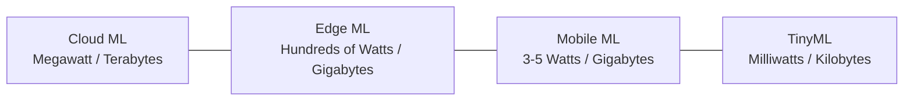
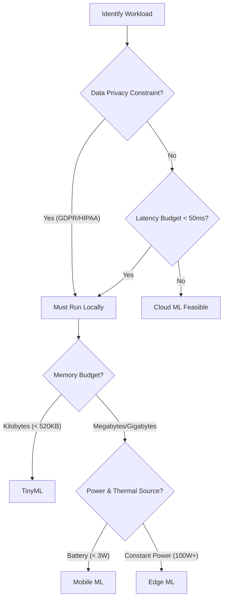

# Chapter 2: Deployment Paradigms (Cloud, Edge, Mobile, TinyML)

## Material Covered in This Chapter

- Purpose
- Learning Objectives
- 2.1 Deployment Paradigm Framework
- 2.2 The Architectural Anchor: The Single-Node Stack
- 1 Deployment Paradigm:
- 2.3 Physical Constraints: Why Paradigms Exist
- The light barrier
- The power wall
- The memory wall
- Checkpoint 2.1: Physical constraints and deployment
- 2.4 Analyzing Workloads
- 2.4.1 The bottleneck principle
- Napkin Math 2.1: The energy of transmission
- Variables:
- Definition 2.1: The iron law
- 2.4.2 Workload archetypes
- Lighthouse 2.1: Five reference workloads
- 2.5 System Balance and Hardware
- Systems Perspective 2.1: System balance across paradigms
- Napkin Math 2.2: ResNet-50 on cloud vs. mobile
- Analysis:
- (a) Cloud: NVIDIA A100 (batch=1, FP16)
- (b) Mobile: Flagship NPU (batch=1, INT8)
- 2.6 Cloud ML: Computational Power
- Definition 2.2: Cloud ML
- Napkin Math 2.3: The distance penalty
- Physics:
- 2.6.1 Cloud infrastructure and scale
- 2.6.2 Cloud ML trade-offs and constraints
- Napkin Math 2.4: Cloud vs. edge TCO
- 2.6.3 Large-scale training and inference
- Part 2: the infrastructure wall
- 2.7 Edge ML: Latency and Privacy
- Definition 2.3: Edge ML
- Napkin Math 2.6: The bandwidth bottleneck
- 2.7.1 Edge ML benefits and deployment challenges
- 2.7.2 The data locality invariant
- Definition 2.4: The data locality invariant
- Napkin Math 2.7: Napkin math: The locality crossover
- Calculation:
- 21
- Napkin Math 2.8: Edge inference sizing
- Requirements Analysis
- Hardware Selection
- 2.7.3 Real-time industrial and IoT systems
- 2.8 Mobile ML: Offline Intelligence
- Definition 2.5: Mobile ML
- Napkin Math 2.9: The battery tax
- Napkin Math 2.10: The thermal wall
- Physics:
- 2.8.1 Mobile ML benefits and resource constraints
- 2.8.2 Personal assistant and media processing
- 2.9 TinyML: Ubiquitous Sensing
- Napkin Math 2.11: Energy per inference
- 2.9.1 TinyML advantages and operational trade-offs
- 2.9.2 Environmental and health monitoring
- 2.10 Paradigm Selection
- 2.10.1 Quantitative trade-off analysis
- 2.10.2 Decision framework
- Napkin Math 2.12: Autonomous vehicle emergency braking
- Walking through the decision framework:
- Systems Perspective 2.2: The complexity tax
- Checkpoint 2.2: System design
- Decision Gates
- 2.11 Hybrid Architectures
- Definition 2.7: Hybrid ML
- 2.11.1 Integration patterns
- Systems Perspective 2.3: Pattern selection guide
- Hierarchical Processing -Trade-off: Local autonomy vs. global optimization
- Progressive Deployment -Trade-off: Model quality vs. deployment reach
- 2.11.2 Production system integration
- 2.11.3 Why hybrid approaches work
- Design Sanity Checks
- War Story 2.1: The Zillow Offers collapse (2021)
- 2.12 Fallacies and Pitfalls
- 2.13 Summary
- Key Takeaways: Same model, different engineering
- What's Next: From theory to process

---

## Section-by-Section Preserve-and-Extend

# Chapter 2: Deployment Paradigms (Cloud, Edge, Mobile, TinyML)

In production Machine Learning systems, the model itself is only a small component of a larger software-hardware
ecosystem that includes data collection, feature processing, serving infrastructure, monitoring, and resource
management. Where an ML model executes shapes what is possible in ways no algorithmic choice can override.

---

## 2.1 Deployment Paradigm Framework

The physical constraints of latency, power, and memory partition ML deployment into **four distinct paradigms**. These
paradigms span **nine orders of magnitude** in power consumption (megawatts to milliwatts) and memory capacity
(terabytes to kilobytes):



These boundaries are dictated by physical laws rather than software conventions. A self-driving car cannot afford the
network round-trip latency to a cloud server, and a micro-controller cannot accommodate or cool a multi-billion
parameter model.

---

## 2.2 The Architectural Anchor: The Single-Node Stack

To analyze any ML system before projecting it onto a distributed fleet, we anchor our design decisions in the four-layer
**Single-Node Stack**:

1. **Application (The Mission)**: Defines high-level requirements (training throughput, serving latency SLAs). Manages
the "Dual Mandate" of balancing algorithm accuracy with physical runtime limits.
2. **ML Framework (The Compiler)**: Maps high-level math (PyTorch, JAX) to hardware-specific execution plans. Manages
the computational graph, automatic differentiation, and memory scheduling.
3. **Operating System (The Runtime)**: Interfaces the framework with physical hardware. Handles low-level resource
orchestration, including the CUDA Runtime for kernel management and PCIe DMA (Direct Memory Access) for host-to-device
data transfers.
4. **Hardware (The Silicon)**: The physical foundation where operations are executed. Defined by HBM (High Bandwidth
Memory) capacity, SRAM hierarchies, and high-speed intra-node interconnects (e.g., NVLink at 900 GB/s). Here, the memory
wall acts as the primary bottleneck.

---

## 2.3 Physical Constraints: Why Paradigms Exist

The deployment landscape is shaped by three permanent physical boundaries:

### 1. The Light Barrier
The speed of light in optical fiber (\(v_c \approx 200,000 \text{ km/s}\), or \(\sim \frac{2}{3} c\)) establishes an
absolute physical floor on network round-trip latency (\(T_{\text{RTT}}\)):

\[ T_{\text{RTT}} = \frac{2 \cdot d}{v_c} \]

For a fiber-optic transmission across the continental United States (\(d \approx 3,600 \text{ km}\) from California to
Virginia), the minimum theoretical round-trip latency is:

\[ T_{\text{RTT}} \ge \frac{2 \cdot 3,600 \text{ km}}{200,000 \text{ km/s}} = 36 \text{ ms} \]

Actual cloud routing and TCP/IP software overhead typically inflate this latency to \(60\text{–}150 \text{ ms}\).
Consequently, safety-critical tasks requiring sub-10 ms response times must execute locally (Edge, Mobile, or TinyML).

### 2. The Power Wall
Thermodynamic heat dissipation limits performance. Under classical Dennard scaling (which broke down around 2005 at the
90 nm node due to leakage current), voltage and current scaled down proportionally with transistor sizes, maintaining
constant power density.
The relationship between power consumption, capacitance (\(C\)), voltage (\(V\)), and frequency (\(f\)) is expressed as:

\[ \text{Power} \propto C \cdot V^2 \cdot f \]

Since voltage scales proportionally to frequency (\(V \propto f\)) to maintain stability, power scaling becomes cubic:

\[ \text{Power} \propto f^3 \]

When Dennard scaling collapsed, increasing frequency further created unmanageable power densities. This forced a
transition toward parallel architectures (multi-core, GPUs, TPUs) and hardware specialization. Battery-powered mobile
devices hit a strict thermal envelope at \(3\text{–}5 \text{ W}\); exceeding this boundary triggers **thermal
throttling**, forcing the operating system to drop clock frequencies (e.g., reducing model inference from 60 FPS down to
15 FPS to prevent physical damage).

### 3. The Memory Wall
The performance gap between processor compute throughput and memory access bandwidth is widening. Over the past decades,
processor compute capacity has doubled roughly every 18 months, whereas memory bandwidth has increased by only \(\sim
20\%\) annually (a relative divergence of \(\sim 1.33\times\) per year). This divergence makes data movement between
external memory and processing registers the dominant performance bottleneck and primary source of energy consumption in
modern ML workloads.

---

## 2.4 Analyzing Workloads

### 2.4.1 The Iron Law of ML Systems
The total time (\(T_{\text{total}}\)) required for an ML workload is modeled by decomposing latency into data movement,
compute, and fixed overhead:

\[ T_{\text{total}} = \frac{D_{\text{vol}}}{\text{BW}} + \frac{O}{R_{\text{peak}} \cdot \eta_{\text{hw}}} + L_{\text{lat}} \]

where:
* \(D_{\text{vol}}\) is the total volume of data moved (model weights, activations, inputs/outputs).
* \(\text{BW}\) is the memory bandwidth.
* \(O\) is the total number of operations required.
* \(R_{\text{peak}}\) is the peak compute capacity of the processor (in FLOPS or TOPS).
* \(\eta_{\text{hw}}\) is the hardware utilization efficiency (\(0 \le \eta_{\text{hw}} \le 1\)).
* \(L_{\text{lat}}\) is the fixed system latency (driver overhead, kernel launch latency, scheduling delays).

### 2.4.2 The Bottleneck Principle
For continuous task streams processed via pipelined execution, data prefetching overlaps memory access with active
computation. Whichever operation is slower determines the system's throughput, transforming the additive Iron Law into a
maximum function:

\[ T_{\text{pipelined}} = \max\left( \frac{D_{\text{vol}}}{\text{BW}}, \frac{O}{R_{\text{peak}} \cdot \eta_{\text{hw}}}, T_{\text{network}} \right) + L_{\text{lat}} \]

where \(T_{\text{network}}\) represents network communication time. If a workload is memory-bound
(\(\frac{D_{\text{vol}}}{\text{BW}} > \frac{O}{R_{\text{peak}} \cdot \eta_{\text{hw}}}\)), upgrading to a faster
processor (\(R_{\text{peak}}\)) yields \(0\%\) speedup.

---

### Napkin Math 2.1: The Energy of Transmission
**Problem**: Determine whether a remote battery-powered sensor should transmit raw audio data to the cloud or process it
locally.

**Variables**:
* Transmission energy (\(E_{\text{tx}}\)): \(100 \text{ mJ/MB}\) (Wi-Fi/LTE)
* Data volume (\(D_{\text{vol}}\)): \(1 \text{ MB}\) (approx. one second of audio)
* Compute energy (\(E_{\text{local}}\)): \(0.1 \text{ mJ/inference}\) (MobileNet running on a local NPU)

**Calculations**:
1. **Cloud Offloading**:
   \[ E_{\text{cloud}} \approx D_{\text{vol}} \cdot E_{\text{tx}} = 1 \text{ MB} \cdot 100 \text{ mJ/MB} = 100 \text{ mJ} \]
2. **Local Inference**:
   \[ E_{\text{local}} \approx 0.1 \text{ mJ} \]

**Systems Conclusion**: Local processing is \(1,000\times\) more energy-efficient than raw data transmission. The
hardware energy constraint dictates local execution at the edge or TinyML tier.

---

### 2.4.3 Workload Archetypes and the Five Lighthouse Models
Workloads are classified by their dominant Iron Law bottleneck rather than their model family:

1. **Compute Beast**: Characterized by high arithmetic intensity (operations per byte loaded). Training large networks
and running dense vision models belong here.
2. **Bandwidth Hog**: Spends more time reading model parameters from memory than computing. Autoregressive token
generation in LLMs is the canonical example.
3. **Sparse Scatter**: Features irregular memory access patterns and poor cache locality. Recommendation models with
massive embedding tables are typical.
4. **Tiny Constraint**: Operates under strict physical limits (\(< 1 \text{ mW}\) power, \(< 256 \text{ KB}\) RAM).

To ground these archetypes, the book uses **five Lighthouse Models** as reference points:

| Lighthouse Model | Archetype | Target Deployment Paradigm | Hardware Bottleneck |
| :--- | :--- | :--- | :--- |
| **ResNet-50** | Compute Beast | Cloud training / Edge inference | FLOPS bounded (training); Memory BW bounded (single-image inference) |
| **GPT-2 / Llama** | Bandwidth Hog | Cloud / High-end Edge inference | Memory Bandwidth (weight streaming during autoregressive loop) |
| **DLRM** | Sparse Scatter | Cloud only (Distributed) | Memory Capacity (embedding tables \(\ge 100 \text{ GB}\)) and memory access latency |
| **MobileNet** | Compute Beast (Efficient) | Mobile / Edge | Peak Mobile NPU throughput & thermal dissipation limits |
| **Keyword Spotting (KWS)** | Tiny Constraint | TinyML | Micro-controller SRAM limit (\(< 256\text{–}520 \text{ KB}\)); always-on energy draw |

---

## 2.5 System Balance and Hardware

Deploying an ML model requires matching workload profiles to hardware specs.

### Latency Scale Reference
The table below logs order-of-magnitude latencies that dictate system boundaries:

| Category | Operation | Latency | Deployment Implication |
| :--- | :--- | :--- | :--- |
| **Compute** | GPU matrix multiply (per op) | \(\sim 1 \text{ ns}\) | Core arithmetic is rarely the standalone bottleneck. |
| | NPU inference (MobileNet) | \(5\text{–}20 \text{ ms}\) | Mobile platforms can achieve real-time vision. |
| | LLM token generation | \(20\text{–}100 \text{ ms}\) | Aligns with human reading speed ("typing speed"). |
| **Memory** | L1 cache hit | \(\sim 1 \text{ ns}\) | Maximizing register reuse is vital. |
| | HBM read (GPU) | \(20\text{–}50 \text{ ns}\) | \(20\text{–}50\times\) slower than registers. |
| | DRAM read (mobile) | \(50\text{–}100 \text{ ns}\) | Memory accesses throttle throughput. |
| **Network** | Intra-datacenter transfer | \(0.5 \text{ ms}\) | Microservices and model parallelism are feasible. |
| | Same-region round-trip | \(1\text{–}5 \text{ ms}\) | Edge servers are viable for interactive tasks. |
| | Cross-region round-trip | \(50\text{–}150 \text{ ms}\) | Restricts deployment to batch processing. |
| **ML Ops** | Wake-word detection (TinyML) | \(100 \ \mu\text{s}\) | Enables always-on, low-latency wake routines. |
| | Face detection (mobile) | \(10\text{–}30 \text{ ms}\) | Sustains real-time 30 FPS video pipelines. |
| | GPT-4 first token (TTFT) | \(200\text{–}500 \text{ ms}\) | User notices the initial response delay. |
| | ResNet-50 training step | \(200\text{–}400 \text{ ms}\) | Optimized for massive throughput. |

---

### D·A·M × Phase Matrix
Every machine learning system changes its demands on **Data, Algorithm, and Machine** depending on whether it is in the
training (mutable) or inference (immutable) phase:

| Component | Training Phase (Mutable) | Inference Phase (Immutable) |
| :--- | :--- | :--- |
| **Data** | High-throughput: large batches, data shuffling, online augmentation. | Low-latency: single inputs, strict data freshness, rapid ingestion. |
| **Algorithm** | Bidirectional: forward pass + backward pass, optimizer state tracking. | Unidirectional: forward pass only, frozen parameters. |
| **Machine** | Throughput-optimized: high-bandwidth clusters, massive memory footprints. | Latency-optimized: localized edge accelerators, low-power envelopes. |

---

### Napkin Math 2.2: ResNet-50 Inference on Cloud vs. Mobile NPU
**Problem**: Compare whether batch-1 inference for ResNet-50 (4.1 GFLOPs, FP16 size = 51.2 MB, INT8 size = 25.6 MB) is
compute or memory-bound on (a) a cloud GPU (NVIDIA A100) and (b) a mobile NPU.

**Inputs**:
* **NVIDIA A100**: Peak compute \(R_{\text{peak}} = 312 \text{ TFLOPS}\) (FP16); Memory Bandwidth \(\text{BW} = 2.0
\text{ TB/s}\).
* **Mobile NPU**: Peak compute \(R_{\text{peak}} = 35 \text{ TOPS}\) (INT8); Memory Bandwidth \(\text{BW} = 100 \text{
GB/s}\).

**Analysis (a) Cloud GPU**:
1. Compute time:
   \[ T_{\text{comp}} = \frac{4.10 \cdot 10^9 \text{ FLOPs}}{3.12 \cdot 10^{14} \text{ FLOPS}} \approx 0.013 \text{ ms} \]
2. Memory movement time:
   \[ T_{\text{mem}} = \frac{5.12 \cdot 10^7 \text{ Bytes}}{2.00 \cdot 10^{12} \text{ Bytes/s}} \approx 0.025 \text{ ms} \]
3. Arithmetic Intensity:
   \[ \text{Arithmetic Intensity} = \frac{4.10 \cdot 10^9 \text{ FLOPs}}{5.12 \cdot 10^7 \text{ Bytes}} = 80 \text{ FLOPs/Byte} \]
   *Hardware Balance Point* of the A100 is:
   \[ \frac{3.12 \cdot 10^{14} \text{ FLOPS}}{2.00 \cdot 10^{12} \text{ Bytes/s}} = 156 \text{ FLOPs/Byte} \]
   Since \(80 < 156\), the workload is **memory-bound** at batch-1.

**Analysis (b) Mobile NPU**:
1. Compute time:
   \[ T_{\text{comp}} = \frac{4.10 \cdot 10^9 \text{ OPs}}{3.50 \cdot 10^{13} \text{ OPS}} \approx 0.12 \text{ ms} \]
2. Memory movement time:
   \[ T_{\text{mem}} = \frac{2.56 \cdot 10^7 \text{ Bytes}}{1.00 \cdot 10^{11} \text{ Bytes/s}} \approx 0.26 \text{ ms} \]
3. Arithmetic Intensity:
   \[ \text{Arithmetic Intensity} = \frac{4.10 \cdot 10^9 \text{ OPs}}{2.56 \cdot 10^7 \text{ Bytes}} \approx 160 \text{ OPs/Byte} \]
   *Hardware Balance Point* of the Mobile NPU is:
   \[ \frac{3.50 \cdot 10^{13} \text{ OPS}}{1.00 \cdot 10^{11} \text{ Bytes/s}} = 350 \text{ OPs/Byte} \]
   Since \(160 < 350\), the mobile workload is also **memory-bound**.

**Systems Insight**: Even with massive hardware differences, single-instance inference is memory-bandwidth bound on both
platforms. This mathematically demonstrates why quantization (reducing bytes transferred) is a more effective serving
optimization than increasing raw processor FLOPS.

---

### Hardware Spectrum and Deployment Thresholds
The tables below outline the hardware configurations and performance parameters defining the deployment spectrum:

#### Table 2.4: Concrete Platforms
| Paradigm | Representative Device | Processor | Memory | Storage | Power | Price |
| :--- | :--- | :--- | :--- | :--- | :--- | :--- |
| **CloudML** | Google TPU v4 Pod | 4,096 TPU v4 chips, \(> 1 \text{ EFLOP}\) | 131 TB HBM2 | PB-scale storage | \(\sim 3 \text{ MW}\) | Rental model |
| **EdgeML** | NVIDIA DGX Spark | GB10 Grace Blackwell, \(1 \text{ PFLOPS}\) AI | 128 GB LPDDR5x | 4 TB NVMe SSD | \(\sim 200 \text{ W}\) | $3,000 - $5,000 |
| **MobileML** | Flagship Smartphone | Mobile SoC (CPU + GPU + NPU) | \(8\text{–}16 \text{ GB}\) LPDDR | \(128\text{–}1024 \text{ GB}\) Flash | \(2\text{–}5 \text{ W}\) | \(\ge \$999\) |
| **TinyML** | ESP32-CAM | Dual-core Tensilica @ 240 MHz | 520 KB SRAM | 4 MB Flash | \(0.05\text{–}1.2 \text{ W}\) | \(\sim \$10\) |

#### Table 2.5: Decision Thresholds
| Paradigm | Compute Limit | Memory Bandwidth | Power Envelope | Latency |
| :--- | :--- | :--- | :--- | :--- |
| **CloudML** | \(> 1000 \text{ TFLOPS}\) | \(> 100 \text{ GB/s}\) | PUE \(1.1\text{–}1.3\) | \(100\text{–}500 \text{ ms}\) |
| **EdgeML** | \(\sim 1 \text{ PFLOPS}\) AI | \(> 270 \text{ GB/s}\) | Hundreds of Watts | \(10\text{–}100 \text{ ms}\) |
| **MobileML** | \(1\text{–}10 \text{ TOPS}\) | \(50\text{–}100 \text{ GB/s}\) | \(2\text{–}5 \text{ W}\) | \(5\text{–}50 \text{ ms}\) |
| **TinyML** | \(< 1 \text{ TOPS}\) | N/A (On-chip SRAM) | \(< 1 \text{ mW}\) always-on target | \(1\text{–}10 \text{ ms}\) |

---

## 2.6 Cloud ML: Computational Power

Cloud ML centralizes compute resources in multi-tenant data centers.

* **Key Characteristics**: Unlimited storage, high-speed scale-out networking, dynamic resource allocation.
* **Benefits & Trade-offs**:
  * *Benefits*: Accelerates large-scale training (e.g., GPT-3 training consuming megawatts of power and millions of
dollars). Elastic scaling allows resizing clusters dynamically.
  * *Trade-offs*: Latency is bounded by the network round-trip time and physical distance (light barrier). High
operational expense (OpEx) through continuous rental fees.
* **Representative Applications**: Large Language Model pre-training, recommendation model training (DLRM), batch
prediction pipelines.

---

## 2.7 Edge ML: Latency and Privacy

Edge ML shifts computation to local on-premises hardware located in retail stores, factory floors, or hospitals.

* **Key Characteristics**: Runs on dedicated physical appliances (gateways, localized edge servers) connected to local
networks.
* **Benefits & Trade-offs**:
  * *Benefits*: Limits latency to local network round-trips (\(10\text{–}100 \text{ ms}\)), bypassing the WAN light
barrier. Restricts data transmission to local networks, addressing regulatory and sovereignty requirements (GDPR,
HIPAA).
  * *Trade-offs*: Higher upfront capital expenditure (CapEx) for physical hardware deployment. On-site environments lack
data center cooling and physical monitoring.
* **Representative Applications**: Real-time manufacturing defect detection, hospital patient monitoring, security
camera stream analysis.

---

## 2.8 Mobile ML: Offline Intelligence

Mobile ML runs inference locally on user smartphones, tablets, or wearable devices.

* **Key Characteristics**: Utilizes heterogeneous system-on-chip (SoC) architectures containing low-power CPUs, GPUs,
and NPUs.
* **Benefits & Trade-offs**:
  * *Benefits*: Runs completely offline, eliminating connectivity requirements. Zero ongoing inference serving costs for
the developer since calculations execute on user-owned hardware.
  * *Trade-offs*: Strictly constrained by battery limits. Sustained workloads must stay below \(2\text{–}3 \text{ W}\)
to prevent thermal throttling and rapid battery drain.
* **Representative Applications**: Real-time camera filters, keyboard text prediction, on-device image search.

---

## 2.9 TinyML: Ubiquitous Sensing

TinyML deploys specialized machine learning models onto micro-controllers that consume milliwatts of power.

### Ecosystem Fragmentation
Unlike the cloud or mobile space where standardized runtimes (PyTorch, TensorFlow Lite) exist, TinyML is fragmented
across hardware architectures (ARM Cortex-M, RISC-V, Xtensa), each featuring different instruction sets, memory layouts,
and toolchains. Optimization requires customizing models for specific silicon targets.

### The Wake-Word Acoustic Power Gate
Always-on systems use a hierarchical wake-word structure to conserve power. A sub-milliwatt micro-controller monitors
audio inputs continuously using a tiny Keyword Spotting model (\(< 200 \text{ KB}\), consuming \(< 1 \text{ mW}\)). This
component acts as an aggressive hardware power gate; the high-power main application processor remains powered down and
is only activated when the wake-word is detected.

### Energy and Inference Life Cycle Comparison
The table below contrasts full-system energy consumption and estimated device battery life across deployment tiers:

| Paradigm | Example Workload | Energy/Inference | Battery Life (3.7V, 3000 mAh Battery) |
| :--- | :--- | :--- | :--- |
| **Cloud** | GPT-4 Query | \(\sim 1 \text{ kJ}\) | \(\sim 40\) queries |
| **Cloud** | ResNet-50 (A100 server) | \(\sim 10 \text{ J}\) | \(\sim 3,996\) inferences |
| **Edge** | ResNet-50 (Jetson board) | \(\sim 500 \text{ mJ}\) | \(\sim 79,920\) inferences |
| **Mobile** | MobileNet (NPU) | \(\sim 50 \text{ mJ}\) | \(\sim 799,200\) inferences |
| **TinyML** | Keyword Spotting (MCU) | \(\sim 10 \ \mu\text{J}\) | \(\sim 4 \text{ billion}\) inferences |

*Note: Energy figures represent full-system energy (including processors, memory, and cooling overhead) rather than
isolated accelerator measurements.*

---

## 2.10 Paradigm Selection Framework

### 2.10.1 Fourteen-Dimension Paradigm Comparison
| Aspect | CloudML | EdgeML | MobileML | TinyML |
| :--- | :--- | :--- | :--- | :--- |
| **Processing Location** | Centralized Data Centers | Local gateways / servers | Smartphones and tablets | Ultra-low-power micro-controllers |
| **Latency** | \(100\text{–}1000 \text{ ms+}\) | \(10\text{–}100 \text{ ms}\) | \(5\text{–}50 \text{ ms}\) | \(1\text{–}10 \text{ ms}\) |
| **Compute Power** | Very High (Multiple GPUs/TPUs) | High (Edge GPUs) | Moderate (Mobile NPUs/GPUs) | Very Low (MCUs) |
| **Storage Capacity** | Unlimited (\(\ge \text{Petabytes}\)) | Large (\(\ge \text{Terabytes}\)) | Moderate (\(\ge \text{Gigabytes}\)) | Very Limited (\(\text{Kilobytes}\)) |
| **Energy Consumption** | Very High (kW-MW range) | High (hundreds of watts) | Moderate (\(1\text{–}10 \text{ W}\)) | Very Low (mW range) |
| **Scalability** | Excellent (virtually unlimited) | Good (limited by local nodes) | Moderate (per-device scale) | Limited (fixed hardware) |
| **Data Privacy** | Basic-Moderate (data leaves node) | High (remains on local network) | High (remains on device) | Very High (raw data stays local) |
| **Connectivity** | Constant high-bandwidth | Intermittent | Optional | None |
| **Offline Capability** | None | Good | Excellent | Complete |
| **Real-time Processing** | Dependent on WAN | Good | Very Good | Excellent |
| **Cost Profile** | High (\(\ge \$1000/month\) OpEx) | Moderate ($100 - $1000 CapEx) | Low (uses user hardware) | Very Low ($1 - $10 per node) |
| **Hardware Targets** | Cloud clusters | Edge servers/gateways | Consumer smartphones | MCUs/embedded systems |
| **Dev Complexity** | High (distributed infrastructure) | Moderate-High (edge+networks) | Moderate (mobile SDKs) | High (embedded toolchains) |
| **Deployment Speed** | Fast | Moderate | Fast | Slow |

---

### 2.10.2 Decision Logic Flowchart
System architects select deployment paradigms using a structured sequence of constraint gates:



---

### Napkin Math 2.3: Autonomous Vehicle Emergency Braking Walkthrough
**Problem**: Select the appropriate deployment paradigm for a vision-based pedestrian detection system driving emergency
braking.

**Evaluation**:
1. **Privacy Gate**: Vehicle camera feeds do not carry strict third-party privacy restrictions. Cloud is initially
candidate.
2. **Latency Gate**: Emergency braking requires a total system response time of \(< 100 \text{ ms}\) to ensure safety at
highway speeds (at \(100 \text{ km/h}\), a vehicle travels \(2.8 \text{ m}\) every \(100 \text{ ms}\)).
   * Network latency to cloud: \(50\text{–}150 \text{ ms}\) (highly variable). This exceeds the safety budget before
model execution.
   * Local edge execution latency: \(10\text{–}30 \text{ ms}\).
   * **Decision**: Cloud ML is eliminated by the light barrier.
3. **Compute Gate**: Pedestrian detection requires \(\sim 10 \text{ GFLOPs}\) per frame. Running at 30 FPS requires
\(300 \text{ GFLOPs/s}\) sustained throughput.
   * TinyML capacity (\(< 1 \text{ GFLOP/s}\)): Fails.
   * Mobile SoC NPU (\(\sim 35 \text{ TOPS}\)): Capable, but sustained thermal throttling limits reliability.
   * Edge GPU (\(\ge 10 \text{ TFLOPS}\)): Passes with margin.
4. **Cost Gate**: Safety-critical hardware cost ($500 - $1000 per vehicle) is justified when amortized over the
vehicle's lifespan.

**Conclusion**: Deployed on an **Edge ML** platform using a local GPU/NPU (e.g., NVIDIA Drive Orin). Cloud is used
solely for training and offline analytics.

---

### 2.10.3 The Complexity Tax
Before adopting machine learning, evaluate the architectural overhead against simpler heuristic baselines:

```
[Heuristic: 50 lines of code] --------------------> Near-zero compute cost, zero drift, minimal maintenance
[ML Pipeline: 50 lines model + 2000 lines infra] -> High compute cost, statistical drift, constant maintenance
```

An ML model that increases accuracy from \(90\%\) to \(95\%\) may be a poor engineering decision if it introduces a
\(40\times\) increase in system complexity.

---

## 2.11 Hybrid Architectures

### Definition: Hybrid ML
Hybrid ML is the architectural strategy of hierarchically distributing machine learning tasks across cloud, edge,
mobile, and tiny devices. It optimizes the latency-compute Pareto frontier by executing time-sensitive tasks locally
while offloading compute-intensive processing to the cloud.

### 2.11.1 Integration Patterns
1. **Hierarchical Processing**: Data flows through computational tiers. TinyML sensors perform local filtering (e.g.,
anomaly detection); Edge nodes aggregate sensor feeds; Cloud platforms handle longitudinal analytics and global updates.
2. **Train-Serve Split**: Decouples resource-heavy training (cloud TPU/GPU clusters costing millions of dollars) from
lightweight serving (local inference on edge nodes).
3. **Progressive Deployment**: Compresses a single model family into multiple targeted binaries (FP32 for cloud, FP16
for edge, INT8 for mobile, binary neural networks for micro-controllers).

---

### Systems Perspective: Pattern Selection Guide
* **Train-Serve Split**:
  * *Choose when*: Training requires scales that inference does not; raw training data cannot be shared but model
parameters are public.
  * *Avoid when*: The model requires continuous online learning directly from edge nodes.
* **Hierarchical Processing**:
  * *Choose when*: Total raw data volume exceeds available network upload bandwidth; decisions must occur at different
time scales.
  * *Avoid when*: Single-tier processing suffices; networks are highly reliable.
* **Progressive Deployment**:
  * *Choose when*: The same application is served across devices with highly variable hardware capabilities.
  * *Avoid when*: The core architecture cannot be compressed without catastrophic accuracy loss.

---

### 2.11.2 Production System Integration
In production systems, trained models deploy downward from cloud registries, while sensor data, telemetry, and labels
stream upward to retrain models and monitor performance:

```
      Cloud ML (TPU Pod)  --- [Deploy Models] --->  Edge ML (Local Servers)
              ^                                                |
        [Data Upload]                                   [Local Serving]
              |                                                v
    Cloud Analytics <--- [Data Summaries] --- TinyML / Mobile Sensors
```

---

## 2.12 Case Study: The Zillow Offers Collapse (2021)

* **Context**: Zillow launched "Zillow Offers" to buy and flip residential homes based on algorithmic home valuations
generated by the "Zestimate" model.
* **Failure**: The valuation model was trained on historical real estate data under stable market conditions. When
COVID-19 introduced extreme market volatility, the live data distribution drifted away from the training distribution.
The model failed to adapt, purchasing thousands of homes at inflated prices that could not be resold at a profit.
* **Consequence**: Zillow wrote down $304 million in housing inventory, terminated \(25\%\) of its workforce (2,000
employees), and shut down the division.
* **Systems Lesson**: All deployed ML models face statistical decay (system entropy). System reliability is defined by
the monitoring and retraining pipelines designed to detect and correct data drift, rather than the static accuracy of
the initial model code.

---

## 2.13 Fallacies and Pitfalls

### Fallacy 1: One deployment paradigm solves all ML problems
Architects attempt to use a single deployment model for all projects. In reality, physical constraints dictate
boundaries: real-time robotics requires local edge processing due to light barrier constraints, whereas large language
model training requires centralized cloud resources.

### Fallacy 2: Model optimization overcomes mobile power and thermal limits
Teams assume quantization or pruning allows running large models indefinitely on battery power. However, sustained
workloads exceeding \(2\text{–}3 \text{ W}\) will trigger thermal throttling, reducing performance by
\(40\text{–}60\%\).

### Fallacy 3: TinyML is just scaled-down mobile ML
TinyML micro-controllers feature a \(10,000\times\) memory reduction compared to smartphones. Mobile ML optimizations
(e.g., standard FP32-to-INT8 quantization) are insufficient when the model must fit into \(64 \text{ KB}\) of SRAM,
requiring custom architectural rewrites.

### Fallacy 4: Model optimization translates linearly to system speedup
Optimizing model inference in isolation ignores other system pipeline stages. This behavior is governed by **Amdahl's
Law**:

\[ \text{Speedup}_{\text{overall}} = \frac{1}{(1-p) + \frac{p}{s}} \]

where \(p\) is the fraction of runtime occupied by the model, and \(s\) is the speedup factor of that model.

*Example*: If a mobile camera application spends \(100 \text{ ms}\) on image capture, \(60 \text{ ms}\) on ML scene
classification, and \(40 \text{ ms}\) on post-processing (total \(200 \text{ ms}\)), optimizing the ML model to run
\(10\times\) faster (\(s = 10\), reducing model latency from \(60 \text{ ms}\) to \(6 \text{ ms}\)) results in an
overall speedup of:

\[ \text{Speedup}_{\text{overall}} = \frac{200 \text{ ms}}{100 \text{ ms} + 6 \text{ ms} + 40 \text{ ms}} = \frac{200 \text{ ms}}{146 \text{ ms}} \approx 1.37\times \]

Even if model execution is reduced to zero (\(s = \infty\)), the system speedup is capped at:

\[ \text{Speedup}_{\text{overall}} \le \frac{200 \text{ ms}}{140 \text{ ms}} \approx 1.43\times \]

### Pitfall 1: Minimizing compute costs minimizes total cost of ownership (TCO)
Choosing edge hosting over cloud to save on compute fees can backfire if the operational costs of maintaining remote
hardware, deploying networks, and monitoring distributed nodes exceed cloud subscription fees.

### Pitfall 2: Assuming more training data always improves deployed performance
If the deployed model capacity is fixed (e.g., a lightweight Keyword Spotting network), training on \(20\times\) more
data yields negligible accuracy improvements due to representation limits, while inflating training and labeling costs.

### Pitfall 3: Deploying a single model binary across all devices
Failing to compile and tune binaries for hardware-specific platforms (e.g., ignoring dedicated mobile NPUs or specific
micro-controller instruction sets) leads to \(3\text{–}5\times\) reductions in efficiency compared to hardware-optimized
binaries.

---

## Full Slice Content (Docling Extract, Preserved Verbatim)

> Each section below preserves the source slice content as extracted by docling. Image placeholders are removed; tables,
equations, code blocks, named artifacts, and footnotes are kept intact.

## Purpose

Why does deploying the same model to a phone vs. a data center demand fundamentally different engineering?

The defining insight of ML systems engineering is that constraints drive architecture. The speed of light sets an
absolute floor on how quickly distant servers can respond. Thermodynamics limits how much computation can occur in a
given volume before heat becomes unmanageable. Memory physics makes moving data often more expensive than processing it.
These are not engineering limitations awaiting better technology; they are permanent physical boundaries that partition
the world into fundamentally distinct operating regimes. A data center can train billion-parameter models but cannot
guarantee low-latency responses to users thousands of miles away. A smartphone can respond instantly but has a fraction
of the memory budget. A microcontroller can run on a coin-cell battery for years but has barely enough compute for a
simple keyword detector. The same model-the same algorithm applied to the same data-demands radically different
engineering in each regime, not because of design preferences but because different physics governs each environment.
Teams that treat deployment as an afterthought-training a model in the cloud and then asking 'how do we ship
this?'-discover too late that the physics of their target environment invalidates months of architectural decisions.
Understanding these regimes transforms deployment from an operational detail into a first-order engineering decision:
the question is never simply 'how do I make this model work?' but rather 'which physical constraints govern my problem,
and how do they shape what is even possible?'

- 2.1 Deployment Paradigm Framework
- 2.2 The Architectural Anchor: The Single-Node Stack
- 2.3 Physical Constraints: Why Paradigms Exist
- 2.4 Analyzing Workloads
- 2.5 System Balance and Hardware
- 2.6 Cloud ML: Computational Power
- 2.7 Edge ML: Latency and Privacy
- 2.8 Mobile ML: Offline Intelligence
- 2.9 TinyML: Ubiquitous Sensing
- 2.10 Paradigm Selection
- 2.11 Hybrid Architectures
- 2.12 Fallacies and Pitfalls
- 2.13 Summary

## Learning Objectives

- Explain how physical constraints (speed of light, power wall, memory wall) necessitate the deployment spectrum from
cloud to TinyML
- Apply the iron law and bottleneck principle to determine whether a workload is compute bound, memory bound, or
I/O-bound
- Map workload archetypes to deployment paradigms using Lighthouse Model examples
- Distinguish the four deployment paradigms (Cloud, Edge, Mobile, TinyML) by their operational characteristics and
quantitative trade-offs
- Apply the decision framework to select deployment paradigms based on privacy, latency, computational, and cost
requirements
- Analyze hybrid integration patterns to determine which combinations address specific system constraints
- Evaluate deployment decisions by identifying common fallacies (including Amdahl's Law limits) and assessing
architecture-requirement alignment
- Identify universal principles (data pipelines, resource management, architecture) that span deployment paradigms and
explain why optimizations transfer between scales

## 2.1 Deployment Paradigm Framework

Consider two extremes: a wake-word detector on a smartwatch and a recommendation engine in a data center. The wake-word
detector represents a TinyML workload operating under milliwatt power budgets and kilobyte memory limits; the
recommendation engine exemplifies a Cloud ML workload requiring terabytes of embedding tables and megawatt-scale
infrastructure. These systems solve different problems under opposite physical constraints, and the infrastructure that
supports them shares almost nothing in common. This reality transforms deployment from an operational afterthought into
a first-order engineering decision, one that the D·A·M taxonomy shown in Figure 1.3 helps us reason about by
foregrounding infrastructure alongside data and algorithms.

W here an ML model runs shapes what is possible in ways no algorithmic choice can override. Yet deployment is far harder
than it appears, and the reason is not the model itself. In production ML systems, the model is often only a small part
of the overall system (Sculley et al. 2015). The surrounding infrastructure consists of data collection, feature
processing, serving infrastructure, monitoring, and resource management. All of this surrounding infrastructure changes
dramatically depending on where the model executes.

The physical constraints that govern each environment (latency, power, and memory) force ML deployment into four
distinct paradigms, each with its own engineering trade-offs and system design patterns. Cloud ML aggregates
computational resources in data centers, offering virtually unlimited computeandstorage at the cost of network latency.
EdgeML movescomputation closer to where data originates, including factory floors, retail stores, and hospitals,
achieving lower latency and keeping sensitive data on-premises. Mobile ML brings intelligence directly to smartphones
and tablets, balancing computational capability against battery life and thermal constraints. TinyML pushes intelligence
to the smallest devices: microcontrollers costing dollars and consuming milliwatts, enabling always-on sensing that runs
for months on a coin-cell battery. These four paradigms span nine orders of magnitude in power consumption (megawatts to
milliwatts) and memory capacity (terabytes to kilobytes), a range so vast that the engineering principles governing one
end of the spectrum barely apply at the other.

These four paradigms exist not because of engineering choices but because of physical laws that no amount of
optimization can overcome. Three fundamental constraints carve the deployment landscape into distinct operating regimes:
the speed of light (establishing latency floors), thermodynamic limits on power dissipation (capping computation per
watt), and the energy cost of memory signaling (creating the memory wall). These are not design preferences but physical
boundaries: a self-driving car cannot be served from a data center 36 ms away, and a 1.5-billion-parameter model cannot
be trained on a microcontroller.

## 2.2 The Architectural Anchor: The Single-Node Stack

To navigate these operating regimes, we anchor our engineering decisions in a four-layer architectural model of the
Single-Node Stack . This model provides the foundational framework for analyzing any ML system before it is projected
onto a larger distributed fleet. Understanding how these layers interact within a single machine is the technical
prerequisite for mastering larger scales.

1. Application (The Mission) : The top layer where high-level requirements (throughput for training loops, latency for
inference serving) are defined. This is where the 'Dual Mandate' of accuracy and physics is managed (Chapter 8, Chapter
13).
2. MLFramework (The Compiler) : The translation layer (PyTorch, JAX) that maps high-level math to hardware-specific
execution plans. It manages the computational graph, automatic differentiation, and memory scheduling (Chapter 7).
3. Operating System (The Runtime) : The interface between framework and hardware, responsible for the low-level
orchestration of resources. This includes the CUDARuntime for kernel management and PCIe DMA (Direct Memory Access) for
efficient data movement between host and device.
4. Hardware (The Silicon) : The physical foundation where bits are transformed. This layer is defined by HBM (High
Bandwidth Memory) capacity and high-speed intra-node interconnects like NVLink (900 GB/s) . Here, the memory wall acts
as the primary physical constraint (Chapter 11).

Every chapter in the first half of this text interrogates one or more of these layers. Mastery of this single-node
regime establishes the 'silicon contract' that governs all subsequent optimization and scaling efforts.

The physics that creates these paradigm boundaries comes first, followed by the analytical tools (iron law, bottleneck
principle, workload archetypes) for mapping workloads to deployment targets. Each paradigm then receives an in-depth
treatment covering infrastructure, trade-offs, and representative applications. Figure 2.1 orients the discussion by
showing where each paradigm sits along the centralization spectrum. The chapter closes with a comparative decision
framework and the hybrid architectures that combine paradigms when no single deployment target satisfies all
requirements.

These physical constraints interact with the iron law of ML systems (Section 1.7), which decomposes end-to-end latency
into data movement, computation, and overhead. Different deployment environments stress different terms of this
equation: cloud systems are typically compute bound, mobile systems hit power walls, and TinyML devices are
memory-capacity-limited. By pairing the physical constraints with the iron law, we develop a quantitative vocabulary for
reasoning about which paradigm fits a given workload and why . To anchor this analysis concretely, the chapter
introduces five Lighthouse Models (ResNet-50, GPT-2, Deep Learning Recommendation Model (DLRM), MobileNet, and a Keyword
Spotter) that span the deployment spectrum and isolate distinct system bottlenecks. These reference workloads recur
throughout the book, providing a consistent basis for comparing optimization techniques across chapters.

Figure 2.1: Distributed Intelligence Spectrum: Machine learning deployment spans from centralized cloud infrastructure
to resource-constrained TinyML devices, each balancing processing location, device capability, and network dependence.
Source: (ABI Research 2024).

These four paradigms function as distinct operating envelopes, each defined by how much power, memory, and network
connectivity is available. Every ML application must fit within at least one

## 1 Deployment Paradigm:

A distinct operating regime whose boundaries are set by physics, not convention. The Cloud-to-TinyML spectrum spans nine
orders of magnitude in power because thermodynamic and electromagnetic constraints create hard walls that no software
optimization can cross, forcing qualitatively different system architectures at each tier. Misidentifying the paradigm
boundary wastes engineering effort: optimizing a cloud model for 5 percent higher throughput is pointless if the
application's 10 ms latency budget demands edge deployment.

2 Latency: The time between issuing a request and receiving a result, corresponding to 𝐿 lat in the iron law. The light
barrier makes this floor irreducible: the speed of light in fiber imposes a ~36 ms minimum round trip across the
continental US, consuming the entire latency budget of a 10 ms safety-critical system before any computation begins.
Every millisecond consumed by distance is a millisecond unavailable for model inference, which is why the light barrier
forces paradigm selection rather than mere optimization.

3 Dennard Scaling: Named after Dennard et al. (1974) at IBM, who showed that as transistors shrink, voltage and current
scale proportionally, keeping power density constant. This held for three decades, delivering 'free' performance gains
each chip generation. When leakage current made further voltage reduction impossible around the 90 nm node (2005-2006),
power density began rising with each generation-ending single-core frequency scaling and forcing the industry toward the
parallelism and specialization (multi-core, GPU, TPU) that now defines MLhardware.

of these envelopes, and that fit determines which algorithms, hardware, and engineering tradeoffs apply. The four
paradigms span a continuous spectrum from centralized cloud infrastructure to distributed ultra-low-power devices.
Figure 2.1 traces this spectrum visually, mapping where each paradigm sits along the centralization axis, while the
table below pins down the quantitative trade-offs.

Table 2.1 compares the quantitative trade-offs across these four paradigms:

Table 2.1: The Deployment Spectrum (Conceptual) : Four paradigms span nine orders of magnitude in power (MW to mW) and
memory (TB to KB). This conceptual overview defines each paradigm by its operating regime; Table 2.4 later grounds these
categories in specific hardware platforms and quantitative decision thresholds. The hardware specifications and physical
constants underpinning these numbers are catalogued in the System Assumptions appendix.

| Paradigm   | Where            | Latency    | Power   | Memory   | Best For                     |
|------------|------------------|------------|---------|----------|------------------------------|
| CloudML    | Data centers     | 100-500 ms | MW      | TB       | Training, complex inference  |
| EdgeML     | Local servers    | 10-100 ms  | 100sW   | GB       | Real-time inference, privacy |
| MobileML   | Smartphones      | 5-50 ms    | 3-5W    | GB       | Personal AI, offline         |
| TinyML     | Microcontrollers | 1-10 ms    | mW      | KB       | Always-on sensing            |

The nine-order-of-magnitude span in Table 2.1 is not an accident of engineering history-it is a consequence of physics.
No amount of optimization can make a data center respond faster than light can travel, or make a microcontroller
dissipate more heat than its surface area allows. The existence of four paradigms, rather than a single universal
solution, follows from three physical laws.

## 2.3 Physical Constraints: Why Paradigms Exist

The physical laws of speed of light, power thermodynamics, and memory signaling dictate that no single 'ideal' computer
exists. Where a system runs reshapes the contract between model and hardware. These three constraints, which we call the
light barrier, power wall, and memory wall, govern the engineering trade-offs ahead. 1

## The light barrier

The light barrier establishes the absolute latency 2 floor. The minimum round-trip time is governed by Equation 2.1:

California to Virginia (~3,600 km straight-line) requires ~36 ms minimum before any computation begins. Actual cloud
services typically add 60-150 ms of software overhead. Applications requiring sub-10 ms response cannot use distant
cloud infrastructure-physics forbids it. This constraint creates the need for Edge ML and TinyML: when latency budgets
are tight, computation must move closer to the data source.

## The power wall

The power wall emerged because thermodynamics limits how much computation can occur in a given volume. Under classical
Dennard scaling 3 (which held until approximately 2006), the relationship between power and frequency was cubic. Here 𝐶
is effective capacitance, 𝑉 is voltage, and 𝑓 is clock frequency. As voltage tracks frequency (𝑉 ∝ 𝑓) , power rises as 𝑓
3, as Equation 2.2 shows:

Power ∝𝐶×𝑉 2 ×𝑓 where 𝑉 ∝ 𝑓 ⟹ Power ∝𝑓 3 (2.2) Doubling clock frequency required approximately 8 × more power. The
breakdown of this scaling relationship ended the era of 'free' speedups via frequency scaling and forced the industry
toward the parallelism (multi-core) and specialization (GPUs, Tensor Processing Units (TPUs)) that defines modern ML.
Mobile devices hit hard thermal limits at 3-5 W; exceeding this causes 'throttling,'

<!-- formula-not-decoded -->

where the device reduces performance to prevent overheating. In practice, this means a mobile model that runs at 60 FPS
for 1 minute may throttle to 15 FPS as the device heats up. This physical limit gives rise to Mobile ML: battery-powered
devices cannot simply run cloud-scale models locally.

## The memory wall

The memory wall (Wulf and McKee 1995) reflects the widening bandwidth 4 gap:

Equation 2.3 quantifies this divergence: processors have doubled in compute capacity roughly every 18 months, but memory
bandwidth has improved only ~20 percent annually. This widening gap makes data movement the dominant bottleneck and
energy cost for most ML workloads. This constraint affects all paradigms but is especially acute for TinyML, where
devices have only kilobytes of memory to work with. We examine the hardware architectural responses to the memory wall,
including HBM and on-chip SRAM hierarchies, in detail in Section 11.4.1.

<!-- formula-not-decoded -->

## Checkpoint 2.1: Physical constraints and deployment

Deployment choices are governed by physics, not just preference. Check your understanding:

- □ Light barrier: Can you explain why the speed of light makes cloud ML impossible for <10 ms safety tasks?
- □ Power wall: Do you understand why thermodynamics (heat dissipation) prevents data center models from running on
mobile devices?
- □ Memory wall: Can you explain why data movement is often more expensive (in time and energy) than computation?

These physical laws explain why the four paradigms exist. Physics creates the boundaries; privacy regulation, economic
incentives, and data sovereignty requirements reinforce and sharpen them. We examine these additional drivers within
each paradigm section, but the central insight is that the paradigms would exist even without those concerns. No
regulation can make the speed of light faster, and no economic model can repeal thermodynamics.

Knowing that these barriers exist is necessary but not sufficient. Given a specific ML workload (say, a recommendation
engine or a wake-word detector), we need to determine which paradigm fits and which barrier the workload will hit first.
The answer requires analytical tools that connect workload characteristics to these physical constraints: the iron law
to decompose latency, the bottleneck principle to identify the dominant constraint, and a set of workload archetypes to
classify where each model falls on the spectrum.

## 2.4 Analyzing Workloads

The central analytical tool for this chapter is the iron law of ML systems, established in Section 1.7 and restated here
as Equation 2.4:

This equation decomposes total latency into three terms: data movement (𝐷 vol / BW ) , compute (𝑂/(𝑅 peak ⋅ 𝜂 hw )) ,
and fixed overhead (𝐿 lat ) . For a single inference, these costs simply add up-each is paid sequentially. In production
systems, however, tasks are processed continuously as a stream, and the question shifts from ' how long does one task
take?' to ' which of these three terms actually limits the system?' The answer depends entirely on the deployment
environment: a model that is compute bound during training may become memory bound during inference; a system that runs
efficiently in the cloud may hit power limits on mobile devices. To determine which term dominates, we need a companion
principle.

<!-- formula-not-decoded -->

4 Memory Bandwidth (The memory wall) : The term 'memory wall' was coined by Wulf and McKee in 1995, who predicted that
the processor-memory performance gap would eventually dominate system performance-a prediction that proved prescient for
ML workloads where weight loading, not arithmetic, is the typical bottleneck. In the iron law, bandwidth ( BW ) appears
in the denominator of the data term 𝐷 vol / BW, so every doubling of model size that is not matched by a doubling of
memory bandwidth directly increases wall-clock time. This asymmetry, growing at roughly 1.33 × per year, is why modern
ML systems are more often memory-bound than compute bound.

## 2.4.1 The bottleneck principle

The iron law tells us the cost of each term. The bottleneck principle tells us which term matters . Unlike traditional
software where optimizing the average case works, ML systems are dominated by their slowest component: optimizing fast
operations yields zero benefit while the slowest stage remains unchanged. Modern accelerators use pipelined execution to
overlap data movement with computation: while the accelerator computes on batch 𝑛, the memory system prefetches batch
𝑛+1 . With this overlap, whichever operation is slower determines the system's throughput-the faster one 'hides' behind
it. The iron law's sum becomes a maximum, as Equation 2.5 formalizes:

- 𝐷 vol BW (Memory) : Time to move data between memory and processor.

· 𝑂 𝑅 peak ⋅𝜂 hw (Compute) : Time to execute calculations. · 𝑇 network: Time for network communication (if offloading).
· 𝐿 lat (Overhead) : Fixed latency (kernel launch, runtime overhead). This principle dictates that if a system is memory
bound (𝐷 vol / BW >𝑂/(𝑅 peak ⋅ 𝜂 hw )) , buying faster processors (𝑅 peak ) yields exactly 0 percent speedup -just as
widening a six-lane highway yields no benefit when all traffic must funnel through a two-lane bridge. Engineers must
identify the dominant term before optimizing. This trade-off is governed by the energy of transmission .

<!-- formula-not-decoded -->

## Napkin Math 2.1: The energy of transmission

Problem: Should a battery-powered sensor process data locally (TinyML) or send it to the cloud?

## Variables:

- Transmission energy tx: 100 mJ/MB (Wi-Fi/LTE).
- Data vol: 1 MB (for example, one second of audio).
- Compute energy op: 0.1 mJ/inference (MobileNet on NPU).

(𝐷

)

(𝐸

)

(𝐸

)

Calculation: 1. Cloud approach: 𝐸 cloud ≈𝐷 vol ×𝐸 tx = 1 MB × 100 mJ/MB = 100 mJ . 2. Local approach: 𝐸 local ≈
Inference = 0.1 mJ . Systems conclusion: Transmitting raw data is 1,000 × more expensive than processing it locally.
Even if the cloud had infinite speed ( Time ≈0) , the energy wall makes cloud offloading physically impossible for
always-on battery devices. The 'machine' constraint (battery) dictates the 'algorithm' choice (TinyML).

The iron law's variables interact differently across deployment scenarios. The following definition consolidates these
core performance determinants before specific workload archetypes are examined.

## Definition 2.1: The iron law

<!-- formula-not-decoded -->

1. Significance (quantitative) : It defines the Physical Ceiling for any system by quantifying the relationship between
data volume (𝐷 vol ) , compute capacity (𝑅 peak ) , and communication overhead (𝐿 lat ) .

The iron law is the fundamental physical constraint governing all machine learning performance, expressed as the total
time 𝑇 required for a workload:

5 Workload Archetype: A classification of ML workloads by their dominant iron law bottleneck rather than their model
family. The distinction matters because the optimization strategy differs fundamentally: a compute-bound workload
benefits from faster arithmetic (𝑅 peak ) , while a bandwidth-bound workload benefits only from wider memory buses ( BW
) . Misidentifying the archetype wastes optimization effort on the wrong term of the iron law, as when teams add
accelerator FLOPS to a memory-bound inference pipeline and observe zero speedup.

2. Distinction (durable) : Unlike Amdahl's Law, which focuses on Parallel Speedup, the iron law addresses the Total
Energy and Time required to move and transform data.

The iron law quantifies the cost of each ingredient; the bottleneck principle identifies the speed of the assembly line
. As a rule of thumb, use the additive form (Equation 2.4) when analyzing the latency of a single task, and the max form
(Equation 2.5) when analyzing the throughput of a continuous stream of tasks.

3. Common pitfall: A frequent misconception is that these terms are independent. In reality, they are Trade-off Axes:
for example, increasing batch size may improve the duty cycle (𝜂 hw ) but also increase the data volume (𝐷 vol ) per
request, potentially shifting a compute-bound problem to a memory-bound one.

## 2.4.2 Workload archetypes

The bottleneck principle reduces optimization to a single diagnostic: identifying which constraint dominates for a given
workload. The answer depends on the D·A·M taxonomy in Table 1.4, which decomposes every ML system into Data, Algorithm,
and Machine. Different deployment environments create different bottlenecks along these axes-a cloud server with
terabytes of memory faces algorithm constraints, while a microcontroller with kilobytes faces machine constraints.

The first archetype, the Compute Beast, describes workloads that perform many calculations per byte of data loaded. The
binding constraint is raw computational throughput. Training large neural networks falls into this category.

To navigate these constraints systematically, we categorize ML workloads into four Archetypes 5 . These represent the
primary physical bottlenecks, not just specific model architectures. We introduce each archetype briefly here; the
Lighthouse Models that follow will ground each category in concrete, recurring examples.

The second archetype, the Bandwidth Hog, describes workloads that spend more time loading data than computing. Memory
bandwidth becomes the binding constraint. Autoregressive text generation (like ChatGPT producing one token at a time)
falls into this category.

The fourth archetype, the Tiny Constraint, describes workloads operating under extreme power envelopes ( <1
mW)andmemorylimits ( <256 KB). The binding constraint is energy per inferenceefficiency, not raw speed. Always-on
sensing operates in this regime.

The third archetype, the Sparse Scatter, describes workloads with irregular memory access patterns and poor cache
locality. Memory capacity and access latency constrain performance. Recommendation systems with massive embedding tables
are canonical examples.

These archetypes map naturally to deployment paradigms: compute beasts and sparse scatter workloads gravitate toward
Cloud ML where resources are abundant. Bandwidth hogs span cloud and edge depending on latency requirements. Tiny
constraint workloads are exclusively TinyML territory. To make these abstractions concrete, we anchor each archetype to
a specific model that recurs throughout this book as one of fi ve reference workloads .

## Lighthouse 2.1: Five reference workloads

Throughout this book, we use the five Lighthouse Models summarized in Table 1.5: concrete workloads that span the
deployment spectrum and isolate distinct system bottlenecks. Chapter 6 provides full architectural details and model
biographies.

| Lighthouse   | Archetype                 | Deployment Paradigm            |
|--------------|---------------------------|--------------------------------|
| ResNet-50    | Compute Beast             | Cloud training, edge inference |
| GPT-2/Llama  | Bandwidth Hog             | Cloud inference                |
| DLRM         | Sparse Scatter            | Cloud only (distributed)       |
| MobileNet    | Compute Beast (efficient) | Mobile, edge                   |

Keyword Spotting (KWS)

Tiny Constraint TinyML, always-on

To ground the abstract interdependencies of the iron law in concrete practice, we analyze the Lighthouse Models
summarized in Table 1.5. The following summaries recap each workload from a systems perspective, connecting them to the
specific iron law bottlenecks they exemplify, as visualized in the scorecard for our central Smart Doorbell narrative
(Figure 2.2).

Figure 2.2: The Hierarchy of Constraints: Smart Doorbell Scorecard: This visual evaluation of the Smart Doorbell
lighthouse reveals the fundamental systems trade-off. While the model successfully fits within the kilobyte-scale memory
budget (Level 1: PASS), its 101 ms baseline latency exceeds a strict 50 ms real-time response target on the ESP32-S3
(Level 2: FAIL). This indicates that further optimization-such as quantization or architectural pruning-is mandatory
before deployment in this tighter interaction budget.

The first lighthouse, ResNet-50, classifies images into one thousand categories, processing each image through
approximately 4.1 billion floating-point operations using 25.6 million parameters (102 MB at FP32). Used in medical
imaging diagnostics, autonomous vehicle perception pipelines, and as the backbone for content moderation systems, its
regular, compute-dense structure makes it the canonical benchmark for hardware accelerator performance.

The recommendation lighthouse, DLRM (Deep Learning Recommendation Model), powers the 'You might also like'
recommendations on platforms like Meta and Netflix. It maps users and items to embedding vectors stored in tables that
can exceed 100 GB, making memory capacity rather than computation the binding constraint.

The language models GPT-2/Llama power chatbots, code assistants, and content generation tools. These models generate
text one token at a time, requiring the model to read its full parameter set (1.5 billion for GPT-2, 7 to 70 billion for
Llama) from memory for each output token. This sequential memory access pattern creates the autoregressive bottleneck
that dominates serving costs.

The mobile lighthouse, MobileNet, runs in smartphone camera apps for real-time photo categorization and on-device visual
search. It performs the same image classification task as ResNet but uses depthwise separable convolutions to reduce
computation by 14 × , enabling real-time inference on smartphones at 2 to 5 watts.

The range in compute requirements and memory footprints explains why no single deployment paradigm fits all workloads. A
keyword spotter can operate with roughly 20 MFLOPs and 800 KB, while ResNet-50 requires about four GFLOPs and roughly
100 MB per image. The reference DLRM example already reaches 100 GB of embeddings, and production DLRM-style
recommendation systems can exceed 100 TB. Language models add a bandwidth-dominated regime: billions of pa-

The TinyML lighthouse, Keyword Spotting (KWS) , represents the always-on sensing archetype. Used in applications like
Smart Doorbells, it detects wake words ('Ding Dong', 'Hello') using a depthwise separable convolutional neural network
(CNN) with approximately 200K parameters (small variants; the DS-CNN benchmark in MLPerf Tiny uses ~200K) fitting in
under 800 KB, running continuously at under one milliwatt (Y. Zhang et al. 2017).

6 Critical Path: The longest sequential chain of dependent operations in a pipeline. The decision rule in the triggering
sentence is strict: if a 200 ms crossregion network call appears anywhere on the critical path, a system with a 100 ms
total budget is guaranteed to fail regardless of how fast every other stage runs. In practice, ML inference is rarely
the longest stage; data preprocessing and postprocessing often dominate, making the critical path longer than the model
execution time alone suggests.

7 ML Hardware Cost Spectrum: AI infrastructure spans six orders of magnitude in cost, from $10 microcontrollers to
multimillion-dollar GPU clusters. This million-fold range means deployment paradigm selection is simultaneously a
physics decision and an economics decision. Even within individual-device choices, the same accuracy target may be
achievable on a $2 microcontroller (via aggressive quantization) or a $30,000 GPU (at full precision), with
fundamentally different latency, power, and operational cost profiles.

8 Power Usage Effectiveness (PUE) : This metric isolates the energy overhead (for example, cooling) that determines the
economic viability of the 'MW cloud' paradigm. For a data center, the remaining 6 percent overhead of an elite 1.06 PUE
still translates to megawatts of noncompute cost. This entire cost category does not exist for the 'mW TinyML' paradigm,
explaining a key part of the six-orderof-magnitude economic range.

rameters streamed repeatedly from memory during autoregressive inference. These five Lighthouse Models serve as concrete
anchors throughout the book, each isolating a distinct system bottleneck revisited in every chapter.

Analytical tools alone remain abstract until grounded in real silicon. The next step translates the iron law, bottleneck
principle, and workload archetypes into quantitative engineering decisions by examining how system balance (the
interplay of compute, memory, and I/O) varies across real hardware platforms.

## 2.5 System Balance and Hardware

Physical constraints translate into engineering decisions through concrete numbers. Table 2.2 provides
order-of-magnitude latencies that should inform every deployment decision-spanning eight orders of magnitude from
nanosecond compute operations to hundreds of milliseconds for cross-region network calls. Detailed hardware latencies
and bandwidth constraints are covered in Chapter 11. The key decision rule is simple: an operation with latency >𝑋
cannot appear on the critical path of a system whose latency budget is 𝑋 ms. 6 These latencies, organized by category in
Table 2.2, span eight orders of magnitude:

Table 2.2: Latency Numbers for ML System Design: Order-of-magnitude latencies across compute, memory, network, and ML
operations that determine deployment feasibility. Spanning eight orders of magnitude, from nanosecond compute operations
to hundreds of milliseconds for cross-region network calls, these physical constraints shape architectural decisions.
For a comprehensive quick-reference including energy ratios and scaling rules, see Section D.1.

| Operation                    | Latency    | Deployment Implication           |
|------------------------------|------------|----------------------------------|
| Compute                      |            |                                  |
| GPU matrix multiply (per op) | ~1 ns      | Compute is rarely the bottleneck |
| NPU inference (MobileNet)    | 5-20 ms    | Mobile can do real-time vision   |
| LLM token generation         | 20-100 ms  | Perceived as 'typing speed'      |
| Memory                       |            |                                  |
| L1 cache hit                 | ~1 ns      | Keep hot data in registers       |
| HBMread (GPU)                | 20-50 ns   | 20-50 × slower than compute      |
| DRAMread (mobile)            | 50-100 ns  | Memory bound on most devices     |
| Network                      |            |                                  |
| Same data center             | 0.5 ms     | Microservices feasible           |
| Same region                  | 1-5 ms     | Edge servers viable              |
| Cross-region                 | 50-150 ms  | Batch processing only            |
| MLOperations                 |            |                                  |
| Wake-word detection (TinyML) | 100 μs     | Always-on feasible at<1mW        |
| Face detection (mobile)      | 10-30 ms   | Real-time at 30 FPS              |
| GPT-4 first token            | 200-500 ms | User notices delay               |
| ResNet-50 training step      | 200-400 ms | Throughput-optimized             |

The four deployment paradigms gain precision when grounded in concrete hardware. While Table 2.1 defined the paradigms
conceptually, Table 2.4 (which appears later in this section, after the System Balance discussion) provides specific
devices, processors, and quantitative thresholds that practitioners use to select deployment targets. 7,8 The
nine-order-of-magnitude range in power (MW cloud facilities vs. mW TinyML devices) and the wide cost spread ($millions
vs. $10) determine which paradigm can serve a given workload economically.

These hardware differences translate directly into performance bottlenecks. To understand which constraint dominates in
each paradigm, we apply the bottleneck principle (Section 2.4.1) using the pipelined form of the iron law.

## Systems Perspective 2.1: System balance across paradigms

The pipelined form of the iron law of ML systems from Section 1.7 states that execution time is bounded by the slowest
resource, as Equation 2.6 formalizes:

Here, 𝑂 represents total operations, 𝑅 peak is peak compute rate, 𝜂 hw is hardware utilization efficiency, 𝐷 vol is data
volume, BW is memory bandwidth, BW IO is I/O bandwidth (storage or network), and 𝐿 lat is fixed overhead. The equation
identifies which resource (compute, memory, or I/O) limits performance. For a systematic diagnostic guide to identifying
these bottlenecks, consult the D·A·M taxonomy (Appendix A).

<!-- formula-not-decoded -->

The dominant term varies by paradigm and workload, changing the optimization strategy entirely:

| Paradigm            | Dominant Constraint   | Why                                             | Optimization Focus                           |
|---------------------|-----------------------|-------------------------------------------------|----------------------------------------------|
| Cloud Training      | 𝑂/𝑅 peak (Compute)    | Abundant memory/network; FLOPS limit throughput | Maximize accelerator utilization, batch size |
| Cloud LLM Inference | 𝐷 vol / BW(Memory BW) | Autoregressive: ~1 FLOP/byte, memory-bound      | KV-caching, quantization, batching           |
| Edge Inference      | 𝐷 vol / BW(Memory BW) | Limited HBM; models often memory-bound          | Model compression, operator fusion           |
| Mobile              | Energy (implicit)     | Battery = ∫ Power ⋅𝑑𝑡; thermal throttling      | Reduced precision, duty cycling              |
| TinyML              | vol Capacity          | 256 KB total; model must fit on-chip            | Extreme compression, binary networks         |

𝐷

/

The same ResNet-50 model is compute-bound during cloud training (high batch size, high arithmetic intensity) but
memory-bound during single-image inference (batch=1, low arithmetic intensity) (Williams et al. 2009). Deployment
paradigm selection must account for this shift.

This shift between training and inference is critical to understand. Recall the D·A·M taxonomy from Table 1.4: every ML
system comprises Data, Algorithm, and Machine. Table 2.3 shows how each component behaves differently depending on
whether the system is training (learning patterns) or serving (applying them).

Table 2.3: D·A·M × Phase: The same model imposes starkly different demands on Data, Algorithm, and Machine depending on
whether the system is training or serving. When bottlenecks shift unexpectedly, check which phase is currently being
optimized.

| Component   | Training (Mutable)                                          | Inference (Immutable)                                   |
|-------------|-------------------------------------------------------------|---------------------------------------------------------|
| Data        | Massive throughput: large batches, shuffling, augmentation  | Low latency: single samples, freshness, speed           |
| Algorithm   | Bidirectional: forward + backward pass, optimizer state     | Unidirectional: forward pass only, weights frozen       |
| Machine     | Throughput-optimized: high-bandwidth clusters, large memory | Latency-optimized: edge devices, inference accelerators |

The following worked example demonstrates how to apply this analysis quantitatively by comparing ResNet-50 on cloud vs.
mobile deployment targets.

9 ML Hardware Cost Spectrum: AI infrastructure spans six orders of magnitude in cost, from $10 microcontrollers to
multimillion-dollar GPU clusters. This million-fold range means deployment paradigm selection is simultaneously a
physics decision and an economics decision. Even within individual-device choices, the same accuracy target may be
achievable on a $2 microcontroller (via aggressive quantization) or a $30,000 GPU (at full precision), with
fundamentally different latency, power, and operational cost profiles.

## Napkin Math 2.2: ResNet-50 on cloud vs. mobile

Problem: Is ResNet-50 inference compute bound or memory bound on (a) a high-end data center GPU (NVIDIA A100 class) and
(b) a flagship mobile NPU (Apple/Qualcomm class)? Given (from Lighthouse Models):

- ResNet-50: 4.1 GFLOPs per inference, 25.6 M parameters (102 MB at FP32, 51 MB at FP16)

## Analysis:

## (a) Cloud: NVIDIA A100 (batch=1, FP16)

- Peak compute: 312 TFLOPS (FP16)
- Memory bandwidth: 2 TB/s (HBM2e) · Compute time: 𝑇 comp = 4.10×10 9 3.12×10 14 = 0.013 ms · Memory time: 𝑇 mem =
5.12×10 7 2.04×10 12 = 0.025 ms · Bottleneck: Memory (2 × slower than compute) · Arithmetic intensity: 4.10×10 9 5.12×10
7 = 80 FLOPs/byte-this ratio of compute operations to bytes loaded measures how efficiently a workload uses the
hardware. When arithmetic intensity exceeds the hardware's compute-to-bandwidth ratio (𝑅 peak / BW ) , the workload is
compute bound; below it, the workload is memory bound. For single-image inference, the low batch size yields low
arithmetic intensity, explaining why even powerful GPUs are memory bound at batch=1.

## (b) Mobile: Flagship NPU (batch=1, INT8)

- Peak compute: ~35 TOPS (INT8)-representative of modern mobile NPUs
- Memory bandwidth: ~100 GB/s (LPDDR5)

ResNet-50 becomes compute bound when batch size raises arithmetic intensity above the hardware balance point, Ops
Compute > Bytes Memory BW . On A100, this occurs around batch=64, where activations dominate memory traffic and high
arithmetic intensity is sustained.

· Model size: 26 MB (INT8 quantized) · Compute time: 𝑇 comp = 4.10×10 9 3.50×10 13 = 0.12 ms · Memory time: 𝑇 mem =
2.56×10 7 1.00×10 11 = 0.26 ms · Bottleneck: Memory (2 × slower than compute) Key Insight: Both platforms are memory
bound for single-image inference! The A100's faster memory bandwidth (2 TB/s vs. 100 GB/s = 20 × ) translates to roughly
10 × faster inference; peak compute alone is not the limiting comparison. This explains why quantization (reducing
bytes) often beats faster hardware (increasing FLOPS) for deployment.

As systems transition from Cloud to Edge to TinyML, available resources decrease dramatically. Table 2.4 quantifies this
progression with concrete hardware examples: memory drops from 131 TB (cloud) to 520 KB (TinyML), a 250 million-fold
reduction, while power budgets span nine orders of magnitude from megawatts to milliwatts 9 . This resource disparity is
most acute on microcontrollers, the primary hardware platform for TinyML, where memory and storage capacities are
insufficient for conventional ML models.

Table 2.4 grounds these paradigms in concrete hardware platforms and price points:

Table 2.4: Hardware Spectrum (Concrete Platforms) : Representative devices that instantiate each deployment paradigm
from Table 2.1. Where the conceptual table defines operating regimes, this table provides the specific processors,
memory capacities, power envelopes, and price points that practitioners use to match workloads to hardware. The DGX
Spark sits at the high end of the edge spectrum; most edge deployments use far smaller devices (for example, Jetson Orin
Nano). We include it to illustrate the ceiling of noncloud deployment.

| Category   | Example Device      | Processor                         | Memory         | Storage          | Power                        | Price Range            |
|------------|---------------------|-----------------------------------|----------------|------------------|------------------------------|------------------------|
| CloudML    | Google TPU v4 Pod   | 4,096 TPU v4 chips, >1 EFLOP      | 131 TB HBM2    | Cloud-scale (PB) | ~3MW                         | Cloud service (rental) |
| EdgeML     | NVIDIA DGX Spark    | GB10 Grace Blackwell, 1 PFLOPS AI | 128 GB LPDDR5x | 4 TB NVMe        | ~200W                        | ~$3,000-5,000          |
| MobileML   | Flagship Smartphone | Mobile SoC (CPU + GPU + NPU)      | 8-16GBRAM      | 128 GB-1 TB      | 2 to5W                       | USD 999+               |
| TinyML     | ESP32-CAM           | Dual-core @ 240MHz                | 520KBRAM       | 4 MBFlash        | 0.05-1.2W active board power | $10                    |

These deployment paradigms emerged from decades of hardware evolution, from floating-point coprocessors in the 1980s
through graphics processors in the 2000s to today's domain-specific AI accelerators. Chapter 11 traces this historical
progression and the architectural principles that drove it. Here, we focus on the consequences of this evolution: the
deployment spectrum that results from having qualitatively different hardware available at different points in the
infrastructure.

Each paradigm occupies a distinct region of the deployment spectrum, governed by the physical constraints (light
barrier, power wall, memory wall) and quantified by the analytical tools (iron law, bottleneck principle) introduced
earlier. The quantitative thresholds in Table 2.5 help practitioners determine which paradigm suits their workload. The
following four sections progress from cloud to TinyML, tracing the gradient from maximum computational resources to
maximum efficiency constraints.

Table 2.5: Deployment Decision Thresholds: Quantitative thresholds that practitioners use to determine deployment
feasibility for each paradigm in Table 2.4. These numbers answer the practical question 'can my workload run here?' by
specifying the compute, memory bandwidth, and power envelope that each paradigm provides.

| Paradigm   | Compute      | MemoryBW    | Power                         | Latency    |
|------------|--------------|-------------|-------------------------------|------------|
| CloudML    | >1000 TFLOPS | >100 GB/s   | PUE 1.1-1.3                   | 100-500 ms |
| EdgeML     | ~1 PFLOPS AI | >270 GB/s   | 100sW                         | 10-100 ms  |
| MobileML   | 1-10 TOPS    | 50-100 GB/s | 2 to5W                        | 5-50 ms    |
| TinyML     | <1 TOPS      | -           | <1 mWalways-on average target | 1-10 ms    |

Each section follows a consistent structure: definition, key characteristics, benefits and tradeoffs, and representative
applications. This parallel treatment reveals both what distinguishes each paradigm and what principles they share,
setting the stage for the hybrid architectures that combine them. We begin at the resource-rich end of the spectrum and
progressively tighten the constraints.

## 2.6 Cloud ML: Computational Power

Consider what it took to train GPT-3: 3,634 petaflop-days of computation, 10,000 GPUs running for approximately 15 days,
consuming megawatts of power-at an estimated cost of ~$4.6M 10 . No smartphone, no edge server, no single machine on
Earth could have performed this computation. Only a data center, with its virtually unlimited compute, memory, and
storage, could aggregate enough resources to make this possible. This is the defining proposition of cloud ML: when
latency can be tolerated, it offers computational scale that no other paradigm can match.

Cloud ML aggregates computational resources in data centers 11 to handle computationally intensive tasks: large-scale
data processing, collaborative model development, and advanced analytics. This infrastructure serves as the natural home
for three of the four workload archetypes: compute

10 Large Language Model (LLM) Training Scale: GPT-3 required approximately 3,640 petaflop-days, 10,000 V100 GPUs, and an
estimated $4.6M in compute at 2020 cloud rates. This scale illustrates the core cloud ML trade-off: only centralized
infrastructure can aggregate enough 𝑅 peak for peta-scale training, but the resulting 𝐿 lat penalty (100-500 ms network
round trip) makes that same infrastructure unsuitable for real-time inference.

11 Cloud as Utility Computing: The utility model allows providers to offer a specialized hardware portfolio that is
economically infeasible for a single organization to maintain. This provides direct, on-demand access to the specific
architectures required by each workload archetype: dense accelerator pods for Compute Beasts, HBM-equipped nodes for
Bandwidth Hogs, and high-memory systems with fast interconnects for Sparse Scatter. A team can therefore rent a
purpose-built, $10M+ supercomputing pod for a few hours rather than owning it.

12 Tensor Processing Unit (TPU) : A custom-built processor (ASIC) that delivers petaflop-scale throughput by hard-wiring
its architecture for the matrix multiplication operations that dominate MLworkloads. This extreme specialization trades
generalpurpose flexibility for a >10 × improvement in performanceper-watt compared to a general-purpose accelerator on
the same ML task. The high cost of deploying these accelerators at data center scale is therefore only economical for
massive, sustained ML computation.

beasts like ResNet training that demand sustained TFLOPS across thousands of accelerators, bandwidth hogs like large
language model inference that benefit from TB/s HBM bandwidth, and sparse scatter workloads like recommendation systems
that require terabytes of embedding tables and high-bandwidth interconnects for all-to-all communication patterns.

What unifies these diverse cloud workloads is a single defining trade-off:

Cloud deployments range from single-machine instances (workstations, multi-GPU servers, DGX systems) to large-scale
distributed systems spanning multiple data centers. This book focuses on single-machine cloud systems, where the reader
learns to build and optimize ML systems on individual powerful machines. Future studies can address distributed cloud
infrastructure, where systems coordinate computation across multiple networked machines. This follows the principle of
establishing foundations before adding complexity.

## Definition 2.2: Cloud ML

- Cloud Machine Learning is the deployment paradigm that optimizes for Resource Elasticity by decoupling computational
capacity from physical location. 1. Significance (quantitative) : It enables systems to scale resources (𝑅 peak )
proportional to workload variance, allowing for bursts of peta-flops that would be economically unfeasible to maintain
locally.
3. Common pitfall: Afrequent misconception is that cloud ML is 'unlimited compute.' In reality, it is constrained by the
distance penalty (𝐿 lat ) and the ingestion bottleneck ( BW ) , making it unsuitable for sub-10 ms real-time control
loops.
2. Distinction (durable) : Unlike edge ML, which prioritizes data locality, cloud ML prioritizes computational density
and centralized management.

Figure 2.3 breaks down cloud ML across several dimensions that define its computational paradigm. The Characteristics
branch emphasizes centralization and dynamic scalability, which directly enables the Benefits of scalable data
processing and global accessibility. This centralization, however, creates the Challenges of latency and internet
dependence, shaping the kinds of Examples that thrive in the cloud: virtual assistants, recommendation systems, and
fraud detection. The most fundamental of these challenges, network latency, is not an engineering limitation but a
physics constraint. A quick calculation of the distance penalty after the figure makes this concrete.

## Napkin Math 2.3: The distance penalty

Problem: Consider a real-time safety monitor for a robotic arm. The safety logic requires a 10 ms end-to-end response
time to prevent injury. The model runs in a high-performance cloud data center 1,500 km away. Can the safety budget be
met?

## Physics:

1. Light in Fiber: ~200,000 km/s. 2. Round-trip propagation: (1,500 km × 2)/200,000 km/s = 15 ms . 3. Result: The safety
budget is already negative (-5 ms) before the model even starts its first calculation.

Engineering conclusion: Physics has made cloud ML impossible for this application. The model must move to the Edge.

## 2.6.1 Cloud infrastructure and scale

Cloud ML aggregates computational resources in data centers at unprecedented scale. Figure 2.4 captures the physical
scale behind this abstraction: Google's Cloud TPU 12 data center, where row upon row of specialized accelerators deliver
petaflop-scale training throughput. Table 2.4 quantifies how cloud systems provide orders-of-magnitude more compute and
memory bandwidth than mobile devices, at correspondingly higher power and operational cost. Modern cloud accelerator
systems operate at petaflops to exaflops of peak reduced-precision throughput and require megawattscale facility power
in large clusters. These facilities enable workloads that are impractical on resource-constrained devices, but their
remote location introduces critical trade-offs: network roundtrip latency of 100-500 ms eliminates real-time
applications, and operational costs scale linearly with usage.

Figure 2.3: Cloud ML Decomposition: Characteristics, benefits, challenges, and representative applications of cloud
machine learning, where centralized infrastructure and specialized hardware address scale, complexity, and resource
management for large datasets and complex computations.

The physical reality of petaflop-scale compute is visible in the infrastructure itself: a single facility floor houses
thousands of accelerator chips organized into rows of liquid-cooled racks, each rack consuming kilowatts of power to
sustain the aggregate throughput that no individual device can approach.

Figure 2.4: Cloud Data Center Scale: Rows of server racks illuminated by blue LEDs extend across a Google Cloud TPU data
center floor, housing thousands of specialized AI accelerator chips that collectively deliver petaflop-scale training
throughput. Source: (Google DeepMind 2024).

13 Pay-as-You-Go Pricing: A cloud economic model where users pay for accelerator-hours consumed rather than hardware
owned. Elastic pricing converts the fixed cost of idle 𝑅 peak into a variable cost proportional to actual utilization,
but the inverse also holds: sustained 24/7 workloads (continuous inference serving) often cost 2-3 × more on cloud than
equivalent on-premises hardware amortized over three years, a crossover that drives the total cost of ownership (TCO)
analysis later in this section.

14 GDPR (General Data Protection Regulation) : The European privacy framework (2018) whose 'Right to be Forgotten'
provision creates a systems constraint unique to ML: deleting a user's data may require retraining or finetuning any
model that learned from it, because weight updates are not individually reversible. This transforms a legal requirement
into a compute cost that scales with model size and retraining frequency.

15 HIPAA (Health Insurance Portability and Accountability Act) : This US law translates the security measures from the
context sentence-encryption, access controls, and monitoringinto direct systems-level costs like isolated compute,
immutable logging for every inference, and end-to-end data encryption. These nonnegotiable safeguards are the source of
the 'stringent data handling requirements' and typically add 15-30 percent to infrastructure and operational overhead
for a production ML system.

Cloud ML excels at processing massive data volumes through parallelized architectures, enabling training on datasets
requiring hundreds of terabytes of storage and petaflops of computationresources that remain impractical on constrained
devices. The training techniques covered in Chapter 8 and the hardware analysis in Chapter 11 explain how practitioners
achieve this scale.

Acommonmisconception holds that Cloud ML's vast computational resources make it universally superior. Exceptional
computational power and storage do not automatically translate to optimal solutions for all applications. The Data
Gravity Invariant in Section B.1.1 explains why: as data scales, the cost of moving it to compute (𝐶 move (𝐷) ≫ 𝐶 move (
Compute )) eventually dominates. The trade-offs listed in the preceding definition become concrete when we consider
where edge and embedded deployments excel: real-time response with sub-10 ms decision-making in autonomous control
loops, strict data privacy for medical devices processing patient data, predictable costs through one-time hardware
investment vs. recurring cloud fees, or operation in disconnected environments such as industrial equipment in remote
locations. The optimal deployment paradigm depends on specific application requirements rather than raw computational
capability.

Beyond raw computation, cloud infrastructure creates deployment flexibility through cloud APIs, making trained models
accessible worldwide across mobile, web, and IoT platforms. Shared infrastructure enables multiple teams to collaborate
simultaneously with integrated version control, while pay-as-you-go pricing models 13 eliminate upfront capital
expenditure and scale elastically with demand.

## 2.6.2 Cloud ML trade-offs and constraints

Cloud ML's advantages carry inherent trade-offs that shape deployment decisions. Latency is the most consequential:
network round-trip delays of 100-500 ms make cloud processing unsuitable for real-time applications requiring sub-10 ms
responses, such as autonomous vehicles and industrial control systems. Unpredictable response times further complicate
performance monitoring and debugging across geographically distributed infrastructure.

Cost management introduces operational complexity requiring TCO 16 analysis rather than naive unit comparisons. A worked
cloud vs. edge TCO comparison illustrates the gap between sticker price and true system cost.

Privacy and security pose serious challenges for cloud deployment. Transmitting sensitive data to remote data centers
creates vulnerabilities and complicates regulatory compliance. Organizations handling data subject to regulations like
the General Data Protection Regulation (GDPR) 14 or the Health Insurance Portability and Accountability Act (HIPAA) 15
must implement comprehensive security measures including encryption, strict access controls, and continuous monitoring
to meet stringent data handling requirements. Privacy-preserving ML techniques, including federated learning and
differential privacy, address these challenges at the systems level.

## Napkin Math 2.4: Cloud vs. edge TCO

Scenario: Avision system serving 1M daily inferences (ResNet-50 scale, 10ms latency, 100KB response).

Cloud Implementation (illustrative public list pricing)

| Cost Component       | Calculation                    | Annual Cost   |
|----------------------|--------------------------------|---------------|
| GPU inference (A10G) | 4 instances 8,760 hrs $0.75/hr | ~$26,280      |
| Network egress       | × × 95 GB/day 365 USD 0.09/GB  | ~$3,133       |
| Load balancer        | × × USD 0.025/hr + LCU charges | ~$3,723       |
| CloudWatch/logging   | Monitoring, alerts             | ~$2,000       |
| Total Cloud          |                                | ~$35,136/year |

Edge Implementation (On-premise NVIDIA T4 server)

| Cost Component   | Calculation                      | Annual Cost   |
|------------------|----------------------------------|---------------|
| Hardware CAPEX   | $15,000 server ÷ 3-year life × × | ~$5,000       |
| Power (24/7)     | 300W 8,760 hrs $0.12/kWh         | ~$315         |
| Cooling overhead | ~30 percent of power             | ~$95          |
| Network (fiber)  | Fixed line for remote management | ~$1,200       |
| DevOps labor     | 0.1 FTE $150,000 salary          | ~$15,000      |
| Total Edge       | ×                                | ~$21,610/year |

Break-even Analysis: Equation 2.7 determines when edge deployment becomes cost-effective. Edge Fixed Costs include
hardware amortization and maintenance, Cloud Variable Cost per Unit is the per-inference cloud pricing, and Capacity is
the maximum inference rate of the edge system:

At low volume (<500K inferences/day), cloud wins due to no fixed costs. At high, steady volume (>1M/day), edge wins by
~38%. The crossover occurs around 60 percent sustained utilization .

<!-- formula-not-decoded -->

Key insight: Edge TCO is dominated by labor (69%), not hardware. Organizations without existing DevOps capacity should
factor in the full cost of maintaining on-premise infrastructure.

Unpredictable usage spikes complicate budgeting, requiring comprehensive monitoring and cost governance frameworks.

Despite these trade-offs, cloud ML's computational advantages make it indispensable for consumer applications operating
at global scale.

Network dependency creates a further constraint: any connectivity disruption directly impacts system availability,
particularly where network access is limited or unreliable. Vendor lock-in compounds this problem, as dependencies on
specific tools and APIs create portability challenges when transitioning between providers. Organizations must balance
these constraints against cloud benefits based on their specific application requirements and risk tolerance.

## 2.6.3 Large-scale training and inference

Cloud ML's computational advantages manifest most visibly in consumer-facing applications that require massive scale.
Virtual assistants like Siri and Alexa illustrate the hybrid architectures that characterize modern ML systems:
wake-word detection runs on dedicated low-power hardware (often sub-milliwatt) directly on the device, enabling
always-on listening without draining batteries; initial speech recognition increasingly runs on-device for privacy and
responsiveness; and complex natural language understanding and generation use cloud infrastructure for access to larger
models and broader knowledge.

Economics drive this architecture as much as latency. Attempting to process voice interactions for billions of devices
entirely in the cloud runs into both an economic and an infrastructure ceiling, limits that the following analysis of
the voice assistant wall quantifies.

Napkin Math 2.5: The voice assistant wall

Scenario: 1 billion voice assistant devices (smartphones, smart speakers, earbuds). Can cloud data centers handle this?

Part 1: the economic wall

16 Total Cost of Ownership (TCO) : This analysis quantifies the gap between sticker price and true system cost by
including all direct and indirect costs (power, cooling, labor) over a system's lifetime. The cloud vs. edge decision
makes this explicit, trading high upfront capital expense (CapEx) for hardware against recurring operational expenses
(OpEx) for cloud services. For an onpremise GPU, the initial purchase price is often only 30-40 percent of the
three-year TCO, with the rest dominated by these operational costs.

17 Deep Learning Recommendation Model (DLRM) : Meta's 2019 architecture that exemplifies the 'Sparse Scatter' archetype.
Embedding tables for production recommendation systems can exceed 100 TB, making DLRM constrained by memory capacity and
communication BW rather than raw 𝑅 peak . This inversion of the typical compute-bound assumption forces specialized
cluster designs where memory, not arithmetic, is the scarce resource.

- Cloud cost: ~USD 0.50 per device/year → 1 B devices = USD 500,000,000/year . Economically prohibitive for a free
feature.
- TinyML alternative: 0.1--1 mW local wake-word detection, <USD 0.01/year per device. Viable at any scale.

## Part 2: the infrastructure wall

3. Data center capacity: A large data center (~10,000 GPUs) provides 240,000 GPUhours/day.
2. The economic argument is compelling, but the physics argument is decisive: 1. Query volume: 1 B devices × 20
queries/day = 20 billion queries/day . 2. GPU demand: Each query requires ~200 ms of GPU time. Total: 1,111,111
GPUhours/day .
4. Average requirement: ~ 5 dedicated data centers just for voice inference. 5. Peak reality: Queries cluster in waking
hours (~4.5 × peak-to-average), requiring ~21 data centers at peak.

The bandwidth wall: Wake-word detection requires continuous audio monitoring. If devices streamed audio to the cloud (16
kHz, 16-bit), each transmits ~31 KB/s. Across 1 billion devices: 32 TB/s -a significant fraction of total global
internet backbone capacity.

Engineering conclusion: Cloud-only voice processing is not merely expensive; it is physically impossible at global
scale. Local wake-word detection is an infrastructure necessity, not an optimization.

The voice assistant pipeline illustrates a core systems principle: deployment decisions are constrained by performance
requirements, economic realities, and infrastructure physics. The hybrid approach reduces end-to-end latency relative to
pure cloud processing while maintaining the computational power needed for complex language understanding, all within
sustainable cost boundaries.

These applications share a common thread: they trade latency for scale, accepting hundreds of milliseconds of round-trip
delay in exchange for access to computational resources that no other paradigm can provide. Fraud detection systems
analyzing millions of transactions, recommendation engines processing terabytes of embedding tables, and language models
generating text one token at a time all depend on this bargain. Yet as the voice assistant wall demonstrated, there
exist applications where no amount of cloud compute can compensate for the physics of distance. When latency budgets
drop below what the speed of light permits, or when data volumes exceed what networks can carry, the computation must
move closer to the data source.

Recommendation engines deployed by Netflix and Amazon demonstrate another compelling application of cloud resources.
These systems process massive datasets using collaborative filtering and deep learning architectures like the Deep
Learning Recommendation Model (DLRM) 17 to uncover patterns in user preferences. DLRM exemplifies a
memory-capacity-bound workload: its massive embedding tables, representing millions of users and items, can exceed
terabytes in size, requiring distributed memory across many servers just to store the model parameters. Cloud
computational resources enable continuous updates and refinements as user data grows, with Netflix processing over 100
billion data points daily to deliver personalized content suggestions that directly enhance user engagement.

## 2.7 Edge ML: Latency and Privacy

When latency budgets drop below 100 ms, cloud infrastructure hits a hard physical wall. The Distance Penalty means the
speed of light alone imposes minimum latencies of 40-150 ms for crossregion requests-before any computation begins. When
an autonomous vehicle needs to decide whether to brake, or an industrial robot needs to stop before hitting an obstacle,
100 ms is an eternity. The logical engineering response is to move the computation closer to the data source.

Edge ML emerged from this constraint, trading unlimited computational resources for sub-100 ms latency and local data retention. In archetype terms, edge deployment transforms the optimization target: a bandwidth hog workload like LLM inference that is memory bound in the cloud becomes latency-bound at the edge, where the 50-100 ms network penalty dominates the 10-20 ms compute time. Edge hardware with sufficient local memory can eliminate this penalty entirely, shifting the bottleneck back to the underlying memory bandwidth constraint. Recall the iron law from Equation 2.6: by processing locally, edge deployment eliminates the 𝐷 vol / BWIO (network I/O) term entirely, collapsing the latency to max (𝐷 vol / BW, 𝑂/(𝑅 peak ⋅ 𝜂 hw )) + 𝐿 lat -the same memoryvs.-compute trade-off, but without the network penalty that dominates cloud inference.

We define this paradigm formally as Edge ML .

This paradigm shift is essential for applications where cloud's 100-500 ms round-trip delays are unacceptable.
Autonomous systems requiring split-second decisions and industrial IoT 18 applications demanding real-time response
cannot tolerate network delays. Similarly, applications subject to strict data privacy regulations must process
information locally rather than transmitting it to remote data centers. Edge devices (gateways and IoT hubs) occupy a
middle ground in the deployment spectrum, maintaining acceptable performance while operating under intermediate resource
constraints.

## Definition 2.3: Edge ML

- Edge Machine Learning is the deployment paradigm optimized for Latency Determinism and Data Locality by locating
computation physically adjacent to data sources. 1. Significance (quantitative) : It circumvents the Distance Penalty (𝐿
lat ) of the cloud, trading elastic scale for a fixed Local Compute Capacity (𝑅 peak ) . 2. Distinction (durable) :
Unlike Cloud ML, which prioritizes Throughput, Edge ML prioritizes Determinism and privacy. Unlike TinyML, Edge ML may
still use workstationclass accelerators (GPGPUs).
3. Common pitfall: Afrequent misconception is that edge ML refers to a specific hardware class. In reality, it is a
Location Paradigm: it spans from IoT gateways to on-premise servers, unified by physical proximity to the data source.

Figure 2.5 organizes these trade-offs into four operational dimensions. The Characteristics branch highlights
decentralized processing, which drives the key Benefit of reduced latency. This trade-off, however, introduces
Challenges in maintenance and security, as the physical hardware is distributed and harder to secure than a centralized
data center.

Figure 2.5: Edge ML Decomposition: Characteristics, benefits, challenges, and representative applications of edge
machine learning, where decentralized processing on nearby hardware reduces latency and network dependence at the cost
of constrained compute and memory.

The benefits of lower bandwidth usage and reduced latency become stark when we examine real-world data rates. The
defining characteristic of edge deployment is less about where processing

18 Industrial IoT (IIoT) : Adomain where latency constraints are set by physical safety, not user perception. The 100+
ms round-trip delay mentioned is intolerable for a robotic arm that must halt within 5 ms of detecting a human. This
forces computation to the edge, trading near-zero network latency for significant on-device compute (𝑅 peak )
constraints.

19 IoT Data Wall: Connected devices are projected to exceed 25 billion by 2030 (McKinsey Global Institute 2021), each
generating continuous sensor streams. The aggregate 𝐷 vol from these devices already exceeds global network BW capacity
for centralized ingestion, making local edge processing not an optimization but a physical necessity: the data simply
cannot all reach the cloud.

occurs than about how much data that location must handle. When the data rate exceeds available network capacity, the
resulting bandwidth bottleneck forces processing to the edge regardless of other considerations.

## Napkin Math 2.6: The bandwidth bottleneck

- Problem: Consider a quality control system for a factory floor with 100 cameras running at 30 FPS with 1080p resolution . Should the system stream to the cloud or process at the edge? Physics: 1. Raw data rate per camera: 1920 × 1080 × 3 bytes × 30 FPS ≈ 187 MB/s . 2. Total data rate: 100 cameras × 187 MB/s = 18.7 GB/s . 3. Cloud transfer exposure: Uploading raw camera feeds is primarily a bandwidth, ingest, storage, and processing problem; USD/GB cloud egress charges apply when data is transferred back out of the cloud. If the raw stream were later retrieved at USD 0.09/GB data-transfer-out pricing, the transfer charge alone would reach USD 4.4 M/month .

Engineering conclusion: Physics has made cloud streaming impossible for this application. Edge processing is not
optional-it is mandatory. If an edge server transmits only defect metadata (1 KB per detection at roughly 20
detections/sec across the floor), bandwidth falls by about 933,120 × .

4. Network reality: Even a dedicated 10 Gbps line (1.25 GB/s) cannot carry the load-the workload demands 15 × more
bandwidth than exists.

The preceding bandwidth calculation reveals why edge processing is mandatory for high-volume sensor deployments. For
battery-powered edge devices (wireless cameras, drones, wearables), the constraint is even more severe: as 'The Energy
of Transmission' (Section 2.4.1) established, radio transmission costs 1,000 × more energy than local inference, making
cloud offloading physically impossible for battery-powered devices regardless of available bandwidth. Figure 2.6
quantifies this asymmetry across deployment tiers.

Figure 2.6: Energy Per Inference Across Deployment Paradigms: Full-system energy consumption per inference spans eight
orders of magnitude, from ~10 µJ for TinyML keyword spotting to ~1 kJ for a cloud LLM query. This gap is not an
engineering shortcoming-it reflects the physics of data movement, cooling, and network overhead that separates
deployment tiers. The 100,000,000 × difference explains why always-on sensing is only feasible at the TinyML tier.

## 2.7.1 Edge ML benefits and deployment challenges

Edge ML spans wearables, industrial sensors, and smart home appliances that process data locally 19 without depending on
central servers. Figure 2.6 quantifies the physical imperative: full-system energy per inference spans eight orders of
magnitude across deployment paradigms, from ~10 µJ for a TinyML keyword spotter to ~1 kJ for a cloud LLM query. This
100,000,000 × gap is not an engineering shortcoming to be optimized away; it reflects the irreducible costs of data
movement, cooling, and network overhead that separate deployment tiers. Because edge devices operate within tight power
envelopes, their memory bandwidth of 25-100 GB/s constrains deployable models to 100 MB-1 GB of parameters. This
constraint, in turn, motivates the optimization techniques covered in Chapter 10, which achieve 2-4 × speedup by
compressing models to fit within these hardware budgets. The payoff extends beyond compute: processing 1000 raw camera
feeds locally avoids terabit-scale uplink requirements because raw data never leaves the device, reducing cloud expenses
by $10,000-100,000 annually.

## 2.7.2 The data locality invariant

The decision between local edge processing and remote cloud processing is governed by the data locality invariant. This
principle establishes that data must stay local when the time to transmit it exceeds the total time for remote
processing (including network latency and remote compute).

## Definition 2.4: The data locality invariant

1. Significance (quantitative) : It defines the Locality Crossover, the point where adding cloud compute (increasing 𝑅
peak ) yields zero benefit because the 'Pipe' ( BWnet ) is too narrow for the 'Volume' (𝐷 vol ) .

The Data Locality Invariant states that a workload necessitates local processing whenever the transmission delay (𝐷 vol
/ BWnet ) dominates the remote response time: Data Locality ⟺ 𝐷 vol BWnet >𝐿 net + 𝑂 𝑅 peak, remote

2. Distinction (durable) : Unlike The iron law, which optimizes for time-to-result, the locality invariant optimizes for
architectural feasibility by identifying when network physics forbids remote offloading.
3. Common pitfall: Afrequent misconception is that 5G/6G 'solves' locality. While these improve BW net, they do not
reduce 𝐿 net below the light barrier, meaning latency-critical tasks remain inherently local.

## Napkin Math 2.7: Napkin math: The locality crossover

- Problem: Should a drone's object avoidance system (4K, 60 FPS) offload to the cloud? Variables: · Data (𝐷 vol ) : 4K
frame ≈ 25 MB. · Bandwidth ( BWnet ) : 100 Mbps home broadband (up). · Remote latency net: 110 ms (round-trip + remote
compute).

## Calculation:

1. Transmission time: 25 MB 8 bits/100 Mbps = 1,991 ms .

(𝐿

)

2. Remote response: 110 ms . Systems conclusion: Since 1,991 ms ≫ 110 ms, the system is Bandwidth Blocked . The cloud
could have an infinite processor (𝑅 peak =∞) , but the drone would still crash because it cannot move the bits fast
enough. This workload is Locality Mandatory .

×

Physics forces the architectural choice; the engineering trade-offs follow from it. The most immediate benefit is
latency: response times drop from 100-500 ms in cloud deployments to 1-50 ms at the edge, enabling safety-critical
applications that demand real-time response. Bandwidth savings compound this advantage-a retail store with 50 cameras
streaming video can reduce transmission

20 Edge Server Constraints: Edge hardware typically provides 1-8 GB memory and 5-50 W power, roughly 100 × less than
cloud servers in both dimensions. These constraints cap deployable model size at millions (not billions) of parameters,
making the compression techniques in Chapter 10 essential for achieving sustainable inference duty cycles within the
thermal envelope.

## 21

Edge Fleet Coordination: Managing thousands of distributed edge devices introduces failure modes absent from centralized
cloud: intermittent connectivity causes model version drift, hardware heterogeneity requires per-target optimization,
and physical accessibility makes firmware rollbacks costly. These operational patterns are examined in Chapter 14.

requirements from 100 Mbps (costing $1,000-2,000 monthly) to less than 1 Mbps by processing locally and transmitting
only metadata, a 99 percent reduction. Privacy strengthens in turn, because local processing eliminates transmission
risks and simplifies regulatory compliance. For industrial deployments, operational resilience is the decisive
advantage: systems continue functioning during network outages, a property essential for manufacturing, healthcare, and
building management applications where downtime carries immediate cost.

Security challenges intensify because edge devices are physically accessible: equipment deployed in retail stores or
public infrastructure faces tampering risks that centralized data centers do not, requiring hardware-based protection
mechanisms such as secure boot, encrypted storage, and tamper-evident enclosures. Initial deployment costs of $500-2,000
per edge server compound across locations: instrumenting 1,000 sites requires $500,000-2,000,000 upfront, though these
capital costs are offset by lower long-term operational expenses compared to equivalent cloud spending.

These benefits carry corresponding limitations that compound as deployments scale. Limited computational resources 20
sharply constrain model complexity: edge servers often provide an order of magnitude or more less processing throughput
than cloud infrastructure, limiting deployable models to millions rather than billions of parameters. Managing
distributed networks introduces complexity that scales nonlinearly with deployment size, because coordinating version
control and updates across thousands of devices requires sophisticated orchestration systems 21, and hardware
heterogeneity across diverse platforms demands different optimization strategies for each target.

To make these trade-offs concrete, the following worked example applies edge inference sizing to a realistic retail
deployment scenario.

## Napkin Math 2.8: Edge inference sizing

Scenario: A smart retail chain deploying person detection across 500 stores, each with 20 cameras at 15 FPS.

## Requirements Analysis

| Metric               | Calculation                       | Result             |
|----------------------|-----------------------------------|--------------------|
| Inferences per store | 20 cameras × 15 FPS               | 300 inferences/sec |
| Model compute        | YOLOv8-nano: 8.7 GFLOPs/inference | 2,610 GFLOPs/sec   |
| Required throughput  | 2,610 GFLOPs 2 (headroom)         | ~5 TFLOPS          |

## Hardware Selection

×

| Edge Device           | INT8 TOPS   | Power   | Unit Cost   | Fleet Cost   |
|-----------------------|-------------|---------|-------------|--------------|
| NVIDIA Jetson Orin NX | 25 TOPS     | 10-40W  | USD 600     | USD 300,000  |
| Intel NUC+Movidius    | 1 TOPS      | 15W     | USD 400     | USD 200,000  |
| Google Coral Dev      | 4 TOPS      | 2W      | USD 150     | USD 75,000   |

## 2.7.3 Real-time industrial and IoT systems

Decision: At 5 TFLOPS required and INT8 quantization providing ~4 × effective throughput, the Coral Dev Board (4 TOPS)
meets requirements at 1/4 the cost of Jetson, with 12 × lower power consumption. Note: peak TOPS should be derated by
~50 percent for realistic sustained throughput (due to operator support, data loading, and memory constraints); the 2 ×
engineering headroom partially accounts for this gap. TCO over 3 years (Coral): Hardware USD 75,000 + Power (2 W/1000 ×
500 × 8760 h × 3 yr × USD 0.12/kWh = USD 3,156) = USD 78,156 total vs. cloud inference at ~USD 9,855,000.

Industries deploy edge ML widely where low latency, data privacy, and operational resilience justify the additional
complexity. Autonomous vehicles represent the most demanding application, where safety-critical decisions must occur
within milliseconds based on sensor data that cannot be transmitted to remote servers. Systems like Tesla's Full
Self-Driving process inputs from multiple cameras at high frame rates through custom edge hardware, making driving
decisions with end-toend latency on the order of milliseconds. This response time is infeasible with cloud processing
due to network delays.

The Industrial IoT 23 uses edge ML for applications where millisecond-level responsiveness directly impacts production
efficiency and worker safety. Manufacturing facilities deploy edge ML systems for real-time quality control, with vision
systems inspecting welds at speeds exceeding 60 parts per minute and predictive maintenance 24 applications monitoring
over 10,000 industrial assets per facility. Across various manufacturing sectors, this approach has demonstrated 25-35
percent reductions in unplanned downtime-savings that justify the additional deployment complexity.

Smart retail environments demonstrate edge ML's practical advantages for privacy-sensitive, bandwidth-intensive
applications. Amazon Go 22 stores process video from hundreds of cameras through local edge servers, tracking customer
movements and item selections to enable checkout-free shopping. This edge-based approach addresses both technical and
privacy concerns. Transmitting high-resolution video from hundreds of cameras would require substantial sustained
bandwidth, while local processing keeps raw video on premises, reducing exposure and simplifying compliance.

Smart buildings use edge ML to optimize energy consumption while maintaining operational continuity during network
outages. Commercial buildings equipped with edge-based building
managementsystemsprocessdatafromthousandsofsensorsmonitoringtemperature, occupancy, air quality, and energy usage. This
reduces cloud transmission requirements by an order of magnitude or more while enabling sub-second response times.
Healthcare applications similarly use edge MLfor patient monitoring and surgical assistance, maintaining HIPAA
compliance through local processing while supporting low-latency workflows for real-time guidance.

## 2.8 Mobile ML: Offline Intelligence

These applications share a common assumption: the edge device is stationary and plugged into wall power. Recall the iron
law (Equation 2.6): edge deployment eliminated the 𝐷 vol / BWIO network term that dominated cloud inference, but it
still assumes unlimited energy. A factory edge server consuming 500 W around the clock is unremarkable when connected to
mains power. Billions of users, however, carry their computing devices with them, and those devices run on fixed battery
budgets. When we shift from stationary edge infrastructure to the smartphone in a user's pocket, a new term enters the
optimization: Energy = Power ×𝑇 . The dominant constraint changes from latency to energy per inference, and with it, the
entire engineering calculus.

Edge ML solves the distance problem that limits cloud deployments, achieving sub-100 ms latency through local
processing. However, edge devices remain tethered to stationary infrastructuregateways, factory servers, retail edge
systems. Users do not stay in one place, so neither can their AI. To bring ML capabilities to users in motion, we must
solve a different constraint: the Battery . Unlike plugged-in edge servers that can consume hundreds of watts
continuously, mobile devices must operate for hours or days on fixed energy budgets.

The mobile environment introduces a critical constraint absent from stationary deployments: energy per inference becomes
a first-order design parameter. In the iron law (Equation 2.6), cloud and edge systems optimize for minimizing 𝑇, total
latency. Mobile systems face an additional constraint: Energy = Power ×𝑇, and the power wall (Equation 2.2) caps
sustained power at 2 to 5 W. In archetype terms, a compute beast workload like image classification must be transformed
through architectural efficiency (for example, depthwise separable convolutions 26 in MobileNet) to become a compute
beast (efficient), reducing FLOPs by 14 × while preserving accuracy. This is not

Mobile ML addresses this challenge by integrating machine learning directly into portable devices like smartphones and
tablets, providing users with real-time, personalized capabilities. This paradigm excels when user privacy, offline
operation, and immediate responsiveness matter more than computational sophistication, supporting applications such as
voice recognition, computational photography 25, and health monitoring while maintaining data privacy through on-device
computation. These battery-powered devices must balance performance with power efficiency and thermal management, making
them suited to frequent, short-duration AI tasks.

22 Amazon Go: The system's use of local edge servers is a direct response to the immense data volume from hundreds of
in-store cameras. This architecture avoids having to upload the raw video-which would saturate a multi-gigabit
uplinkwhile also keeping sensitive customer footage on-premises. The edge-first design is necessitated by the sheer
scale of data processed, which can exceed 1 TB per hour in a single store.

- 23 Industry 4.0: The fourth industrial revolution integrates ML into the sensoractuator feedback loop on factory
floors. The systems consequence is that the control loop latency (𝐿 lat ) must be shorter than the physical process it
governs: a welding robot that detects a defect at 60 Hz has 16.7 ms to halt, a budget only edge inference can meet.
- 24 Predictive Maintenance: Models that analyze high-frequency sensor data (for example, vibration, thermal) to
forecast equipment failure, enabling the simultaneous monitoring of thousands of assets. The 'additional deployment
complexity' mentioned stems directly from the edge requirement for continuous, 24/7 on-device inference. This imposes a
strict power budget where the entire sensor and model must often operate on less than one watt, a major constraint
driving model architecture and quantization choices.
- 25 Computational Photography: Uses ML algorithms (for example, multi-frame fusion, neural denoising) to overcome the
physical limits of small mobile camera sensors. This exemplifies the mobile computing trade-off, as a pipeline of 10-15
models must execute within the user's perceived shutter delay (~200 ms) while adhering to a strict, shared 2 to 5 W
thermal budget.

Depthwise Separable Convolutions: An architectural factorization that splits a standard convolution into a depthwise
spatial filter and a pointwise channel mixer, reducing FLOPs by 8-9 × for typical layer configurations. This reduction
is not merely an efficiency improvement but a prerequisite for real-time vision on mobile devices, where the power wall
caps sustained computation at 2 to 5 W.

merely optimization; it represents a qualitative shift in the arithmetic intensity trade-off, accepting lower peak
throughput in exchange for sustainable operation within a 2 to 5 W thermal envelope. We define this paradigm formally as
Mobile ML .

## Definition 2.5: Mobile ML

Mobile Machine Learning is the deployment paradigm bounded by Thermal Design Power (TDP) and battery energy.

1. Significance (quantitative) : It is constrained by the heat dissipation capacity of passive cooling (typically 2-3
W), requiring architectures that prioritize sustained energy efficiency over peak throughput (𝑅 peak ) .
3. Common pitfall: A frequent misconception is that mobile ML performance is a fixed value. In reality, it is a
Time-Varying Constraint: performance often drops as the device hits its thermal wall, triggering throttling that reduces
the duty cycle (𝜂 hw ) .
2. Distinction (durable) : Unlike Edge ML, which may have active cooling, Mobile ML must operate within a Personal
Energy Budget . Unlike TinyML, it still provides a rich OS and multi-watt compute capacity.

These constraints play out concretely in Figure 2.7, which organizes the unique characteristics of mobile deployment.
The Characteristics branch emphasizes sensor integration and on-device processing, which enables key Benefits like
real-time processing and enhanced privacy. However, the Challenges branch reveals battery life constraints and limited
computational resources that force engineers to optimize for sustained efficiency over raw performance.

Figure 2.7: Mobile ML Decomposition: Characteristics, benefits, challenges, and representative applications of mobile
machine learning, where on-device processing and hardware acceleration balance computational efficiency, battery life,
and model performance on smartphones and tablets.

The battery life and resource constraints listed earlier translate directly into engineering requirements. Always-on ML
features incur what we call the battery tax, as the following analysis illustrates.

## Napkin Math 2.9: The battery tax

Problem: Consider deploying a 'real-time' background object detector on a smartphone. The model consumes 2 Watts of
continuous power when active. The phone has a standard 15 Watt-hour (Wh) battery. Can the feature stay on all day?

Physics:

1. Ideal runtime: 15𝑊ℎ 2𝑊 = 7.5 hours 2. The reality: A user expects their phone to last 24 hours. The single feature
has just consumed 100 percent of the entire daily energy budget in a few hours.

Engineering conclusion: The model cannot simply be 'deployed.' The techniques in Chapter 10 (quantization, duty-cycling)
must reduce power to <100 mW for the feature to stay on all day.

The battery constraint limits total energy consumption over time. However, even if we could ignore battery life (say,
for a plugged-in tablet or a short demo), a second physical law intervenes: thermodynamics. Every watt of computation
becomes a watt of heat that must be dissipated. In a data center, massive cooling systems remove this heat. In a thin,
sealed mobile device with no fan, the only heat path is through the glass and metal casing to the surrounding air. This
creates the thermal wall, a hard ceiling on sustained power consumption that exists independently of battery capacity.

## Napkin Math 2.10: The thermal wall

Problem: An unoptimized LLM requires 12 W peak compute. Can it be deployed on a mobile device?

## Physics:

Engineering conclusion: Quantization from FP32 to INT8 reduces power by approximately 4 × , but with a baseline of 12 W
the result is still 3 W-the absolute limit of the hardware. Physics sets a hard ceiling that no optimization can exceed.

1. Thermal design power (TDP) : Amobile system on chip (SoC) allows ≈ 3 Wfor passive cooling. 2. Temperature rise: At 12
W, the device temperature rises at ≈1 ∘ C per second. 3. Thermal trip: Within 60 seconds, the hardware reaches the
Thermal Trip Point ( 80 ∘ C), triggering OS throttling. 4. Result: The 100 FPS model suddenly drops to 30 FPS to avoid
melting the hardware.

## 2.8.1 Mobile ML benefits and resource constraints

Mobile devices exemplify intermediate constraints: 8-16 GB RAM (varying from mid-range to flagship), 128 GB-1 TB
storage, 1-10 TOPS AI compute through Neural Processing Units 27 consuming 2 to 5 W power. System-on-Chip architectures
28 integrate computation and memory to minimize energy costs. Memory bandwidth of 50-100 GB/s limits models to 10-100 MB
parameters, requiring the aggressive optimization techniques that Chapter 10 details. Battery constraints (15-22 Wh
capacity) make energy optimization critical: adding 1 W of continuous ML processing to a phone that otherwise lasts 24
hours would reduce runtime to roughly 9-14 hours, depending on battery capacity. Specialized frameworks provide
hardware-optimized inference enabling <5-50 ms UI response times.

Mobile ML excels at delivering responsive, privacy-preserving user experiences. Real-time processing can reach sub-10 ms
latency for some tasks, enabling imperceptible response in interactive applications. Stronger privacy properties emerge
when sensitive inputs are processed locally, reducing data transmission and central storage, and on-device enclaves such
as Apple's Secure Enclave can further protect sensitive computations like biometric processing 29, though the strength
of privacy guarantees ultimately depends on overall system design and threat model. Offline functionality further
differentiates mobile from cloud: navigation, translation, and media processing all run locally within mobile resource
budgets, eliminating network dependency. Personalization rounds out the advantage, because models can exploit on-device
signals and user context while keeping raw data local.

27 Neural Processing Unit (NPU) : A dedicated hardware block on a mobile System-onChip whose circuits are exclusively
designed for lowprecision matrix multiplication. This specialization avoids the power-intensive instruction logic of a
CPU, yielding a 10-100 × gain in energy efficiency (TOPS/W) that allows high AI throughput to fit within a mobile
device's strict <500 mW sustained power budget.

28 System-on-Chip (SoC) : By integrating CPU, GPU, and NPU cores with shared memory on a single die, the physical energy
cost of data movement is minimized. This tight integration imposes the memory bandwidth constraint that limits mobile
models to a 10-100 MB scale. The design is mandatory for battery life because accessing off-chip memory consumes over
100 × more energy than on-chip access.

29 Face ID: Apple's biometric system projects 30,000 IR dots for 3D face mapping, processed entirely within the Secure
Enclave, an isolated cryptographic coprocessor whose memory is inaccessible even to the main OS. Biometric templates
never leave the device. This architecture achieves a 1:1,000,000 false acceptance rate while eliminating the network
transmission that would otherwise create both a latency penalty and a data breach surface, illustrating that on-device
constraints can simultaneously strengthen privacy and improve accuracy.

30 Portrait Mode Pipeline: This is not a single model but a sequence of real-time models for depth estimation,
segmentation, and rendering. The core engineering problem is managing the pipeline's aggregate latency and power, not
any single model's performance. The entire 10-15 model stack must execute within the user's perceived shutter delay and
share the phone's 2 to 5 W thermal budget, forcing scheduling tradeoffs across the CPU, GPU, and NPU to avoid
throttling.

These benefits require accepting tight resource constraints. Compared to cloud deployments, mobile applications often
operate under much tighter memory, storage, and latency budgets, which constrains model size and batch behavior. Battery
life presents visible user impact, and thermal throttling can materially limit sustained performance: peak NPU
throughput is often substantially higher than what is sustainable under prolonged workloads. Development complexity
multiplies across platforms, demanding separate implementations and careful performance tuning, while device
heterogeneity requires multiple model variants. Deployment friction adds further challenges: app store review processes
can take days, slowing iteration compared to cloud workflows.

## 2.8.2 Personal assistant and media processing

Mobile ML has achieved success across diverse applications for billions of users worldwide, and the engineering
constraints behind these applications illustrate the battery and thermal trade-offs that define this paradigm.
Computational photography exemplifies the challenge of running multiple ML pipelines within a thermal envelope. Modern
flagships process every photo through 10-15 distinct ML models in real-time: portrait mode 30 uses depth estimation and
segmentation, night mode captures and aligns 9-15 frames with ML-based denoising, and HDR merging, super-resolution, and
scene optimization run in sequence. The engineering challenge is not any individual model but the pipeline: these models
must share a 2 to 5 W power budget and complete within the user's perceived shutter delay, requiring careful scheduling
across CPU, GPU, and NPU to avoid thermal throttling.

Health monitoring and augmented reality push mobile ML to its sustained-performance limits. Wearables like Apple Watch
process ECG and accelerometer data entirely on-device to maintain HIPAA compliance, while AR frameworks demand
consistent sub-16 ms frame times at 60 FPS for simultaneous localization, hand tracking, and scene understanding. These
applications represent the ceiling of what battery-powered, passively-cooled devices can sustain, and they define the
boundary beyond which mobile optimization alone is insufficient.

Voice-driven interactions demonstrate mobile ML's layered architecture. Wake-word detection runs continuously at under 1
mW on a dedicated low-power core, speech recognition operates on the NPU at under 10 ms latency, and keyboard prediction
uses context-aware neural models to reduce typing effort by 30-40 percent. Each layer operates at a different power
tier, illustrating how mobile ML partitions workloads across heterogeneous processing units within a single SoC.

These successes can create a misleading sense of ease. A common pitfall involves attempting to deploy desktop-trained
models directly to mobile or edge devices without architecture modifications. Models developed on powerful workstations
often fail when deployed to resource-constrained devices. A desktop ResNet-50 pipeline may require gigabytes once
activations, batches, preprocessing buffers, and runtime overhead are included, even though the FP32 weights alone are
about 102 MB. Such a pipeline, with 4.1 billion FLOPs per inference, cannot run unchanged on a device with 512 MBof RAM
and a 1 GFLOP/s processor. Beyond simple resource violations, desktop-optimized models may use operations unsupported by
mobile hardware (specialized mathematical operations), assume floating-point precision unavailable on embedded systems,
or require batch processing incompatible with single-sample inference. Successful deployment demands architecture-aware
design from the beginning, including specialized architectural techniques for mobile devices such as MobileNet's
depthwise separable convolutions (Howard et al. 2017) (detailed in Chapter 6), integer-only operations for
microcontrollers, and optimization strategies that maintain accuracy while reducing computation.

Mobile ML demonstrates that useful intelligence can operate within a 2 to 5 W thermal envelope on battery power.
However, smartphones still cost hundreds of dollars, require gigabytes of memory, and demand user attention to recharge
daily. These requirements make them unsuitable for a vast class of applications: monitoring soil moisture across a
thousand-acre farm, detecting structural stress in bridge cables, or listening for endangered species in a remote
forest. These scenarios demand not just lower power but a qualitatively different engineering regime, one where the
device costs dollars instead of hundreds, memory is measured in kilobytes instead of gigabytes, and the system runs
unattended for months or years. Mobile optimization techniques such as quantization and depthwise separable convolutions
help, but they cannot bridge a 10,000-fold gap in available memory. What is needed is not a scaled-down smartphone but
an entirely different class of hardware and algorithms.

## 2.9 TinyML: Ubiquitous Sensing

Imagine instrumenting every pallet in a warehouse, every cable on a suspension bridge, every beehive in an apiary. To
put 'eyes and ears' on this many physical objects, tens of thousands to millions, the device must cost dollars, not
hundreds of dollars, and measure millimeters, not centimeters. Smartphones are far too expensive and too large; what is
needed is intelligence at the scale of a postage stamp and the price of a cup of coffee.

Where mobile ML requires sophisticated hardware with gigabytes of memory and multi-core processors, TinyML operates on
microcontrollers 33 with kilobytes of RAM and single-digit dollar price points (Banbury et al. 2021; Lin et al. 2020).
This radical constraint forces an entirely different approach to machine learning deployment, prioritizing ultra-low
power consumption and minimal cost over computational sophistication. TinyML systems power applications such as
predictive maintenance, environmental monitoring, and simple gesture recognition. The energy gap between TinyML and
cloud inference spans at least six orders of magnitude 34 and reaches eight orders for cloud LLM queries, driving
entirely different system architectures and deployment models. This extraordinary efficiency enables operation for
months or years on limited power sources such as coin-cell batteries 35, as exemplified by the device kits in Figure
2.8. These systems deliver actionable insights in remote or disconnected environments where power, connectivity, and
maintenance access are impractical.

TinyML (Janapa Reddi, Plancher, et al. 2022) completes the deployment spectrum by pushing intelligence to its physical
limits. Devices costing less than $10 and consuming less than one milliwatt 31 of power make ubiquitous 32 sensing
economically practical at massive scale. This is the exclusive domain of the tiny constraint archetype, where the
optimization objective shifts from maximizing throughput to minimizing energy per inference. A keyword spotting model
consuming 10 µJ per inference can operate for years on a coin-cell battery, achieving million-fold improvements in
energy efficiency by trading model capacity for operational longevity.

The scale of these constraints becomes tangible when we see the hardware. Figure 2.8 shows development boards measuring
two to 5 cm in length, each containing a microcontroller with kilobytes of SRAM and a power budget measured in
milliwatts. The entire ML inference pipeline, from sensor input to classification output, must fit within these physical
dimensions and energy limits.

Figure 2.8: TinyML System Scale: Small development boards, including Arduino Nano BLE Sense and similar microcontroller
kits approximately 2 to 5 cm in length, with visible processor chips and pin connectors that enable sensor integration
for always-on ML inference at milliwatt power budgets. Source: (Warden 2018).

We define this paradigm formally as TinyML .

Definition 2.6: TinyML

TinyML is the domain of Always-On Sensing constrained by Kilobyte-Scale Memory and Milliwatt-Scale Power .

- 31 The 1 mW Threshold: Below approximately one milliwatt, a device can be powered indefinitely by ambient energy
harvesting-solar cells the size of a thumbnail (~10 mW outdoors, ~10 µW indoors), thermoelectric generators on warm
pipes (~100 µW), or RF energy from nearby transmitters (~10 µW). This crossover transforms the deployment model from
'battery-limited lifetime' to 'deploy and forget,' which is why 1 mW is not an arbitrary target but the physical
boundary that makes TinyML a distinct paradigm rather than merely a scaled-down edge device.
- 32 Ubiquitous Computing: Mark Weiser's vision of 'invisible' technology is achieved when the cost and power of an
intelligent sensor become so low that the economic barrier to mass deployment vanishes. This forces the optimization
objective to shift from performance (throughput) to power (energy per inference), the central trade-off of the tiny
constraint archetype. A keyword spotter achieving a millionfold energy efficiency gain can thus operate for years on a
coin-cell battery, making ubiquitous intelligence practical.
- 33 Microcontroller (MCU) : A single-chip computer whose design prioritizes minimal cost and power over performance,
creating the 'radical constraint' mentioned. This constraint is a hard memory ceiling: ML models must fit entirely
within kilobytes of on-chip SRAM (for example, 32-512 KB), as there is no virtual memory or DRAM like in mobile devices.
This resource floor, often 1,000× lower than a smartphone's, forces the development of entirely new, memory-centric ML
architectures.

34 TinyML Energy Gap: This differential is rooted in hardware design philosophy; cloud GPUs are optimized for raw
throughput, consuming hundreds of watts, while TinyML microcontrollers are designed for near-zero power sleep states.
For ordinary cloud inference, a single request may consume ~1 joule while a specialized TinyML device uses less than one
microjoule, a 1,000,000× gap. Cloud LLM queries can push the comparison even further, as quantified in the
energyper-inference table below.

35 Coin-Cell Deployment: ACR2032 battery (225 mAh at 3 V, ~675 mWh) powers a TinyML model consuming 10-50 µW for 1-10
years. This 'deploy-andforget' operating model constrains models to <100 KB (fitting in on-chip SRAM) and drives
innovation in intermittent computing, where the device sleeps between inferences to stretch the energy budget across
years of unattended operation.

36 On-Device Training Constraints: Full backpropagation requires storing activations for every layer, consuming memory
proportional to model depth. With only 256 KB-2 MB RAM, microcontrollers cannot support this; alternatives like TinyTL
fine-tune only the final layers using <50 KB of working memory. This memory constraint is why TinyML devices are
predominantly inferenceonly, with model updates pushed via firmware rather than learned in situ.

37 TinyML Device Range: This physical range reflects a direct trade-off between deployment context and computational
capability. Millimeter-scale systems prioritize minimal power (~140 µW) for single-function, long-duration tasks,
whereas palm-sized boards trade larger size and higher power for the ability to process multiple complex sensor streams.
This co-design choice creates a >10,000 × power and ~100 × area difference across the operational spectrum of TinyML
devices.

1. Significance (quantitative) : It necessitates models small enough to reside entirely in On-Chip SRAM, avoiding the
high energy cost (100 × higher) of DRAM access to enable continuous inference on milliwatt power budgets.
2. Distinction (durable) : Unlike Mobile ML, which uses multi-watt processors and a full OS, TinyML runs on
Microcontrollers (MCUs) with no operating system abstraction.
3. Common pitfall: A frequent misconception is that TinyML is just 'small models.' In reality, it is an Energy-Bound
Paradigm: the primary metric is Energy per Inference (micro-joules), not just the parameter count.

TinyML's milliwatt-scale power consumption represents a six-order-of-magnitude reduction from cloud inference, a gap
with profound implications for system design. In terms of the iron law (Equation 2.6), TinyML operates in a regime where
the dominant constraint is neither 𝑂/(𝑅 peak ⋅ 𝜂 hw ) nor 𝐷 vol / BW,butatermtheequationdoesnotexplicitlycapture: 𝐷 vol
/ Capacity. When total memory is measured in kilobytes, the model must fit entirely on-chip, and every byte of data
movement costs energy measured in picojoules. The optimization objective shifts from minimizing latency to minimizing
energy per inference -efficiency, not speed.

## Napkin Math 2.11: Energy per inference

Energy consumption spans eight orders of magnitude across deployment paradigms:

| Paradigm   | Example Workload   | Energy/Inference   | Battery Life (3.7V, 3000mAh)   |
|------------|--------------------|--------------------|--------------------------------|
| Cloud      | GPT-4 query        | ~1 kJ              | ~40 queries                    |
| Cloud      | ResNet-50 (A100)   | ~10 J              | ~3,996 queries                 |
| Edge       | ResNet-50 (Jetson) | ~500 mJ            | ~79,920 queries                |
| Mobile     | MobileNet (NPU)    | ~50 mJ             | ~799,200 queries               |
| TinyML     | Keyword spotting   | ~10 µJ             | ~4 billion queries             |

Energy values represent full-system energy (including server CPUs, memory, networking, and cooling overhead), not
isolated accelerator compute energy. For example, the A100 GPU alone executes ResNet-50 inference in under 1 ms (~0.3
J), but the full server draws ~1 kW when amortized across queuing, preprocessing, and idle power.

Key insight: ATinyML wake-word detector at ten µJ/inference is 100,000,000 × more energyefficient than a cloud LLM
query. This gap explains why always-on sensing is only practical at the TinyML tier-a smartphone running continuous
cloud queries would drain in minutes.

Figure 2.9 positions TinyML relative to the other paradigms. The Characteristics branch reveals the extreme constraints:
milliwatt power and kilobyte memory. These limits enable the Benefit of 'always-on' sensing that no other paradigm can
sustain, but force engineers to solve the Challenge of extreme model compression.

## 2.9.1 TinyML advantages and operational trade-offs

TinyML operates at hardware extremes. Compared to cloud systems, TinyML deployments commonly provide roughly 10 6 to 10
9 times less memory, depending on whether the microcontroller budget is in low megabytes or kilobytes, with power
budgets in the milliwatt range. These strict limitations enable months or years of autonomous operation 36 but demand
specialized algorithms and careful systems co-design. Devices range from palm-sized developer kits to millimeter-scale
chips 37, enabling ubiquitous sensing in contexts where networking, power, or maintenance are costly. Representative
developer kits include the Arduino Nano 33 BLE Sense (256 KB RAM, 1 MB flash, 20-40 mW) and ESP32-CAM (520 KB RAM, 4 MB
flash, 50-250 mW).

Figure 2.9: TinyML Decomposition: Characteristics, benefits, challenges, and representative applications of TinyML,
where milliwatt power budgets and kilobyte memory limits enable always-on sensing and localized intelligence in embedded
applications.

TinyML's extreme resource constraints paradoxically enable unique advantages. By avoiding network transmission entirely,
TinyML devices achieve the lowest end-to-end latency in the deployment spectrum, enabling rapid local responses for
sensing and control loops without communication overhead. This self-sufficiency also transforms the economics of
large-scale deployments: when per-node costs drop to single-digit dollars, instrumenting an entire factory floor, farm,
or building becomes financially viable in ways that edge or cloud alternatives cannot match. Energy efficiency compounds
the economic case, enabling multi-year operation on small batteries or even indefinite operation through energy
harvesting. Privacy benefits follow naturally from locality, because raw data never leaves the device, reducing
transmission risks and simplifying compliance. On-device processing alone does not automatically provide formal privacy
guarantees without additional security mechanisms.

Beyond these technical constraints, operational challenges compound the difficulty. Model quality can suffer from
aggressive compression and reduced precision, limiting suitability for applications requiring high accuracy or
robustness. Deployment can also be inflexible: devices may run a small set of fixed models, and updates may require
firmware workflows that are slower and riskier than cloud rollouts. Ecosystem fragmentation 38 across microcontroller
vendors and ML frameworks creates additional overhead and portability challenges.

These capabilities require substantial trade-offs. Computational constraints impose severe limits: microcontrollers
commonly provide 10 5 to 10 6 bytes of RAM, forcing models and intermediate activations into the tens-of-kilobytes to
low-megabytes range depending on the workload. Development complexity requires expertise spanning neural network
optimization, hardware-level memory management, embedded toolchains, and specialized debugging across diverse
microcontroller architectures.

## 2.9.2 Environmental and health monitoring

TinyML succeeds across domains where ultra-low power, low per-node cost, and local processing enable applications that
no other paradigm can sustain.

Precision agriculture exploits TinyML's economic advantages where traditional solutions prove cost-prohibitive (Vasisht
et al. 2017). Deployments can instrument thousands of monitoring points with multi-year battery operation, transmitting
summaries instead of raw sensor streams to reduce connectivity costs.

Wake-word detection is the most familiar consumer application of TinyML. These systems listen continuously at
sub-milliwatt power consumption, processing audio streams locally and activating higher-power components only when a
wake phrase is detected-a design that dramatically reduces average device power draw 39 .

- 38 TinyML Ecosystem Fragmentation: Unlike cloud or mobile ML, where PyTorch or TensorFlow Lite provide a single
optimization path, TinyML spans dozens of incompatible microcontroller families (ARM Cortex-M, RISC-V, Xtensa), each
with different instruction sets, memory layouts, and vendorspecific toolchains. A model optimized for one target often
requires re-quantization and re-validation for another, multiplying the engineering cost of multi-device deployment and
creating portability barriers absent from higher-resource paradigms.

39 Always-OnWake-Word Detection: This sub-milliwatt power target is met by a simple, specialized model that does nothing
but listen for the acoustic signature of the wake phrase. This model acts as an aggressive power gate, preventing the
needless activation of the main application processor, which consumes 100-1,000 × more power. The entire energy-saving
architecture fails if this always-on component exceeds its stringent power budget of roughly one milliwatt.

Wildlife conservation uses TinyML for remote environmental monitoring. Researchers deploy solar-powered audio sensors
consuming 100-500 mW that process continuous audio streams for species identification. By performing local analysis,
these systems reduce satellite transmission requirements from 4.3 GB per day to 400 KB of detection summaries, a 10,000
× reduction that makes large-scale deployments of 100-1,000 sensors economically feasible.

The four deployment paradigms now span the full range from megawatt data centers to milliwatt microcontrollers. Each
paradigm emerged as a response to specific physical constraints, and each excels within its operating envelope. The
question of how an engineer should choose among them, and what to do when no single paradigm satisfies all requirements,
motivates the comparative analysis that follows.

Medical wearables push TinyML into healthcare, where the combination of always-on monitoring and on-device privacy
proves uniquely valuable. FDA-cleared cardiac monitors achieve 95-98 percent sensitivity while processing 250-500 ECG
samples per second at under 5 mW power consumption. This efficiency enables week-long continuous monitoring vs. hours
for smartphone-based alternatives, while reducing diagnostic costs from $2,000-5,000 for traditional in-lab studies to
under $100 for at-home testing.

## 2.10 Paradigm Selection

Each paradigm emerged as a response to specific physical constraints: Cloud ML accepts latency for unlimited compute,
Edge ML trades compute for latency, Mobile ML trades compute for portability, and TinyML trades compute for ubiquity.
Comparing these paradigms quantitatively and selecting among them for a specific application requires a unified
comparison framework and a structured decision process.

## 2.10.1 Quantitative trade-off analysis

Deployment decisions require seeing all four paradigms side by side across the dimensions that matter. A system
architect choosing between edge and mobile deployment needs to compare not just latency, but also power, cost, privacy,
and development complexity simultaneously.

The resulting fourteen-dimension comparison appears in Table 2.6:

Table 2.6 provides this comparison across fourteen dimensions, from compute power and latency to cost and deployment
speed.

Table 2.6: Fourteen-Dimension Paradigm Comparison: Acomprehensive side-by-side comparison across fourteen dimensions
that matter for deployment decisions. Note the inverse relationship between compute power and privacy: Cloud ML provides
the strongest compute but weaker privacy guarantees, while TinyML provides the strongest privacy but the weakest
compute. This table serves as the primary reference for system architects evaluating deployment options.

| Aspect                | CloudML                                  | EdgeML                                 | MobileML                      | TinyML                                                |
|-----------------------|------------------------------------------|----------------------------------------|-------------------------------|-------------------------------------------------------|
| Processing Location   | Centralized cloud servers (Data Centers) | Local edge devices (gateways, servers) | Smartphones and tablets       | Ultra-low-power microcontrollers and embedded systems |
| Latency               | 100 ms-1000 ms+                          | 10-100 ms                              | 5-50 ms                       | 1-10 ms                                               |
| Compute Power         | Very High (Multiple GPUs/TPUs)           | High (Edge GPUs)                       | Moderate (Mobile NPUs/GPUs)   | Very Low (MCU/tiny processors)                        |
| Storage Capacity      | Unlimited (petabytes+)                   | Large (terabytes)                      | Moderate (gigabytes)          | Very Limited (kilobytes-megabytes)                    |
| Energy Consumption    | Very High (kW-MW range)                  | High (hundreds of watts)               | Moderate (1-10 W)             | Very Low (mW range)                                   |
| Scalability           | Excellent (virtually unlimited)          | Good (limited by edge hardware)        | Moderate (per-device scaling) | Limited (fixed hardware)                              |
| Data Privacy          | Basic-Moderate (Data leaves device)      | High (Data stays in local network)     | High (Data stays on phone)    | Very High (Raw data can remain local)                 |
| Connectivity Required | Constant high-bandwidth                  | Intermittent                           | Optional                      | None                                                  |
| Offline Capability    | None                                     | Good                                   | Excellent                     | Complete                                              |

| Aspect                 | CloudML                       | EdgeML                          | MobileML               | TinyML                    |
|------------------------|-------------------------------|---------------------------------|------------------------|---------------------------|
| Real-time Processing   | Dependent on network          | Good                            | Very Good              | Excellent                 |
| Cost                   | High ($1000s+/month)          | Moderate ($100s-1000s)          | Low ($0-10s)           | Very Low ($1-10s)         |
| Hardware Requirements  | Cloud infrastructure          | Edge servers/gateways           | Modern smartphones     | MCUs/embedded systems     |
| Development Complexity | High (cloud expertise needed) | Moderate-High (edge+networking) | Moderate (mobile SDKs) | High (embedded expertise) |
| Deployment Speed       | Fast                          | Moderate                        | Fast                   | Slow                      |

This inverse relationship between privacy and compute is not coincidental-it reflects the inherent trade-off between
data locality and computational scale. Data that stays local cannot be processed at data center scale, and data that
moves to the cloud cannot remain fully private. The archetypeparadigm mapping established in Section 2.4 connects these
characteristics to specific workload requirements, with each archetype gravitating toward paradigms that address its
binding constraint.

Figure 2.10 plots these trade-offs as radar charts, where each paradigm forms a polygon and larger areas indicate
stronger performance on that axis. Plot a) contrasts compute power and scalability, where Cloud ML excels, against
latency and energy efficiency, where TinyML dominates. Edge and Mobile ML occupy intermediate positions.

Figure 2.10: Paradigm Comparison Radar Plots: Two radar plots quantify performance and operational characteristics
across cloud, edge, mobile, and TinyML paradigms. The left plot contrasts compute power, latency, scalability, and
energy efficiency; the right plot contrasts connectivity independence, privacy, real-time capability, and offline
operation. In both plots, higher scores indicate better performance on that dimension.

Plot b) emphasizes operational dimensions where TinyML excels (privacy, connectivity independence, offline capability)
vs. Cloud ML's reliance on centralized infrastructure and constant connectivity.

Acritical pitfall in deployment selection is choosing paradigms based solely on model accuracy without considering
system-level constraints. A cloud-deployed model achieving 99 percent accuracy becomes useless for autonomous emergency
braking if network latency exceeds reaction time requirements; a high-accuracy edge model that drains a mobile device's
battery in minutes fails

Development complexity varies inversely with hardware capability: Cloud and TinyML require deep expertise (cloud
infrastructure and embedded systems, respectively), while Mobile and Edge use more accessible SDKs and tooling. Cost
structures follow a similar pattern: Cloud incurs ongoing operational expenses ($1,000s+/month), Edge requires moderate
upfront investment ($100s-$1,000s), Mobile uses existing devices ($0-$10s), and TinyML minimizes hardware costs
($1-$10s) while demanding higher development investment.

despite superior accuracy. Successful deployment requires evaluating latency requirements, power budgets, network
reliability, data privacy regulations, and total cost of ownership simultaneously. These constraints should be
established before model development to avoid expensive architectural pivots late in the project.

## 2.10.2 Decision framework

Selecting the appropriate deployment paradigm requires systematic evaluation of application constraints rather than
organizational biases or technology trends. Follow the decision tree in Figure 2.11, which filters options through a
hierarchy of critical requirements: privacy, latency, computational demands, and cost constraints.

Figure 2.11: Deployment Decision Logic: This flowchart guides selection of an appropriate machine learning deployment
paradigm by systematically evaluating privacy requirements and processing constraints, ultimately balancing performance,
cost, and data security. Navigating the decision tree helps practitioners determine whether cloud, edge, mobile, or tiny
machine learning best suits a given application.

The framework evaluates four critical decision layers sequentially. Privacy constraints form the first filter,
determining whether data can be transmitted externally. Applications handling sensitive data under GDPR, HIPAA, or
proprietary restrictions mandate local processing, immediately eliminating cloud-only deployments. Latency requirements
establish the second constraint through response time budgets: applications requiring sub-10 ms response times cannot
use cloud processing, as physics-imposed network delays alone exceed this threshold. Computational demands form the
third evaluation layer, assessing whether applications require high-performance infrastructure that only cloud or edge
systems provide, or whether they can operate within the resource constraints of mobile or tiny devices. Cost
considerations complete the framework by balancing capital expenditure, operational expenses, and energy efficiency
across expected deployment lifetimes.

The following worked example applies this framework step by step to a safety-critical application: autonomous vehicle
emergency braking .

## Napkin Math 2.12: Autonomous vehicle emergency braking

Application: Vision-based pedestrian detection for emergency braking.

## Walking through the decision framework:

1. Privacy: Vehicle camera data is not transmitted to third parties → No strong privacy constraint. Could use cloud.
2. Latency: Emergency braking requires <100 ms total response. At 100 km/h, a car travels 2.8 meters in 100 ms.
- Network latency to cloud: 50-150 ms (variable) → Fails requirement
- Edge processing: 10-30 ms → Passes
- Decision: Cloud eliminated by physics.
3. Compute: Pedestrian detection requires ~10 GFLOPs at 30 FPS = 300 GFLOPs/s sustained.
- TinyML (<1 GFLOP/s): Fails
- Mobile NPU (~35 TOPS): Possible but thermal constraints limit sustained operation
- Edge GPU (~10+ TFLOPS): Passes with margin
- Decision: Edge or high-end Mobile.
4. Cost: Safety-critical, high-volume production (millions of vehicles).
- EdgeGPU:$500-1000pervehicle, amortized over 10+ year vehicle life = $50-100/year
- Decision: Edge GPU justified for safety-critical application.

Result: Edge ML with local GPU (NVIDIA Drive Orin class). Cloud used only for training, model updates, and fleet-wide
analytics-not real-time inference.

Key insight: Latency eliminated the cloud option before compute or cost were considered; the full
privacy-latency-compute sequence narrowed four paradigms to the edge option.

The preceding decision framework identifies technically feasible options, but feasibility does not guarantee success.
Production deployment also depends on organizational capabilities that determine whether a technically sound choice can
be implemented and maintained effectively.

Successful deployment requires considering factors beyond pure engineering constraints. Team expertise must align with
paradigm requirements: Cloud ML demands distributed systems knowledge, Edge ML requires device management capabilities,
Mobile ML needs platform-specific optimization skills, and TinyML requires embedded systems expertise. Organizations
lacking appropriate skills face extended development timelines that can undermine even the strongest technical
advantages. Monitoring and maintenance capabilities similarly determine viability at scale: edge deployments require
distributed device orchestration, while TinyML demands specialized firmware management that many organizations lack.
Cost structures add another dimension, because the temporal pattern of expenses varies dramatically across paradigms.
Cloud incurs recurring operational costs favorable for unpredictable workloads; Edge requires substantial upfront
investment offset by lower ongoing costs; Mobile uses user-provided devices to minimize infrastructure expenses; and
TinyML minimizes hardware costs while demanding significant development investment.

These organizational realities surface a broader concern: a machine learning approach is not always the right choice.
Every ML deployment carries a complexity tax that must be weighed against simpler alternatives.

## Systems Perspective 2.2: The complexity tax

Before committing to any ML deployment, weigh the Complexity Tax against simpler alternatives.

Consider a classification problem solvable by either a Heuristic (if-then rules) or a Deep Learning Pipeline:

1. The heuristic: Fifty lines of code. Near-zero compute cost. Maintenance: ~1 hour/month to update rules. No drift.
2. The ML system: Fifty lines of model code + 2,000 lines of infrastructure (data pipelines, monitoring, GPU drivers).
Maintenance: ~40 hours/month debugging drift and managing infrastructure.

An ML system that improves accuracy from 90 percent to 95 percent may still be a poor engineering choice if it
introduces a 40 × increase in complexity. ML systems engineering is the art of minimizing this tax through robust
architecture. If the operational cost of maintaining model quality over time is unaffordable, the simpler heuristic may
be the superior systems choice.

This complexity tax applies to every deployment decision. Before proceeding to hybrid architectures, the following
checkpoint tests whether these trade-offs are clear.

## Checkpoint 2.2: System design

The central trade-off is often Accuracy vs. Complexity .

## Decision Gates

- □ The baseline: Have you measured the accuracy of a simple heuristic (regex, logistic regression) before training a
Deep Network? □ The infrastructure cost: Is the 2 percent accuracy gain from a transformer worth the 10 × inference cost
and maintenance burden compared to a smaller model?

Successful deployment balances technical optimization against organizational capability. Paradigm selection extends well
beyond technical requirements to encompass team skills, operational capacity, and economic constraints, all constrained
by the physical scaling laws we have examined. Operational aspects are detailed in Chapter 14 and benchmarking
approaches in Chapter 12. In practice, however, the decision framework rarely points to a single winner. Most production
systems combine multiple paradigms, training in the cloud, serving at the edge, preprocessing on mobile, to satisfy
constraints that no single deployment target can meet alone.

## 2.11 Hybrid Architectures

The decision framework (Figure 2.11) helps select the best single paradigm for a given application. In practice,
however, production systems rarely use just one paradigm. Voice assistants combine TinyML wake-word detection with
mobile speech recognition and cloud natural language understanding. Autonomous vehicles pair edge inference for
real-time perception with cloud training for model updates. These hybrid architectures exploit the strengths of multiple
paradigms while mitigating their individual weaknesses. Three integration strategies formalize how such combinations
work in practice.

## Definition 2.7: Hybrid ML

Hybrid Machine Learning is the architectural strategy of Hierarchical Distribution across cloud and edge resources.

3. Common pitfall: A frequent misconception is that Hybrid ML is just 'running two models.' In reality, it is a Unified
Data Fabric where the state must be synchronized across disparate hardware to ensure consistency.
1. Significance (quantitative) : It partitions the ML workload across the latency-compute Pareto frontier, minimizing
the Distance Penalty (𝐿 lat ) for reactive tasks while using cloud resources (𝑅 peak ) for heavy processing. 2.
Distinction (durable) : Unlike Cloud-Only or Edge-Only deployments, Hybrid ML is defined by Dynamic Task Offloading
based on resource availability and network status.

## 2.11.1 Integration patterns

Three essential patterns address common integration challenges:

In Hierarchical Processing, data and intelligence flow between computational tiers. TinyML sensors perform basic anomaly
detection, edge devices aggregate and analyze data from multiple sensors, and cloud systems handle complex analytics and
model updates. Each tier handles tasks appropriate to its capabilities.

The Train-Serve Split places training in the cloud while inference happens on edge, mobile, or tiny devices. This
pattern exploits cloud scale for training while benefiting from local inference latency and privacy. Training costs may
reach millions of dollars for large models, while inference costs mere cents per query when deployed efficiently. 40

Progressive Deployment systematically compresses models for deployment across tiers. A large cloud model becomes
progressively optimized versions for edge servers, mobile devices, and tiny sensors. Voice assistants exemplify this
pattern: wake-word detection uses small, always-on models, often tens of kilobytes for benchmark TinyML neural networks
and sub-milliwatt to milliwatt-scale power on dedicated low-power hardware, while complex natural language understanding
requires much larger models in cloud infrastructure.

With three integration patterns available, selecting the right one for a given application requires matching the
pattern's trade-off profile to the system's dominant constraints. The following pattern selection guide summarizes when
each pattern applies.

## Systems Perspective 2.3: Pattern selection guide

Train-Serve Split -Trade-off: Training cost vs. inference latency

- Choose when: Training requires scale that inference does not; privacy matters for inference but not training
- Avoid when: Model needs continuous learning from deployed data

## Hierarchical Processing -Trade-off: Local autonomy vs. global optimization

- Choose when: Data volume exceeds transmission capacity; decisions needed at multiple timescales
- Avoid when: All processing can occur at one tier; network is reliable and fast

## Progressive Deployment -Trade-off: Model quality vs. deployment reach

- Choose when: Same model needed at multiple capability levels; graceful degradation required
- Avoid when: Model cannot be meaningfully compressed; single deployment target

40 Train-Serve Cost Asymmetry: Training is a one-time, compute-intensive search for model parameters, while inference is
a single, cheap forward pass using those parameters. This creates the economic rationale for the split, as the massive
fixed training cost is amortized over billions of subsequent lowcost inference queries. The resulting cost gap between a
multi-million dollar training run and a sub-cent inference can exceed 1,000,000 × .

Common combinations: Voice assistants use Train-Serve Split + Progressive Deployment + Hierarchical Processing.
Autonomous vehicles combine Hierarchical Processing with Progressive Deployment to run optimized models at each tier.

Additional patterns including federated and collaborative learning enable privacy-preserving distributed training across
devices.

## 2.11.2 Production system integration

Real-world implementations integrate multiple design patterns into cohesive solutions. Figure 2.12 makes these
interactions concrete through specific connection types. Notice the bidirectional flow: 'Deploy' paths show how models
flow downward from cloud training to various devices, while 'Data' and 'Results' flow upward from sensors through
processing stages to cloud analytics. 'Sync' connections demonstrate device coordination across tiers. This
bidirectional architecture, models flowing down and data flowing up, is the defining characteristic of production hybrid
systems.

Figure 2.12: Hybrid System Interactions: Data flows upward from sensors through processing layers to cloud analytics,
while trained models deploy downward to edge, mobile, and TinyML inference points. Five connection types (deploy, data,
results, assist, and sync) establish a distributed architecture where each paradigm contributes unique capabilities.

Production systems demonstrate these integration patterns across diverse applications. Industrial defect detection
exemplifies Train-Serve Split: cloud infrastructure trains vision models on datasets from multiple facilities, then
distributes optimized versions to edge servers managing factory floors, tablets for quality inspectors, and embedded
cameras on production lines. Agricultural monitoring illustrates Hierarchical Processing: soil sensors perform local
anomaly detection at the TinyML tier, edge processors aggregate data from dozens of sensors and identify field-level
patterns, while cloud infrastructure handles farm-wide analytics and seasonal planning. Fitness tracking exemplifies
Progressive Deployment with gateway patterns: wearables continuously monitor activity using microcontroller-optimized
algorithms consuming <1 mW, sync processed summaries to smartphones that combine metrics from multiple sources, then
transmit periodic updates to cloud infrastructure for longitudinal health analysis.

## 2.11.3 Why hybrid approaches work

The success of hybrid architectures stems from a deeper truth: despite their diversity, all ML deployment paradigms
share core principles. Figure 2.13 illustrates this convergence: implementations spanning cloud to tiny devices meet at
the same core system challenges-managing data pipelines, balancing resource constraints, and implementing reliable
architectures.

This convergence explains why techniques transfer effectively between scales. Cloud-trained models deploy to edge
because both training and inference minimize the same loss function-only the compute budget differs. Quantization
techniques developed for edge deployment reduce cloud serving costs, and distributed training strategies inform edge
model parallelism.

Figure 2.13: Convergence of ML Systems: Three-layer structure showing how diverse deployments converge. The top layer
lists four paradigms (Cloud, Edge, Mobile, TinyML); the middle layer identifies shared foundations (data pipelines,
resource management, models, hardware, and deployment); and the bottom layer presents system considerations
(optimization and efficiency, monitoring, reliability, trustworthy AI) that apply across all paradigms.

Mobile optimization insights inform cloud efficiency because memory bandwidth constraints appear at every scale.
Techniques like operator fusion and activation checkpointing, developed for mobile's tight memory budgets, reduce cloud
inference costs by 2-3 × when applied to batch serving. TinyML innovations drive cross-paradigm advances because extreme
constraints force genuinely novel algorithmic breakthroughs: binary neural networks, developed for microcontrollers, now
accelerate cloud recommendation systems, and sparse attention mechanisms, essential for fitting transformers in
kilobytes, reduce cloud training costs.

The remaining chapters explore each layer: Chapter 4 for data pipelines, Chapter 10 for optimization, and Chapter 14 for
operational aspects. All of these apply whether the target is a TPU Pod or an ESP32. However, shared principles also
mean shared vulnerabilities: the same operational challenges (data drift, model decay, monitoring) appear at every tier
and demand attention before we consider the chapter's remaining lessons.

- □ Hierarchical Processing: Can you describe what each tier does in a sensor → edge → cloud pipeline, and why pushing
some decisions down reduces both latency and bandwidth?

- [ ] □ Progressive Deployment: Can you explain how one model family becomes multiple deployed artifacts (cloud, edge,
mobile, tiny) through systematic compression?

## Design Sanity Checks

- □ Boundary choice: Given a concrete application, can you justify where the tier boundary should fall (latency,
privacy, bandwidth, power), not just what model to use?

- □ Data fabric: Can you name the minimal data flows that must go up (telemetry, labels, drift signals) to keep the
deployed system from decaying?

The shared foundations in Figure 2.13 also share a vulnerability. Deployment is not the end of the engineering
challenge-it is the beginning of a new one. Traditional software, once deployed correctly, remains correct indefinitely:
a sorting algorithm that works today will work tomorrow, next year, and a decade from now. ML systems face a
fundamentally different reality: System Entropy (statistical decay) .

Unlike a sorting algorithm that remains correct as long as the code is unchanged, an ML model's accuracy degrades as the
world drifts away from its training distribution. Equation 1.3 captures this formally: system quality decays as the
distance between the training distribution and the live data distribution grows, at a rate proportional to the model's
sensitivity to distributional shift. Every deployed model is in a state of unobserved decay from the moment it ships.
Reliability in ML systems is therefore not a property of the code but a property of the monitoring and retraining
infrastructure built to detect and correct this drift. The operational aspects covered in Chapter 14 address precisely
this challenge.

## War Story 2.1: The Zillow Offers collapse (2021)

Context: Zillow, a real-estate marketplace, launched 'Zillow Offers' to buy homes directly using an algorithmic
valuation model ('Zestimate').

Failure: The model was trained on historical data during a stable market. When the market became volatile (rapid price
shifts during COVID-19), the model failed to adapt to the distribution shift. It overpaid for thousands of homes that it
could not resell at a profit.

Consequence: Zillow wrote down $304 million in inventory, laid off 25 percent of its workforce (2,000 people), and shut
down the Offers division entirely.

Systems lesson: Distribution shift is not just a metric drop; it is a business risk. Automated decision-making systems
interacting with dynamic markets require rapid feedback loops and circuit breakers, not just accurate offline models.

Zillow's collapse is not merely a cautionary tale. It is evidence for why ML systems engineering must exist as a
principled discipline. The failure was not one of model accuracy but of systems reasoning: the inability to trace how
distributional shift propagates from market data through a valuation model into irreversible financial commitments. A
discipline built on the statistical drift invariant and the degradation equation makes such propagation paths visible
and such failure modes quantifiable before they compound into $304 million losses.

Beyond statistical decay, engineers also fall prey to common misconceptions about ML deployment. The physical
constraints we have examined throughout this chapter create counterintuitive behaviors that challenge intuitions from
traditional software engineering. The following fallacies and pitfalls distill these hard-won lessons into actionable
guidance.

## 2.12 Fallacies and Pitfalls

The following fallacies and pitfalls capture architectural mistakes that waste development resources, miss performance
targets, or deploy systems critically mismatched to their operating constraints. Each represents a pattern we have seen
repeatedly in production ML systems.

Physical constraints create hard boundaries that no single paradigm can span. The memory-wall discussion in Section 2.5
shows that bandwidth, memory capacity, and latency scale differently from raw compute, producing qualitatively different
bottlenecks across paradigms. Table 2.6 quantifies this: cloud ML achieves 100-1000 ms latency while TinyML delivers
1-10 ms, a 100 × difference rooted in speed-of-light limits, not implementation quality. A real-time robotics system
requiring sub-10 ms response cannot use cloud inference regardless of optimization, and a billion-parameter language
model cannot fit on a microcontroller with 256 KB RAM regardless of quantization. The optimal architecture typically
combines paradigms, such as cloud training with edge inference or mobile preprocessing with cloud analysis.

Fallacy: One deployment paradigm solves all ML problems.

Arelated misconception holds that moving computation closer to the user always reduces latency, ignoring the processing
overhead introduced by less powerful edge hardware-a trade-off explored in inference benchmarks (Section 12.8).

Compression techniques do not scale indefinitely against physics. Consider a smartphone with a 15 Wh battery: · Light
workload (1 W inference): 15𝑊ℎ 1𝑊 = 15 hours · Heavy workload (5 W, common for large on-device models): 15𝑊ℎ 5𝑊 = 3
hours The 5 W workload also triggers thermal throttling that reduces performance by 40-60 percent. As Section 2.8.1
establishes, sustained mobile inference cannot exceed 2-3 W without active cooling. Reducing numerical precision (using
fewer bits to represent each weight; see Chapter 10) cuts power by approximately 4 × , but aggressive precision
reduction often causes 5-10 percent accuracy loss. Applications requiring continuous inference beyond mobile thermal
envelopes remain physically impossible regardless of algorithmic improvements.

Fallacy: Model optimization overcomes mobile device power and thermal limits.

Fallacy: TinyML represents scaled-down mobile ML. The difference is qualitative, not just quantitative. As Section 2.9.1
establishes, TinyML microcontrollers provide 256 KB to 1 MB of memory vs. mobile devices with 4-12 GB, a 10,000 ×
difference requiring entirely different algorithms. Mobile ML uses reduced-precision arithmetic with minimal accuracy
loss; TinyML requires extreme precision reduction that sacrifices 10-15 percent accuracy for 32 × memory reduction.
Mobile devices run models with millions of parameters; TinyML models contain 10,000-100,000 parameters, demanding
distinct architectural choices such as specialized lightweight operations designed to minimize multiply-accumulate
counts. Power budgets show similar discontinuities: mobile inference consumes 1-5 W, while TinyML targets 1-10 mW for
battery-free energy harvesting. These thousand-fold gaps make TinyML a distinct problem class, not a smaller version of
mobile ML. Teams that apply mobile optimization techniques directly to TinyML projects discover that quantization from
FP32 to INT8 (reducing each weight from 32 bits to 8 bits; see Chapter 10) is insufficient when models must fit in 64
KB, forcing complete architectural redesign.

Teams optimize per-unit resource consumption while ignoring operational overhead and development velocity. As the
decision framework in Section 2.10.2 emphasizes, paradigm selection requires evaluating total cost of ownership, not
just compute costs. A cloud inference service costing $2,000 monthly in compute appears expensive vs. $500 monthly edge
hardware amortization, but edge deployments add network engineering ($3,000 monthly), hardware maintenance ($500
monthly), and reliability engineering ($2,000 monthly), totaling $6,000-a 3 × difference. Development velocity compounds
the gap: cloud deployments reaching production in two months vs. six months for custom edge infrastructure represent
four months of delayed revenue. The optimal cost solution requires total cost of ownership analysis including
development time, operational complexity, and opportunity costs, not merely minimizing compute expenses.

Pitfall: Minimizing computational resources minimizes total cost.

Fallacy: Model optimization translates linearly to system speedup.

41 Amdahl's Law: Formalized by Amdahl (1967) for multiprocessor scaling, this principle applies directly to ML
deployment pipelines where the model is only one stage among many. The camera example illustrates the general pattern:
ML inference rarely exceeds 30-50 percent of total pipeline time in production systems, meaning even a 100 × model
speedup yields at most a 2-3 × end-toend improvement. Teams that benchmark model latency in isolation systematically
overestimate deployment gains.

Amdahl's Law 41, formalized in Section D.2.3, establishes hard limits that the Bottleneck Principle (Section 2.4.1)
makes operational: Speedup overall = 1 (1-𝑝)+ 𝑝 𝑠 where 𝑝 is the fraction of work that can be improved and 𝑠 is the
speedup of that fraction. Consider tapping the shutter on a smartphone camera. The image passes through 100 ms of signal
processing (auto-exposure, white balance), 60 ms of ML scene classification, and 40 ms of postprocessing (tone mapping,
HDR merge)-200 ms total. Optimizing the ML classifier to run 10 × faster (6 ms instead of 60 ms), but total time drops
from 200 ms to 146 ms-only 1.37 × overall, not 10 × . Even eliminating ML entirely (𝑠 = ∞) achieves only 1.43 × speedup,
because the remaining 70 percent of the pipeline is untouched. Effective optimization requires profiling the entire
pipeline and addressing bottlenecks systematically, because system performance depends on the slowest unoptimized stage.

Three constraints limit data scaling benefits, as the workload archetypes in Section 2.4 illustrate. First, model size
limits what can be learned: a keyword spotting model with 250K parameters achieves 95 percent accuracy on 50K samples
but only 96.5 percent on 1M samples, a 1.5 percentage point gain for 20 × more data, storage, and labeling cost. The
model simply cannot represent more complex patterns. Second, data quality dominates quantity: 1M curated samples often
outperform 100M noisy web-scraped samples, because mislabeled examples and misleading patterns degrade performance even
as dataset size grows. Third, deployment distribution matters more than training scale: a model trained on 1B web images
may perform worse on medical imaging than one trained on 100K domain-specific samples. Teams that maximize dataset scale
without analyzing model capacity waste months of labeling effort for negligible accuracy gains.

Pitfall: Assuming more training data always improves deployed model performance.

Pitfall: Deploying the same model binary across all edge devices without hardware-specific optimization. Teams build a
single model artifact and deploy it identically to every target device, treating deployment as a packaging step rather
than an optimization opportunity. In practice, hardwarespecific optimizations yield 3-5 × efficiency gains that generic
binaries cannot capture. An INT8 model running on a device with a dedicated Neural Processing Unit (NPU) achieves 3-4 ×
higher throughput per watt than the same model running in FP32 on a general-purpose CPU, because the NPU's
fixed-function INT8 datapaths avoid the energy overhead of floating-point arithmetic. Similarly, operator fusion and
memory layout tuning for a specific accelerator's cache hierarchy can halve inference latency without changing the
model's weights. As the deployment paradigm analysis in Section 2.1 establishes, each paradigm imposes distinct hardware
constraints; a model binary optimized for an Arm Cortex-A78 will underutilize the matrix acceleration units on a device
equipped with an Arm Ethos-U NPU. Teams that skip per-target optimization either waste battery life on mobile devices or
fail to meet latency service level agreements (SLAs) on edge hardware, forcing costly postdeployment remediation.

## 2.13 Summary

Physical constraints explain why the same model demands fundamentally different engineering on a phone and in a data
center. Three immutable constraints (the speed of light, the power wall, and the memory wall) carve the deployment
landscape into four distinct paradigms spanning about nine orders of magnitude in power and memory. No single paradigm
suffices for production systems; hybrid architectures that partition work across Cloud, Edge, Mobile, and TinyML tiers
define the state of the art.

## Key Takeaways: Same model, different engineering

- Physical constraints are permanent: Speed of light (~36 ms cross-country round-trip), power wall, and memory wall
create hard boundaries that engineering cannot overcomeonly navigate.
- Identify bottlenecks before optimizing: The same model is compute bound in training but memory bound in inference. The
iron law and Bottleneck Principle pinpoint which constraint dominates; optimizing the wrong term yields zero speedup.
- Workload archetypes determine deployment feasibility: Acompute beast (ResNet-50 training) requires cloud scale; a tiny
constraint (keyword spotting) requires microcon-

- troller efficiency. The same optimization strategy cannot serve both-match the archetype to the paradigm.
- The deployment spectrum spans about nine orders of magnitude in power: Cloud data-center infrastructure operates at
megawatt scale, while TinyML systems target milliwatts. This gap enables entirely different application classes rather
than representing a limitation.
- Hybrid architectures are prevalent in production systems: Voice assistants span TinyML (wake-word), Mobile
(speech-to-text), and Cloud (language understanding). Rarely does one paradigm suffice; integration patterns
(Train-Serve Split, Hierarchical Processing, Progressive Deployment) formalize how paradigms combine.
- Latency budgets reveal feasibility: 100 ms round-trip to cloud eliminates real-time applications; 10 ms edge inference
enables them. Apply the decision framework (Figure 2.11) to filter paradigms by privacy, latency, compute, and cost.
- Universal system principles transfer across paradigms: Data pipelines, resource management, and system architecture
recur at every scale, which is why optimization ideas can migrate from cloud to edge and back again.
- System-level speedup obeys Amdahl's Law, not model-level gains: A10 × faster model yields only 1.37 × system speedup
when ML accounts for 30 percent of the pipeline. Profile the full system before optimizing any component.

The analytical tools developed here (the iron law, bottleneck principle, workload archetypes, and lighthouse models)
recur throughout the remainder of this book. Every subsequent chapter, from data engineering to model compression to
serving, operates within the deployment constraints established here. The decision framework (Figure 2.11) and the
quantitative comparison (Table 2.6) provide the reference points for those discussions. Knowing where to deploy is only
the beginning. Every deployed model faces system entropy: accuracy degradation as the world drifts from its training
distribution, making the operational infrastructure for monitoring and retraining as important as the deployment
decision itself.

## What's Next: From theory to process

Understanding where MLsystems run provides the foundation for understanding how to build them. Chapter 3 establishes the
systematic development process that guides ML systems from conception through deployment, translating the physical
constraints examined here into reliable, production-ready systems.
