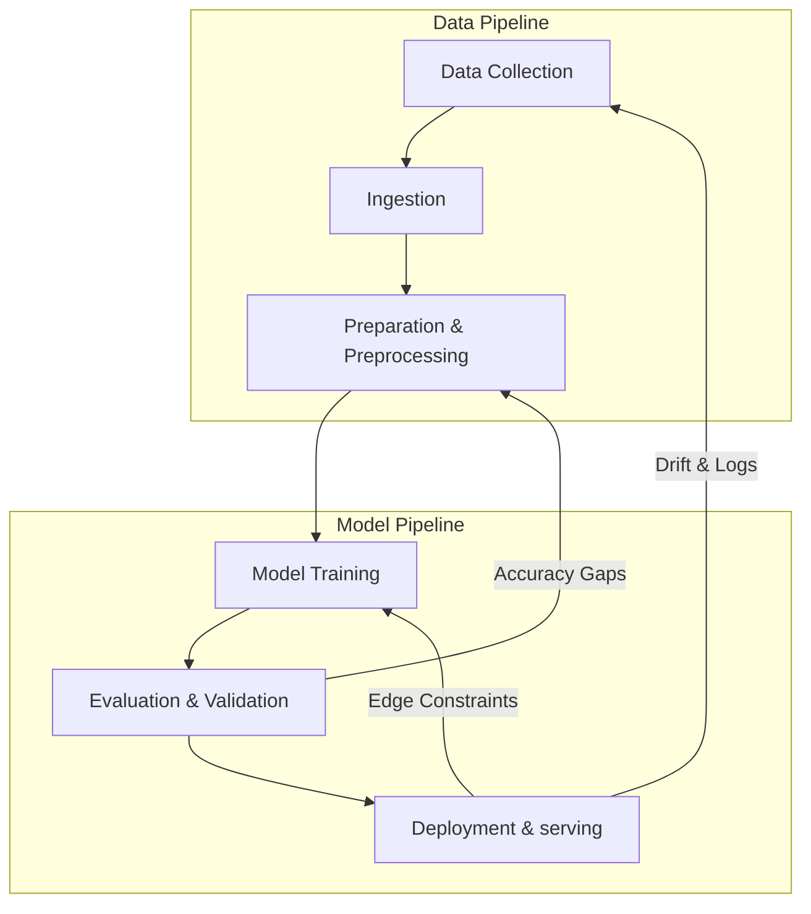

# Chapter 3: ML Workflow (Machine Learning Lifecycle & Systems Orchestration)

## Material Covered in This Chapter

- Purpose
- Learning Objectives
- 3.1 MLLifecycle
- Definition 3.1: Machine learning lifecycle
- 3.1.1 Quantifying the ML lifecycle
- Napkin Math 3.1: The iteration tax
- 3.1.2 MLvs. traditional software
- 3.1.3 The erosion of determinism: Breaking OS assumptions
- Checkpoint 3.1: MLvs. traditional DevOps
- 3.2 Lifecycle Stages
- Checkpoint 3.2: The workflow cycle
- The Stages
- Systems Perspective 3.1: The iron law of workflow
- 3.2.1 Case study: DR screening
- 3.2.2 Stage interface specification
- Example 3.1: Auditing stage transitions
- Quality Invariant Check:
- 3.3 Problem Definition
- 3.3.1 Constraint layers
- 3.3.2 Problem definitions evolve
- 3.4 Data Collection
- Napkin Math 3.2: Bandwidth vs. compute
- 3.4.2 Distributed data infrastructure
- 3.4.3 Managing data at scale
- 3.4.4 Quality assurance and validation
- 3.5 Model Development
- 3.5.1 Reproducible system artifacts
- 3.5.2 Accuracy vs. efficiency
- 3.5.3 Constraint-driven development
- 3.5.4 Prototype to production
- 3.5.5 Reproducibility and technical debt
- 3.6 Evaluation and Validation
- Definition 3.2: Model validation
- 3.6.1 Evaluation metrics and thresholds
- 3.6.2 Offline and online evaluation
- 3.6.3 Production-condition validation
- 3.6.4 Regulatory validation
- 3.6.5 Deployment readiness
- 3.7 Deployment and Integration
- 3.7.1 Deployment requirements
- Napkin Math 3.3: Cloud vs. edge deployment economics
- Option A: Cloud Inference
- Option B: Edge Deployment (NVIDIA Jetson)
- 3.7.2 Pilot to full deployment
- 3.8 Monitoring and Maintenance
- 3.8.1 Production monitoring
- 3.8.2 Maintenance at scale
- 3.9 Systems Thinking
- 3.9.1 Constraint propagation principle
- Definition 3.3: The constraint propagation principle
- 3.9.2 Multi-scale feedback
- 3.9.3 Emergent complexity and resource trade-offs
- Checkpoint 3.3: The cost of late discovery
- 3.10 Fallacies and Pitfalls
- 3.11 Summary
- Key Takeaways: See the whole map first
- What's Next: From blueprint to fuel

---

## Section-by-Section Preserve-and-Extend

# Chapter 3 Summary: MLWorkflow (Machine Learning Lifecycle & Systems Orchestration)

This chapter provides a comprehensive, systems-oriented framework for orchestrating data, algorithms, and machines into
a production-ready Machine Learning system. It transitions the practitioner from a model researcher (who optimizes
individual components in isolation) to a systems engineer (who manages constraint propagation, multi-scale feedback, and
system entropy across the entire lifecycle).

---

## 1. Introduction and Core Concepts

### The AI Triad and Constraint Interaction
An ML system is defined by the three components of the **AI Triad**: **Data**, **Algorithm**, and **Machine**. These
components do not operate in isolation; they interact continuously across space and time:
* **Data** constrains the algorithms that are statistically feasible.
* The **Algorithm** dictates the compute and memory footprint required from the target **Machine**.
* The **Machine** (hardware deployment paradigm: Cloud, Edge, Mobile, TinyML) reshapes what data can be processed and at
what latency.

Optimizing components individually leads to deployment failures (e.g., highly accurate models that violate memory or
latency constraints).

### The Lab-to-Deployment Gap
* **Retinopathy Screening System Case Study (Beede et al., 2020)**: A deep learning retinopathy screening model achieved
high laboratory accuracy but rejected $\approx 20\%$ of images in clinical settings due to poor lighting and
camera-specific variations not present in the training set. The cost of workflow integration (retraining,
image-recapture protocols, and network fixes) exceeded the initial ML development effort.
* **CRISP-DM (1996)**: Codified data-intensive development as a series of six interconnected, feedback-driven phases
rather than a linear waterfall process.

---

## 2. Machine Learning Lifecycle Definition

> [!IMPORTANT]
> **Definition 3.1: Machine Learning Lifecycle**
> The Machine Learning Lifecycle is the continuous engineering discipline of managing **System Entropy** across the
Data, Algorithm, and Machine axes.

1. **Significance**: It transforms the traditional linear software "release" into a continuous loop of monitoring,
retraining, and redeployment to maintain the system's hardware duty cycle (\(\eta_{\text{hw}}\)).
2. **Distinction**: Traditional software degrades primarily through code modification. ML systems degrade silently
through **data drift** even when the code remains completely untouched.
3. **Common Pitfall**: Treating deployment as the end of the lifecycle. Deployment is actually the beginning of the
primary feedback loop: production monitoring insights act as "source code" for the next model iteration.

### Dual-Pipeline ML Development
The ML lifecycle runs two parallel, feedback-driven pipelines:
1. **Data Pipeline (Green)**: Collection $\rightarrow$ Ingestion $\rightarrow$ Analysis $\rightarrow$ Labeling
$\rightarrow$ Validation $\rightarrow$ Preparation into ML-ready datasets.
2. **Model Development Pipeline (Blue)**: Training $\rightarrow$ Evaluation $\rightarrow$ Validation $\rightarrow$
Deployment.



---

## 3. Quantifying the ML Lifecycle

### Time and Resource Allocation
* Data preparation (cleaning, organizing) consumes **$60\%$** of practitioner effort, and data collection consumes
another **$19\%$**.
* Model training and algorithm optimization, despite receiving the most research attention, represent only **$18\%$** of
total practitioner time.
* This distribution underscores that in Software 2.0, data preparation is the primary coding activity.

### Stage Interface Specification
To prevent late-stage constraint violations, each transition is governed by strict input/output contracts and quality
invariants:

| Stage | Input Contract | Output Contract | Quality Invariant |
| :--- | :--- | :--- | :--- |
| **Problem Definition** | Business requirements; operational context | Measurable objectives; deployment paradigm; resource constraints | All success criteria are quantifiable; target deployment paradigm is explicit. |
| **Data Collection & Prep** | Objectives; deployment target; quality requirements | Versioned dataset with schema; preprocessing pipeline; validation rules | Distribution approximates production environment; labeling meets accuracy requirements. |
| **Model Dev & Training** | Dataset; accuracy targets; resource constraints | Trained model weights; training configuration; experiment logs | Meets accuracy thresholds within computational budget; architecture is target-compatible. |
| **Evaluation & Validation** | Trained model; held-out test data; evaluation criteria | Subgroup performance metrics; failure mode analysis; validation certificate | No critical subgroup falls below minimum thresholds; calibration meets domain requirements. |
| **Deployment & Integration** | Validated model; infrastructure requirements; SLA targets | Serving endpoint; monitoring instrumentation; rollback procedures | Latency and throughput meet paradigm requirements; integration tests pass. |
| **Monitoring & Maint.** | Live system; performance baselines; alert thresholds | Drift detection alerts; retraining triggers; incident reports | Performance stays within bounds; degradation is detected before user impact. |

---

## 4. The Iteration Tax

Slow iteration speeds act as a direct tax on model quality.

> [!TIP]
> **Napkin Math 3.1: The Iteration Tax**
> * **Scenario**: Choose between a large ensemble model (train time: 1 week, starting accuracy: $95\%$) and a
lightweight edge model (train time: 1 hour, starting accuracy: $90\%$) for a 6-month ($26$ weeks) project.
> * **Large Model Experiments**:
>   \[ 26 \text{ weeks} \times 1 \text{ experiment/week} = 26 \text{ experiments} \]
>   At $+0.15\%$ accuracy lift per iteration:
>   \[ 95\% + (26 \times 0.15\%) = 98.9\% \]
> * **Small Model Experiments**:
>   \[ 26 \text{ weeks} \times 168 \text{ hours/week} = 4,368 \text{ experiments} \]
>   Even with a lower average lift of $+0.1\%$ per experiment, iterating just $100$ times yields:
>   \[ 90\% + (100 \times 0.1\%) = 100\% \rightarrow \text{clamped to } 99\% \text{ ceiling} \]
> * **Systems Insight**: A system allowing $10$ experiments/day will almost always outperform a system allowing $1$
experiment/week. Rapid iteration allows teams to discover optimal data augmentations, architectures, and
hyperparameters.

---

## 5. ML vs. Traditional Software

### Core Paradigm Shifts
* **Logic Source**: Traditional software uses explicit code (rules) to transform inputs to outputs. ML uses data
(examples) to optimize model parameters, meaning **Data is Source Code**.
* **Testing**: Traditional testing is deterministic and binary (pass/fail). ML testing is statistical, probabilistic,
and evaluates distributions under uncertainty.
* **Operating Systems Assumptions**: Modern OS kernels are optimized for Spatial and Temporal Locality (predictive
caching). ML training violates this: random shuffling of multi-terabyte datasets across training epochs triggers
worst-case memory/disk access patterns. L1 cache hits cost $\approx 1$ ns, DRAM access costs $50\text{--}100$ ns
($50\text{--}100\times$ penalty), and NVMe SSD reads cost $10\text{--}100$ \(\mu\)s ($10,000\text{--}100,000\times$
penalty). ML data loaders must implement custom prefetching logic to bypass OS page cache failures.

---

## 6. Detailed Lifecycle Stages & Case Study: Diabetic Retinopathy (DR)

### 6.1 Problem Definition
The DR system classifies retinal images into healthy or diseased categories. The problem requires balancing five
competing constraint layers: **diagnostic accuracy** (patient safety), **computational efficiency** (clinic hardware),
**clinical workflow integration**, **regulatory compliance**, and **cost-effectiveness**.
* **Constraint Layers**:
  1. *Statistical*: $>90\%$ sensitivity, $>80\%$ specificity.
  2. *Physical*: Edge hardware execution, low-power envelopes, sub-50 ms latency.
  3. *Operational*: Patient privacy (HIPAA/GDPR), Predetermined Change Control Plans (PCCPs).
* **Demographic Drift**: When scaling from pilot clinics to regional networks, demographics shift. Models trained on
narrow cohorts display error rate disparities of up to $40\times$ across groups, forcing problem definitions to
transition from global targets to stratified, subgroup-specific thresholds.

### 6.2 Data Collection & Preparation
Determines the Data Volume (\(D_{\text{vol}}\)) term in the system latency equation.

> [!TIP]
> **Napkin Math 3.2: Bandwidth vs. Compute**
> * **Scenario**: Can a rural clinic upload all raw retinal scans to the cloud, or must it process them locally at the
edge?
> * **Daily Data**:
>   \[ 150 \text{ patients} \times 10 \text{ photos/patient} \times 5 \text{ MB/photo} = 7.5 \text{ GB/day} \]
> * **Upload Latency (over a typical 2 Mbps clinic upload link)**:
>   \[ \frac{7,500 \text{ MB}}{\frac{2}{8} \text{ MB/s}} = 30,000 \text{ seconds} \approx 8.3 \text{ hours} \]
>   This exceeds the clinic's total 8-hour operating window ($104\%$ link utilization).
> * **Conclusion**: Cloud-only inference is blocked by bandwidth constraints. Local edge inference (e.g., NVIDIA Jetson
with 4–32 GB shared memory and 5–30W power budgets) is mandatory. Edge units only transmit patient diagnostic summaries
($\approx 10$ KB/patient), reducing bandwidth usage by $5,000\times$.

* **Distributed Data Infrastructure**:
  * *Hot Storage*: NVMe SSDs for active training loops requiring sequential reads at $1\text{--}10$ GB/s.
  * *Warm Storage*: Object storage (e.g., S3) for validation and recent datasets.
  * *Cold Storage*: Low-cost archival storage (e.g., AWS Glacier) for regulatory audit trails.
* **Federated Learning**: Used when clinical data cannot be centralized due to privacy rules. It resolves data gravity
but introduces high communication latency (transferring weights rather than data) and optimization difficulties due to
non-i.i.d. data across sites.
* **Quality Cascades**: Automated image quality checks (blur, lighting, framing) must run at the point of capture.
Allowing bad images to enter the pipeline wastes storage, compromises training, and triggers expensive downstream
validation failures.

### 6.3 Model Development & Training
Defines the Operations (\(O\)) term in the system equation.
* **Optimization via Transfer Learning**: Reuses representations from models pretrained on ImageNet ($14$ million
images), fine-tuning only the classification layers on a smaller domain-specific set ($128,000$ retinal images). This
compresses both the annotation budget and the computational operations (\(O\)) by orders of magnitude.
* **Accuracy vs. Efficiency Trade-off**:
  * *Ensemble Learning*: Combining $10\text{--}50$ models increases AUC, but multiplies inference latency, memory
footprint, and serving costs by $10\text{--}50\times$.
  * *Netflix Prize Case Study*: The winning $800$-model ensemble was never deployed in production because the
operational cost and latency overhead of serving it far exceeded the business value of the accuracy gain.
* **Model Compression Pipeline**: Distillation, pruning, and quantization (moving from FP32 to INT8 precision) are
applied iteratively in a compress-validate-adjust loop to fit models into edge device memory without violating clinical
sensitivity limits.
* **Reproducible System Artifacts**: The output of this stage is not just raw weights, but a bundled package of **model
weights**, **inference code** (including preprocessing), **environment specifications** (Docker containers, exact
library versions), and **hyperparameter configurations**.
* **Prototype to Production Scaling**: Coordination costs grow combinatorially with team size in manual workflows
(synchronizing notebooks, manual data splits). Investment in a shared MLOps platform (centralized feature store,
experiment tracking, pipeline schedulers) mitigates this coordination tax, allowing experimentation velocity to scale
super-linearly (the **Flywheel Effect**).

```
Manual Workflow:    Velocity ∝ Team Size (eventually saturates due to coordination tax)
Automated MLOps:   Velocity ∝ Team Size^1.5 (scales super-linearly via shared platform components)
```

### 6.4 Evaluation & Validation
* **Model Evaluation**: Measures static test set performance using metrics like Area Under the ROC Curve (AUC).
* **Model Validation**: Confirms the model generalizes to production conditions, meets SLAs, and satisfies
fairness/safety thresholds.
* **Calibration**: Ensures predicted probabilities match observed frequencies (e.g., a prediction with $90\%$ confidence
is correct $90\%$ of the time). Under-calibrated models cause doctors to misinterpret diagnostic certainty. Techniques
like Platt scaling and temperature scaling are applied post-training to align confidence with actual correctness.
* **Progressive Deployment**:
  1. *Shadow Mode*: Runs model in parallel with clinicians, logging predictions without serving them. Catches
integration and latency issues.
  2. *Canary Deployment*: Exposes $1\text{--}5\%$ of live traffic to the model, scaling up gradually. Catches scaling
and statistical anomalies.
  3. *A/B Testing*: Compares the new model against the production baseline on live, randomized traffic. Reaching
statistical significance ($p < 0.05$) to detect a $0.5\%$ accuracy difference requires large sample sizes and weeks of
evaluation.

### 6.5 Deployment & Integration
Focuses on minimizing serving overhead (\(L_{\text{lat}}\)).

> [!TIP]
> **Napkin Math 3.3: Cloud vs. Edge Deployment Economics**
> * **Scenario**: Deploy a production model processing $760,000$ screening images per month across $500$ clinics.
> * **Option A: Cloud Inference (AWS Lambda + GPU)**:
>   * Inference cost: $\$0.01$ per image.
>   * Annual GPU cost:
>     \[ 500 \text{ clinics} \times 50 \text{ patients/day} \times 1 \text{ image} \times 365 \text{ days} \times \$0.01 = \$91,250/\text{year} \]
>   * Network cost (5 MB image uploads): $\$45,000/\text{year}$.
>   * Total Operational Cost: **$\$136,250/\text{year}$**.
>   * Operational risks: $200$ ms+ roundtrip latency; connection dropouts halt clinics.
> * **Option B: Edge Deployment (NVIDIA Jetson)**:
>   * Upfront Hardware:
>     \[ 500 \text{ devices} \times \$500/\text{unit} = \$250,000 \text{ (one-time CapEx)} \]
>   * Inference cost (electricity only): $\approx \$0.001$ per image.
>   * Annual operational cost (maintenance + electricity): **$\$34,125/\text{year}$**.
> * **Conclusion**: Edge deployment pays back its CapEx in **$\approx 2.4$ years**, provides offline availability, and
delivers sub-50 ms latency. However, it mandates aggressive model compression to fit within the Jetson's memory limits.

### 6.6 Monitoring & Maintenance
* **Data Drift**: Live distributions drift due to camera upgrades, demographic shifts, or changes in clinical practice.
Two types of drift degrade models silently:
  * *Covariate Drift (Data Drift)*: Input distribution \(P(X)\) changes, but conditional probability \(P(Y|X)\) remains
constant.
  * *Concept Drift*: Relationship between input features and target labels \(P(Y|X)\) shifts.
* **Telemetry Hierarchy**:
  * *Operational Metrics* (Seconds): Inference latency, queue depth, HTTP error rates.
  * *Proxy Metrics* (Hours): Prediction confidence distributions, referral rates, image rejection rates. Used to spot
anomalies without waiting for delayed labels.
  * *Model Performance Metrics* (Weeks/Months): Sensitivity, specificity, subgroup accuracy. Requires manual clinical
ground-truth labels.
* **Statistical Drift Testing**: Teams monitor input feature distributions using **Population Stability Index (PSI)**
(PSI $> 0.2$ indicates significant drift) and **Kolmogorov-Smirnov (KS) tests** ($p < 0.01$ indicates drift).
* **Rollback Complexity**: Restoring a previous model version is a code-centric rollback. In ML, a rollback cannot
restore the *past data environment*, meaning temporal state mismatches can occur when the live data distribution has
permanently shifted.

---

## 7. Systems Thinking Patterns in ML Workflows

### 7.1 The Constraint Propagation Principle

> [!IMPORTANT]
> **Definition 3.3: The Constraint Propagation Principle**
> Constraints discovered late in the lifecycle ($N$) incur an exponential cost relative to catching them during Stage 1
(Problem Definition):
> \[ \text{Correction Cost} \approx 2^{N-1} \times \text{Base Effort} \]

1. **Significance**: Design must proceed end-to-end. A hardware constraint on peak execution (\(R_{\text{peak}}\)) at
deployment (Stage 5) propagates backward to restrict model parameter sizes, which in turn defines the training dataset
volume (\(D_{\text{vol}}\)) and algorithmic complexity (\(O\)) required at Stages 2 and 3.
2. **Distinction**: Traditional software modular decomposition encourages isolation. ML workflows require global
optimization; local maxima in model training accuracy can lead to global minima in system deployability.
3. **Worked Example (Checkpoint 3.3)**: A team discovers during monitoring (Stage 6) that the DR model fails for
patients over 70 years old (a demographic group omitted during training data collection).
  * Cost multiplier:
    \[ 2^{6-1} = 2^5 = 32\times \text{ the base effort} \]
  * Re-traversal: The team must go back to Stage 1 to redefine demographics, Stage 2 to collect older patient data,
Stage 3 to retrain, Stage 4 to validate, and Stage 5 to redeploy.

### 7.2 Multi-Scale Feedback Loops
ML systems rely on nested feedback loops operating at different timescales:
* **Minutes**: Catching camera defocus or lens occlusion at the point of capture.
* **Days**: Detecting local clinic prediction distribution anomalies.
* **Weeks/Months**: Retraining pipelines triggered by PSI or KS-test drift alerts.
* **Quarters**: Redefining model architectures or clinical objectives during business reviews.

### 7.3 Emergent Complexity and Resource Trade-offs
* **Probabilistic Degradation**: Individual clinics might show normal behavior, but the aggregate system can exhibit
silent demographic biases. Traditional distributed systems fail deterministically (crashes, memory exhaustion); ML
systems fail probabilistically (silent drop in sensitivity), which lacks obvious error signatures.
* **The Power Wall & Memory Wall**: A $2\%$ accuracy improvement from a larger architecture might double model size,
forcing a shift from low-cost edge units to expensive cloud servers. The system engineer must optimize across this
multi-dimensional space.

---

## 8. Fallacies and Pitfalls

* **Fallacy: ML development can follow traditional software workflows without modification.**
  Traditional processes (Waterfall, Agile Scrum) assume static code-centric requirements and deterministic outcomes. In
production, ML systems are probabilistic, data-centric, and depend on continuous, non-linear retraining loops.
* **Pitfall: Treating data preparation as a one-time preprocessing step.**
  Assuming data preparation is "done" leads to silent failures. Data distributions drift continuously, meaning the
preprocessing and data ingestion pipelines must run in parallel with the model serving pipeline (the dual-pipeline
architecture).
* **Fallacy: Passing model evaluation means the system is ready for deployment.**
  High test set AUC in the lab does not guarantee production value. Curated test sets do not simulate physical edge
constraints, camera hardware diversity, technician errors, or patient demographic shifts.
* **Fallacy: More data always improves model performance.**
  Returns on dataset scaling diminish. Doubling data volume from $500$K to $1$M images increases storage and compute
costs by $2\times$ while often providing $<1\%$ accuracy gains. Curation, class balance, and label quality control yield
far higher returns.
* **Pitfall: Skipping validation stages to accelerate timelines.**
  Bypassing shadow runs or canary rollouts exposes users to critical latency spikes and statistical bugs, resulting in
post-launch remediation that can cost $10\text{--}100\times$ more than systematic testing.
* **Pitfall: Deferring deployment paradigm selection until after model development.**
  Developing a massive, uncompressed model and attempting to fit it onto a TinyML or Edge device later forces a complete
redesign of the data pipeline, training setup, and architecture. The deployment target is a day-one constraint.

---

## 9. Mathematical Summary of Workflow Governing Equations

The ML workflow acts as the control mechanism for the variables of the **Iron Law of ML Systems Latency**:

\[ T = T_{\text{data}} + T_{\text{compute}} + T_{\text{overhead}} \]

Plugging in system parameters:

\[ T = \frac{D_{\text{vol}}}{\text{BW}} + \frac{O}{R_{\text{peak}} \cdot \eta_{\text{hw}}} + L_{\text{lat}} \]

Where:
* **Problem Definition** bounds the maximum tolerable latency (\(T\)) and sets constraints on target memory footprint
and hardware limits (\(R_{\text{peak}}\)).
* **Data Collection & Preparation** controls the Data Volume (\(D_{\text{vol}}\)) and access Bandwidth (\(\text{BW}\))
through tiered storage and local preprocessing.
* **Model Development & Training** sets the algorithmic Operations (\(O\)) via architecture selection (e.g., depthwise
convolutions).
* **Evaluation & Validation** verifies the achieved Hardware Efficiency (\(\eta_{\text{hw}}\)) on target devices.
* **Deployment & Integration** minimizes the operational serving overhead (\(L_{\text{lat}}\)) via optimized runtimes
and compilers.
* **Monitoring & Maintenance** detects drift that degrades execution efficiency or accuracy, triggering retraining
loops.

---

## Full Slice Content (Docling Extract, Preserved Verbatim)

> Each section below preserves the source slice content as extracted by docling. Image placeholders are removed; tables,
equations, code blocks, named artifacts, and footnotes are kept intact.

## Purpose

Why is seeing the whole map necessary before walking any single path?

The AI Triad (Data, Algorithm, Machine) names the components of every ML system, and Chapter 2 showed that deployment
location determines the physical constraints each component must satisfy. Teams often treat these as separate concerns:
one team collects data, another designs the model, a third provisions hardware. Yet the Triad's deepest lesson is that
these components interact . The collected data constrains which algorithms are feasible. The chosen algorithm dictates
what hardware can run it. The target hardware reshapes what data can be processed. Pull on any single thread and the
entire system shifts. These interactions play out across components and across time: a model that performs well at
launch degrades as the data distribution drifts, forcing retraining that may demand different hardware or revised data
pipelines. Optimizing each piece in isolation is how teams build accurate models that cannot be deployed and efficient
pipelines that feed the wrong data. Adata engineer who sees how preprocessing choices constrain downstream architectures
builds different pipelines than one who treats data preparation as an isolated task; a model developer who knows the
deployment target's memory budget from day one makes different architecture decisions than one chasing accuracy in a
vacuum. Before the details of any one component can be understood, the full map must be visible: how an ML system is
built, evaluated, and sustained as a coherent whole.

1 Lab-to-deployment gap: Beede et al. (2020) documented this empirically for a deep-learning diabetic retinopathy
screening system deployed in Thai clinics. The model achieved high accuracy in lab benchmarks but rejected roughly one
in five patient images at point-of-care due to lighting and image-quality conditions the training data never simulated.
The workflow integration cost (staff retraining, image-recapture protocols, network fixes) exceeded the original ML
development effort.

2 CRISP-DM (CrossIndustry Standard Process for Data Mining) : The 1996 process model that first codified data-intensive
system development as six interconnected, iterative phases rather than a linear waterfall. Its core design principle
(feedback loops between all phases) directly informs the modern ML lifecycle's structure. Boehm's empirical
softwaredefect studies showed postdeployment fixes costing up to two orders of magnitude more than early fixes; this
chapter later uses a deliberately simpler 2 𝑁-1 model to show how constraint violations compound across ML workflow
stages.

## Learning Objectives

- Describe the six core ML lifecycle stages and their feedback-driven relationships
- Compare ML lifecycle workflows to traditional software development and explain why MLrequires specialized approaches
- Apply systems thinking principles to trace how decisions propagate across lifecycle stages · Analyze how
problem-definition choices cascade through data, modeling, and deployment via the constraint propagation principle ( 2
𝑁-1 cost escalation) · Evaluate trade-offs between model performance, deployment constraints, and resource limitations
using the iron law of workflow
- Explain why iteration velocity compounds into system quality advantages using the iteration tax analysis
- Trace how feedback loops at multiple timescales (real-time monitoring through quarterly reviews) enable continuous
system improvement

## 3.1 MLLifecycle

Consider what happens without orchestration. Day one: 'Build a diagnostic model for rural clinics.' 1 Day 90: 95 percent
accuracy on the test set. Day 120: 96 percent accuracy after a month of architecture tuning. Day 150: model handed to
deployment engineers. Day 151: deployment engineers report the model requires 4 GB of memory. Day 152: someone checks
the deployment target-tablets in mobile clinics with 512 MB available. Day 153: five months of work is discarded.

M L systems are composed of the three interacting elements shown in Figure 1.3: Data, Algorithm, and Machine. They run
under physical constraints that partition deployment into four paradigms: Cloud, Edge, Mobile, and TinyML (Chapter 2).
The parts and the operating environments are now in place. The missing piece is orchestration: how these components
connect into a functioning system.

The model's accuracy was excellent. The team's machine learning skills were excellent. The failure was a workflow
failure. A deployment constraint that should have shaped every decision from day one was discovered only after the work
was done. The tablet's memory limit should have propagated backward to the first architecture meeting, constraining
which models were even worth considering. Instead, the team optimized each component in isolation (data collection,
architecture selection, training), and the integration failure appeared only when the pieces were assembled. This is the
default outcome when ML development lacks systematic orchestration.

The orchestration framework is what we call the machine learning lifecycle -a structured, iterative process 2 that
guides the development, evaluation, and improvement of ML systems (Amershi et al. 2019). We define it formally:

This chapter introduces the MLWorkflow, an engineering framework that prevents such failures by making constraints
explicit at each development stage and tracing how they propagate across stages. The Workflow marks a transition from
model researcher to systems engineer. A researcher optimizes individual elements: a better architecture, a cleaner
dataset, a faster accelerator. A systems engineer orchestrates those elements into production systems that reliably
deliver value. Presenting this framework before the detailed technical chapters is deliberate: understanding how the
pieces fit together changes how each piece is learned. A data engineer who understands that preprocessing decisions
constrain model architectures approaches data pipelines differently than one who treats data preparation as an isolated
task. A model developer who knows the deployment target from day one makes different architecture choices than one
optimizing accuracy in a vacuum. The Workflow provides the mental map that makes each subsequent chapter's contributions
legible within the larger system.

## Definition 3.1: Machine learning lifecycle

Machine Learning Lifecycle is the continuous engineering discipline of managing System Entropy across the Data,
Algorithm, and Machine axes.

1. Significance (quantitative) : It transforms the linear software 'release' into a continuous loop of monitoring,
retraining, and redeployment to maintain the system's Duty Cycle (𝜂 hw ) .
2. Distinction (durable) : Unlike a traditional software lifecycle, which degrades primarily through code modification,
the ML lifecycle recognizes that models degrade through data drift even when the code remains untouched.
3. Common pitfall: Afrequent misconception is that the lifecycle ends at 'Deployment.' In reality, deployment is the
beginning of the feedback loop: monitoring insights are the 'source code' for the next iteration of the model.

Throughout this chapter, we use lifecycle to describe the stages themselves and workflow to describe the engineering
discipline of orchestrating them; the lifecycle is what gets traversed, the workflow is how the traversal is managed .
This distinction requires systems thinking: analyzing how a system's parts interrelate rather than treating them in
isolation. These patterns (formalized in Section 3.9 and illustrated throughout this chapter with a detailed case study)
explain why MLsystems require integrated engineering approaches rather than sequential component optimization.

Figure 3.1 traces two parallel pipelines through the complete lifecycle. The data pipeline (green, top row) transforms
raw inputs through collection, ingestion, analysis, labeling, validation, and preparation into ML-ready datasets. The
model development pipeline (blue, bottom row) takes these datasets through training, evaluation, validation, and
deployment to create production systems. The curved feedback arrows connecting deployment back to earlier stages are
central: one returns monitoring insights to data collection, another feeds evaluation results back to training. These
feedback paths create the continuous improvement cycles that distinguish ML from traditional linear development.

Figure 3.1: Dual-Pipeline ML Development: The data pipeline (green, top) progresses from collection through preparation.
The model pipeline (blue, bottom) takes prepared datasets through training and deployment. Feedback arrows show how
deployment experiences reshape collection strategies and evaluation results trigger model improvements.

This framework provides scaffolding for the technical chapters ahead. The data pipeline receives comprehensive treatment
in Chapter 4, model training scales up in Chapter 8, software frameworks enabling iterative development appear in
Chapter 7, and deployment and ongoing operations unfold in Chapter 14. The interconnections among these pieces must be
understood first, because each technical chapter assumes familiarity with the overall workflow.

3 Exponential Cost Escalation: Boehm's Software Engineering Economics (Boehm 1981) quantified this pattern for
traditional software, showing that defects found postdeployment can cost far more to fix than those caught during
requirements. ML systems have their own version of this escalation because late-discovered constraints can require
retraining, data-pipeline changes, and renewed validation, not just code changes.

The conceptual stages of the ML lifecycle establish the what and why of the development process. The operational
implementation of this lifecycle through automation, tooling, and infrastructure constitutes the how, the domain of
MLOps. Chapter 14 explores these operational practices in detail. This distinction matters: the lifecycle is the
conceptual framework; MLOps is the operational machinery that implements it at scale.

## 3.1.1 Quantifying the ML lifecycle

Understanding the lifecycle conceptually is necessary but insufficient for engineering decisions. Quantitative
characterization reveals where effort and compute actually go in ML projects, exposing which stages bottleneck
development and where optimization investments yield the highest returns.

Time allocation across stages follows a consistent pattern: data work often dominates the effort. In the 2016
CrowdFlower data-science survey, respondents reported spending 60 percent of their time cleaning and organizing data and
another 19 percent collecting datasets (CrowdFlower 2016). That survey measures practitioner time use rather than a
universal project-level law, but it captures the practical lesson that data preparation can dominate ML engineering
effort. Model development and training (the focus of Chapter 8), despite receiving the most research attention, is only
one part of the lifecycle; deployment, integration, and initial monitoring setup add their own engineering burden. This
distribution surprises teams accustomed to traditional software where implementation dominates. In ML projects, the
'source code' is the data, and preparing that source code is a primary engineering activity. For a concrete breakdown,
turn to Figure 3.2-data cleaning and organizing alone accounts for 60 percent of reported practitioner effort.

Figure 3.2: Data Scientist Time Allocation: Data preparation consumes up to 60 percent of data science effort, with data
collection accounting for an additional 19 percent. Model-focused activities such as pattern mining, training set
construction, and algorithm refinement together represent roughly 18 percent of total time. Source: CrowdFlower 2016
Data Science Report.

Beyond time allocation, iteration cycles characterize successful ML projects. Return to Figure 3.1 and notice the
feedback loops driving these iterations: each arrow represents a path that teams traverse repeatedly. Production ML
systems usually require repeated iteration across data, model, and infrastructure stages, where each cycle may revisit
multiple stages. Understanding what triggers these iterations guides resource allocation. Data quality issues (missing
labels, distribution mismatches, preprocessing errors) are often a major source of rework. Architecture and training
choices (model capacity, hyperparameters, training instability) and infrastructure issues (latency violations, resource
constraints, integration failures) create additional loops that teams must budget for explicitly.

The cost of late discovery follows an exponential pattern 3 that we formalize as the Constraint Propagation Principle in
Section 3.9. Late-stage constraint discoveries create exponential cost escalation because violations must be corrected
across multiple preceding stages. This exponential

These proportions explain why data engineering capabilities often determine project success more than modeling
sophistication. They also explain a structural choice in this book: Part I concludes with Chapter 4 precisely because
data is where most effort goes, most iterations originate, and most failures begin. Understanding the data pipeline
first provides leverage over the single largest source of project risk before the modeling, training, and optimization
techniques that follow.

cost structure motivates the stage interface contracts in Table 3.1: validating outputs at each stage transition catches
violations early when correction costs remain manageable.

Table 3.1: Stage Interface Specification: Each lifecycle stage has explicit input requirements, output deliverables, and
quality invariants that must hold for the stage to be considered complete. Violations of these contracts create
technical debt that compounds through subsequent stages. The deployment paradigm selection in Problem Definition (Cloud,
Edge, Mobile, or TinyML from Chapter 2) constrains all downstream stages, as a TinyML target imposes different data,
model, and monitoring requirements than a Cloud target.

| Stage                        | Input Contract                                            | Output Contract                                                                     | Quality Invariant                                                                                     |
|------------------------------|-----------------------------------------------------------|-------------------------------------------------------------------------------------|-------------------------------------------------------------------------------------------------------|
| Problem Definition           | Business requirements; operational context                | Measurable objectives; deployment paradigm selection; resource constraints          | All success criteria are quantifiable; target deployment paradigm is explicit                         |
| Data Collection& Preparation | Objectives; deployment target; quality requirements       | Versioned dataset with schema; preprocessing pipeline; data validation rules        | Distribution approximates anticipated production environment; labeling meets accuracy requirements    |
| Model Development &Training  | Dataset; accuracy targets; resource constraints           | Trained model weights; training configuration; experiment logs                      | Meets accuracy thresholds within computational budget; architecture compatible with deployment target |
| Evaluation& Validation       | Trained model; held-out test data; evaluation criteria    | Performance metrics across subgroups; failure mode analysis; validation certificate | No critical subgroup falls below minimum thresholds; calibration meets domain requirements            |
| Deployment& Integration      | Validated model; infrastructure requirements; SLA targets | Serving endpoint; monitoring instrumentation; rollback procedures                   | Latency and throughput meet paradigm requirements; integration tests pass                             |
| Monitoring& Maintenance      | Live system; performance baselines; alert threshold       | Drift detection alerts; retraining triggers; incident reports                       | Performance stays within acceptable bounds; degradation detected before user impact                   |

This compounding cost of slow iteration creates what we call the iteration tax, quantified in the following exercise.

## Napkin Math 3.1: The iteration tax

Problem: Adiabetic retinopathy (DR) screening system for rural clinics must choose between a large ensemble trained on
high-resolution fundus images (training time: 1 week, accuracy: 95 percent) and a lightweight model suitable for edge
deployment on clinic hardware (training time: 1 hour, accuracy: 90 percent). Which approach yields a better screening
system in six months?

Math: In six months (~26 weeks), the possible experiment count is:

1. Large model: 26 experiments at 1 week each. Each experiment improves accuracy by ~0.15 percent (diminishing returns).
2. Small model: 26 × 168 = 4,368 experiments at 1 hour each. Even with smaller gains per iteration, the compound effect
is substantial.

Systems insight: If each iteration improves accuracy by 0.1 percent on average, the small model reaches: 90 percent +
(100 × 0.1 percent) = 100 percent before applying the 99 percent ceiling, so it renders as 99 percent. The large model
reaches: 95 percent + (26 × 0.15 percent) = 98.9 percent, approximately 99 percent. Even assuming we use only a fraction
of the theoretical capacity (for example, 100 effective iterations out of thousands possible), the compound effect
dominates. In practice, the small model's rapid iteration enables discovering better architectures, data augmentations,
and hyperparameters.

Conclusion: Iteration Velocity is a Feature. Asystem that allows ten experiments/day will almost always eventually
outperform a system that allows one experiment/week, even if the latter starts with a better model. This 'iteration tax'
explains why startups with fast iteration

4 Waterfall Model: Enforces a strict sequential process where system requirements are finalized before implementation
begins, a practice inherited from physical manufacturing. This core assumption, that the specification is stable, fails
for ML systems where the training data itself is the specification and its properties can only be discovered through
empirical iteration. Empirical softwareengineering studies report remediation costs that can rise by orders of magnitude
when defects are found late; the simplified workflow model below uses a 16 × multiplier for the specific
stage-1-to-stage-5 path analyzed in this chapter.

5 Data Versioning: Unlike code, which changes through discrete, auditable commits, data can drift gradually
(distribution shift), suddenly (schema migration), or subtly (label quality degradation). Git cannot version
multi-terabyte datasets, forcing specialized tools like DVC and Git LFS. The systems consequence: without data
versioning, teams cannot reproduce a prior training run or diagnose whether an accuracy regression stems from a code
change or a data change, making root-cause analysis intractable.

often outperform larger teams with slower cycles. For our DR screening scenario, the lightweight model's rapid iteration
cycle enables the team to experiment with data augmentations, preprocessing pipelines, and architecture variations far
more quickly, ultimately converging on a more robust screening system despite starting at lower accuracy.

The iteration tax makes a broader point: MLworkflows are not slow versions of traditional software lifecycles. They are
structurally different, and the differences show up in where time is spent, how feedback loops operate, and how late
discoveries compound cost.

## 3.1.2 MLvs. traditional software

The realities established earlier (data-heavy effort, repeated iteration, and escalating late-stage correction costs)
have no direct counterparts in traditional software engineering. Understanding exactly where these departures occur, and
why conventional lifecycle models cannot accommodate them, motivates the specialized approaches that the rest of this
chapter develops.

Machine learning systems require a structurally different approach. Consider financial transaction processing:
traditional systems follow predetermined rules (if account balance > transaction amount, then allow transaction), while
ML-based fraud detection systems learn to recognize suspicious patterns from historical transaction data. This shift
from explicit programming to learned behavior reshapes the development lifecycle, altering how we approach system
reliability and robustness.

Traditional lifecycles consist of sequential phases: requirements gathering, system design, implementation, testing, and
deployment 4 (Royce 1970). Each phase produces specific artifacts that serve as inputs to subsequent phases. In
financial software development, the requirements phase produces detailed specifications for transaction processing,
security protocols, and regulatory compliance. These specifications translate directly into system behavior through
explicit programming. This deterministic approach contrasts sharply with the probabilistic nature of ML systems
described in Section 1.6, where outputs are statistical predictions rather than deterministic transformations and where
'correct' behavior is defined by distributions rather than specifications.

These differences alter how lifecycle stages interact. Unlike traditional software where later phases rarely influence
earlier ones, ML systems require continuous feedback loops: deployment insights reshape data collection, monitoring
drives model updates, and production data reveals distributional properties invisible in development. This dynamism
demands continuous deployment practices that traditional release cycles cannot accommodate (Section 3.8).

Table 3.2 contrasts these differences across six development dimensions, from problem definition through maintenance.
These differences reflect the core challenge of working with data as a firstclass citizen in system design, something
traditional software engineering methodologies were not designed to handle 5 .

Table 3.2: Traditional Software vs. ML Development Lifecycles: Six dimensions where ML development diverges from
traditional software engineering. The most critical difference appears in the final row: while traditional software
rarely sees later stages influence earlier phases, ML systems require continuous feedback loops where deployment
insights reshape data collection, monitoring drives model updates, and production experiences inform architectural
decisions. These differences explain why traditional project management approaches fail when applied to ML projects
without modification.

| Aspect                 | Traditional Software Lifecycles                                      | Machine Learning Lifecycles                                                                                |
|------------------------|----------------------------------------------------------------------|------------------------------------------------------------------------------------------------------------|
| Problem Definition     | Precise functional specifications are defined upfront.               | Performance-driven objectives evolve as the problem space is explored.                                     |
| Development Process    | Linear progression of feature implementation.                        | Iterative experimentation with data, features, and models.                                                 |
| Testing and Validation | Deterministic, binary pass/fail testing criteria.                    | Statistical validation and metrics that involve uncertainty.                                               |
| Deployment             | Behavior remains static until explicitly updated.                    | Performance may change over time due to shifts in data distributions.                                      |
| Maintenance            | Maintenance involves modifying code to address bugs or add features. | Continuous monitoring, updating data pipelines, retraining models, and adapting to new data distributions. |

| Aspect         | Traditional Software Lifecycles                     | Machine Learning Lifecycles                                                                                           |
|----------------|-----------------------------------------------------|-----------------------------------------------------------------------------------------------------------------------|
| Feedback Loops | Minimal; later stages rarely impact earlier phases. | Frequent; insights from deployment and monitoring often refine earlier stages like data preparation and model design. |

## 3.1.3 The erosion of determinism: Breaking OS assumptions

This shift from code-centric to data-centric development erodes more than just project management models; it breaks the
fundamental assumptions of modern operating systems. For over fifty years, OS kernels (from Unix to Windows) have been
optimized for Spatial and Temporal Locality 6: the belief that if a program reads byte 𝑋, it will likely read 𝑋+1 soon,
and if it uses memory address 𝑌, it will likely reuse it.

These distinctions translate directly into the structured six-stage framework that organizes how MLprojects unfold, each
stage presenting unique challenges that traditional software methodologies cannot address. The differences just covered
should be clear before examining that framework.

MLworkflowsviolate these abstractions at scale. A multi-terabyte dataset being randomly shuffled during every training
epoch presents a 'worst-case' workload for traditional file system buffers and virtual memory prefetchers. When every
'instruction' (a sample) is fetched stochastically from a massive pool, the OS's predictive caching logic fails, and the
system defaults to expensive disk I/O or network transfers. A systems engineer must acknowledge that the 'Abstractions
of the 1970s,' once designed to hide hardware latency, are often the primary sources of the Overhead Term (𝐿 lat ) in
the iron law for Software 2.0. Bridging this gap requires the specialized data engineering and hardware-aware
optimizations we examine in the following Parts.

## Checkpoint 3.1: MLvs. traditional DevOps

MLOps is not merely DevOps for models. Ensure you grasp the key differences:

- □ Failure Modes: Can you distinguish Silent Failure (degradation/drift) from Explicit Failure (crash/exception)?
- □ Logic Source: Do you understand that in ML, 'Data is Source Code'? Changing data changes behavior just like changing
code.
- □ Iteration: Can you explain why ML requires Continuous Retraining loops that do not exist in traditional CI/CD?

## 3.2 Lifecycle Stages

Where traditional software follows requirements through implementation to testing, ML systems demand a different
organizational structure: one that accommodates iterative experimentation, data-driven evolution, and continuous
feedback. The six-stage framework that follows captures these differences.

To make these stages concrete, consider how they apply to MobileNetV2, one of the Lighthouse Models in Section 6.1.1
targeting mobile deployment. For MobileNetV2, Problem Definition establishes tight constraints: about 14 MB model size,
about 300 MFLOPs, real-time inference on mobile GPUs. Data Collection must account for on-device preprocessing
limitations. Model Development uses depthwise separable convolutions 7 specifically designed to meet the FLOP budget.
Evaluation validates both accuracy and latency on target devices. Deployment targets mobile NPUs with quantization.
Monitoring tracks performance across diverse device populations. Each stage's decisions

As Figure 3.3 illustrates, the ML lifecycle distills into six core stages. Read them left to right: Problem Definition
establishes objectives and constraints; Data Collection and Preparation encompasses the data pipeline; Model Development
and Training creates models; Evaluation and Validation ensures quality; Deployment and Integration brings systems to
production; and Monitoring and Maintenance ensures continued effectiveness. The prominent feedback loop connecting
monitoring back to data collection (the key insight in the diagram) shows that production signals (drift detection,
performance degradation, new failure modes) flow back to inform earlier phases, capturing the cyclical nature that
distinguishes ML from linear software development.

6 Locality of Reference: Formalized by Denning (1968) as the principle governing virtual memory design. The cost of
violating locality is quantitative: an L1 cache hit costs approximately 1 ns, while a DRAM access costs 50-100 ns
(50-100 × penalty), and a Non-Volatile Memory Express (NVMe) SSD read costs 10-100 𝜇 s (10,000-100,000 × penalty).
Random shuffling of multi-terabyte datasets during each training epoch triggers the worst case at every level of the
memory hierarchy, explaining why ML data loaders must implement their own prefetching logic rather than relying on OS
page cache heuristics.

- 7 Depthwise Separable Convolutions: Factorizes a standard convolution into a per-channel spatial filter ( depthwise )
followed by a 1×1 channel mixer ( pointwise ), reducing FLOPs by roughly 8-9 × for typical kernel sizes. This reduction
is what makes MobileNetV2's sub-300 MFLOPs budget feasible: without it, the same accuracy would require a standard
convolution layer consuming 2-3 × the device's compute ceiling. Chapter 6 covers these architectural techniques in
depth.

Figure 3.3: Simplified Lifecycle with Feedback: Six stages progress from problem definition through data collection,
model development, evaluation, deployment, and monitoring. The feedback loop from monitoring back to data collection
captures the essential insight that production insights drive continuous refinement across earlier stages, because data
distributions shift, model performance drifts, and operational requirements evolve.

propagate through subsequent stages, and the workflow framework makes these dependencies explicit. A DR screening model
optimized for rural clinic deployment faces analogous pressures: limited device memory, strict power budgets, and the
need for real-time inference without reliable connectivity. These shared constraints are why we use DR as the chapter's
running case study.

The diagram suggests linear progression, but the feedback loop reveals the true iterative nature of ML development. The
following checkpoint reviews this cyclical process before the chapter proceeds.

## Checkpoint 3.2: The workflow cycle

The ML lifecycle is not a straight line; it is a spiral of continuous refinement.

## The Stages

- □ Problem Definition: Have you defined success metrics that actually map to business value?
- □ Data: Is your data pipeline reproducible? Can you trace a model prediction back to the training data version?
- □ Modeling: Are you iterating fast enough? (The iteration tax says speed matters as much as quality).

Figure 3.3 presents a linear narrative, but experienced practitioners recognize that these stages interconnect closely.
Each stage corresponds to specific terms in the performance equation, and this mapping reveals what we call the Iron Law
of Workflow: decisions made during data collection constrain what is achievable during model development, which in turn
determines deployment requirements. The following perspective maps each lifecycle stage to the iron law of ML systems
defined in Section 1.7:

- □ Deployment: Have you accounted for the constraint propagation principle? (A constraint ignored at stage 1 costs 16 ×
to fix at stage 5).

## Systems Perspective 3.1: The iron law of workflow

The six lifecycle stages are not merely procedural steps; they are the engineering levers used to optimize the variables
in the iron law of ML systems (𝑇 = 𝐷 vol BW + 𝑂 𝑅 peak ⋅𝜂 hw +𝐿 lat ) :

- Problem Definition: Sets the target constraints: accuracy, latency, cost, privacy, and deployment paradigm. These
targets determine which terms of the equation are allowed to grow and which must be bounded from the start. · Data
Collection and Preparation: Primarily determines the Data (𝐷 vol ) term. Highquality curation reduces the volume of data
needed to reach a target accuracy. · Model Development and Training: Defines the Operations (𝑂) term. Architectural
choices (for example, transformers vs. convolutional neural networks (CNNs)) set the computational floor. · Evaluation
and Validation: Verifies whether the achieved Efficiency (𝜂 hw ) and model accuracy jointly meet deployment requirements
on the target hardware. · Deployment and Integration: Focuses on minimizing the Overhead (𝐿 lat ) tax through efficient
serving infrastructure.
- Monitoring and Maintenance: Observes drift, latency, throughput, and cost after launch, then feeds violations back
into earlier stages for re-optimization.

Viewed this way, managing the workflow is mathematically equivalent to minimizing the total system latency and cost.

The binding constraint differs dramatically across workload archetypes, causing each lifecycle stage to optimize
different iron law terms. Table 3.3 shows how the same workflow stages manifest for three of the five Lighthouse Models
defined in Table 1.5:

Table 3.3: Workflow Variations by Lighthouse Model: The same lifecycle stages target different iron law terms depending
on the workload's binding constraint. ResNet-50 optimizes for Throughput (𝑂/𝑠) ; Deep Learning Recommendation Model
(DLRM) is bound by Memory Bandwidth (𝐷 vol / BW ) ; TinyML is strictly bound by Energy (𝐽) and Memory Capacity. Stage
ResNet-50 (Compute Beast)

| Stage    | ResNet-50 (Compute Beast)                                                                           | DLRM(Sparse Scatter)                                                                     | Keyword Spotting (Tiny Constraint)                                                                                    |
|----------|-----------------------------------------------------------------------------------------------------|------------------------------------------------------------------------------------------|-----------------------------------------------------------------------------------------------------------------------|
| Data Eng | Throughput: Target > 80 percent GPU utilization via prefetching and compiled augmentation          | Latency: Feature store lookups < 2 ms; embedding tables dominate storage costs         | Capacity: Curate data to fit 256 KB RAM; aggressive filtering over accumulation                                      |
| Training | Compute Bound: Maximize Model FLOPs Utilization (𝜂 hw ) ; mixed precision to saturate Tensor Cores | I/O Bound: Optimize sparse embedding lookups; memory bandwidth ( BW ) limits throughput | Model Search: Neural Architecture Search (NAS) for smallest architecture; quantization-aware training (QAT) required |
| Deploy   | Batching: Batch size > 128 to maximize throughput; latency secondary to cost                       | SLA: Strict < 10 ms p99 latency; feature freshness requirements                         | Energy: <1mW budget; always-on inference without battery drain                                                       |

Production systems rarely fall neatly into a single archetype. A medical imaging classifier, for instance, is compute
bound during training (like ResNet-50, requiring sustained GPU utilization over large image datasets) yet faces strict
energy and memory constraints when deployed to portable clinic devices (like the TinyML archetype). Understanding how
the same workflow framework adapts to each archetype, and how a single project can span multiple archetypes
simultaneously, is essential for making sound engineering decisions.

Each stage of this workflow presents distinct engineering challenges, from curating high-quality datasets to maintaining
model performance in production. To make these challenges concrete rather than abstract, we need a case study that
threads through every stage. The right case study should appear simple on the surface but reveal deep complexity in
practice, span enough of the deployment spectrum to exercise the workflow framework, and have a well-documented journey
from research to production so that we can learn from real decisions rather than hypothetical ones.

## 3.2.1 Case study: DR screening

DR screening systems (Gulshan et al. 2016) meet all three criteria. The problem appears straightforward (classify
retinal images as healthy or diseased), but the path from laboratory success to

8 Diabetic Retinopathy (DR) : Affects 93-103 million people worldwide, with 22-35 percent of diabetic patients
developing retinopathy. In developing countries, up to 90 percent of DR-caused vision loss is preventable with early
detection, yet specialist access remains severely limited. This gap defines the ML systems problem: the screening task
must be automated at scale on low-cost edge hardware in clinics that lack both ophthalmologists and reliable
connectivity, making inference latency, model size, and offline capability binding deployment constraints.

9 Healthcare AI Deployment Gap: Over 80 percent of healthcare AI projects with strong laboratory accuracy fail to reach
clinical deployment. The gap explains why the DR system's expert-level area under the curve (AUC) did not translate
directly to clinic adoption: success depends less on model accuracy and more on integration with clinical workflows,
data infrastructure in resource-limited settings, and regulatory clearance pathways. For ML systems engineers, this
means deployment constraints, not model metrics, are the binding bottleneck.

clinical deployment illustrates every aspect of lifecycle complexity. The development journey is well documented, and
the challenges span every lifecycle stage from data collection through monitoring.

Diabetic retinopathy affects over 100 million people worldwide and is a leading cause of preventable blindness 8 . To
appreciate what the model must learn, look closely at Figure 3.4: the clinical challenge is detecting characteristic
hemorrhages (dark red spots) that indicate disease progression. Rural areas in developing countries have approximately
one ophthalmologist per 100,000+ people, making AI-assisted screening not merely convenient but medically essential.

Figure 3.4: Retinal Hemorrhages: Diabetic retinopathy causes visible hemorrhages in retinal images. While this appears
to be straightforward image classification, the path from laboratory success to clinical deployment illustrates every
aspect of AI lifecycle complexity. Source: Google.

Initial research achieved expert-level performance in controlled settings. However, the journey to clinical deployment
revealed how technical excellence must integrate with data quality challenges, infrastructure constraints in rural
clinics, regulatory requirements, and workflow integration 9 . The same constraint propagation dynamics apply whether
the target is medical imaging systems or mobile applications like MobileNetV2, and the lifecycle stages ahead trace
these dynamics in concrete detail.

## 3.2.2 Stage interface specification

Each lifecycle stage operates as a distinct engineering phase with defined inputs, outputs, and quality invariants.
Think of these as API contracts between teams: just as a microservice must adhere to its Swagger definition to prevent
system crashes, a data pipeline must adhere to its schema and distribution contracts to prevent model failures. Table
3.1 formalizes these contracts, making explicit what each stage must receive and produce. This specification transforms
the abstract lifecycle diagram into actionable engineering requirements. When a stage's output fails to meet its
contract, the deficiency propagates forward, compounding costs at each subsequent stage.

This specification reveals why ML projects experience the iteration cycles diagrammed in Figure 3.3. When a downstream
stage discovers that an upstream contract was violated (for example, evaluation reveals the training data distribution
does not match production), the project must iterate back to fix the root cause. Teams that validate contracts at each
stage transition catch violations early, when correction costs are lowest. This validation process is best understood as
auditing stage transitions .

## Example 3.1: Auditing stage transitions

Scenario: Ateam claims to have completed Problem Definition for a medical imaging classifier. Before Data Collection
begins, the stage transition must be audited against Table 3.1. Audit Checklist (from Output Contract):

1. Measurable objectives: ✓'Achieve >90 percent sensitivity and >80 percent specificity for referable cases'

2. Deployment paradigm selection: ฀ Missing . The team says 'deployment will be figured out later'
3. Resource constraints: ฀ Incomplete . Budget specified, but no latency or memory targets

## Quality Invariant Check:

- 'All success criteria are quantifiable': ✓ Sensitivity/specificity targets are quantifiable
- 'Target deployment paradigm is explicit': ฀ VIOLATION . No paradigm selected

Audit Result: Stage transition blocked . Two contract violations detected.

Resolution: Return to Problem Definition. Establish deployment target (for example, 'Edge deployment on NVIDIA Jetson
with <50 ms inference latency and <200 MB model size'). This constraint will shape Data Collection (preprocessing must
be device-compatible), Model Development (architecture must fit memory budget), and Evaluation (must include
devicespecific performance testing).

Cost Analysis: Proceeding without deployment paradigm selection risks discovering at stage 5 (Deployment) that the
target is Edge deployment with <100 ms latency and <500 MB memory. By the constraint propagation principle, this would
cost 16 × the effort of resolving it now at stage 1.

Time saved: 2-4 iteration cycles avoided, approximately 8-16 weeks of rework prevented.

The same pattern applies to MobileNetV2: If Problem Definition specifies 'mobile deployment' without the specific
constraints established earlier (model size and FLOP budget), the team might develop a 200 MB ResNet-50 variant
optimized for accuracy, only to discover at Deployment that it violates every mobile constraint.

The DR case study and Stage Interface Specification provide the concrete context and formal contracts that ground each
lifecycle stage. The first stage-Problem Definition-determines every constraint that subsequent stages must satisfy.

## 3.3 Problem Definition

Aproduct manager writes: 'Build a model that detects diabetic retinopathy.' That single sentence conceals a dozen
engineering decisions. The sentence conceals decisions about sensitivity thresholds for patient safety, hardware
capabilities in rural clinics, latency budgets that keep clinicians engaged, and regulatory frameworks governing
approval. In traditional software, requirements translate directly into implementation rules. In ML systems, defining
what the system should do is inseparable from defining how it will learn to do it-and the physical constraints under
which it must operate. This first stage, the leftmost box in Figure 3.3, lays the foundation for all subsequent phases
in the MLlifecycle.

The DR screening case makes this concrete. What appears to be a straightforward classification task (detect disease in
retinal photographs) actually requires balancing five competing constraints: diagnostic accuracy (patient safety),
computational efficiency (rural clinic hardware), workflow integration (clinical adoption), regulatory compliance (FDA
approval), and cost-effectiveness (sustainable deployment in resource-limited settings). Each constraint tightens the
feasible design space for the others: pursuing higher accuracy through larger models conflicts with the hardware budget;
achieving regulatory compliance demands annotation protocols that increase data collection costs. This multi-constraint
optimization problem has no analogue in traditional software development.

## 3.3.1 Constraint layers

The DR example reveals that ML problem definitions are not single requirements but stacks of interacting constraint
layers . Accuracy constraints (>90 percent sensitivity, >80 percent specificity across diverse populations and
equipment) sit on top of infrastructure constraints (edge devices with limited compute, intermittent connectivity,
inference within clinical workflow timeframes) which sit on top of regulatory constraints (FDA validation, audit trails,
privacy compliance). Each layer narrows the feasible design space for the layers above it.

10 Demographic Drift: Models trained on the initial handful of clinics learn statistical biases specific to that
population. Scaling to hundreds of clinics with varying patient demographics exposes these biases as performance gaps,
forcing the problem definition to evolve from a single aggregate accuracy target to stratified per-group thresholds.
Error rate disparities between demographic groups can exceed 40 × , making fairness reporting a binding engineering
constraint that reshapes every downstream stage.

This layered structure generalizes beyond healthcare. Any ML problem definition must address at least three constraint
layers: statistical (what accuracy, across which subpopulations), physical (what hardware, under what latency and memory
budgets), and operational (what regulatory, organizational, or workflow requirements apply). The constraint propagation
principle (Section 3.9) explains why: a constraint that exists but remains unspecified does not disappear-it simply
surfaces later at exponentially higher cost.

The specific constraints for the DR system did not emerge from technical analysis alone. They required systematic
collaboration between engineers, ophthalmologists, and clinic administrators to translate clinical needs into measurable
engineering requirements. Key decisions (balancing model complexity with hardware limitations, ensuring interpretability
for healthcare providers, and accounting for patient privacy) emerged from this cross-disciplinary process. Without
domain expertise, the engineering team might have optimized for aggregate accuracy while missing the sensitivity
threshold that determines clinical safety.

## 3.3.2 Problem definitions evolve

Unlike traditional software specifications that stabilize after requirements review, ML problem definitions are living
documents that evolve as the system scales. The DR system initially targeted a handful of clinics with consistent
imaging setups. Scaling to hundreds of clinics with varying equipment, staff expertise, and patient demographics 10
forced revisions to every constraint layer: accuracy targets needed stratification by demographic group, infrastructure
constraints had to accommodate heterogeneous hardware, and regulatory requirements expanded to include fairness
reporting.

With objectives defined and constraints layered, the next practical task is identifying the data that can teach the
model to meet these objectives.

This evolution is not a sign of poor initial planning-it is inherent to ML systems. Scaling exposes edge cases invisible
at pilot scale, and production data reveals distributional properties that no training set fully captures. The problem
definition must accommodate this reality by specifying both current targets and the mechanisms for revising them: which
metrics trigger re-evaluation, who approves revised thresholds, and how changes propagate to downstream stages.

## 3.4 Data Collection

The constraints, metrics, and deployment targets from problem definition exist only on paper until a team acquires the
data that will teach the model to satisfy them. This transition from defining goals to acquiring training data marks a
critical juncture where many projects fail. As the quantitative data in Section 3.1.1 established, data-related
activities consume the majority of project time, making decisions at this stage disproportionately consequential. In
iron law terms, this stage primarily determines the Data (𝐷 vol ) term: the volume, quality, and format of training data
that downstream stages must work with. The deployment constraints established during problem definition now become data
requirements: if the model must run on edge devices, the data pipeline must produce inputs compatible with edge
preprocessing. If the model must achieve 90 percent sensitivity across diverse populations, the data must include
sufficient examples from each population.

Problem definition decisions shape data requirements in the DR example. The multi-dimensional success criteria
established (accuracy across diverse populations, hardware efficiency, and regulatory compliance) demand a data
collection strategy that goes beyond typical computer vision datasets. Not all data contributes equally to learning,
either-Chapter 9 shows that strategically selecting training examples can match the accuracy of the full dataset at a
fraction of the compute cost, a principle that becomes critical when iteration velocity determines project success.

Data collection and preparation is not a preliminary step but the primary engineering activity of most MLprojects.
Chapter 4 addresses data engineering as its core focus. For DR screening, the challenge is substantial: the data must be
statistically diverse enough to train a model that generalizes across populations, operationally feasible to collect in
resource-limited clinics, and annotated with enough clinical rigor to satisfy regulatory scrutiny.

The DR system requires on the order of 10 5 retinal fundus photographs, each reviewed by multiple expert
ophthalmologists. Expert consensus addresses the inherent subjectivity in medical diagnosis (two ophthalmologists may
disagree on borderline cases) while establishing ground truth labels that can withstand regulatory scrutiny. The
annotation process must capture clinically relevant features like microaneurysms, hemorrhages, and hard exudates across
the full spectrum of disease severity.

High-resolution retinal scans can generate tens of megabytes per image, creating substantial infrastructure challenges.
A clinic processing dozens of patients per day can produce gigabytes to tens of gigabytes of imaging data per week,
exceeding the capacity of rural internet connections with only a few megabits per second of upload. This tension between
bandwidth vs. compute forces architectural decisions toward edge-computing solutions rather than cloud-based processing.

## Napkin Math 3.2: Bandwidth vs. compute

Problem: A rural clinic captures retinal images for DR screening. Can the clinic upload all images to the cloud for processing, or must it process them locally on edge hardware? Math: 1. Daily data: 150 patients × 10 photos × 5 MB/photo = 7.5 GB/day . 2. Upload time: 7,500 MB/(2/8 MB/s) = 30,000 seconds ≈ 8.3 hours .

3. The constraint: If the clinic operates for 8 hours, uploading this data would require 104 percent of the clinic's
total operating time, effectively saturating the connection and blocking all other operations.

Engineering conclusion: ACloud-only architecture is too 'expensive' in terms of bandwidth. Moving to the edge requires
uploading only detection summaries (~10 KB/patient), reducing bandwidth usage by 5,000 × . 3.4.1 Lab-to-field data gap

Laboratory data and production data inhabit different worlds. When DR screening deploys to rural clinics across Thailand
and India, images arrive from diverse camera equipment operated by staff with varying expertise, often under suboptimal
lighting with inconsistent patient positioning. A model trained on high-quality research images from standardized fundus
cameras may fail on blurry, poorly-lit images from older equipment-not because the algorithm is wrong, but because the
data distribution has shifted beyond the training envelope.

Atypical solution architecture emerges from data collection constraints: edge devices for local inference and
preprocessing, clinic aggregation servers for data management and buffering, and cloud training infrastructure for
periodic model updates. Typical deployments target end-to-end latency under 100 milliseconds and availability sufficient
to support clinical workflow without connectivity-induced delays.

As the Bandwidth vs. Compute exercise quantified, this data volume makes cloud-only processing infeasible. The
architectural conclusion is edge deployment using specialized hardware such as NVIDIA Jetson 11 . Local preprocessing
reduces bandwidth requirements by orders of magnitude but demands correspondingly more local computation, forcing a
trade-off: simpler models that run on constrained hardware, or more powerful edge devices that increase per-clinic
costs.

Patient privacy regulations often motivate federated learning architectures, enabling model training without
centralizing sensitive patient data. This approach adds complexity to both data collection workflows and model training
infrastructure but often proves necessary for regulatory approval and clinical adoption.

## 3.4.2 Distributed data infrastructure

As the number of clinics grows from a handful to hundreds, data infrastructure must scale accordingly. Each retinal
image travels through multiple stages: clinic cameras capture the image, local systems provide initial storage and
processing, quality validation checks ensure usability, secure transmission moves data to central systems, and finally,
integration with training datasets completes the pipeline. The infrastructure decisions at each stage are shaped by the
deployment constraints established during problem definition.

Different data access patterns demand different storage solutions. Teams typically implement tiered storage
architectures 12:

11 NVIDIAJetson: Its integrated GPU provides the local compute necessary to preprocess data at the edge, directly
addressing the bandwidth infeasibility of cloud-only processing. This hardware choice imposes the exact trade-off
described, as its tight memory budget (4-32 GB shared) and power envelope (5-30 W) constrain model complexity.
Developers are forced to use aggressively compressed models to fit within these limits, making model size a direct
function of the per-clinic hardware cost.

12 Tiered Storage: Places data on different storage media based on access frequency and performance requirements. The storage price gap is roughly 4 × in this example: NVMe SSDs deliver 500,000+ input/output operations per second (IOPS) at ~$0.10/GB/month, while object storage costs ~$0.023/GB/month but with 100-200 ms latency. For ML training loops requiring sustained sequential reads at 1-10 GB/s, choosing the wrong tier converts a compute-bound training pipeline into an I/O-bound one, directly inflating the iron law's Data term (𝐷 vol / BW ) .

13 Federated Learning: Trains across the independent data nodes described here without centralizing patient data,
addressing privacy constraints. The systems tradeoff is communication cost: each training round requires transmitting
model updates across all participating clinics, and statistical heterogeneity across sites (non-i.i.d. data from
different cameras, populations, and operators) causes convergence issues that centralized training does not face.
Federated learning is therefore a constraint-driven architectural choice forced by privacy regulation, not a universal
improvement over centralized training.

- Hot Storage: High-throughput NVMe SSDs for data currently used in training loops.
- Warm Storage: S3-compatible object storage for recent datasets and active validation sets.
- Cold Storage: Low-cost archival storage (for example, AWS Glacier) for historical data required for regulatory audit
trails but rarely accessed.

In practice, the boundary between tiers is dynamic: a dataset migrates from warm to hot when selected for the next
training run, and from hot to cold when the model it trained is superseded. Automated lifecycle policies manage these
transitions, promoting data based on training schedules and demoting it based on access recency-a pattern that Chapter 4
explores in detail.

Infrastructure scalability poses a harder challenge than raw capacity. As the system grows from a handful of pilot
clinics to hundreds of production sites, data heterogeneity grows faster than data volume: each clinic's camera model,
lighting environment, and operator habits produce subtly different image distributions. The infrastructure must handle
increasing throughput while also tracking which data came from where . This provenance metadata proves essential for
debugging accuracy regressions at specific sites and for satisfying the audit trail requirements that regulatory
validation demands.

Rural clinic deployments face severe connectivity constraints that force a choice between transmission strategies.
Clinics with reliable broadband can stream images in near-real-time for centralized processing, but clinics with
intermittent satellite links, common in remote regions of India and sub-Saharan Africa, require store-and-forward
architectures that batch images during connectivity windows and reconcile results asynchronously. The choice propagates
through the entire stack: store-and-forward clinics need larger local storage buffers, more robust local inference
capabilities, and conflict-resolution logic when locally generated predictions differ from later cloud-based analysis.

## 3.4.3 Managing data at scale

As ML systems expand, data collection challenges compound. In our DR example, scaling from initial clinics to a broader
network introduces emergent complexity: significant variability in equipment, workflows, and operating conditions. Each
clinic effectively becomes an independent data node 13, yet the system must ensure consistent performance across all
locations. Following the collaborative coordination patterns established earlier, teams implement specialized
orchestration with shared artifact repositories, versioned APIs, and automated testing pipelines that enable efficient
management of large clinic networks.

Scaling to additional clinics compounds these challenges. Higher-resolution imaging devices generate larger files,
amplifying storage and processing demands. Patient demographics, clinic workflows, and connectivity patterns vary across
sites, requiring the data infrastructure to handle heterogeneity that a single-clinic pilot never encounters.

## 3.4.4 Quality assurance and validation

A blurry retinal image that slips past quality checks does not merely waste storage-it corrupts the training
distribution, degrades model accuracy, and may produce a misdiagnosis months later in a clinic thousands of miles away.
Quality assurance ensures that data meets the requirements downstream stages depend on. In our DR example, automated
checks at the point of collection flag issues like poor focus or incorrect framing, allowing clinic staff to recapture
images immediately rather than discovering the problem weeks later during model training.

Data collection decisions directly constrain model development: bandwidth limits dictate what architectures are
feasible, privacy requirements shape training pipelines (for example, federated learning), and quality variations across
clinic environments determine robustness requirements. Figure 3.5 traces these feedback pathways concretely. Follow each
labeled arrow: evaluation reveals the DR model underperforms on images from older fundus cameras, triggering targeted
data collection from clinics using that equipment. Validation across diverse patient populations shows

Validation extends beyond image quality to verify proper labeling, patient association, and privacy compliance. Local
validation catches problems at the point of capture; centralized validation detects distributional anomalies across the
full clinic network-for instance, flagging when a particular site's images skew toward a narrow demographic range that
would bias the training set.

lower sensitivity for patients with cataracts, driving data augmentation strategies that simulate lens opacities.
Monitoring detects accuracy drift in clinics that upgraded their imaging equipment, feeding back to update preprocessing
steps.

Data Quality Issues

Figure 3.5: Feedback Paths Across Lifecycle Stages: Six labeled feedback arrows connect the lifecycle stages. Data gaps
identified during evaluation flow back to collection. Validation issues inform training adjustments. Performance
insights from monitoring trigger new evaluation cycles. Model updates propagate from monitoring to training. Data
quality issues feed back to preparation. Deployment constraints propagate backward to influence model design.

These feedback pathways reinforce a central point: data collection does not end when training begins. The quality,
volume, and diversity of the data flowing through these pipelines now become the raw material for the next stage-turning
curated datasets into trained models.

## 3.5 Model Development

The DR team has 128,000 labeled retinal images, a validated preprocessing pipeline, and a target: >90 percent
sensitivity on edge hardware with <50 ms inference latency. The question is no longer what data to collect but what
model to build-and that question has no answer independent of the deployment constraints already established. In iron
law terms, this stage defines the Operations (𝑂) term: architectural choices set the computational floor that hardware
must sustain. The challenges extend well beyond selecting algorithms and tuning hyperparameters 14 . Chapter 8 covers
the training methodologies, infrastructure requirements, and distributed training strategies in detail. In high-stakes
domains like healthcare, every design decision affects clinical outcomes, so technical performance and operational
constraints must be integrated from the start.

Using transfer learning combined with a meticulously labeled dataset of 128,000 images, developers in DR projects
achieve AUC 16 of 0.99 with sensitivity of 97.5 percent and specificity of 93.4 percent (Gulshan et al. 2016),
comparable to or exceeding ophthalmologist performance in controlled settings. This result validates approaches that
combine large-scale pretraining with domain-specific fine-tuning. The training strategy uses the gradient-based
optimization principles Chapter 5 establishes to adapt the pretrained convolutional architectures Chapter 6 presents for
medical imaging.

The DR system faces a sharp optimization challenge: achieve expert-level diagnostic accuracy while fitting within edge
device memory and latency budgets. Data and compute budgets are finite, so techniques that reduce both requirements
without sacrificing accuracy become essential design choices. Transfer learning 15 addresses exactly this constraint:
rather than training a model from scratch, it adapts models pretrained on large datasets (like ImageNet's 14 million
images) to specific tasks (Krizhevsky et al. 2012; Deng et al. 2009). Because transfer learning reuses representations
already learned from millions of general images, practitioners can achieve expert-level performance with thousands
rather than millions of domain-specific training examples, sharply reducing both training time and data collection
effort. This approach became widespread in the 2013-2014 era through influential work including Yosinski et al. (2014),
establishing it as the foundation for practical computer vision applications.

14 Hyperparameter: These architectural and optimizer choices (for example, learning rate, network depth) directly define
the computational operations (𝑂) for each training run. Because each combination requires a full and independent
training run, the search for an optimal configuration incurs a multiplicative, not additive, cost. A naive grid search
over just five hyperparameters with four values each requires 1,024 ( 4 5 ) complete training experiments, making it
economically infeasible.

- 15 Transfer Learning: Addresses the DR system's sharp optimization challenge by reusing representations already
learned from ImageNet's 14 million general images. Fine-tuning with thousands of domain-specific retinal images rather
than training from scratch on millions reduces both the Data term (𝐷 vol ) and Operations term (𝑂) of the iron law,
compressing the annotation budget and compute budget simultaneously. Without this technique, the DR project would need
10-100 × more labeled retinal images to reach equivalent accuracy, making the annotation cost alone prohibitive.
- 16 AUC (Area Under the ROC Curve) : Measures the area under the receiver operating characteristic (ROC) curve plotting
true positive rate vs. false positive rate across all classification thresholds, ranging from 0.5 (random) to 1.0
(perfect). Unlike accuracy, AUC is thresholdindependent and robust to class imbalance, making it the standard metric for
medical screening systems. The systems consequence: a model with 0.99 AUC can still produce unacceptable sensitivity at
the specific operating threshold chosen for deployment, so AUC alone cannot validate deployment readiness.

17 Ensemble Learning: Combines predictions from multiple models (bagging, boosting, stacking) to achieve better accuracy
than any individual model. Competition-winning entries typically ensemble 10-50 models. The systems tradeoff is direct:
ensembling multiplies inference latency, memory footprint, and serving cost in proportion to the numberof constituent
models. A 50-model ensemble that wins a Kaggle competition may require 50 × the memory and compute at inference, making
it incompatible with any edge deployment budget.

18 CompetitionProduction Gap: The Netflix Prize (2006-2009) is the canonical example: the winning BellKor ensemble
improved RMSE by 10.06 percent over Netflix's baseline and earned a $1M prize, but Netflix never deployed it because the
engineering complexity of serving 800+ constituent models exceeded the business value of the accuracy gain. Netflix
engineers later found that simpler models plus better data infrastructure delivered more production value, validating
this section's thesis that iteration velocity and deployment feasibility outweigh isolated accuracy optimization.

19 Medical AI Performance Metrics: Medical AI demands sensitivity (true positive rate) and specificity (true negative
rate) rather than aggregate accuracy. For DR screening, >90 percent sensitivity is mandatory because missed cases cause
blindness. The subtler systems trap is positive predictive value (PPV): a model with 95 percent accuracy in a lab can
drop to 50 percent PPV in a low-prevalence population, making it clinically useless despite strong technical metrics.
This prevalence dependence meansasingle model requires different operating thresholds per deployment site, a constraint
invisible in standard MLevaluation.

Achieving high accuracy is only the first challenge. Edge deployment constraints impose strict efficiency requirements:
models may need to fit within tens to hundreds of megabytes, complete inference in tens of milliseconds, and operate
within tight memory budgets.

Initial research models are often much larger (sometimes multiple gigabytes when using ensembles) and therefore violate
deployment constraints, requiring systematic optimization to reach a deployable form factor while preserving clinical
utility.

From a workflow perspective, accuracy gains must always be weighed against deployment feasibility. Ensemble learning 17
illustrates this trade-off: combining predictions from multiple models often yields better performance than any
individual model, but at the cost of multiplied inference time and memory usage. Common ensemble methods include bagging
(training multiple models on different data subsets), boosting (sequentially training models to correct previous
errors), and stacking (using a meta-model to combine base model predictions). Winning entries in ML competitions 18
typically ensemble 10 to 50 models, achieving impressive accuracy that proves difficult to deploy under real-world
latency and memory constraints.

These constraints drive systematic model optimization: quantization reduces precision from 32-bit to 8-bit or lower,
pruning removes redundant connections, and knowledge distillation transfers a large model's knowledge into a smaller
one. Chapter 10 details these techniques. The development process requires continuous iteration between accuracy
optimization and efficiency optimizationfrom the number of convolutional layers (Chapter 6) to the choice of activation
functions (Chapter 5), every decision affects both dimensions simultaneously.

## 3.5.1 Reproducible system artifacts

The accuracy-efficiency balancing act produces more than trained weights alone. A common failure mode is treating the
trained model weights as the sole output of this stage. In a mature ML workflow, the deliverable is a reproducible
system artifact comprising:

1. Model Weights: The learned parameters.
2. Inference Code: The exact code used to run the model, including preprocessing logic.
3. Environment Specification: The complete dependency graph (for example, Docker container, requirements.txt, CUDA
drivers) required to execute the code.
4. Configuration: Hyperparameters and runtime settings.

Without bundling the environment with the model, the 'it works on my machine' problem creates catastrophic failures
during deployment. A system that achieves 99 percent accuracy but relies on a specific library version not present in
production is a broken system.

## 3.5.2 Accuracy vs. efficiency

Medical applications demand specific performance metrics 19 that differ from the standard classification metrics Chapter
5 introduces. A DR system requires high sensitivity (to prevent vision loss from missed cases) and high specificity (to
avoid overwhelming referral systems). These metrics must be maintained across diverse patient populations and image
quality conditions.

The ensemble trade-off illustrates a broader pattern: choosing an ensemble of lightweight models over a single large
model reduces per-model complexity (enabling edge deployment) but increases pipeline complexity (requiring orchestration
logic and multi-model monitoring). Every architectural decision creates this kind of downstream ripple.

Optimizing for clinical performance alone is not enough. Edge deployment constraints from the data collection phase
impose additional requirements: the model must run efficiently on resourcelimited hardware while maintaining inference
speeds compatible with clinical workflows. Improvements in one dimension often come at the cost of others: the
Operations (𝑂) term and the Overhead (𝐿 lat ) term from the iron law pull in opposite directions. Chapter 6 explores
model capacity, while Chapter 2 discusses deployment feasibility, and the inherent tension between them drives
architectural decisions. Systematic application of quantization, pruning, and knowledge distillation 20 techniques can
bridge the gap, meeting deployment requirements while aiming to preserve clinical utility.

## 3.5.3 Constraint-driven development

Real-world constraints shape model development from initial exploration through final optimization, demanding systematic
experimentation. Development begins when data scientists collaborate with domain experts (ophthalmologists in the DR
case) to identify characteristics indicative of target conditions. An ophthalmologist knows that microaneurysms smaller
than 125 micrometers are the earliest sign of retinopathy; without that domain knowledge, a model architect might choose
a resolution or receptive field that makes these features invisible to the network. This interdisciplinary approach
ensures that model architectures capture clinically relevant features while respecting the computational constraints
identified during data collection.

The inherent uncertainty of ML outcomes demands scientific methodology: controlled variables through fixed random seeds
and environment versions, systematic ablation studies 21 to isolate component contributions, confounding factor analysis
to separate architecture effects from optimization effects, and statistical significance testing across multiple runs
using A/B testing 22 frameworks. Without this rigor, teams cannot distinguish genuine performance improvements from
statistical noise-a distinction that becomes critical when a 0.5 percent accuracy difference determines whether a model
meets the clinical sensitivity threshold.

Computational constraints profoundly shape experimental approaches. Production ML workflows create multiplicative costs:
multiple model variants, multiple hyperparameter sweeps, and multiple preprocessing approaches can quickly translate
into on the order of 10 2 training runs. When each run costs hundreds to thousands of dollars in compute, iteration
costs can reach six figures per experiment cycle. This economic reality drives investments in efficient
experimentation-better job scheduling, caching of intermediate results, early stopping, and automated resource
optimization. Systematic hyperparameter optimization dramatically reduces computational costs compared to exhaustive
search; Chapter 8 presents techniques that can reduce experiment counts by 10-100 × while achieving comparable or better
results. Teams that invest in optimization infrastructure early recover the investment within the first few experiment
cycles.

At every development milestone, teams validate models against the deployment constraints identified in earlier lifecycle
stages. Each architectural innovation must be evaluated for accuracy improvements and compatibility with edge device
limitations and clinical workflow requirements. This dual validation approach ensures that development efforts align
with deployment goals rather than optimizing for laboratory conditions that do not translate to real-world performance.

## 3.5.4 Prototype to production

Ateam of three data scientists can manage experiments with spreadsheets and shared notebooks. A teamof30cannot. As
projects evolve from prototype to production, complexity grows across multiple dimensions simultaneously: larger
datasets, more sophisticated models, concurrent experiments, and distributed training infrastructure. The informal
coordination that worked at pilot scale becomes the primary bottleneck at production scale-a phenomenon Figure 3.6
quantifies by contrasting manual workflows against automated platforms. The axes are relative units intended to show
shape, not absolute throughput.

The two curves in Figure 3.6 encode different scaling laws rooted in coordination cost. The red curve saturates because
every additional engineer in a manual workflow must synchronize with every existing engineer: sharing data splits,
resolving experiment conflicts, and reconciling notebook versions. This coordination overhead grows combinatorially with
team size, so beyond a threshold the marginal engineer adds more synchronization burden than experimental throughput.
The blue curve escapes this ceiling because a shared platform absorbs coordination into infrastructure: a centralized
feature store eliminates redundant preprocessing, a versioned experiment tracker prevents conflicting runs, and an
automated pipeline scheduler removes manual handoffs. Each new engineer inherits the full platform rather than
negotiating with every colleague, which is why experimentation velocity scales super-linearly with team size. The
widening gap between the two curves represents the cumulative return on infrastructure investment, and it explains why
organizations that defer platform work face a compounding disadvantage as their teams grow.

20 Model Compression Pipeline: Quantization, pruning, and distillation each alter the Operations (𝑂) and Overhead (𝐿 lat
) terms differently, so bridging the gap between research accuracy and edge deployment requires an iterative
'compress-validateadjust' loop. Finding a model that fits in device memory while preserving clinical sensitivity
typically requires 3-5 iterations, because each compression step can silently degrade accuracy below the 90 percent
sensitivity threshold in ways invisible until the full validation suite runs.

21 Ablation Studies: Named for surgical tissue removal, ablation studies systematically disable individual components to
isolate their contribution to performance. The rigor matters because a 0.5 percent accuracy difference can determine
whether the DR model meets its clinical sensitivity threshold. Without ablation, a team cannot distinguish a genuine
architectural improvement from noise introduced by a different random seed, wasting iteration cycles on phantom gains.

22 A/B Testing in ML: Compares a new model (B) against the production baseline (A) on live, randomly segmented traffic
to isolate the model's causal impact from confounding variables. The sample size requirement is the critical systems
constraint: reliably detecting the 0.5 percent sensitivity lift that determines clinical acceptability requires millions
of patient interactions, meaning the test duration scales inversely with traffic volume. For a lowthroughput DR
screening deployment, reaching statistical significance (𝑝 < 0.05) can take weeks, directly gating iteration velocity.

23 ML Artifact Interdependence: The 'technical debt' accumulated from rapid iteration compounds because ML artifacts are
deeply interdependent: a model's accuracy is valid only for the specific data version, preprocessing pipeline, and
hyperparameter configuration that produced it. Changing any single artifact can invalidate all downstream results.
Without lineage tracking, the team cannot distinguish whether a 2 percent accuracy regression stems from a code change,
a data change, or a random seed difference, forcing expensive re-runs of experiments whose provenance is lost.

300

Figure 3.6: The MLOps Leverage: Why infrastructure investment yields outsized returns. Ad-hoc scripts (red) scale
linearly with team size but eventually saturate due to the coordination tax . In contrast, an automated MLOps platform
(blue) enables the Flywheel Effect, where shared components allow experimentation velocity to scale super-linearly. Axes
are in relative units.

## 3.5.5 Reproducibility and technical debt

The flywheel effect accelerates experimentation-but rapid iteration creates a hidden liability. If experiments are not
reproducible, the team cannot reliably distinguish genuine improvements from noise, and the codebase accumulates
technical debt 23 that compounds with every unreproducible result.

The cost of neglecting reproducibility is economic, not just scientific. Teams that cannot reproduce a result waste
cycles re-running experiments that may or may not converge to the same outcome. At scale, where individual training runs
cost hundreds to thousands of dollars, this waste compounds rapidly. Investment in reproducibility infrastructure
(versioned environments, deterministic pipelines, automated checkpointing) pays for itself within the first few
experiment cycles by eliminating redundant computation and enabling confident architectural decisions.

Reproducing ML results is harder than reproducing traditional software because the 'source code' includes data versions,
random seeds, hardware configurations, and library versions, not just program logic. A training run that achieves 97
percent accuracy on one GPU may yield 95 percent on another due to nondeterministic floating-point operations, and the
team cannot diagnose whether a 2 percent improvement came from a genuine architectural insight or a lucky random seed.
Systematic experiment tracking (unique run identifiers, automated artifact versioning, and queryable experiment
databases) transforms this chaos into scientific methodology. Tools like MLflow and Weights & Biases track the lineage
between artifacts (data version, code commit, hyperparameters, resulting model), enabling teams to answer 'what exactly
changed between run 47 and run 48?' months after the experiments completed.

Reproducible, optimized models are necessary but not sufficient. A model that achieves expertlevel accuracy on curated
research data may still fail in production. The next stage subjects these trained artifacts to systematic testing
against the conditions they will actually encounter.

## 3.6 Evaluation and Validation

The DR team's model achieves an AUC of 0.99 on the curated research dataset-matching the best ophthalmologists. Then
they test it on images from a rural clinic in Chiang Mai where a technician with two weeks of training operates a
five-year-old fundus camera. Sensitivity drops to 78 percent. The model has not failed in any algorithmic sense; it has
simply never seen images this blurry, this poorly lit, or this inconsistently framed. Laboratory success does not
guarantee production value, and the gap between the two is where many ML projects fail. Before deployment, trained
models must undergo rigorous evaluation and validation to confirm they meet performance requirements across the diverse
conditions encountered in production. This stage bridges model development and deployment, transforming experimental
artifacts into production-ready systems through systematic testing against predefined metrics, edge cases, and
real-world scenarios.

Evaluation and validation address different questions. Evaluation measures model performance against held-out test data
using metrics established during problem definition. Validation confirms that the model generalizes appropriately to
conditions it will encounter in production, including edge cases, distribution shifts, and adversarial inputs. Together
these processes establish the evidence base required for deployment decisions. We formalize model validation as follows:

## Definition 3.2: Model validation

Model Validation is the rigorous verification that a model meets business constraints-service level agreement (SLA),
fairness, and cost-on production-representative data.

1. Significance (quantitative) : It moves beyond 'test set accuracy' to test for robustness against distribution shift
(𝐷 vol ) and efficiency against hardware limits (𝑅 peak, BW ) . 2. Distinction (durable) : Unlike model evaluation,
which measures performance on a static test set, model validation confirms that the model generalizes to the dynamic
conditions of production.
3. Common pitfall: A frequent misconception is that validation is 'one more test.' In reality, it is a risk management
framework for detecting silent failure before it compounds into business impact.

## 3.6.1 Evaluation metrics and thresholds

Effective evaluation begins with metrics that align with problem definition objectives. For our DR screening system,
standard classification metrics like accuracy prove insufficient. Clinical requirements demand specific sensitivity and
specificity thresholds: sensitivity above 90 percent ensures few cases of disease-causing retinopathy are missed, while
specificity above 80 percent prevents overwhelming referral systems with false positives.

Evaluation must also address calibration 24: whether a predicted 80 percent confidence corresponds to 80 percent
observed correctness. Poorly calibrated models undermine clinical trust even when accuracy metrics appear strong.
Clinicians relying on confidence scores for triage decisions need those scores to reflect true uncertainty.

Beyond aggregate metrics, stratified evaluation reveals performance variations across patient subgroups. A model
achieving 94 percent overall accuracy might drop below 80 percent for patients with specific comorbidities, particular
age groups, or images captured under certain lighting conditions. These disparities, invisible in aggregate metrics,
become critical in production where every patient deserves reliable predictions. Chapter 12 provides systematic
treatment of these evaluation methodologies.

## 3.6.2 Offline and online evaluation

Offline evaluation on held-out test sets establishes baseline performance but cannot predict production behavior. Online
evaluation deploys models in controlled production conditions through progressive stages 25: shadow mode runs the model
to make predictions but does not serve them to users, canary deployment routes a small percentage of traffic to test
production behavior, and A/B testing provides statistical comparison against the baseline with larger traffic volumes.

Each stage catches different failure modes. Offline evaluation catches algorithmic issues, shadow mode catches
integration issues, canary deployment catches scaling issues, and A/B testing catches user-facing issues. Teams should
plan for this staged validation workflow from the beginning, as retrofitting progressive deployment to an
already-deployed system proves more difficult than building it into the original deployment architecture.

## 3.6.3 Production-condition validation

Validation also tests model behavior under conditions that approximate production deployment. This process reveals
failure modes that standard evaluation cannot detect.

24 Calibration: A calibrated model's predicted probabilities match observed frequencies: 80 percent confidence should
correspond to 80 percent correctness. Calibration is distinct from accuracy, and the systems consequence for the DR
system is severe: clinicians use confidence scores for triage decisions, so a miscalibrated model that assigns 90
percent confidence to uncertain cases misdirects clinical workflows more dangerously than a less accurate but
well-calibrated alternative. Platt scaling and temperature scaling correct calibration posttraining.

25 Progressive Deployment: Shadow mode runs the new model in parallel, logging predictions without serving them; canary
deployment (named after coal-mine canaries) then exposes 1-5 percent of traffic, increasing gradually if metrics hold.
This staged approach catches 70-80 percent of production issues before full rollout, a critical safeguard because ML
failures are statistical (degraded accuracy) rather than functional (crashes), making them invisible to traditional
health checks. Chapter 14 details implementation strategies.

26 FDA AI/ML Regulation: The FDA regulates AI/ML-based medical devices under its Software as a Medical Device (SaMD) framework and has authorized over a thousand AI/ML-enabled devices, predominantly in radiology and cardiology. The systems constraint: the FDA's 2021 AI/ML SaMD Action Plan identified draft guidance on predetermined change control plans (PCCPs) as a planned action, and later FDA guidance describes how manufacturers may propose bounded, prespecified model modifications and validation protocols in marketing submissions. This regulatory architecture directly constrains ML workflow design by requiring versioned model artifacts, reproducible training pipelines, and audit trails at every lifecycle stage, turning regulatory compliance into a first-class engineering requirement.

Cross-validation across data sources tests whether the model has learned generalizable patterns or overfit to
characteristics specific to training data sources. A DR model trained primarily on images from high-quality research
cameras must demonstrate robust performance on images from the diverse equipment deployed across clinic networks.
Validation datasets should include images from equipment manufacturers, lighting conditions, and operator skill levels
representative of actual deployment contexts.

Temporal validation assesses whether models maintain performance over time. Data distributions shift as patient
populations change, equipment ages, and clinical practices evolve. Models validated only on historical data may degrade
unexpectedly when deployed. This includes data or covariate drift when the input distribution changes, and concept drift
when the relationship between inputs and labels changes; both motivate the continuous monitoring discussed in Section
3.8.

Robustness testing subjects models to realistic perturbations and edge cases. For image-based systems, this includes
testing with varying brightness, contrast, focus quality, and partial occlusions. In our DR example, teams discover that
models optimized for research-quality images may fail on images captured by technicians with minimal training, requiring
preprocessing pipelines that normalize image quality before inference.

## 3.6.4 Regulatory validation

Healthcare AI systems face additional validation requirements mandated by regulatory frameworks. FDA clearance for
medical devices requires demonstration of safety and effectiveness through clinical validation studies with appropriate
sample sizes and statistical rigor 26 . These requirements influence the entire development process, from study design
through documentation practices.

Humanfactors validation assesses how clinicians interact with system predictions and whether the overall workflow
achieves intended outcomes. A technically accurate model that clinicians distrust or misuse fails to deliver clinical
value. Validation studies should measure end-to-end workflow outcomes (clinician confidence, referral appropriateness,
and patient satisfaction) alongside model performance metrics.

Domain-specific validation goes beyond regulatory compliance to address stakeholder requirements. Clinical validation
studies in our DR example involve deploying the system alongside expert graders and comparing predictions against ground
truth established by consensus panels of ophthalmologists. These studies must demonstrate comparable accuracy and
acceptable failure modes: systems that fail safely (referring uncertain cases to specialists) receive more clinical
trust than those that fail silently.

## 3.6.5 Deployment readiness

Successful validation produces artifacts that enable informed deployment decisions: documentation covering performance
across relevant metrics and subgroups, characterization of failure modes and their frequencies, validated preprocessing
and inference pipelines, and evidence of regulatory compliance where required.

Validation failures drive model architecture revisions, training data augmentation, and preprocessing pipeline
improvements. Validation successes establish the performance baselines and monitoring thresholds that guide production
operations. Once a model clears this gate, with documented evidence across metrics, subgroups, and failure modes, it is
ready to leave the laboratory and enter the operating environment it was designed for. The central issue shifts from
laboratory performance to whether the system can operate reliably in its target environment.

The transition from validation to deployment represents a decision point where teams assess whether accumulated evidence
supports production release. This decision balances technical performance metrics, operational readiness, regulatory
status, and organizational capacity for monitoring and maintenance. Incomplete validation creates deployment risks that
compound throughout the system lifecycle.

## 3.7 Deployment and Integration

Amodel that passes every validation test in the lab still faces its hardest exam when it meets the real world. Consider
the DR system: a validated model must now run on tablets in rural clinics with intermittent connectivity, integrate with
hospital information systems it was never tested against, and produce results that clinicians trust enough to act on-all
within latency budgets that leave no room for cloud round-trips. Deployment is where the abstract constraints specified
during problem definition become concrete engineering requirements. In iron law terms, this stage focuses on minimizing
the Overhead (𝐿 lat ) term through efficient serving infrastructure, and the binding constraint varies by archetype:
ResNet-50-class workloads optimize batch size for throughput, DLRM-class workloads enforce strict SLA latency, and
TinyML-class workloads operate under sub-milliwatt energy budgets (Table 3.3). Chapter 14 covers the operational aspects
of deployment and maintenance in depth.

## 3.7.1 Deployment requirements

The requirements for deployment stem from both the technical specifications of the model and the operational constraints
of its intended environment. In our DR example, the model must operate in rural clinics with limited computational
resources and intermittent internet connectivity, while automated quality checks flag poor-quality images for recapture.
It must fit into the existing clinical workflow, requiring rapid, interpretable results that assist healthcare providers
without causing disruption.

These requirements influence deployment strategies. The edge deployment decision established during data collection
(driven by the bandwidth constraints quantified in the Bandwidth vs. Compute exercise) now determines the optimization
targets: tight model size, latency, and memory budgets that the systematic compression techniques in Chapter 10 must
satisfy. Once compressed, the model must be served efficiently under latency and throughput constraints; Chapter 13
addresses the serving infrastructure that bridges optimized models and production traffic. The following exercise on
cloud vs. edge deployment economics illustrates these trade-offs quantitatively:

## Napkin Math 3.3: Cloud vs. edge deployment economics

Problem: Aproduction model processes about 760,000 billable screening images per month across 500 clinics, assuming one
processed image per patient after local selection and quality checks. Should the deployment use Cloud inference (AWS
Lambda) or Edge inference on an on-premise server?

## Option A: Cloud Inference

- Model runs on centralized GPU servers · Inference cost: ~USD 0.01 per image (cloud GPU time + API overhead) · Annual cost: 500 clinics × 50 patients/day × 1 billable image/patient × 365 days × USD 0.01 = USD 91,250/year · Plus: Network costs for uploading 5 MB images = ~USD 45,000/year
- Total: ~USD 136,250/year operational cost
- Risk: 200 ms+ latency breaks clinical workflow; connectivity outages halt screening

## Option B: Edge Deployment (NVIDIA Jetson)

- One-time hardware: 500 USD 500 = USD 250,000 capital expense
- Inference cost: ~USD 0.001 per image (electricity only)
- Annual cost: ~USD 25,000 maintenance + ~USD 9,125 inference electricity = ~USD 34,125/year

×

- Total: USD 250,000 upfront + ~USD 34,125/year
- Benefit: <50 ms latency; works offline; much lower per-inference cost

Engineering conclusion: Edge deployment pays back in ~2.4 years and provides better reliability, yet it requires tighter
model optimization (must fit in edge memory) and more complex update pipelines. The deployment paradigm selected during
Problem Definition determines whether the edge option is even viable.

27 Lab-to-Clinic Performance Gap: Medical AI systems can experience substantial performance drops when deployed in
real-world settings, sometimes in the double-digit percentage-point range when camera models, image quality, patient
populations, or operator workflows differ from development data. The gap arises because training data cannot capture the
full diversity of production conditions. FDA has emphasized total product lifecycle oversight and real-world performance
monitoring for AI/ML-enabled medical devices, and device submissions may need evidence appropriate to the product's
intended use and risk. For ML systems engineers, this means monitoring infrastructure should be a deployment
prerequisite, not a postlaunch addition.

Integration with existing systems poses additional challenges. The ML system must interface with hospital information
systems (HIS) for accessing patient records and storing results. Privacy regulations mandate secure data handling at
every step, shaping deployment decisions. These considerations ensure that the system adheres to clinical and legal
standards while remaining practical for daily use. Chapter 14 details operational considerations that apply to these
deployments.

## 3.7.2 Pilot to full deployment

Deployment proceeds through phases that progressively expose the system to real-world complexity, because each phase
catches different failure modes. Simulated environments catch integration issues before any real users are affected.
Pilot sites reveal real-world variability invisible in simulation: equipment differences, operator skill levels, patient
population diversity. Full deployment exposes scale effects that pilot sites cannot replicate: network contention,
storage bottlenecks, and rare edge cases that appear only at volume.

Successful deployment requires more than technical optimization. Clinician feedback often reveals that initial
interfaces need significant redesign before adoption. User trust and proficiency matter as much as algorithmic
performance. Reliability mechanisms such as automated image quality checks, fallback workflows for errors, and stress
testing for peak volumes keep systems operating robustly across conditions.

Scaling across multiple sites compounds these challenges. Each clinic presents unique constraints (different imaging
equipment, varying network reliability, diverse operator expertise levels, and distinct workflow patterns), creating
data quality inconsistencies that force preprocessing adjustments no pilot could have anticipated. The deployment
paradigm itself constrains solutions: edge deployment minimizes latency but imposes strict model complexity limits,
while cloud deployment enables flexibility but introduces network latency that may violate clinical workflow
requirements.

Managing improvements across distributed deployments requires centralized version control and automated update
pipelines. Deployment feedback (usability concerns, performance regressions, integration surprises) shapes the
monitoring strategies that keep the system healthy over time. Deployment is not an endpoint but a transition into
continuous operations, where the system's behavior must be watched as carefully as any patient it screens.

## 3.8 Monitoring and Maintenance

Six months after the DR screening system launches, a clinic in northern Thailand upgrades its fundus cameras. The new
equipment produces sharper images with slightly different color profiles-an improvement by any clinical measure. Yet the
model's sensitivity drops by 8 percent at that site, because the pixel distributions it learned during training no
longer match the images it receives. No code changed. No one made an error. The data simply drifted beyond the training
envelope, and the model degraded silently. Traditional software maintains static behavior until explicitly updated; ML
systems degrade through data drift even when untouched. This structural difference means that deployment is not the end
of the lifecycle but the beginning of an ongoing operational phase. Monitoring provides the statistical telemetry to
detect degradation; maintenance ensures the system evolves in response. Chapter 14 develops these operational practices
in full.

For the DR screening system, monitoring tracks performance across hundreds of clinics, detecting when changing patient
demographics, new imaging technologies, or equipment degradation affect accuracy. Proactive maintenance plans for
incorporating new imaging modalities like OCT, expanding diagnostic capabilities while maintaining regulatory
compliance. Three feedback pathways drive continuous improvement: performance insights flow back to data collection
(identifying underrepresented demographics), data quality issues trigger preparation refinements (catching
equipment-specific artifacts), and model updates initiate retraining when drift exceeds thresholds.

## 3.8.1 Production monitoring

Monitoring must serve two audiences simultaneously: technical teams tracking system health metrics and clinical staff
needing actionable insights. Initial deployment typically reveals blind spots invisible during laboratory validation 27
. Clinics with older equipment show accuracy decreases. Specific patient subgroups, such as those with proliferative
retinopathy or cataracts complicating the fundus image, trigger higher error rates. These discoveries drive targeted
data collection and architectural improvements.

Aproduction DR system tracks several categories of metrics across a hierarchy designed to catch problems at different
timescales:

ADRscreening system-where missed diagnoses cause blindness-demands real-time monitoring, not periodic offline
evaluations. Teams establish quantitative performance thresholds for latency, accuracy, and data distribution stability.
As detailed in Chapter 14, statistical tests (Population Stability Index 28 and Kolmogorov-Smirnov tests) trigger
automated responses ranging from on-call alerts to retraining workflows.

- Model performance metrics (requiring ground truth, available with delay): sensitivity (target >90 percent, alert if
seven-day rolling average drops below 88 percent), specificity (target >80 percent, alert if drops below 78 percent),
and subgroup performance (alert if any demographic drops > 5 percent below baseline).
- Proxy metrics (available immediately, without ground truth): prediction confidence distribution (alert if mean
confidence drops >10 percent), referral rate (alert if rate changes >15 percent from baseline), and image quality
rejection rate (alert if >20 percent of images fail quality checks).
- Operational metrics: Inference latency (P95 <50 ms, alert if >100 ms), throughput (alert if queue depth >50 images),
and error rate (alert if >0.1 percent of requests fail).

The hierarchy matters: operational metrics catch immediate problems (seconds), proxy metrics catch model issues without
waiting for ground truth (hours), and performance metrics catch accuracy degradation requiring labeled data (weeks).

- Data drift detection: Population Stability Index (PSI >0.2 indicates significant drift) and feature distribution
changes (Kolmogorov-Smirnov test, alert if 𝑝 < 0.01 ).

## 3.8.2 Maintenance at scale

Model updates require careful validation and controlled rollouts. Teams employ A/B testing frameworks to evaluate
updates and implement rollback mechanisms 29 that address issues quickly. Unlike traditional software where CI/CD
handles changes deterministically, ML systems must account for data evolution that affects behavior in ways traditional
pipelines were not designed to handle.

Proactive maintenance closes the lifecycle loop: predictive models identify potential problems from operational
patterns, continuous learning pipelines retrain on new data, and production insights feed back to refine problem
definitions, data quality standards, and architectural decisions. The patterns underlying these dynamics (why
constraints propagate, why feedback operates at multiple timescales, and why system-level behavior diverges from
component-level behavior) are the subject of Section 3.9.

Scaling from pilot sites to hundreds of clinics causes monitoring complexity to grow rapidly. Each additional clinic
generates operational logs (inference times, quality metrics, error rates), creating data volumes reaching hundreds of
gigabytes per week. The monitoring infrastructure must track both global metrics and site-specific behaviors, maintain
data lineage 30 for regulatory compliance, and correlate production issues with training experiments for root cause
analysis.

## 3.9 Systems Thinking

Thelifecycle stages do not merely execute in sequence. They interact through three structural patterns that recurred at
every stage of the DR case study. Recognizing these patterns transforms reactive debugging about deployment failure into
proactive design that surfaces downstream constraints early. We formalize each pattern below.

## 3.9.1 Constraint propagation principle

The DR case study illustrated constraint propagation repeatedly: bandwidth limits drove edge deployment, which
constrained model size, which reshaped data preprocessing. Each decision narrowed the feasible design space for every
subsequent stage. We formalize this as the constraint propagation principle.

28 PSI and KS Test: Two lightweight statistical methods for detecting distribution drift. PSI bins features and computes
divergence (PSI < 0.1: stable, 0.1-0.2: moderate drift, >0.2: significant drift). The KS test measures maximum distance
between cumulative distributions (𝑂(𝑛 log 𝑛)) . Both are computationally cheap enough for real-time monitoring, the
critical property that enables them to serve as earlywarning systems: detecting drift days or weeks before it degrades
model accuracy allows proactive retraining rather than reactive incident response. Chapter 14 covers drift detection
pipelines in depth.

29 MLRollback Complexity: Unlike traditional software, an ML model's validity is coupled to the data distribution on
which it was trained, not just its code. 'Data evolution' means a simple rollback restores a model artifact but cannot
restore the past data environment, creating a temporal state mismatch. Even a sub-60-second rollback is therefore a
mitigation tactic, not a true system restore, as the stale model's performance on live data is not guaranteed.

30 Data Lineage: The automated recording of metadata linking each clinic's production logs to the exact data, code, and
model version that generated them. Without this explicit trail, correlating a sitespecific accuracy drop with a training
experiment requires a manual forensic analysis across hundreds of gigabytes of logs, turning a minuteslong metadata
query into a multi-week engineering task.

31

ML Technical Debt: MLsystems accumulate debt faster than traditional software through three mechanisms: entanglement
(changing one feature affects all others because the model learned joint distributions), hidden feedback loops
(predictions influence future training data), and undeclared consumers (downstream systems depending on outputs without
contracts). Since ML code represents less than 5 percent of a production system, the remaining 95 percent of
configuration, pipelines, and infrastructure is where this debt compounds silently, explaining why latediscovered
constraints propagate so expensively.

## Definition 3.3: The constraint propagation principle

1. Significance (quantitative) : It dictates that system design must proceed end-to-end. Within the iron law, a
constraint on 𝑅 peak at deployment (Stage 5) propagates backward to redefine the Stage 1 requirements and the downstream
data volume (𝐷 vol ) and algorithm complexity (𝑂) that those requirements permit.

The Constraint Propagation Principle states that constraints discovered late in the lifecycle ( 𝑁 ) incur an exponential
cost relative to catching them during Stage 1 problem definition (Correction Cost ≈2 (𝑁-1) × Base Effort).

2. Distinction (durable) : Unlike modular decomposition, which encourages isolation, this principle mandates global
optimization: a 'local maxima' in model accuracy may lead to a 'global minima' in system feasibility.
3. Common pitfall: A frequent misconception is that deployment is 'the last step.' In reality, the deployment
environment is the day-one constraint that defines the boundaries of every other decision.

Propagation operates bidirectionally, creating dynamic constraint networks rather than linear dependencies. When rural
clinic deployment reveals tight bandwidth limitations, teams must redesign data preprocessing pipelines to reduce
transmitted data by large factors. This requires model architectures optimized for compressed inputs, which influences
training strategies that account for data degradation. Understanding these cascading relationships enables teams to make
architectural decisions that accommodate rather than fight against systemic constraints.

The constraint propagation principle quantifies what experienced ML engineers know intuitively: decisions made in
ignorance of downstream constraints create compounding technical debt 31 . The stage interface specification (Table 3.1)
operationalizes this principle by making constraints explicit at each stage boundary-a concept we formalize as
Contract-Driven MLOps in Chapter 14, enabling early detection before propagation costs escalate. When propagation occurs
specifically through data quality failures, the resulting pattern is known as a data cascade; Chapter 4 formalizes this
failure mode and traces how it unfolds stage by stage in Figure 4.1.

## 3.9.2 Multi-scale feedback

MLsystems succeed through orchestrating feedback loops across multiple timescales, each serving different optimization
purposes. Our DR deployment exemplifies this pattern: minute-level loops catch a misconfigured camera before it produces
a day's worth of unusable images; daily loops detect that a particular clinic's sensitivity has drifted below threshold;
weekly loops aggregate accuracy statistics and run drift detection tests; monthly loops reveal that demographic shifts
in a region require expanded training data; and quarterly loops evaluate whether the overall architecture still meets
evolving clinical needs.

The temporal structure of these feedback loops reflects the inherent dynamics of ML systems. Rapid loops enable quick
correction of operational issues-a clinic's misconfigured camera can be detected and corrected within minutes. Slower
loops enable strategic adaptation; recognizing that population demographic shifts require expanded training data takes
months of monitoring to detect reliably. This multi-scale approach prevents both reactionary changes (over-responding to
daily fluctuations) and sluggish adaptation (under-responding to meaningful trends). Concretely, fast iteration is not
just a productivity metric; it is a systems feature that allows teams to discover better architectures and optimal
hyperparameters an order of magnitude faster than competitors bound by slow, rigid pipelines.

## 3.9.3 Emergent complexity and resource trade-offs

Complex systems produce emergent behaviors invisible when analyzing individual components. In our DR deployment,
individual clinics show stable performance, yet system-wide analysis detects subtle degradation affecting specific
demographic groups-patterns invisible in single-site monitoring but critical for equitable healthcare delivery. ML
systems are especially prone to this kind of probabilistic degradation through data drift and bias amplification,
whereas traditional distributed systems more commonly fail through deterministic cascades like server crashes or
resource exhaustion. The distinction matters because probabilistic degradation lacks the obvious error signals that
trigger traditional incident response.

Together, these three patterns (constraint propagation, multi-scale feedback, and emergent complexity with its attendant
resource trade-offs) define the engineering discipline that transforms MLdevelopment from ad-hoc experimentation into
systematic practice. The following checkpoint reviews the most consequential pattern.

Resource optimization introduces multi-dimensional trade-offs that traditional software never faces. A 2 percent
accuracy improvement might require doubling the model size, forcing deployment onto more powerful hardware; when
multiplied across hundreds of clinics, that incremental accuracy gain translates into significant capital expenditure.
These trade-offs manifest the power wall and memory wall from Chapter 2: edge deployment reduces latency but constrains
model complexity; cloud deployment enables flexibility but introduces network latency that may violate workflow
requirements. Understanding these nonlinear relationships enables strategic architectural decisions rather than isolated
component optimization.

## Checkpoint 3.3: The cost of late discovery

Apply the constraint propagation principle to this scenario:

A team discovers during monitoring (Stage 6) that their DR model fails for patients over 70 years old. This demographic
requirement should have been specified at Problem Definition (Stage 1).

- □ Calculate the relative cost multiplier using the formula from the constraint propagation principle definition.
- □ Identify which intermediate stages must be revisited to fix this issue.

The Lesson: Define demographic and deployment constraints before collecting data.

These principles predict specific failure modes. The following fallacies and pitfalls capture the most common ways teams
violate them.

## 3.10 Fallacies and Pitfalls

MLworkflows introduce counterintuitive complexities that lead teams to apply familiar software patterns to structurally
different problems. These fallacies and pitfalls capture errors that waste development cycles, cause production
failures, and create technical debt that compounds as systems scale.

Engineers assume waterfall or standard agile processes will work for ML projects. In production, MLreplaces
deterministic specifications with probabilistic optimization, static behavior with dynamic adaptation, and isolated
development with continuous feedback loops (Table 3.2). Traditional approaches treat requirements as fixed and testing
as binary pass/fail, but ML systems require iterative experimentation where problem definitions evolve through
exploration. Practitioner surveys have reported that data preparation often consumes 60-80 percent of ML project effort,
and many MLinitiatives struggle to reach production when rigid phase gates prevent teams from revisiting data, model,
and deployment assumptions. Organizations that adapt workflows to accommodate ML's experimental nature can reduce rework
and shorten time-to-deployment.

Fallacy: ML development can follow traditional software workflows without modification.

Pitfall: Treating data preparation as a one-time preprocessing step.

Teams assume they can 'finish' data preparation and move on to modeling. In production, data distributions shift
continuously. The two-pipeline architecture in Figure 3.1 shows data and model pipelines running in parallel with
continuous feedback, not sequentially. As Section 3.8 establishes, data quality decisions cascade through model
training, validation, and deployment. Data quality issues are a common source of production ML failures. Recommendation
systems, fraud models, and clinical models may all need feature, label, or preprocessing updates as the world changes,
and unchecked drift can produce several-point accuracy losses or larger failures under training-serving skew. Without
continuous validation, drift is often discovered only after users or operators notice degraded behavior; teams that
build data validation pipelines from the start can detect drift earlier and retrain proactively.

Engineers treat the model development pipeline as the entire workflow, assuming strong evaluation metrics mean the
system is complete. The two-pipeline architecture in Figure 3.1 exposes the blind spot: this mindset ignores half the
lifecycle-data pipeline feedback loops, deployment integration, and production monitoring remain unaddressed. The
diabetic retinopathy screening case study (Section 3.2.1) demonstrates the gap: the model passed evaluation but required
additional validation to handle equipment variations across clinics, operator skill differences, and demographic
diversity absent from curated development data. Evaluation metrics measure algorithm quality in isolation; production
readiness requires verifying the complete system, including data freshness, preprocessing consistency, latency under
load, and failure recovery. By the constraint propagation principle, a deployment-stage discovery costs 2 5-1 =16× the
effort of catching it during evaluation design. Teams that equate strong evaluation metrics with deployment readiness
consistently underestimate the integration effort.

Fallacy: Passing model evaluation means the system is ready for deployment.

Fallacy: More data always improves model performance.

Pitfall: Skipping validation stages to accelerate timelines.

Teams assume that scaling dataset size is the most reliable path to accuracy gains, treating data collection as a
monotonically beneficial investment. In practice, returns diminish sharply after sufficient coverage of the target
distribution. Doubling a dataset from 500K to 1M examples can easily produce less than 1 percentage point of accuracy
gain while doubling labeling costs, storage requirements, and preprocessing time. The feedback loops in Figure 3.1
illustrate why: model performance depends on the interaction between data quality, model capacity, and deployment
conditions, not data volume alone. A 100K-example dataset with careful label quality control and balanced class
representation can outperform a 1M-example dataset with noisy labels and skewed distributions. The Data Collection and
Preparation stage (Section 3.4) establishes that data quality decisions cascade through every subsequent stage. Teams
should compare the marginal value of cleaning existing data against collecting more data.

Teams assume cutting validation time ships faster. In production, the multi-stage validation process exists because each
stage catches different failure modes (Section 3.6). Skipping shadow mode testing can expose integration issues only
after launch, including 10-50 × latency spikes under production traffic. Bypassing canary deployment can turn localized
model failures into broad user-facing incidents. Postdeployment fixes are often 10-100 × more expensive than catching
issues during validation, because they combine incident response, rollback, root-cause analysis, data repair, and
renewed validation. A team that 'saves' time by skipping validation may spend substantially more time on emergency
remediation. Organizations investing in systematic validation infrastructure improve first-deployment success by
catching production-condition failures earlier.

Teams assume they can 'figure out deployment later' and focus first on model accuracy. In production, deployment
paradigm (Cloud, Edge, Mobile, TinyML) is not a late-stage detail; it is a binding constraint shaping every preceding
stage (Table 3.1). A team that develops a 2 GB ensemble modeldiscovers their target is TinyML with 256 KB memory. The
resulting cascade requires revisiting Data Collection, Model Development, and Evaluation. By the constraint propagation
principle, a stage-5 discovery costs 16 × the effort of incorporating the constraint at stage 1. Teams that defer
paradigm selection create avoidable iteration cycles and schedule risk. The paradigm determines what can be built, not
merely where it runs.

Pitfall: Deferring deployment paradigm selection until after model development.

## 3.11 Summary

This chapter established the ML lifecycle as the systematic framework for engineering machine learning systems, the
mental roadmap organizing how data, models, and deployment infrastructure interconnect throughout development. Return to
Figure 3.1 one final time: the two parallel pipelines now carry richer meaning. The data pipeline transforms raw inputs
through collection, ingestion, analysis, labeling, validation, and preparation into ML-ready datasets. The model
development pipeline takes these datasets through training, evaluation, validation, and deployment to create production
systems. With the full chapter as context, the feedback arrows tell a deeper story-each one represents a lesson learned
in production flowing back to strengthen earlier stages, creating the continuous improvement cycles that distinguish ML
from traditional linear development.

Three engineering insights from this chapter guide engineering decisions:

Understanding this framework explains why machine learning systems demand specialized approaches distinct from
traditional software. ML workflows replace deterministic specifications with probabilistic optimization, static behavior
with dynamic adaptation, and isolated development with continuous feedback loops. The iron law of workflow provides the
quantitative backbone: lifecycle stages set constraints, shape specific terms in the performance equation (𝑇 = 𝐷 vol /
BW + 𝑂/(𝑅 peak ⋅ 𝜂 hw ) +𝐿 lat ) , and feed production violations back into re-optimization. This systematic perspective
recognizes that success emerges not from perfecting individual stages in isolation, but from understanding how data
quality affects model performance, how deployment constraints shape training strategies, and how production insights
inform each subsequent development iteration.

1. 60-80 percent: Practitioner surveys and production experience both show that data collection, cleaning, labeling,
validation, and preparation often consume a large share of ML engineering effort. Model development, despite receiving
the most attention, is only one part of the lifecycle. Plan accordingly.
2. Repeated iteration cycles: Production-ready ML systems usually require repeated cycles across data, model, and
infrastructure stages. Data quality issues are often a major source of rework, so investment in data engineering yields
high leverage.
3. 2 𝑁-1 cost escalation: The constraint propagation principle: a constraint discovered at stage 𝑁 costs roughly 2 𝑁-1
times more to fix than if caught at stage 1. A deployment paradigm mismatch discovered at stage 5 triggers a 16 × cost
multiplier. Early validation pays exponential dividends.

## Key Takeaways: See the whole map first

- Two pipelines, one system: Data processing (collection → preparation) and model development (training → deployment)
run in parallel, unified by continuous feedback loops.
- MLsystems fail differently than traditional software: They degrade silently through data drift rather than crashing
through code errors, requiring continuous statistical monitoring rather than one-time testing.
- Iteration velocity compounds: In the worked example, a lightweight model starting 5 percentage points behind reaches
the 99 percent ceiling because rapid cycles create many more chances to improve data, architecture, and hyperparameters.
- Stage interfaces are contracts: Explicit inputs, outputs, and quality invariants at each stage help prevent late
integration failures and rework.
- Feedback loops span multiple timescales: Real-time inference monitoring (seconds), batch retraining triggers (days),
and strategic model updates (months) all require distinct automation.
- The lifecycle governs the iron law: Problem definition sets the constraints, data collection determines 𝐷 vol, model
development defines 𝑂, deployment minimizes 𝐿 lat, and monitoring feeds violations back into re-optimization.
- Constraint propagation is exponential across stages: Deployment constraints (latency, memory) flow backward to model
selection; data constraints (volume, quality) flow forward to architecture choices. A constraint discovered at stage 𝑁
costs 2 𝑁-1 times more to fix than if caught at stage 1.

This workflow framework transforms ML development from ad-hoc experimentation into disciplined engineering practice. By
understanding how data pipelines and model development interact through feedback loops, teams can anticipate integration
challenges, allocate resources effectively, and avoid the cascading failures that derail most ML projects. The
constraint propagation principle, where late-stage discoveries create exponential cost multipliers, underscores why
systematic workflow management is not bureaucratic overhead but essential risk mitigation.

## What's Next: From blueprint to fuel

The workflow framework established here provides the organizing structure for every technical chapter that follows. We
now have the blueprint for the engine, yet an engine without fuel is just a heavy block of metal. The answer lies in
data. We begin with the foundation of the AI Triad: Chapter 4. From there, each part of the book maps to a different
region of the workflow: Part II builds the core system (data pipelines, neural architectures, frameworks, training),
Part III optimizes it for deployment (data selection, model compression, hardware acceleration, benchmarking), and Part
IV deploys and operates it in production (model serving, MLOps, responsible engineering). Each chapter assumes
familiarity with where its specific techniques fit within this complete workflow, building on the systematic perspective
developed here.
