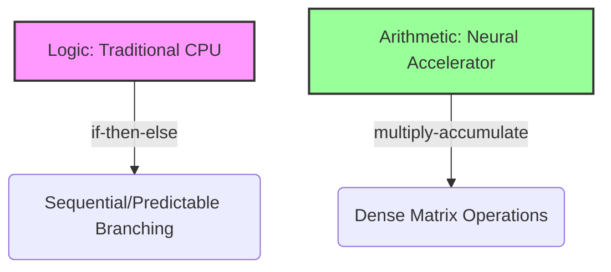

# Chapter 5: Neural Computation & Training Mechanics

## Material Covered in This Chapter

- Neural Computation
- Purpose
- Learning Objectives
- 5.1 From Logic to Arithmetic
- Definition 5.1: Deep learning
- 5.2 Computing with Patterns
- 5.2.1 From explicit logic to learned patterns
- 5.2.2 The feature engineering bottleneck
- 9 AlexNet's Two-GPU
- 5.2.3 Automatic pattern discovery
- 5.2.4 Computational infrastructure requirements
- 5.2.5 The artificial neuron as a computing primitive
- 5.2.6 Hardware and software requirements
- 16 Backpropagation:
- 5.2.7 Evolution of neural network computing
- Checkpoint 5.1: Understanding deep learning's emergence
- 5.3 Neural Network Fundamentals
- 5.3.1 Why depth matters: The power of hierarchical representations
- Systems Perspective 5.2: The depth vs. width trade-off
- 5.3.2 Network architecture fundamentals
- 5.3.2.1 Nonlinear activation functions
- 5.3.3 The transistor tax: Logic unit cost
- 5.3.3.1 Layers and connections
- 5.3.4 Parameters and connections
- 5.3.4.2 Bias terms
- Checkpoint 5.2: Neural network architecture fundamentals
- Core concepts:
- Systems implications:
- 5.3.5 Architecture design
- Example 5.2: Building intuition: The XOR problem
- 5.3.5.1 Feedforward network architecture
- 5.3.5.2 Layer connectivity design patterns
- 5.3.5.3 Model size and computational complexity
- Solution:
- Napkin Math 5.2: Quick estimation for ML engineers
- Memory Estimation
- Compute Estimation
- Quick Sanity Checks
- 5.4 Learning Process
- 5.4.1 Supervised learning from labeled examples
- 5.4.2 Forward pass computation
- Checkpoint 5.3: Gradient flow
- Dependencies
- 5.4.2.1 Individual layer processing
- 5.4.2.2 Matrix multiplication formulation
- /32 Key insights:
- 5.4.2.4 Implementation and optimization considerations
- 5.4.3 Loss functions
- 5.4.3.1 Error measurement fundamentals
- 5.4.3.2 Cross-entropy and classification loss functions
- 5.4.3.3 Batch loss calculation methods
- 5.4.3.4 Impact on learning dynamics
- 5.4.4 Gradient computation and backpropagation
- Definition 5.2: Backpropagation
- 5.4.4.1 Backpropagation algorithm steps
- Systems Perspective 5.5: The memory cost of backprop
- 5.4.4.2 Error signal propagation
- 5.4.4.3 Derivative calculation process
- Example 5.5: Tracing gradients: A worked backpropagation example
- 5.4.4.4 Computational implementation details
- Checkpoint 5.4: Backpropagation
- The Mechanism
- 5.4.5 Weight update and optimization
- 5.4.5.1 Parameter update algorithms
- Definition 5.3: Gradient descent
- 5.4.5.2 Mini-batch gradient updates
- Systems Perspective 5.6: Batch size and hardware utilization
- 5.4.5.3 Iterative learning process
- 5.4.5.4 Convergence and stability considerations
- Definition 5.4: Overfitting
- Checkpoint 5.5: Neural network learning process
- Forward propagation:
- Backward propagation:
- Optimization: □ Can you write the gradient descent update rule: 𝜃 new =𝜃 old -𝜂∇ 𝜃 ℒ ? □ Doyouunderstandthe trade-offs
between batch size (memory vs. throughput vs. gradient stability)?
- Complete training loop:
- 5.5 Inference Pipeline
- 5.5.1 Production deployment and prediction pipeline
- 5.5.1.1 Operational phase differences
- 5.5.1.2 Memory and computational resources
- 5.5.1.3 Performance enhancement techniques

---

## Section-by-Section Preserve-and-Extend

# Chapter 5: Neural Computation & Training Mechanics

## 5.1 From Logic to Arithmetic

The silicon contract (Section 1.7) establishes that every model architecture makes a computational bargain with the
hardware it runs on. The architecture's mathematical operators set the terms of that bargain: they determine how much
memory the model consumes, how long each computation takes, and how much energy the system expends. To honor this
contract, a systems engineer must understand these mathematical operators from the silicon layer up.

Neural computation represents a qualitative shift in how computers process information: instead of executing a sequence
of explicit logical instructions (\(\text{if-then-else}\)), systems execute a massive sequence of continuous
mathematical transformations, primarily **multiply-add-accumulate (MAC)** operations. This shift from Logic to
Arithmetic transforms sequential, predictable CPU workloads into highly parallel, compute-bound or memory-bound
workloads.

A model that runs correctly on one GPU and crashes on another is rarely suffering from a software syntax error. Instead,
the matrix dimensions in its layers exceed the physical memory available for intermediate activations, or the numerical
representation triggers instabilities like vanishing gradients or arithmetic overflow. For example, recognizing a single
handwritten digit in a modest three-layer MNIST network requires \(109,184\) MAC operations—not one of which is a
logical branch.



### Definition 5.1: Deep Learning
**Deep Learning** is the computational paradigm of Hierarchical Feature Learning from raw data.
1. **Quantitative Significance**: By stacking nonlinear transformations, it replaces manual Feature Engineering with
**Architecture Engineering**, enabling models to scale performance with both Data Volume (\(D_{\text{vol}}\)) and Peak
Compute (\(R_{\text{peak}}\)).
2. **Durable Distinction**: Unlike Shallow Learning, which learns a single feature transformation, Deep Learning learns
a Hierarchy of Abstractions where layers build upon previous representations.
3. **Common Pitfall**: A frequent misconception is that Deep Learning is "just a big neural network." In reality, it is
a **Systems Strategy**: it uses the iron law to trade computation (\(O\)) for the ability to generalize from
high-dimensional inputs without hand-crafted rules.

---

## 5.2 Computing with Patterns

### 5.2.1 From Explicit Logic to Learned Patterns
Traditional programming takes rules and data as inputs to produce answers. This paradigm is poorly suited for
unstructured real-world data (such as raw pixels, audio waves, or natural text) where rules are too complex or implicit
to be manually authored.

```
Traditional Programming:
Data + Rules ──> [ CPU / Program ] ──> Answers

Machine Learning:
Data + Answers ──> [ Training / Optimizer ] ──> Learned Rules
```

For instance, rule-based activity classification based on velocity thresholds (e.g., classifying movement below
\(6\text{ km/h}\) as walking) fails to resolve the edge cases, transitions, and noise inherent in sensor feeds.
Similarly, manual computer vision rules targeting shape, lighting, and occlusion quickly explode into unmaintainable
nested conditionals.

### 5.2.2 The Feature Engineering Bottleneck
Early machine learning systems addressed rule-based limitations by relying on handcrafted feature extractors to convert
raw inputs into structured representations:
* **Histogram of Oriented Gradients (HOG)**: Computes local gradient magnitudes and orientations in a rigid spatial grid
to build shape descriptors invariant to lighting.
* **Scale-Invariant Feature Transform (SIFT)**: Extracts keypoints that remain stable across scale and rotation,
producing variable-sized outputs that are mechanically difficult to batch on modern hardware.
* **Gabor Filters**: Hand-designed bandpass filters that detect edges and textures at specific orientations.

These methods required extensive domain expertise and locked systems into static computation graphs. For a \(28 \times
28\) MNIST digit, a classical pipeline using HOG feature extraction combined with a Support Vector Machine (SVM)
requires approximately \(8,000\) arithmetic operations and \(\sim 2\text{ KB}\) of working memory—a workload well-suited
for CPU vector units (SIMD) but limited in its ability to generalize to complex patterns.

### 5.2.3 Automatic Pattern Discovery and Scaling
Deep learning eliminates handcrafted feature extractors by discovering representations directly from data. It achieves
this by stacking nonlinear layers that extract increasingly abstract features:
\[ \text{Pixels} \longrightarrow \text{Edges} \longrightarrow \text{Textures} \longrightarrow \text{Parts} \longrightarrow \text{Objects} \]

This compositional structure enables deep networks to express complex functions with exponentially fewer parameters than
shallow networks. Furthermore, deep learning exhibits a distinct scaling behavior: performance continues to improve with
larger datasets and increased compute budgets.

#### The Double Descent Phenomenon
Classical statistical learning theory relies on the **Bias-Variance Trade-off**, predicting that models sized beyond the
complexity of the training data will overfit and show degraded test performance. Modern deep learning networks defy this
by showing a **Double Descent** behavior:

```
Test Error
   ^
   |      \                   /---\
   |       \                 /     \
   |        \               /       \       Modern Regime (Double Descent)
   |         \             /         \-----------------------....
   |          \___________/
   +-----------------------+---------+----------------------------->
                       Capacity   Interpolation
                       Threshold   Threshold
```

1. **Classical Regime**: As model capacity increases, training error decreases, and test error follows a U-curve,
reaching a local minimum before increasing due to overfitting.
2. **Interpolation Threshold**: The point where model capacity is just sufficient to perfectly fit (memorize) the
training data (training error reaches zero).
3. **Modern Regime**: Past the interpolation threshold, massive overparameterization paradoxically leads to a further
decrease in test error. Larger models, when properly regularized, discover smoother solutions that generalize better
than smaller models.

### 5.2.4 Computational Infrastructure Requirements
Trading rule engineering for computational scaling changes the system resource profile across all dimensions:

| System Aspect | Traditional Programming | ML with Handcrafted Features | Deep Learning |
| :--- | :--- | :--- | :--- |
| **Computation** | Sequential, branch-heavy logic | Structured vector operations (SIMD) | Dense, massive parallel matrix math (GEMM) |
| **Memory Access** | Small, localized L1/L2 cache access | Medium, batch-oriented data structures | Large, hierarchical high-bandwidth memory (HBM/SRAM) |
| **Data Movement** | Minimal input/output flows | Structured batch loading | Intensive, high-throughput pipeline transfers |
| **Hardware** | General-purpose CPU | CPU with vector units (AVX) | Specialized accelerators (GPU/TPU) |
| **Resource Scaling** | Fixed runtime requirements | Scales linearly with data size | Scales exponentially with model/task complexity |

#### The Memory Wall in Deep Learning
Accelerators achieve high execution throughput via massive parallel arithmetic units. However, performance is bounded by
the **Memory Wall**: the latency and bandwidth gap between main memory (e.g., DRAM, HBM) and local cache (SRAM).
* **L1 Cache**: Access latency of \(\sim 1\text{ ns}\).
* **Main Memory (DRAM)**: Access latency of \(\sim 100\text{ ns}\) (a \(100\times\) gap).
* **Systems Consequence**: Since model weights rarely fit within local caches, accelerators must constantly fetch
weights from memory, making many operations memory-bandwidth bound rather than compute bound.

---

### 5.2.5 The Artificial Neuron as a Computing Primitive
The atomic building block of neural computation is the artificial neuron, which models the biological process of
integrating signals and firing when a threshold is exceeded:

| Biological Structure | Artificial Component | Mathematical Operation | Engineering Role |
| :--- | :--- | :--- | :--- |
| **Dendrites** | Input Vector | \(\mathbf{x} = [x_1, x_2, \dots, x_n]\) | Ingests features from raw data or previous layers |
| **Synapses** | Weight Vector | \(\mathbf{w} = [w_1, w_2, \dots, w_n]\) | Learnable parameters representing connection strength |
| **Cell Body** | Summation | \(z = \sum_{i=1}^n (x_i w_i) + b\) | Linear integration of weighted signals with a bias \(b\) |
| **Axon** | Activation Function | \(a = f(z)\) | Applies a nonlinear transformation to the integrated signal |

Evaluating a single neuron with \(N\) inputs requires \(N\) multiply-accumulate (MAC) operations and \(2N + 2\) memory
accesses (loading inputs, weights, bias, and writing the output). When scaled to millions of neurons, these operations
translate directly into dense matrix multiplications.

---

## 5.3 Neural Network Fundamentals

### 5.3.1 Why Depth Matters: Hierarchical Representation
A single-layer network must map inputs directly to outputs, requiring it to memorize every variation in the input space.
A deep network solves problems by decomposing features hierarchically.
* **Depth Advantage**: A network with \(L\) layers can represent highly complex decision boundaries using exponentially
fewer parameters than an equivalent single-layer network.
* **Depth vs. Width Trade-off**:
  * **Depth** increases representational power but introduces sequential dependencies (layer \(l+1\) must wait for layer
\(l\)), increases the gradient path length (leading to vanishing/exploding gradients), and requires storing intermediate
activations for backpropagation.
  * **Width** allows for higher parallelization, as all neurons in a single layer can be computed simultaneously, but
requires quadratic parameter scaling (\(O(n^2)\)) between adjacent layers.

---

### 5.3.2 Nonlinear Activation Functions
Activation functions introduce nonlinearity into the network. Without them, any composition of linear layers collapses
mathematically into a single linear transformation:
\[ a^{(2)} = W^{(2)}(W^{(1)}x + b^{(1)}) + b^{(2)} = W'x + b' \]

#### 1. Sigmoid
Maps input values to a bounded probability range between \(0\) and \(1\):
\[ \sigma(x) = \frac{1}{1 + e^{-x}} \]
* **Gradient Characteristic**: The derivative peaks at \(0.25\) and approaches \(0\) when \(|x|\) is large.
* **Vanishing Gradient Hazard**: In deep networks, multiplying these small derivatives across layers causes gradients to
vanish (\(\lim_{L \to \infty} 0.25^L = 0\)), halting weight updates in early layers.
* **Asymmetric Outputs**: Outputs are non-zero-centered (always positive), which can cause weight updates to zig-zag
during gradient descent.

#### 2. Hyperbolic Tangent (Tanh)
Addresses the zero-centering issue by mapping inputs to the range \((-1, 1)\):
\[ \tanh(x) = \frac{e^x - e^{-x}}{e^x + e^{-x}} \]
* **Gradient Characteristic**: Center-symmetric output speeds up convergence compared to Sigmoid.
* **Vanishing Gradient Hazard**: Still suffers from saturation and vanishing gradients at extreme values.

#### 3. Rectified Linear Unit (ReLU)
The default activation function for hidden layers in many feedforward networks:
\[ \text{ReLU}(x) = \max(0, x) \]
* **Gradient Characteristic**: The derivative is exactly \(1\) for all positive inputs, preventing vanishing gradients.
* **Computational Simplicity**: Avoids expensive exponential operations, compiling to a single comparator instruction.
* **Dying ReLU Problem**: If a neuron's weights update such that its pre-activation \(z\) is always negative, it
permanently outputs \(0\) with a gradient of \(0\). The neuron becomes "dead" and cannot recover.

#### 4. Softmax
A vector-level activation function that normalizes a vector of \(K\) raw scores (logits) into a probability
distribution:
\[ \text{softmax}(\mathbf{z})_j = \frac{e^{z_j}}{\sum_{k=1}^K e^{z_k}} \]
* **Use Case**: Typically restricted to the final classification output layer or self-attention heads.
* **Numerical Hazard**: Exponentiating raw values can lead to overflow (producing \(\text{NaN}\) values) or underflow in
limited-precision hardware. Production systems use the **Log-Sum-Exp** trick to maintain stability.

---

### 5.3.3 The Transistor Tax: Logic Unit Cost
The choice of activation function directly dictates physical chip design, area allocation, and thermal dissipation:

* **Sigmoid / Tanh**: Computing transcendental exponential operations requires approximating functions via lookup tables
or iterative Taylor series expansions. This consumes approximately **2,500 transistors** per unit.
* **ReLU**: Executed via a single comparator and a multiplexer, requiring approximately **50 transistors**.
* **Systems Engineering Impact**: Choosing Sigmoid over ReLU imposes a **50\(\times\) Transistor Tax**. Using ReLU
allows hardware architects to allocate more silicon area to parallel arithmetic units (MACs) rather than transcendental
logic circuits.

---

### 5.3.4 Parameters and Connections
A fully-connected (dense) layer maps \(n\) input features to \(m\) output neurons. This is computed via matrix
multiplication:
\[ \mathbf{z} = \mathbf{x}\mathbf{W} + \mathbf{b} \]
Where:
* \(\mathbf{x} \in \mathbb{R}^{1 \times n}\) is the input row vector.
* \(\mathbf{W} \in \mathbb{R}^{n \times m}\) is the weight matrix.
* \(\mathbf{b} \in \mathbb{R}^{1 \times m}\) is the bias vector.
* \(\mathbf{z} \in \mathbb{R}^{1 \times m}\) is the linear pre-activation vector.

This matrix representation is mathematically optimal because it maps directly onto parallel **General Matrix Multiply
(GEMM)** libraries, utilizing hardware tiling and cache blocking to maximize data reuse.

---

### 5.3.5 Worked Example 5.3: Memory Footprint (Training vs. Inference)
**Problem**: Calculate the memory footprint of a feedforward network with layers \(784 \longrightarrow 128
\longrightarrow 64 \longrightarrow 10\) using 32-bit (4-byte) floating-point precision (\(\text{FP32}\)) for a training
batch size of \(32\), and compare it to single-sample inference.

#### Step 1: Model Parameters
* **Layer 1 (Input to Hidden 1)**: \((784 \times 128) + 128 = 100,480\text{ parameters}\)
* **Layer 2 (Hidden 1 to Hidden 2)**: \((128 \times 64) + 64 = 8,256\text{ parameters}\)
* **Layer 3 (Hidden 2 to Output)**: \((64 \times 10) + 10 = 650\text{ parameters}\)
* **Total Parameters**: \(109,386\)
* **Parameter Memory**: \(109,386 \times 4\text{ bytes} \approx 427.3\text{ KB}\)

#### Step 2: Activations (Batch Size = 32)
During training, the system must retain activations from the forward pass to compute gradients in the backward pass.
* **Input Activations**: \(32 \times 784 = 25,088\text{ values} \approx 98.0\text{ KB}\)
* **Hidden Layer 1**: \(32 \times 128 = 4,096\text{ values} \approx 16.0\text{ KB}\)
* **Hidden Layer 2**: \(32 \times 64 = 2,048\text{ values} \approx 8.0\text{ KB}\)
* **Output Layer**: \(32 \times 10 = 320\text{ values} \approx 1.3\text{ KB}\)
* **Total Activations**: \(31,552\text{ values} \approx 123.3\text{ KB}\)

#### Step 3: Training-Only Memory
* **Gradients**: Must be stored for each parameter: \(109,386 \times 4\text{ bytes} \approx 427.3\text{ KB}\).
* **Optimizer States (Adam)**: Adam maintains first (momentum) and second (velocity) moments for each parameter: \(2
\times 109,386 \times 4\text{ bytes} \approx 854.6\text{ KB}\).

#### Step 4: Comparison Table

| Component | Training (Batch Size = 32) | Inference (Batch Size = 1) |
| :--- | :--- | :--- |
| **Parameters** | \(427.3\text{ KB}\) | \(427.3\text{ KB}\) |
| **Activations** | \(123.3\text{ KB}\) | \(3.9\text{ KB}\) |
| **Gradients** | \(427.3\text{ KB}\) | \(\text{None}\) |
| **Optimizer States** | \(854.6\text{ KB}\) | \(\text{None}\) |
| **Total Memory** | **\(\sim 1.83\text{ MB}\)** | **\(\sim 431.2\text{ KB}\)** |

* **Key Insight**: Training this model requires **\(4.25\times\) more memory** than inference. As models scale, this
ratio increases because parameters grow to billions, making optimizer memory the primary bottleneck, while activation
memory scales linearly with batch size.

---

### 5.3.6 Napkin Math Rules for ML Systems

#### Memory Estimation
* **Parameters to Bytes**:
  \[ \text{Bytes} = \text{Parameters} \times K \]
  Where \(K = 4\) for \(\text{FP32}\), \(K = 2\) for \(\text{FP16/BF16}\), and \(K = 1\) for \(\text{INT8}\).
* **Fully-Connected Layer Parameter Count**:
  \[ P = (I \times O) + O \]
  Where \(I\) is the input size and \(O\) is the output size.
* **Adam Optimizer Overhead**:
  \[ \text{Overhead} = 2 \times \text{Parameter Memory} \]
  (Requires \(8\text{ bytes}\) per parameter in \(\text{FP32}\)).

#### Compute Estimation
* **Fully-Connected Layer FLOPs**:
  \[ \text{FLOPs} = 2 \times I \times O \times B \]
  Where \(B\) is the batch size (each MAC counts as \(2\) operations: one multiply, one add).
* **GPU Utilization**:
  \[ \text{MFU (Model FLOP Utilization)} = \frac{\text{Actual FLOPs/sec}}{\text{Peak Hardware FLOPs/sec}} \]

---

## 5.4 The Learning Process

Training a neural network is an iterative loop of four steps:
```
           ┌──────────────────────────────────┐
           │                                  ▼
┌──────────────────┐   ┌──────────────┐   ┌──────────────┐   ┌─────────────────┐
│  Forward Pass    ├──>│ Compute Loss ├──>│  Backprop    ├──>│ Update Weights  │
└──────────────────┘   └──────────────┘   └──────────────┘   └─────────────────┘
```

### 5.4.1 Forward Pass Computation
For a network of \(L\) layers, the forward pass is a function composition that computes pre-activations and activations
layer-by-layer:
\[ \mathbf{Z}^{(l)} = \mathbf{A}^{(l-1)}\mathbf{W}^{(l)} + \mathbf{b}^{(l)} \]
\[ \mathbf{A}^{(l)} = f\left(\mathbf{Z}^{(l)}\right) \]

#### Worked Example 5.4: Counting Operations in Forward Pass
**Problem**: Compute the total arithmetic operations (FLOPs) for a single forward pass of the \(784 \longrightarrow 128
\longrightarrow 64 \longrightarrow 10\) network with a batch size of \(32\).

* **Layer 1 MatMul**: \(2 \times 32 \times 784 \times 128 = 6,422,528\text{ operations}\)
* **Layer 1 Bias & ReLU**: \(2 \times (32 \times 128) = 8,192\text{ operations}\)
* **Layer 2 MatMul**: \(2 \times 32 \times 128 \times 64 = 524,288\text{ operations}\)
* **Layer 2 Bias & ReLU**: \(2 \times (32 \times 64) = 4,096\text{ operations}\)
* **Layer 3 MatMul**: \(2 \times 32 \times 64 \times 10 = 40,960\text{ operations}\)
* **Layer 3 Bias & Softmax**: \(\approx 640\text{ operations}\)
* **Total Operations**: \(\approx 7.0\text{ MOps}\)
* **Per-Image Cost**: \(\frac{7.0\text{ MOps}}{32} \approx 219\text{ KFLOPs}\)

* **Systems Insight**: Layer 1 dominates, accounting for **\(92\%\)** of all operations, due to the large
\(784\)-dimensional input. This highlights why early dimensionality reduction is a critical systems optimization.

---

### 5.4.2 Loss Functions
Loss functions quantify the error of the network predictions. For classification, **Cross-Entropy Loss** is the
standard.

* **Single Instance**:
  \[ \mathcal{L}(\hat{\mathbf{y}}, \mathbf{y}) = -\sum_{j=1}^K y_j \log \hat{y}_j \]
  For one-hot encoded labels (where the true class \(c\) has \(y_c = 1\) and all other \(y_i = 0\)), this simplifies to:
  \[ \mathcal{L}(\hat{\mathbf{y}}, \mathbf{y}) = -\log \hat{y}_c \]
* **Batch Average**:
  \[ \mathcal{L} = -\frac{1}{B} \sum_{i=1}^B \log \hat{y}_c^{(i)} \]

#### Numerical Stability: The Log-Sum-Exp Trick
Direct computation of softmax probabilities followed by a log operation is numerically unstable on hardware. If an
output logit \(z_i\) is large, \(e^{z_i}\) overflows. If all logits are negative and large, the denominator rounds to
\(0\), leading to division by zero.

To resolve this, frameworks compute the log-softmax directly using the identity:
\[ \log\left(\sum_{k=1}^K e^{z_k}\right) = C + \log\left(\sum_{k=1}^K e^{z_k - C}\right) \]
Where \(C = \max_k(z_k)\). Subtracting the maximum logit shifts all values to be \(\le 0\), ensuring the exponentials
never exceed \(1.0\) and preventing overflow.

---

### 5.4.3 Gradient Computation and Backpropagation
**Backpropagation** is the application of the calculus chain rule to a computational graph to solve the **Credit
Assignment Problem** (determining how much each weight contributed to the output error).

#### Gradient Equations per Layer
For each layer \(l\), backpropagation computes:
1. **Error gradient with respect to output pre-activations (\(\mathbf{Z}^{(l)}\))**:
   \[ \frac{\partial \mathcal{L}}{\partial \mathbf{Z}^{(l)}} = \frac{\partial \mathcal{L}}{\partial \mathbf{A}^{(l)}} \odot f'\left(\mathbf{Z}^{(l)}\right) \]
   Where \(\odot\) denotes the element-wise Hadamard product.
2. **Weight Gradients**:
   \[ \frac{\partial \mathcal{L}}{\partial \mathbf{W}^{(l)}} = \left(\mathbf{A}^{(l-1)}\right)^T \frac{\partial \mathcal{L}}{\partial \mathbf{Z}^{(l)}} \]
3. **Bias Gradients**:
   \[ \frac{\partial \mathcal{L}}{\partial \mathbf{b}^{(l)}} = \sum_{\text{batch}} \frac{\partial \mathcal{L}}{\partial \mathbf{Z}^{(l)}} \]
4. **Input Gradients (to propagate error to the previous layer)**:
   \[ \frac{\partial \mathcal{L}}{\partial \mathbf{A}^{(l-1)}} = \frac{\partial \mathcal{L}}{\partial \mathbf{Z}^{(l)}} \left(\mathbf{W}^{(l)}\right)^T \]

---

### 5.4.4 Worked Example 5.5: Tracing Gradients (Step-by-Step Backpropagation)
**Setup**:
* **Input**: \(\mathbf{x} = [1.0, 0.5]\)
* **Target**: \(y = 1.0\)
* **Loss Function**: Mean Squared Error: \(\mathcal{L} = \frac{1}{2} (\hat{y} - y)^2\)
* **Network Parameters**:
  \[ \mathbf{W}^{(1)} = \begin{bmatrix} 0.5 & -0.3 \\ 0.8 & 0.2 \end{bmatrix}, \quad \mathbf{b}^{(1)} = [0, 0] \]
  \[ \mathbf{W}^{(2)} = \begin{bmatrix} 0.6 \\ -0.4 \end{bmatrix}, \quad b^{(2)} = 0 \]
  *Hidden layer uses ReLU activation; output layer has no activation.*

```
Input [1.0, 0.5] ──> [ W(1), b(1) ] ──> ReLU ──> [ W(2), b(2) ] ──> Output (ŷ)
```

#### Step 1: Forward Pass
1. **Hidden Pre-activations (\(\mathbf{z}^{(1)}\))**:
   \[ \mathbf{z}^{(1)} = \mathbf{x}\mathbf{W}^{(1)} + \mathbf{b}^{(1)} = [1.0, 0.5] \begin{bmatrix} 0.5 & -0.3 \\ 0.8 & 0.2 \end{bmatrix} + [0, 0] \]
   \[ z_1^{(1)} = (1.0 \times 0.5) + (0.5 \times 0.8) = 0.9 \]
   \[ z_2^{(1)} = (1.0 \times -0.3) + (0.5 \times 0.2) = -0.2 \]
   \[ \mathbf{z}^{(1)} = [0.9, -0.2] \]
2. **Hidden Activations (\(\mathbf{a}^{(1)}\)) via ReLU**:
   \[ \mathbf{a}^{(1)} = [\max(0, 0.9), \max(0, -0.2)] = [0.9, 0.0] \]
3. **Output (\(\hat{y}\))**:
   \[ \hat{y} = \mathbf{a}^{(1)}\mathbf{W}^{(2)} + b^{(2)} = [0.9, 0.0] \begin{bmatrix} 0.6 \\ -0.4 \end{bmatrix} + 0 = 0.54 \]
4. **Loss**:
   \[ \mathcal{L} = \frac{1}{2} (0.54 - 1.0)^2 = 0.1058 \]

#### Step 2: Backward Pass
1. **Output Gradient**:
   \[ \frac{\partial \mathcal{L}}{\partial \hat{y}} = \hat{y} - y = 0.54 - 1.0 = -0.46 \]
2. **Output Layer Weight Gradients (\(\mathbf{W}^{(2)}\))**:
   Since there is no activation function at the output, \(\frac{\partial \mathcal{L}}{\partial \mathbf{z}^{(2)}} =
-0.46\).
   \[ \frac{\partial \mathcal{L}}{\partial \mathbf{W}^{(2)}} = \left(\mathbf{a}^{(1)}\right)^T \frac{\partial \mathcal{L}}{\partial \mathbf{z}^{(2)}} = \begin{bmatrix} 0.9 \\ 0.0 \end{bmatrix} (-0.46) = \begin{bmatrix} -0.414 \\ 0.0 \end{bmatrix} \]
3. **Error Signal Sent to Hidden Layer**:
   \[ \frac{\partial \mathcal{L}}{\partial \mathbf{a}^{(1)}} = \frac{\partial \mathcal{L}}{\partial \mathbf{z}^{(2)}} \left(\mathbf{W}^{(2)}\right)^T = -0.46 \times [0.6, -0.4] = [-0.276, 0.184] \]
4. **Pass Gradient Through ReLU**:
   The derivative of ReLU is \(1\) for \(z > 0\) and \(0\) for \(z \le 0\):
   \[ \frac{\partial \mathcal{L}}{\partial \mathbf{z}^{(1)}} = [-0.276 \times 1, 0.184 \times 0] = [-0.276, 0.0] \]
   *(Note: The second hidden neuron's gradient is zeroed out because it was inactive).*
5. **Hidden Layer Weight Gradients (\(\mathbf{W}^{(1)}\))**:
   \[ \frac{\partial \mathcal{L}}{\partial \mathbf{W}^{(1)}} = \mathbf{x}^T \frac{\partial \mathcal{L}}{\partial \mathbf{z}^{(1)}} = \begin{bmatrix} 1.0 \\ 0.5 \end{bmatrix} [-0.276, 0.0] = \begin{bmatrix} -0.276 & 0.0 \\ -0.138 & 0.0 \end{bmatrix} \]

#### Step 3: Weight Update (Learning Rate \(\eta = 0.1\))
* **Update \(\mathbf{W}^{(1)}_{11}\)**:
  \[ W^{(1)}_{11} \leftarrow 0.5 - 0.1 \times (-0.276) = 0.5276 \]
* **Update \(\mathbf{W}^{(2)}_{1}\)**:
  \[ W^{(2)}_{1} \leftarrow 0.6 - 0.1 \times (-0.414) = 0.6414 \]

---

### 5.4.5 Weight Updates and Optimization
* **Gradient Descent Update Rule**:
  \[ \theta_{\text{new}} = \theta_{\text{old}} - \eta \nabla_{\theta} \mathcal{L} \]
* **Mini-batch Stochastic Gradient Descent (SGD)**:
  Instead of updating weights per sample, gradients are averaged over a mini-batch of size \(B\):
  \[ \nabla_{\theta} \mathcal{L} = \frac{1}{B} \sum_{i=1}^B \nabla_{\theta} \mathcal{L}_i \]

#### Stochastic Gradient Descent Algorithm Pseudocode
```python
def mini_batch_sgd(D, eta, B, E):
    # D: Training data, eta: Learning rate, B: Batch size, E: Epochs
    W = initialize_weights_randomly()
    for epoch in range(1, E + 1):
        shuffled_D = shuffle(D)
        for mini_batch in get_batches(shuffled_D, B):
            y_pred = forward_pass(mini_batch, W)
            loss = compute_batch_loss(y_pred, mini_batch.labels)
            gradients = backprop(loss)
            W = W - eta * gradients
    return W
```

---

## 5.5 Inference Pipeline

### 5.5.1 Operational Phase Differences
Although training and inference use the same layer calculations, they operate under different systems and memory
profiles:

| Operational Characteristic | Training | Inference |
| :--- | :--- | :--- |
| **Passes Executed** | Forward and Backward passes | Forward pass only |
| **Activation Storage** | Must store all intermediate activations for backprop | Can discard activations immediately after computing the next layer |
| **Batch Size** | Fixed, large batches (e.g., \(32 - 4096\)) to stabilize gradients | Variable batch size (often \(1\) for real-time edge, or small batches for throughput) |
| **Optimizers / Gradients** | Requires memory for gradients and optimizer states | No gradients or optimizer states needed |
| **Precision** | Typically \(\text{FP32}\), \(\text{TF32}\), or mixed \(\text{FP16/BF16}\) | Quantized (\(\text{INT8}\), \(\text{INT4}\)) to maximize throughput |
| **Primary Metric** | High throughput (training examples processed per second) | Low latency (time to first token or prediction response) |

---

### 5.5.2 Inference Optimization Techniques
Once the model weights are frozen, engineers apply several optimizations to the inference pipeline:
1. **Memory Buffer Reuse**: Since activations do not need to be retained, the output of layer \(l\) can overwrite the
memory buffer of layer \(l-2\) once layer \(l+1\) is completed.
2. **Quantization**: Converts weights and activations from \(\text{FP32}\) (4 bytes) to \(\text{INT8}\) (1 byte). This
reduces memory footprint by \(4\times\) and allows execution on fast integer vector datapaths on the chip.
3. **Weight Fusion**: Combines adjacent operations (e.g., fusing Conv2D + BatchNorm + ReLU) into a single execution
kernel, avoiding the latency overhead of writing intermediate results back to main memory.

---

## 5.6 USPS Digit Recognition Case Study

### 5.6.1 The System Challenge
In the early 1990s, the United States Postal Service (USPS) sought to automate the classification of handwritten ZIP
codes on mail pieces, targeting a daily throughput of 100 million digits. The deployment by Yann LeCun and colleagues
using LeNet-1 was one of the first production use cases of deep neural networks.

### 5.6.2 Production System Pipeline Architecture
The end-to-end inference system was a hybrid pipeline combining classical computer vision and neural networks:

```
[ Camera Capture ] ──> [ Preprocessing: Binarization & Segmentation ]
                   ──> [ Normalization: Size to 28x28 ]
                   ──> [ LeNet Inference (10,000 parameters) ]
                   ──> [ Postprocessing: Confidence Thresholding ] ──> [ Physical Sort / Human Fallback ]
```

1. **Preprocessing (CPU)**: Standardized raw mail images by locating the address block, segmenting digits using
connected component analysis, and scaling digits to a fixed \(28 \times 28\) grayscale format.
2. **Neural Network Inference (Accelerator)**: A compact CNN with approximately \(10,000\) parameters computed
probabilities for classes \(0 - 9\).
3. **Postprocessing (CPU)**: Applied a confidence threshold. If the network was uncertain about any digit in the ZIP
code, the mail piece was routed to a human operator.

### 5.6.3 Operational Performance Metrics

| Metric | Neural Network System (1990 LeNet-1) | Human Operators |
| :--- | :--- | :--- |
| **Error Rate** | \(1.0\%\) | \(2.5\%\) |
| **Rejection Rate** | \(9.0\%\) (routed to manual sort) | \(\text{N/A}\) |
| **Throughput** | \(10 - 30\text{ digits/second}\) | \(\approx 1\text{ digit/second}\) |
| **Hardware cost** | \(\sim \$50,000\) (Sun-4 workstation) | \(\text{N/A}\) |
| **Execution Latency** | \(\sim 100\text{ ms per digit}\) | \(\sim 1,000\text{ ms}\) |

---

### 5.6.4 Hardware Progress: 1990 vs. Modern Equivalent
To illustrate how silicon improvements scale the same algorithm without code changes, the performance metrics for LeNet
are contrasted across decades:

| Aspect | 1990s USPS System (Sun-4 Workstation) | 2025 Equivalent (Raspberry Pi 5) | Improvement Factor |
| :--- | :--- | :--- | :--- |
| **Hardware Cost** | \(\approx \$50,000\) | \(\approx \$50\) | **\(1,000\times\) cheaper** |
| **Inference Latency** | \(\sim 100\text{ ms}\) | \(\sim 0.1\text{ ms}\) | **\(1,000\times\) faster** |
| **Power Consumption** | \(50 - 100\text{ W}\) | \(5\text{ W}\) | **\(10 - 20\times\) lower power** |
| **Training Time** | \(3\text{ days}\) | \(\sim 30\text{ seconds}\) | **\(8,640\times\) faster** |
| **Energy per Inference** | \(\sim 10\text{ Joules}\) | \(\sim 0.5\text{ mJ}\) | **\(20,000\times\) more efficient** |

---

## 5.7 D·A·M Taxonomy Alignment
The success of neural computing systems requires alignment across the three axes of the D·A·M taxonomy:

```
                  Algorithm
                     /\
                    /  \
                   /    \
                  /      \
                 /________\
             Data          Machine
```

* **Data**: Curation of high-diversity, structured datasets (e.g., USPS/MNIST) with normalized layouts to drive stable
gradient training.
* **Algorithm**: Structuring computation to use dense operations (such as convolutions and matrix multiplications) that
minimize memory access patterns.
* **Machine**: Architecting specialized engines (like GPUs and TPUs with Tensor Cores) designed to execute fused
multiply-adds at high throughput.

---

## 5.8 Fallacies and Pitfalls

### 1. Fallacy: Neural networks are uninterpretable "black boxes"
* **Correction**: While networks cannot be debugged line-by-line, they are statistically interpretable. Saliency maps
(gradient analysis of outputs with respect to inputs) reveal exactly which pixels drive a prediction, and first-layer
weight visualization shows that edge and texture detectors emerge automatically.

### 2. Fallacy: Deep learning eliminates the need for feature engineering and domain expertise
* **Correction**: Deep learning replaces manual feature extraction with architecture selection and data engineering.
Domain expertise is still required to design loss functions, define data augmentation strategies, and set postprocessing
confidence thresholds based on application economics.

### 3. Fallacy: Deeper networks are always more accurate than wider ones
* **Correction**: Increasing depth encounters diminishing returns due to optimization ceilings (vanishing gradients).
Proper architecture design scales depth, width, and resolution together (as in EfficientNet) to optimize parameter
efficiency.

### 4. Pitfall: Using neural networks when simpler methods are sufficient
* **Systems Cost**: Training a neural network for hours on tabular data where Gradient Boosted Decision Trees (e.g.,
XGBoost) achieve equivalent accuracy in minutes wastes developer time and hardware resources. Simpler baseline models
should always be trained first.

### 5. Pitfall: Training models without analyzing data distribution imbalances
* **Systems Cost**: Loss functions optimize for average batch performance. If a dataset has a \(99:1\) class imbalance,
a network can achieve \(99\%\) accuracy by predicting the majority class, while failing to catch the critical minority
class.

### 6. Pitfall: Deploying research models to production without profiling pipeline bottlenecks
* **Systems Cost**: Research code focuses on core inference latency. In production, end-to-end latency includes image
capture, preprocessing, network forward execution, and postprocessing. If preprocessing dominates latency, optimizing
the neural network yields negligible system-level speedup.

### 7. Pitfall: Assuming more compute automatically yields linear training speedups
* **Systems Cost**: Workloads with low arithmetic intensity (like simple feedforward layers on small batch sizes) are
memory-bandwidth bound. Adding more GPU compute cores leaves units idle because they must wait for weights to arrive
from memory.

### 8. Pitfall: Extrapolating model accuracy gains linearly with parameter scale
* **Systems Cost**: Model accuracy scales logarithmically with parameter count and compute. Achieving a \(1\%\) accuracy
improvement at the high end can cost \(10\times\) to \(100\times\) more compute than initial improvements, requiring
careful cost-benefit profiling.

---

## Full Slice Content (Docling Extract, Preserved Verbatim)

> Each section below preserves the source slice content as extracted by docling. Image placeholders are removed; tables,
equations, code blocks, named artifacts, and footnotes are kept intact.

## Neural Computation

## Purpose

Why does understanding a neural network's math matter more than reading its code?

Neural networks reduce to a small set of mathematical operations. Matrix multiplications dominate compute. Activation
functions introduce nonlinearity. Gradient computations enable learning. These operations are the workload that every
layer of the system stack must execute, and each carries concrete physical consequences: a matrix multiplication's
dimensions determine whether a layer is compute bound or memory bound; an activation function's complexity determines
whether it can be fused with adjacent kernels; the number of parameters determines whether a model fits in accelerator
memory at all. When something goes wrong, inspecting the code reveals nothing because it simply says 'multiply these
matrices.' The bug is not in the logic but in the math itself: a misconfigured learning rate that causes gradients to
explode, an activation that saturates and silently blocks learning, a memory footprint that fits during development but
exhausts the accelerator in production. This is why the mathematical primitives come first, before architectures,
frameworks, or training systems. Every subsequent chapter builds on these operations: architectures compose them into
computational graphs, frameworks schedule them onto hardware, training systems orchestrate billions of repetitions, and
compression techniques approximate them to fit tighter constraints. An engineer who understands the primitives can look
at any new architecture and immediately reason about its compute profile, its memory demands, and its hardware
compatibility, because they understand the atoms it is made of.

- 5.1 From Logic to Arithmetic
- 5.2 Computing with Patterns
- 5.3 Neural Network Fundamentals
- 5.4 Learning Process
- 5.5 Inference Pipeline
- 5.6 USPS Digit Recognition
- 5.7 D·A·M Taxonomy
- 5.8 Fallacies and Pitfalls
- 5.9 Summary

## Learning Objectives

- Explain how limitations of rule-based and classical ML systems necessitated deep learning approaches
- Describe neural network components and compare activation functions (sigmoid, tanh, ReLU, softmax) for their
mathematical and hardware implications
- Explain how cross-entropy loss quantifies prediction error and drives gradient-based weight updates
- Contrast training and inference phases in terms of computational demands and deployment considerations
- Explain forward and backward propagation through multi-layer networks as matrix operations and gradient computation
for weight updates
- Analyze how neural network operations determine hardware memory and processing requirements
- Trace the end-to-end neural network pipeline, from preprocessing through inference to postprocessing, using the USPS
deployment as a concrete example

## 5.1 From Logic to Arithmetic

The silicon contract (Section 1.7) established that every model architecture makes a computational bargain with the
hardware it runs on. The architecture's mathematical operators set the terms of that bargain: they determine how much
memory the model consumes, how long each computation takes, and how much energy the system expends. To honor the
contract, a systems engineer must understand those operators.

A model that runs correctly on one GPU and crashes on another is not suffering from a hardware bug. The matrix
dimensions in its attention layer exceed the memory available for intermediate activations, and the crash is a direct
consequence of the mathematics inside the model, not the code around it. The ML workflow (Chapter 3) defined how
projects progress from problem definition through deployment, and data engineering (Chapter 4) covered how to prepare
the raw material that models consume. The question remaining is what happens inside the model itself.

The operators that follow are not abstract theory but a specification for computational workloads. Neural computation
represents a qualitative shift in how we process information: instead of executing a sequence of explicit logical
instructions (if-then-else), we execute a massive sequence of continuous mathematical transformations
(multiply-add-accumulate). This shift from Logic to Arithmetic changes everything for the systems engineer, creating
compute-bound workloads. The 'bug' in such a system is rarely a syntax error; it is a numerical instability, a vanishing
gradient, or a saturated activation function. Concretely, recognizing a single handwritten digit in the MNIST network we
use throughout this chapter requires 109,184 multiply-accumulate (MAC) operations-not one of which is a logical branch.

## Definition 5.1: Deep learning

Deep Learning is the computational paradigm of Hierarchical Feature Learning from raw data.

1. Significance (quantitative) : By stacking nonlinear transformations, it replaces manual Feature Engineering with
Architecture Engineering, enabling models to scale with both Data Volume (𝐷 vol ) and Compute (𝑅 peak ) .
2. Distinction (durable) : Unlike Shallow Learning, which learns a single transformation, Deep Learning learns a
Hierarchy of Abstractions that can be fine-tuned for different tasks.

3. Common pitfall: Afrequent misconception is that Deep Learning is 'just a big neural network.' In reality, it is a
Systems Strategy: it uses the iron law to trade computation ( 𝑂 ) for the ability to generalize from high-dimensional
inputs.

Classical machine learning required human experts to design feature extractors for each new problem, a labor-intensive
process that encoded domain knowledge into handcrafted representations. Deep learning eliminates this bottleneck by
learning representations directly from raw data through hierarchical layers of nonlinear transformations. To see where
neural networks fit in the broader landscape, examine the concentric layers in Figure 5.1: neural networks sit at the
core of deep learning, which is itself a subset of machine learning, which falls under the umbrella of artificial
intelligence.

The landmark Nature review by LeCun, Bengio, and Hinton 1 (LeCun et al. 2015) formalized this paradigm.

narrowed its focus while dramatically expanding practical capability.

Figure 5.1: AI Hierarchy: Neural networks form a core component of deep learning within machine learning and artificial
intelligence by modeling patterns in large datasets. Machine learning algorithms enable systems to learn from data as a
subset of the broader AI field.

This paradigm shift creates an engineering problem with no precedent in traditional software. Whenconventional software
fails, an error message points to a line of code. When deep learning fails, the symptoms are subtler: gradient
instabilities 2 that silently prevent learning, numerical precision errors that corrupt model weights over thousands of
iterations, or memory access patterns in tensor operations 3 that leave GPUs idle for most of each training step. These
are not algorithmic bugs that a debugger can catch. They are systems problems that require understanding the
mathematical machinery underneath.

The learning process then takes center stage: the forward pass that produces predictions, the backpropagation algorithm
that computes gradients, the loss functions that define optimization objectives, and the optimization algorithms that
navigate loss landscapes. Each connects directly to system engineering decisions: matrix multiplication illuminates
memory bandwidth requirements (the memory wall explored in Chapter 11), gradient computation explains numerical
precision constraints, and optimization dynamics inform resource allocation. The inference pipeline shifts the
engineering concerns from throughput to latency and from training stability to deployment efficiency.

Diagnosing and solving such problems requires mathematical literacy that spans the full neural computation stack. The
arc begins with learning paradigms, tracing how they evolved from explicit rules to handcrafted features to learned
representations and establishing why deep learning demands qualitatively different system infrastructure than classical
machine learning. Neural network fundamentals (neurons, layers, activation functions, and tensor operations) then
receive treatment as both mathematical operations and computational workloads, with particular attention to the memory
access patterns and arithmetic intensity that determine hardware utilization.

- 1 LeCun, Bengio, and Hinton: Recipients of the 2018 ACM Turing Award, their individual contributions (convolutional
networks from LeCun, probabilistic sequence models from Bengio, and backpropagation training from Hinton) directly
shaped the three operations that dominate modern accelerator workloads: spatial convolution, sequential attention, and
gradient computation.
- 2 Gradient Instabilities: In a 20-layer sigmoid network, gradient magnitude after backpropagation is approximately
0.25 20 ≈10 -12 -effectively zero, making learning a mathematical impossibility without architectural intervention.
These failures are invisible in standard logs (loss simply plateaus or becomes not a number (NaN)), making them among
the hardest bugs to diagnose. Rectified linear unit (ReLU) activations (gradient of one for positive inputs) and
residual connections (direct gradient highways that bypass layers) were the two architectural breakthroughs that made
deep networks tractable; Section 6.8.2 treats the residual-connection depth solution in detail.
- 3 Tensor Operations: The logical structure of a tensor (for example, a 4D image batch) often requires nonsequential
memory access patterns to retrieve elements from its flat, 1D physical storage. A concrete example: PyTorch defaults to
NCHW(channel-first) layout while most mobile hardware and ARM processors prefer NHWC(channel-last). Transposing a
224×224×3 ImageNet tensor between formats requires reading and rewriting ~150 KB-a pure memory operation that adds 0.3-1
ms per inference call with no arithmetic benefit. At 1,000 requests/second, this layout mismatch alone can consume 20-30
percent of total inference latency.

4 Breakout (DQN) : Atari's 1976 arcade game became an AI milestone when DeepMind's DQN learned to play it from raw
pixels alone (2015), requiring no programmed rules. The systems implication: DQN preprocessed each Atari frame to 84×84
pixels and stacked 4 frames as input, selecting a new action every 4 frames (about 15 decisions per second on a 60 Hz
game). This real-time inference loop pushed GPU utilization beyond what supervised learning required and foreshadowed
the latency constraints of production inference pipelines.

Ahistorical case study (USPS digit recognition) grounds these concepts in a real deployment, and the D·A·M taxonomy
(Data, Algorithm, Machine) closes the arc by explaining why deep learning systems succeed only when all three components
align.

To ground this arc in a concrete systems story, we start by following a single MNIST digit through three computational
paradigms and quantify how each step changes the workload profile.

## 5.2 Computing with Patterns

The shift from logic to arithmetic reshapes how we encode real-world patterns in a form a computer can process. To make
this evolution concrete, we track a single task across all three paradigms: classifying a handwritten digit from a 28×28
pixel image from the MNIST dataset (the same input used throughout this chapter). Watch how the computational profile
changes as representation strategies evolve.

## 5.2.1 From explicit logic to learned patterns

Traditional programming requires developers to explicitly define rules that tell computers how to process inputs and
produce outputs. Consider a simple game like Breakout 4 . The program needs explicit rules for every interaction: when
the ball hits a brick, the code must specify that the brick should be removed and the ball's direction should be
reversed (Figure 5.2). While this approach works effectively for games with clear physics and limited states, it hits a
wall when dealing with the messy, unstructured data of the real world.

Figure 5.2: Breakout Collision Rules: The game program uses explicit if-then rules for collision detection, specifying
ball direction reversal and brick removal upon contact. While effective for a game with clear physics and limited
states, this approach illustrates how rule-based systems must anticipate every possible scenario.

Beyond individual applications, this rule-based paradigm extends to all traditional programming. Notice the data flow in
Figure 5.3: the program takes both rules for processing and input data to produce outputs. Early artificial intelligence
research explored whether this approach could scale to solve complex problems by encoding sufficient rules to capture
intelligent behavior.

Figure 5.3: Traditional Programming Flow: Rules and data serve as inputs to a traditional program, which produces
answers as output. This input-output pattern formed the basis for early AI systems but lacks the adaptability needed for
complex pattern recognition tasks.

Despite their apparent simplicity, rule-based limitations surface quickly with complex real-world tasks. Recognizing
human activities illustrates the challenge. Classifying movement below 6 km/h as walking seems straightforward until
real-world complexity intrudes. Speed variations, transitions between activities, and boundary cases each demand
additional rules, creating unwieldy decision trees (Figure 5.4). Computer vision tasks compound these difficulties.
Detecting cats requires rules about ears, whiskers, and body shapes while accounting for viewing angles, lighting,
occlusions, and natural variations. Early systems achieved success only in controlled environments with well-defined
constraints.

Figure 5.4: Activity Classification Decision Tree: Arule-based decision tree classifies human activity by branching on
speed thresholds, with values below 6 km/h mapped to walking, 6 to 20 km/h to running, and above 20 km/h to biking.
Real-world edge cases and transitions between activities demand increasingly complex branching logic.

Recognizing these limitations, the knowledge engineering approach that characterized AI research in the 1970s and 1980s
attempted to systematize rule creation. Expert systems 5 encoded domain knowledge as explicit rules, showing promise in
specific domains with well-defined parameters but struggling with tasks humans perform naturally: object recognition,
speech understanding, and natural language interpretation. These failures highlighted a deeper challenge: many aspects
of intelligent behavior rely on implicit knowledge that resists explicit rule-based representation.

Consider classifying our 28×28 digit with explicit rules: compare pixel intensities against thresholds, check stroke
patterns in specific regions, branch on the results. The entire computation is roughly 100 comparisons over 784 bytes of
pixel data-sequential, predictable, and comfortably within any CPU's L1 cache. No special hardware needed. That
simplicity is exactly what disappears as we move toward learned representations.

## 5.2.2 The feature engineering bottleneck

The failures of rule-based systems suggested an alternative: rather than encoding human knowledge as explicit rules, let
the system discover patterns from data. Machine learning offered this directioninstead of writing rules for every
situation, researchers wrote programs that identified patterns in examples. The success of these methods, however, still
depended heavily on human insight to define which patterns to look for, a process known as feature engineering.

Complementary methods like SIFT 7 (Lowe 1999) (Scale-Invariant Feature Transform) and Gabor filters 8 captured different
visual patterns. SIFT detected keypoints stable across scale and orientation changes, while Gabor filters identified
textures and frequencies. Each encoded domain expertise about visual pattern recognition.

Feature engineering transformed raw data into representations that expose patterns to learning algorithms. The Histogram
of Oriented Gradients (HOG) 6 (Dalal and Triggs 2005) method exemplifies this approach, identifying edges where
brightness changes sharply, dividing images into cells, and measuring edge orientations within each cell (Figure 5.5).
This transforms raw pixels into shape descriptors robust to lighting variations and small positional changes.

These engineering efforts enabled advances in computer vision during the 2000s. Systems could now recognize objects with
some robustness to real-world variations, leading to applications in face detection, pedestrian detection, and object
recognition. Despite these successes, the approach had limitations. Experts needed to carefully design feature
extractors for each new problem, and the resulting features might miss important patterns that were not anticipated in
their design. The bottleneck remained: human expertise could not scale to the complexity and diversity of real-world
visual patterns.

Return to the same 28×28 digit. HOG divides the image into a 7 by 7 grid of 4×4 cells, computes gradient magnitudes and
orientations at each pixel, bins them into 9 orientation histograms per cell, and produces a 441-element feature vector.
A linear classifier (SVM) then performs ten dot products

- 5 Expert Systems: These systems convert human expertise into explicit IF-THEN rules. This 'knowledge engineering'
approach fails for tasks like object recognition, as the text notes, because the required knowledge is implicit and
resists articulation. Even in a successful system (DEC's XCON), the maintenance of 10,000+ handauthored rules revealed
an unsustainable scaling cost that motivated the shift to learned representations.
- 6 Histogram of Oriented Gradients (HOG) : The gold standard for object detection before deep learning (Dalal and
Triggs 2005). HOG computes gradient orientations in fixed 8×8 pixel cells, a rigid spatial decomposition that requires
expert tuning per domain. The systems contrast with deep learning is instructive: HOG's fixed computation graph runs
efficiently on CPUs with predictable latency, while learned features demand GPU parallelism but generalize across
domains without redesign.
- 7 Scale-Invariant Feature Transform (SIFT) : SIFT encodes this 'domain expertise' in a rigid, four-stage algorithm
that identifies keypoints invariant to scale and rotation. This hand-engineering meant the number of keypoints varied
unpredictably per image, from hundreds to thousands. This variable-sized output is mechanically incompatible with the
fixed-size tensors that modern hardware accelerators demand.
- 8 Gabor Filters: Originally developed for localized time-frequency analysis (Gabor 1946), these filters detect edges
and textures at specific orientations and frequencies. A typical bank contains 40+ filters (8 orientations × 5
frequencies), all hand-designed. Deep learning's first convolutional layers learn filters that closely resemble Gabor
functions, but discover them automatically from data, replacing months of expert tuning with GPU-hours of training.

## 9 AlexNet's Two-GPU

Split: Krizhevsky's team split AlexNet across two NVIDIA GTX 580s not by architectural preference but by physical
constraint-each card had only 3 GB of VRAM, and the full model required more memory than a single card could provide.
This forced the first production instance of model parallelism: half the feature maps on each GPU,withcross-GPU
communication only at specific layers. The workaround that felt like a hack in 2012 became the template for model
parallelism at scale, and every modern pipeline-parallel strategy traces its lineage to this 3 GB ceiling.

Figure 5.5: HOGMethod: Identifies edges in images to create a histogram of gradients, transforming pixel values into
shape descriptors that are invariant to lighting changes.

over that vector. Total: roughly 8,000 arithmetic operations and ~2 KB of working memory-about 80 × more compute than
the rule-based approach, but still structured, predictable, and well-served by CPU vector units using single
instruction, multiple data (SIMD). Resource demands scale linearly with image count, not with model complexity.

## 5.2.3 Automatic pattern discovery

The limitations of handcrafted features motivate a more radical approach: rather than encoding features by hand, the
system discovers its own. Neural networks embody exactly this shift-rather than following explicit rules or relying on
human-designed feature extractors, the system learns representations directly from raw data.

Deeplearning inverts the traditional programming relationship entirely. Traditional programming, as we saw earlier,
required both rules and data as inputs to produce answers. Machine learning reverses this: we provide examples (data)
and their correct answers, and the system discovers the underlying rules automatically. Figure 5.6 makes this inversion
tangible-notice how data and answers now serve as the inputs, while rules emerge as the output. This shift eliminates
the need for humans to specify what patterns are important.

Figure 5.6: Data-Driven Rule Discovery: The flow diagram inverts the traditional programming pattern: data and answers
serve as inputs to the machine learning process, which produces learned rules as output. This inversion eliminates the
need for manually specified rules and enables automated feature extraction from raw inputs.

The system discovers patterns from examples through this automated process. When shown millions of images of cats, it
learns to identify increasingly complex visual patterns, from simple edges to combinations that constitute cat-like
features. This parallels how biological visual systems operate, building understanding from basic visual elements to
complex objects.

Deep learning exhibits predictable scaling: unlike traditional approaches where performance plateaus, these models
continue improving with additional data (recognizing more variations) and computation (discovering subtler patterns).
The scalability drove dramatic performance gains. In the ImageNet competition, traditional methods achieved
approximately 25.8 percent top-5 error in 2011. AlexNet 9 reduced this to 15.3 percent in 2012. By 2015, ResNet achieved
3.6 percent top-5

The gradual layering of patterns reveals why neural network depth matters. Deeper networks can express exponentially
more functions with only polynomially more parameters, a compositionality advantage we formalize in Section 5.3.1 with a
concrete MNIST example.

error, surpassing estimated human performance of approximately 5.1 percent.

Figure 5.7 previews this scaling behavior through three distinct regimes. The underlying mechanisms (training error,
overfitting, gradient-based learning) are developed in subsequent sections; here we establish the shape of the
phenomenon. The Classical Regime is where traditional statistical intuitions hold, the Interpolation Threshold is where
the model perfectly fits training data, and the Modern Regime is where massive overparameterization paradoxically
improves generalization. The axes are normalized to emphasize shape rather than a specific dataset.

Figure 5.7: The Double Descent Phenomenon: Why modern deep learning defies classical statistics. In the Classical Regime
(left), increasing model complexity eventually leads to overfitting (the 'U' curve). Past the Interpolation Threshold
(middle), test error drops again in the Modern Regime (right). Axes are normalized and the curve is illustrative.

Notice the counterintuitive shape: test error initially follows the expected U-curve, but then decreases again in the
overparameterized regime. This scaling behavior resolves the central paradox of deep learning. Classical statistical
theory predicted that models should be sized to match data complexity: too small and they underfit, too large and they
overfit by memorizing noise. This Bias-Variance Trade-off 10 suggested that massive models would inevitably fail on new
data. Instead, we observe a 'Double Descent' (Belkin et al. 2019) where larger models, trained on sufficient data, find
smoother solutions that generalize better than smaller ones. The insight is that bigger is better when properly
regularized, and it drives the race for 100B+ parameter foundation models.

Learning directly from raw data reshapes AI system construction. Eliminating manual feature engineering introduces new
demands: infrastructure to handle massive datasets, high-throughput hardware to process that data, and specialized
accelerators to perform mathematical calculations efficiently. These computational requirements have driven the
development of specialized chips optimized for neural network operations. Empirical evidence confirms this pattern
across domains: the success of deep learning in computer vision, speech recognition, game playing, and natural language
understanding has established it as the dominant paradigm in artificial intelligence.

Neural network performance often follows empirical scaling relationships that impact system design. One durable scale
anchor is that frontier model sizes and training compute budgets have increased by multiple orders of magnitude over the
past decade. In broad terms, modern AI systems frequently trade off model size, data, and compute budgets rather than
relying on a single 'train longer' axis. Memory bandwidth and storage capacity can become primary constraints rather
than raw computational power, depending on the workload and platform. The detailed formulations and quantitative
analysis of scaling behavior are covered in Chapter 8, while Chapter 10 explores practical implementation.

10 Bias-Variance Tradeoff: In overparameterized networks (parameter count » training samples), the classical
bias-variance trade-off breaks down: test error decreases again after the interpolation threshold, the Double Descent
phenomenon. The systems consequence is that larger models trained longer are often more stable than smaller models
stopped early, inverting the conventional wisdom that regularization is always the right response to overfitting. This
insight drives the engineering decision to scale model size rather than constrain it-bigger networks with more compute
often generalize better, not worse.

Return to the same 28×28 digit, now processed by even a modest three-layer neural network (784→128→64→10). The forward
pass alone requires 109,184 MAC operations, 1,092 × more than the rule-based approach. The 109,386 learned parameters
consume ~427 KB in FP32, exceeding most L1 caches and forcing memory traffic between cache levels on every inference.
Training multiplies the cost further: each image must be processed forward, then backward (computing gradients for all
109,386 parameters), then updated, at roughly 3 × the forward cost per image, repeated over 60,000 images for multiple
epochs. The computation is no longer sequential; it is dominated by dense matrix multiplications that leave a standard
CPU mostly idle. This is the systems explosion that drives everything that follows.

The scaling advantage comes with computational costs that raise a practical question about when engineers should invest
in neural networks vs. simpler alternatives.

Systems Perspective 5.1: When to use neural networks

Not every problem benefits from deep learning. Before investing in neural network infrastructure, evaluate the problem
against quantitative thresholds. Neural networks justify their cost when the conditions in Table 5.1 hold:

Table 5.1: Neural-Network Candidates: Conditions under which deep learning is likely to outperform classical methods.

| Condition            | Threshold                                     | Rationale                                                          |
|----------------------|-----------------------------------------------|--------------------------------------------------------------------|
| Dataset size         | > 10,000 labeled examples                     | Below this, simpler models often match or exceed NNperformance     |
| Input dimensionality | > 100 raw features                            | NNs excel at automatic feature learning from high-dimensional data |
| Data has structure   | Spatial, sequential, or hierarchical patterns | Architecture can encode inductive bias                             |
| Accuracy requirement | Need > 5 percent improvement over baseline    | Each +1 percent typically costs ~10 × compute                      |
| Problem complexity   | Nonlinear relationships dominate              | Linear models handle linear relationships more efficiently         |

Simpler methods are the better choice under the opposite regime, summarized in Table 5.2:

Table 5.2: Classical-Method Candidates: Conditions under which simpler models are likely to match or beat a neural
network.

| Condition                     | Better Alternative                    | Typical Outcome                                  |
|-------------------------------|---------------------------------------|--------------------------------------------------|
| < 1,000 samples               | Logistic regression, Random Forest    | 10 ms training vs. hours; similar accuracy       |
| Tabular data, < 100 features  | Gradient Boosting (XGBoost, LightGBM) | Often matches NNaccuracy with 100 × less compute |
| Linear relationships          | Linear/Ridge regression               | Interpretable, fast, often better generalization |
| Real-time constraint < 0.1 ms | Rule-based system                     | Deterministic latency, no model loading overhead |
| Explainability required       | Decision trees, linear models         | Regulatory compliance, debugging clarity         |

Systems insight: Before building a neural network, train a logistic regression or gradient boosting model in < 1 hour.
If it achieves > 90 percent of the target accuracy, the neural network's additional complexity may not be justified. The
USPS system (Section 5.6) succeeded partly because the problem genuinely required hierarchical feature learning that
simpler methods could not provide.

## 5.2.4 Computational infrastructure requirements

The MNIST running example traced a single digit from ~100 comparisons (rule-based) through ~8,000 structured operations
(HOG) to 109,184 matrix MACs (neural network): a 1,092 × escalation in computation, with a corresponding shift from
predictable sequential access to bandwidth-hungry parallel matrix operations. Table 5.3 generalizes this pattern across
every systems dimension.

Table 5.3: System Resource Evolution: Programming paradigms shift system demands from sequential computation to
structured parallelism with feature engineering, and finally to massive matrix operations and complex memory hierarchies
in deep learning. Deep learning reshapes system requirements compared to traditional programming and classical machine
learning, impacting both computation and memory access patterns.

| System Aspect    | Traditional Programming       | MLwith Features             | Deep Learning                   |
|------------------|-------------------------------|-----------------------------|---------------------------------|
| Computation      | Sequential, predictable paths | Structured parallel ops     | Massive matrix parallelism      |
| Memory Access    | Small, predictable patterns   | Medium, batch-oriented      | Large, complex hierarchical     |
| Data Movement    | Simple input/output flows     | Structured batch processing | Intensive cross-system movement |
| Hardware Needs   | CPU-centric                   | CPU with vector units       | Specialized accelerators        |
| Resource Scaling | Fixed requirements            | Linear with data size       | Exponential with complexity     |

The computational paradigm shift becomes apparent when comparing these approaches. Traditional programs follow
sequential logic flows; deep learning requires massive parallel operations on matrices. This difference explains why
conventional CPUs, designed for sequential processing, perform poorly for neural network computations.

The deeper constraint is energy, not speed. Moving data from main memory to processing units consumes more energy than
the actual mathematical operations. This energy hierarchy explains why neural network accelerators focus on maximizing
data reuse: keeping frequently accessed weights in fast local storage and carefully scheduling operations to minimize
data movement. GPUs address this through both higher memory bandwidth and massive parallelism, but the underlying
physics remains unchanged: data movement dominates computation cost, driving the adoption of specialized hardware
architectures from data center GPUs to TinyML accelerators.

The shift toward parallelism creates new bottlenecks that differ qualitatively from those in sequential computing. The
central challenge is the memory wall 11: while computational capacity can be increased by adding more processing units,
memory bandwidth to feed those units does not scale as favorably. Matrix multiplication, the core neural network
operation, is often limited by memory bandwidth rather than raw computational capability 12 -adding more processing
units does not proportionally improve performance. Hardware responses to this challenge are examined in Section 11.4.1,
the complete derivation of training memory costs (weights, gradients, optimizer state, activations) appears in Section
C.3.3, and the formal memory hierarchy with quantitative latency comparisons is in Section D.3.3.

The memory-computation trade-off manifests differently across the cloud-to-edge spectrum introduced in Chapter 2. Cloud
servers can afford more memory and power to maximize throughput, while mobile devices must carefully optimize to operate
within strict power budgets. Training systems prioritize computational throughput even at higher energy costs, while
inference systems emphasize energy efficiency. These different constraints drive different optimization strategies
across the ML systems spectrum, ranging from memory-rich cloud deployments to heavily optimized TinyML implementations.

The infrastructure demands traced earlier (massive parallelism, memory walls, energy-dominated data movement) arise from
four properties of neural computation: adaptive parameterization (weights change during training), parallel integration
(many simple units operate simultaneously), hierarchical representation (layers compose low-level features into
high-level concepts), and resource economy

These single-machine constraints compound when scaling across multiple machines: deep learning models consume
exponentially more resources as they grow, making distributed computing a necessity rather than a luxury. Memory
optimization strategies like quantization and pruning are detailed in Chapter 10, hardware architectures and their
memory systems in Chapter 11, and scaling laws in Chapter 8.

11 MemoryWall: L1 cache delivers data in ~1 ns; main memorytakes~100ns, a 100 × gap. Neural network weights rarely fit
in cache (even our MNIST model exceeds typical 64 KB L1), forcing repeated main-memory fetches that leave compute units
idle. This bandwidth bottleneck, not arithmetic capacity, is why accelerators invest die area in HBMand on-chip SRAM.

12 Memory-Bound Operations: Matrix multiplication's arithmetic intensity (FLOPs per byte loaded) determines whether a
layer is compute bound or memory bound. Most neural network layers fall below the hardware's roofline crossover point,
meaning the accelerator finishes its arithmetic before the next tile of weights arrives from memory. The result:
effective hardware utilization often drops below 50 percent, and adding more compute units yields no speedup until
memory bandwidth increases proportionally.

13 Neuron: McCulloch and Pitts (1943) established the first mathematical model with the 'multiplyaccumulate then
activate' pattern, which is the direct origin of the computational properties discussed in the text. The model's
structure enables parallel integration (many simple units), its weights provide the mechanism for adaptive
parameterization, and its output feeds subsequent layers to create hierarchical representations . The entire hardware
stack descends from this abstraction, forcing accelerators to dedicate >99 percent of their silicon to the fused
multiply-add (FMA) units that implement it.

(data reuse minimizes energy-intensive movement). These properties manifest concretely in the fundamental building block
of neural computation: the artificial neuron 13 . Just as understanding a single transistor reveals how complex
processors work, understanding the artificial neuron reveals how million-parameter networks operate.

## 5.2.5 The artificial neuron as a computing primitive

The basic unit of neural computation, the artificial neuron (or node), serves as a simplified mathematical abstraction
designed for efficient digital implementation (McCulloch and Pitts 1943). This building block enables complex networks
to emerge from simple components working together. Compare the biological and artificial neurons side by side in Figure
5.8 to see how this computational model distills biological complexity into a standardized processing unit.

Figure 5.8: Biological-to-Artificial Neuron Mapping: Side-by-side comparison showing how biological neuron structures
map to artificial neuron components. Dendrites correspond to inputs, synapses to weights, the cell body to the summation
function, and the axon to the activation output. This mapping established the 'Compute-Aggregate-Activate' pattern
central to neural network design.

ThemappinginFigure5.8 traces a signal through four stages, each translating a biological structure into a mathematical
operation. Table 5.4 formalizes these correspondences.

Table 5.4: Neuron Structure and Function: Each biological structure maps to a computational operation in the artificial
neuron. Dendrites become input vectors, synaptic strengths become learnable weights, the cell body becomes a linear
aggregation function 𝑧, and the axon's firing behavior becomes the nonlinear activation function 𝑓 that produces the
output 𝑦 . Biological Structure

| Biological Structure           | Artificial Component    | Mathematical Operation =[𝑥,…,𝑥   | Engineering Role                              |
|--------------------------------|-------------------------|-----------------------------------|-----------------------------------------------|
| Dendrites (receive signals)    | Input Vector            | x 1 𝑛                             | Data ingestion from sensors or prior layers   |
| Synapses (modulate strength)   | Weight Vector           | ] w =[𝑤 1,…,𝑤 𝑛 ]                | Learnable parameters encoding importance      |
| Cell Body (integrates signals) | Linear Function         | 𝑧=∑(𝑥 𝑖 ⋅𝑤 𝑖 )+𝑏 =𝑓(𝑧)            | Linear integration of feature signals         |
| Axon (fires output)            | 𝑧 Activation Function 𝑓 | 𝑎                                 | Nonlinear thresholding and signal propagation |

- Follow the signal path through the right panel of Figure 5.8 to see this pipeline in action: 1. Input Reception
(Dendrites → 𝑥 1, 𝑥 2, …,𝑥 𝑛 ): The neuron receives a vector of input features x . In a system like MNIST digit
recognition, these represent individual pixel intensities-the digital equivalent of signals arriving at a biological
neuron's dendrites. 2. Weighted Modulation (Synapses → 𝑤 1, 𝑤 2, …,𝑤 𝑛 ): Each input is multiplied by a learnable weight
𝑤 𝑖, just as synaptic strengths modulate biological signals. These weights act as 'gain'

- controls, determining how much influence each feature has on the final decision. A bias term 𝑏 (shown as the top input
𝑥 0 =1 in Figure 5.8) shifts the activation threshold. This is where the model's 'knowledge' is stored.
4. Nonlinear Activation (Axon → Activation Function 𝑓 ): The aggregated signal passes through an activation function
𝑓(𝑧) , producing the output 𝑦 . This mirrors the axon's all-or-nothing firing decision: the nonlinearity determines
whether the neuron 'fires' a signal to the next layer. Unlike the biological case, 𝑓 can produce graded outputs (for
example, ReLU passes positive values through, zeroes negatives), but the principle is the same-thresholding followed by
propagation.
3. Signal Aggregation (Cell Body → Linear Function 𝑧 ): The neuron integrates the weighted signals, producing a single
scalar value 𝑧 = ∑(𝑥 𝑖 ⋅ 𝑤 𝑖 ) +𝑏 . This mirrors how a biological cell body sums incoming electrochemical signals to
determine whether the neuron has received enough evidence for a particular pattern.

From a systems engineering perspective, this translation reveals why neural networks have such demanding computational
requirements. Each 'simple' neuron requires 𝑁 multiply-accumulate (MAC) 14 operations and 2𝑁 +2 memory accesses (loading
𝑁 inputs and 𝑁 weights, plus the bias and output). When replicated millions of times across a network, these primitives
create the massive arithmetic and bandwidth demands that define modern AI infrastructure.

Replicating intelligent behavior in silicon confronts three interrelated system-level constraints. The memory wall
becomes acute as models grow to billions of parameters, making data movement the primary bottleneck rather than raw
computation. Concurrency clashes with dependency: while layers can be computed in parallel across thousands of cores for
throughput, the sequential nature of deep networks (layer 𝐿+1 depends on layer 𝐿 ) creates fundamental latency limits.
Precision also trades against power: digital systems achieve high accuracy through precise 32-bit or 64-bit math, but
each bit increases the energy cost of every operation, driving the search for minimum viable precision explored in
Chapter 10.

The transition from individual neurons to integrated systems requires navigating the central trade-off between
representational capacity and computational cost. While silicon transistors operate at gigahertz frequencies, millions
of times faster than biological chemical signaling, the sheer volume of operations in deep networks creates unique
bottlenecks.

Addressing these constraints requires two complementary strategies. Architectural inductive bias encodes
problem-specific structure directly into the network design (convolutional networks for images, recurrent networks for
sequences), reducing the search space the optimizer must navigate (Mitchell 1980). Computational scaling compensates for
remaining complexity through brute-force optimization on massive hardware arrays. Modern AI engineering sits at the
intersection of these two paths: clever architectures shrink the problem, and massive scale solves what remains.

## 5.2.6 Hardware and software requirements

Translating neural concepts to silicon carries a physical cost. Feature extraction becomes weighted linear sums,
thresholding becomes nonlinear activation functions, and pattern interaction becomes fully connected layers, all
implemented as matrix operations that modern hardware must execute efficiently. A single matrix multiplication in code
translates to millions of transistors switching at high frequency, generating heat and consuming significant power. Each
neural network operation creates a specific hardware demand: activation functions require fast nonlinear units, weight
operations require high-bandwidth memory access, parallel computation requires specialized processors, and learning
algorithms require gradient computation hardware. These demands interact: the sheer volume of weight parameters creates
a storage problem, the need to move those weights to processing units creates a bandwidth problem, and the learning
process compounds both by requiring space for gradients and optimizer state alongside the weights themselves.

Akey difference from traditional computing is that neural network 'memory' is distributed across all weights rather than
stored at specific addresses. Every prediction requires reading a significant portion of the model's parameters, and
every training step requires coordinating weight updates across the entire network. This creates a fundamental tension
between storage capacity and access bandwidth that biological neural systems avoid (synapses both store and process
locally). The

14 MAC (MultiplyAccumulate) : The atomic operation of neural computation: 𝑎 ← 𝑎+(𝑏×𝑐) . Modern accelerators are rated in
MACs per second because this single fused instruction, not addition or multiplication alone, determines the throughput
ceiling for matrix multiplication. An NVIDIA H100 performs roughly 10 15 MACs/s in FP16; every layer size and batch size
decision ultimately reduces to how many MACs fit within the latency and power budget.

15 Perceptron: Amachine built to execute a learning algorithm, directly linking hardware and software from the start.
Its single-layer architecture was fundamentally constrained to linearly separable problems, a limitation Minsky and
Papert later proved was algorithmic, not just computational. This early failure demonstrated that without sufficient
model depth (that is, layers), even custombuilt hardware with 400 photocell inputs was insufficient for complex tasks.

## 16 Backpropagation:

Short for 'backward propagation of errors,' the algorithm solves the credit assignment problem by determining which of
millions of weights caused a given error, using the chain rule. Werbos applied it to neural networks in 1974, but the
1986 Rumelhart, Hinton, and Williams publication demonstrated practical effectiveness. The systems cost: backprop
requires storing forward-pass activations and additional training state, creating the several-times-higher memory
footprint quantified later in the chapter.

17 Algorithm-Hardware Adoption Lag: Backpropagation was mathematically complete by 1974 (Werbos) but not widely adopted
until 1986-a 12-year gap explained by insufficient compute: training a meaningful network required hardware that did not
exist. The pattern recurs more softly with attention: attention mechanisms were introduced for neural machine
translation in 2014, and transformers made them central in 2017; GPUs were sufficient for the original Transformer
experiments, while later TPUand GPU-scale infrastructure enabled much larger deployments. The implication is that
apparently 'failed' algorithms may simply be hardware-premature. When evaluating today's computationally intractable
techniques, the right diagnostic is not whether the algorithm works on current hardware but what hardware regime would
make it work.

human brain operates on approximately twenty watts (Raichle and Gusnard 2002); artificial neural networks demand orders
of magnitude more energy, primarily because of this data movement overhead. This energy gap drives the specialized
hardware architectures covered in Chapter 11 and the optimization strategies explored in Chapter 10.

These hardware demands did not emerge overnight. The tension between algorithmic ambition and available silicon has
shaped the entire trajectory of neural network research, from the earliest perceptrons to today's trillion-parameter
models.

## 5.2.7 Evolution of neural network computing

Deep learning evolved to meet these challenges through concurrent advances in hardware and algorithms. The journey began
with early artificial neural networks in the 1950s, marked by the introduction of the Perceptron 15 (Rosenblatt 1958).
While novel in concept, these early systems were severely limited by the computational capabilities of their era:
mainframe computers that lacked both the processing power and memory capacity needed for complex networks.

The historical trajectory demonstrates a recurring systems engineering lesson: an algorithm is only as effective as the
hardware available to execute it. The decades-long gap between the mathematical formulation of backpropagation 17 and
its widespread adoption was a latency in infrastructure, not a failure of theory. Efficient ML systems engineering
requires co-designing algorithms and silicon together. The deep learning revolution was sparked by the convergence of
data availability, algorithmic maturity, and the parallel processing power of GPUs, not by a new mathematical discovery
alone.

The backpropagation 16 algorithm, first applied to neural networks by Paul Werbos in his 1974 PhD thesis and building on
Seppo Linnainmaa's 1970 work on automatic differentiation, was popularized by Rumelhart et al. (1986). Their publication
demonstrated the algorithm's practical effectiveness and brought it to widespread attention in the machine learning
community, triggering renewed interest in neural networks. The systems-level implementation of this algorithm is
detailed in Section 8.3.3. Despite this breakthrough, the computational demands far exceeded available hardware
capabilities. Training even modest networks could take weeks, making experimentation and practical applications
challenging. This mismatch between algorithmic requirements and hardware capabilities contributed to a period of reduced
interest in neural networks.

Data file not found. Downloading to all\_ai\_models.csv...

Figure 5.9: Computational Growth: Log-scale scatter plot showing total training compute in FLOPs from 1952 to 2025.
Computational demand grew at a 1.4× annual rate from 1952 to 2010, then accelerated to a doubling about every 3.4 months
in the fitted 2012-2025 deep-learning frontier. Large-scale models after 2015 sit orders of magnitude above the pre-2010
trend, addressing the historical bottleneck of training complex neural networks.

While the preceding sections established the technical foundations of deep learning, the term itself gained prominence
in the 2010s, coinciding with advances in computational power and data accessibility. The scale of this computational
explosion is difficult to grasp without visualization. Figure 5.9 plots seven decades of AI training compute on a
logarithmic scale, revealing two fitted regimes: total training compute, measured in floating-point operations (FLOPs),
initially followed a 1.4 × annual improvement pattern from 1952 to 2010, then the post-2012 deep-learning frontier
accelerated to a doubling cycle of about 3.4 months in the 2012-2025 fit. Large-scale models after 2015 sit orders of
magnitude above the pre-2010 trajectory, showing that modern progress reinvests hardware and algorithmic gains into much
larger training runs.

Table 5.5 grounds these trends in concrete systems, showing how parameters, compute, and hardware co-evolved across four
decades of neural network development.

Table 5.5: Historical Performance: Four decades of neural network evolution showing the co-scaling of model parameters,
training compute, and hardware infrastructure. Training FLOPs increased by approximately 10 13 × from LeNet-1 to GPT-4,
while parameters grew by 10 8 × . Uncertainty notes: Earlier systems (LeNet, AlexNet) have well-documented
specifications; recent closed models (GPT-4) have only external estimates (OpenAI has not officially confirmed GPT-4's
architecture or parameter count; the ~1.8T MoE estimate is based on public reporting and analysis). 'OoM' = order of
magnitude uncertainty.

10

|   Year | System     | Params            | Train FLOPs             | Hardware                    | Train Time   | Error/Task              |
|--------|------------|-------------------|-------------------------|-----------------------------|--------------|-------------------------|
|   1989 | LeNet-1    | ~9.8K             | 10 11 - 10 12           | Sun-4/260 workstation       | 3 days       | 1.0 percent (USPS)      |
|   1998 | LeNet-5    | 60 K ±1 K         | 10 14 ±1 OoM            | SGI Origin 2000 (200 MHz) × | 2-3 days     | 0.95 percent (MNIST)    |
|   2012 | AlexNet    | ~60M              | 5×10 17                 | 2 GTX 580 GPUs              | 5-6 days     | 15.3 percent (ImageNet) |
|   2015 | ResNet-152 | ~60M              | 10 19 ± 0.5 OoM 3×10 23 | 8 × Tesla K80 GPUs          | ~3 weeks     | 3.6 percent (ImageNet)  |
|   2020 | GPT-3      | 175B (exact)      |                         | ~10K V100 GPUs              | weeks        | N/A (language)          |
|   2023 | GPT-4      | ~1.8T (MoE, est.) | -                       | 10-25K A100s (est.)         | months       | N/A (language)          |

24

25

Beyond raw compute, this exponential growth carries an energy cost that systems engineers cannot ignore. Training
LeNet-1 in 1989 consumed roughly fifty kWh, about two days of household electricity. Training GPT-4 consumed an
estimated 50,000 MWh, enough to power approximately 5,000 US homes for a year 18 . The energy cost of AI has moved from
negligible to industrial, forcing engineers to treat energy efficiency (Joules per operation) as a primary design
constraint alongside raw FLOPS. The quantitative energy analysis, including Horowitz's data-movement-dominatescompute
numbers and the full energy hierarchy, appears in Chapter 11 where it can be connected to concrete hardware
architectures.

10

Three quantitative patterns emerge from this historical data. The plotted post-2012 trainingcompute frontier doubles
roughly every 3-4 months, while broader summaries that smooth across model families and account for reporting
uncertainty are closer to 4-5 × per year, with a doubling time of roughly 5-6 months. Separately, the compute required
to achieve a fixed benchmark halves approximately every eight months for language models due to algorithmic improvements
alone. While compute grows quickly, training costs grow more slowly, roughly 2.4 × per year, reflecting efficiency gains
in hardware utilization and reduced precision arithmetic. Frontier model training costs have nonetheless risen from
thousands of dollars (LeNet era) to over $100 million (GPT-4 era). These patterns have direct implications for systems
engineering: the compute scaling law determines infrastructure investment timelines, algorithmic efficiency justifies
continuous architecture research, and the cost-compute gap shapes build-vs.-buy decisions for ML teams.

The data revolution transformed what was possible with neural networks. The rise of the internet and digital devices
created vast new sources of training data: image sharing platforms provided

Parallel advances across three dimensions drove these evolutionary trends: data availability, algorithmic innovations,
and computing infrastructure. Follow the arrows in Figure 5.10 to see this reinforcing cycle in motion: faster computing
infrastructure enabled processing larger datasets, larger datasets drove algorithmic innovations, and better algorithms
demanded more sophisticated computing systems. This reinforcing cycle continues to drive progress today.

18 Training Energy Scale: The average US household consumes ~10.5 MWh/year (US Energy Information Administration).
GPT-4's estimated 50,000 MWh training cost means the energy budget for a single frontier model now rivals that of a
small industrial facility, making Joules-per-operation a first-order design constraint alongside FLOPS.

19 Tensor Processing Unit (TPU) : Google's custom accelerator, first deployed internally in 2015, optimized specifically
for the matrix multiplications that dominate neural network workloads. The TPU v1 achieved 92 TOPS for INT8 inference at
75 W, a power efficiency that generalpurpose GPUs of the era could not match. The name 'Tensor Processing Unit' reflects
the design decision to sacrifice general-purpose flexibility for maximum throughput on the specific operation that
neural networks need most.

Figure 5.10: Deep Learning Virtuous Cycle: Three mutually reinforcing factors, data availability, algorithmic
innovations, and computing infrastructure, form a self-reinforcing loop where breakthroughs in one area create
opportunities in the others.

millions of labeled images, digital text collections enabled language processing at scale, and sensor networks generated
continuous streams of real-world data. This abundance provided the raw material neural networks needed to learn complex
patterns effectively.

These algorithmic advances created demand for higher-throughput computing infrastructure, which evolved in response. On
the hardware side, GPUs provided the parallel processing capabilities needed for efficient neural network computation,
and specialized AI accelerators like TPUs 19 (Jouppi et al. 2023) pushed performance further. High-bandwidth memory
systems and fast interconnects addressed data movement challenges. Software advances matched the hardware evolution:
frameworks and libraries simplified building and training networks, distributed computing systems enabled training at
scale, and tools for optimizing model deployment reduced the gap between research and production.

Algorithmic innovations made it possible to use this data effectively. New methods for initializing networks and
controlling learning rates made training more stable. Techniques for preventing overfitting allowed models to generalize
better to new data. Researchers discovered that neural network performance scaled predictably with model size,
computation, and data quantity, leading to increasingly ambitious architectures.

The convergence of data availability, algorithmic innovation, and computational infrastructure created the foundation
for modern deep learning. Understanding the computational operations that drive these infrastructure requirements is
essential: when scaled across millions of parameters and billions of training examples, simple mathematical operations
create the massive computational demands that shaped this evolution.

## Checkpoint 5.1: Understanding deep learning's emergence

Before proceeding to the mathematical foundations, verify your understanding of why deep learning emerged:

- □ Can you explain why rule-based programming fails for tasks like image recognition?
- □ Do you understand the difference between classical ML (feature engineering) and deep learning (automatic feature
learning)?
- □ Can you describe the three factors that converged to enable modern deep learning (data, algorithms, infrastructure)?
- □ Do you understand why deep learning requires specialized hardware compared to traditional programming?

If any of these concepts remain unclear, review the relevant sections before continuing. The mathematical details that
follow build directly on this conceptual foundation.

The historical trajectory from Perceptrons through AI winters to the GPU-driven revolution reveals a recurring pattern:
algorithms outpace hardware, creating latency between discovery and adoption, until infrastructure catches up and
triggers an explosion of capability. This pattern continues today as frontier models push against memory walls and
energy budgets. Understanding the mathematical operations that create these pressures is essential for navigating the
next cycle-which requires examining the computational primitives themselves.

## 5.3 Neural Network Fundamentals

Compute grew exponentially, algorithms matured, and data became abundant. The question now is why the computational
demands are so extreme. A GPU processes neural networks faster than a CPU not because of raw clock speed but because of
the specific mathematical operations neural networks perform. Training requires more memory than inference not because
of software overhead but because the chain rule demands storing every intermediate result. Understanding these
operations reveals how simple arithmetic on individual neurons compounds into the infrastructure requirements that
shaped modern AI.

The concepts here apply to all neural networks, from simple classifiers to large language models. While architectures
evolve and new paradigms emerge, these fundamentals remain constant: weighted sums, nonlinear activations,
gradient-based learning. Mastering these operations and their computational characteristics enables reasoning about any
neural network's resource requirements.

## 5.3.1 Why depth matters: The power of hierarchical representations

Asingle-layer network attempting to classify handwritten digits must map raw pixels directly to labels, essentially
memorizing every variation of every digit. A network with three layers solves the same problem with far fewer parameters
by decomposing it hierarchically. The question is why depth provides such dramatic representational advantages, and the
answer grounds all the mathematical development that follows.

Consider recognizing the digit 'seven' in our MNIST example. A single-layer network would need to directly map all 784
pixel values to a decision, essentially memorizing every variation of how people write 'seven.' A deep network takes an
entirely different approach:

Deep networks succeed because they use compositionality: complex patterns decompose into simpler patterns that
themselves decompose further. In image recognition, pixels combine into edges, edges into textures, textures into parts,
and parts into objects. This hierarchical decomposition reflects the structure of the world itself and explains why
'deep' learning earns its name.

- Layer 1 learns simple edge detectors-vertical lines, horizontal lines, diagonal strokes
- Layer 2 combines edges into shapes-the horizontal top stroke of a 'seven,' the diagonal downstroke
- Layer 3 combines shapes into complete digit patterns

Each layer builds on the previous, exponentially expanding representational capacity with only linear parameter growth.
This hierarchy enables efficiency that shallow networks cannot match. The same edge detectors learned for 'seven' also
detect edges in 'one,' 'four,' and every other digit. This parameter reuse means a deep network with 100K parameters can
represent patterns that would require millions of parameters in a shallow network attempting direct pixel-to-label
mapping. However, the choice between adding layers and widening existing ones involves a fundamental depth vs. width
trade-off .

## Systems Perspective 5.2: The depth vs. width trade-off

However, depth introduces engineering challenges. Each additional layer:

The theoretical power of depth comes from the exponential advantage: for certain function classes, a network with 𝐿
layers can represent functions that would require exponentially more neurons in a single-layer network (Telgarsky 2016).
Composing nonlinear layers enables exponentially more complex decision boundaries with only linearly more parameters.

- Adds sequential dependencies (layer waits for layer ), limiting parallelism
- Increases gradient path length, risking vanishing/exploding gradients
- Requires storing intermediate activations for backpropagation

𝐿+1

𝐿

Modern architectures balance depth (representational power) against width (parallelism). A network with ten layers of
100 neurons has the same 1,000 total hidden neurons as one with two layers of 500 neurons, but fundamentally different
computational characteristics. The deeper network can represent more complex functions; the wider network can compute
all neurons in a layer simultaneously.

Biological visual systems employ the same hierarchical decomposition. The specific architectures examined in Chapter 6
formalize different ways to encode this hierarchical structure, from the local connectivity of convolutional networks to
the attention mechanisms of transformers.

The intuition for why depth matters motivates the next question: how do neural networks implement this hierarchical
processing? The following sections develop the precise mechanics: how neurons compute, how layers connect, and how
information flows from input to output.

## 5.3.2 Network architecture fundamentals

Aneural network's architecture determines how information flows from input to output. Modern networks can be enormously
complex, but they all build on a few organizational principles that shape both implementation and the computational
infrastructure they demand.

To ground these concepts in a concrete example, we use handwritten digit recognition throughout this section,
specifically the task of classifying images from the MNIST dataset (LeCun, Léon Bottou, et al. 1998). This seemingly
simple task reveals all the core principles of neural networks while providing intuition for more complex applications.

Input Representation: Each image contains 784 pixels ( 28×28 ), with values ranging from 0 (white) to 255 (black). We
normalize these to the range [0,1] by dividing by 255. When fed to a neural network, these 784 values form our input
vector x ∈ ℝ 784 .

Example 5.1: Running example: MNIST digit recognition The task: Given a 28×28 pixel grayscale image of a handwritten
digit, classify it as one of the 10 digits (0-9).

Output Representation: The network produces 10 values, one for each possible digit. These values represent the network's
confidence that the input image contains each digit. The digit with the highest confidence becomes the prediction.

Why This Example: MNIST is small enough to understand completely (784 inputs, ~100K parameters for a simple network) yet
large enough to be realistic. The task is intuitive: everyone understands what 'recognize a handwritten seven' means,
making it ideal for learning neural network principles that scale to much larger problems.

Network Architecture Preview: Atypical MNIST classifier might use: 784 input neurons (one per pixel) → 128 hidden
neurons → 64 hidden neurons → 10 output neurons (one per digit class). As we develop concepts, we will reference this
specific architecture.

Each architectural choice, from how neurons are connected to how layers are organized, creates specific computational
patterns that must be efficiently mapped to hardware. This mapping between network architecture and computational
requirements is essential for building scalable ML systems.

## 5.3.2.1 Nonlinear activation functions

The conceptual framework of layers and hierarchical processing leads to the computational machinery within each layer.
Central to all neural architectures is a basic building block: the artificial neuron or perceptron, which implements the
biological-to-artificial translation principles established earlier. From a systems perspective, understanding the
perceptron's mathematical operations matters because these simple operations, replicated millions of times across a
network, create the computational bottlenecks discussed earlier. Consider our MNIST digit recognition task. Each pixel
in a 28×28 image becomes an input to our network. A single neuron in the first hidden layer might learn to detect a
specific pattern, perhaps a vertical edge that appears in digits like 'one' or 'seven.' This neuron must somehow combine
all 784 pixel values into a single output that indicates whether its pattern is present.

̂

The perceptron accomplishes this through weighted summation. It takes multiple inputs 𝑥 1, 𝑥 2, ..., 𝑥 𝑛 (in our case, 𝑛
= 784 pixel values), each representing a feature of the object under analysis. For digit recognition, these features are
the raw pixel intensities.

Follow the signal path through Figure 5.11 to see how weighted inputs combine with activation functions to produce a
decision: each input 𝑥 𝑖 multiplies by its corresponding weight 𝑤 𝑖𝑗, the products sum with a bias term, and the
activation function produces the final output.

With this weighted summation, a perceptron can perform either regression or classification tasks. For regression, the
numerical output 𝑦 is used directly. For classification, the output depends on whether 𝑦 crosses a threshold: above the
threshold, the perceptron outputs one class (for example, 'yes'); below it, another class (for example, 'no').

̂

Figure 5.11: Perceptron Architecture: The fundamental computational unit of neural networks, showing inputs multiplied
by weights, summed with bias, and passed through an activation function to produce output.

Layers of perceptrons work in concert, with each layer's output feeding the subsequent layer. This hierarchical
arrangement creates deep learning models capable of tackling increasingly sophisticated tasks, from image recognition to
natural language processing.

In plain terms, each input feature is scaled by how important it is (its weight), and the results are summed into a
single score. This is the dot product of two vectors-the fundamental operation that hardware accelerators are designed
to execute at maximum throughput, and the reason neural network performance is measured in multiply-accumulate (MAC)
operations per second.

Each input 𝑥 𝑖 has a corresponding weight 𝑤 𝑖𝑗, and the perceptron multiplies each input by its matching weight. The
intermediate output, 𝑧, is computed as the weighted sum of inputs in Equation 5.1: 𝑧 = ∑(𝑥 𝑖 ⋅ 𝑤 𝑖𝑗 ) (5.1)

Activation functions are critical nonlinear transformations that enable neural networks to learn complex patterns by
converting linear weighted sums into nonlinear outputs. Without activation functions, multiple linear layers would
collapse into a single linear transformation, severely limiting the network's expressive power. Three commonly used
element-wise activation functions and one vector-level function (softmax) each exhibit distinct mathematical
characteristics that shape their effectiveness in different contexts (Figure 5.12).

Abias term 𝑏 shifts the linear output up or down, giving the model additional flexibility to fit the data. Thus, the
intermediate linear combination computed by the perceptron including the bias becomes Equation 5.2: 𝑧 = ∑(𝑥 𝑖 ⋅ 𝑤 𝑖𝑗 )
+𝑏 (5.2) Each neuron thus requires 𝑁 multiply-accumulate operations and 2𝑁 +2 memory accesses (loading 𝑁 inputs and 𝑁
weights, plus the bias and output). A layer of 𝑀 neurons repeats this 𝑀 times, so the layer's total cost is 𝑀×𝑁
MACs-exactly the matrix multiplication xW that hardware must execute.

-10 -7.5 -5 -2.5 Figure 5.12: Common Activation Functions: Four nonlinear activation functions plotted with their output
ranges. Sigmoid maps inputs to (0,1) with smooth gradients, tanh provides zero-centered outputs in (-1,1) , ReLU
introduces sparsity by outputting zero for negative inputs, and softmax (bottom-right) shows one component of a
3-element vector, illustrating how a single logit's probability varies as it changes relative to the other elements.

The choice of activation function affects both learning effectiveness and computational efficiencyand the history of
that choice reveals why systems constraints shape algorithmic design. ReLU ( max (0,𝑥) ) became the default hidden-layer
activation for many feed-forward and convolutional networks, and it remains a useful baseline for good reason: it is
computationally trivial (a single comparison), its gradient never vanishes for positive inputs, and it introduces
natural sparsity. ReLU's dominance, however, only makes sense against the backdrop of what came before and the
alternatives used in modern architectures, such as GELU, SiLU, and gated variants in transformer feed-forward blocks.
The earliest networks used sigmoid and tanh activations, whose smooth S-curves seemed mathematically elegant but created
a systems nightmare: gradients that shrank exponentially through deep layers, killing learning before it could begin.
Understanding why sigmoid and tanh fail in deep networks is essential for understanding why ReLU succeeded and what its
own limitations imply for modern architectures.

Sigmoid has a significant limitation: for inputs with large absolute values (far from zero), the gradient becomes
extremely small, a phenomenon called the vanishing gradient problem 21 . During backpropagation, these small gradients
multiply together across layers, causing gradients in early layers to become exponentially tiny. This effectively
prevents learning in deep networks, as weight updates become negligible.

Sigmoid The sigmoid function 20 maps any input value to a bounded range between 0 and one, as defined in Equation 5.3:
𝜎(𝑥) = 1 1+𝑒 -𝑥 (5.3) The S-shaped curve produces outputs interpretable as probabilities, making sigmoid particularly
useful for binary classification tasks. For large positive inputs, the function approaches one; for large negative
inputs, it approaches 0. The smooth, continuous nature of sigmoid makes it differentiable everywhere, which is necessary
for gradient-based learning.

20 Sigmoid: From Greek sigma + eidos ('sigmashaped'), referring to the S-curve that maps inputs to the bounded (0, 1)
range. The mapping requires a floatingpoint exponential ( 𝑒 -𝑥 ), which costs ~2,500 transistors and 20-40 CPU cycles
per evaluation, vs. ReLU's single comparator at ~50 transistors and one cycle-a 50 × silicon cost difference per
activation. This arithmetic penalty scales with every neuron in every layer, making sigmoid's replacement by ReLU as
much a hardware efficiency decision as a gradient stability one.

21 Vanishing Gradient Problem: The chain rule's multiplication of gradients across layers causes this failure mode when
using activations like sigmoid, whose derivative is always less than 1. With sigmoid's maximum derivative of 0.25, the
gradient in a 10-layer network shrinks by a factor of nearly one million ( 0.25 10 ≈10 -6 ), preventing weights in early
layers from updating.

22 Tanh (Hyperbolic Tangent) : By centering its output range on zero, tanh allows weight gradients to be both positive
and negative, fixing the all-positive update bias that slows sigmoidbased training. While its computational cost is
similar to sigmoid, this zero-centering is critical in recurrent architectures like LSTMs to prevent runaway activation
values across many time steps, where unbounded activations would quickly exceed hardware floating-point limits.

23 ReLU (Rectified Linear Unit) : Unlike the costly exponential operations in prior activation functions, ReLU's max(0,
x) operation compiles to a single, fast hardware instruction. This efficiency, and its solution to the vanishing
gradient problem, were essential for making the deep architectures of the AlexNet era computationally tractable. The
resulting 5-10 × faster activation computation per element was a key enabler of the 2012 breakthrough.

24 Dropout: Randomly deactivating neurons during training forces a network to learn redundant representations, a key
innovation that helped enable the AlexNet breakthrough. This creates a systems-level divergence between the
computational graphs for training (stochastic) and inference (deterministic). Failing to switch from the training to the
inference graph is a common bug that silently degrades accuracy by 5-15 percent.

Sigmoid outputs are not zero-centered (all outputs are positive). This asymmetry can cause inefficient weight updates
during optimization, as gradients for weights connected to sigmoid units will all have the same sign.

<!-- formula-not-decoded -->

Tanh The hyperbolic tangent function 22 addresses sigmoid's zero-centering limitation by mapping inputs to the range
(-1,1) , as defined in Equation 5.4:

Tanh produces an S-shaped curve similar to sigmoid but centered at zero: negative inputs map to negative outputs and
positive inputs to positive outputs. This symmetry balances gradient flow during training, often yielding faster
convergence than sigmoid.

Both sigmoid and tanh share a critical limitation: gradient saturation at extreme input values. The search for an
activation function that avoids this problem while remaining computationally efficient led to one of deep learning's
most important innovations.

Like sigmoid, tanh is smooth and differentiable everywhere, and it still suffers from the vanishing gradient problem for
inputs with large magnitudes. When the function saturates (approaches -1 or 1), gradients shrink toward zero. Despite
this limitation, tanh's zero-centered outputs make it preferable to sigmoid for hidden layers in many architectures,
particularly in recurrent neural networks where maintaining balanced activations across time steps is important.

ReLU The Rectified Linear Unit (ReLU) 23 function was known for decades before deep learning, but Nair and Hinton (2010)
demonstrated that ReLU enabled more effective training of deep networks. Combined with GPU computing, dropout 24, and
other innovations, ReLU helped enable the AlexNet breakthrough in 2012 (Krizhevsky et al. 2012). The ReLU function is
defined in Equation 5.5:

ReLU's characteristic shape-a straight line for positive inputs and zero for negative inputsprovides three advantages
that explain its dominance. First, gradient flow remains intact: for positive inputs, ReLU's gradient is exactly one,
allowing gradients to propagate unchanged through many layers and preventing the vanishing gradient problem that plagues
sigmoid and tanh in deep architectures. Second, ReLU introduces natural sparsity by zeroing all negative activations.
Typically, about 50 percent of neurons in a ReLU network output zero for any given input, reducing overfitting and
improving interpretability. Third, computational efficiency improves dramatically: unlike sigmoid and tanh, which
require expensive exponential calculations, ReLU is computed with a single comparisonoutput = (input > 0) ? input: 0
-translating to faster execution and lower energy consumption, particularly important on resource-constrained devices.

<!-- formula-not-decoded -->

ReLU is not without drawbacks. The dying ReLU problem -neurons that permanently output zero and cease learning-occurs
when neurons become stuck in the inactive state. If a neuron's weights evolve during training such that the
preactivation 𝑧 = w 𝑇 x +𝑏 is consistently negative across all training examples, the neuron outputs zero for every
input. Since ReLU's gradient is also zero for negative inputs, no gradient flows back through this neuron during
backpropagation: the weights cannot update, and the neuron remains dead. This can happen with large learning rates that
push weights into unfavorable regions. From a systems perspective, dead neurons represent wasted capacity-parameters
that consume memory and compute during inference but contribute nothing to the output. In extreme cases, 10-40 percent
of a network's neurons can die during training, effectively reducing model capacity without reducing resource
consumption. Careful initialization (He et al. 2015), moderate learning rates, and architectural choices (leaky ReLU
variants or batch normalization 25 (Ioffe and Szegedy 2015)) help mitigate this issue.

Softmax Unlike the previous activation functions that operate element-wise (independently on each value), softmax 26 is
a vector-level function: it considers all values simultaneously to produce a probability distribution. In simple
classifiers, softmax is commonly used in the output layer rather than as an element-wise hidden activation; in modern
architectures it is also used internally, most notably to normalize attention weights. The softmax function is defined
in Equation 5.6:

For a vector of 𝐾 values (often called logits 27 ), softmax transforms them into 𝐾 probabilities that sum to 1. One
component of the softmax output appears in Figure 5.12 (bottom-right); in practice, softmax processes entire vectors
where each element's output depends on all input values.

<!-- formula-not-decoded -->

In multi-class classifiers, softmax is usually used in the output layer. By converting arbitrary realvalued logits into
probabilities, softmax enables the network to express confidence across multiple classes. The class with the highest
probability becomes the predicted class. The exponential function ensures that larger logits receive disproportionately
higher probabilities, creating clear distinctions between classes when the network is confident.

The mathematical relationship between input logits and output probabilities is differentiable, allowing gradients to
flow back through softmax during training. When combined with crossentropy loss (discussed in Section 5.4.3), softmax
produces particularly clean gradient expressions that guide learning effectively. Beyond their mathematical properties,
the choice of activation functions has direct consequences for hardware efficiency.

Systems Perspective 5.3: Activation functions and hardware

Why ReLU Dominates in Practice: Beyond its mathematical benefits like avoiding vanishing gradients, ReLU's hardware
efficiency explains its widespread adoption. Computing max (0,𝑥) requires a single comparison operation, while sigmoid
and tanh require computing exponentials-operations that are orders of magnitude more expensive in both time and energy.
This computational simplicity means ReLU can be executed faster on any processor and consumes 10-100 × less power, a
critical consideration for battery-powered devices. The computational and hardware implications of activation functions,
including performance benchmarks and implementation strategies for modern accelerators, are explored in Chapter 11.

## 5.3.3 The transistor tax: Logic unit cost

The hardware dominance extends beyond speed to silicon area. In computer architecture, we measure the Logic Unit Cost in
terms of transistor count and energy per operation.

Wecall this disparity The Transistor Tax: selecting Sigmoid over ReLU increases the silicon 'price' of an activation by
over 50 × . For a systems engineer, this means ReLU is a density optimization that allows hardware architects to pack
orders of magnitude more neurons into the same power and area budget. This physical efficiency is the primary reason the
deep learning era shifted away from the 'biologically plausible' Sigmoid toward the 'silicon-efficient' ReLU.

A ReLU unit is computationally trivial: it consists of a single comparator and a multiplexer, requiring approximately 50
transistors . In contrast, a Sigmoid or Tanh unit requires computing an exponential-a complex transcendental function
that hardware must approximate using lookup tables or iterative Taylor expansions. A high-precision exponential unit can
consume over 2,500 transistors .

These nonlinear transformations convert the linear input sum into a nonlinear output, giving us the complete perceptron
computation in Equation 5.7:

̂

𝑦 = 𝜎(𝑧) = 𝜎(∑(𝑥 𝑖 ⋅ 𝑤 𝑖𝑗 ) +𝑏) (5.7) This nonlinearity is what makes deep networks expressive. Without it, stacking
multiple layers would be pointless-a composition of linear functions is still linear. Compare the two panels in Figure
5.13 to see this principle in action: the left panel exposes a linear decision boundary that fails to separate the two
classes (no amount of linear layers would help), while the right panel reveals how nonlinear activation functions enable
the network to learn a curved boundary that correctly classifies the data.

25 Batch Normalization Systems Cost: BatchNorm adds two learned parameters per feature (scale 𝛾 and shift 𝛽 ), a
synchronization barrier during training (requiring all-reduce across the batch dimension), and diverges in computational
graph structure between training (live mean/variance from the batch) and inference (frozen running statistics). The
critical failure mode is small-batch sensitivity: batch sizes below 8-16 produce noisy mean/variance estimates that
degrade accuracy by 3-8 percent, forcing larger batches and more memory. This coupling between a regularization
technique and hardware batch-size constraints is why LayerNorm replaced BatchNorm in transformers-LayerNorm normalizes
across features, not batch, making its statistics independent of batch size.

26 Softmax: The name reflects its role as a 'soft' or differentiable version of argmax, a function that must evaluate an
entire vector to find its maximum value. This vector-wise operation is not used as a drop-in replacement for
element-wise nonlinearities such as ReLU, but it is central whenever a model must normalize a vector of scores,
including classification heads and attention layers. Critically, its use of exponentiation creates a numerical stability
hazard: inputs greater than ~88 will overflow standard 32bit floats, a common source of silent NaN failures in
production.

27 Logits (log-odds units) : Short for 'log-odds units,' these raw scores preserve the relative ordering of class
evidence before softmax normalizes them into probabilities. Because argmax over logits and argmax over softmax
probabilities always select the same class, optimized inference pipelines skip the softmax computation entirely when
only the top prediction is needed, saving 𝐾 exponentiations per sample.

28 Universal Approximation Theorem: The theorem guarantees a single hidden layer can approximate any function, but it is
nonconstructive-it doesn't say how to find the weights. The critical flaw for practical effectiveness is that the
required number of neurons in this layer can grow exponentially, making the network untrainable. This is why depth
matters: deep networks trade this exponential width for polynomial depth, achieving the same approximation with
exponentially fewer parameters.

29 Parameter Memory Cost: Parameter count is a misleading proxy for memory importance. Normalization layer parameters
(BatchNorm's 𝛾 and 𝛽, LayerNorm's scale and bias) add only two parameters per feature dimension, making them negligible
for memory budgeting. Yet freezing them during finetuning causes 5-15 percent accuracy degradation-they punch far above
their weight. Conversely, the bulk of parameters (dense weight matrices) each require 12 bytes of additional state
during Adaptive Moment Estimation (Adam) training (gradient + two moment vectors, beyond the 4byte weight itself), so a
model that fits in memory for inference may require 3 × more for training.

NN without Activation Function NN with Activation Function

Figure 5.13: Linear vs. Nonlinear Decision Boundaries: Two scatter plots compare classification with and without
activation functions. Without activation, a straight line fails to separate the two classes. With a nonlinear activation
function applied, the network produces a curved decision boundary that correctly separates the points.

The universal approximation theorem 28 establishes that neural networks with activation functions can approximate
arbitrary functions. This theoretical foundation, combined with the computational and optimization characteristics of
specific activation functions like ReLU and sigmoid, explains neural networks' practical effectiveness in complex tasks.

## 5.3.3.1 Layers and connections

Individual neurons compute weighted sums, apply bias terms, and pass results through activation functions. The power of
neural networks, however, comes from organizing these neurons into layers. Alayer is a collection of neurons that
process information in parallel. Each neuron in a layer operates independently on the same input but with its own set of
weights and bias, allowing the layer to learn different features from the same input data.

In a typical neural network, we organize these layers hierarchically:

1. Input Layer: Receives the raw data features
2. Hidden Layers: Process and transform the data through multiple stages
3. Output Layer: Produces the final prediction or decision

Follow the data flow in Figure 5.14 from left to right: data enters at the input layer, passes through multiple hidden
layers that progressively extract more abstract features, and emerges at the output layer as a prediction. Each
successive layer transforms the representation, building increasingly complex features-a hierarchical processing
pipeline that gives deep neural networks their ability to learn complex patterns.

As data flows through the network, it is transformed at each layer to extract meaningful patterns. The weighted
summation and activation process we established for individual neurons scales up: each layer applies these operations in
parallel across all its neurons, with outputs from one layer becoming inputs to the next. This creates a hierarchical
pipeline where simple features detected in early layers combine into increasingly complex patterns in deeper
layers-enabling neural networks to learn sophisticated representations from raw data.

## 5.3.4 Parameters and connections

The learnable parameters 29 of neural networks, weights and biases, determine how information flows through the network
and how transformations are applied to input data. Their organization directly impacts both learning capacity and
computational requirements.

5.3.4.1 Weight matrices Weights determine how strongly inputs influence neuron outputs. In larger networks, these
organize into matrices for efficient computation across layers. In a layer with 𝑛 input features and 𝑚 neurons, the
weights form a matrix W ∈ℝ 𝑛×𝑚, where each column represents the weights for a single neuron. This organization allows
the network to process multiple inputs simultaneously, an essential feature for handling real-world data efficiently.
Recall that for a single neuron, we computed 𝑧 = ∑ 𝑛 𝑖=1 (𝑥 𝑖 ⋅ 𝑤 𝑖𝑗 ) +𝑏 . When we have a layer of 𝑚 neurons, we could
compute each neuron's output separately, but matrix operations provide a much more efficient approach. Rather than
computing each neuron individually, matrix multiplication enables us to compute all 𝑚 outputs simultaneously, as shown
in Equation 5.8: z = xW + b (5.8) This single equation computes every neuron's output in one operation: the input vector
x multiplied by the weight matrix W produces all 𝑚 preactivation values simultaneously, and the bias vector b shifts
each one. From a systems perspective, this is the operation that dominates neural network runtime-a matrix-vector
multiply whose dimensions (𝑛 inputs ×𝑚 neurons ) determine whether the layer is compute bound or memory bound on the
target hardware.

Figure 5.14: Layered Network Architecture: Deep neural networks transform data through successive layers, enabling the
extraction of increasingly complex features and patterns. Each layer applies nonlinear transformations to the outputs of
the previous layer, ultimately mapping raw inputs to desired outputs.

In the simplest and most common case, each neuron in a layer is connected to every neuron in the previous layer, forming
what we call a 'dense' or 'fully-connected' layer. This pattern means that each neuron has the opportunity to learn from
all available features from the previous layer. Fullyconnected layers establish foundational principles, but alternative
connectivity patterns (explored in Chapter 6) can dramatically improve efficiency for structured data by restricting
connections based on problem characteristics.

This matrix organization is more than mathematical convenience; it reflects how modern neural networks are implemented
for efficiency. Each weight 𝑤 𝑖𝑗 represents the strength of the connection between input feature 𝑖 and neuron 𝑗 in the
layer.

To make this concrete, examine Figure 5.15, which lays out a small three-layer network with every connection weight
explicitly labeled. Notice how every input connects to every hidden neuron (the 'ihWeight' connections), and every
hidden neuron connects to every output (the 'hoWeight' connections). Each labeled edge represents one learnable weight,
making visible the total parameter count and, consequently, why matrix multiplication dominates neural network
computation: the weight matrix dimensions directly determine both the layer's storage requirements and its arithmetic
cost. The numerical values shown are actual computed activations, demonstrating how inputs transform through the
network. For a network with layers of sizes (𝑛 1, 𝑛 2, 𝑛 3 ) , the weight matrices have these dimensions: · Between
first and second layer: W (1) ∈ ℝ 𝑛 1 ×𝑛 2 · Between second and third layer: W (2) ∈ ℝ 𝑛 2 ×𝑛 3

30 Bias Terms: Biases add one parameter per neuron (vs. 𝑛 weights per neuron), typically comprising 1-5 percent of total
parameters. Despite this small fraction, removing biases can degrade accuracy by 1-3 percent on classification tasks
because the network loses the ability to shift decision boundaries independently of input magnitude. Some modern
architectures (notably those using batch normalization) omit biases entirely, since normalization layers subsume their
function.

Figure 5.15: Fully-Connected Layers: Athree-layer network with dense connections between layers, where each neuron
integrates information from all neurons in the preceding layer. Weight matrices between layers determine connection
strengths, with labeled values shown on each edge alongside computed activation values at each node.

## 5.3.4.2 Bias terms

Each neuron in a layer also has an associated bias term. While weights determine the relative importance of inputs,
biases allow neurons to shift their activation functions. This shifting is important for learning, as it gives the
network flexibility to fit more complex patterns. For a layer with 𝑚 neurons, the bias terms form a vector b ∈ ℝ 𝑚 .
When we compute the layer's output, this bias vector is added to the weighted sum of inputs (the same form as Equation
5.8): z = xW + b The bias terms 30 effectively allow each neuron to have a different 'threshold' for activation, making
the network more expressive.

𝑙

The organization of weights and biases across a neural network follows a systematic pattern. For a network with 𝐿
layers, we maintain: · A weight matrix W (𝑙) for each layer 𝑙 · A bias vector b (𝑙) for each layer 𝑙 · Activation
functions 𝑓 (𝑙) for each layer

This gives us the complete layer computation in Equation 5.9: a (𝑙) =𝑓 (𝑙) ( z (𝑙) ) = 𝑓 (𝑙) ( a (𝑙-1) W (𝑙) + b (𝑙) )
(5.9) Where a (𝑙) (written as A (𝑙) for batches) represents the layer's activation output. We adopt the row-vector
convention throughout: each sample is a row, and the weight matrix W (𝑙) ∈ ℝ 𝑛 𝑙-1 ×𝑛 𝑙 maps from the previous layer's
width to the current layer's width. With this equation in place, we have covered all the neural network architecture
fundamentals needed to proceed.

## Checkpoint 5.2: Neural network architecture fundamentals

Before proceeding to network topology and training, verify your understanding of the foundational concepts we have
covered:

## Core concepts:

- □ Neuron Computation: Can you write the equation for a neuron's output, including the weighted sum, bias term, and
activation function?
- □ Activation Functions: Can you explain why ReLU is computationally efficient compared to sigmoid, and why
nonlinearity is essential?

- □ Layer Organization: Can you describe the three types of layers (input, hidden, output) and how they transform data
sequentially? □ Weight Matrices: Do you understand how a weight matrix W (𝑙) ∈ℝ 𝑛×𝑚 connects a layer of 𝑛 neurons to a
layer of 𝑚 neurons? □ Parameter Count: Given a network architecture (for example, 784→128→64→10), can you calculate the
total number of parameters (weights + biases)?

## Systems implications:

- □ Can you explain why neural network computation is memory-bandwidth-limited rather than compute-limited?
- □ Do you understand why each architectural choice (layer width, depth, connectivity) directly affects memory and
computational requirements?

Self-Test Example: For a digit recognition network with layers 784→128→64→10, calculate: (1) parameters in each weight
matrix, (2) total parameter count, (3) activations stored during inference for a single image.

If any of these feel unclear, review the earlier sections on Neural Network Fundamentals, Neurons and Activations, or
Weights and Biases before continuing. The upcoming sections on training and optimization build directly on these
foundations.

## 5.3.5 Architecture design

Network topology describes how individual neurons organize into layers and connect to form complete neural networks.
Building intuition begins with a simple problem that became famous in AI history 31 .

## Example 5.2: Building intuition: The XOR problem

(1,0)

Consider a network learning the XOR function, a classic problem that requires nonlinearity. With inputs 𝑥 1 and 𝑥 2 that
can be 0 or one, XOR outputs one when inputs differ and 0 when they are the same. Network Structure: two inputs → two
hidden neurons → one output

Forward Pass Example: For inputs: · Hidden neuron one: ℎ 1 = ReLU (1⋅𝑤 11 +0⋅𝑤 12 +𝑏 1 · Hidden neuron two: ℎ 2 = ReLU
(1⋅𝑤 21 +0⋅𝑤 22 +𝑏 2 ) · Output: 𝑦 = sigmoid (ℎ 1 ⋅ 𝑤 31 +ℎ 2 ⋅ 𝑤 32 +𝑏 3 ) This simple network demonstrates how hidden
layers enable learning nonlinear patterns, something a single layer cannot achieve (Minsky and Papert 1969).

)

The XOR example established the canonical three-layer architecture, but real-world networks require systematic
consideration of design constraints and computational scale. Recognizing handwritten digits using the MNIST (LeCun, Léon
Bottou, et al. 1998) dataset illustrates how problem structure determines network dimensions while hidden layer
configuration remains an important design decision.

## 5.3.5.1 Feedforward network architecture

Applying the three-layer architecture to MNIST reveals how data characteristics and task requirements constrain network
design. Compare the two panels in Figure 5.16 to see this architecture from both perspectives: panel (a) presents a
28×28 pixel grayscale image of a handwritten digit connected to the hidden and output layers, while panel (b) reveals
how the 2D image flattens into a 784-dimensional vector. Flattening is necessary because fully-connected layers expect a
fixed-size one-dimensional input: matrix multiplication requires a vector, not a grid. The cost of this transfor-

31 XOR Problem: The inability of a single layer of neurons to solve the XOR function is the canonical example of why
network topology is a computational necessity. Minsky and Papert's 1969 proof demonstrated that this simple function is
not linearly separable, forcing a topological shift from a single layer to one with a hidden layer. This proves that
some problems cannot be solved by making a layer wider, but require depth, with a minimum of three total neurons needed
to learn XOR.

mation is that all spatial structure in the original image is discarded, which motivates convolutional architectures
(explored in Chapter 6) that preserve spatial locality. The input layer's width is directly determined by our data
format. For a 28×28 pixel image, each pixel becomes an input feature, requiring 784 input neurons ( 28×28 = 784). We can
think of this either as a 2D grid of pixels or as a flattened vector of 784 values, where each value represents the
intensity of one pixel.

Between these fixed input and output layers, we have flexibility in designing the hidden layer topology. The choice of
hidden layer structure, including the number of layers to use and their respective widths, represents one of the key
design decisions in neural networks. Additional layers increase the network's depth, allowing it to learn more abstract
features through successive transformations. The width of each layer provides capacity for learning different features
at each level of abstraction.

The output layer's structure is determined by our task requirements. For digit classification, we use 10 output neurons,
one for each possible digit (0-9). When presented with an image, the network produces a value for each output neuron,
where higher values indicate greater confidence that the image represents that particular digit.

Figure 5.16: MNIST Network Topology: Two panels show the network architecture for digit recognition. Panel (a) displays
a 28×28 pixel image of a digit connected through hidden layers to 10 output nodes. Panel (b) shows the same architecture
with the input image flattened into a 784-element vector, illustrating how spatial data enters the network.

## 5.3.5.2 Layer connectivity design patterns

The preceding fully connected architecture connects every neuron to every neuron in the next layer, but this is not the
only option. Different connection patterns between layers offer distinct advantages for learning and computation.

Sparse connectivity patterns introduce purposeful restrictions in how neurons connect between layers. Rather than
maintaining all possible connections, neurons connect to only a subset of neurons in the adjacent layer. This approach
draws inspiration from biological neural systems, where neurons typically form connections with a limited number of
other neurons. In visual processing tasks like our MNIST example, neurons might connect only to inputs representing
nearby pixels, reflecting the local nature of visual features.

Dense connectivity represents the standard pattern where each neuron connects to every neuron in the subsequent layer.
In our MNIST example, connecting our 784-dimensional input layer to a hidden layer of 128 neurons requires 100,352
weight parameters ( 784×128 ). This full connectivity enables the network to learn arbitrary relationships between
inputs and outputs, but the number of parameters scales quadratically with layer width.

As networks grow deeper, the path from input to output becomes longer, potentially complicating the learning process.
Skip connections address this by adding direct paths between nonadjacent layers. These connections provide alternative
routes for information flow, supplementing the standard layer-by-layer progression. In our digit recognition example,
skip connections might allow later layers to reference both high-level patterns and the original pixel values directly.

These connection patterns have significant implications for both the theoretical capabilities and practical
implementation of neural networks. Dense connections maximize learning flexibility at the cost of computational
efficiency. Sparse connections can reduce computational requirements while potentially improving the network's ability
to learn structured patterns. Skip connections help maintain effective information flow in deeper networks.

## 5.3.5.3 Model size and computational complexity

How parameters (weights and biases) are arranged determines both learning capacity and computational cost-this is the
model's side of the silicon contract (Section 1.7): the parameter count, their numerical precision, and the operations
they require collectively define the computational bargain the model strikes with hardware. While topology defines the
network's structure, parameter initialization and organization directly affect learning dynamics and final performance.

Parameter count grows with network width and depth. For our MNIST example, consider a network with a 784-dimensional
input layer, hidden layers of 128 and 64 neurons, and a 10-neuron output layer (784→128→64→10). The first layer requires
100,352 weights and 128 biases, the second layer 8,192 weights and 64 biases, and the output layer 640 weights and 10
biases, totaling 109,386 parameters. Each must be stored in memory and updated during learning.

Example 5.3: Memory: Training vs. inference

Problem: In 'Computing with Patterns' we showed that a single forward pass through the 784→128→64→10 network costs
109,184 MACs. What is the memory footprint for this network during training with batch size 32 in 32-bit (4-byte)
floating-point precision, and how does it compare to inference requirements?

## Solution:

Step 1: Model parameters.

| Layer           | Weights                  |   Biases | Total Parameters   |
|-----------------|--------------------------|----------|--------------------|
| Input→Hidden1   | 784×128 = 100 352 128×64 |      128 | 100 480            |
| Hidden1→Hidden2 | = 8 192                  |       64 | 8 256              |
| Hidden2→Output  | = 640                    |       10 | 650                |
| Total           | 64×10                    |          | 109 386            |

Parameter memory: 109,386

4 bytes = 427.3 KB

Step 2: Activations.

| Layer   | Activation Shape   | Values   | Memory   |
|---------|--------------------|----------|----------|
| Input   | 32×784 32×128      | 25 088   | 980̇ KB   |
| Hidden1 | 32×64              | 4 096    | 160̇ KB   |
| Hidden2 |                    | 2 048    | 80̇ KB    |
| Output  |                    | 320      | 12̇ KB    |
| Total   | 32×10              | 31 552   | 1232̇ KB  |

×

Step 3: Training-only memory. Gradients (same size as parameters): 427.3 KB Optimizer state (Adam stores momentum +
velocity, 2 × parameters): 854.6 KB Summary:

Key insight: Training at batch size 32 requires 4.3 × more memory than single-sample inference in this example. For
larger models, this ratio increases further because gradient and optimizer storage scale with parameter count, while
activations scale with batch size × layer widths.

| Component       | Training   | Inference   |
|-----------------|------------|-------------|
| Parameters      | 427.3 KB   | 427.3 KB    |
| Activations     | 123.2 KB   | 3.9 KB      |
| Gradients       | 427.3 KB   | -           |
| Optimizer state | 854.6 KB   | -           |
| Total           | ~1.8MB     | ~431 KB     |

The preceding memory requirements seem modest for our small MNIST classifier. Scaling to production-sized models
transforms these requirements dramatically, producing a memory explosion that reshapes hardware requirements.

Systems conclusion: Moving from ~109K to 1.5 B parameters is a 13,713 × jump . The increase represents a phase change in
engineering, not merely 'more parameters.' MNIST is a cacheresident arithmetic problem; GPT-2 is a Data Movement
problem.

Napkin Math 5.1: The memory explosion How does the scale of our Lighthouse Models affect the Data (𝐷 vol ) term of the
iron law? Compare our MNIST classifier to GPT-2 . · MNIST Archetype: 109,386 parameters × 4 bytes (FP32) ≈ 427 KB . This
entire model fits inside the L2 cache of a modern processor. · GPT-2 Archetype: 1,500,000,000 parameters × 4 bytes
(FP32) ≈ 6 GB . This requires dedicated GPU VRAM and high-speed memory bandwidth.

The preceding memory calculations are precise but slow. Experienced engineers develop shortcuts, quick estimation for ML
engineers, that enable rapid feasibility assessments.

## Napkin Math 5.2: Quick estimation for ML engineers

Detailed calculations are essential for design documents, but experienced engineers also develop rapid mental estimation
skills. These 'napkin math' shortcuts enable quick feasibility checks before committing to detailed analysis:

## Memory Estimation

- Parameters → Bytes: Multiply by four (FP32) or two (FP16/BF16) or one (INT8)
- FC layer parameters: Input Output (plus Output biases, usually negligible)
- Training memory: ~3-4 inference memory (gradients + optimizer state)
- Adam optimizer overhead: 2 parameter memory (momentum + velocity)

×

- Max batch size: GPU VRAM Model Size Activations per sample

## Compute Estimation

×

- FC layer FLOPs: Input Output Batch (multiply-add = 2 ops)

×

2×

×

(

-

)/

×

- MACs to FLOPs: Multiply by 2
- GPU utilization: Actual FLOPS Peak FLOPS (typically 30-70 percent for training)

## Quick Sanity Checks

/

| Question                                 | Quick Estimate ×4                                 |
|------------------------------------------|---------------------------------------------------|
| 'Will this model fit in GPU memory?'     | Parameters bytes ×4 (training) < VRAM             |
| 'How long per epoch on MNIST?'           | K FLOPs/image GPU TFLOPS                          |
| 'Is this compute bound or memory bound?' | 60 × / If batch layer_width, likely memory bound |

Example: 'Can I train a 100M parameter model on a 16 GB GPU?' Mental math: 100M × 4 bytes × 4 (training overhead) = 1.6
GB for model. Leaves ~14 GB for activations and batch data. Answer: Yes, comfortably-batch size is the main constraint.

×

<1000

Parameter initialization is critical to network behavior. Setting all parameters to zero would cause neurons in a layer
to behave identically, preventing diverse feature learning. Instead, weights are typically initialized randomly, often
using specific strategies like Xavier/Glorot initialization 32 (Glorot and Bengio 2010) or He initialization (He et al.
2015), while biases often start at small constant values or zeros. The scale of these initial values matters: values
that are too large or too small lead to poor learning dynamics.

Different architectures impose specific constraints on parameter organization. Some share weights across network regions
to encode position-invariant pattern recognition; others restrict certain weights to zero, implementing sparse
connectivity patterns.

The distribution of parameters affects information flow through layers. In digit recognition, if weights are too small,
important input details might not propagate to later layers. If too large, the network might amplify noise. Biases help
adjust the activation threshold of each neuron, enabling the network to learn optimal decision boundaries.

Network architecture, neurons, and parameters are now in place, but a central question remains: the mechanism by which
these randomly initialized parameters become useful. A randomly wired network produces outputs no better than chance.
Understanding the architecture of a neural network answers what the model computes; understanding training answers how
the model learns. The training process transforms a randomly initialized network into one that captures meaningful
patterns in data, and the mechanics of that transformation reveal fundamental systems constraints. Training demands far
more memory than inference, gradient computation dominates energy budgets, and batch size is ultimately a hardware
decision. The learning process addresses these constraints as networks systematically adjust their weights based on
feedback from training data, transforming 109,386 random numbers into a functioning digit classifier.

## 5.4 Learning Process

Our MNIST network currently holds 109,386 randomly initialized parameters-numbers that encode no knowledge at all. The
transformation of these random values into a digit classifier achieving over 95 percent accuracy relies on four
operations repeated millions of times: forward propagation computes a prediction, a loss function measures the error,
backpropagation assigns blame to each weight, and an optimizer adjusts those weights to reduce the error.

## 5.4.1 Supervised learning from labeled examples

Arandomly initialized network classifies digits no better than random guessing among ten classes (about 10 percent
accuracy). Transforming it into a 95 percent-accurate classifier requires supervised learning: showing the network
labeled examples and adjusting its weights based on the errors it makes. Consider our MNIST digit recognition task: we
have a dataset of 60,000 training images, each a 28×28 pixel grayscale image paired with its correct digit label. The
network must learn the

32 Xavier/Glorot Initialization: Weight variance must scale as 1/𝑛 (where 𝑛 is layer width) to prevent activations from
vanishing or exploding across layers (Glorot and Bengio 2010). Before this insight, training failures from poor
initialization were routinely misdiagnosed as hardware bugs or insufficient compute. The fix costs zero additional
FLOPs; it is purely a matter of setting the right random distribution at startup.

33 Batch Processing: Batching serves dual purposes: larger batches provide more stable gradient estimates by averaging
noise across examples and better saturate parallel hardware, since GPUs process thirtytwo inputs with nearly the same
latency as one because matrix multiplication parallelizes across the batch dimension. The trade-off: each doubling of
batch size roughly doubles activation memory, making batch size ultimately a hardware-memory decision rather than a
purely statistical one.

̂

34 Loss Function: Formalized by Abraham Wald in statistical decision theory as the 'cost' of an incorrect decision, ℒ
quantifies the gap between prediction 𝑦 andgroundtruth 𝑦 . The choice of loss function shapes the optimization geometry:
it determines the gradient landscape that backpropagation must navigate. A loss with flat regions near incorrect
predictions produces weakgradients that stall learning, while a loss with steep gradients near the decision boundary
accelerates convergence where it matters mosta systems consequence explored in the cross-entropy discussion below.

relationship between these images and their corresponding digits through an iterative process of prediction and weight
adjustment. Ensuring the quality and integrity of training data is essential to model success, as established in Chapter
4.

̂

The relationship between inputs and outputs drives the training methodology. Training operates as a loop where each
iteration processes a subset of training examples called a batch 33 . For each batch, the network performs four
operations: forward computation through the network layers generates predictions, a loss function evaluates prediction
accuracy, weight adjustments are computed based on prediction errors, and network weights are updated to improve future
predictions. The iterative approach can be expressed mathematically. Given an input image 𝑥 and its true label 𝑦, the
network computes its prediction according to Equation 5.10: 𝑦 = 𝑓(𝑥;𝜃) (5.10) This equation encapsulates the entire
forward pass: the network 𝑓 takes an input 𝑥 (say, a 28×28 digit image) and, using its current parameters 𝜃 (all the
weights and biases we examined earlier), produces a prediction 𝑦 (a vector of ten probabilities, one per digit). The
semicolon notation 𝑓(𝑥;𝜃) distinguishes the input 𝑥, which changes with every example, from 𝜃, which remains fixed
during inference but evolves during training. The network's error is measured by a loss function 34 ℒ, as shown in
Equation 5.11:

̂

loss =ℒ( ̂ 𝑦,𝑦) (5.11) The error measurement drives the adjustment of network parameters through backpropagation,
examined in Section 5.4.4.

In practice, training operates on batches of examples rather than individual inputs. For the MNIST dataset, each
training iteration might process 32, 64, or 128 images simultaneously for reasons we formalize in Section 5.4.5.2. The
training cycle continues until the network achieves sufficient accuracy or reaches a predetermined number of iterations.
Throughout this process, the loss function serves as a guide, its minimization indicating improved performance.
Establishing proper metrics and evaluation protocols is essential for assessing training effectiveness, as discussed in
Chapter 12.

## 5.4.2 Forward pass computation

Forward propagation is the core computational process in a neural network: input data flows through the network's layers
to generate predictions. Figure 5.17 traces the complete process. Inputs enter from the left, pass through weighted
connections to hidden layers, generate a prediction that is compared against the true value, and produce a loss score
that drives parameter updates through the optimizer. This process underlies both inference and training. We examine how
it works using our MNIST digit recognition example.

The bidirectional flow of data moving forward through the layers (the red arrow in Figure 5.17) and gradients flowing
backward to update weights (the orange arrow) is the heartbeat of neural network training. The figure reveals a critical
asymmetry: forward propagation produces a single output, but backward propagation must compute gradients for every
weight in the network. This asymmetry explains why training requires storing all intermediate activations-each layer's
gradient computation depends on what that layer received during the forward pass. The following checkpoint consolidates
this core mechanism before proceeding to the mathematical details.

## Checkpoint 5.3: Gradient flow

The forward pass is only half the story.

Data vs. Signal

- [ ] □ Forward Pass: Moves Data from input to output to generate predictions.

- [ ] □ Backward Pass: Moves Error Signal from output to input to update weights.

## Dependencies

- [ ] □ Memory: Why must we store the forward pass activations? (Because the backward pass needs them to compute
gradients).

...

Figure 5.17: Training Loop Architecture: Complete neural network training flow showing forward propagation through
layers to generate prediction, comparison with true value via loss function, and backward propagation of gradients
through optimizer to update weights and biases.

When an image of a handwritten digit enters our network, it undergoes a series of transformations through the layers.
Each transformation combines the weighted inputs with learned patterns to progressively extract relevant features. For
the 784-128-64-10 digit classifier, a 28×28 pixel image is processed through multiple layers to ultimately produce
probabilities for each possible digit (0-9).

Each forward pass through our MNIST network (784-128-64-10) requires substantial matrix operations. The first layer
alone performs nearly 100,000 multiply-accumulate operations per sample. When processing multiple samples in a batch,
these operations multiply accordingly, requiring careful management of memory bandwidth and computational resources.
Specialized hardware like GPUs executes these operations efficiently through parallel processing.

The process begins with the input layer, where each pixel's grayscale value becomes an input feature. For MNIST, this
means 784 input values ( 28×28 = 784), each normalized between 0 and 1. These values then propagate forward through the
hidden layers, where each neuron combines its inputs according to its learned weights and applies a nonlinear activation
function.

## 5.4.2.1 Individual layer processing

The forward computation through a neural network proceeds systematically, with each layer transforming its inputs into
increasingly abstract representations. The digit classifier illustrates this: its transformation process occurs in
distinct stages.

Z (𝑙) = A (𝑙-1) W (𝑙) + b (𝑙) (5.12) Here, A (𝑙-1) contains the activations from the previous layer (the outputs after
applying activation functions), W (𝑙) ∈ ℝ 𝑛 𝑙-1 ×𝑛 𝑙 is the weight matrix for layer 𝑙, and b (𝑙) is the bias vector
(broadcast across the batch). The superscript (𝑙) keeps track of which layer each parameter belongs to. This row-vector
convention matches the single-sample equation from earlier: each row of A is one sample, and right-multiplying by W
transforms it to the next layer's width.

At each layer, the computation involves two key steps: a linear transformation of inputs followed by a nonlinear
activation. The linear transformation applies the same weighted sum operation we saw earlier, but now using notation
that tracks which layer we are in, as shown in Equation 5.12:

Following this linear transformation, each layer applies a nonlinear activation function 𝑓 (we now write 𝑓 or 𝑓 (𝑙) for
a generic activation function at layer 𝑙; earlier, 𝜎 referred specifically to the sigmoid function), as expressed in
Equation 5.13: A (𝑙) =𝑓( Z (𝑙) ) (5.13) This process repeats at each layer, creating a chain of transformations: Input →
Linear Transform → Activation → Linear Transform → Activation →⋯→ Output Returning to digit recognition, the pixel
values first undergo a transformation by the first hidden layer's weights, converting the 784-dimensional input into an
intermediate representation. Each subsequent layer further transforms this representation, ultimately producing a
10-dimensional output vector representing the network's confidence in each possible digit.

## 5.4.2.2 Matrix multiplication formulation

The complete forward propagation process can be expressed as a composition of functions, each representing a layer's
transformation. Formalizing this mathematically builds on the MNIST example. For a network with 𝐿 layers, we can express
the full forward computation as Equation 5.14:

This composition reveals that forward propagation is, at its core, a chain of matrix multiplications interleaved with
nonlinear activations. Understanding why matrix multiplication dominates AI computation requires examining the
arithmetic intensity of each operation.

<!-- formula-not-decoded -->

Systems Perspective 5.4: Why matrix multiplication dominates AI

The arithmetic intensity gap: Not all operations are created equal. Systems engineers distinguish between compute-bound
operations (dense math) and memory-bound operations (simple math).

| Operation                 | Complexity (Ops)   |   Data Movement (IO) 3𝑁 | Intensity (FLOPs/byte) ≈2𝑁/3   | Hardware Fit   |
|---------------------------|--------------------|-------------------------|--------------------------------|----------------|
| Matrix Mul                | 2𝑁 3               |                       2 | (High)                         | GPU/TPU        |
| (𝑁×𝑁) Element-wise (ReLU) |                    |                         | (Low)                          | CPU/Vector     |

2

2

Modern AI accelerators (GPUs) have massive compute arrays but limited memory bandwidth. They only achieve peak
performance on High Intensity operations like Matrix Multiplication where data is reused many times. This is why 'fully
connected' and 'convolutional' layers are preferred over complex, custom element-wise logic.

𝑁

2𝑁

0.5

TheGEMMengine: Themathematical expression xW is implemented in hardware as a General Matrix Multiply (GEMM) kernel, the
most optimized routine in all of computing, accounting for over 90 percent of the floating-point operations in most
neural networks. To achieve peak performance, engineers use techniques like blocking and tiling to ensure data fits
perfectly into L1/L2 caches and remains there as long as possible (data reuse). This hardware-software codesign
principle, designing model architectures to use large, dense matrix multiplications that specialized accelerators like
Tensor Cores can execute at exaflop scale, is what makes modern deep learning physically possible. Section C.1.4
provides the detailed treatment of GEMM arithmetic intensity, sparse matrix formats, and the computational complexity of
common layer types needed to optimize these operations in practice.

While this nested expression captures the complete process, we typically compute it step by step:

1. First layer:
2. Hidden layers:
3. Output layer:

<!-- formula-not-decoded -->

In our MNIST example, if we have a batch of images, the dimensions of these operations are:

<!-- formula-not-decoded -->

<!-- formula-not-decoded -->

𝐵

𝐵×784

Understanding how these mathematical operations translate into actual computation requires examining the forward
propagation process for a batch of MNIST images. This process illustrates how data transforms from raw pixel values to
digit predictions.

- Input X: · First layer weights W (1) : 784×𝑛 1 · Hidden layer weights W (𝑙) : 𝑛 𝑙-1 ×𝑛 𝑙 · Output layer weights W (𝐿)
: 𝑛 𝐿-1 ×10 5.4.2.3 Step-by-step computation sequence

Consider a batch of 32 images entering our network. Each image starts as a 28×28 grid of pixel values, which we flatten
into a 784-dimensional vector. For the entire batch, this gives us an input matrix X of size 32×784, where each row
represents one image. The values are typically normalized to lie between 0 and 1. The transformation at each layer
proceeds as follows: · Input Layer Processing: The network takes our input matrix X ( 32×784 ) and transforms it using
the first layer's weights. If our first hidden layer has 128 neurons, W (1) is a 784×128 matrix. The resulting
computation XW (1) produces a 32×128 matrix.

- Hidden Layer Transformations: Each element in this matrix then has its corresponding bias added and passes through an
activation function. For example, with a ReLU activation, any negative values become zero while positive values remain
unchanged. This nonlinear transformation enables the network to learn complex patterns in the data.

<!-- formula-not-decoded -->

- Output Generation: The final layer transforms its inputs into a 32×10 matrix, where each row contains 10 values
corresponding to the network's confidence scores for each possible digit. Let 𝑧 𝑗 denote the raw score (logit) for digit
𝑗 and let 𝑧 𝑘 range over all 10 digits. Often, these scores are converted to probabilities using the softmax function
(Equation 5.6):

For each image in the batch, this produces a probability distribution over the possible digits. The digit with the
highest probability represents the network's prediction. To appreciate the computational cost of this process, we can
quantify it by counting ops in the forward pass .

Example 5.4: Counting ops in forward pass Problem: What is the total arithmetic operation count ( 𝑂 ) for one forward
pass through the MNIST network (784→128→64→10) with batch size 32?

(𝑙 = 2,…,𝐿-1)

Background: A matrix multiplication of dimensions (𝑀×𝐾)×(𝐾×𝑁) requires 2 × 𝑀 × 𝐾×𝑁 operations (one multiply and one add
per output element, summed over 𝐾 terms). Bias addition adds 𝑀×𝑁 operations. ReLU activation adds 𝑀×𝑁 comparisons
(counted as operations). Solution:

| Layer   | Operation      | Dimensions                           | Ops                                 |
|---------|----------------|--------------------------------------|-------------------------------------|
| Layer 1 | MatMul         | ( 32×784 ) × ( 784×128 )             | 2 × 32 ×784×128 = 6,422,528 2×4,096 |
| Layer 1 | Bias + ReLU    |                                      | = 8,192                             |
| Layer 2 | MatMul         | 32×128 ( 32×128 ) × ( 128×64 ) 32×64 | 2 × 32 ×128×64 = 524,288 2×2,048    |
| Layer 2 | Bias + ReLU    |                                      | = 4,096                             |
| Layer 3 | MatMul         | ( 32×64 ) ( 64×10 )                  | 2 × 32 ×64×10 = 40,960              |
| Layer 3 | Bias + Softmax | ×                                    | ~640 (simplified)                   |
| Total   |                | 32×10                                | ~7.0 MOps                           |

Per-image cost: 7.0 MOps = ~219 KOps per image

1. Layer 1 dominates: The first layer accounts for 92 percent of all operations because it processes the largest input
(784 dimensions). This is why dimensionality reduction in early layers is so impactful.

## /32 Key insights:

2. Compute vs. Memory: At 219 KOps per image and ~431 KB memory, this network has an arithmetic intensity of ~15.8
FLOPs/byte-firmly in the memory-bound regime for most hardware (see the Roofline Model in Section D.2.1 for how
arithmetic intensity determines whether a workload is memory bound or compute bound). A modern GPU achieving ten TFLOPS
would process each image in ~22 nanoseconds of pure compute, but memory latency typically dominates actual inference
time.

## 5.4.2.4 Implementation and optimization considerations

3. Scaling intuition: Doubling the hidden layer widths (784→256→128→10) increases 𝑂 by ~2.1 × to ~15.0 MOps. This comes
from recomputing each layer: L1 and L3 double, L2 quadruples, so the total grows by about 2.15 × rather than 4 × .

Forward propagation implementation involves practical considerations that affect both computa-

tional efficiency and memory usage, particularly when processing large batches or deep networks. Memory management plays
a central role during forward propagation. Each layer's activations must be stored for the backward pass during
training. For our MNIST example (784-128-64-10) with

32×128

Batch processing introduces important trade-offs. Larger batches enable more efficient matrix operations and better
hardware utilization but require more memory. For example, doubling the batch size to 64 would double the memory
requirements for activations. This relationship between batch size, memory usage, and computational efficiency guides
the choice of batch size in practice.

a batch size of 32, the activation storage requirements are: · Input layer: 32×784 = 25,088 values · First hidden layer:
= 4,096 values · Second hidden layer: 32×64 = 2,048 values · Output layer: 32×10 = 320 values This produces a total of
31,552 values that must be maintained in memory for each batch during training, consistent with the worked example in
Section 5.3.5.3. The memory requirements scale linearly with batch size and become substantial for larger networks.

The organization of computations also affects performance. Matrix operations can be optimized through careful memory
layout and specialized libraries. The choice of activation functions affects both the network's learning capabilities
and computational efficiency, as some functions (like ReLU) require less computation than others (like tanh or sigmoid).

Energy consumption also varies by orders of magnitude across hardware platforms. CPUs offer flexibility but consume more
energy per operation. GPUs provide high throughput at higher power consumption. Specialized edge accelerators optimize
for energy efficiency, achieving the same computations with orders of magnitude less power, which is important for
mobile and embedded deployments. This energy disparity stems from the memory hierarchy constraints where data movement
dominates computation costs.

The computational characteristics of neural networks favor parallel processing architectures. While traditional CPUs can
execute these operations, GPUs designed for parallel computation achieve substantial speedups, often 10-100 × faster for
matrix operations. Specialized AI accelerators achieve even better efficiency through reduced precision arithmetic,
specialized memory architectures, and dataflow optimizations tailored for neural network computation patterns.

These considerations recur throughout subsequent chapters, particularly in Chapter 6 where architecture-specific
optimizations introduce additional trade-offs.

Forward propagation transforms inputs into predictions, but a prediction alone is useless for learning. The training
loop requires a way to measure how wrong that prediction is in a form that guides weight adjustments. Loss functions
fill this role: they translate the gap between prediction and reality into a single number that optimization can
minimize.

## 5.4.3 Loss functions

The forward propagation process described earlier suffices for inference, using a pretrained model to make predictions.
To train a model, however, we need a way to measure how well those predictions match reality. Loss functions quantify
these errors, serving as the feedback mechanism that guides learning. They convert the abstract goal of 'making good
predictions' into a concrete optimization problem.

Continuing with our MNIST digit recognition example: when the network processes a handwritten digit image, it outputs
ten numbers representing its confidence in each possible digit (0-9). The loss function measures how far these
predictions deviate from the true answer. If an image displays a 'seven', the network should exhibit high confidence for
digit 'seven' and low confidence for all other digits. The loss function penalizes deviations from this target, with
higher loss values signaling that the network needs significant improvement.

## 5.4.3.1 Error measurement fundamentals

A loss function measures how far the network's predictions are from the correct answers. This difference is expressed as
a single number: lower loss means more accurate predictions, while higher loss indicates the network needs improvement.
During training, the loss function guides weight adjustments. In recognizing handwritten digits, for example, the loss
penalizes predictions that assign low confidence to the correct digit.

Mathematically, a loss function ℒ takes two inputs: the network's predictions 𝑦 and the true values 𝑦 . For a single
training example in digit classification, the loss measures the discrepancy between prediction and truth. When training
with batches of data, we typically compute the average loss across all examples in the batch, as shown in Equation 5.15:

̂

<!-- formula-not-decoded -->

The choice of loss function depends on the type of task. For digit classification, the loss function must handle
probability distributions over multiple classes, provide meaningful gradients that guide learning, penalize wrong
predictions in proportion to their severity, and scale efficiently with batch processing. Cross-entropy loss satisfies
all four requirements.

̂

where 𝐵 is the batch size and ( 𝑦 𝑖, 𝑦 𝑖 ) represents the prediction and truth for the 𝑖 -th example. Averaging over the
batch serves two purposes: it makes the loss independent of batch size (so the same learning rate works whether 𝐵=32 or
𝐵=256 ), and the summation across examples maps naturally to parallel hardware-each example's loss can be computed
independently before a single reduction step combines them.

35

36 One-Hot Encoding: Representing 𝐾 classes as 𝐾 -dimensional binary vectors where exactly one element is 1. This
encoding is sparse by construction: for MNIST's 10 classes, 90 percent of each label vector is zeros. At scale, this
sparsity becomes a systems concern. Encoding 100,000 classes (as in large-vocabulary language models) produces label
vectors that waste memory and bandwidth, motivating alternatives like label smoothing and sampled softmax that trade
exact one-hot targets for compute efficiency.

Cross-Entropy Loss: This function's use as the standard for classification comes from its direct measurement of
'surprise' between the predicted probability distribution and the true one-hot encoded label. It penalizes confident but
incorrect predictions logarithmically, creating a steep error gradient that forces rapid correction where alternatives
like mean squared error would plateau. This advantage typically reduces training time by 2-3 × compared to mean squared
error for classification tasks.

## 5.4.3.2 Cross-entropy and classification loss functions

For classification tasks like MNIST digit recognition, 'cross-entropy' 35 (Shannon 1948) loss has emerged as the
standard choice. This loss function is particularly well-suited for comparing predicted probability distributions with
true class labels.

For a single digit image, our network outputs a probability distribution over the 10 possible digits. We represent the
true label as a one-hot vector 36 where all entries are 0 except for a one at the correct digit's position. For
instance, if the true digit is 'seven', the label would be 𝑦 = [0,0,0,0,0,0,0,1,0,0] . The cross-entropy loss for this
example is defined in Equation 5.16:

̂

<!-- formula-not-decoded -->

̂

where 𝑦 𝑗 represents the network's predicted probability for digit j. Given our one-hot encoding, this simplifies to
Equation 5.17: ℒ( ̂ 𝑦,𝑦) = log ( 𝑦 𝑐 ) (5.17) where 𝑐 is the index of the correct class. This means the loss depends
only on the predicted probability for the correct digit; the network is penalized based on how confident it is in the
right answer. For example, if our network predicts the following probabilities for an image of 'seven':

̂

Predicted: [0.1, 0.0, 0.0, 0.0, 0.0, 0.0, 0.0, 0.8, 0.0, 0.1] True: [0, 0, 0, 0, 0, 0, 0, 1, 0, 0] The loss would be
-log (0.8) , which is approximately 0.223. If the network were more confident and predicted 0.9 for the correct digit,
the loss would decrease to approximately 0.105.

## 5.4.3.3 Batch loss calculation methods

The practical computation of loss involves considerations for both numerical stability and batch processing. When
working with batches of data, we compute the average loss across all examples in the batch.

̂

For a batch of B examples, the cross-entropy loss becomes Equation 5.18:

Computing this loss efficiently requires careful consideration of numerical precision. The dangerous case is not an
ordinary small probability, but a probability that an unstable softmax rounds to zero. If the correct-class probability
becomes 0, then log (0) becomes -∞ and the loss can turn into a not a number (NaN) during later arithmetic. To address
this, we typically implement the loss computation with two key modifications:

<!-- formula-not-decoded -->

1. Add a small epsilon to prevent taking log of zero, as in Equation 5.19:

<!-- formula-not-decoded -->

- ℒ=log ( 𝑦 +𝜖) (5.19) 2. Apply the log-sum-exp trick for numerical stability (see Section B.2.4 for why this is
necessary and how it works), as shown in Equation 5.20:

̂

With a batch size of 32 and 10 output classes, this means:

- Processing 32 sets of 10 probabilities
- Computing 32 individual loss values
- Averaging these values to produce the final batch loss

## 5.4.3.4 Impact on learning dynamics

Loss functions influence training in ways that explain key implementation decisions.

For our MNIST classifier, monitoring the loss during training reveals the network's learning trajectory. A typical
pattern begins with high loss ( ∼2.3, equivalent to random guessing among ten classes), followed by rapid decrease in
early iterations as the network discovers the most salient features. Progress then slows to gradual improvement as the
network fine-tunes its predictions for harder cases, eventually stabilizing at a lower loss ( ∼0.1, indicating confident
correct predictions).

During each training iteration, the loss value serves multiple purposes. As a performance metric, it quantifies current
network accuracy. As an optimization target, its gradients guide weight updates toward better predictions. As a
convergence signal, its trend over time indicates whether training is progressing, stalling, or diverging.

The loss function's gradients with respect to the network's outputs provide the initial error signal that drives
backpropagation. For cross-entropy loss, these gradients have a particularly simple form: the difference between
predicted and true probabilities. This mathematical property makes cross-entropy loss especially suitable for
classification tasks, as it provides strong gradients even when predictions are far from the target.

Loss functions quantify prediction error, but the error signal alone does not tell the system how to correct it. With
109,386 parameters in the MNIST network, determining which weights should change, by how much, and in what direction is
intractable without an efficient credit-assignment algorithm. This is the credit assignment problem: determining which
of thousands of connections contributed to the error. The next section introduces backpropagation, which solves this
problem through the chain rule of calculus, systematically computing each weight's responsibility for the final
prediction error.

The choice of loss function also influences other training decisions. Larger loss gradients may require smaller learning
rates to prevent overshooting, while loss averaging across batches affects gradient stability and thus optimal batch
size. The loss landscape's curvature shapes which optimization algorithms work best, and the loss value's trajectory
determines when training has converged.

## 5.4.4 Gradient computation and backpropagation

Backpropagation is the algorithmic cornerstone of neural network training, enabling systematic weight adjustment through
gradient-based optimization. While loss functions tell us how wrong our predictions are, backpropagation tells us
exactly how to fix them.

## Definition 5.2: Backpropagation

Backpropagation is the efficient application of the Chain Rule to a computational graph to solve the Credit Assignment
Problem .

1. Significance (quantitative) : It propagates error signals from output to input, computing the gradient of the loss
with respect to every parameter in one backward traversal of the computation graph.
2. Distinction (durable) : Unlike Numerical Differentiation (which requires one perturbed forward pass per parameter),
Backpropagation is a Global Gradient Computation whose cost is the same order as a small constant multiple of the
forward pass.
3. Common pitfall: Afrequent misconception is that Backpropagation is 'Learning.' In reality, it is a Signal
Transformation; it provides the gradient, while Gradient Descent performs the update.

This definition captures the mathematical essence, but building intuition requires understanding the problem
backpropagation solves.

To build intuition, consider the credit assignment problem through a factory assembly line analogy. A car factory passes
vehicles through four stations: frame installation (A), engine mounting (B), wheel attachment (C), and final assembly
(D). When inspectors find a defective car, they must determine which station caused the problem.

The solution works backward. Starting from the defect, inspectors trace responsibility through each station: how much
D's assembly contributed vs. what it received from C, and how much C's work contributed vs. what came from B. Each
station receives adjustment feedback proportional to its contribution. If Station B's engine mounting was the primary
cause, it receives the strongest signal to change.

In neural networks, each layer acts like a station on the assembly line, and backpropagation determines how much each
connection contributed to the final prediction error. Translating this intuition into mathematics requires the chain
rule of calculus, which provides the precise mechanism for computing each layer's contribution. In the factory analogy,
'Station D's adjustment signal' corresponds to the gradient at the output layer, 'proportion of contribution' maps to
partial derivatives, and 'sending feedback backward' describes the chain rule multiplication that propagates error
signals through the network.

Backpropagation solves this credit assignment problem identically. The output layer receives direct feedback about what
went wrong, calculates how its inputs contributed, and sends adjustment signals backward. Each layer receives guidance
proportional to its contribution and adjusts weights accordingly-the most responsible connections making the largest
adjustments.

## 5.4.4.1 Backpropagation algorithm steps

While forward propagation computes predictions, backward propagation determines how to adjust weights to improve those
predictions. Consider the running example where the network predicts a 'three' for an image of 'seven'. Backward
propagation provides a systematic way to adjust weights throughout the network by calculating how each weight
contributed to the error.

The mathematical foundations of backpropagation provide the theoretical basis for training neural networks, but
practical implementation requires sophisticated software frameworks. Modern frameworks like PyTorch and TensorFlow
implement automatic differentiation systems that handle gradient computation automatically, eliminating manual
derivative implementation (Wengert 1964). Appendix C derives the chain rule formally, covers reverse-mode automatic
differentiation, and analyzes computational graph optimizations. Section 7.4.2 examines the systems engineering aspects
of these frameworks, including computation graphs and optimization strategies.

The process begins at the network's output, where we compare predicted digit probabilities with the true label. This
error then flows backward through the network, with each layer's weights receiving an update signal based on their
contribution to the final prediction. The computation follows the chain rule of calculus, breaking down the complex
relationship between weights and final error into manageable steps.

This requirement to store intermediate values has significant implications for system memory requirements during
training:

## Systems Perspective 5.5: The memory cost of backprop

For deep networks, Activations dominate. Storing a batch of high-resolution images across 100 layers consumes gigabytes
of HBM (High Bandwidth Memory). This Capacity Wall drives the need for systems techniques like Gradient Checkpointing
(recomputing activations instead of storing them) and Model Parallelism . Section C.3.3 provides the complete training
memory equation and a worked analysis of weights, gradients, optimizer state, and activation costs.

WhyTraining is Memory Bound: In forward inference, we can discard the activations of Layer 𝑖 as soon as Layer 𝑖 + 1 is
computed. Training is different. Because the gradient at Layer 𝑖 depends on the activation at Layer 𝑖 (via the chain
rule), we must store every intermediate activation until the backward pass reaches that layer. Equation 5.21 captures
this memory decomposition: Training Memory ≈ Model Weights + Optimizer States + Activations (5.21)

## 5.4.4.2 Error signal propagation

The flow of gradients through a neural network follows a path opposite to the forward propagation. Starting from the
loss at the output layer, gradients propagate backwards, computing how each layer, and ultimately each weight,
influenced the final prediction error.

For a network with L layers, the gradient flow can be expressed mathematically. At each layer l, we compute how the
layer's output affected the final loss using the chain rule 37 in Equation 5.22: 𝜕ℒ 𝜕 A (𝑙) = 𝜕ℒ 𝜕 A (𝑙+1) 𝜕 A (𝑙+1) 𝜕 A
(𝑙) (5.22) This computation cascades backward through the network, with each layer's gradients depending on the
gradients from the layer above it. The process reveals how each layer's transformation contributed to the final
prediction error. If certain weights in an early layer strongly influenced a misclassification, they receive larger
gradient values, indicating a need for more substantial adjustment.

Consider what happens when the digit classifier misclassifies a 'seven' as a 'three'. The loss function generates an
initial error signal at the output layer, essentially indicating that the probability for 'seven' should increase while
the probability for 'three' should decrease. This error signal then propagates backward through the network layers.

This process faces challenges in deep networks. As gradients flow backward through many layers, they can either vanish
or explode. When gradients are repeatedly multiplied through many layers, they can become exponentially small,
particularly with sigmoid or tanh activation functions. This causes early layers to learn at negligible rates or not at
all, as they receive negligible updates. Conversely, if gradient values are consistently greater than one, they can grow
exponentially, leading to unstable training and destructive weight updates.

## 5.4.4.3 Derivative calculation process

Computing gradients involves calculating several partial derivatives at each layer: how changes in weights, biases, and
activations affect the final loss. These computations follow directly from the chain rule of calculus but must be
implemented efficiently for practical training. At each layer 𝑙, we compute three main gradient components. Each serves
a distinct purpose in the learning process.

3. Propagate these gradients backward to help adjust earlier layer weights

Weight gradients measure how changing each weight affects the final loss. These gradients tell us precisely how to
adjust the connection strengths between neurons to reduce prediction errors, as shown in Equation 5.23: 𝜕ℒ 𝜕 W (𝑙) = A
(𝑙-1) 𝑇 𝜕ℒ 𝜕 Z (𝑙) (5.23) Bias gradients measure how changing each bias term affects the loss. Since biases shift the
activation threshold of neurons, these gradients indicate whether neurons should become more or less easily activated,
as expressed in Equation 5.24: 𝜕ℒ 𝜕 b (𝑙) = 1 𝑇 𝜕ℒ 𝜕 Z (𝑙) (5.24) Input gradients propagate the error signal backward to
the previous layer. Rather than directly updating parameters, these gradients serve as the 'adjustment signals' that
allow earlier layers to learn from the final prediction error, as shown in Equation 5.25: 𝜕ℒ 𝜕 A (𝑙-1) = 𝜕ℒ 𝜕 Z (𝑙) W
(𝑙) 𝑇 (5.25) Consider the final layer where the network outputs digit probabilities. If the network predicted
[0.1,0.2,0.5,…,0.05] for an image of 'seven', the gradient computation would: 1. Start with the error in these
probabilities 2. Compute how weight adjustments would affect this error

To ground these equations in concrete arithmetic, the following example traces actual gradient values through a minimal
network.

37 Chain Rule: The calculus identity 𝜕ℒ 𝜕𝑤 = 𝜕ℒ 𝜕𝑎𝑛 ⋅ 𝜕𝑎𝑛 𝜕𝑎 𝑛-1 ⋯ 𝜕𝑎 1 𝜕𝑤 becomes a product of 𝑛 terms for an 𝑛 -layer
network. If each partial derivative is slightly less than one, the product vanishes exponentially; if slightly greater,
it explodes. This multiplicative structure is why depth is a systems constraint, not just a design choice: it dictates
the numerical precision requirements and initialization strategies (for example, Glorot, He) needed to keep training
stable.

## Example 5.5: Tracing gradients: A worked backpropagation example

Setup: Consider a network with two inputs, a hidden layer of two neurons (ReLU activation), and one output neuron (no
activation, for simplicity). Suppose the current weights and biases are:

<!-- formula-not-decoded -->

- Hidden layer: W (1) = ⎡ ⎢ ⎣ 0.5 -0.3 0.8 0.2 ⎤ ⎥ ⎦ , b (1) = ⎡ ⎢ ⎣ 0 0 ⎤ ⎥ ⎦

Given input x =[1.0, 0.5] and target 𝑦 = 1.0, we use mean squared error: ℒ= 1 2 ( 𝑦 -𝑦) 2 . Forward pass (to establish
the values backpropagation needs):

̂

- Hidden preactivation: z (1) = xW (1) + b (1) =[1.0⋅0.5+0.5⋅0.8, 1.0⋅(-0.3)+0.5⋅0.2] = [0.9, -0.2] · Hidden activation
(ReLU): a (1) =[ max (0,0.9), max (0,-0.2)] = [0.9, 0.0] · Output: 𝑦 = a (1) W (2) +𝑏 (2) =0.9⋅0.6+0.0⋅(-0.4) = 0.54 ·
Loss: ℒ= 1 2 (0.54-1.0) 2 =0.1058

̂

Backward pass (applying the chain rule layer by layer): Step 1: Output layer gradient. The loss gradient with respect to
the output is 𝜕ℒ 𝜕 𝑦 = 𝑦 - 𝑦 = 0.54-1.0 = -0.46 . Step 2: Output weight gradients (applying Equation 5.23). Since the
output layer has no activation function, 𝜕ℒ 𝜕 Z (2) =-0.46, and:

̂

̂

Step 3: Propagate to hidden layer (applying Equation 5.25). The error signal sent backward is:

<!-- formula-not-decoded -->

Step 4: Pass through ReLU. The ReLU derivative is one where 𝑧 > 0 and 0 otherwise, so 𝜕ℒ 𝜕 z (1) = [-0.276⋅1, 0.184⋅0] =
[-0.276, 0.0] . The second neuron's gradient is zeroed because ReLU blocked its forward signal. Step 5: Hidden weight
gradients (applying Equation 5.23):

<!-- formula-not-decoded -->

<!-- formula-not-decoded -->

Weight updates (with learning rate 𝜂 = 0.1 ): Each weight moves opposite to its gradient. For example, 𝑊 (1) 11 updates
from 0.5 to 0.5-0.1⋅(-0.276) = 0.5276, nudging the network toward the correct output. The second hidden neuron's weights
receive zero updates for this example because ReLU blocked its activation, illustrating the mechanism that can lead to
dead neurons if it happens persistently across the training data.

While understanding these mathematical details is essential for debugging and optimization, modern practitioners rarely
implement gradients manually. The systems breakthrough lies in how frameworks automatically implement these
calculations. Consider a simple operation like matrix multiplication followed by ReLU activation: output =
torch.relu(input @ weight) . The mathematical gradient involves computing the derivative of ReLU (0 for negative inputs,
1 for positive) and applying the chain rule for matrix multiplication. The framework handles this automatically by:

1. Recording the operation in a computation graph during forward pass
2. Storing necessary intermediate values (pre-ReLU activations for gradient computation)
3. Automatically generating the backward pass function for each operation
4. Optimizing memory usage and computation order across the entire graph

This automation transforms gradient computation from a manual, error-prone process requiring deep mathematical expertise
into a reliable system capability that enables rapid experimentation and deployment. The framework ensures correctness
while optimizing for computational efficiency, memory usage, and hardware utilization.

## 5.4.4.4 Computational implementation details

We established earlier that training requires storing activations for backpropagation (see the worked example in Section
5.3.5.3). Here we examine how those requirements scale with model size and what additional costs the backward pass
introduces.

32×256

Memory bandwidth compounds these capacity requirements. Each training step requires loading all parameters, storing
gradients, and accessing activations-creating substantial memory traffic that scales with both model size and batch
size. For modest networks like our MNIST example, this traffic remains manageable, but as models grow, memory bandwidth
becomes the primary bottleneck, requiring specialized high-bandwidth memory systems.

Consider a larger variant of our MNIST network (784→512→256→10) with a batch size of 32. Each layer's activations must
be maintained: · Input layer: 32×784 values (~98 KB using 32-bit numbers) · Hidden layer 1: 32×512 values (~64 KB) ·
Hidden layer 2: values (~32 KB) · Output layer: 32×10 values (~1.2 KB) Beyond activations, we must store gradients for
each parameter. For this larger network with approximately 535,818 parameters, gradient storage requires several
megabytes. Advanced optimizers like Adam 38 roughly double this by maintaining momentum and velocity terms for every
parameter.

The computational pattern of backward propagation follows a strict sequence: compute gradients at the current layer,
update stored gradients, propagate the error signal to the previous layer, and repeat until the input layer is reached.
For batch processing, these computations are performed simultaneously across all examples in the batch, enabling
efficient use of matrix operations and parallel processing capabilities.

Modern frameworks handle these computations through sophisticated autograd 39 engines. When you call loss.backward() in
PyTorch, the framework automatically manages memory allocation, operation scheduling, and gradient accumulation across
the computation graph. The system tracks which tensors require gradients, optimizes memory usage through gradient
checkpointing when needed, and schedules operations to maximize hardware utilization. This automated management allows
practitioners to focus on model design rather than the intricate details of gradient computation implementation.

38 Adam (Adaptive Moment Estimation) : Maintains per-parameter first and second moment estimates (momentum and
velocity), requiring 2 × additional memory beyond the parameters themselves (Kingma and Ba 2014). For a 100K-parameter
MNIST model this overhead is negligible, but for a 7B-parameter model it adds ~56 GB in FP32, often the difference
between fitting on one GPU or needing two. Adam became the default optimizer despite this cost because it converges with
minimal hyperparameter tuning.

39 Autograd (Automatic Differentiation) : Records operations during the forward pass into a directed acyclic graph
(DAG), then traverses it backward using the chain rule to compute all gradients automatically (Linnainmaa 1970). The key
systems trade-off: PyTorch's dynamic graph rebuilds the DAG each iteration (flexible but harder to optimize), while
TensorFlow's original static graph compiled once (rigid but amenable to hardware-specific kernel fusion). This design
choice propagates into every deployment decision.

## Checkpoint 5.4: Backpropagation

The 'Credit Assignment Problem' asks: which weight caused this error? Now that you have seen how backpropagation answers
this question, verify your understanding:

## The Mechanism

- [ ] □ Chain Rule: Can you explain how backprop decomposes a complex error signal into local gradients for each layer
(Equation 5.22)?

- [ ] □ Gradient Decay: Why do gradients often vanish in deep networks (multiplying many small numbers)?

- Training vs. Inference □ Computational Cost: If the forward pass requires 𝑁 operations, why does training require
roughly 3𝑁 total operations ( 𝑁 forward + ∼2𝑁 backward + weight update)? □ Memory Cost: Why must training store every
intermediate activation, and how does this scale with batch size and network depth?

## 5.4.5 Weight update and optimization

Backpropagation computes what each weight should change, but not how much . The step size, the direction refinement, and
the momentum across iterations are all governed by the optimizer-the algorithm that converts raw gradients into weight
updates. The choice of optimizer determines whether training converges in hours or diverges in minutes (Wolpert and
Macready 1997).

## 5.4.5.1 Parameter update algorithms

The optimization process adjusts network weights through gradient descent, a systematic method that uses the error
signal from backpropagation to determine the direction and magnitude of each weight update.

## Definition 5.3: Gradient descent

Gradient Descent is the iterative algorithm that navigates the Loss Landscape by updating parameters in the direction of
the negative gradient.

3. Common pitfall: Afrequent misconception is that Gradient Descent always finds the Global Minimum . In reality, it is
a Local Optimizer that can become stuck in plateaus or local optima in nonconvex landscapes.
1. Significance (quantitative) : It transforms the Learning Problem into an Optimization Problem, trading computational
cycles ( 𝑂 ) for error reduction until convergence. 2. Distinction (durable) : Unlike Backpropagation, which only
Computes the gradient, Gradient Descent Applies the update to the parameters.

This iterative process calculates how each weight contributes to the error and updates parameters to reduce loss,
gradually refining the network's predictive ability.

𝜃 new =𝜃 old -𝜂∇ 𝜃 ℒ (5.26) where 𝜃 represents any network parameter (weights or biases), 𝜂 is the learning rate, and ∇
𝜃 ℒ is the gradient computed through backpropagation.

The fundamental update rule combines backpropagation's gradient computation with parameter adjustment, as defined in
Equation 5.26:

For the digit classifier, this means adjusting weights to improve classification accuracy. If the network frequently
confuses 'seven's with 'one's, gradient descent will modify weights to better distinguish between these digits. The
learning rate 𝜂 40 controls adjustment magnitude: too large values cause overshooting optimal parameters, while too
small values result in slow convergence.

Despite neural network loss landscapes being highly nonconvex with multiple local minima, gradient descent reliably
finds effective solutions in practice. The theoretical reasons, involving concepts like the lottery ticket hypothesis
(Frankle and Carbin 2019), implicit bias (Neyshabur et al. 2017), and overparameterization benefits (Nakkiran et al.
2019), remain active research areas. For practical ML systems engineering, the key insight is that gradient descent with
appropriate learning rates, initialization, and regularization consistently trains neural networks to high performance.

## 5.4.5.2 Mini-batch gradient updates

Neural networks typically process multiple examples simultaneously during training, an approach known as mini-batch
gradient descent. Rather than updating weights after each individual image, we compute the average gradient over a batch
of examples before performing the update.

40 Learning Rate: This single scalar has an outsized impact on training infrastructure because it couples directly to
batch size. Doubling the batch size (to better saturate GPU parallelism) typically requires scaling the learning rate
proportionally, a relationship formalized by the linear scaling rule (Goyal et al. 2017). Misjudging this coupling is a
common cause of training divergence when teams scale from single-GPU to multi-GPU setups, often misdiagnosed as a
hardware or data issue rather than a hyperparameter mismatch.

41 Epoch: One complete pass through all training data. The number of epochs is a direct multiplier on total compute
cost: a 100-epoch MNIST run executes 100 × more forward and backward passes than a single epoch. At frontier scale, this
multiplier becomes the binding constraint: GPT-3 trained for only ~1 epoch over 300 billion tokens because the per-epoch
cost already consumed thousands of GPU-weeks.

For a batch of size, the loss gradient becomes Equation 5.27:

𝐵

With a typical batch size of 32, this means:

1. Process 32 images through forward propagation

<!-- formula-not-decoded -->

2. Compute loss for all 32 predictions
3. Average the gradients across all 32 examples
4. Update weights using this averaged gradient

The choice of batch size has direct implications for batch size and hardware utilization .

## Systems Perspective 5.6: Batch size and hardware utilization

Thebatchsize trade-off: Larger batches improve hardware efficiency because matrix operations can process multiple
examples with similar computational cost to processing one. However, each example in the batch requires memory to store
its activations, creating a fundamental trade-off: larger batches use hardware more efficiently but demand more memory.
Available memory thus becomes a hard constraint on batch size, which in turn affects how efficiently the hardware can be
used. This relationship between algorithm design (batch size) and hardware capability (memory) exemplifies why ML
systems engineering requires thinking about both simultaneously.

## 5.4.5.3 Iterative learning process

The complete training process combines forward propagation, backward propagation, and weight updates into a systematic
training loop. This loop repeats until the network achieves satisfactory performance or reaches a predetermined number
of iterations.

A single pass through the entire training dataset is called an epoch 41 . For MNIST, with 60,000 training images and a
batch size of 32, each epoch consists of 1,875 batch iterations. Listing 5.1 summarizes the complete mini-batch SGD
procedure.

Listing 5.1: Mini-Batch Stochastic Gradient Descent: The training loop iterates over epochs, shuffling data and
processing mini-batches. Each batch undergoes a forward pass, loss computation, backpropagation, and weight update.

```
Algorithm: Mini-Batch Stochastic Gradient Descent ฀฀฀฀฀฀฀฀฀฀฀฀฀฀฀฀฀฀฀฀฀฀฀฀฀฀฀฀฀฀฀฀฀฀฀฀฀฀฀฀฀฀฀฀฀฀฀฀฀฀ Input: Training
data D, learning rate ฀, batch size $B$, number of epochs E Output: Trained weights W 1. Initialize weights W randomly
2. for epoch = 1 to E do 3. Shuffle D to prevent order-dependent patterns 4. for each mini-batch B ฀ D of size B do 5. ŷ
← ForwardPass(B, W) ฀ Compute predictions 6. L ← (1/B) Σ ฀(ŷ฀, y฀) ฀ Compute batch loss 7. ฀_W L ← Backprop(L) ฀ Compute
gradients 8. W ← W - ฀ · ฀_W L ฀ Update weights 9. end for 10. Evaluate on validation set; check for convergence 11. end
for
```

During training, we monitor several key metrics: training loss tracks the average loss over recent batches, validation
accuracy measures performance on held-out test data, and learning progress indicates how quickly the network improves.
For our digit recognition task, we might observe accuracy climb from 10 percent (random guessing) to over 95 percent
through multiple epochs of training.

## 5.4.5.4 Convergence and stability considerations

A network that achieves 99.5 percent accuracy on training data but only 85 percent on new data has not learned the
underlying patterns-it has memorized the training set. This failure mode, overfitting, is the central risk in practical
training.

## Definition 5.4: Overfitting

Overfitting is the failure of Generalization caused by memorizing Noise instead of Signal .

2. Distinction (durable) : Unlike Underfitting (where the model is too simple), Overfitting is a Symmetry Breaking
problem: the model becomes too specialized to the specific training sample.
1. Significance (quantitative) : It occurs when a model's Capacity exceeds the information content of the training data
(𝐷) , allowing it to satisfy the training objective without learning the underlying distribution.
3. Common pitfall: Afrequent misconception is that Overfitting is 'solved' by more data. In reality, it is a
Capacity-Data Gap: without proper Regularization, larger models will eventually overfit even large datasets.

Learning rate selection is the single most consequential hyperparameter in training. For our MNIST network, the choice
of learning rate dramatically influences the training dynamics. A large learning rate of 0.1 might cause unstable
training where the loss oscillates or explodes as weight updates overshoot optimal values. Conversely, a learning rate
of 0.0001 might result in extremely slow convergence, requiring many more epochs to achieve good performance. A moderate
learning rate of 0.01 often provides a good balance between training speed and stability, allowing the network to make
steady progress while maintaining stable learning.

The complete training pipeline, from forward propagation through loss computation to gradientbased weight updates, is
now established. Training, however, is preparation, not the end goal. The following checkpoint consolidates the neural
network learning process before we examine what happens when a trained model must answer queries in production.

Convergence monitoring provides essential feedback during training and continues into production deployment, as covered
in Chapter 14. As training progresses, the loss value typically stabilizes around a particular value, indicating the
network is approaching a local optimum. Validation accuracy often plateaus as well, suggesting the network has extracted
most learnable patterns from the data. The gap between training and validation performance reveals whether the network
is overfitting or generalizing well to new examples. The interplay between batch size, available memory, and
computational resources requires careful balancing to achieve efficient training within hardware constraints, the same
memory-computation trade-offs established in the preceding backpropagation section.

## Checkpoint 5.5: Neural network learning process

You have now covered the complete training cycle, the mathematical machinery that enables neural networks to learn from
data. Before moving to inference and deployment, verify your understanding:

## Forward propagation:

- □ Can you trace data flow through a network, computing activations layer-by-layer using Z (𝑙) = A (𝑙-1) W (𝑙) + b (𝑙)
and A (𝑙) =𝑓( Z (𝑙) ) ? □ Do you understand why we must store intermediate activations during forward propagation?

Loss functions:

42 Inference: From Latin inferre ('to bring in, to conclude'), borrowed from logic where it means deriving conclusions
from premises. The MLusage marks a sharp systems boundary: training optimizes weights using forward and backward passes
with gradient storage, while inference executes only the forward pass with frozen parameters. This distinction halves or
quarters memory requirementsandeliminatestheneed for gradient computation, fundamentally changing which hardware is
viable, from 400 W data center GPUs to 2 W edge accelerators.

- □ Can you explain what cross-entropy loss measures and why ℒ=log ( 𝑦 𝑐 ) penalizes low confidence in the correct
class?

- [ ] □ Do you understand why we average loss across a batch rather than computing it per- example?

## Backward propagation:

- [ ] □ Can you explain conceptually how gradients flow backward through the network using the chain rule?

- [ ] □ Do you understand why we need stored activations from the forward pass to compute gradients?

- [ ] □ Can you describe the vanishing gradient problem and why it affects deep networks?

## Optimization: □ Can you write the gradient descent update rule: 𝜃 new =𝜃 old -𝜂∇ 𝜃 ℒ ? □ Doyouunderstandthe trade-offs between batch size (memory vs. throughput vs. gradient stability)?

- [ ] □ Can you explain what an epoch represents and why we typically train for multiple epochs?

## Complete training loop:

- □ Can you describe the four-step cycle: forward pass → compute loss → backward pass → update weights?

- [ ] □ Do you understand why training requires significantly more memory than inference?

Self-Test: For our MNIST network (784→128→64→10), trace what happens during one training iteration with batch size 32:
What matrices multiply? What gets stored? What memory is required? What gradients are computed?

If any concepts feel unclear, review the earlier sections on Forward Propagation, Loss Functions, Backward Propagation,
or the Optimization Process. These mechanisms form the foundation for understanding the training-vs.-inference
distinction we explore next.

## 5.5 Inference Pipeline

Training transforms randomly initialized weights into parameters that encode meaningful patterns, but training is
preparation, not the end goal. The inference 42 phase renegotiates the silicon contract: the same mathematical operators
now face different hardware constraints-latency budgets instead of throughput targets, milliwatt power envelopes instead
of kilowatt racks, and edge devices instead of GPU clusters. Understanding how the contract changes between training and
inference is essential for practical systems design.

## 5.5.1 Production deployment and prediction pipeline

Amodelthat achieved 99 percent accuracy on the test set produces nonsensical outputs three months after deployment, yet
no code has changed. The weights are frozen, the architecture is identical, and the inference pipeline runs without
error. The problem is that the world moved while the model stood still.

The transition from training to inference introduces a constraint on model adaptability that fundamentally shapes system
design. Trained models generalize to unseen inputs through learned statistical patterns, but parameters remain fixed
throughout deployment. Once training concludes, the model applies its learned probability distributions without
modification. When operational data distribution diverges from training distributions, the model continues executing its
fixed computational pathways regardless of this shift. Consider an autonomous vehicle perception system: if construction
zone frequency increases substantially or novel vehicle configurations appear in deployment, the model's responses
reflect statistical patterns learned during training rather than adapting to the evolved operational context. Adaptation
in ML systems emerges not from runtime

̂

model modification but from systematic retraining with updated data, a deliberate engineering process detailed in
Chapter 8.

## 5.5.1.1 Operational phase differences

Neural network operation divides into two distinct phases with markedly different computational requirements. Figure
5.18 contrasts these phases visually. Inference performs only the forward pass, processing inputs through the learned
weights with batch sizes that vary according to demand. Training adds the backward pass for gradient computation and
parameter updates, requires larger fixed batches to stabilize gradient estimates, and must store activations, gradients,
and optimizer state simultaneously, consuming significantly more memory. The network architecture is identical in both
phases; the difference lies entirely in computational and memory orchestration.

These computational differences manifest directly in hardware requirements and deployment strategies. Training clusters
typically employ high-memory GPUs 43 with substantial cooling infrastructure. Inference deployments prioritize latency
and energy efficiency across diverse platforms: mobile devices use low-power neural processors (typically 2-4 W), edge
servers deploy specialized inference accelerators 44, and cloud services employ inference-optimized instances with
reduced numerical precision for increased throughput 45 . Production inference systems serving millions of requests
daily require sophisticated infrastructure including load balancing, auto-scaling, and failover mechanisms typically
unnecessary in training environments.

Figure 5.18: Inference vs. Training Flow: During inference, neural networks use learned weights for forward pass
computation only, simplifying the data flow and reducing computational cost compared to training, which requires both
forward and backward passes for weight updates. This streamlined process enables efficient deployment of trained models
for real-time predictions.

These architectural differences translate directly into distinct resource profiles, as Table 5.6 details.

Table 5.6: Training vs. Inference Forward Pass: Although both phases execute identical mathematical operations
layer-by-layer, they differ fundamentally in memory management. Training must preserve all intermediate activations for
gradient computation during the backward pass; inference can discard each layer's outputs immediately after computing
the next layer, enabling aggressive memory optimization. This distinction explains why training typically requires
several times more memory than inference for the same model; the MNIST worked example below is about 4.3 × .
Characteristic Training Forward Pass

| Characteristic     | Training Forward Pass                                 | Inference Forward Pass                             |
|--------------------|-------------------------------------------------------|----------------------------------------------------|
| Activation Storage | Maintains complete activation history for backprop    | Retains only current layer activations             |
| Memory Pattern     | Preserves intermediate states throughout forward pass | Releases memory after layer computation completes  |
| Computational Flow | Structured for gradient computation preparation       | Optimized for direct output generation             |
| Resource Profile   | Higher memory requirements for training operations    | Minimized memory footprint for efficient execution |

43 Training GPU Power Budget: The 'high-memory' requirement is driven by the need to hold parameters, gradients,
optimizer state, and activations simultaneously. The corresponding power draw dictates the 'substantial cooling
infrastructure,' as a single high-end training GPU consumes 400-700 W. This is over 100× the power budget of a typical
2-4 W mobile inference chip.

44 Edge Inference Accelerators: The Edge TPU (Google Coral) operates in the mobile/embedded tier at ~2 W TDP, delivering
4 TOPS by hardwiring the multiplyaccumulate datapath for INT8 inference. Edge servers occupy a different tier entirely:
the NVIDIA Jetson AGX Orin delivers 275 TOPS at 15-60 W, over 60 × more throughput but requiring fixed power
infrastructure rather than battery operation. This 10 × TDP gap between tiers (sub5 W vs. 15-60 W) determines whether
inference can run on battery-powered devices or requires wired deployment.

- 45 Quantization: From Latin quantus ('how much'), reducing numerical precision from 32-bit to eight-bit integers
yields 4 × less memory per parameter and up to 4 × higher throughput on hardware with INT8 datapaths. Trained models
tolerate this precision loss because inference does not accumulate rounding errors across gradient updates the way
training does. The trade-off is not free: aggressive quantization (below four-bit) can degrade accuracy on
tail-distribution inputs, requiring calibration datasets to find the precision floor for each deployment. See Chapter 10
for quantization techniques.

46 FP32 (Single Precision) : The IEEE 754 standard (1985) format using 32 bits (1 sign, 8 exponent, 23 mantissa) that
became the default for neural network training because its dynamic range accommodates gradient magnitudes spanning many
orders of magnitude. Halving to FP16 or BF16 ('brain floating point,' developed at Google Brain) saves 2 × memory and
doubles throughput on hardware with 16-bit datapaths; further reduction to INT8 yields 4 × savings but requires
posttraining calibration. See Section D.4 for a detailed comparison of numerical formats and their precision-throughput
tradeoffs.

## 5.5.1.2 Memory and computational resources

Neural networks consume computational resources differently during inference than during training. Inference focuses on
efficient forward pass computation with minimal memory overhead. The specific requirements for our canonical MNIST
network (784-128-64-10) illustrate this:

Memory requirements during inference can be precisely quantified:

1. Static Memory (Model Parameters):
- Layer 1: = 100,352 weights + 128 biases
- Layer 2: = 8,192 weights + 64 biases
- Layer 3: = 640 weights + 10 biases
- Total: 109,386 parameters (≈ 427.3 KB at 32-bit floating point precision 46 )

784×128

128×64

2. Dynamic Memory (Input buffer and activations per image):

64×10

- Input buffer: 784 values
- Layer 1 output: 128 values
- Layer 2 output: 64 values
- Layer 3 output: 10 values
- Total: 986 values (≈ 3.9 KB at 32-bit floating point precision)

Computational requirements follow a fixed pattern for each input:

- First layer: 100,352 multiply-adds
- Second layer: 8,192 multiply-adds
- Output layer: 640 multiply-adds
- Total: 109,184 multiply-add operations per inference

The resource profile differs markedly from training requirements, where gradient storage and backpropagation overhead
multiply resource demands by 4.3 × or more (see the worked example in Section 5.3.5.3). The predictable, streamlined
nature of inference enables optimization opportunities that training cannot exploit.

## 5.5.1.3 Performance enhancement techniques

The fixed nature of inference computation presents optimization opportunities unavailable during training. Once
parameters are frozen, the predictable computation pattern allows systematic improvements in both memory usage and
computational efficiency.

Memory management during inference is far more efficient than during training. Since intermediate values serve only
forward computation, memory buffers can be reused aggressively. Activation values from each layer need only exist until
the next layer's computation completes, enabling in-place operations that reduce the total memory footprint. The fixed
nature of inference allows precise memory alignment and access patterns optimized for the underlying hardware
architecture.

Batch size selection represents a key inference trade-off. During training, large batches stabilized gradient
computation, but inference offers more flexibility. Processing single inputs minimizes latency, making it ideal for
real-time applications requiring immediate responses. Batch processing, however, improves throughput by 10-32 × by using
parallel computing capabilities more effectively, particularly on GPUs. For our MNIST network, processing a single image
requires storing 202 layer-output activation values (986 values including the input buffer), while a batch of thirty-two
images requires 6,464 layer-output activation values but can process images up to thirty-two times faster on parallel
hardware.

Hardware-specific optimizations become particularly important during inference. On CPUs, computations can be organized
to maximize cache utilization and exploit SIMD parallelism. GPU deployments benefit from optimized matrix multiplication
routines and efficient memory transfer patterns. These optimizations extend beyond computational efficiency to reduce
power consumption and improve hardware utilization, critical factors in real-world deployments.

The predictable nature of inference also enables optimizations like reduced numerical precision. While training
typically requires full floating-point precision to maintain stable learning, inference can often operate with reduced
precision while maintaining acceptable accuracy. For our MNIST network, such optimizations could halve the memory
footprint with corresponding improvements in computational efficiency.

These optimization principles, while illustrated through our simple MNIST feedforward network, represent only the
foundation of neural network optimization. More sophisticated architectures introduce additional considerations and
opportunities, including specialized designs for spatial data processing, sequential computation, and attention-based
computation patterns. These architectural variations and their optimizations are explored in Chapter 6 and Chapter 10.
Production deployment considerations, including batching strategies and runtime optimization, are covered in Section
13.6 and Chapter 14.

## 5.5.2 Output interpretation and decision making

Neural network outputs must be transformed into actionable predictions, which requires a return to traditional
computing. Preprocessing bridges real-world data to neural computation; postprocessing bridges neural outputs back to
conventional systems. Together, they complete a hybrid pipeline where neural and traditional computing work in concert.

The computational requirements of postprocessing differ fundamentally from neural network inference. While inference
benefits from parallel processing and specialized hardware, postprocessing typically runs on conventional CPUs and
follows sequential logic. Operations are more flexible and easier to modify than neural computations, but they can
become bottlenecks if not carefully implemented. Computing softmax probabilities for a batch of predictions, for
instance, requires different optimization strategies than the matrix multiplications of neural network layers.

The complexity of postprocessing extends beyond simple mathematical transformations. Realworld systems must handle
uncertainty, validate outputs, and integrate with larger computing systems. In our MNIST example, a digit recognition
system requires both the most likely digit and confidence measures to determine when human intervention is needed. This
introduces additional computational steps: confidence thresholds, secondary prediction checks, and error handling logic,
all of which are implemented in traditional computing frameworks.

System integration considerations often dominate postprocessing design. Output formats must match downstream system
requirements, error handling must align with broader system protocols, and performance must meet system-level
constraints. In a complete mail sorting system, the postprocessing stage must not only identify digits but also format
these predictions for the sorting machinery, handle uncertainty cases appropriately, and maintain processing speeds that
match physical mail flow rates.

The preceding sections have covered the complete lifecycle of neural networks, from architectural design through
training dynamics to inference deployment. Each concept (neurons, layers, forward propagation, backpropagation, loss
functions, optimization) represents a piece of the puzzle, and the question is how they fit together in a real system
under real constraints. The following checkpoint consolidates the integration of these components before a historical
case study brings all these principles to life in a production deployment processing millions of items per day.

The return to traditional computing completes the hybrid nature of deep learning systems. Engineers who design only the
neural component and neglect the surrounding pipeline discover that preprocessing and postprocessing often dominate
end-to-end latency.

## Checkpoint 5.6: Complete neural network system

Before examining how these concepts integrate in a real-world deployment, verify your understanding of the complete
neural network lifecycle:

Integration across phases:

- □ Can you trace how architectural decisions (layer sizes, activation functions) impact both training dynamics and
inference performance?
- □ Do you understand how parameter counts translate to memory requirements across training and inference phases?

- [ ] □ Can you explain why the same network can require several times more memory during training than inference?

## Training to deployment:

- [ ] □ Can you trace the complete lifecycle: architecture design → training loop → trained model → inference
deployment?

- [ ] □ Do you understand how training metrics (loss, gradients) differ from deployment metrics (latency, throughput)?

- [ ] □ Can you explain when human intervention is needed (confidence thresholds, validation, monitoring)?

## Inference and deployment:

- [ ] □ Can you explain the key differences between training and inference (computation flow, memory requirements,
parameter updates)?

- [ ] □ Do you understand the complete inference pipeline: preprocessing → neural network → postprocessing?

- [ ] □ Can you explain why inference is simpler and more efficient than training?

## Systems integration:

- [ ] □ Do you understand why neural networks require specialized hardware (memory band- width constraints, parallel
computation)?

- [ ] □ Can you explain why ML systems combine traditional computing (preprocessing, post- processing) with neural
computation?

- [ ] □ Do you understand the trade-offs between batch size, memory, and throughput?

## End-to-end flow:

- [ ] □ Can you trace a single input (for example, MNIST digit image) through the complete system: raw input →
preprocessing → forward propagation through layers → output probabilities → postprocessing → final prediction?

- [ ] □ Do you understand the distinction between what happens once (loading trained weights) vs. per-input (forward
propagation)?

Self-Test: For an MNIST digit classifier (784→128→64→10) deployed in production: (1) Using the memory analysis from this
chapter, explain why training requires ~4.3 × more memory than inference, and identify which components (gradients,
optimizer state, activations) contribute to this difference. (2) Trace a single digit image from camera capture through
preprocessing, inference, and postprocessing to final prediction. (3) Identify where bottlenecks might occur in a
real-time system processing 100 images/second. (4) Describe how you would monitor for model degradation in production.

The following case study demonstrates how these concepts integrate in a production system deployed at massive scale. Pay
attention to how architectural choices, training strategies, and deployment constraints combine to create a working ML
system.

The complete neural network lifecycle, from architecture design through training to inference deployment, now sits in
the toolkit as a set of mathematical operations with quantifiable resource costs. These operations have so far lived in
the controlled environment of our MNIST running example, where data is clean, latency is unconstrained, and hardware is
unchallenged. Real production systems face all of these pressures simultaneously. To see how the pieces fit together
under real constraints, we turn to one of the earliest and most instructive large-scale neural network deployments.

## 5.6 USPS Digit Recognition

In the early 1990s, the United States Postal Service needed to read over 100 million handwritten ZIP codes per day.
Human operators processed one digit per second at a cost that was becoming untenable. The solution was one of the first
large-scale neural network deployments: a system that classified the same 28×28 digits we have been analyzing, but
millions of times per day under strict latency constraints. Deployed by Yann LeCun and colleagues (LeCun, Boser, et al.
1989; LeCun, Léon Bottou, et al. 1998), this system gives concrete form to every operation from this chapter:
preprocessing normalizes varying handwriting, the neural network performs forward propagation through learned weights,
confidence thresholds implement postprocessing logic, and the complete pipeline must finish before each mail piece
reaches its sorting point. The engineering principles it established (robust preprocessing, confidence-based routing,
and end-to-end pipeline optimization) remain the template for production ML systems three decades later.

## 5.6.1 The mail sorting challenge

The United States Postal Service (USPS) processes over 100 million pieces of mail daily, each requiring accurate routing
based on handwritten ZIP codes. In the early 1990s, human operators primarily performed this task, making it one of the
largest manual data entry operations worldwide. Automating this process through neural networks represented an early,
successful large-scale deployment of artificial intelligence.

The complexity of this task becomes evident: a ZIP code recognition system must process images of handwritten digits
captured under varying conditions. Scan the samples in Figure 5.19 to appreciate the wide variation in writing styles,
pen types, stroke thickness, and character formation that the system must handle. The system must make accurate
predictions within milliseconds to maintain mail processing speeds, yet errors in recognition can lead to significant
delays and costs from misrouted mail. This real-world constraint meant the system needed both high accuracy and reliable
measures of prediction confidence to identify when human intervention was necessary.

Figure 5.19: Handwritten Address Variability: Real-world USPS mail samples, including handwritten city names (Pasadena,
Burbank, Buffalo variants, TULSA, Galveston, Allentown) and five-digit ZIP codes, exhibit significant variations in
stroke width, slant, and character formation. These examples demonstrate the need for effective feature extraction and
model generalization to achieve high accuracy in optical character recognition (OCR) tasks.

The challenging environment imposed requirements spanning every aspect of neural network implementation discussed in
this chapter. Success depended on the entire pipeline from image capture through final sorting decisions, with the
neural network's accuracy as only one factor among many.

## 5.6.2 Engineering process and design decisions

Recognizing a handwritten 'seven' on a white envelope is straightforward. Recognizing it on a crumpled package with
coffee stains, ballpoint smudges, and overlapping address lines requires engineering decisions at every stage from data
collection to deployment.

Network architecture design required balancing multiple constraints. Deeper networks achieve higher accuracy but also
increase processing time and computational requirements. Processing 28×28 pixel images of individual digits had to
complete within strict time constraints while running reliably on available hardware, maintaining consistent accuracy
from well-written digits to hurried scrawls.

Data collection presented the first major challenge-and a concrete instance of the data pipeline principles covered in
Chapter 4. Unlike controlled laboratory environments, postal facilities processed mail with tremendous variety. The
training dataset had to capture this diversity: digits written by people of different ages, educational backgrounds, and
writing styles; envelopes in varying colors and textures; and images captured under different lighting conditions and
orientations. The data quality, labeling consistency, and distribution coverage that Chapter 4 emphasizes were not
abstract concerns here; they directly determined whether the system could handle a hurried scrawl as reliably as a
carefully printed digit. This extensive data collection effort later contributed to the creation of the MNIST database
(LeCun, Léon Bottou, et al. 1998) used throughout our examples.

Training introduced additional complexity. The system needed high accuracy across real-world handwriting styles, not
merely on a curated test dataset. Careful preprocessing normalized input images for variations in size and orientation.
Data augmentation techniques, a form of the data transformation strategies discussed in Chapter 4, increased training
sample variety. The team validated performance across different demographic groups and tested under actual operating
conditions, following the kind of systematic evaluation workflow described in Chapter 3.

The engineering team faced a critical decision regarding confidence thresholds. Setting these thresholds too high would
route too many pieces to human operators, defeating the purpose of automation. Setting them too low would risk delivery
errors. The solution emerged from analyzing the confidence distributions of correct vs. incorrect predictions. This
analysis established thresholds that optimized the trade-off between automation rate and error rate, ensuring efficient
operation while maintaining acceptable accuracy.

## 5.6.3 Production system architecture

Following a single piece of mail through the USPS recognition system illustrates how the concepts in this chapter
integrate into a complete solution. The journey from physical mail to sorted letter demonstrates the interplay between
traditional computing, neural network inference, and physical machinery. Trace the data flow in Figure 5.20 to see this
hybrid architecture in action, with the neural network operating as one component within a broader pipeline of
conventional preprocessing and postprocessing stages.

Figure 5.20: USPS Inference Pipeline: The mail sorting pipeline combines traditional preprocessing (blue) with neural
network inference (green) and traditional postprocessing (purple). Raw envelope images undergo preprocessing, including
thresholding, segmentation, and normalization, before the neural network classifies individual digits. Postprocessing
applies confidence thresholds and formats sorting instructions for the physical sorting machinery.

The process begins when an envelope reaches the imaging station. High-speed cameras capture the ZIP code region at rates
exceeding ten pieces per second-a pace that leaves no room for manual intervention. This image acquisition must adapt to
varying envelope colors, handwriting styles, and lighting conditions while maintaining consistent quality despite motion
blur.

Once captured, the raw images are far from ready for neural network processing. Preprocessing transforms these camera
images into a standardized format. The system must locate the ZIP code region, segment individual digits, and normalize
each digit image. This stage employs traditional computer vision techniques: image thresholding adapts to envelope
background color, connected component analysis identifies individual digits, and size normalization produces standard
28×28 pixel images. Speed remains critical; these operations must complete within milliseconds to maintain throughput.

Postprocessing converts these neural network outputs into sorting decisions. The system applies confidence thresholds to
each digit prediction. A complete ZIP code requires high confidence in all five digits; a single uncertain digit flags
the entire piece for human review. When confidence meets thresholds, the system transmits sorting instructions to
mechanical systems that physically direct the mail to its appropriate bin.

The neural network then processes each normalized digit image. The original 1989 system used an early LeNet variant
(LeCun, Boser, et al. 1989) with approximately 10,000 parametersremarkably compact compared to our running example's
109K. The network processes each digit through multiple layers, ultimately producing ten output values representing
digit probabilities. This inference process, while computationally intensive by 1990s standards, benefits from the
optimization principles we discussed in the previous section.

Theentire pipeline operates under strict timing constraints. From image capture to sorting decision, processing must
complete before the mail piece reaches its sorting point. The system maintains multiple pieces in various pipeline
stages simultaneously, requiring careful synchronization between computing and mechanical systems. This real-time
operation illustrates why the optimizations we discussed in inference and postprocessing become essential in practical
applications.

## 5.6.4 Performance outcomes and operational impact

Neural network-based ZIP code recognition transformed USPS mail processing operations. By 2000, several facilities
across the country used this technology, processing millions of mail pieces daily. This real-world deployment
demonstrated both the potential and the limitations of neural networks in mission-critical applications. Table 5.7
summarizes the key performance metrics.

## Example 5.6: USPS digit recognition: By the numbers

Table 5.7: USPS LeNet Deployment Results: LeNet achieved lower error rates than human operators (1.0 percent vs. 2.5
percent) while processing digits 10-30 × faster-demonstrating that neural networks could surpass human performance on
constrained pattern recognition tasks even with 1989-era hardware. The 9 percent rejection rate represents the optimal
economic balance between automation throughput and misrouting cost.

Training epochs 23 Keyinsight: The neural network achieved better accuracy than humans (1.0 percent vs. 2.5 percent
error) while processing 10-30 × faster. The 9 percent rejection rate represented the economically optimal trade-off:
digits the network was uncertain about went to human operators rather than risking misrouted mail.

| Metric           | Neural Network     | Human Operators   |
|------------------|--------------------|-------------------|
| Error rate       | 1.0 percent        | 2.5 percent       |
| Rejection rate   | 9 percent          | N/A               |
| Throughput       | 10-30 digits/sec   | ~1 digit/sec      |
| Model parameters | ~10,000            | N/A               |
| Training time    | 3 days (Sun-4/260) | N/A               |
| Training epochs  | 23                 | N/A               |

Economic impact: By the late 1990s, LeNet-based systems were reading millions of checks per day at financial
institutions; related neural-network ZIP-code recognizers also demonstrated neural networks' viability for
mission-critical, high-volume postal automation.

Performance metrics validated many of the principles developed earlier in the chapter. The system achieved its highest
accuracy on clearly written digits similar to those in the training data, but performance varied with real-world
factors: lighting conditions affected preprocessing effectiveness, unusual writing styles occasionally confused the
neural network, and environmental vibrations degraded image quality. These challenges led to continuous refinements in
both the physical system and the neural network pipeline.

The system also revealed important lessons about deploying neural networks in production. Training data quality proved
essential: the network performed best on digit styles well-represented in its training set-a direct validation of the
data quality principles established in Chapter 4. Regular retraining helped adapt to evolving handwriting styles,
embodying the iterative lifecycle that Chapter 3 formalized. Maintenance required both hardware specialists and deep
learning experts, introducing new operational considerations. These insights influenced subsequent neural network
deployments across industrial applications.

The economic impact proved substantial. Before automation, manual sorting required operators to read and key in ZIP
codes at an average rate of one piece per second. The neural network system processed pieces at ten times this rate
while reducing labor costs and error rates. The system did not eliminate human operators entirely; their role shifted to
handling uncertain cases and maintaining system performance. This hybrid approach, combining artificial and human
intelligence, became a model for subsequent automation projects.

## 5.6.5 Key engineering lessons and design principles

The USPS ZIP code recognition system exemplifies the journey from biological inspiration to practical neural network
deployment. It demonstrates how the basic principles of neural computation, from preprocessing through inference to
postprocessing, combine to solve real-world problems.

The success of this early large-scale neural network deployment helped establish many practices we now consider
standard: the importance of thorough training data, the need for confidence metrics, the role of pre- and
postprocessing, and the critical nature of system-level optimization. These operational considerations are formalized in
Chapter 14, which covers production ML system maintenance and monitoring. To appreciate how far the field has come,
consider what has changed then vs. now when running the USPS system on modern hardware.

The system's development shows why understanding both theoretical foundations and practical considerations matters.
While the biological visual system processes handwritten digits effortlessly, translating this capability into an
artificial system required careful consideration of network architecture, training procedures, and system integration.

## Example 5.7: Then vs. now: USPS on modern HW

The same neural network computation that required industrial-scale infrastructure in 1990 runs on pocket-sized devices
today. Table 5.8 quantifies four decades of progress:

Table 5.8: Hardware Progress for Neural Network Computation: The same LeNet computation that required a $50,000
workstation in 1990 runs on a $50 Raspberry Pi today-1,000 × cheaper, 1,000 × faster, and 20,000 × more
energy-efficient. Crucially, the algorithm is unchanged; all improvement came from hardware. This validates the systems
principle that algorithm-hardware co-design multiplies gains across both dimensions.

×

| Aspect            | 1990s USPS System            | 2025 Equivalent       | Improvement ×        |
|-------------------|------------------------------|-----------------------|----------------------|
| Hardware cost     | ~$50,000 (Sun-4 workstation) | ~$50 (Raspberry Pi 5) | 1,000                |
| Inference latency | ~100 ms/digit                | ~0.1 ms/digit         | 1,000                |
| Power consumption | 50-100W                      | 5W                    | × 10-20 ×            |
| Training time     | 3 days                       | ~30 seconds           | 8,640                |
| Model storage     | ~39 KB                       | ~39 KB (unchanged)    | × 1 × (same model) × |
| Energy/inference  | ~10 J                        | ~0.5 mJ               | 20,000               |
| $/inference       | ~$0.001                      | ~$0.000001            | 1,000                |

What changed: Hardware improved dramatically across the table, from 10-20 × lower power to 20,000 × lower energy per
inference, while LeNet's architecture and model storage remain essentially unchanged. This validates a key systems
principle: algorithm-hardware co-design means improvements in either dimension multiply together.

What stayed the same: The core engineering challenges persist. Modern smartphone OCR still requires preprocessing for
lighting variation, confidence thresholds for uncertain predictions, and fallback to human review for edge cases. The
USPS system's architecture (capture, preprocess, inference, postprocess, action) remains the template for every
production ML pipeline.

Modern parallel: In 2025, a teenager's smartphone runs real-time neural networks for face recognition, language
translation, and voice assistants, tasks that would have required a data center in 1995. The computation that enabled
one postal facility now enables billions of devices.

While hardware efficiency improved by orders of magnitude, modern edge AI systems face even tighter constraints than the
USPS deployment: milliwatt power budgets vs. watts, millisecond latency requirements vs. tens of milliseconds, and
deployment on battery-powered devices vs. dedicated infrastructure. Yet the same engineering principles
apply-preprocessing for real-world variation, confidence-based routing to human review, and end-to-end pipeline
optimization. This historical case study provides a reusable template for reasoning about ML systems deployment across
the entire spectrum from cloud to edge to tiny devices. The operational considerations demonstrated here are formalized
in Chapter 14.

The USPS case is not unique; the alignment pattern it exhibits is a recurring property of every successful deep learning
deployment. The next section formalizes it.

## 5.7 D·A·M Taxonomy

The USPS system succeeded because three dimensions aligned: LeNet's architecture matched the digit recognition task
(Algorithm), diverse handwriting samples captured real-world variation (Data), and specialized hardware met latency
constraints (Machine). This alignment was not coincidental; it reflects the D·A·M taxonomy formalized in Appendix A,
where each component constrains and enables the others.

Learning depends entirely on labeled data to calculate loss functions and guide weight updates through backpropagation.
Our MNIST example demonstrated how data quality, distribution, and scale directly determine network performance: the
algorithms remain identical, but data characteristics govern whether learning succeeds or fails. The shift from manual
feature engineering to automatic representation learning does not eliminate data dependency; it transforms the challenge
from designing features to curating datasets that capture the full complexity of real-world patterns. Preprocessing,
augmentation, and validation strategies become algorithmic design decisions that shape the entire learning process.

Forward propagation, activation functions, backpropagation, and gradient descent define the algorithmic core of deep
learning systems. The architecture choices we make (layer depths, neuron counts, connection patterns) directly determine
the computational complexity, memory requirements, and training dynamics. Each activation function selection, from
ReLU's computational efficiency to sigmoid's saturating gradients, represents an algorithmic decision with profound
systems implications. The hierarchical feature learning that distinguishes neural networks from classical approaches
emerges from these algorithmic building blocks, but success depends critically on the other two triangle components.

The Machine component manages the massive number of matrix multiplications required for forward and backward
propagation, revealing why specialized hardware became essential for deep learning success. Memory bandwidth
limitations, parallel computation patterns that favor GPU architectures, and the different computational demands of
training vs. inference all stem from the mathematical operations at the core of neural networks. The evolution from CPUs
to GPUs to specialized AI accelerators directly responds to the computational patterns inherent in neural network
algorithms. Understanding these mathematical foundations enables engineers to make informed decisions about hardware
selection, memory hierarchy design, and distributed training strategies.

The D·A·M perspective explains why deep learning engineering requires systems thinking that extends well beyond
traditional software development. Optimizing any single axis without considering the others leads to suboptimal
outcomes: the most elegant algorithms fail without quality data, the best datasets remain unusable without adequate
machines, and the most powerful machines achieve nothing without algorithms that can learn from data. When performance
stalls, the diagnostic question is where the flow is blocked-check the D·A·M.

The interdependence of these three components is the central lesson: algorithms define what computations are necessary,
data determines whether those computations can learn meaningful patterns, and machines determine whether the system can
execute efficiently at scale. Neural networks succeeded not because any single component improved, but because advances
in all three areas aligned. More sophisticated algorithms, larger datasets, and specialized hardware created a
synergistic effect that transformed artificial intelligence.

These foundations equip engineers to reason about neural networks from first principles. Yet conceptual understanding
alone is insufficient: practitioners must also recognize the recurring misconceptions that derail real-world projects.

## 5.8 Fallacies and Pitfalls

Neural networks replace explicit programming with learned patterns, creating misconceptions about their behavior.
Intuitions from traditional software (that bugs are deterministic, that more resources always help, that code inspection
reveals problems) fail when applied to statistical learning systems. The following fallacies and pitfalls cause teams to
misallocate effort, deploy inappropriate solutions, or encounter production failures that could have been avoided.

Engineers assume neural networks lack the transparency of traditional code. In practice, networks are interpretable
through statistical methods: activation visualization reveals learned patterns, gradient analysis quantifies input
sensitivity (saliency maps identify which of 784 pixels most influenced a digit classification), and ablation studies
isolate component contributions. For the MNIST classifier in Section 5.3.2, visualizing first-layer weights shows edge
detectors emerging automatically. Teams expecting line-by-line debugging waste 2-4 weeks searching for 'bugs' in
correctly functioning statistical systems. The perceived opacity stems from applying wrong analysis paradigms to
probabilistic pattern recognition.

Fallacy: Neural networks are 'black boxes' that cannot be understood or debugged.

Fallacy: Deep learning eliminates the need for domain expertise and feature engineering.

Fallacy: Deeper networks are always more accurate than wider ones.

Teams assume automatic feature learning removes the need for domain knowledge. Successful systems require domain
expertise at every stage: architecture selection, training objective design, dataset curation, and output
interpretation. The USPS system in Section 5.6 succeeded because postal engineers specified confidence thresholds based
on mail sorting economics, routing roughly 9 percent of uncertain cases to human operators. Without domain knowledge,
teams deploy networks that achieve 98 percent test accuracy but fail in production by routing 40 percent of cases to
manual processing or misrouting 5 percent of mail.

Engineers assume that stacking more layers is the primary path to higher accuracy, since depth enables hierarchical
feature extraction. In practice, depth alone encounters diminishing returns. ResNet demonstrated that networks beyond
152 layers showed negligible accuracy improvement on ImageNet despite substantially increased training cost and
inference latency. The vanishing gradient problem analyzed in Section 5.4 explains part of this ceiling: even with skip
connections, very deep networks suffer from optimization difficulties as gradients traverse hundreds of layers.
EfficientNet later demonstrated that balanced scaling of width, depth, and input resolution outperforms depthonly
scaling by 2-3 percentage points at equivalent computational cost. Doubling depth from 50 to 100 layers roughly doubles
training time and memory consumption while yielding less than 1 percentage point of accuracy gain, whereas distributing
the same parameter budget across width and depth achieves greater accuracy without the optimization penalty. Teams that
reflexively add layers before profiling their network's capacity utilization waste compute on diminishing returns when
wider layers or higher-resolution inputs would deliver greater improvement per FLOP.

Pitfall: Using neural networks for problems solvable with simpler methods.

Pitfall: Training neural networks without analyzing data distribution characteristics.

Teams assume deep learning always performs better. Logistic regression training in 10 ms often outperforms a neural
network requiring two hours when data contains fewer than 1,000 examples or relationships are approximately linear. If
logistic regression achieves 94 percent accuracy, a neural network achieving 95 percent rarely justifies the cost:
100-1,000 × longer training, 10-50 × more memory, and ongoing maintenance burden. As shown in Section 5.4, neural
networks excel at hierarchical pattern discovery but impose substantial overhead. Reserve them for problems with spatial
locality, temporal dependencies, or high-dimensional nonlinear interactions that simpler models cannot capture.

Teams treat training as mechanically feeding data through architectures. Networks on imbalanced datasets exhibit
catastrophic minority-class performance: a fraud detector with 99:1 imbalance achieves 99 percent accuracy by always
predicting 'not fraud' while catching zero fraud cases. The loss functions in Section 5.4.3 optimize for average-case
performance, causing networks to ignore rare but critical classes. Teams that skip exploratory data analysis deploy
models achieving strong metrics on balanced holdout sets but failing on production data with ten:1 or 100:1 imbalances,
requiring expensive retraining.

Data scientists develop models with unlimited time budgets, assuming deployment is straightforward. Production imposes
constraints absent from research: latency budgets (50-100 ms end-to-end), memory limits (2-4 GB for edge devices), and
concurrent loads (100-1,000 RPS). As shown in Section 5.5, the complete pipeline includes preprocessing, inference, and
postprocessing. A model achieving 20 ms inference fails its 50 ms budget when preprocessing adds 25 ms and
postprocessing adds 10 ms (55 ms total). Teams separating model development from system design waste months optimizing
accuracy while ignoring constraints that determine deployment feasibility.

Pitfall: Deploying research models to production without addressing system constraints.

Pitfall: Assuming more compute automatically means faster training.

Pitfall: Extrapolating accuracy improvements without considering diminishing returns.

Teams purchase expensive GPUs expecting proportional speedups, then discover workloads are memory bound. Arithmetic
intensity determines which resource constrains performance. As shown in Table 5.5, small networks like MNIST (784 to 128
to 64 to 10) have arithmetic intensity of approximately 0.5 FLOPs/byte, well below the approximately 100 FLOPs/byte
threshold where GPUs achieve peak utilization. For memory-bound workloads, a $200 CPU matches a $10,000 GPU; for
compute-bound GPT-scale models, the GPU provides 100 × speedup. This mismatch explains why teams report GPU utilization
rates from 5 percent to 80 percent depending on model architecture.

Teams observe that scaling from 10K to 100K parameters improves accuracy by 5 percentage points, then assume scaling to
1M parameters yields another 5 points. Neural network accuracy follows logarithmic scaling: each order of magnitude in
compute yields diminishing returns. Within Table 5.5, the ImageNet rows show error falling from AlexNet's 15.3 percent
to ResNet-152's 3.6 percent while training FLOPs rise from 5×10 17 to roughly 10 19, about one to two orders of
magnitude. The lesson is not a fixed percentage-point-per-order rule; it is that later accuracy gains become
progressively more expensive. Achieving 99 percent accuracy might cost 10 × more than 98 percent, and 99.9 percent might
cost 100 × more than 99 percent. Teams that fail to model this relationship overpromise accuracy and underestimate
resources.

These fallacies and pitfalls share a common root: applying intuitions from deterministic software engineering to
probabilistic learning systems. Recognizing them early saves weeks of misdirected effort and prevents production
failures that are expensive to diagnose after deployment.

## 5.9 Summary

Deep learning systems engineers need mathematical understanding precisely because neural networks cannot be treated as
black-box components. When a production model fails, the problem lies not in the code but in the mathematics: a
misconfigured learning rate causes gradients to explode during backpropagation, an activation function saturates and
blocks learning in deep layers, or memory requirements during training exceed GPU capacity because of stored activations
and optimizer states. Engineers who understand forward propagation can trace which layer produces anomalous activations.
Engineers who understand backpropagation can diagnose vanishing gradients. Engineers who understand the distinction
between training and inference can predict memory consumption before deployment surprises them.

Neural network architecture demonstrates hierarchical processing, where each layer extracts progressively more abstract
patterns from raw data. Training adjusts connection weights through iterative optimization to minimize prediction
errors, while inference applies learned knowledge to make predictions on new data. This separation between learning and
application phases creates distinct system requirements for computational resources, memory usage, and processing
latency that shape system design and deployment strategies. Training requires ~4.3 × more memory than inference because
gradients, optimizer state, and activations must be stored and updated. The USPS digit recognition case study
demonstrated that these mathematical principles combine into production systems where the complete pipeline
(preprocessing, neural inference, and postprocessing) must operate within real-world latency and reliability
constraints.

Neural networks transform computational approaches by replacing rule-based programming with adaptive systems that learn
patterns from data. The biological-to-artificial neuron mapping (weighted sums, nonlinear activations, and
gradient-based learning) provides the atomic operations from which all modern architectures are composed.

The running MNIST example made this escalation tangible: the same 28×28 digit that required ~100 rule-based comparisons
demanded 109,184 MACs in even a modest three-layer networka 1,092 × increase that generalizes across the systems
dimensions captured in Table 5.3. These fundamentals primarily develop the Algorithm axis of the D·A·M taxonomy while
revealing how algorithmic choices propagate into Machine constraints.

The mathematical and systems implications emerge through fully connected architectures. The multilayer perceptrons
explored here demonstrate universal function approximation: with enough neurons and appropriate weights, such networks
can theoretically learn any continuous function. This mathematical generality comes with computational costs. Consider
our MNIST example: a 28×28 pixel image contains 784 input values, and a fully connected network treats each pixel
independently, learning over 100,352 weights in the first layer alone (784 inputs × 128 neurons). Neighboring pixels are
highly correlated while distant pixels rarely interact. Fully connected architectures expend computational resources
learning irrelevant long-range relationships.

## Key Takeaways: The math behind the model

- Neural networks learn patterns, not rules: These networks replace hand-coded features with hierarchical
representations discovered from data. The system adapts to the problem rather than requiring manual engineering.
- Each paradigm shift buys representation power at exponential systems cost: Classifying the same 28×28 digit escalates
from ~100 comparisons (rule-based) through ~8,000 structured operations (classical ML) to 109,184 matrix MACs (deep
learning)-a 1,092 × increase that reshapes hardware requirements at every level.
- Training and inference have opposite priorities: Training optimizes throughput (large batches, hours of compute);
inference optimizes latency (single samples, milliseconds). Effective systems account for both phases in their design.
- Forward propagation is a chain of matrix multiplications interleaved with nonlinear activations: This structure is why
GEMM kernels account for over 90 percent of neural network FLOPs, and why hardware optimized for dense matrix operations
(GPUs, TPUs) outperforms general-purpose CPUs by orders of magnitude.
- Activation function choice is both a mathematical and a hardware decision: ReLU dominates because max (0,𝑥) is orders
of magnitude cheaper than exp (𝑥) , and its constant gradient for positive inputs prevents the vanishing gradient
problem that plagues sigmoid and tanh in deep networks.
- Backpropagation solves the credit assignment problem but requires storing all intermediate activations: The memory
cost, not the computation itself, often determines

- whether a model can be trained on a given device, driving systems techniques like gradient checkpointing and model
parallelism.
- Batch size is a systems lever: Larger batches increase GPU utilization but require more memory and may hurt
generalization. Batch size selection must account for hardware constraints alongside statistical considerations.
- The complete ML pipeline determines end-to-end performance: Preprocessing, neural computation, and postprocessing all
contribute to latency and reliability. The USPS deployment demonstrated that production success depends on the entire
pipeline operating within real-world constraints, not on model accuracy on a test set alone.

These foundations establish the mathematical and systems vocabulary for reasoning about neural network behavior. The
forward-backward propagation cycle, activation function choices, and memory-computation trade-offs recur throughout
every subsequent chapter, whether analyzing why certain architectures train faster, why quantization preserves accuracy
in some layers but not others, or why distributed training requires careful gradient synchronization. Understanding
these fundamentals enables engineers to move beyond treating neural networks as black boxes toward principled system
design.

## What's Next: From universal to specialized

Real-world problems exhibit structure that generic fully-connected networks cannot efficiently exploit: images have
spatial locality, text has sequential dependencies, and time-series data has temporal dynamics. Chapter 6 addresses this
structural blindness through specialized architectures that encode problem structure directly into network design. Each
architecture trades the universal flexibility of fully-connected networks for inductive biases that match problem
structure, achieving dramatic efficiency gains while creating new systems engineering trade-offs in memory access
patterns, parallelization constraints, and computational bottlenecks.
