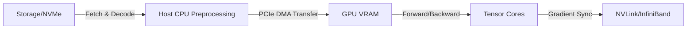

# Chapter 8: Staged Model Training & Parallelism

## Material Covered in This Chapter

- Model Training
- Purpose
- Learning Objectives
- 8.1 Training Systems Fundamentals
- Definition 8.1: Training systems
- 8.1.1 The staged system pipeline: Identifying 'accelerator bubbles'
- War Story 8.1: The 3AM gradient explosion
- 8.2 Iron Law of Training Performance
- Definition 8.2: The iron law of training performance
- The Utilization Gap
- Lighthouse 8.1: Lighthouse example: Training GPT-2
- Systems Perspective 8.1: The 10 GB to 10 TB scale factor
- 8.3 Mathematical Foundations
- 8.3.1 Neural network computation
- Backpropagation
- 8.3.1.1 Mathematical operations in neural networks
- 8.3.1.2 Matrix operations
- Napkin Math 8.1: GPT-2 attention layer computation
- Attention Score Computation (Q K^T):
- Computation Scale
- 8.3.1.3 Matrix-vector operations
- 8.3.1.4 Batched operations
- Systems Perspective 8.2: Why GPUs dominate training
- 8.3.1.5 Activation functions
- Napkin Math 8.2: GPT-2 GELU activation function
- Why GELU for GPT-2?
- System Performance Trade-off
- Systems Perspective 8.3: Memory bandwidth bottlenecks
- 8.3.2 Optimization algorithms
- 8.3.2.1 Gradient-based optimization methods
- Definition 8.3: Batch processing
- 8.3.2.2 Adaptive and momentum-based optimizers
- 8.3.2.3 Optimization algorithm system implications
- Napkin Math 8.3: GPT-2 optimizer memory requirements
- Memory Overhead Calculation
- System Decisions Driven by Optimizer
- 8.3.2.4 Framework optimizer interface and scheduling
- 8.3.3 Backpropagation mechanics
- 8.3.3.1 Activation memory requirements
- Napkin Math 8.4: GPT-2 activation memory breakdown
- Full Model Activation Memory.
- System Solutions Applied.
- Checkpoint 8.2: The memory-compute trade-off
- The Bottleneck
- Scaling Limits
- 8.3.3.2 Memory-computation trade-offs
- 8.3.4 Arithmetic intensity
- Systems Perspective 8.4: Peak FLOPS vs. sustained performance
- 8.4 Pipeline Architecture
- 8.4.1 Architectural overview
- 8.4.1.1 Data pipeline
- 8.4.1.2 Training loop
- 8.4.1.3 Evaluation pipeline
- 8.4.1.4 Component integration
- 8.4.2 Data pipeline
- 8.4.2.1 Core components
- 8.4.2.2 Preprocessing
- Example 8.1: GPT-2 language model data pipeline
- Pipeline Stages
- 2. Tokenization (CPU Preprocessing Zone)
- 3. Batching & Padding (CPU)
- Bottleneck Analysis
- Optimization Applied
- Napkin Math 8.5: The network wall
- 8.4.2.3 System implications
- 8.4.2.4 Data flows
- 8.4.2.5 Practical architectures
- 8.4.3 Forward pass
- 8.4.3.1 Compute operations
- Exclamation-Triangle Wave quantization and tail effects
- Quantitative Example:
- 8.4.3.2 Memory management
- Napkin Math 8.6: Estimating VRAM requirements
- Math:
- 8.4.4 Parameter updates and optimizers
- 8.4.4.1 Optimizer memory in the training loop
- 8.4.4.2 Batch size and parameter updates
- Napkin Math 8.7: The utility bill
- The economics:
- 8.5 Identifying Bottlenecks

---

## Section-by-Section Preserve-and-Extend

# Chapter 8 Summary: Model Training

Training represents the computational heart of machine learning systems: the phase where mathematical algorithms, memory
management, and hardware acceleration converge to transform raw data into capable models. What appears conceptually
simple—iterative parameter optimization—becomes a highly complex engineering challenge at scale. Forward and backward
propagation transform into orchestrations of matrix operations, memory allocations, and gradient computations that must
be carefully balanced against hardware constraints and performance requirements.

---

## 8.1 Training Systems Fundamentals

At its core, deep learning training is characterized by a massive asymmetry between the cost of learning and the cost of
using what was learned. While inference requires a single forward pass, training multiplies that cost at every level:
1. **Forward Pass:** Input data propagates through the model layers, and intermediate activations must be stored in
memory.
2. **Backward Pass:** Gradients are computed by traversing the computational graph in reverse (automatic
differentiation), which is computationally twice as expensive as the forward pass.
3. **Optimizer Step:** Parameters are updated based on gradient and optimizer state vectors.

### Definition 8.1: Training Systems
**Machine Learning Training Systems** are software-hardware systems that execute the iterative optimization loop—forward
pass, loss computation, backward pass, and parameter update—to minimize a loss function over a training dataset.
* **Quantitative Significance:** The memory cost of training is typically \(6 \times\) the inference memory footprint
per parameter when using the Adaptive Moment Estimation (Adam) optimizer. For a \(7\text{B}\) parameter model:
  \[
  \text{VRAM}_{\text{min}} = \underbrace{14\text{ GB}}_{\text{FP16 Weights}} + \underbrace{14\text{ GB}}_{\text{FP16
Gradients}} + \underbrace{56\text{ GB}}_{\text{FP32 Optimizer States (1st \& 2nd moments)}} = 84\text{ GB}
  \]
  This is a baseline footprint before accounting for activation storage, making VRAM pressure the primary reason a model
that runs inference on a single GPU requires multiple GPUs for training.
* **Durable Distinction:** Unlike inference systems, which discard intermediate layer activations as soon as the next
layer computes, training systems must retain all activation tensors from the forward pass to compute gradients during
the backward pass.
* **Common Pitfall:** A frequent misconception is that training failures are primarily compute bottlenecks. In practice,
the most common failure is an Out-of-Memory (OOM) error caused by the linear accumulation of activation tensors across
layers during the forward pass.

### Staged System Pipeline
To achieve high accelerator utilization, a training system is modeled as a staged pipeline where four distinct
subsystems must coordinate:
1. **Data Loading & Preprocessing (CPU/Storage):** Fetching raw bytes from Non-Volatile Memory Express (NVMe) SSDs,
decoding, and applying augmentations.
2. **Host-to-Device Transfer (PCIe):** Moving the processed batches over the PCIe bus into GPU/accelerator memory via
Direct Memory Access (DMA).
3. **Forward/Backward Pass (Accelerator):** Running matrix computations on the ALUs (e.g., CUDA or Tensor Cores).
4. **Parameter Synchronization (Interconnect):** Exchanging gradients between GPUs over NVLink or InfiniBand in
distributed training configurations.

Any mismatch in the throughput of these stages creates **accelerator bubbles**—idle hardware intervals where the
accelerator utilization drops to zero while waiting for data.



### Numerical Stability and Safekeeping
* **Gradient Checkpointing:** Breaks the linear activation memory scaling by saving activations at only \(\sqrt{L}\)
strategic layers and recomputing intermediate activations during the backward pass. This trades \(\sim 33\%\) additional
compute for up to a \(10 \times\) activation memory reduction.
* **Mixed-Precision Training:** Uses 16-bit floating-point formats (FP16 or BF16) for tensor computations while
accumulating updates in 32-bit master weights. This reduces memory footprint by \(\sim 2 \times\) and accelerates
execution via Tensor Cores.

> [!WARNING]
> **War Story 8.1: The 3AM Gradient Explosion**
> During a 7B parameter LLM training run, a single batch contained an outlier activation. In FP16 precision, this value
exceeded the maximum dynamic range of \(65,504\), overflowing to infinity (\(\text{NaN}\)). The gradients became
infinite, propagating through the network and destroying four days of compute (\(\sim \$5,000\)).
> **Safeguards implemented:**
> 1. **Hourly Checkpointing:** Limits data loss to a single hour of execution.
> 2. **Gradient Clipping:** Restricts the maximum norm of the gradient vector to suppress spikes.
> 3. **Transition to BF16:** Brain Floating Point 16 preserves the 8-bit exponent range of FP32, making overflows far
less likely.

---

## 8.2 The Iron Law of Training Performance

The optimization of training runs is governed by the specialized form of the iron law.

### Definition 8.2: The Iron Law of Training Performance
The **Iron Law of Training Performance** models the wall-clock execution time of an iterative optimization run by
assuming that data transfer and communication latency are fully overlapped with computation:
\[
T_{\text{train}} \approx \frac{O}{R_{\text{peak}} \cdot \eta_{\text{hw}}}
\]
Where:
* \(T_{\text{train}}\) is the training wall-clock time (seconds).
* \(O\) is the total number of floating-point operations (FLOPs) required.
* \(R_{\text{peak}}\) is the peak theoretical hardware throughput of the accelerator fleet (FLOP/s).
* \(\eta_{\text{hw}}\) is the hardware utilization fraction (often measured as Model FLOPs Utilization, or MFU).
* **Quantitative Significance:** The terms identify three distinct optimization avenues: reducing \(O\) (via algorithmic
changes like pruning, distillation, or training on fewer, higher-quality tokens), choosing faster hardware
(\(R_{\text{peak}}\)), or maximizing \(\eta_{\text{hw}}\). While GPT-3 achieved \(\eta_{\text{hw}} \approx 0.45\),
modern pipelines target \(\eta_{\text{hw}} > 0.55\).
* **Durable Distinction:** This simplified form assumes perfect pipeline overlapping. If data prefetching or gradient
synchronization fails, data movement (\(D_{\text{vol}} / \text{BW}\)) and latency (\(L_{\text{lat}}\)) terms from the
general iron law resurface as the primary bottleneck.
* **Common Pitfall:** Treating \(\eta_{\text{hw}}\) as a fixed property of the hardware. System efficiency is a pipeline
property; memory bandwidth saturation, kernel launch overhead, and synchronization barriers each degrade utilization
independently.

| Technique | Term Affected | Mechanism |
| :--- | :--- | :--- |
| **Mixed Precision (FP16/BF16)** | \(R_{\text{peak}} \uparrow, \eta_{\text{hw}} \uparrow\) | Tensor Cores operate at up to \(16 \times\) higher FLOP/s; halves VRAM traffic. |
| **Data Prefetching** | \(\eta_{\text{hw}} \uparrow\) | Overlaps CPU/storage preprocessing with GPU execution to eliminate idle bubbles. |
| **Gradient Checkpointing** | \(O \uparrow, \eta_{\text{hw}} \uparrow\) | Adds \(33\%\) recomputation FLOPs but permits larger batch sizes for higher arithmetic intensity. |
| **Gradient Accumulation** | \(\eta_{\text{hw}} \uparrow\) | Decouples effective batch size from VRAM limit to maintain high execution parallelism. |
| **Operator Fusion** | \(\eta_{\text{hw}} \uparrow\) | Combines element-wise operations to reduce high-bandwidth memory (HBM) read/writes. |
| **FlashAttention** | \(\eta_{\text{hw}} \uparrow\) | Reorganizes attention softmax computation to operate within SRAM, reducing HBM transfers. |

### Lighthouse 8.1: Training GPT-2 XL (1.5B parameters)
GPT-2 XL serves as our representative lighthouse example for analyzing large-scale single-node training:

* **Parameter Count:** \(1.5 \times 10^9\) (XL size), requiring \(\sim 3\text{ GB}\) in FP16 or \(\sim 6\text{ GB}\) in
FP32 for weights.
* **Layer Depth:** 48 layers with a hidden dimension of 1600.
* **Dataset:** OpenWebText (\(40\text{ GB}\)).
* **Compute:** \(\sim 1.00 \times 10^{19}\) FLOPs total.
* **Key Challenge:** The depth and hidden size create immense activation memory pressure, demanding optimization to
avoid VRAM starvation.

> [!NOTE]
> **Systems Perspective 8.1: The 10 GB to 10 TB Scale Factor**
> * **At 10 GB:** The entire dataset fits in host RAM. Data loading is a one-time startup cost, and storage bandwidth is
irrelevant during training.
> * **At 10 TB:** Data becomes a high-pressure stream. The system cannot hold the dataset; it must orchestrate
continuous pipelines. The I/O path shifts from a storage bandwidth check to a streaming network bottleneck, requiring
zero-copy transfers and multi-worker prefetching to avoid starving the GPU.

---

## 8.3 Mathematical Foundations

### 8.3.1 Neural Network Computation Complexity
Neural network training is dominated by matrix computations. The Basic Linear Algebra Subprograms (BLAS) standard
classifies these operations:
* **Level 1:** Vector-Vector operations (e.g., scale and add, \(O(n)\) work on \(O(n)\) data). Low arithmetic intensity.
* **Level 2:** Matrix-Vector operations (e.g., GEMV, \(O(n^2)\) work on \(O(n^2)\) data). Low arithmetic intensity,
typically memory-bandwidth bound.
* **Level 3:** Matrix-Matrix operations (e.g., GEMM, \(O(n^3)\) work on \(O(n^2)\) data). High arithmetic intensity,
making them ideal for hardware accelerators like GPUs and TPUs.

#### Napkin Math 8.1: GPT-2 Attention Layer Computation (Batch Size \(B = 32\), Sequence Length \(S = 1024\), Hidden Dimension \(H = 1600\), Heads \(A = 25\))
For a single transformer layer, the forward pass FLOPs are calculated as follows:
1. **Query, Key, Value Projections:** Three linear transformations scaling the input matrix.
   \[
   \text{FLOPs}_{\text{QKV}} = 2 \times 3 \times (B \cdot S \cdot H \cdot H) = 6 \times (32 \times 1024 \times 1600
\times 1600) \approx 503.3 \times 10^9 \text{ FLOPs}
   \]
2. **Attention Score Computation (\(Q K^T\)):**
   \[
   \text{FLOPs}_{\text{Score}} = 2 \times B \cdot A \cdot S \cdot S \cdot \left(\frac{H}{A}\right) = 2 \times B \cdot
S^2 \cdot H = 2 \times 32 \times 1024^2 \times 1600 \approx 107.4 \times 10^9 \text{ FLOPs}
   \]
3. **Attention Output Projection:**
   \[
   \text{FLOPs}_{\text{OutProj}} = 2 \times (B \cdot S \cdot H \cdot H) \approx 167.8 \times 10^9 \text{ FLOPs}
   \]
4. **Feed-Forward Network (FFN) with expansion factor 4:**
   - Layer 1 (\(H \to 4H\)): \(2 \times B \cdot S \cdot H \cdot 4H = 8 \cdot B \cdot S \cdot H^2 \approx 671.1 \times 10^9 \text{ FLOPs}\)
   - Layer 2 (\(4H \to H\)): \(2 \times B \cdot S \cdot 4H \cdot H = 8 \cdot B \cdot S \cdot H^2 \approx 671.1 \times 10^9 \text{ FLOPs}\)
   - Total FFN FLOPs: \(16 \cdot B \cdot S \cdot H^2 \approx 1.34 \times 10^{12} \text{ FLOPs}\)
5. **Total Layer Forward FLOPs:** \(\sim 2.06 \times 10^{12}\) FLOPs.
6. **Full Model Training Step (48 Layers):**
   \[
   \text{FLOPs}_{\text{step}} = 3 \times 48 \times (2.06 \times 10^{12}) \approx 296.7 \times 10^{12} \text{ FLOPs}
   \]
   *(Note: The factor of 3 accounts for 1 forward pass and 1 backward pass, which is twice the compute of the forward
pass).*

### 8.3.2 Activation Functions and Implementation Trade-offs
Activation functions execute element-wise millions of times per step. While mathematically simple, they can become
memory-bandwidth bound due to low arithmetic intensity.

* **Sigmoid/Tanh:** Require expensive transcendental (exponential) operations. Signified by \(10-20\) clock cycles per
operation.
* **ReLU:** Runs via a single comparison and conditional set (\(\max(0, x)\)), utilizing over \(95\%\) of peak ALU
performance.
* **GELU (GPT-2 Choice):** Smoother gradients than ReLU but \(2-4 \times\) more expensive due to cumulative distribution
function (\(\Phi(x)\)) calculation:
  \[
  \text{GELU}(x) = x \Phi(x) = x P(X \le x), \quad X \sim \mathcal{N}(0, 1)
  \]
  To avoid calculating the error function (\(\text{erf}\)) on the fly, production frameworks use a fast tanh-based
approximation:
  \[
  \text{GELU}(x) \approx 0.5x \left(1 + \tanh\left(\sqrt{\frac{2}{\pi}} \left(x + 0.044715 x^3\right)\right)\right)
  \]

```python
# Fast GELU approximation in PyTorch
def gelu_approx(x):
    return 0.5 * x * (1.0 + torch.tanh(math.sqrt(2.0 / math.pi) * (x + 0.044715 * torch.pow(x, 3))))
```

| Function | Key Advantages | Key Disadvantages | System Implications |
| :--- | :--- | :--- | :--- |
| **Sigmoid** | Bounded output in \((0, 1)\) | Vanishing gradients; non-zero centered | High exponential overhead; requires lookup tables |
| **Tanh** | Zero-centered in \((-1, 1)\) | Vanishing gradients at extremes | Exponential overhead; better convergence than sigmoid |
| **ReLU** | Extremely cheap; zero-derivative for \(x < 0\) | Dying ReLU (inactive neurons) | Single-instruction execution; enables activation sparsity |
| **Softmax** | Yields probability distribution | High computational cost | Non-local dependency; requires global normalization (reductions) |

### 8.3.3 Backpropagation Mechanics
Automatic Differentiation (AD) is implemented via reverse-mode topological traversal of the computational graph rather
than the symbolic chain rule. This enables the framework to reuse intermediate variables.
The mathematical formulation of backpropagation at layer \(l\) maps to matrix multiplications:
Given the forward pass \(A^{(l)} = f(Z^{(l)})\) with \(Z^{(l)} = A^{(l-1)}W^{(l)} + b^{(l)}\), the backward pass
computes:
\[
\frac{\partial \mathcal{L}}{\partial Z^{(l)}} = \frac{\partial \mathcal{L}}{\partial A^{(l)}} \odot
f'\left(Z^{(l)}\right)
\]
\[
\frac{\partial \mathcal{L}}{\partial W^{(l)}} = \left(A^{(l-1)}\right)^T \frac{\partial \mathcal{L}}{\partial Z^{(l)}}
\]
\[
\frac{\partial \mathcal{L}}{\partial A^{(l-1)}} = \frac{\partial \mathcal{L}}{\partial Z^{(l)}} \left(W^{(l)}\right)^T
\]
Notice that computing the weight gradients (\(\partial \mathcal{L}/\partial W^{(l)}\)) requires the activation matrix
\(A^{(l-1)}\) from the forward pass. This mathematical requirement is the root cause of VRAM accumulation during
training.

### 8.3.4 Roofline Model Analysis
The **Roofline Model** defines the boundary between memory-bound and compute-bound regimes. It relates Arithmetic
Intensity (\(I = \text{FLOPs/Byte}\)) to sustained accelerator performance:
\[
P_{\text{sustained}} = \min\left(R_{\text{peak}}, \text{BW}_{\text{memory}} \times I\right)
\]

* **Memory-Bound Regime:** If \(I < \frac{R_{\text{peak}}}{\text{BW}_{\text{memory}}}\), performance is throttled by
memory bandwidth. Optimizing compute kernels will not speed up execution. Solutions must reduce memory traffic (e.g.,
operator fusion, FlashAttention).
* **Compute-Bound Regime:** If \(I \ge \frac{R_{\text{peak}}}{\text{BW}_{\text{memory}}}\), performance is throttled by
the ALUs. Solutions must target FLOP efficiency or lower precision.

---

## 8.4 Pipeline Architecture

The execution of a training iteration is structured as a staged system pipeline, where CPU, host memory, PCIe lanes, GPU
memory, and GPU execution units must all process data in parallel.

### 8.4.1 Data Loading & Preprocessing
To prevent GPU starvation, host CPUs execute data pipelines asynchronously using multi-threaded buffers. The storage I/O
must maintain:
\[
t_{\text{preprocessing}} < t_{\text{GPU\_compute}}
\]
If an NVMe drive yields a practical read bandwidth of \(R_{\text{practical}} = 0.5 \times
\text{BW}_{\text{theoretical}}\), host memory must buffer multiple batches to absorb throughput variations:
\[
M_{\text{required}} = (N_{\text{prefetch}} + N_{\text{processing}} + N_{\text{transfer}}) \times S_{\text{batch}}
\]

### 8.4.2 Wave Quantization and Tail Effects
GPU threads are scheduled in lockstep units called **warps** (32 threads). Matrix calculations must be mapped into these
blocks. If input dimensions do not align with hardware boundaries, execution efficiency suffers due to tail effects:

| Batch Size | Warps Required | Warp Utilization | Relative Execution Time |
| :--- | :---: | :---: | :---: |
| **32** | 1 | \(100\%\) | \(1.0 \times\) |
| **33** | 2 | \(52\%\) | \(\sim 2.0 \times\) |
| **64** | 2 | \(100\%\) | \(1.0 \times\) |
| **65** | 3 | \(68\%\) | \(\sim 1.5 \times\) |

**Engineering Rule:** Always set batch sizes, hidden dimensions, and vocabulary sizes to multiples of 8, 32, or 64 to
avoid the quantization tax of idle warp lanes.

### 8.4.3 VRAM Footprint Accounting
VRAM is consumed by five distinct categories:
1. **Model Parameters:** Weights stored in FP16/BF16 (\(2\text{ bytes/param}\)) or FP32 (\(4\text{ bytes/param}\)).
2. **Gradients:** Same size as parameters.
3. **Optimizer States:** Adam stores first and second moments in FP32, adding \(8\text{ bytes/param}\).
4. **Activations:** Temporary tensors stored during the forward pass. For a standard transformer, activation memory
scales as:
   \[
   \text{Memory}_{\text{activations}} \propto B \times S \times H \times L \times A_{\text{factor}}
   \]
5. **Workspace Memory:** Temporary buffers used by libraries like cuDNN.

#### Napkin Math 8.6: VRAM Estimation for a 7B Parameter Model (FP16 weights/gradients, FP32 Adam optimizer)
1. **Model Weights (FP16):** \(7 \times 10^9 \times 2\text{ bytes} = 14\text{ GB}\)
2. **Gradients (FP16):** \(14\text{ GB}\)
3. **Optimizer States (FP32 Adam):** \(7 \times 10^9 \times 8\text{ bytes} = 56\text{ GB}\)
4. **Subtotal (No Activations):** \(14 + 14 + 56 = 84\text{ GB}\)
*Conclusion:* A 7B parameter model cannot fit within a standard 80 GB A100 GPU for training without memory-saving
techniques like parameter sharding (FSDP/ZeRO) or activation checkpointing.

### 8.4.4 Optimizers and Update Rules
The choice of optimizer represents a trade-off between convergence rate (iterations required) and memory consumption:

* **SGD:** Needs \(0\text{ bytes}\) of extra VRAM state.
* **Adam:** Requires 2 momentum states (\(8\text{ bytes/param}\) total) in FP32.
* **GaLoRE (Gradient Low-Rank Projection):** Projects gradients into a low-rank space, reducing optimizer state memory
footprint by up to \(70\%\) with minor convergence degradation.

#### The Linear Scaling Rule for Batch Size
When scaling the batch size by factor \(k\) to improve hardware throughput, the number of updates per epoch decreases by
\(1/k\). To prevent underfitting, the learning rate must be adjusted:
\[
\text{LR}_{\text{new}} = k \times \text{LR}_{\text{base}}
\]

```
Loss
 ^
 |    \    Linear Scaling Failure:
 |     \   Curve B: 8x Batch without LR tuning (Slow convergence)
 |      \  Curve A: Baseline
 |_______\ Curve C: 8x Batch + 8x LR (Restored convergence)
 +-----------------------------> Epochs
```

#### Renting vs. Buying Accelerator Fleets
Training runs represent massive capital investments. For a Llama-2-70B model trained on 2 Trillion tokens, the compute
cost is estimated as:
\[
\text{FLOPs} = 6 \times P \times N_{\text{tokens}} = 6 \times (70 \times 10^9) \times (2 \times 10^{12}) \approx 8.4
\times 10^{23} \text{ FLOPs}
\]
Running on a cluster of 1,000 H100 GPUs (operating at \(50\%\) sustained MFU, which is \(494\text{ TFLOPS}\) per GPU):
\[
T_{\text{train}} = \frac{8.4 \times 10^{23} \text{ FLOPs}}{1000 \times (494 \times 10^{12} \text{ FLOP/s})} \approx 1.7
\times 10^6 \text{ seconds} \approx 20\text{ days}
\]
* **Rental Cost (at \$3/hour per H100):** \(1000 GPUs \times 24 hours \times 20 days \times \$3 = \$1.44 Million.\)
* **Purchase Cost (at \$30,000 per H100):** \(1000 \times \$30,000 = \$30 Million.\)
* *Systems Conclusion:* A team must execute at least 21 full training runs to justify purchasing hardware over cloud
rentals.

---

## 8.5 Identifying Bottlenecks

### 8.5.1 Model FLOPs Utilization (MFU)

### Definition 8.4: Model FLOPs Utilization (MFU)
**Model FLOPs Utilization (MFU)** is the hardware-agnostic efficiency metric defined as the ratio of useful model
computations performed per step to the peak theoretical hardware capability:
\[
\text{MFU} = \frac{C_{\text{model}}}{R_{\text{peak}} \cdot T_{\text{step}}}
\]
Where \(C_{\text{model}}\) is the theoretical FLOP count per training step based on the model parameters (excluding
activation recomputation and padding), \(R_{\text{peak}}\) is the peak accelerator FLOP rate, and \(T_{\text{step}}\) is
the wall-clock time per step.
* **Quantitative Significance:** For a 7B parameter transformer processing 1024 tokens/step on an A100 GPU (\(312\text{
TFLOPS}\) peak BF16) with a measured step time of \(1.2\text{ seconds}\):
  \[
  \text{MFU} = \frac{7 \times 10^9 \times 6 \text{ FLOPs/token} \times 1024}{312 \times 10^{12} \times 1.2} \approx
0.115 \quad (11.5\%)
  \]
  An MFU of \(11.5\%\) indicates that \(88.5\%\) of the GPU's compute capability is wasted on memory stalls,
communication latencies, or CPU scheduling bottlenecks. Typical optimized systems achieve \(30-50\%\) MFU, with
\(55-65\%\) representing the practical ceiling.
* **Durable Distinction:** MFU differs from raw GPU utilization metrics reported by monitoring software (like
`nvidia-smi`), which show the percentage of time execution kernels are active on the device. Raw utilization includes
useless operations, such as padding FLOPs and activation recomputation.
* **Common Pitfall:** Assuming that \(100\%\) MFU is achievable on modern hardware. High Bandwidth Memory (HBM)
bandwidth limits, host-to-device bottlenecks, and CUDA kernel overhead enforce a physical ceiling on MFU.

### Diagnostics via the D·A·M Taxonomy
Bottlenecks are classified into the three axes of the D·A·M taxonomy:

| Bottleneck Category | D·A·M Axis | Primary Profiler Signature | Mitigations |
| :--- | :---: | :--- | :--- |
| **Compute-bound** | **Algorithm** | GPU utilization \(>90\%\); memory bandwidth utilization low. | Mixed precision, FlashAttention, kernel fusion. |
| **Memory-bound** | **Machine** | GPU utilization \(50-80\%\); high memory bandwidth utilization; ALUs stall waiting for VRAM. | Operator fusion, FlashAttention, lower-precision tensors. |
| **Data-bound** | **Data** | GPU utilization drops to near-zero periodically; CPU cores pinned at \(100\%\) during gaps. | Multiprocessing DataLoader, data prefetching, storage cache. |

> [!CAUTION]
> **War Story 8.2: The GIL-Locked GPU**
> A research lab deployed an expensive multi-GPU cluster but observed near-zero training acceleration. Profiling
revealed that the host data loading loop was written in single-threaded Python. The Python Global Interpreter Lock (GIL)
prevented concurrent preprocessing, pinning a single CPU core at \(100\%\) while the GPUs sat idle \(90\%\) of the time.
> **Fix:** Reconfigured the PyTorch DataLoader to use multiple worker processes (`num_workers=8`), bypassing the GIL by
spawning subprocesses.

---

## 8.6 Pipeline Optimizations

### 8.6.1 Data Prefetching and Overlapping
By utilizing asynchronous data loaders, host memory transfers are overlapped with GPU execution. Instead of serial file
reading and training (90 seconds baseline), the overlapped pipeline hides I/O latency, yielding a \(\sim 40\%\) speedup
(55 seconds).

```python
# Optimal PyTorch DataLoader composition
loader = DataLoader(
    dataset,
    batch_size=32,
    num_workers=8,        # Matches CPU core count
    pin_memory=True,      # Enables fast host-to-device DMA transfers
    prefetch_factor=2     # Maintains 16 batches ready in queue
)
```

### 8.6.2 Mixed-Precision Formats
Mixed-precision training utilizes low-precision numeric formats for matrix operations, reducing memory footprints and
accelerating math execution.

| Precision Format | Sign Bits | Exponent Bits | Mantissa (Fraction) Bits | Dynamic Range | Relative Precision |
| :--- | :---: | :---: | :---: | :--- | :--- |
| **FP32** | 1 | 8 | 23 | \(\pm 1.18 \times 10^{-38}\) to \(\pm 3.4 \times 10^{38}\) | \(7\) decimal digits |
| **FP16** | 1 | 5 | 10 | \(\pm 6.10 \times 10^{-5}\) to \(\pm 65,504\) | \(3-4\) decimal digits |
| **BF16** | 1 | 8 | 7 | \(\pm 1.18 \times 10^{-38}\) to \(\pm 3.4 \times 10^{38}\) | \(3\) decimal digits |

* **The Loss Scaling Trick (FP16):** Because FP16 has a narrow dynamic range, gradients smaller than \(6.1 \times
10^{-5}\) underflow to zero. Mixed precision scaling multiplies the loss by a scaling factor \(S_{\text{loss}}\) (e.g.,
\(2^{16}\)) before backpropagation, pushing gradients into the representable range, and then divides the updates by
\(S_{\text{loss}}\) before the optimizer step.
* **BF16 Advantage:** Because BF16 shares the 8-bit exponent of FP32, it represents the same dynamic range, eliminating
the need for loss scaling and preventing overflow/underflow instabilities.

### 8.6.3 FlashAttention
Standard self-attention computes the attention matrix \(A = \text{Softmax}(Q K^T / \sqrt{d})\) and outputs \(O = A V\).
* **Baseline Bottleneck:** The intermediate matrix \(A\) of shape \(S \times S\) must be written to and read from High
Bandwidth Memory (HBM). This requires \(O(S^2)\) memory traffic, causing a severe memory-bandwidth bottleneck.
* **FlashAttention Solution:** Uses online softmax calculation and tiling. It partitions the query, key, and value
matrices into blocks that fit within the GPU's fast **SRAM** (\(\sim 20\text{ MB}\) on A100). By computing the softmax
incrementally in SRAM blocks and merging the results, it avoids writing the \(S \times S\) matrix back to HBM, reducing
memory complexity to \(O(S)\).

### 8.6.4 Gradient Accumulation
When memory limits prevent training with a desired batch size \(B\), gradient accumulation simulates \(B\) by processing
\(k\) sequential micro-batches of size \(b = B/k\). Gradients are accumulated locally before executing a single
parameter update:

```python
# Gradient Accumulation Implementation
optimizer.zero_grad()
for step in range(k):
    micro_batch = next(dataloader)
    loss = model(micro_batch) / k  # Normalize loss
    loss.backward()                # Accumulate gradients locally
optimizer.step()                   # Synchronize and update once
```

---

### 8.6.5 GPT-2 Optimization Walkthrough on A100

A case study showing how optimizations compose to fit a 1.5B parameter model on a single 40 GB A100 GPU:

#### Naive Implementation:
* **Model:** GPT-2 XL (1.5B parameters)
* **Configuration:** Batch Size = 32, Sequence Length = 1024, FP32 Precision, single-threaded dataloader.
* **VRAM Footprint:** \(89.0\text{ GB}\) (Immediate Out-Of-Memory error on a 40 GB A100).

#### Optimization Sequence:
1. **Apply Mixed Precision (AMP):** Reduces parameter and gradient sizes. VRAM drop: \(89.0\text{ GB} \to 56.5\text{
GB}\) (Still OOM).
2. **Apply Activation Checkpointing:** Saves activations every 4 layers. VRAM drop: \(56.5\text{ GB} \to 32.1\text{
GB}\) (Model now fits in VRAM!).
3. **Profile for Throughput:** Measured MFU is \(45\%\). Profiler shows data loading consumes \(40\%\) of step time.
4. **Apply DataLoader Optimization:** Configure \(8\) workers and pin memory. GPU utilization increases to \(85\%\), and
data loading overhead drops to \(5\%\) (overlapped).

| Metric | Naive Baseline | Optimized Configuration | System Impact |
| :--- | :---: | :---: | :---: |
| **Model Weights** | \(6.0\text{ GB}\) (FP32) | \(3.0\text{ GB}\) (FP16) | Mixed Precision |
| **Gradients** | \(6.0\text{ GB}\) (FP32) | \(3.0\text{ GB}\) (FP16) | Mixed Precision |
| **Master Weights** | \(0.0\text{ GB}\) | \(6.0\text{ GB}\) (FP32) | AMP Overhead |
| **Optimizer States** | \(12.0\text{ GB}\) (FP32) | \(12.0\text{ GB}\) (FP32) | Unchanged (Adam moments) |
| **Activations (B=32)** | \(65.0\text{ GB}\) | \(8.0\text{ GB}\) | Checkpointing + FP16 |
| **Total VRAM** | \(89.0\text{ GB}\) | \(32.0\text{ GB}\) | **\(2.8 \times\) reduction** |
| **Training Time (32 V100s)** | 14.0 days | 8.4 days | **\(40\%\) speedup** |
| **Energy Consumption** | \(275,000\text{ kWh}\) | \(115,000\text{ kWh}\) | **\(58\%\) energy reduction** |
| **Electricity Cost** | \$27,500 | \$11,500 | Cost reduction |

---

## 8.7 Scaling Training Systems

When single-device optimization reaches a physical ceiling, training must scale to multi-device and multi-node clusters.

```
Throughput
 ^
 |             /  Ideal Linear Scaling (Ceiling)
 |            /   Compute-bound (e.g., ResNet-50)
 |           /    Balanced (e.g., LLM + NVLink)
 |          /     Bandwidth-bound (PCIe / InfiniBand Bottleneck) <--- "Communication Tax"
 |_________/
 +-----------------------------> GPU Count
```

### 8.7.1 Parallelism Strategies
1. **Data Parallelism (DP/DDP):**
   - *Mechanism:* Replicates the model across all devices; partitions the input batch.
   - *Communication:* Local gradients are averaged at the end of each backward pass using an **AllReduce** primitive.
   - *Constraint:* The model must fit in a single device's memory.
2. **Model Parallelism:**
   - *Mechanism:* Partitions the layers of the model across different devices.
   - *Constraint:* Naive execution creates pipeline bubbles where downstream devices idle while waiting for activations
from upstream devices.
3. **Pipeline Parallelism:**
   - *Mechanism:* Solves the model parallel bubble by splitting the batch into smaller **micro-batches** and
interleaving their execution across device boundaries (e.g., GPipe, PipeDream).
4. **Tensor Parallelism:**
   - *Mechanism:* Splits individual matrix operations (such as multi-head attention projections) column-wise or row-wise
across multiple devices (e.g., Megatron-LM).
5. **Hybrid Strategies (3D Parallelism):**
   - Combines Tensor Parallelism (intra-node NVLink), Pipeline Parallelism (intra-rack), and Data Parallelism
(inter-rack) to scale training to thousands of accelerators.

### 8.7.2 Collective Communication: Ring AllReduce
To synchronize gradients across \(N\) devices, frameworks employ the Ring AllReduce algorithm. Rather than routing all
data through a central parameter server, devices pass gradients along a logical ring topology.
* **Data Transferred per Device:**
  \[
  \text{Volume}_{\text{sync}} = 2 \left(\frac{N - 1}{N}\right) \times S
  \]
  Where \(S\) is the gradient tensor size (bytes). This constant scaling ensures that communication cost is decoupled
from the total number of devices, enabling cluster-scale data-parallel training.

### 8.7.3 Computing Eras and Systems Evolution
Modern AI hypercomputing platforms have evolved to handle parameter sharding and low-latency collective communications:

| System Era | Primary Workload | Memory Patterns | Processing Model | Key Bottlenecks |
| :--- | :--- | :--- | :--- | :--- |
| **Mainframe** | Tabular business logic | Flat memory hierarchy | Sequential execution | Clock speed, I/O latency |
| **HPC** | Numerical simulations | Regular grid/array access | Synchronized parallel (MPI) | Compute core throughput |
| **Warehouse-scale** | Web indexing & microservices | Sparse, irregular data access | Independent parallel tasks | Network switch bandwidth |
| **AI Hypercomputing** | Neural network training | Parameter-heavy, dense access | Hybrid parallel, distributed | Interconnect bandwidth (NVLink) |

### 8.7.4 Environmental Impact
The carbon footprint of a training run scales with cluster power draw:
\[
E_{\text{train}} = (P_{\text{cluster}} \times T_{\text{train}})
\]
\[
C_{\text{footprint}} = E_{\text{train}} \times \text{Grid}_{\text{intensity}}
\]

#### Napkin Math 8.11: Carbon Footprint for a 7B Parameter Model (1 Trillion Tokens)
* **Compute Required:** \(\approx 4.2 \times 10^{22}\) FLOPs.
* **Hardware Fleet:** 1,024 A100 GPUs (operating at \(150\text{ TFLOPS}\) sustained, \(400\text{ W}\) TDP per GPU; 128
host servers at \(200\text{ W}\) each).
* **Execution Time:** \(76\text{ hours}\) (\(\sim 3.2\text{ days}\)).
* **Total Energy Consumption:**
  \[
  E_{\text{train}} = (1024 \times 0.40\text{ kW} + 128 \times 0.20\text{ kW}) \times 76\text{ hours} \approx
33,056\text{ kWh}
  \]
  *(Equivalent to the electricity consumption of an average US household over 37 months).*
* *The Optimization Dividend:* Doubling the hardware utilization (\(\eta_{\text{hw}}\)) from \(30\%\) to \(60\%\) cuts
training time in half, saving \(\sim 16,528\text{ kWh}\) of energy and preventing over \(6.6\text{ tons}\) of CO2
emissions (assuming an average grid intensity of \(0.45\text{ kg/kWh}\)).

---

## 8.8 Fallacies and Pitfalls

* **Fallacy: Larger models always yield better validation accuracy.**
  Scaling parameters without increasing the training dataset causes overfitting. A \(20\text{B}\) parameter model
trained on a small dataset (\(<100\text{M}\) samples) typically performs worse than a \(7\text{B}\) parameter model due
to data starvation.
* **Pitfall: Assuming distributed training automatically accelerates development.**
  Distributed training incurs a high communication tax. If a small model is split across 8 GPUs without high-speed
interconnects, gradient synchronization can consume up to \(50\%\) of the iteration time, making execution slower than a
well-optimized single-GPU pipeline.
* **Fallacy: Hyperparameters transfer directly from small-scale experiments to large-scale runs.**
  Increasing batch size without scaling the learning rate leads to linear scaling failure (the model updates weights too
infrequently, preventing convergence). Warmup steps and learning rate decay schedules must be calibrated to the training
scale.
* **Pitfall: Neglecting data pipeline bottlenecks until late in the development cycle.**
  Teams frequently spend weeks optimizing GPU compute kernels, only to find the training throughput is capped by storage
read speeds. Data loader configurations must be profiled and optimized first.

---

## 8.9 Key Takeaways

* **The training loop is a physical contract:** High-efficiency training requires co-designing the mathematical
representation (precision, activation functions) with the physical system memory hierarchy (SRAM, HBM, PCIe, and
NVLink).
* **Memory constraints dictate throughput:** Out-of-memory errors are primarily caused by the accumulation of
activations and optimizer states. Techniques like gradient checkpointing and mixed-precision are essential tools to fit
models into hardware limitations.
* **FlashAttention shifts the bottleneck regime:** By restructuring attention softmax computations through tiling,
FlashAttention avoids writing massive intermediate matrices to HBM, moving attention from a memory-bound to a
compute-bound state.
* **Systematic diagnostics are required:** Handled via an iterative loop: **profile \(\to\) identify bottleneck \(\to\)
apply targeted fix \(\to\) re-profile**. Optimization without profiling leads to wasted development effort on
non-binding constraints.

---

## Full Slice Content (Docling Extract, Preserved Verbatim)

> Each section below preserves the source slice content as extracted by docling. Image placeholders are removed; tables,
equations, code blocks, named artifacts, and footnotes are kept intact.

## Model Training

## Purpose

Why does training a model cost millions while running it costs pennies?

Inference computes a single forward pass: data flows through the network, a prediction emerges. Training multiplies that
cost at every level. Each example requires a forward pass plus a backward pass to compute gradients, plus an optimizer
step that updates every parameter. The optimizer itself maintains momentum and variance estimates that can exceed the
model's own memory footprint. Then repeat across billions of examples, for multiple epochs, across dozens of
hyperparameter configurations. The result is a million-to-one asymmetry between the cost of learning and the cost of
using what was learned. This asymmetry is the primary gatekeeper to AI innovation: training a model costs orders of
magnitude more than running it, a gap so large that it governs who can participate at all. A research lab that trains in
three days iterates through ideas ten times faster than one that takes a month, and the compounding effect of faster
iteration dominates any single architectural insight. For the systems engineer, training is the phase where hardware
decisions matter most, where parallelism strategies determine feasibility, and where the ML workflow's most expensive
iteration loop either accelerates or stalls the entire project.

8.1 Training Systems Fundamentals 8.2 Iron Law of Training Performance 8.3 Mathematical Foundations 8.4 Pipeline
Architecture 8.5 Identifying Bottlenecks 8.6 Pipeline Optimizations 8.7 Scaling Training Systems 8.8 Fallacies and
Pitfalls 8.9 Summary

1 Training Cost Scaling: The roughly 2,000 × cost increase from GPT-2-scale training (Radford et al. 2019) to
GPT-4-class frontier training (widely cited ninefigure estimates in industry reporting) over several years reflects
three compounding factors: frontier parameter counts, training-token budgets, and accelerator fleets all grew
dramatically. Exact GPT-4 training details were not disclosed, but public estimates commonly place frontier training
runs in the regime of tens of thousands of A100-class accelerators for months, not single-node clusters. This trajectory
made training the single largest capital expenditure in AI development, exceeding the annual R&D budget of most
universities.

## Learning Objectives

- Explain the iron law of training performance and identify which term (operations, peak throughput, or utilization)
each optimization technique targets
- Calculate computational requirements (FLOPs), memory footprints (activation storage, optimizer states), and training
cost estimates for neural network training
- Compare optimization algorithms (SGD, Adam, AdamW) based on convergence speed, memory overhead, and computational cost
- Identify training bottlenecks using arithmetic intensity (Roofline Model) and the profilediagnose-fix-reprofile
methodology to distinguish compute, memory, and data-bound regimes
- Apply memory and throughput optimizations (mixed-precision, activation checkpointing, gradient accumulation, IO-aware
attention) to fit large models within accelerator constraints
- Construct efficient single-machine training pipelines using data prefetching, pipeline overlapping, and the systematic
optimization framework
- Analyze when single-machine training becomes infeasible (memory, duration, dataset scale) and evaluate trade-offs of
scaling to multi-accelerator configurations

## 8.1 Training Systems Fundamentals

Running GPT-2 once costs a fraction of a cent. Training GPT-2 cost approximately $50,000 in 2019. Running GPT-4 once
costs a few cents (an inference cost detailed in Chapter 13). Training GPT-4 cost an estimated $100 million 1 . This
million-to-one cost asymmetry, introduced in the Purpose section, reflects the sheer volume of computation required:
tens of billions of forward passes, each followed by a backward pass, repeated across datasets measured in terabytes.

T he frameworks examined in Chapter 7 provided the execution substrate: computational graphs that schedule operations,
automatic differentiation that computes gradients, and hardware abstractions that target diverse accelerators. Those
tools make a single training step possible. This chapter confronts what happens when that step must execute billions of
times, and what systems engineering is required to do so within practical time and budget constraints.

Asingle forward pass through GPT-2 requires roughly 3.00 × 10⁹ floating-point operations. Training requires tens of
billions of such passes, and each backward pass costs approximately twice as muchasthe forward pass, yielding a total
computational budget on the order of 1.00 × 10¹⁹ operations (Radford et al. 2019). This asymmetry makes training systems
engineering a distinct discipline and explains why access to training infrastructure increasingly determines who can
participate in AI development.

## Definition 8.1: Training systems

Machine Learning Training Systems are software-hardware systems that execute the iterative optimization loop-forward
pass, loss computation, backward pass, and parameter update-to minimize a loss function over a training dataset.

1. Significance (quantitative) : Training memory cost is 6 × the inference memory cost per parameter when using the
Adaptive Moment Estimation (Adam) optimizer: a 7Bparameter model requires 14 GB (FP16 weights) + 14 GB (FP16 gradients)
+ 56 GB (Adam first and second moments in FP32) = 84 GB minimum, before accounting for activation storage. This
multiplier is the primary reason a model that runs inference on one GPU requires multiple GPUs for training.
2. Distinction (durable) : Unlike inference systems, which execute a single forward pass and discard intermediate
activations, training systems must retain all intermediate activations

- from the forward pass for use during the backward pass, creating a memory footprint that grows linearly with model
depth and batch size.
3. Commonpitfall: Afrequent misconception is that training failures are compute problems. The most common training
failure is out-of-memory (OOM) error, which is a memory management problem: the activation tensors from all 𝐿 layers
accumulate during the forward pass and must coexist in GPU memory simultaneously, causing OOM before the first gradient
is computed.

Three characteristics distinguish training workloads from general-purpose computing. First, computational intensity:
that 1.00 × 10¹⁹ operation budget spread over days of wall-clock time demands sustained petaFLOPS-scale throughput from
hardware that rarely exceeds 30 to 70 percent utilization. Second, memory pressure: storing 1.5 billion weights requires
6 GB in FP32; the Adam optimizer adds two additional state tensors per parameter, consuming another 12 GB; and
activation storage across 48 transformer layers can double or triple this total, easily exceeding a single accelerator's
memory capacity. Third, data dependencies: each gradient update depends on the result of the previous one, creating
sequential bottlenecks that limit how much parallelism the system can exploit.

Each of these challenges opens a corresponding optimization pathway. Computational intensity can be addressed through
hardware acceleration (Chapter 11) and the BF16/FP8 mixed-precision techniques developed later in Section 8.6.3. Memory
pressure responds to techniques like gradient checkpointing 2, a specific application of rematerialization (discarding
and recomputing intermediate values to save memory, from Chapter 7) that trades recomputation for reduced activation
storage, and mixed-precision training 3, which halves the memory footprint of weights and activations. Data dependencies
motivate pipeline designs that overlap computation with data movement, heavily relying on the data loading throughput
optimized in Chapter 4, so the accelerator never sits idle waiting for the next batch. The current chapter focuses on
single-machine and single-node multi-GPU training; scaling to hundreds of machines across network boundaries introduces
communication and fault tolerance challenges beyond our current scope.

## 8.1.1 The staged system pipeline: Identifying 'accelerator bubbles'

A training system is not a single loop; it is a staged system pipeline . Reaching high accelerator utilization requires
analyzing training as a factory floor where four distinct stages coordinate to keep the ALUs busy:

1. Data Loading & Preprocessing (CPU/Storage): Fetching raw bits from Non-Volatile Memory Express (NVMe), decoding, and
augmenting on CPU cores.
2. Host-to-Device Transfer (PCIe): Moving the processed batch over the PCIe bus into GPU memory via DMA.
3. Forward/Backward Pass (Accelerator): Propagating activations and gradients through layers on the GPU.
4. Parameter Synchronization (NVLink): Exchanging gradients between GPUs over NVLink (900 GB/s) in multi-GPU
configurations to update weights.

Any mismatch in the throughput of these stages creates accelerator bubbles -intervals of idle silicon where the
'Machine' axis of the AI Triad sits at 0 percent utilization while waiting for the 'Data' axis to catch up. A systems
engineer's primary task during training is to eliminate these bubbles through asynchronous prefetching and pipeline
overlapping, ensuring that the next batch is ready on the PCIe bus before the current backward pass completes. We
develop the quantitative tools for measuring and fixing these bubbles in Section 8.5.

The chapter proceeds through five stages. First, we formalize the iron law of training performance, a specialized
application of the general iron law (Section 1.7) that decomposes training time into total operations, peak throughput,
and utilization, three levers that every optimization technique in this chapter targets. Second, we examine the
mathematical foundations that underpin training: neural network computation as a systems workload, optimization
algorithms that navigate loss landscapes, backpropagation mechanics, and the arithmetic intensity analysis that
determines whether training is compute bound or memory bound. Third, we dissect the pipeline architecture of a training
system

- 2 Gradient Checkpointing (Activation Checkpointing) : The memory pressure described here arises because
backpropagation requires every layer's activations from the forward pass. Checkpointing breaks this requirement by
saving activations at only √ 𝐿 strategic layers and recomputing the rest during the backward pass, trading roughly 33
percent additional compute for up to 10 × activation memory reduction. For GPT-2's forty-eight layers, this means
storing seven checkpoints instead of forty-eight full activation tensors.
- 3 Mixed-Precision Training: Uses half-precision (FP16 or BF16) for computation while maintaining FP32 'master weights'
for accumulation, where rounding errors would otherwise compound. A loss scaling trick prevents gradient underflow in
FP16's limited dynamic range, yielding nearly 2 × memory savings and 2-8 × throughput gains on Tensor Cores. BF16
('Brain Floating Point,' from Google Brain (Cloud 2019)) later eliminated loss scaling by matching FP32's 8-bit exponent
range, simplifying the dominantfailure mode of halfprecision training.

as a staged pipeline where data loading, forward pass, backward pass, and parameter updates each constrain the next.
Fourth, we develop pipeline optimizations that target specific iron law terms to close the gap between theoretical peak
and actual training speed: mixed-precision training, FlashAttention, gradient accumulation, and checkpointing. Fifth, we
explore how training scales beyond a single GPU to multi-GPU and multi-node configurations, where communication overhead
introduces new bottlenecks.

Before formalizing the iron law, consider how these constraints interact in practice. The theoretical framework matters
because failures are expensive: a single gradient explosion can erase days of computation worth thousands of dollars.

## War Story 8.1: The 3AM gradient explosion

The context: Ateam is training a 7B parameter large language model (LLM). The loss curve has been decreasing smoothly
for four days. The engineers leave for the night.

The failure: At 3:00 AM, the training loss suddenly spikes from 2.5 to NaN (Not a Number). The training crashes. The
consequence: The team has lost 4 days of compute ( ≈ $5,000). The mechanism: a single batch contained an outlier with
extremely high activation values. In Mixed Precision (FP16) , these values exceeded the dynamic range (> 65,504),
causing an overflow to Infinity. The gradients became Infinite, updating all weights to NaN.

The systems lesson: Three system-level safeguards prevent this class of failure.

1. Checkpointing: Save model state every hour to limit the loss to one hour of compute, not four days.
2. Gradient Clipping: Cap the norm of gradient vectors to prevent single-batch spikes from destroying the weights.
3. BF16: Use Brain Float 16 format, which trades precision for range, making overflows far less likely than in standard
FP16. The bit-level comparison of BF16 vs. FP16 dynamic range appears in Table D.12 (BF16 preserves FP32's dynamic range
while FP16 offers greater precision within a narrower range), and Figure D.3 breaks down the bit-level layout to make
this precision-range trade-off concrete.

## 8.2 Iron Law of Training Performance

Frameworks provide abstractions for expressing training algorithms, but training systems engineering determines whether
those algorithms can execute within physical resource limits. The iron law provides the organizing framework for
understanding how every optimization technique improves training time. This is a specialized application of the general
iron law of ML systems introduced in Section 1.7, focused specifically on maximizing computational throughput.

## Definition 8.2: The iron law of training performance

The Iron Law of Training Performance is the simplified form of the general iron law that isolates the computational
bottleneck of iterative optimization:

The simplification is valid when the pipeline is correctly staged: at training scale with large batches, data movement
(𝐷 vol / BW ) is overlapped with compute via prefetching pipelines, and communication overhead (𝐿 lat ) is absorbed by
gradient overlap strategies, leaving hardware utilization as the dominant remaining lever. When pipelines are poorly
staged, 𝐷 vol / BW resurfaces as the bottleneck and the simplified form no longer applies.

\[
\frac{O}{R_{\text{peak}} \cdot \eta_{\text{hw}}}
\]

1. Significance (quantitative) : The three factors identify three distinct optimization levers: 𝑂 (reducible by
algorithmic or model changes such as pruning, distillation, sparsity, or fewer training tokens), 𝑅 peak (improved by
hardware and lower-precision tensor cores), and 𝜂 hw (the utilization fraction and primary engineering target; GPT-3
training achieved 𝜂 hw ≈0.45 (Narayanan et al. 2021) while current systems target 𝜂 hw >0.55 ).
2. Distinction (durable) : Unlike the general iron law, which models all three cost terms (𝐷 vol / BW, 𝑂/(𝑅 peak ⋅ 𝜂 hw
), 𝐿 lat ) , this simplified form assumes data movement and communication are not the binding constraint, an assumption
that breaks for small-batch workloads or bandwidth-limited deployments.

Equation 8.1 reveals three levers for improvement: reduce total operations through algorithmic innovation, increase peak
throughput through hardware utilization, or improve utilization through better pipeline orchestration. Each optimization
technique in this chapter pulls one or more of these levers, as summarized in Table 8.1.

3. Common pitfall: Afrequent error is treating 𝜂 hw as fixed by hardware. System efficiency is a pipeline property:
memory bandwidth saturation, kernel launch overhead, and synchronization barriers each reduce 𝜂 hw independently, and
diagnosing which factor dominates requires profiling rather than reading hardware specs.

Table 8.1: Iron Law Optimization Mapping: Optimization techniques mapped to iron law terms. Understanding which term a
technique affects guides optimization strategy selection.

| Technique                   | Term Affected                                                                                    | Mechanism                                                                                       |
|-----------------------------|--------------------------------------------------------------------------------------------------|-------------------------------------------------------------------------------------------------|
| Mixed Precision (FP16/BF16) | Peak Throughput ↑ Utilization ↑ Total Operations ↑ Utilization ↑ Utilization ↑ Memory Traffic ↓, | Tensor Cores operate at up to 16 × higher FLOP/s Reduces accelerator idle time waiting for data |
| Data Prefetching            |                                                                                                  |                                                                                                 |
| Gradient Checkpointing      |                                                                                                  | Adds recomputation, but enables larger models                                                   |
| Gradient Accumulation       |                                                                                                  | Maintains high batch parallelism efficiency                                                     |
| Operator Fusion             |                                                                                                  | Reduces memory bandwidth bottlenecks                                                            |
| FlashAttention              | Utilization ↑                                                                                    | Same asymptotic FLOPs, much lower HBMIO; backward recomputation may add FLOPs                   |

Acaveat: the iron law focuses on execution efficiency -how fast the hardware processes a given workload. It does not
capture data-side factors such as data quality, dataset size, or curriculum design, which affect how many total
operations 𝑂 are needed to reach a target accuracy. A cleaner dataset or a better data mix can reduce the number of
epochs required, shrinking 𝑂 without touching hardware at all. Chapter 9 covers these data-side levers; here we hold the
workload fixed and ask how to execute it as fast as possible.

The gap between theoretical peak performance and actual training speed is often 2-3 × . Scaling to multiple accelerators
introduces additional communication overhead that can erode these gains, a trade-off we examine in Section 8.7. The
following checkpoint tests the core intuition behind why this gap exists.

- Checkpoint 8.1: The physics of training

Training speed is governed by the utilization of hardware peaks.

## The Utilization Gap

- □ Peakvs. Real: Whyis100percentaccelerator utilization impossible? (Memory bandwidth stalls, kernel launch overhead,
communication latencies).

- □ Batch Size Physics: Why does increasing batch size generally improve hardware uti- lization? (It increases
arithmetic intensity, moving operations from memory-bound to compute bound. We formalize this as Model FLOPs Utilization
in Section 8.5.)

- Precision Economics □ Mixed Precision: Howdoes FP16/BF16 double throughput? (Tensor Cores run 2 × faster, and memory
bandwidth effectively doubles).

To ground the abstract principles of training systems in concrete engineering decisions, we use GPT-2 as a recurring
worked example throughout this chapter. This Lighthouse Model is large enough to expose real systems bottlenecks yet
small enough to reason about without massive cluster infrastructure.

The iron law provides a static framework for reasoning about training performance, but the history of deep learning
reveals how the binding constraint has shifted over time as hardware and algorithms co-evolved. In 1986, backpropagation
was formalized (Rumelhart et al. 1986), and training a three-layer network on toy datasets required days on CPU
workstations-the bottleneck was raw compute throughput (𝑅 peak ) . In 2012, AlexNet demonstrated GPU training
(Krizhevsky et al. 2012), reducing ImageNet training from weeks to days and launching the deep learning era. By 2017,
transformers (Vaswani et al. 2017) and NVIDIA Volta Tensor Cores enabled mixed-precision training with a further 5 ×
speedup. GPT-3 in 2020 consumed about 3.14×10 23 FLOPs; one widely cited estimate put a single-run compute cost near
$4.6M, equivalent to roughly 355 V100 GPU-years (Brown et al. 2020), making utilization (𝜂 hw ) critical. By 2023,
training efficiency improved through the techniques examined in this chapter: FlashAttention reduces memory traffic
while improving 𝜂 hw; gradient checkpointing trades additional 𝑂 for memory capacity; mixed precision increases 𝑅 peak .
Each innovation was motivated by a specific iron law bottleneck. 8.2.1 Running example: Training GPT-2

## Lighthouse 8.1: Lighthouse example: Training GPT-2

Whythismodel? GPT-2 (1.5B) serves as our primary case study for large-scale training because it sits at the 'sweet spot'
of systems complexity. It is large enough to require distributed training and serious memory optimizations, yet small
enough to comprehend without the massive infrastructure complexity of trillion-parameter clusters.

| Property     | Specification             | Systems Implication                                       |
|--------------|---------------------------|-----------------------------------------------------------|
| Parameters   | 1.5 Billion (XL)          | Requires ~3 GB (FP16) or ~6 GB (FP32) for weights alone.  |
| Architecture | 48 Layers, 1600 Dim       | Deep pipeline creates heavy activation memory pressure.   |
| Dataset      | OpenWebText (40 GB)       | I/O throughput must match high-speed accelerator compute. |
| Compute      | ~ 1.00 × 10¹⁹ FLOPs total | Training takes days/weeks; demands parallelization.       |

Key systems challenge: Training GPT-2 is primarily memory-bound (due to activation storage) and compute-intensive
(requiring massive matrix multiplications). It forces us to move beyond simple training loops to sophisticated pipelines
that manage data movement as carefully as computation.

Not all training workloads are compute bound. Recommendation models like Deep Learning Recommendation Model (DLRM) are
dominated by massive embedding tables (100 billion to 10 trillion parameters, mostly embeddings) that make them
memory-bandwidth-bound rather than compute bound, requiring model parallelism for capacity rather than throughput . The
remainder of this chapter focuses on dense, compute-intensive training using GPT-2 as the primary worked example.

Training systems occupy a critical position in the machine learning pipeline: they consume prepared data from upstream
engineering (Chapter 4) and produce trained models for downstream deployment (Chapter 14). Data quality directly impacts
training stability, while training efficiency determines iteration velocity during model development. Modern training
systems face three scaling challenges. First, data scale: processing petabyte datasets requires efficient I/O pipelines
and distributed storage. Second, model scale: billion-parameter models demand parallelization strategies including data
parallelism 4 (replicate model, split data) and model parallelism 5 (split model across devices). Third, infrastructure
scale: coordinating thousands of accelerators introduces communication overhead that can dominate training time. These
challenges motivate the workflow management tools (Chapter 3) that automate training orchestration.

## Systems Perspective 8.1: The 10 GB to 10 TB scale factor

- At 10 GB: The entire dataset often fits in system RAM. Data loading is a one-time 'startup cost,' and the disk
bandwidth ( BW ) does not matter after the first few seconds. · At 10 TB: Data becomes a continuous, high-pressure
stream. The system can no longer 'load' the data; it must orchestrate its movement. The 𝐷 vol term shifts from a storage
bottleneck to a networking and I/O bottleneck, requiring zero-copy paths and multi-worker prefetching just to keep the
accelerator from starving.

Scale is not just 'more data'; it is a transformation of the system's physics.

These scaling challenges translate into concrete workflow requirements. Training workflows consist of interdependent
stages-data preprocessing, forward and backward passes, and parameter updates-extending the neural network concepts from
Chapter 5. System constraints often dictate performance limits: modern accelerators are frequently bottlenecked by
memory bandwidth, where data movement between memory hierarchies is slower than the computations themselves (Patterson
and Hennessy 2017). In distributed setups, synchronization across devices introduces additional latency, with
interconnect performance (NVLink, InfiniBand) critically affecting throughput 6 .

These scaling challenges share a common thread: every bottleneck traces back to the cost of specific mathematical
operations-matrix multiplications that consume trillions of FLOPs, activation functions constrained by memory bandwidth,
and optimizer states that triple the memory footprint. Before we can design effective systems to execute these
operations at scale, we need to understand exactly what they cost (Goto and Geijn 2008).

The hardware-software co-design principles from Chapter 11 are central here. Mixed-precision training emerged from
recognizing that Tensor Core hardware could accelerate reduced-precision arithmetic. Gradient checkpointing arose from
memory capacity constraints.

## 8.3 Mathematical Foundations

Chapter 5 established what neural network operations compute and why they enable learning. The question for a systems
engineer is what they cost -the FLOPs consumed, the memory required, and the bandwidth demanded when these conceptually
simple operations execute at scale. A matrix multiplication is just 𝐶 = 𝐴𝐵 in notation, but training GPT-2 requires
executing that operation billions of times with matrices too large to fit in fast memory. The activation function 𝑓(𝑥) =
max (0,𝑥) appears trivial, yet the choice between rectified linear unit (ReLU) and sigmoid determines whether Tensor
Cores can accelerate computation.

Four dimensions structure this cost analysis. First, FLOP counts of matrix operations that dominate training, accounting
for 60-90 percent of training time (He et al. 2016). Second, memory requirements for storing activations and optimizer
states simultaneously. Third, bandwidth demands that determine whether operations are compute bound or memory bound.
Fourth, arithmetic intensity classifications that guide optimization strategy selection. Together, these dimensions
provide the vocabulary for analyzing the computational intensity, memory pressure, and data dependencies introduced in
Section 8.1.

## 8.3.1 Neural network computation

Neural network training consists of repeated matrix operations and nonlinear transformations. These operations are
conceptually simple but create the system-level challenges that dominate modern training infrastructure. The
introduction of backpropagation 7 by Rumelhart et al. (1986) and the

- 4 Data Parallelism: Replicates the full model on every device, splitting only the data. Each device computes gradients
independently, then an AllReduce operation synchronizes them-adding communication volume proportional to model size at
every step. This synchronization tax limits scaling efficiency: doubling accelerators rarely halves training time once
communication becomes the bottleneck.
- 5 Model Parallelism: Partitions the model's layers across devices when it exceeds single-device memory. Activations
must transfer between devices at every partition boundary, and naive partitioning creates 'pipeline bubbles' where
downstream devices idle while waiting-often reducing utilization to 25-50 percent. Microbatch pipelining (GPipe,
PipeDream) recovers most of this lost efficiency.
- 6 Transformer Training Interconnect Sensitivity: Self-attention's 𝑂(𝑁 2 ) memory and compute scaling amplifies the
interconnect bottleneck mentioned here: each layer's activation tensors must transfer between devices at every pipeline
boundary, and gradient synchronization scales with the full parameter count. GPT-3 training across 1,024 V100 GPUs spent
an estimated 30-40 percent of wall-clock time on inter-GPU communication, making the NVLink vs. InfiniBand bandwidth
choice a first-order determinant of training cost.

## Backpropagation

Provenance: The algorithm was independently derived by Linnainmaa (1970) for automatic differentiation of computer
programs and by Werbos (1974) in a Harvard PhD thesis on economic modeling-over a decade before Rumelhart, Hinton, and
Williams popularized it for neural networks in 1986. This delay between derivation and broad adoption recurs in
MLsystems history: attention mechanisms predated transformers by decades, but the 2017 Transformer showed that
attention-heavy models could train efficiently on contemporary GPU systems; later TPU and GPU clusters enabled much
larger deployments. Every modern framework's backward() call implements Linnainmaa's reverse-mode AD, not textbook chain
rule-the difference is that graph-reverse topological traversal enables parallel gradient computation across independent
subgraphs.

8 BLAS: Standardized by Lawson et al. (1979), BLAS defines three levels: Level 1 (vector-vector, 𝑂(𝑛) work), Level 2
(matrixvector, 𝑂(𝑛 2 ) ), and Level 3 (matrix-matrix, 𝑂(𝑛 3 ) work on 𝑂(𝑛 2 ) data). Training is dominated by Level 3
operations precisely because their high arithmetic intensity𝑂(𝑛) FLOPs per byte-saturates hardware compute units rather
than starving on memory bandwidth. cuBLAS and oneDNN implement these as the kernel layer beneath every framework's
matrix multiplication.

development of efficient matrix computation libraries such as Basic Linear Algebra Subprograms (BLAS) 8 (Dongarra et al.
1988) laid the groundwork for modern training architectures.

## 8.3.1.1 Mathematical operations in neural networks

Forward propagation, in its simplest case, involves two operations: matrix multiplication and activation function
application. Matrix multiplication implements the linear transformation at each layer. The following equation represents
how information flows through each layer: At layer 𝑙, the computation can be described as (following the row-vector
convention established in Chapter 5): A (𝑙) =𝑓( A (𝑙-1) W (𝑙) + b (𝑙) ) Where:

## 8.3.1.2 Matrix operations

- A (𝑙-1) represents the activations from the previous layer (or the input layer for the first layer), with each row
being a sample in the batch, · W (𝑙) ∈ ℝ 𝑛 𝑙-1 ×𝑛 𝑙 is the weight matrix at layer 𝑙, which contains the parameters
learned by the network, · b (𝑙) is the bias vector for layer 𝑙, · 𝑓(⋅) is the activation function applied element-wise
(for example, ReLU, sigmoid) to introduce nonlinearity.

Section 5.4.2.2 established that forward propagation reduces to chains of matrix multiplications, and Section 6.9.1
catalogued the computational primitives-general matrix multiply (GEMM), convolution, and dynamic attention-that every
architecture shares. Training amplifies these patterns: each operation executes not once but billions of times, and each
forward pass is paired with a backward pass that roughly doubles the computational cost. Understanding which matrix
operations dominate-and how their shapes change between forward and backward passes-reveals why specific system designs
and optimizations emerged for training.

This computational dominance has driven system-level optimizations: blocked matrix computations that parallelize across
multiple units, and memory hierarchies designed for the access patterns of both forward and backward passes. As neural
architectures grew, weight and activation matrices both had to remain accessible for backpropagation, and hardware
evolved to serve these dense multiplication patterns within growing memory budgets.

Matrix multiplication dominance has driven both algorithmic and hardware innovations. Early neural network
implementations relied on standard CPU-based linear algebra libraries, but the scale of modern training demanded
specialized optimizations. Strassen's algorithm 9 reduced the naive 𝑂(𝑛 3 ) complexity to approximately 𝑂(𝑛 2.807 )
(Strassen 1969), and contemporary hardwareaccelerated libraries like cuBLAS (NVIDIA 2024a) continue pushing
computational efficiency limits.

To illustrate the scale of these operations concretely, consider the attention layer computations in our GPT-2
Lighthouse Model.

The scale of these computations becomes concrete in the GPT-2 attention layer computation that follows, which traces
through a single layer.

## Napkin Math 8.1: GPT-2 attention layer computation

Each GPT-2 layer performs attention computations that exemplify dense matrix multiplication demands. For one GPT-2
transformer layer (all heads combined) with batch\_size = 32, sequence\_length = 1024, hidden\_dim = 1600:

Query, Key, Value Projections (the three linear transformations that create attention inputs-3 separate matrix
multiplications): FLOPs =2×3×( batch × seq × hidden × hidden ) billion FLOPs

=2×3×(32×1024×1600×1600) ≈ 503

## Attention Score Computation (Q K^T):

Feed-Forward Network (Two linear transformations with expansion factor 4):

× FLOPs =2× batch × heads × seq × seq × hidden/heads =2×32×25×1024×1024×64 = 1074 billion FLOPs

## Computation Scale

FLOPs batch seq hidden 2

- Total for one transformer layer (Attention + FFN): ~2060 B FLOPs forward pass

≈16×

×

×

- With 48 layers in GPT-2: ~296.7 trillion FLOPs per training step
- At 50,000 training steps: ~14834 petaFLOPs total training computation

System implication: AV100 GPU (125 TFLOPS peak FP16 with Tensor Cores, 15.7 TFLOPS FP32 without) would require 2 seconds
for the modeled attention-plus-FFN training-step estimate at 100 percent utilization (theoretical peak; practical
throughput would be lower). Actual training steps take 180 to 220 ms, requiring 8 to 32 GPUs to achieve this throughput
depending on utilization and interconnect efficiency.

These FLOP counts are not academic bookkeeping. They are the Compute term of the iron law made concrete, and they
explain why training cost scales as a predictable function of model architecture and sequence length rather than as an
unpredictable emergent property.

## 8.3.1.3 Matrix-vector operations

Not all operations in neural networks involve large matrix-matrix multiplications. Normalization layers, bias additions,
and certain recurrent computations involve matrix-vector operations instead. Although computationally simpler than
matrix-matrix multiplication, these operations present distinct system challenges: they exhibit lower hardware
utilization due to their limited parallelization potential. A single vector provides insufficient work to keep thousands
of accelerator cores busy simultaneously. This characteristic influences both hardware design and model architecture
decisions, particularly in networks processing sequential inputs or computing layer statistics.

## 8.3.1.4 Batched operations

Recognizing the limitations of matrix-vector operations, the introduction of batching transformed matrix computation in
neural networks. By processing multiple inputs simultaneously, training systems convert matrix-vector operations into
more efficient matrix-matrix operations. This approach improves hardware utilization but increases memory demands for
storing intermediate results. Modern implementations must balance batch sizes against available memory, leading to
specific optimizations in memory management and computation scheduling.

The progression from matrix-vector to batched matrix-matrix operations explains the hardware design choices in modern
accelerators. Hardware accelerators like Google's TPU (Jouppi et al. 2017) reflect this evolution, incorporating
specialized matrix units and memory hierarchies optimized for batched operations. These hardware adaptations enable
training of large-scale models like GPT-3 (Brown et al. 2020) through efficient handling of the matrix-matrix
multiplication patterns that batching produces.

## Systems Perspective 8.2: Why GPUs dominate training

The matrix operations described earlier directly explain modern training hardware architecture. GPUs dominate training
for three reasons. First, matrix multiplication's independent element calculations map perfectly to thousands of GPU
cores (NVIDIA A100 has 6,912 CUDA cores). Second, specialized hardware units like Tensor Cores accelerate matrix
operations by 10-20 × through dedicated hardware for the dominant workload. Third, blocked matrix computation

9 Strassen's Algorithm: Achieves 𝑂(𝑛 2.807 ) by replacing one of eight sub-multiplications with additions, but training
systems rarely benefit. The recursion disrupts the regular memory-access patterns that Tensor Cores exploit, and
accumulated rounding errors across billions of training iterations can destabilize convergence. In practice, mainstream
GEMM libraries such as cuBLAS leave the dominant training matrix multiplications to highly optimized blocked 𝑂(𝑛 3 )
kernels with superior hardware utilization rather than recursive Strassen variants.

10 Softmax: A'soft' (differentiable) approximation to the argmax functionreturning a probability distribution rather
than a hard one-hot vector. The systems cost is its global normalization: computing the denominator ∑𝑒 𝑥 𝑖 requires
reading the entire input vector, preventing the element-wise parallelization that makes ReLU fast. This memory-access
pattern is precisely what FlashAttention restructures via tiling.

patterns enable efficient use of GPU memory hierarchy (L1/L2 cache, shared memory, global memory). When GPT-2 examples
later show why V100 GPUs achieve 2.4 × speedup with mixed precision, this acceleration comes from Tensor Cores executing
the matrix multiplications we just analyzed. Matrix operation characteristics are prerequisite for appreciating why
pipeline optimizations like mixed-precision training provide such substantial benefits.

Matrix multiplications dominate training compute, but neural networks require more than linear transformations. Between
each layer's matrix operations, activation functions introduce the nonlinearity that enables networks to learn complex
patterns. These functions appear computationally trivial compared to matrix multiplication, yet their implementation
characteristics affect training efficiency in ways that matter at scale.

## 8.3.1.5 Activation functions

In Chapter 5, we established the mathematical properties of activation functions like sigmoid, tanh, ReLU, and softmax.
While their role is to introduce nonlinearity, their implementation characteristics significantly impact training system
performance. From a systems perspective, the choice of activation function determines computational cost, hardware
utilization, and memory access patterns during backpropagation.

Because activation functions execute millions of times per training step, even small per-operation differences compound
into significant training time impact. The selection of an activation function directly influences training throughput
and hardware efficiency. Figure 8.1 quantifies these performance differences through CPU benchmarks on Apple M2
hardware, revealing that Tanh executes in 0.61 seconds compared to Sigmoid's 1.10 seconds, a 1.8 × speedup.

The critical question for ML systems engineers is not what these functions do mathematically, but how to implement them
efficiently at scale. The computational trade-offs that govern this choice determine real-world training efficiency.

Figure 8.1: Activation Function Execution Time: CPU benchmarks on Apple M2 hardware reveal significant variation. ReLU
completes in 0.45 seconds, Tanh in 0.61 seconds, Softmax in 0.91 seconds, and Sigmoid in 1.10 seconds. These differences
directly affect training throughput and real-time inference latency, making activation function selection a system-level
design decision.

In production environments, modern hardware accelerators alter these relative characteristics, but the underlying cost
hierarchy remains. Functions requiring transcendental operations are significantly more expensive than simple
thresholding: in software, exp() takes 10-20 clock cycles compared to 1 cycle for basic arithmetic. Modern GPUs and TPUs
mitigate this through lookup tables or piece-wise linear approximations, but even optimized hardware-based sigmoid/tanh
remains 3-4 × slower than ReLU. ReLU's max (0,𝑥) requires only a single comparison and conditional seta simple
multiplexer checking the sign bit-enabling it to run at 95 percent+ of peak FLOP/s, while sigmoid achieves only 30-40
percent hardware utilization. Beyond raw throughput, ReLU's characteristic of producing roughly 50 percent zeros enables
system-level sparsity optimizationssparse matrix operations and gradient compression-that reduce memory bandwidth
requirements, the primary bottleneck in large-scale training. In contrast, global normalization functions like Softmax
10 require access to the entire input vector simultaneously to compute the denominator, preventing the independent
element-wise parallelization possible with Sigmoid or ReLU.

Table 8.2 synthesizes these system-level trade-offs, showing how mathematical behavior translates into operational
constraints.

Table 8.2: Activation Function Systems Comparison: While activation functions contribute only a fraction of total
training time, their implementation characteristics (computational complexity, hardware utilization, and memory
patterns) significantly impact the efficiency of modern learning pipelines.

| Function   | Key Advantages                                                                   | Key Disadvantages                                | System Implications                                                                                  |
|------------|----------------------------------------------------------------------------------|--------------------------------------------------|------------------------------------------------------------------------------------------------------|
| Sigmoid    | Smooth gradients; bounded output in (0,1) .                                      | Vanishing gradients; nonzero-centered output.    | Exponential computation adds overhead; LUT-based hardware implementation is required for efficiency. |
| Tanh       | Zero-centered output in (-1,1) .                                                 | Vanishing gradients at extremes.                 | Better convergence than sigmoid; similar computational cost due to exponential terms.                |
| ReLU       | Extremely efficient computation; avoids vanishing gradients for positive inputs. | Can suffer from 'dying ReLU' (inactive neurons). | Single-instruction hardware implementation; enables sparsity-based optimizations.                    |
| Softmax    | Outputs probability distribution over classes.                                   | High computational cost; nonlocal dependencies.  | Requires global normalization; memory-intensive due to dependencies across the entire input vector.  |

In practice, ReLU is the default choice for large-scale networks due to its efficiency and scalability. Softmax remains
indispensable for classification tasks requiring probabilistic outputs, despite its computational cost.

Our GPT-2 Lighthouse Model illustrates these trade-offs through its choice of the GPT-2 Gaussian Error Linear Unit
(GELU) activation function .

## Napkin Math 8.2: GPT-2 GELU activation function

Beyond the foundational activation functions covered in Chapter 5 (Sigmoid, Tanh, ReLU), modern architectures
increasingly adopt smoother alternatives. GPT-2 uses a GELU activation (Hendrycks and Gimpel 2016), implemented in
practice with the common tanh-based approximation. The exact mathematical definition is:

where is the cumulative distribution function of the standard normal distribution.

## Why GELU for GPT-2?

\[
\operatorname{GELU}(x) = x \Phi(x) = \frac{x}{2}\left[1+\operatorname{erf}\left(\frac{x}{\sqrt{2}}\right)\right]
\]

- Smoother gradients than ReLU, reducing the dying neuron problem

Φ(𝑥)

- Stochastic regularization effect: acts like dropout by probabilistically dropping inputs
- Better empirical performance on language modeling tasks

## System Performance Trade-off

- Computational cost: ~2-4 more expensive than ReLU (requires erf function evaluation)
- Memory: Same as ReLU (element-wise operation)
- Training time impact: For GPT-2's 48 layers, GELU adds ~10 to 20 percent to total forward pass time

×

- Justified by results: The improved model quality (lower perplexity) offsets the computational overhead

Frameworks implement fast approximation of GELU using optimized formulas (Listing 8.1). This approximation reduces
computational cost to approximately 1.5 × ReLUwhile maintaining GELU's benefits, demonstrating how production systems
balance mathematical properties with implementation efficiency.

Listing 8.1: GELU Approximation: Fast approximation avoids expensive erf() computation while preserving activation
properties.

```
# Fast GELU approximation used in production systems # Avoids expensive erf() computation while # preserving activation properties gelu_approx = ( 0.5 * x * (1 + tanh(sqrt(2 / pi) * (x + 0.044715 * x**3))) )
```

The GELU approximation highlights a broader pattern: compute cost is not always the dominant concern. For activation
functions, the real bottleneck is often memory bandwidth rather than arithmetic operations. This distinction between
compute-bound and memory-bound operations directly affects optimization priorities and recurs throughout our analysis of
training bottlenecks.

## Systems Perspective 8.3: Memory bandwidth bottlenecks

Activation functions reveal a critical systems principle: not all operations are compute bound. While matrix
multiplications saturate accelerator compute units, activation functions often become memory-bandwidth-bound for three
reasons. First, element-wise operations perform few calculations per memory access (ReLU performs one operation per
load). Second, simple operations complete faster than memory transfer time, limiting parallelism benefits. Third, modern
GPUs have 10-100 × more compute throughput than memory bandwidth.

This is why activation function choice matters less than expected. ReLU vs. sigmoid shows only 2-3 × difference despite
vastly different computational complexity, because both are bottlenecked by memory access. The forward pass must
carefully manage activation storage to prevent memory bandwidth from limiting overall training throughput.

Forward pass operations and their computational characteristics establish the workload that training systems must
compute: matrix multiplications dominating FLOPs, activation functions constrained by memory bandwidth. A neural network
that only computes predictions, however, learns nothing. Training requires updating model parameters so future
predictions improve. The forward pass produces a loss value quantifying how wrong the current predictions are; the
question now shifts from how much does computation cost to how do we use the result to improve .

## 8.3.2 Optimization algorithms

Optimization algorithms determine, given a loss value and the gradient information it produces, how each parameter
should change to reduce future errors. These algorithms govern the learning trajectory, translating gradients into
parameter updates that steer the model toward better performance.

The selection and design of optimization algorithms have direct system-level implications for computation efficiency,
memory requirements, and scalability. The focus here is on the algorithms themselves during training; posttraining
compression techniques (quantization, pruning, knowledge distillation) are detailed in Chapter 10, and systematic
hyperparameter optimization approaches are covered in Chapter 3.

## 8.3.2.1 Gradient-based optimization methods

In Section 5.4.5.1, we introduced gradient descent as the fundamental optimization algorithm: iteratively adjusting
parameters in the direction of steepest descent. That conceptual foundation assumed modest networks on single devices.
Here, we examine how gradient descent and its variants interact with real hardware constraints. The same mathematical
operation that elegantly adjusts weights becomes a significant systems challenge when models contain billions of
parameters and training data spans terabytes.

Gradient descent Gradient descent is the mathematical foundation of neural network training, iteratively adjusting
parameters to minimize a loss function. In training systems, this mathematical operation translates into specific
computational patterns. For each iteration, the system must:

1. Compute forward pass activations
2. Calculate loss value
3. Compute gradients through backpropagation
4. Update parameters using the gradient values

The computational demands of gradient descent scale with both model size and dataset size. Computing gradients requires
storing intermediate activations during the forward pass for backpropagation. These activations consume memory
proportional to the depth of the network and the number of examples being processed.

These system constraints led to the development of variants that better align with hardware capabilities. The key
insight was that exact gradient computation, while mathematically appealing, is not necessary for effective learning.
SGD 11 represents a pivotal shift in optimization strategy, estimating gradients using individual training examples
rather than the entire dataset. This approach drastically reduces memory requirements since only one example's
activations and gradients need storage at any time.

Traditional gradient descent processes the entire dataset before each parameter update. For a training set with one
million examples, the system must compute an aggregate gradient over all examples before taking one step. Equation 8.2
and Equation 8.3 capture the implementation distinction: Peak Activation Memory ∝𝐵 micro × Activation Memory per Example
(8.2) 𝑇 step ∝𝑁×𝑇 forward+backward per example (8.3) This memory breakdown is formalized in the Algorithm Foundations
appendix, which derives the full training memory equation including optimizer state overhead. Full-batch training does
not require storing every example's activations simultaneously if the dataset is streamed or microbatched; peak memory
is governed by the examples held in memory at once. The systems problem is still severe: processing 𝑁 = 1,000,000
examples before each update creates million-example iteration times, reducing the rate at which the model can learn from
the data.

However, processing single examples creates new system challenges. Modern accelerators achieve peak performance through
parallel computation, processing multiple data elements simultaneously. Single-example updates leave most computing
resources idle, resulting in poor hardware utilization. The frequent parameter updates also increase memory bandwidth
requirements, as weights must be read and written for each example rather than amortizing these operations across
multiple examples.

Mini-batch processing Mini-batch gradient descent emerges as a practical compromise between full-batch and stochastic
methods, computing gradients over small batches of examples that align well with modern accelerator architectures (Dean
et al. 2012). GPUs contain thousands of cores designed for parallel computation, and mini-batch processing allows these
cores to simultaneously compute gradients for multiple examples. The batch size 𝐵 becomes a key system parameter,
influencing both computational efficiency and memory requirements.

Batch Processing is the aggregation of multiple training examples into a single tensor operation to amortize fixed
per-step overhead (kernel launch, optimizer update) across 𝐵 examples, shifting the workload from memory-bandwidth-bound
to compute-bound as 𝐵 increases.

## Definition 8.3: Batch processing

1. Significance (quantitative) : Throughput increases with batch size up to the critical batch size, beyond which
additional examples provide diminishing gradient quality without proportional convergence benefit. For ResNet-50 on
ImageNet, empirical studies find the critical batch size near 𝐵≈8,192: at this batch size, throughput approaches 𝑅 peak
while validation accuracy is preserved; larger batches require learning rate scaling (linear rule: lr ∝𝐵 ) to compensate
for reduced update frequency. 2. Distinction (durable) : Unlike stochastic gradient descent ( 𝐵=1 ), which updates
parameters after every example with maximum noise, mini-batch processing averages gradients

11 Stochastic Gradient Descent: 'Stochastic' from Greek stochastikos ('able to guess')-rather than computing exact
gradients over all data, SGD estimates them from random samples. The systems payoff is enormous: memory drops from 𝑂(𝑁)
(full dataset) to 𝑂(𝐵) (one mini-batch), and today's minibatch sizes of 32-512 strike the balance between gradient noise
and hardware utilization that keeps accelerators in their compute-bound regime.

12 Loss Landscape Geometry: The 'local minima' framing of neural network optimization is misleading at scale. For
overparameterized networks (parameters » training samples), the dominant challenge is saddle pointscritical points where
the gradient is zero but the Hessian has both positive and negative eigenvalues. In highdimensional spaces, almost all
local minima have approximately equivalent loss values, so avoiding bad minima is less important than maintaining
gradient signal through saddle regions. This is why batch size, learning rate schedule, and normalization choices matter
more than optimizer type for training stability: they govern how aggressively the optimizer escapes saddle points, not
how carefully it descends to a minimum.

13 Learning Rate ( 𝜂 ) : The single most consequential hyperparameter-it controls step size along the gradient
direction. Too large and the optimizer overshoots minima; too small and training stalls for days. Modern practice
replaces fixed rates with schedules (warmup + cosine decay), and the linear scaling rule requires 𝜂 to increase
proportionally with batch size. Learning rate also interacts with numerical precision: FP16's limited mantissa
constrains the range of effective rates, creating a hidden coupling between hardware choice and convergence.

14 Momentum: Borrowed from physics, where momentum (mass × velocity) describes an object's tendency to continue moving.
The metaphor explains the design: accumulated velocity smooths noisy gradients, reducing the iteration count needed for
convergence. The systems cost is an additional velocity vector per parameter (2 × optimizer state vs. SGD), the first
step on the memory escalation that culminates in Adam's 3 × overhead.

- over 𝐵 examples, reducing gradient variance by 1/ √ 𝐵 -lowering the 𝐷 vol transfers per effective update while giving
the hardware enough parallel work to reach compute-bound utilization.
3. Common pitfall: A frequent misconception is that linear learning rate scaling (multiplying lr by 𝐵/𝐵 0 ) works at any
batch size. The linear rule holds only up to the critical batch size; beyond it, the noise reduction from larger batches
no longer compensates for the reduced number of updates per epoch, and validation accuracy degrades even with perfectly
scaled learning rates.

The relationship between batch size and system performance follows clear patterns that reveal hardware-software
trade-offs. Memory requirements scale linearly with batch size, but the specific costs vary dramatically by model
architecture, as Equation 8.4 shows:

Larger batches enable more efficient computation through improved parallelism and better memory access patterns.
Accelerator utilization efficiency demonstrates this trade-off: batch sizes of 256 or higher typically achieve over 90
percent hardware utilization on modern training accelerators, while smaller batches of 16-32 may only achieve 60-70
percent utilization due to insufficient parallelism to saturate the hardware. Linear scaling rules for large-batch
training (scale learning rate proportionally to batch size increase) help maintain convergence speed (Goyal et al.
2017).

Memory Required = Parameter Memory + Gradient Memory +𝐵× Activation Memory (8.4) For concrete understanding, consider
ResNet-50 training with different batch sizes. At batch size 32, the model requires approximately 8 GB of activation
memory, 4 GB for gradients, and 200 MB for parameters per accelerator. Doubling to batch size 64 doubles these memory
requirements to 16 GB activations and 8 GB gradients. This linear scaling quickly exhausts accelerator memory, with
high-end training accelerators typically providing 40-80 GB of HBM (High Bandwidth Memory).

This establishes a central theme in training systems: the hardware-software trade-off between memory constraints and
computational efficiency. Training systems must select batch sizes that maximize hardware utilization while fitting
within available memory. The optimal choice often requires gradient accumulation when memory constraints prevent using
efficiently large batches, trading micro-batch serialization and some overhead for the same effective batch size.

## 8.3.2.2 Adaptive and momentum-based optimizers

SGD computes correct gradients but struggles with ill-conditioned loss landscapes 12 where some dimensions are steep
(requiring small steps) while others are shallow (benefiting from large steps). A single learning rate 13 either
oscillates dangerously in steep dimensions or moves glacially in shallow ones. Each subsequent optimizer we examine
solves a specific limitation of its predecessors: momentum smooths oscillations by averaging gradient history, RMSprop
adapts step sizes per parameter, and Adam combines both strategies. Understanding this progression clarifies why Adam
became the default choice for transformer training while revealing the system costs, specifically memory and
computation, that each refinement introduces (Kingma and Ba 2014).

Momentum-based methods Momentum methods 14 address SGD's oscillation problem by accumulating a velocity vector across
iterations, smoothing out noisy gradient directions. From a systems perspective, this smoothing comes at a cost: the
training system must maintain a velocity vector with the same dimensionality as the parameter vector, effectively
doubling the memory needed for optimization state.

Adaptive learning rate methods While momentum smooths gradient direction, it does not address the different scales of
gradients across parameters. RMSprop 15 solves this by maintaining a moving average of squared gradients for each
parameter, automatically reducing step sizes for parameters with historically large gradients. This per-parameter
adaptation requires storing the moving average 𝑠 𝑡, creating memory overhead similar to momentum methods. The
element-wise operations in RMSprop also introduce additional computational steps compared to basic gradient descent.

Adamoptimization Adam 16 combines the benefits of both momentum and RMSprop: momentum's gradient smoothing addresses
noisy updates, while RMSprop's adaptive scaling handles parameterspecific step sizes. This combination maintains two
moving averages for each parameter:

̂

The system implications of Adam are more substantial than previous methods. The optimizer must store two additional
vectors ( 𝑚 𝑡 and 𝑣 𝑡 ) for each parameter, tripling the memory required for optimization state.

\(\frac{\text{Memory Overhead}}{\text{Parameter Count}} = 3\)

## 8.3.2.3 Optimization algorithm system implications

The choice of optimization algorithm creates specific patterns of computation and memory access that influence training
efficiency. Optimizer auxiliary memory increases progressively from SGD (no auxiliary state) through Momentum (one
velocity vector) to Adam (two moment vectors), as quantified in Table 8.3. These memory costs must be balanced against
convergence 17 benefits. While Adamoftenrequires fewer iterations to reach convergence, its per-iteration memory and
computation overhead may impact training speed on memory-constrained systems. The concrete scale of these GPT-2
optimizer memory requirements illustrates the significance of this overhead for large models.

Table 8.3: Optimizer Memory Footprint: Different optimization algorithms impose varying auxiliary-state costs due to the
storage of intermediate values like velocities and squared gradients. The multiplier row counts parameters plus
optimizer auxiliary state and excludes gradients and activations; full training memory must add those terms explicitly.
Understanding these trade-offs is important for resource-constrained deployments and large-scale model training.

| Property                    | SGD        | Momentum         | RMSprop             | Adam                                  |
|-----------------------------|------------|------------------|---------------------|---------------------------------------|
| Memory Overhead             | None ×     | Velocity terms × | Squared gradients × | Both velocity and squared gradients × |
| Parameter + optimizer state | 1          | 2                | 2                   | 3                                     |
| Access Pattern              | Sequential | Sequential       | Random              | Random                                |
| Operations/Parameter        | 2          | 3                | 4                   | 5                                     |
| Hardware Efficiency         | Low        | Medium           | High                | Highest                               |
| Convergence Speed           | Slowest    | Medium           | Fast                | Fastest                               |

## Napkin Math 8.3: GPT-2 optimizer memory requirements

Arepresentative GPT-2 XL training configuration uses the Adam optimizer with the following hyperparameters:

- β₁ = 0.9 (momentum decay)
- β₂ = 0.999 (second moment decay)
- Learning rate: Warmed up from 0 to 2.5e-4 over first 500 steps, then cosine decay
- Weight decay: 0.01
- Gradient clipping: Global norm clipping at 1.0

## Memory Overhead Calculation

For GPT-2's 1.5B parameters in FP32 (4 bytes each):

- Parameters: 1.5B 4 bytes = 6.0 GB
- Gradients: 1.5B 4 bytes = 6.0 GB

×

×

15 RMSprop: Proposed by Geoffrey Hinton in Lecture 6e of his 2012 Coursera course-never published in a peer-reviewed
paper, making it perhaps the most influential optimizer disseminated via a slide deck. RMSprop divides the learning rate
by a running average of recent gradient magnitudes, adapting step sizes per parameter. This per-parameter adaptation is
what Adam inherits as its second moment 𝑣 𝑡, directly contributing to Adam's 3 × memory overhead described later.

16 Adam (Adaptive Moment Estimation) : The two moving averages are the first moment (momentum) and second moment
(uncentered variance) of the gradients, stored for every model parameter. For a 7B parameter model, Adam's FP32 moment
tensors alone consume 56 GB; the full mixed-precision training state before activations is 84 GB when FP16 weights, FP16
gradients, and Adam moments are counted together.

17 Convergence: Training converges when the loss stops decreasing meaningfully, typically after 50,000-500,000
iterations for large models. The systems consequence: faster convergence (fewer iterations) directly reduces wall-clock
time and cost, but the optimizer that converges fastest (Adam) requires two FP32 auxiliary tensors beyond the parameters
and gradientsa trade-off between time and memory that shapes every training budget.

18 AdamW (Adam with Decoupled Weight Decay) : Decoupling weight decay from the gradient update corrects a flaw where
standard Adam's adaptive learning rates weaken regularization for large-magnitude weights. This directly improves
generalization without adding to the 3 × per-parameter memory overhead, resolving the exact design tension between
convergence speed and accelerator capacity mentioned in the text. The fix requires zero additional accelerator state,
making it a memory-neutral upgrade and the default for training large transformer models.

- Adam State (m, v): 1.5B 8 bytes = 12.0 GB
- Total static memory: 24 GB

This explains why GPT-2 training requires 32 GB+ V100 GPUs even before considering activation memory.

×

## System Decisions Driven by Optimizer

1. Mixed precision training (FP16) reduces operation precision but requires keeping FP32 master weights, maintaining the
static memory footprint at ~24 GB.
2. Gradient accumulation (splitting effective batches into smaller micro-batches) allows effective batch\_size = 512
despite memory limits.

Adam's memory overhead is a necessary trade-off for convergence. In this illustrative configuration, GPT-2 XL converges
in ~50K steps vs. ~150K+ steps with SGD+Momentum, saving weeks of training time despite higher per-step cost.

The costs quantified in Table 8.3 create a design tension: Adam's 3 × memory overhead buys faster convergence, but that
overhead determines maximum feasible model size and batch size on a given accelerator. Variants like AdamW 18
(Loshchilov and Hutter 2019) decouple weight decay from the gradient update, improving generalization without increasing
memory cost.

## 8.3.2.4 Framework optimizer interface and scheduling

Frameworks provide standardized interfaces that abstract optimization algorithms into practical training loops. The
framework optimizer interface follows a consistent pattern that separates gradient computation from parameter updates.
Listing 8.2 demonstrates how Adam optimization integrates into a standard training loop.

Listing 8.2: Adam Training Loop: Standard four-step optimization cycle with gradient clearing, forward pass, backward
pass, and parameter update.

```
import torch import torch.nn as nn import torch.optim as optim # Initialize Adam optimizer with model parameters # and
learning rate optimizer = optim.Adam( model.parameters(), lr=0.001, betas=(0.9, 0.999) ) loss_function =
nn.CrossEntropyLoss() # Standard training loop implementing the four-step optimization cycle for epoch in
range(num_epochs): for batch_idx, (data, targets) in enumerate(dataloader): # Step 1: Clear accumulated gradients from
previous iteration optimizer.zero_grad() # Step 2: Forward pass -compute model predictions predictions = model(data)
loss = loss_function(predictions, targets) # Step 3: Backward pass -compute gradients via # automatic differentiation
loss.backward() # Step 4: Parameter update -apply Adam optimization equations optimizer.step()
```

The optimizer.zero\_grad() call addresses a critical framework implementation detail: gradients accumulate across calls
to backward() , requiring explicit clearing between batches. This behavior en- ables gradient accumulation patterns for
large effective batch sizes but requires careful management in standard training loops.

The optimizer.step() method encapsulates the mathematical update equations. For Adam optimization, this single call
implements the momentum estimation, squared gradient tracking, bias correction, and parameter update computation
automatically. Listing 8.3 illustrates the mathematical operations that occur within the optimizer.

Listing 8.3: Adam Optimizer Internals: Illustrative pseudocode for the operations implemented by optimizer.step(),
showing momentum estimation, variance tracking, bias correction, and parameter updates. Per-parameter optimizer state
(momentum\_-buffer, variance\_buffer, step\_count) is initialized to zero on the first call and persisted across calls
by the framework.

```
# Pseudocode for the operations implemented by optimizer.step() for # Adam. # In a real implementation these buffers are maintained per-parameter # by # the framework and persisted across training steps; they are shown # here # as in-scope variables for readability. # Adam hyperparameters (typically ฀฀=0.9, ฀฀=0.999, ฀=1e-8) beta_1, beta_2, epsilon = 0.9, 0.999, 1e-8 learning_rate = 0.001 # Per-parameter optimizer state (zero-initialized on the first step, # persisted by the framework on subsequent steps; shown here as # in-scope variables for readability): momentum_buffer = 0.0 # In practice: torch.zeros_like(param.data) variance_buffer = 0.0 # In practice: torch.zeros_like(param.data) step_count = 0 # For each parameter tensor in the model: for param in model.parameters(): if param.grad is not None: grad = param.grad.data # Current gradient step_count += 1 # Step 1: Update biased first moment estimate # (momentum) # m_t = ฀฀ * m_{t-1} + (1-฀฀) * ฀L(฀฀) momentum_buffer = ( beta_1 * momentum_buffer + (1 - beta_1) * grad ) # Step 2: Update biased second moment estimate # (squared gradients) # v_t = ฀฀ * v_{t-1} + (1-฀฀) * (฀L(฀฀))² variance_buffer = beta_2 * variance_buffer + ( 1 - beta_2 ) * grad.pow(2) # Step 3: Compute bias-corrected estimates momentum_corrected = momentum_buffer / ( 1 - beta_1**step_count ) variance_corrected = variance_buffer / ( 1 - beta_2**step_count ) # Step 4: Apply parameter update # ฀_{t+1} = ฀฀ -฀ * m_t / (√v_t + ฀) param.data -= ( learning_rate * momentum_corrected / (variance_corrected.sqrt() + epsilon) )
```

Framework implementations also handle the memory management challenges in optimizer tradeoffs. The optimizer
automatically allocates storage for momentum terms and squared gradient statistics, managing the 2-3 × memory overhead
transparently while providing efficient memory access patterns optimized for the underlying hardware.

Learning rate schedulers modify the optimizer's learning rate according to predefined schedules, such as cosine
annealing, exponential decay, or step-wise reductions. Listing 8.4 demonstrates how to integrate cosine annealing with
Adam optimization.

8.3.2.5 Learning rate scheduling integration Frameworks integrate learning rate scheduling directly into the optimizer
interface, enabling dynamic adjustment of the learning rate 𝜂 during training. This integration demonstrates how
frameworks compose multiple optimization techniques through modular design patterns.

```
import torch import torch.optim as optim import torch.optim.lr_scheduler as lr_scheduler import math # Initialize
optimizer with initial learning rate optimizer = optim.Adam( model.parameters(), lr=0.001, weight_decay=1e-4 ) #
Configure cosine annealing scheduler # T_max: number of epochs for one complete cosine cycle # eta_min: minimum learning
rate (default: 0) scheduler = lr_scheduler.CosineAnnealingLR( optimizer, T_max=100, # Complete cycle over 100 epochs
eta_min=1e-6, # Minimum learning rate ) # Training loop with integrated learning rate scheduling for epoch in
range(num_epochs): # Track learning rate for monitoring current_lr = optimizer.param_groups[0]["lr"] print(f"Epoch
{epoch}: Learning Rate = {current_lr:.6f}") # Standard training loop for batch_idx, (data, targets) in
enumerate(dataloader): optimizer.zero_grad() predictions = model(data) loss = loss_function(predictions, targets)
loss.backward() optimizer.step() # Update learning rate at end of epoch # Implements: lr = eta_min + (eta_max -eta_min)
# * (1 + cos(฀ * epoch/T_max)) / 2 scheduler.step()
```

Listing 8.4: Cosine Annealing Scheduler: Learning rate scheduling with cosine annealing integrated into the training
loop.

This composition pattern allows practitioners to combine base optimization algorithms (SGD, Adam) with scheduling
strategies (cosine annealing, linear warmup) without modifying the core mathematical implementations.

The preceding optimization algorithms specify how to update parameters given gradients, but they take those gradients as
given. SGD, momentum, and Adam all assume gradient vectors arrive ready-made. In practice, computing gradients for a
network with billions of parameters is itself a major computational and memory challenge. The cost of gradient
computation, not the cost of the optimizer step, is what makes training so much more expensive than inference.

## 8.3.3 Backpropagation mechanics

Backpropagation solves the gradient computation problem by tracing error signals backward through the network,
systematically attributing responsibility to each parameter for the final prediction error. Its memory and computational
requirements reveal why training systems face such substantial resource constraints.

Here, we shift focus from what backpropagation computes to what it costs to compute it at scale. The layer computations
from Section 8.3.1.1 produce activations that must be retained for the backward pass. Computing 𝜕ℒ 𝜕 W (𝑙) requires
access to these stored activations, creating memory requirements that scale with network depth and batch size.

The backpropagation algorithm computes gradients by systematically moving backward through a neural network's
computational graph. In Section 5.4.4, we established the mathematical foundation: the chain rule breaks gradient
computation into layer-by-layer operations, with each layer receiving adjustment signals proportional to its
contribution to the final error. If terms like 'computational graph' or 'gradient flow' feel unfamiliar, the factory
assembly line analogy in that section is worth revisiting.

Asimple three-layer network processing MNIST requires kilobytes of activation storage. GPT-2 processing a single batch
requires over 40.7 gigabytes, more than most accelerators can hold. That gap defines the engineering challenge this
chapter addresses. For the mathematical foundations of how backpropagation drives these memory costs, including the full
training memory equation ( 𝑀 total =𝑀 weights +𝑀 gradients +𝑀 optimizer +𝑀 activations ), see Section C.3.3. Modern
training systems use autodifferentiation (see Chapter 7) to handle gradient computations automatically, but the
underlying memory and computation patterns remain the systems engineer's responsibility to manage.

## 8.3.3.1 Activation memory requirements

Training systems must maintain intermediate values (activations) from the forward pass to compute gradients during the
backward pass. This requirement compounds the memory demands of optimization algorithms. For each layer l, the system
must store:

- Input activations from the forward pass
- Output activations after applying layer operations
- Layer parameters being optimized
- Computed gradients for parameter updates

Consider a batch of training examples passing through a network. The forward pass computes and stores: z (𝑙) = a (𝑙-1) W
(𝑙) + b (𝑙) a (𝑙) =𝑓( z (𝑙) ) Both z (𝑙) and a (𝑙) must be cached for the backward pass. This creates a multiplicative
effect on memory usage: each layer's memory requirement is multiplied by the batch size, and the optimizer's memory
overhead (discussed in the previous section) applies to each parameter. Quantifying these costs for our GPT-2 Lighthouse
Model reveals the scale of the activation memory challenge.

We can see this in detail by examining the GPT-2 activation memory breakdown .

## Napkin Math 8.4: GPT-2 activation memory breakdown

For GPT-2 with batch\_size = 32, seq\_len = 1024, hidden\_dim = 1600, 48 layers:

- Per-Layer Activation Memory. · Attention activations: batch × seq × hidden × 4 (Q, K, V, output) = 32 × 1024 × 1600 ×
4×2 bytes (FP16) = 419 MB · FFN activations: batch × seq × (hidden × 4) (intermediate expansion) = 32 × 1024 × 6400 × 2
bytes = 419 MB · Layer norm states: Minimal (~10 MB per layer)

- Total per layer: ~849 MB

## Full Model Activation Memory.

- 48 layers ~849 MB = 40.7 GB just for activations
- Parameters (FP16): 3 GB
- Gradients: 3 GB

×

- Optimizer state (Adam, FP32): 12 GB
- Peak memory during training: ~59 GB

This exceeds a single V100's 32 GB capacity.

## System Solutions Applied.

1. Gradient checkpointing: Recompute activations during backward pass, reducing activation memory by 75 percent (to ~10
GB) at cost of 33 percent more compute
2. Activation CPU offloading: Store some activations in CPU RAM, transfer during backward pass
3. Mixed precision: FP16 activations (already applied) vs. FP32 (would be 81 GB)
4. Reduced batch size: Use batch\_size=16 per accelerator + gradient accumulation over two steps = effective batch\_size
= 32

Most GPT-2 implementations use a training configuration of gradient checkpointing and batch\_size=16 per accelerator,
fitting comfortably in 32 GB V100s while maintaining training efficiency.

This breakdown illustrates the practical engineering decisions required when accelerator memory falls short. The
following checkpoint tests understanding of these core concepts before we examine the mathematical details of
memory-computation trade-offs.

## Checkpoint 8.2: The memory-compute trade-off

Training large models requires managing the memory wall (the bandwidth bottleneck introduced in Chapter 5 and revisited
in Section 7.3.1).

## The Bottleneck

- □ Activation Memory: Do you understand why activations (stored for backprop) dominate memory usage, often exceeding
parameter size by 10 × ? □ Optimization Strategy: Can you explain how Gradient Checkpointing trades compute
(re-calculating activations) for memory capacity?

## Scaling Limits

- □ Batch Size Constraints: Why does memory capacity limit the maximum batch size, and how does gradient accumulation
solve this without increasing memory?

## 8.3.3.2 Memory-computation trade-offs

Training systems must balance memory usage against computational efficiency. Each forward pass through the network
generates a set of activations that must be stored for the backward pass. For a neural network with 𝑁 𝐿 layers, let 𝑠 𝑙
represent the size of intermediate computations (like 𝑧 (𝑙) ) and 𝑎 𝑙 represent the activation outputs at layer 𝑙 .
Processing a batch of 𝐵 examples requires storing the memory specified by Equation 8.5:

\[
\text{Memory per batch} = B \times \frac{1}{N_L} \sum_{l=1}^{N_L} (s_l + a_l)
\]

This memory requirement compounds with the weights, gradients, and optimizer memory discussed in the previous section.
Equation 8.6 gives the full training memory footprint: Total Memory = Memory weights + Memory gradients + Memory
optimizer + Memory per batch (8.6)

The efficiency of these memory management strategies depends heavily on the underlying hardware architecture.
Accelerator systems, with their high computational throughput but limited memory bandwidth, often encounter different
bottlenecks than CPU systems. Memory bandwidth limitations on accelerators mean that even when sufficient storage
exists, moving data between memory and compute units can become the primary performance constraint (Jouppi et al. 2017).

To manage these substantial memory requirements, training systems use several sophisticated strategies. Gradient
checkpointing is a basic approach, strategically recomputing some intermediate values during the backward pass rather
than storing them. While this increases computational work, it can significantly reduce memory usage, enabling training
of deeper networks or larger batch sizes on memory-constrained hardware (Chen et al. 2016).

These hardware considerations guide the implementation of backpropagation in modern training systems. Specialized
memory-efficient algorithms for operations like convolutions compute gradients in tiles or chunks, adapting to available
memory bandwidth. Dynamic memory management tracks the lifetime of intermediate values throughout the computation graph,
deallocating memory as soon as tensors become unnecessary for subsequent computations (Paszke et al. 2019).

The mathematical operations we have examined (forward propagation, gradient computation, and parameter updates) define
what training systems must compute. However, knowing the cost of each operation individually does not tell us where the
system actually stalls. Matrix multiplications are compute bound; activation functions are memory bound; optimizer
updates are somewhere in between. To determine which resource limits a given operation, we need one more analytical
tool: arithmetic intensity .

## 8.3.4 Arithmetic intensity

Arithmetic intensity captures this distinction-the ratio of computation to data movement that reveals whether an
operation is limited by compute throughput or memory bandwidth:

Operations with high arithmetic intensity are compute bound: their performance is limited by the processor's
computational throughput. Operations with low arithmetic intensity are memory bound: they spend more time moving data
than computing. For the formal definition of the Roofline Model and how to compute a hardware's ridge point 19, see
Section D.2.1.

\( \text{Arithmetic Intensity} = \frac{\text{FLOPs}}{\text{Bytes Moved}} \)

Consider Table 8.4: dense matrix multiplication achieves 𝑂(𝑛) FLOP/byte (compute bound), while activation functions
operate at just 0.50 FLOP/byte (memory bound), explaining why optimization strategies must differ between these
operation types.

Table 8.4: Training Operation Classifications: Different operations in the training pipeline exhibit vastly different
arithmetic intensities, determining whether they are limited by compute throughput or memory bandwidth. This
classification guides optimization strategy: memory-bound operations benefit from precision reduction and operator
fusion, while compute-bound operations benefit from faster hardware and increased parallelism.

| Operation            | Arithmetic Intensity       | Classification   |
|----------------------|----------------------------|------------------|
| Dense MatMul (large) | FLOP/byte                  | Compute-bound    |
| Activation functions | 𝑂(𝑛) 0.50 FLOP/byte (FP16) | Memory-bound     |
| LayerNorm/BatchNorm  | ~10 FLOP/byte              | Memory-bound     |
| Attention softmax    | ~5 FLOP/byte               | Memory-bound     |

To build intuition for these relationships, study the roofline diagram in Figure 8.2, the standard diagnostic tool for
understanding hardware utilization. The ridge point marks the 'knee' where the sloped memory-bound region meets the flat
compute-bound ceiling. Operations falling left of

19 Ridge Point and Precision: The roofline ridge point-the arithmetic intensity threshold separating memory-bound from compute-bound operations-shifts with numerical precision. On an A100 80 GB, dense TF32 Tensor Cores deliver about 156 TFLOPS against roughly 2 TB/s HBM bandwidth, giving a ridge point near 78 FLOPs/byte. Dense FP16/BF16 Tensor Cores deliver about 312 TFLOPS at the same bandwidth, raising the ridge point near 156 FLOPs/byte. The doubled 312/624 TFLOPS figures require structured sparsity. Switching from TF32 to BF16 mixed precision can therefore change which optimization technique yields returns, making precision selection inseparable from roofline analysis.

this point are starved for data: the accelerator could compute faster, but memory bandwidth cannot deliver operands
quickly enough. Operations to the right are compute bound: adding more memory bandwidth would not help because the
arithmetic units themselves limit throughput. Notice how GPT-2's training operations distribute across this landscape.

Figure 8.2: Training Roofline Model: GPT-2 training operations mapped against arithmetic intensity on a log-log roofline
diagram. Matrix multiplications operate in the compute-bound regime (right of the ridge point), while normalization and
activation operations fall in the memory-bound region (left). FlashAttention shifts standard attention from below to
above the ridge point, demonstrating how algorithmic redesign can move operations into a more efficient regime.

Accelerators have characteristic hardware ridge points where operations transition from memorybound to compute bound. The A100 with 312 TFLOPS FP16 Tensor Core and 2.0 TB/s bandwidth has a ridge point of 153 FLOP/byte. The H100 SXM with 989 TFLOPS FP16 Tensor Core and 3.35 TB/s bandwidth has a ridge point of approximately 295 FLOP/byte. Operations below the ridge point are memory bound; above are compute bound.

Consider a GPT-2 attention layer where Q, K, V projections with dimensions (𝐵×𝑆×𝐻) multiplied by (𝐻×𝐻) produce 𝐵𝑆𝐻 2
FLOPs. Data movement requires reading Q, K, V ( 3×𝐵𝑆𝐻×2 bytes) plus writing the output ( 𝐵𝑆𝐻×2 bytes). The arithmetic
intensity equals 𝐵𝑆𝐻 2 divided by 8𝐵𝑆𝐻, which simplifies to 𝐻/8 . For GPT-2 Small ( 𝐻 = 768, the 117M variant, used here
because its lower intensity clearly falls below the ridge point), this yields 96 FLOP/byte, below the A100's ridge
point, making standard attention memory bound. GPT-2 XL (𝐻 = 1600) would yield 200 FLOP/byte, above the ridge point,
illustrating how model scale shifts the same operation between regimes.

## Systems Perspective 8.4: Peak FLOPS vs. sustained performance

Hardware vendors often market 'Peak TFLOPS,' but for a systems engineer, this number is often a theoretical limit that
is rarely reached. The intensity gap reveals that most neural network operations, especially in the backward pass, have
arithmetic intensities well below the hardware's ridge point. When an operation is memory bound (like LayerNorm or
Softmax), doubling the hardware's peak TFLOPS does nothing for performance. This is why MixedPrecision (FP16/BF16) is so
effective: beyond enabling faster arithmetic, it halves the bytes moved per operation, effectively doubling the 'Data
Supply Rate' and allowing the system to reach a much higher percentage of its peak computational capability. Successful
optimization is the art of increasing arithmetic intensity through kernel fusion and reducing data movement through
precision management.

Batch size directly influences arithmetic intensity. With batch = 1, many operations fall below the ridge point and
become memory bound. With batch=32 or higher, most matrix operations exceed the ridge point and become compute bound.
This explains why larger batches improve hardware utilization: they shift operations into the compute-bound regime where
accelerators excel.

In Figure 8.2, standard attention sits in the memory-bound region while FlashAttention 20 shifts the same workload into
the compute-bound region, which captures the core insight of IO-aware algorithm design. By never materializing the full
𝑁×𝑁 attention matrix in HBM and instead processing tiles that fit in fast SRAM (on-chip static RAM), FlashAttention
reduces attention activation memory from 𝑂(𝑁 2 ) to 𝑂(𝑁) and sharply reduces HBM traffic, achieving 2-4 × speedups (Dao,
Fu, et al. 2022). The algorithm, its implementation, and the conditions under which it applies are examined in detail in
Section 8.6.4.

This analysis guides optimization strategy selection. For memory-bound operations, reducing data movement through
operator fusion, reduced precision, or algorithmic improvements like FlashAttention provides the largest gains. For
compute-bound operations, increasing throughput through Tensor Cores, parallelism, or quantization matters more. The
roofline treatment in Section 11.5 develops this compute-bound versus memory-bound distinction and its hardware-specific
optimization strategies.

The preceding arithmetic intensity analysis reveals which operations constrain training performance and why: matrix
multiplications are compute bound while normalization and activation functions are memory bound, each requiring
different optimization strategies. FlashAttention exemplifies how understanding these bottlenecks enables algorithmic
solutions that shift operations from one regime to another.

Optimizing individual operations is necessary but insufficient. A perfectly tuned matrix multiplication achieves nothing
if the accelerator sits idle waiting for the next batch of data. The preceding mathematical foundations quantified the
cost of each piece-matrix multiplications consuming trillions of FLOPs, activation functions bottlenecked by memory
bandwidth, optimizer states tripling memory requirements. The next question is how to orchestrate these pieces into a
pipeline where no stage starves the others.

## 8.4 Pipeline Architecture

Atraining step is not a single operation but a sequence of dependent stages-data must be loaded before computation can
begin, forward passes must complete before backward passes start, and gradients must be computed before parameters can
update. The speed of the slowest stage determines the speed of the entire system.

This orchestration is not a single monolithic process but rather three interconnected subsystems, each with distinct
responsibilities and resource demands. Figure 8.3 traces how these subsystems connect: the data pipeline handles
ingestion and preprocessing, the training loop executes forward passes, backward passes, and parameter updates, and the
evaluation pipeline periodically assesses model quality. The flow between these components is where bottlenecks
emerge-the interconnection points expose the binding constraints.

The system-level pipeline coordinates these stages across real hardware with finite memory and bandwidth constraints.
Chapter 7 introduced how frameworks like PyTorch and TensorFlow provide APIs for defining models and executing forward
passes; the following discussion shows how those API calls fit into a larger architecture of data loading,
preprocessing, accelerator transfers, and parameter updates-a unified pipeline rather than isolated operations.

## 8.4.1 Architectural overview

A single training iteration involves three subsystems executing in sequence: a data pipeline that ingests, transforms,
and batches raw data; a training loop that performs the forward pass, gradient computation, and parameter update; and an
evaluation pipeline that measures model quality against held-out data. Figure 8.4 details the interactions between these
three subsystems at the singleiteration level. Understanding each subsystem's role clarifies where performance
bottlenecks arise and where the system-level optimizations discussed later in this chapter have their greatest impact.

20

FlashAttention: The core mechanism is processing the attention calculation in small tiles that fit within the
accelerator's fast, on-chip SRAM, which avoids writing the full intermediate 𝑁×𝑁 matrix to slower HBM. The exact HBM IO
bound depends on tile size and SRAM capacity, but the practical effect is a large reduction in memory traffic and
activation storage. The result is the 2-4 × endto-end speedup mentioned in the text.

Figure 8.3: Training System Overview: Machine learning systems organize training through interconnected data, training,
and evaluation pipelines. Data flows sequentially through these components, with evaluation metrics providing feedback
to guide iterative model refinement and ensure reproducible results.

## 8.4.1.1 Data pipeline

The data pipeline manages the ingestion, preprocessing, and batching of data for training. Raw data is loaded from
storage and transformed dynamically during training, with image datasets undergoing preprocessing steps like
normalization, resizing, and augmentation (LeCun, Leon Bottou, et al. 1998). Once processed, the data is packaged into
batches and handed off to the training loop.

## 8.4.1.2 Training loop

The training loop is the computational core of the pipeline, where the model learns from the prepared data. The data
path in Figure 8.4 traces how this process unfolds through three sequential steps on a single accelerator: the forward
pass generates predictions from input data, gradient computation propagates error signals backward through the network,
and parameter updates apply the optimizer to minimize the loss function.

Figure 8.4: Training Loop: Asingle iteration flows through three steps-(1) forward pass from batch to predictions, (2)
loss and gradients via backpropagation, and (3) optimizer update-with the dashed arrow returning to the next iteration.

Each iteration executes the forward pass, loss computation, backward pass, and parameter update cycle established in
Section 8.3. The systems question is not what these operations compute (covered earlier) but how they interact as a
pipeline, where the bottleneck in any one stage limits overall throughput.

This process repeats iteratively across multiple batches and epochs, gradually refining the model to improve its
predictive accuracy.

## 8.4.1.3 Evaluation pipeline

The evaluation pipeline provides periodic feedback on model quality during training. Using a held-out validation
dataset, predictions are compared against known outcomes to compute metrics such as accuracy or loss. These metrics
serve a dual purpose: monitoring convergence progress and detecting pathologies like overfitting (training loss
decreases while validation loss increases) or underfitting (both remain high). Evaluation frequency involves a
trade-off-more frequent evaluation provides finer-grained feedback but diverts accelerator cycles from training.

## 8.4.1.4 Component integration

These three components form a tightly coupled system where throughput depends on coordination. Data preparation overlaps
with computation, preprocessing the next batch while the current batch trains, so that the accelerator never idles
waiting for data. Evaluation interleaves with training at configurable intervals (every 𝑘 steps or every epoch),
temporarily pausing gradient updates to measure validation metrics. This integration minimizes idle time for system
resources, but any imbalance (a slow data pipeline, an overly frequent evaluation schedule) propagates as reduced
overall throughput.

## 8.4.2 Data pipeline

The architectural overview identified the data pipeline as the first component in the training system. Its efficiency
directly determines whether expensive accelerator resources remain fully utilized or sit idle waiting for data. The
systems aspects of data movement and preprocessing are the focus here; the upstream data engineering practices are
covered in Chapter 4.

The data pipeline running on the CPU bridges raw data storage and accelerator computation. Figure 8.5 breaks down this
architecture into three distinct zones:

Figure 8.5: CPU-to-GPU Data Flow: Three distinct zones compose the data pipeline: the storage zone houses raw data on
disk, the CPU preprocessing zone handles format conversion, processing, and batching, and the GPU training zone
distributes preprocessed batches across multiple accelerator workers for parallel computation.

The storage zone houses raw data on disk, the CPU preprocessing zone handles format conversion, processing, and
batching, and the GPU training zone distributes preprocessed batches across multiple accelerators for parallel
computation.

In the storage zone, raw data resides on disk, typically in formats like image files for computer vision tasks or text
files for natural language processing. The CPU preprocessing zone handles the transformation of this raw data through
multiple stages. For example, in an image recognition model, these stages include:

1. Format conversion: Reading image files and converting them to standardized formats
2. Processing: Applying operations like resizing, normalization, and data augmentation
3. Batching: Organizing processed examples into batches for efficient accelerator computation

The final zone shows multiple GPUs receiving preprocessed batches for training. This organization ensures that each GPU
maintains a steady supply of data, maximizing computational efficiency and minimizing idle time. The effectiveness of
this pipeline directly impacts training performance, as any bottleneck in data preparation can leave expensive
accelerator resources underutilized.

## 8.4.2.1 Core components

The data pipeline's throughput is ultimately limited by how fast training data can be retrieved from storage. The data
engineering practices from Chapter 4, including data format selection (Parquet, TFRecord, Arrow), partitioning
strategies, and data locality optimization, directly impact these storage characteristics. Here we examine how storage
constraints propagate through the training system.

𝑅 effective =𝑅 storage ×𝐹 access (8.8) where 𝐹 access ≈0.1 for typical training workloads. Storage systems optimized for
sequential reads deliver only 10 percent of their peak bandwidth under random access. This order-of-magnitude penalty
explains why data pipeline engineering matters: without careful prefetching and buffering, an accelerator costing
thousands of dollars per hour sits idle waiting for a storage device costing hundreds.

Storage throughput is bounded by the slower of two hardware constraints, expressed in Equation 8.7: 𝑅 storage = min (
BWdisk, BWnetwork ) (8.7) where BWdisk is the physical disk bandwidth and BW network represents the network bandwidth
for distributed storage systems. In practice, training workloads rarely achieve this theoretical maximum because they
require data shuffling-randomly sampling examples to prevent the model from learning spurious ordering effects. This
random access pattern dramatically reduces effective throughput, as captured in Equation 8.8:

## 8.4.2.2 Preprocessing

Once data arrives from storage, preprocessing transforms raw inputs into model-ready tensors. This process builds on the
data pipeline patterns established in Chapter 4, typically implemented through extract, load, transform (ELT) pipelines
where raw data is loaded first and transformed on-demand during training. Preprocessing throughput scales with
parallelism, as expressed in Equation 8.9:

where 𝑁 workers parallel processing threads each perform transformations requiring 𝑡 transform seconds. Training
architectures employ multiple workers to ensure preprocessing keeps pace with accelerator consumption rates-a single
thread performing image augmentation at 30 ms per batch cannot feed an accelerator that computes a forward pass in 10
ms.

\[
\min\left(\frac{\text{\text{N workers} \times \text{BW GPU transfer}}}{t_{\text{transform}}}, \frac{\text{BW GPU compute}}{t_{\text{transform}}}\right)
\]

Preprocessed data must then transfer to the accelerator before computation can begin. The overall training throughput is
therefore constrained by the slowest of three stages, as Equation 8.10 makes explicit: 𝑅 training = min (𝑅
preprocessing, BWGPU\_transfer, BWGPU\_compute ) (8.10)

Applying this throughput analysis to our GPT-2 Lighthouse Model reveals where the data pipeline bottleneck lies for
language model training.

This min-of-three relationship is the governing principle of training pipeline design: the system's throughput equals
its bottleneck's throughput. An accelerator with 312 TFLOPS of compute capacity delivers zero useful work while waiting
for data. Conversely, a perfectly optimized data pipeline provides no benefit if the accelerator is already
compute-saturated. Balanced pipeline design aligns preprocessing capacity, transfer bandwidth, and compute throughput so
that no single stage dominates iteration time.

## Example 8.1: GPT-2 language model data pipeline

Training language models like GPT-2 requires a specialized data pipeline optimized for text processing.

## Pipeline Stages

1. Raw Text Storage (Storage Zone)

- OpenWebText dataset: ~40 GB raw text files
- Stored on NVMe SSD: 7.0 GB/s sequential read bandwidth
- Random access to different documents: ~0.35 GB/s effective (F\_access ≈ 0.1)

## 2. Tokenization (CPU Preprocessing Zone)

- BPE (Byte-Pair Encoding) tokenizer (50,257 vocabulary) converts text to token IDs
- BPEsegmentstext into subword units (for example, 'unbreakable' → ['un', 'break', 'able'])
- Processing rate: ~500K tokens/second per CPU core
- For batch\_size = 32, seq\_len = 1024: need 32K tokens/batch
- Single core: 32K tokens ÷ 500K tokens/s = 66 ms per batch
- Bottleneck: GPU forward pass only takes 80 ms

## 3. Batching & Padding (CPU)

- Pad sequences to uniform length (1024 tokens)
- Pack into tensors: [32, 1024] int64 = 256 KB per batch
- Trivial time: <5 ms
4. GPU Transfer (PCIe)
- PCIe Gen3 x16: 15.75 GB/s theoretical
- 256 KB per batch ÷ 15.75 GB/s = 0.017 ms (negligible)

## Bottleneck Analysis

- Tokenization: 66 ms
- accelerator compute: 80 ms
- Transfer: <1 ms

System is balanced (tokenization ≈ accelerator compute), but tokenization becomes bottleneck with faster accelerators
(A100: 45 ms compute means tokenization limits throughput).

## Optimization Applied

- Multi-worker dataloading: 8 CPU workers tokenize in parallel → 66 ms ÷ 8 = 8 ms
- Prefetching: Tokenize next batch while GPU processes current batch · Result: accelerator utilization >95 percent,
training throughput: 380 samples/second on 8 × V100 Text tokenization is CPU-bound (unlike image preprocessing, which is
I/O-bound). Language model training requires different pipeline optimizations than vision models.

While data pipeline throughput determines how fast training data reaches the GPU, even singlenode multi-GPU
configurations (previewed here, detailed in Section 8.7) introduce a second bottleneck: the network communication
required to synchronize gradients across devices. This communication overhead creates the network wall, as the following
exercise quantifies.

## Napkin Math 8.5: The network wall

- Problem: Ateam is training a large model on eight GPUs. Is the network the bottleneck? Math: For a 7 B parameter model
with FP16 gradients: 1. Gradient size: 7 ×10 9 ×2 bytes = 14 GB per step. 2. AllReduce cost: Ring AllReduce sends 14 GB
= 28 GB total. 3. Network time: At 100 Gbps (12.5 GB/s) InfiniBand: 28 / 12.5 = 2.2 s.

2×

4. Compute time: If forward + backward takes 1 s, network is the bottleneck. Systems insight: The network becomes a wall
when 𝑡 communication > 𝑡 computation . Solutions include gradient compression (reduce data volume), overlapping
computation with communication (as implemented in Horovod (Sergeev and Balso 2018)), and using faster interconnects
(NVLink at 900 GB/s vs. InfiniBand at 12.5 GB/s).

## 8.4.2.3 System implications

\(\text{BW}_{\text{memory}} = \min (\text{BW}_{\text{storage}}, \text{BW}_{\text{system}}, \text{BW}_{\text{accelerator}})\)

The data pipeline and compute engine form a coupled system whose throughput equals the slower of the two (Equation
8.11): 𝑅 system = min (𝑅 pipeline, 𝑅 compute ) (8.11) This simple relationship has profound consequences. When 𝑅
pipeline <𝑅 compute, the accelerator sits idle waiting for data, and accelerator utilization drops proportionally
(Equation 8.12):

AResNet-50 model on modern accelerator hardware can process 1,000 images per second, but if the data pipeline delivers
only 200 images per second, accelerator utilization drops to 20 percent-the accelerator is idle 80 percent of the time.
Crucially, upgrading to faster hardware does not help; an accelerator capable of 2,000 images per second would achieve
only 10 percent utilization with the same pipeline. Balanced system design matters precisely here: the most expensive
component in the system (the accelerator) must never be the one waiting.

## 8.4.2.4 Data flows

Training data traverses three memory tiers on its way from disk to accelerator, and the bandwidth gap between these
tiers, spanning three orders of magnitude, is the central challenge of data pipeline design. The effective transfer rate
through the hierarchy is bounded by its slowest link (Equation 8.13): 𝑅 memory = min ( BWstorage, BWsystem,
BWaccelerator ) (8.13)

When pipeline stages overlap correctly (fetching the next batch from storage while preprocessing the current one and
transferring the previous one to the accelerator), the iteration time equals the duration of the slowest stage rather
than the sum of all stages. This overlap is exactly what prefetching achieves, turning a serial bottleneck into a
parallel pipeline where each tier operates concurrently on different batches.

Storage devices provide 1-2 GB/s, system memory delivers 50-100 GB/s, and accelerator HBM achieves 900 GB/s or higher.
Each jump represents roughly a 50-100 × bandwidth increase, which means data that flows freely within accelerator memory
creates a severe bottleneck when it must be fetched from disk. This cascading bandwidth hierarchy explains why the
iteration time of a well-pipelined system is governed by the maximum of its component latencies rather than their sum
(Equation 8.14): 𝑡 iteration = max (𝑡 fetch, 𝑡 process, 𝑡 transfer ) (8.14)

## 8.4.2.5 Practical architectures

These throughput relationships become concrete when applied to real storage hardware. An NVMe storage device with 7.0
GB/s theoretical bandwidth typically sustains approximately 3.50 GB/s in practice (Equation 8.15), and random access
patterns for data shuffling reduce effective throughput by another 90 percent. 𝑅 practical =0.5× BWtheoretical (8.15)

To keep accelerators fed despite this bandwidth reduction, pipeline architectures maintain multiple data buffers
simultaneously-prefetch buffers loading future batches, processing buffers holding data under transformation, and
transfer buffers staging data for accelerator consumption. The total host memory required scales with batch size
according to Equation 8.16: 𝑀 required =(𝑁 prefetch +𝑁 processing +𝑁 transfer ) ×𝑆 batch (8.16)

The critical design constraint is that preprocessing must complete faster than accelerator computation (Equation 8.17).
When this inequality is violated, expensive accelerators idle while CPUs finish transforming data: 𝑡 preprocessing <𝑡
GPU\_compute (8.17)

For image classification pipelines where resizing, augmentation, and normalization consume 20-40 ms per batch on a
single CPU thread, while a modern GPU completes the forward-backward pass in 10-15 ms, satisfying this inequality
requires parallel preprocessing with four to eight worker threads. This is exactly the configuration that Section 8.6.2
optimizes.

## 8.4.3 Forward pass

With the data pipeline providing prepared batches, we can now examine how the training loop processes this data. The
forward pass implements the mathematical operations described in Section 8.3.1.1, where input data propagates through
the model to generate predictions. While the conceptual flow follows the layer-by-layer transformation A (𝑙) =𝑓( A (𝑙-1)
W (𝑙) + b (𝑙) ) established earlier, the system-level implementation poses several challenges critical for efficient
execution.

## 8.4.3.1 Compute operations

The forward pass orchestrates the computational patterns introduced in Section 8.3.1.2, optimizing them for specific
neural network operations. Building on the matrix multiplication foundations, the system must efficiently execute the
𝑁×𝑀×𝐵 floating-point operations required for each layer, where typical layers with dimensions of 512×1024 processing
batches of 64 samples execute over 33 million operations.

Transformer architectures introduce attention mechanisms (see Chapter 6), which compute similarity scores between
sequences. These operations combine matrix multiplications with softmax normalization, requiring efficient broadcasting
and reduction operations across varying sequence lengths. The computational pattern here differs significantly from
convolutions, demanding flexible execution strategies from hardware accelerators.

Modern neural architectures extend beyond these basic matrix operations to include specialized computational patterns.
Convolutional networks, for instance, perform systematic kernel operations across input tensors. Consider a typical
input tensor of dimensions 64×224×224×3 (batch size × height × width × channels) processed by 7 × 7 kernels. Each
position requires 147 multiplyaccumulate operations, and with 64 filters operating across 218 × 218 spatial dimensions,
the computational demands become substantial.

Throughout these networks, element-wise operations play a supporting role. Activation functions like ReLU and sigmoid
transform values independently. While conceptually simple, these operations can become bottlenecked by memory bandwidth
rather than computational capacity, as they perform relatively few calculations per memory access. Batch normalization
presents similar challenges, computing statistics and normalizing values across batch dimensions while creating
synchronization points in the computation pipeline.

Modern hardware accelerators, particularly GPUs, optimize these diverse computations through massive parallelization.
Achieving peak performance requires careful attention to hardware architecture. GPUs process data in fixed-size blocks
of threads called warps 21 (in NVIDIA architectures) or wavefronts (in AMD architectures). Peak efficiency occurs when
matrix dimensions align with these hardware-specific sizes. For instance, NVIDIA GPUs typically achieve optimal
performance when processing matrices aligned to 32×32 dimensions. This fixed-size execution model creates a subtle but
consequential effect that practitioners frequently overlook.

## Exclamation-Triangle Wave quantization and tail effects

Acommon mistake in ML systems is treating batch size as a continuous variable. In reality, GPU execution is quantized
into 'waves' of work.

The wave effect: An NVIDIA GPU executes work in warps of 32 threads . With a batch size of 32, all 32 threads are busy.
With a batch size of 33, the GPU must launch a second warp

21 Warp: From textile weaving, where a 'warp' is the set of threads held taut on a loom while a shuttle weaves across
them. NVIDIA adopted the term because GPU threads within a warp execute the same instruction in lockstep, analogous to
parallel threads moving together on the loom. The fixed warp size of 32 threads is a hardware constant that creates the
wave quantization effect analyzed below: when matrix dimensions are not multiples of 32, partial warps execute with idle
lanes, silently wasting silicon.

to process the single remaining sample. This second warp uses only 1/32 (3 percent) of its potential compute power, but
takes just as long to execute as the first.

Tail Effects at Scale: On a large GPU like the H100 with 132 Streaming Multiprocessors (SMs), the hardware can process
thousands of threads in one 'wave.' If the total workload is just slightly over a wave boundary (e.g., 1.01 waves), the
hardware must wait for a nearly empty wave to finish before the next task begins.

## Quantitative Example:

|   Batch Size |   Warps Needed | Utilization   | Relative Time   |
|--------------|----------------|---------------|-----------------|
|           32 |              1 | 100 percent   | 1.0             |
|           33 |              2 | 52 percent    | × ~2.0 ×        |
|           64 |              2 | 100 percent   | 1.0             |
|           65 |              3 | 68 percent    | × ~1.5          |

Engineering Rule: Always choose batch sizes and hidden dimensions that are powers of two or multiples of 8/32/64 to
avoid this 'quantization tax.' A batch of 32 is often faster than 33, and a batch of 64 is often just as fast as 33.

×

Understanding these tail effects is the difference between a practitioner who tunes by trialand-error and an engineer
who designs for the hardware.

Libraries like cuDNN (Chetlur et al. 2014) address these challenges by providing optimized implementations for each
operation type. These systems dynamically select algorithms based on input dimensions, hardware capabilities, and memory
constraints. The selection process balances computational efficiency with memory usage, often requiring empirical
measurement to determine optimal configurations for specific hardware setups.

These hardware utilization patterns reinforce the batch-size-utilization relationship established in Section 12: the
tension between larger batch sizes (better utilization) and memory constraints (forcing smaller batches) permeates all
levels of training system design.

## 8.4.3.2 Memory management

Memory management is particularly important during the forward pass, when intermediate activations must be stored for
subsequent backward propagation. Before examining how frameworks manage forward-pass memory, it is useful to estimate
the total VRAM required for training. The following calculation demonstrates the practical process of estimating VRAM
requirements .

## Napkin Math 8.6: Estimating VRAM requirements

Problem: Will a 7 B parameter model fit on a 24 GB GPU for training?

Given: 7 B parameters, mixed-precision training (FP16 weights/gradients, FP32 optimizer), Adam optimizer, 24 GB GPU
memory.

## Math:

1. Weights (FP16) : 7 B 2 bytes = 14 GB .
2. Gradients (FP16) : Same size as weights = 14 GB .
3. Optimizer (Adam, FP32) : Stores momentum & variance. 7 B 8 bytes = 56 GB . 4. Subtotal (before activations) : 14 + 14
+ 56 = 84 GB . Already exceeds 24 GB. 5. Activations: Scale with batch size. A simplified transformer estimate is Batch
× SeqLen × Hidden × Layers × Bytes × an activation factor for retained attention, MLP, and normalization intermediates.
Example: Batch = 1, Seq = 2048, Hidden = 4096, 32 Layers, activation factor ≈ 4 gives 2 GB additional.

×

×

Systems conclusion: The 'administrative tax' (gradients + optimizer states) is 4-6 × larger than model weights. Training
a 7 B model on a single 24 GB GPU requires quantization (4-bit) or parameter sharding (FSDP/ZeRO).

The total memory scales linearly with batch size (as established in Equation 8.5), which means the practical complexity
lies not in the scaling law itself but in how these costs interact across layers.

The memory scaling patterns reveal critical hardware utilization trade-offs. Doubling the batch size to 64 increases
activation memory to 16 GB and gradient memory to 8 GB, totaling 24.2 GB and approaching memory limits. Training larger
models at the scale of GPT-3 (175 B parameters, representing current large language models) requires approximately 700
GB just for parameters in FP32 (350 GB in FP16), necessitating distributed memory strategies across multiple high-memory
nodes.

Consider a representative large model like ResNet-50 (a widely-used image classification architecture) processing images
at 224 × 224 resolution with a batch size of 32. The initial convolutional layer produces activation maps of dimension
112 × 112 × 64; per image at single-precision (4 bytes), this requires approximately 3 MB. As the network progresses
through its 50 layers, the cumulative memory demands grow substantially: the complete forward pass activations total
approximately 8 GB, gradients require an additional 4 GB, and model parameters consume 200 MB. This 12.2 GB total
represents over 30 percent of a high-end A100 GPU's 40 GB memory capacity for a single batch.

GPUs typically provide 40-80 GB of memory in high-end training configurations, which must accommodate activations, model
parameters, gradients, and optimization states. Two techniques address this constraint directly: activation
checkpointing trades recomputation for reduced activation storage, and mixed-precision training halves memory per value
by using FP16 instead of FP32. Both are examined in detail in Section 8.6; here, the key insight is that memory
capacity, not compute throughput, often determines the maximum feasible batch size and model depth. Practitioners
frequently start with large batch sizes during initial development on smaller networks, then adjust downward when
scaling to deeper architectures or memory-constrained hardware.

The backward pass reverses this flow, computing gradients at approximately twice the forward pass cost (as established
in Section 8.3.3). The per-layer memory costs accumulate rapidly across the full network: deeper in ResNet-50,
mid-network convolutional layers use 256 filters, quadrupling per-layer memory and computation requirements relative to
the initial 64-filter layer. Across all 50 layers, gradient storage alone reaches approximately 3.2 GB-approaching the
memory limits of many GPUs before accounting for activations, weight updates, and intermediate computations. Each
layer's computation can only begin after receiving gradient signals from the subsequent layer, creating a strict
sequential dependency. The GPU must maintain a large working set throughout the backward pass, with each layer
temporarily reaching peak memory during its computation phase. The system cannot release this memory until gradient
calculations complete and results pass to the previous layer.

## 8.4.4 Parameter updates and optimizers

Once the backward pass computes gradients, the system must allocate and manage memory for both parameters and gradients,
then perform the update computations. The choice of optimizer determines the mathematical update rule and the system
resources required for training.

Listing 8.5 demonstrates the complete parameter update cycle in PyTorch: the forward pass computes predictions ( outputs
= model(inputs) ), the loss function quantifies error, loss.backward() populates gradient tensors, and optimizer.step()
applies the update rule to all parameters based on the configured optimizer (Adam, SGD, etc.).

Listing 8.5: Parameter Update: Computes gradients and applies optimization to adjust model parameters based on loss
function. Training requires computing gradients through backpropagation and then updating weights using an optimizer to
minimize loss, ensuring model performance improves over epochs.

```
loss.backward() # Compute gradients optimizer.step() # Update parameters
```

22 Hyperparameter: While weights are learned during training, hyperparameters (learning rate, batch size, layer count)
are set before training and control the learning process itself. Each hyperparameter choice has direct systems
consequences: batch size determines memory footprint, learning rate interacts with numerical precision, and layer count
multiplies activation storage. Tuning them typically requires multiple full training runs, multiplying total compute
cost.

These operations initiate a sequence of memory accesses and computations. The system must load parameters from memory,
compute updates using the stored gradients, and write the modified parameters back to memory. Different optimizers vary
in their memory requirements and computational patterns, directly affecting system performance and resource utilization.

## 8.4.4.1 Optimizer memory in the training loop

The optimizer memory hierarchy established in Table 8.3 manifests concretely during each training iteration. Each
parameter update involves reading current values, accessing gradients, computing the update rule, and writing modified
parameters back to memory. For Adam, this includes updating and accessing the momentum and variance buffers, creating
substantial memory traffic for large models.

At billion-parameter scale, optimizer state dominates the memory budget. As quantified in the GPT-2 worked example
(Section 8.3.2.3), a 1.5B parameter model requires 12 GB for Adam optimizer state alone in FP32, in addition to
parameters and gradients, before accounting for activations. This challenge has motivated memory-efficient optimizer
variants. Compare the memory bars in Figure 8.6 to see how GaLoRE attacks this constraint: by computing updates in a
compressed space (Zhao et al. 2024), the technique reduces the memory footprint dominated by optimizer states to a
fraction of its original size, enabling training of larger models on fixed hardware.

Figure 8.6: Memory Footprint Breakdown: Memory usage of LLaMA-7B across four optimizer configurations, decomposed into
weights, activations, optimizer state, weight gradients, and other components. The dashed red line marks the RTX 4090 24
GB memory limit, illustrating how standard Adam exceeds single-GPU capacity while GaLoRE compression reduces optimizer
state enough to fit within this budget.

## 8.4.4.2 Batch size and parameter updates

The batch size-utilization relationship established in Section 12 showed that larger batches improve accelerator
utilization by shifting operations into the compute-bound regime. However, batch size also affects the parameter update
process in ways that become critical at scale. A larger batch provides a more accurate estimate of the true gradient,
allowing for larger learning steps. However, increasing the batch size without adjusting the learning rate 22 leads to
the linear scaling failure .

Beyond the convergence effects, batch size interacts with distributed training strategies: larger batches reduce the
frequency of gradient synchronization across devices (fewer optimizer steps per epoch), but each synchronization
transfers more data. In distributed settings, batch size often determines the degree of data parallelism, impacting how
gradient computations and parameter updates are distributed. Gradient accumulation (Section 8.6.5) decouples the
effective batch size

Doubling the batch size halves the number of updates per epoch. If the learning rate remains constant, the model
effectively travels 'half the distance' in weight space, causing underfitting. Figure 8.7 reveals this failure, which
contrasts the generalization gap against the correction from the linear scaling rule (LR new =𝑘× LRbase ); the loss
curves are normalized for intuition.

Figure 8.7: Linear Scaling Failure: Training loss vs. epochs (arbitrary units). Curve A (blue) represents a standard
baseline batch size. Curve B (gray) shows what happens when batch size is increased 8× without tuning: convergence slows
dramatically because weight updates are too infrequent per epoch. Curve C (green) restores convergence by scaling the
learning rate linearly (8× LR), allowing the model to take larger steps to compensate for fewer updates.

from memory constraints, enabling optimal batch sizes without requiring the memory to hold all samples simultaneously.

Beyond batch size tuning, practitioners must also confront the economic reality of large-scale training. The compute
cost itself becomes a binding constraint that shapes every training decision, from hardware selection to cluster sizing,
a phenomenon best understood by examining the utility bill of a realistic training run.

## Napkin Math 8.7: The utility bill

Problem: Is it cheaper to rent an H100 or buy it for training Llama-2-70B? Math:

1. Workload: Llama-2-70B (70 B params, 2 T tokens).
2. Compute required: (6 ×70 ×10^9 ×2 ×10^{12} ≈8.4 ×10^{23}) FLOPs.
3. Hardware: NVIDIA H100 (Peak: 989 TFLOPS FP16). Assumed Utilization: 50 percent (494 TFLOPS).
4. Time: (8.4 ×10^{23} / (494 ×10^{12}) ≈1.70 ×10^{9}) seconds ≈ 54 years (on one GPU).
5. Cluster: On 1,000 GPUs → 20 days.

## The economics:

· Rental (USD 3/hr) : 1,000 GPUs 24 hrs 20 days USD 3 ≈ USD 1.42 Million . · Purchase (USD 30,000 per GPU) : 1,000 × USD
30,000 = USD 30 Million . Systems conclusion: A team must train 21 models before buying becomes cheaper than renting.
Cloud economics favors bursty workloads like training; on-premise favors steady-state workloads like inference.

×

×

×

The preceding pipeline architecture established the structural what of training systems, and the mathematical
foundations quantified the FLOPs, memory, and bandwidth each stage demands. Yet understanding what must happen does not
reveal where the system currently underperforms. A training pipeline is only as fast as its slowest stage: if data
loading takes 50 ms and computation takes

23 Model FLOPs Utilization (MFU) : Introduced in the PaLM paper (Chowdhery et al. 2022) as a hardwareagnostic efficiency
metric. Unlike raw accelerator utilization, which counts all cycles including overhead, MFU measures only the FLOPs that
contribute to model convergence. PaLM 540B reported 46.2 percent MFU on 6,144 TPU v4 chips-meaning over half the
theoretical compute was lost to memory stalls, communication, and pipeline bubbles.

100 ms, optimizing computation by 20 percent saves 20 ms, but if the bottleneck were data loading, those same
engineering hours would save nothing. Before reaching for optimization techniques, we need diagnostic tools that
identify which constraint actually limits performance.

## 8.5 Identifying Bottlenecks

The previous sections established what the training system does at each stage and how much each operation costs. That
picture, however, is a blueprint, not a diagnosis. Knowing that attention operations consume 50 percent of FLOPs and
data loading takes 25 percent of wall-clock time does not reveal which constraint to attack first-that depends on which
resource is actually saturated during execution.

Production systems typically achieve 30-50 percent MFU 23; values below this range indicate optimization opportunities
in one of three bottleneck categories.

The diagnostic methodology that transforms blueprint knowledge into actionable optimization decisions begins with a
meaningful measure of training efficiency. Raw accelerator utilization percentages can be misleading because they
include overhead from recomputation and padding. A more precise metric captures only the useful training work performed
per second.

Definition 8.4: Model FLOPs utilization (MFU) Model FLOPs Utilization (MFU) is the efficiency metric MFU =𝐶 model /(𝑅
peak ⋅ 𝑇 step ) , where 𝐶 model is the useful per-step model FLOP count (forward plus backward, excluding
rematerialization) and 𝑇 step is the measured wall-clock time per training step, expressing what fraction of peak
hardware throughput is doing useful model computation.

1. Significance (quantitative) : MFUis the 𝜂 hw term in the iron law made concrete. For a 7Bparameter transformer
processing 1,024 tokens per step on an A100 (312 TFLOPS BF16), a 1.2-second step yields MFU =7 B ×6 FLOPs/param/token
×1024/(312 e 12×1.2) ≈ 0.11 (11 percent), meaning 89 percent of peak compute is lost to memory stalls, communication,
and scheduling overhead. Production systems typically reach 30-50 percent MFU; values below 30 percent indicate a
specific addressable bottleneck.
2. Distinction (durable) : Unlike hardware utilization reported by profilers (which counts all cycles where the compute
units are active, including gradient checkpointing recomputation and padding FLOPs), MFU counts only the FLOPs that
directly advance the model toward convergence-providing a hardware-agnostic efficiency score that is comparable across
different accelerator generations.
3. Common pitfall: Afrequent misconception is that 100 percent MFU is achievable. Memory bandwidth is always a finite
resource: even a perfectly compute-bound kernel must load weights from DRAM, and the resulting stalls impose a ceiling
well below 100 percent. The practical upper bound for most transformer training runs is 55-65 percent MFU, achievable
only with FlashAttention and carefully tuned batch sizes.

Training bottlenecks fall into three categories that map directly to the D·A·M taxonomy (Data, Algorithm, Machine; see
Appendix A for the full diagnostic framework, troubleshooting matrix, and D·A·M Scorecard). Table 8.5 connects each
D·A·M axis to the corresponding training bottleneck, its observable symptoms, and the optimization techniques that
address it.

Table 8.5: D·A·M Taxonomy Applied to Training Bottlenecks: Each axis of the D·A·M taxonomy (Data, Algorithm, Machine)
maps to a distinct training bottleneck with characteristic symptoms. Profiling reveals which axis is the limiting
factor, guiding practitioners to the appropriate optimization technique.

| D·A·M Axis   | Bottleneck    | Symptoms                                                                                                  | Primary Solutions                                |
|--------------|---------------|-----------------------------------------------------------------------------------------------------------|--------------------------------------------------|
| Algorithm    | Compute-bound | accelerator utilization >90 percent; low memory bandwidth usage; arithmetic units are the limiting factor | FlashAttention, mixed precision, faster hardware |

| D·A·M Axis   | Bottleneck   | Symptoms                                                                                                                  | Primary Solutions                                                      |
|--------------|--------------|---------------------------------------------------------------------------------------------------------------------------|------------------------------------------------------------------------|
| Machine      | Memory-bound | accelerator utilization 50-80 percent; high memory bandwidth usage; arithmetic units idle waiting for data from memory    | Operator fusion, memory-efficient attention, reduced precision formats |
| Data         | Data-bound   | Periodic accelerator utilization drops to near-zero; CPU fully utilized during gaps; pipeline cannot feed GPU fast enough | Prefetching, pipeline overlap, faster storage, DataLoader parallelism  |

Profiling tools reveal which bottleneck dominates a given workload. Figure 8.8 captures a databound pathology through
TensorFlow's profiler: the gaps in GPU activity (white regions between compute blocks) reveal that the device frequently
waits for input data, with utilization dropping to zero during data loading phases.

## War Story 8.2: The GIL-locked GPU

Context: Aresearch lab purchased a $100,000 GPU cluster to accelerate training. They wrote their data loading pipeline
in standard Python, using a simple loop to read images, augment them, and feed the GPU.

Failure: Python expert David Beazley demonstrated that the Global Interpreter Lock (GIL) ensures only one thread
executes Python bytecode at a time. The data loader, running on the CPU, processed one image, then the GPU processed it
instantly, then waited for the next. The CPU was pinned at 100 percent (on one core), while the massive GPU cluster sat
at 0 percent utilization for 90 percent of the time.

Consequence: The expensive cluster trained slower than a laptop because the single-threaded CPU pipeline became the
bottleneck. The team had optimized the 'AI' (the GPU code) but ignored the 'System' (the data loader).

Systems lesson: Amdahl's Law is brutal. A serial data pipeline renders a parallel accelerator useless. High-performance
training requires multiprocessing (to bypass the GIL) or offloading preprocessing to the accelerator (like NVIDIA DALI)
to keep the compute units fed (Beazley 2010).

Figure 8.8: Data-Bound Profiler Trace: TensorFlow profiler output capturing a data loading bottleneck during training.
The gaps in GPU activity (white regions between compute blocks) indicate periods where the device idles while waiting
for input data, with utilization dropping to zero during data loading phases.

Tools integrated into machine learning frameworks provide detailed bottleneck analysis:

- PyTorch Profiler ( torch.profiler ): Shows time spent in each operation, memory allocation patterns, and GPU kernel
execution

- TensorFlow Profiler: Visualizes the training timeline, identifies input pipeline bottlenecks, and shows device
placement
- NVIDIA Nsight Systems: Low-level GPU profiling showing kernel execution, memory transfers, and synchronization points
- NVIDIA Nsight Compute: Detailed kernel analysis showing arithmetic intensity, memory throughput, and occupancy

The profiling workflow follows a systematic pattern: run a representative training iteration with profiling enabled,
examine the timeline for gaps (data-bound), check memory bandwidth utilization (memory-bound vs. compute bound), and
identify the dominant bottleneck before selecting an optimization technique.

In practice, the characteristic signatures from Table 8.5 are directly visible in profiler traces: accelerator
utilization levels, memory bandwidth saturation, and CPU vs. GPU activity ratios each point to a specific bottleneck
class. These signatures map to specific optimization techniques: prefetching for data bottlenecks, mixed precision and
operator fusion for memory bottlenecks, and algorithmic improvements or hardware upgrades for compute bottlenecks. With
a diagnostic framework in hand, the next step is to examine each optimization technique in detail: what it does, which
iron law term it targets, and when profiling results indicate it should be applied.

## 8.6 Pipeline Optimizations

Profiling reveals where the training system underperforms; the D·A·M taxonomy (Appendix A) classifies what kind of
bottleneck limits throughput. The remaining question is how to close the gap. Four optimization techniques, each
targeting a specific bottleneck category, together with a systematic framework for composing them, provide the answer.

Table 8.6 extends the D·A·M-based bottleneck classification from Table 8.5 by mapping each bottleneck to the specific
optimization technique that addresses it:

Even well-designed pipeline architectures rarely achieve optimal performance without targeted optimization. The gap
between theoretical hardware capability and realized training throughput often reaches 50-70 percent: GPUs advertised at
300 TFLOPS may deliver only 90-150 TFLOPS for training workloads, and distributed systems with aggregate 1000 TFLOPS
capacity frequently achieve under 500 TFLOPS effective throughput (L. Wang et al. 2018). This efficiency gap stems from
systematic bottlenecks that optimization techniques can address.

Table 8.6: Optimization Technique Roadmap: Each primary bottleneck category has targeted solutions that address specific
performance constraints, matching techniques to profiling results for systematic optimization.

| Bottleneck               | Primary Solution(s)                             |
|--------------------------|-------------------------------------------------|
| Data Movement Latency    | Prefetching &Pipeline Overlapping               |
| Compute Throughput       | Mixed-Precision Training                        |
| Memory Capacity          | Gradient Accumulation &Activation Checkpointing |
| Memory Bandwidth (Attn.) | Flash Attention (IO-aware tiling)               |

These bottlenecks manifest differently across system scales (a 100 GB model faces different constraints than a 1 GB
model), but identification and mitigation follow consistent principles. Data movement latency emerges when training
batches cannot flow from storage through preprocessing to compute units fast enough to keep accelerators in use.
Computational throughput limitations occur when mathematical operations execute below hardware peak performance due to
suboptimal precision choices or kernel inefficiencies. Memory capacity constraints restrict both the model sizes and
batch sizes we can process, directly limiting model complexity and training efficiency.

These bottlenecks interact, illustrating the conservation of complexity thesis from Part I: eliminating a bottleneck
inevitably shifts load elsewhere. When data loading becomes a bottleneck, GPUs sit idle waiting for batches. When
computation is suboptimal, memory bandwidth goes underutilized. When memory is constrained, we resort to smaller batches
that reduce GPU efficiency. Consider GPT-2: profiling reveals memory bound attention operations (50 percent of time),
data loading overhead (25 percent), and compute-bound matrix multiplications (25 percent)-requiring a composition of
mixed precision, prefetching, and gradient checkpointing to address all three constraints. The optimization challenge
involves identifying which bottleneck currently limits performance, then selecting techniques that address that specific
constraint without introducing new bottlenecks elsewhere.

## 8.6.1 Systematic optimization framework

The pipeline architecture established earlier creates opportunities for targeted optimizations. Effective optimization
follows a systematic methodology that applies regardless of system scale or model architecture. This three-phase
framework provides the foundation for all optimization work: profile to identify bottlenecks, select appropriate
techniques for the identified constraints, and compose solutions that address multiple bottlenecks simultaneously
without creating conflicts.

The selection phase matches optimization techniques to identified bottlenecks. Each technique we examine targets
specific constraints: prefetching addresses data movement latency, mixedprecision training tackles both computational
throughput and memory constraints, and gradient accumulation manages memory limitations. Selection requires
understanding the bottleneck type alongside the characteristics of the hardware, model architecture, and training
configuration that influence technique effectiveness.

The profiling phase employs tools like PyTorch Profiler, TensorFlow Profiler, or NVIDIA Nsight Systems to reveal where
time is spent during training iterations. These are the same profiling approaches introduced in the overview, now
applied systematically to quantify which bottleneck dominates. A profile might show 40 percent of time in data loading,
35 percent in computation, and 25 percent in memory operations, indicating data loading as the primary target for
optimization.

The composition phase combines multiple techniques to achieve cumulative benefits. Prefetching and mixed-precision
training complement each other (one addresses data loading, the other computation and memory), allowing simultaneous
application. However, some combinations create conflicts: aggressive prefetching increases memory pressure, potentially
conflicting with memoryconstrained configurations. Successful composition requires understanding technique interactions
and dependencies.

Figure 8.9 provides a decision tree that operationalizes this systematic framework. The branches lead from profiling
results through bottleneck identification to technique selection, ensuring optimization effort targets the actual
constraint rather than perceived issues.

This systematic framework (profile, select, compose) applies to the four core optimization techniques covered next.
Prefetching targets data movement latency. Mixed-precision training addresses both throughput and memory constraints.
Flash Attention eliminates the memory-bandwidth bottleneck in attention layers. Gradient accumulation manages
batch-memory limits by serializing micro-batches, while checkpointing trades recomputation for lower activation storage.
In practice, high-impact, low-complexity optimizations like data prefetching should be implemented first, while complex
optimizations such as gradient checkpointing require cost-benefit analysis that accounts for development effort and
debugging complexity.

The flowchart embodies a critical insight: optimization is iterative. After applying a technique, re-profiling often
reveals that a different bottleneck has become dominant. A data-bound system that implements prefetching may become
memory bound, requiring the next technique in the decision tree. This iterative refinement continues until profiling
shows balanced resource utilization or acceptable training throughput.

## 8.6.2 Data prefetching and overlapping

Prefetching and overlapping techniques illustrate the systematic framework in action, targeting data movement latency
bottlenecks by coordinating data transfer with computation. This optimization proves most effective when profiling
reveals that computational units remain idle while waiting for data transfers to complete.

Training machine learning models involves significant data movement between storage, memory, and computational units.
The data pipeline consists of sequential transfers: from disk storage to CPU memory, CPU memory to GPU memory, and
through the GPU processing units. Figure 8.10 exposes the inefficiency of sequential data transfer: the GPU remains idle
during file operations Prefetching addresses these inefficiencies by loading data into memory before its scheduled
computation time. During the processing of the current batch, the system loads and prepares subsequent batches,
maintaining a consistent supply of ready data (Abadi, Agarwal, Barham, Brevdo, and others 2016).

Figure 8.9: Training Optimization Decision Flowchart: Systematic approach to optimization selection based on profiling
results. Begin by measuring accelerator utilization, then follow the decision path to identify whether the bottleneck is
data-bound, memory bound, or compute bound. Each path leads to specific techniques that address the identified
constraint.

(Open 1, Open 2), and training steps cannot begin until read operations complete, leaving expensive compute resources
underutilized for significant portions of each epoch.

Figure 8.10: Sequential Data Fetching: File open, read, and train operations execute serially across two epochs, with
the GPU remaining idle during all file operations. The full sequential pipeline spans approximately 90 seconds,
establishing the baseline that overlapped prefetching improves upon.

Overlapping builds upon prefetching by coordinating multiple pipeline stages to execute concurrently. The system
processes the current batch while simultaneously preparing future batches through data loading and preprocessing
operations. Compare Figure 8.10 with Figure 8.11: the optimized pipeline completes two epochs in approximately 55
seconds compared to 90 seconds with sequential fetching, a 40 percent speedup achieved by overlapping read and train
operations within each time slice.

Figure 8.11: Overlapped Data Prefetching: Read and train operations execute concurrently, with each time slice
overlapping data loading for the next batch with computation on the current batch. Two epochs complete in approximately
55 seconds compared to 90 seconds with sequential fetching, a 40 percent speedup.

These optimization techniques demonstrate particular value in scenarios involving large-scale datasets,
preprocessing-intensive data, multi-GPU training configurations, or high-latency storage systems.

## 8.6.2.1 Prefetching mechanics

Training data undergoes three main stages: retrieval from storage, transformation into a suitable format, and use in
model training. An unoptimized pipeline executes these stages sequentially, leaving the GPU idle during data fetching
and preprocessing. Prefetching eliminates this waiting time by loading data asynchronously during model computation.
Data loaders operate as separate threads or processes, preparing the next batch while the current batch trains. This
ensures immediate data availability for the GPU when the current batch completes.

Machine learning frameworks (introduced in Chapter 7) implement these techniques through built-in utilities. Listing 8.6
demonstrates PyTorch's DataLoader configuration, where num\_workers= 4 enables four parallel preprocessing threads and
prefetch\_factor= 2 maintains a buffer of eight batches ready for accelerator consumption.

Overlapping extends this efficiency by coordinating all three pipeline stages simultaneously. As the GPU processes one
batch, preprocessing begins on the next batch, while data fetching starts for the subsequent batch. This coordination
maintains constant activity across all pipeline stages.

Listing 8.6: Pipeline Optimization: Machine learning workflows benefit from efficient data handling through batching and
prefetching to maintain constant accelerator utilization.

```
loader = DataLoader( dataset, batch_size=32, num_workers=4, prefetch_factor=2 )
```

Theparameters num\_workers and prefetch\_factor control parallel processing and data buffering. Multiple worker
processes handle data loading and preprocessing concurrently, while prefetch\_-factor determines the number of batches
prepared in advance.

The implementation relies on effective CPU-GPU coordination. The CPU manages data preparation tasks while the GPU
handles computation. This division of labor, combined with storage I/O operations, creates an efficient pipeline that
minimizes idle time across hardware resources.

Buffer management plays a key role in pipeline efficiency. The prefetch buffer size requires careful tuning to balance
resource utilization. A buffer that is too small causes the GPU to wait for data preparation, reintroducing the idle
time these techniques aim to eliminate. Conversely, allocating an overly large buffer consumes memory that could
otherwise store model parameters or larger batch sizes.

These techniques yield the greatest benefit when storage access is slow, preprocessing is complex, or datasets are
large.

## 8.6.2.2 Prefetching benefits

Table 8.7 contrasts traditional sequential pipelines against optimized approaches across four dimensions: accelerator
utilization improves from frequent idle periods to near-constant activity, training time decreases through parallelism,
resource usage shifts from suboptimal to maximized, and scalability transforms from bottleneck-limited to adaptable.

Table 8.7: Pipeline Optimization Impact: Prefetching and overlapping transform sequential pipelines into parallel ones,
maximizing hardware utilization by ensuring the GPU always has data ready to process. The accelerator utilization
improvement from 'frequent idle periods' to 'near-constant utilization' is often the single highest-impact optimization
in data-intensive training workloads.

| Aspect                  | Traditional Pipeline                | With Prefetching &Overlapping       |
|-------------------------|-------------------------------------|-------------------------------------|
| Accelerator Utilization | Frequent idle periods               | Near-constant utilization           |
| Training Time           | Longer due to sequential operations | Reduced through parallelism         |
| Resource Usage          | Often suboptimal                    | Maximized across available hardware |
| Scalability             | Limited by slowest component        | Adaptable to various bottlenecks    |

The largest gain is accelerator utilization. In traditional pipelines, the GPU idles while data is fetched and
preprocessed. Asynchronous loading eliminates these gaps: while the GPU processes one batch, the data loader fetches and
preprocesses the next, minimizing latency between iterations.

Prefetching buffers and overlapping parameters can be tuned to match specific hardware configurations, whether the
bottleneck is slow storage, limited network bandwidth, or computational throughput.

## 8.6.2.3 Practical considerations

Prefetching and overlapping deliver the greatest gains when preprocessing is computationally expensive relative to model
computation. A typical image classification pipeline involving random cropping (10 ms), color jittering (15 ms), and
normalization (5 ms) adds 30 ms of delay per batch without prefetching; overlapping these operations with the previous
batch's accelerator computation eliminates this stall entirely. NLP workloads similarly benefit when tokenization and
subword processing would otherwise block the training loop.

The primary trade-off is memory: prefetch buffers consume GPU or host memory proportional to the buffer depth and batch
size. With a prefetch factor of 2 and batch size of 256 high-resolution images ( 1024×1024 pixels), the buffer alone
requires approximately 3 GB. Tuning num\_workers and prefetch\_factor requires empirical testing, as excessive worker
threads contend for CPU resources while insufficient buffering reintroduces data stalls. A practical starting point is
setting num\_workers equal to the number of available CPU cores, then profiling to verify that data loading no longer
appears as idle GPU time. When storage bandwidth already exceeds compute demand, prefetching adds complexity without
measurable throughput improvement.

## 8.6.3 Mixed-precision training

While prefetching optimizes data movement, mixed-precision training addresses both computational throughput limitations
and memory capacity constraints. This technique complements the quantization approaches discussed in Chapter 10, using
reduced precision arithmetic where possible while maintaining numerical stability. For a detailed comparison of
numerical formats (FP32, FP16, BF16, FP8, INT8) and their precision-range trade-offs, see Section D.4. Mixed-precision
is most effective when profiling reveals that training is constrained by GPU memory capacity or when computational units
are underutilized due to memory bandwidth limitations.

Aneural network trained in FP32 requires 4 bytes per parameter, while both FP16 and bfloat16 use 2 bytes. For a model
with 10 9 parameters, this reduction cuts memory usage from 4 GB to 2 GB. This memory reduction enables larger batch
sizes and deeper architectures on the same hardware.

Mixed-precision training combines FP32, 16-bit floating-point (FP16), and brain floating-point (bfloat16) formats to
reduce memory and accelerate computation while preserving accuracy (Micikevicius et al. 2017; Cloud 2019) (Kalamkar et
al. 2019).

The numerical precision differences between these formats shape their use cases. Table 8.8 reveals that BF16's 8-bit
exponent matches FP32's dynamic range (±1.18×10 -38 to ±3.4×10 38 ) , while FP16's 5-bit exponent gives a minimum normal
value of about 6.1×10 -5 . Although FP16 subnormal values extend toward 6×10 -8, many accelerators flush subnormals to
zero, explaining why small gradients can underflow without loss scaling. FP32 represents numbers from approximately
±1.18× 10 -38 to ±3.4×10 38 with 7 decimal digits of precision. FP16 ranges from ±6.10×10 -5 to ±65,504 with 3-4 decimal
digits of precision. Bfloat16, developed by Google Brain, maintains the same dynamic range as FP32 (±1.18×10 -38 to
±3.4×10 38 ) but with reduced precision (3-4 decimal digits). This range preservation makes bfloat16 particularly suited
for deep learning training, as it handles large and small gradients more effectively than FP16.

Table 8.8: Precision Format Comparison: The choice between FP16 and BF16 depends on whether dynamic range (BF16's
strength) or precision (FP16's advantage) matters more for the specific workload. Minimum normal values shown are the
practical thresholds for training, as subnormal values may flush to zero on many GPUs.

×

| Property            | FP32   | FP16      | BF16   |
|---------------------|--------|-----------|--------|
| Exponent bits       | 8      | 5         | 8      |
| Mantissa bits       | 23     | 10        | 7      |
| Min normal value    | 10 -38 | 6.1×10 -5 | 10 -38 |
| Tensor Core speedup | 1      | 16        | 16     |

The choice between formats depends on model characteristics. Models with gradient outliers, common in transformer
architectures, generally benefit from BF16's wider dynamic range. Models with well-conditioned gradients may prefer
FP16's greater mantissa precision. Regardless of the reduced-precision format chosen for forward and backward passes,
certain operations require FP32 precision: loss accumulation, softmax denominators, normalization variance computation,
and optimizer state. These requirements stem from the numerical sensitivity of these operations rather than arbitrary
convention.

×

×

Figure 8.12 traces the data flow through mixed-precision training's six-step cycle: FP32 master weights convert to FP16
for the forward pass (step 1), the forward pass computes FP16 loss (step 2), loss is scaled to prevent gradient
underflow (step 3), backpropagation computes scaled FP16 gradients (step 4), gradients are copied to FP32 and unscaled
(step 5), and FP32 gradients update the master weights (step 6), completing the cycle that enables Tensor Core
acceleration while preserving numerical stability through strategic precision management.

Figure 8.12: Mixed Precision Training: The six-step cycle: (1) FP32 master weights cast to FP16, (2) forward pass
computes FP16 loss, (3) loss is scaled to prevent gradient underflow, (4) backpropagation computes scaled FP16
gradients, (5) gradients are copied to FP32 and unscaled, and (6) FP32 gradients update master weights. This approach
achieves Tensor Core speedups while preserving numerical stability.

Modern hardware architectures are specifically designed to accelerate reduced precision computations. GPUs from NVIDIA
include Tensor Cores optimized for FP16 and bfloat16 operations

## 24 FP16 (Half-Precision

Floating-Point) : Its reduced dynamic range stems from using only 5 exponent bits, vs. 8 in FP32. As a result, it cannot
represent values smaller than 6.1×10 -5, causing gradients that fall below this threshold to be flushed to zero. The
loss scaling operation described explicitly counters this by amplifying gradients, ensuring they remain above this
hardware-imposed floor.

(NVIDIA 2017). Google's TPUs natively support bfloat16, as this format was specifically designed for machine learning
workloads. These architectural optimizations typically enable an order of magnitude higher computational throughput for
reduced precision operations compared to FP32, making mixed-precision training particularly efficient on modern
hardware.

## 8.6.3.1 FP16 computation

The majority of operations in mixed-precision training, such as matrix multiplications and activation functions, are
performed in FP16. The reduced precision allows these calculations to be executed faster and with less memory
consumption compared to FP32. FP16 operations are particularly effective on modern GPUs equipped with Tensor Cores,
which are designed to accelerate computations involving half-precision values. These cores perform FP16 operations
natively, resulting in significant speedups.

## 8.6.3.2 FP32 accumulation

FP16 is efficient, but its limited precision can lead to numerical instability in critical operations like gradient
updates. Mixed-precision training retains FP32 precision for certain steps, such as weight updates and gradient
accumulation, avoiding gradient underflow or overflow and ensuring the model converges correctly during training.

## 8.6.3.3 Loss scaling

One of the key challenges with FP16 is its reduced dynamic range 24, which increases the likelihood of gradient values
becoming too small to be represented accurately. Loss scaling addresses this issue by temporarily amplifying gradient
values during backpropagation. Specifically, the loss value is scaled by a large factor (e.g., 2 10 ) before gradients
are computed, ensuring they remain within the representable range of FP16.

Machine learning frameworks provide built-in support for mixed-precision training. PyTorch's torch.cuda.amp (Automatic
Mixed Precision) library automates the process of selecting which operations to perform in FP16 or FP32, as well as
applying loss scaling when necessary.

## 8.6.3.4 Mixed-precision benefits

Mixed-precision benefits manifest across three dimensions that compound in practice. First, memory consumption decreases
by approximately 50 percent: a one billion parameter transformer requires 4 GBinFP32butonly2GBinFP16forweightsalone,
enabling larger batch sizes or deeper architectures. Second, computational throughput increases dramatically as Tensor
Cores achieve 2-3 × speedup for matrix multiplications, as detailed in Section 8.6.3.6. Third, halving tensor sizes
proportionally reduces inter-device communication bandwidth requirements in distributed training.

These benefits compound: a practitioner might simultaneously double batch size (memory savings), accelerate each
iteration (Tensor Core throughput), and reduce gradient synchronization time (smaller tensors). Quantifying the GPT-2
mixed precision training impact makes these compounding gains concrete.

## Napkin Math 8.8: GPT-2 mixed precision training impact

GPT-2 training heavily relies on mixed-precision (FP16) to fit within accelerator memory constraints.

## Memory Savings

FP32 Baseline:

- Parameters: 1.5 B 4 bytes = 6.0 GB
- Activations (batch = 32): ~65 GB
- Gradients: 6.0 GB

×

- Optimizer states (Adam m, v in FP32): 12.0 GB
- Total: ~89 GB (exceeds any single GPU)

FP16 Mixed Precision:

- Parameters (FP16): 1.5 B 2 bytes = 3.0 GB
- Activations (FP16): ~32.6 GB
- Gradients (FP16): 3.0 GB

×

- FP32 master weights: 6.0 GB (for precise optimizer updates)
- Optimizer states (Adam m, v in FP32): 12.0 GB
- Total: ~57 GB (still tight, but manageable with optimizations)

## With Mixed Precision + Gradient Checkpointing:

- Activations reduced to ~8 GB (recompute during backward)
- Total: ~32 GB → fits in 32 GB V100

## Computational Speedup

On NVIDIA V100 (Tensor Cores enabled):

- FP32 throughput: ~90 samples/sec
- FP16 throughput: ~220 samples/sec
- Speedup: 2.4 faster training

## Critical Implementation Details

1. Loss Scaling: Start with scale = (2^{15}), dynamically reduce if overflow detected. Gradients in attention layers can
range from (10^{-6}) to (10^{3}), so loss scaling prevents underflow.

×

2. FP32 Master Weights: Optimizer updates in FP32 prevent weight stagnation. Small learning rate (2.5e-4) × FP16
gradient might round to zero; FP32 accumulation preserves these tiny updates. 3. Selective FP32 Operations:
- LayerNorm: Computed in FP32 (requires high precision for variance calculation)
- Softmax: Computed in FP32 (exponentials need full range)
- All else: FP16

## Training Cost Impact

- FP32: ~$50,000 for two weeks on 32 V100s
- FP16: ~$28,000 for 1.2 weeks on 32 V100s
- Savings: $22,000 + 6 days faster iteration

Quality impact: Minimal. GPT-2 perplexity within 0.5 percent of FP32 baseline, well within noise margin.

8.6.3.5 Practical considerations Despite the benefits demonstrated earlier, mixed-precision training introduces
numerical challenges. The primary limitation is FP16's restricted dynamic range of ±65,504 . Gradient values below 6 ×
10 -5 underflow to zero. Loss scaling factors, typically 2 8 to 2 14, keep gradients within the representable range.
Recurrent architectures with long sequences are particularly susceptible to accumulated numerical errors. NaN values in
gradients or activations, the telltale sign of precision failures, appear more frequently in FP16 workflows and may
manifest differently than in FP32, complicating debugging. BF16 eliminates many of these issues by preserving FP32's
dynamic range, though at the cost of reduced mantissa precision. For models under 10M parameters, the overhead of
configuring mixed precision may exceed the performance benefit.

## 8.6.3.6 Mixed-precision hardware support

Understanding how modern hardware implements reduced-precision arithmetic reveals why mixedprecision achieves
substantial speedups beyond mere memory savings. The performance gains

25 Tensor Core: The specialized hardware unit behind the FP16/BF16 speedups described here. Each Tensor Core performs a
fused 4×4 matrix multiply-accumulate in a single cycle, achieving 8-16 × the throughput of standard CUDA cores. The
catch: input matrices must align to multiples of 8 or 16 for peak utilization, meaning misaligned tensor dimensions in a
training workload silently forfeit most of this hardware advantage.

26 FP16 Subnormal Flushing: To accelerate computation, hardware often flushes any FP16 value smaller than the minimum
normal value ( 6.1 × 10 -5 ) to zero. This flushing is the direct cause of the underflow described in the gradient
summation scenario, as any gradient between the hardware floor and the theoretical limit of 6 × 10 -8 is discarded. This
creates a practical precision gap where values are abruptly lost, a gap that does not exist for the BF16 format.

from FP16 and BF16 computation stem from specialized hardware units designed explicitly for lowprecision tensor
operations 25, with architectural decisions that trade numerical range or precision for dramatic increases in
computational throughput.

Tensor Core architecture NVIDIA introduced Tensor Cores in their Volta architecture (2017) as dedicated matrix
multiplication units optimized for mixed-precision workloads. Unlike standard CUDA cores that process scalar or small
vector operations, Tensor Cores perform 4×4 matrix multiply-accumulate operations in a single clock cycle. For FP16
inputs, a single Tensor Core executes: 𝐷=𝐴×𝐵+𝐶 where 𝐴 and 𝐵 are 4×4 FP16 matrices, 𝐶 is an FP32 accumulator, and 𝐷 is
the FP32 result. This accumulation in higher precision prevents catastrophic cancellation errors that would occur if
intermediate products were stored in FP16.

Throughput scaling The computational advantage of Tensor Cores becomes apparent when comparing theoretical peak
performance across precisions. An NVIDIA A100 GPU exposes:

- FP32 throughput: 19.5 TFLOPS (standard CUDA cores)
- FP16 Tensor Core throughput: 312 TFLOPS (16 speedup)
- BF16 Tensor Core throughput: 312 TFLOPS (same as FP16) · FP8 Tensor Core throughput (H100 SXM): 1,979 TFLOPS without
sparsity (approximately 100 × speedup over FP32)

×

BF16 hardware implementation Brain Float 16 (BF16) maintains FP32's 8-bit exponent while reducing the mantissa to 7
bits. This design choice prioritizes dynamic range preservation over precision, which matters for gradient-based
learning where values span many orders of magnitude. Google's TPUs natively support BF16, while NVIDIA's Ampere
architecture (A100) and newer provide full hardware support.

This 16 × FP16 peak advantage is a hardware upper bound, not an end-to-end training promise. Matrix multiplications, the
dominant operation in neural network training, map naturally to Tensor Core operations, so mixed precision can
materially improve wall-clock speed. The realized speedup is usually smaller because data movement, non-Tensor-Core
kernels, communication, loss scaling, and optimizer work remain. A transformer's attention mechanism computing 𝑄𝐾 𝑇 for
a (𝐵,𝐻,𝑁,𝐷) tensor requires 2×𝐵×𝐻×𝑁 2 ×𝐷 FLOPs; on Tensor Cores, this part can execute much faster than on CUDA cores.

The hardware advantage of BF16 over FP16 emerges in gradient summation scenarios. Consider summing 1000 gradients with
values around 10 -4 . FP16's smallest normal value is 6.1×10 -5, while its theoretical subnormal floor extends to
approximately 6 × 10 -8 . 26 In practice, hardware that flushes subnormals can discard values below the normal
threshold. BF16's smallest positive normal value is approximately 10 -38, matching FP32's normal exponent range, so no
underflow occurs in the regime where FP16 would already have lost those values. FP32 has full range but computes 2 ×
slower.

FP8 precision NVIDIA's Hopper architecture (H100) introduces FP8 support with two formats. E4M3uses four exponent bits
and three mantissa bits (prioritizing precision for forward pass weights and activations), while E5M2 uses five exponent
bits and two mantissa bits (prioritizing dynamic range for backward pass gradients).

For transformer training where attention gradients vary from 10 -10 to 10 3, BF16's range prevents the loss scaling
complexity required for FP16, simplifying implementation without sacrificing throughput.

FP8 training doubles Tensor Core throughput again (1.98 PFLOPS on H100 dense vs. 0.99 PFLOPS for FP16 dense, without
sparsity). However, FP8's severely limited precision requires per-tensor scaling factors maintained in higher precision,
adding algorithmic complexity. Table 8.9 summarizes when each precision is appropriate:

Table 8.9: Precision Selection Decision Tree: Mixed-precision training requires choosing among FP8, BF16, FP16, and FP32
based on workload sensitivity to numerical range and the accelerator generation in use. The H100 unlocks FP8 throughput
at the cost of more involved per-tensor scaling; BF16 is the default for transformer training because dynamic range
matters more than mantissa precision for gradient magnitudes; FP16 remains useful for computer vision workloads with
controlled gradients; FP32 is reserved for small models where numerical stability outweighs throughput.

| Precision   | When to Use                                      | Hardware Requirement   |
|-------------|--------------------------------------------------|------------------------|
| FP8         | Maximum throughput on H100, with careful scaling | H100 or newer          |
| BF16        | Default for transformers, wide dynamic range     | A100, TPU v4+          |
| FP16        | Computer vision, controlled gradients            | V100, A100             |
| FP32        | Numerical stability critical, small models       | All GPUs               |

Reduced precision not only accelerates computation but also alleviates memory bandwidth bottlenecks. Modern GPUs are
increasingly compute-bound rather than bandwidth-bound for large matrix operations, but data movement still limits
performance for smaller operations. A100's specifications illustrate this:

- Actual requirement (with data reuse): Much lower, but bandwidth-limited for operations with low arithmetic intensity
- HBM2e bandwidth: 2,039 GB/s · FP32 throughput: 19.5 TFLOPS → requires 19.5 ×10 12 ×4 bytes = 78 TB/s if every FLOP
needs new data

FP16 halves memory traffic for the same computation, effectively doubling available bandwidth. For operations like layer
normalization (arithmetic intensity approximately 1 FLOP/byte), this bandwidth doubling directly translates to speedups
even without Tensor Core involvement.

Practical framework integration Modern frameworks abstract hardware complexity through automatic operation routing, as
discussed in Chapter 7. The framework runtime determines which operations benefit from reduced precision and which
require FP32 for numerical stability. The following listing shows how PyTorch's automatic mixed precision manages
precision selection and loss scaling transparently. Listing 8.7 illustrates this pattern.

```
import torch from torch.cuda.amp import autocast, GradScaler model = TransformerModel().cuda() optimizer =
torch.optim.Adam(model.parameters(), lr=1e-4) scaler = GradScaler() # Handles loss scaling automatically for batch in
dataloader: optimizer.zero_grad() # Automatic precision selection per operation with autocast(dtype=torch.float16): # or
torch.bfloat16 output = model(batch) loss = criterion(output, target) # Scale loss to prevent gradient underflow
scaler.scale(loss).backward() # Unscale gradients before optimizer step scaler.step(optimizer) scaler.update() # Adjust
scaling factor dynamically
```

Listing 8.7: Mixed Precision Training: Automatic precision selection with loss scaling to prevent gradient underflow
while maximizing Tensor Core utilization.

The autocast context automatically selects precision per operation:

- FP16/BF16: Matrix multiplications, convolutions

27 FlashAttention: Introduced by Dao, Fu, et al. (2022), achieving 2-4 × wall-clock speedups without changing the
mathematical output of attention. The key insight was treating attention as an IO problem rather than a compute problem:
by never materializing the 𝑁×𝑁 score matrix in HBM and instead computing in SRAM-sized tiles, the algorithm shifted the
operation from memorybound to compute-bound on the roofline model. FlashAttention-2 (Dao 2023) further improved
throughput to 50-73 percent of theoretical peak on A100.

## · FP32: Softmax, layer normalization, loss computation

This selective precision maximizes hardware utilization while maintaining numerical stability. Optimal mixed-precision
training requires matching the precision format to hardware capabilities. Table 8.10 summarizes the recommended
precision strategy for each GPU generation, reflecting the evolution from FP16-only support on Volta to native FP8 on
Hopper.

Table 8.10: Precision Strategy by GPU Architecture: Each generation introduces wider precision support, reducing the
engineering burden of loss scaling while increasing throughput.

| Architecture   | Recommended Precision                | Key Considerations                                                |
|----------------|--------------------------------------|-------------------------------------------------------------------|
| V100 (Volta)   | FP16 with loss scaling               | No BF16 support; gradient clipping essential                      |
| A100 (Ampere)  | BF16 for transformers; FP16 for CNNs | TF32 mode provides automatic 2-3 × speedup for legacy FP32 code   |
| H100 (Hopper)  | FP8 via TransformerEngine            | Requires FP8-aware training recipes; 1,979 TFLOPS peak throughput |

The performance impact across generations appears in the throughput numbers: training our lighthouse GPT-2 model (1.5 B parameters) on a single GPU illustrates how hardware and precision co-evolve: V100 achieves 18 samples/sec in FP32 and 45 samples/sec in FP16 (2.5 × speedup), A100 reaches 165 samples/sec in BF16 (9.2 × over V100 FP32), and H100 delivers 380 samples/sec in FP8 (21 × over V100 FP32). These speedups compound with the memory savings discussed earlier, enabling both faster iteration and larger models. The hardware-software co-design principle is evident: algorithmic techniques like mixed precision unlock specialized hardware capabilities, while hardware features like Tensor Cores make certain algorithms practical.

## 8.6.4 Flash attention: IO-aware attention optimization

Mixed-precision training addresses two bottlenecks: compute throughput (Tensor Cores operate faster on FP16) and memory
capacity (half the bytes per value). For transformer models during training, however, a third bottleneck often
dominates: memory bandwidth . The attention mechanism's quadratic intermediate matrices must be repeatedly loaded and
stored during the forward pass and accessed again during backpropagation. Even with reduced precision, the sheer volume
of memory traffic can leave compute units idle-GPUs waiting for data rather than computing.

8.6.4.1 The standard attention memory bottleneck As detailed in Chapter 6, standard self-attention computes
relationships between all positions in a sequence. For an input sequence of length 𝑛, the mechanism computes an 𝑛×𝑛
attention matrix according to Equation 8.18:

Flash Attention 27 (Dao, Fu, et al. 2022) addresses this bandwidth bottleneck through a radically different approach:
rather than optimizing what precision to use, it optimizes how data flows between memory hierarchies. By processing
attention in small tiles that fit in fast on-chip SRAM, Flash Attention avoids materializing the full 𝑛×𝑛 attention
matrix in slow HBM. This algorithmic restructuring achieves 2-4 × training speedups while enabling training on sequences
that would otherwise cause out-of-memory errors.

\[ \text{Attention}(Q, K, V) = \text{softmax}\left(\frac{QK^T}{\sqrt{d_k}}\right)V \]

Modern GPU memory hierarchy exacerbates this bottleneck. HBM provides 40-80 GB capacity with 1-2 TB/s bandwidth, while
SRAM provides only 20-40 MB capacity but delivers 20+ TB/s

The memory bottleneck emerges from materializing the 𝑛×𝑛 intermediate matrices for scores and probabilities. For a
sequence length of 4,096 tokens with embedding dimension 64 (typical for a single attention head), the attention score
matrix alone requires (4,096^2 ×4) bytes = 67 MB in FP32. With 16 attention heads, this grows to 1 GB just for
intermediate attention matrices, not including the keys, queries, values, or output tensors.

bandwidth (10 × faster). Standard attention stores these large matrices in slow HBM and repeatedly loads them during the
backward pass. For GPT-2 scale models processing 2048-token sequences, attention operations spend 70-80 percent of
execution time waiting for memory transfers rather than computing, leaving expensive tensor cores underutilized.

\[
\frac{\partial \mathcal{L}}{\partial Q} = \frac{1}{\sqrt{d_k}} \cdot \operatorname{dsoftmax}\left(\frac{\partial \mathcal{L}}{\partial P}, P\right) \cdot K
\]

The backward pass compounds this problem. Computing 𝜕ℒ 𝜕𝑄, 𝜕ℒ 𝜕𝐾, and 𝜕ℒ 𝜕𝑉 requires access to the attention probability
matrix 𝑃 = softmax (𝑆) and the raw scores 𝑆 = 𝑄𝐾 𝑇 /√𝑑 𝑘 from the forward pass. Differentiating through softmax couples
every element of 𝑃 to every element of 𝑆, so the full 𝑛×𝑛 matrices must be stored:

8.6.4.2 IO-aware attention through tiling Flash Attention eliminates the need to materialize full 𝑛×𝑛 attention matrices
in HBM by computing attention incrementally through tiling. Instead of computing the entire attention matrix at once,
the algorithm partitions 𝑄, 𝐾, and 𝑉 into blocks small enough to fit in fast SRAM, computes attention scores for these
blocks, and incrementally accumulates results.

where dsoftmax denotes the Jacobian-vector product of softmax, which itself depends on the stored 𝑃 matrix. Analogous
expressions for 𝜕ℒ 𝜕𝐾 and 𝜕ℒ 𝜕𝑉 also require 𝑃 and 𝑆 . Storing both for all layers in HBM during the forward pass
doubles memory requirements and creates multiple round-trips between HBM and compute units during backpropagation.

The key algorithmic insight relies on the mathematical structure of softmax attention. Standard attention computes:

Flash Attention decomposes this computation by partitioning queries into 𝐵 𝑞 blocks and keys/values into 𝐵 𝑘 blocks. For
each query block 𝑄 𝑖 (size 𝑏×𝑑 ): 1. Initialize output block 𝑂 𝑖 = 0 and normalizer 𝑙 𝑖 = 0 in SRAM 2. For each
key-value block (𝐾 𝑗, 𝑉 𝑗 ) : · Load, , into SRAM

\[
\frac{\partial \mathcal{L}}{\partial \mathcal{Q}} = \frac{1}{\sqrt{d_k}} \cdot \mathrm{dsoftmax} \left( \frac{\partial \mathcal{L}}{\partial \mathcal{P}}, \mathcal{P} \right) \mathcal{K}
\]

- 𝑄 𝑖 𝐾 𝑗 𝑉 𝑗 · Compute attention scores: 𝑇 (size, fits in SRAM)
- 𝑆 𝑖𝑗 =𝑄 𝑖 𝐾 𝑗 /√𝑑 𝑘 𝑏×𝑏 · Update the running row-wise maximum 𝑚 𝑖 and normalizer 𝑙 𝑖 from 𝑆 𝑖𝑗 (online softmax
statistics across all key blocks)

128×128 4096×4096 The online softmax algorithm enables this decomposition. Traditional softmax requires knowing all
inputs before computing any output: softmax (𝑥) 𝑖 =𝑒 𝑥 𝑖 /∑ 𝑗 𝑒 𝑥 𝑗 . Flash Attention uses an incremental formulation
that updates softmax statistics as new blocks arrive, tracking the running maximum 𝑚 (for numerical stability) and
denominator 𝑙 as each block is processed, then rescaling accumulated outputs accordingly.

- Accumulate: Rescale the previous 𝑂 𝑖 bythecorrected normalizer and add the contribution from exp (𝑆 𝑖𝑗 -𝑚 𝑖 )𝑉 𝑗 ·
Discard 𝑆 𝑖𝑗 and the per-tile exponentials (no HBM storage) 3. Write final 𝑂 𝑖 to HBM No 𝑛×𝑛 matrix ever exists in HBM.
The largest intermediate tensor is 𝑏×𝑏 (typically 𝑏 = 128 ), requiring only 64 KB for a FP32 matrix compared to 64 MB
for the full matrix.

## 8.6.4.3 Memory and IO complexity analysis

Flash Attention achieves asymptotic improvements in both memory footprint and memory IO operations, the true bottleneck
in bandwidth-limited scenarios.

- Memory complexity · Standard Attention: 𝑂(𝑛 2 ) memory for storing 𝑆 and 𝑃 matrices across all sequence positions ·
Flash Attention: 𝑂(𝑛) memory, storing only input/output tensors (𝑄,𝐾,𝑉,𝑂) plus a small constant SRAM buffer

· Backward pass: Read 𝑄, 𝐾, 𝑉, 𝑆, 𝑃, 𝑂, 𝑑𝑂 from HBM, write 𝑑𝑄, 𝑑𝐾, 𝑑𝑉: 𝑂(𝑛⋅𝑑+𝑛 2 ) bytes · Total: 𝑂(𝑛⋅𝑑+𝑛 2 )
HBMaccesses Flash Attention performs different memory operations. It tiles the computation so the 𝑆 and 𝑃 blocks are
formed in SRAM and never written as full 𝑛×𝑛 tensors to HBM. In the backward pass, it recomputes the needed score and
probability blocks rather than reading stored full matrices. The exact HBM IO complexity depends on tile size and
available SRAM: key and value blocks are streamed repeatedly across query blocks, so the bound is not simply 𝑂(𝑛⋅𝑑) .

For 𝑛 = 4096, 𝑑 = 64: Standard attention requires 4096 2 ×4 bytes = 67 MB per head. Flash Attention requires only
(3×4096×64)×4 bytes ≈ 3 MB per head, a 21 × reduction . IO complexity (memory reads/writes) Standard attention performs:
· Forward pass: Read 𝑄, 𝐾, 𝑉 from HBM, write 𝑆, 𝑃, 𝑂 to HBM: 𝑂(𝑛⋅𝑑+𝑛 2 ) bytes

For large sequence lengths, Flash Attention reduces HBM traffic by avoiding writes and rereads of the 𝑛×𝑛 score and
probability matrices. With 𝑛=4096 and 𝑑 = 64, the activation memory footprint falls from hundreds of MB per head for
stored attention matrices to a few MB for tiled inputs and outputs, while the precise bandwidth reduction depends on
hardware and kernel tiling.

Computational complexity Both approaches require the same 𝑂(𝑛 2 𝑑) asymptotic FLOPs for attention computation. Flash
Attention's backward pass recomputes attention activations from the saved 𝑄,𝐾,𝑉 rather than storing the full 𝑆 and 𝑃
matrices, trading a small amount of recomputation for dramatically reduced HBM traffic. By converting the workload from
bandwidth-bound to computebound, Flash Attention achieves net speedups since modern GPUs have abundant compute capacity
but limited memory bandwidth.

## 8.6.4.4 Implementation and hardware utilization

Flash Attention's performance gains materialize through careful exploitation of GPU memory hierarchy. Modern frameworks
integrate these optimizations transparently, automatically selecting the most efficient attention implementation based
on hardware capabilities and input characteristics. Listing 8.8 contrasts standard and optimized attention
implementations.

## 8.6.4.5 Benchmark results

The benefits of Flash Attention become concrete when measured on real hardware. The reference benchmarks in Dao, Fu, et
al. (2022) train a GPT-2 Small-scale transformer on an NVIDIA A100 GPU (12 layers, 768 hidden dim, 12 heads, smaller
than the XL lighthouse model so the standard-attention runs fit on a single GPU) with varying sequence lengths and
report the per-call timing and memory in Table 8.11. The pattern recurs in independent reproductions on similar
hardware:

Table 8.11: FlashAttention Benchmark Comparison: Per-call timing and peak memory for standard attention vs.
FlashAttention on a 40 GB A100 across sequence lengths, as reported in (Dao, Fu, et al. 2022). OOM marks configurations
where standard attention exceeds the 40 GB memory budget; the 8192-token row also shows that standard attention would
exceed 80 GB.

|   Sequence Length | Standard Forward   | Flash Forward   | Standard Backward   | Flash Backward   | Memory (Standard)   | Memory (Flash)   |
|-------------------|--------------------|-----------------|---------------------|------------------|---------------------|------------------|
|               512 | 12 ms              | 8 ms            | 35 ms               | 18 ms            | 4.2 GB              | 2.8 GB           |
|              2048 | 45 ms              | 15 ms           | 120 ms              | 35 ms            | 18 GB               | 6 GB             |
|              4096 | OOM                | 32 ms           | OOM                 | 85 ms            | >40 GB              | 12 GB            |
|              8192 | OOM                | 68 ms           | OOM                 | 180 ms           | >80 GB              | 24 GB            |

Standard attention runs out of memory beyond 2048 tokens on a 40 GB A100, while Flash Attention trains sequences up to
8192 tokens. Even at 2048 tokens where both fit, Flash Attention achieves 3 × forward pass speedup and 3.4 × backward
pass speedup.

Listing 8.8: Attention Implementation Comparison: Standard attention materializes the full 𝑛×𝑛 matrix in HBM, while
Flash Attention uses PyTorch's optimized implementation or the dedicated flash-attn library.

```
import torch import torch.nn.functional as F # Standard attention (materializes n$\times$ n matrix) def
standard_attention(q, k, v): # q, k, v: [batch, heads, seq_len, head_dim] scores = torch.matmul(q, k.transpose(-2, -1))
/ ( q.size(-1) ** 0.5 ) attn = F.softmax(scores, dim=-1) # n$\times$ n matrix in HBM output = torch.matmul(attn, v)
return output # Flash Attention (no n$\times$ n materialization) def flash_attention(q, k, v): # Automatically uses
Flash Attention if available output = F.scaled_dot_product_attention(q, k, v) return output # Explicit Flash Attention 2
(flash-attn library) from flash_attn import flash_attn_func def flash_attn_2(q, k, v): # q, k, v: [batch, seq_len,
heads, head_dim] # Different layout for optimized memory access output = flash_attn_func(q, k, v) return output
```

Subsequent versions have continued improving performance: FlashAttention-2 (Dao 2023) achieved 1.5-2 × additional
speedup through better parallelism and register allocation, while FlashAttention-3 (Shah et al. 2024) exploits FP8
tensor cores and asynchronous memory operations on Hopper GPUs and reports reaching approximately 740 TFLOPS on H100,
around 75 percent of theoretical peak.

## 8.6.4.6 When to use flash attention

Flash Attention should be considered the default attention implementation for transformer training. It is essential for
any model with sequence lengths exceeding 512 tokens, and mandatory above 2,048 tokens where standard attention likely
exhausts memory. Modern GPUs (A100, H100) with hardware support for fast SRAM benefit most. The returns diminish for
sequence lengths below 512 tokens (where tiling overhead is not worthwhile), on pre-Volta GPU architectures without fast
SRAM, and for nonattention architectures such as convolutional neural networks (CNNs) and multilayer perceptrons (MLPs).

In practice, deep learning frameworks handle Flash Attention integration transparently. PyTorch 2.0+ automatically
selects Flash Attention when available and appropriate. For optimal performance:

1. Ensure tensor layouts match library expectations (contiguous memory, correct dimension ordering)

The integration is typically a single-line change-swapping a manual attention call for
F.scaled\_-dot\_product\_attention (as shown in Listing 8.8). By using the framework's optimized primitive,

2. Use FP16 or BF16 for maximum speedup (Flash Attention optimized for mixed precision) 3. Combine with gradient
checkpointing for further memory savings (4-8 × larger models trainable)

the developer delegates the complex tiling and SRAM management required to bypass the HBM bandwidth bottleneck to the
underlying library.

## 8.6.4.7 Systems implications and broader principles

Flash Attention exemplifies a fundamental systems engineering principle: IO-aware algorithm design . The core insight
recognizes that modern accelerators are increasingly compute-abundant but bandwidth-constrained. An algorithm's runtime
is determined not by FLOP count but by memory traffic.

The same logic applies to communication-efficient distributed training: gradient compression techniques trade extra
computation (compression/decompression) for reduced network bandwidth consumption. Low-power edge devices with limited
memory bandwidth benefit even more from IO-aware algorithms, where a 10 percent increase in FLOPs that halves memory
traffic yields 3-5 × energy savings. Flash Attention transforms practical model training capabilities. By eliminating
the 𝑂(𝑛 2 ) memory bottleneck, it enables: · 4 × longer sequences on the same hardware (2K → 8K context for GPT-2 on
A100) · 2 larger batch sizes through freed memory (faster convergence) · Deeper models by reducing activation memory
(more layers fit in same budget)

This principle extends beyond attention. In IO-aware matrix multiplication, tiling algorithms like those in CUTLASS
minimize DRAM traffic by maximizing data reuse in fast caches. A naive 𝑛×𝑛 matrix multiply performs 𝑂(𝑛 3 ) FLOPs with
𝑂(𝑛 2 ) memory traffic, while blocked algorithms maintain 𝑂(𝑛 3 ) FLOPs but reduce cache misses through locality
optimization.

×

The technique demonstrates that algorithmic innovation at the systems level, exploiting hardware characteristics like
memory hierarchy, can provide order-of-magnitude improvements that no amount of hardware scaling alone would achieve.
This systems-aware algorithm design philosophy, treating memory bandwidth as the primary constraint and compute as
abundant, increasingly defines performance optimization in modern ML systems.

For a 7B parameter model training on A100 GPUs, Flash Attention transforms training from infeasible (OOM at 2K context)
to practical (8K context with room for batch size 32), representing the difference between a model that cannot be
trained and one deployed in production.

Flash Attention addresses memory bandwidth bottlenecks during computation, but another class of memory constraints
exists: the sheer capacity required to store activations and optimizer states simultaneously. When models or batch sizes
exceed GPU memory capacity, two complementary techniques trade computation for memory.

## 8.6.5 Gradient accumulation and checkpointing

Training large models requires substantial memory for storing activations, gradients, and model parameters
simultaneously. When GPU memory constrains the batch size or model complexity, gradient accumulation and activation
checkpointing address these limitations by trading computation for memory. These techniques exploit the efficiency
principles formalized by the iron law in Section 1.7 and have become indispensable for modern deep learning workflows.

## 8.6.5.1 Gradient accumulation and checkpointing mechanics

Gradient accumulation and activation checkpointing operate on distinct principles, but both aim to optimize memory usage
during training by modifying how forward and backward computations are handled.

Gradient accumulation Gradient accumulation simulates larger batch sizes by splitting a single effective batch into
smaller 'micro-batches.' Follow the data flow in Figure 8.13 to see this in action: three independent batches (green,
red, blue) each compute their own loss ( ℒ 1, ℒ 2, ℒ 3 ) and gradients ( 𝛿 1, 𝛿 2, 𝛿 3 ), which then sum to produce the
combined gradient 𝛿 1 +𝛿 2 +𝛿 3 used for a single parameter update. This approach achieves the same gradient as training
with a batch three times larger, without requiring the memory to hold all samples simultaneously.

In PyTorch, gradient accumulation is usually implemented by dividing each microbatch loss by the number of accumulation
steps and calling optimizer.step() only after processing the entire effective batch. Under that averaging convention, no
learning-rate adjustment is needed solely because of accumulation. The key steps are:

Figure 8.13: Gradient Accumulation: Three micro-batches each compute independent losses and gradients, which sum into a
single combined gradient for one parameter update. This simulates training with a batch three times larger without
requiring the memory to hold all samples simultaneously.

1. Perform the forward pass for a micro-batch.
2. Compute the gradients during the backward pass.
3. Accumulate the gradients into a buffer without updating the model parameters.
4. Repeat steps 1-3 for all micro-batches in the effective batch.
5. Update the model parameters using the accumulated gradients after all micro-batches are processed.

\( \frac{1}{B} \sum_{i=1}^{B} \nabla L_i = \frac{1}{k} \sum_{j=1}^{k} \left( \frac{1}{b} \sum_{i \in \text{batch}_j} \nabla L_i \right) \)

Gradient accumulation produces mathematically identical results to training with larger batches. For an effective batch
size 𝐵=𝑘×𝑏 where 𝑘 is the number of accumulation steps and 𝑏 is the microbatch size, Equation 8.19 confirms that the
accumulated gradient equals the true batch gradient:

This equivalence holds because gradients are linear operators. The right-hand side shows that averaging 𝑘 micro-batch
gradients (each computed over 𝑏 examples) produces the same result as computing the gradient over all 𝐵=𝑘𝑏 examples at
once. The optimizer receives identical update directions regardless of whether the batch is processed in one pass or
accumulated over multiple passes.

Gradient accumulation exchanges memory capacity for computation time according to:

𝑂(𝑏)

𝑂(𝐵)

𝑘×

The time overhead per accumulation step is typically 2-5 percent, arising from the additional synchronization and
gradient buffer management. For 𝑘 accumulation steps with micro-batch time 𝑇 micro and synchronization overhead 𝑇 sync,
Equation 8.20 gives the effective time per update: 𝑇 effective =𝑘×𝑇 micro +(𝑘-1)×𝑇 sync (8.20) In practice, this
overhead is small compared to the memory savings. Training BERT-Large with effective batch size 256 using eight
accumulation steps of micro-batch 32 reduces activation memory by 8 × while adding only 10-15 percent to wall-clock
time. When gradient accumulation is combined with distributed data parallelism across multiple machines, additional
considerations arise for gradient synchronization timing and effective batch size calculation across the cluster.
Advanced distributed systems texts treat these patterns in depth.

- Memory: instead of, yielding a reduction in activation memory · Computation: Unchanged total FLOPs, as all 𝐵 examples
are still processed · Time: 𝑘 forward and backward passes execute before each optimizer step, introducing
synchronization overhead

Activation checkpointing Activation checkpointing reduces memory usage during the backward pass by discarding and
selectively recomputing activations. In standard training, activations from the forward pass are stored in memory for
use in gradient computations during backpropagation. However, these activations can consume gigabytes of memory,
particularly in deep networks.

With checkpointing, only a subset of the activations is retained during the forward pass. The two-pass structure in
Figure 8.14 illustrates this memory-compute trade-off: during the forward pass (top row), only checkpoint nodes (green,
solid) are retained while intermediate nodes (white, dashed) are discarded. During the backward pass (bottom row), these
discarded activations are recomputed on demand (orange nodes) from the nearest checkpoint, trading approximately 33
percent additional compute for memory savings that can exceed 70 percent in deep networks.

Figure 8.14: Activation Checkpointing: Trading memory usage for recomputation during backpropagation enables training
deeper neural networks. By storing only a subset of activations from the forward pass and recomputing others on demand,
this technique reduces peak memory requirements at the cost of increased training time.

The implementation involves three steps. First, split the model into segments. Second, retain activations only at the
boundaries of these segments during the forward pass. Third, recompute activations for intermediate layers during the
backward pass when needed.

The synergy between gradient accumulation and checkpointing enables training of larger, more complex models. Gradient
accumulation manages memory constraints related to batch size, while checkpointing optimizes memory usage for
intermediate activations. Together, these techniques expand the range of models that can be trained on available
hardware.

Frameworks like PyTorch provide tools such as torch.utils.checkpoint to simplify this process. Checkpointing is
particularly effective for deep architectures with dozens or hundreds of layers, such as transformers or large
convolutional networks, where the memory required for storing activations can exceed the GPU's capacity.

8.6.5.2 Optimal checkpoint placement strategy For a network with 𝐿 layers, each storing A bytes of activations, Table
8.12 quantifies how the number and placement of checkpoints determines the memory-compute trade-off.

Sub-linear checkpointing strategies can reduce memory consumption from 𝑂(𝐿) to 𝑂( √ 𝐿) with only a fractional increase
in total compute time, enabling the training of much deeper models on existing hardware. √

Setting the derivative of total memory cost (𝑘 ×𝐴+(𝐿/𝑘)×𝐴) to zero yields 𝑘 optimal = 𝐿 . In the common √ 𝐿
checkpointing scheme, this gives roughly one-third extra forward compute in exchange for the minimum memory footprint
under this simplified model. For GPT-2 with fortyeight transformer layers, the contrast is stark: without checkpointing,
memory equals 48×𝐴 (full activation storage). Optimal checkpointing ( √ 48 approximately equals seven checkpoints)
requires memory of 7×𝐴+(48/7)×𝐴 approximately equals 14×𝐴, achieving 71 percent memory savings with approximately 33
percent compute overhead.

Table 8.12: Checkpointing Memory-Compute Trade-Offs: Different checkpoint strategies trade memory savings against
recomputation overhead. The optimal number of checkpoints balances these factors.

𝐴

(𝐿-1)

| Strategy               | Memory Cost 𝐿×𝐴   | Recompute Cost   |
|------------------------|-------------------|------------------|
| No checkpointing       |                   | 0 forward ops    |
| Checkpoint every layer |                   | forward ops      |

| Strategy      | Memory Cost   | Recompute Cost   |
|---------------|---------------|------------------|
| k checkpoints |               | forward ops      |

Not all operations are equally expensive to recompute, which motivates selective checkpointing . Attention layers with
QKV projections have high memory cost (3 × 𝐵 × 𝑆 × 𝐻) but also high recompute cost (three matrix multiplications).
Feed-forward layers have high memory cost (2×𝐵× 𝑆×4𝐻) but lower recompute cost (two matrix multiplications). LayerNorm
has low memory cost and very low recompute cost. A common practical strategy is to checkpoint before attention layers
(high memorypercomputeratio), skip FFN checkpoints (often fast to recompute), and avoid checkpointing normalization
layers. In representative transformer workloads, selective checkpointing achieves 60-80 percent memory savings with
20-25 percent compute overhead, often outperforming uniform checkpoint placement.

𝑘×𝐴+(𝐿/𝑘)×𝐴

## 8.6.5.3 Memory and computational benefits

Gradient accumulation 28 simulates larger batch sizes without increasing memory requirements for storing the full batch.
Larger batch sizes improve gradient estimates, leading to more stable convergence and faster training. This flexibility
proves particularly valuable when training on high-resolution data where even a single batch may exceed available
memory.

Both techniques enhance scalability and cost efficiency by reducing hardware requirements, lowering development costs
for organizations working within tight budgets.

Activation checkpointing significantly reduces the memory footprint of intermediate activations during the forward pass,
allowing training of deeper models. By discarding and recomputing activations as needed, checkpointing frees up memory
for larger models, additional layers, or higher resolution data. This is especially important in advanced architectures
like transformers that require substantial memory for intermediate computations.

Returning to our GPT-2 Lighthouse Model, gradient accumulation is essential for achieving the target batch size within
V100 memory constraints.

(𝐿-𝑘)

28 Gradient Accumulation: Enables effective batch sizes of 2,048+ on single GPUs with only 32-64 micro-batch capacity,
essential for transformer training where convergence requires large batches. The technique sums gradients across 𝑘
micro-batches before a single optimizer step, trading 10-15 percent wall-clock overhead from micro-batch serialization,
synchronization, and gradient-buffer management for 𝑘× lower activation memory. BERT-Large training achieved 99.5
percent of fullbatch performance using an effective batch size of 256 accumulated over eight steps.

## Napkin Math 8.9: GPT-2 gradient accumulation strategy

GPT-2's training configuration demonstrates the essential role of gradient accumulation.

## Memory Constraints

- V100 32 GB GPU with gradient checkpointing: Can fit batch\_size = 16 (as shown in activation memory example)
- Desired effective batch\_size: 512 (optimal for transformer convergence)
- Problem: 512 ÷ 16 = 32 GPUs needed just for batch size

## Gradient Accumulation Solution

Instead of 32 GPUs, use 8 GPUs with gradient accumulation:

## Configuration:

- Per-GPU micro-batch: 16
- Accumulation steps: 4
- Effective batch per accelerator: = 64
- Global effective batch: 8 GPUs 64 = 512 ✓

Listing 8.9 shows the training loop with gradient accumulation.

## Performance Impact

×

Without Accumulation (naive approach):

- 32 GPUs batch\_size = 16 = 512 effective batch
- Gradient sync: 32 GPUs → high communication overhead
- Cost: USD 16/hour 32 GPUs = USD 512/hour

×

×

16×4

With Accumulation (actual GPT-2 approach):

- 8 GPUs (16 4 accumulation) = 512 effective batch
- Gradient sync: Only every 4 steps, only 8 GPUs
- Cost: USD 16/hour 8 GPUs = USD 128/hour

×

×

- Savings: USD 384/hour = 75 percent cost reduction

## Trade-off Analysis

×

- Wall-clock overhead: 4 serialized micro-batches per update = ~8 percent slower (pipeline overlap hides some overhead)
- Memory overhead: Gradient accumulation buffer = negligible (gradients already needed) · Communication benefit: Sync
frequency reduced by 4 × →communication time drops by 75 percent · Cost benefit: Training two weeks on 8 GPUs = USD 43.0
K vs. 32 GPUs = USD 172.0 K

## Convergence Quality

- Effective batch 512 with accumulation: Perplexity 18.3
- True batch 512 without accumulation: Perplexity 18.2
- Difference: 0.5 percent (within noise margin)

Whythis works: Gradient accumulation is mathematically equivalent to larger batches because gradients are additive:

Key insight: For memory-bound models like GPT-2, gradient accumulation + moderate GPU count is more cost-effective than
scaling to many GPUs with small batches.

\[
\nabla\mathcal{L}_{\text{batch}} = \frac{1}{N}\sum_{i=1}^{N}\nabla\mathcal{L}(x_i) = \frac{1}{4}\sum_{j=1}^{4}\left[ \frac{1}{16}\sum_{k=1}^{16}\nabla\mathcal{L}(x_{jk}) \right]
\]

Listing 8.9: Gradient Accumulation Training Loop: Accumulates gradients over multiple micro-batches before
synchronization, reducing communication overhead.

```
optimizer.zero_grad() for step in range(4): # Accumulation steps micro_batch = next(dataloader) # 16 samples loss =
model(micro_batch) / 4 # Scale loss loss.backward() # Accumulate gradients # Now gradients represent 64 samples
all_reduce(gradients) # Sync across 8 GPUs optimizer.step() # Update with effective batch=512
```

## 8.6.5.4 Practical considerations

Gradient accumulation is most valuable when optimal batch sizes exceed GPU memory capacity. Transformer language models
often use effective batches of hundreds of thousands to millions of tokens; if memory only permits a smaller number of
sequences per device, accumulation bridges the gap without requiring additional hardware. Activation checkpointing
complements this by enabling deeper architectures: models like GPT-3 and T5 rely on checkpointing to fit within
accelerator memory budgets, as do dual-network configurations such as GANs.

Both techniques introduce explicit trade-offs. Activation checkpointing adds approximately 33 percent compute overhead
from recomputation; in a 12-layer transformer with checkpoints every four layers, each intermediate activation is
recomputed up to three times during the backward pass. Gradient accumulation reduces parameter update frequency: each
optimizer step processes 𝑘 micro-batches sequentially before updating. When using loss division by 𝑘 (as shown in
Listing 8.9), gradients are already correctly averaged, so the learning rate needs no adjustment. When gradients are
summed without division, the learning rate must be reduced by 𝑘× to compensate. The choice of convention
matters-frameworks and codebases differ, making this a common source of subtle bugs. For models that do not require
large batch sizes or have shallow architectures with modest activation memory, the added implementation complexity may
not be justified.

## 8.6.6 Optimization technique comparison

Table 8.13 synthesizes three of the four core optimization strategies, contrasting their primary goals, mechanisms, and
trade-offs. Flash Attention (Section 8.6.4) complements these by addressing memory-bandwidth bottlenecks in attention
layers through IO-aware tiling, achieving 2-4 × speedups while reducing memory from 𝑂(𝑛 2 ) to 𝑂(𝑛) . Selecting an
appropriate strategy depends on the specific bottleneck identified through profiling.

Table 8.13: Optimization Strategies: Prefetching, mixed-precision training, and gradient accumulation address distinct
bottlenecks in AI training pipelines: data transfer, memory consumption, and backpropagation. Selecting an appropriate
strategy balances implementation complexity against gains in speed and resource utilization, depending on hardware and
workload characteristics.

| Aspect                      | Prefetching and Overlapping                                        | Mixed-Precision Training                                    | Gradient Accumulation and Checkpointing                                  |
|-----------------------------|--------------------------------------------------------------------|-------------------------------------------------------------|--------------------------------------------------------------------------|
| Primary Goal                | Minimize data transfer delays and maximize accelerator utilization | Reduce memory consumption and computational overhead        | Overcome memory limitations during backpropagation and parameter updates |
| Key Mechanism               | Asynchronous data loading and parallel processing                  | Combining FP16 and FP32 computations                        | Simulating larger batch sizes and selective activation storage           |
| Memory Impact               | Increases memory usage for prefetch buffer                         | Reduces memory usage by using FP16                          | Reduces memory usage for activations and gradients                       |
| Computation Speed           | Improves by reducing idle time                                     | Accelerates computations using FP16                         | May slow down due to recomputations in checkpointing                     |
| Scalability                 | Highly scalable, especially for large datasets                     | Enables training of larger models                           | Allows training deeper models on limited hardware                        |
| Hardware Requirements       | Benefits from fast storage and multi-core CPUs                     | Requires GPUs with FP16 support (for example, Tensor Cores) | Works on standard hardware                                               |
| Implementa- tion Complexity | Moderate (requires tuning of prefetch parameters)                  | Low to moderate (with framework support)                    | Moderate (requires careful segmentation and accumulation)                |
| Main Benefits               | Reduces training time, improves hardware utilization               | Faster training, larger models, reduced memory usage        | Enables larger batch sizes and deeper models                             |
| Primary Challenges          | Tuning buffer sizes, increased memory usage                        | Potential numerical instability, loss scaling needed        | Increased computational overhead, slower parameter updates               |
| Ideal Use Cases             | Large datasets, complex preprocessing                              | Large-scale models, especially in NLP and computer vision   | Deep networks (50+ layers), memory-constrained environments              |

These four techniques (prefetching, mixed precision, Flash Attention, and gradient accumulation) form the core
optimization toolkit for single-machine training. Each targets a specific bottleneck: prefetching addresses data
starvation, mixed precision accelerates computation and reduces memory, Flash Attention eliminates attention's
memory-bandwidth bottleneck, and gradient accumulation enables effective batch sizes that would otherwise exceed memory
capacity. Applied systematically using the profiling methodology established earlier, they can dramatically extend the
capabilities of a single device. The practical question is how a profile selects the subset that composes for a specific
bottleneck trace.

## 8.6.7 GPT-2 optimization walkthrough

To answer that question, let us walk through the memory-feasibility path for GPT-2 (1.5B parameters) training on a
single 40 GB A100 GPU, then summarize the time, energy, and cost implications for a 32-V100 training run.

## Example 8.2: GPT-2 optimization on A100

## Initial Configuration (Naive Implementation):

- Model: GPT-2 XL (1.5B parameters)
- Batch size: 32, Sequence length: 1024
- Precision: FP32 throughout
- Data loading: Single-threaded, synchronous

## Steps 1-3: Solve the memory problem.

The memory analysis from Section 8.6.3 applies directly. Baseline FP32 requires 89.0 GB, an immediate OOM on a 40 GB
A100 ( Machine constraint in D·A·M terms). Applying mixed precision (AMP) reduces this to 56.5 GB (37 percent
reduction), but still exceeds 40 GB. Adding gradient checkpointing (every four layers) reduces activations by 4 × ,
bringing the total to 32.1 GB. It fits, at the cost of 33 percent more compute for activation recomputation. With memory
solved, the next step is determining whether throughput is acceptable.

Step 4: Profile for throughput bottlenecks. With memory solved, profile shows:

- accelerator utilization: 45 percent
- Data loading: 40 percent of iteration time
- Compute: 35 percent of iteration time
- Memory transfers: 25 percent of iteration time

Bottleneck identified: data-bound-a Data constraint in D·A·M terms. GPU starving for data. Step 5: Apply prefetching and
data pipeline optimization. Configure DataLoader with eight workers, pin\_memory = True, prefetch\_factor = 2:

## After optimization:

- accelerator utilization: 85 percent ← +40 percentage points
- Compute: 75 percent of iteration time
- Data loading: 5 percent of iteration time (overlapped)
- Memory transfers: 20 percent of iteration time

Step 6: Final profile and results.

| Metric                  | Naive   | Optimized        | Improvement     |
|-------------------------|---------|------------------|-----------------|
| Memory                  | 89 GB   | 32 GB            | 2.8 × reduction |
| Accelerator utilization | N/A     | 85 percent       | Trainable       |
| Throughput              | N/A     | 1,200 tokens/sec | -               |
| Time per epoch          | N/A     | 8.3 hours        | -               |

Remaining bottleneck: compute-bound-an Algorithm constraint in D·A·M terms (as desired). The 85 percent utilization
indicates good efficiency; remaining 15 percent is overhead from gradient synchronization, loss scaling, and kernel
launch latency.

Three key principles emerge from this analysis:

1. Profile before optimizing: Each optimization targeted a specific bottleneck revealed by profiling
2. Techniques compose: Mixed precision alone was not enough; combining it with checkpointing and prefetching achieved
the goal 3. Trade-offs are explicit: We accepted 33 percent more compute (checkpointing) to gain ~3 × memory reduction

The systematic framework of profile, identify bottleneck, apply targeted technique, and re-profile transforms
optimization from trial-and-error into engineering practice.

## 8.6.8 Optimization impact summary

TheGPT-2casestudy demonstrates how targeted techniques compose to transform infeasible training requirements into
practical configurations. In this trace, mixed precision and gradient checkpointing solve the memory problem, and data
prefetching improves throughput after profiling reveals data starvation. The following summary quantifies the cumulative
impact across memory, time, energy, and cost dimensions for the same optimized configuration:

Table 8.14 compiles the cluster-level impact of applying mixed-precision training, gradient checkpointing, and the
data-pipeline utilization gains from the walkthrough to GPT-2.

Table 8.14: GPT-2 Training Optimization Summary: Applying mixed-precision training and gradient checkpointing reduces
memory from 89 GB to 32 GB; the data-pipeline utilization gains in the walkthrough reduce training time by 40 percent,
energy consumption by 58 percent, and carbon footprint proportionally.

| Metric                          | FP32 Baseline   | Optimized    | Technique Applied                   |
|---------------------------------|-----------------|--------------|-------------------------------------|
| Parameters                      | 6.0 GB          | 3.0 GB       | Mixed precision (FP16)              |
| Gradients                       | 6.0 GB          | 3.0 GB       | Mixed precision (FP16)              |
| Master Weights                  | 0.0 GB          | 6.0 GB       | AMPOverhead                         |
| Optimizer State (Adam)          | 12.0 GB         | 12.0 GB      | Unchanged (FP32 moments)            |
| Activations (batch=32)          | 65.0 GB         | 8.0 GB       | Gradient checkpointing + FP16       |
| Total Memory                    | 89.0 GB         | 32.0 GB      | -                                   |
| Training Time (32 V100s)        | 14 days         | 8.4 days     | Data prefetching + utilization      |
| Energy Consumption              | 275,000 kWh     | 115,000 kWh  | Reduced time + improved efficiency  |
| Electricity Cost (USD 0.10/kWh) | $27,500         | $11,500      | -                                   |
| Carbon Footprint                | ~125 tons CO2   | ~52 tons CO2 | Regional grid average (0.45 kg/kWh) |

The single-machine optimization toolkit is now exhausted. Mixed precision extracts maximum throughput from Tensor Cores.
Flash Attention reduces bandwidth consumption to near-theoretical minimums. Gradient checkpointing trades compute for
memory at favorable ratios. Prefetching hides data loading latency. A well-optimized single GPU can train GPT-2 scale
models in days rather than weeks.

As Table 8.14 shows, this 2.8 × memory reduction, combined with 1.7 × computational speedup and 58 percent energy
reduction, exemplifies how systematic optimization transforms hardware constraints into engineering design parameters.
The same optimizations that improve throughput also reduce energy consumption and operational cost.

Yet some models simply will not fit, and some training runs would take years even on perfectly optimized hardware. When
every single-machine technique has been applied and training still exceeds acceptable time or memory budgets, a
fundamentally different approach becomes necessary: spreading the computation across multiple devices. This transition
from single-machine to multidevice training introduces new bottlenecks, including communication overhead,
synchronization costs, and fault tolerance requirements, that demand their own set of engineering solutions.

## 8.7 Scaling Training Systems

The optimization toolkit developed in the previous section (mixed precision, Flash Attention, gradient checkpointing,
and data prefetching) can transform an infeasible training configuration into a practical one on a single machine. The
GPT-2 walkthrough demonstrated reducing memory from 89 GB to 32 GB, bringing a 1.5B parameter model within reach of a
single A100 (40 GB). However, some models simply will not fit, no matter how aggressively these techniques are applied.
A 70B parameter model requires about 140 GB for FP16 weights alone, which exceeds the 80 GB configurations of A100 and
H100 SXM accelerators and leaves little or no room even on the newer 141 GB H100/H200

variants once gradients, optimizer state, and activations are included. Even when a model does fit, training on a single
device may take years rather than weeks.

Not all workloads benefit equally from adding more GPUs. The relationship between compute intensity and communication
overhead determines whether scaling helps or hurts. This is the conservation of complexity (introduced in Section 8.6)
at the system level: eliminating singlemachine bottlenecks through parallelism introduces new communication bottlenecks
across devices. The scaling curves in Figure 8.15 quantify this trade-off: compute-bound workloads like image
classification (blue) maintain high efficiency as GPU count grows, balanced workloads like LLM training with high-speed
interconnects (green) show moderate degradation, while bandwidth-bound workloads (red) suffer the full 'communication
tax' as synchronization overhead accumulates with cluster size. An arrow indicates this tax: the gap between theoretical
linear scaling and actual achieved throughput. Here, 𝑟 denotes the fraction of step time spent on communication and the
curves are illustrative.

When single-machine optimization has been exhausted, the only remaining option is to spread computation across multiple
devices. Multi-device training provides three capabilities unavailable to a single GPU: aggregate memory capacity,
aggregate compute throughput, and aggregate storage bandwidth. The following discussion covers when and how to scale
beyond single-device training, from multi-GPU configurations within a single machine to the threshold where distributed
systems become necessary. The key parallelism strategies and their trade-offs are introduced here; the implementation
details of multi-node distributed training (collective communication primitives, fault tolerance, and elastic
scheduling) are beyond our current scope.

Figure 8.15: The Communication Tax: Effective throughput vs. GPU count (log-log scale). Ideal scaling (dashed gray)
represents the linear ceiling. Compute-bound workloads like ResNet (blue) maintain high efficiency. Balanced workloads
like LLMs with high-speed interconnects (green) show slight degradation, while bandwidth-bound workloads (red) suffer
the full communication tax (indicated by the arrow). Here, r is the fraction of step time spent on communication
(illustrative values).

## 8.7.1 Single-node multi-GPU training

Multi-GPU training within a single node, the scope of this book, predates large-scale distributed systems. AlexNet 29
(2012) famously split its model across two GTX 580 GPUs-not because the model was too large, but because the 3 GB memory
per GPU could not hold both the model and the batch activations. This single-node, multi-GPU configuration remains
common today and introduces the core parallelism strategies without the complexity of network communication.

The two foundational strategies, data parallelism and model parallelism, represent fundamentally different answers to
the question: what do we replicate, and what do we partition? This distinction determines memory requirements,
communication patterns, and scaling behavior.

29 AlexNet (2012) : The model's 60M parameters (~240 MB) fit on one GPU, but the large intermediate feature maps (
activations ) produced during training did not. This forced a model-parallel design where specific layers communicated
across GPUs, a workaround dictated entirely by the memory ceiling of a single 3 GB GTX 580.

## 8.7.1.1 Data parallelism

Data parallelism replicates the entire model on each GPU, with each processing different batches. After computing
gradients locally, GPUs synchronize via gradient averaging. Figure 8.16 shows the data flow: input data splits into
nonoverlapping batches, each accelerator computes forward and backward passes independently, then gradients aggregate
before updating the shared model.

Figure 8.16: Data Parallelism: Each GPU holds a complete model copy, processes different data batches, then synchronizes
gradients. This approach scales training throughput linearly with GPU count when models fit in single-GPU memory.

Data parallelism's appeal lies in its simplicity and efficiency. Each GPU runs the identical forward-backward
computation, just on different data. The only coordination required is averaging gradients at the end of each step-a
single synchronization point per iteration. This makes data parallelism the default choice when models fit in GPU
memory. Frameworks like PyTorch's DistributedDataParallel and TensorFlow's MirroredStrategy automate the gradient
synchronization, making multi-GPU data parallelism nearly as simple as single-GPU training.

However, data parallelism has a hard constraint: every GPU must hold a complete copy of the model. For a 7B parameter
model in FP16, that amounts to 14 GB just for weights-before gradients, optimizer states, or activations. When models
exceed available GPU memory, a different strategy becomes necessary.

## 8.7.1.2 Model parallelism

Model parallelism partitions the model itself across GPUs, which becomes necessary when the model exceeds single-GPU
memory. AlexNet used a simple form: certain layers resided on GPU 1, others on GPU 2, with activations passing between
them. Figure 8.17 shows the forward and backward paths: data moves through model partitions on different devices, with
gradients flowing backward during training.

In practice, model parallelism typically partitions by layers. Consider the concrete example in Figure 8.18, where a
24-layer transformer is distributed across four devices: Device one handles blocks 1-6, Device two handles blocks 7-12,
and so forth. This layer-wise partitioning minimizes cross-device communication to the boundaries between partitions.

Figure 8.17: Model Parallelism: The model is partitioned across devices, with intermediate activations passing between
them. This enables training models larger than single-GPU memory at the cost of sequential dependencies.

Figure 8.18: Layer-Wise Partitioning: A24-layer transformer distributed across four devices, with each device
responsible for six consecutive transformer blocks. Communication occurs only at partition boundaries.

Model parallelism's challenge is idle time . While Device one computes layers 1-6, Devices 2-4 sit idle waiting for
activations. During the backward pass, the problem reverses: Device four computes first while others wait. This
'pipeline bubble' means naive model parallelism achieves poor accelerator utilization-often 25-50 percent even with
careful partitioning. Pipeline parallelism addresses this inefficiency, as the discussion of distributed strategies
demonstrates.

Within a single node, GPUs communicate via high-bandwidth interconnects like NVLink 30 (up to 900 GB/s on modern
systems), making gradient synchronization and activation transfers fast. Data parallelism transfers gradients, which are
proportional to model size. Model parallelism transfers activations, proportional to batch size times hidden dimension,
at every partition boundary. The 10-50 × bandwidth advantage of NVLink over PCIe makes both strategies practical within
a node. This intra-node parallelism forms the building block for larger distributed systems. To understand when to
choose each strategy, the following analysis compares data vs. model parallelism quantitatively.

## Napkin Math 8.10: Data vs. model parallelism

- The physics of splitting: Howshould a model that is too big or too slow be split across multiple devices? Scenario:
Training a model with parameters 𝑃 and batch size 𝐵 across 𝑁 GPUs. Data parallelism (split the batch) · Compute (𝑂) :
Split by 𝑁 (Each GPU does 1/𝑁 of the batch). · Memory vol: Replicated . Every GPU must hold the full model weights . ·
Communication: Gradients . Size . Occurs at end of backward pass.
- Bottleneck: When Model Size GPU Memory.

(𝐷

)

## Model parallelism (split the weights)

∝𝑃

- Compute: Split by (Each accelerator computes part of the layer).

𝑃 >

- Memory vol: Split . Each GPU holds weights.

)

(𝐷

𝑃/𝑁

(𝑂)

𝑁

𝑃

30 NVLink: NVIDIA's proprietary, direct GPU-toGPU interconnect that bypasses the general-purpose PCIe bus. The bandwidth
advantage quantified in the text (10-50 × over PCIe) is what determines whether intra-node parallelism is practical:
data parallelism must transfer gradient tensors proportional to model size every iteration, and model parallelism must
transfer activations at every layer boundary. If either transfer takes longer than the computation it overlaps, the
parallelism strategy yields negative returns.

31

GPipe (2019) : GPipe implements the described microbatching strategy, staggering execution to fill the idle 'bubbles' in
naive model parallelism and thus boost utilization. The key trade-off it manages is increased memory for storing the
activations of multiple in-flight microbatches. It preserves largebatch training dynamics by accumulating gradients
before the weight update, achieving 80-93 percent hardware efficiency when scaling across 2-4 accelerators.

- Communication: Activations . Size Width. Occurs at every layer boundary.
- Bottleneck: When Activation Size is large (high communication frequency).

## Systems conclusion:

∝𝐵×

- Use data parallel when the model fits in memory but training is too slow.
- Use model parallel when the model is too big to fit in a single GPU's memory.

## 8.7.2 Scaling beyond a single node

When single-node multi-GPU training remains insufficient, distributed training extends across multiple machines. This
introduces network communication bottlenecks (typically 10-100 Gbps between nodes vs. 900 GB/s within a node) and fault
tolerance requirements absent from singlenode setups. Understanding the physics of synchronization explains why this
bandwidth gap is so consequential.

Synchronizing gradients across a fleet of GPUs means moving megabytes of data across a network or PCIe bus for every few
milliseconds of computation. If the energy required for communication ( 𝐸 move across the network) exceeds the energy
for computation ( 𝐸 compute ), system efficiency (𝜂 hw ) collapses. Techniques like Mixed Precision (Section 8.6.3) and
Gradient Compression address this directly: they reduce the bytes moved per synchronization step, managing the physical
limits of distributed scaling.

Systems Perspective 8.5: The physics of synchronization Recall the energy-movement invariant from Chapter 4: moving data
is 100-1,000 × more expensive than computing on it. In distributed training, this physical law manifests as the
communication tax .

Beyond data and model parallelism, three additional strategies address the specific challenges of distributed training:

## 8.7.2.1 Pipeline parallelism

Pipeline parallelism solves the idle time problem in model parallelism through microbatching . Instead of processing one
batch and waiting for it to traverse all devices, pipeline parallelism splits each batch into smaller microbatches and
overlaps their execution. While Device one processes microbatch two, Device two processes microbatch 1. This
interleaving keeps all devices busy, achieving 70-90 percent utilization compared to 25-50 percent for naive model
parallelism. The trade-off is increased memory usage (multiple microbatches in flight) and implementation complexity.
GPipe 31 and PipeDream pioneered these techniques for training models too large for single GPUs while maintaining
reasonable efficiency.

## 8.7.2.2 Tensor parallelism

Tensor parallelism takes a finer-grained approach: rather than assigning whole layers to devices, it splits individual
operations across devices. Consider a transformer's feed-forward layer with a large matrix multiplication 𝑌 = 𝑋𝑊 .
Tensor parallelism splits the weight matrix 𝑊 column-wise across GPUs, so each accelerator computes a portion of the
output. The results are then gathered to form the complete output. This strategy is particularly effective for the
massive attention and feed-forward layers in large transformers, where a single operation may involve matrices too large
for one GPU's memory. Megatron-LM demonstrated that tensor parallelism enables training models with hundreds of billions
of parameters by distributing individual attention heads and feed-forward blocks across devices.

## 8.7.2.3 Hybrid strategies

Hybrid strategies combine these approaches because each has different scaling characteristics. A common pattern in
production systems: tensor parallelism within a node (exploiting NVLink's high bandwidth for the frequent communication
tensor parallelism requires), pipeline parallelism across nodes within a rack (moderate communication at layer
boundaries), and data parallelism across racks (gradient synchronization once per iteration). This hierarchical approach
matches communication intensity to available bandwidth at each level.

The implementation details of gradient synchronization algorithms (AllReduce 32, ring-reduce), communication patterns
(parameter server, peer-to-peer), fault tolerance mechanisms, and scaling efficiency analysis for training runs spanning
thousands of GPUs constitute a specialized domain that builds on the foundations established here.

## 8.7.3 The evolution of training infrastructure

The preceding parallelism strategies (data, model, pipeline, tensor, and their hybrids) did not appear from nowhere.
Modern training systems took this form because computing infrastructure evolved through four distinct eras, each shaped
by dominant workloads. Trace this evolution through Figure 8.19 and the computing eras table that follows: new
application demands expose architectural limitations, triggering innovations that eventually become standardized
infrastructure.

Neural network training combines requirements from multiple predecessors while adding unique demands. Like HPC, training
requires massive floating-point throughput for matrix operations. Like warehouse-scale computing, training at scale
requires fault tolerance across many machines. Unlike either, training involves iterative parameter updates with complex
synchronization requirements. This hybrid requirement set drove the emergence of AI hypercomputing, characterized by
specialized accelerators (GPUs, TPUs), high-bandwidth interconnects (NVLink, InfiniBand), and software stacks optimized
for gradient-based learning.

Figure 8.19: Computing System Evolution: Hardware advancements continuously adapted to the increasing demands of machine
learning workloads, transitioning from centralized mainframes to specialized architectures optimized for parallel
processing and massive datasets.

This architectural progression illuminates why traditional computing systems proved insufficient for neural network
training. The co-evolution in Table 8.15 shows that while HPC systems provided the foundation for parallel numerical
computation and warehouse-scale systems demonstrated distributed processing at scale, neither fully addressed the
computational patterns of model training. Modern neural networks combine intensive parameter updates, complex memory
access patterns, and coordinated distributed computation in ways that demanded new architectural approaches.

The practical consequence: when configuring a multi-GPU training job today, the practitioner implicitly chooses from
parallelism strategies that evolved to address these distinct computational patterns. Understanding these strategies,
their trade-offs, their communication costs, and their failure modes, enables informed decisions about when additional
hardware will help and when it will merely add complexity.

32 AllReduce: Acollective communication primitive that sums data across all devices and distributes the result back to
each. Ring AllReduce, popularized by Baidu's AI Lab in 2017, achieves bandwidthoptimal performance by passing gradients
in a ring topology: each device sends and receives only 2(𝑁-1)/𝑁 of the total gradient volume, making communication cost
nearly independent of GPU count. This constant scaling property is why data-parallel training remains practical at
cluster scale.

Table 8.15: Computing Era Characteristics: Each computing era optimized for different workload patterns, and modern
training systems inherit requirements from multiple predecessors. AI hypercomputing uniquely combines HPC's parallel
numerical computation with warehouse-scale distributed processing, while adding specialized support for the
gradient-based optimization and massive parameter state management central to neural network training.

| Era               | Primary Workload            | Memory Patterns               | Processing Model             |
|-------------------|-----------------------------|-------------------------------|------------------------------|
| Mainframe         | Sequential batch processing | Simple memory hierarchy       | Single instruction stream    |
| HPC               | Scientific simulation       | Regular array access          | Synchronized parallel        |
| Warehouse-scale   | Internet services           | Sparse, irregular access      | Independent parallel tasks   |
| AI Hypercomputing | Neural network training     | Parameter-heavy, mixed access | Hybrid parallel, distributed |

The practical decision is when to accept the complexity of distributed training and at what broader cost. Scaling to
multiple devices amplifies the energy consumption and environmental impact of training. The carbon footprint of training
grows proportionally with cluster size, making efficiency optimization an environmental concern as much as a performance
one.

## Napkin Math 8.11: The carbon footprint of training

Scaling the Utility Bill: Training large models is not just a compute challenge; it is a massive energy sink. We can
quantify the environmental impact of scaling training using the energy corollary to the iron law:

1. Workload: Training a 7B parameter model for one trillion tokens.
2. Compute: ≈ 4.2 (×10^{22}) FLOPs.

3. Efficiency: 150 TFLOPS sustained on A100 (400 W TDP). 4. Time: ≈ 3.2 days on 1024 GPUs. 5. Energy: (1024 GPUs × 400 W
+ 128 hosts × 200 W) × 76 hours ≈ 33,056 kWh Systems conclusion: This single training run consumes as much electricity
as an average US household uses in 37 months.

- The optimization dividend: Improving Utilization from 30 percent to 60 percent halves the compute time; it saves
~16,528 kWh of energy and reduces the carbon footprint by over 6.6 tons of CO2 (assuming average grid intensity).
- The true cost: Training systems engineering is the primary lever for sustainable AI. Every 1 percent gain in
efficiency at scale is equivalent to taking dozens of cars off the road for a year.

## 8.7.4 When to scale: The physical ceiling

With this vocabulary of parallelism strategies (data, model, pipeline, tensor, and hybrid), knowing how to scale is
different from knowing when to scale. Distributed training introduces substantial complexity-debugging becomes harder,
experiments take longer to iterate, and infrastructure costs multiply. Before accepting this complexity, practitioners
should systematically exhaust singlemachine optimizations:

1. Apply mixed-precision training (Section 8.6.3) to reduce memory by ~50 percent
2. Use gradient accumulation (Section 8.6.5) to simulate larger batch sizes
3. Implement activation checkpointing (Section 8.6.5.1) to trade compute for memory
4. Optimize data pipelines (Section 8.6.2) to eliminate I/O bottlenecks

Table 8.16 provides quantitative guidance for scaling decisions across different model and data scales.

Table 8.16: Scaling Decision Guidelines: Model size, dataset scale, and available hardware determine when distributed
training complexity is justified. Single-machine optimization provides better cost-efficiency below these thresholds.

| Scale               | Typical Approach       | Rationale                                       |
|---------------------|------------------------|-------------------------------------------------|
| <1B params, <100 GB | Single GPU             | All optimizations fit; fastest iteration        |
| 1-10B params, <1 TB | Single node (1-8 GPUs) | Model parallelism within node avoids network    |
| 10B+ params         | Multi-node cluster     | Memory requirements exceed single-node capacity |
| >10 TB dataset      | Multi-node + streaming | I/O bandwidth requires distributed storage      |

Only when profiling reveals persistent bottlenecks despite these optimizations should multidevice approaches be
considered. Every hardware device has a physical ceiling -for models like Llama-3 or GPT-4, even a fully optimized H100
GPU would take decades to complete training. The transition to multi-device training becomes necessary when one of three
hard limits is reached:

1. Memory exhaustion: The model weights, gradients, optimizer states, and activations exceed the VRAM of a single GPU. A
70B parameter model requires approximately 140 GB in FP16 for weights alone, exceeding the 80 GB configurations of A100
and H100 SXM accelerators and leaving little or no headroom on the newer 141 GB H100/H200 variants once training state
is included.
3. Dataset scale: The time required to stream the dataset from storage to a single node creates an insurmountable IO
bottleneck. Training on petabyte-scale datasets requires distributed storage systems with aggregate bandwidth exceeding
any single node's capacity.
2. Training wall-clock time: The estimated time to convergence on a single device exceeds the project's timeline
(typically > two weeks). At 10 15 FLOP/s sustained on one H100-class accelerator, a model requiring 10 24 FLOPs would
take about 32 years at perfect utilization and longer at realistic utilization.

The parallelism strategies introduced in this section (data parallelism for throughput, model parallelism for memory,
pipeline parallelism for efficiency, and tensor parallelism for massive layers) provide the conceptual foundation for
understanding how production training systems train trillion-parameter models in weeks rather than millennia. The
implementation details of multi-node distributed training, including collective communication primitives, fault
tolerance mechanisms, and elastic scheduling, build directly on the single-machine principles covered throughout this
chapter and are treated in depth in advanced distributed systems texts.

## Checkpoint 8.3: Scaling decisions

Scaling trades compute bottlenecks for communication bottlenecks.

## When to Scale

- [ ] □ Hard limits: Can you identify which limit is binding for a given training run: memory exhaustion, wall-clock
time, or dataset scale?

- [ ] □ Single-node first: Can you explain why mixed precision, accumulation, checkpointing, and prefetching should be
exhausted before adding devices?

## How to Scale

- [ ] □ Data vs. model parallelism: Given a model that does not fit on one GPU, can you justify why data parallelism
fails and what model parallelism must partition?

- [ ] □ Communication tax: Can you explain why scaling efficiency degrades with GPU count, and what quantity
(synchronization fraction) controls the ceiling?

The journey from single-GPU optimization through multi-device parallelism reveals a consistent pattern: every technique
involves trade-offs, and every optimization introduces new constraints. The systematic methodology developed throughout
this chapter (profiling to identify bottlenecks, selecting targeted techniques, composing solutions, and re-profiling)
provides a principled frame- work. Yet even with this framework, experienced practitioners still encounter recurring
traps that waste compute, delay research, and cause production failures.

## 8.8 Fallacies and Pitfalls

The systematic approach developed throughout this chapter (quantifying costs through the iron law, diagnosing
bottlenecks through profiling, applying targeted optimizations, and scaling only when necessary) provides a principled
framework for training system design. Yet even experienced practitioners fall into traps that waste compute resources,
delay research progress, and cause production training failures. The following fallacies and pitfalls capture the most
consequential of these errors.

Teams treat scale as a monotonic lever: if a 7B model works well, a 20B model must work better. In practice, scaling
model capacity without proportionally increasing data causes severe overfitting. A 20B parameter model requires
approximately 200 GB memory (40 GB parameters in FP16 + 160 GB optimizer states) yet delivers worse accuracy than a 7B
model when trained on datasets under 100M examples. Beyond critical thresholds, doubling model size while holding data
constant typically degrades validation accuracy by 5-10 percent due to overfitting. Model capacity must match dataset
size, as established in Section 8.3. Teams that pursue scale without commensurate data budgets waste months of compute
on models that underperform smaller variants.

Fallacy: Larger models always yield better performance.

Pitfall: Assuming distributed training automatically accelerates development.

Fallacy: Hyperparameters transfer directly from small-scale experiments to large-scale training.

More GPUs should mean faster training-but the communication tax (Section 8.7) often eats the gains. Small models on 8
GPUs spend 30 to 50 percent of time synchronizing gradients, achieving only 4 to 6 × speedupinstead of 8 × .
Awell-optimized single A100 completing training in 24 hours can outperform a poorly configured 8-GPU cluster taking 6
hours. The overhead of debugging distributed configurations, managing gradient synchronization, and handling stragglers
often exceeds the time saved. Always profile and exhaust single-machine optimizations before distributing.

Alearning rate that works at batch size 512 does not work at batch size 4,096. The linear scaling rule (Goyal et al.
2017) requires multiplying the learning rate by the batch size ratio: scaling from 512 to 4,096 means increasing the
learning rate from 0.1 to 0.8. Ignoring this relationship causes training instability or divergence, typically
manifesting 3 to 5 days into a multi-week run-after substantial compute has already been consumed. Large-scale training
also requires warmup schedules and adjusted momentum to maintain convergence, as discussed in Section 8.6.

Pitfall: Optimizing memory and computation independently.

Pitfall: Treating mixed precision training as a simple toggle without validation. Mixed precision achieves 2.4 × speedup
on V100 Tensor Cores but requires loss scaling to prevent gradient underflow (see Section 8.6.3). A language model
training for 48 hours can diverge at step 10,000 due to accumulated numerical errors. Always validate mixed precision
convergence on representative workloads before deploying at scale.

Memory and compute are coupled: accelerator utilization drops from 90 percent at batch 256 to 60-70 percent at batch 16.
Gradient accumulation (effective batch 512, physical batch 64) trades 5 percent efficiency for 8 × memory reduction.
Tuning these parameters independently extends training time by 20 to 40 percent (see Section 8.6.5). Pitfall: Neglecting
data pipeline optimization until accelerator utilization profiling.

Data loading often creates 30 to 50 percent idle time, yet teams optimize computation first. Prefetching with pipeline
parallelism reduces wall-clock time by 38 percent (90 seconds to 55 seconds) by overlapping data loading with
computation (see Section 8.6.2). Profile before assuming the GPU is the bottleneck.

## 8.9 Summary

Training represents the computational heart of machine learning systems: the phase where mathematical algorithms, memory
management, and hardware acceleration converge to transform raw data into capable models. What appears conceptually
simple, iterative parameter optimization, becomes a serious engineering challenge at scale. Forward and backward
propagation transform into orchestrations of matrix operations, memory allocations, and gradient computations that must
be carefully balanced against hardware constraints and performance requirements.

This co-design principle, where algorithms, software frameworks, and hardware architectures evolve together, shapes
modern training infrastructure. Matrix operation patterns drove GPU Tensor Core development, which frameworks exposed
through mixed-precision APIs, enabling algorithmic techniques like FP16 training that further influenced next-generation
hardware design. The chapter's FLOP and memory accounting provides the quantitative basis for comparing optimizers and
estimating training cost at scale. These systems principles extend naturally from training infrastructure to the
model-level efficiency techniques and deployment strategies examined in subsequent chapters.

Single-machine training optimization demonstrates how computational bottlenecks drive innovation rather than simply
limiting capabilities. Techniques like data prefetching, mixed-precision training, Flash Attention, gradient
accumulation, and activation checkpointing demonstrate how training systems optimize memory usage, computational
throughput, and convergence stability simultaneously. The interplay between these strategies reveals that effective
training system design requires deep understanding of both algorithmic properties and hardware characteristics to
achieve optimal resource utilization. When single-machine limits are reached, distributed approaches such as data
parallelism, model parallelism, pipeline parallelism, and tensor parallelism provide pathways to further scaling, though
with increased system complexity.

- Key Takeaways: Why training costs millions · The iron law governs training: 𝑇 train = 𝑂 𝑅 peak ×𝜂 hw . Every
optimization affects one of these terms. Identifying which term is affected is essential for effective optimization.
- Optimizer selection is a memory-convergence trade-off: Adam converges in roughly one-third the iterations of SGD but
requires 3 × the memory for per-parameter state, making the choice a binding constraint for large model training.
Variants like AdamW and 8-bit Adam shift this trade-off without eliminating it.
- Memory is dominated by optimizer state and activations, not weights: Adam's two state vectors per parameter create a 3
× multiplier over model size, and activation memory scales linearly with batch size and depth. Together, these determine
whether a model fits on a given GPU-not the parameter count alone.
- Profiling precedes optimization: The iterative loop is: profile → identify bottleneck → apply targeted fix →
re-profile. Optimization without profiling typically wastes effort on nonbottlenecks.
- IO-aware algorithm design transforms bottleneck regimes: Flash Attention's tiling strategy converts attention from
memory-bound to compute-bound by never materializing the full 𝑛×𝑛 matrix in HBM, achieving 2-4 × speedups and enabling 4
× longer sequences. The principle extends beyond attention: optimizing data movement often yields larger gains than
optimizing computation.
- Mixed precision provides substantial performance gains: FP16 training with FP32 accumulation delivers approximately 2
× throughput and 2 × memory reduction with typically <1 percent accuracy impact on most workloads.
- Gradient checkpointing trades compute for memory: Recomputing activations during the backward pass enables training
larger models (for example, GPT-3 scales from 1.3B to 3.7B parameters on V100s) or achieves 3-4 × activation memory
reduction. Essential when memory is the binding constraint.
- Optimizations compose and must be applied systematically: No single technique addresses all bottlenecks. The GPT-2
walkthrough demonstrates how mixed precision, gradient checkpointing, and data prefetching must be layered together,
guided by iterative profiling, to transform an infeasible 89 GB memory requirement into a practical 32 GB configuration.

- Single-machine optimizations reduce the cost of scaling out: Distributed training adds communication overhead and
complexity. A well-optimized single GPU often outperforms a poorly-optimized multi-GPU setup; assess prefetching, mixed
precision, checkpointing, and accumulation before scaling out.
- Energy and cost scale linearly with training time: The same optimizations that accelerate training also reduce carbon
emissions and cloud costs. Efficiency improvements directly translate to reduced resource consumption.

The practitioners who internalize the iron law can look at a slow training job and immediately classify the bottleneck:
compute-bound (increase batch size, enable mixed precision), memorybound (activate checkpointing, reduce model size), or
communication-bound (adjust gradient accumulation, rethink parallelism strategy). This diagnostic discipline
distinguishes engineers who solve problems from those who throw hardware at symptoms. Treating training as a black box
leads to wasted GPU-months on misdiagnosed problems: hardware upgrades for algorithmic bottlenecks, more GPUs for data
pipeline starvation, precision reduction for communication-bound workloads. As training runs scale to millions of
dollars and months of calendar time, the ability to profile, diagnose, and apply targeted optimizations determines
whether organizations can iterate fast enough to remain competitive.

## What's Next: From training to compression

Training produces the model artifact: a collection of billions of learned parameters that encode patterns extracted from
data. The expense of creating this artifact is incurred once, but the real challenge begins when it must be deployed on
cloud servers processing thousands of requests per second, on edge devices with limited memory, or on mobile phones with
strict power budgets. A model that required 32 GB to train is far too large to serve efficiently in these environments.
The optimization journey (Chapter 10) begins by asking: how much of this trained model is actually necessary?
Quantization reduces parameter precision from 32-bit floats to four-bit integers, shrinking the model by 8 × with
minimal accuracy loss; pruning removes redundant connections entirely; knowledge distillation compresses a large
'teacher' model into a smaller 'student.' These compression techniques transform training's output, an expensively
trained but unwieldy model, into something deployable in the real world.

II

## OPTIMIZATION AND ACCELERATION

Part II

## Part III: Optimize

A working model is rarely an efficient one. Part II established how to construct ML systems that respect physical
constraints; Part III addresses how to meet real-world demands on time, memory, and energy. Every optimization involves
navigating a frontier: improving one metric (accuracy, latency, energy) while managing the cost to others. The
principles here define the physics of efficiency-the laws that determine why some models are fast and affordable while
others are slow and prohibitively expensive.

## Principle 5: The Pareto Frontier

Invariant: Optimization is not a single-objective problem. It is a multi-dimensional search for the Pareto frontier-the
boundary where no metric can be improved without degrading at least one other.

- Quantization trades numerical precision for reduced memory footprint.
- Pruning trades model capacity for smaller representations and can improve speed when the resulting sparsity or removed
structures are supported by the target hardware.
- Distillation trades training compute for inference efficiency.

Implication: Systems engineers navigate this frontier to find the operating point appropriate to a specific deployment
environment. There is no universal optimum.

Navigating the Pareto frontier requires knowing which resource to optimize. Before selecting a technique, engineers must
diagnose the bottleneck:

Principle 6: Arithmetic Intensity Law Invariant: Attainable throughput ( 𝑅 ) is bounded by the minimum of peak compute (
𝑅 peak ) and memory bandwidth (BW) relative to the workload's arithmetic intensity ( 𝐼 ) (Williams et al. 2009): 𝑅= min
(𝑅 peak, 𝐼 × BW )

Implication: Adding compute power to a memory-bound model yields zero performance gain. Engineers must identify whether
the bottleneck is compute (compute bound) or memory (bandwidth bound) before selecting an optimization technique.

Table 8.17 maps each bottleneck type to the optimization that addresses it-and, equally important, the optimization that
would be wasted.

Table 8.17: The Bottleneck Diagnostic: Before optimizing, identify which iron law term dominates. Optimizing the wrong
term yields zero improvement.

| If the workload is…   | Dominant Term     | Optimization That Works                                                    | Optimization That is Wasted    |
|-----------------------|-------------------|----------------------------------------------------------------------------|--------------------------------|
| Memory-Bound          | 𝐷 vol / BW        | Quantization, pruning, batching                                            | Faster GPU (more FLOP/s)       |
| Compute-Bound         | 𝑂/(𝑅 peak ⋅𝜂 hw ) | Better kernels, Tensor Cores, faster GPU                                   | More memory bandwidth          |
| Latency-Bound         | 𝐿 lat             | Kernel fusion, async dispatch, bounded microbatching under the latency SLO | More FLOP/s or bandwidth alone |

Manyimportant ML kernels fall on the memory-bound side of the ridge point, especially low-reuse operations such as
embedding lookup, normalization, softmax, depthwise convolution, and smallbatch inference paths. Dense matrix
multiplications and convolutions can instead be compute-bound when batching and hardware utilization are high. This
split is a consequence of the memory wall: processor speed has historically outpaced memory bandwidth, and the
cumulative gap has widened over three decades. Neural networks, with their massive weight tensors and uneven temporal
locality, are especially vulnerable. The Arithmetic Intensity Law diagnoses where a workload sits relative to this wall;
the next principle explains why that wall is so punishing:

Implication: Data locality is the primary driver of efficiency for memory-bound workloads. Optimization strategies
should prioritize kernel fusion (keeping data in registers) and quantization (reducing data size) when movement
dominates, while reducing raw operation counts and improving arithmetic kernels remain central for compute-bound
workloads.

Principle 7: The Energy-Movement Invariant Invariant: Moving a 32-bit value from DRAM can cost roughly 100-1,000 × more
energy than a 32-bit arithmetic operation, depending on operation type and process technology. 𝐸 move ≫𝐸 compute

Even with perfect data locality and optimal bottleneck targeting, a final constraint limits how much speedup is
achievable:

## Principle 8: Amdahl's Law

Invariant: The maximum speedup of a system is limited by the fraction of the workload that cannot be accelerated (Amdahl
1967).

where 𝑝 is the parallelizable fraction and 𝑠 is the speedup of that fraction. Implication: If 95 percent of a model runs
100 × faster on a GPU, the total system speedup is capped at ~16.8 × . This explains why data loading and preprocessing
often become the ultimate bottlenecks in highly optimized systems.

\[ \frac{1}{(1-p) + p \cdot s} \]

Part III applies these principles systematically through the D·A·M taxonomy-Data, Algorithm, Machine-asking first
whether the work is necessary, then whether it can be simplified, and finally how to do it faster (see Appendix A for
the full diagnostic framework).
