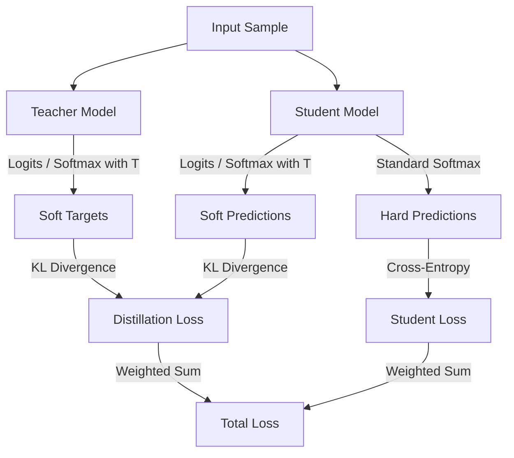

# Chapter 10: Model Compression (Pruning, Quantization, Distillation)

## Material Covered in This Chapter

- Model Compression
- Purpose
- 10
- Learning Objectives
- 10.1 Optimization Framework
- Definition 10.1: Model compression
- Napkin Math 10.2: The quantization speedup
- Math:
- Fix (INT4) :
- 10.2 Deployment Context
- 10.2.1 Deployment scenarios
- Example 10.1: The 4× MobileNet win
- 10.2.2 Balancing trade-offs
- 2 Overparameteriza-
- Checkpoint 10.1: The efficiency frontier
- Trade-offs
- Technique Selection
- 10.3 Structural Optimization
- 10.3.1 Pruning
- Definition 10.2: Pruning
- 10.3.1.1 Target structures
- 10.3.1.2 Unstructured pruning
- 6 N:M Structured Spar-
- 10.3.1.3 Structured pruning
- 10.3.1.4 Dynamic pruning
- 10.3.1.5 Pruning trade-offs
- 10.3.1.6 Pruning strategies
- 1st Iteration
- 10.3.1.7 Lottery ticket hypothesis
- 10.3.1.8 Pruning in practice
- 10.3.2 Knowledge distillation
- 10.3.3 Structured approximations
- Napkin Math 10.3: The bandwidth-compute trade-off
- 10.3.3.2 Tensor decomposition
- 10.3.4 Neural architecture search
- 10.3.4.1 The NAS optimization problem
- 10.3.4.2 Search space design
- 17 Bi-level Optimization:
- 10.3.4.3 Search strategies
- 10.3.4.4 When to use NAS
- 10.3.4.5 Architecture examples
- Checkpoint 10.2: Structural optimization checkpoint
- 10.4 Quantization and Precision
- Definition 10.3: Quantization
- 10.4.1 Precision and energy
- 10.4.1.1 Energy costs
- 10.4.2 The energy dividend: INT8 vs. FP32 reality
- Lighthouse 10.1: DLRM and embedding quantization
- Lighthouse 10.2: The TinyML quantization imperative
- 10.4.2.1 Performance gains
- Napkin Math 10.4: Quantization savings
- Napkin Math 10.5: The SIMD multiplier
- Math:
- Lighthouse 10.3: Keyword spotting and extreme compression
- 10.4.4 Energy efficiency and sustainability
- 10.4.5 Precision reduction strategies
- 10.4.5.1 Post-training quantization
- ResNet50 Layer Activation Distribution
- Checkpoint 10.3: The quantization gate
- Quantization Modes
- System Implications
- 10.4.5.2 Quantization-aware training
- 10.4.6 Extreme quantization
- 10.4.6.1 Challenges and limitations
- Checkpoint 10.4: Quantization and precision checkpoint
- 10.5.1 Hardware-aware design
- 10.5.1.1 Efficient design principles
- 10.5.1.2 Scaling optimization
- 10.5.1.3 Computation reduction
- 10.5.1.4 Memory optimization
- 10.5.1.5 Operator fusion
- 10.5.2 Adaptive computation methods
- 10.5.2.1 Dynamic schemes
- 10.5.2.2 Implementation challenges
- 10.5.3 Sparsity exploitation
- 10.5.3.1 Sparsity types
- 10.5.3.2 Sparsity utilization methods
- 10.5.3.3 Sparsity hardware support
- 10.5.3.4 Structured patterns
- 10.5.3.5 Challenges and limitations

---

## Section-by-Section Preserve-and-Extend

# Chapter 10 Summary: Model Compression (Pruning, Quantization, Distillation)

## 1. Learning Objectives
* **The Three-Part Optimization Framework:** Classify optimizations across model representation (pruning, distillation,
NAS), numerical precision (quantization), and architectural/hardware efficiency (fusion, sparsity exploitation,
scheduling).
* **Quantization Strategies:** Contrast Post-Training Quantization (PTQ), Quantization-Aware Training (QAT), and Dynamic
Quantization across memory reduction, energy savings, and accuracy retention.
* **Pruning and Sparsity:** Analyze structured vs. unstructured pruning, iterative vs. one-shot workflows, and the L0/L1
mathematical formulations of parameter removal.
* **Knowledge Distillation:** Implement temperature-scaled soft target training and characterize the Kullback-Leibler
(KL) divergence objective.
* **Structured Approximations:** Apply Low-Rank Matrix Factorization (LRMF) via SVD and multi-dimensional tensor
decompositions (CP, Tucker, TT) to bypass the memory wall.
* **Hardware-Aware Design & Execution:** Evaluate operator fusion, compound scaling, depthwise separable convolutions,
and dynamic computation (early exits, MoE gating) on target accelerators.

---

## 2. The Optimization Framework & Deployment Context
Trained models are typically overparameterized to aid optimization in complex loss landscapes. However, runtime
deployment environments (Cloud, Edge, Mobile, TinyML) impose strict physical ceilings. Model compression is the
discipline of renegotiating the "silicon contract" (Principle 4) to balance these constraints.

### 2.1 The Physics of Quantization
In physical silicon, memory movement is orders of magnitude more expensive than computation:
\[
E_{\text{move}} \gg E_{\text{compute}}
\]

* **Memory Access Energy:** Fetching a 32-bit float from DRAM costs \(\approx 640\text{ pJ}\), whereas fetching an 8-bit
integer costs \(\approx 160\text{ pJ}\).
* **Arithmetic Compute Energy:** A 32-bit floating-point operation (FLOP) costs \(\approx 3.7\text{ pJ}\), whereas an
8-bit integer operation (OP) costs \(\approx 0.2\text{ pJ}\).

Under the Iron Law of Latency:
\[
T = \frac{D_{\text{vol}}}{\text{BW}} + \frac{O}{R_{\text{peak}} \cdot \eta_{\text{hw}}} + L_{\text{lat}}
\]
reducing bit-width directly shrinks the data volume (\(D_{\text{vol}}\)) and accelerates compute execution.

| Operation | Bit-Width | Relative Energy Cost |
| :--- | :--- | :--- |
| **Integer Add** | 8-bit | 1 (Baseline) |
| **Float Add** | 32-bit | \(\times 30\) |
| **DRAM Read** | 64-bit | \(\times 40,000\) |

### 2.2 Quantization Regimes: The Free Lunch vs. The Cliff
Most models exhibit a **Quantization Free Lunch** zone (Figure 10.2) where reducing precision from FP32 to INT8 yields
\(<1\%\) accuracy loss. Below 8 bits, the error profile degrades until it hits the **Quantization Cliff** (typically at
3–4 bits), where accuracy collapses catastrophically.

```
Accuracy
  |     Free Lunch Zone (Stable)
  +---------------------------\
  |                            \  Quantization Cliff (Collapse)
  |                             \
  |                              |
  +------------------------------+-------
 FP32                         INT8   INT4/Binary
 (32 bits)                  (8 bits) (4/1 bits)
```

### 2.3 Napkin Math: LLM Bandwidth-Bound Inference
Generative LLM token decoding is memory-bandwidth bound (each step loads all weights once per token).
* **Scenario:** 7B parameter LLM in FP16 (2 bytes/parameter) on a device with 16 GB RAM and 50 GB/s bandwidth.
* **FP16 Storage:** \(7 \times 10^9 \times 2 = 14\text{ GB}\). Adding \(\approx 1\text{ GB}\) for KV Cache (4096
context) yields 15 GB, leaving no overhead for the OS.
* **FP16 Latency:** Loading 14 GB at 50 GB/s takes \(280\text{ ms}\) per token (\(3.6\text{ tokens/sec}\)).
* **INT4 Fix:** Quantizing weights to 4-bit (0.5 bytes/weight) yields a model size of \(3.5\text{ GB}\).
* **INT4 Latency:** Loading 3.5 GB takes \(70\text{ ms}\), jumping speed to \(14\text{ tokens/sec}\) (\(4\times\) linear
speedup).

### 2.4 Deployment Context Constraints

| Context | Memory Capacity | Latency SLO | Power Envelope | Primary Goal |
| :--- | :--- | :--- | :--- | :--- |
| **Cloud** | 10s of GB | 10–100 ms | Flexible | High throughput, minimal cost |
| **Mobile/Edge** | 100s of MB to GB | 10–50 ms | Watts | Size reduction, latency |
| **TinyML** | KBs to MBs | 1–10 ms | Milliwatts (mW) | Ultra-low size, energy savings |

---

## 3. Structural Optimization
Structural optimization modifies *what* the model computes, reducing parameter volume and operation counts. It is
governed by the **Conservation of Complexity**: *complexity cannot be destroyed, only relocated between data, algorithm,
and machine.*

### 3.1 Pruning
Pruning eliminates redundant parameters from the network structure.

#### 3.1.1 Mathematical Formulation
The objective is to find a sparse parameter matrix \(\hat{W}\) that minimizes the prediction error under a parameter
budget constraint \(k\):
\[
\min_{\hat{W}} \mathcal{L}(\hat{W}) \quad \text{subject to} \quad \|\hat{W}\|_0 \le k
\]
where \(\|\hat{W}\|_0\) is the \(L_0\)-norm (the count of non-zero elements). Because minimizing the \(L_0\)-norm is
NP-hard, magnitude-based heuristics or soft regularizations (like \(L_1\)-regularization \(\lambda \|W\|_1\)) are used.

```python
import torch

# Dense weight matrix
weights = torch.tensor([[0.8,  0.1,  -0.7],
                        [0.05, -0.9,  0.03],
                        [-0.6, 0.02,  0.4]])

# Magnitude pruning (keep top 4 largest weights)
threshold = 0.5
mask = torch.abs(weights) >= threshold
pruned_weights = weights * mask
print("Pruned Weights:\n", pruned_weights)
# Resulting matrix has only 4 non-zero parameters
```

#### 3.1.2 Target Structures
1. **Unstructured Pruning:** Removes individual weights. Yields high compression ratios but results in irregular sparse
matrices. Modern GPUs and TPUs process vectors in parallel lanes (SIMD/SIMT); irregular sparsity causes **SIMD Lane
Waste** (loading a 16-element register to process only 1 or 2 non-zeros), which erodes compute speedups unless sparsity
exceeds 90–95%.
2. **Structured Pruning:** Removes entire blocks, channels, or layers.
   * **Neuron Pruning:** Removes rows/columns in fully connected layers, reducing layer width.
   * **Channel (Filter) Pruning:** Removes filters in convolutional layers. Adjusts downstream channel counts, resulting
in dense sub-networks that run efficiently on standard accelerators without sparse kernel overhead.
   * **Layer Pruning:** Removes entire blocks in deep networks, requiring skip-connection routing.
3. **N:M Structured Sparsity:** Enforces that in every group of \(M\) consecutive elements, exactly \(N\) are non-zero
(e.g., 2:4 sparsity). Supported natively on NVIDIA Ampere and later GPUs via Sparse Tensor Cores, yielding up to
\(2\times\) hardware speedup.

#### 3.1.3 Pruning Workflows: Iterative vs. One-Shot
* **Iterative Pruning:** Gradually removes weights over multiple cycles, interleaving pruning with fine-tuning. This
allows the network to redistribute importance weights. (e.g., removing 27% of channels iteratively can limit accuracy
loss to \(0.4\%\)).
* **One-Shot Pruning:** Removes all targeted weights in a single step, followed by fine-tuning. Often results in severe
accuracy drops (e.g., \(5\%\) loss for the same 27% channel reduction) because the network cannot recover from sudden
structural changes.

#### 3.1.4 The Lottery Ticket Hypothesis (LTH)
Frankle and Carbin (2019) proposed that dense networks contain sparse, well-initialized subnetworks ("winning tickets")
that can train to equivalent accuracy in isolation if reset to their original initialization:
1. Train a dense network to convergence.
2. Prune the lowest-magnitude weights.
3. Reset surviving weights back to their step-0 initialization values.
4. Train the sparse subnetwork.

---

### 3.2 Knowledge Distillation
Knowledge distillation transfers learned behavior from a large, overparameterized "teacher" model to a compact "student"
model.



#### 3.2.1 Mathematical formulation
To capture "dark knowledge" (e.g., how much a image of a cat resembles a dog vs. a car), logits \(z\) are softened using
a temperature parameter \(T\):
\[
p_i = \frac{\exp(z_i / T)}{\sum_j \exp(z_j / T)}
\]
The student is trained to minimize a combined objective:
\[
\mathcal{L}_{\text{distill}} = (1 - \alpha) \mathcal{L}_{\text{CE}}(y_s, y) + \alpha T^2 \text{KL}(p_T^{\text{teacher}},
p_T^{\text{student}})
\]
where \(\text{KL}\) is the Kullback-Leibler divergence and \(T^2\) scales the gradients to maintain consistent
magnitude.
* **DistilBERT Case Study:** Retains \(97\%\) of BERT-Base performance with 40% fewer parameters and \(60\%\) faster
inference, dropping memory footprint from 1.35 GB to 0.81 GB and latency from 85 ms to 34 ms.

---

### 3.3 Structured Approximations
Structured approximation methods mathematically decompose dense weight matrices and multi-dimensional tensors.

#### 3.3.1 Low-Rank Matrix Factorization (LRMF)
Given a weight matrix \(A \in \mathbb{R}^{m \times n}\), it is factorized into two lower-rank matrices \(U \in
\mathbb{R}^{m \times k}\) and \(V \in \mathbb{R}^{k \times n}\) where \(k \ll m, n\):
\[
A \approx U V
\]
This is typically solved via Singular Value Decomposition (SVD), keeping the top \(k\) singular values (Eckart-Young
Theorem).
* **Napkin Math:** For a \(4096 \times 4096\) FP32 weight matrix (64 MB), factorizing with rank \(k=128\) yields two
matrices of sizes \(4096 \times 128\) and \(128 \times 4096\). This requires only \(4\text{ MB}\) of storage—a
\(16\times\) bandwidth traffic reduction.
* **Inference Complexity:** Applying the factorized layers to input \(x\) costs \(\mathcal{O}(k(m+n))\) instead of
\(\mathcal{O}(mn)\). Explicitly forming \(UV\) costs \(\mathcal{O}(mkn)\) and must be avoided.

#### 3.3.2 Tensor Decomposition
Decomposes high-dimensional (e.g., 3D/4D) tensors in convolutional layers:
* **Canonical Polyadic (CP) Decomposition:** Factorizes a tensor into a sum of rank-one vector outer products:
  \[
  \mathcal{A} \approx \sum_{r=1}^k u_r \otimes v_r \otimes w_r
  \]
* **Tucker Decomposition:** Factorizes a tensor into a core tensor \(\mathcal{G}\) multiplied by factor matrices along
each mode:
  \[
  \mathcal{A} \approx \mathcal{G} \times_1 U \times_2 V \times_3 W
  \]
* **Tensor-Train (TT) Decomposition:** Factorizes high-dimensional tensors into a sequence of low-rank cores.

---

### 3.4 Neural Architecture Search (NAS)
NAS automates the discovery of efficient neural networks by solving a bi-level optimization problem:
\[
\alpha^* = \operatorname{argmin}_{\alpha \in \mathcal{A}} \mathcal{L}_{\text{val}}(w^*(\alpha), \alpha) \quad
\text{subject to} \quad C(\alpha) \le C_{\text{max}}
\]
where the inner loop trains weights \(w^*(\alpha)\):
\[
w^*(\alpha) = \operatorname{argmin}_w \mathcal{L}_{\text{train}}(w, \alpha)
\]

#### 3.4.1 Search Strategy Comparison

| Strategy | Search Cost (GPU-days) | Primary Use Cases | Key Challenge |
| :--- | :--- | :--- | :--- |
| **Reinforcement Learning** | 400 – 1,000 | Novel domains, unconstrained design | High compute budget (Zoph & Le 2017) |
| **Evolutionary Algorithms** | 200 – 500 | Parallel infrastructure available | Large population management |
| **Gradient-Based (DARTS)** | 1 – 4 | Differentiable supergraphs, low budget | Local minima trapping |

* **Hardware-in-the-Loop NAS:** MnasNet uses multi-objective optimization to score architectures using real hardware
latency:
  \[
  \operatorname{Score}(\alpha) = \operatorname{Accuracy}(\alpha) \times \left[
\frac{L_{\text{lat}}(\alpha)}{L_{\text{lat,target}}} \right]^\beta
  \]

---

## 4. Quantization and Precision
Quantization maps high-precision representations to lower bit-width formats.

### 4.1 Numerical Precision Formats
* **FP16:** 5-bit exponent, 10-bit mantissa. Suitable for inference.
* **bfloat16:** 8-bit exponent, 7-bit mantissa. Matches FP32 dynamic range, preventing under/overflow during training.
* **TF32:** 19-bit internal format (8-bit exponent, 10-bit mantissa). Used on Ampere+ GPUs to speed up FP32 matrix math.
* **INT8 / INT4:** 8-bit or 4-bit integers.
* **FP8:** 8-bit floating point (variants: E4M3 for weights/activations, E5M2 for gradients).

```
FP32:     [S] [  8-bit Exponent  ] [        23-bit Mantissa        ]
FP16:     [S] [ 5-bit Exp ] [   10-bit Mant ]
bfloat16: [S] [  8-bit Exponent  ] [ 7-bit Mant ]
```

### 4.2 Affine Quantization Formulation
Quantization maps a continuous real range \([\alpha, \beta]\) to a \(b\)-bit discrete integer range \([q_{\text{min}},
q_{\text{max}}]\) (e.g., \([0, 255]\) for UINT8) via:
\[
q = \operatorname{clip}\left(\operatorname{round}\left(\frac{x}{s}\right) + z, q_{\text{min}}, q_{\text{max}}\right)
\]
Dequantization reconstructs the real value:
\[
x \approx s \cdot (q - z)
\]
Where:
* **Scale (\(s\)):** Step size represented as a float:
  \[
  s = \frac{\beta - \alpha}{q_{\text{max}} - q_{\text{min}}}
  \]
* **Zero-point (\(z\)):** The integer corresponding to real zero (preserves zero padding):
  \[
  z = \operatorname{round}\left( \frac{-\alpha}{s} \right) + q_{\text{min}}
  \]

* **Symmetric vs. Asymmetric Quantization:**
  * **Symmetric:** Zero-point \(z = 0\). The range is centered around zero \([-\text{max}|x|, \text{max}|x|]\).
Simplifies computation.
  * **Asymmetric:** Uses non-zero \(z\). Quantizes skewed distributions (e.g., ReLU activations) more efficiently.

* **Quantization Granularity:**
  * **Layerwise:** Single scale/zero-point for the entire layer. Skewed by outliers.
  * **Channelwise:** Per-channel scale factor (the standard for CNN weights).
  * **Groupwise / Sub-channelwise:** Multi-dimensional grouping (common in LLM compression).

### 4.3 Quantization-Aware Training (QAT)
PTQ is fast but introduces errors. QAT simulates quantization noise during the forward pass of training, allowing the
weights to adapt.

```
Forward Pass:  x (FP32) ---> [Fake Quantize: Quantize + Dequantize] ---> x_fake (INT8 simulated)
Backward Pass: Gradient flow bypassed rounding via Straight-Through Estimator (STE)
```

#### 4.3.1 Mathematical formulation
Because rounding is a step function with a derivative of zero almost everywhere, backpropagation uses the
**Straight-Through Estimator (STE)**:
\[
\frac{\partial \mathcal{L}}{\partial x} \approx \frac{\partial \mathcal{L}}{\partial x_{\text{fake}}} \cdot 1\{\alpha
\le x \le \beta\}
\]
STE acts as the identity function within the clipping bounds \([\alpha, \beta]\) and zeros the gradient outside.
* **Scale Updates:** Computed via exponential moving averages (EMA) of running activation ranges.
* **Batch Normalization Folding:** BN statistics are folded into convolutional weights before fake-quantization.

---

## 5. Architectural Efficiency
Architectural efficiency aligns algorithmic structures with physical hardware execution loops.

### 5.1 Computation Reduction and Factorization
Decomposing complex layers reduces execution cost:
* **Depthwise Separable Convolutions:** Separates standard convolutions into depthwise (spatial filtering per channel)
and pointwise (\(1\times1\) channel mixing).
  * **Standard Complexity:** \(\mathcal{O}(h w C_{\text{in}} C_{\text{out}} k^2)\)
  * **Separable Complexity:** \(\mathcal{O}(h w C_{\text{in}} k^2) + \mathcal{O}(h w C_{\text{in}} C_{\text{out}})\)
  * Yields a \(\approx 5\text{ to }10\times\) FLOP reduction.
* **Feature Reuse (DenseNet):** Reuses feature maps to limit activation storage.
* **Parameter Squeezing (SqueezeNet):** Applies \(1\times1\) convs to compress channel dimensions before spatial convs,
achieving a \(50\times\) parameter reduction compared to AlexNet.
* **Activation Checkpointing:** Stores only a subset of activation layers during training and recomputes the rest
dynamically during backpropagation, reducing activation memory from \(\mathcal{O}(A_{\text{total}})\) to
\(\mathcal{O}(\sqrt{A_{\text{total}}})\).

---

### 5.2 Operator Fusion
Operator fusion compiles sequential elements into a single execution block to reduce off-chip memory traffic.

```
UNFUSED PATH:
  Input (DRAM) --> [Conv2d] --> Output_1 (DRAM) --> [BatchNorm] --> Output_2 (DRAM) --> [ReLU] --> Output (DRAM)
  * Total memory transfers: 6

FUSED PATH:
  Input (DRAM) --> [Conv2d + BatchNorm + ReLU Fused Kernel] --> Output (DRAM)
  * Total memory transfers: 2 (Registers handle intermediate states)
```

#### 5.2.1 Bandwidth Math
For unfused operations on a tensor of size \(M\) bytes across \(N\) sequential layers, memory traffic is:
\[
\text{Memory}_{\text{unfused}} = 2NM
\]
Fused execution reduces traffic to:
\[
\text{Memory}_{\text{fused}} = 2M
\]
* **GEMM Bias-Activation Fusion:** Computes biases and ReLU in registers immediately following multiplication.
* **Attention Tiling (FlashAttention):** Compresses long-sequence attention by tiling computation to SRAM, reducing High
Bandwidth Memory (HBM) read/writes from quadratic \(\mathcal{O}(n^2)\) to linear \(\mathcal{O}(n)\).

---

### 5.3 Adaptive Computation Methods
Adaptive computation allocates resources dynamically based on input complexity.

* **Early Exit Architectures (e.g., BranchyNet):** Integrates lightweight classifiers at intermediate layers. If
prediction confidence passes threshold \(\tau\), inference exits early:
  \[
  \text{Confidence}(x_l) \ge \tau \implies \text{Exit}
  \]
* **Conditional Computation:** Uses gating routers to skip layers (e.g., SkipNet).
* **Mixture-of-Experts (MoE) (e.g., Switch Transformer):** Replaces dense feedforward layers with multiple parallel
experts. A routing network selects a subset of experts (typically top-1 or top-2) per token:
  \[
  y = \sum_{i \in \text{Selected}} \operatorname{Router}(x)_i \cdot \text{Expert}_i(x)
  \]
  This scales model capacity (e.g., 1.6 trillion parameters) while keeping active compute (e.g., 2 billion parameters)
constant.

---

## 6. Technique Selection & Optimization Strategies
Optimization techniques must be composed systematically to avoid negative interactions.

### 6.1 Constraint Mapping

| System Constraint | Model Representation | Numerical Precision | Architectural Efficiency |
| :--- | :---: | :---: | :---: |
| **Computational Cost** | ✓ | | ✓ |
| **Memory and Storage** | ✓ | ✓ | |
| **Latency and Throughput** | ✓ | \((\checkmark)\)* | ✓ |
| **Energy Efficiency** | ✓ | ✓ | ✓ |

> [!NOTE]
> \(*\) Integer acceleration requires dedicated tensor units (e.g., Tensor Cores or NPUs). On hardware lacking
low-precision support, dequantization overhead can exceed compute savings.

### 6.2 The Deployment Pipeline Sequence
Techniques must be sequenced in order of representation granularity:

```
[Base Model] ---> [1. Structured Pruning] ---> [2. Distillation] ---> [3. QAT (INT8)] ---> [4. Compile (Fusion)]
```

* **Sequence Rationale:** Pruning first concentrates parameters into smaller ranges. Applying quantization before
pruning reduces numerical fidelity, causing high-magnitude threshold evaluation errors during pruning.
* **Case Study (BERT-Base Mobile Pipeline):**
  1. **Structured Pruning:** Removes 30% of attention heads, 40% of intermediate dimensions. Parameter size drops 75%;
accuracy drops from 76.2% to 75.1%.
  2. **Distillation:** Recovers student accuracy back to 75.9% using the dense teacher.
  3. **QAT INT8:** Quantizes to INT8. Size drops from 440 MB to 28 MB (\(16\times\) total compression); accuracy remains
at 75.6% (only a 0.6% final loss).

---

## 7. Efficiency Measurement & Implementation Tools

### 7.1 Framework Tooling

* **PyTorch Ao (`torch.ao.quantization`):** Contains tools for PTQ and QAT workflows.
* **PyTorch Pruning (`torch.nn.utils.prune`):** Supports structured and unstructured masks.

```python
import torch
import torch.nn.utils.prune as prune

# Linear layer definition
layer = torch.nn.Linear(10, 10)

# Unstructured L1 pruning of 30% of weights
prune.l1_unstructured(layer, name="weight", amount=0.3)

# Structured L2 pruning of 50% of channels along dim 0
prune.ln_structured(layer, name="weight", amount=0.5, n=2, dim=0)

# Apply masks permanently
prune.remove(layer, "weight")
```

* **TensorFlow Model Optimization Toolkit (TFMOT):** Implements dynamic pruning schedules (`prune_low_magnitude`)
directly inside the Keras compile/fit loop.

---

## 8. Fallacies and Pitfalls
* **Fallacy: FLOPs Reduction equals Latency Reduction.**
  * *Reality:* Memory-bound operations (e.g., LayerNorm, Softmax) do not benefit from compute FLOP reductions. In
unstructured pruning, irregular memory layouts prevent SIMD vectorization, resulting in little to no real speedup on
general-purpose hardware.
* **Fallacy: Quantization scaling is linear (e.g., if INT8 loses 1%, INT4 loses 2%).**
  * *Reality:* Precision degradation exhibits threshold effects. Models maintain accuracy plateau down to INT8, but
naive INT4 quantization often causes sudden divergence.
* **Pitfall: Quantizing non-linear operations (LayerNorm / Softmax).**
  * *Reality:* Exponents and dividers require high dynamic range. Quantizing these operations to INT8 causes arithmetic
instability. Keep these operations in FP16/FP32 during mixed-precision serving.
* **Pitfall: Extrapolating compression ratios directly to runtime memory savings.**
  * *Reality:* Runtime environments require activation buffers, KV caches, workspace memory, and compiler-allocated
memory. A \(4\times\) model size reduction via weight quantization does not translate to a \(4\times\) reduction in
total runtime memory footprint.

---

## 9. Key Takeaways
* **Multiplicative Compositions:** Pruning, distillation, and quantization stack multiplicatively (e.g., \(2\times\)
pruning, \(2\times\) student, \(4\times\) quantization compiles to a \(16\times\) total compression).
* **Workload-Dependent Bottlenecks:** LLM autoregressive serving is bandwidth bound; optimize with weight-only
quantization (INT4 weights + FP16 activations). CNN image processing is compute bound; optimize with activation
quantization and operator fusion.
* **Hardware-Aware Verification:** Always profile wall-clock latency on target accelerators. Theoretical FLOPs or
parameter sizes do not predict runtime performance.

---

## Full Slice Content (Docling Extract, Preserved Verbatim)

> Each section below preserves the source slice content as extracted by docling. Image placeholders are removed; tables,
equations, code blocks, named artifacts, and footnotes are kept intact.

## Model Compression

## Purpose

Why do the models that win benchmarks rarely become the models that run in production?

Bridging that gap requires a systematic discipline of compression: trading capabilities the deployment does not need for
constraints the deployment cannot violate. The key insight is that trained models are vastly over-specified for most
production tasks-they carry more precision, more connections, and more capacity than the deployment context demands, and
that surplus can be systematically removed. The techniques differ in what they trade away, but they share a common
principle: find what the model has learned that the deployment does not need, and remove it without destroying what the
deployment requires. When applied well, compression can reduce model size by one to two orders of magnitude,
transforming a research artifact that runs only in a data center into a production asset that meets the physics of a
phone, a sensor, or a microcontroller. Concretely, the discipline is not about making models smaller but about making
the right models possible for their physical environment.

Training produced a capable model, yet capability alone does not guarantee deployability. Cloud, Edge, Mobile, and
TinyML each impose constraints that research benchmarks ignore: memory budgets measured in megabytes rather than
gigabytes, latency targets measured in milliseconds rather than seconds, power envelopes measured in milliwatts rather
than kilowatts. Research optimizes for accuracy on held-out test sets; production optimizes for accuracy per dollar,
accuracy per watt, accuracy per millisecond. The model that achieves top benchmark performance typically does so by
being larger, slower, and more resource-intensive than any production constraint permits. This gap between research
achievement and deployment viability is not a failure of either community but a reflection of different optimization
targets.

## 10

10.1 Optimization Framework

10.2 Deployment Context 10.3 Structural Optimization 10.4 Quantization and Precision 10.5 Architectural Efficiency 10.6
Technique Selection 10.7 Optimization Strategies 10.8 Efficiency Measurement 10.9 Implementation Tools 10.10Technique
Comparison 10.11Fallacies and Pitfalls 10.12Summary

## Learning Objectives

- Explain the three-part optimization framework: model representation (pruning, distillation, architecture search),
numerical precision (quantization), and architectural/hardware efficiency (fusion, sparsity exploitation, scheduling)
- Compare quantization strategies in terms of memory reduction, energy consumption, and inference accuracy
- Apply pruning techniques to reduce model parameters while quantifying the accuracysparsity trade-off
- Implement knowledge distillation to transfer capabilities from large teacher models to efficient student architectures
- Analyze hardware-aware design principles to align model operations with target platform capabilities
- Design integrated optimization pipelines combining quantization, pruning, and distillation under resource constraints

## 10.1 Optimization Framework

Recall the silicon contract (Principle 4) (Section 1.7), the implicit agreement every model makes with its hardware
about which resource it will saturate. The three candidates are compute throughput, memory bandwidth, and memory
capacity. During training, this contract is negotiated upward. Researchers select larger architectures, higher numerical
precision, and deeper layers because the training environment, typically a GPU cluster with hundreds of gigabytes of
memory, can afford those demands. In Section 8.6.3, mixed precision speeds training while maintaining the ability to
learn. Here, we go further, reducing precision to INT8 and beyond for inference, where we trade the ability to update
weights for massive gains in execution efficiency. Deployment reverses these priorities. The production environment is
smaller, power-constrained, and latency-sensitive, yet the model was designed for an environment with none of those
limitations. Model compression is the systematic process of renegotiating that contract for its new execution context,
reducing memory footprint, computational cost, and energy consumption while preserving the model's ability to perform
its task.

A 7-billion parameter language model requires 14 GB merely to store its weights in FP16. The deployment target is a
smartphone with 8 GB of RAM shared across the operating system, applications, and the model. The math does not work. No
amount of clever engineering changes this arithmetic: 14 GB cannot fit in 8 GB. Yet users expect the model to run:
responsively, offline, without draining their battery in an hour. The gap between what training produces and what
deployment permits, defined formally as the latency budget in Section 13.3.1, is not a minor inconvenience but a
defining challenge of model compression.

Thescale of this renegotiation makes model optimization an engineering discipline, not a collection of ad hoc tricks. A
175 billion parameter model consumes over 350 GB in FP16 representation alone, yet a smartphone provides 8 GB of RAM and
a microcontroller offers 512 KB. Bridging six orders of magnitude requires systematic methods with predictable
trade-offs, not trial and error. Every optimization technique removes something from the model (redundant parameters,
numerical precision, or architectural complexity), and the engineer must understand exactly what is lost, what is
preserved, and how these losses compose when techniques are combined.

This chapter organizes these techniques along three complementary dimensions. Structural optimization removes redundancy
from the model itself: pruning eliminates parameters that contribute little to output quality, knowledge distillation
transfers a large model's learned behavior into a smaller architecture, and neural architecture search discovers designs
that are inherently efficient. Precision optimization reduces the numerical bit-width of weights and activations, for
example converting 32-bit floating point values to 8-bit integers (exploiting Tensor Cores discussed in Section
11.3.4.3), which shrinks memory footprint and accelerates arithmetic on hardware that supports lower-precision
operations. Hardware-level optimization ensures that the resulting model executes efficiently on the target processor by
fusing operations to reduce memory traffic and exploiting sparsity patterns that the hardware can accelerate. These
dimensions are not alternatives but layers in an optimization stack. A practitioner deploying ResNet-50 to a mobile
device might prune 50 percent of its filters, quantize the remaining weights to INT8, and fuse batch normalization into
convolution, with each technique compounding the gains of the others.

Throughout this chapter, we ground each technique in concrete systems: ResNet-50 and MobileNetV2 (our Lighthouse Models
from Chapter 6) for vision workloads, transformer-based language models for sequence tasks, and the DS-CNN, a
depthwise-separable convolutional neural network (CNN), as the keyword spotter for TinyML deployment. These recurring
models let us compare techniques under consistent conditions, making the trade-offs between accuracy, latency, memory,
and energy tangible rather than abstract.

## Definition 10.1: Model compression

Model Compression is a family of techniques that reduce a trained model's computational cost and memory footprint by
eliminating redundant parameters (pruning), reducing numerical precision (quantization), or transferring learned
behavior into a smaller architecture (distillation), while preserving as much predictive accuracy as possible.

1. Significance (quantitative) : Compression directly reduces both iron law terms. INT8 quantization of a 175B-parameter
large language model (LLM) cuts weight memory from 350 GB (FP16) to 175 GB-a 2 × reduction in 𝐷 vol -while enabling
Tensor Core INT8 paths that are 2 × faster than FP16, yielding up to 4 × combined throughput improvement. Unstructured
pruning to 50 percent sparsity theoretically halves 𝑂, but hardware speedup only materializes when sparsity is
structured (for example, 2:4 sparse) to match accelerator capabilities.
2. Distinction (durable) : Unlike post-training compression methods such as pruning and quantization, neural
architecture search discovers efficient architectures from scratch by exploring a design space. This chapter treats NAS
as a related structural optimization technique: it changes the representation before training rather than compressing a
finished model post hoc.
3. Common pitfall: A frequent misconception is that compression techniques compose without interference. In practice,
applying quantization after pruning can amplify quantization error in near-zero weight regions that pruning left behind,
causing accuracy degradation that neither technique produces alone.

The chapter follows the optimization stack from software to hardware. We begin with the optimization framework and
deployment context that determine which techniques matter for a given target. We then examine each dimension in turn:
Section 10.3 (pruning, distillation, architecture search), Section 10.4 (FP32 to INT8 and below), and Section 10.5
(operator fusion, sparsity exploitation, graph-level transformations). The chapter closes with practical guidance on
selecting and composing these techniques for specific deployment constraints.

The top layer, efficient model representation, focuses on eliminating redundancy in the model structure. Techniques like
pruning, knowledge distillation, and neural architecture search (NAS) 1 reduce the number of parameters or operations
required, addressing memory footprint and computational complexity at the algorithmic level.

Model optimization is not a single technique but a framework with three complementary dimensions, each addressing
different bottlenecks. These dimensions form a natural hierarchy: we first decide what computations the model should
perform (representation), then how precisely to perform them (numerics), and finally how efficiently to execute them on
physical hardware (implementation). Tracing the stack in Figure 10.1 from top to bottom reveals how each layer moves
from pure software concerns toward hardware-level execution.

The middle layer, efficient numerics representation, optimizes how numerical values are stored and processed.
Quantization and mixed-precision training reduce the bit-width of weights and activations (for example, from 32-bit
floating point to 8-bit integers), enabling faster execution and lower memory usage on specialized hardware.

1 Neural Architecture Search (NAS) : Zoph and Le (2017) at Google Brain used reinforcement learning to learn the
architecture itself at a cost of 22,400 GPU-days (800 GPUs for twenty-eight days), equivalent to 537,600 GPUhours.
Weight-sharing approaches later reduced this by 1,000 × , transforming NAS from a data-center-scale experiment into a
practical tool whose one-time search budget is amortized across every deployment of the resulting architecture
(EfficientNet, MobileNetV3).

Figure 10.1: Optimization Stack: Model optimization progresses through three layers: efficient model representation,
efficient numerics representation, and efficient hardware implementation.

The bottom layer, efficient hardware implementation, ensures operations run efficiently on target processors. Techniques
like operator fusion, sparsity exploitation, and hardware-aware scheduling align computational patterns with hardware
capabilities (memory hierarchy, vector units) to maximize utilization and throughput.

To understand why numerics matter so deeply, consider the physics of quantization at the silicon level.

These dimensions are interdependent. Pruning reduces complexity but may require architectural changes for hardware
efficiency. Quantization reduces precision but impacts execution logic. The most effective strategies combine techniques
across all three layers. For practitioners seeking immediate guidance on which techniques to apply, Section 10.6.2
provides a decision framework that maps deployment constraints to specific technique recommendations. The intervening
sections provide the technical foundation needed to apply that framework effectively.

Napkin Math 10.1: The physics of quantization The energy-movement invariant (𝐸 move ≫𝐸 compute ) means that in the
physics of silicon, bits represent energy (see Section D.4 for a detailed comparison of FP32 vs. INT8 energy costs).

1. Memory energy (𝐷 vol ) : Fetching a 32-bit float from DRAM costs ≈ 640 pJ . Fetching an 8-bit integer costs ≈ 160 pJ
. 2. Compute energy (O) : A32-bit FLOP costs ≈ 3.7 pJ . An 8-bit integer OP costs ≈ 0.2 pJ .

According to the iron law (𝑇 = 𝐷 vol BW + 𝑂 𝑅 peak ⋅𝜂 hw +𝐿 lat ) , which decomposes execution time into data volume
moved, operations performed, and fixed latency, reducing the bit-width of a weight has a roughly proportional effect on
efficiency:

| Operation   | Bit-Width   | Relative Energy   |
|-------------|-------------|-------------------|
| Integer Add | 8-bit       | 1                 |
| Float Add   | 32-bit      | × 30              |
| DRAMRead    | 64-bit      | × 40,000          |

×

These same physics apply at data center scale: distributed training systems use reduced precision to cut gradient
communication overhead, a topic covered in Chapter 8. For a deeper treatment of how silicon architectures exploit these
energy differences, see Chapter 11.

For inference workloads, moving from FP32 to INT8 saves 4 × memory and can reduce the energy per inference by up to 20 ×
on hardware with dedicated INT8 units, depending on the compute-to-memory ratio of the workload. The practical impact: a
battery lasting one hour or 20 hours.

These energy savings explain why neural networks tolerate aggressive quantization: the energy cost of higher precision
exceeds the accuracy benefit for most applications. The engineering question is how much precision can be sacrificed
before accuracy collapses. Figure 10.2 shows two distinct regimes: a 'Free Lunch' zone where reducing precision has
minimal impact on accuracy, and a 'Cliff' where the model fails catastrophically.

Precision (Bits)

Figure 10.2: The Quantization Free Lunch: Model accuracy vs. Bit-width. Most models exhibit a 'Free Lunch' plateau where
reducing precision from FP32 to INT8 yields <1 percent accuracy loss. This robustness collapses at the 'Quantization
Cliff' (typically 3-4 bits). Curves are illustrative and meant to show qualitative behavior.

These physics-level savings translate directly into deployment capabilities. A model that cannot fit on a device at full
precision may run comfortably, and faster, when quantized. The following calculation demonstrates this quantization
speedup for a concrete LLM deployment scenario. We call this phenomenon the quantization speedup .

## Napkin Math 10.2: The quantization speedup

Problem: Adeployment scenario calls for running a 7 B parameter LLM on a device with 16 GB RAM. The weights are FP16 (2
bytes).

## Math:

2. KVCache: Context window (4096 tokens) requires ≈ 1 GB.
3. Total memory: 14 + 1 = 15 GB. This barely fits, leaving no room for OS or buffers.
1. Model size: 7 9 2 bytes = 14 GB.

×10

×

4. Bandwidth cost: Loading 14 GB at 50 GB/s takes 280 ms per token. That is 3.6 tokens/sec, too slow for chat.

## Fix (INT4) :

Conclusion: Quantization is not just about 'fitting' the model; it is a 4 × Linear Speedup because LLM generation is
bandwidth bound.

1. Quantization: Convert weights to four-bit integers (0.5 bytes). 2. New size: 7 9 0.5 = 3.5 GB. 3. New speed: Loading
3.5 GB takes 70 ms . Speed jumps to 14 tokens/sec .

×10

×

The relative importance of each dimension varies by deployment target. Cloud systems may tolerate larger models but
demand throughput; mobile devices prioritize memory and energy;

embedded systems face hard constraints on all resources simultaneously. Understanding these deployment contexts shapes
which optimization dimensions to prioritize.

## 10.2 Deployment Context

The preceding optimization framework identifies three dimensions of compression, but which dimensions matter most
depends entirely on where the model will run. A data center GPU with 80 GB of HBM faces different binding constraints
than a smartphone with shared RAM or a microcontroller with 256 KB of SRAM. Table 10.1 summarizes the key constraints
across deployment environments.

Table 10.1: Deployment Constraints: Each deployment context imposes different optimization priorities.

| Context     | Memory     | Latency   | Power    | Primary Goal     |
|-------------|------------|-----------|----------|------------------|
| Cloud       | 10s GB     | 10-100 ms | Flexible | Throughput, cost |
| Mobile/Edge | 100s MB-GB | 10-50 ms  | Watts    | Size, latency    |
| TinyML      | KB-MB      | 1-10 ms   | mW       | Size, energy     |

## 10.2.1 Deployment scenarios

Cloud inference centers on throughput (requests/second/dollar), where quantization enables serving more concurrent
requests and operator fusion reduces per-request latency (Choudhary et al. 2020; Dean et al. 2018). Mobile and edge
deployments must fit device memory while meeting real-time targets. A camera app processing 30 fps has 33 ms per frame,
so any optimization reducing inference below this threshold directly improves user experience.

TinyML makes optimization existential, not optional. A microcontroller with 256 KB RAM cannot run a 100 MB model
regardless of accuracy. The model must compress below hardware limits or deployment is impossible (Banbury et al. 2020).
Even on mobile devices with comparatively generous resources, a single optimization technique can deliver a 4 ×
performance win that means the difference between a feature that ships and one that never leaves the prototype stage.

## Example 10.1: The 4× MobileNet win

Context: Amobile app wants to add real-time 'Background Blur' to video calls. The feature requires a segmentation model
running at 30 FPS.

Bottleneck: The unoptimized MobileNetV3 (FP32), a NAS-optimized successor to our MobileNetV2 lighthouse model, runs at 8
FPS on mid-tier Android phones. It is too slow to ship.

- Optimization: 1. Quantization: Converting weights to INT8 reduces size by 4 × and uses the phone's DSP/NPU. 2. Result:
Speed jumps to 35 FPS. Energy per frame drops by 3 × . Business value: Compression did not just 'optimize' the feature;
it enabled it. Without INT8 quantization, the product simply could not exist for the target market.

Table 10.2 quantifies this mismatch using the Lighthouse models from Section 6.1.1. The gap between model requirements
and device capabilities explains why compression is not optional for resource-constrained deployment: without it, the
models simply cannot run.

As Table 10.2 makes concrete, even aggressively optimized models like MobileNetV2 at INT8 precision exceed TinyML device
memory by an order of magnitude. Optimization also contributes to sustainable and accessible AI deployment. Reducing a
model's energy footprint is important as AI workloads scale, helping mitigate the environmental impact of large-scale ML
training and inference (Patterson et al. 2021). At the same time, optimized models can expand the reach of machine
learning, supporting applications in low-resource environments, from rural healthcare to autonomous systems operating in
the field.

Table 10.2: The Deployment Gap: Model memory requirements compared against typical device capacities. Even MobileNetV2
quantized to INT8 exceeds TinyML constraints by 7 × , while the purpose-built DS-CNN keyword spotter fits comfortably.
Numbers in parentheses show how many times the model exceeds device memory.

| Model              | Memory (Runtime)   | Storage (Weights)   | Cloud (~100 GB)   | Mobile (~8 GB)   | TinyML (~512 KB)   |
|--------------------|--------------------|---------------------|-------------------|------------------|--------------------|
| DLRM               | 100 GB             | 100 GB              | ok                | no (12x)         | no (190735x)       |
| GPT-2 XL           | 6 GB               | 6 GB                | ok                | ok               | no (12288x)        |
| ResNet-50          | 100MB              | 100MB               | ok                | ok               | no (200x)          |
| MobileNetV2        | 14MB               | 14MB                | ok                | ok               | no (28x)           |
| MobileNetV2 (INT8) | 3.5MB              | 3.5MB               | ok                | ok               | no (7x)            |
| DS-CNN (KWS)       | 500 KB             | 500 KB              | ok                | ok               | ok                 |

## 10.2.2 Balancing trade-offs

The tension between accuracy and efficiency drives every optimization decision. Increasing model capacity generally
enhances predictive performance while increasing computational cost, resulting in slower, more resource-intensive
inference. The improvements introduce challenges related to memory footprint, inference latency, power consumption, and
training efficiency.

This tension manifests differently across deployment contexts. Training requires computational resources that scale with
model size; inference demands strict latency and power constraints in real-time applications. Understanding where each
optimization technique falls on the compressionaccuracy Pareto frontier is essential for informed technique selection.

Systems Perspective 10.1: The compression-accuracy trade-off curve

Optimization is a search for the Pareto frontier.

- Region 1: The free lunch: Techniques like 'Operator Fusion' or 'Dead Code Elimination' reduce latency without touching
accuracy. Do these first.
- Region 2: The efficient trade: Techniques like 'INT8 Quantization' might drop accuracy by 0.5 percent but improve
speed by 400 percent. This is usually a winning trade.
- Region 3: The steep drop: Aggressive pruning (for example, removing 90 percent of weights) might drop accuracy by 10
percent to gain another 20 percent speedup. This is the danger zone where the model becomes useless.

Systems Rule: Compression should stop at the 'knee' of the curve, where the marginal loss in accuracy exceeds the
marginal gain in efficiency.

Table 10.3 summarizes the key optimization techniques, their systems benefits, and their ML costs. These are empirical
relationships-actual results depend on model architecture, task, and careful implementation.

Table 10.3: The Optimization Trade-Offs: Region 1 = Free Lunch, Region 2 = Efficient Trade, Region 3 = Danger Zone.
Batch size affects training dynamics rather than model quality directly. These ranges are empirical guidelines from
published benchmarks (Jacob et al. 2018; Han et al. 2015a; Hinton et al. 2015); actual results vary with architecture,
task, and implementation quality.

| Technique          | Systems Gain                      | MLCost             | Typical Impact              |   Region |
|--------------------|-----------------------------------|--------------------|-----------------------------|----------|
| Operator Fusion    | 10-30 percent latency reduction × | None               | No accuracy loss            |        1 |
| FP32 →BF16         | 2 × memory, ~2 throughput         | Minimal            | <0.1 percent accuracy drop  |        1 |
| FP16 →INT8         | 2 × memory, 2-4 × throughput      | Quantization error | 0.5-1 percent accuracy drop |        2 |
| 50 percent Pruning | ~2 smaller model                  | Capacity loss      | 0.5-1 percent accuracy drop |        2 |

×

## 2 Overparameteriza-

tion: C. Zhang et al. (2017) demonstrated that networks large enough to fit ImageNet can also memorize completely random
labels-proving they have vastly more capacity than any real task demands. Concretely, ResNet-50's 25.6M parameters can
be pruned by 90 percent with less than 2 percent accuracy loss, implying that fewer than 3M parameters carry the
task-relevant information. This roughly 10 × redundancy ratio is not an edge case but a structural property of
gradient-based training, and it is what makes the entire compression discipline viable.

| Technique              | Systems Gain                         | MLCost               | Typical Impact             | Region   |
|------------------------|--------------------------------------|----------------------|----------------------------|----------|
| Knowledge Distillation | 2-10 × smaller student ×             | Capability ceiling   | 1-3 percent accuracy drop  | 2        |
| 4-bit Quantization     | 4 memory reduction                   | Significant error    | 2-5 percent accuracy drop  | 2-3      |
| 90 percent Pruning     | ~10 smaller model                    | Severe capacity loss | 5-15 percent accuracy drop | 3        |
| ↑ Batch Size (8 × )    | × Higher throughput, better GPU util | Generalization gap   | Requires LR scaling        | -        |

The table reveals a pattern: techniques that preserve model structure (fusion, precision reduction) tend to be 'free' or
cheap, while techniques that alter structure (pruning, distillation) extract more savings but require careful tuning.
Before examining each technique in depth, the following checkpoint tests intuition about these trade-offs.

## Checkpoint 10.1: The efficiency frontier

Optimization is about trading one resource for another.

## Trade-offs

- □ Accuracy vs. Cost: Do you understand why removing 50 percent of weights (Pruning) might drop accuracy by 1 percent,
but reducing precision (Quantization) to INT8 might drop it by 0.5 percent while saving 4 × memory? □ The 'Free Lunch' :
Can you identify optimizations like Operator Fusion that improve speed without hurting accuracy?

## Technique Selection

- □ Pruning: Whenshould you prune (reduce parameters) vs. distill (train a smaller student)? (Hint: Pruning is for
existing models; Distillation is for architectural changes).

Each deployment context imposes a binding constraint: memory capacity on mobile devices, latency on real-time systems,
energy on battery-powered sensors. The optimization techniques that follow address these constraints at three successive
levels of the stack. We begin with structural methods that modify what computations occur, reducing the model's
parameter count and operation count to fit tighter memory and compute budgets. We then turn to precision techniques that
reduce how many bits represent each value, directly shrinking memory footprint and accelerating arithmetic. Finally, we
address architectural approaches that improve how efficiently the remaining operations execute on physical hardware,
closing the gap between theoretical savings and measured performance.

## 10.3 Structural Optimization

Structural optimization addresses the first dimension of our framework, Efficient Model Representation, by modifying
what the model computes. Modern neural networks are heavily overparameterized 2: they carry far more parameters than any
single task requires. This surplus is not a design flaw but a training necessity, since over-capacity helps optimization
navigate complex loss landscapes. At deployment, however, every excess parameter translates directly into wasted memory,
computation, and energy.

The challenge is removing that surplus without removing what matters, a direct manifestation of this law. Complexity
cannot be destroyed, only moved. Pruning moves complexity from parameters to the hardware's ability to exploit sparse
patterns: the model becomes simpler, but the system must

Every technique in this chapter is governed by a single meta-law, analogous to conservation of energy in thermodynamics:
the conservation of complexity. Just as a physical system cannot destroy energy but only convert it between forms, an ML
system cannot destroy complexity but only relocate it between data, algorithm, and machine. This principle constrains
all possible optimizations and explains why no compression technique achieves a free lunch. The engineer's task is to
move complexity to where the cost is lowest given deployment constraints.

now handle irregular memory access. Knowledge distillation moves complexity from inference compute to training compute:
a smaller model at deployment, but a larger training budget to produce it. Neural architecture search moves complexity
from human design effort to automated exploration: a more efficient architecture, but at the cost of a large search
budget. Understanding where complexity should reside for a given deployment target 3 is the central question of
structural optimization.

These three techniques address the challenge through complementary approaches. Pruning eliminates low-impact parameters
from an existing model. Knowledge distillation transfers a large model's learned capabilities to a smaller architecture.
NAS automates architecture design from the ground up, building optimized structures for specific constraints (Hutter et
al. 2019). In practice, these techniques are often combined: a NAS-designed architecture, distilled from a large
teacher, then pruned for final deployment.

## 10.3.1 Pruning

Consider a MobileNet trained for image classification on a wearable health monitor. The trained model occupies 14MB, but
the target microcontroller offers only 2 MB of flash memory. Retraining a smaller architecture from scratch would
require weeks of data collection and validation-time the product schedule does not allow. Fortunately, analysis reveals
that 85% of the model's weights hover near zero, contributing almost nothing to its predictions. Removing those weights
and fine-tuning the remainder for a few epochs produces a model that fits in 2MB with less than 1 percent accuracy loss.
This is pruning in practice.

Pruning 4 directly addresses memory efficiency constraints by eliminating redundant parameters. Because neural networks
carry far more weights than any single task demands (as established earlier), we can remove a significant fraction
without substantial performance degradation. The central questions are what to prune (individual weights vs. entire
structures), how to decide what is expendable (magnitude, gradients, or activations), and when to prune (after training,
during training, or even at initialization). Section 11.3.4.5 explains how specialized hardware can further exploit the
resulting sparse structures.

## Definition 10.2: Pruning

Pruning is the sparsification of the Parameter Space by removing weights that contribute minimal information to the loss
landscape.

2. Distinction (durable) : Unlike Quantization, which reduces the Precision of every weight, Pruning reduces the Count
of weights by identifying and eliminating redundancy.
1. Significance (quantitative) : It converts dense matrices into sparse structures, reducing the Memory Footprint and
the total Data Volume (𝐷 vol ) by as much as 10 × without significant accuracy loss.

The goal of pruning is to find a sparse version of the model parameters ̂ 𝑊 that minimizes the increase in prediction
error (loss) while satisfying a fixed parameter budget 𝑘 . Framing this goal mathematically clarifies both the objective
and why approximate solutions are necessary:

3. Common pitfall: A frequent misconception is that Pruning 'automatically' speeds up execution. In reality, without
Specialized Hardware Support (𝑅 peak ) , the resulting sparse matrices may actually run slower than dense ones due to
irregular memory access patterns.

̂

̂

̂

<!-- formula-not-decoded -->

where ‖ 𝑊‖ 0 is the L0-norm (the count of nonzero parameters). Since minimizing the L0-norm is NP-hard, we use
heuristics 5 like magnitude-based pruning . Listing 10.1 demonstrates this approach, removing weights with small
absolute values to transform a dense weight matrix into the sparse representation visualized in Figure 10.3.

3 Pareto Frontier: Named after Italian economist Vilfredo Pareto (1848-1923), who observed that 80 percent of Italy's
land was owned by 20 percent of the population. In multi-objective optimization, the Pareto frontier is the set of
solutions where improving one objective (for example, speed) necessarily sacrifices another (for example, accuracy).
EfficientNet traces this frontier concretely: B0 (77.1 percent accuracy, 390M FLOPs) to B7 (84.4 percent, 37B FLOPs)-a
95 × compute increase for 7.3 percentage points of accuracy, quantifying exactly how steep the trade-off becomes at the
frontier's edge.

- 4 Optimal Brain Damage: Introduced by LeCun, Denker, et al. (1989), the method achieved 4 × parameter reduction-and
proportional memory savings-in a handwriting recognizer by using second-derivative (Hessian) information to identify
weights whose memory cost exceeded their accuracy contribution. The Hessian measures how much the loss increases when a
weight is zeroed, directly ranking weights by their information-per-byte efficiency. However, Hessian computation costs
𝑂(𝑛 2 ) for 𝑛 parameters, which is why magnitude-based pruning-despite its theoretical inferiority-became the practical
standard at modern scale, where computing the Hessian itself would exceed the memory budget of the model it aims to
compress.

Listing 10.1: Magnitude-Based Pruning: Removes weights below a threshold to create sparse matrices, reducing the number
of nonzero parameters from 9 to 4 (𝑘 = 4) .

```
import torch # Original dense weight matrix weights = torch.tensor( [[0.8, 0.1, -0.7], [0.05, -0.9, 0.03], [-0.6, 0.02,
0.4]] ) # Simple magnitude-based pruning: keep only the 4 largest weights threshold = 0.5 mask = torch.abs(weights) >=
threshold pruned_weights = weights * mask print("Original:", weights) print("Pruned (4 nonzeros):", pruned_weights)
```

Figure 10.3: Sparse Matrix Transformation: Pruning removes small-magnitude weights (shown as white/zero in the right
matrix) while preserving large-magnitude weights (shown in color), creating a sparse representation that reduces memory
usage while maintaining model accuracy.

Notice how the sparse matrix on the right retains only the high-magnitude values (colored cells) while the near-zero
weights become exactly zero. This transformation reveals an important property: the 'important' information in neural
network weights is often concentrated in a small fraction of parameters, while most weights contribute little to the
final output. This observation motivates magnitude-based pruning as a practical heuristic.

To make pruning computationally feasible, practical methods often replace the hard L0 constraint with soft
regularization like L1-norm (𝜆‖𝑊‖ 1 ) , which encourages small values that can later be thresholded to zero.
Practitioners typically use iterative pruning, where parameters are removed in successive steps interleaved with
fine-tuning to recover lost accuracy (Gale et al. 2019; Blalock et al. 2020).

## 10.3.1.1 Target structures

The choice of what to prune depends on the deployment target's hardware constraints and which resource is the binding
bottleneck.

When memory capacity is the primary constraint, as in fully connected classifiers destined for mobile deployment, neuron
pruning offers the most direct relief: removing entire neurons along with their associated weights and biases reduces
the width of a layer, shrinking the parameter count proportionally. Because fully connected layers dominate memory in
many architectures, targeting neurons addresses the largest contributor to model size.

When the most aggressive efficiency gains are required and the architecture has sufficient depth to absorb the loss,
layer pruning removes entire layers from the network. This approach yields the largest per-operation reduction because
it eliminates all computation within a layer, but it also carries the highest risk: removing a layer reduces the model's
representational depth, and the remaining layers must compensate for the lost capacity. Layer pruning therefore demands
careful validation to ensure the model retains sufficient capacity to capture the patterns its task requires.

When inference latency on commodity accelerators is the bottleneck, channel pruning (also called filter pruning) becomes
the preferred approach. Eliminating entire channels or filters from convolutional layers reduces the depth of feature
maps, which directly cuts the number of multiplyaccumulate operations in subsequent layers. This reduction maps cleanly
onto GPU and Tensor Processing Unit (TPU) execution patterns because the resulting model remains dense and regular,
requiring no special sparse computation support. Channel pruning is therefore particularly effective for vision
workloads where convolutional layers dominate computational cost.

Figure 10.4: Channel vs. Layer Pruning: Channel pruning adjusts filter sizes within layers, while layer pruning removes
entire layers and necessitates reconnection of remaining network components. These approaches reduce model size and
computational cost, but require fine-tuning to mitigate performance loss due to reduced model capacity.

To see how these approaches differ in practice, compare the two sides of Figure 10.4. When a channel is pruned, the
model's architecture must be adjusted to accommodate the structural change. Specifically, the number of input channels
in subsequent layers must be modified, requiring alterations to the depths of the filters applied to the layer with the
removed channel. In contrast, layer pruning removes all channels within a layer, necessitating more significant
architectural modifications. In this case, connections between remaining layers must be reconfigured to bypass the
removed layer. Regardless of the pruning approach, fine-tuning is important to adapt the remaining network and restore
performance.

## 10.3.1.2 Unstructured pruning

Unstructured pruning removes individual weights while preserving the overall network architecture. Some connections
become redundant during training, contributing little to the final output. Prun-

5 Heuristic: From Greek heuriskein (to discover), the same root as Archimedes' 'eureka.' In pruning, the dominant
heuristic-larger magnitude means more important-works well empirically but creates a systems trap: magnitude-based
pruning applied globally removes 90 percent+ of parameters from overparameterized early layers while leaving critical
bottleneck layers largely intact, giving the appearance of aggressive compression while preserving most of the compute
and memory cost in the layers that matter. This is why iterative prune-retrain cycles with per-layer budgets outperform
naive global magnitude pruning: each cycle lets the network redistribute importance before the next cut.

## 6 N:M Structured Spar-

sity: Introduced commercially with NVIDIA's A100 GPU (2020), the 2:4 pattern was chosen because it halves
multiply-accumulate operations while requiring only low metadata overhead, such as 2 bits per stored nonzero element in
common semistructured sparse formats, to record which positions participate. This fixed ratio is a hardware constraint,
not a mathematical optimum: the A100's Sparse Tensor Cores are physically wired for 2:4, yielding up to 2 × speedup over
dense execution with no software overhead. Other ratios are not supported by current hardware, illustrating how silicon
design constrains which sparsity patterns translate to actual speedup.

ing these weak connections reduces memory requirements while preserving most of the model's accuracy. Formalizing this
process, let 𝑊 ∈ ℝ 𝑚×𝑛 represent a weight matrix in a given layer. Pruning removes a subset of weights by applying a
binary mask 𝑀 ∈ {0,1} 𝑚×𝑛, yielding a pruned weight matrix: ̂ 𝑊 =𝑀⊙𝑊 where ⊙ represents the element-wise Hadamard
product . The mask 𝑀 is constructed based on a pruning criterion, typically weight magnitude. A common approach is
magnitude-based pruning, which removes a fraction 𝑠 of the lowest-magnitude weights by defining a threshold 𝜏 such that:

<!-- formula-not-decoded -->

The primary advantage of unstructured pruning is memory efficiency. By reducing the number of nonzero parameters, pruned
models require less storage, which benefits deployment on embedded or mobile devices with limited memory.

where 𝜏 is chosen to ensure that only the largest (1-𝑠) fraction of weights remain. This method assumes that
larger-magnitude weights contribute more to the network's function, making them preferable for retention.

Unstructured pruning does not necessarily improve computational efficiency on modern hardware, however. Standard GPUs
and TPUs are optimized for dense matrix multiplications, and a sparse weight matrix often cannot fully use hardware
acceleration unless specialized sparse computation kernels are available. Unstructured pruning therefore primarily
benefits model storage rather than inference acceleration.

## 10.3.1.3 Structured pruning

Where unstructured pruning removes individual weights, structured pruning (H. Li et al. 2017) eliminates entire
computational units: neurons, filters, channels, or layers. This approach produces smaller dense models that map
directly to modern machine learning accelerators. Because the resulting architecture remains fully dense, structured
pruning leads to more efficient inference on general-purpose hardware than unstructured pruning, which requires
specialized execution kernels to exploit its sparse weight matrices.

Hardware-aware pruning strategies, such as N:M structured sparsity 6, enforce specific patterns (for example, ensuring 2
out of every 4 weights are zero) to align with specialized accelerator capabilities. Section 11.3.4.5 covers how these
patterns exploit sparse Tensor Cores.

Neurons, filters, and layers vary dramatically in their contribution to a model's predictions. Some units primarily
carry redundant or low-impact information, and removing them does not significantly degrade model performance.
Identifying which structures can be pruned while preserving accuracy remains the core challenge.

To ground these distinctions, examine Figure 10.5 from left to right. On the left, unstructured pruning removes
individual weights (depicted as dashed connections), creating a sparse weight matrix. This can disrupt the original
network structure, as shown in the fully connected network where certain connections have been randomly pruned. While
this reduces the number of active parameters, the resulting sparsity requires specialized execution kernels to fully
realize computational benefits.

Acommon approach to structured pruning is magnitude-based pruning, where entire neurons or filters are removed based on
the magnitude of their associated weights. The intuition is that parameters whose magnitude falls below the layer's
pruning threshold contribute negligibly to the model's output, making them candidates for elimination. The importance of
a neuron or filter is

In contrast, structured pruning (depicted in the middle and right sections of Figure 10.5) removes entire neurons or
filters while preserving the network's overall structure. In the middle section, a pruned fully connected network
retains its fully connected nature but with fewer neurons. On the right, structured pruning is applied to a CNN by
removing convolutional kernels or entire channels (dashed squares). This method maintains the CNN's core convolutional
operations while reducing the computational load, making it more compatible with hardware accelerators.

Figure 10.5: Unstructured vs. Structured Pruning: Unstructured pruning (left) achieves sparsity by removing individual
weights, requiring specialized hardware, while structured pruning (middle, right) removes entire neurons or filters,
preserving network structure for standard hardware acceleration. Source: (Qi et al. 2021).

Another strategy is activation-based pruning, which evaluates the average activation values of neurons or filters over a
dataset. Neurons that consistently produce low activations contribute less information to the network's decision process
and can be safely removed. This method captures the dynamic behavior of the network rather than relying solely on static
weight values. Activation-based pruning requires profiling the model over a representative dataset to estimate the
average activation magnitudes before making pruning decisions.

measured using a norm function, such as the ℓ 1 -norm or ℓ 2 -norm, applied to the weights associated with that unit. If
the norm falls below a predefined threshold, the corresponding neuron or filter is pruned. This method is
straightforward to implement and requires no additional computational overhead beyond computing norms across layers.

Gradient-based pruning uses information from the training process to identify less significant neurons or filters. Units
with smaller gradient magnitudes contribute less to reducing the loss function, making them candidates for removal. By
ranking neurons based on their gradient values, structured pruning can remove those with the least impact on model
optimization. Unlike magnitudebased or activation-based pruning, which rely on static properties of the trained model,
gradientbased pruning requires access to gradient computations and is typically applied during training rather than as a
postprocessing step.

These three methods form a progression from static to dynamic assessment of parameter importance, and each presents
distinct trade-offs. Magnitude-based pruning is computationally inexpensive and straightforward to implement, making it
the default starting point, but it does not account for how neurons behave across different data distributions.
Activation-based pruning captures more of this dynamic behavior by evaluating neurons over representative inputs, though
it requires additional computation to estimate neuron importance. Gradient-based pruning exploits training dynamics most
directly but may introduce prohibitive complexity for large-scale models. In practice, the choice depends on the
specific constraints of the target deployment environment: magnitude-based methods suffice for most production
scenarios, while gradient-based approaches justify their overhead only when accuracy preservation is paramount.

## 10.3.1.4 Dynamic pruning

Traditional pruning methods, whether unstructured or structured, involve static pruning: parameters are permanently
removed after training or at fixed intervals during training, assuming that parameter importance is fixed. Dynamic
pruning relaxes this assumption by adapting pruning decisions based on input data or training dynamics, allowing the
model to adjust its structure in real time.

Dynamic pruning can be implemented using runtime sparsity techniques, where the model actively determines which
parameters to use based on input characteristics. Activation-conditioned pruning exemplifies this approach by
selectively deactivating neurons or channels that exhibit low activation values for specific inputs (Hu et al. 2023).
This method introduces input-dependent sparsity patterns, effectively reducing the computational workload during
inference without permanently modifying the model architecture.

For instance, consider a convolutional neural network processing images with varying complexity. During inference of a
simple image containing mostly uniform regions, many convolutional filters may produce negligible activations. Dynamic
pruning identifies these low-impact filters and temporarily excludes them from computation, improving efficiency while
maintaining accuracy for the current input. This adaptive behavior is particularly advantageous in latency-sensitive
applications, where computational resources must be allocated judiciously based on input complexity. Section 12.11.1.3
presents measurement strategies for evaluating such efficiency gains.

Dynamic pruning offers several advantages over its static counterpart. By allowing models to adapt to different
workloads, it improves efficiency while maintaining accuracy across a wider range of inputs. Where static pruning risks
over-pruning and permanently degrading performance, dynamic pruning can selectively reactivate parameters when they
prove necessary for a particular input. The cost of this flexibility is additional computational overhead, as pruning
decisions must be made in real time during training or inference, making dynamic pruning harder to integrate into
standard machine learning pipelines. The kind of sophisticated production deployment strategies and monitoring
frameworks required are covered in Chapter 14.

Another class of dynamic pruning operates during training, gradually introducing and adjusting sparsity throughout the
optimization process. Methods such as gradual magnitude pruning start with a dense network and progressively increase
the fraction of pruned parameters as training progresses. Instead of permanently removing parameters, these approaches
allow the network to recover from pruning-induced capacity loss by regrowing connections that prove to be important in
later stages of training.

Despite these challenges, dynamic pruning excels in edge computing and efficient AI contexts discussed in Chapter 1,
where resource constraints and real-time efficiency requirements vary across inputs.

## 10.3.1.5 Pruning trade-offs

Thethree pruning approaches represent distinct positions on the regularity-vs.-compression trade-off. Unstructured
pruning achieves the highest compression ratios because it can remove any individual weight, but the resulting irregular
sparsity patterns are difficult for hardware to exploit: accelerators optimized for dense matrix operations cannot skip
individual zero values without specialized sparse execution kernels. Structured pruning sacrifices some compression
potential by removing entire channels, filters, or layers; the resulting dense sub-network runs efficiently on commodity
hardware without sparse computation support. Dynamic pruning adapts pruning decisions to each input at runtime, offering
the most flexibility at the cost of implementation complexity and computational overhead. Table 10.4 formalizes these
comparisons across the dimensions that matter most for deployment.

Table 10.4: Pruning Strategies: Unstructured, structured, and dynamic pruning each modify model weights differently,
impacting both model size and computational efficiency. Unstructured pruning offers the greatest compression but
requires specialized hardware, while dynamic pruning adapts to input data for a balance between accuracy and resource
usage.

| Aspect                 | Unstructured Pruning                                                                          | Structured Pruning                                                        | Dynamic Pruning                                        |
|------------------------|-----------------------------------------------------------------------------------------------|---------------------------------------------------------------------------|--------------------------------------------------------|
| What is removed?       | Individual weights in the model                                                               | Entire neurons, channels, filters, or layers                              | Adjusts pruning based on runtime conditions            |
| Model structure        | Sparse weight matrices; original architecture remains unchanged                               | Model architecture is modified; pruned layers are fully removed           | Structure adapts dynamically                           |
| Impact on memory       | Reduces model storage by eliminating nonzero weights                                          | Reduces model storage by removing entire components                       | Varies based on real-time pruning                      |
| Impact on computation  | Limited; dense matrix operations still required unless specialized sparse computation is used | Directly reduces FLOPs and speeds up inference                            | Balances accuracy and efficiency dynamically           |
| Hardware compatibility | Sparse weight matrices require specialized execution support for efficiency                   | Works efficiently with standard deep learning hardware                    | Requires adaptive inference engines                    |
| Fine-tuning required?  | Often necessary to recover accuracy after pruning                                             | More likely to require fine-tuning due to larger structural modifications | Adjusts dynamically, reducing the need for fine-tuning |

| Aspect    | Unstructured Pruning                                    | Structured Pruning                                                       | Dynamic Pruning                             |
|-----------|---------------------------------------------------------|--------------------------------------------------------------------------|---------------------------------------------|
| Use cases | Memory-efficient model compression for cloud deployment | Real-time inference optimization, mobile/edge AI, and efficient training | Adaptive AI applications, real-time systems |

## 10.3.1.6 Pruning strategies

Beyond the broad categories of unstructured, structured, and dynamic pruning, different pruning workflows can impact
model efficiency and accuracy retention. Two widely used pruning strategies are iterative pruning and one-shot pruning,
each with distinct benefits and trade-offs.

Iterative pruning Iterative pruning removes structure gradually through multiple cycles of pruning followed by
fine-tuning. During each cycle, the algorithm removes a small subset of structures based on predefined importance
metrics. The model then undergoes fine-tuning to adapt to these structural modifications before proceeding to the next
pruning iteration. This gradual approach helps prevent sudden drops in accuracy while allowing the network to
progressively adjust to reduced complexity.

## 1st Iteration

Figure 10.6: Iterative Pruning Performance: Three rows depict successive prune-then-fine-tune cycles, each removing two
of the original twenty-two channels. Accuracy drops from 0.995 to 0.971 after the first prune, recovers to 0.992 after
fine-tuning, and settles at 0.991 after all three cycles, a 0.4 percent loss with 27 percent fewer channels.

Follow the three rows of Figure 10.6 to see this gradual process in action on a convolutional neural network where six
channels are pruned. Rather than removing all channels simultaneously, iterative pruning eliminates two channels per
iteration over three cycles. Following each pruning step, the model undergoes fine-tuning to recover performance. The
first iteration, which removes two channels, results in an accuracy decrease from 0.995 to 0.971, but subsequent
fine-tuning restores accuracy to 0.992. After completing two additional pruning-tuning cycles, the final model achieves
0.991 accuracy, which represents only a 0.4 percent reduction from the original, while operating with

7 Lottery Ticket Hypothesis: Named for the intuition that training a large network is like buying many lottery
tickets-most lose, but a few 'winning tickets' (sparse subnetworks with lucky initializations) can train to full
accuracy on their own. Frankle and Carbin (2019) showed ResNet-18 subnetworks at 10-20 percent original size achieve
93.2 percent vs. 94.1 percent full-model accuracy. The systems implication is profound: if winning tickets exist at
initialization, the memory and compute spent training the other 80-90 percent of parameters is pure overhead-motivating
research into identifying these subnetworks before full training.

27 percent fewer channels. By distributing structural modifications across multiple iterations, the network maintains
its performance capabilities while achieving improved computational efficiency.

One-shot pruning One-shot pruning removes multiple architectural components in a single step, followed by an extensive
fine-tuning phase to recover model accuracy. This aggressive approach compresses the model quickly but risks greater
accuracy degradation, as the network must adapt to significant structural changes simultaneously.

The choice between strategies depends on three interrelated factors. First, the sparsity target: higher reduction
targets often necessitate iterative approaches to maintain accuracy, while moderate goals may be achievable with
one-shot methods. Second, available resources: iterative pruning demands significant compute for multiple fine-tuning
cycles, whereas one-shot approaches trade accuracy for speed. Third, the deployment timeline and target platform:
one-shot methods enable faster deployment, but certain hardware architectures better support specific sparsity patterns,
making iterative approaches more advantageous when time permits.

Consider applying one-shot pruning to the same network from the iterative pruning example. Instead of removing two
channels at a time over multiple iterations, one-shot pruning eliminates all six channels simultaneously. Compare the
single-row workflow in Figure 10.7 to the iterative case: removing 27 percent of the network's channels simultaneously
causes the accuracy to drop significantly, from 0.995 to 0.914. Even after fine-tuning, the network only recovers to an
accuracy of 0.943, which is a 5 percent degradation from the original unpruned network. While both iterative and
one-shot pruning ultimately produce identical network structures, the gradual approach of iterative pruning better
preserves model performance.

Figure 10.7: One-Shot Pruning Impact: All six channels (27 percent) are removed simultaneously, causing accuracy to drop
from 0.995 to 0.914. Fine-tuning recovers only to 0.943, a 5 percent degradation compared to the 0.4 percent loss from
iterative pruning, illustrating why gradual removal preserves accuracy more effectively.

## 10.3.1.7 Lottery ticket hypothesis

The pruning strategies discussed earlier share a common assumption: we start with a trained network and then decide
which parameters to remove. The relationship between network structure and trainability may run deeper than pruning
strategies suggest. A sparse subnetwork capable of matching full-model accuracy may already exist at initialization,
hidden within the dense structure.

This perspective leads to the Lottery Ticket Hypothesis 7 (LTH), which challenges conventional pruning workflows by
proposing that within large neural networks, there exist small, well-initialized subnetworks ('winning tickets') that
can achieve comparable accuracy to the full model when trained in isolation. Rather than viewing pruning as a
posttraining compression step, LTH suggests it can serve as a discovery mechanism to identify these efficient
subnetworks early in training (Rachwan et al. 2022).

Traditional pruning methods eliminate weights based on magnitude, structure, or dynamic conditions. Pruning may also
reveal something more fundamental: inherently efficient subnetworks hidden within the original model.

LTH is validated through an iterative pruning process. Trace the cycle in Figure 10.8: a large network is first trained
to convergence. The lowest-magnitude weights are then pruned, and the remaining weights are reset to their original
initialization rather than being re-randomized. This process is repeated iteratively, gradually reducing the network's
size while preserving performance. After multiple iterations, the remaining subnetwork (the 'winning ticket') proves
capable of training to the same or higher accuracy as the original full model.

Figure 10.8: Lottery Ticket Iteration Cycle: Adense network is trained to convergence, the smallest-magnitude weights
are pruned, and the surviving weights are reset to their original initialization. Repeating this cycle progressively
identifies a sparse subnetwork (the winning ticket) that matches or exceeds the full model's accuracy.

The implications of the Lottery Ticket Hypothesis extend beyond conventional pruning. Instead of training large models
and pruning them later, LTH suggests that compact, high-performing subnetworks could be trained directly from the start,
eliminating the need for overparameterization. This insight challenges the traditional assumption that model size is
necessary for effective learning. It also emphasizes the importance of initialization, as winning tickets only retain
their performance when reset to their original weight values, raising deeper questions about how initialization shapes a
network's learning trajectory.

Despite its promise, applying LTH in practice remains computationally expensive because identifying winning tickets
requires multiple cycles of pruning and retraining. Ongoing research explores whether winning subnetworks can be
detected early without full training, potentially enabling more efficient sparse training. If such methods become
practical, LTH could reshape model training, shifting the focus from pruning large networks after training to
discovering and training only the important components from the beginning.

The hypothesis further reinforces the effectiveness of iterative pruning over one-shot pruning. Gradually refining the
model structure allows the network to adapt at each stage, preserving accuracy more effectively than removing large
portions of the model in a single step. This process aligns well with practical pruning strategies used in deployment,
where preserving accuracy while reducing computation is important.

While LTH presents a compelling theoretical perspective on pruning, practical implementations rely on established
framework-level tools to integrate structured and unstructured pruning techniques.

## 10.3.1.8 Pruning in practice

Modern machine learning frameworks provide dedicated APIs to automate the pruning and finetuning workflow. In PyTorch,
the torch.nn.utils.prune module provides a flexible interface for pruning individual layers or entire models. Users can
apply unstructured pruning (for example, l1\_unstructured ) or structured pruning (for example, ln\_structured ) with
just a few lines of code. PyTorch uses 'masks' to handle pruning: the original parameters are preserved, but a binary
mask is

8 BERT Pruning: Structured pruning succeeds here because BERT's 12 attention heads per layer exhibit massive
redundancy-Michel et al. (2019) showed that removing 40 percent of heads changes GLUE scores by only 1.2 percent. This
redundancy is architectural, not accidental: overparameterization aids pretraining optimization, but at deployment, each
unnecessary head consumes memory bandwidth for zero accuracy gain.

9 Distillation: Borrowed from chemistry, where distillation separates mixtures by selective evaporation, extracting the
essence while leaving impurities behind. Hinton et al. (2015) introduced temperature-scaled softmax to control how much
'dark knowledge' about class relationships the student absorbs-the temperature parameter 𝑇 mirrors literal temperature
in chemical distillation. The metaphor captures the systems trade-off precisely: distillation moves complexity from
inference compute to training compute, producing a model 2-10 × smaller at the cost of a one-time training budget to
generate the teacher's soft targets.

10 Kullback-Leibler (KL) Divergence: Introduced by Kullback and Leibler at the NSA in 1951 for cryptanalysis, KL(P||Q)
quantifies the extra bits needed to encode samples from distribution P using a code optimized for Q. The key asymmetric
consequence: KL(teacher||student) penalizes the student heavily for assigning zero probability to teacher-probable
outputs, forcing the student to maintain broad coverage of the teacher's distributionincluding low-probability 'soft
labels' that carry the teacher's learned uncertainty. This is why distillation transfers calibration as well as
accuracy, while standard cross-entropy training against hard labels produces poorly calibrated models that are
overconfident on ambiguous inputs.

multiplied element-wise during the forward pass. To realize actual memory savings for deployment, these masks must be
'permanently' applied using prune.remove(module, 'weight') .

These trade-offs become concrete when examining real-world deployments. Several high-profile models have successfully
integrated pruning to optimize performance. MobileNet, designed for mobile and embedded applications, has been pruned to
reduce inference latency while preserving accuracy (Howard et al. 2017). Concretely, removing 85% of near-zero weights
in a MobileNet can reduce its size from 14MB to 2MB with less than 1 percent accuracy loss. BERT-style transformers 8
have been pruned by removing redundant attention heads or intermediate dimensions, while separate distillation methods
such as DistilBERT and TinyBERT train smaller dense student models that retain much of BERT's performance (Sanh et al.
2019). In computer vision, EfficientNet has been pruned to remove unnecessary filters, optimizing it for deployment in
resource-constrained environments (Tan and Le 2019).

TensorFlow takes a different approach through the TensorFlow Model Optimization Toolkit (TFMOT). Unlike PyTorch's
posttraining workflow, TF-MOT often integrates pruning into the training process itself. By using prune\_low\_magnitude,
the framework gradually increases sparsity during training, allowing the model to adapt its remaining weights to the
sparse structure in real-time.

Pruning has an inherent limitation: it starts with an existing architecture and carves away pieces. The pruned model
inherits its structure from the original-same layer types, same connectivity patterns, just fewer parameters. The
original architecture itself may be inefficient for deployment. A practitioner may need a model with a completely
different structure, such as a six-layer transformer instead of a 12-layer one, that still captures the original model's
capabilities.

This limitation motivates knowledge distillation, a categorically different approach. Rather than modifying an existing
model's weights, distillation trains a new, compact 'student' model to mimic the behavior of a larger 'teacher' model.
The student inherits the teacher's learned knowledge without inheriting its computational overhead.

## 10.3.2 Knowledge distillation

Alarge language model achieves state-of-the-art accuracy on medical question-answering, but at hundreds of billions of
parameters it cannot run on a hospital's on-premise server constrained to a single GPU. Pruning alone cannot bridge this
gap-the target architecture needs to be fundamentally different, not merely sparser. Knowledge distillation solves this
problem by training a compact 'student' model to replicate the large 'teacher' model's behavior, achieving 90 percent or
more of the teacher's accuracy at a fraction of the compute (Ba and Caruana 2014). The key insight is that the teacher's
predictions carry far more information than the raw training labels.

The distillation workflow, laid out in Figure 10.10, trains the student model to minimize a combination of two loss
functions:

Knowledge distillation 9 trains a smaller student model using guidance from a larger, pretrained teacher model. A
well-trained teacher provides a richer learning signal than simple ground-truth labels. While a hard label is binary
(for example, [1,0,0] for cat), a teacher's probability distribution (for example, [0.85,0.10,0.05] ) reveals
inter-class similarity, showing that a cat shares more features with a dog than a fox. Notice in Figure 10.9 how this
'dark knowledge' embedded in the teacher's probability distribution reveals inter-class relationships that guide the
student to generalize better.

1. Distillation Loss: Typically the Kullback-Leibler (KL) divergence 10 between the teacher's softened output
distribution and the student's distribution.
2. Student Loss: Standard cross-entropy loss against the ground-truth hard labels.

10.3.2.1 Distillation mathematics Starting from the softmax normalization in Section 26, we use a temperature parameter
11 𝑇 to soften the probability distribution. The softmax output for class 𝑖 becomes: Ahigher 𝑇 (typically three to 5)
produces a smoother distribution, allowing the student to learn from the 'uncertainty' the teacher assigns to incorrect
classes. The total loss ℒ distill balances standard cross-entropy with the KL divergence: ℒ distill =(1-𝛼)ℒ CE (𝑦 𝑠, 𝑦)
+ 𝛼𝑇 2 KL (𝑝 𝑇 teacher, 𝑝 𝑇 student )

Figure 10.9: Soft Target Distribution: The teacher's relative confidence levels indicate which classes are semantically
similar (for example, cat vs. dog), providing a much richer supervision signal than a binary 'correct' label.

Figure 10.10: Knowledge Distillation Workflow: An input sample passes through both the teacher and the student network.
The teacher produces soft labels via temperature-scaled softmax, while the student output is compared against both the
soft labels (distillation loss) and the hard labels (student loss).

Efficiency gains and trade-offs Distillation's primary advantage over pruning is that it produces a dense model, not a
sparse one. A distilled student runs efficiently on commodity hardware-GPUs, TPUs, edge AI chips-without requiring
specialized sparse execution kernels. Models such as DistilBERT 12 retain up to 97 percent of the teacher's accuracy
with 40 percent fewer parameters and 60 percent faster inference, a compression level difficult to achieve through
pruning alone (Sanh et al. 2019). The same dense-student principle applies in computer vision, where compact
architectures such as MobileNet (Howard et al. 2017) can be trained under teacher supervision rather than relying on
sparse execution support. The student also inherits the teacher's generalization properties: large models trained on
extensive datasets are less sensitive to noise and data shifts, and well-trained students inherit this
robustness-particularly valuable in low-data regimes where training a small model from scratch leads to poor
generalization.

The factor 𝑇 2 ensures that gradient scales remain consistent when 𝑇 is changed. This hybrid approach enables compact
models (like DistilBERT) to achieve up to 97 percent of their teacher's performance with a fraction of the memory and
compute.

Distillation also enables multi-task deployment: a single large teacher can guide multiple specialized students for
different tasks (for example, language-specific NLP models, task-specific vision models), amortizing the teacher's
training cost across many deployment targets. The resulting students can be further optimized with pruning and
quantization for hardware-specific acceleration (Gordon et al. 2020).

11 Temperature (Softmax) : Borrowed from statistical mechanics, where the Boltzmann distribution 𝑝 𝑖 ∝ exp (-𝐸 𝑖 /𝑘𝑇)
describes particle states at temperature 𝑇 -higher temperature means more uniform distribution across states. The
analogy is loadbearing: at 𝑇=1 (standard softmax), the teacher's output is a near-one-hot vector carrying almost no
inter-class information; at 𝑇=3 -5, the distribution softens enough to reveal which wrong classes the teacher considers
plausible. This temperature tuning directly controls the bandwidth of information transferred from teacher to student,
making it the primary hyperparameter governing distillation quality.

12 DistilBERT: Achieves 97 percent of BERT-Base performance with 40 percent fewer parameters (66M vs. 110M) and 60
percent faster inference. The concrete deployment impact: memory drops from 1.35 GB to 0.81 GB (proportional to the 60
percent parameter scale) and latency from 85 ms to 34 ms, crossing the threshold for real-time NLP on mobile devices
where BERT-Base cannot fit alongside the operating system.

<!-- formula-not-decoded -->

The limitations are real, however. Distillation requires training a new model, which means higher upfront computational
cost than pruning (which modifies an existing model in place). The effectiveness depends on teacher quality-a poorly
trained teacher transfers incorrect biases. Designing an appropriate student architecture requires care: overly small
students lack the capacity to absorb the teacher's knowledge, while overly large students defeat the purpose of
compression. Chapter 12 provides structured evaluation approaches for measuring these efficiency gains.

Compared to pruning, knowledge distillation preserves accuracy better but demands higher training complexity: it
requires training a new model rather than modifying an existing one. Pruning, conversely, provides more direct
computational efficiency gains, especially in its structured form. DistilBERT and MobileBERT demonstrate architecture
redesign plus distillation; pruning can be combined with distillation in other optimization pipelines, but these models
should be understood primarily as dense student-model examples. Table 10.5 contrasts the key trade-offs between
knowledge distillation and pruning across accuracy retention, training cost, inference speed, hardware compatibility,
and implementation complexity.

Table 10.5: Model Compression Trade-Offs: Knowledge distillation and pruning represent distinct approaches to reducing
model size and improving efficiency, each with unique strengths and weaknesses regarding accuracy, computational cost,
and implementation complexity. Distillation prioritizes preserving accuracy through knowledge transfer, while pruning
directly reduces computational demands by eliminating redundant parameters, making their combined use a common strategy
for optimal performance.

| Criterion              | Knowledge Distillation                                    | Pruning                                                                       |
|------------------------|-----------------------------------------------------------|-------------------------------------------------------------------------------|
| Accuracy retention     | High - Student learns from teacher, better generalization | Varies - Can degrade accuracy if over-pruned                                  |
| Training cost          | Higher - Requires training both teacher and student       | Lower - Only fine-tuning needed                                               |
| Inference speed        | High - Produces dense, optimized models                   | Depends - Structured pruning is efficient, unstructured needs special support |
| Hardware compatibility | High - Works on standard accelerators                     | Limited - Sparse models may need specialized execution                        |
| Ease of implementation | Complex - Requires designing a teacher-student pipeline   | Simple - Applied posttraining                                                 |

Knowledge distillation is frequently used alongside pruning and quantization for deploymentready models. How
distillation interacts with these complementary techniques determines the effectiveness of multi-stage optimization
pipelines.

Pruning and distillation both reduce the number of parameters a model carries, but they take the parameter count as
given and decide which parameters to keep or how to transfer their knowledge. Neither technique questions whether the
model's internal representations are efficiently organized. A 4096×4096 weight matrix in a transformer layer may have an
effective rank of only 128-meaning it can be approximated with only 6.25 percent as many parameters; the fraction of
information retained depends on the singular-value spectrum. Structured approximation methods exploit exactly this
mathematical redundancy.

## 10.3.3 Structured approximations

Rather than eliminating parameters through pruning or transferring knowledge through distillation, structured
approximation methods decompose large weight matrices and tensors into lowerdimensional components. These techniques
exploit the mathematical structure of neural network parameters: high-dimensional representations often admit compact,
low-rank approximations. Low-rank factorization and tensor decomposition offer complementary strategies for achieving
this compression.

10.3.3.1 Low-rank factorization Low-Rank Matrix Factorization (LRMF) approximates weight matrices with lower-rank
representations. Given a matrix 𝐴∈ℝ 𝑚×𝑛, LRMF finds matrices 𝑈 ∈ ℝ 𝑚×𝑘 and 𝑉 ∈ ℝ 𝑘×𝑛 such that: 𝐴≈𝑈𝑉

where 𝑘 ≪ 𝑚,𝑛 is the approximation rank. This is typically computed via singular value decomposition (SVD) 13, retaining
only the top 𝑘 singular values. This factorization reveals a fundamental bandwidth-compute trade-off that recurs
throughout systems design.

## Napkin Math 10.3: The bandwidth-compute trade-off

Reducing the Memory Pressure: Low-rank factorization illustrates a classic systems trade-off: trading computation for
bandwidth reduction . Storing a 4096 by 4096 matrix requires 64 MB(at FP32). Fetching this matrix for a single inference
is a massive memory bandwidth hit, especially when limited by physical memory bandwidth constraints.

This bandwidth-compute trade-off reflects the broader memory wall phenomenon in Section 11.4.1, where memory access
becomes the dominant bottleneck. To see why this matters, study Figure 10.11: the matrix 𝑀 can be approximated by the
product of matrices 𝐿 𝑘 and 𝑅 𝑇 𝑘 . For intuition, most fully connected layers in networks are stored as a projection
matrix 𝑀, which requires 𝑚×𝑛 parameters to be loaded during computation. However, by decomposing and approximating it as
the product of two lower-rank matrices, we only need to store 𝑚×𝑘+𝑘×𝑛 parameters in terms of storage. Applying the
factors directly costs 𝑂(𝑘(𝑚+𝑛)) for a vector input, instead of 𝑂(𝑚𝑛) for the original dense matrix; explicitly forming
the dense product 𝑈𝑉 would cost 𝑂(𝑚𝑘𝑛) and should be avoided in inference (Gu 2023).

If we factorize it with rank 𝑘 = 128, we store two matrices (4096 by 128 and 128 by 4096), totaling only 4.0 MB, a 16 ×
reduction in data movement . When inference uses the two factors directly, matrix-vector compute also falls from 𝑂(𝑚𝑛)
to 𝑂(𝑘(𝑚+𝑛)) for small 𝑘 . The system speedup is often dramatic because the processor moves much less data and performs
fewer operations than with the original dense matrix. Explicitly materializing 𝑈𝑉 would add 𝑂(𝑚𝑘𝑛) work and defeat the
purpose.

LRMF applies to fully connected layers (large weight matrices) and convolutional layers (via depthwise-separable
convolutions). The key trade-off: storage reduces from 𝑂(𝑚𝑛) to 𝑂(𝑚𝑘+𝑘𝑛) , but inference requires an additional matrix
multiplication. Choosing rank 𝑘 balances compression against information loss.

Figure 10.11: Low-Rank Factorization: Aweight matrix 𝑀 of size 𝑚×𝑛 is approximated as the product of two smaller
matrices, 𝐿 𝑘 (𝑚×𝑘) and 𝑅 𝑇 𝑘 (𝑘×𝑛) , reducing storage from 𝑚×𝑛 to 𝑚×𝑘+𝑘×𝑛 parameters at the cost of one additional
matrix multiplication during inference.

## 10.3.3.2 Tensor decomposition

Tensor decomposition extends factorization to multi-dimensional tensors common in convolutional layers and attention
mechanisms.

- Figure 10.12 breaks down a 3D tensor into its factor matrices-pay attention to how each rank-one component contributes
to the reconstruction. Common decomposition methods include: · CP decomposition: Expresses a tensor as a sum of rank-one
components: 𝒜≈∑ 𝑘 𝑟=1 𝑢 𝑟 ⊗𝑣 𝑟 ⊗ 𝑤 𝑟 · Tucker decomposition: Uses a core tensor with factor matrices: 𝒜≈𝒢× 1 𝑈 × 2 𝑉 × 3
𝑊 · Tensor-Train (TT) : Factorizes into a sequence of lower-rank matrices, particularly effective for very
high-dimensional tensors

13 Singular Value Decomposition (SVD) : The Eckart-Young theorem (1936) proves that retaining the top 𝑘 singular values
yields the optimal rank𝑘 approximation, minimizing information loss. The key systems trade-off is whether the high,
one-time compute cost of this factorization𝑂(𝑚𝑛⋅ min (𝑚,𝑛)) -is amortized by the memory and bandwidth savings from using
the smaller model in repeated inference calls.

Figure 10.12: Tensor Decomposition: A3Dtensor with dimensions 𝑀×𝑁×𝑇 is decomposed into a sum of rank-one components,
each formed by the outer product of three factor vectors (U, V, W). This extends low-rank matrix factorization to
multi-dimensional data, reducing storage and computation for convolutional layers. Source: (Gholami et al. 2021).

Tensor decomposition applies to convolutional filters (approximating 4D weight tensors), attention mechanisms in
transformers, and embedding layers in NLP models. The trade-offs mirror LRMF: compression vs. information loss, and the
additional computational overhead of tensor contractions during inference.

Table 10.6 compares LRMF and tensor decomposition:

Table 10.6: Dimensionality & Factorization: Low-rank matrix factorization (LRMF) and tensor decomposition reduce model
storage requirements by representing data with fewer parameters, but introduce computational trade-offs during
inference; LRMF applies to two-dimensional matrices, while tensor decomposition extends this approach to
multi-dimensional tensors for greater compression potential.

| Feature                   | Low-Rank Matrix Factorization (LRMF)                                       | Tensor Decomposition                                                              |
|---------------------------|----------------------------------------------------------------------------|-----------------------------------------------------------------------------------|
| Applicable Data Structure | Two-dimensional matrices                                                   | Multi-dimensional tensors                                                         |
| Compression Mechanism     | Factorizes a matrix into two or more lower-rank matrices                   | Decomposes a tensor into multiple lower-rank components                           |
| Common Methods            | Singular Value Decomposition (SVD), Alternating Least Squares (ALS) 𝑂(𝑚𝑛𝑘) | CP Decomposition, Tucker Decomposition, Tensor-Train (TT)                         |
| Computational Complexity  | Generally lower, often for a rank- 𝑘 approximation                         | Higher, due to iterative optimization and tensor contractions                     |
| Storage Reduction         | Reduces storage from 𝑂(𝑚𝑛) to 𝑂(𝑚𝑘+𝑘𝑛)                                     | Achieves higher compression but requires more complex storage representations     |
| Inference Overhead        | Requires additional matrix multiplication                                  | Introduces additional tensor operations, potentially increasing inference latency |
| Primary Use Cases         | Fully connected layers, embeddings, recommendation systems                 | Convolutional filters, attention mechanisms, multi-modal learning                 |
| Implementation Complexity | Easier to implement, often involves direct factorization methods           | More complex, requiring iterative optimization and rank selection                 |

In practice, LRMF and tensor decomposition can be combined: fully connected layers compressed via LRMF while
convolutional kernels use tensor decomposition. The choice depends on the model's structure and whether memory or
latency is the primary constraint.

The techniques explored so far (pruning, distillation, and factorization) all optimize existing architectures. Neural
architecture search takes a different approach: discovering architectures that are efficient by construction .

## 10.3.4 Neural architecture search

Pruning, knowledge distillation, and other techniques explored in previous sections rely on human expertise to determine
optimal model configurations. Selecting optimal architectures requires extensive experimentation, and even experienced
practitioners may overlook more efficient designs

(Elsken et al. 2019). Neural architecture search (NAS) automates this process by systematically exploring large spaces
of possible architectures to identify those that best balance accuracy, computational cost, memory efficiency, and
inference latency (Zoph and Le 2017).

The three-stage feedback loop in Figure 10.13 captures the essence of how NAS works. NAS 14 operates through three
interconnected stages: defining the search space (architectural components and constraints), applying search strategies
(reinforcement learning (Zoph and Le 2017), evolutionary algorithms, or gradient-based methods) to explore candidate
architectures, and evaluating performance to ensure discovered designs satisfy accuracy and efficiency objectives. The
key insight is that this feedback loop allows the search to learn from each evaluation, progressively focusing on
promising regions of the architecture space. This automation enables the discovery of novel architectures that often
match or surpass human-designed models while requiring substantially less expert effort.

Figure 10.13: Neural Architecture Search Flow: Three components form a feedback loop: a Search Space defines candidate
operations, a Search Strategy selects architectures, and a Performance Estimation Strategy evaluates each candidate. The
strategy iterates by feeding performance estimates back into the search until convergence.

The effectiveness of NAS depends on three design decisions: what architectures to search over (the search space), how to
explore that space efficiently (the search strategy 15,16 ), and how to evaluate each candidate's fitness for
deployment. The following subsections formalize each decision, beginning with the optimization problem that NAS must
solve.

## 10.3.4.1 The NAS optimization problem

NASfaces a chicken-and-egg problem: we cannot know how good an architecture is until we train it, but training is
expensive. This creates two nested decisions: choosing which operations to include (the architecture) and finding the
best parameters for those operations (the weights). The architecture defines what to optimize; the weights define how
well that architecture can perform.

NAS is therefore a bi-level optimization problem 17: the outer loop searches the architecture space 𝒜, while the inner
loop trains candidate architectures to evaluate performance. Formally, we seek the optimal architecture 𝛼 ∗ that
minimizes validation loss ℒ val under constraints 𝐶 (latency, memory): 𝛼 ∗ = argmin 𝛼∈𝒜 ℒ val (𝑤 ∗ (𝛼),𝛼) subject to
𝐶(𝛼) ≤ 𝐶 max where 𝑤 ∗ (𝛼) represents the optimal weights for architecture 𝛼, obtained by minimizing training loss: 𝑤 ∗
(𝛼) = argmin 𝑤 ℒ train (𝑤,𝛼) The core challenge is the cost of the inner loop: evaluating each candidate requires
expensive training. A search space with just 10 choices across 20 layers yields 10 20 architectures, making exhaustive
search impossible. Efficient NAS methods address this by restricting the search space, using faster search strategies,
or accelerating evaluation.

## 10.3.4.2 Search space design

The search space defines what architectures NAS can discover. Well-designed search spaces incorporate domain knowledge
to focus search on promising regions while remaining flexible enough to discover novel patterns.

14 Hardware-Aware NAS: The critical systems decision in the three-stage loop is what the evaluation stage measures.
Hardware-unaware NAS optimizes for FLOPs (a proxy), while hardware-aware NAS optimizes for actual latency on the target
device-and the two can diverge by 3-5 × for the same FLOP count due to memory access patterns and operator support. Tan
et al. (2019) fed measured on-device latency back into the search, discovering architectures 1.8 × faster than
MobileNetV2 at higher accuracy, because depthwise separable convolutions that look efficient in FLOPs are
memorybandwidth bound on mobile CPUs.

15 Reinforcement Learning NAS: An RL controller network generates architecture descriptions, each candidate is trained
to convergence, and the resulting validation accuracy serves as the reward signal. The expense comes from this inner
loop: each reward evaluation requires training a full candidate network, and Zoph and Le (2017) evaluated 12,800-22,400
candidatestotaling 22,400 GPU-days (537,600 GPU-hours: 800 GPUs for twenty-eight days) at roughly $50,000-$100,000 in
2017 cloud prices. This cost made NAS initially accessible only to well-funded labs and drove the development of
weight-sharing methods that amortize training across candidates.

16 Evolutionary NAS: Maintains a population of architecture candidates, selects parents by validation accuracy, and
generates offspring by mutation (adding/removing layers, changing filter sizes) and crossover (combining parent
subgraphs). The key efficiency insight: good components-skip connections, depthwise separable convolutions-are preserved
and recombined across generations rather than rediscovered from scratch, making evolutionary search more
sample-efficient than random search. AmoebaNet required 3,150 GPU-days to reach 83.9 percent ImageNet accuracy,
outperforming RL-based NAS in head-to-head comparisons, but the thousands of candidate evaluations remain impractical
without weight-sharing or proxy tasks to reduce the inner-loop cost.

## 17 Bi-level Optimization:

A mathematical programming formulation where one optimization problem is nested inside another, first formalized by
Heinrich von Stackelberg in 1934 for economic leader-follower games. In NAS, the outer level selects architecture while
the inner level trains weights to convergence-and the inner problem must be solved for every candidate the outer level
evaluates . This nesting is why early NAS required 22,400 GPU-days (537,600 GPU-hours): each architecture evaluation
demanded full training. Weight-sharing methods collapse the inner loop by amortizing a single training run across all
candidates, reducing cost by 1,000 × .

Cell-based search spaces Rather than searching entire network architectures, cell-based NAS searches for reusable
computational blocks (cells) that can be stacked to form complete networks. For example, a convolutional cell might
choose from operations like 3×3 convolution, 5×5 convolution, depthwise separable convolution, max pooling, or identity
connections. A simplified cell with four nodes and two operations per edge yields roughly 10,000 possible cell designs,
far more tractable than searching full architectures. NASNet exemplifies this approach, discovering reusable normal and
reduction cells that can be stacked to form complete networks across different model sizes.

Hardware-aware search spaces Hardware-aware NAS extends search spaces to include deployment constraints as first-class
objectives (L. L. Zhang et al. 2020). Rather than optimizing solely for accuracy and FLOPs, the search explicitly
minimizes actual latency on target hardware (mobile CPUs, GPUs, edge accelerators). MobileNetV3's search space includes
a latency prediction model that estimates inference time for each candidate architecture on Pixel phones without
actually deploying them. This hardware-in-the-loop approach ensures discovered architectures run efficiently on real
devices rather than just achieving low theoretical FLOP counts (Lei Yang et al. 2020).

## 10.3.4.3 Search strategies

Search strategies determine how to explore the architecture space efficiently without exhaustive enumeration. Table 10.7
compares the trade-offs between search cost, architectural diversity, and optimality guarantees for each approach.

Table 10.7: NAS Search Strategy Comparison: Trade-offs between search efficiency, use cases, and limitations for
different NAS approaches. Reinforcement learning offers unconstrained exploration at high cost, evolutionary methods
exploit parallelism, and gradient-based approaches achieve dramatic speedups with potential optimality trade-offs.

| Strategy                | Search Efficiency   | When to Use                         | Key Challenge                           |
|-------------------------|---------------------|-------------------------------------|-----------------------------------------|
| Reinforcement Learning  | 400-1,000 GPU-days  | Novel domains, unconstrained search | High computational cost                 |
| Evolutionary Algorithms | 200-500 GPU-days    | Parallel infrastructure available   | Requires large populations              |
| Gradient-Based (DARTS)  | 1-4 GPU-days        | Limited compute budget              | May converge to suboptimal local minima |

Reinforcement learning based NAS treats architecture search as a sequential decision problem where a controller
generates architectures and receives accuracy as reward. The controller (typically an LSTM) learns to propose better
architectures over time through policy gradient optimization. While this approach discovered high-performing
architectures like NASNet, the sequential nature limits parallelism and requires hundreds of GPU-days.

Gradient-based methods like DARTS (Differentiable Architecture Search) (Liu et al. 2019) represent the search space as a
continuous relaxation where all possible operations are weighted combinations. Rather than discrete sampling, DARTS
optimizes architecture weights and model weights jointly using gradient descent. By making the search differentiable,
DARTS reduces search cost from hundreds to just one to four GPU-days, though the continuous relaxation may miss discrete
architectural patterns that discrete search methods discover.

Evolutionary algorithms maintain a population of candidate architectures and iteratively apply mutations (changing
operations, adding connections) and crossover (combining parent architectures) to generate offspring. Fitness-based
selection retains high-performing architectures for the next generation. AmoebaNet used evolution to achieve
state-of-the-art results (Real et al. 2019), with massive parallelism amortizing the cost across thousands of workers.

Hardware-aware NAS moves beyond FLOPs as a proxy for efficiency, directly optimizing for actual deployment metrics.
MnasNet's search incorporates a latency prediction model trained on thousands of architecture-latency pairs measured on
actual mobile phones. The search objective combines accuracy and latency through a weighted product:

<!-- formula-not-decoded -->

where 𝐿 lat (𝛼) is measured latency, 𝐿 lat,target is the latency constraint, and 𝛽 controls the accuracylatency
trade-off. This formulation penalizes architectures that exceed latency targets while rewarding those that achieve high
accuracy within the budget. MnasNet discovered that inverted residuals with varying expansion ratios achieve better
accuracy-latency trade-offs than uniform expansion, a design insight that manual exploration likely would have missed.

## 10.3.4.4 When to use NAS

Neural architecture search can discover architectures that outperform hand-designed alternatives, but its significant
computational cost demands careful consideration of when the investment is justified.

Conversely, avoid NAS when working with standard deployment constraints (for example, ResNet50 accuracy on NVIDIA GPUs)
where well-optimized architectures already exist. If the compute budget is only a few GPU-days, avoid expensive RL or
evolutionary NAS; differentiable or weightsharing methods such as DARTS may be feasible, but should still be justified
by deployment scale and validation cost. Rapidly changing requirements also make NAS impractical, as architecture
selection may become obsolete before the search completes.

NAS becomes worthwhile for novel hardware platforms with unique constraints (new accelerator architectures, extreme edge
devices) where existing architectures are poorly optimized. It also makes sense at massive deployment scale (billions of
inferences) where even 1-2 percent efficiency improvements justify the upfront search cost, or when multiple deployment
configurations require architecture families (cloud, edge, mobile) that amortize one search across many variants.

For most practitioners, starting with existing NAS-discovered architectures (EfficientNet, MobileNetV3 (Howard et al.
2019), MnasNet (Tan et al. 2019)) provides better ROI than running NAS from scratch. These architectures are highly
tuned and generalize well across tasks. Reserve custom NAS for scenarios with truly novel constraints or deployment
scales that justify the investment.

## 10.3.4.5 Architecture examples

NAS-discovered architectures consistently demonstrate design insights that manual exploration would likely miss.
EfficientNet discovered that depth, width, and resolution should scale with fixed compound coefficients rather than
independently, a principle that achieves higher accuracy with fewer parameters across the entire model family from
mobile to cloud deployment. MobileNetV3 optimized specifically for mobile hardware, discovering that inverted residual
blocks with squeezeand-excitation layers and the h-swish activation function achieve better accuracy-latency trade-offs
than any prior MobileNet variant. FBNet extended this to real-time inference on mobile CPUs by incorporating
device-specific latency constraints directly into the search objective (B. Wu et al. 2019).

The structural techniques covered so far (pruning, distillation, factorization, and NAS) all optimize what computations
the model performs: which parameters exist, which connections remain, and how the architecture is structured. These
techniques can dramatically reduce parameter counts and theoretical FLOPs. Even a perfectly pruned model with an optimal
architecture, however, faces a fundamental constraint: every surviving weight and activation must be stored and
processed at some numerical precision.

Beyond convolutional networks, NAS has been applied to transformer architectures: NAS-BERT discovers efficient
structures that retain strong language understanding while reducing compute and memory overhead, and similar approaches
design lightweight vision transformers with attention mechanisms tailored for edge deployment. The common thread is that
encoding efficiency constraints directly into the search process produces architectures that are more computationally
efficient and hardware-adapted than manual design.

This brings us to the second dimension of our optimization framework: the precision at which those computations are
performed. Numerical precision directly determines memory footprint and arithmetic cost, two resources that structural
optimization cannot touch. A 32-bit floating-point number uses 4 bytes of memory and requires expensive floating-point
arithmetic; an 8-bit integer uses 1 byte and enables fast integer math. For many models, this 4 × reduction in precision
translates directly to 4 × reduction in memory bandwidth, and since LLM inference is bandwidth bound, this means 4 ×
faster token generation. The accuracy cost is often less than 1 percent. Quantization is the single most impactful
optimization technique for deployment, especially for large language models. It requires no architectural changes,
applies posttraining in many cases,

18 Quantization: Rooted in Shannon's theory of representing continuous signals with discrete values, reducing FP32 to
INT8 collapses over four billion representable values to just 256. Neural networks tolerate this because trained weights
concentrate information in relative magnitudes, not absolute precision: INT8 typically causes <1 percent accuracy drop,
while INT4 causes 1-3 percent for standard tasks. However, this tolerance is not universalmodels trained with large
learning rates or sparse activations are less tolerant, and vision tasks tolerate quantization better than language
generation. The systems consequence: quantization viability must be validated permodel and per-task, not assumed from
aggregate benchmarks.

and delivers immediate, hardware-agnostic benefits. Before examining the techniques in detail, the following checkpoint
tests understanding of the structural optimization methods covered so far.

## Checkpoint 10.2: Structural optimization checkpoint

Test your understanding of the structural optimization techniques covered so far:

- □ Can you explain the key difference between structured and unstructured pruning in terms of hardware efficiency?
Consider how each interacts with GPU and TPU execution patterns.
- □ Do you understand why knowledge distillation typically preserves accuracy better than aggressive pruning? Think
about what information each method retains from the original model.
- □ Can you identify when to choose neural architecture search over manual architecture design? Consider the trade-offs
in computational cost, design space coverage, and hardwarespecific optimization.

## 10.4 Quantization and Precision

A7billion parameter language model stored in FP16 consumes 14 GB, yet users expect it to run on a smartphone with 8 GB
of shared RAM. Structural optimization alone cannot bridge this gap: even aggressive pruning rarely exceeds 50-70
percent parameter reduction, leaving a model far too large for the target device. The remaining gains come from a
different dimension entirely: reducing the number of bits used to represent each parameter. Quantization, the process of
reducing numerical precision, offers one of the most impactful optimizations for deployment, because it trades bits for
speed and efficiency with minimal accuracy loss.

## Definition 10.3: Quantization

- Quantization is the reduction of Information Fidelity by mapping high-precision continuous values to a lower-precision
discrete set. 1. Significance (quantitative) : It reduces the Memory Bandwidth ( BW ) and energy consumption by 4 ×
(FP32 to INT8) or more, exploiting the inherent robustness of neural networks to low-precision arithmetic.
2. Distinction (durable) : Unlike Pruning, which reduces the Count of parameters, Quantization reduces the Bit-Depth of
every parameter and activation in the system.
3. Common pitfall: A frequent misconception is that Quantization is just 'rounding.' In reality, it is a Lossy Mapping
that requires careful range estimation and, often, Quantization-Aware Training (QAT) to minimize its impact on accuracy.

Quantization 18 affects every neural network weight and activation stored at some numerical precision: FP32 (32 bits),
FP16 (16 bits), INT8 (8 bits), or lower. This choice directly impacts three system properties. Memory shrinks because an
INT8 model is 4 × smaller than FP32, enabling deployment on devices that could never hold the full-precision weights.
Bandwidth demand drops proportionally: loading INT8 weights requires 4 × less memory traffic, directly accelerating the
bandwidth-bound inference that dominates LLM generation. Compute cost falls as well, since INT8 arithmetic is faster and
cheaper than FP32 on most hardware with dedicated low-precision units (Gupta et al. 2015; Y. E. Wang et al. 2019).

The accuracy cost of reduced precision varies by model and technique. CNNs typically tolerate INT8 quantization with <1
percent accuracy loss; transformers may require more care. Three approaches in increasing complexity are: post-training
quantization (PTQ) for rapid deployment, quantization-aware training (QAT) for production systems requiring minimal
accuracy loss, and extreme quantization (INT4, binary) for the most constrained environments.

## 10.4.1 Precision and energy

Efficient numerical representations reduce storage requirements, computation latency, and power usage, benefiting mobile
AI, embedded systems, and cloud inference alike. Precision levels can be tuned to specific hardware capabilities,
maximizing throughput on AI accelerators such as GPUs, TPUs, NPUs, and edge AI chips.

## 10.4.1.1 Energy costs

Beyond computational and memory benefits, the energy costs associated with different numerical precisions reinforce the
case for reduced precision. Figure 10.14 gives representative operationlevel energy costs for integer arithmetic and
SRAM reads: a 32-bit integer addition costs 0.1 pJ, while an 8-bit integer addition is just 0.03 pJ. Floating-point
arithmetic follows the same direction: a 32-bit floating-point addition consumes approximately 0.9 pJ, whereas a 16-bit
floating-point addition requires 0.4 pJ. These savings compound across large-scale models operating over billions of
operations, supporting both cost reduction and sustainability goals.

| Operation             |   Energy_pJ |
|-----------------------|-------------|
| Integer ADD (8b)      |        0.03 |
| Integer ADD (16b)     |        0.05 |
| Integer ADD (32b)     |        0.10 |
| Integer MULT (8b)     |        0.20 |
| Integer MULT (32b)    |        3.10 |
| 8 KB SRAM Read (32b)  |        5.00 |
| 32 KB SRAM Read (32b) |       10.00 |
| 1 MB SRAM Read (32b)  |       50.00 |

Figure 10.14: Energy per Operation by Precision: Bar chart comparing energy in picojoules for representative integer
arithmetic operations (INT8 add: 0.03 pJ; INT32 multiply: 3.10 pJ) and SRAM memory accesses (5 to 50 pJ by cache size).
Lower precision yields order-of-magnitude energy savings, while memory accesses can dominate arithmetic costs. Energy
figures from (Horowitz 2014).

## 10.4.2 The energy dividend: INT8 vs. FP32 reality

The memory reduction of quantization is often the primary motivation, but the Energy Dividend is the most significant
systems consequence. While moving from FP32 to INT8 precision reduces the model's footprint by exactly 4 × , the energy
required to perform the math drops much more precipitously.

- FP32 Addition: Requires 0.90 pJ.

In the tradition of quantitative architecture, we compare the energy per operation (𝐸 op ) across numerical formats.
Consider an addition operation-the backbone of the accumulators in matrix multiplication:

· INT8 Addition: Requires 0.03 pJ. The resulting efficiency gain is 30 × . We call this the 'Dividend' because the
system pays a 4 × 'price' in bits but receives a 30 × 'return' in energy efficiency. For a battery-powered edge device
or a megawatt-scale data center, this means that even if a model could fit in memory at higher precision, quantization
is often mandatory to stay within the power envelope. This disparity reinforces why the 'Machine' axis of the AI Triad
has moved toward specialized INT8 and INT4 integer units rather than general-purpose floating-point hardware.

19 INT8 Energy Impact: The energy dominance of memory access is extreme: a single 64-bit DRAM read costs roughly 200 ×
the energy of an INT8 multiply-accumulate (Horowitz 2014). Quantizing from FP32 to INT8 attacks this disparity on both
fronts4 × fewer bytes moved and cheaper arithmetic per operation. Concretely, quantizing MobileNetV2 from FP32 to INT8
reduces total energy per inference by 6.6 × , with most savings coming from reduced memory traffic rather than cheaper
arithmetic.

These energy savings take on a different character for models where memory capacity, not compute, is the binding
constraint. Deep Learning Recommendation Model (DLRM) embedding quantization illustrates this distinction.

## Lighthouse 10.1: DLRM and embedding quantization

The memory capacity constraint: Our DLRM Lighthouse (Chapter 6) presents a unique compression challenge. Unlike ResNet
or GPT, which are constrained by compute or bandwidth, DLRMis constrained by memory capacity. Its embedding tables can
reach terabytes in size, far exceeding GPU memory.

For DLRM, quantization is not about faster math; it is about storage density . Quantizing embedding tables from FP32 to
INT8 (or INT4) reduces memory footprint by 4-8 × , allowing larger tables to fit on fewer GPUs. This is a pure
Information Density optimization: we compress the lookup table so the Machine (Physics) can hold the Algorithm (Logic).

While DLRM operates at the terabyte scale, our Smart Doorbell Lighthouse faces the opposite extreme, demonstrating a
phenomenon we call the TinyML quantization imperative, where compression becomes an existential requirement.

## Lighthouse 10.2: The TinyML quantization imperative

The energy and storage constraint: Our Smart Doorbell Lighthouse operates at the opposite extreme of the iron law from
DLRM. The deployment table used a roughly 512 KB TinyML capacity where the purpose-built 500 KB DS-CNN keyword spotter
fits. A stricter smartdoorbell microcontroller with 256 KB SRAM leaves closer to 100 KB for model weights after runtime
buffers, audio windows, and feature extraction state, motivating more aggressive INT4 or binary compression.

Beyond direct compute savings, reducing numerical precision has a significant impact on memory energy consumption, which
often dominates total system power. Lower-precision representations reduce data storage requirements and memory
bandwidth usage, leading to fewer and more efficient memory accesses. Accessing memory, particularly off-chip DRAM, is
far more energy-intensive than performing arithmetic operations: DRAM accesses require orders of magnitude more energy
(1.3-2.6 nJ) compared to cache accesses (for example, 10 pJ for an 8 KB L1 cache access). An instruction's total energy
can therefore be dominated by memory access patterns rather than computation 19 .

In FP32, even the compact DS-CNN architecture consumes 4 × more memory bandwidth and energy per inference than in INT8.
For an always-on device running on a coin cell battery, this 4 × energy difference translates directly to battery life:
a device that lasts one month on FP32 might last four months on INT8. Here, quantization is the primary lever for the
Energy Term (𝑂/(𝑅 peak ⋅ 𝜂 hw )) of the iron law.

Reducing numerical precision thus improves efficiency on two fronts: faster computation and less data movement. This
dual benefit is especially valuable for hardware accelerators and edge devices, where memory bandwidth and power
efficiency are binding constraints.

## 10.4.2.1 Performance gains

The practical payoff of quantization becomes concrete in Figure 10.15. Compare the orange (FP32) and blue (INT8)
segments in each stacked bar to see the gains when moving from FP32 to INT8. The magnitude of the gain varies by model:
Inception\_v3 and ResNet\_v2 see a 1.5-5 × reduction in both inference time and model size, while MobileNet\_v1,
designed for mobile-class INT8 hardware, sees an order-of-magnitude reduction. The pattern across architectures makes
quantized models well suited for deployment in resource-constrained environments.

To make these gains concrete, consider the quantization savings when deploying a modern large language model at reduced
precision.

Figure 10.15: Quantization Impact: Moving from FP32 to INT8 reduces both inference time and model size, with the
magnitude of reduction depending on the model's architecture and the target hardware's INT8 acceleration. Inception\_v3
and ResNet\_v2 see modest gains; MobileNet\_v1, designed for mobile-class INT8 paths, sees an order-of-magnitude
reduction.

## Napkin Math 10.4: Quantization savings

Scenario: Deploying Llama 3 8 B (8 billion parameters).

- Hardware Req: Requires 24 GB GPU (for example, A10G, 3090, 4090).
- FP16 (Half Precision) · Size: 8 9 2 bytes (16-bit) = 16 GB

×10

×

- Hardware Req: Fits comfortably on 8 GB GPU (for example, T4, consumer laptops).
- INT4 (4-bit Quantization) · Size: 8 9 0.5 bytes (4-bit) = 4 GB

Impact: 4 compression allows deployment on commodity hardware, reducing cost by 5-10 .

×10

×

Beyond storage savings, quantization also accelerates computation through hardware parallelism. The speedup emerges from
how modern processors pack more operations into the same hardware resources when working with smaller data types. The
following calculation illustrates the impact of the single instruction, multiple data (SIMD) multiplier .

×

## Napkin Math 10.5: The SIMD multiplier

Throughput physics: Why is INT8 faster than FP32 on the same processor?

Mechanism: SIMD (Single Instruction, Multiple Data). A CPU or GPU core processes data in fixed-width vector registers
(for example, AVX-512 is 512 bits wide).

## Math:

1. Register width: 512 bits.
2. FP32 Capacity: 512/32 = 16 elements per vector instruction.
3. INT8 Capacity: 512/8 = 64 elements per vector instruction.

×

Multiplier: Switching to INT8 packs 4 × more elements into the same register. Throughput Gain = INT8 elements/inst / FP32 elements/inst = 64/16 = 4 × Systems conclusion: Quantization delivers up to 4 × speedup on compute-bound layers from vector packing alone, on hardware whose INT8 vector instructions have comparable throughput to FP32, even before considering memory bandwidth savings.

Reducing numerical precision introduces trade-offs, however. Lower-precision formats can cause numerical instability and
quantization noise, potentially affecting model accuracy. Some architectures, such as large transformer-based NLP
models, tolerate quantization well, whereas others may experience significant degradation. Selecting the appropriate
numerical precision therefore requires balancing accuracy constraints, hardware support, and efficiency gains.

Most quantization errors are near zero; tail errors introduce cumulative noise Figure 10.16: Quantization Error
Distribution: Histogram of quantization error weighted by probability density 𝑝(𝑥) , showing a bell-shaped curve
centered near zero with tails that introduce quantization noise affecting model accuracy.

To appreciate how precision loss manifests in practice, examine the representative quantization error distribution in
Figure 10.16: the bell-shaped curve centered near zero shows that most values quantize with minimal error, but the tails
reveal outlier errors that can accumulate and influence model accuracy. Understanding this noise is essential, but
practitioners ultimately care about endto-end speedup, and the magnitude of the quantization speedup depends on whether
a workload is compute bound or memory bound.

Napkin Math 10.6: The quantization speedup (compute bound)

Problem: Acompute-bound matrix multiplication (for example, in a transformer multilayer perceptron (MLP) block) switches
from FP16 to INT8. What is the expected speedup?

Math: On modern hardware with dedicated INT8 units:

3. Combinedeffect: For compute-bound operations, the speedup is primarily from compute throughput: ~2 × speedup .
1. Tensor Core throughput: NVIDIA A100 delivers 312 TFLOPS for FP16 vs. 624 TOPS for INT8, a 2 × peak throughput
increase. 2. Memory bandwidth: INT8 weights are half the size, so loading them from memory takes half the time.

Systems insight: The speedup from quantization depends on the bottleneck. Compute-bound operations (large batch sizes,
high Arithmetic Intensity [ AI ] ) see ~2 × from faster INT8 units. The FP16-to-INT8 bandwidth-bound case achieves up to
2 × because memory traffic dominates, so halving data size nearly doubles effective throughput. Larger bandwidth-bound
reductions, such as FP16 to INT4 or FP32 to INT8, can reach 4 × when the bytes moved fall by 4 × . 10.4.3 Numerical
format comparison

Table 10.8 compares commonly used numerical precision formats in machine learning, each exhibiting distinct trade-offs
in storage efficiency, computational speed, and energy consumption. Emerging formats like FP8 and TF32 have been
introduced to further optimize performance, especially on AI accelerators.

Table 10.8: Numerical Precision Formats: Comparison of precision formats by bit width, memory reduction, computational
efficiency, accuracy retention, and typical use cases across deployment contexts.

| Precision Format                       | Bit-Width   | Storage Reduction (vs. FP32)   | Compute Speed (vs. FP32) ×                  | Power Con- sumption   | Use Cases                                                   |
|----------------------------------------|-------------|--------------------------------|---------------------------------------------|-----------------------|-------------------------------------------------------------|
| FP32 (Single-Precision Floating Point) | 32-bit      | Baseline (1 × )                | Baseline (1 )                               | High                  | Training &inference (general-purpose)                       |
| FP16 (Half-Precision Floating Point)   | 16-bit      | 2 × smaller                    | 2 × faster on FP16-optimized hardware       | Lower                 | Accelerated training, inference (NVIDIA Tensor Cores, TPUs) |
| bfloat16 (Brain Floating Point)        | 16-bit      | 2 × smaller                    | Similar speed to FP16, better dynamic range | Lower                 | Training on TPUs, transformer-based models                  |
| TF32 (TensorFloat-32)                  | 19-bit      | None (stored as FP32)          | Up to 8 × faster on NVIDIA Ampere GPUs      | Lower                 | Training on NVIDIA GPUs                                     |
| FP8 (Floating-Point 8-bit)             | 8-bit       | 4 × smaller                    | Faster than INT8 in some cases              | Significantly lower   | Efficient training/inference (H100, AI accelerators)        |
| INT8 (8-bit Integer)                   | 8-bit       | 4 × smaller                    | 4-8 × faster than FP32                      | Significantly lower   | Quantized inference (Edge AI, mobile AI, NPUs)              |
| INT4 (4-bit Integer)                   | 4-bit       | 8 × smaller                    | Hardware- dependent                         | Extremely low         | Ultra-low-power AI, experimental quantization               |
| Binary/Ternary (1-bit/2-bit)           | 1-2-bit     | 16-32 × smaller                | Highly hardware- dependent                  | Lowest                | Extreme efficiency (binary/ternary neural networks)         |

FP16 and bfloat16 formats provide moderate efficiency gains while preserving model accuracy. Many AI accelerators, such
as NVIDIA Tensor Cores and TPUs, include dedicated support for FP16 computations, enabling 2 × faster matrix operations
compared to FP32. BFloat16, in particular, retains the same 8-bit exponent as FP32 but with a reduced 7-bit mantissa,
allowing it to maintain a similar dynamic range (~ 10 -38 to 10 38 ) while sacrificing precision. In contrast, FP16,
with its 5-bit exponent and 10-bit mantissa, has a significantly reduced dynamic range (~ 10 -5 to 10 5 ), making it
more suitable for inference rather than training. Since BFloat16 preserves the exponent size of FP32, it better handles
extreme values encountered during training, whereas FP16 may struggle with underflow or overflow. This makes BFloat16 a
more robust alternative for deep learning workloads that require a wide dynamic range.

INT8 precision offers more aggressive efficiency improvements for inference workloads. Many quantized models use INT8
for inference, reducing storage by 4 × while accelerating computation by 4-8 × on optimized hardware. INT8 is widely
used in mobile and embedded AI, where energy

Compare the three bit layouts in Figure 10.17 to see exactly where the bits go-and why the trade-off between precision
and numerical range differs so sharply across formats.

Figure 10.17: Floating-Point Precision: Reduced-precision formats like FP16 and bfloat16 trade off numerical range for
computational efficiency and memory savings. Bfloat16 maintains the exponent size of FP32, preserving its dynamic range
and suitability for training, while FP16's smaller exponent limits its use to inference or carefully scaled training
scenarios.

Binary and ternary networks represent the extreme end of quantization, where weights and activations are constrained to
one-bit (binary) or two-bit (ternary) values. This results in massive storage and energy savings, but model accuracy
often degrades significantly unless specialized architectures are used. Our keyword spotting lighthouse lives precisely
in this regime, necessitating strategies for keyword spotting and extreme compression .

constraints are significant. As the quantization savings calculation demonstrated earlier, this 4 × reduction in model
size enables a 8 billion parameter model to fit on a single consumer GPU rather than requiring data center hardware.

## Lighthouse 10.3: Keyword spotting and extreme compression

The extreme constraint: Our Keyword Spotting (KWS) Lighthouse (Chapter 6) lives here. Running on a microcontroller with
256 KB of SRAM means 'standard' compression is not enough.

For KWS, INT8 quantization is often just the starting point . To fit complex acoustic models into embedded sensors,
engineers push toward INT4 or even Binary weights. In this regime, the Information (Data) is noisy audio, the Logic
(Algorithm) is highly simplified, and the Physics (Machine) has a power budget measured in microwatts.

## 10.4.4 Energy efficiency and sustainability

Quantization reduces energy consumption through two complementary mechanisms: smaller data types require fewer memory
accesses (the dominant energy cost, as established in the preceding Physics of Quantization analysis), and
lower-precision arithmetic units consume less power per operation. An INT8 operation, for example, uses roughly 20.0 ×
less energy than its FP32 equivalent, compounding the memory energy savings into substantial reductions at system scale.

These gains depend on hardware support. AI accelerators with dedicated low-precision units (Tensor Cores for FP16/INT8,
or the newer FP8 units on H100-class hardware) realize the full energy benefit, while general-purpose CPUs lacking such
units see limited improvement. The practical implication is that energy efficiency from quantization is not a
software-only optimization; it requires matching the chosen precision format to the target hardware's arithmetic
capabilities.

## 10.4.5 Precision reduction strategies

The preceding sections established why reduced precision matters: fewer bits means less energy, less memory traffic, and
faster arithmetic. The question now is how to reduce precision without destroying model accuracy. Naive quantization
introduces errors that degrade predictions, so practitioners need structured strategies that control where and how
precision is reduced.

Three approaches form a complexity ladder. Post-training quantization (PTQ) reduces precision after training, requiring
no retraining and minimal engineering effort. Quantization-aware training (QAT) incorporates quantization effects into
the training loop, enabling models to adapt to lower precision and retain higher accuracy. Mixed-precision training
assigns different precision levels to different operations, matching precision to each layer's sensitivity.

Figure 10.18 maps quantization techniques into three progressive tiers based on implementation complexity, resource
requirements, and target use cases.

Figure 10.18: Quantization Complexity Roadmap: Three progressive tiers of quantization techniques, from foundational
approaches suitable for quick deployment to research frontier methods for extreme resource constraints, reflecting
increasing implementation effort, resource requirements, and potential accuracy trade-offs.

## 10.4.5.1 Post-training quantization

Post-training quantization (PTQ) reduces numerical precision after training, converting weights and activations from
high-precision formats (FP32) to lower-precision representations (INT8 or FP16) without retraining (Jacob et al. 2018).
This achieves smaller model sizes, faster computation, and reduced energy consumption, making it practical for
resource-constrained environments such as mobile devices, edge AI systems, and cloud inference platforms (Wu et al.
2020).

PTQ's key advantage is low computational cost: it requires no retraining and usually no labeled training set, although
activation calibration typically needs a small representative calibration dataset. However, reducing precision
introduces quantization error that can degrade accuracy, especially for tasks requiring fine-grained numerical
precision. Machine learning frameworks such as TensorFlow Lite, Open Neural Network Exchange (ONNX) Runtime, and PyTorch
provide built-in PTQ support.

PTQfunctionality The core mechanism of PTQ is uniform quantization, which maps floating-point values to discrete integer
levels using a consistent scaling factor. Because the interval between each quantized value is constant, uniform
quantization simplifies implementation and enables efficient hardware execution. The quantized value 𝑞 is computed as: 𝑞
= round ( 𝑥 𝑠 ) where:

𝑞

Once quantized, inference is performed using integer arithmetic, which is significantly more efficient than
floating-point operations on most hardware platforms (Gholami et al. 2021).

· is the quantized integer representation, · 𝑥 is the original floating-point value, · 𝑠 is a scaling factor that maps
the floating-point range to the available integer range. Listing 10.2 demonstrates uniform quantization from FP32 to
INT8, achieving 4 × memory reduction while measuring the resulting quantization error.

An alternative, nonuniform quantization, assigns finer-grained precision to numerical ranges that are more densely
populated, which can preserve accuracy for models whose weight distributions concentrate around specific values.
Nonuniform schemes require more complex calibration and are less common in production, but they can be effective for
models particularly sensitive to precision changes.

PTQ works well for computer vision models, where CNNs often tolerate quantization without significant accuracy loss.
Models that rely on small numerical differences, such as NLP transformers or speech recognition systems, may require
quantization-aware training or nonuniform strategies to retain performance.

Listing 10.2: Uniform Quantization: Converts FP32 weights to INT8 format, achieving 4 × memory reduction while measuring
quantization error.

```
import torch # Original FP32 weights weights_fp32 = torch.tensor( [0.127, -0.084, 0.392, -0.203], dtype=torch.float32 )
print(f"Original FP32: {weights_fp32}") print(f"Memory per weight: 32 bits") # Simple uniform quantization to INT8 (-128
to 127) # Step 1: Find scale factor max_val = weights_fp32.abs().max() scale = max_val / 127 # 127 is max positive INT8
value # Step 2: Quantize using our formula q = round(x/s) weights_int8 = torch.round(weights_fp32 /
scale).to(torch.int8) print(f"Quantized INT8: {weights_int8}") print(f"Memory per weight: 8 bits (reduced from 32)") #
Step 3: Dequantize to verify weights_dequantized = weights_int8.float() * scale print(f"Dequantized:
{weights_dequantized}") print( f"Quantization error: " f"{(weights_fp32 - weights_dequantized).abs().mean():.6f}" )
```

Calibration An important aspect of PTQ is the calibration step, which selects the clipping range [𝛼,𝛽] for quantizing
model weights and activations. The effectiveness of precision reduction depends heavily on this chosen range: without
proper calibration, quantization may cause significant accuracy degradation. Calibration ensures that the chosen range
minimizes information loss and preserves model performance.

Walk through the PTQ pipeline in Figure 10.19 step by step. A calibration dataset, a representative subset of training
or validation data, is passed through the pretrained model to estimate the numerical distribution of activations and
weights. This distribution then defines the clipping range for quantization. The quantization step converts model
parameters to a lower-precision format, producing the final quantized model.

Figure 10.19: Post-Training Quantization: Calibration with a representative dataset determines optimal quantization
ranges for model weights and activations, minimizing information loss during quantization to create efficient,
lower-precision models. This process converts a pretrained model into a quantized version suitable for deployment on
resource-constrained devices.

For example, consider quantizing activations that originally range between -6 and six to 8-bit integers. Simply using
the full integer range of -128 to 127 might not be the most effective approach.

Calibration passes a representative dataset through the model, observes the actual activation range, and uses that
observed range to set a tighter quantization range, reducing information loss.

Calibration ranges can be symmetric (equal positive and negative scaling) or asymmetric (different scaling factors for
each side, useful when distributions are skewed). The choice of method and range significantly affects quantized model
accuracy.

Commoncalibration methods include Max (uses maximum absolute value, simple but susceptible to outliers), Entropy
(minimizes KL divergence between original and quantized distributions, TensorRT's default), and Percentile (clips to a
percentile, for example, 99 percent, avoiding outlier impact). Figure 10.20 shows why outlier handling matters: ResNet50
activations exhibit long tails where outliers can skew the quantization range.

## ResNet50 Layer Activation Distribution

Most values cluster near zero; long tail requires careful calibration range selection

Figure 10.20: Activation Distribution: Resnet50 layer activations exhibit a long tail, with outlier values that can lead
to inefficient precision use if not handled carefully. Source: (Wu et al. 2020).

Tuning quantization ranges Akey challenge in post-training quantization is selecting the appropriate calibration range
[𝛼,𝛽] to map floating-point values into a lower-precision representation. The choice of this range directly affects the
quantization error and, consequently, the accuracy of the quantized model. Figure 10.21 contrasts the two primary
calibration strategies: symmetric calibration and asymmetric calibration.

Figure 10.21: Calibration Range Selection: Symmetric calibration uses a fixed range around zero, while asymmetric
calibration adapts the range to the data distribution, potentially minimizing quantization error and preserving model
accuracy. Choosing an appropriate calibration strategy balances precision with the risk of saturation for outlier
values.

Compare the two mapping diagrams side by side in Figure 10.21. Symmetric calibration (left) maps [-1,1] to [-127,127]
with zero preserved, making it simpler to implement and well suited for zero-centered weight distributions. Asymmetric
calibration (right) uses different ranges ( 𝛼 = -0.5, 𝛽 =1.5 ), better using the quantized range for skewed
distributions at the cost of additional complexity.

Most frameworks (TensorRT, PyTorch) support both modes. The conceptual difference is clear from the diagrams, but the
actual computation of scale and zero-point parameters requires a concrete formula-which the following worked example of
calculating scale and zero-point derives step by step.

Napkin Math 10.7: Calculating scale and zero-point The affine quantization formula: An affine map sends a floating-point
range [𝛼,𝛽] to an integer range [0,2 𝑏 -1] (for example, UINT8) via the following construction. Math: We need a linear
mapping 𝑥 ≈ 𝑠(𝑥 𝑞 -𝑧) , where 𝑠 is the scale (step size) and 𝑧 is the zero-point (integer value corresponding to real
zero). The affine quantization process consists of three steps formalized in Equation 10.1, Equation 10.2, and Equation
10.3. 1. Calculate scale (𝑠) : Divide the real range by the integer range.

2. Calculate zero-point: Shift the range so that real zero maps to an integer.
3. Quantize 𝑞:

(𝑧)

<!-- formula-not-decoded -->

(𝑥 → 𝑥

)

<!-- formula-not-decoded -->

<!-- formula-not-decoded -->

Example: Suppose the activations range from 𝛼 = -1.0 to 𝛽 = 3.0, and the target precision is UINT8 (𝑏 = 8) . · Range:
𝛽-𝛼 = 4.0. · Steps: 2 8 -1 = 255. · Scale: = 4.0/255 0.0157. · Zero-Point: 𝑧 = round (-(𝛼)/𝑠) = round(--1.0/0.0157) =
round(63.75) = 64. Thus, the real value 0.0 is represented by the integer 64. This ensures that zero-padding (common in
CNNs) is represented exactly, preventing 'quantization drift' where padding introduces nonzero noise.

𝑠

≈

Granularity After determining the clipping range, the next optimization step is adjusting the granularity of that range
to retain as much accuracy as possible. In CNNs, the input activations of a layer undergo convolution with multiple
filters, each of which may have a unique range of values. The quantization process must account for these differences to
preserve model performance.

Quantization granularity determines how many parameters share the same clipping range:

This variation is strikingly visible in Figure 10.22: notice how the range for Filter one is significantly smaller than
that for Filter 3. The precision with which the clipping range [𝛼,𝛽] is determined becomes an important factor in
effective quantization. This variability in ranges is why different granularity-based quantization strategies are
employed.

- Layerwise: One range per layer. Simple but suboptimal when filter ranges vary widely.
- Groupwise: Filters grouped with shared ranges. Used in Q-BERT (Shen et al. 2020) for transformer attention layers.
- Channelwise: One range per filter. The current standard, balancing accuracy and efficiency.
- Sub-channelwise: Ranges within each filter. Maximum precision but significant overhead.

Channelwise quantization has become the dominant approach, providing significant accuracy improvements over layerwise
quantization with minimal computational overhead.

Figure 10.22: Quantization Range Variation: Different convolutional filters exhibit unique activation ranges,
necessitating per-filter quantization to minimize accuracy loss during quantization. Adjusting the granularity of
clipping ranges, as shown by the differing scales for each filter, optimizes the trade-off between model size and
performance. Source: (Gholami et al. 2021).

With granularity determined, the next consideration is what to quantize. Neural networks contain two primary numerical
components: the static weights learned during training and the dynamic activations computed during inference. Each
presents distinct quantization challenges.

Weights vs. activations Weight Quantization involves converting the continuous, high-precision weights of a model into
lower-precision values, such as converting 32-bit floating-point (Float32) weights to 8-bit integer (INT8) weights. In
Figure 10.23, focus on the violet quantization boxes that feed INT8 operands into the matrix multiplication; the red
boxes show accumulator and output tensors after the multiply-accumulate path. This process significantly reduces the
model size, decreasing both the memory required to store the model and the computational resources needed for inference.
For example, a weight matrix in a neural network layer with Float32 weights like [0.215,-1.432,0.902,…] might be mapped
with a max-absolute INT8 scale to values such as [19,-127,80,…] , leading to a significant reduction in memory usage.
Quantization Float input

Figure 10.23: Quantization and Weight Precision: Color-coded matrix multiplication pipeline. Violet boxes quantize
floating-point operands to INT8 before the blue matrix multiplication block, red boxes show accumulator and output
tensors, and the green block requantizes before activation. Reducing precision from float32 to INT8 lowers model size
and computational cost at the potential expense of accuracy. From the HarvardX TinyML course.

Activation Quantization refers to the process of quantizing the activation values, or outputs of the layers, during
model inference. This quantization can reduce the computational resources

20 Activation-aware Weight Quantization (AWQ) : Salience is determined by activation magnitude, not weight magnitude-a
distinction that matters because a small weight multiplied by a large activation produces a large output contribution.
Protecting these ~1 percent of weights in higher precision while quantizing the rest to four-bit reduces a 7B-parameter
model from ~14 GB to ~3.5 GB, converting what would be a memory-bandwidthbound bottleneck into a compute-bound operation
on modern accelerators.

required during inference, particularly when targeting hardware optimized for integer arithmetic. It introduces
challenges related to maintaining model accuracy, as the precision of intermediate computations is reduced. For
instance, in a CNN, the activation maps (or feature maps) produced by convolutional layers, originally represented in
Float32, may be quantized to INT8 during inference. This can significantly accelerate computation on hardware capable of
efficiently processing lowerprecision integers.

Recent advancements have explored Activation-aware Weight Quantization (AWQ) 20 for the compression and acceleration of
LLMs. This approach is particularly relevant for our GPT-2/Llama Lighthouse, which is memory-bandwidth bound. By
protecting only a small fraction of the most salient weights (approximately 1 percent) based on activation magnitude,
AWQ enables effective four-bit weight quantization. This reduces the memory traffic required to load the massive
parameter set for every token generation, directly attacking the primary bottleneck of generative inference (Lin et al.
2023).

Static vs. dynamic quantization After determining the type and granularity of the clipping range, practitioners must
decide when the clipping ranges are calculated. Two primary approaches exist for quantizing activations: static
quantization and dynamic quantization.

Dynamic quantization instead calculates the range for each activation map at runtime. This allows the quantization
process to adjust based on the input, potentially yielding higher accuracy since the range is computed per activation.
The trade-off is higher computational overhead, since the range must be recalculated at each step, which can be
expensive at scale.

In static quantization, the clipping range is precalculated and remains fixed during inference. This method introduces
no additional computational overhead at runtime, making it efficient. The fixed range can, however, lead to lower
accuracy compared to dynamic quantization. A typical implementation involves running calibration inputs to compute the
typical activation range (Jacob et al. 2018; Yao et al. 2021).

These timing and granularity decisions interact with the broader choice of quantization methodology. Table 10.9 compares
post-training quantization, quantization-aware training, and dynamic quantization, each offering distinct strengths and
trade-offs for different deployment scenarios.

Table 10.9: Quantization Method Comparison: Post-training quantization, quantization-aware training, and dynamic
quantization represent distinct approaches to model compression. Legend: ✓ = present, ฀ = absent, ฀ = input-dependent.

| Aspect                    | Post Training Quantization   | Quantization-Aware Training   | Dynamic Quantization   |
|---------------------------|------------------------------|-------------------------------|------------------------|
| Pros                      |                              |                               |                        |
| Simplicity                | ✓                            | ฀                             | ฀                      |
| Accuracy Preservation     | ฀                            | ✓                             | ✓                      |
| Adaptability              | ฀                            | ฀                             | ✓                      |
| Optimized Performance     | ฀                            | ✓                             | ฀                      |
| Cons                      |                              |                               |                        |
| Accuracy Degradation      | ✓                            | ฀                             | ฀                      |
| Computational Overhead    | ฀                            | ✓                             | ✓                      |
| Implementation Complexity | ฀                            | ✓                             | ✓                      |
| Trade-offs                |                              |                               |                        |
| Speed vs. Accuracy        | ✓                            | ฀                             | ฀                      |
| Accuracy vs. Cost         | ฀                            | ✓                             | ฀                      |
| Adaptability vs. Overhead | ฀                            | ฀                             | ✓                      |

This comparison highlights the diverse strategies available for precision reduction. Before proceeding to advanced
techniques, the following checkpoint tests comprehension of these core quantization modes.

## Checkpoint 10.3: The quantization gate

Precision reduction is the most impactful deployment optimization.

## Quantization Modes

- □ Post-Training Quantization (PTQ) : Why is this the default for CNNs? (Activations are stable, error is low).
- □ Quantization-Aware Training (QAT) : Why do you need QAT for MobileNet? (Compact models have less redundancy to
absorb quantization noise).

## System Implications

- □ Latency vs. Throughput: Why does INT8 improve throughput on GPUs but only latency on CPUs? (Hint: Parallelism vs.
Instruction Efficiency).

PTQ in practice The preceding subsections reveal PTQ's core trade-off: simplicity vs. accuracy control. PTQ requires no
retraining and can be applied to any pretrained model in minutes, making it the default starting point for deployment
optimization. For rapid deployment scenarios with production deadlines under two weeks and acceptable accuracy loss of
1-2 percent, PTQ with appropriate calibration often provides a complete solution.

The limitation is that PTQ offers no mechanism to recover from accuracy loss. If the quantized model's accuracy drops
below the production threshold, a common outcome for transformer-based architectures where attention mechanisms amplify
small numerical differences, the only recourse is to choose a less aggressive precision format, which sacrifices the
efficiency gains that motivated quantization in the first place. This ceiling on PTQ's accuracy preservation motivates a
fundamentally different approach: rather than applying quantization as a post-hoc transformation, we can integrate
precision constraints directly into the training process itself.

## 10.4.5.2 Quantization-aware training

QAT integrates quantization constraints directly into the training process, simulating low-precision arithmetic during
forward passes to allow the model to adapt to quantization effects (Jacob et al. 2018). Production systems requiring
less than 1 percent accuracy loss benefit most from this approach, which recovers accuracy through fine-tuning with
quantization simulation at the cost of 20-50 percent additional training time. This approach is particularly important
for models requiring fine-grained numerical precision, such as transformers used in NLP and speech recognition systems
(Nagel et al. 2021). The QAT pipeline, outlined in Figure 10.24, applies quantization to a pretrained model and then
fine-tunes it so the weights learn to compensate for low-precision constraints.

Training mathematics During forward propagation, weights and activations are quantized and dequantized to mimic reduced
precision. Let 𝑥 be a full-precision value, 𝑠 the scaling factor that maps floating-point values into a lower-precision
range, and 𝑞 the simulated quantized value. This process is typically represented as: 𝑞 = round ( 𝑥 𝑠 )×𝑠

In many cases, QAT can also build off PTQ (discussed in detail in the previous section). Trace the two-stage pipeline in
Figure 10.25: PTQ first produces an initial quantized model using only calibration data, requiring no gradient
computation and completing in minutes rather than hours. QAT then fine-tunes this quantized model with training data,
recovering accuracy lost during the initial quantization by allowing weights to adjust to low-precision constraints
through backpropagation. The combined approach achieves higher accuracy than PTQ alone while requiring significantly
less training time than running QAT from scratch on the full-precision model, because QAT starts from a weight
configuration already close to the quantized optimum.

Figure 10.24: Quantization-Aware Training: Vertical flowchart showing the QAT pipeline: a pretrained model passes
through a quantization step that simulates low-precision arithmetic, then undergoes retraining with training data to
adapt weights to quantization constraints, producing a final quantized model optimized for efficient inference.

Figure 10.25: PTQ-to-QAT Pipeline: Two grouped stages: the PTQ stage quantizes and calibrates a pretrained model using
calibration data, then the QAT stage fine-tunes the result with training data. This hybrid approach combines PTQ's
efficiency with QAT's accuracy preservation.

Integrating quantization effects during training enables the model to learn weight and activation distributions that
minimize numerical precision loss. The resulting model, when deployed using true low-precision arithmetic (for example,
INT8 inference), maintains significantly higher accuracy than one that is quantized post hoc (Krishnamoorthi 2018).

where 𝑞 represents the simulated quantized value, 𝑥 denotes the full-precision weight or activation, and 𝑠 is the
scaling factor mapping floating-point values to lower-precision integers. Although the forward pass uses quantized
values, gradient calculations during backpropagation remain in full precision. The Straight-Through Estimator (STE)
accomplishes this 21, which approximates the gradient of the quantized function by treating the rounding operation as if
it had a derivative of one. In effect, the STE pretends quantization is the identity function during backpropagation,
allowing gradients to flow unchanged through otherwise nondifferentiable operations. This approach prevents the gradient
from being obstructed due to the nondifferentiable nature of the quantization operation, thereby allowing effective
model training (Bengio, Léonard, et al. 2013).

Fake quantization nodes and implementation QAT implementation relies on fake quantization operations that simulate
quantization during forward propagation while maintaining full precision for gradient computation. These operations
insert quantize-dequantize pairs into the computational graph, creating a training-time simulation of inference-time
behavior.

Afake quantization node performs three operations sequentially:

1. Quantization: Map floating-point value to discrete quantization level
2. Clipping: Enforce range constraints based on bit width

𝑠 = max (𝑥)min (𝑥) 2 𝑏 -1 𝑧 = round (-min (𝑥) 𝑠 ) 𝑞 level = clip ( round ( 𝑥 𝑠 +𝑧),0,2 𝑏 -1) 𝑥 fake =(𝑞 level -𝑧)×𝑠
where 𝑧 is the zero-point offset enabling asymmetric range representation. The following implementation demonstrates how
frameworks simulate quantization during training while maintaining gradient flow. The forward pass applies quantization
to both inputs and weights before convolution, mimicking INT8 inference behavior, while the implementation maintains
floating-point precision throughout to allow gradients to flow during backpropagation. Listing 10.3 demonstrates the
computational graph for a quantized convolution layer, which contains fake quantization nodes for both weights and
activations:

3. Dequantization: Convert back to floating-point for subsequent operations Mathematically, for symmetric quantization
with bit width 𝑏, given a floating-point input value 𝑥: 𝑞 level = clip ( round ( 𝑥 𝑠 ),-2 𝑏-1, 2 𝑏-1 -1) 𝑥 fake =𝑞 level
×𝑠 where 𝑠 = max (|𝑥|) 2 𝑏-1 -1 is the scale factor computed from the input distribution, and 𝑥 fake represents the
fake-quantized output that mimics INT8 values but remains in floating-point format. For asymmetric quantization
supporting unsigned integers:

Listing 10.3: QAT Convolution Forward Pass: Fake quantization nodes simulate integer quantization during training while
maintaining gradient flow through the straight-through estimator.

```
# Forward pass with fake quantization def qat_conv_forward(x, weight): # Fake quantize input activations x_scale = compute_scale(x, bits=8, symmetric=False) x_zero = compute_zero_point(x, x_scale, bits=8) x_quant = fake_quantize(x, x_scale, x_zero, bits=8) # Fake quantize weights (typically symmetric) w_scale = compute_scale(weight, bits=8, symmetric=True) w_quant = fake_quantize(weight, w_scale, zero=0, bits=8) # Convolution with fake-quantized values output = conv2d(x_quant, w_quant) return output
```

Thecritical aspect of fake quantization is gradient handling during backpropagation. The rounding andclipping operations
are nondifferentiable, requiring gradient approximation through the StraightThrough Estimator:

This approximation treats the quantization function as identity within the valid range, allowing gradients to flow
unchanged through the fake quantization nodes except for values that exceed clipping bounds.

<!-- formula-not-decoded -->

21 Straight-Through Estimator (STE) : Proposed by Bengio, Léonard, et al. (2013), the STE substitutes the identity
function for the true gradient of rounding, which is zero almost everywhere (rounding is piecewise constant). This
approximation is correct in magnitudebutwrongindirection for weights near quantization boundaries-a weight at 0.499 that
should round to 0.0 receives the same gradient as one at 0.001, despite their opposite fates after rounding. QAT
compensates by letting the model adapt to these systematic gradient errors during training, which is why QAT recovers
accuracy that post-training quantization cannot.

22 Quantization-Aware Training (QAT) : QAT preserves accuracy by simulating low-precision integer arithmetic during the
training process, forcing the model's weight updates to adapt to quantization error from the start. For sensitive models
like BERT-Base, this preserves 99.1 percent of original FP32 performance on the GLUE benchmark, whereas simpler
posttraining quantization (PTQ) may only achieve 96.8 percent. That 2.3 percentage point difference often determines
whether a model meets production accuracy requirements or must be served on more expensive, higherprecision hardware.

During backpropagation, the full-precision gradient 𝜕ℒ 𝜕𝑥 fake propagates directly to 𝑥 for values within the
quantization range. For weights and activations exceeding the range, gradients become zero, preventing further updates
that would push values beyond representable limits. This gradient behavior encourages the model to learn weight
distributions that naturally fit within quantization constraints.

In practice, frameworks like PyTorch and TensorFlow implement fake quantization as custom autograd operators whose
forward pass performs the quantize-dequantize round trip while the backward pass applies the STE mask directly. Two
implementation details deserve attention. First, scale factors should not remain static throughout training-as weight
distributions evolve, scales must track these changes via exponential moving averages to prevent scale mismatch between
training and deployment. Second, batch normalization layers require special handling: their running statistics must be
computed on fake-quantized activations rather than full-precision values, ensuring that inference with true INT8
operations uses parameters calibrated for quantized distributions.

QAT trade-offs QAT's 22 primary advantage is accuracy preservation under low-precision inference. By incorporating
quantization noise during training, the model learns weight distributions that tolerate reduced precision, and AI
processors with dedicated integer units (TPUs, NPUs, edge accelerators) can then exploit INT8 arithmetic for faster,
lower-energy inference without significant accuracy degradation (Wu et al. 2020; Gholami et al. 2021). QAT particularly
benefits quantizationsensitive architectures: transformers for NLP, speech recognition encoders, and high-resolution
vision models where attention mechanisms amplify small numerical differences.

In practice, the choice between PTQ and QAT follows a simple decision rule: start with PTQ and measure accuracy on the
validation set. If accuracy meets the production threshold, ship it: the engineering cost of QAT is not justified. If
PTQ falls short, invest in QAT to recover the gap. A hybrid approach, starting with PTQ calibration and applying QAT
fine-tuning only for accuracy-critical layers, often provides the best balance.

The cost is additional engineering complexity. Simulated quantization at every forward pass adds 20-50 percent to
training time, and QAT introduces hyperparameters (quantization schemes, scale factor update schedules) that require
careful tuning (Choukroun et al. 2019). This overhead makes QAT less practical for models exceeding tens of billions of
parameters, where training budgets are already constrained.

Both PTQ and QAT typically target 8-bit or 4-bit precision while maintaining near-original accuracy.
Somedeploymentscenarios, however, demand even more aggressive compression, pushing precision to the absolute limits of
what neural networks can tolerate.

## 10.4.6 Extreme quantization

Beyond INT8 and INT4 quantization, extreme quantization techniques use binary representations with two values or ternary
representations with three values, often packed into 2-bit storage, to achieve dramatic reductions in memory usage and
computational requirements (Courbariaux et al. 2016). Binarization constrains weights and activations to two values
(typically -1 and +1, or 0 and 1), drastically reducing model size and accelerating inference on specialized hardware
like binary neural networks (Rastegari et al. 2016). However, this constraint severely limits model expressiveness,
often degrading accuracy on tasks requiring high precision such as image recognition or natural language processing
(Hubara et al. 2018).

Ternarization extends binarization by allowing three values (-1, 0, +1), providing additional flexibility that slightly
improves accuracy over pure binarization (Zhu et al. 2017). The zero value enables greater sparsity while maintaining
more representational power. Both techniques require gradient approximation methods like Straight-Through Estimator
(STE) to handle nondifferentiable quantization operations during training (Bengio, Léonard, et al. 2013), with QAT
integration helping mitigate accuracy loss (Choi et al. 2018).

## 10.4.6.1 Challenges and limitations

Despite enabling ultra-low-power machine learning for embedded systems and mobile devices, binarization and
ternarization face significant challenges. Performance maintenance is difficult with such drastic quantization,
requiring specialized hardware capable of efficiently handling binary or ternary operations (Umuroglu et al. 2017).
Traditional processors lack optimization for these computations, necessitating custom hardware accelerators.

The following checkpoint tests understanding of quantization concepts before proceeding to architectural efficiency
techniques.

Accuracy loss remains a critical concern. These methods suit tasks where high precision is not critical or where QAT can
compensate for precision constraints. Despite challenges, the ability to drastically reduce model size while maintaining
acceptable accuracy makes them attractive for edge AI and resource-constrained environments (Jacob et al. 2018). Future
advances in specialized hardware and training techniques will likely enhance their role in efficient, scalable AI.

## Checkpoint 10.4: Quantization and precision checkpoint

- Test your understanding of quantization before moving to architectural efficiency: □ Can you explain why INT8
quantization provides roughly 4 × memory reduction but potentially more than 4 × energy reduction? Consider the energy
cost of floating-point vs. integer arithmetic units.
- □ Do you understand the key advantage of quantization-aware training (QAT) over posttraining quantization (PTQ), and
when the extra training cost is justified?
- □ Can you explain why weight quantization provides nearly linear speedup with bit-width reduction for
memory-bandwidth-bound LLM inference? Think about which resource is the bottleneck during autoregressive generation.

We have now covered two optimization dimensions: structural optimization (pruning, distillation, NAS)determines what to
compute, and precision optimization (quantization) determines howprecisely to compute it. Together, these techniques can
reduce a model's theoretical complexity by 80 percent or more-from removing half the parameters through pruning to
compressing weights from 32-bit floats to 4-bit integers through quantization.

The gap arises from several sources. Sparse matrices stored in dense format waste memory bandwidth loading zeros-the
hardware cannot skip what it does not know is zero. Operations that could run in parallel execute sequentially due to
data dependencies the compiler cannot resolve. Simple inputs receive the same computational budget as complex ones
because the model has no mechanism to exit early. Closing the gap between 'optimized on paper' and 'optimized in
practice' is the domain of our third optimization dimension: architectural efficiency . This dimension ensures that
structural and precision optimizations translate into real-world speedups by aligning computation patterns with hardware
capabilities.

Yet practitioners often discover a frustrating gap between theory and practice: a model pruned to 50 percent parameters
and quantized to INT8 may achieve only 20 percent latency improvement on actual hardware. This theory-practice gap
reveals that theoretical compression does not translate into proportional speedup. Optimization must extend beyond the
model itself to how computations execute on physical hardware.

10.5 Architectural Efficiency A ResNet-50 pruned to 50 percent sparsity and quantized to INT8 should theoretically run 6
× faster than its dense FP32 baseline. On actual hardware, the measured speedup is often closer to 1.5 × . The gap
between theoretical and realized gains exposes the third optimization dimension: architectural efficiency, which ensures
that structural and precision optimizations translate into realworld speedups by aligning computation patterns with
hardware capabilities. Where representation optimization determines what computations to perform and precision
optimization determines how precisely to compute, architectural efficiency addresses how operations are scheduled,
memory is accessed, and workloads adapt to input characteristics.

Four complementary approaches close this gap: hardware-aware design principles that integrate deployment constraints
during model development, sparsity exploitation techniques that accelerate computation on pruned models, dynamic
computation strategies that adapt workload to input complexity, and operator fusion methods that reduce memory traffic
by combining operations.

23 Depthwise Separable Convolutions: This technique directly reduces computation by factorizing a standard convolution
into separate depthwise (per-channel) and pointwise (1×1) operations. This factorization underpins the core trade-off
for on-device vision, allowing a model like MobileNetV2 to accept a 4-point accuracy drop on ImageNet in exchange for a
13.7× reduction in operations vs. a ResNet-50.

## 10.5.1 Hardware-aware design

Closing the gap between theoretical complexity reduction and real-world performance requires incorporating hardware
constraints directly into the model design process. Hardware-aware design addresses this by ensuring that architectural
decisions account for memory bandwidth, parallelism capabilities, and energy budgets from the outset, rather than
treating hardware compatibility as an afterthought.

## 10.5.1.1 Efficient design principles

Designing for hardware efficiency requires structuring architectures to account for computational cost, memory usage,
inference latency, and power consumption while maintaining strong predictive performance. A key aspect involves
exploiting the strengths of specific hardware platforms (GPUs, TPUs, mobile or edge devices) to maximize parallelism,
optimize memory hierarchies, and minimize latency through hardware-optimized operations. Table 10.10 categorizes these
design principles, each addressing a core aspect of computational and system constraints.

Table 10.10: Hardware-Aware Design Principles: Categorizing model design choices by their impact on computational cost,
memory usage, and inference latency enables structured optimization for diverse hardware platforms and deployment
scenarios. MobileNet exemplifies computation reduction through depthwise separable convolutions, while DenseNet and
SqueezeNet demonstrate memory optimization strategies.

| Principle             | Goal                                                                                                                                                                                | Example Networks                |
|-----------------------|-------------------------------------------------------------------------------------------------------------------------------------------------------------------------------------|---------------------------------|
| Scaling Optimization  | Adjust model depth, width, and resolution to balance efficiency and hardware constraints.                                                                                           | EfficientNet, RegNet            |
| Computation Reduction | Minimize redundant operations to reduce computational cost, using hardware-specific optimizations (for example, depthwise separable convolutions on mobile chips).                  | MobileNet, ResNeXt              |
| Memory Optimization   | Ensure efficient memory usage by reducing activation and parameter storage requirements, using hardware-specific memory hierarchies (for example, local and global memory in GPUs). | DenseNet, SqueezeNet            |
| Hardware-Aware Design | Optimize architectures for specific hardware constraints (for example, low power, parallelism, high throughput).                                                                    | TPU-optimized models, MobileNet |

The principles in Table 10.10 work synergistically: scaling optimization sizes models appropriately for available
resources, computation reduction eliminates redundant operations through techniques like depthwise separable
convolutions 23, memory optimization aligns access patterns with hardware hierarchies, and hardware-aware design ensures
architectural decisions match platform capabilities. Together, these principles enable models that balance accuracy with
efficiency while maintaining consistent behavior across deployment environments.

The following subsections examine each principle in detail, beginning with how to scale model dimensions effectively.

## 10.5.1.2 Scaling optimization

Scaling a model's architecture involves balancing accuracy with computational cost and aligning it with the capabilities
of the target hardware. The challenge is distributing a given parameter budget across different dimensions rather than
choosing a single total size. Depth, width, and input resolution each impact resource consumption differently. In
hardware-aware design, these dimensions must be optimized for efficiency in memory usage, processing power, and energy
consumption alongside accuracy, especially when the model is deployed on specific hardware like GPUs, TPUs, or edge
devices.

Different hardware platforms interact with scaling dimensions in distinct ways. Deeper models capture more complex
representations, but excessive depth increases inference latency, training time, and memory consumption, problems that
are particularly acute on resource-constrained platforms. Wider models process more information in parallel, benefiting
GPUs and TPUs with high parallelism, but at the cost of increased memory usage. Higher input resolution provides finer
details for tasks like image classification but exponentially increases computational costs, potentially overloading
hardware memory or causing power inefficiencies on edge devices.

Mathematically, the total FLOPs for a convolutional model can be approximated as: FLOPs ∝𝑑⋅𝑤 2 ⋅ 𝑟 2, where 𝑑 is depth,
𝑤 is width, and 𝑟 is the input resolution. Increasing all three dimensions without considering the hardware limitations
can result in suboptimal performance, especially on devices with limited computational power or memory bandwidth.

𝑑 = 𝛼 𝜙 𝑑 0, 𝑤=𝛽 𝜙 𝑤 0, 𝑟 = 𝛾 𝜙 𝑟 0 Here, 𝜙 is a scaling coefficient, and 𝛼, 𝛽, and 𝛾 are scaling factors determined
based on hardware constraints and empirical data. This approach ensures that models grow in a way that optimizes
hardware resource usage, keeping them efficient while improving accuracy.

For efficient model scaling, managing these parameters in a balanced way becomes essential, ensuring that the model
remains within hardware limits while maximizing performance. Finding the right balance through trial and error across
three dimensions (depth × width × resolution) creates an enormous search space. This is where compound scaling comes
into play. Instead of adjusting depth, width, and resolution independently, compound scaling balances all three
dimensions together by applying fixed ratios (𝛼,𝛽,𝛾) relative to a base model:

For example, the NAS-discovered EfficientNet (Section 10.3.4) empirically validated this principle. Its search algorithm
found that carefully balancing depth, width, and resolution via compound scaling yielded models that were both
computationally efficient and high-performing, outperforming architectures that scaled dimensions arbitrarily. Compound
scaling reduces computational cost while preserving accuracy, making it a key consideration for hardware-aware model
design. This approach is particularly beneficial when deploying models on GPUs or TPUs, where parallelism can be fully
exploited, but memory and power usage need to be carefully managed. Chapter 12 examines performance evaluation methods
for measuring these efficiency gains.

This principle extends beyond convolutional models to other architectures like transformers. Adjusting the number of
layers, attention heads, or embedding dimensions impacts computational efficiency similarly. Hardware-aware scaling has
become central to optimizing model performance across various computational constraints, especially when working with
large models or resourceconstrained devices.

## 10.5.1.3 Computation reduction

Modern architectures use factorized computations to decompose complex operations into simpler components, reducing
computational overhead while maintaining representational power. Standard convolutions apply filters uniformly across
all spatial locations and channels, creating computational bottlenecks on resource-constrained hardware. Factorization
techniques address this inefficiency by restructuring operations to minimize redundant computation.

Complementary factorization techniques extend these benefits. Grouped convolutions (ResNeXt) partition feature maps into
independent groups processed separately before merging, maintaining accuracy while reducing redundant operations.
Bottleneck layers (ResNet) apply 1×1 convolutions to reduce feature dimensionality before expensive operations,
concentrating computation where

Depthwise separable convolutions, popularized by MobileNet, exemplify this approach by decomposing standard convolutions
into two stages: depthwise convolution (applying separate filters to each input channel independently) and pointwise
convolution ( 1×1 convolution mixing outputs across channels). The computational complexity of standard convolution with
input size ℎ×𝑤, 𝐶 in input channels, and 𝐶 out output channels is: 𝒪(ℎ𝑤𝐶 in 𝐶 out 𝑘 2 ) where 𝑘 is kernel size.
Depthwise separable convolutions reduce this to: 𝒪(ℎ𝑤𝐶 in 𝑘 2 ) +𝒪(ℎ𝑤𝐶 in 𝐶 out ) eliminating the 𝑘 2 factor from
channel-mixing operations, achieving 5-10 × FLOP reduction. This directly translates to reduced memory bandwidth
requirements and improved inference latency on mobile and edge devices.

it provides maximum value. Combined with sparsity and hardware-aware scheduling, these techniques maximize accelerator
utilization across GPUs, TPUs, and specialized edge processors.

While reducing computation is essential, memory constraints often prove more limiting than compute capacity on
resource-constrained devices. The next section addresses these memory bottlenecks directly.

## 10.5.1.4 Memory optimization

Memory optimization addresses performance bottlenecks arising when memory demands for activations, feature maps, and
parameters exceed hardware capacity on resource-constrained devices. Modern architectures employ memory-efficient
strategies to reduce storage requirements while maintaining performance, ensuring computational tractability and energy
efficiency on GPUs, TPUs, and edge AI platforms.

Activation checkpointing complements feature reuse by trading computation for memory during training. As established in
Chapter 8, this technique stores only a subset of forward-pass activations and recomputes the rest during
backpropagation, reducing peak memory from 𝒪(𝐴 total ) to 𝒪(√𝐴 total ) . In the compression context, checkpointing
enables training of larger models within fixed memory budgets, which in turn provides more capacity for subsequent
pruning or distillation to exploit.

One effective technique is feature reuse, employed in DenseNet. In traditional convolutional networks, each layer
computes a new set of feature maps, increasing the model's memory footprint. DenseNet reduces redundant activations by
reusing feature maps from previous layers and selectively applying transformations, lowering memory requirements without
sacrificing accuracy. In a standard convolutional network with 𝑁 𝐿 layers, if each layer generates 𝑘 new feature maps,
the total number of feature maps grows linearly: 𝒪(𝑁 𝐿 𝑘) In contrast, DenseNet reuses feature maps from earlier layers,
reducing the number of feature maps stored. This leads to improved parameter efficiency and a reduced memory footprint,
which is important for hardware with limited memory resources.

Parameter reduction is another important technique. SqueezeNet, for instance, applies 1×1 convolutions to reduce the
number of input channels before applying standard convolutions, significantly reducing model size without compromising
expressive power. The number of parameters in a standard convolutional layer is: 𝒪(𝐶 in 𝐶 out 𝑘 2 ) Byreducing 𝐶 in
using 1×1 convolutions, SqueezeNet reduces the number of parameters, achieving a 50 × reduction in parameter count
compared to AlexNet (from 240 MB to under 5 MB) while maintaining similar performance. This method is well-suited for
edge devices that have strict memory and storage constraints.

Beyond reducing what data must be stored, substantial efficiency gains emerge from optimizing howoperations access
memory. The next technique addresses this by combining multiple operations to reduce memory traffic.

Feature reuse, activation checkpointing, and parameter reduction form key components of hardware-aware model design,
allowing models to fit within memory limits of modern accelerators while reducing power consumption through fewer memory
accesses. Specialized accelerators like TPUs and GPUs exploit memory hierarchies, caching, and high bandwidth memory to
efficiently handle sparse or reduced-memory representations, enabling faster inference with minimal overhead.

## 10.5.1.5 Operator fusion

Operator fusion combines multiple computational operations into single fused kernels, reducing intermediate memory
traffic and kernel launch overhead. Consider a typical neural network layer: convolution followed by batch normalization
followed by rectified linear unit (ReLU). Without fusion, each operation writes its output to GPU global memory, then
the next operation reads that output back. Three memory round-trips occur for what could be computed entirely in fast
on-chip registers. By fusing these operations into a single kernel, inference engines eliminate the redundant memory
transactions, improving both throughput and latency on memory-bound workloads.

Modern neural networks consist of sequences of operations such as convolution, batch normalization, activation
functions, and element-wise operations. When executed independently, each operation requires four steps:

1. Loading input tensors from global memory
2. Performing computation
3. Writing output tensors back to global memory
4. Launching the next kernel

Common fusion patterns in neural network inference optimize specific operation sequences that appear repeatedly in
modern architectures:

The read-compute-write cycle creates memory bandwidth bottlenecks for operations with low arithmetic intensity
(FLOPs/byte accessed). The memory traffic for 𝑁 unfused operations operating on tensors of size 𝑀 bytes is: Memory
unfused =2𝑁𝑀 where each operation reads ( 𝑀 bytes) and writes ( 𝑀 bytes) intermediate results. Operator fusion reduces
this to: Memory fused =2𝑀 by reading inputs once, computing all operations in sequence, and writing final outputs once.

Convolution-BatchNorm-ReLU fusion This ubiquitous pattern appears in nearly every modern CNN architecture. Listing 10.4
shows how fusion reduces three memory round-trips to a single kernel launch:

Listing 10.4: Conv-BN-ReLU Fusion: Combining three operations into a single kernel reduces memory traffic from 6
transfers to 2, eliminating intermediate memory writes.

```
# === UNFUSED: 3 kernel launches, 6 memory transfers === conv_out = conv2d(input, weight) bn_out = batch_norm(conv_out, ...) relu_out = relu(bn_out) # === FUSED: 1 kernel launch, 2 memory transfers === def conv_bn_relu_fused(input, weight, gamma, beta, mean, var): # Read input and weight once conv = conv2d(input, weight) # Apply batch norm in registers (no memory write) bn = gamma * (conv mean) / sqrt(var + eps) + beta # Apply ReLU in registers (no memory write) output = max(bn, 0) # Write final result once return output
```

The arithmetic operations remain identical, but memory traffic drops from 6 transfers to 2 transfers (3 × reduction).
For a ResNet-50 layer with 256 channels and spatial size 28×28, this eliminates 2×256×28×28×4 bytes ≈ 1.5 MB of
intermediate memory traffic per layer.

Memory bandwidth analysis quantifies these fusion benefits concretely. Consider a Conv-BNReLU sequence operating on a
28×28×256 feature map (803 KB). Without fusion, each operation performs its own memory round-trip: Conv reads input (803
KB) plus weights (2.4 MB) and writes

The same principle extends beyond CNNs. General matrix multiply (GEMM) bias-activation fusion eliminates intermediate
writes in transformer linear layers by computing element-wise operations in registers immediately after each matrix
multiplication output element. Attention tiling, as in FlashAttention 24, reduces HBM traffic from 𝑂(𝑛 2 ) to 𝑂(𝑛) for
long-context transformers by processing attention in SRAM-sized tiles rather than materializing the full 𝑛×𝑛 attention
matrix, as detailed in Section 8.6.4.

24 FlashAttention: Demonstrates fusion's power for memory bound attention by tiling computation to SRAM, yielding 2-4 ×
speedup and enabling 64K context windows by reducing memorytraffic from 𝑂(𝑛 2 ) to 𝑂(𝑛) . This exemplifies how operator
fusion transforms memory-bound bottlenecks into compute-bound operations-the arithmetic is identical, but the memory
access pattern changes from quadratic to linear, making long-context inference feasible on hardware that could not
otherwise hold the full attention matrix.

output (803 KB), totaling 4.0 MB. BN then reads that output, adds its parameters (2 KB), and writes again, for 1.6 MB.
ReLU repeats the pattern for another 1.6 MB. The total unfused memory traffic is 7.2 MB. With fusion, the entire
sequence reads input and weights once and writes the final output once, requiring only 4.0 MB-a 45 percent bandwidth
reduction.

- Fusion effectiveness varies by workload characteristics. Memory-bound operations benefit most, while compute-bound
operations see minimal improvement: · Element-wise operations: 2-4 × speedup (highly memory bound, low arithmetic
intensity) · Conv-BN-Act patterns: 1.5-2 × speedup (mixed memory/compute characteristics) · GEMM-based operations:
1.2-1.5 × speedup (compute bound, fusion reduces memory-bound tail) · Attention mechanisms: 2-4 × speedup on long
sequences (quadratic memory scaling)

On a V100 GPU with 900 GB/s HBM bandwidth and 15.7 TFLOPS FP32 compute, the unfused sequence takes approximately 8
microseconds (memory bound), while the fused version takes approximately 4.5 microseconds (1.80 × speedup). The speedup
comes entirely from reducing memory traffic, as the compute remains identical.

Fusion also reduces kernel launch overhead. Each CUDA kernel launch incurs approximately 5-10 microseconds of latency.
For a ResNet-50 with fifty-three convolutional layers, unfused execution launches 159 kernels (Conv + BN + ReLU), while
fused execution launches 53 kernels, saving approximately 1 millisecond from launch overhead alone.

Operator fusion optimizes how operations execute by reducing memory traffic between fixed computational steps. A
complementary approach challenges the assumption that all computational steps must execute at all. This leads to
adaptive computation methods that vary the amount of work performed based on input characteristics.

Fusion implementation spans the software stack, from framework-level pattern matching (PyTorch's TorchScript,
TensorFlow's Grappler) through compiler-level optimization (Accelerated Linear Algebra (XLA), TVM, TensorRT) to runtime
fusion that adapts to input shapes and hardware characteristics. Section 11.7.1.3 examines the compiler and hardware
dimensions of fusion in detail, including register pressure constraints, graph pattern matching strategies, and
platform-specific trade-offs across GPU, TPU, and edge accelerators.

## 10.5.2 Adaptive computation methods

The preceding techniques (hardware-aware design and operator fusion) optimize models uniformly: every input receives the
same computational treatment regardless of its complexity. Consider image classification: a photo of a cat against a
plain white background requires less analysis than a cat partially hidden in a cluttered room. Adaptive computation
methods challenge the uniformcomputation assumption by allowing models to vary the amount of work performed on a
per-input basis. This flexibility enables significant efficiency gains in practice, as many real-world inputs are simple
enough to classify correctly with only a fraction of the full network. The following subsections examine dynamic schemes
that adjust computation at inference time and conditional execution strategies that selectively activate model
components.

## 10.5.2.1 Dynamic schemes

When inputs vary in complexity, applying a uniform computational budget to all of them wastes resources on the simplest
cases. Dynamic schemes address this inefficiency by modifying the computation graph at inference time, enabling models
to allocate resources proportionally to input difficulty. These approaches range from early exit architectures that
terminate processing when confidence is sufficient to mixture-of-experts models that activate only relevant subnetworks.
Each strategy offers a distinct mechanism for reducing average-case computation while preserving worstcase accuracy.

Early exit architectures While operator fusion optimizes memory access patterns for fixed computation graphs, adaptive
computation methods address a different inefficiency: conventional models apply uniform processing to all inputs
regardless of complexity, wasting resources on simple cases. Dynamic computation allows models to skip layers or
operations for simple inputs while engaging deeper networks for complex cases, optimizing efficiency, energy
consumption, and latency while preserving predictive performance. This capability is essential for resource-constrained
hardware in mobile devices, embedded systems, and autonomous vehicles where real-time processing is critical.

BranchyNet introduces multiple exit points throughout the network. For each input, the model evaluates intermediate
predictions using confidence thresholds. If prediction confidence exceeds a predefined threshold at an exit point, the
model terminates further computation and outputs the result. Otherwise, it continues processing until the final layer
(Teerapittayanon et al. 2017), minimizing inference time for simple inputs without compromising performance on
challenging ones.

Early exit architectures embed multiple prediction points within the network, allowing the model to produce outputs at
intermediate layers rather than completing the full forward pass for every input (Teerapittayanon et al. 2017). Simpler
inputs, classifiable with high confidence early in the model, exit at an intermediate layer, reducing unnecessary
computation. More complex inputs continue processing through deeper layers to maintain accuracy.

Multi-exit vision transformers extend this principle to transformer-based architectures, attaching lightweight
classifiers at various transformer layers so that predictions can be generated as early as the first few layers for
straightforward inputs. The resulting inference time reduction scales with input difficulty: simple inputs exit early
while complex samples receive the full depth of the network.

When deployed on hardware accelerators such as GPUs and TPUs, early exit architectures can be further optimized by
exploiting parallelism. For instance, different exit paths can be evaluated concurrently, thereby improving throughput
while preserving the benefits of adaptive computation (Chen et al. 2024). Figure 10.26 traces this decision logic step
by step. An input enters the first transformer layer, whose output feeds a lightweight classifier that estimates
prediction confidence. If that confidence exceeds a predefined threshold, the computation exits immediately, bypassing
all remaining layers and saving their full compute cost. If confidence remains below the threshold, the representation
passes to the next transformer layer, where the same evaluation repeats. Each successive layer refines the
representation at the cost of additional compute, so simple inputs that reach high confidence early consume a fraction
of the resources that difficult inputs require.

On resource-constrained devices such as mobile processors and edge accelerators, the power savings from early exit
compound with reduced processing latency, making these architectures well suited for real-time decision-making (Hu et
al. 2020).

Figure 10.26: Early Exit Architecture: Transformer layers dynamically adjust computation by classifying each layer's
output and enabling early termination if sufficient confidence is reached, reducing latency and power consumption for
resource-constrained devices. This approach allows for parallel evaluation of different exit paths, improving throughput
on hardware accelerators like GPUs and TPUs. Source: (Xin et al. 2021).

Conditional computation Conditional computation enables a neural network to decide which parts of the model to activate
based on the input, reducing unnecessary computation. In resourceconstrained environments such as mobile devices or
real-time systems, each eliminated operation directly reduces computational cost, power consumption, and inference
latency (Bengio et al. 2015).

Where early exit architectures make a single exit-or-continue decision at each layer, conditional computation
dynamically selects which layers, units, or paths to activate based on input charac-

25 Switch Transformer: Fedus et al. (2022) scales to 1.6 trillion parameters while activating only two billion per token
(0.13 percent of total), achieving 7 × faster pretraining than dense T5 at equivalent FLOPs. Routing each token to a
single expert (vs. top𝑘 ) reduces communication overhead, but training instability from load imbalance requires
auxiliary loss terms and capacity factors of 1.25-2 × to handle routing variance. This trade-offmassive parameter
capacity at low per-token compute cost, but with complex systems engineering for load balancingdefines the MoE design
space.

teristics. Mechanisms such as gating functions or dynamic routing 'turn off' parts of the network that are unnecessary
for a particular input, focusing computational resources where they are most needed.

Dynamic Routing Networks, such as Capsule Networks (CapsNets), take a different approach: routing mechanisms dynamically
choose the path that activations follow through the network. The router selects specific pathways based on input
complexity, reducing the total operations required (Sabour et al. 2017). Different routing strategies provide
computational efficiency while preserving prediction quality.

SkipNet exemplifies conditional computation by using a gating mechanism to skip layers in a CNNwhen the input is
sufficiently simple. A lightweight classifier at each layer predicts whether that layer should execute. For simple
inputs, the gating function bypasses certain layers, producing faster inference. For complex inputs, the model engages
the full depth of the network to maintain accuracy (X. Wang et al. 2018).

Conditional computation proves particularly valuable in real-world applications with limited computational resources. In
autonomous driving, the system must process inputs of varying complexity: straightforward lane markings can follow a
simpler path, while detecting obstacles or performing detailed scene understanding requires the full model capacity.
Adapting computation to input complexity in real time improves both speed and efficiency (Seo et al. 2023).

Gate-based computation Gate-based conditional computation introduces learned gating mechanisms that dynamically control
which parts of a neural network are activated based on input complexity. Unlike static architectures that process all
inputs with the same computational effort, this approach enables dynamic activation of sub-networks or layers by
learning decision boundaries during training (Shazeer et al. 2017).

Awell-knownexampleofthis paradigm is the Dynamic Filter Network (DFN), which applies inputdependent filtering by
selecting different convolutional kernels at runtime. DFN reduces unnecessary computation by avoiding uniform filter
application across inputs, tailoring its computations based on input complexity (Jia et al. 2016).

Gating mechanisms use binary or continuous gating functions, where a lightweight control module (often called a router
or gating network) predicts whether a particular layer or path should execute. The router makes this decision
dynamically at inference time, allowing the model to allocate computational resources adaptively.

Another widely adopted strategy is the mixture-of-experts (MoE) framework. The key insight is that different inputs may
benefit from different types of processing. A question about mathematics and a question about history might best be
handled by different 'specialist' subnetworks. In this architecture, a gating network selects a subset of specialized
expert subnetworks to process each input (Shazeer et al. 2017). This allows only a small portion of the total model to
be active for any given input, significantly improving computational efficiency without sacrificing model capacity. A
notable instantiation of this idea is Google's Switch Transformer 25, which extends the transformer architecture with
expert-based conditional computation (Fedus et al. 2022). While we introduce MoE principles here for single-system
context, large-scale MoE deployments involving distributed expert placement are explored in advanced coverage of
large-scale systems.

Gate-based conditional computation is effective for multi-task and transfer learning settings where inputs may benefit
from specialized processing pathways. By enabling fine-grained control over model execution, such mechanisms allow for
adaptive specialization across tasks while maintaining efficiency.

As Figure 10.27 illustrates, the Switch Transformer replaces the traditional feedforward layer with a Switching FFN
Layer. The left panel of the figure shows where this layer sits within the standard transformer block: after
self-attention and layer normalization, tokens enter the Switching FFN Layer instead of a conventional feedforward
network. The right panel expands this layer to reveal the routing mechanism: a gating network receives each token and
computes a probability distribution over the available experts, activating only the single highest-probability expert
per token. Because each forward pass engages one expert out of the full pool, the model scales its total parameter count
without proportionally increasing per-token compute cost.

However, these benefits come at the cost of increased architectural complexity. The routing and gating operations
themselves introduce additional overhead, both in terms of latency and memory access. Efficient deployment on hardware
accelerators such as GPUs, TPUs, or edge devices requires careful attention to the scheduling and batching of expert
activations (Lepikhin et al. 2021).

Figure 10.27: Conditional Computation: Switch transformers enhance efficiency by dynamically routing tokens to
specialized expert subnetworks, enabling parallel processing and reducing the computational load per input. This
architecture implements a form of mixture of experts where a gating network selects which experts process each token,
allowing for increased model capacity without a proportional increase in computation. Source: (Fedus et al. 2022).

Adaptive inference Early exit and conditional computation represent discrete choices: exit or continue, activate this
expert or that one. Adaptive inference pushes this flexibility further by continuously modulating computational depth
and resource allocation based on real-time confidence and task complexity (Le Yang et al. 2020). Rather than predefined
exit points or discrete layer skipping, adaptive inference treats computation as a dial that can be turned up or down
based on intermediate assessments of the input.

Adaptive inference excels in latency-sensitive applications where resource constraints fluctuate dynamically. In
autonomous systems, for example, lane detection may require minimal computation while multi-object tracking in dense
environments demands additional processing power. On hardware accelerators such as GPUs and TPUs, adaptive inference
exploits parallel processing capabilities by distributing workloads dynamically, maximizing throughput while minimizing
energy expenditure.

Fast Neural Networks (FNNs) exemplify this approach, adjusting the number of active layers based on real-time complexity
estimation. If an input is straightforward, only a subset of layers is activated; if early layers produce low-confidence
outputs, additional layers refine the prediction (J. Wuet al. 2019). A related approach, dynamic layer scaling,
progressively increases computational depth based on uncertainty estimates, useful for fine-grained classification tasks
where some inputs require only coarse-grained processing while others need deeper feature extraction.

## 10.5.2.2 Implementation challenges

The efficiency gains from dynamic computation come at a price. Techniques like early exit and mixture of experts
introduce architectural complexity that can undermine the speedups they promise if not carefully managed. Dynamic
computation introduces several practical challenges:

Training complexity poses the first obstacle: discrete gating decisions cannot be optimized with standard
backpropagation, requiring reinforcement learning or continuous approximations. Because

26 Sparsity: From Latin sparsus (scattered), past participle of spargere (to scatter). The mathematical concept dates to
the 1950s when researchers studying linear systems noticed most realworld matrices had predominantly zero entries. In
ML, L1 regularization (the lasso (Tibshirani 1996)) first exploited this by inducing exact zeros rather than merely
small values. The persistent systems challenge: software can represent arbitrary sparsity patterns, but hardware
acceleration requires structured patterns (for example, NVIDIA's 2:4 sparsity), creating a gap between theoretical
compression and realized speedup.

27 Unstructured Sparsity and SIMD Waste: Modern CPUs and GPUs process data in vector registers 8-32 elements wide.
Unstructured sparsity scatters nonzero elements randomly through memory, so loading a 16-element vector register
mayyieldonly1-2nonzeroswasting 14-15 compute lanes while still paying the full memory access cost. The processor cannot
skip zero elements without first loading them. Below ~90 percent sparsity, this SIMD lane waste dominates any arithmetic
savings, explaining why structured sparsity (which packs nonzeros contiguously) achieves speedups at 50 percent sparsity
while unstructured sparsity requires 90 percent+ to break even.

different inputs follow different paths, gradient updates become inconsistent and require careful regularization.

Hardware inefficiency compounds these issues. Dynamic computation patterns reduce hardware utilization because modern
accelerators are optimized for regular, predictable operations. When inputs follow different paths, some hardware
resources remain idle. Section 11.9.2 examines hardware-aware runtime strategies for these adaptive execution patterns.

Overhead and latency variability present the second concern. Gating decisions add computational overhead that can offset
savings from skipped computations. Variable inference times are problematic for real-time applications with strict
latency requirements.

Generalization risks emerge when models learn to allocate insufficient computation to rare but important inputs,
creating biased predictions. Dynamic models also introduce new adversarial attack vectors where attackers manipulate
gating mechanisms.

Overcoming these challenges requires robust training techniques, hardware-aware execution strategies, and evaluation
frameworks that account for adaptive scaling. Where dynamic computation decides whether to perform certain operations,
sparsity exploitation addresses a complementary question: how to accelerate computation when many operands are zero.

Evaluation difficulty rounds out the challenge set. Standard benchmarks assume fixed computational budgets. FLOPs and
latency metrics do not capture adaptive computation, and variable execution paths complicate reproducibility.

## 10.5.3 Sparsity exploitation

Recall that pruning (from Section 10.3.1) introduces zeros into weight matrices. Sparsity exploitation asks how to
accelerate computation when those zeros are present. The distinction matters: pruning reduces what we store, while
sparsity exploitation reduces what we compute. Sparsity 26 in machine learning refers to the condition where a
significant portion of the elements within a tensor, such as weight matrices or activation tensors, are zero or nearly
zero. More formally, for a tensor 𝑇 ∈ ℝ 𝑚×𝑛 (or higher dimensions), the sparsity 𝑆 can be expressed as:

<!-- formula-not-decoded -->

Due to the nature of floating-point representations, we often extend this definition to include elements that are close
to zero. This leads to:

where 1 {𝑇 𝑖𝑗 =0} is an indicator function that yields one if 𝑇 𝑖𝑗 =0 and 0 otherwise, and ‖⋅‖ 0 represents the L0 norm,
which counts the number of nonzero elements.

where 𝜖 is a small threshold value. Sparsity can emerge naturally during training, often as a result of regularization
techniques, or be deliberately introduced through methods like pruning, where elements below a specific threshold are
forced to zero. Effectively exploiting sparsity leads to significant computational efficiency, memory savings, and
reduced power consumption, which prove valuable when deploying models on devices with limited resources, such as mobile
phones, embedded systems, and edge devices.

## 10.5.3.1 Sparsity types

Sparsity in neural networks falls into two broad categories: unstructured sparsity and structured sparsity.

Structured sparsity involves removing entire components of the network, such as filters, neurons, or channels. Because
these removals produce predictable memory access patterns, structured sparsity is more efficient on hardware
accelerators like GPUs or TPUs. It is the preferred approach when deployment requires predictable computational resource
usage.

Unstructured sparsity occurs when individual weights are set to zero without any specific pattern, typically through
magnitude-based pruning. While highly flexible, unstructured sparsity is less efficient on hardware because it lacks a
predictable structure 27 . Exploiting it requires specialized hardware or software optimizations.

<!-- formula-not-decoded -->

## 10.5.3.2 Sparsity utilization methods

Asparse model with 90 percent of weights zeroed may still run at nearly full computational cost on hardware not designed
for irregular memory access. The critical question is how to translate theoretical zeros into actual speedup. The
processor cannot skip a multiplication unless it knows the operand is zero-and discovering that requires loading the
operand from memory in the first place. Bridging this gap requires specialized utilization methods and hardware support
that can efficiently skip zero-valued computations (Hoefler et al. 2021). Structured sparsity proves more
hardware-efficient, enabling accelerators like GPUs and TPUs to fully exploit regular patterns (Han et al. 2015b).

<!-- formula-not-decoded -->

The simplest utilization method is sparse matrix operations, which skip zero elements during computation to
significantly reduce arithmetic operations. Consider the difference: multiplying a dense 4×4 matrix with a vector
typically requires 16 multiplications, while a sparse-aware implementation computes only the six nonzero operations:

Arelated structured-compression technique is low-rank approximation. Unlike sparsity exploitation, which skips literal
zero-valued weights, low-rank approximation replaces a dense matrix with two smaller dense factors that capture the most
important information while discarding redundant components. This reduces both the storage requirements and
computational cost. For instance, a weight matrix of size 1000×1000 with one million parameters can be factorized into
two smaller matrices, say 𝑈 (size 1000×50 ) and 𝑉 (size 50×1000 ), which results in only 100,000 parameters, much fewer
than the original one million. This smaller representation retains the key features of the original matrix while
significantly reducing the computational burden (Denton et al. 2014).

Sparsity-aware training complements these methods by helping models learn sparse representations during the training
process itself. Sparse gradient descent, which updates only nonzero elements, reduces the number of active parameters
throughout training rather than applying compression after the fact.

Low-rank approximations, particularly Singular Value Decomposition, compress weight matrices in neural networks by
discarding low-energy singular values. Recommendation systems and natural language processing models use these
approximations extensively to reduce computational complexity and memory usage without significant performance loss
(Joulin et al. 2017).

## 10.5.3.3 Sparsity hardware support

Achieving actual speedups from sparsity requires hardware that can efficiently skip zero-valued computations. The
hardware acceleration principles in Chapter 11 examine how different processor architectures handle sparse patterns with
varying effectiveness. Software libraries can help bridge this gap by reformulating sparse computations into patterns
that current hardware handles efficiently. For example, MegaBlocks (Gale et al. 2022) reformulates sparse Mixture of
Experts training into block-sparse operations, developing specialized kernels that maintain high accelerator utilization
despite irregular sparsity patterns.

## 10.5.3.4 Structured patterns

Various sparsity formats have been developed, each with unique structural characteristics and implications. Two of the
most prominent are block sparse matrices and N:M sparsity patterns. Block sparse matrices generally have isolated blocks
of zero and nonzero dense submatrices such that a matrix operation on the large sparse matrix can be easily re-expressed
as a smaller (overall arithmetic-wise) number of dense operations on submatrices. This sparsity allows more efficient
storage of the dense submatrices while maintaining shape compatibility for operations like matrix or vector products.
For example, Figure 10.28 shows how NVIDIA's cuSPARSE (NVIDIA 2020a)

library supports sparse block matrix operations and storage. Several other works, such as Monarch matrices (Dao, Chen,
et al. 2022), have extended on this block-sparsity to strike an improved balance between matrix expressivity and
compute/memory efficiency.

Figure 10.28: Block Sparse Representation: NVIDIA's cuSPARSE library efficiently stores block sparse matrices by
exploiting dense submatrix structures, enabling accelerated matrix operations while maintaining compatibility with dense
matrix computations through block indexing. This approach reduces memory footprint and arithmetic complexity for sparse
linear algebra, important for scaling machine learning models. Adapted from NVIDIA's cuSPARSE documentation (NVIDIA
2020a).

Modern hardware accelerators provide specialized support for sparse operations, though the degree of acceleration
depends on sparsity structure and hardware capabilities. Here we summarize their sparsity-specific features.

Similarly, the 𝑁: 𝑀 sparsity pattern is a structured sparsity format where, in every set of 𝑀 consecutive elements (for
example, weights or activations), exactly 𝑁 are nonzero and the remaining 𝑀-𝑁 are zero (for 2:4 sparsity, the remaining
two are zero) (Zhou et al. 2021). This deterministic pattern facilitates efficient hardware acceleration, as it allows
for predictable memory access patterns and optimized computations. By enforcing this structure, models can achieve a
balance between sparsity-induced efficiency gains and maintaining sufficient capacity for learning complex
representations. Figure 10.29 compares accelerating dense vs. 2:4 sparsity matrix multiplication, a common sparsity
pattern used in model training. Later works like STEP (Lu et al. 2023) have examined learning more general 𝑁: 𝑀 sparsity
masks for accelerating deep learning inference under the same principles.

GPUs with Sparse Tensor Cores (NVIDIA Ampere and later) accelerate structured sparsity patterns like 2:4, achieving up
to 2 × speedup by skipping zero multiplications (NVIDIA Corporation 2020). However, this acceleration requires the
sparsity pattern to match hardware expectations, and unstructured sparsity typically sees limited benefit (Hoefler et
al. 2021). TPUs provide support for sparse weight matrices, though this capability has evolved across generations. The
original TPU was designed primarily for dense operations; later versions and research adaptations (such as Sparse-TPU)
have added sparse matrix support. The systolic array architecture can process nonzero elements efficiently when sparsity
patterns are predictable, making this particularly beneficial for transformer models where large matrix multiplications
dominate (Jouppi et al. 2021). FPGAs offer the most flexibility: unlike GPUs and TPUs, they can be programmed to handle
arbitrary sparse formats, making them suitable for unstructured pruning or application-specific patterns where
general-purpose accelerators underperform.

Figure 10.29: 2:4 Structured Sparsity GEMM: Left: standard dense matrix multiplication on Tensor Cores using full
8-element rows. Right: 2:4 sparse multiplication where each group of four elements retains only two nonzeros, with 2-bit
indices selecting matching elements from the dense B matrix, halving compute. Source: PyTorch blog (PyTorch 2022).

Across all platforms, sparse operations reduce memory bandwidth requirements and energy consumption by accessing fewer
elements. This benefit compounds with quantization: a sparse INT8 model requires less memory traffic than either
technique alone (Gale et al. 2020).

## 10.5.3.5 Challenges and limitations

While sparsity offers significant efficiency advantages, several challenges limit its practical effectiveness. Table
10.11 summarizes these challenges.

Table 10.11: Sparsity Optimization Challenges: Unstructured sparsity, while reducing model size, hinders hardware
acceleration due to irregular memory access patterns, limiting potential computational savings and requiring specialized
hardware or software to realize efficiency gains.

| Challenge                          | Description                                                                                                   | Impact                                                                                        |
|------------------------------------|---------------------------------------------------------------------------------------------------------------|-----------------------------------------------------------------------------------------------|
| Unstructured Sparsity Optimization | Irregular sparse patterns make it difficult to exploit sparsity on hardware.                                  | Limited hardware acceleration and reduced computational savings.                              |
| Algorithmic Complexity             | Sophisticated pruning and sparse matrix operations require complex algorithms.                                | High computational overhead and algorithmic complexity for large models.                      |
| Hardware Support                   | Hardware accelerators are optimized for structured sparsity, making unstructured sparsity harder to optimize. | Suboptimal hardware utilization and lower performance for unstructured sparsity.              |
| Accuracy Trade-off                 | Aggressive sparsity may degrade model accuracy if not carefully balanced.                                     | Potential loss in performance, requiring careful tuning and validation.                       |
| Energy Efficiency                  | Overhead from sparse matrix storage and management can offset the energy savings from reduced computation.    | Power consumption may not improve if the overhead surpasses savings from sparse computations. |
| Limited Applicability              | Sparsity may not benefit all models or tasks, especially in domains requiring dense representations.          | Not all models or hardware benefit equally from sparsity.                                     |

The central challenge is the gap between theoretical and practical speedups. Unstructured pruning removes individual
weights based on importance, creating irregular patterns that hardware accelerators struggle to exploit. Most GPUs and
TPUs optimize for structured data; without regular patterns, they cannot skip zero elements efficiently. Pruning
algorithms themselves introduce overhead, as determining which weights to prune requires sophisticated importance
estimation that can be computationally expensive for large models. Even when sparsity is achieved, sparse matrix storage
formats (such as Compressed Sparse Row; see Section C.1.5) add indexing overhead that can offset computational savings-a
rule of thumb is that sparsity typically must exceed 90-95 percent to be worthwhile for performance.

Energy efficiency is not guaranteed. While sparse operations reduce arithmetic operations, the overhead of sparse
indexing and irregular memory access can increase power consumption on hardware not optimized for sparse patterns. On
edge devices with tight power budgets, these overheads may outweigh the benefits.

The accuracy-efficiency trade-off requires careful calibration. Aggressive sparsity can degrade accuracy beyond
acceptable thresholds, and the relationship is often nonlinear, as models may tolerate 70 percent sparsity with minimal
impact but collapse at 80 percent. Finding the optimal operating point requires extensive experimentation.

Finally, sparsity benefits vary by model type. Tasks requiring dense representations (image segmentation, some
reinforcement learning) may not benefit from sparsity, and older hardware lacking sparse acceleration may see no
improvement or even regression.

## 10.5.3.6 Combined optimizations

The techniques examined throughout this chapter (pruning, quantization, operator fusion, dynamic computation, and
sparsity) do not exist in isolation. Production deployments rarely apply a single technique; instead, they compose
multiple approaches to achieve compression ratios impossible with any individual method. While sparsity offers
significant efficiency advantages on its own, it achieves its full potential when combined with other optimization
techniques. These combinations introduce coordination challenges that require careful management (Hoefler et al. 2021).

Combining sparsity with quantization yields multiplicative compression but introduces its own complexity. GPUs and TPUs
with dedicated sparse tensor cores accelerate this combination effectively, while general-purpose CPUs often struggle
with the combined overhead of sparse indexing and dequantization (Nagel et al. 2021; Zhang et al. 2021).

The interaction between sparsity and pruning is the most direct: pruning creates sparsity, but the pattern determines
hardware efficiency. Structured pruning (entire filters or layers) produces regular sparsity that GPUs and TPUs
accelerate efficiently. Unstructured pruning creates irregular patterns that may require specialized sparse matrix
formats to realize speedups (Elsen et al. 2020; Gale et al. 2019).

The recurring theme across all combinations is hardware alignment. Efficient model designs (depthwise separable
convolutions, dynamic computation) amplify sparsity benefits only when the target hardware supports the resulting
operation patterns (Dettmers and Zettlemoyer 2019). Selecting technique combinations requires understanding target
platform capabilities, as explored in Chapter 11.

The coordination challenges inherent in combining sparsity with other techniques point to a broader principle:
optimization techniques rarely succeed in isolation, and their effectiveness depends on sequencing decisions and
hardware alignment.

## Systems Perspective 10.2: The optimization composition problem

Unlike software functions that compose predictably, optimization techniques interact through shared physical resources:
memory bandwidth, cache capacity, and arithmetic units. Pruning changes sparsity patterns that affect quantization's
dynamic range. Quantization changes numerical precision that affects fusion's memory traffic assumptions. Operator
fusion changes execution schedules that affect dynamic computation's branching decisions. Effective optimization
therefore requires treating the model-hardware pair as a coupled system rather than optimizing each dimension
independently. This is a systems engineering problem, not merely a machine learning one.

Knowing how each technique works is necessary but not sufficient; the practical question is which techniques to apply
for a given deployment target and how to sequence them.

## 10.6 Technique Selection

An engineer deploying a transformer model faces a concrete decision: the model exceeds the target device's memory by 3 ×
, inference latency is 4 × above the SLO, and the power budget allows no more than 2 W sustained. The choice of whether
to quantize first, prune first, distill to a smaller architecture, or combine techniques depends on which constraint is
binding, what accuracy loss is tolerable, and how much engineering time is available. The following framework structures
that decision.

## 10.6.1 Mapping constraints to techniques

Understanding how system constraints map to optimization dimensions guides practitioners toward the most relevant
approaches. Table 10.12 maps system constraints to specific optimization dimensions, guiding technique selection based
on deployment requirements.

Table 10.12: Optimization Dimensions: System constraints drive optimization along three core dimensions: model
representation, numerical precision, and architectural efficiency, each addressing different resource limitations and
performance goals. ฀ marks hardware-dependent benefits: low-precision integer arithmetic delivers near-linear speedups
on accelerators with INT8/INT4 tensor units (NVIDIA Tensor Cores from Turing onward, mobile NPUs), but not on hardware
that lacks them, where dequantization overhead can erase the gain.

| System Constraint      | Model Representation   | Numerical Precision   | Architectural Efficiency   |
|------------------------|------------------------|-----------------------|----------------------------|
| Computational Cost     | ✓                      | ฀                     | ✓                          |
| Memory and Storage     | ✓                      | ✓                     | ฀                          |
| Latency and Throughput | ✓                      | ฀                     | ✓                          |
| Energy Efficiency      | ✓                      | ✓                     | ✓                          |
| Scalability            | ✓                      | ฀                     | ✓                          |

Although each system constraint primarily aligns with one or more optimization dimensions, the relationships are not
strictly one-to-one. Many optimization techniques affect multiple constraints simultaneously. Structuring model
optimization along these three dimensions allows practitioners to analyze trade-offs more effectively and select
optimizations that best align with deployment requirements.

## 10.6.2 Decision framework

The binding constraint of the deployment target determines which technique to reach for first, because each optimization
addresses a different resource bottleneck.

When inference latency is the bottleneck, the optimization must reduce the actual number of operations executed, not
just the storage footprint. Structured pruning accomplishes this by removing entire channels or filters, directly
cutting the FLOP count and producing dense sub-networks that run efficiently on commodity hardware. If the target
hardware supports INT8 execution, adding quantization on top of structured pruning accelerates the arithmetic itself.
For latency-critical applications with some accuracy flexibility, early-exit architectures offer an additional dimension
by terminating computation early for easy inputs.

Whenmodel size is the primary constraint, as with over-the-air updates or storage-limited devices, quantization provides
the most direct reduction. INT8 post-training quantization delivers a 4 × size reduction with minimal accuracy loss and
requires no retraining, making it the natural first choice. When further reduction is needed, INT4 quantization doubles
the compression to 8 × at the cost of 1-3 percent typical accuracy degradation. For applications where accuracy is
paramount, combining knowledge distillation to a smaller architecture with subsequent quantization preserves quality
while still achieving substantial compression.

LLM generation presents a distinct bottleneck: autoregressive decoding is dominated by memory bandwidth rather than
compute, because each token generation loads the entire weight matrix but performs relatively little arithmetic.
Weight-only quantization (INT4 or INT8 weights with FP16 activations) therefore provides nearly linear speedup by
reducing the bytes that must traverse the memory hierarchy.

When energy and power consumption drive the optimization, quantization again leads because it reduces both compute
energy (cheaper arithmetic) and memory energy (fewer bytes transferred). Structured pruning complements quantization by
reducing the total operation count. Combining both techniques yields multiplicative energy savings that neither achieves
alone.

This decision framework provides starting points for individual technique selection. Validating that a chosen technique
actually achieves its intended goal requires systematic profiling and measurement, which Section 10.8 formalizes in
detail. However, production deployments rarely rely on a single technique. Combining pruning with quantization, or
distillation with hardware-aware design, introduces interaction effects that can either amplify benefits or create
unexpected accuracy degradation. The following section addresses how to sequence and combine techniques effectively.

These choices also depend on the available engineering budget. When fine-tuning is feasible, QAT replaces PTQ for better
accuracy at the same precision level, knowledge distillation enables maximum accuracy preservation, and NAS can discover
hardware-specific architectures that outperform manual designs. When rapid deployment is required, PTQ with a
calibration dataset can be completed in hours rather than days, and magnitude-based pruning with brief fine-tuning
offers a practical middle ground. Techniques demanding large search budgets, such as NAS or full QAT, are best reserved
for production systems with longer optimization timelines.

10.7 Optimization Strategies BERT compressed from 440 MB to 28 MB, a 16 × reduction, not through any single technique
but through sequential application of pruning, distillation, and quantization. The largest optimization gains emerge
from combining techniques, because pruning, quantization, and architectural efficiency operate at different levels of
the stack and provide multiplicative benefits when sequenced appropriately.

Knowledge distillation integrates effectively with quantization by mitigating accuracy loss from aggressive precision
reduction. Training student models to match teacher behavior rather than just minimizing task loss is particularly
effective for extreme quantization scenarios where direct quantization would cause unacceptable accuracy degradation.

Certain combinations work because they target orthogonal resources. Pruning and quantization create synergistic effects
because pruning reduces parameter count while quantization reduces precision, yielding multiplicative compression.
Applying pruning first concentrates important weights into a smaller parameter set, making subsequent quantization more
effective and reducing the search space for optimal quantization strategies. This sequential approach achieves
compression ratios exceeding either technique alone.

Neural architecture search enables co-design approaches that optimize model structures specifically for quantization
constraints, identifying architectures that maintain accuracy under lowprecision operations. This co-design produces
models inherently suited for subsequent optimization, improving the effectiveness of both quantization and pruning
techniques.

Sequencing critically impacts results, as the following example demonstrates.

With pruning, distillation, and quantization each operating at a different level of the model stack, the critical
engineering question is which combinations yield the greatest compression ratio with the least accuracy degradation. The
answer depends on whether the techniques target orthogonal resources, because complementary techniques compound their
benefits while redundant ones produce diminishing returns. Figure 10.30 compares how different compression strategies
exhibit varying trade-offs between model size and accuracy loss. Pruning combined with quantization (red circles)
achieves high compression ratios with minimal accuracy loss, while quantization alone (yellow squares) provides a
reasonable balance. In contrast, SVD (green diamonds) requires a larger model size to maintain accuracy, illustrating
how different techniques impact compression effectiveness.

## Example 10.2: BERT-Base mobile deployment pipeline

Consider deploying BERT-Base on mobile devices through three stages. Stage one applies structured architectural pruning:
removing 30 percent of attention heads, trimming 40 percent of intermediate FFN dimensions, and reducing depth and
hidden width to a compact BERT variant. The full structural recipe yields a 75 percent parameter reduction, with
accuracy dropping from 76.2 percent to 75.1 percent. Stage two uses knowledge distillation from the original teacher to
recover accuracy to 75.9 percent. Stage three applies quantization-aware training with INT8 quantization, achieving 4 ×
additional memory reduction with final accuracy of 75.6 percent. The combined impact: 16 × memoryreduction (440 MB to 28
MB), 12 × inference speedup on mobile CPU, and only 0.6 percent final accuracy loss vs. 2.1 percent if quantization had
been applied before pruning.

Figure 10.30: Combined Compression Effectiveness: Pruning combined with quantization (red circles) achieves the highest
compression ratio at near-zero accuracy loss, followed by pruning alone and quantization alone, while SVD (green
diamonds) requires the largest model size to maintain accuracy. Source: (Han, Mao, et al. 2016).

This example illustrates why sequencing matters: pruning first concentrates important weights into smaller ranges,
making subsequent quantization more effective. Applying quantization before pruning reduces numerical precision
available for importance-based pruning decisions, degrading final accuracy. Effective combination requires understanding
these dependencies and developing application sequences that maximize cumulative benefits.

With dozens of techniques across three optimization dimensions, rigorous measurement is essential for validating that
optimizations achieve their intended goals. A practitioner who prunes, quantizes, and fuses without profiling the actual
impact on target hardware is optimizing blindly.

10.8 Efficiency Measurement A model quantized to INT8 should be 4 × smaller and roughly 3 × faster, yet measured gains
on target hardware frequently fall short. Theoretical compression ratios and measured deployment improvements often
diverge, sometimes dramatically, because real speedups depend on memory hierarchy effects, kernel implementations, and
hardware utilization patterns that theory alone cannot predict. Translating theoretical compression ratios into
measurable deployment improvements therefore requires systematic profiling and evaluation.

Three questions structure this analysis: where optimization efforts should focus, how to measure whether optimizations
achieve their intended goals, and how to validate that combined techniques deliver expected benefits.

## 10.8.1 Profiling and opportunity analysis

Optimization begins with profiling to identify which components consume the most computational resources and offer the
greatest optimization potential. The critical first step is determining whether model optimization will actually improve
system performance, since model computation often represents only a fraction of total system overhead in production
environments.

Effective profiling begins with establishing baseline measurements across relevant performance dimensions. Memory
consumption, both static (model parameters and buffers) and dynamic allocation during inference, determines whether a
model fits on the target device at all. Computational bottlenecks, measured in both FLOPs and actual wall-clock
execution time, reveal which layers dominate the inference budget. For battery-powered and edge deployments, power
consumption profiles determine operational feasibility: a model that drains a phone battery in an hour is unusable
regardless of its accuracy. End-to-end latency measurements identify which operations contribute most to inference
delay, often revealing that memory-bound operations like layer normalization consume disproportionate wall-clock time
relative to their FLOP count.

Modern machine learning models exhibit heterogeneous resource consumption: specific layers, operations, or data paths
contribute disproportionately to memory usage, computational cost, or latency. Understanding these patterns is essential
for prioritizing optimization efforts and achieving maximum impact with minimal accuracy degradation.

Acritical caveat applies when translating profiling metrics into optimization estimates.

## Exclamation-Triangle FLOPs reduction ≠ proportional speedup

Reducing a model's FLOPs by 50 percent does not guarantee 50 percent latency reduction. Memory-bound operations (common
in LLM inference and normalization layers) see minimal benefit from compute reduction because they are bottlenecked by
data movement, not arithmetic. Critically, Amdahl's Law (Section D.2.3) applies at the system level: if model inference
accounts for only 20 percent of end-to-end latency (with the rest spent on data loading, preprocessing, and
postprocessing), then even perfect model optimization yields at most 1.25 × overall speedup. Always profile on target
hardware before estimating optimization benefits.

Beyond these baseline measurements, modern optimization requires understanding model sensitivity to different types of
modifications. Not all parameters contribute equally to accuracy. Layerwise sensitivity analysis reveals which network
components are most important for maintaining accuracy, guiding decisions about where to apply aggressive pruning or
quantization and where to use conservative approaches.

Consider profiling a Vision Transformer (ViT) for edge deployment. Using PyTorch Profiler reveals three key findings:
attention layers consume 65 percent of total FLOPs (highly amenable to structured pruning), layer normalization consumes
8 percent of latency despite only 2 percent of FLOPs (a memory-bound operation), and the final classification head
consumes 1 percent of computation but 15 percent of parameter memory. This profile suggests a clear priority ordering:
first, apply magnitude-based pruning to attention layers for high FLOP reduction; second, quantize the classification
head to INT8 for large memory savings with minimal accuracy impact; third, fuse layer normalization operations to reduce
the memory bandwidth bottleneck.

## 10.8.2 Measuring optimization effectiveness

Optimization requires rigorous measurement frameworks that go beyond simple accuracy metrics to capture the full impact
of optimization decisions. Effective measurement considers multiple objectives simultaneously: accuracy preservation,
computational efficiency gains, memory reduction, latency improvement, and energy savings. Balancing these
often-competing objectives requires careful trade-off analysis.

When quantizing ResNet-50 from FP32 to INT8, baseline metrics show Top-1 accuracy of 76.1 percent, inference latency on
V100 of 4.2 ms, model size of 98 MB, and energy per inference of 0.31 J. Postquantization metrics reveal Top-1 accuracy
of 75.8 percent (0.3 percent degradation), inference

The measurement framework should establish clear baselines before applying any optimizations. Accuracy baselines must go
beyond top-line classification accuracy to include calibration, fairness across demographic groups, and robustness to
input variations. Efficiency baselines capture computational cost (FLOPs, memory bandwidth), execution time across
hardware platforms, peak memory consumption, and energy consumption profiles.

latency of 1.3 ms (3.2 × speedup), model size of 25 MB (3.9 × reduction), and energy per inference of 0.08 J (3.9 ×
improvement). Additional analysis shows per-class accuracy degradation ranging from 0.1 percent to 1.2 percent with
highest impact on fine-grained categories, calibration error increasing from 2.1 percent to 3.4 percent, and INT8
quantization providing 3.2 × speedup on GPU but only 1.8 × on CPU, demonstrating hardware-dependent gains.

Rigorous measurement tells practitioners whether their optimizations succeeded, but the measurements themselves require
tooling to perform. Profiling, quantization, pruning, and deployment all depend on software frameworks that automate
otherwise prohibitively complex workflows.

With these comprehensive baselines in place, the measurement framework must track optimization impact systematically.
Rather than evaluating techniques in isolation, applying our threedimensional framework requires understanding how
different approaches interact when combined. Sequential application can lead to compounding benefits or unexpected
interactions that diminish overall effectiveness. Section 12.11.1.3 provides additional structured evaluation methods
for comprehensive performance assessment.

## 10.9 Implementation Tools

Quantizing a 175-billion parameter model by hand, inserting scale factors at every layer boundary,
managingmixed-precision accumulation, and calibrating activation ranges, would require modifying thousands of lines of
model code. Without framework tooling, even straightforward INT8 posttraining quantization demands manual insertion of
quantization operations throughout the network, while pruning requires direct manipulation of weight tensors. Both
become prohibitively complex as models scale.

The resulting software infrastructure transforms theoretical optimization techniques into practical tools for production
environments. Chapter 14 details the operational considerations for these workflows, including model versioning
strategies, monitoring optimization impact on data pipelines, managing optimization artifacts across development and
deployment environments, and establishing rollback procedures when optimizations fail. By making advanced compression
techniques accessible through standard APIs, frameworks bridge the gap between academic research and industrial
deployment.

Modern machine learning frameworks provide high-level APIs and automated workflows that abstract away implementation
complexity, making sophisticated optimization techniques accessible to practitioners. Frameworks address key challenges:
providing prebuilt modules for common optimization techniques, assisting with hyperparameter tuning (pruning schedules,
quantization bit-widths), managing accuracy-compression trade-offs through automated evaluation, and ensuring hardware
compatibility through device-specific code generation.

## 10.9.1 Model optimization APIs and tools

Leading frameworks such as TensorFlow, PyTorch, and MXNet provide comprehensive APIs enabling practitioners to apply
optimization techniques without implementing complex algorithms from scratch. Chapter 7 examines these frameworks in
depth. Built-in optimizations enhance model efficiency while ensuring adherence to established best practices.

Similarly, PyTorch offers optimization support through built-in modules for quantization and pruning. Classic eager-mode
quantization APIs now live under torch.ao.quantization, while newer quantization development is increasingly centralized
in torchao . Listing 10.5 demonstrates the torch.ao.quantization quantization-aware training API:

TensorFlow's Model Optimization Toolkit facilitates quantization, pruning, and clustering. QAT converts floating-point
models to lower-precision formats (INT8) while preserving accuracy, systematically managing both weight and activation
quantization across diverse architectures. Pruning algorithms introduce sparsity by removing redundant connections at
varying granularity levels, from individual weights to entire layers, allowing practitioners to tailor strategies to
specific requirements. Weight clustering groups similar weights for compression while preserving functionality,
providing multiple pathways for improving model efficiency.

For pruning, PyTorch provides the torch.nn.utils.prune module, which supports both unstructured and structured pruning.
Listing 10.6 illustrates both pruning approaches:

Listing 10.5: Quantization-Aware Training: Prepares a model to be trained in lower-precision formats, ensuring that
quantization errors are accounted for during training.

```
import torch from torch.ao.quantization import ( QuantStub, DeQuantStub, get_default_qat_qconfig, prepare_qat, ) #
Define a model with quantization support class QuantizedModel(torch.nn.Module): def __init__(self): super().__init__()
self.quant = QuantStub() self.conv = torch.nn.Conv2d(3, 64, 3) self.dequant = DeQuantStub() def forward(self, x): x =
self.quant(x) x = self.conv(x) return self.dequant(x) # Prepare model for quantization-aware training model =
QuantizedModel() model.qconfig = get_default_qat_qconfig("fbgemm") model_prepared = prepare_qat(model)
```

Listing 10.6: PyTorch Pruning APIs: Applies unstructured and structured pruning techniques to reduce model complexity
while maintaining performance. Adapted from PyTorch's torch.nn.utils.prune API.

```
import torch import torch.nn.utils.prune as prune # Apply unstructured pruning module = torch.nn.Linear(10, 10)
prune.l1_unstructured(module, name="weight", amount=0.3) # Prune 30% of weights # Apply structured pruning
prune.ln_structured(module, name="weight", amount=0.5, n=2, dim=0)
```

These tools integrate into PyTorch's training pipelines, enabling experimentation with different optimization
strategies.

Built-in optimization APIs provide pretested, production-ready tools with standardized interfaces, reducing
implementation complexity while ensuring consistent, reproducible results across model architectures and teams. These
frameworks also bridge the gap between research and practice: as new optimization techniques emerge, framework
maintainers incorporate them into APIs, making current best-performing methods accessible to practitioners. The result
is rapid experimentation, where developers can test strategies, compare effectiveness, and iterate toward optimal
configurations.

## 10.9.2 Hardware-specific optimization libraries

The optimization techniques in this chapter produce models ready for hardware-specific acceleration. Libraries like
TensorRT, Accelerated Linear Algebra (XLA), OpenVINO, and TVM translate these optimized models into efficient execution
on target platforms. Chapter 11 examines the hardware acceleration principles underlying how these tools exploit
accelerator capabilities for pruned, quantized, and architecturally optimized models.

Framework integration enables practitioners to apply optimizations without implementing hardware-specific code directly.
For model representation optimizations like pruning, these libraries provide sparsity-aware acceleration through
optimized kernels. For numerical precision optimization, they offer extensive support for both PTQ and QAT, implementing
INT8 and INT4 quantization during model conversion. Architectural efficiency techniques integrate through operator-level
tuning, including aggressive fusion and kernel reordering.

Beyond APIs and hardware-specific libraries, visualization tools help practitioners understand how pruning,
quantization, and other optimizations affect model behavior.

Hardware optimization libraries integrated with machine learning frameworks enable developers to implement the
optimization techniques covered in this chapter while ensuring adaptation to target hardware. Chapter 12 and Chapter 14
detail deployment strategies that build on these optimization foundations.

Quantization error histograms reveal whether quantization errors are Gaussian or contain problematic outliers.
Activation visualizations help detect overflow and saturation issues. Figure 10.31 shows color-mapped first-layer
convolutional kernels grouped by the pattern type each filter has learned. TensorFlow's Quantization Debugger, PyTorch's
FX Graph Mode, and TensorRT Inspector provide these capabilities.

Convolutional Kernel Weights First-layer filters learn oriented edges, color blobs, and frequency patterns

First-layer convolutional filters ( 8 × 5 grid); dead filters indicate pruning candidates

Figure 10.31: Convolutional Kernel Weights: Color mapping reveals learned feature patterns in convolutional filters.

First-layer filters learn oriented edges, color blobs, and frequency patterns; analyzing weight distributions helps
diagnose issues like dead or saturated filters.

Sparsity heat maps show sparsity distribution across layers (Figure 10.32). Darker regions indicate higher sparsity.
Trend plots track sparsity progression across pruning iterations. TensorBoard, Netron, and SparseML provide these tools.

Each optimization approach carries distinct trade-offs in accuracy, training cost, and hardware requirements. A
structured comparison clarifies which to reach for first when a practitioner must choose among them.

## 10.10 Technique Comparison

An engineer with a model that exceeds her deployment budget faces three levers: prune it, quantize it, or distill it
into a smaller architecture. Each lever operates on a different physical resource. Pruning reduces floating-point
operations and works best when sparse computation hardware is

## Weight Sparsity Distribution Across Layers

Sparsity varies by layer type: early conv layers retain features; FC layers tolerate aggressive pruning)

Figure 10.32: Sparsity Distribution: Darker shades indicate higher sparsity where more weights were removed. The heatmap
reveals how pruning affects different layers nonuniformly, with later layers typically exhibiting higher sparsity than
early feature-extraction layers.

available. Quantization reduces bit-width and provides the most versatile approach with broad hardware support.
Knowledge distillation produces dense, compact models at higher training cost but consistently preserves accuracy. Table
10.13 summarizes these trade-offs for systematic technique selection.

These techniques combine synergistically, with quantization often applied after pruning or distillation to achieve
compound compression benefits. Production systems frequently employ sequential application: initial pruning reduces
parameter count, quantization optimizes numerical representation, and fine-tuning through distillation principles
recovers any accuracy loss. Sequential application enables compression ratios of 10-50 × while maintaining competitive
accuracy across diverse deployment scenarios.

Table 10.13: Optimization Technique Trade-Offs: Comparison of the three major optimization approaches across key
performance dimensions, highlighting how each technique addresses different constraints and deployment scenarios.
Pruning excels for computational reduction but requires sparse hardware support, quantization provides balanced size and
speed improvements with wide hardware compatibility, while distillation produces high-quality compressed models at
higher training cost.

| Technique   | Primary Goal      | Accuracy Impact   | Training Cost     | Hardware Dependency   | Best For              |
|-------------|-------------------|-------------------|-------------------|-----------------------|-----------------------|
| Pruning     | Reduce FLOPs/Size | Moderate          | Low (fine-tuning) | High (for sparse ops) | Latency-critical apps |

| Technique    | Primary Goal        | Accuracy Impact   | Training Cost           | Hardware Dependency   | Best For                              |
|--------------|---------------------|-------------------|-------------------------|-----------------------|---------------------------------------|
| Quantization | Reduce Size/Latency | Low               | Low (PTQ)/High (QAT)    | High (INT8 support)   | Edge/Mobile deployment                |
| Distillation | Reduce Size         | Low-Moderate      | High (student training) | Low                   | Creating smaller, high-quality models |

The most instructive lessons in model compression often come not from what works but from what fails. The following
fallacies and pitfalls capture the most common mistakes engineers make when applying these techniques, each grounded in
quantitative trade-offs.

## 10.11 Fallacies and Pitfalls

The numerical claims that follow (specific BERT GLUE retention rates, ResNet-50 accuracy under INT8/INT4, distillation
gaps between in-training and post-hoc setups) are characteristic of the magnitudes reported across the BERT, ResNet-50,
and quantization-aware-training literature rather than reproductions of a single paper. Treat them as calibrated
order-of-magnitude landmarks: precise values depend on architecture variant, calibration set, and target hardware, and
the engineering decisions that follow survive small shifts in the exact numbers.

Fallacy: Optimization techniques can be applied independently without considering their interactions. Engineers assume
optimization strategies compose additively: 50 percent pruning plus 4 × quantization yields combined benefits. In
reality, techniques interact nonlinearly and compound losses. ABERT model pruned to 70 percent parameters maintains 97.8
percent performance, but applying INT8 quantization afterward drops accuracy to 94.2 percent, while QAT on the pruned
model achieves 96.5 percent. Knowledge distillation from heavily pruned teachers transfers degenerate attention patterns
that reduce student accuracy by 3-5 percent compared to distilling from dense models. As Section 10.7 demonstrates,
successful optimization requires coordinated application where techniques are sequenced together. Organizations that
apply aggressive combinations without measuring interactions waste weeks recovering lost accuracy.

Model optimization involves counterintuitive interactions between techniques that appear independent. Engineers often
assume strategies compose linearly and that theoretical metrics predict deployment performance. The following fallacies
and pitfalls capture errors that waste optimization effort, degrade accuracy, or miss deployment requirements despite
substantial investment.

Pitfall: Optimizing for theoretical metrics rather than actual deployment performance.

Fallacy: Aggressive quantization maintains model performance with minimal accuracy loss.

Teams reduce FLOPs by 60 percent and celebrate efficiency gains without profiling deployment hardware. A pruned model
with 40 percent fewer parameters shows irregular sparsity patterns that prevent vectorization, achieving only 12 percent
latency reduction instead of the expected 40 percent on ARM processors. INT8 quantization reduces a transformer from 440
MB to 110 MB, but dequantization overhead on GPUs lacking low-precision acceleration increases latency by 15 percent
despite the 4 × size reduction. As shown in Section 10.8.1, memory bandwidth, cache behavior, and instruction-level
parallelism determine actual performance, not operation counts. Production deployments require measuring wall-clock
latency on target hardware.

Engineers assume quantization scales uniformly: if INT8 loses 1 percent, then INT4 loses 2 percent. In practice,
precision reduction exhibits threshold effects where models collapse catastrophically. ResNet-50 quantized to INT8
maintains 76.1 percent vs. 76.2 percent FP32 accuracy, but naive INT4 quantization drops accuracy by 5-15 percent
depending on the method. Binary weights achieve only ~51 percent on ImageNet. BERT with INT8 weights retains 99.1
percent of FP32 GLUE performance, but INT4 attention mechanisms cause numerical instability reducing scores by 8-12
percent. LayerNorm and Softmax require FP16 minimum precision; quantizing them to INT8 causes divergence. As Section
10.4.5 demonstrates, mixed-precision approaches maintain accuracy where uniform quantization fails.

Teams apply post-training quantization (PTQ) to avoid retraining and achieve 96.8 percent of baseline BERT performance.
However, quantization-aware training (QAT) retains 99.1 percent,

Pitfall: Using posttraining optimization without considering training-aware alternatives.

recovering the 2.3-point gap through learned quantization parameters. Post-training pruning of ResNet-50 to 70 percent
parameters drops accuracy to 73.8 percent, while gradual magnitude pruning during training maintains 75.6 percent at the
same sparsity. Knowledge distillation during student training achieves 97 percent of teacher performance vs. 92-94
percent when distilling post-hoc. As detailed in Section 10.4.5, the 2-4 percent accuracy improvements from
training-aware methods often determine whether models meet production thresholds.

Pitfall: Assuming compression ratios translate directly into proportional deployment gains. Teams achieve 4 × model size
reduction through INT8 quantization and expect 4 × memory savings in deployment. In practice, runtime overhead erodes
compression gains. Dequantization kernels add 15 percent latency overhead converting INT8 weights back to FP16. Pruned
models with irregular sparsity achieve only 12 percent latency reduction despite 40 percent parameter removal because
hardware cannot skip zeroed weights efficiently. As Section 10.8.1 demonstrates, a BERT model pruned to 50 percent
sparsity and quantized to INT8 achieves only a 28 percent end-to-end improvement, or about 1.28 × throughput, rather
than the expected 8 × theoretical speedup, because unstructured sparsity creates irregular memory access. Production
workflows must profile deployed latency on target hardware, not extrapolate from compression ratios.

## 10.12 Summary

Model compression is not a bag of tricks but an engineering discipline built on three complementary dimensions:
structural optimization determines what the model computes, precision optimization determines how precisely it computes,
and architectural optimization determines how efficiently those computations execute on physical hardware. The most
important lesson of this chapter is that these dimensions compose multiplicatively. Pruning alone might achieve 2 ×
compression; quantization alone might achieve 4 × ; but pruning, distillation, and quantization applied together can
achieve 16 × -as BERT's compression from 440 MB to 28 MB demonstrates. The second lesson is equally important:
theoretical compression ratios lie. A 4 × reduction in parameters translates to 4 × latency improvement only when the
optimization aligns with the hardware's execution model. Unstructured sparsity on hardware that lacks sparse kernels
achieves almost nothing; INT8 quantization on hardware without INT8 units achieves even less. Profile on target
hardware, not paper metrics.

Combined with the data selection techniques from Chapter 9, these model-centric optimizations complete the efficiency
toolkit: data selection maximizes learning from available examples, while model compression minimizes resources required
for deployment.

## Key Takeaways: From benchmark winner to production model

- Three dimensions of optimization: Structural (what to compute), precision (how precisely), architectural (how
efficiently). Combine all three for maximum compression.
- For LLMs, weight-only quantization wins: INT4 weights with FP16 activations dominate because generation is
memory-bandwidth bound, not compute bound.
- PTQ is a strong baseline: INT8 post-training quantization requires no retraining and delivers 4 × compression. Use QAT
or distillation when baseline accuracy is insufficient for the application.
- Structured pruning for commodity hardware: Unstructured sparsity requires specialized accelerators. Structured pruning
(channels, heads) delivers real latency gains on GPUs.
- Order matters when combining techniques: Pruning before quantization is more effective; architecture changes should
align with quantization constraints. Distillation can mitigate quantization accuracy loss.
- Profile on target hardware, not paper metrics: FLOPs and parameter count often mispredict real-world performance. A 2
× FLOP reduction may yield only 1.2 × speedup. · Hardware-aware design turns compression into real speedups: Align
pruning structure, quantization format, and operator choices with the capabilities of the target accelerator to convert
theoretical savings into measured latency gains.

The optimization techniques explored here (pruning, quantization, distillation, and architecture search) transform
models from research artifacts into deployable systems. However, even a perfectly compressed model remains a
mathematical abstraction until it meets silicon. The next step is understanding what hardware features exploit these
optimizations and how accelerator architectures turn theoretical compression ratios into real throughput gains.

## What's Next: From math to physics

Wehave compressed the model's logic, shaving off every unnecessary bit. Logic, however, must eventually run on physics.
Chapter 11 examines how GPUs, TPUs, and NPUs are designed to exploit these optimizations and execute compressed models
at maximum throughput.
