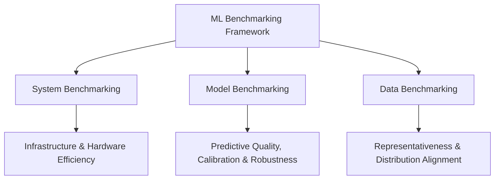
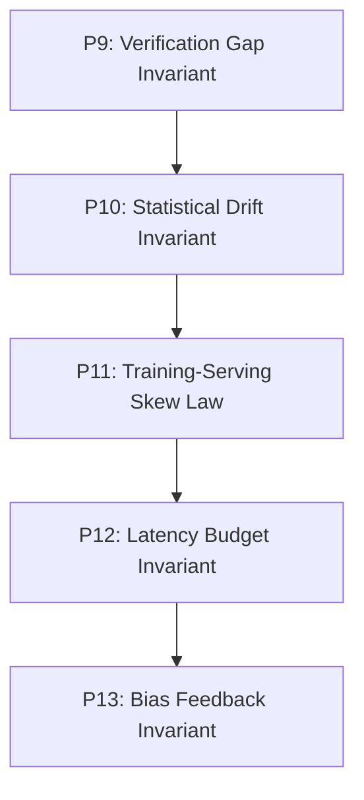

# Chapter 12: Benchmarking Systems & Power Measurement

## Material Covered in This Chapter

- Benchmarking
- Purpose
- 12
- Learning Objectives
- 12.1 MLBenchmarking Framework
- Definition 12.1: Machine learning benchmarking
- Systems Perspective 12.1: Benchmarks as moving targets
- Lighthouse 12.1: MobileNet deployment validation
- The optimization pipeline:
- Three-Dimensional Validation Questions:
- 12.2 Historical Foundations
- Systems Perspective 12.2: Related efficiency metrics
- 12.2.1 Performance benchmarks
- 12.2.2 Energy benchmarks
- 12.2.3 Domain-specific benchmarks
- 12.3 System Benchmarking Suites
- 12.3.1 MLmeasurement challenges
- Math:
- Napkin Math 12.2: Goodhart's Law in action
- Math:
- 12.3.2 System benchmarks
- Systems Perspective 12.3: The fallacy of peak performance
- Exclamation-Triangle Decoding vendor benchmark claims
- What is measured?
- What is excluded?
- What conditions produced these results?
- Translation guide for common claims:
- Definition 12.2: Machine learning system benchmarks
- Napkin Math 12.3: Roofline analysis for BERT inference
- 12.3.3 Community-driven standardization
- 12.4.1 Micro benchmarks
- Systems Perspective 12.4: Micro-benchmarking rules
- Napkin Math 12.4: Measuring the iron law terms
- Framework profilers
- Kernel profilers
- 12.4.2 Macro benchmarks
- 12.4.3 End-to-end benchmarks
- 12.4.4 Granularity trade-offs and selection criteria
- 12.5 Benchmark Components
- 12.5.1 Problem definition
- 12.5.2 Standardized datasets
- 12.5.3 Model selection
- 12.5.4 Evaluation metrics
- 12.5.5 Benchmark harness
- 12.5.6 System specifications
- 12.5.7 Run rules
- 12.5.8 Result interpretation
- Example 12.1: Benchmarking a vision model for edge deployment
- Benchmark Results:
- Napkin Math 12.5: Interpreting a benchmark claim
- Critical Questions:
- 12.5.9 Example benchmark
- 12.5.10 Compression benchmarks
- 12.5.11 Mobile and edge benchmarks
- The reality:
- Systems Perspective 12.5: Edge benchmark reality check
- When evaluating edge hardware claims:
- 12.5.11.1 Heterogeneous processor coordination
- 12.5.11.2 Battery and thermal benchmarking
- 12.5.11.3 Edge-cloud coordination
- 12.6 Training vs. Inference
- Definition 12.3: MLtraining benchmarks
- 12.7.1 Training benchmark motivation
- Relative performance - Best results - Closed, available, on premises
- 12.7.2 Training metrics
- 12.7.2.2 Scalability and parallelism
- Napkin Math 12.6: Scaling efficiency calculation
- 12.7.2.3 Resource utilization
- 12.7.2.4 Energy efficiency and cost
- Napkin Math 12.7: Why INT8 saves energy
- Compute Energy (per multiply-accumulate operation) :
- Memory Access Energy (per byte) :
- 12.7.2.5 Fault tolerance and robustness
- 12.7.2.6 Reproducibility and standardization
- 12.7.3 Training performance evaluation
- 23 GPU Boost Clock:
- 24 Thermal Throt-
- 12.7.3.1 Overemphasis on raw throughput
- 12.7.3.2 Scaling extrapolation
- 12.7.3.3 Ignoring failures and interference

---

## Section-by-Section Preserve-and-Extend

# Chapter 12 Summary: Benchmarking Systems & Power Measurement

## 1. Learning Objectives
* **The Three-Dimensional Benchmarking Framework:** Analyze how system, model, and data performance interact,
identifying failure modes that emerge when optimizations are validated in isolation.
* **Historical Benchmarking Foundations:** Track the evolution from synthetic tests (Whetstone, LINPACK) to
representative workloads (SPEC CPU, MLPerf) and energy-aware suites (SPEC Power, Green500).
* **System Benchmarking Suites:** Apply MLPerf standards across Training, Inference, Tiny, and Power dimensions to
evaluate hardware-software stacks.
* **Benchmarking Granularity:** Contrast micro-benchmarks, macro-benchmarks, and end-to-end evaluations across
diagnostic precision and real-world representativeness.
* **Training vs. Inference Metrics:** Differentiate workloads, objectives, and measurements (time-to-accuracy, scaling
efficiency, tail latency percentiles, and SLOs/SLAs).
* **Power and Energy Measurement:** Define measurement boundaries across hardware scales and characterize
energy-movement invariants (FP32 vs. FP16 vs. INT8 multiplier and memory energy costs).
* **Model and Data Evaluation:** Validate model quality beyond top-line accuracy (calibration via ECE, edge cases) and
measure data coverage, annotation quality, and distribution alignment.
* **Production Considerations & Invariants:** Formulate the physical and statistical laws governing production serving
(Principles 9 to 13: Verification Gap, Statistical Drift, Training-Serving Skew, Latency Budget, and Bias Feedback).

---

## 2. The Three-Dimensional Benchmarking Framework

Optimizations across the Machine Learning stack cannot be validated in isolation. An optimization that improves
throughput in a laboratory setting might collapse in production due to queuing delay, memory bandwidth bottlenecks, or
distribution shifts. Benchmarking is the empirical discipline that validates the system along three co-equal axes:



### 2.1 The Benchmark-Production Gap
The gap between marketed peak performance and sustained production throughput typically ranges from \(2\times\) to
\(10\times\). For example, an NVIDIA A100 GPU delivers 312 TFLOPS of FP16/BF16 Tensor Core performance at peak, but
sustained deep learning training runs achieve only 30% to 50% Model Flops Utilization (MFU), equivalent to 90–155
TFLOPS. This hardware efficiency loss (\(\eta_{\text{hw}}\)) is structurally driven by:
1. **Memory Stalls:** Cycles lost waiting for weights or activations to traverse the memory hierarchy.
2. **Pipeline Bubbles:** Idle bubbles in model-parallel execution pipelines.
3. **Kernel Launch Overhead:** Software dispatch overhead on host CPUs when launching small kernels on the accelerator.

### 2.2 Goodhart's Law in Machine Learning
Goodhart’s Law states: *"When a measure becomes a target, it ceases to be a good measure."* In ML systems, optimizing
for a single metric degrades other critical runtime properties:
* **The BLEU Metric Trap:** Optimizing a translation model solely for BLEU score via a larger beam search size
(\(\text{beam\_size} = 10\) vs. \(\text{beam\_size} = 1\)) can yield a minor 0.5-point BLEU gain at the cost of
\(10\times\) more candidate evaluations per step, causing a \(4\times\) latency slowdown.
* **Leaderboard Overfitting:** Architectural modifications that maximize validation accuracy on static datasets (such as
ImageNet or GLUE) often degrade out-of-distribution robustness, expected calibration error (ECE), and energy efficiency.

### 2.3 Lighthouse 12.1: MobileNetV2 Deployment Validation
MobileNetV2 acts as our validation target, demonstrating how three-dimensional benchmarking exposes bottlenecks:
1. **Model Compression:** INT8 quantization compresses the model size from 14.0 MB (FP32) to 3.5 MB (INT8), a
\(4\times\) footprint reduction.
2. **Hardware Acceleration:** Deploying on Google's EdgeTPU (2W envelope, 4 TOPS) reduces model-only inference time to
2.0 ms (vs. 15.0 ms on Cortex-M7 CPU).
3. **Validation Questions:**
   * *System:* Does the system achieve 2.0 ms latency end-to-end, or do input preprocessing (resizing, normalization)
and Host-to-Device memory transfer (PCIe/I2C) introduce a 10 ms overhead?
   * *Model:* Does the INT8 quantized model preserve accuracy on low-light or occluded inputs?
   * *Data:* How does the model generalize to real-world smartphone images compared to clean ImageNet test images?

---

## 3. Historical Foundations & Evolution

Standardized benchmarking progressed through several generations, transitioning from synthetic, component-level tests to
multi-objective, end-to-end systems.

| Benchmark | Year | Primary Focus | Key Metric(s) | System Engineering Lesson |
| :--- | :--- | :--- | :--- | :--- |
| **Whetstone** | 1976 | Synthetic floating-point loops | MWIPS (Mega Whetstone Instructions/Sec) | Single-loop synthetic tests are easily gamed by compilers and do not predict real application speed. |
| **LINPACK** | 1979 | Dense linear algebra (solving systems) | FLOPS (Floating-Point Operations/Sec) | Isolated matrix math speed ignores system-level bottlenecks (I/O, cache hit rates, OS overhead). |
| **SPEC CPU** | 1989 | Real application workloads | SPECrate, SPECspeed | Standardizing evaluation requires representative, multi-program application suites. |
| **SPEC Power** | 2007 | Server energy efficiency | ssj_ops / Watt | Systems must be evaluated across multiple load levels (10% to 100% capacity), as idle power draw dominates energy budgets. |
| **Green500** | 2007 | HPC energy efficiency | GFLOPS / Watt | Maximum performance optimization must be constrained by thermal and power-consumption metrics. |
| **MLPerf** | 2018 | Full-system training & inference | Time-to-accuracy, QPS, Latency, Energy/Query | ML performance is probabilistic and emergent; benchmarks must couple accuracy targets with execution speeds. |

---

## 4. System Benchmarking & Hardware Performance

### 4.1 The Fallacy of Peak Performance
Peak performance represents the maximum speed guaranteed by hardware specifications that a manufacturer guarantees you
will not exceed. Deep learning workloads rarely achieve this peak due to memory bandwidth limits (the memory wall).

### 4.2 Arithmetic Intensity & The Roofline Model
To diagnose hardware limits, we compute a workload's **Arithmetic Intensity** (\(I\)), defined as the ratio of
floating-point operations to memory access volume:
\[
I = \frac{\text{FLOPs}}{\text{Bytes of memory transfer}}
\]
The hardware platform's **Ridge Point** determines the boundary between memory-bound and compute-bound regimes:
\[
\text{Ridge Point} = \frac{\text{Peak Compute Output (TFLOPS)}}{\text{Peak Memory Bandwidth (TB/s)}}
\]
* **NVIDIA A100 GPU (SXM4, 80GB):**
  * Peak FP16 Compute: 312 TFLOPS
  * Peak Memory Bandwidth (HBM2e): 2.04 TB/s
  * Ridge Point: \(\frac{312}{2.04} \approx 153\text{ FLOPs/byte}\)
  * *Compute-Bound:* Any kernel with \(I > 153\text{ FLOPs/byte}\). Performance is limited by compute units.
  * *Memory-Bound:* Any kernel with \(I < 153\text{ FLOPs/byte}\). Performance is limited by HBM2e bandwidth.

#### Worked Example: BERT-Base Inference on NVIDIA A100
* **Model Parameters:** 110M weights (\(440\text{ MB}\) in FP32, \(220\text{ MB}\) in FP16).
* **Workload (Batch Size = 1):** Forward pass requires \(22\text{ billion}\) floating-point operations (\(22 \times
10^9\text{ FLOPs}\)).
* **Memory Volume:** Loading 220 MB of weights from HBM to SRAM.
* **Arithmetic Intensity:**
  \[
  I = \frac{22 \times 10^9\text{ FLOPs}}{220 \times 10^6\text{ Bytes}} = 100\text{ FLOPs/byte}
  \]
* **Performance Prediction:** Since \(I = 100 < 153\), the workload is memory-bandwidth bound.
  \[
  \text{Achievable Throughput} = I \times \text{Memory Bandwidth} = 100\text{ FLOPs/byte} \times 2.04\text{ TB/s} =
204\text{ TFLOPS}
  \]
  \[
  \text{GPU Compute Utilization} = \frac{204\text{ TFLOPS}}{312\text{ TFLOPS}} \approx 65.4\%
  \]
  *(Note: Dynamic KV cache loading and intermediate activation movement reduce this intensity further in multi-layer
transformer configurations.)*

* **Optimization via Batching (Batch Size = 32):**
  * Weights loaded: 220 MB (loaded once, shared across batch).
  * Compute operations: \(22 \times 10^9 \text{ FLOPs} \times 32 = 704 \times 10^9\text{ FLOPs}\).
  * New Arithmetic Intensity:
    \[
    I = \frac{704 \times 10^9\text{ FLOPs}}{220 \times 10^6\text{ Bytes}} = 3200\text{ FLOPs/byte}
    \]
  * Since \(3200 \gg 153\), execution shifts to the compute-bound regime. Under compute constraints, we achieve near
peak performance:
    \[
    \text{Achieved Throughput} \approx 85\% \times 312\text{ TFLOPS} = 265.2\text{ TFLOPS}
    \]

### 4.3 Vendor Benchmarking Claims: Decoding Guide
When analyzing vendor-reported benchmarks, ask the following diagnostic questions:

| Vendor Claim | Architectural Reality | Translation |
| :--- | :--- | :--- |
| **"Up to 10,000 images/sec"** | Peak throughput measured at maximum batch size using aggressive INT8 quantization with structural sparsity. | Ignores input preprocessing (resizing, decoding) and assumes infinite input queue depth. |
| **"Sub-millisecond latency"** | Compute-only kernel latency of the forward pass on a warm chip. | Excludes CPU-GPU PCIe memory transfer, model load times, and queue wait times. |
| **"5x more energy efficient"** | Per-operation energy comparison of INT8 MAC units vs. FP32. | Does not account for host DRAM power draw or base idle leakage current of the SoC. |
| **"Dynamic GPU Boost Clock"** | dynamic frequency scaling raises clocks by 10-30% on cold starts. | Sustained workloads trigger thermal throttling, settling clocks to base frequency within minutes. |

---

## 5. Benchmarking Granularity

Performance measurement occurs across three granularities, trading off diagnostic precision for end-to-end
representativeness:

```
[Precise Bottleneck Isolation] <----------------------------------> [Real-world Representative]
Micro-Benchmarks                     Macro-Benchmarks                   End-to-End Benchmarks
(Kernel execution,                   (ResNet-50 convergence,            (Production serving pipelines,
Memory bandwidth, DVFS)               Model accuracy, Latency)          Data ingestion, ETL, queuing)
```

### 5.1 Micro-Benchmarks & The Systems Detective's Rules
Micro-benchmarks measure mathematical primitives (GEMMs, attention blocks) in isolated environments (e.g., cuDNN or
DeepBench).
1. **The Warm-Up Rule:** Discard the first 10 to 50 iterations. Dynamic Voltage and Frequency Scaling (DVFS) requires
time to ramp a chip from low-power idle (e.g., 300 MHz) to maximum boost frequency (e.g., 2.5 GHz).
2. **The Variance Rule:** Report the Coefficient of Variation (\(\text{CV} = \sigma / \mu\)). A value of \(\text{CV} >
0.05\) (5%) indicates system noise, background process contention, or thermal throttling.
3. **The Flush Rule:** Flush the L2 cache between runs when measuring memory bandwidth; otherwise, you measure cache
speed (\(\approx 5\text{--}10\text{ TB/s}\)) rather than physical DRAM bandwidth (\(\approx 1\text{--}2\text{ TB/s}\)).

### 5.2 Timeline Profiling of the Iron Law
Using PyTorch Profiler (logical layer) or NVIDIA Nsight (physical hardware layer), we measure the terms of the **Iron
Law of Latency**:

\[
T = \underbrace{\frac{D_{\text{vol}}}{\text{BW}}}_{\text{Data Term}} + \underbrace{\frac{O}{R_{\text{peak}} \cdot
\eta_{\text{hw}}}}_{\text{Compute Term}} + \underbrace{L_{\text{lat}}}_{\text{Latency Term}}
\]

* **Data Term Bottleneck:** DRAM bandwidth is saturated (Nsight shows active DRAM read/write lines near memory interface
limits). Fix: Quantize weights or apply activation pruning.
* **Compute Term Bottleneck:** SM activity is low, but memory bandwidth is unsaturated (the *Utilization Trap*). Fix:
Increase batch size, use Tensor Cores, or verify correct thread-grid sizing.
* **Latency Term Bottleneck:** PyTorch timeline shows wide gaps (empty space) between CUDA kernel blocks. This indicates
host CPU CPU-bound overhead and kernel launch latency. Fix: **Operator Fusion** or compile using **CUDA Graphs** to
record and replay kernel sequences without CPU intervention.

### 5.3 End-to-End Metrics & Amdahl's Law
An optimization to one stage of a serving pipeline is bounded by the non-optimized fraction of the workflow. Under
Amdahl's Law, if preprocessing (decoding, resizing) consumes a fraction \(f\) of total latency, the maximum speedup
\(S_{\max}\) achievable by optimizing model inference is:
\[
S_{\max} = \frac{1}{f + \frac{1-f}{S_{\text{infer}}}} \xrightarrow{S_{\text{infer}} \to \infty} \frac{1}{f}
\]

* **Example Scenario:** Preprocessing takes 8 ms; model inference takes 10 ms. Total latency = 18 ms. Preprocessing
fraction \(f = 8/18 \approx 0.444\).
* Even if we accelerate model inference by infinity (reducing inference latency from 10 ms to 0 ms), the maximum speedup
is:
  \[
  S_{\max} = \frac{1}{0.444} \approx 2.25\times
  \]
  *(Reducing inference to 2 ms yields 10 ms total latency, providing a \(1.8\times\) improvement, not \(5\times\).)*

---

## 6. Training vs. Inference Benchmarking

| Property | Training Benchmarks | Inference Benchmarks |
| :--- | :--- | :--- |
| **Primary Metric** | Time-to-accuracy (hours/days), training throughput (samples/sec). | Tail latency (p95, p99 in ms), Queries per Second (QPS). |
| **Statistical Bound** | Bounded convergence. Staggered step times are acceptable if overall convergence holds. | Hard determinism constraints. A single slow request violates latency SLAs. |
| **Deployment Scale** | Dedicated, homogeneous data center clusters (kilowatt/megawatt scales). | Diverse target nodes: cloud instances, edge devices, MCUs (milliwatt/watt scales). |
| **Parallelism Limits** | Scalability limited by distributed communication overhead (AllReduce bandwidth). | Scalability limited by model load times (cold starts) and memory bus capacity. |

### 6.1 Training Scalability & Parallelism
**Scaling Efficiency** (\(\text{Efficiency}(N)\)) measures how effectively computational resources translate to speedups
under strong scaling (fixed overall problem size, increasing GPU count \(N\)):
\[
\text{Efficiency}(N) = \frac{T(1)}{N \times T(N)} \times 100\%
\]
where \(T(1)\) is the training time on 1 node, and \(T(N)\) is the training time on \(N\) nodes.

#### Worked Example: Scaling Efficiency Loss
* **Single-GPU Training Time:** \(T(1) = 24\text{ hours}\).
* **8-GPU Training Time:** \(T(8) = 4\text{ hours}\).
* **Scaling Efficiency:**
  \[
  \text{Efficiency}(8) = \frac{24}{8 \times 4} \times 100\% = 75\%
  \]
* The 25% efficiency loss decomposes into:
  1. *Gradient Synchronization (10-15%):* Network latency during AllReduce communication.
  2. *Memory Copy (3-5%):* Host-to-device (CPU-GPU) memory transfers.
  3. *Load Imbalance (2-5%):* Per-device step time variance.

---

## 7. Inference Serving Mechanics & Tail Latency

### 7.1 SLOs vs. SLAs
* **Service Level Objective (SLO):** The internal engineering target (e.g., \(p99 \le 100\text{ ms}\)).
* **Service Level Agreement (SLA):** The external contractual threshold (e.g., \(p99 \le 200\text{ ms}\)). The
difference between the SLO and SLA is the **error budget**, which absorbs traffic spikes or hardware degradation without
triggering contractual penalties.
* **The Tail at Scale:** In fan-out architectures (e.g., search or recommendation systems), a single client query
queries \(M\) parallel backend shards. If a single shard has a 1% probability of hitting its p99 tail latency, the
probability \(P_{\text{slow}}\) that the overall client request experiences this tail latency is:
  \[
  P_{\text{slow}} = 1 - (1 - 0.01)^M
  \]
  For \(M = 100\) shards, \(P_{\text{slow}} = 1 - 0.99^{100} \approx 63.4\%\). Median user latency degrades to tail
latency as the system scale grows.

### 7.2 War Story: Discord's Tail Latency
Discord observed periodic tail-latency spikes in their core Go services. The spikes were traced to Go's Garbage
Collector (GC) triggering Stop-the-World pauses to collect memory allocations. While average response times were low,
the tail (p99) was high. Rewriting the service in Rust—which relies on compile-time resource ownership rather than a
garbage collector—eliminated these pauses and stabilized p99 tail latency.

### 7.3 MLPerf serving Scenarios
MLPerf Inference evaluates hardware and models across five scenarios:
1. **SingleStream:** Processes one request at a time (batch size = 1). Used to measure sequential latency in mobile
apps.
2. **MultiStream:** Processes synchronized inputs in lockstep (e.g., multiple cameras on an autonomous vehicle).
3. **Server:** Inputs arrive unpredictably following a Poisson distribution, simulating cloud APIs. Metrics evaluated
are throughput (QPS) subject to a tail latency SLO.
4. **Offline:** All inputs are available upfront. Focuses on maximizing throughput (batch size is unconstrained).
5. **Interactive:** Measures token-streaming performance for LLMs. Evaluates **Time-to-First-Token (TTFT)** (prompt
processing) and **Time-Per-Output-Token (TPOT)** (autoregressive generation).

---

## 8. Power & Energy Measurement Techniques

### 8.1 The Multiplier & DRAM Energy Invariant
Moving data across the memory hierarchy consumes orders of magnitude more energy than mathematical computation:

```
[Compute]  FP32 Multiplier:  ~3.7 pJ
           INT8 Multiplier:  ~0.2 pJ  (18x reduction vs. FP32)

[Memory]   Register Read:    ~0.01 pJ
           L1 Cache Read:    ~0.5 pJ
           L2 Cache Read:    ~2.0 pJ
           DRAM Access:      ~160.0 pJ (16,000x cost vs. Register)
```

#### Energy Breakdown: Quantized MobileNet Inference
A forward pass of MobileNet on an edge platform consumes:
* FP32 Model (17 MB size, 300 MMACs compute):
  * Model Load (DRAM Access): \(17 \times 10^6\text{ Bytes} \times 160\text{ pJ/byte} = 2.72\text{ mJ}\)
  * Compute Energy: \(300 \times 10^6\text{ Ops} \times 3.7\text{ pJ/Op} = 1.11\text{ mJ}\)
  * Total Inference Energy: \(2.72 + 1.11 = 3.83\text{ mJ}\)
* INT8 Model (4.25 MB size, 300 MMACs compute):
  * Model Load (DRAM Access): \(4.25 \times 10^6\text{ Bytes} \times 160\text{ pJ/byte} = 0.68\text{ mJ}\)
  * Compute Energy: \(300 \times 10^6\text{ Ops} \times 0.2\text{ pJ/Op} = 0.06\text{ mJ}\)
  * Total Inference Energy: \(0.68 + 0.06 = 0.74\text{ mJ}\)
* *Systems Insight:* Quantizing to INT8 yields a \(5.17\times\) reduction in total energy consumption, driven primarily
by Alleviating DRAM bandwidth pressure.

### 8.2 Power Measurement Boundaries
MLPerf Power sets boundaries to ensure fair comparisons across scales:
* **TinyML Boundary:** Measures the complete SoC (compute core, SRAM, I/O interfaces) using low-overhead shunt
resistors.
* **Inference Node Boundary:** Measures the server chassis power draw at the wall, including power supply unit (PSU)
conversion losses and auxiliary cooling fans.
* **Training Cluster Boundary:** Measures active compute nodes and primary network switches. Excludes central storage
arrays, external facility cooling (PUE overhead), and power distribution units.

---

## 9. Model and Data Quality Evaluation

Standard system benchmarks assume fixed datasets and correct labels. Production environments violate these assumptions,
requiring model and data validation metrics.

### 9.1 Expected Calibration Error (ECE)
How closely a model's predicted confidence maps to empirical correctness. We divide predictions into \(B\) equally
spaced confidence bins. ECE is calculated as:
\[
\text{ECE} = \sum_{m=1}^{B} \frac{|B_m|}{N} \Big| \text{acc}(B_m) - \text{conf}(B_m) \Big|
\]
where \(N\) is the total number of samples, \(B_m\) is the set of indices of samples whose prediction confidence falls
in bin \(m\), and \(\text{acc}(B_m)\) and \(\text{conf}(B_m)\) are the empirical accuracy and average confidence of bin
\(m\), respectively.
* \(\text{ECE} < 0.05\): Well-calibrated model. Confidence scores can be trusted for automated action thresholds.
* \(\text{ECE} \ge 0.10\): Poorly calibrated model. Softmax outputs are overconfident.
* *Quantization Pitfall:* Quantizing a model to INT8 often degrades ECE because restricting the numeric precision
compresses the logit range and shifts the softmax output distribution. Temperature scaling (\(z_i / T\)) is applied
post-quantization to rescale logits and restore calibration.

### 9.2 Data Coverage & Quality
* **Label Errors:** Human annotation errors impact standard benchmarks. Confident learning audits reveal that ImageNet
has a \(3\%\) to \(6\%\) label error rate.
* **Inter-Annotator Agreement:** Measured via Cohen's kappa (\(\kappa\)):
  * \(\kappa \ge 0.60\): Acceptable label quality.
  * \(\kappa < 0.40\): Unreliable data; indicators of ambiguous labeling instructions or subjective tasks.
* **Model-Centric vs. Data-Centric Paradigms:** Model-centric AI optimizes architectures on fixed datasets. Data-centric
AI holds the architecture constant and systematically curates training data. In DataComp evaluations, training on a
curated 30% subset of a dataset yielded better out-of-distribution generalization than training on the full 100%
unfiltered corpus.

---

## 10. Production Serving Invariants (Principles 9 to 13)



### Principle 9: The Verification Gap Invariant
> **Invariant:** In traditional software, verification checks whether \(f(x) = y\). In machine learning systems,
verification checks statistical bounds:
> \[
> \Pr(f(X) \approx Y) > 1 - \epsilon
> \]
> Correctness is probabilistic and cannot be proven deterministically; performance can only be statistically bounded on
a representative distribution.

### Principle 10: The Statistical Drift Invariant
> **Invariant:** Machine learning systems fail silently when the production data distribution drifts from the training
data distribution. This accuracy decay is modeled as:
> \[
> \text{Accuracy}(t) \approx \text{Accuracy}_0 - \lambda \cdot \mathcal{D}(P_t \parallel P_0)
> \]
> where \(\text{Accuracy}_0\) is the accuracy at deployment, \(\mathcal{D}(P_t \parallel P_0)\) is the statistical
distance (e.g., Kullback-Leibler divergence or Wasserstein distance) between the production distribution \(P_t\) and the
training distribution \(P_0\), and \(\lambda\) is the model's sensitivity to drift.

### Principle 11: The Training-Serving Skew Law Invariant
> **Invariant:** If the function computed during serving (\(f_{\text{serve}}\)) diverges from the function learned
during training (\(f_{\text{train}}\)), the model's effective accuracy degrades proportionally to that divergence:
> \[
> \Delta \text{Accuracy} \propto \mathbb{E}[|f_{\text{serve}}(x) - f_{\text{train}}(x)|]
> \]
> This skew is driven by inconsistent data processing paths (e.g., OpenCV vs. PIL resizing, float32 vs. float64 scaling,
or stale feature stores). Centralized feature stores and unit testing are required to maintain feature parity.

### Principle 12: The Latency Budget Invariant
> **Invariant:** In interactive serving, systems must optimize throughput within a strict tail-latency constraint
defined by a Service Level Objective (SLO). Latency is governed by:
> \[
> L_{\text{lat,total}} = L_{\text{lat,net}} + L_{\text{lat,pre}} + L_{\text{lat,infer}} + L_{\text{lat,post}} +
L_{\text{lat,queue}} \le \text{SLO}
> \]
> Serving platforms must implement tail-tolerant designs (e.g., dynamic batch timeouts or hedged requests) to prevent
queue wait times (\(L_{\text{lat,queue}}\)) from violating the SLO under load spikes.

### Principle 13: The Bias Feedback Invariant
> **Invariant:** When a model's outputs influence the distribution of its future inputs, prediction errors compound
across decision cycles. For a self-reinforcing feedback loop, the disparity \(\Delta_g(k)\) of demographic group \(g\)
after \(k\) deployment cycles scales as:
> \[
> \Delta_g(k) \approx \Delta_g(0) \cdot \alpha^k
> \]
> where \(\alpha\) is the amplification factor. If \(\alpha > 1\), the disparity grows exponentially, distorting future
training data. Fairness is an operational stability constraint on the deployment loop.

---

## 11. Benchmark Gaming & Submission-Specific Optimizations

To inflate scores on standardized benchmarks like MLPerf, hardware vendors and compiler engineers apply optimizations
that do not generalize to production workloads:
* **Precision Dropping:** Compilers silently downgrade operations from FP32 to BF16 or INT8 during a benchmark
execution, violating accuracy parameters for standard queries.
* **Operator Removal:** Identifying that a benchmark only measures Top-1 classification accuracy and optimizing out
layer normalization or activation steps that do not alter the top prediction index.
* **Weight Preloading:** Pre-loading benchmark model weights directly into the accelerator's on-chip SRAM (e.g., HBM
bypass), avoiding the memory wall bottleneck.
* **MLPerf Mitigations:** Submissions must achieve a target accuracy threshold (e.g., \(75.9\%\) Top-1 accuracy on
ImageNet for ResNet-50) using reference model structures. If compiler optimizations degrade validation accuracy below
this threshold, the submission is disqualified.

---

## 12. Predeployment Benchmark Checklist
Before deploying any machine learning system, validate offline benchmarking results against production constraints:

| Benchmark Assumption | Production Reality | Predeployment Validation Approach |
| :--- | :--- | :--- |
| **Uniform Request Arrival** | Bursty, time-varying traffic | Load test using replayed production traffic traces. |
| **Clean, Preprocessed Inputs** | Low-quality, variable inputs | Evaluate accuracy on random samples of production data. |
| **Warm System State** | Cold starts and cold caches | Measure time-to-first-inference from an uninitialized state. |
| **Isolated Execution** | Shared resource contention | Benchmark models under concurrent hardware utilization. |
| **Fixed Model Configuration** | A/B testing and canary rollouts | Establish multi-model serving baselines. |

---

## Full Slice Content (Docling Extract, Preserved Verbatim)

> Each section below preserves the source slice content as extracted by docling. Image placeholders are removed; tables,
equations, code blocks, named artifacts, and footnotes are kept intact.

## Benchmarking

## Purpose

How do you systematically compare ML systems when hardware, models, data, and deployment conditions all interact?

Every preceding chapter introduced decisions with measurable consequences: which hardware to target, how to compress a
model, what data to select, how to serve predictions. Each decision improved one dimension (latency, accuracy,
throughput, or energy), but an ML system is the product of all these dimensions simultaneously. A pruned model runs
faster on one accelerator but slower on another. A larger batch size improves accelerator utilization but violates a
latency service level agreement (SLA). An edge device advertises peak throughput that thermal throttling halves under
sustained workloads. The challenge is not whether individual optimizations work in isolation (they do) but how to
measure their combined effect under conditions that actually matter. Benchmarking is the discipline of making such
comparisons systematic rather than anecdotal. It requires defining what to measure (accuracy, latency, throughput,
energy), at what granularity (a single kernel, a full model, an end-to-end pipeline), and under which conditions (batch
size, input distribution, thermal state, concurrent load). Without this structure, teams compare numbers that were never
measured on the same terms, and decisions that looked sound in a spreadsheet collapse under production workloads. The
previous sections optimized the model, selected the data, and matched the hardware; benchmarking is where those
optimizations are validated: where claims meet evidence, and where the gap between what was promised and what will be
delivered is either quantified honestly or discovered painfully in production.

## 12

12.1 ML Benchmarking Framework 12.2 Historical Foundations 12.3 System Benchmarking Suites 12.4 Benchmarking Granularity
12.5 Benchmark Components 12.6 Training vs. Inference 12.7 Training Benchmarks 12.8 Inference Benchmarks 12.9 Power
Measurement Techniques 12.10Benchmarking Best Practices 12.11Model and Data Evaluation 12.12Production Considerations
12.13Fallacies and Pitfalls 12.14Summary

## Learning Objectives

- Explain the three-dimensional benchmarking framework (system, model, data) and identify failure modes that emerge from
their interdependence
- Compare training and inference benchmarking approaches through their distinct metrics, workloads, and performance
characteristics, including tail latency and end-to-end measurement
- Select appropriate benchmark granularity levels (micro, macro, end-to-end) based on optimization objectives and
development phase
- Apply MLPerf standards to evaluate ML systems across training, inference, and power dimensions
- Design benchmark protocols with standardized datasets, metrics, evaluation procedures, and power measurement
boundaries that ensure reproducible energy and performance comparisons
- Evaluate model compression trade-offs using multi-dimensional metrics (accuracy, calibration, edge-case robustness)
beyond top-line accuracy
- Distinguish laboratory benchmarks from production validation, identifying failure modes (data drift, dynamic
workloads, silent degradation) that controlled benchmarks miss

## 12.1 MLBenchmarking Framework

The optimization techniques from preceding chapters all claim improvements. Data selection strategies (Chapter 9)
promise more efficient training. Model compression (Chapter 10) promises smaller, faster models. Hardware acceleration
(Chapter 11) promises higher throughput. Verifying that these claims hold in production is itself an engineering
discipline. A model quantized to INT8 may benchmark 2 × faster on a synthetic workload but show no improvement under
real traffic patterns with variable input sizes and concurrent requests. A pruned model may maintain accuracy on the
test set but fail on edge cases the benchmark never covered. Benchmarking is the discipline of verifying that
optimizations deliver their promised benefits under realistic conditions.

T he preceding chapters established physical laws (the iron law, the conservation of complexity, the memory wall) and
developed diagnostic methods for applying them. Benchmarking is where those laws face empirical reality. The
benchmark-production gap, routinely 2-10 × , is not a failure of methodology but the measure of how much physical
reality exceeds our models of it. Closing that gap by designing measurements that predict production behavior with
quantitative fidelity is the core competency that distinguishes ML systems engineering from ML research. Benchmarking is
the discipline's truth-telling function: the practice that converts theoretical claims into verified engineering
knowledge.

MLbenchmarking operates across three independent dimensions that map directly to the components of any deployed system.
System benchmarking measures whether the hardware delivers promised performance under realistic workloads or whether
memory bandwidth saturation and software dispatch overhead erode the gains. Model benchmarking measures whether
optimization techniques preserve model quality across the full input distribution, not just on curated test sets. Data
benchmarking measures whether the model generalizes to real-world data with all its noise, bias, and distributional
shift. Each dimension can independently reveal problems invisible to the others, and a system that passes all three
provides far stronger deployment confidence than one evaluated along any single axis.

## Definition 12.1: Machine learning benchmarking

Machine Learning Benchmarking is the empirical measurement of a system's end-to-end performance on representative ML
workloads, designed to decouple marketed peak specifications from the sustained throughput and latency achievable under
realistic operating conditions.

1. Significance (quantitative) : The gap between peak and sustained performance is large and structurally unavoidable.
An A100 GPU delivers 312 TFLOPS BF16 at peak, but production transformer training runs typically sustain 90-155 TFLOPS
(30-50 percent MFU)-a 2-3 × gap that exists even in optimally tuned systems due to memory stalls, pipeline bubbles, and
kernel launch overhead. Benchmarking quantifies this 𝜂 hw gap; vendor spec sheets do not.
2. Distinction (durable) : Unlike micro-benchmarks, which measure individual kernel performance such as a general matrix
multiply (GEMM) at peak matrix dimensions, ML benchmarks measure the full stack: data loading, preprocessing, forward
pass, gradient computation, optimizer step, and checkpoint I/O-exposing bottlenecks that individualcomponent benchmarks
will never reveal.
3. Common pitfall: Afrequent misconception is that benchmark numbers are stable references. Both the workload (new model
architectures) and the hardware (new GPU generations) evolve, so a benchmark result that represents state-of-the-art
today becomes the new baseline within 12-18 months, making year-over-year comparisons meaningful only when the benchmark
version is held constant.

Unlike traditional systems where benchmarks represent fixed specifications, ML benchmarks capture only a snapshot of a
shifting reality. This distinction has profound implications for how we interpret benchmark results.

## Systems Perspective 12.1: Benchmarks as moving targets

In traditional systems (for example, SPEC CPU), the benchmark is a rigid specification . Asorting algorithm is correct
if it sorts the list. Correctness is absolute and unchanging. In ML systems, the benchmark is a soft specification:
correctness is defined by a finite set of examples (ImageNet), and the world moves. A model that scores 99 percent on
ImageNet might fail completely on user photos taken years after the benchmark was created.

In computer architecture, engineers design for the benchmark because the benchmark represents the workload. In ML
engineering, designing solely for the benchmark is overfitting . Robustness comes from acknowledging that the benchmark
is only a proxy for a shifting reality.

To make this three-dimensional framework concrete, we ground it in a running example that threads through the entire
chapter, returning to it repeatedly as we develop each dimension. MobileNet deployment validation spans all three
evaluation dimensions, illustrating how each reveals problems the others cannot.

## Lighthouse 12.1: MobileNet deployment validation

Throughout this chapter, we validate the complete optimization pipeline using MobileNetV2 (introduced in Section 6.1.1)
as our lighthouse example. MobileNetV2 refines v1's depthwise separable design with inverted residuals and linear
bottlenecks while maintaining a similar parameter scale. MobileNetV2 exemplifies the deployment challenges where
benchmarking determines success or failure. The validation questions below preview the three dimensions we develop
throughout this chapter. Each section makes these questions concrete with specific metrics and methodologies.

## The optimization pipeline:

1. Model Compression (Chapter 10): INT8 quantization reduces MobileNet from 14 MB to 3.5 MB (4 × compression) 2.
Hardware Acceleration (Chapter 11): EdgeTPU deployment achieves 2.0 ms inference vs. 15 ms on CPU

1 Goodhart's Law: Goodhart (1984) articulated the original 1975 Bank of England observation on monetary policy;
Strathern (1997) generalized it into the form quoted above. The original context was macroeconomics: once a monetary
aggregate became an official policy target, banks changed behavior to game the metric, destroying its predictive value.
In ML, the same failure mode recurs structurally: BLEU scores incentivize n-gram matching over fluency, ImageNet
accuracy rewards architecture tricks over robustness, and benchmark leaderboards incentivize test-set overfittingeach a
case where the metric's success as a target caused its failure as a measure.

2 Benchmark: From surveying, where a 'bench mark' was a horizontal cut in stone serving as a fixed elevation reference.
The term entered computing in the 1970s to describe standardized comparison points, but the surveying metaphor carries a
systems lesson: just as an elevation measurement is meaningless without a calibrated reference, an ML throughput number
is meaningless without controlled workloads, thermal state, and precision settings.

3. Benchmarking Validation (this chapter): Verify the pipeline delivers in practice

## Three-Dimensional Validation Questions:

- System: Does EdgeTPU actually achieve 2.0 ms, or do preprocessing and data transfer add 10 ms of overhead?
- Model Quality: Did INT8 quantization preserve accuracy? What about edge cases with unusual lighting?
- Data: Does performance hold on real-world smartphone images, not just ImageNet test images?

Each section of this chapter addresses one dimension of this validation stack, building toward a systematic methodology
for answering these questions for any optimization pipeline.

Before examining these dimensions in detail, we must establish the mindset that separates rigorous evaluation from
misleading metrics. Three principles distinguish effective practitioners.

Second, Goodhart's Law applies everywhere. 1 'When a measure becomes a target, it ceases to be a good measure.' Teams
that optimize for benchmark rankings often produce systems that excel in evaluation but fail in production.
Benchmark-specific optimizations frequently degrade characteristics that matter for deployment: robustness, calibration,
and efficiency.

First, benchmarks are proxies, not truth. Every benchmark measures specific conditions that may not match the target
deployment. A system achieving 10,000 samples/second in Offline mode might achieve only 200 QPS in Server mode with
latency constraints. The critical question is always what the benchmark does not measure.

Third, end-to-end beats component metrics. Vendors report component latency (5-10 ms for model inference), but
production latency includes preprocessing, queuing, and postprocessing (50-100 ms total). A 3 × inference speedup in
isolation might yield only 1.3 × end-to-end improvement, or worse if the optimization increases memory pressure. These
principles reappear throughout this chapter and are examined in depth in Section 12.13.

We begin with these historical foundations of benchmarking 2 to understand which lessons from decades of computing
measurement apply to ML, then examine each of the three dimensions in depth, before showing how integrated benchmarking
brings them together. This structure reflects the validation sequence practitioners follow: fi rst verify hardware
delivers promised performance, then verify the model and data optimizations built atop that hardware deliver their
promised gains.

Knowing what to measure, however, is only half the problem. Measuring incorrectly (with the wrongworkloads, biased
baselines, or uncontrolled variables) produces numbers that feel precise but mislead decisions. The history of computing
benchmarking is littered with examples of technically sound metrics applied with flawed methodology, from compiler-gamed
Whetstone scores to cherrypicked GPU benchmarks that predict nothing about sustained workloads. Understanding how
measurement methodology evolved, and where it failed, is essential for designing benchmarks that distinguish genuine
improvements from measurement artifacts.

## 12.2 Historical Foundations

In 1976, when Whetstone became one of the first standardized computing benchmarks, vendors immediately began optimizing
their compilers specifically for its floating-point tests-producing impressive numbers that predicted nothing about real
application performance. This gaming problem has plagued every generation of benchmarks since. Understanding why
MLbenchmarking requires our three-dimensional approach demands tracing how measurementmethodologies evolved, and often
failed, over decades of computing history. Each generation of benchmarks emerged from the limitations of its
predecessors, teaching lessons that directly inform modern ML evaluation.

Benchmarking intersects with metrics from several chapters. The following note maps these connections.

## Systems Perspective 12.2: Related efficiency metrics

While this chapter focuses on system-level benchmarking, comprehensive evaluation spans multiple dimensions covered
elsewhere. For data selection metrics (PPD, DUE), see Chapter 9. For model compression evaluation (Accuracy vs.
Compression), see Chapter 10. For hardware efficiency metrics (Roofline, TOPS/Watt), see Chapter 11. The system
benchmarks in Section 12.3.2 through Section 12.9.4 validate these hardware claims; Section 12.11 addresses model and
data validation.

The evolution from simple performance metrics to ML benchmarking reveals three methodological shifts, each emerging when
practitioners discovered that previous evaluation approaches failed to predict real-world performance.

## 12.2.1 Performance benchmarks

The earliest computing benchmarks revealed a problem that plagues evaluation to this day: gaming. Mainframe benchmarks
like Whetstone (Curnow and Wichmann 1976) and LINPACK 3 (Dongarra et al. 1979) measured isolated operations
(floating-point throughput, matrix solve speed), and vendors quickly learned to optimize specifically for these narrow
tests rather than for practical performance. The resulting numbers looked impressive on paper but predicted little about
how systems performed on actual workloads. SPEC CPU (1989) broke this cycle by pioneering the use of real application
workloads, ensuring that evaluation reflected actual deployment scenarios rather than synthetic ideals. This lesson
directly shapes ML benchmarking: optimization claims from Chapter 10 require validation on representative tasks, and
MLPerf's inclusion of real models like ResNet-50 and BERT ensures benchmarks capture deployment complexity rather than
idealized test cases.

Athird shift occurred when distributed computing revealed that component-level optimization fails to predict
system-level performance. A CPU benchmark cannot predict cluster throughput when network communication dominates. ML
training similarly depends on the interplay of accelerator compute (Chapter 11), data pipelines, gradient
synchronization, and storage throughput. MLPerf evaluates complete workflows, recognizing that performance emerges from
component interactions, not from components in isolation.

As deployment contexts diversified, a second limitation emerged: single-metric evaluation proved inadequate. Graphics
benchmarks began measuring rendering quality alongside frame rate; mobile benchmarks added battery life as a co-equal
concern with performance. The multi-objective challenges from Chapter 1 (balancing accuracy, latency, and energy)
manifest directly in modern ML evaluation, where no single metric captures deployment viability.

DAWNBench (Coleman et al. 2017) emerged as an early ML benchmark that pioneered timeto-accuracy evaluation, directly
influencing MLPerf's methodology for measuring training efficiency. These lessons culminate in MLPerf 4 (2018), which
synthesizes representative workloads, multi-objective evaluation, and integrated measurement while addressing
ML-specific challenges (Ranganathan and Hölzle 2024; Raji et al. 2021).

## 12.2.2 Energy benchmarks

The multi-objective evaluation paradigm naturally extended to energy efficiency as computing diversified beyond
mainframes with unlimited power budgets. Mobile devices demanded battery life optimization, while warehouse-scale
systems faced energy costs rivaling hardware expenses. This shift established energy as a first-class metric alongside
performance, spawning benchmarks like SPEC Power 5 for servers and Green500 6 for supercomputers.

Energy benchmarking extends beyond hardware power measurement to include algorithmic efficiency. Model compression
techniques (pruning, quantization, knowledge distillation) often achieve greater energy savings than hardware
improvements alone. MobileNet architectures achieve approximately 13.7 × fewer FLOPs vs. ResNet, translating to
proportional energy reduction on

Diverse workload patterns and system configurations continue to challenge power benchmarking across computing
environments. MLPerf Power (MLCommons 2024c) addresses this with specialized methodologies for measuring the energy
impact of machine learning workloads, reflecting energy efficiency's central role in AI system design.

- 3 Whetstone and LINPACK: Whetstone (Curnow and Wichmann 1976) was named after the English Electric facility in
Whetstone, Leicestershire, where the original ALGOL compiler was built; LINPACK (Dongarra et al. 1979) was Jack
Dongarra's benchmark for dense linear systems, later adopted by the Top500 list in 1993. Both measured a single
operation type so narrowly that compilers could be tuned to game the result: Whetstone's floating-point loops became a
test of compiler optimization rather than hardware performance. ML benchmarking inherited the same vulnerability:
single-model benchmarks can be gamed through modelspecific kernel tuning, which is why MLPerf requires multiple
workloads spanning vision, language, and recommendation (Dongarra et al. 2003).
- 4 MLPerf: Founded in 2018 by researchers from Google, NVIDIA, Intel, Harvard, Stanford, and UC Berkeley, the name
combines 'ML' with 'Perf' (performance), echoing SPEC's benchmarking tradition. MLPerf's design
principles-representative workloads, full-system measurement, and open submission-directly address the gaming that
plagued Whetstone and LINPACK: vendors who could previously report peak kernel throughput on cherry-picked problem sizes
must now report end-to-end system performance on standardized tasks.
- 5 SPECPower: Introduced in 2007, SPEC Power measures performance per watt across 11 load levels from idle (0 percent)
through 100 percent in 10 percent increments. This granularity matters for ML serving: inference workloads rarely
sustain 100 percent load, and servers that are efficient at peak but wasteful at 30 percent utilization inflate the
energy cost of real-world deployment, where average utilization typically hovers between 20-50 percent.

6 Green500: Started in 2007 as a counterpart to the Top500, Green500 ranks systems by FLOPS per watt rather than raw
performance. The shift from less than 1 GFLOPS/watt in the early 2000s to over 60 GFLOPS/watt today reveals that
efficiency gains have outpaced raw performance gains, a pattern ML systems inherit: the most cost-effective training
clusters are not the fastest but the most efficient.

hardware that efficiently exploits the smaller model (Howard et al. 2017). These techniques, detailed in Chapter 10,
establish that energy-aware benchmarking must evaluate algorithmic efficiency alongside hardware power consumption;
Section 10.4.1.1 quantifies the specific energy breakdown of INT8 versus FP32. As AI systems scale, this lesson becomes
central to sustainable computing practices.

## 12.2.3 Domain-specific benchmarks

As computing diversified beyond general-purpose servers, generic benchmarks proved inadequate for specialized domains.
Three categories of specialization drove this evolution, each exposing measurement dimensions that general-purpose
benchmarks could not address.

Application requirements then impose functional and regulatory constraints beyond raw performance. Healthcare AI demands
interpretability metrics alongside accuracy; financial systems require microsecond latency with audit compliance;
autonomous vehicles need safety-critical reliability (ASIL-D, the highest ISO 26262 integrity level, with PMHF targets
of <10 FIT, i.e., <10 -8 /hour, for relevant hardware safety goals). These requirements, connecting to responsible AI
principles from Chapter 15, extend evaluation beyond traditional performance metrics.

Deployment constraints shape core metric priorities. Data center workloads optimize for throughput with kilowatt-scale
power budgets, while mobile AI operates within 2-5 W thermal envelopes, and IoT devices require milliwatt-scale
operation. These constraints, rooted in efficiency principles from Chapter 1, determine whether benchmarks prioritize
total throughput or energy per operation.

Operational conditions determine real-world viability. Autonomous vehicles face -40°C to +85°C temperatures and degraded
sensor inputs; data centers handle millions of concurrent requests with network partitions; industrial IoT endures
years-long deployment without maintenance. The hardware capabilities from Chapter 11 only deliver value when validated
under these conditions.

Machine learning exemplifies this transition to domain-specific evaluation. Traditional CPU and GPUbenchmarks prove
insufficient for assessing ML workloads, which involve complex interactions between computation, memory bandwidth, and
data movement patterns. MLPerf has standardized performance measurement for machine learning models across these three
categories: MLPerf Training addresses data center deployment constraints with multi-node scaling benchmarks, MLPerf
Inference evaluates latency-critical application requirements across server to edge deployments, and MLPerf Tiny
assesses ultra-constrained operational conditions for microcontroller deployments. This tiered structure, summarized in
Table 12.1, reflects the systematic application of our three-category framework to ML-specific evaluation needs.

Table 12.1: MLPerf Benchmark Suite Variants: Each variant addresses a different deployment context, from
data-center-scale training to ultra-constrained microcontroller inference, targeting specific operational constraints
and measuring metrics relevant to its deployment scenario.

| MLPerf Variant   | Target Domain   | Key Constraints                                  | Primary Metrics                                 |
|------------------|-----------------|--------------------------------------------------|-------------------------------------------------|
| MLPerf Training  | Data center     | Multi-node scaling, high bandwidth interconnects | Time-to-quality, throughput (samples/sec)       |
| MLPerf Inference | Server/Edge     | Latency SLAs, throughput requirements            | QPS, latency percentiles, accuracy preservation |
| MLPerf Tiny      | MCU/IoT         | Sub-50 mWinference class, limited memory (<1 MB) | Latency, accuracy, energy per inference         |
| MLPerf Power     | Cross-cutting   | Energy budgets, thermal constraints              | Performance/Watt, energy per query              |

Domain-specific benchmarks drive targeted hardware and software optimizations while ensuring that improvements translate
to deployment success rather than narrow laboratory conditions.

This historical progression, from general computing benchmarks through energy-aware measurement to domain-specific
evaluation frameworks, provides the foundation for understanding contemporary ML benchmarking challenges. The lessons
learned (representative workloads over synthetic tests, multi-objective over single metrics, integrated systems over
isolated components) directly shape how we approach AI system evaluation today. Table 12.2 summarizes this progression
and the key lessons each generation contributed.

Table 12.2: Benchmark Evolution: Evolution of computing benchmarks from synthetic operations to ML-specific evaluation.
Each generation addressed limitations of its predecessors, culminating in MLPerf's synthesis of representative
workloads, multi-objective metrics, and integrated system measurement.

| Benchmark   |   Year | Primary Focus                       | Key Metric(s)                           | Lesson for MLBenchmarking                                                    |
|-------------|--------|-------------------------------------|-----------------------------------------|------------------------------------------------------------------------------|
| Whetstone   |   1976 | Synthetic floating-point operations | MWIPS                                   | Gaming synthetic tests undermines evaluation validity                        |
| LINPACK     |   1979 | Linear algebra (matrix operations)  | FLOPS                                   | Isolated operations miss system-level complexity and bottlenecks             |
| SPEC CPU    |   1989 | Real application workloads          | SPECrate, SPECspeed                     | Representative workloads reveal true deployment performance                  |
| SPEC Power  |   2007 | Server energy efficiency            | ssj_ops/Watt across load levels         | Energy efficiency requires multi-load evaluation, not just peak performance  |
| Green500    |   2007 | HPC energy efficiency               | GFLOPS/Watt                             | Efficiency rankings complement raw performance rankings                      |
| MLPerf      |   2018 | MLsystems (training + inference)    | Time-to-quality, QPS, latency, accuracy | Synthesizes all lessons: representative workloads + multi-objective + system |

These lessons culminate in modern ML benchmarking suites, yet ML systems face an additional challenge absent from
traditional benchmarks: inherent probabilistic variability. Unlike traditional workloads with deterministic behavior, ML
systems must satisfy all three historical lessons (representative workloads, multi-objective evaluation, integrated
measurement) while also accounting for stochastic outcomes that vary with training data, weight initialization, and even
operation ordering. This additional dimension of variability demands new measurement methodologies, which modern
MLbenchmarking suites must address head-on.

Individual organizations learned these lessons independently, often painfully, but isolated measurements cannot drive an
industry. When one team measures inference latency including preprocessing and another excludes it, when accuracy
benchmarks use different data splits, or when power measurements draw different system boundaries, the resulting numbers
are incommensurable. The transition from ad-hoc measurement to standardized benchmarking suites transforms benchmarking
from an internal validation exercise into a shared language that enables hardware procurement, architecture comparison,
and deployment decisions across organizations.

## 12.3 System Benchmarking Suites

Ateam evaluating edge deployment hardware needs to compare five different system on chip (SoC) designs for a smart
camera product. Vendor A reports 8 TOPS at INT8; Vendor B reports 15 TOPS at INT4; Vendor C reports inference latency on
a proprietary model; Vendor D cites MLPerf scores from two generations ago; Vendor E provides only peak throughput at
maximum batch size. None of these numbers are comparable. The team cannot make a procurement decision because every
vendor measured a different thing, under different conditions, using different definitions of 'performance.' The problem
is not a lack of data but a lack of commensurable data, and benchmarking suites exist to solve exactly this
fragmentation.

MLbenchmarks must evaluate the interplay between algorithms, hardware, and data, not merely computational efficiency
alone. Early benchmarks focused on algorithmic performance (LeCun, Léon Bottou, et al. 1998), but scaling demands
expanded the focus to hardware efficiency (Jouppi et al. 2017), and high-profile deployment failures elevated data
quality as a third evaluation dimension (Gebru et al. 2021). This probabilistic nature elevates accuracy to a
first-class evaluation dimension alongside speed and energy consumption: the same ML system can produce different
results depending on the data it encounters. Energy efficiency cuts across all three framework dimensions, since
algorithmic choices affect computational complexity, hardware capabilities determine energyperformance trade-offs, and
dataset characteristics influence training energy costs (Hernandez and Brown 2020).

Three lessons from benchmark history (representative workloads, multi-objective evaluation, and integrated measurement)
converge with the challenge unique to ML: inherent probabilistic variability. Modern benchmarking suites encode these
lessons into standardized frameworks that make the kind of cross-organization comparison our hardware procurement team
needs possible.

## 12.3.1 MLmeasurement challenges

The unique characteristics of ML systems create measurement challenges that many traditional benchmarks were not
designed for. Unlike deterministic algorithms that produce identical outputs given the same inputs, ML systems exhibit
inherent variability from multiple sources: algorithmic randomness from weight initialization and data shuffling,
hardware thermal states affecting clock speeds, system load variations from concurrent processes, and environmental
factors including network conditions and power management. This variability requires rigorous statistical methodology to
distinguish genuine performance improvements from measurement noise.

Empirical studies have shown how inadequate statistical rigor can lead to misleading conclusions. Many reinforcement
learning papers report improvements that fall within statistical noise (Henderson et al. 2018), while GAN comparisons
often lack proper experimental protocols, leading to inconsistent rankings across different random seeds (Lucic et al.
2018). These findings underscore the importance of establishing measurement protocols that account for ML's
probabilistic nature.

To address this variability, effective benchmark protocols require multiple experimental runs with different random
seeds. Running each benchmark 5-10 times and reporting statistical measures beyond simple means (including standard
deviations or 95 percent confidence intervals) quantifies result stability and allows practitioners to distinguish
genuine performance improvements from measurement noise.

Representative workload selection determines benchmark validity. Synthetic microbenchmarks often fail to capture the
complexity of real ML workloads where data movement, memory allocation, and dynamic batching create performance patterns
not visible in simplified tests. Comprehensive benchmarking therefore requires workloads that reflect actual deployment
patterns: variable sequence lengths in language models, mixed precision training regimes, and realistic data loading
patterns that include preprocessing overhead.

Beyond workload representativeness, the distinction between statistical significance and practical significance requires
careful interpretation. A small performance improvement might achieve statistical significance across hundreds of trials
but prove operationally irrelevant if it falls within measurement noise or costs exceed benefits. This creates what we
call the statistical confidence trap, where seemingly rigorous evaluation still misleads.

Napkin Math 12.1: The statistical confidence trap

Problem: An image classifier currently has 95 percent accuracy . A'compressed' version is deployed and its accuracy
measured on a 1,000-image test set, yielding 94 percent . Did the optimization cause a real regression, or is it noise?

## Math:

1. Expected errors: At 95 percent accuracy, the test set produces 50 errors. At 94 percent, 60 errors. 2. Standard
Deviation (𝜎) : Using the binomial distribution √𝑁𝑝(1-𝑝) : 𝜎 ≈ √ 1000×0.05×0.95 ≈ 6 . 9 images 3. 95 percent Confidence
Interval: 50±1.96×6.9 ≈ [ 36, 64 ] . Systems conclusion: Both 50 and 60 fall inside the same confidence interval .
A1,000sample test set cannot reliably detect a 1 percentage point accuracy drop. Roughly 2, 000 samples are enough to
estimate a 95 percent accuracy rate with a 95 percent confidence interval of about ±1 percentage point; detecting a
1-point regression between two independently evaluated models requires a larger two-proportion power calculation.

Systems lesson: Small benchmarks exhibit what amounts to a laboratory fallacy. The test set, viewed as a measurement
instrument, must be sized to match the precision of the change it is meant to detect.

This principle manifests concretely in practice through Goodhart's Law in action:

## Napkin Math 12.2: Goodhart's Law in action

The metric trap: Optimizing for a single metric often degrades others.

Scenario: Ateam optimizes a translation model for BLEU score .

- Original Model: BLEU = 28.0, Inference = 50 ms.
- Optimized Model: BLEU = 28.5 (a 0.5-point gain), Inference = 200 ms (4 slower).

## Math:

- The 0.5 BLEU gain comes from using a larger beam search (beam\_size=10 vs. beam\_-size=1). · Cost: 10 × more candidate
evaluations per step. · Result: The optimized model wins the leaderboard while violating the deployed system's latency
budget.

×

Systems conclusion: Always constrain the optimization. Maximize Accuracy subject to Latency < 100 ms.

Current benchmarking paradigms measure narrow task performance on static datasets, primarily testing pattern recognition
rather than the adaptability production demands. When models achieve excellent benchmark scores yet fail under slightly
different conditions, the limitation is clear: comprehensive evaluation must also measure learning efficiency, continual
learning, and out-of-distribution generalization.

The preceding measurement challenges motivate evaluating each dimension of the threedimensional framework (system,
model, and data) with distinct methodologies. The bulk of this chapter focuses on system benchmarking (training
benchmarks, inference benchmarks, and power measurement) because these form the foundation of standardized evaluation
through MLPerf. Model and data benchmarking require different methodologies and are treated in detail in Section 12.11
after we establish system evaluation foundations.

## 12.3.2 System benchmarks

System benchmarks measure the computational foundation that enables model capabilities, examining how hardware
architectures, memory systems, and interconnects affect overall performance. This validation is critical because
hardware specifications often describe theoretical peaks that real workloads never achieve. A GPU advertising 300 TFLOPS
might deliver only 30 TFLOPS on memory-bound transformer inference. This discrepancy is so common it constitutes the
fallacy of peak performance . System benchmarks reveal these gaps by running standardized ML workloads rather than
synthetic microbenchmarks.

## Systems Perspective 12.3: The fallacy of peak performance

Dave Patterson often refers to peak performance as 'the performance the manufacturer guarantees you will not exceed.'
For ML systems, this gap between peak and achieved performance is especially wide because of the memory wall. A GPU
might advertise 300 TFLOPS, but if the model is memory bound, achieved throughput might reach only 10 TFLOPS.
Standardized benchmarks like MLPerf are essential because they force systems to run real models on real data, revealing
the true 'sustained performance' that engineers can actually rely on.

Armed with this understanding, we can critically evaluate the benchmark claims encountered in vendor documentation and
marketing materials.

7 TPU (Tensor Processing Unit) : Google's custom ASIC for neural network workloads (architecture details in Chapter 11).
A TPU v4 pod (4,096 chips) delivers 1.1 exaFLOPS peak BF16, but benchmarking TPUs requires caution: their systolic-array
architecture favors regular tensor operations, so peak FLOPS overstate performance on irregular workloads like sparse
attention or dynamic control flow.

8 ASIC (ApplicationSpecific Integrated Circuit) : An ASIC's peak TOPS number applies only to the specific operators it
was designed for. A single unsupported layer forces fallback to a general-purpose processor, potentially negating the
entire efficiency advantage. This makes operator coverage the first question in any ASIC benchmark: the gap between peak
and achieved throughput is not a hardware limitation but a workloadcompatibility limitation.

9 FLOPS (Floating-Point Operations Per Second) : The gap between advertised peak FLOPS and achieved FLOPS is the central
tension in hardware benchmarking. The A100 advertises 312 TFLOPS FP16 Tensor Core, but real workloads achieve 30-60
percent of peak depending on arithmetic intensity and memory access patterns. Reporting peak FLOPS without utilization
context is the most common benchmarking distortion.

## Exclamation-Triangle Decoding vendor benchmark claims

When evaluating hardware or software based on vendor-reported benchmarks, ask these critical questions:

## What is measured?

- '10 ms inference latency'-is this model-only, or including preprocessing/postprocessing? · '1000 TOPS'-at what
precision? INT4 TOPS are 4 × INT8 TOPS on the same hardware · '2 faster than competitor'-on which workload? What batch
size? What precision?

## What is excluded?

- Memory transfer time between CPU and accelerator

×

- Model loading and initialization overhead
- Thermal throttling under sustained workloads
- Power consumption at the claimed performance level

## What conditions produced these results?

- Batch size (larger batches inflate throughput numbers but increase latency)
- Precision (FP32 vs. FP16 vs. INT8 vs. INT4)
- Model variant (smaller models benchmark faster but may not meet accuracy requirements)
- Thermal state (fresh cold start vs. sustained operation)

## Translation guide for common claims:

| Vendor Claim              | What It Often Means                                                |
|---------------------------|--------------------------------------------------------------------|
| 'Up to 10,000 images/sec' | Peak throughput at maximum batch size, INT8, without preprocessing |
| 'Sub-millisecond latency' | Accelerator compute only, excluding data transfer                  |
| '5 more efficient'        | Per-operation efficiency, not total system efficiency              |
| × 'Optimized for AI'      | May only accelerate specific operations or precisions              |

The underlying hardware infrastructure (CPUs, GPUs, Tensor Processing Units (TPUs) 7, and ASICs 8 ) determines the
speed, efficiency, and scalability of ML systems. System benchmarks establish standardized methodologies for evaluating
hardware performance across AI workloads, measuring metrics including computational throughput, memory bandwidth, power
efficiency, and scaling characteristics (Reddi et al. 2019; Mattson et al. 2020).

Effective benchmark interpretation requires knowing the performance characteristics of target hardware. Whether a
specific AI workload is compute bound or memory-bound provides essential insight for optimization decisions.
Computational intensity, measured as FLOPs 9 per byte of data movement, determines performance limits. Consider an
NVIDIA A100 GPU with 312 TFLOPS of FP16 Tensor Core performance (FP32 is 19.5 TFLOPS) and 2.04 TB/s memory bandwidth
(SXM variant). Dividing peak compute by peak bandwidth yields an arithmetic intensity threshold of 153 FLOPs/byte.
Workloads below this threshold are bottlenecked by memory bandwidth, while those above are bottlenecked by compute
capacity. The roofline model in Section 11.5 provides the architectural foundation for interpreting these benchmark
results.

System benchmarks serve two functions. For practitioners, they enable informed hardware selection by providing
comparative data across configurations. For manufacturers, they quantify generational improvements and guide accelerator
development. The co-evolution has been dramatic: as GPU adoption grew, accuracy improved rapidly, demonstrating that
hardware and algorithmic advances drive progress in tandem.

## Definition 12.2: Machine learning system benchmarks

Machine Learning System Benchmarks are standardized evaluation protocols that hold the workload and quality target
constant while varying the hardware-software stack, measuring 𝜂 hw =𝑅 sustained /𝑅 peak and 𝐿 lat to isolate
infrastructure efficiency from algorithmic improvements.

2. Distinction (durable) : Unlike algorithmic benchmarks (which vary model architectures and training procedures to
improve convergence accuracy), system benchmarks hold the algorithm fixed and vary the implementation (kernel libraries,
quantization formats, batch sizes, and hardware generations) to measure how efficiently the hardware-software stack
executes the iron law's 𝑂/(𝑅 peak ⋅ 𝜂 hw ) term.
1. Significance (quantitative) : ThesameResNet-50modelcandeliver 10 × different throughput across hardware stacks and
compiler configurations (from ~300 images/second on a CPU to ~3,000 images/second on an A100 with INT8 quantization),
yet both implementations achieve identical ImageNet Top-1 accuracy. System benchmarks capture this 10 × gap, which is
entirely invisible to algorithmic benchmarks that only report accuracy.
3. Commonpitfall: Afrequent misconception is that a system benchmark result generalizes across workloads. An A100 that
achieves 90 percent utilization on ResNet-50 (a computebound workload) may achieve only 40 percent utilization on a
recommendation system (a memory-bandwidth-bound workload). System benchmarks are workload-specific; no single metric
characterizes a hardware platform.

High-intensity operations like dense matrix multiplication in certain AI model operations (typically >150 FLOPs/byte) achieve near-peak computational throughput on the A100. For example, a ResNet50 forward pass on large batch sizes (256+) achieves arithmetic intensity of ~300 FLOPs/byte, enabling 85-90 percent of peak tensor performance (approximately 281 TFLOPS achieved vs. 312 TFLOPS theoretical) (Choquette et al. 2021). Conversely, low-intensity operations like activation functions and certain lightweight operations (<10 FLOPs/byte) become memory bandwidth limited, using only a fraction of the GPU's computational capacity. Considering only weight loading bytes, a BERT inference with batch size one achieves only ~50 FLOPs/byte arithmetic intensity, limiting performance to ~102 TFLOPS (2.0 TB/s × 50 FLOPs/byte), representing roughly 33 percent of peak computational capability. Including additional data movement (KV cache and activations) would lower this further, illustrating how data movement assumptions significantly affect roofline predictions.

The following worked example applies roofline analysis for BERT inference to demonstrate how these principles translate
into concrete deployment predictions.

This quantitative analysis, formalized in roofline models 10, guides both algorithm design and hardware selection by
identifying the dominant performance constraint for a given workload. For instance, increasing batch size from one to
thirty-two for transformer inference can shift operations from memory-bound to compute bound, improving GPU utilization
from 33 percent to 85 percent (Pope et al. 2023).

## Napkin Math 12.3: Roofline analysis for BERT inference

Problem: BERT-Base must be deployed for inference on an A100 GPU. Management expects high GPU utilization. What
performance should we predict, and how can we improve it? Step 1: Hardware limits.

- Peak compute: 312 TFLOPS (FP16 Tensor Core)
- Memory bandwidth: 2.0 TB/s
- Ridge point: 312 ÷ 2.0 = 153 FLOPs/byte

10 Roofline Model: Williams et al. (2009) introduced the model at UC Berkeley, and its name comes from the visual shape
of its performance ceiling. The model's diagnostic power lies in a single number: the ridge point (peak FLOPS/peak
bandwidth). Workloads below this threshold are memory bound and cannot benefit from faster arithmetic; workloads above
it are compute bound and cannot benefit from faster memory. This diagnosis determines whether optimization effort should
target the Data Term or the Compute Term of the iron law.

Any workload with arithmetic intensity below 153 FLOPs/byte is memory bound; above is compute bound.

Step 2: BERT-base characteristics.

- Parameters: 110 M = 440 MB (FP32)
- FLOPs per inference: ~22 billion (forward pass with sequence length ) · Data movement: ~440 MB (must load all weights
from memory) · Arithmetic intensity: 22.0 ×10 9 ÷ 440.0 ×10 6 = 50 FLOPs/byte (weights-only model; see note in main
text)

𝑆 = 128

Step 3: Performance prediction. Since 50 < 153, BERT at batch = 1 is memory-bound:

Achievable perf = 50 FLOPs/byte 2.0 TB/s = 102 TFLOPS

GPU utilization = 102 ÷ 312 = 33 percent

Step 4: Optimization via batching. Increase batch size to 32:

×

- Same 440 MB of weights, but 32 more compute · New FLOPs: 22.0 ×10 9 × 32 = 704 ×10 9 · New intensity: 704 ×10 9 ÷ 440
×10 6 = 1600 FLOPs/byte Since 1600 > 153, batch = 32 is compute-bound:

×

×

Achievable perf ≈ 0.85 312 = 265 TFLOPS GPU utilization ≈85% Systems insight: Batch size transforms memory-bound
inference (33 percent utilization) into compute-bound inference (85 percent utilization). Batching, however, increases
latency because the system must wait to accumulate requests. This is the fundamental throughput-latency trade-off that
MLPerf scenarios capture: SingleStream (batch = 1, latency-optimized) vs. Offline (maximum batch, throughput-optimized).

System benchmarks evaluate performance across scales, ranging from single-chip configurations to large distributed
systems, and AI workloads including both training and inference tasks. This evaluation approach ensures that benchmarks
accurately reflect real-world deployment scenarios and deliver insights that inform both hardware selection decisions
and system architecture design. Figure 12.1 reveals the striking correlation between GPU adoption and ImageNet
classification error rates from 2010 to 2014: as GPU entries surged from 0 to 110, error rates plummeted from 28.2
percent to 7.3 percent, demonstrating how hardware capabilities and algorithmic advances drive progress in tandem.

Realistic hardware utilization patterns are essential for actionable benchmark design. As the preceding roofline
analysis demonstrated, GPU utilization varies dramatically with batch size and model architecture-from 85 percent for
compute-bound workloads to 33 percent for memory-bound single-request inference. These patterns extend to memory
bandwidth: utilization ranges from 20 percent for parameter-heavy transformer models to 90 percent for activation-heavy
convolutional networks (You et al. 2019), directly impacting achievable performance across different precision levels.

The ImageNet example demonstrates how hardware advances enable algorithmic breakthroughs. (We revisit this progression
with model-specific architectural milestones in Section 12.11.1.) But effective system benchmarking requires
understanding the relationship between workload characteristics and hardware utilization. Modern AI systems rarely
achieve theoretical peak performance due to interactions between computational patterns, memory hierarchies, and system
architectures. This gap between theoretical and achieved performance shapes how we design meaningful system benchmarks.

Performance per watt varies by three orders of magnitude across platforms, making energy efficiency a key benchmark
dimension. Underutilized GPUs consume disproportionate power relative to their output, creating efficiency penalties
that affect both operational costs and environmental impact.

Figure 12.1: GPU Adoption and Error Reduction: As GPU entries in ImageNet surged from 0 to 110 between 2010 and 2014,
top-5 error rates dropped from 28.2 percent to 7.3 percent, demonstrating the co-evolution of hardware capabilities and
algorithmic advances.

Within the single-machine scope of this book, multi-GPU benchmarking focuses on intra-node communication patterns,
memory bandwidth utilization across accelerators, and the efficiency of gradient synchronization within shared-memory
systems. Modern workstations with 4-8 GPUs connected via NVLink or PCIe provide substantial parallelism while avoiding
the network communication challenges that characterize multi-node deployments.

Distributed system performance introduces additional complexity beyond single-machine evaluation. Multi-node training
involves communication bottlenecks, network topology effects, and coordination overhead that single-node benchmarks
cannot capture. For deployments spanning multiple machines, specialized distributed benchmarking methodologies,
including scaling efficiency measurement and network performance profiling, become essential. These distributed
benchmarking approaches are critical for scaling ML systems across multiple machines but require dedicated treatment
beyond the scope of single-node evaluation.

Effective system benchmarks must therefore evaluate performance across realistic utilization scenarios rather than peak
theoretical capabilities, ensuring results translate to practical deployment guidance.

## 12.3.3 Community-driven standardization

The hardware utilization insights are only useful for comparison when measured consistently, which requires
community-driven standardization. When one team measures inference latency with preprocessing included and another
excludes it, when accuracy benchmarks use different data splits, or when power measurements employ different system
boundaries, meaningful comparison becomes impossible. Individual organizations cannot establish measurement standards
alone; the proliferation of benchmarks across our three dimensions creates fragmentation that only coordinated effort
can resolve.

Themostsuccessful benchmarks emerge through broad collaboration among academic institutions, industry partners, and
domain experts. ImageNet's lasting impact demonstrates how sustained communityengagementthroughworkshops, challenges,
and open datasets establishes authority that corporate-driven benchmarks rarely achieve. This collaborative development
creates a foundation for formal standardization: IEEE working groups (IEEE Standards Association 2024) and ISO/IEC
technical committees (ISO 2024) codify community-developed methodologies into official standards (for example, IEEE 2416
(IEEE Standards Association 2019a) for system power modeling), providing precise measurement specifications that enable
reliable cross-institutional comparison. Projects that provide open-source reference implementations, containerized
evaluation environments, and comprehensive validation suites further reduce barriers and ensure consistent
interpretation across research groups.

MLbenchmarks must balance academic rigor with industry practicality, since theoretical advances must translate to
practical improvements in deployed systems (Patterson et al. 2021). Benchmarks that emerge from this balance, with
transparent governance and regular evolution, become authoritative standards; those developed in isolation struggle to
gain traction regardless of technical sophistication. These evaluation methodology principles guide both training and
inference benchmark design throughout this chapter.

Community standards ensure reproducibility, but they do not prescribe the level of detail at which measurements should
be taken. A benchmark could time a single matrix multiplication or an entire training run-and each choice reveals
different kinds of information. The depth of measurement, from individual operations to complete systems, determines
what insights benchmarks can provide and which problems they can diagnose.

12.4 Benchmarking Granularity A GPU kernel that runs 3 × faster in isolation may deliver zero end-to-end speedup if the
data pipeline cannot keep pace. This diagnostic failure illustrates a fundamental design choice: the level of detail at
which evaluation occurs. Standardization specifies how measurement is consistent, while granularity specifies what is
measured. Each validation dimension can be assessed at different scales, from individual operations to complete
workflows, with each granularity level revealing different kinds of problems:

- Micro benchmarks isolate individual components: kernel execution time, memory bandwidth utilization, single-layer
accuracy. These diagnose where problems occur.
- Macro benchmarks evaluate subsystems: full model training convergence, inference pipeline throughput, dataset bias
metrics. These reveal what problems exist.
- End-to-end benchmarks measure complete workflows: request-to-response latency including preprocessing, training
time-to-accuracy including data loading, model performance on production data distributions. These show whether the
system works.

The optimization techniques from Part III operate at different granularities (kernel fusion targets micro performance,
pruning affects macro model behavior, data curation determines end-to-end generalization) and validation must match. A
micro benchmark might show kernel speedup while a macro benchmark reveals memory bottlenecks that negate the gain; an
end-to-end benchmark might expose data pipeline stalls invisible at any other level.

To visualize how these granularity levels map onto actual ML systems, Figure 12.2 breaks down the stack into four
distinct evaluation scopes. Notice how each scope progressively expands the measurement boundary: micro-benchmarks
isolate neural network layers, macro-benchmarks encompass complete models, application benchmarks add supporting
compute, and end-to-end benchmarks capture the full deployment context including non-AI components.

Figure 12.2: Benchmarking Granularity: Four-panel block diagram showing micro, macro, application, and end-to-end
evaluation layers. Each panel maps a distinct scope of assessment, from isolated kernel operations through full-system
deployment, enabling targeted optimization at every level of the ML stack.

## 12.4.1 Micro benchmarks

While end-to-end benchmarks reveal overall system behavior, optimization requires pinpointing exactly which operations
consume time and energy. Micro-benchmarks serve this diagnostic purpose by isolating individual tensor operations, the
mathematical primitives whose hardware optimization we examined in Chapter 11.

Akey area of micro-benchmarking focuses on tensor operations (see Chapter 11 for the hardware paths that accelerate
them), which are the computational core of deep learning. Libraries like cuDNN 11 (Chetlur et al. 2014) by NVIDIA
provide benchmarks for measuring core computations such as convolutions and matrix multiplications across different
hardware configurations. These measurements help developers understand how their hardware handles the core mathematical
operations that dominate ML workloads.

Consider debugging a slow inference pipeline: macro benchmarks might show unacceptable latency, but only
micro-benchmarks reveal whether the bottleneck lies in convolutions, attention mechanisms, or memory copies. This
diagnostic precision makes micro-benchmarks essential for the targeted optimization that transforms theoretical hardware
capabilities into realized performance gains. These benchmarks isolate individual tasks to provide detailed insights
into the computational demands of particular system elements, from neural network layers to optimization techniques to
activation functions.

Measuring these operations correctly requires discipline. The following micro-benchmarking rules prevent common
measurement errors that can invalidate results entirely.

## Systems Perspective 12.4: Micro-benchmarking rules

To avoid measuring hardware artifacts instead of kernel performance, follow the Systems Detective's Rules:

1. The warm-up rule: Never measure the first ten to fifty iterations. Modern hardware uses DVFS (Dynamic Voltage and
Frequency Scaling) and Turbo Boost . A'cold' GPU may take 100 ms to ramp from 300 MHz to 1.5 GHz. The first batch will
appear 5 × slower than reality.
3. The 'Speed of Light' (SOL) Check: Compare the achieved throughput against the roofline. If a kernel achieves 10
TFLOPS on an H100 (peak ~989 TFLOPS FP16, or ~1,979 TFLOPS FP8 dense), the diagnostic step is to identify the cause of
low utilization (often kernel launch latency from too many small kernels) before optimizing the code itself.
2. The variance rule: Report the Coefficient of Variation (CV) ( CV =𝜎/𝜇) . If CV >0.05 (5 percent), the measurement is
noisy. This usually indicates background OS jitter, thermal throttling, or memory contention.
4. The flush rule: Memory bandwidth measurements must flush the L2 cache between runs; otherwise the reported
'bandwidth' reflects cache speed (~5-10 TB/s) rather than DRAMspeed (~1-2 TB/s).

With these measurement principles established, we can now examine how to diagnose specific bottlenecks by measuring the
iron law terms introduced in Section 1.7, which decompose execution time into data movement, compute throughput, and
latency overhead.

## Napkin Math 12.4: Measuring the iron law terms

- From Theory to Trace: Howto map the iron law equation from Section 1.7 to a profiler timeline (like Nsight Systems or
PyTorch Profiler). Measuring the data term ( 𝐷 vol BW ) · Signal: Look for the 'Memory Throughput' or 'DRAMBandwidth'
line. · Calculation: Effective BW = Total Bytes Transferred Kernel Duration . · Diagnosis: If Effective BW ≈ Peak BW
(for example, >1.6 TB/s on A100), the kernel is memory bound. Optimizing compute (Ops) will do nothing. Measuring the
throughput term (𝜂 hw )

11 cuDNN (CUDA Deep Neural Network Library) : Released by NVIDIA in 2014, cuDNN provides hand-tuned kernel
implementations for convolutions, pooling, and normalization that often achieve 2-5 × speedups over naive CUDA
implementations. The benchmarking implication: reported inference latencies depend heavily on which cuDNN version and
algorithm autotuner settings were used, making cuDNN version a mandatory element of any reproducible benchmark
specification.

- Signal: Look for 'SM Active' or 'Compute Throughput' . · Calculation: Achieved TFLOPS = FLOP Count Kernel Duration . ·
Diagnosis: If Achieved TFLOPS ≪ Peak TFLOPS AND Memory BW ≪ Peak BW, the system is in the 'Utilization Trap' : likely
Latency Bound (kernels too small) or Grid Bound (not enough threads). Measuring the latency term (𝐿 lat ) · Signal: Look
for Gaps (empty space) between colored kernel bars on the timeline. · Calculation: Overhead Ratio = Gap Duration Kernel
Duration + Gap Duration . · Diagnosis: A'Sawtooth'pattern (Compute, Gap, Compute, Gap) indicates high software overhead.
The solution is Operator Fusion, covered in Section 11.7.1.3, or CUDAGraphs to remove the gaps.

While benchmarks like MLPerf reveal how fast a system is, micro-benchmarking tools reveal why it is slow. To perform
this diagnosis, engineers use kernel-level profilers that peer inside the execution of individual operations.

## Framework profilers

Tools like PyTorch Profiler capture the 'logical' execution flow:

- Which layer is taking the most time?
- Are CPU and GPU synchronized or overlapped?
- Is the data loader keeping up?

The key metric is step time breakdown (data loading vs. compute vs. communication).

## Kernel profilers

Tools like NVIDIA Nsight Systems and Compute capture 'physical' execution on the hardware:

- Is this matrix multiplication compute bound or memory bound?
- Is the system hitting 100 percent occupancy on the Streaming Multiprocessors?
- Are memory coalescing rules being respected?

The key metric is roofline analysis (FLOPS vs. memory bandwidth).

Micro-benchmarks also examine activation functions and neural network layers in isolation. This includes measuring the
performance of various activation functions like the rectified linear unit (ReLU), Sigmoid, and Tanh under controlled
conditions, and evaluating the computational efficiency of distinct neural network components such as LSTM cells or
transformer blocks when processing standardized inputs. These granular measurements enable precise optimization, but
they cannot reveal how components interact when assembled into complete models. Macro-benchmarks address this gap.

The recommended workflow is to start with the Framework Profiler to find the slow layer (for example, 'The Attention
Block is slow'). Then, use the Kernel Profiler to diagnose the physics (for example, 'The Softmax kernel is memory bound
because it is reading too many bytes per FLOP'). This targeted approach avoids the 'optimization without measurement'
trap.

DeepBench (Baidu Research 2016), developed by Baidu, was one of the first to demonstrate the value of comprehensive
micro-benchmarking. It evaluates these core operations across different hardware platforms, providing detailed
performance data that helps developers optimize their deep learning implementations. By isolating and measuring
individual operations, DeepBench enables precise comparison of hardware platforms and identification of potential
performance bottlenecks.

## 12.4.2 Macro benchmarks

Micro-benchmarks confirm that individual convolution kernels run fast. Macro-benchmarks reveal whether the complete
model works under realistic conditions. This shift from component-level to model-level assessment reveals how
architectural choices and component interactions affect overall model behavior. For instance, while micro-benchmarks
might show optimal performance for individual convolutional layers, macro-benchmarks reveal how these layers work
together within a complete convolutional neural network.

The assessment of complete models occurs under standardized conditions using established datasets and tasks. For
example, computer vision models might be evaluated on ImageNet (Deng et al. 2024), measuring both computational
efficiency and prediction accuracy. Natural language processing models might be assessed on translation tasks, examining
how they balance quality and speed across different language pairs.

Macro-benchmarks measure multiple performance dimensions that emerge only at the model level. These include prediction
accuracy, which shows how well the model generalizes to new data; memory consumption patterns across different batch
sizes and sequence lengths; throughput under varying computational loads; and latency across different hardware
configurations. Understanding these metrics helps developers make informed decisions about model architecture,
optimization strategies, and deployment configurations.

Several industry-standard benchmarks enable consistent model evaluation across platforms. The MLPerf family (Inference,
Mobile, Client, and Tiny) provides comprehensive testing suites adapted for computational environments from data center
to microcontroller, detailed in Section 12.8.4. For embedded systems, EEMBC's MLMark emphasizes both performance and
power efficiency, while the AI-Benchmark (Ignatov and Timofte 2024) suite specializes in mobile platforms.

## 12.4.3 End-to-end benchmarks

End-to-end benchmarks provide the most inclusive evaluation by encompassing the entire pipeline of an AI system, not
just the model. This includes extract, transform, load (ETL) data processing, model inference, postprocessing of
results, and critical infrastructure components like storage and network systems.

Infrastructure components heavily influence overall performance beyond the AI workload itself. Storage solutions can
dominate data retrieval times with large AI datasets, and network interactions in distributed systems can become
performance bottlenecks. End-to-end benchmarks must evaluate these components under specified environmental conditions
to ensure reproducible measurements of the entire system.

Data processing (extracting from source systems, transforming through cleaning and feature engineering, and loading into
model-ready formats) forms the foundation of the pipeline. These preprocessing steps directly affect overall
performance, and end-to-end benchmarks must assess standardized datasets through complete pipelines to ensure data
preparation does not become a bottleneck. Postprocessing similarly affects real-world performance: a computer vision
system must postprocess detection boundaries, apply confidence thresholds, and format results for downstream
applications before the user sees a response.

To date, there are no public, end-to-end benchmarks that fully account for data storage, network, and compute
performance. While MLPerf Training and Inference approach end-to-end evaluation, they primarily focus on model
performance rather than real-world deployment scenarios. Nonetheless, they provide valuable baseline metrics for
assessing AI system capabilities.

Given the inherent specificity of end-to-end benchmarking, organizations typically perform these evaluations internally
by instrumenting production deployments. The sensitivity of these measurements means they rarely appear publicly, but
their absence from the literature does not diminish their importance.

## 12.4.4 Granularity trade-offs and selection criteria

Table 12.3 reveals how different challenges emerge at different stages of an AI system's lifecycle. Each benchmarking
approach provides unique insights: micro-benchmarks help engineers optimize specific components like GPU kernel
implementations or data loading operations, macro-benchmarks guide model architecture decisions and algorithm selection,
while end-to-end benchmarks reveal system-level bottlenecks in production environments.

Table 12.3: Benchmarking Granularity Levels: Different benchmark scopes target distinct stages of ML system development.
Micro-benchmarks isolate individual operations for low-level optimization, macro-benchmarks evaluate complete models to
guide architectural choices, and end-to-end benchmarks assess full system performance in production environments.

| Component   | Micro Benchmarks                                          | Macro Benchmarks                                       | End-to-End Benchmarks                                  |
|-------------|-----------------------------------------------------------|--------------------------------------------------------|--------------------------------------------------------|
| Focus       | Individual operations                                     | Complete models                                        | Full system pipeline                                   |
| Scope       | Tensor ops, layers, activations                           | Model architecture, training, inference                | ETL, model, infrastructure                             |
| Example     | Conv layer performance on cuDNN                           | ResNet-50 on ImageNet                                  | Production recommendation system                       |
| Advantages  | Precise bottleneck identification, Component optimization | Model architecture comparison, Standardized evaluation | Realistic performance assessment, System-wide insights |
| Challenges  | May miss interaction effects                              | Limited infrastructure insights                        | Complex to standardize, Often proprietary              |
| Typical Use | Hardware selection, Operation optimization                | Model selection, Research comparison                   | Production system evaluation                           |

Picking a single granularity level is rarely sufficient because a core tension exists between diagnostic precision and
real-world fidelity. Figure 12.3 maps this trade-off, placing micro-benchmarks at the high-isolation end (precise but
narrow) and end-to-end benchmarks at the high-representativeness end (realistic but harder to diagnose). No single point
on this spectrum provides both: microbenchmarks pinpoint exactly which kernel is slow but miss system-level bottlenecks,
while end-toend benchmarks capture production behavior but obscure root causes. The practical takeaway is that effective
ML system evaluation requires combining insights from all three levels.

Figure 12.3: Isolation vs. Representativeness: The core trade-off in benchmarking granularity. Micro-benchmarks provide
high diagnostic precision but limited real-world relevance, while end-to-end benchmarks capture realistic system
behavior but offer less precise component-level insights. Effective ML system evaluation requires strategic combination
of all three levels.

Component interaction often produces unexpected behaviors that single-level benchmarks miss. While micro-benchmarks
might show excellent performance for individual operations and macrobenchmarks might demonstrate strong model accuracy,
end-to-end evaluation can reveal that data preprocessing creates unexpected bottlenecks during high-traffic periods.
These system-level insights remain hidden when components undergo isolated testing.

Choosing a granularity level, however, is only half the design problem. The other half is specifying the concrete
ingredients every benchmark requires: what task does it evaluate, on what data, using what model, and measured by what
metrics? Without answers to these questions, even the right granularity level produces meaningless numbers. The
components of a benchmark determine whether results translate into actionable engineering insight or merely generate
impressive-looking numbers that collapse under scrutiny.

## 12.5 Benchmark Components

Choosing between micro, macro, and end-to-end granularity determines what a benchmark can diagnose, but every benchmark
at every granularity must still answer the same implementation questions: what task are we measuring, on what data, with
which model, against which metrics, and under what rules? Micro-benchmarks require synthetic inputs that isolate
specific computational patterns; macro-benchmarks demand representative datasets like ImageNet; end-to-end benchmarks
must incorporate real-world data with all its noise and distributional shift. Despite this variation, all benchmarks
share common implementation components that enable consistent evaluation.

The essential components interconnect to form a complete evaluation pipeline. The workflow in Figure 12.4 traces nine
stages of an industrial audio anomaly detection benchmark, from problem definition through quantization to ARM embedded
deployment. The serial dependency is the critical observation: the task definition constrains which datasets are valid,
the dataset properties determine which model architectures are feasible, and the target hardware dictates quantization
and compilation choices. Anomaly detection serves as an effective illustration precisely because it spans the full
stack, coupling ML inference accuracy with embedded systems constraints such as memory footprint, power budget, and
real-time latency. A benchmark that measured only classification accuracy or only inference speed would miss the
interactions between these stages, where a decision at any point propagates forward and narrows every subsequent choice.

Figure 12.4: Benchmark Workflow Components: Anine-stage workflow for designing a machine learning benchmark, using an
audio anomaly detection task as an example. The process flows from defining the task, dataset, model, and metrics to
specifying measurement protocol and analysis methods.

Effective benchmark design must account for the optimization techniques established in preceding chapters. Quantization
and pruning affect model accuracy-efficiency trade-offs, requiring benchmarks that measure both speedup and accuracy
preservation simultaneously. Hardware acceleration techniques influence arithmetic intensity and memory bandwidth
utilization, necessitating roofline model analysis to interpret results correctly. Understanding these optimization
foundations enables benchmark selection that validates claimed improvements rather than measuring artificial scenarios.

## 12.5.1 Problem definition

Every benchmark begins by asking: what exactly must this system do? The anomaly detection system in Figure 12.4
processes audio signals to identify deviations from normal operation patterns, an industrial monitoring application that
exemplifies how formal task specifications translate into practical implementations. While specific tasks vary widely by
domain (natural language processing tasks include machine translation, question answering (Hirschberg and Manning 2015),
and text classification; computer vision employs object detection, image segmentation, and facial recognition
(Everingham et al. 2009)), every benchmark task specification must define three essential elements: an input
specification (what data the system processes), an output specification (what response the

12 SQuAD (Stanford Question Answering Dataset) : Introduced in 2016 with 100,000+ questionanswer pairs from Wikipedia.
AI systems exceeded the SQuAD 1.1 human baseline of 91.2 percent F1 by 2018, but this 'superhuman' result illustrates a
benchmarking failure mode: the task's extractive format (answers are text spans within the passage) makes it easier than
open-ended question answering, inflating perceived capability relative to production NLP systems.

13 GLUE: GLUE's saturation arc is the canonical benchmark obsolescence case study. Introduced in 2018 with a human
baseline of 87.1 percent, BERT (Devlin et al. 2019) reached 80.2 percent within months and within a few years models
exceeded the human baseline. This is Goodhart's Law in action: once GLUE became a target, it ceased to be a good
measure, as models learned to exploit dataset artifacts rather than develop genuine language understanding. The pattern
forced the creation of SuperGLUE and now BIG-bench, each requiring progressively harder tasks.

14 ToyADMOS: Developed by NTT Communications in 2019 for acoustic anomaly detection, containing audio recordings from
toy car and conveyor belt operations (1,000+ normal, 300+ anomalous samples per machine type). The 'toy' prefix is
intentional: the controlled environment enables reproducible benchmarking but creates a domain gap, with models
achieving 95 percent+ area under the curve (AUC) on ToyADMOS dropping to 70-80 percent on factory floors with background
noise, vibration, and sensor degradation.

system must produce), and a performance specification (quantitative requirements for accuracy, speed, and resource
utilization).

Task design directly impacts the benchmark's ability to evaluate AI systems. The audio anomaly detection example
illustrates this through its specific requirements: processing continuous signal data, adapting to varying noise
conditions, and operating within strict time constraints. These practical constraints create a framework for assessment
that reflects real-world operational demands. Each subsequent phase of benchmark implementation, from dataset selection
through deployment, builds directly upon these initial specifications.

## 12.5.2 Standardized datasets

A task definition is only as good as the data used to evaluate it. Standardized datasets ensure that all models undergo
testing under identical conditions, enabling direct comparisons across different approaches-without them, every team
would evaluate on private data, making cross-lab comparison impossible. In computer vision, ImageNet (Deng et al. 2024,
2009), COCO (Lin et al. 2014), and CIFAR-10 (Krizhevsky 2009) serve as reference standards; in natural language
processing, SQuAD 12 (Rajpurkar et al. 2016), GLUE 13 (A. Wang et al. 2018), and WikiText (Merity 2016; Merity et al.
2016) fulfill similar roles, each encompassing a range of complexities and edge cases.

Dataset selection shapes everything downstream. In the audio anomaly detection example (Figure 12.4), the dataset must
include representative waveform samples of normal operation alongside comprehensive examples of anomalous conditions;
domain-specific collections like ToyADMOS 14 (Koizumi et al. 2019) for industrial manufacturing and Google Speech
Commands for general sound recognition address these requirements. Effective benchmark datasets must balance two
competing demands: accurately representing real-world challenges while maintaining sufficient complexity to
differentiate model performance. Simplified datasets like ToyADMOS are valuable for methodological development but may
not capture the full complexity of production environments.

## 12.5.3 Model selection

With task and data specified, the benchmark must define which models to evaluate and what baselines to compare against.
This choice is less straightforward than it appears: a benchmark's model selection determines whether results reflect
architectural innovation, implementation quality, or simply framework-specific optimizations. The selection process
builds upon the architectural foundations established in Chapter 6 and must account for the framework considerations
discussed in Chapter 7.

Once the architecture is selected, model development follows two parallel optimization paths that the benchmark must
track. Training optimization focuses on achieving target accuracy within computational constraints. Inference
optimization addresses the transition to production-particularly precision reduction from FP32 to INT8 or lower, which
demands careful calibration to maintain accuracy while reducing resource requirements. The benchmark must specify
requirements for both paths, because a model that trains efficiently but deploys poorly (or vice versa) fails the full
evaluation. This dual optimization naturally demands quantitative evaluation metrics that span all three dimensions of
our benchmarking framework.

Baseline models serve as reference points spanning from basic implementations (linear regression, logistic regression)
to advanced architectures with proven success in comparable domains. In NLP, models like BERT 15 have emerged as
standard baselines. Critically, the choice of baseline depends on the deployment framework: a PyTorch implementation may
exhibit different performance characteristics than its TensorFlow equivalent due to framework-specific optimizations and
operator implementations, meaning the benchmark must control for this variable.

## 12.5.4 Evaluation metrics

Evaluation metrics 16 translate raw model behavior into numbers that can be compared, ranked, and used to make
engineering decisions. The challenge is choosing the right numbers: a metric that captures accuracy but ignores latency
may declare the winner to be a model too slow for production; one that rewards throughput but ignores energy may
optimize for a deployment budget that does not exist.

Organizing these metrics into a coherent taxonomy helps practitioners select the right measurements for their evaluation
goals. Table 12.4 categorizes metrics by what each measures and when it should be applied:

Table 12.4: MLBenchmarking Metric Taxonomy: Metrics organized by evaluation category, unit, and primary use case.
Accuracy metrics quantify model quality, throughput and latency metrics capture system speed, and efficiency metrics
combine multiple dimensions. Selecting the right metric for the deployment context is often more important than
optimizing any single metric to its maximum.

| Category   | Metric                                                                  | Unit                                                    | Primary Use Case                                                 |
|------------|-------------------------------------------------------------------------|---------------------------------------------------------|------------------------------------------------------------------|
| Accuracy   | Top-1/Top-5 Accuracy mAP (mean Average Precision) BLEU/ROUGE Perplexity | Percentage 0-1 score 0-100 score Score (lower = better) | Classification Object detection NLP generation Language modeling |
| Throughput | Samples/second Tokens/second Time-to-train                              | Samples/s Tokens/s Hours/days                           | Batch inference LLM inference Training benchmarks                |
| Latency    | p50 latency p99 latency First-token latency                             | Milliseconds Milliseconds Milliseconds                  | Median response time Tail latency (SLA) LLM responsiveness       |
| Efficiency | Samples/second/watt Accuracy/FLOP TCO per inference                     | Samples/s/W percent/PFLOP $/inference                   | Energy efficiency Algorithmic efficiency Economic efficiency     |

Several distinctions within this taxonomy deserve emphasis. Throughput measures aggregate capacity (ideal for batch
processing), while latency measures individual request timing (critical for interactive applications). These metrics
frequently conflict: maximizing throughput through batching often increases per-request latency. Mean latency can hide
problematic tail behavior-a system with 10 ms mean latency might have 500 ms p99 latency, failing SLA requirements. In
production, percentiles (p50, p95, p99) are far more informative than means. Finally, compound metrics like
samples/second/watt combine multiple dimensions into a single number, enabling quick comparisons but obscuring
individual bottlenecks. Reporting both atomic and compound metrics provides a complete picture.

Task-specific metrics quantify a model's performance on its intended function. For example, classification tasks employ
metrics including accuracy (overall correct predictions), precision (positive prediction accuracy), recall (positive
case detection rate), and F1 score (precision-recall harmonic mean) (Sokolova and Lapalme 2009). Regression problems use
error measurements like Mean Squared Error (MSE) and Mean Absolute Error (MAE) to assess prediction accuracy.
Domainspecific applications often require specialized metrics; for example, machine translation uses the BLEU score 17
to evaluate the semantic and syntactic similarity between machine-generated and human reference translations (Papineni
et al. 2002).

The selection of appropriate metrics represents a critical aspect of benchmark design, as they must align with task
objectives while providing meaningful insights into model behavior across both training and deployment scenarios. Metric
computation can vary between frameworks. The training methodologies from Chapter 8 demonstrate how different frameworks
handle loss computation and gradient accumulation differently, affecting reported metrics (for example, PyTorch and
TensorFlow compute batch normalization statistics differently during evaluation, potentially causing accuracy
discrepancies of 0.1-0.5 percent on the same model).

However, as models transition from research to production deployment, implementation metrics become equally important.
Model size, measured in parameters or memory footprint, directly affects deployment feasibility across different
hardware platforms. Processing latency, typically measured in milliseconds per inference, determines whether the model
meets real-time requirements. Energy consumption, measured in watts or joules per inference, indicates operational
efficiency.

15 BERT (Bidirectional Encoder Representations from transformers) : BERTLarge (340M parameters) became the default NLP
baseline because its fixed-size encoder produces deterministic latency per input, unlike autoregressive models whose
cost scales with output length. This predictability is precisely why MLPerf Inference adopted BERT as its NLP reference
workload: a baseline must isolate hardware and software differences from model-inherent variability, and BERT's
constant-cost forward pass achieves that separation.

16 Metric: In mathematics, a metric is a distance function satisfying strict axioms including the triangle inequality,
which guarantees transitive ordering. ML borrows the term loosely for any quantitative measure, but many ML'metrics'
(BLEU, perplexity) violate transitivity: model A beats B, B beats C, yet C beats A. This intransitivity means
leaderboard rankings can change depending on which models are compared, making the choice of metric an engineering
decision that shapes which system wins, not just how we measure it.

17 BLEU (Bilingual Evaluation Understudy) : Introduced by IBM in 2002, BLEU measures translation quality via n-gram
overlap with human references (0-100 scale; 30+ useful, 50+ good). BLEU is a canonical example of Goodhart's Law in ML:
optimizing for n-gram matches produces fluent-sounding but semantically incorrect translations, because the metric
rewards surface-level word patterns rather than meaning preservation.

18 Poisson Distribution: Named after Siméon Denis Poisson, who formalized it in 1837 while modeling wrongful conviction
rates in French courts. The distribution models independent events at a constant average rate (𝜆) , making it the
standard assumption for server request arrivals. The benchmarking consequence: real ML serving traffic often violates
the Poisson assumption due to bursty patterns (for example, viral content spikes), so benchmarks using Poisson arrivals
systematically underestimate tail latency in production.

These practical considerations reflect the growing need for solutions that balance accuracy with computational
efficiency. The operational challenges of maintaining these metrics in production environments are explored in
deployment strategies (Chapter 14).

This multi-metric evaluation approach appears in our anomaly detection system, which reports performance across multiple
dimensions: model size (270 K parameters), processing speed (10.4 ms/inference), detection accuracy (0.86 AUC), and
energy consumption (516 microjoules per inference). This combination of metrics ensures the model meets both technical
and operational requirements in real-world deployment scenarios.

Consequently, the selection of appropriate metrics requires careful consideration of both task requirements and
deployment constraints. A single metric rarely captures all relevant aspects of performance in real-world scenarios. For
instance, in anomaly detection systems, high accuracy alone may not indicate good performance if the model generates
frequent false alarms. Similarly, a fast model with poor accuracy fails to provide practical value.

## 12.5.5 Benchmark harness

Metrics define what to measure; the benchmark harness determines how to measure it. A harness is the test infrastructure
that delivers inputs to the system under test, collects measurements, and ensures that the entire process is
reproducible. Without a well-designed harness, even perfectly chosen metrics produce unreliable numbers.

For embedded and mobile applications, the harness generates input patterns that reflect actual deployment conditions.
This might involve sequential image injection for mobile vision applications or synchronized multi-sensor streams for
autonomous systems. Such precise input generation and timing control ensures the system experiences realistic
operational patterns, revealing performance characteristics that would emerge in actual device deployment.

Harness design must align with the intended deployment scenario. For server deployments, the harness generates request
patterns that simulate real-world traffic, typically using a Poisson distribution 18 to model random but statistically
consistent workloads, while managing concurrent requests and varying load intensities.

The harness must also accommodate different throughput models. Batch processing scenarios require the ability to
evaluate system performance on large volumes of parallel inputs, while real-time applications need precise timing
control for sequential processing. In the embedded implementation phase, the harness must support precise measurement of
inference time and energy consumption per operation.

Reproducibility demands that the harness maintain consistent testing conditions across different evaluation runs. This
includes controlling environmental factors such as background processes, thermal conditions, and power states that might
affect performance measurements. The harness must also provide mechanisms for collecting and logging performance metrics
without measurably impacting the system under test.

## 12.5.6 System specifications

Complementing the harness that controls test execution, system specifications document the complete computational
environment: the hardware and software stack on which the benchmark runs. Without precise specifications, a reported
throughput number is meaningless: the same model can train 10 times faster on an H100 than on a V100, making the
hardware context inseparable from the result.

Many benchmarks include results across multiple hardware configurations, precisely because the trade-offs between model
complexity, computational resources, and performance only become visible through comparative analysis. As the field
increasingly prioritizes sustainability, specifications now

On the hardware side, specifications must capture the processor type and clock rate, accelerator model and memory (GPU,
TPU, or custom ASIC), system RAM, storage type, and network configuration for distributed setups. On the software side,
they must record the operating system, framework versions (for example, PyTorch 2.1 vs. TensorFlow 2.14), compiler
flags, and environment management tools such as Docker containers or virtual environments. This level of detail enables
other researchers to replicate the benchmark environment with high fidelity and provides critical context for
interpreting performance differences.

extend to energy consumption metrics such as FLOPS/watt and total power draw over training time, reflecting growing
awareness that computational efficiency is an engineering requirement, not merely an environmental aspiration.

## 12.5.7 Run rules

System specifications describe what the benchmark runs on; run rules govern how it runs. These procedural constraints
ensure that results can be reliably replicated, which is harder than it sounds in a field where stochastic processes
(weight initialization, data shuffling, and dropout masks) mean that two identical runs on identical hardware can
produce different numbers. Run rules tame this randomness by mandating fixed seeds, controlled data ordering, and
systematic handling of every source of nondeterminism.

Code provenance completes the reproducibility chain. Contemporary benchmarks typically require publication of
implementation code in version-controlled repositories-not just the model, but the full pipeline of preprocessing,
training, and evaluation scripts. Advanced benchmarks distribute containerized environments that encapsulate all
dependencies and configurations, while mandating detailed experimental logging: training metrics, model checkpoints, and
documentation of any mid-experiment adjustments. Together, these protocols transform benchmarking from a one-time
measurement into a verifiable, iterable scientific process.

Hyperparameter documentation is equally critical. A learning rate change from 10 -3 to 3×10 -4 can shift accuracy by
several percentage points, so benchmarks require exhaustive recording of every configuration setting. Similarly,
benchmarks mandate the preservation and sharing of training and evaluation datasets; when privacy or licensing
constraints prevent direct sharing, detailed preprocessing specifications enable construction of comparable datasets.

## 12.5.8 Result interpretation

Producing benchmark numbers is the easy part; interpreting them correctly is where most engineers go wrong. A raw
throughput figure or accuracy score is meaningless without understanding the conditions that produced it, the
statistical confidence behind it, and the deployment context that determines whether the number matters.

## Example 12.1: Benchmarking a vision model for edge deployment

Scenario: Ateam validates MobileNetV2 for a wildlife camera trap running on a Raspberry Pi 4.

## Benchmark Results:

| Precision   | Latency (ms)   | Accuracy (Top-1)   |   Model Size (MB) |
|-------------|----------------|--------------------|-------------------|
| FP32        | 120 ms         | 71.8 percent       |              14.0 |
| INT8        | 35 ms          | 71.2 percent       |               3.5 |

Interpretation: The 3.4 × speedup and 4 × size reduction from quantization come at a minimal cost of 0.6 percent
accuracy drop. For a battery-powered real-time system, INT8 is the clear choice, enabling 28 FPS processing compared to
8 FPS with FP32.

Before drawing conclusions from benchmark results, apply the vendor claim analysis framework introduced earlier (see the
'Decoding Vendor Benchmark Claims' checklist) and extend it with two additional dimensions. First, is the comparison
fair? Comparing ResNet-50 against MobileNet conflates architecture differences with optimization choices; precision
differences (FP32 vs. INT8) alone can explain 2-4 × performance gaps, and batch size, hardware generation, and software
framework must all be controlled. Second, are the statistics meaningful? Reliable results require multiple runs (minimum
5, preferably ten-plus), reported variance with confidence intervals, clear handling of outliers, and steady-state
operation rather than cold-start effects.

Applying these questions to interpreting a benchmark claim illustrates how incomplete specifications obscure real
performance.

## Napkin Math 12.5: Interpreting a benchmark claim

Problem: Avendor claims 'Our system achieves 10,000 images/second on ResNet-50.' Should this number be trusted for
deployment planning?

## Critical Questions:

1. Whatbatch size? Batch 256 achieves high throughput but 256 ms latency; batch 1 achieves low latency but lower
throughput. 2. What precision? INT8 is 2-4 × faster than FP32 but may have accuracy implications. 3. What is included?
Pure inference, or including preprocessing? 4. What accuracy? Matching the original 76.1 percent Top-1, or degraded?

AComplete Specification: '10,000 images/second on ResNet-50 at batch size 32, INT8 precision, 76.0 percent Top-1
accuracy, including JPEG decoding, on NVIDIA H100 at 700 W TDP.'

Systems insight: Understanding whether a performance difference is meaningful requires both statistical rigor AND
contextual validation. A benchmark number without these details is a marketing claim, not an engineering specification.

Beyond vendor claims, context determines which metrics matter most. A 1 percent accuracy improvement may be decisive for
medical diagnostics but irrelevant for an application that prioritizes inference speed. Practitioners should also guard
against benchmark overfitting, where models are excessively optimized for specific benchmark tasks at the expense of
real-world generalization, by evaluating performance on related but distinct tasks and considering practical deployment
scenarios.

## 12.5.9 Example benchmark

To see how these components work together in practice, walk through the anomaly detection pipeline in Figure 12.4 one
more time, now focusing on the output stage. The benchmark produces three complementary measurements: a model size of
270 K parameters with 10.4 milliseconds per inference (computational resources), a detection accuracy of 0.86 AUC in
distinguishing normal from anomalous audio patterns (task effectiveness), and an energy consumption of 516 µJ per
inference (operational efficiency).

Which of these metrics matters most depends entirely on the deployment context. Energy consumption per inference is
critical for battery-powered devices but irrelevant for always-on server racks. Model size constrains embedded devices
with limited memory but barely registers for cloud deployments. Processing speed determines whether the system can
operate in real-time or must batch inputs. These metrics also reveal inherent trade-offs: reducing model size from 270 K
parameters might improve speed and energy efficiency but degrade the 0.86 AUC detection accuracy. Whether these
measurements constitute a 'passing' benchmark depends on the deployment constraints-the framework provides structure for
consistent evaluation, but acceptance criteria must come from the application requirements.

## 12.5.10 Compression benchmarks

Neural network compression (pruning, quantization, knowledge distillation, and architecture optimization) requires
specialized benchmarks because compression reshapes the trade-off landscape: every byte saved or operation eliminated
must be weighed against potential accuracy loss and hardware compatibility.

The most basic compression metric is raw size reduction: parameter count, memory footprint in bytes, and compressed
storage requirements. Size alone, however, is misleading. MobileNetV2 achieves approximately 72 percent ImageNet top-1
accuracy with 3.5 million parameters vs. ResNet50's 76 percent accuracy with 25.6 million parameters-about 7.3 × fewer
parameters at comparable accuracy, or roughly 7 × more accuracy per parameter.

Pruning benchmarks must distinguish between structured and unstructured approaches, because they produce qualitatively
different results on real hardware. Structured pruning removes entire neurons or filters, achieving consistent speedups
but typically lower compression ratios (2-4 × ). Unstructured pruning eliminates individual weights for higher
compression ratios (10-100 × ), but realizing actual speedups requires specialized sparse computation support-meaning
benchmark protocols must specify hardware platform and software implementation.

Critically, acceleration factors vary dramatically across hardware platforms: sparse models deliver 2-5 × speedup on
CPUs, reduced-precision models achieve 2-8 × on mobile processors, and efficient architectures provide 5-20 × on
specialized edge accelerators. Current benchmark suites like MLPerf focus primarily on dense, unoptimized models that do
not represent production deployments, where compressed models are ubiquitous. This gap between what benchmarks measure
and what production actually runs remains one of the field's most consequential blind spots.

Quantization benchmarks evaluate precision reduction across data types. INT8 quantization reduces memory footprint by 4
× and accelerates inference by 2-4 × (the precision-accuracy trade-off is analyzed in Section 12.8.2, and the energy
implications in Section 12.7.2.4). Mixed-precision approaches push further by applying different precision levels to
different layers: critical layers retain FP16 while computation-heavy layers use INT8 or INT4, enabling fine-grained
efficiency optimization. Knowledge distillation adds another dimension: successful transfer achieves 90-95 percent of
the teacher model's accuracy while reducing size by 5-10 × , but benchmarking must verify that the student generalizes
rather than merely memorizing the teacher's outputs.

## 12.5.11 Mobile and edge benchmarks

Mobile and edge deployments face constraints radically different from cloud environments, requiring specialized
benchmarking approaches that capture the unique trade-offs in resource-constrained settings. These constraints form an
interdependent triangle of power consumption, inference latency, and model accuracy, where improving any two typically
degrades the third.

Edge deployment requires navigating trade-offs that cloud deployments can largely ignore, summarized in Table 12.5:

Table 12.5: Edge vs. Cloud Deployment Constraints: The same three constraints (power, latency, accuracy) carry
fundamentally different meanings across deployment contexts. Cloud systems treat power as an operational cost and
latency as a UX metric, leaving accuracy as the primary optimization target; edge systems must treat power and latency
as hard physical limits, leaving accuracy as the residual variable to optimize.

| Constraint   | Cloud Impact                  | Edge Impact                   |
|--------------|-------------------------------|-------------------------------|
| Power        | Operational cost (~$0.10/kWh) | Hard limit (battery capacity) |
| Latency      | User experience metric        | Safety-critical deadline      |
| Accuracy     | Primary optimization target   | Constrained by power/latency  |

As a concrete example, a smartphone camera AI for real-time object detection must process 30 frames/second (33 ms/frame) while consuming <1 W to avoid excessive battery drain and thermal throttling. A MobileNetV3 model achieving 75 percent accuracy at 15 ms/frame and 0.8 W meets these constraints; a ResNet-50 achieving 80 percent accuracy at 45 ms/frame and 2.5 W does not, despite being 'better' by accuracy-only benchmarks. An edge benchmark reality check exposes these gaps between marketed specifications and sustained operational behavior. The gap between peak and sustained performance is particularly dangerous: a vendor may report burst-mode numbers that halve under thermal throttling within minutes, making benchmarking the edge a categorically different exercise than benchmarking the cloud.

Example 12.2: Benchmarking the edge

The scenario: An engineering team is selecting a device for a smart doorbell. The vendor claims the chip runs 'AI at one
Watt.'

The benchmark: Acontinuous object detection loop is run.

## The reality:

1. Minute 0-1: The chip runs fast (30 FPS) at 1 W.
2. Minute two: The chip heats up.
3. Minute five: Thermal Throttling kicks in. The clock speed drops by 50 percent to prevent melting.
4. Steady state: The chip stabilizes at 15 FPS.

The conclusion: The 'Benchmark' was 30 FPS. The 'Product Reality' is 15 FPS. A user experience designed for 30 FPS is
broken from the start. Always benchmark sustained performance, not just peak.

The pattern of optimistic marketing claims vs. production reality is endemic to edge hardware. The following checklist
provides a systematic approach to cutting through the noise.

## Systems Perspective 12.5: Edge benchmark reality check

## When evaluating edge hardware claims:

1. Peak vs. Sustained: Snapdragon 8 Gen 3 advertises 35 TOPS peak but delivers 20 TOPS sustained under thermal
throttling. Always benchmark under sustained workloads (>30 seconds minimum).
2. Power at idle vs. active: Adevice consuming 50 mW idle and 2 W active may report '2 W' for marketing, but if the
application runs inference 1 percent of the time, effective power draw is ~70 mW, not 2 W.
3. Thermal envelope: Edge devices typically target 3-5 W thermal design power (TDP). Exceeding this triggers throttling
within seconds. Benchmark reports omitting thermal conditions are incomplete.
4. End-to-end vs. accelerator-only: NPU benchmarks often exclude data transfer overhead. Moving image data from camera
to NPU and back can exceed inference time for small models.

## 12.5.11.1 Heterogeneous processor coordination

Mobile SoCs integrate heterogeneous processors (CPU, GPU, DSP, NPU) requiring specialized benchmarking that captures
workload distribution complexity while accounting for thermal and battery constraints. Effective processor coordination
achieves 3-5 × performance improvements through intelligent work distribution. Each processor excels at different
workload profiles: CPUs handle control flow, small batches, and sequential processing; GPUs accelerate parallel
floating-point operations and general ML inference; DSPs excel at fixed-point signal processing and always-on detection
tasks; and NPUs target specific neural network architectures with INT8/INT4 precision.

Benchmarks must evaluate workload placement decisions, not just individual processor performance. A voice assistant, for
example, might use the DSP for always-on wake-word detection (5 mWcontinuous), switch to the NPU for speech recognition
(200 mW burst), and use the CPU for language understanding (100 mW). Single-processor benchmarks miss these
orchestration dynamics entirely.

## 12.5.11.2 Battery and thermal benchmarking

Battery impact varies dramatically by use case: computational photography consumes 2-5 W during active capture, while
background AI for activity recognition requires 5-50 mW for acceptable all-day endurance. The challenge is that
instantaneous power draw during inference tells only part of the story; what matters for battery life is the total
energy budget across a realistic usage pattern.

The most important factor is the workload duty cycle: what fraction of time the system actually runs inference. A
doorbell camera that processes 100 frames per day spends nearly all its time idle, making standby power the dominant
concern. A real-time video analytics pipeline running at 30 FPS, by contrast, is inference-bound almost continuously,
making per-inference energy the critical metric. Background power-the energy consumed when the model is loaded but
waiting for input-bridges these extremes and often exceeds inference energy for intermittent workloads. Finally,
sustained thermal behavior must be characterized over minutes rather than seconds, because edge devices that deliver
impressive burst performance frequently throttle within 2-5 minutes as junction temperatures rise, settling at
substantially lower steady-state throughput.

## 12.5.11.3 Edge-cloud coordination

Mobile benchmarking must also evaluate 5G/WiFi edge-cloud coordination, with URLLC 19 demanding <1 ms latency for
critical applications. This coordination introduces benchmarking dimensions absent from purely local evaluation. Network
latency variability (4G/5G latency ranges from 10 ms to 100 ms+ depending on congestion) means that inference pipelines
splitting work between device and cloud face unpredictable round-trip costs. Fallback behavior determines what happens
when connectivity fails entirely: whether the device degrades gracefully to a smaller on-device model or queues requests
until connectivity resumes. Workload splitting decisions (what computation runs locally vs. remotely) and privacy
constraints (what data can be transmitted for cloud inference) further shape the benchmark design space. Each of these
dimensions must be measured under realistic network conditions rather than idealized lab connectivity.

Whether benchmarking cloud servers or microcontrollers, however, a critical distinction cuts across all deployment
contexts: the same neural network behaves entirely differently depending on whether it is learning or predicting . This
distinction shapes what we measure, how we measure it, and which metrics matter-and it is so fundamental that separate
benchmarking frameworks have emerged for each phase.

Automotive deployments add ASIL validation, multi-sensor fusion, and -40°C to +85°C environmental testing. These unique
requirements necessitate comprehensive frameworks evaluating sustained performance under thermal constraints, battery
efficiency across usage patterns, and connectivity-dependent behavior, extending beyond isolated peak measurements.

## 12.6 Training vs. Inference

Training and inference pursue fundamentally different objectives, and these contrasting goals create evaluation
requirements so different that separate benchmarking frameworks emerged for each: MLPerf Training and MLPerf Inference.
The critical question is whether theoretical TFLOPS translate to practical time-to-train or queries-per-second. Training
seeks optimal parameters through iterative refinement (Chapter 8), processing billions of examples over hours or days,
stressing memory bandwidth, multi-GPU scaling, and sustained throughput. Inference applies those parameters to
individual inputs under deployment strategies (Chapter 14), often within millisecond deadlines, stressing latency
consistency, cold-start time, and power efficiency.

Energy costs follow different patterns. Training energy costs are amortized across model lifetime and measured in total
energy per trained model; estimates for large training runs can reach the scale of thousands of megawatt-hours (GPT-3
has been estimated at roughly 1,287 MWh) (Patterson et al. 2021). Inference energy costs accumulate per query and can
become a dominant operational consideration at scale. A durable way to reason about per-query energy is the identity 𝐸
total = Power ×𝑇 . For example, a 300 W accelerator running a 10 ms inference consumes 300×0.01 = 3.0 joules, which is
about 0.0008 Wh; at 100 ms, that becomes about 0.0083 Wh.

The differences cascade through every aspect of system design. Training involves bidirectional computation (forward and
backward passes), while inference performs single forward passes with fixed parameters. Memory allocation diverges
sharply: training requires simultaneous access to parameters, gradients, optimizer states, and activations, creating 3-4
× memory overhead compared to inference. Training employs mixed-precision computation and gradient compression to manage
this overhead, while inference uses more aggressive precision reduction (detailed in Section 12.8.2) and techniques like
post-training quantization and knowledge distillation. Resource utilization patterns also contrast: training targets
sustained GPU saturation, whereas inference contends with variable request patterns that leave hardware underutilized,
as the roofline analysis in Section 12.3.2 demonstrated.

19 URLLC (Ultra-Reliable Low-Latency Communication) : 5G service category requiring 99.999 percent reliability and <1 ms
latency. These dual constraints force a systems trade-off: achieving both simultaneously requires edge compute placement
within 10 km of users (speedof-light constraint), which limits available hardware to low-power accelerators, which in
turn constrains model size. URLLC benchmarking must therefore measure the entire chain: radio latency + compute latency
+ model accuracy at the constrained size.

20 GPT-3: OpenAI's 2020 language model (175B parameters, 300B training tokens) consumed an estimated 3,640 petaFLOP-days
on 10,000 V100 GPUs at an estimated cost exceeding $4.6M (Patterson et al. 2021). GPT-3 established that training cost
scales roughly linearly with parameter count, making training benchmarks essential for predicting whether a planned
training run is economically viable before committing the compute.

The training-vs.-inference distinction guides benchmark design by highlighting which metrics matter most for each phase
and how evaluation methodologies must differ. Training benchmarks emphasize convergence time and scaling efficiency;
inference benchmarks prioritize latency consistency and resource efficiency across diverse deployment scenarios. We
examine training benchmarks first, because the quality of the trained model sets the ceiling for everything inference
can deliver.

12.7 Training Benchmarks Ateam purchases a $10M GPU cluster expecting 5 × the training speed of their $2M setup, only to
discover that communication overhead and memory bottlenecks limit the actual speedup to 2.8 × . Training benchmarks
exist to catch this kind of gap before procurement. They divide into three categories: convergence metrics that measure
learning progress, throughput metrics that measure computational efficiency, and scalability metrics that measure
distributed performance.

These benchmarks are vital because training represents the largest capital expenditure in ML systems. A cluster that
costs $10M should demonstrably outperform a $2M cluster on training time-to-accuracy, but only rigorous benchmarking
reveals whether the 5 × cost delivers proportional value or falls victim to scaling inefficiencies, memory bottlenecks,
or communication overhead.

Training benchmarks validate whether hardware acceleration delivers promised training throughput. The GPU clusters, TPU
pods, and distributed training strategies examined in Chapter 11 all claim dramatic speedups, and training benchmarks
reveal which claims hold under realistic workloads. They evaluate how hardware configurations, data loading mechanisms,
and distributed training strategies perform when training production-scale models.

For instance, large-scale models like OpenAI's GPT-3 20 (Brown et al. 2020), which consists of 175 billion parameters
trained on approximately 570 GB of filtered CommonCrawl text (from a ~45 TB raw dataset, combined with other sources to
form 300 billion training tokens), highlight the immense computational demands of modern training. Standardized ML
training benchmarks provide systematic evaluation of the underlying systems to ensure that hardware and software
configurations can meet these unprecedented demands efficiently.

## Definition 12.3: MLtraining benchmarks

MLTraining Benchmarks measure the Rate of Convergence per unit of resource (time, energy, cost).

1. Significance (quantitative) : They validate the system's ability to sustain high arithmetic intensity across
distributed accelerators while managing the communication overhead (𝐿 lat ) of gradient synchronization. 2. Distinction
(durable) : Unlike inference benchmarks, which focus on input-output latency, training benchmarks focus on throughput (𝜂
hw ) and total training time (𝑇 train ) . 3. Common pitfall: Afrequent misconception is that training benchmarks only
measure 'how fast the GPU runs.' In reality, for large models, the interconnect bandwidth ( BW ) and the fault tolerance
overhead are often more critical to the benchmark result than the raw FLOPs.

MLPerf Training (Mattson et al. 2020) provides the standardized framework referenced throughout this analysis of
training benchmarks.

## 12.7.1 Training benchmark motivation

The impact of standardized training measurement is striking. Figure 12.5 demonstrates that performance improvements
across successive MLPerf Training benchmark versions have consistently outpaced Moore's Law, with ResNet training
speedups exceeding 30 × over five years while semiconductor scaling would predict only 6.6 × . This exponential
improvement illustrates a core principle: what gets measured gets improved. The standardized benchmarking framework
creates competitive pressure that drives rapid optimization across the entire ML computing stack.

Training benchmarks drive progress because the exponential improvement curve traced in Figure 12.5 did not happen by
accident: they emerged because standardized measurement created

## Relative performance - Best results - Closed, available, on premises

Figure 12.5: MLPerf Training Progress: Standardized benchmarks reveal that machine learning training performance
consistently surpasses Moore's Law, indicating substantial gains from systems-level optimizations. These trends
emphasize how focused measurement and iterative improvement drive rapid advancements in ML training efficiency and
scalability. Source: (Tschand et al. 2024).

competitive pressure to optimize. What gets measured gets improved. Training benchmarks uncover inefficiencies invisible
without systematic evaluation: slow data loading, underutilized accelerators, excessive memory overhead, and
communication bottlenecks that erode scaling efficiency. The theoretical hardware capabilities established in Chapter 11
(for example, GPU TFLOPS, TPU tensor throughput) only translate to actual training speedups when benchmarks verify them
under realistic conditions.

Training benchmarks serve four interconnected functions. First, they enable hardware and software optimization by
providing vendor-neutral comparisons across accelerator architectures and frameworks (TensorFlow, PyTorch) on
standardized tasks, guiding hardware selection for data centers and cloud environments. Software optimizations including
mixed-precision training 21 and memory-efficient data loading are similarly quantified. Second, they evaluate
scalability: adding GPUs should reduce training time proportionally, but communication overhead, synchronization
latency, and memory bottlenecks limit scaling efficiency in practice. Training benchmarks quantify these losses,
revealing whether infrastructure investments deliver proportional returns. Third, they provide cost and energy
accountability: with large-scale training runs consuming thousands of megawatt-hours, benchmarks that track cost per
training run and power consumption per unit of progress help organizations balance computational power with
sustainability goals. Finally, they ensure fair, reproducible comparison through standardized evaluation criteria,
controlled randomness, and strict submission guidelines that guarantee performance results reflect genuine system
capabilities rather than implementation-specific tuning.

## 12.7.2 Training metrics

From a systems perspective, training benchmarks assess how efficiently a model reaches a predefined accuracy threshold.
Metrics like throughput and scalability are only meaningful relative to whether the model achieves its target accuracy;
without this constraint, optimizing raw speed may be misleading.

MLPerf Training codifies this by defining specific accuracy targets per task: a system that trains quickly but misses
the target is invalid, and one that converges accurately but too slowly is impractical. Effective benchmarking balances
speed, efficiency, and accuracy convergence.

21 Mixed-Precision Training: Uses FP16 for computation and FP32 for accumulation, achieving 1.5-2 × speedups on Tensor
Cores while reducing memory by ~40 percent. The benchmarking consequence: mixedprecision and full-precision runs are not
directly comparable because reduced memory enables larger batch sizes, which change convergence dynamics. MLPerf
addresses this by fixing the accuracy target, making time-to-accuracy the comparable quantity regardless of precision
strategy.

22

Throughput: From manufacturing, where it measured units passing through a production line per unit time. The term
entered computing in the 1960s batch-processing era. The manufacturing origin carries a systems lesson: throughput and
latency are inherently opposed, because batching increases throughput (more units per hour) at the cost of individual
item wait time. In ML serving, this manifests as the batchsize trade-off: larger batches improve GPU utilization but
increase per-request latency.

12.7.2.1 Time and throughput Oneoftheprimary metrics for evaluating training efficiency is the time required to reach a
predefined accuracy threshold. Training time (𝑇 train ) measures how long a model takes to converge to an acceptable
performance level, reflecting the overall computational efficiency of the system. Let Accuracy (𝑡) be the model's
accuracy at training time 𝑡, and let target accuracy be the benchmarkspecific threshold (for example, 75.9 percent top-1
accuracy for ResNet-50 on ImageNet in MLPerf). Equation 12.1 formally defines this metric:

Throughput 22, often expressed as the number of training samples processed per second, provides an additional measure of
system performance. Let 𝑁 samples be the total number of training samples processed and 𝑇 train the training time from
Equation 12.1. Equation 12.2 shows:

𝑇 train = argmin 𝑡 { Accuracy (𝑡) ≥ target accuracy } (12.1) Time-to-accuracy ensures that benchmarking focuses on how
quickly and effectively a system can achieve meaningful results.

\[ \text{Throughput} = \frac{N_{\text{samples}}}{T_{\text{train}}} \]

For example, in MLPerf Training, the benchmark for ResNet-50 may require reaching an accuracy target like 75.9 percent
top-1 on the ImageNet dataset. A system that processes 10,000 images per second but fails to achieve this accuracy is
not considered a valid benchmark result, while a system that processes fewer images per second but converges efficiently
is preferable. This highlights why throughput should be evaluated in relation to time-to-accuracy rather than as an
independent performance measure.

Throughput alone does not guarantee meaningful results, as a model may process a large number of samples quickly without
necessarily reaching the desired accuracy.

## 12.7.2.2 Scalability and parallelism

Scalability measures how effectively training performance improves as resources are added. Ideally, doubling GPU count
should halve training time. In practice, communication overhead, memory bandwidth limits, and parallelization
inefficiencies constrain scaling well below linear.

Parallelism in training is categorized into data parallelism, model parallelism, and pipeline parallelism (see Chapter
8), each presenting distinct challenges. Data parallelism, the most commonly used strategy, involves splitting the
training dataset across multiple compute nodes. The efficiency of this approach depends on synchronization mechanisms
and gradient communication overhead. In contrast, model parallelism partitions the neural network itself, requiring
efficient coordination between processors. Benchmarks evaluate how well a system manages these parallelism strategies
without degrading accuracy convergence.

Whentraining large-scale models such as GPT-3, OpenAI employed a large cluster of NVIDIA V100 GPUs in a distributed
training setup. Google's systems have demonstrated similar scaling challenges with their 4,096-node TPU v4 clusters,
where adding computational resources provides more raw power but performance improvements are constrained by network
communication overhead between nodes. Benchmarks such as MLPerf quantify how well a system scales across multiple GPUs,
providing insights into where inefficiencies arise in distributed training.

A key metric for evaluating parallelism is scaling efficiency, which quantifies how much of the added computational
capacity translates into actual speedup.

## Napkin Math 12.6: Scaling efficiency calculation

Problem: Ateam trains ResNet-50 on ImageNet. Single-GPU training takes 24 hours. With 8 GPUs, training takes 4 hours. Is
this good scaling? Where did the efficiency go?

Step 1: Define scaling efficiency. For strong scaling (fixed problem size, more processors), let 𝑇(1) be the training
time on a single GPU, 𝑇(𝑁) the training time on 𝑁 GPUs, and 𝑁 the GPU count. Equation 12.3 defines efficiency:

Step 2: Calculate efficiency. Efficiency(8) = 24 hours / (8 × 4 hours) × 100 percent = 24/32 = 75 percent

\[ \eta_{\text{scaling}} = \frac{T(1)}{N \times T(N)} \times 100\% \]

With perfect scaling, 8 GPUs would complete in 3 hours (24/8). The actual 4 hours represents 75 percent efficiency.

Step 3: Account for the efficiency loss. The 'missing' 25 percent decomposes into measurable overhead:

| Source                   | Typical Contribution   | Measurement                         |
|--------------------------|------------------------|-------------------------------------|
| Gradient synchronization | 10-15 percent          | AllReduce time per step             |
| Memory copy (CPU฀GPU)    | 3-5 percent            | Data transfer profiling             |
| Load imbalance           | 2-5 percent            | Per-GPU step time variance          |
| Batch size effects       | 2-5 percent            | Larger batches converge differently |

MLPerf reports both raw performance and scaling efficiency for this reason: a system achieving 2 × throughput at 50
percent efficiency may be worse than 1.5 × throughput at 90 percent efficiency, depending on cost constraints.

Step 4: The systems insight. Scaling efficiency decreases as 𝑁 grows because communication overhead scales with GPU
count while per-GPU compute shrinks. At eight GPUs, 75 percent efficiency is typical. At 64 GPUs, efficiency often drops
to 50-60 percent. At 1000+ GPUs, even 30-40 percent efficiency requires sophisticated optimization.

## 12.7.2.3 Resource utilization

The efficiency of machine learning training depends not only on speed and scalability but also on how well available
hardware resources are utilized. Compute utilization measures the extent to which processing units, such as GPUs or
TPUs, are actively engaged during training. Low utilization may indicate bottlenecks in data movement, memory access, or
inefficient workload scheduling.

Memory bandwidth is another critical factor, as deep learning models require frequent access to large volumes of data
during training. If memory bandwidth becomes a limiting factor, increasing compute power alone will not improve training
speed. Benchmarks assess how well models use available memory, ensuring that data transfer rates between storage, main
memory, and processing units do not become performance bottlenecks.

For instance, when training BERT on a TPU cluster, researchers observed that input pipeline inefficiencies were limiting
overall throughput. Although the TPUs had high raw compute power, the system was not keeping them fully utilized due to
slow data retrieval from storage. By profiling the resource utilization, engineers identified the bottleneck and
optimized the input pipeline using TFRecord and data prefetching, leading to improved performance.

I/O performance also plays a direct role in training efficiency, particularly when working with large datasets that
cannot fit entirely in memory. Benchmarks evaluate the efficiency of data loading pipelines, including preprocessing
operations, caching mechanisms, and storage retrieval speeds. Systems that fail to optimize data loading can experience
order-of-magnitude slowdowns, regardless of computational power.

## 12.7.2.4 Energy efficiency and cost

Training large-scale machine learning models requires substantial computational resources, leading to considerable
energy consumption and financial costs. Energy efficiency metrics quantify the power usage of training workloads,
helping identify systems that optimize computational efficiency while minimizing energy waste. The increasing focus on
sustainability has led to the inclusion of energy-based benchmarks, such as those in MLPerf Training, which measure
power consumption per training run. Although this subsection focuses on training-run energy, the same power accounting
governs inference: the MobileNet example below shows why INT8 reduces inference energy by attacking both memory traffic
and arithmetic cost.

## Napkin Math 12.7: Why INT8 saves energy

Recall from Chapter 11 that moving data costs far more energy than computing on it (the energy-movement invariant
formalized in Chapter 4). Understanding WHY quantization reduces energy consumption requires decomposing energy into its
physical sources. Two dominant factors determine inference energy: compute operations and memory access.

## Compute Energy (per multiply-accumulate operation) :

| Precision   | Multiplier Energy   | Relative Cost ×   |
|-------------|---------------------|-------------------|
| FP32        | ~3.7 pJ             | 1.0               |
| FP16        | ~1.1 pJ             | 0.3               |
| INT8        | ~0.2 pJ             | × 0.05            |

## Memory Access Energy (per byte) :

An 8-bit multiplier uses ~20 × less energy than a 32-bit floating-point multiplier because transistor count scales
roughly with bit-width squared, and switching energy scales with transistor count.

| Memory Level   | Energy per Byte   | Relative Cost   |
|----------------|-------------------|-----------------|
| Register       | ~0.01 pJ          | 1               |
| L1 Cache       | ~0.5 pJ           | × 50            |
| L2 Cache       | ~2.0 pJ           | × 200           |
| DRAM           | ~160 pJ           | × 16,000        |

×

Memory access dominates: reading one byte from DRAM costs over 10,000 × more energy than a register access. Combined
Effect for MobileNet Inference:

| Component           | FP32 (17 MB)   | INT8 (4.3 MB)   | Savings   |
|---------------------|----------------|-----------------|-----------|
| Model load fromDRAM | 2752 μJ        | 688 μJ          | 4         |
| Compute (300 MMACs) | 1,110 μJ       | 60 μJ           | × 18 ×    |
| Total               | 3,862 μJ       | 748 μJ          | 5         |

Systems insight: Memory access dominates FP32 energy consumption (~2.8 mJ vs. 1.1 mJ compute). INT8 quantization
provides 4 × memory energy reduction and ~18 × compute energy reduction. The combined effect explains why quantized
models on edge devices achieve dramatic battery life improvements: they attack the dominant memory bottleneck while
simultaneously accelerating compute.

×

Training GPT-3 was estimated to consume 1,287 MWh of electricity (Patterson et al. 2021). If a system can achieve the
same accuracy with fewer training iterations, it directly reduces energy

×

consumption. Energy-aware benchmarks help guide the development of hardware and training strategies that optimize power
efficiency while maintaining accuracy targets.

Cost considerations extend beyond electricity usage to include hardware expenses, cloud computing costs, and
infrastructure maintenance. Training benchmarks provide insights into the costeffectiveness of different hardware and
software configurations by measuring training time in relation to resource expenditure. Organizations can use these
benchmarks to balance performance and budget constraints when selecting training infrastructure.

## 12.7.2.5 Fault tolerance and robustness

Training workloads often run for extended periods, sometimes spanning days or weeks, making fault tolerance an essential
consideration. A resilient system must handle unexpected failures (hardware malfunctions, network disruptions, and
memory errors) without compromising accuracy convergence.

In large-scale cloud-based training, node failures are common due to hardware instability. If a GPU node in a
distributed cluster fails, training must continue without corrupting the model. Production training systems use
checkpointing for fault tolerance, where models periodically save their progress, so that failures do not require
restarting the entire training process. MLPerf Training itself primarily measures time-to-quality under standardized
workloads and does not benchmark failure recovery directly.

## 12.7.2.6 Reproducibility and standardization

In 2019, a research team reported a 2 percent accuracy improvement on a standard NLP benchmark, but three independent
groups failed to replicate the result-the improvement vanished when different random seeds, GPU models, or PyTorch
versions were used. This reproducibility failure illustrates a pervasive problem: training benchmarks involve stochastic
processes (weight initialization, data shuffling, dropout masks) that interact with hardware-specific behaviors
(floating-point rounding, memory layout, compiler optimizations) to produce results that can vary meaningfully across
environments. Without explicit controls for these sources of variability, benchmark numbers reflect a specific
confluence of conditions rather than a system's genuine capability.

MLPerf Training addresses this by enforcing strict reproducibility requirements: fixed random seeds, standardized data
preprocessing, and mandatory multi-run submissions that demonstrate result stability. When NVIDIA submitted ResNet-50
results, for instance, they had to show consistent training times across different GPU configurations-demonstrating that
the reported performance reflected hardware capability rather than a lucky combination of stochastic factors.

## 12.7.3 Training performance evaluation

A comprehensive training benchmark considers multiple dimensions of system behavior. The metrics used depend on whether
the goal is speed, resource efficiency, energy consumption, or reproducibility.

Table 12.6 summarizes the core categories and associated metrics commonly used to benchmark system-level training
performance, providing a framework for understanding how training systems behave under different workloads and
configurations.

Table 12.6: Training Benchmark Dimensions: Key categories and metrics for evaluating machine learning training systems
beyond simple speed, covering resource efficiency, reproducibility, and overall performance trade-offs across different
training approaches and infrastructure configurations.

| Category                     | Key Metrics                                                                                               | Example Benchmark Use                                       |
|------------------------------|-----------------------------------------------------------------------------------------------------------|-------------------------------------------------------------|
| Training Time and Throughput | Time-to-accuracy (seconds, minutes, hours); Throughput (samples/sec)                                      | Comparing training speed across different GPU architectures |
| Scalability and Parallelism  | Scaling efficiency (percent of ideal speedup); Communication overhead (latency, bandwidth)                | Analyzing distributed training performance for large models |
| Resource Utilization         | Compute utilization (percent GPU/TPU usage); Memory bandwidth (GB/s); I/O efficiency (data loading speed) | Optimizing data pipelines to improve GPU utilization        |

## 23 GPU Boost Clock:

NVIDIA's dynamic frequency scaling raises clocks 10-30 percent above base when thermal headroom permits (for example,
RTX 4090: 2230 MHz base, 2520 MHz boost). The benchmarking trap: short benchmarkruns capture boost-clock performance,
but sustained ML training settles to base frequency within minutes as junction temperature rises. Reporting burst-phase
results overstates throughput by the same 10-30 percent margin.

## 24 Thermal Throt-

tling: Frequency reduction triggered when junction temperature exceeds safe limits (83-90°C for GPUs, 100-105°C for
CPUs), cutting throughput by 20-50 percent. For edge devices without active cooling, throttling can begin within 2-5
minutes of sustained inference, meaning peak throughput numbers from short benchmarks misrepresent steady-state
performance by a factor of 2 × or more.

| Category                            | Key Metrics                                                                                                                  | Example Benchmark Use                                      |
|-------------------------------------|------------------------------------------------------------------------------------------------------------------------------|------------------------------------------------------------|
| Energy Efficiency and Cost          | Energy consumption per run (MWh, kWh); Performance per watt (TOPS/W)                                                         | Evaluating energy-efficient training strategies            |
| Fault Tolerance and Robustness      | Checkpoint overhead (time per save); Recovery success rate (percent)                                                         | Assessing failure recovery in cloud-based training systems |
| Reproducibility and Standardization | Variance across runs (percent difference in accuracy, training time); Framework consistency (TensorFlow vs. PyTorch vs. JAX) | Ensuring consistency in benchmark results across hardware  |

The dimensions in Table 12.6 interact in ways that tables cannot capture. Higher throughput from reduced precision (for
example, TF32) is meaningless if it increases the iterations required to reach target accuracy, making time-to-accuracy
the essential corrective metric. Scaling efficiency often looks linear up to 64 GPUs but tapers beyond that threshold as
gradient synchronization costs dominate. Resource utilization metrics reveal why: a BERT pretraining task with moderate
GPU utilization may be bottlenecked by its data pipeline, not its accelerators. Checkpointing for fault tolerance
introduces its own overhead (typically 5-10 percent throughput reduction), requiring balance between resilience and
performance.

Despite the availability of well-defined benchmarking methodologies, certain misconceptions and flawed evaluation
practices often lead to misleading conclusions. Understanding these pitfalls is important for interpreting benchmark
results correctly.

Across all dimensions, measurement accuracy depends on controlling for hardware variability. GPU boost clock 23 behavior
and thermal throttling 24 can shift results by 20-50 percent, making repeated runs and statistical rigor (as established
earlier) essential for distinguishing genuine performance differences from noise.

## 12.7.3.1 Overemphasis on raw throughput

Acommon mistake in training benchmarks is assuming that higher throughput always translates to better training
performance. It is possible to artificially increase throughput by using lower numerical precision, reducing
synchronization, or even bypassing certain computations. However, these optimizations do not necessarily lead to faster
convergence.

For example, a system using TF32 precision may achieve higher throughput than one using FP32, but if TF32 introduces
numerical instability that increases the number of iterations required to reach the target accuracy, the overall
training time may be longer. The correct way to evaluate throughput is in relation to time-to-accuracy, ensuring that
speed optimizations do not come at the expense of convergence efficiency.

## 12.7.3.2 Scaling extrapolation

Asthe preceding scaling efficiency calculation demonstrated (where 8 GPUs achieved only 75 percent efficiency),
extrapolating single-node results to clusters is a common error. Google's experience with 4,096-node TPU v4 clusters
shows this effect at extreme scale, where synchronization challenges become the dominant performance factor. Proper
benchmarking should measure scaling efficiency explicitly rather than assuming linear improvement.

## 12.7.3.3 Ignoring failures and interference

Many benchmarks assume idealized conditions where hardware failures, network instability, and workload interference do
not occur. In reality, these are routine at scale. Effective benchmarking should account for checkpointing overhead,
failure recovery efficiency, and resource contention rather than reporting only best-case performance.

## 12.7.3.4 Ignoring reproducibility

Benchmark results are often reported without verifying their reproducibility across different hardware and software
frameworks. Even minor variations in floating-point arithmetic, memory layouts, or optimization strategies can introduce
statistical differences in training time and accuracy.

For example, a benchmark run on TensorFlow with Accelerated Linear Algebra (XLA) optimizations may exhibit different
convergence characteristics compared to the same model trained using PyTorch with Automatic Mixed Precision (AMP).
Proper benchmarking requires evaluating results across multiple frameworks to ensure that software-specific
optimizations do not distort performance comparisons.

Avoiding these pitfalls requires evaluating throughput in relation to accuracy convergence, assessing scaling efficiency
holistically, and accounting for real-world failures rather than assuming idealized conditions. A model trained
efficiently, however, still requires validation of its deployment performance, which shifts the evaluation framework
entirely.

## 12.8 Inference Benchmarks

Training benchmarks measure how quickly a system learns; inference benchmarks measure how reliably it serves. This shift
changes nearly every aspect of evaluation. Training tolerates variable iteration times as long as convergence proceeds;
inference requires consistent latency because users experience every slow response. Training optimizes for aggregate
throughput across hours; inference must handle unpredictable request patterns with millisecond-level guarantees.
Training runs on dedicated high-performance hardware; inference spans environments from data center GPUs to mobile
phones to microcontrollers.

This is where the optimization chapters converge: the accelerated hardware from Chapter 11 runs compressed models from
Chapter 10 to deliver real-time predictions. Inference benchmarks reveal whether those theoretical speedups become
actual latency reductions under realistic deployment conditions.

Definition 12.4: MLinference benchmarks ML Inference Benchmarks quantify the system's ability to meet Latency
Constraints (𝐿 lat ) under load.

3. Common pitfall: A frequent misconception is that 'average latency' is a sufficient benchmark. In reality, for
production systems, the tail at scale (the slowest 1 percent of requests) is what defines the user experience and the
system's reliability.
1. Significance (quantitative) : They measure the tail latency (p99) and jitter of the serving stack, validating its
suitability for interactive applications. 2. Distinction (durable) : Unlike training benchmarks, which prioritize
throughput (𝜂 hw ) , inference benchmarks prioritize response time and determinism .

Unlike training, which runs on dedicated data center hardware, inference must be optimized for dramatically diverse
deployment scenarios-from real-time applications like autonomous driving and conversational AI to mobile devices, IoT
systems, and embedded processors. This diversity extends to hardware: while GPUs and TPUs dominate training, inference
workloads often require specialized accelerators like NPUs, FPGAs, and dedicated inference chips such as Google's Edge
TPU 25 . Inference benchmarks evaluate how well hardware selection, model optimization, and data pipeline design work
together across these deployment environments.

MLPerf's inference benchmarks provide standardized evaluation across deployment scenarios from cloud to edge devices.

Scaling inference workloads across cloud servers, edge platforms, mobile devices, and tinyML systems introduces
additional complexity. Figure 12.6 reveals the staggering power consumption differentials among these systems-spanning
over ten orders of magnitude from microwatts in tiny embedded devices to hundreds of kilowatts in data center training
clusters. The ranges are representative rather than exhaustive. This spread explains why no single benchmark can serve
all deployment contexts: a metric meaningful for data center optimization (kilowatts per rack) becomes irrelevant for
battery-powered edge devices (milliwatts per inference). Inference benchmarks must evaluate the trade-offs between
latency, cost, and energy efficiency within each scale to assist organizations in making informed deployment decisions.

25 Edge TPU: Google's two-watt AI accelerator delivering 4 TOPS for ~$25 per unit. The Edge TPU illustrates a
benchmarking constraint specific to fixed-function accelerators: it supports only quantized TensorFlow Lite models with
specific operator types, so its 4 TOPS rating applies only to the subset of models that map fully to its hardware.
Modelsrequiring even one unsupported operator fall back to the host CPU at orders-ofmagnitude lower throughput.

Figure 12.6: Power Consumption Differentials: Power usage spans over ten orders of magnitude across ML system types,
from microwatts in tinyML devices through watts at the edge to kilowatts in data center inference and hundreds of
kilowatts for training clusters. Ranges are representative and vary by hardware and workload.

## 12.8.1 Inference benchmark motivation

Inference benchmarks evaluate the bottlenecks that emerge when models transition from development to production serving.
The motivating factors parallel those for training (hardware optimization, scalability, cost, fair comparison) but
differ in specifics. Software optimization frameworks apply inference-specific techniques such as operator fusion (see
Chapter 10 and Chapter 11), precision calibration, and kernel tuning, whose impact on latency, throughput, and power
efficiency must be measured under realistic conditions to confirm they deliver real improvements without degrading
accuracy. Auto-tuning compilers add a hidden variable: the compiler itself can require hours of optimization per
model-hardware pair, meaning benchmark results reflect the tuning budget as much as the hardware capability, and
comparing results across submissions requires normalizing for compiler optimization time.

The cost and energy profile of inference differs sharply from training. Training costs are incurred once and amortized
over the model's lifetime, while inference costs accumulate continuously as models serve production traffic. Running an
inefficient model at scale can multiply cloud compute expenses, and on battery-powered devices, excessive computation
directly impacts usability. Benchmarks that measure cost per inference request and efficiency per watt help
organizations optimize for both performance and sustainability across deployment platforms.

Scalability concerns also shift character. Training scales by adding GPUs to reduce time-toaccuracy on a fixed workload,
whereas inference must scale dynamically in response to fluctuating user demand, handling traffic spikes without
violating latency guarantees. Cold-start performance, the time required for a model to load and begin processing
queries, becomes a distinct inference concern with no training analog. Applications that load models on demand, such as
serverless AI deployments, are particularly sensitive to this overhead.

MLPerf Inference extends the standardized comparison principles established for training benchmarks to deployment
scenarios, defining evaluation criteria for tasks such as image classification, object detection, and speech recognition
across different hardware platforms. This ensures that inference performance comparisons remain meaningful and
reproducible while accounting for deployment-specific constraints like latency requirements and energy efficiency (Reddi
et al. 2019).

## 12.8.2 Inference metrics

Avoice assistant must respond within 200 milliseconds or users perceive lag; a recommendation engine must score
thousands of candidates per second to keep pace with user scrolling. These constraints (latency and throughput) define
the performance envelope within which all serving optimizations must operate. Inference metrics formalize these
real-world demands into measurable quantities, and they differ from training metrics in kind, not just degree, because
the optimization target shifts from 'how fast can we learn?' to 'how reliably can we serve?' Training cares about
throughput and time-to-accuracy; inference cares about latency consistency, resource efficiency, and deployment
practicality, spanning cloud data centers handling millions of requests to edge devices operating under strict power
constraints.

## 12.8.2.1 Latency and tail latency

Latency (introduced in Chapter 2) measures the time for an inference system to process an input and produce a
prediction. Average latency is useful, but it does not capture worst-case delays that degrade reliability in high-demand
scenarios.

These measurements form the basis for Service Level Objectives (SLOs) and Service Level Agreements (SLAs), which
formalize performance expectations.

To account for this, benchmarks often measure tail latency 26, which reflects the worst-case delays in a system. These
are typically reported as the 95th percentile (p95) or 99th percentile (p99) latency, meaning that 95 percent or 99
percent of inferences are completed within a given time. For applications such as autonomous driving or real-time
trading, maintaining low tail latency is essential to avoid unpredictable delays that could lead to catastrophic
outcomes.

## Definition 12.5: SLO vs. SLA

SLOs and SLAs are performance commitment specifications: a Service Level Objective (SLO) is the internal engineering
target that the team optimizes toward, while a Service Level Agreement (SLA) is the external contractual threshold whose
breach triggers financial penalties.

1. Significance (quantitative) : SLOs directly constrain the 𝐿 lat term in the iron law by setting a hard latency
ceiling that the serving system must satisfy at a given percentile. A typical production setup sets the SLO at p99 ≤ 100
ms and the SLA at p99 ≤ 200 ms-the 100 ms headroom constitutes the error budget, allowing the system to absorb transient
spikes, maintenance windows, and cascading failures without breaching the customer-facing commitment.
2. Distinction (durable) : An SLO is violated internally (triggering a paging alert and an engineering response), while
an SLA breach is a contract violation (triggering customer credits or penalties). The SLO must be tighter than the SLA;
setting them equal leaves no headroom for measurement variance, deploy windows, or incident response time.
3. Common pitfall: Afrequent misconception is that meeting average latency satisfies an SLO. SLOs are defined at tail
percentiles (p99, p99.9), not means. A system with 50 ms average latency but 500 ms p99 tail latency violates a 200 ms
SLO for 1 percent of all requests-which at 10,000 requests per second means 100 users per second experiencing
unacceptable response times.

The distinction matters in practice: engineering teams optimize toward SLOs while the business commits to SLAs. Choosing
the wrong metric to optimize wastes engineering effort or violates customer guarantees.

## Checkpoint 12.1: Metric selection

The metric shapes the optimization.

## The Golden Rules

- □ Throughput vs. Latency: Are you optimizing for cost (Throughput) or user experience (Latency)? You cannot maximize
both simultaneously.
- □ Tail Latency: Do you measure p99? (Averages hide the failures that drive users away).
- □ End-to-End: Does your 'inference latency' include preprocessing? (If not, your benchmark is a lie).
- 26 Tail Latency: The 95th or 99th percentile response time, which determines production SLA compliance. Dean and
Barroso (2013) showed that in fan-out architectures (common in recommendation systems), even 1 percent slow responses
compound: a request touching 100 backend shards has a 63 percent chance that at least one shard hits its 1 percent tail,
making p99 latency the effective average. Benchmarks reporting only mean latency hide this failure mode.

Tail latency's connection to user experience at scale becomes critical in production systems serving millions of users.
Even small P99 latency degradations create compounding effects across large user bases: if 1 percent of requests
experience 10 × latency (for example, 1000 ms instead of 100 ms), this affects 10,000 users per million requests,
potentially leading to timeout errors, poor user experience, and customer churn. Search engines and recommendation
systems demonstrate this sensitivity: industry studies have shown that latency increases on the order of hundreds of
milliseconds can reduce engagement by 10-20 percent and conversions by measurable percentages, making sub-100 ms
response times a common target for interactive services.

Service level objectives (SLOs) in production systems therefore focus on tail latency rather than mean latency to ensure
consistent user experience. Typical production SLOs specify P95 < 100 ms and P99 < 500 ms for interactive services,
recognizing that occasional slow responses have disproportionate impact on user satisfaction. Large-scale systems like
Netflix and Uber optimize for P99.9 latency to handle traffic spikes and infrastructure variations that affect service
reliability.

## War Story 12.1: The tail latency death

Context: Discord, a real-time chat platform, used Go for its core services. The system required low latency for millions
of concurrent users.

Failure: Engineers observed massive latency spikes every few minutes. The culprit was Go's Garbage Collector (GC). While
the average request was fast, the 'Stop-the-World' GC pauses (collecting memory from millions of objects) froze the
entire server for significant intervals.

Consequence: These spikes caused 'lag' for users and instability in the cluster. Discord eventually rewrote the service
in Rust (which has no GC) to eliminate these pauses, achieving consistent tail latency.

Systems lesson: Average latency is a vanity metric. In high-throughput systems, the tail (P99) is the experience.
Language runtime choices (GC vs. manual memory management) are architectural constraints that determine the tail latency
floor (Howarth 2020).

## 12.8.2.2 End-to-end vs. component latency

Acritical distinction in inference benchmarking is between component latency (time spent in model computation) and
end-to-end latency (total time from request arrival to response delivery). Many benchmarks report only model inference
time, obscuring the remaining overhead that determines actual user experience.

## War Story 12.2: The JSON serialization trap

Context: Researchers at Berkeley developed Clipper, a low-latency model serving system. They benchmarked standard
serving approaches using Python-based web servers.

Failure: They found that for simple models like linear regression or small convolutional neural networks (CNNs), the API
overhead from JavaScript Object Notation (JSON) serialization and deserialization consumed more CPU time than the actual
inference.

Consequence: The system's throughput was capped not by the model's math, but by the text processing of the input data.
The GPU sat idle while the CPU parsed JSON strings.

Systems lesson: Text protocols (JSON/HTTP) are CPU-bound bottlenecks for high-throughput ML. Binary protocols
(gRPC/Protobuf) or shared memory (Apache Arrow) are mandatory for high-performance serving. The 'wrapper' often costs
more than the 'gift' (Crankshaw et al. 2017).

Table 12.7 quantifies a typical latency breakdown for an inference request. Notice that model inference (the 'benchmark'
number) may represent only 10-50 percent of total request time, with queue wait time potentially dominating under load:

Table 12.7: Inference Latency Breakdown: Different pipeline components contribute to end-to-end latency, with model
inference (the number vendors typically report) often representing only 10-50 percent of total request time. Queue wait
time can dominate under load, making end-to-end measurement essential for realistic performance assessment.

| Component              | Typical Range   | Notes                      |
|------------------------|-----------------|----------------------------|
| Network round-trip     | 10-100 ms       | Varies by region           |
| Request parsing        | 0.1-1 ms        | JSON/protobuf              |
| Input preprocessing    | 1-50 ms         | Tokenization, image resize |
| Queue wait time        | 0-1000+ ms      | Load-dependent             |
| Model inference        | 5-100 ms        | The 'benchmark'            |
| Output postprocessing  | 0.5-10 ms       | Decoding, format           |
| Response serialization | 0.1-1 ms        | JSON/protobuf              |

These component-level contributions explain why optimizing any single stage yields diminishing returns on end-to-end
performance, an optimization ceiling formalized by Amdahl's Law.

## Napkin Math 12.8: Amdahl's Law: Optimization ceiling

The latency breakdown reveals why aggressive model optimization often yields disappointing end-to-end results. Consider
a vision pipeline where preprocessing (JPEG decode, resize, normalize) consumes 8 ms and inference consumes 10 ms.
Optimizing inference by 5 × (from 10 ms to 2 ms) reduces total latency from 18 ms to only 10 ms, a 1.8 × improvement
rather than 5 × .

Amdahl's Law formalizes this ceiling: if preprocessing consumes fraction 𝑓 of total latency, then even infinitely fast
inference yields at most 1/𝑓 speedup. With preprocessing at 44 percent of latency ( 𝑓 ≈ 0.44), the maximum achievable
speedup is 1/𝑓 ≈ 2.25 × regardless of model optimization.

This principle has direct implications for benchmarking interpretation. A 3 × inference speedup reported in isolation
might translate to only 1.5 × end-to-end improvement in production. Comprehensive benchmarks must either include
preprocessing in measurements or clearly state that reported speedups apply only to the inference component.

Amdahl's ceiling highlights why rigorous benchmarking methodology matters. Before interpreting any benchmark result,
verify that the measurement approach itself is sound.

## Checkpoint 12.2: Benchmarking methodology

Bad benchmarks optimize the wrong things.

## Best Practices

- □ Representative Data: Does your benchmark use real data distributions, or 'clean' aca- demic datasets? (Data
determines performance).

- □ Warm-up: Did you discard the first 50 runs? (JIT compilation and caching skew initial results).

- □ Isolation: Are you running on a dedicated machine? (Noisy neighbors invalidate bench- marks).

Comprehensive latency reporting therefore requires specifying which components are included, measuring under realistic
load conditions, and distinguishing component from end-to-end metrics.

## 12.8.2.3 Throughput and batch efficiency

Throughput measures how many inference requests a system can process per second, typically expressed as queries per
second (QPS) or frames per second (FPS). Single-instance systems process

27 INT8 (8-bit Integer) : INT8 sits at the aggressive end of the precision hierarchy (FP32 baseline, FP16 halves memory,
INT8 quarters it), and each step demands increasing care to preserve accuracy. The benchmarking catch: INT8 requires
posttraining calibration using a representative dataset, and accuracy preservation (typically 95-99 percent of FP32)
depends on the calibration data's similarity to deployment data. INT8 benchmarks without specifying the calibration
dataset and procedure are not reproducible.

## 28

Model Compression Benchmarking: Compression impact must be measured across four dimensions simultaneously: accuracy
degradation, inference speedup, memory reduction, and energy savings. A technique achieving 10 × size reduction with 1
percent accuracy loss may still be unsuitable if latency does not improve proportionally; unstructured pruning, for
example, reduces parameter count but rarely improves latency on dense hardware because sparse operations lack efficient
hardware support on most GPUs.

29 Serverless AI: Deployment paradigm where models scale from zero instances on demand. The benchmarking trap:
serverless providers report inference latency excluding cold-start time, but for intermittent workloads, cold starts
(100 ms for small models, 10+ seconds for large language models (LLMs)) dominate the user-perceived latency. Benchmark
results from warm instances systematically understate real-world latency for workloads with low request rates.

each input independently on arrival; batch systems process multiple inputs in parallel, exploiting hardware parallelism
for higher efficiency.

Benchmarks must consider both single-instance and batch throughput to provide a comprehensive understanding of inference
performance across different deployment scenarios.

For example, cloud-based services handling millions of queries per second benefit from batch inference, where large
groups of inputs are processed together to maximize computational efficiency. In contrast, applications like robotics,
interactive AI, and augmented reality require low-latency single-instance inference, where the system must respond
immediately to each new input.

12.8.2.4 Precision and accuracy trade-offs Optimizing inference performance often involves reducing numerical precision,
which can accelerate computation by 2-4 × while reducing memory and energy consumption. However, lower-precision
calculations can introduce accuracy degradation, making it essential to benchmark the trade-offs between speed and
predictive quality.

Inference benchmarks evaluate how well models perform under different numerical settings, such as FP32, FP16, and INT8
27 . Many modern AI accelerators support mixed-precision inference, allowing systems to dynamically adjust numerical
representation based on workload requirements. Model compression techniques 28 further improve efficiency, but their
impact on model accuracy varies depending on the task and dataset. Benchmarks help determine whether these optimizations
are viable for deployment, ensuring that improvements in efficiency do not come at the cost of unacceptable accuracy
loss.

## 12.8.2.5 Memory footprint and model size

Memoryfootprint is critical for inference, especially on resource-constrained devices. Unlike training, where models can
span multiple accelerators, inference often runs within strict memory budgets. Total model size determines storage
requirements, RAM usage reflects working memory during execution, and memory bandwidth can bottleneck data transfer
between processing units.

Inference benchmarks evaluate these factors to ensure that models can be deployed effectively across a range of devices.
A model that achieves high accuracy but exceeds memory constraints may be impractical for real-world use. To address
this, various compression techniques are often applied to reduce model size while maintaining accuracy. Benchmarks help
assess whether these optimizations strike the right balance between memory efficiency and predictive performance.

## 12.8.2.6 Cold-start and model load time

Cold-start performance becomes critical when models are loaded on demand rather than kept resident in memory. In
serverless AI environments 29, where resources scale dynamically with incoming requests, the time from idle to active
execution determines whether users experience acceptable response times.

Model load time refers to the duration required to load a trained model into memory before it can process inputs. In
some cases, particularly on resource-limited devices, models must be reloaded frequently to free up memory for other
applications. The time taken for the first inference request is also an important consideration, as it reflects the
total delay users experience when interacting with an AI-powered service. Benchmarks help quantify these delays,
ensuring that inference systems can meet real-world responsiveness requirements.

## 12.8.2.7 Dynamic workload scaling

Inference workloads must scale across fluctuating usage patterns. Cloud services must handle millions of concurrent
users efficiently; mobile devices must manage multiple simultaneous AI models without overloading the system.

Scalability measures how well inference performance improves when additional computational resources are allocated. In
some cases, adding more GPUs or TPUs increases throughput proportionally, but in other scenarios, bottlenecks such as
memory bandwidth limitations or network latency may limit scaling efficiency. Benchmarks also assess how well a system
balances multiple concurrent models in real-world deployment, where different AI-powered features may need to run at the
same time without interference.

For cloud-based AI, benchmarks evaluate how efficiently a system handles fluctuating demand, ensuring that inference
servers can dynamically allocate resources without compromising latency. In mobile and embedded AI, efficient
multi-model execution is essential for running multiple AI-powered features simultaneously without degrading system
performance.

## 12.8.2.8 Energy consumption and efficiency

Since inference workloads run continuously in production, power consumption and energy efficiency are critical
considerations. Mobile and edge devices face the most acute constraints, where battery life andthermal limits restrict
available computational resources. Even in large-scale cloud environments, power efficiency directly impacts operational
costs and sustainability goals.

The energy required for a single inference is often measured in joules per inference, reflecting how efficiently a
system processes inputs while minimizing power draw. In cloud-based inference, efficiency is commonly expressed as
queries per second per watt (QPS/W) to quantify how well a system balances performance and energy consumption. For
mobile AI applications, optimizing inference power consumption extends battery life and allows models to run efficiently
on resourceconstrained devices. Reducing energy use also plays a key role in making large-scale AI systems more
environmentally sustainable, ensuring that computational advancements align with energyconscious deployment strategies.

## 12.8.3 Inference performance evaluation

Unlike training, inference systems must process inputs and deliver predictions efficiently across diverse deployment
scenarios. Latency, throughput, memory usage, and energy efficiency provide the structured measures for evaluating this
performance.

Table 12.8 highlights key metrics for evaluating inference systems and their relevance to different deployment contexts.
While each metric offers unique insights, it is important to approach inference benchmarking holistically. Trade-offs
between metrics, including speed vs. accuracy and throughput vs. power consumption, are common, and understanding these
trade-offs is essential for effective system design.

Table 12.8: Inference Performance Metrics: Latency, throughput, and resource usage metrics provide a quantitative basis
for optimizing deployed machine learning systems and selecting appropriate hardware configurations, balancing speed,
cost, and accuracy in production applications.

| Category                    | Key Metrics                                                          | Example Benchmark Use                                    |
|-----------------------------|----------------------------------------------------------------------|----------------------------------------------------------|
| Latency and Tail Latency    | Mean latency (ms/request); Tail latency (p95, p99, p99.9)            | Evaluating real-time performance for safety-critical AI  |
| Throughput and Efficiency   | Queries per second (QPS); Frames per second (FPS); Batch throughput  | Comparing large-scale cloud inference systems            |
| Numerical Precision Impact  | Accuracy degradation (FP32 vs. INT8); Speedup from reduced precision | Balancing accuracy vs. efficiency in optimized inference |
| Memory Footprint            | Model size (MB/GB); RAMusage (MB); Memory bandwidth utilization      | Assessing feasibility for edge and mobile deployments    |
| Cold-Start and Load Time    | Model load time (s); First inference latency (s)                     | Evaluating responsiveness in serverless AI               |
| Scalability                 | Efficiency under load; Multi-model serving performance               | Measuring robustness for dynamic, high-demand systems    |
| Power and Energy Efficiency | Power consumption (Watts); Performance per Watt (QPS/W)              | Optimizing energy use for mobile and sustainable AI      |

These metrics interact through unavoidable trade-offs. Optimizing for high throughput via large batch sizes increases
latency, making a system unsuitable for real-time applications. Reducing numerical precision improves power efficiency
and speed but may degrade accuracy. The deployment environment determines which trade-offs are acceptable: cloud systems
prioritize scalability and throughput, while edge devices are dominated by memory and power constraints. Evaluating
inference performance holistically, rather than fixating on a single metric, ensures that systems meet their functional,
resource, and performance goals in context.

30 Cold-Start Latency: The initialization time from idle state, dominated by model weight loading from storage to
accelerator memory. For a 7B-parameter model in FP16 (~14 GB), cold start on PCIe 4.0 (25 GB/s effective) takes ~560 ms
for weight transfer alone, plus framework initialization overhead. This physical lower bound means that cold-start
mitigation (model caching, speculative loading) is a systems design requirement, not just an operational convenience.

Different deployment scenarios require distinctly different metric priorities, as the operational constraints and
success criteria vary dramatically across contexts. Understanding these priorities allows engineers to focus
benchmarking efforts effectively and interpret results within appropriate decision frameworks. Table 12.9 illustrates
how performance priorities shift across five major deployment contexts, revealing the systematic relationship between
operational constraints and optimization targets.

Table 12.9: Performance Metric Priorities by Deployment Context: Different operational environments demand distinct
optimization focuses, reflecting varying constraints and success criteria. These priorities guide both benchmark
selection and result interpretation.

| Deployment Context     | Primary Priority      | Secondary Priority         | Tertiary Priority   | Key Design Constraint                             |
|------------------------|-----------------------|----------------------------|---------------------|---------------------------------------------------|
| Real-Time Applications | Latency (p95 < 50 ms) | Reliability (99.9 percent) | Memory Footprint    | User experience demands immediate response        |
| Cloud-Scale Services   | Throughput (QPS)      | Cost Efficiency            | Average Latency     | Business viability requires massive scale         |
| Edge/Mobile Devices    | Power Consumption     | Memory Footprint           | Latency             | Battery life and resource limits dominate         |
| Training Workloads     | Training Time         | GPU Utilization            | Memory Efficiency   | Research velocity enables faster experimentation  |
| Scientific/Medical     | Accuracy              | Reliability                | Explainability      | Correctness cannot be compromised for performance |

The key insight from Table 12.9 is that the same metric can be primary in one context and irrelevant in another. Latency
ranks first for real-time applications (autonomous vehicles must process sensor data within strict timing deadlines) but
tertiary for cloud services (which accept higher latency in exchange for cost efficiency per query). A smartphone AI
assistant that improves throughput by 50 percent but increases power consumption by 30 percent represents a net
regression since battery life directly impacts user satisfaction. Medical diagnostic systems prioritize accuracy as
nonnegotiableachieving 99.2 percent accuracy at 10 ms latency provides superior value compared to 98.8 percent at 5 ms.
This context-dependence means that a 2 × throughput improvement represents substantial value for cloud deployments but
minimal benefit for battery-powered edge devices, where 20 percent power reduction delivers superior operational impact.

Even with well-defined metrics, benchmarking inference systems can be challenging. Missteps during the evaluation
process often lead to misleading conclusions. Students and practitioners should be aware of common pitfalls when
analyzing inference performance.

## 12.8.3.1 Overemphasis on average latency

As established earlier, tail latency (p95, p99) determines production reliability, not averages. Conversational AI
systems failing to maintain tail latency targets will exhibit unacceptable response delays regardless of acceptable
average performance.

## 12.8.3.2 Ignoring memory and energy constraints

Amodel with excellent throughput or latency may be unsuitable for mobile or edge deployments if it requires excessive
memory or power. For example, an inference system designed for cloud environments might fail to operate efficiently on a
battery-powered device. Proper benchmarks must consider memory footprint and energy consumption to ensure practicality
across deployment contexts.

## 12.8.3.3 Ignoring cold-start performance

In serverless environments, where models are loaded on demand, cold-start latency 30 is a critical factor. Ignoring the
time it takes to initialize a model and process the first request can result in unrealistic expectations for
responsiveness. Evaluating both model load time and first-inference latency ensures that systems are designed to meet
real-world responsiveness requirements.

## 12.8.3.4 Isolated metrics evaluation

Benchmarking inference systems often involves balancing competing metrics. For example, maximizing batch throughput
might degrade latency, while aggressive precision reduction could reduce accuracy. Focusing on a single metric without
considering its impact on others can lead to incomplete or misleading evaluations.

## 12.8.3.5 Linear scaling assumption

Numerical precision optimization exemplifies this challenge particularly well. Individual accelerator benchmarks show
INT8 operations achieving 4 × higher TOPS 31 (Tera Operations Per Second) compared to FP32, creating compelling
performance narratives.

The linear scaling pitfall discussed for training benchmarks applies equally to inference, though the bottlenecks
differ. Where training scaling is limited primarily by gradient synchronization overhead, inference scaling encounters
bottlenecks from memory bandwidth saturation, thermal throttling under sustained load, and request routing overhead in
distributed serving. As discussed in Chapter 11, these limitations arise from physical hardware constraints and
interconnect architectures. Benchmarks that assume linear scaling behavior may overestimate system performance,
particularly in distributed deployments.

## 12.8.3.6 Ignoring application requirements

Generic benchmarking results may fail to account for the specific needs of an application. For instance, a benchmark
optimized for cloud inference might be irrelevant for edge devices, where energy and memory constraints dominate.
Tailoring benchmarks to the deployment context ensures that results are meaningful and actionable.

## 12.8.3.7 Statistical significance and noise

Distinguishing meaningful performance improvements from measurement noise requires proper statistical analysis.
Following the evaluation methodology principles established earlier, MLPerf addresses measurement variability by
requiring multiple benchmark runs and reporting percentilebased metrics rather than single measurements (Reddi et al.
2019). For instance, MLPerf Inference reports 99th percentile latency alongside mean performance, capturing both typical
behavior and worst-case scenarios that single-run measurements might miss. This approach recognizes that system
performance naturally varies due to factors like thermal throttling, memory allocation patterns, and background
processes.

Avoiding these pitfalls requires treating benchmarking as a process of balancing multiple priorities (latency,
throughput, memory, energy, and accuracy) rather than optimizing for any single metric in isolation.

## 12.8.4 MLPerf inference benchmarks

The MLPerf Inference benchmark, developed by MLCommons 32, provides a standardized framework for evaluating machine
learning inference performance across a range of deployment environments. MLPerf began with training benchmarks in 2018;
MLPerf Inference was added later to standardize deployment-time evaluation across scenarios. As machine learning systems
expanded into diverse applications, it became clear that a one-size-fits-all inference benchmark was insufficient.
Different inference scenarios, including cloud-based AI services and resource-constrained embedded devices, demanded
tailored evaluations. This realization led to the development of a family of MLPerf inference benchmarks, each designed
to assess performance within a specific deployment setting.

## 12.8.4.1 MLPerf Inference

MLPerf Inference (Reddi et al. 2019) serves as the baseline benchmark, originally designed to evaluate large-scale
inference systems. It primarily focuses on data center and cloud-based inference workloads, where high throughput, low
latency, and efficient resource utilization are essential. The benchmark assesses performance across a range of deep
learning models, including image classification, object detection, natural language processing, and recommendation
systems. This version of MLPerf is a widely used reference point for comparing AI accelerators, GPUs, TPUs, and CPUs in
high-performance computing environments.

31 TOPS(Tera Operations Per Second) : A measure of raw computational throughput (trillions of operations/second). The
H100 delivers 1979 TOPS INT8 vs. the Apple M2 Neural Engine at 15.8 TOPS and Edge TPU at 4 TOPS, but these numbers
conflate different operation typesmultiply-accumulate (MAC) vs. accumulate vs. activation. TOPS comparisons across
vendors are meaningful only when the operation definition, precision, and sparsity assumptions are identical, conditions
rarely met in vendor specifications.

32 MLCommons: Nonprofit consortium launched in 2020 from the earlier MLPerf effort, with members including Google,
NVIDIA, Intel, and leading universities. MLPerf itself began in 2018. MLCommons addresses benchmark credibility by
requiring open submissions with full system specifications, preventing the cherry-picking that plagued earlier
benchmarks. Published results reveal 10 × performance differences between vendors on identical workloads, making
MLCommons the closest the field has to SPEC-style apples-to-apples hardware comparison.

33 DLRM(DeepLearning Recommendation Model) : Facebook's 2019 recommendation architecture combining embedding tables for
categorical features with multilayer perceptrons (MLPs) for continuous features. DLRM stresses benchmarks differently
than vision or language models: its embedding tables can consume terabytes, making memory capacity and bandwidth the
dominant constraints rather than compute throughput. This makes DLRM the canonical memory-bound MLPerf workload,
revealing hardware limitations invisible to compute-bound benchmarks.

Major technology companies regularly reference MLPerf results for hardware procurement decisions. When evaluating
hardware for recommendation systems infrastructure, MLPerf benchmark scores on DLRM (Deep Learning Recommendation Model)
33 workloads can inform choices between different accelerator generations. Across generations, benchmark results often
show substantial throughput improvements, although the magnitude depends on workload, software stack, and system
configuration. This illustrates how standardized benchmarks can translate into consequential infrastructure decisions.

These standardized evaluations provide invaluable comparisons, but the cost of comprehensive benchmarking limits who can
participate and how thoroughly systems are evaluated.

## Systems Perspective 12.6: The cost of comprehensive benchmarking

While benchmarking is essential for ML system development, it comes with substantial costs that limit participation to
well-resourced organizations. Submitting to MLPerf can require months of engineering effort and dedicated hardware and
cloud compute time. A comprehensive MLPerf Training submission can involve months of engineering time for optimization,
tuning, and validation across multiple hardware configurations, and can require compute budgets that reach six figures
in dollars depending on the scope.

The cost barrier explains why MLPerf submissions are dominated by major technology companies and hardware vendors, while
smaller organizations rely on published results rather than conducting their own comprehensive evaluations. The high
barrier to entry motivates the need for more lightweight, internal benchmarking practices that organizations can use to
make informed decisions without the expense of full-scale standardized benchmarking.

## 12.8.4.2 MLPerf Mobile

MLPerf Mobile (MLCommons 2024b) extends MLPerf's evaluation framework to smartphones and other mobile devices. Unlike
cloud-based inference, mobile inference operates under strict power and memory constraints (Janapa Reddi et al. 2022),
requiring models to be optimized for efficiency without sacrificing responsiveness. The benchmark measures latency and
responsiveness for realtime AI tasks, such as camera-based scene detection, speech recognition, and augmented reality
applications. MLPerf Mobile has become an industry standard for assessing AI performance on flagship smartphones and
mobile AI chips, helping developers optimize models for on-device AI workloads.

## 12.8.4.3 MLPerf Client

MLPerf Client (MLCommons 2024a) focuses on inference performance on consumer computing devices, such as laptops,
desktops, and workstations. This benchmark addresses local AI workloads that run directly on personal devices, reducing
reliance on cloud inference. Current MLPerf Client work emphasizes local generative-AI and LLM workloads, including
chat, summarization, content creation, code analysis, and related productivity use cases. Unlike cloud-based benchmarks,
MLPerf Client evaluates how AI workloads interact with general-purpose hardware, such as CPUs, discrete GPUs, and
integrated Neural Processing Units (NPUs), making it relevant for consumer and enterprise AI applications.

## 12.8.4.4 MLPerf Tiny

MLPerf Tiny (Banbury et al. 2021) was created to benchmark embedded and ultra-low-power AI systems, such as IoT devices,
wearables, and microcontrollers. Unlike other MLPerf benchmarks, which assess performance on powerful accelerators,
MLPerf Tiny evaluates inference on devices with limited compute, memory, and power resources. This benchmark is
particularly relevant for applications such as smart sensors, AI-driven automation, and real-time industrial monitoring,
where models must run efficiently on hardware with minimal processing capabilities. MLPerf Tiny helps developers
optimize models for constrained environments and has become the standard benchmark for edge AI performance.

## 12.8.4.5 MLPerf execution scenarios

Thesamehardwarecanreportdramatically different benchmark numbers depending on how requests arrive-a fact that explains
why vendor claims often fail to predict production performance. Classic MLPerf Inference defines four execution
scenarios that characterize distinct traffic patterns, each requiring different optimization strategies. Current
releases also include Interactive scenarios for latency-sensitive LLM workloads, where metrics such as
time-to-first-token and time-per-outputtoken become central.

SingleStream SingleStream processes one request at a time, measuring latency for sequential inference. This scenario
models mobile and embedded applications where a single user interacts with the device: a smartphone camera app
classifying images, a voice assistant processing speech, or a wearable detecting gestures. The key metric is per-request
latency, and batching provides no benefit since requests arrive only after the previous result is consumed. Optimization
focuses on preprocessing efficiency and power consumption rather than throughput.

MultiStream MultiStream processes multiple synchronized input streams simultaneously, modeling scenarios like autonomous
vehicles with multiple cameras that must be processed together for spatial fusion. Unlike SingleStream's sequential
requests, MultiStream requires processing frames from all sensors within tight timing deadlines (typically 33 ms for 30
FPS). The key distinction from Server mode is that MultiStream inputs arrive in lockstep, while Server requests arrive
independently and unpredictably. The key constraint is synchronization: all streams must complete before the planning
module can act. Optimization focuses on jitter handling and meeting hard deadlines rather than average throughput.

Server Server generates requests following a Poisson distribution, simulating cloud API traffic where requests arrive
independently and unpredictably. This scenario models web services handling millions of queries from different users.
Unlike SingleStream's guaranteed sequential arrival, Server traffic creates queuing dynamics where multiple requests
compete for resources. The key metrics are throughput (queries per second) and tail latency (p99), and dynamic batching
can improve efficiency by grouping requests that arrive within a time window. Optimization balances throughput against
latency SLOs.

Offline Offline provides all inputs upfront, measuring maximum throughput when latency constraints are removed. This
scenario models batch processing pipelines: overnight data processing, scientific computing, or precomputing
recommendations. With no latency requirement, systems can use maximum batch sizes to saturate hardware utilization. The
key metric is pure throughput (samples per second), and optimization focuses entirely on hardware efficiency.

Table 12.10 maps the classic execution scenarios, plus the newer Interactive LLM-oriented case, to their deployment
contexts and optimization strategies:

Table 12.10: MLPerf Execution Scenarios: Classic MLPerf Inference scenarios map to distinct deployment contexts, each
requiring different optimization strategies, and newer Interactive scenarios extend the framework to latency-sensitive
LLM workloads. SingleStream and MultiStream prioritize latency, Server balances throughput and latency, Offline
maximizes throughput, and Interactive emphasizes token-level responsiveness. Matching the scenario to deployment context
determines which benchmark results are relevant.

| Scenario     | Context                             | Strategy                             | Focus                                      |
|--------------|-------------------------------------|--------------------------------------|--------------------------------------------|
| SingleStream | Mobile apps, embedded devices       | No batching (batch = 1)              | Preprocessing, power efficiency            |
| MultiStream  | Autonomous driving, video analytics | Synchronized sensor fusion           | Jitter handling, deadline guarantees       |
| Server       | Cloud APIs, web services            | Dynamic batching with timeout        | Throughput-latency trade-off tuning        |
| Offline      | Batch processing, data pipelines    | Maximum batch size                   | Throughput, hardware utilization           |
| Interactive  | Chat, agents, local generative AI   | Token streaming, KV-cache management | Time-to-first-token, time-per-output-token |

The scenarios explain why the same hardware can report dramatically different benchmark numbers. An accelerator
achieving 10,000 samples/second in Offline mode might achieve only 200

queries/second in Server mode with p99 latency constraints, because Server mode includes queuing overhead and cannot use
maximum batch sizes. When evaluating hardware for a specific application, selecting the appropriate scenario ensures
benchmark results predict production performance. To demonstrate scenario-based validation concretely, we return to our
MobileNet on EdgeTPU lighthouse.

## Lighthouse 12.2: MobileNet on EdgeTPU

Completing our MobileNet lighthouse example, we validate the hardware acceleration claims from Chapter 11 using MLPerf
Tiny scenarios.

Note: The following values are illustrative, based on typical EdgeTPU and Cortex-M7 performance characteristics. Actual
results vary with clock frequency, thermal conditions, and specific implementation. Always benchmark the specific
configuration.

| Metric               | CPU (Cortex-M7)   | EdgeTPU   | Claimed    | Validated?          |
|----------------------|-------------------|-----------|------------|---------------------|
| Inference latency    | ~15 ms            | ~2 ms     | 8 × faster | ✓                   |
| End-to-end latency   | ~18 ms            | ~6 ms     | -          | ~3 faster           |
| Power consumption    | ~120mW            | ~500mW    | -          | × ~4 × higher       |
| Energy per inference | ~1.8 mJ           | ~1.0 mJ   | -          | ~1.8 more efficient |

Hardware acceleration claim: EdgeTPU achieves ~2 ms inference for INT8 MobileNetV2, approximately 8 × speedup over ARM
Cortex-M7 CPU (~15 ms). Validation protocol (SingleStream scenario):

×

Thedeployment decision: For battery-powered devices running infrequently (doorbell camera: ~100 inferences/day), the
active inference calculation alone favors EdgeTPU, but total battery impact depends on sleep power, wake-up energy,
host-transfer overhead, and whether the accelerator adds idle leakage while the system waits. For continuous operation
(real-time video analytics: 30 FPS), EdgeTPU's lower active energy per inference is much more likely to dominate.

What this reveals: The 8 × inference speedup is real, but end-to-end improvement is only ~3 × because preprocessing
(image capture, resize, normalize) runs on the CPU in both cases. EdgeTPU consumes more power but completes faster,
yielding better energy efficiency per inference.

The SingleStream result illustrates why benchmarking requires matching the MLPerf scenario to the deployment context:
SingleStream validates mobile applications, while Offline benchmarks would give different conclusions optimized for
throughput rather than latency.

Training benchmarks measure learning speed; inference benchmarks measure serving speed. Yet both measures share a
critical blind spot: they say nothing about how much energy the system consumes to achieve that speed. A system that
sets throughput records while consuming kilowatts of powermaybeeconomicallyunsustainable or physically impossible to
deploy at the edge. Completing the evaluation picture requires measuring the energy cost of performance.

## 12.9 Power Measurement Techniques

This third dimension is critical because Chapter 11 established TOPS/Watt as a primary design objective alongside raw
TOPS. Power benchmarks validate whether efficiency-optimized accelerators deliver their promised energy savings. Power
claims are particularly susceptible to gaming: a chip advertising '10 TOPS at 0.5 W' might achieve that ratio only at
minimal utilization; under sustained load, thermal throttling and voltage scaling may deliver 3 TOPS at 2 W. Power
benchmarks expose these gaps.

Achip vendor advertises '10 TOPS at 0.5 W,' but under sustained inference load, thermal throttling drops actual
throughput to 3 TOPS at 2 W. Without standardized power measurement, this 6.7 × efficiency gap between the datasheet and
reality goes undetected until deployment.

However, measuring power consumption in machine learning systems presents challenges distinct from measuring time or
throughput. Power varies with temperature, workload phase, and system configuration in ways that performance metrics do
not. Table 12.11 quantifies how energy demands of ML models vary dramatically across deployment environments, spanning
multiple orders of magnitude from TinyML devices consuming mere microwatts to data center racks requiring kilowatts.
This wide spectrum illustrates the central challenge in creating standardized benchmarking methodologies (Henderson et
al. 2020).

Creating a unified methodology across this ten-orders-of-magnitude range requires careful consideration of each scale's
unique characteristics: microwatt-level TinyML measurements demand different instrumentation than kilowatt-scale server
rack monitoring. A comprehensive framework must accommodate these scales while maintaining consistency, fairness, and
reproducibility.

Table 12.11: Power Consumption Spectrum: The representative deployment points listed here span over seven orders of
magnitude in power demands, from microwatt-scale TinyML devices (150 µW) to kilowatt-scale ML server racks (10 kW);
Figure 12.6 extends the same picture down to 5.6 µW at the TinyML floor and up to roughly 498 kW at the training-cluster
ceiling, covering closer to ten orders of magnitude. This enormous range explains why no single measurement technique or
efficiency metric applies universally: benchmarking a 150 µW neural processor requires fundamentally different
instrumentation than measuring a 10 kW server rack.

| Category   | Device Type                     | Power Consumption   |
|------------|---------------------------------|---------------------|
| Tiny       | Neural Decision Processor (NDP) | 150µW               |
| Tiny       | M7 Microcontroller              | 25mW                |
| Mobile     | Raspberry Pi 4                  | 3.5W                |
| Mobile     | Smartphone                      | 4W                  |
| Edge       | Smart Camera                    | 10-15W              |
| Edge       | Edge Server                     | 65-95W              |
| Cloud      | MLServer Node                   | 300-500W            |
| Cloud      | MLServer Rack                   | 4-10kW              |

## 12.9.1 Power measurement boundaries

To address these measurement challenges, we must understand how power consumption is measured at different system
scales, from TinyML devices to full-scale data center inference nodes. Figure 12.7 lays out the distinct measurement
boundaries for each scenario-pay attention to the color coding: components in green fall inside the energy accounting
boundary, while components with red dashed outlines are explicitly excluded from power measurements. This distinction
matters because where the boundary is drawn determines what counts as 'efficient.'

Figure 12.7: Power Measurement Boundaries: MLPerf defines system boundaries for power measurement, ranging from
single-chip devices to full data center nodes, to enable fair comparisons of energy efficiency across diverse hardware
platforms. These boundaries delineate which components' power consumption is included in reported metrics, impacting the
interpretation of performance results. Source: (Tschand et al. 2024).

The diagram is organized into three categories, Tiny, Inference, and Training examples, each reflecting different
measurement scopes based on system architecture and deployment environment. In TinyML systems, the entire low-power SoC,
including compute, memory, and basic interconnects, typically falls within the measurement boundary. Inference nodes
introduce more complexity, incorporating multiple SoCs, local storage, accelerators, and memory, while often excluding
remote storage and off-chip components. Training deployments span multiple racks, where only selected elements,
including compute nodes and network switches, are measured, while storage systems, cooling infrastructure, and parts of
the interconnect fabric are often excluded.

Shared infrastructure presents additional challenges. In data centers, resources such as cooling systems and power
delivery are shared across workloads, complicating attribution of energy use to specific ML tasks. Cooling alone can
account for 20-30 percent of total facility power consumption, making it a major factor in energy efficiency assessments
(Barroso et al. 2019). Even at the edge, components like memory and I/O interfaces may serve both ML and non-ML
functions, further blurring measurement boundaries.

System-level power measurement offers a more holistic view than measuring individual components in isolation. While
component-level metrics (for example, accelerator or processor power) are valuable for performance tuning, real-world ML
workloads involve intricate interactions between compute units, memory systems, and supporting infrastructure. For
instance, analysis of Google's TensorFlow Mobile workloads shows that data movement accounts for 57.3 percent of total
inference energy consumption (Boroumand et al. 2018), highlighting how memory-bound operations can dominate system power
usage.

Shared infrastructure complexity is further compounded by dynamic power management techniques that modern systems employ
to optimize energy efficiency. Dynamic voltage and frequency scaling (DVFS) adjusts processor voltage and clock
frequency based on workload demands, enabling 30-50 percent power reductions during periods of lower computational
intensity. Advanced DVFS implementations using on-chip switching regulators can achieve comparable energy savings (Kim
et al. 2008), causing power consumption to vary by 30-50 percent for the same ML model depending on system load and
concurrent activity. This variability affects not only the compute components but also the supporting infrastructure, as
reduced processor activity can lower cooling requirements and overall facility power draw.

Support infrastructure, particularly cooling systems, is a major component of total energy consumption in large-scale
deployments. Data centers must maintain operational temperatures, typically between 20-25°C, to ensure system
reliability. Cooling overhead is captured in the Power Usage Effectiveness (PUE) metric, which ranges from 1.1 in highly
efficient facilities to over 2.0 in less optimized ones (Barroso et al. 2019). The interaction between compute workloads
and cooling infrastructure creates complex dependencies; for example, power management techniques like DVFS not only
reduce direct processor power consumption but also decrease heat generation, creating cascading effects on cooling
requirements. Even edge devices require basic thermal management.

## 12.9.2 Computational efficiency vs. power consumption

The relationship between computational performance and energy efficiency is a central trade-off in modern ML system
design. As systems push for higher performance, they often encounter diminishing returns in energy efficiency due to
physical limitations in semiconductor scaling and power delivery (Koomey et al. 2011). This relationship is particularly
evident in processor frequency scaling, where increasing clock frequency by 20 percent typically yields only modest
performance improvements (around 5 percent) while dramatically increasing power consumption by up to 50 percent,
reflecting the cubic relationship between voltage, frequency, and power consumption (Le Sueur and Heiser 2010).

Optimization strategies span three interconnected dimensions: accuracy, computational performance, and energy
efficiency. Advanced optimization methods enable fine-tuned control over this trade-off space. Similarly, model
optimization and compression techniques require careful balancing of accuracy losses against efficiency gains. The
optimal operating point among these factors depends heavily on deployment requirements and constraints; mobile
applications typically

In deployment scenarios with strict energy constraints, particularly battery-powered edge devices andmobileapplications,
optimizing this performance-energy trade-off becomes essential for practical viability. Model optimization techniques
offer promising approaches to achieve better efficiency without material accuracy degradation. Numerical precision
optimization techniques, which reduce computational requirements while maintaining model quality, demonstrate this
trade-off effectively. Research shows that reduced-precision computation can maintain model accuracy within 1-2 percent
of the original while delivering 3-4 × improvements in both inference speed and energy efficiency.

prioritize energy efficiency to extend battery life, while cloud-based services might optimize for accuracy even at
higher power consumption costs, benefiting from economies of scale and dedicated cooling infrastructure.

Energy efficiency metrics now occupy a central position in AI system evaluation. Power measurement standards such as
MLPerf Power (Tschand et al. 2024) provide standardized frameworks for comparing energy efficiency across hardware
platforms and deployment scenarios. These standards enable engineers to systematically balance performance, power
consumption, and environmental impact when selecting hardware and optimization strategies.

## 12.9.3 Standardized power measurement

Power measurement techniques like SPEC Power (Lange 2009) have long served general computing (Lange 2009), but ML
workloads expose a fundamental difficulty: instantaneous power consumption during a single inference can vary by 10 ×
between the compute-intensive phases of matrix multiplication and the memory-stall phases of weight loading. A
transformer attention layer may spike to 400 W while the subsequent data-movement phase drops to 40 W-all within a few
milliseconds. This volatility means that any single-point measurement is misleading, and the act of measurement itself
(instrumentation overhead, sampling-induced delays) can perturb the very power profile being characterized.

Memory access patterns compound the measurement problem because ML systems often spend more energy moving data than
computing on it. Recommendation models like Deep Learning Recommendation Model (DLRM), for example, can consume more
energy on memory access than computation-a pattern that traditional compute-focused power measurement misses entirely.
Capturing both compute and memory subsystem power consumption requires instrumenting the full data path, not just the
processor.

The core challenge is therefore temporal: characterizing a quantity that fluctuates faster than most measurement
instruments can sample. Dense matrix operations in transformer layers create short, intense power spikes requiring
high-frequency sampling (>one KHz) to capture accurately, while CNNinference tends toward more consistent power draw
amenable to lower sampling rates. The measurement window must also account for ML-specific warm-up periods, where
initial inferences consume more power due to cache population and pipeline initialization. Sliding-window averages over
hundreds of inferences smooth these fluctuations into actionable efficiency numbers, but the window size itself becomes
a design parameter that can hide or reveal different aspects of the power profile.

Heterogeneous accelerator configurations introduce further complexity. GPUs, TPUs, and NPUs each maintain independent
power management schemes, and modern SoCs dynamically switch between compute resources based on workload
characteristics. Accurate system-level measurement requires synchronized power capture across all active compute units-a
challenge that scales with system size. Multi-GPU configurations must account for gradient synchronization energy
alongside computation, and multi-node deployments add nontrivial network infrastructure power. At the other extreme,
edge deployments must capture the energy cost of model updates and data preprocessing alongside inference itself.

Batch size creates a nonlinear relationship with power consumption that single-point measurements cannot characterize.
Larger batches improve compute efficiency (better amortization of memory loads) but increase memory pressure and peak
power requirements, meaning the most efficient batch size for throughput may differ from the most efficient batch size
for energy. Measurement across multiple batch sizes is essential for a complete efficiency profile. System idle states
deserve equal attention, particularly for intermittent edge workloads: a wake-word detection TinyML system that actively
processes audio for only a small fraction of operating time may be dominated by idle power consumption rather than
inference energy. Finally, sustained ML workloads can cause 20-30°C temperature increases that trigger thermal
throttling and alter power consumption patterns-an effect particularly acute in edge devices, where thermal constraints
limit sustained performance and make extended benchmarking runs essential for realistic characterization.

## 12.9.4 MLPerf power case study

MLPerf Power (Tschand et al. 2024) is a standard methodology for measuring energy efficiency in machine learning
systems. This comprehensive benchmarking framework provides accurate assessment of power consumption across diverse ML
deployments. At the data center level, it measures power usage in large-scale AI workloads, where energy consumption
optimization directly impacts operational costs. For edge computing, it evaluates power efficiency in consumer devices
like smartphones and laptops, where battery life constraints are critical. In tiny inference scenarios, it assesses
energy consumption for ultra-low-power AI systems, particularly IoT sensors and microcontrollers operating with strict
power budgets.

The benchmark has accumulated thousands of reproducible measurements submitted by industry organizations, demonstrating
their latest hardware capabilities and the sector-wide focus on energyefficient AI technology. Examine the three panels
in Figure 12.8 to track how energy efficiency has evolved across system scales through successive MLPerf versions. The
gains are not uniformcompare the data center panel against the tiny deployment panel to see where the most dramatic
efficiency improvements have occurred and where progress has been more incremental.

The MLPerf Power methodology applies the standardized evaluation principles discussed earlier, adapting to various
hardware architectures from general-purpose CPUs to specialized AI accelerators. Meaningful cross-platform comparisons
are ensured while maintaining measurement integrity across different computing scales.

Figure 12.8: Energy Efficiency Gains: Successive MLPerf inference benchmark versions show energy efficiency (samples per
watt) improving up to 378 × for data center workloads and 1070 × for tinyML deployments across successive releases.
Standardized measurement protocols enable meaningful cross-platform comparisons, driving sector-wide progress toward
sustainable AI. Source: (Tschand et al. 2024).

Analysis of these MLPerf Power trends reveals two notable patterns. First, energy efficiency improvements for
traditional ML workloads, including image classification, language understanding, and recurrent neural network (RNN)
based speech recognition (specifically ResNet, BERT, and RNNT), have plateaued after initial gains; the low-hanging
fruit of optimization has been harvested. Second, generative AI applications show dramatic efficiency increases (378 ×
for Llama2, 113 × for GPTJ), reflecting rapid innovation as researchers optimize these newer, larger models. This
dichotomy suggests that established workloads have reached optimization maturity while frontier models still offer
substantial efficiency headroom, a pattern likely to repeat as each new model architecture matures.

Timing protocols and power instrumentation provide the raw data for benchmarking. Raw data alone, however, does not
guarantee sound conclusions. Converting measurements into meaningful comparisons requires understanding the systematic
sources of error, bias, and misalignment that can make even carefully collected benchmark numbers misleading.

## 12.10 Benchmarking Best Practices

Training throughput, inference latency, and power efficiency each have established measurement protocols validated
through MLPerf. Knowing what to measure, however, is insufficient without understanding what benchmarks cannot capture
and why this gap has derailed countless deployments.

Every benchmark makes simplifying assumptions that enable standardized comparison but diverge from production reality.
Training benchmarks assume fixed datasets and reproducible random seeds; production data drifts continuously. Inference
benchmarks assume steady-state operation; production traffic spikes unpredictably. Power benchmarks assume controlled
thermal environments; real hardware throttles under sustained load. Four categories of limitations (statistical,
deployment-related, system design, and organizational) determine whether benchmark results translate to deployment
success.

## 12.10.1 Statistical and methodological issues

Benchmark results are only as reliable as the measurements that produce them. Three pervasive issues undermine this
reliability if left unaddressed.

Statistical insignificance arises when benchmark evaluations are conducted on too few data samples or trials. For
example, testing an optical character recognition (OCR) system on a small dataset may not accurately reflect its
performance on large-scale, noisy text documents. Without sufficient trials and diverse input distributions,
benchmarking results may be misleading or fail to capture true system reliability. The statistical confidence intervals
around benchmark scores often go unreported, obscuring whether measured differences represent genuine improvements or
measurement noise.

Incomplete problem coverage represents one of the most pervasive limitations. Many benchmarks, while useful for
controlled comparisons, fail to capture the full diversity of real-world applications. Common image classification
datasets such as CIFAR-10 (Krizhevsky 2009) contain a limited variety of images. Models that perform well on these
datasets may struggle when applied to more complex, real-world scenarios with greater variability in lighting,
perspective, and object composition. This gap between benchmark tasks and real-world complexity means strong benchmark
performance provides limited guarantees about practical deployment success.

Reproducibility represents a major ongoing challenge. Benchmark results can vary measurably depending on factors such as
hardware configurations, software versions, and system dependencies. Small differences in compilers, numerical
precision, or library updates can lead to inconsistent performance measurements across different environments. To
mitigate this issue, MLPerf addresses reproducibility by providing reference implementations, standardized test
environments, and strict submission guidelines. Even with these efforts, achieving true consistency across diverse
hardware platforms remains an ongoing challenge. The proliferation of optimization libraries, framework versions, and
compiler flags creates a vast configuration space where slight variations produce different results.

## 12.10.2 Laboratory-to-deployment performance gaps

Statistical rigor ensures that benchmark measurements are accurate. Accurate measurements of the wrong thing, however,
still lead to deployment failures. Benchmarks must also align with practical deployment objectives.

Misalignment with real-world goals occurs when benchmarks emphasize metrics such as speed, accuracy, and throughput,
while practical AI deployments require balancing multiple objectives including power efficiency, cost, and robustness. A
model that achieves state-of-the-art accuracy on a benchmark may be impractical for deployment if it consumes excessive
energy or requires expensive hardware. Similarly, optimizing for average-case performance on benchmark datasets may
neglect tail-latency requirements that determine user experience in production systems. The multi-objective nature of
real deployment, encompassing resource constraints, operational costs, maintenance

34 Hardware Lottery: Coined by Hooker (2021) to describe how algorithmic success depends on alignment with available
hardware. The transformer succeeded partly because its dense matrix multiplications map perfectly to GPU Tensor Cores,
while graph neural networks and sparse mixtureof-experts models remain underexplored because they map poorly to current
silicon. For benchmarking, this means hardware-specific leaderboards systematically favor hardware-aligned
architectures, potentially obscuring algorithms that would dominate on different hardware.

complexity, and business requirements, extends far beyond the single-metric optimization that most benchmarks reward.

## 12.10.3 System design challenges

Statistical methodology and deployment alignment address how we measure and what we optimize for. A third category of
limitations emerges from the physical systems being measured. Hardware behavior depends on environmental conditions,
architectural compatibility, and operational context in ways that complicate fair comparison.

The hardware lottery 34 (Hooker 2021) presents another critical issue. The success of a machine learning model is often
dictated not only by its architecture and training data but also by how well it aligns with the underlying hardware.
Some models perform exceptionally well not because they are inherently superior but because they map naturally onto GPU
or TPU parallel processing capabilities. Other promising architectures may be systematically overlooked because they do
not fit dominant hardware platforms.

Environmental conditions affect benchmarks in measurable ways. Benchmark results depend on physical conditions (ambient
temperature, humidity, altitude) and operational context (background processes, network load, power supply stability) in
subtle but measurable ways. Elevated temperatures trigger thermal throttling that reduces computational speed;
background processes compete for resources and alter performance characteristics. Ensuring valid benchmarks requires
controlling these factors to the extent possible (temperature-controlled environments, standardized system states,
documented background loads) and, when full control is impractical (as in distributed or cloud-based benchmarking),
detailed reporting of conditions so that others can account for potential variations when interpreting results.

Hardware compatibility dependence introduces subtle but significant biases into benchmarking results. A model that is
highly efficient on a specific GPU may perform poorly on a CPU or a custom AI accelerator. Figure 12.9 makes this
hardware dependence concrete by comparing model performance across different platforms. Follow the arrow between the CPU
and DSP plots: multihardware models show comparable results to 'MobileNetV3 Large min' on both the CPU uint8 and GPU
configurations, but demonstrate significant accuracy improvements over the MobileNetV3 Large baseline when run on the
EdgeTPU and DSP hardware. This reveals that the 'best' model depends entirely on deployment target: a conclusion
impossible to reach from single-platform benchmarks.

Without careful benchmarking across diverse hardware configurations, the field risks favoring architectures that 'win'
the hardware lottery rather than selecting models based on their intrinsic strengths. This bias can shape research
directions, influence funding allocation, and impact the design of next-generation AI systems. In extreme cases, it may
even stifle innovation by discouraging exploration of alternative architectures that do not align with current hardware
trends.

## 12.10.4 Organizational and strategic issues

The preceding limitations arise from technical challenges: statistical noise, deployment misalignment, environmental
variance, and hardware compatibility. A fourth category emerges from human factors-and these may be the hardest to
mitigate because they involve incentives rather than instrumentation. Competitive pressures and research incentives
create systematic biases in how benchmarks are used and interpreted. These organizational dynamics require governance
mechanisms and community standards to maintain benchmark integrity.

## 12.10.4.1 Benchmark engineering

While the hardware lottery is an unintended consequence of hardware trends, benchmark engineering is an intentional
practice where models or systems are explicitly optimized to excel on specific benchmark tests. This practice can lead
to misleading performance claims and results that do not generalize beyond the benchmarking environment.

Benchmark engineering occurs when AI developers fine-tune hyperparameters, preprocessing techniques, or model
architectures specifically to maximize benchmark scores rather than improve real-world performance. The distinction
between legitimate optimization and benchmark engineering is often blurry, sitting at the threshold where tuning for a
specific benchmark crosses into overfitting to it. For example, an object detection model might be carefully optimized
to achieve record-low latency on a benchmark but fail when deployed in dynamic, real-world environments with varying
lighting, motion blur, and occlusions. Similarly, a language model might be tuned to excel on benchmark datasets but
struggle when processing conversational speech with informal phrasing and code-switching.

Figure 12.9: Hardware-Dependent Accuracy: Model performance varies significantly across hardware platforms, indicating
that architectural efficiency is not solely determined by design but also by hardware compatibility. Multi-hardware
models exhibit comparable accuracy to MobileNetV3 Large on CPU and GPU configurations, yet achieve substantial gains on
EdgeTPU and DSP, emphasizing the importance of hardware-aware model optimization for specialized computing environments.
Source: (Chu et al. 2021).

The pressure to achieve high benchmark scores is often driven by competition, marketing, and research recognition.
Benchmarks are frequently used to rank AI models and systems, creating an incentive to optimize specifically for them.
While this can drive technical advancements, it also risks prioritizing benchmark-specific optimizations at the expense
of broader generalization-precisely the Goodhart's Law dynamic introduced in Section 12.1 and illustrated with the
BLEU-score example in Section 12.3.1.

## 12.10.4.2 Bias and over-optimization

Several strategies can ensure that benchmarks remain useful and fair. Transparency is paramount: benchmark submissions
should include detailed documentation on any optimizations applied, ensuring that improvements are clearly distinguished
from benchmark-specific tuning. Researchers and developers should report both benchmark performance and real-world
deployment results to provide a complete picture of a system's capabilities. Diversifying evaluation methodologies
provides additional protection. Instead of relying on a single static benchmark, AI systems should be evaluated across
multiple, continuously updated benchmarks that reflect real-world complexity. This reduces the risk of models being
overfitted to a single test set and encourages general-purpose improvements rather than narrow optimizations.

Standardization and third-party verification can also help mitigate bias. By establishing industrywide benchmarking
standards and requiring independent third-party audits of results, the AI community can improve the reliability and
credibility of benchmarking outcomes. Third-party verification ensures that reported results are reproducible across
different settings and helps prevent unintentional benchmark gaming. Complementing controlled evaluations,
application-specific testing remains essential: AI models should be assessed not only on benchmark datasets but also in
practical deployment environments. An autonomous driving model, for instance, should be tested in a variety of weather
conditions and urban settings rather than being judged solely on controlled benchmark datasets. Finally, benchmarks
should test AI models on multiple hardware configurations to ensure that performance is not being driven solely by
compatibility with a specific platform, reducing the risk of the hardware lottery.

## 12.10.4.3 Benchmark evolution

Apersistent challenge in benchmarking is that benchmarks are rarely static. As AI systems evolve, so must the benchmarks
that evaluate them. What defines 'good performance' today may be less relevant tomorrow as models, hardware, and
application requirements change. While benchmarks are essential for tracking progress, they can also become outdated,
leading to over-optimization for old metrics rather than real-world performance improvements.

Benchmark evolution extends beyond the addition of new tasks to encompass new dimensions of performance measurement.
While traditional AI benchmarks emphasized accuracy and throughput, modernapplications demand evaluation across multiple
criteria: fairness, robustness, scalability, and energy efficiency. Figure 12.10 makes these disparate requirements
concrete by mapping scientific applications across data rate and computation time. The visualization reveals a striking
pattern: Large Hadron Collider sensors must process data at rates approaching 10 14 bytes per second with
nanosecond-scale computation times, while mobile applications operate at 10 4 bytes per second with longer computational
windows-a span of 10 orders of magnitude on each axis. This range of requirements necessitates specialized benchmarks.
For example, edge AI applications require benchmarks like MLPerf that specifically evaluate performance under resource
constraints, and scientific application domains need their own 'Fast ML for Science' benchmarks (Duarte et al. 2022).

This evolution is evident in the history of AI benchmarks. Early model benchmarks, for instance, focused heavily on
image classification and object detection, as these were some of the first widely studied deep learning tasks. However,
as AI expanded into natural language processing, recommendation systems, and generative AI, it became clear that these
early benchmarks no longer reflected the most important challenges in the field. In response, new benchmarks emerged to
measure language understanding (A. Wang et al. 2018, 2019) and generative AI (Liang et al. 2022).

The need for evolving benchmarks also presents a challenge: stability vs. adaptability. On the one hand, benchmarks must
remain stable for long enough to allow meaningful comparisons over time. If benchmarks change too frequently, it becomes
difficult to track long-term progress and compare new results with historical performance. On the other hand, failing to
update benchmarks leads to stagnation, where models are optimized for outdated tasks rather than advancing the field.
Striking the right balance between benchmark longevity and adaptation is an ongoing challenge for the AI community.

Evolving benchmarks remains essential for meaningful progress measurement. Without updates, benchmarks become detached
from real-world needs, and researchers optimize for artificial test cases rather than practical challenges. The
transition from ImageNet-era accuracy benchmarks to multi-dimensional evaluations spanning fairness, robustness, and
energy efficiency illustrates this evolution in practice.

## 12.10.5 MLPerf as industry standard

MLPerf synthesizes the principles discussed throughout this chapter into a single evolving framework: reference
implementations and strict submission rules enforce reproducibility, deploymentspecific suites (Inference, Mobile,
Client, Tiny) align with the three-dimensional evaluation framework, and regular task updates (including generative AI
and energy-efficient computing) prevent benchmark stagnation. This combination of standardization, deployment breadth,
and adaptability has made MLPerf the authoritative benchmark for guiding both AI research and production hardware
decisions.

## 12.10.6 Benchmark gaming: Submission-specific optimization

In the Hennessy & Patterson tradition of quantitative systems, we must acknowledge that benchmarks are not just
measurements; they are targets. As Goodhart's Law states: 'When a measure becomes a target, it ceases to be a good
measure.' In the high-stakes world of AI hardware, this manifests as Benchmark Gaming: the practice of optimizing
hardware or compilers specifically for the benchmark's unique characteristics, rather than for real-world performance.

Common submission-specific optimization techniques in ML benchmarking include:

Figure 12.10: Performance Spectrum: Scientific applications and edge devices demand vastly different computational
resources, spanning multiple orders of magnitude in data rates and latency requirements. Consequently, traditional
benchmarks focused solely on accuracy are insufficient; specialized evaluation metrics and benchmarks like MLPerf become
essential for optimizing AI systems across diverse deployment scenarios. Source: (Duarte et al. 2022).

- Precision Dropping: Compilers may silently reduce precision (for example, from FP32 to BF16) only during the benchmark
run to inflate throughput, even if the user did not request it.
- Operator Removal: A compiler might identify that a benchmark only cares about top-1 accuracy and 'optimize out' the
activation functions or layer norms if they do not affect that specific metric, yielding unrealistic speedups.
- Weight Preloading: Hardcoding the benchmark model's weights into the chip's on-chip SRAM, bypassing the 'memory wall'
bottlenecks that real production models must face.

MLPerf prevents this gaming through its Reference vs. Submission validation. Every submitter must run the exact same
model structure and reach a verifiable accuracy target (for example, 75.9 percent on ImageNet) to qualify. A compiler
that drops precision or removes operators fails the accuracy check, and the result is disqualified. This accuracy
guardrail transforms a simple speed test into a rigorous engineering benchmark, forcing vendors to optimize for the
silicon contract rather than gaming the numbers.

Yet even the most rigorous system benchmarks validate only one dimension of deployment readiness. A system achieving
record throughput and efficiency on MLPerf says nothing about whether the model it runs is accurate on real-world
inputs, or whether the data it was trained on represents the population it will serve. Hardware that delivers promised
TFLOPS is necessary but insufficient; the model running on that hardware must preserve the quality users depend on, and
the data that shaped that model must represent the world it will encounter. Completing the validation stack requires
turning from hardware to the model and data dimensions of our three-dimensional framework.

35 AlexNet: The eightlayer CNN (60M parameters) that cut ImageNet top-5 error from 25.8 percent to 16.4 percent in 2012,
trained on two GTX 580 GPUs with 3 GB memory each. AlexNet established the benchmarking paradigm that persists today:
accuracy on a fixed dataset as the primary metric, with hardware configuration as a secondary specification. Every
subsequent ImageNet result is implicitly compared against this baseline.

36 ResNet: Introduced by He et al. (2016), skip connections enabled 152+ layer networks and achieved 3.57 percent top-5
ImageNet error (ensemble), surpassing the estimated 5.1 percent human error rate. ResNet-50 became the de facto MLPerf
Training reference model because its moderate size (25.6M parameters) and well-understood compute profile (3.8 GFLOPS
per image) make it sensitive to both hardware and software optimizations without requiring multi-node setups.

## 12.11 Model and Data Evaluation

System benchmarks can confirm that hardware delivers promised training throughput, inference latency, and power
efficiency. Hardware validation alone, however, cannot ensure deployment success. The optimization pipeline from Part
III also included model compression (Chapter 10) and data selection (Chapter 9), each requiring its own validation-a
compressed model running on accelerated hardware trained on biased data will fail despite excellent system benchmarks.
The remaining two dimensions of the framework address this gap: model benchmarks verify that compression preserved
accuracy and critical model properties, while data benchmarks verify that training data enables robust generalization.

## 12.11.1 Model benchmarking

Model benchmarks validate whether compression techniques from Chapter 10 preserved the properties that matter for
deployment. This extends beyond top-line accuracy. A pruned model might maintain ImageNet accuracy while losing
robustness to adversarial inputs. A quantized model might preserve average-case performance while degrading on rare but
critical edge cases. A distilled model might match the teacher's accuracy while losing calibration. Historically,
benchmarks focused almost exclusively on accuracy, but compression makes multi-dimensional evaluation essential.

Recall from Figure 12.1 that ImageNet error rates plummeted alongside GPU adoption. Figure 12.11 adds the architectural
milestones to that same progression, tracing error reduction from 28.2 percent in 2010 to 3.57 percent on the ImageNet
Large Scale Visual Recognition Challenge (ILSVRC) (Russakovsky et al. 2015). The introduction of AlexNet 35 reduced the
error rate from 25.8 percent to 16.4 percent. Subsequent models like ZFNet, VGGNet, GoogleNet, and ResNet 36 continued
this trend, with ResNet achieving 3.57 percent (Russakovsky et al. 2015). This progression established the baselines
against which model compression techniques are evaluated-a pruned ResNet must demonstrate how much accuracy it
sacrifices for a given efficiency gain.

Figure 12.11: ImageNet Challenge Progression: Neural networks have reduced error rates from 28.2 percent in 2010 to 3.57
percent by 2015, highlighting the impact of architectural advancements on classification accuracy. These milestones
establish the baselines against which compression techniques are evaluated.

## 12.11.1.1 Accuracy metrics and their blind spots

The most common model metrics (accuracy, precision, recall, F1) each reveal different aspects of model behavior while
hiding others, and understanding their blind spots is essential for compression validation.

Top𝑘 accuracy measures whether the correct label appears in the model's top𝑘 predictions. Top-1 accuracy is strict;
top-5 is lenient. The gap between them reveals model uncertainty: a model with 75 percent top-1 but 95 percent top-5
accuracy 'knows' the answer is among a few candidates but struggles to commit. For deployment, the acceptable gap
depends on whether downstream systems can use ranked predictions or require single answers.

Perhaps most insidiously, aggregate metrics hide subgroup failures. A model achieving 95 percent overall accuracy might
achieve 60 percent on a critical demographic subgroup. The Gender Shades project (Buolamwini and Gebru 2018) revealed
commercial facial recognition systems performing significantly worse on darker-skinned individuals, a disparity
invisible to aggregate benchmarks. Disaggregated evaluation across deployment-relevant subgroups is essential; Chapter
15 examines fairness evaluation systematically.

Precision and recall matter when classes are imbalanced or errors have asymmetric costs. A fraud detection model with 99
percent accuracy might have 10 percent recall on actual fraud (catching only one in 10 fraudulent transactions), a
catastrophic failure despite high accuracy. Precision (of predicted positives, how many are correct?) and recall (of
actual positives, how many were found?) expose these failures that accuracy hides.

## 12.11.1.2 Calibration: When confidence scores matter

For many deployment scenarios, how confident the model is matters as much as what it predicts. A well-calibrated 37
model's confidence scores correspond to actual correctness probability: when it says '90 percent confident,' it should
be correct 90 percent of the time.

Calibration failures create downstream problems. An overconfident model triggers unnecessary human review (predicted 95
percent confidence but wrong 30 percent of the time). An underconfident model fails to automate decisions it could
handle (predicted 70 percent confidence but correct 95 percent of the time). Expected Calibration Error (ECE) measures
the gap between confidence and accuracy across confidence bins; reliability diagrams visualize this correspondence.

Compression frequently degrades calibration even when preserving accuracy, a critical concern when validating
quantization techniques from Section 10.4. A quantized model might maintain 94 percent accuracy while becoming
overconfident, predicting 90 percent+ confidence on examples it gets wrong. This occurs because quantization affects the
softmax distribution's shape, compressing probability mass toward the top prediction. Post-hoc calibration techniques
(temperature scaling, Platt scaling) can partially correct this, but only if calibration is measured.

## 12.11.1.3 Compression validation: The efficiency-quality frontier

Model compression (Chapter 10) trades model capacity for efficiency. Validation must determine whether compression
achieved an acceptable trade-off or damaged capabilities that matter.

Different compression techniques fail in different ways. Quantization (reducing numerical precision) typically preserves
average-case performance while degrading on inputs near decision boundaries, exactly the edge cases that often matter
most. Pruning (removing weights or structures) loses capacity for rare features, potentially fine for common cases but
catastrophic for tail scenarios. Distillation (training smaller models to mimic larger ones) can lose calibration even
when matching accuracy. Validation must probe these specific failure modes, not just measure aggregate accuracy.

Pareto frontier 38 evaluation determines whether a compressed model represents a good trade-off. Plotting accuracy
against the target efficiency metric (latency, model size, energy) reveals the tradeoff frontier. Models on the Pareto
frontier cannot improve one metric without degrading the other; models below the frontier are dominated by better
alternatives.

Acceptable degradation depends on deployment context. A 2 percent accuracy drop might be acceptable for a recommendation
system (users tolerate imperfect suggestions) but unacceptable for medical diagnosis (each error has significant
consequences). Define accuracy thresholds before compression, then validate against them. Our MobileNet INT8 compression
lighthouse illustrates the complete validation protocol.

- 37 Calibration: From Arabic qalib (a mold for casting metal) via Latin calibrare, originally describing the adjustment
of measuring instruments against known standards. In ML, calibration ensures predicted probabilities match empirical
frequencies. The etymology is apt: just as an uncalibrated instrument produces precise but inaccurate measurements, an
uncalibrated model produces confident but unreliable predictions, causing downstream systems that threshold on
confidence scores to make systematically wrong decisions.

38 Pareto Frontier: Named after economist Vilfredo Pareto (Pareto 1896), the frontier contains all solutions where
improving one objective requires degrading another. In compression benchmarking, the frontier's shape carries diagnostic
information: a steep region means efficiency gains come cheaply (prune here), while a flat region means further
compression costs disproportionate accuracy (stop here). Points below the frontier are strictly dominated and represent
wasted capacity.

## Lighthouse 12.3: MobileNet INT8 compression

Returning to our MobileNet lighthouse example, consider the complete validation protocol for INT8 quantization:

Precompression baseline: MobileNetV2 achieves 71.8 percent top-1 accuracy on ImageNet at 3.5M parameters (14.0 MB FP32).

Postcompression metrics (INT8 quantization to 3.5 MB):

| Metric             | FP32         | INT8         | Acceptable?                                                      |
|--------------------|--------------|--------------|------------------------------------------------------------------|
| Top-1 accuracy     | 71.8 percent | 70.9 percent | ✓(0.9 percentage point drop; below 1 percentage point threshold) |
| Top-5 accuracy     | 91.0 percent | 90.4 percent | ✓                                                                |
| Calibration ECE    | 0.031        | 0.089        | ฀ (degraded)                                                     |
| Edge-case accuracy | 68.2 percent | 61.4 percent | ฀ (7 percent drop)                                               |

Understanding ECE (Expected Calibration Error) : ECE measures whether predicted confidence matches actual accuracy. When
a model predicts '90 percent confident,' it should be correct 90 percent of the time. Interpretation thresholds: · ECE
<0.05: Well-calibrated; confidence scores are reliable for threshold-based decisions · 0.05 < ECE <0.10: Moderate
calibration; use confidence scores with caution · ECE >0.10: Poorly calibrated; confidence scores are unreliable The
INT8 model's ECE of 0.089 indicates borderline calibration: confidence scores are becoming unreliable for automated
decision thresholds.

Edge-case definition: Images with >50 percent occlusion, <100 lux lighting, or >30° rotation from training distribution
(approximately 5 percent of real-world inputs).

What this reveals: Average-case accuracy looks acceptable (0.9 percent drop), but calibration degraded significantly and
edge-case accuracy dropped 7 percent. If the deployment context uses confidence thresholds (for example, 'only act if
confidence > 85 percent') or encounters manyedgecases(unusual lighting, partial occlusions), INT8 MobileNet may fail
despite passing aggregate benchmarks.

Fix: Apply temperature scaling post-hoc to restore calibration. Temperature scaling learns a single scalar 𝑇 to divide
logits before softmax: softmax (𝑧 𝑖 /𝑇) . Typical values: 𝑇 = 1.5 -2.5 for quantized models. In parallel, add edge-case
examples to the test set to monitor that specific failure mode continuously.

The Lottery Ticket Hypothesis (Section 10.3.1.7) provides concrete benchmarking data illustrating what Pareto-efficient
compression looks like. Through iterative pruning, researchers discovered that sparse subnetworks ('winning tickets')
can match dense model performance: ResNet-18 subnetworks at 10-20 percent of original size achieve 93.2 percent accuracy
vs. 94.1 percent for the full model on CIFAR-10-a 0.9 percentage point drop for 80-90 percent size reduction (Frankle
and Carbin 2019). BERT-base winning tickets retain 97 percent of original performance with 90 percent fewer parameters,
requiring 5-8 × less training time to converge.

The Lottery Ticket results reveal the shape of compression trade-offs: the ResNet result shows diminishing returns (the
last 80 percent of parameters contribute only 0.9 percent accuracy), while BERT demonstrates that aggressive pruning can
preserve nearly all capability for the right architecture. Compression validation should establish similar trade-off
curves for each specific model and task, identifying where the model sits on the Pareto frontier and whether further
compression yields meaningful efficiency gains or merely degrades quality.

## 12.11.1.4 Large language model benchmarks

The compression evaluation framework applies well to models with well-defined accuracy metrics: classification accuracy,
detection mAP, segmentation IoU. Large language models present unique benchmarking challenges because their outputs
resist such clean quantification. Unlike classification tasks where ground truth is well-defined, language model
evaluation must assess open-ended generation quality, factual accuracy, reasoning capability, and safety-dimensions that
resist simple quantification.

Holistic benchmarks like HELM (Holistic Evaluation of Language Models) 40 address single-metric limitations by
evaluating across seven dimensions: accuracy, calibration, robustness, fairness, bias, toxicity, and efficiency. This
reveals trade-offs invisible to accuracy-only evaluation; a model achieving high accuracy may exhibit poor calibration
or elevated toxicity. The same multi-dimensional principle from classification (accuracy alone is insufficient) applies
with greater force to generative models.

Knowledge benchmarks like MMLU (Massive Multitask Language Understanding) 39 evaluate factual knowledge across
fifty-seven subjects. Scores range from 25 percent (random guessing) to 90 percent+ for frontier models; human experts
average 89.8 percent. However, MMLU's multiplechoice format tests recognition rather than generation, potentially
overestimating real-world capability since a model might select the correct answer from options while being unable to
produce it unprompted.

Generation-specific metrics capture properties absent from discriminative benchmarks:

- Perplexity 41 measures how well a model predicts held-out text (lower is better). A perplexity of 10 means the model
is '10-way confused' on average. Useful for comparing models on the same corpus, but does not directly measure
generation quality.
- First-token latency (time to first generated token) dominates user-perceived responsiveness for interactive
applications. This metric is dominated by prompt processing, proportional to input length.
- Tokens per second measures generation throughput. Modern LLMs achieve 20-100 tokens/second depending on model size and
hardware. For a response of ~750 tokens, 25 vs. 100 tokens/second means 30 seconds vs. 7.5 seconds.
- Time-to-first-token vs. inter-token latency jointly capture different bottlenecks requiring different optimizations.
Batching improves throughput but typically increases first-token latency, a trade-off invisible if only one metric is
measured.

Benchmark contamination is a unique LLM failure mode. Models trained on web-scale corpora may encounter benchmark
questions during pretraining, inflating scores through memorization rather than capability (Xu et al. 2024). Studies
estimate 4-15 percent contamination rates for popular benchmarks, with contaminated examples showing 10-20 percent
higher accuracy. Mitigation strategies include temporal holdouts (benchmarks from content published after training
cutoff), dynamic benchmarks (continuously generated evaluation instances), and contamination detection (testing whether
models recall exact benchmark phrasing).

## 12.11.2 Data benchmarking

Model benchmarks validate whether compression preserved model quality. Model quality, however, depends entirely on the
data used to train and evaluate it, and this dependency creates the most insidious failure mode in ML deployment. A
perfectly preserved model trained on biased or unrepresentative data will still fail in production. Data benchmarks
validate whether the efficiency strategies from Chapter 9 (active learning, curriculum design, data augmentation, and
synthetic data generation) produced training sets that enable reliable deployment. This is often the last validation to
fail and the hardest to diagnose: a model achieving excellent accuracy on held-out test data may collapse on production
inputs that the training data never adequately represented.

Contemporary AI development reveals that data quality often determines performance boundaries more than model
architecture. This recognition elevated data benchmarking from afterthought to critical discipline. For data selection
metrics (PPD, DUE) and benchmarks (DataPerf), see Chapter 9.

39 MMLU (Massive Multitask Language Understanding) : Introduced by Hendrycks et al. (2020) with 15,908 multiple-choice
questions across fifty-seven subjects. MMLU's benchmarking limitation is its format: multiple-choice recognition is
fundamentally easier than open-ended generation, so models scoring 80 percent+ on MMLU may perform substantially worse
on equivalent free-form questions, creating a gap between benchmark scores and production capability.

40 HELM(Holistic Evaluation of Language Models) : Stanford's 2022 evaluation framework testing thirty-plus models across
seven dimensions (accuracy, calibration, robustness, fairness, bias, toxicity, efficiency). HELM's contribution is
methodological: by evaluating models that score similarly on accuracy but diverge on calibration or toxicity, it
demonstrates that single-metric leaderboards systematically hide failure modes that matter for production deployment.

41 Perplexity: From Latin perplexus (entangled); in information theory, 2 𝐻(𝑝) where 𝐻 is entropy. A perplexity of 10
means the model is '10-way confused' on average. The systems consequence: perplexity correlates with KV cache memory
pressure because highperplexity (uncertain) models assign probability mass across more tokens, requiring the serving
system to track more candidates during beam search or nucleus sampling. Lower perplexity enables more aggressive memory
optimization.

## Coverage metrics

The first question data benchmarking must answer is whether the training data represents the inputs the model will
encounter. A model cannot learn patterns it has never seen, and the ways training data can fail to represent deployment
reality are often subtle.

Feature coverage presents an even harder challenge because it requires domain knowledge about what variations matter. A
computer vision model trained exclusively on daytime images will fail on nighttime inputs; a natural language model
trained on formal text will fail on colloquial language. Unlike class balance, which can be computed from labels alone,
feature coverage requires understanding the deployment context. The lighting conditions the camera will encounter, the
dialects users will speak, and the edge cases that exist in production but never appear in test sets all fall outside
what labels alone can predict. These questions have no algorithmic answer; they demand collaboration between ML
engineers and domain experts who understand the deployment environment.

Consider class balance: a fraud detection dataset with 99 percent legitimate transactions and 1 percent fraud might
produce a model that achieves 99 percent accuracy by simply labeling everything legitimate. The model is useless, but
the accuracy metric looks excellent. Imbalance ratios above 10:1 typically require mitigation through oversampling,
class weighting, or threshold adjustment. More insidious is subgroup imbalance within classes: a dataset might have
balanced positive and negative examples overall, but negative examples might be drawn predominantly from one demographic
group, creating disparities invisible to aggregate class balance metrics.

For applications affecting people, demographic representation becomes a coverage dimension with ethical implications.
Training data must represent the deployment population across relevant dimensions: age, gender, ethnicity, geography,
language. A facial recognition system trained predominantly on one demographic group will systematically underperform on
others, even if aggregate accuracy metrics look acceptable. The challenge is that demographic metadata is often
unavailable or unreliable, making representation gaps difficult to detect and measure.

## Quality metrics

Even when training data covers the right inputs, the labels themselves may be unreliable. Studies consistently find 3-6
percent label error rates in major datasets, including ImageNet (Northcutt et al. 2021). These errors are not merely
noise-they become learned ground truth. A model trained on data where wolves are occasionally labeled as dogs will learn
that some wolves are dogs. The benchmark will report this as correct behavior because the model matches the (incorrect)
labels.

Inter-annotator agreement provides a different lens on label quality by measuring consistency across human labelers.
Cohen's kappa or Fleiss' kappa quantify agreement beyond what chance would produce. When agreement falls below 0.6 on
tasks with clear ground truth, something is wrong: either the labeling guidelines are ambiguous, the task is inherently
subjective, or labeler quality varies significantly. Agreement below 0.4 is problematic for any supervised learning
application because the training signal itself is incoherent.

For small datasets, manual audit of a random sample can estimate label accuracy. For large datasets, confident learning
techniques identify likely mislabeled examples by finding cases where model predictions systematically disagree with
labels. The intuition is that when a model confidently predicts a different label than the ground truth, either the
model has learned something incorrect or the label is wrong. Detection, however, is only the first step; correction
requires human review, and scaling human review to millions of examples presents its own challenges.

The distinction between random and systematic errors matters enormously for their downstream effects. Random label noise
partially averages out during training: if different examples are mislabeled in different directions, the model learns
the central tendency. Systematic errors (consistently mislabeling a particular subclass), in contrast, are learned as
ground truth. A dataset where all wolves photographed in snow are labeled 'dogs' will produce a model that calls snowy
wolves dogs, and no amount of additional data fixes this without correcting the systematic error at its source.

## Distribution alignment

The final category of data benchmarking asks whether models will generalize from training conditions to deployment
reality. This is where the gap between benchmark performance and production performance most frequently emerges.

The standard assumption underlying held-out evaluation, that test data comes from the same distribution as training
data, is routinely violated in practice. Test sets constructed years after training data may reflect distribution drift
as the world changes. Test sets from different geographic regions may reflect population shift. A model achieving 95
percent accuracy on a held-out test set may drop to 70 percent when deployed to a region or time period the test set did
not represent. Standard held-out evaluation overestimates deployment performance whenever the i.i.d. (independent and
identically distributed) assumption fails.

Given these challenges, shift detection methods become essential for production monitoring. Statistical tests like the
Kolmogorov-Smirnov test or Maximum Mean Discrepancy (MMD) on input features can detect covariate shift-when the
distribution of inputs changes even if the relationship between inputs and outputs remains stable. Monitoring model
confidence distributions can detect whenthemodelencountersinputsunlikeanythingintraining. The goal is early detection:
identifying distribution shift before it causes catastrophic performance degradation, enabling intervention through
model updates, data collection, or deployment constraints.

The true test is train-to-production alignment, and this is far harder to measure because production data differs from
training data in ways that held-out test sets often fail to capture. Production images come from different cameras with
different characteristics. Production users come from different populations with different behaviors. Production inputs
include edge cases that curated test sets systematically exclude. The WILDS 42 benchmark (Koh et al. 2021) was designed
specifically to evaluate models under realistic distribution shifts: hospital systems with different patient
populations, wildlife cameras at different locations, satellite imagery from different time periods. The results reveal
a stark reality: models achieving 90 percent+ accuracy on in-distribution test sets may drop to 60 percent under these
realistic shifts.

Distribution alignment challenges highlight a persistent tension in ML development between two paradigms: fixing the
data and iterating on models, or fixing the model and iterating on data. Figure 12.12 places these two paradigms side by
side, revealing exactly where the feedback loop differs. In the model-centric diagram, the iteration cycle targets the
architecture while the data remains static; in the data-centric diagram, the architecture stays fixed while the cycle
targets data quality. Research increasingly demonstrates that methodical dataset enhancement can yield superior
performance gains compared to model refinements alone-challenging the conventional emphasis on architectural innovation.

Figure 12.12: Development Paradigms: Model-centric AI prioritizes architectural innovation with fixed datasets, while
data-centric AI systematically improves dataset quality (annotations, diversity, and bias) with consistent model
architectures to achieve performance gains. Modern research indicates that strategic data enhancement often yields
greater improvements than solely refining model complexity.

Data quality's primacy in AI development reflects an important shift in understanding that challenges the 'more data is
always better' assumption: better datasets, not just larger ones, produce more reliable and generalizable AI systems.
Initiatives like DataPerf and DataComp 43 have emerged to systematically evaluate how dataset improvements affect model
performance. For instance, DataComp (Gadre et al. 2023) demonstrated that models trained on a carefully curated 30
percent subset of data achieved better results than those trained on the complete dataset, challenging the assumption
that more data automatically leads to better performance (Northcutt et al. 2021).

A persistent challenge in data benchmarking emerges from dataset saturation. When models achieve near-perfect accuracy
on benchmarks like ImageNet, practitioners must distinguish whether

42 WILDS: Stanford's 2021 benchmark of ten datasets with real-world distribution shifts: hospital patient population
changes (Camelyon17), wildlife camera location shifts (iWildCam), and satellite imagery temporal drift (PovertyMap).
WILDS quantifies the deployment gap: models achieving 97 percent in-distribution accuracy can drop to 70 percent under
these realistic shifts, demonstrating that standard held-out evaluation systematically overestimates production
performance when the i.i.d. assumption fails.

- 43 DataComp: Introduced in 2023, DataComp inverts the standard benchmark by fixing the model and training code,
letting participants compete on dataset curation alone. Results showed that a carefully filtered 30 percent subset
matched models trained on 10 × larger unfiltered data, quantifying a systems insight: for many workloads, engineering
the data pipeline yields greater performance gains per dollar than scaling compute.

44 Dynabench: Facebook AI Research's 2021 platform for dynamic benchmark generation, where humans craft adversarial
inputs that fool current best models. Dynabench addresses the saturation problem (95 percent+ accuracy on static
benchmarks may reflect memorization), but introduces its own tradeoff: dynamic benchmarks are not reproducible across
time, making longitudinal performance tracking impossible. Static and dynamic benchmarks serve complementary diagnostic
roles.

performance gains represent genuine advances in AI capability or merely optimization to existing test sets. As the
timeline in Figure 12.13 illustrates, AI systems have surpassed human performance across multiple benchmarks-first in
handwriting recognition in the early 2000s, then speech and image recognition, and finally reading comprehension and
language understanding by 2020. Each crossing renders the corresponding benchmark less useful as a differentiator.

Language and image recognition capabilities of AI systems have improved rapidly

Figure 12.13: Dataset Saturation: AI systems surpass human performance on five benchmark capabilities: handwriting
recognition, speech recognition, image recognition, reading comprehension, and language understanding, each crossing the
human baseline between 1998 and 2020. This saturation underscores the need for dynamic benchmarks that remain
challenging as model capabilities improve. Source: (Kiela et al. 2021).

## Dataset saturation and dynamic benchmarks

Figure 12.13 raises a critical methodological problem: when models surpass human performance on benchmarks, the result
may reflect either genuine capability advances or optimization to static evaluation sets, and the two are difficult to
distinguish from leaderboard scores alone. MNIST illustrates the concern: certain test images, though nearly illegible
to humans, were assigned specific labels during dataset creation in 1994. Models correctly predicting these labels may
be memorizing dataset artifacts rather than learning digit recognition. The question 'Are we done with ImageNet?' (Beyer
et al. 2020) generalizes this concern.

Dynamic benchmarking approaches like Dynabench 44 (Kiela et al. 2021) address saturation by continuously evolving test
data based on model performance, ensuring that benchmarks remain challenging as capabilities improve. However, dynamic
benchmarks complement rather than replace the coverage, quality, and distribution metrics described earlier: they
prevent saturation but do not diagnose its causes.

## 12.11.3 Holistic system-model-data evaluation

We have now examined all three dimensions of our benchmarking framework: system benchmarks that validate hardware
performance, model benchmarks that verify compression preserved quality, and data benchmarks that assess training set
representativeness. Each dimension, evaluated independently, might pass with excellent scores. Yet AI benchmarking has
traditionally evaluated these dimensions as separate entities, and this isolation creates blind spots where failures
hide. Real-world AI performance emerges from the interaction of all three dimensions, and optimizing one can expose
weaknesses in another.

Consider a concrete failure cascade: a team achieves excellent MLPerf Inference scores by deploying an INT8-quantized
model on optimized hardware. System benchmarks pass. The quantized model, however, was validated only on
ImageNet-distributed test data; deployment reveals accuracy degradation on factory-floor images with different lighting
characteristics. Model quality benchmarks would have caught the quantization sensitivity. Further investigation shows
the training data contained no images with industrial lighting-a data quality gap that no amount of system or model
optimization can address.

This interdependence means that benchmark results from one dimension can be invalidated by failures in another:

- System success + Model failure: Hardware delivers promised throughput, but compression degraded accuracy below
deployment thresholds
- System success + Data failure: Fast inference on representative inputs, but training data bias causes failures on
demographic subgroups
- Modelsuccess + System failure: Accurate predictions, but latency variance under load violates SLA requirements
- Model success + Data failure: High accuracy on held-out test set, but distribution shift in production causes silent
degradation

This interdependence is precisely the AI Triad introduced in Chapter 1 (Figure 1.3): System corresponds to Machine,
Model corresponds to Algorithm, and Data remains Data. Holistic evaluation requires not just passing benchmarks in each
dimension, but verifying that assumptions made in one dimension hold across the others. The Part III optimization
pipeline (data → model → hardware) creates implicit dependencies that benchmarking must validate explicitly.

Table 12.12: D·A·M × Bottleneck Diagnostic Matrix: Each cell describes a performance constraint symptom, and the row
identifies which D·A·M axis to address. When performance stalls, ask: 'Where is the flow blocked? Check the D·A·M.'

The D·A·M taxonomy provides a diagnostic framework for systematically identifying which axis limits performance. Table
12.12 formalizes this approach by crossing each D·A·M axis with the three fundamental bottleneck types (see Appendix A
for the full diagnostic guide, Table A.6 for profiling utilities, and Table A.7 for efficiency grading rubrics).

| Component   | Compute-Bound                                        | Memory-Bound                                        | I/O-Bound                                                |
|-------------|------------------------------------------------------|-----------------------------------------------------|----------------------------------------------------------|
| Data        | Preprocessing too slow (augmentation, tokenization)  | Dataset exceeds RAM(spills to disk)                 | Storage cannot feed GPU (disk throughput limit)          |
| Algorithm   | Model too large for hardware (FLOPs exceed capacity) | Activations exceed memory (batch size limited)      | Gradient sync slower than compute (distributed training) |
| Machine     | GPU utilization saturated (need faster accelerator)  | Memory bandwidth saturated (need more HBMbandwidth) | Network/PCIe bandwidth saturated (need faster links)     |

The diagnostic power of this matrix becomes clear when benchmarks reveal unexpected resultsparticularly when performance
falls short of expectations. If system benchmarks show low GPU utilization despite adequate hardware (Machine row,
Compute-Bound column: 'GPU utilization saturated' is not the symptom), the bottleneck likely lies elsewhere. For
example, a team observing only 30 percent GPU utilization during training might initially suspect an inefficient model
architecture (Algorithm row), but profiling reveals that image augmentation runs on CPU and cannot keep up with GPU
consumption (Data row, Compute-Bound column: 'Preprocessing too slow'). Systematic diagnosis using this matrix prevents
the common mistake of optimizing the wrong component.

Yet validation under controlled laboratory conditions differs profoundly from validation under production reality. In
the laboratory, data distributions stay fixed, request patterns remain uniform, and systems run in isolation. In
production, all three assumptions break simultaneously-data drifts, traffic spikes unpredictably, and system components
interact in ways that isolated benchmarks cannot capture. The final dimension of benchmarking asks whether systems
validated in the lab survive contact with the real world.

## 12.12 Production Considerations

A system that passes all three benchmark categories can still fail in production. The threedimensional framework
validated hardware performance, model quality, and data representativeness under controlled conditions-but production
violates those conditions continuously. This gap between benchmark success and deployment success motivates a final
benchmarking concern: validating systems under conditions that match operational reality.

## 12.12.1 From laboratory to production

Laboratory benchmarks establish what a system is capable of under ideal conditions. Production validation determines
whether that system is performing correctly right now, under real conditions.

This distinction matters because laboratory benchmarks assume conditions that production systematically violates. Silent
degradation poses the most insidious challenge: models can produce plausible but incorrect outputs without obvious error
signals, and a recommendation system returning 'reasonable' but suboptimal suggestions has no built-in error indicator.
Dynamic workloads present a different failure mode: a system benchmarked at steady 1,000 QPS may fail when flash traffic
events spike to 10,000 QPS, revealing that benchmark 'throughput' assumed uniform request arrival rather than bursty
production patterns. Data distribution shift compounds these problems over time, as production data evolves and diverges
from training distributions-an image classifier trained on professional photos degrades gradually as users submit
smartphone images with different lighting, angles, and compression artifacts. Finally, production imposes
multi-objective constraints that benchmarks treat independently: accuracy, latency, cost, and resource utilization must
all be satisfied simultaneously, and optimizing any one at the expense of others leads to deployment failure.

## 12.12.2 Bridging benchmark to deployment

Before deployment, validate benchmarking conclusions against production-representative conditions. The predeployment
benchmark checklist in Table 12.13 summarizes the key validation steps:

Table 12.13: Predeployment Benchmark Checklist: Each row pairs an assumption baked into laboratory benchmarks with the
production reality that violates it and the validation step that closes the gap. A system that passes every laboratory
benchmark can still fail in production unless each row of this table has been independently verified against
representative operational conditions.

| Benchmark Assumption       | Production Reality           | Validation Approach                    |
|----------------------------|------------------------------|----------------------------------------|
| Uniform request arrival    | Bursty traffic patterns      | Load test with production trace replay |
| Clean, preprocessed inputs | Variable quality inputs      | Evaluate on production data sample     |
| Warm system state          | Cold starts, cache misses    | Measure cold-start performance         |
| Isolated execution         | Resource contention          | Benchmark under realistic system load  |
| Fixed model version        | A/B testing, gradual rollout | Establish baseline for comparison      |

## Exclamation Predeployment benchmark checklist

Before deploying a model based on benchmark results:

1. Replay production traces: Use logged request patterns to validate throughput/latency under realistic conditions
2. Test with production data: Sample recent production inputs (respecting privacy) to verify accuracy holds
3. Stress test edge cases: Identify worst-case inputs and verify graceful degradation
4. Establish monitoring baselines: Document expected metric ranges for anomaly detection
5. Define rollback criteria: Specify quantitative thresholds that trigger automatic rollback

## 12.12.3 Production monitoring as continuous benchmarking

Production monitoring extends benchmarking from a one-time gate to a continuous process. The same principles apply
(standardized metrics, reproducible measurement, statistical rigor) but the context shifts from 'will this work?' to 'is
this working?'

These production monitoring challenges, including A/B testing frameworks, canary deployment strategies, shadow scoring,
and continuous validation pipelines, are examined comprehensively in Chapter 14. That section extends the benchmarking
principles established here into the dynamic operational contexts that characterize real-world ML system deployment,
establishing infrastructure for detecting silent failures, tracking performance degradation, and validating system
behavior under production conditions. Where this section asks 'how fast is my system under controlled conditions?',
Chapter 14 asks 'is my system performing correctly right now?', transitioning from offline evaluation to continuous
production verification.

With benchmarking principles, methodologies, and production considerations established, we can now identify the most
common misconceptions that lead practitioners astray and the pitfalls that turn benchmark success into deployment
failure.

## 12.13 Fallacies and Pitfalls

Benchmarking creates false confidence when standardized measurement obscures deployment realities. Teams assume
controlled evaluations predict production performance, but real systems face variability, resource constraints, and
multi-objective trade-offs that benchmarks cannot capture. These fallacies waste engineering effort and produce systems
optimized for evaluation rather than deployment.

The seductive clarity of benchmark rankings leads teams to select systems as though leaderboard position predicts
production behavior. It rarely does. As Section 12.3.1 demonstrates, ML systems exhibit inherent variability from data
quality issues, distribution shifts, and resource constraints absent in controlled evaluation. A language model
achieving 92 percent benchmark accuracy drops to 78-82 percent accuracy in production when processing user-generated
text with spelling errors, informal language, and domain-specific terminology. An inference system with 15 ms mean
latency on MLPerf experiences 150-200 ms p99 latency in production (10 × degradation) due to concurrent load, garbage
collection pauses, and network variability. Teams relying solely on benchmark rankings systematically underestimate
deployment complexity, leading to failed launches and costly re-engineering.

Fallacy: Benchmark performance directly translates to real-world application performance.

Pitfall: Optimizing exclusively for benchmark metrics without considering broader system requirements.

Fallacy: Single-metric evaluation provides sufficient insight into system performance.

Benchmark leaderboards incentivize aggressive optimization, but the optimizations that climb rankings often degrade the
very characteristics production demands. As discussed in Section 12.10.4, this exemplifies Goodhart's Law: when
benchmark scores become optimization targets, they cease to be meaningful measures of system quality. A team reduces
inference latency from 12 ms to 8 ms through aggressive quantization, improving MLPerf ranking by 15 positions while
degrading calibration such that prediction confidence scores become unreliable for downstream decisionmaking. Another
team achieves 2.1 percent ImageNet accuracy improvement through extensive hyperparameter tuning but the optimized model
consumes 40 percent more energy and exhibits 25 percent worse performance on out-of-distribution images from production
cameras. Organizations rewarding benchmark rankings over deployment success systematically produce systems that excel in
evaluation but fail in production.

Asingle number is seductively simple: this system is '94 percent accurate' or '1,200 QPS fast.' But production success
requires balancing multiple competing objectives that any single metric obscures. As established in Section 12.8.2,
modern inference systems demand evaluation across accuracy, latency, throughput, energy, and robustness dimensions. A
recommendation model achieving 94 percent accuracy with 180 ms p99 latency fails service-level objectives requiring p99
< 100 ms despite excellent accuracy. Conversely, a system optimized for 1,200 QPS throughput achieves this rate while
consuming 420 W vs. 180 W for a slightly slower system at 1,000 QPS (2.3 × power difference). For battery-powered edge
devices, the 17 percent throughput loss enables 2.3 × longer operation time. Different stakeholders prioritize different
metrics: ML engineers focus on accuracy, infrastructure teams on throughput and cost, product managers on latency
percentiles. Single-metric optimization systematically produces systems that excel on one dimension while failing
deployment requirements on others.

Benchmarks have inertia: teams continue reporting on established benchmarks long after those benchmarks cease to provide
meaningful discrimination. Saturation occurs when multiple ap-

Pitfall: Using outdated benchmarks that no longer reflect current challenges and requirements.

proaches achieve near-identical performance, eliminating useful comparison. ImageNet top-5 classification error
decreased from 28.2 percent in 2010 to 3.57 percent by 2015, with the competition ending in 2017 when 29 of 38 teams
exceeded 95 percent accuracy; further optimization beyond this threshold provides marginal value for most applications.
Similarly, MNIST achieves 99.8 percent accuracy with simple models, yet teams still report improvements at the third
decimal place. As discussed in Section 12.10.1, statistical confidence intervals around these measurements often exceed
the claimed improvements. Changing deployment contexts compound the problem: benchmarks designed for server hardware
become misleading for edge devices with 10 × memory constraints and 100 × power budgets. Effective benchmarking requires
retiring saturated benchmarks and developing evaluation frameworks matching current deployment realities. Pitfall:
Applying research-oriented benchmarks to evaluate production system performance.

Research benchmarks exist to compare algorithms under controlled conditions; production systems exist to serve users
under chaotic ones. Applying the former to evaluate the latter systematically overestimates performance, because
research benchmarks assume unlimited computational resources, optimal data quality, and idealized conditions absent in
production. As established in Section 12.10.2, production systems face concurrent user loads, varying input quality,
network latency, and system failures that degrade performance. A system achieving 800 QPS throughput in isolated
benchmarks sustains only 400-500 QPS under production load with 90 percent utilization (38 percent degradation) due to
queue contention and garbage collection pauses. Research benchmarks report model inference time (5-10 ms) while
production end-to-end latency includes preprocessing, queuing, and postprocessing overhead totaling 50-100 ms.
Production systems require 99.9 percent availability (43 minutes downtime per month) and graceful degradation under
failures, characteristics research benchmarks ignore. Effective production evaluation requires operational metrics:
sustained throughput under load, recovery time from failures, and complete latency breakdown.

## 12.14 Summary

Benchmarking completes Part III's optimization pipeline by validating whether the efficiency gains from data selection
(Chapter 9), model compression (Chapter 10), and hardware acceleration (Chapter 11) deliver in practice. Working
backward through the optimization stack (hardware first, then model quality, then data representativeness), the
three-dimensional framework catches failures at each layer before they cascade to production.

The validation sequence reflects how problems manifest: hardware issues surface immediately (wrong throughput, thermal
throttling), model quality issues emerge under evaluation (accuracy degradation, calibration loss), and data issues
often reveal themselves only in production (distribution shift, demographic bias). System benchmarks like MLPerf
Training and Inference validate hardware claims with standardized workloads. Model quality benchmarks verify that
compression preserved critical properties beyond top-line accuracy. Data benchmarks expose representativeness gaps that
no amount of hardware optimization can compensate for.

## Key Takeaways: Measuring what matters

- Benchmarking is three-dimensional: System, model, and data benchmarks each test different failure modes, and the full
validation sequence must address all three.
- Benchmarks are proxies, not truth: Standardized results like MLPerf provide comparative baselines, but production
performance depends on the specific data distribution, load patterns, and SLA constraints of each deployment.
- Granularity determines diagnostic power: Micro-benchmarks pinpoint which kernel is slow but miss system bottlenecks;
end-to-end benchmarks capture production behavior but obscure root causes. Effective evaluation combines all three
levels.
- The tail determines the user experience: Average latency obscures performance failures. Benchmarking for interactive
systems must report p95 and p99 tail latencies to ensure SLO compliance under load.

- Amdahl's Law sets the optimization ceiling: Model speedup is limited by the nonmodel fraction of the pipeline. If
preprocessing consumes 50 percent of the latency, even an infinite-speed model can only achieve 2 × total system
improvement.
- Compression validation requires more than accuracy: INT8 quantization may preserve top-line accuracy while degrading
calibration and edge-case robustness, failures invisible to aggregate metrics but critical for deployment.
- Precision is an energy lever: INT8 quantization provides 4 × memory reduction and can reduce multiplier energy by
roughly 20 × ; in the MobileNet example, the combined memory-plus-compute effect is about 5 × total inference-energy
reduction.

Rigorous benchmarking is what distinguishes engineering claims from guesses. Practitioners who validate their
optimizations rigorously, by measuring wall-clock latency rather than trusting FLOP counts, profiling tail latencies
rather than averages, and testing on production-representative data rather than convenient benchmarks, build systems
that perform as expected when deployed. As AI systems become increasingly influential in critical applications, this
measurement rigor determines whether optimization claims translate into real-world impact.

## What's Next: From lab to live

What does a system that passes every benchmark fail to predict? Production reality is what static benchmarks cannot
capture: traffic bursts, data drift, and cascading failures that emerge only under contact with live workloads. Part IV
leaves the controlled environment of the benchmark for that chaotic reality, beginning with Chapter 13, where systems
must survive contact with the real world.

III

## DEPLOYMENT AND OPERATIONS

Part III

## Part IV: Deploy

The code is correct and the benchmarks are excellent-and yet the system fails. Part IV moves from controlled
environments to the chaos of production, where ML systems face a threat that traditional software does not: silent
decay. Unlike a program that crashes when its logic breaks, a machine learning system continues to produce
outputs-confident, well-formatted, and wrong-as the world drifts away from its training distribution. The principles
here define the physics of reliability, governing why deployment is not a one-time event but a continuous control loop.

Implication: Deployment is not a one-way transfer; it is a control loop. Because no test suite can cover every possible
real-world input, production systems must monitor their own uncertainty and fail gracefully when they drift outside
their known performance envelope.

Principle 9: The Verification Gap Invariant: In traditional software, verification uses unit tests (asserting that 𝑓(𝑥)
= 𝑦 ). In machine learning, verification uses statistical bounds: Pr (𝑓(𝑋) ≈ 𝑌 ) > 1-𝜖

The verification gap means correctness cannot be proven; only statistical performance can be bounded. However, even
those bounds erode over time:

## Principle 10: The Statistical Drift Invariant

Consider a credit scoring model trained on 2020 borrower behavior. Two years later, inflation rises, interest rates
change, and lending policies shift. The system still produces scores, but the statistical relationship between inputs
and outcomes has moved, and real accuracy declines while conventional error logs remain quiet.

Invariant: Unlike many traditional software failures, which are often surfaced by crashes, exceptions, or explicit
service-health signals, ML systems can fail silently because the environment changes even when the code and
infrastructure remain unchanged. Accuracy degrades as the world drifts from the training distribution, governed by the
degradation equation: Accuracy (𝑡) ≈ Accuracy 0 -𝜆⋅𝒟(𝑃 𝑡 ‖𝑃 0 ) where Accuracy 0 is the model's performance at
deployment, 𝒟(𝑃 𝑡 ‖𝑃 0 ) is the statistical distance between the current data distribution and the training
distribution, and 𝜆 is the model's sensitivity to distributional shift. This first-order linearization captures the
dominant effect for small distributional shifts; in practice, the relationship is model-dependent and may be nonlinear
for large drift.

Implication: Observability must shift from system metrics (latency, errors) to statistical metrics (distribution
distance). Without data drift monitoring, a system can remain operational while its predictions become steadily less
reliable.

External drift is not the only threat. Even when the world holds still, the serving pipeline itself can diverge from the
trained model:

Principle 11: The Training-Serving Skew Law Invariant: If the function computed during serving ( 𝑓 serve ) differs from
the function learned during training ( 𝑓 train ), the model's effective accuracy degrades proportionally to the
divergence: Δ Accuracy ∝𝔼[|𝑓 serve (𝑥)-𝑓 train (𝑥)|] The exact relationship depends on the loss function, decision
boundary geometry, and production distribution, but unexplained divergence invalidates the assumption that offline
validation estimates production behavior and can cause silent accuracy loss. This divergence arises from inconsistent
preprocessing logic, different library implementations, stale feature values, or environmental state changes between the
two code paths.

Implication: Feature consistency is a hard architectural requirement, not a best practice. Feature stores are not
caches; they are consistency engines that reduce skew by centralizing feature definitions and retrieval. Teams still
need validation for freshness, point-in-time correctness, preprocessing, model-runtime, and postprocessing parity. Even
subtle differences (PIL vs. OpenCV resize, float64 vs. float32 normalization) compound to produce silent accuracy
degradation that standard monitoring will not detect.

Beneath all these reliability concerns lies a nonnegotiable constraint: time. A medical imaging system that detects
tumors with 99 percent accuracy but takes 30 seconds per scan forces radiologists back to manual review. An autonomous
vehicle perception model that classifies obstacles perfectly but responds in 200 ms instead of 50 ms cannot brake in
time. Statistical correctness is worthless if it arrives too late. Every deployed model operates under a latency
ceiling, and exceeding that ceiling is functionally equivalent to returning no prediction at all.

Principle 12: The Latency Budget Invariant

Invariant: In latency-sensitive serving, the hard constraint is a tail-latency SLO defined at P95, P99, P99.9, or an
application-specific deadline; throughput is the variable to be optimized within that constraint. This is governed by
the Latency Budget Equation: 𝐿 lat,total =𝐿 lat,net +𝐿 lat,pre +𝐿 lat,infer +𝐿 lat,post +𝐿 lat,queue ≤ SLO

Implication: Serving systems must implement tail-tolerant designs (for example, dynamic batching, hedged requests).
Serving systems must be willing to sacrifice overall throughput to meet the latency deadline of the oldest request in
the queue.

Asystem can satisfy every latency SLO, detect every distributional shift, and maintain perfect training-serving
consistency while still causing systematic harm. The previous four principles address failures that degrade accuracy;
this final principle addresses a failure that degrades equity, and it operates through the same mechanism of silent
amplification.

## Principle 13: The Bias Feedback Invariant

Consider a loan approval model that denies credit at higher rates to applicants from historically underserved
communities. Denied applicants cannot build credit history, which makes future applications weaker, which increases
future denial rates. The model's accuracy on its training distribution remains stable, but the population it serves has
been reshaped by its own decisions.

Invariant: When a model's outputs influence the distribution of its future inputs, prediction errors can compound across
decision cycles. For a simplified self-reinforcing feedback loop, the disparity for group 𝑔 after 𝑘 deployment cycles
may grow as:

Implication: Fairness is not a postdeployment audit; it is a stability constraint on the deployment control loop.
Systems must monitor disaggregated performance metrics across demographic groups with the same rigor applied to latency
percentiles, because a bias regression is invisible to aggregate accuracy just as a tail-latency violation is invisible
to mean latency.

Δ 𝑔 (𝑘) ≈ Δ 𝑔 (0)⋅𝛼 𝑘 where Δ 𝑔 (0) is the initial performance gap between groups and 𝛼 is the amplification factor
determined by how strongly the model's decisions reshape downstream data. When 𝛼 > 1, the feedback loop is
self-reinforcing; when 𝛼 ≤ 1, the dynamics are stable or damped. Real deployments may also be nonlinear or saturating.

Part IV translates these five principles into production systems: serving infrastructure that meets latency budgets (the
latency budget invariant), operational practices that detect drift and skew before users do (the verification gap,
statistical drift, and training-serving skew principles), responsible engineering that treats fairness as a measurable
deployment constraint (the bias feedback invariant), and a concluding synthesis that connects these deployment realities
to the quantitative invariants established throughout the book.
