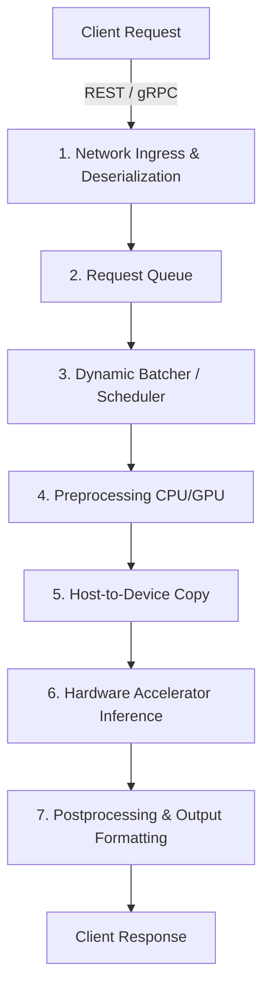

# Chapter 13: Model Serving Systems (LLMs, vLLM, Queuing Theory)

## Material Covered in This Chapter

- Model Serving
- Purpose
- 13
- Learning Objectives
- 13.1 Serving Paradigm
- Systems Perspective 13.1: The serving inversion
- Fix:
- Definition 13.1: Model serving
- 13.1.1 Static vs. dynamic inference
- 13.1.1.1 Static inference
- 13.1.1.2 Dynamic inference
- Napkin Math 13.1: The cost of latency
- Scenario A (low latency) : Batch size 1.
- Scenario B (high throughput) : Batch size 8.
- 13.1.2 The spectrum of serving architectures
- 13.1.2.1 Networked serving (cloud/data center)
- 13.1.2.2 Application-embedded serving (mobile/edge)
- 13.1.2.3 Bare-metal serving (TinyML)
- Systems Perspective 13.3: ResNet-50 across the serving spectrum
- Cloud:
- Mobile:
- TinyML:
- 13.1.3 The load balancer layer
- 13.1.4 Deterministic latency and resource isolation
- 13.2 Serving System Architecture
- 13.2.1 Internal architecture and request flow
- 13.2.2 The scheduler: Where throughput meets latency
- 13.2.3 Interface protocols and serialization
- 13.2.3.1 The serialization bottleneck
- 13.2.3.2 REST vs. gRPC
- Napkin Math 13.2: JSON vs. Protobuf serialization
- 13.3.1 The latency budget
- Definition 13.2: Latency budget
- The Physics of Latency
- Optimization Targets
- 13.3.2 Latency distribution analysis
- Napkin Math 13.4: ResNet-50: Latency budget breakdown
- Lighthouse 13.1: Lighthouse example: DLRM serving
- Napkin Math 13.5: The quantitative approach to serving
- 13.3.2.1 The serving tax bill
- 13.3.2.2 The killer microseconds problem
- 13.3.3 Resolution and input size trade-offs
- 13.3.4 Hardware utilization and request pipelining
- A. Serial Execution (Low Utilization)
- B. Pipelined Execution (High Utilization)
- 13.3.4.2 The systems metric: Hardware duty cycle
- 13.3.5.1 From logits to predictions
- 13.3.5.2 Output formatting
- 13.4 Queuing Theory
- 13.4.1 Queuing fundamentals
- 13.4.2 Little's Law
- Theorem 13.1: Little's Law
- 13.4.3 The batching tax: The latency-throughput frontier
- 13.4.4 The utilization-latency relationship
- 13.4.5 Multi-server considerations
- 13.4.5.1 When single-node analysis applies
- 13.4.6 Tail latency
- 13.4.6.1 The tail at scale problem
- Napkin Math 13.6: ResNet-50 capacity planning
- 13.4.7 Tail-tolerant techniques
- 13.4.7.1 Hedged requests
- 13.4.7.2 Tied requests
- 13.4.7.3 Canary requests
- 13.4.7.4 Graceful degradation
- 13.4.7.5 Admission control
- 13.4.7.6 Retry storm prevention
- Checkpoint 13.1: Queuing and SLO headroom
- 13.5 Model Lifecycle Management
- 13.5.1 Training-serving skew
- Definition 13.3: Training-serving skew
- Example 13.2: ResNet-50: Image preprocessing skew
- 13.5.2 Cold start and initialization dynamics
- Definition 13.4: Cold start
- 13.5.3 Loading strategies
- 13.5.4 Model caching infrastructure
- 13.5.5 Multi-model serving
- 13.5.5.1 Multi-stream execution
- 13.5.5.2 Model swapping and host memory
- 13.6 Throughput Optimization
- Definition 13.5: Dynamic batching

---

## Section-by-Section Preserve-and-Extend

# Chapter 13 Summary: Model Serving Systems

## 1. Learning Objectives
* **The Serving Inversion:** Explain the transition from throughput optimization (samples/sec in training) to tail
latency minimization (ms/request in serving) that distinguishes serving from training.
* **Latency Budget Deconstruction:** Decompose end-to-end request latency into preprocessing, neural network inference,
and postprocessing phases to identify system bottlenecks.
* **Queuing Theory & Capacity Planning:** Apply Little's Law, M/M/1, and M/D/1 queue models to calculate concurrency limits, utilization safety thresholds, and GPU provisioning requirements to satisfy percentile Service Level Objectives (SLOs).
* **Training-Serving Skew & Cold Starts:** Characterize the root causes of preprocessing skew (e.g., library resizing
mismatches) and cold starts (graph compilation, context creation), and deploy prevention and mitigation strategies
(e.g., container warmups, unified codebase paths, and caching).
* **Batching Strategies & Traffic Scenarios:** Evaluate static, dynamic, and adaptive batching against the four MLPerf
scenarios (Server, SingleStream, MultiStream, Offline) under power, thermal, and latency constraints.
* **Large Language Model (LLM) Serving Physics:** Quantify KV Cache memory constraints, compute prefill vs.
memory-bandwidth decode phases (TTFT/TPOT), and analyze optimizations including continuous batching, Speculative
Decoding, PagedAttention, and Prefix Caching.
* **Economics & Runtime Compilers:** Analyze the economics of CPU vs. GPU serving, select appropriate compilers
(TensorRT, ONNX Runtime, OpenVINO) and serialization formats (safetensors vs. pickle), and map precision levels (FP16,
INT8, AWQ) to target throughput.

---

## 2. The Serving Inversion & Deployment Spectrum
Model serving represents the transition of a static model artifact into an operational, distributed software service.
This phase inverts every key priority of training:

### 2.1 Systems Perspective (D·A·M Taxonomy)
* **Data (Information):** Training targets **Volume** (streaming and shuffling billions of historic samples). Serving
targets **Freshness** (instantaneous processing of a single, current input).
* **Algorithm (Logic):** Training math is **Mutable** (gradients flow backward to continuously update weights). Serving
math is **Frozen** (weights are static, forward pass only).
* **Machine (Physics):** Training optimizes **Utilization** (saturating GPUs at 100% to maximize aggregate throughput).
Serving prioritizes **Headroom** (operating GPUs at 40-60% utilization to absorb stochastic traffic spikes before tail
latency explodes).

```
Latency (ms)
  ^
  |                                        / (Tail Latency p99)
  |                                       /
  |                                      /
  |                                   _./
  |                             _.-''  / (Mean Latency)
  |                      _.-''        /
  |               _.-''              /
  +---------------------------------+-------------> System Utilization (\rho)
  0%                              70%           100%
```

### 2.2 The Serving Spectrum
The physical constraints of deployment (the memory wall, the power wall, and the light barrier) dictate the serving
architecture:

| Characteristic | Cloud / Data Center | Mobile / Edge | TinyML |
| :--- | :--- | :--- | :--- |
| **Latency Target** | 10–100 ms | 20–50 ms | 1–100 ms |
| **Batch Size** | 1–128 (dynamic batching) | 1 (fixed, single-stream) | 1 (fixed, no OS scheduler) |
| **Memory Capacity** | 16–80 GB VRAM | 2–8 GB shared unified memory | 256 KB–2 MB SRAM |
| **Power Envelope** | 300–700 W | 1–10 W | 1–100 mW |
| **Update Mechanism** | Container deployments / microservices | App Store updates | Firmware Over-the-Air (OTA) |
| **Failure Mode** | Automatic retry / failover | Graceful degradation | Silent failure or hardware reset |
| **Monitoring** | Full telemetry, Prometheus, logging | Limited client-side analytics | Heartbeat / ping only |

#### 2.2.1 Unified Memory & Zero-Copy Inference
In networked cloud serving, a camera frame is copied multiple times (network buffer \(\rightarrow\) CPU application RAM
\(\rightarrow\) preprocessing buffer \(\rightarrow\) GPU pinned host buffer \(\rightarrow\) GPU VRAM). In unified memory
architectures on modern SoCs (like Apple Silicon or Qualcomm Snapdragon), the camera, CPU, and NPU share physical RAM.
The camera writes directly into unified memory, and the NPU reads from that same buffer with zero memory copies,
dramatically saving bandwidth, latency, and power.

---

## 3. Serving System Architecture & Request Lifecycle
An inference server (e.g., NVIDIA Triton, TensorFlow Serving, TorchServe) functions as an asynchronous, high-concurrency
scheduler rather than a simple wrapper around model execution.



### 3.1 Network Interfaces & Serialization
The choice of interface protocol sets the lower limit of the latency budget:
* **REST (HTTP/1.1 + JSON):** High developer accessibility, but high serialization overhead. JSON requires text-to-float
parsing on CPU.
* **gRPC (HTTP/2 + Protobuf):** Strict binary schema, persistent multiplexed connections, and multiplexed streams,
reducing serialization cost by \(\approx 10\times\).
* **FlatBuffers:** Eliminates the deserialization step entirely. Tensors are accessed directly from the binary payload
buffer (zero-copy), which is vital for edge applications (e.g., TensorFlow Lite).

> [!TIP]
> **Napkin Math: JSON vs. Protobuf for a 1,000-dimensional Float Vector**
> * **JSON Wire Size:** \(\approx 9\text{ KB}$ | **CPU Parse Time:** \)\approx 50\,\mu\text{s}$
> * **Protobuf Wire Size:** \(\approx 4\text{ KB}$ | **CPU Parse Time:** \)\approx 5\,\mu\text{s}$
> * At 10,000 QPS, switching to Protobuf saves \(\approx 0.45\) CPU cores in parsing overhead alone.

### 3.2 The Latency Budget Deconstruction
> **Definition: Latency Budget**
> The total time allocated to a request, strictly bounded by the Service Level Objective (SLO). Every millisecond spent
on network, queuing, serialization, and data copies directly reduces the budget left for inference.
> \[ L_{\text{lat}} = L_{\text{lat,preprocess}} + L_{\text{lat,copy}} + L_{\text{lat,infer}} + L_{\text{lat,postprocess}} + L_{\text{lat,queue}} \]

Optimizing only the model execution ignores the largest bottlenecks. In optimized systems, CPU-based preprocessing
(decoding JPEG, tokenizing text) can consume 60-70% of the budget.

#### 3.2.1 Lighthouse Latency Profiles: ResNet-50 vs. DLRM
* **ResNet-50 (Compute-Bound Classifier):**
  * Preprocessing (JPEG Decode + Crop + Normalization): \(4.5\text{ ms}\) (\(45\%\))
  * CPU \(\rightarrow\) GPU Copy: \(0.5\text{ ms}\) (\(5\%\))
  * Model Inference (GPU Forward Pass): \(5.0\text{ ms}\) (\(50\%\))
  * Postprocessing (Softmax + Top-5): \(0.1\text{ ms}\) (\(1\%\))
  * **Total Latency:** \(10.1\text{ ms}\)
  * *Amdahl's Law implication:* Speeding up inference by \(10\times\) (\(5\text{ ms} \rightarrow 0.5\text{ ms}\)) only
yields a \(1.8\times\) end-to-end latency reduction (\(10.1\text{ ms} \rightarrow 5.6\text{ ms}\)). Moving preprocessing
to the GPU (e.g., using NVIDIA DALI) resolves this.

* **Deep Learning Recommendation Model (DLRM) (Memory-Bandwidth & Capacity Bound):**
  * Request Parsing & Preprocessing: \(0.5\text{ ms}\)
  * Embedding Lookup (Terabyte-scale tables in DRAM/HBM): \(6.0\text{ ms}\)
  * Multilayer Perceptron (MLP) Forward Pass: \(1.5\text{ ms}\)
  * Postprocessing (Ranking & Filtering): \(1.0\text{ ms}\)
  * **Total Latency:** \(9.0\text{ ms}\)
  * MLP compute represents only \(\approx 16.7\%\) of total latency. The system bottleneck is the memory bandwidth to
retrieve massive 128-dimensional embedding vectors.

### 3.3 Resolution Trade-Offs & Roofline Analysis
Model arithmetic intensity scales with input resolution. Increasing resolution shifts models along the Roofline curve:

| Resolution | Activation Size | Arithmetic Intensity | Bottleneck |
| :--- | :--- | :--- | :--- |
| **\(224 \times 224\)** | 12.5 MB | 85 FLOPs/byte | Compute-Bound |
| **\(384 \times 384\)** | 36.8 MB | 49 FLOPs/byte | Compute-Bound |
| **\(512 \times 512\)** | 65.5 MB | 28 FLOPs/byte | Compute-Bound |
| **\(640 \times 640\)** | 102.4 MB | 18 FLOPs/byte | Near Roofline Ridge |

At resolutions above \(640 \times 640\), the activation sizes exceed cache capacities, dropping arithmetic intensity
below the hardware's ridge point (e.g., 16 FLOPs/byte on V100), making the model memory-bandwidth bound.

### 3.4 Request Pipelining & Hardware Duty Cycle
To keep hardware accelerators saturated, high-performance systems overlap I/O and compute. While the GPU executes
inference for request \(N\), the CPU preprocesses request \(N+1\) and postprocesses request \(N-1\).
\[ \text{GPU Duty Cycle} = \frac{\text{Time GPU is Active}}{\text{Total Wall-Clock Time}} \]
Pipelining raises the GPU duty cycle close to 100%, effectively doubling throughput under continuous load.

```
A. Serial Execution (Low GPU Duty Cycle):
| Preproc 1 | GPU 1 | Postproc 1 | Idle | Preproc 2 | GPU 2 | Postproc 2 |

B. Pipelined Execution (High GPU Duty Cycle):
| Preproc 1 | Preproc 2 | Preproc 3 | Preproc 4  |
|           | GPU 1     | GPU 2     | GPU 3      |
|           |           | Postproc 1| Postproc 2 |
```

### 3.5 Postprocessing Implementation
Listing 13.1 shows a typical CPU/GPU postprocessing pipeline converting classification logits into a calibrated API
payload:

```python
# Listing 13.1: ResNet-50 Postprocessing Pipeline
import torch

# Input: raw logits tensor of shape (batch_size, 1000) from GPU
def postprocess(logits, IMAGENET_CLASSES):
    # Step 1: Calibrate logits via Softmax (runs on GPU)
    probs = torch.softmax(logits, dim=-1) # ~0.05 ms

    # Step 2: Extract top-5 classes (runs on GPU)
    top5_probs, top5_indices = probs.topk(5) # ~0.02 ms

    # Step 3: Map indices to text labels (runs on CPU)
    top5_probs_cpu = top5_probs.cpu().tolist()[0]
    top5_indices_cpu = top5_indices.cpu().tolist()[0]

    labels = [IMAGENET_CLASSES[idx] for idx in top5_indices_cpu] # ~0.01 ms

    # Step 4: Serialize response JSON
    response = {
        "predictions": [
            {"label": label, "confidence": float(prob)}
            for label, prob in zip(labels, top5_probs_cpu)
        ],
        "model_version": "resnet50-v2.1",
        "inference_time_ms": 5.2
    }
    return response
```

---

## 4. Queuing Theory & Capacity Planning
Serving workloads face stochastic arrival patterns. Queuing theory provides the mathematical tools to size serving
infrastructure.

### 4.1 Little's Law
In any stable queuing system, Concurrency (\(N_{\text{req}}\)) is the product of Arrival Rate (\(\lambda\)) and system
Latency (\(T_{\text{lat}}\)):
\[ N_{\text{req}} = \lambda \cdot T_{\text{lat}} \]
If a system must support \(\lambda = 1,000\text{ QPS}\) with a latency target of \(T_{\text{lat}} = 50\text{ ms}\), the
system must maintain capacity for $50$ concurrent requests. This concurrency directly dictates the VRAM allocation for
activations.

### 4.2 The Utilization-Latency Relationship
In an M/M/1 queue model (Poisson arrivals, exponential service time), the average time in system (\(E[T]\)) scales
nonlinearly with system utilization (\(\rho = \lambda / \mu\)):
\[ E[T] = \frac{1}{\mu} \cdot \frac{1}{1 - \rho} \]
where \(\mu\) is the service rate.

| Utilization (\(\rho\)) | Latency Multiple (\(E[T] / \text{Service Time}\)) | Example (5 ms base service) |
| :--- | :--- | :--- |
| **50%** | $2.0\times$ | 10 ms |
| **70%** | $3.3\times$ | 17 ms |
| **80%** | $5.0\times$ | 25 ms |
| **90%** | $10.0\times$ | 50 ms |
| **95%** | $20.0\times$ | 100 ms |

As utilization approaches 100%, queue lengths and waiting delays diverge exponentially. In practice, because ML model inference time is near-deterministic, the M/D/1 queue model is more accurate, yielding approximately half the queuing delay of M/M/1. Using M/M/1 equations provides a conservative safety margin.

### 4.3 Tail Latency (p99)
Production systems are provisioned to meet percentile SLOs (p95, p99). Under M/M/1 assumptions:
\[ W_{\text{p99}} \approx \frac{\ln(100) \cdot \text{Service Time}}{1 - \rho} \approx \frac{4.6 \cdot \text{Service Time}}{1 - \rho} \]
At 70% utilization, the p99 latency is \(\approx 15.3\times\) the raw service time, while the mean latency is only
\(3.3\times\).

#### 4.3.1 Tail at Scale
When user requests fan out to multiple model servers in parallel, the probability \(P_{\text{slow}}\) of experiencing a
tail latency delay increases exponentially with server count \(c\):
\[ P_{\text{slow}} = 1 - (1 - p)^c \]
where \(p\) is the probability of an individual node being slow (e.g., \(p=0.01\) for p99). For a fan-out of \(c=100\)
servers, \(P_{\text{slow}} = 1 - (0.99)^{100} \approx 63\%\), meaning a majority of users will experience tail
latencies.

### 4.4 Tail-Tolerant Techniques
* **Hedged Requests:** If a request does not complete within the 95th percentile latency threshold, spawn a duplicate
request to an alternative replica. The client accepts whichever returns first and cancels the other. This reduces tail
latency at a cost of \(\approx 5\%\) extra compute.
* **Tied Requests:** Send requests to two replicas simultaneously with a shared cancellation tag. When replica A begins
processing, it cancels the queued duplicate on replica B, eliminating wait queues without doubling workload.
* **Canary Requests:** For large fan-out requests, query a tiny subset of backends first. If they respond quickly, query
the rest; otherwise, retry or degrade early.
* **Admission Control:** If the queue depth exceeds a safe limit (e.g., \(2.5\times\) concurrent worker capacity),
immediately reject incoming requests with HTTP 503 (service unavailable) to protect the latency of in-flight requests.
* **Retry Storm Prevention:** Implement randomized exponential backoff with jitter and token-bucket limits to prevent
failed requests from triggering cascading queue collapse.

---

## 5. Model Lifecycle Management

### 5.1 Training-Serving Skew
> **Definition: Training-Serving Skew**
> A divergence in model prediction accuracy between training and serving environments caused by differences in data
preprocessing pipelines.

* **Interpolation Differences:** Training in PyTorch/PIL uses `BILINEAR` resizing, while serving in OpenCV uses
`INTER_LINEAR`. This pixel-level divergence can cause a \(0.5\% - 1.0\%\) drop in production accuracy.
* **Color Channels:** Training on RGB, but feeding BGR in production due to different video decoders.
* **Normalization Mismatches:** Mismatch in scaling (division by 255.0 vs. 256.0 or mean subtraction).
* **Prevention:** Standardize preprocessing via serializable pipeline graphs (e.g., NVIDIA DALI, ONNX preprocessing
graphs) or reuse identical code wrappers across training and serving.

### 5.2 Cold Start Dynamics
> **Definition: Cold Start**
> The total latency overhead incurred when initializing a new model replica from scratch.
> \[ T_{\text{cold}} = T_{\text{load}} + T_{\text{context}} + T_{\text{compile}} + T_{\text{warmup}} \]

* **Weight Loading (\(T_{\text{load}}\)):** Transferring weight tensors from cloud storage (e.g., S3) or disk into VRAM.
* **Context Creation (\(T_{\text{context}}\)):** Initializing the CUDA driver context, allocating memory pools, and
preparing stream queues (\(\approx 0.3 - 0.5\text{ s}\)).
* **Graph Compilation (\(T_{\text{compile}}\)):** Creating hardware-optimized engine files. TensorRT engine compilation
can take over 30 seconds.
* **Warmup (\(T_{\text{warmup}}\)):** Executing several dummy inputs to trigger lazy compilation of kernels and
initialize the memory allocator pool. Without warmup, the first live request absorbs this cost and runs up to
\(100\times\) slower.

### 5.3 Resource Partitioning
When executing multiple models or replicas on a single physical accelerator:
* **Multi-Instance GPU (MIG):** Partitions a physical GPU (A100, H100) into up to seven hardware-isolated instances.
Each instance has dedicated Streaming Multiprocessors (SMs), L2 cache, and HBM controllers, eliminating "noisy neighbor"
performance jitter.
* **CUDA Multi-Process Service (MPS):** Software-level multiplexing that packs kernels from multiple CPU processes into
a single shared CUDA context. It increases SM utilization but lacks hardware-enforced memory and cache partitioning.
* **Model Swapping:** If models exceed VRAM, swap weights between CPU DRAM and GPU VRAM via the PCIe bus. Swapping a 10
GB model over PCIe Gen4 x16 ($32\text{ GB/s}$) takes:
  \[ T_{\text{swap}} = \frac{10\text{ GB}}{32\text{ GB/s}} \approx 312\text{ ms} \]
  To achieve maximum PCIe throughput, host memory must be page-locked (**pinned memory** via `mlock`) so that the GPU's
Direct Memory Access (DMA) engine can read it directly without CPU intervention.

---

## 6. Throughput Optimization & Batching
Dynamic batching is the primary lever of serving economics, converting memory-bandwidth-bound single-request execution
into compute-bound batch execution.

### 6.1 Dynamic Batching Mechanics
GPUs are highly parallel architectures. Executing a model at Batch Size \(B=1\) leaves the majority of compute units
idle. Batching amortizes two critical overheads:
1. **Kernel Launch Overhead:** Preparing and launching a GPU kernel takes \(5 - 20\,\mu\text{s}\) on the CPU. A 50-layer
network requires 50 launches, accumulating up to \(1\text{ ms}\) of pure launch delay. Batching aggregates multiple
requests under a single sequence of kernel launches.
2. **Weight Loading:** Amortizes the memory bandwidth cost of pulling weights from VRAM to SRAM. At \(B=1\), the GPU
fetches all parameters to compute on one input; at \(B=32\), it fetches the same parameters to compute on 32 inputs.

```
V100 ResNet-50 Performance Curve:
Batch Size 1:  Inference = 5.0 ms | Throughput = 200 img/s  | GPU Util = 15%
Batch Size 4:  Inference = 7.2 ms | Throughput = 556 img/s  | GPU Util = 42%
Batch Size 8:  Inference = 9.1 ms | Throughput = 879 img/s  | GPU Util = 65%
Batch Size 16: Inference = 14.0 ms| Throughput = 1143 img/s | GPU Util = 85%
Batch Size 32: Inference = 25.0 ms| Throughput = 1280 img/s | GPU Util = 95%
```

### 6.2 Dynamic Batching Math & Heuristics
Dynamic batching introduces a queuing delay (\(L_{\text{lat,wait}}\)) while buffering requests within a window \(T\).
The total latency is:
\[ L_{\text{lat}} = L_{\text{lat,wait}} + L_{\text{lat,compute}}(B) \]
For Poisson traffic with arrival rate \(\lambda\):
* The average wait time is:
  \[ E[L_{\text{lat,wait}}] = \frac{T}{2} \]
* The number of requests in a batch follows a Poisson distribution with mean:
  \[ E[B] = \lambda \cdot T \]
* The achieved throughput is:
  \[ \text{Throughput} = \frac{E[B]}{T_{\text{service}}(E[B])} \]
* Under a latency SLO target \(L_{\text{lat,target}}\), the maximum allowable batch size is:
  \[ B_{\text{max}} = \max \left\{ B: \frac{T}{2} + S(B) \le L_{\text{lat,target}} \right\} \]
  where $S(B)$ is the inference service time for batch size \(B\).

> [!IMPORTANT]
> **SLO Violations & Poisson Tails**
> Provisioning based on mean values causes SLO violations due to Poisson traffic variance. The worst-case latency must
account for a full window wait \(T\) and the \(p99\) batch size \(b_{\text{p99}}\):
> \[ L_{\text{lat,p99}} \approx T + S(b_{\text{p99}}) \]

### 6.3 Adaptive Batching Window
A fixed batching window wastes latency budget during high traffic. Listing 13.2 details an adaptive batching timeout:

```python
# Listing 13.2: Adaptive Batching Window
def adaptive_batching_window(queue_depth, arrival_rate, slo_ms):
    target_batch_size = 16

    # Fast path: if target batch size is met, execute immediately
    if queue_depth >= target_batch_size:
        return 0.0

    # Allocate 30% of the latency budget to batch formation queue
    max_wait_ms = slo_ms * 0.3

    if arrival_rate > 0:
        requests_needed = target_batch_size - queue_depth
        # Estimate time to accumulate target batch size
        estimated_wait_ms = (requests_needed / arrival_rate) * 1000.0
        return min(estimated_wait_ms, max_wait_ms)

    return max_wait_ms
```

### 6.4 Batching Pareto Frontier
Tuning batch parameters maps to a Pareto frontier of latency vs. throughput:

| Window (\(T\)) | Max Batch | Avg Latency | p99 Latency | Throughput | Mode |
| :--- | :--- | :--- | :--- | :--- | :--- |
| **2 ms** | 16 | 8 ms | 18 ms | 890 img/s | Ultra-low latency |
| **5 ms** | 32 | 10 ms | 22 ms | 1,140 img/s | Balanced |
| **10 ms** | 32 | 15 ms | 35 ms | 1,240 img/s | Moderate latency |
| **20 ms** | 64 | 23 ms | 52 ms | 1,310 img/s | Throughput-optimized |
| **50 ms** | 128 | 38 ms | 98 ms | 1,350 img/s | Max throughput |

---

## 7. Large Language Model (LLM) Serving

### 7.1 Prefill vs. Decode Physics
LLM request execution splits into two distinct operational phases:
1. **Prefill Phase (Input Processing):** Computes key-value vectors for the prompt tokens in parallel. This phase is
**compute-bound** because the arithmetic intensity is high, allowing effective GPU utilization.
2. **Decode Phase (Autoregressive Token Generation):** Generates output tokens one by one. Each step is
**memory-bandwidth bound** because the model must read all parameters from HBM once to generate a single token
(arithmetic intensity $\approx 1\,\text{FLOP/byte}$).

```
LLM Latency Metrics:
TTFT (Time to First Token) = Prefill Time + System Overhead
TPOT (Time Per Output Token) = Decode Step Time
```

\[ T_{\text{token}} \approx \frac{\text{Model Weights (Bytes)}}{\text{Memory Bandwidth (Bytes/s)}} \]

> [!TIP]
> **LLM Memory Wall Calculations**
> Serving Llama-3-8B (quantized to 4-bit, size = \(3.5\text{ GB}\)) on a single H100 SXM5 ($3.35\text{ TB/s}$ HBM3):
> * Theoretical memory read limit: $3.5\text{ GB} / 3.35\text{ TB/s} \approx 1\text{ ms}$.
> * Accounting for attention layers and kernel launches, production \(T_{\text{token}} \approx 10\text{ ms}\).
> * Total generation time for 256 tokens \(\approx 2.56\text{ seconds}\).
> * Adding compute cores will not speed up decode; only HBM bandwidth speedups can reduce \(T_{\text{token}}\).

### 7.2 Continuous Batching & KV Cache Memory Management
Traditional dynamic batching commits to a fixed batch size for the entire generation process. Because LLM output lengths
vary widely, static batching wastes resources when early sequences complete and leave slots idle.

* **Continuous Batching (Iteration-Level Batching):** Reschedules the batch at every token-generation step. Completed
sequences leave the batch immediately, and new requests join the active batch at step boundaries.
* **PagedAttention (Virtual Memory for KV Cache):** Autoregressive models cache Key-Value (KV) attention states to avoid
redundant prefill math. Contiguous allocation leads to severe memory fragmentation, wasting \(40-50\%\) of VRAM.
PagedAttention divides the KV Cache into non-contiguous fixed-size blocks (pages, e.g., 16 tokens). Logical memory
addresses map to physical pages, reducing VRAM waste to \(<4\%\), which increases the concurrent batch capacity by
\(2-4\times\).

```
Static Batching Allocation (Contiguous, Fragmented):
[Seq 1: 50/100 tokens] [Free Space: 50] | [Seq 2: 80/100 tokens] [Free Space: 20]

PagedAttention Allocation (Non-Contiguous Pages):
[Page A (Seq 1)] -> [Page B (Seq 2)] -> [Page C (Seq 1)] -> [Page D (Seq 2)]
```

* **Prefix Caching:** Stores the KV cache of static instruction prefixes (system prompts, large RAG contexts). Future
requests with matching headers skip the prefill phase compute, reading states directly from memory.

---

## 8. Runtime Selection & Precision Optimization

### 8.1 Runtime Compilers
The execution layer maps the model representation to physical silicon instructions:
* **ONNX Runtime:** Hardware abstraction runtime. Standardizes graph optimizations (constant folding, dead node
elimination) across heterogeneous hardware backends (CPU, NPU, GPU via Execution Providers).
* **TensorRT (NVIDIA GPUs):** Compiles static graph engines optimized for specific GPU architectures.
* **OpenVINO (Intel CPUs/NPUs):** Intel-specific compiler that maps operators directly to vector operations (AVX-512,
AMX).

#### 8.1.1 Graph Optimizations
* **Operator Fusion:** Combines adjacent layers (e.g., `Conv2D` \(\rightarrow\) `BiasAdd` \(\rightarrow\) `ReLU`) into a
single GPU kernel. This avoids writing intermediate tensors to global HBM memory, keeping activations in registers or
L1/L2 cache.
* **Constant Folding:** Evaluates static mathematical subtrees (e.g., normalization constant divisions) during
compilation, replacing operations with hardcoded outputs.

### 8.2 Precision Selection & Quantization Impact
Quantizing weights decreases model footprint and memory bandwidth requirements. However, quantization accuracy loss
depends on layer-specific sensitivity:
\[ \epsilon_{\text{quant}} \propto \alpha \cdot \|W\|_2 \cdot 2^{-b} \]
where \(\alpha\) is the layer sensitivity coefficient, $\|W\|_2$ is the weight L2 norm, and \(b\) is the quantization
bit-width.

```
V100 ResNet-50 Performance across Precision levels:
FP32:       Latency = 2.8 ms | Size = 98 MB | Accuracy = 76.13% | Tensor Core Util = 0%
FP16:       Latency = 1.4 ms | Size = 49 MB | Accuracy = 76.13% | Tensor Core Util = 85%
INT8 (PTQ): Latency = 0.9 ms | Size = 25 MB | Accuracy = 75.80% | Tensor Core Util = 92%
INT8 (QAT): Latency = 0.9 ms | Size = 25 MB | Accuracy = 76.05% | Tensor Core Util = 92%
```

---

## 9. Economics & Capacity Planning

### 9.1 Unit Cost per Inference
Economic viability requires balancing instance hourly rates with throughput capacity:
\[ \text{Cost per Million Inferences} = \frac{\text{Hourly Instance Rate}}{\text{Inferences per Hour}} \cdot 1,000,000 \]

* **c5.xlarge (CPU):** Rate = \(\$0.17/\text{hr}$ | Throughput = \)50\text{ req/s}$ | Cost/1M = $\$0.94$
* **g4dn.xlarge (T4 GPU):** Rate = \(\$0.53/\text{hr}$ | Throughput = \)400\text{ req/s}$ | Cost/1M = $\$0.37$
* **p3.2xlarge (V100 GPU):** Rate = \(\$3.06/\text{hr}$ | Throughput = \)1,200\text{ req/s}$ | Cost/1M = $\$0.71$

The T4 GPU provides the optimal economic sweet spot for this classification workload due to its high efficiency relative
to cost.

### 9.2 Case Study: Capacity Planning for ResNet-50 serving 5,000 QPS
* **Goal:** Serve \(5,000\text{ QPS}\) under a \(50\text{ ms}\) p99 Latency SLO.
* **Constraints:** Model inference time is \(5\text{ ms}\).
1. **Derive Utilization Limits:** Using M/D/1 queuing models (deterministic service), the safe utilization threshold is
established at \(\rho \le 72\%\) (maintaining headroom to satisfy the \(50\text{ ms}\) p99 SLO under stochastic load).
2. **Compute Required aggregate throughput:**
   \[ \lambda_{\text{required}} = \frac{5000}{0.72} \approx 6,944\text{ QPS} \]
3. **Determine GPU count:** A single V100 GPU running TensorRT at \(B=16\) delivers $1,143\text{ img/s}$.
   \[ \text{GPUs Needed} = \frac{6,944}{1,143} \approx 6.1 \rightarrow 7\text{ GPUs} \]
4. **Provision for Headroom & Fault Tolerance (\(N+1\)):** Add \(30\%\) headroom for traffic spikes: \(7 \times 1.3 =
9.1 \rightarrow 10\text{ GPUs}\). If one GPU fails, the remaining $9$ handle the load at:
   \[ \rho_{\text{failed}} = \frac{5000 / 1143}{9} \approx 48.6\% \]
   which is well below the \(72\%\) safe utilization limit.
* **Result:** Provision $10$ V100 GPU nodes.

---

## 10. Fallacies & Pitfalls
* **The Inference Fallacy:** *Believing that reducing model inference latency yields a proportional reduction in
end-to-end user latency.* In reality, queuing delays under high utilization and CPU-based preprocessing (e.g., JPEG
decoding) dominate total latency.
* **The 90% Utilization Pitfall:** *Sizing serving infrastructure to operate at 90% utilization to maximize cost
efficiency.* In production, this causes tail latency (p99) to explode nonlinearly. Systems must target 60-70%
utilization at peak load.
* **The Offline Validation Fallacy:** *Assuming validation accuracy on static test sets guarantees accuracy in
production.* Divergences in preprocessing (e.g., PIL bilinear vs. OpenCV linear scaling) create training-serving skew,
degrading accuracy silently.
* **The Average Latency Pitfall:** *Using mean latency to measure SLO compliance.* Averages mask the tail behavior (p99)
where the worst-performing 1% of requests violate latency budgets and degrade user experience.

---

## Full Slice Content (Docling Extract, Preserved Verbatim)

> Each section below preserves the source slice content as extracted by docling. Image placeholders are removed; tables,
equations, code blocks, named artifacts, and footnotes are kept intact.

## Model Serving

## Purpose

Why does serving invert every optimization priority that made training successful? Training and serving demand opposite
physics. Training maximizes throughput ( 𝑋, in samples per second): large batches and long epochs where latency spikes
get absorbed invisibly. Serving minimizes latency ( 𝐿 lat, in milliseconds per request): individual requests answered
fast enough that a single slow response is a broken product . Training amortizes hardware costs across billions of
examples; serving pays a tax on every request, where small inefficiencies compound into operational debt. This inversion
is why models that train beautifully often serve poorly: the batch-heavy architectures and memory-intensive
optimizations designed to saturate accelerators during training are fundamentally ill-suited for the bursty,
latency-critical, cost-sensitive reality of production traffic. Serving, however, is more than a latency problem. A
serving system must handle traffic that varies by orders of magnitude between peak and trough, route requests across
model versions during progressive rollouts, degrade gracefully when upstream dependencies fail, and do all of this
continuously-not for the duration of a training run but for the lifetime of the product. Every model that proved its
value during training and survived compression and benchmarking eventually arrives at the serving layer-the deployment
and integration stage of the ML lifecycle-where the question shifts from 'does it work?' to 'does it work reliably, at
scale, under production conditions, every second of every day ?' The serving infrastructure is where ML systems finally
meet users, and the engineering that sustains that meeting is qualitatively different from the engineering that created
the model.

## 13

13.1 Serving Paradigm 13.2 Serving System Architecture 13.3 Request Lifecycle 13.4 Queuing Theory 13.5 Model Lifecycle
Management 13.6 Throughput Optimization 13.7 LLM Serving 13.8 Inference Runtime Selection 13.9 Node-Level Optimization
13.10Economics and Planning 13.11Fallacies and Pitfalls 13.12Summary

## Learning Objectives

- Explain the inversion from throughput optimization to latency minimization that distinguishes serving from training
- Decompose request latency into preprocessing, inference, and postprocessing phases to identify bottlenecks using the
latency budget framework
- Apply queuing theory (Little's Law, M/M/1 models) and capacity planning to meet percentile latency SLOs
- Identify sources of training-serving skew and cold start latency, and select appropriate prevention and mitigation
strategies
- Select batching and runtime strategies based on traffic patterns (Server, SingleStream, MultiStream, Offline), latency
constraints, and cost requirements
- Evaluate memory-bandwidth and KV-cache constraints unique to LLM serving (TTFT/TPOT, continuous batching,
PagedAttention)
- Evaluate deployment trade-offs across precision, runtime selection, and infrastructure cost

## 13.1 Serving Paradigm

S erving marks the transition from model development to production deployment. The four deployment paradigms introduced
in Chapter 2 (Cloud, Edge, Mobile, and TinyML) each impose distinct serving challenges, but all share a common
inversion: the throughput-tolatency shift introduced in the Purpose. This inversion has concrete engineering
implications that ripple through every technique established in prior chapters. The iron law of ML systems (Section 1.7)
undergoes a decisive shift: the latency term (𝐿 lat ) , representing the irreducible overhead of request scheduling,
network round-trips, and system orchestration, becomes the dominant constraint rather than a rounding error. Chapter 12
measured performance under controlled conditions, but serving faces traffic patterns that no benchmark could anticipate;
Chapter 10 provided quantization methods that reduced model size, but serving must confirm those optimizations preserve
accuracy under real traffic distributions. These revalidations define the serving inversion .

## Systems Perspective 13.1: The serving inversion

Applying the D·A·M taxonomy reveals how deployment inverts the engineering priorities:

- Data (Information) : In training, the goal is Volume (shuffling billions of samples). In serving, the goal is
Freshness (processing one request right now ).
- Algorithm (Logic) : In training, the math is Mutable (updating weights via backprop). In serving, the math is Frozen
(fixed weights, forward pass only).
- Machine (Physics) : In training, the goal is Utilization (keeping GPUs at 100 percent to saturate throughput). In
serving, the goal is Headroom (keeping GPUs at 40-60 percent to absorb traffic spikes before tail latency explodes;
observe the exponential rise in Figure 13.1).

The consequences of ignoring this inversion become apparent during a traffic spike that pushes the system beyond what it
was designed to handle.

Example 13.1: The 'Black Friday' traffic spike

The scenario: An e-commerce recommendation system runs comfortably at 50 ms latency with 1,000 queries per second (QPS).
The event: On Black Friday, traffic spikes 10 × to 10,000 QPS.

Failure: The system does not slow down 10 × . It collapses . Latency hits 10 seconds, then requests start timing out.
The servers are 100 percent utilized, but useful throughput drops to near zero because most completed requests have
already timed out from the client's perspective. Physics: This is Little's Law and queueing theory in action. As
utilization approaches 100 percent, queue lengths diverge nonlinearly rather than linearly. The system spends more time
managing the queue (context switching, thrashing) than doing useful work.

## Fix:

1. Load Shedding: Reject excess requests immediately to keep the queue short.
2. Autoscaling: Spin up more replicas before utilization hits the 'knee' of the curve.
3. Degradation: Serve cached/dumber recommendations to reduce compute cost per query.

50

Figure 13.1: The Tail Latency Explosion: Request latency vs. system utilization (ρ). While mean latency (blue) remains
moderate, tail latency (red, p99) explodes once utilization passes the knee at ~70 percent. This uses a simple M/M/1
approximation (p99 ≈ 4.6× mean), so the curve is illustrative rather than workload-specific.

Trace the curve in Figure 13.1 and notice how latency remains manageable until utilization crosses roughly 70 percent,
then explodes-this is why production systems must run at relatively low utilization (40-60 percent) to guarantee stable
tail latency (p99). For a mathematical treatment of long-tailed distributions and why P99 latency dominates the user
experience at scale, see Section B.2.1. The curve is a simple queueing approximation intended for intuition rather than
a specific workload.

These priorities motivate a formal definition of model serving.

Beyond the technical limits of latency, the economics of serving have undergone a radical transformation. As models
become more efficient and hardware becomes more specialized, the cost of 'intelligence' is collapsing 1 . To grasp the
speed of this collapse, examine the log-scale price trajectory in Figure 13.2, which tracks public API list prices as a
market proxy.

## Definition 13.1: Model serving

Model Serving is the operational phase that provides model predictions to end-users or downstream systems under strict
latency constraints.

1 Jevons Paradox: William Stanley Jevons observed in 1865 that efficiency improvements in coal-powered steam engines
increased total coal consumption by making steam power economically viable for applications previously too costly. The
same dynamic governs AI inference: each 10 × cost reduction opens application classes that were economically infeasible
at the previous price point, expanding aggregate demand by more than the efficiency gain. This is why cheaper inference
reliably increases, not decreases, total GPU fleet demand-efficiency and demand are complements in AI, not substitutes.

2 Service Level Objective (SLO) vs. Service Level Agreement (SLA) : An SLO is an internal target (for example, 'p99
latency under 50 ms'); an SLA is an external contractual commitment with financial penalties for violation. SLOs are set
tighter than SLAs to provide a safety margin. For ML serving, both model accuracy and inference latency contribute to
SLOs, creating multi-dimensional optimization targets where improving one dimension (for example, deploying a larger
model for accuracy) can violate the other (latency).

Year

Figure 13.2: Intelligence Deflation: Representative public API input-token list prices per 1M tokens (USD) over time
(Log Scale). Prices are model-version snapshots collected from the public pricing pages of OpenAI, Anthropic, Google,
and DeepSeek between 2020 and 2025 and are intended as a market trend indicator, not a controlled or current-price
comparison. API token-processing prices have collapsed by multiple orders of magnitude, transforming the economics of
automated AI workflows.

1. Significance (quantitative) : It inverts the throughput priority ( 𝜂 hw ) of training into a latency constraint (𝐿
lat ) , requiring an architectural stack designed to minimize the tail latency (p99) of individual inferences.
2. Distinction (durable) : Unlike model training, which processes large, predictable batches of data, model serving must
handle stochastic request patterns and unpredictable load.
3. Common pitfall: Afrequent misconception is that serving is 'just the forward pass.' In reality, it is a distributed
system problem: the model execution is only one component of a stack that includes request routing, load balancing, and
data transformation.

The SLO 2 defines the latency target that shapes every architectural decision in the serving stack. Serving systems must
execute a complete inference pipeline under latency constraints, not just the neural network computation. A common
misconception is that 'inference time' equals 'serving time,' but the neural network is only one stage in a longer
pipeline. Follow the stages in Figure 13.3 from left to right: raw inputs pass through preprocessing (traditional
computing), neural network inference (deep learning), and postprocessing (traditional computing) before producing final
outputs. Any of these stages can become the latency bottleneck. Section 13.3.1 quantifies exactly where time goes,
revealing a counterintuitive result about which stages dominate.

Figure 13.3: The Inference Pipeline: MLserving systems transform raw inputs into final outputs through sequential
stages: preprocessing, neural network computation, and postprocessing. The neural network represents just one component;
preprocessing and postprocessing rely on traditional computing and often dominate total latency in optimized systems.

This chapter develops the engineering principles needed to orchestrate this pipeline under production constraints. It
first establishes the system fundamentals: serving architectures, server anatomy, and the protocols connecting clients
to models. It then traces the request lifecycle to reveal where latency accumulates, and turns to the optimization
strategies that maximize throughput under these constraints.

## 13.1.1 Static vs. dynamic inference

The preceding examples explain why serving systems must maintain capacity headroom. However, before optimizing how to
reduce inference latency, a prior question must be addressed: when should predictions be computed at all? The first
architectural decision in any serving system is whether predictions happen before or during user requests (Google 2024).
This choice shapes system design, cost structure, and capability boundaries.

## 13.1.1.1 Static inference

Static inference (also called offline or batch inference) precomputes predictions for anticipated inputs and stores them
for retrieval. Consider a recommendation system that generates predictions for all user-item pairs nightly. When a user
requests recommendations, the system retrieves precomputed results from a lookup table rather than running inference.
This approach eliminates inference latency entirely since results already exist, enables quality verification before
deployment, and reduces serving costs. However, static inference cannot handle novel inputs that were not anticipated
during the batch computation and introduces hours or days of latency when models update (Crankshaw et al. 2020).

## 13.1.1.2 Dynamic inference

Dynamic inference (also called online or real-time inference) computes predictions on demand when requests arrive. This
handles any input, including rare edge cases and novel combinations, and immediately reflects model updates. The cost is
strict latency requirements that constrain model complexity and demand robust monitoring infrastructure.

The choice between static and dynamic serving has direct economic implications. Stricter latency requirements directly
translate into higher infrastructure costs, and quantifying the cost of latency in dollar terms reveals how much
infrastructure premium each millisecond of latency reduction demands.

For our ResNet-50 image classifier, consider two deployment scenarios. A static approach suits a photo organization app
that preclassifies all images in a user's library overnight. With 10,000 photos and 5 ms inference each, batch
processing takes ~50 seconds total, and users see instant classification when browsing. A dynamic approach suits a
content moderation API that must classify user-uploaded images in real-time, with each image requiring the full
preprocessing→inference→postprocessing pipeline and a 100 ms latency budget. Most production image classification
systems use a hybrid approach: frequently requested images (popular products, known memes) are preclassified and cached,
while novel uploads trigger dynamic inference.

## Napkin Math 13.1: The cost of latency

Latency constraints directly dictate infrastructure costs. Consider a GPU server renting for USD 4/hour.

## Scenario A (low latency) : Batch size 1.

- Latency: 5 ms.
- Throughput: 200 req/s.
- Cost per million queries: USD 5.56 .

## Scenario B (high throughput) : Batch size 8.

- Latency: 10 ms (doubled due to batching overhead).
- Throughput: 800 req/s (quadrupled due to parallel efficiency).
- Cost per million queries: USD 1.3889 .

Trade-off: Reducing latency from 10 ms to 5 ms increases the hardware bill by 300 percent . Engineers must quantify
whether that 5 ms speedup generates enough business value to justify the 4 × cost increase.

The static-vs.-dynamic decision is the first of several architectural choices that shape serving system design. Equally
important is where the model executes, since deployment context constrains every subsequent optimization.

Most production systems combine both approaches. Common queries hit a cache populated by batch inference while uncommon
requests trigger dynamic computation. Understanding this spectrum matters because it determines which subsequent
optimization strategies apply. Static inference optimizes for throughput during batch computation and storage efficiency
for serving. Dynamic inference optimizes for per-request latency under concurrent load, which requires understanding
where time goes within each request.

Systems Perspective 13.2: Looking ahead: The rise of inference-time compute (System 2) Traditional serving optimizes for
minimizing latency (𝐿 lat →0) . Emerging 'Reasoning Models' (like OpenAI o1) invert this goal, deliberately spending
more compute cycles ('thinking') to improve answer quality. Individual token generation remains memory-bandwidth bound,
but these models generate far more tokens per request (often 10-100 × more internal reasoning tokens), dramatically
increasing the total compute and energy spent per query. The aggregate effect brings 'Training-like' compute budgets
into the Serving phase, even though each token is still governed by the memory wall.

## 13.1.2 The spectrum of serving architectures

Although 'serving' often implies a networked server processing API requests, the architectural pattern varies
drastically by deployment environment. Section 2.1 introduced the four deployment paradigms (Cloud, Edge, Mobile, and
TinyML) and the physical constraints (the light barrier, the power wall, and the memory wall) that give rise to them.
Those constraints do not disappear at serving time; they intensify, because serving adds latency SLOs and cost pressure
on top of the hardware limits that training could absorb through patience. The same model may require radically
different serving strategies depending on where it executes.

## 13.1.2.1 Networked serving (cloud/data center)

The model runs as a standalone service (microservice), the deployment paradigm Section 2.6 characterized as trading
latency for virtually unlimited compute. The primary interface is the network (HTTP/gRPC). Optimization focuses on
throughput (batching) and concurrency.

- Key Constraint: Network bandwidth and serialization cost.
- Typical Hardware: NVIDIA GPUs (V100, A100, H100), Google Tensor Processing Units (TPUs), AWS Inferentia.
- Cold Start: Seconds to minutes (container startup, model loading, warmup).

## 13.1.2.2 Application-embedded serving (mobile/edge)

The model runs within the user application process (for example, a smartphone app using CoreML or TensorFlow Lite), the
embedded paradigm Section 2.7 and Section 2.8 analyzed for its latency, privacy, and offline advantages. There is no
'server.' The interface is a function call. Optimization focuses on energy and responsiveness (SingleStream).

- Key Advantage: Zero-Copy Inference . Whendatamovesthrough a system, each copy consumes CPU cycles and memory
bandwidth. In cloud serving, a camera frame might be copied four times: from network buffer to application memory, then
to a preprocessing buffer, then to GPUaccessible memory, and finally to GPU VRAM. Mobile NPUs can eliminate most of
these copies by sharing memory directly with the camera hardware. The camera writes pixels into a buffer that the NPU
reads directly, avoiding the CPU entirely. This reduces both latency (no copy

operations) and energy (memory copies consume significant power). The mechanism requires hardware support: the camera,
CPU, and NPU must share a unified memory architecture, which modern mobile system on chip (SoC) designs like Apple's
M-series and Qualcomm Snapdragon provide.

- Typical Hardware: Mobile NPUs (Apple Neural Engine, Qualcomm Hexagon), embedded GPUs (Jetson).
- Cold Start: Milliseconds (model already in app memory); first inference may trigger just-in-time (JIT) compilation
(100-500 ms).
- Power Budget: 1-5 W sustained, with thermal throttling after prolonged inference.

## 13.1.2.3 Bare-metal serving (TinyML)

The model is compiled into the firmware of a microcontroller, the extreme end of the deployment spectrum Section 2.9
introduced as ubiquitous sensing at microwatt power budgets. There is no operating system or dynamic memory allocator.
'Serving' is a tight loop reading sensors and invoking the interpreter. Optimization focuses on static memory usage
(fitting in SRAM).

- Key Difference: All memory is preallocated (Tensor Arena). Dynamic batching is impossible.
- Typical Hardware: ARMCortex-M series, ESP32, specialized TinyML accelerators.
- Cold Start: Microseconds (model weights in flash, tensor arena preallocated).
- Power Budget: Microwatts to milliwatts; battery operation for months or years.

Table 13.1 summarizes how these deployment contexts shape serving system design:

Table 13.1: Serving Architecture Spectrum: The deployment paradigm selected in Section 2.10 shapes every aspect of
serving system design. Cloud systems optimize for throughput with dynamic batching; mobile systems optimize for energy
with fixed batch-1; TinyML systems operate under extreme memory and power constraints with no dynamic allocation. The
physical walls (light, power, memory) that created these paradigms now dictate the serving constraints each must
satisfy.

| Characteristic   | Cloud/Data center   | Mobile/Edge          | TinyML          |
|------------------|---------------------|----------------------|-----------------|
| Latency Target   | 10-100 ms           | 20-50 ms             | 1-100 ms        |
| Batch Size       | 1-128 (dynamic)     | 1 (fixed)            | 1 (fixed)       |
| Memory           | 16-80GBVRAM         | 2-8 GB shared        | 256 KB-2MBSRAM  |
| Power            | 300-700W            | 1-10W                | 1-100mW         |
| Update Mechanism | Container deploy    | App store update     | Firmware OTA    |
| Failure Mode     | Retry/failover      | Graceful degradation | Silent or reset |
| Monitoring       | Full telemetry      | Limited analytics    | Heartbeat only  |

To make these architectural differences concrete, consider how a single model must adapt to each deployment context:

## Systems Perspective 13.3: ResNet-50 across the serving spectrum

The same ResNet-50 architecture requires dramatically different serving strategies across deployment contexts:

## Cloud:

- Model format: TensorRT FP16 engine (51 MB)
- Inference: 1.4 ms at batch-1, 14 ms at batch-16
- Throughput: 1,143 images/second (batched)
- Memory: 2 GB VRAM (model + activations for batch-32)

## Mobile:

- Model format: TensorFlow Lite INT8 (26 MB)
- Inference: 12 ms at batch-1 (NPU), 45 ms (CPU fallback)

- Throughput: ~80 images/second (single-stream)
- Memory: 150 MB peak (shared with app)
- Energy: 0.8 mJ per inference (NPU), 4.2 mJ (CPU)

## TinyML:

- Model format: Not feasible; ResNet-50 requires 26 MB weights
- Alternative: MobileNetV2-0.35 quantized to INT8 (3.5 MB)
- Inference: 120 ms at batch-1
- Throughput: ~8 images/second
- Memory: 320 KB tensor arena (fits in 512 KB SRAM)
- Energy: 12 mJ per inference

Key insight: The 'same model' claim is misleading: each deployment requires different optimization and often different
architectures entirely. TinyML serving cannot use ResNet-50; it requires architectures designed for the constraints from
the start.

## 13.1.3 The load balancer layer

The preceding spectrum focused on how deployment context shapes serving constraints, from data center GPUs to
microcontroller SRAM. When traffic exceeds what a single machine can handle, cloud and data center deployments that run
multiple replicas of the same model require an additional infrastructure layer: the load balancer. Production serving
systems place load balancers between clients and model servers, providing three essential functions for serving
infrastructure.

For single-machine serving with multiple model instances, such as running several Open Neural Network Exchange (ONNX)
Runtime sessions, the framework and operating system handle request queuing. The full complexity of load balancing
becomes necessary when scaling to distributed inference systems, where multiple machines serve the same model. The
implementation details of request distribution algorithms and multi-replica architectures belong to that distributed
context.

Request distribution, the first function, routes incoming requests to available model replicas using algorithms like
round-robin or least-connections. For latency-sensitive ML serving, algorithms that route away from slow or overloaded
replicas improve tail latency. The second, health monitoring, continuously verifies that replicas are ready to serve,
routing traffic away from unhealthy instances. For ML systems, health checks must verify both process liveness and model
readiness, confirming that weights are loaded and warmup is complete. The third, deployment support, enables safe model
updates by gradually shifting traffic between versions. Chapter 14 examines deployment strategies including canary
testing, blue-green deployments, and shadow mode validation.

When capacity planning considers 'the server' in this chapter, it means the single machine's model serving capacity. The
queuing dynamics analyzed in Section 13.4 apply to understanding single-machine behavior and determining when scaling to
multiple machines becomes necessary.

While load balancers distribute requests across replicas, achieving predictable latency also requires controlling what
happens within each machine. The operating system environment introduces its own sources of variability.

## 13.1.4 Deterministic latency and resource isolation

Aninference server does not operate in isolation. On a single machine, the operating system manages multiple competing
processes (logging agents, monitoring tools, and system interrupts) that can intermittently steal CPU cycles from the
inference pipeline. These 'noisy neighbors' are a primary source of latency jitter, where the time required to process
identical requests varies significantly, causing the 99th percentile (P99) latency to spike even when the hardware is
under-utilized. The tail latency explosion from Figure 13.1 illustrates the same spike, but here the trigger is resource
contention rather than queuing.

Achieving deterministic performance on a single node requires isolating the inference process from the operating
system's normal resource-sharing behavior. The most impactful technique is CPU affinity (pinning), which restricts the
inference server's threads to specific physical cores. Without pinning, the OS freely migrates threads between cores,
evicting warm cache lines and introducing 10-50 μs context-switch penalties that appear as latency jitter. Pinning
eliminates this migration, ensuring that preprocessing always has immediate access to computational resources and that
the CPU cache remains warm between requests (Gujarati et al. 2020).

The third technique, interrupt shielding, completes the isolation picture. Network and storage interrupts routed to
inference cores can preempt GPU command submission at unpredictable moments. Steering these interrupts to noninference
cores ensures that bursts of incoming traffic do not disrupt the GPU's command stream, which is particularly important
for maintaining stable tail latency under load.

Memory locking ( mlock ) addresses a related but distinct source of jitter. By default, the OS can page any memory
region to disk under memory pressure. If the GPU's DMA engine begins reading model weights from a region that has been
paged out, the transfer stalls until the data is faulted back into RAM, a penalty measured in milliseconds rather than
microseconds. Locking model weights and KV caches in physical RAM guarantees consistent access times, though the
trade-off is that pinned memory cannot be reclaimed by other processes.

These isolation principles transform a simple 'model script' into a deterministic service, a transition essential for
safety-critical applications like autonomous driving or real-time industrial control. The deployment spectrum, load
balancing, and resource isolation define where models serve and what infrastructure supports them. The remaining
question is how the serving software itself is organized, specifically what components comprise an inference server and
how they coordinate to turn irregular user traffic into efficient hardware utilization.

## 13.2 Serving System Architecture

User requests arrive in unpredictable bursts while accelerators demand steady, uniformly-sized batches. Bridging this
gap requires more than a Python script calling model.predict() ; it requires a specialized software architecture that
absorbs traffic variability, forms efficient batches, and keeps hardware saturated without violating latency SLOs.

## 13.2.1 Internal architecture and request flow

Model optimization focuses on the mathematical artifact, while model serving requires a specialized software
architecture to manage high-frequency request streams and hardware utilization. An inference server 3 (such as NVIDIA
Triton, TensorFlow Serving, or TorchServe) is not a simple wrapper around a model script; it is a high-performance
scheduler that manages concurrency, memory, and data movement.

Every request traverses a multi-stage pipeline designed to maximize hardware throughput while minimizing latency
overhead. Walk through the six stages in Figure 13.4 to see how each component absorbs a different source of complexity.

The internal anatomy of these servers reveals how they bridge the gap between irregular user traffic and the highly
regular, batch-oriented requirements of accelerators. The core challenge is that user requests arrive unpredictably (one
millisecond apart, then five seconds of silence), while GPUs perform best with steady streams of uniformly-sized
batches.

This architecture serves three functions. First, concurrency management: servers use asynchronous event loops or thread
pools to handle thousands of concurrent client connections without blocking, ensuring that network I/O wait times do not
idle the accelerator. Second, request transformation: the server converts network payloads, such as JavaScript Object
Notation (JSON) or Protobuf, into the specific tensor formats required by the optimized model runtime. Image tensors,
for example, can be stored as NCHW 4 (batch, channels, height, width) or NHWC (batch, height, width, channels). PyTorch
and TensorRT prefer NCHW because it places channel data contiguously, enabling efficient convolution on GPUs. TensorFlow
defaults to NHWC, which is more efficient on CPUs.

Of these components, the scheduler deserves special attention because it embodies the core serving trade-off between
throughput and latency.

Third, model management: inference servers manage the lifecycle of models, including loading weights into VRAM, managing
versioning, and ensuring that warmup inferences are completed before exposing the model to live traffic.

- 3 Inference Server: Google's TensorFlow Serving (Olston, Fiedel, Gorovoy, Harmsen, Lao, Li, Rajashekhar, Suber Ramesh,
et al. 2017) pioneered the separation of model logic from serving infrastructure; NVIDIA's Triton (NVIDIA 2024d)
extended this to multi-framework support. The critical design insight is that dynamic batching within these servers
improves GPU utilization by up to 70 percent compared to naive single-request serving, transforming the GPU from an
idle-waiting device into a throughput engine. Without this scheduler layer, serving a ResNet-50 at batch size one wastes
85 percent of available compute.

4 NCHW and NHWC (Tensor Memory Layouts) : These acronyms encode the memory layout order of 4D image tensors: N (batch),
C (channels), H (height), W (width). NCHW places all values for one channel contiguously, enabling vectorized
convolution on GPUs; NHWC interleaves channels at each spatial position, aligning better with CPU single instruction,
multiple data (SIMD) instructions. A format mismatch between client and server silently corrupts inference: the model
interprets pixel rows as color channels, producing garbage outputs without raising errors (Aminabadi et al. 2022).

5 Protocol Buffers (Protobuf) : Protobuf uses a predefined schema (from a .proto file) to encode data into a compact
binary format, eliminating the need to parse field names or type information. While this makes deserialization 20-100 ×
faster than with text formats like JSON, its wire format is not identical to a C++ object's in-memory layout. This
distinction means it still requires a final parsing step and cannot achieve the true 'zero-copy' access that FlatBuffers
enables. 6 FlatBuffers: The 'flat' in the name describes the design: the binary buffer serves simultaneously as the
serialized and in-memory representation, requiring no parsing or unpacking. For ML inference, this enables true
zero-copy access to tensor metadata-the serving system reads tensor shapes and data pointers directly from the network
buffer without allocating new memory, reducing per-request serialization overhead to near zero. TensorFlow Lite adopted
FlatBuffers as its model format for exactly this reason.

Figure 13.4: Inference Server Anatomy: Amodern inference server decouples network handling from accelerator execution
through a staged pipeline. Each stage isolates a concern, from absorbing bursty traffic to forming efficient batches, so
the hardware accelerator stays highly utilized despite irregular arrival patterns.

## 13.2.2 The scheduler: Where throughput meets latency

The Scheduler is the 'brain' of the inference server. It implements the dynamic batching logic discussed in Section
13.6. The scheduler must decide whether to run a single request immediately to minimize its latency or wait five
milliseconds for a second request and process them together to maximize throughput.

Systems designers use the Batching Window parameter to tune this trade-off. A window of 0 ms optimizes for pure latency
(no batching), while a window of 10-50 ms is common for highthroughput cloud services. This decision determines the
'duty cycle' of the GPU, the percentage of time the hardware is actually computing vs. waiting for work.

## 13.2.3 Interface protocols and serialization

The mechanism used to transport data between client and server directly affects the latency budget. Model inference is
often highly optimized, yet the cost of moving data into the model (serialization and network protocol overhead) can
become the dominant bottleneck, especially for lightweight models where inference time is small.

## 13.2.3.1 The serialization bottleneck

Text-based formats like JSON are ubiquitous but computationally expensive. Parsing a JSON object requires reading every
byte, validating syntax, and converting text representations into machinenative types. For high-throughput systems, this
consumes CPU cycles that could otherwise be used for request handling or preprocessing.

Binary formats like Protocol Buffers 5 (Protobuf) or FlatBuffers 6 reduce this overhead by designing the wire format to
map directly to in-memory data structures. This enables 'zero-copy' deserialization in optimal cases, where the network
buffer can be used directly without allocating new memory.

## 13.2.3.2 REST vs. gRPC

Two dominant paradigms define modern serving interfaces, each with distinct system characteristics.
REST(Representational State Transfer) typically uses HTTP/1.1 and JSON. It is universally supported, human-readable, and
stateless, making it the default choice for public-facing APIs. However, REST's statelessness forces re-sending context
with every call; for LLM serving, where a conversation context can exceed 10 KB of token IDs, this per-request overhead
compounds at high QPS. Standard HTTP/1.1 uses persistent TCP connections by default, but without HTTP/2-style
multiplexing a client often needs multiple connections or careful connection pooling to avoid head-of-line blocking and
handshake overhead after idle timeouts. JSON serialization also adds significant latency for numerical data like
tensors.

The following example compares JSON vs. Protobuf serialization .

In contrast, gRPC (gRPC Remote Procedure Call) 7 uses HTTP/2 and Protobuf. HTTP/2 enables multiplexing multiple requests
over a single persistent TCP connection, eliminating handshake latency and allowing efficient binary streaming. Protobuf
provides strict type safety and efficient binary serialization, making it the standard for internal service-to-service
communication where latency is critical.

## Napkin Math 13.2: JSON vs. Protobuf serialization

Consider a request payload containing 1,000 floating point numbers (for example, an embedding vector).

- JSON: Uses ~9 KB on the wire. Requires ~50 μs to parse.
- Protobuf: Uses ~4 KB on the wire. Requires ~5 μs to parse.

The system choice is clear: use REST for public APIs to maximize developer accessibility, and use gRPC for
high-performance internal communication to minimize the serialization tax.

For a system processing 10,000 requests per second, switching to Protobuf saves nearly half a core of CPU time in
serialization overhead alone. This 10 × efficiency gain makes gRPC essential for high-throughput internal microservices.

The architectural components and protocols examined so far describe how serving systems are built. Understanding why
certain configurations perform better requires analyzing what happens to individual requests as they traverse these
components.

13.3 Request Lifecycle Asingle HTTP request carrying a 224×224 JPEG image arrives at an inference server. Between the
moment the first byte enters the network stack and the moment the classification result leaves, that request traverses
six pipeline stages, each consuming milliseconds that the user experiences as wait time. Understanding where time goes
within each request is essential for effective optimization: one cannot improve what one does not measure.

## 13.3.1 The latency budget

For dynamic inference systems, the serving inversion established in Section 13.1 has concrete implications for system
design (Gujarati et al. 2020). A serving system with 1000 ms per-request latency is considered unsuccessful, even if it
achieves excellent throughput.

Managing these percentile constraints requires decomposing the total allowed response time into a latency budget that
allocates time across each processing phase.

Relevant metrics shift from aggregate throughput to latency distributions. Mean latency reveals little about user
experience; p50, p95, and p99 latencies reveal how the system performs across the full range of requests. If the mean
latency is 50 ms but p99 is two seconds, one in a hundred users waits 40 times longer than average. For consumer-facing
applications, these tail latencies often determine user satisfaction and retention. 8

## Definition 13.2: Latency budget

Latency Budget is the time capital allocated to a request, strictly bounded by the end-to-end service level objective
(SLO) .

7 gRPC (gRPC Remote Procedure Call) : Evolved from Google's internal Stubby framework, gRPC was designed to minimize the
overhead of the billions of interservice calls made per second. It achieves this by pairing HTTP/2 for persistent
connection multiplexing with Protobuf for efficient binary serialization, directly addressing the handshake and parsing
latencies inherent to REST/JSON. This combination yields a ~10 × reduction in serialization overhead, making it the
standard for internal APIs where such costs are a significant fraction of the latency budget.

8 Tail Latency: Unlike averages, percentile latencies reveal the performance impact of system outliers common in ML
serving, such as model cache misses or garbage collection pauses. These rare, highlatency requests disproportionately
harm user satisfaction and directly impact revenue. Foundational studies at Google and Amazon quantified this
relationship, finding that 100 ms of added latency cost ~1 percent in sales, establishing percentile targets (p95, p99)
as the critical metrics for service quality.

1. Significance (quantitative) : It acts as a zero-sum constraint system where any milliseconds consumed by
serialization or network overhead directly reduce the computational budget (𝐿 lat ) available for model inference. 2.
Distinction (durable) : Unlike average latency, which hides variance, a latency budget is a hard bound that must be
maintained for the slowest requests (for example, p99).
3. Common pitfall: Afrequent misconception is that the 'model' has the entire budget. In reality, the model often has
less than 50 percent of the total budget; the remainder is consumed by the request lifecycle (DNS, TLS, load balancing,
serialization).

Before computing a full budget, we pose the foundational latency analysis questions that every serving engineer must
answer.

Napkin Math 13.3: ResNet-50: Latency analysis questions

Serving is about optimizing the tail latency under load.

## The Physics of Latency

Consider these foundational questions:

1. Queuing theory: Why do latency spikes occur nonlinearly as utilization approaches 100 percent? The M/M/1 queue model
explains this behavior.
2. Batching trade-offs: Why does increasing batch size improve throughput (images/sec) yet degrade latency (ms/request)?

## Optimization Targets

3. The bottleneck: In a highly optimized inference server, why does Preprocessing often consume more time than the model
itself?

Every serving request decomposes into three phases that each consume part of the latency budget. Preprocessing
transforms raw input such as image bytes or text strings into model-ready tensors. Inference executes the model
computation. Postprocessing transforms model outputs into userfacing responses.

Faster hardware does not automatically mean faster serving. In practice, preprocessing and postprocessing often dominate
total latency. Studies of production systems show preprocessing consuming 60 to 70 percent of total request time when
inference runs on optimized accelerators (NVIDIA 2024d). Optimizing exclusively the inference phase yields diminishing
returns if the surrounding pipeline remains bottlenecked by CPU operations.

## 13.3.2 Latency distribution analysis

Understanding where time goes requires instrumenting each phase independently. A ResNet-50 latency budget breakdown
reveals exactly how each millisecond is spent when our classifier receives a JPEG image:

## Napkin Math 13.4: ResNet-50: Latency budget breakdown

Atypical serving request for our ResNet-50 classifier shows the following latency distribution:

| Phase         | Operation            | Time   | Percentage   |
|---------------|----------------------|--------|--------------|
| Preprocessing | JPEG decode          | 3.0 ms | 30%          |
| Preprocessing | Resize to 224×224    | 1.0 ms | 10%          |
| Preprocessing | Normalize (mean/std) | 0.5 ms | 5%           |
| Data Transfer | CPU→GPU copy         | 0.5 ms | 5%           |

| Inference      | ResNet-50 forward pass   | 5.0 ms   | 50%         |
|----------------|--------------------------|----------|-------------|
| Postprocessing | Softmax + top-5          | 0.1 ms   | ~1%         |
| Total          |                          | 10.1ms   | 100 percent |

Key insight: preprocessing consumes 45 percent of latency despite model inference being the computationally intensive
phase. With TensorRT optimization reducing inference to 2 ms, preprocessing would dominate at 63 percent.

The ResNet example represents compute-bound inference where math dominates. Recommendation systems exhibit a different
bottleneck profile entirely.

## Lighthouse 13.1: Lighthouse example: DLRM serving

The scenario: Serving a Deep Learning Recommendation Model (DLRM) with a 10 ms P99 latency budget.

The contrast: While ResNet-50's model stage is dominated by convolutional neural network (CNN) compute, DLRM's dominant
model-stage cost is embedding-table memory access. End-to-end serving bottlenecks still require measuring the full path:
preprocessing, inference, postprocessing, and data movement.

| Phase          | Operation                | Time   | Bottleneck   |
|----------------|--------------------------|--------|--------------|
| Input Parsing  | Request parsing          | 0.5 ms | CPU          |
| Embedding Look | Fetch 100+ dense vectors | 6.0 ms | MemoryBW     |
| Inference      | MLP forward pass         | 1.5 ms | Compute      |
| Postprocessing | Ranking &Filtering       | 1.0 ms | CPU          |
| Total          |                          | 9.0 ms |              |

Key Systems Insight: In DLRM, the 'Inference' multilayer perceptron (MLP) stage is only ~15 percent of the latency. The
majority of time is spent in embedding lookups, retrieving massive 128-dim vectors from terabyte-scale tables. This is a
memory-bandwidth and capacity-bound workload where adding more compute does not help unless the embedding tables can be
served faster.

The two lighthouse cases illustrate the same general failure mode: straightforward optimization efforts target where ML
expertise applies (model quantization, pruning) while the binding constraint sits elsewhere (image decoding on CPU for
ResNet-50, embedding-table memory bandwidth for DLRM). Adopting the quantitative approach to serving exposes these
hidden bottlenecks before engineering effort is misallocated.

## Napkin Math 13.5: The quantitative approach to serving

DSAEfficiency: General-purpose CPUs achieve only 1-2 percent of peak performance at batch1 because instruction overhead
dominates. DSAs like TPUs and Tensor Cores replace complex

Amdahl's Law at Work (see Section D.2.3 for the formal derivation): preprocessing (4.5 ms) and data transfer (0.5 ms)
consume 50 percent of total latency. Optimizing the model 10 × faster (5 ms → 0.5 ms) yields only 1.8 × end-to-end
speedup (from 10.1 ms to 5.6 ms). This is why focusing exclusively on model optimization (quantization, pruning) often
disappoints: the bottleneck is elsewhere.

logic with dense multiply-accumulate (MAC) arrays, achieving 10-100 × higher arithmetic intensity. This makes hardware
acceleration a requirement for economically viable serving. Engineering Implication: Profile before optimizing. If
preprocessing dominates, GPUaccelerated pipelines (NVIDIA DALI) may outperform model quantization.

Moving preprocessing to GPU can reduce total latency by 6 × in some pipelines by eliminating CPU-GPU data transfers
between stages (NVIDIA 2024d). Effective optimization targets the largest time consumers first.

## 13.3.2.1 The serving tax bill

Beyond the model execution itself, every request pays a 'tax' to the serving infrastructure. Table 13.2 quantifies these
overheads for a typical high-performance inference request (for example, ResNet-50 classification).

Table 13.2: The Serving Tax Bill: Abreakdown of noninference latency sources. While individual components like
serialization seem small ( <1 ms), they compound. In a 5 ms inference service, this 'tax' can easily consume 50 percent
of the latency budget. The primary engineering goal is to drive these costs to zero through architectural choices like
gRPC and zero-copy data paths.

𝜇

| Tax Component   | Typical Cost   | Scaling Behavior    | Tax Evasion Strategy            |
|-----------------|----------------|---------------------|---------------------------------|
| Network I/O     | 1-5 ms         | Linear with payload | Compression, Region Colocation  |
| Serialization   | 50-500 𝜇 s     | Linear with payload | gRPC/Protobuf (vs. JSON)        |
| Queuing         | 0.1-10 ms      | Exponential w/ load | Dynamic Batching, Autoscaling   |
| Dispatch        | 10-50 s        | Constant per batch  | Kernel Fusion (reduce launches) |
| Data Copy       | 𝜇 100-500 s    | Linear with tensor  | Zero-Copy/Shared Memory         |

## 13.3.2.2 The killer microseconds problem

Barroso, Patterson, and colleagues identified a critical gap in how systems handle latency at different time scales
(Barroso et al. 2017). Operations in the microsecond range are too short for traditional OS scheduling (which operates
at millisecond granularity) yet too long to simply spin-wait without wasting CPU cycles. This 'killer microseconds'
regime dominates modern serving workloads. Consider the compound effect visible in Table 13.2: serialization at 50 μs,
dispatch at 10-50 μs, and data copy at 100-500 μs are each individually negligible, but for a 5 ms inference service,
these microsecond-scale overheads collectively consume half the latency budget. No single overhead justifies
optimization in isolation, yet together they determine whether the system meets its SLO.

The latency budget framework provides a systematic approach to this compound problem. Measurement comes first: without
per-phase instrumentation, engineers cannot distinguish a preprocessing bottleneck from a serialization bottleneck, and
optimization effort gets misallocated to the most visible component (the model) rather than the most expensive one. Once
measurement reveals the true distribution of time, engineering effort should flow proportionally-a phase consuming 50
percent of latency deserves more attention than one consuming 5 percent, regardless of which feels more tractable.
Architectural changes such as GPU-accelerated preprocessing or aggressive batching can shift work between phases
entirely, sometimes eliminating a bottleneck rather than merely reducing it.

## 13.3.3 Resolution and input size trade-offs

Input resolution affects both preprocessing and inference latency, but the relationship differs depending on whether the
system is compute bound (limited by arithmetic throughput) or memory-bound (limited by data movement). A compute-bound
system slows proportionally to increased computation; a memory-bound system may show minimal slowdown if activation
tensors still fit in fast memory. The roofline analysis in Section 11.5 develops this distinction in depth, making it
essential for informed resolution decisions.

For compute-bound models, Equation 13.1 formalizes how throughput (𝑋) scales inversely with resolution squared:

<!-- formula-not-decoded -->

The resulting shift toward memory-bandwidth sensitivity is evident in Table 13.3:

Doubling resolution from 224 to 448 theoretically yields 4 × slowdown (measured: 3.6 × due to fixed overhead
amortization). However, at high resolutions, models move toward memorybandwidth sensitivity as activation tensors exceed
cache capacity. Table 13.3 quantifies this transition for ResNet-50, showing how arithmetic intensity decreases toward
the roofline ridge point:

Table 13.3: Resolution and Compute Bottleneck: ResNet-50 arithmetic intensity decreases with resolution as activation
sizes grow. For a V100 PCIe (14 TFLOPS FP32, 900 GB/s bandwidth), the ridge point is approximately 16 FLOPs/byte. At
224×224, compute dominates; by 640×640, the model is close enough to the ridge that further resolution increases,
lower-bandwidth hardware, or cache misses can make memory bandwidth the limiting factor.

640×640

| Resolution      | Activation Size   | Arith. Intensity   | Bottleneck   |
|-----------------|-------------------|--------------------|--------------|
| 224×224 384×384 | 12.5MB            | 85 FLOPs/byte      | Compute      |
|                 | 36.8MB            | 49 FLOPs/byte      | Compute      |
| 512×512         | 65.5MB            | 28 FLOPs/byte      | Compute      |
|                 | 102.4MB           | 18 FLOPs/byte      | Near ridge   |

13.3.3.1 Resolution strategies in production Different deployment contexts impose distinct resolution requirements
shaped by their dominant constraints. Mobile applications often accept lower resolution ( 224×224 ) for object detection
in camera viewfinders, where latency and battery life outweigh marginal accuracy gains. Medical imaging sits at the
opposite extreme, requiring 512×512 or higher for diagnostic accuracy, with relaxed latency requirements that permit the
additional compute. Autonomous vehicles split the difference by using multiple resolutions for different tasks: low
resolution for rapid detection across wide fields of view and high-resolution crops for fine-grained recognition of
detected objects. Cloud APIs face yet another challenge-they typically receive images at whatever resolution the client
uploads and must handle the resulting range gracefully. This variability makes cloud APIs ideal candidates for adaptive
resolution strategies, where the system selects resolution dynamically based on content characteristics.

13.3.3.2 Adaptive resolution Production systems can select resolution dynamically based on content. One approach runs a
lightweight classifier at 128×128 to categorize content type, then selects task-appropriate resolution with documents at
512×512, landscapes at 224×224, and faces at 384×384 . This achieves 1.4 × throughput improvement with 99.2 percent
accuracy retention vs. fixed high resolution. This pattern trades preprocessing cost from running the lightweight
classifier for inference savings on the main model.

The latency analysis so far has focused on sequential processing: one request completing before the next begins. The
preprocessing, inference, and postprocessing stages use different hardware resources. This separation creates an
opportunity to process multiple requests simultaneously.

## 13.3.4 Hardware utilization and request pipelining

The preceding analysis examined where time goes within individual pipeline stages. Optimizing each stage in isolation,
however, misses a critical opportunity: the stages use different hardware resources. The latency budget analysis in
Section 13.3.1 reveals that model inference is only one component of the request lifecycle. From a hardware perspective,
the primary goal of a serving system is to maximize the duty cycle of the accelerator, the percentage of time the GPU is
performing useful computation.

In a serialized serving system, the hardware sits idle during network I/O and CPU-based preprocessing. High-performance
serving systems use Request Pipelining to overlap these stages, ensuring the GPU is fed a continuous stream of tensors.

13.3.4.1 Overlapping I/O and compute The two timing diagrams in Figure 13.5 illustrate the impact of pipelining. In the
serial case (A), each request must complete its entire lifecycle (Network → CPU Preprocessing → GPU Inference →
Postprocessing) before the next request begins, and the grey idle gaps leave the GPU unused for more than 50 percent of
the time. In the pipelined case (B), those gaps disappear.

## A. Serial Execution (Low Utilization)

| Pre   | GPU   | Idle   | Pre   | GPU   |
|-------|-------|--------|-------|-------|

## B. Pipelined Execution (High Utilization)

Figure 13.5: Request Pipelining: Pipelining hides latency by overlapping independent operations across different
hardware resources. In pipelined execution (B), the CPU processes the next request's data while the GPU executes the
current request's inference. This increases the GPU duty cycle toward 100 percent, effectively doubling or tripling
throughput on the same hardware without changing the model.

| Pre1   | Pre 2   | Pre 3   | Pre 4   |       |
|--------|---------|---------|---------|-------|
|        | GPU 1   | GPU 2   | GPU 3   | GPU 4 |

Pipelining is enabled by Asynchronous I/O and Concurrency Models . Instead of waiting for a GPU kernel to finish, the
server's CPU thread submits the work to the GPU's command queue and immediately begins preprocessing the next incoming
request.

## 13.3.4.2 The systems metric: Hardware duty cycle

In the 'Quantitative Approach' to ML systems, we define the efficiency of a serving system by its ability to saturate
the bottleneck resource. For most ML systems, this is the GPU's compute cores or memory bandwidth. We quantify this in
Equation 13.2:

If a ResNet-50 request takes 10 ms total (5 ms GPU, 5 ms CPU), a serial system achieves only 50 percent efficiency. By
pipelining just two requests, efficiency approaches 100 percent (assuming the CPU can keep up with the GPU). If the CPU
is too slow to feed the GPU, the system becomes CPU-bound, and further model optimization provides zero throughput gain.
This is Amdahl's Law from Section D.2.3 applied to serving: if preprocessing consumes 50 percent of latency, maximum
speedup is 2 × regardless of how fast the model runs. 13.3.5 Postprocessing

<!-- formula-not-decoded -->

The request lifecycle concludes with postprocessing, the phase that transforms model outputs into actionable results. A
neural network produces raw tensors (floating-point arrays that carry no inherent meaning to applications or users). A
0.95 probability becomes a confident 'dog' label only after postprocessing converts it; a sequence of token IDs becomes
readable text; a bounding box tensor becomes a highlighted region in an image. Postprocessing significantly impacts both
latency and the usefulness of predictions.

## 13.3.5.1 From logits to predictions

Classification models output logits or probabilities across classes. Converting these raw outputs to predictions
involves several steps. The simplest is argmax selection, which returns the highestprobability class. Thresholding
applies a confidence cutoff, returning predictions only when the model is sufficiently certain. Top𝑘 extraction returns
multiple high-probability classes with their scores, useful when applications need ranked alternatives. Calibration
adjusts raw probabilities to better reflect true likelihoods-a step that adds computation but is essential when
downstream systems make decisions based on confidence scores.

Listing 13.1: ResNet-50 Postprocessing: Transforms raw logits to calibrated probabilities, extracts top𝑘 predictions,
and formats the API response.

For ResNet-50 image classification, typical postprocessing includes transforming logits to probabilities, extracting top
predictions, and formatting responses. Listing 13.1 shows a complete postprocessing pipeline with timing annotations,
demonstrating each step from raw logits to API-ready response. Total postprocessing time is approximately 0.1 ms,
negligible compared to preprocessing and inference.

```
# Transform raw logits to calibrated probabilities # Input: logits tensor of shape (batch_size, 1000) -one score per # ImageNet class probs = torch.softmax( logits, dim=-1 ) # Normalize to sum=1; ~0.05 ms on GPU # Extract top-5 predictions for multi-class response # topk returns (values, indices) sorted by probability top5_probs, top5_indices = probs.topk(5) # ~0.02 ms; GPU operation # Map class indices to human-readable labels # IMAGENET_CLASSES: list of 1000 class names from synset mapping labels = [ IMAGENET_CLASSES[i] for i in top5_indices ] # ~0.01 ms; CPU lookup # Format response with predictions and metadata for API contract response = { "predictions": [ {"label": label, "confidence": float(prob)} for label, prob in zip(labels, top5_probs) ], "model_version": "resnet50-v2.1", # Client-side version tracking "inference_time_ms": 5.2, # Observability for latency monitoring }
```

Each step adds latency but improves response utility. Calibration in particular can add significant computation but is
necessary when downstream systems make decisions based on confidence scores.

## 13.3.5.2 Output formatting

Production systems rarely return raw predictions. Outputs must conform to API contracts that specify JSON serialization
schemas, confidence score formatting, and thresholding rules. Error handling must address edge cases: the system must
define behavior when no prediction exceeds the confidence threshold or when the input appears out-of-distribution.
Response metadata (model version, inference time, feature attributions) enables downstream monitoring and debugging.

The latency budget analysis reveals where time goes within a single request. Production systems, however, do not process
requests in isolation: they must handle hundreds or thousands of concurrent requests competing for finite resources.
Understanding this concurrency requires a different analytical framework.

## 13.4 Queuing Theory

The preceding lifecycle analysis assumed sequential processing. In production, concurrent requests compete for finite
resources, and queuing theory predicts how this competition affects latency. These principles explain the
counterintuitive behavior that causes well-provisioned systems to violate latency SLOs when load increases modestly.

## 13.4.1 Queuing fundamentals

Serving engineers routinely face a concrete question: given a latency SLO and an expected request rate, how many GPUs
must be provisioned? Answering this question requires predicting how latency changes as load increases, which is
precisely what queuing theory provides. Two mathematical foundations govern serving system behavior. Little's Law
(Section D.2.4) relates queue depth to throughput. The M/M/1 model predicts how latency degrades under load. Together,
they provide the quantitative framework for capacity planning.

## 13.4.2 Little's Law

Serving engineers need a tool that connects observable metrics to capacity requirements. The most celebrated result in
queuing theory is Little's Law, 9 which Equation 13.3 expresses as a simple relationship between three quantities in any
stable system: Concretely, a server targeting 1000 QPS with a 50ms SLO requires 50 concurrent request slots, which sets
the hard memory floor for activation storage on that node. 𝑁 req =𝜆⋅𝑇 lat (13.3) where 𝑁 req is the average number of
requests in the system, 𝜆 is the arrival rate (requests per second), and 𝑇 lat is the average time each request spends
in the system. Systems Perspective 13.4: Notation alert: L vs. latency In queuing theory, 𝑁 req traditionally denotes
the length of the queue (number of items in the system), and 𝑇 lat denotes the response time or time in system per
request; queue-only waiting time is 𝑊 𝑞 . Elsewhere in this book, we use 𝐿 lat for latency with descriptive subscripts (
𝐿 lat,wait, 𝐿 lat,compute ) to denote latency components. To preserve standard queuing notation, we retain 𝑁 req for
queue length and 𝑇 lat for time in system in this section. In the batching analysis that follows (Section 13.6.3), 𝐿
lat,wait corresponds to the queueing wait component 𝑊 𝑞, and 𝐿 lat,compute includes inference time.

This relationship holds regardless of arrival distribution, service time distribution, or scheduling policy. The
following notebook quantifies this capacity relationship through a practical application of Little's Law .

## Theorem 13.1: Little's Law

The capacity physics: How much memory does a system need to serve 1,000 queries per second? The law: 𝑁 req = 𝜆𝑇 lat
(Concurrency = Throughput × Latency) (see Section D.2.4 for the derivation). Scenario:

- Throughput target: 1,000 requests/sec.

(𝜆)

· Latency target: 50 ms (0.05 s). Calculation: 𝑁 req = 1,000 × 0.05 = 50 concurrent requests The constraint: The server
must have enough RAM to hold 50 requests simultaneously (batch size + queue).

(𝑊)

- If the GPU runs out of memory at batch size 32, the system physically cannot hit 1,000 QPS at 50 ms latency. · The
only options are to reduce latency (𝑇 lat ) or add more memory (𝑁 req ) .

9 Little's Law: John D.C. Little proved in 1961 that 𝑁 req = 𝜆𝑇 lat holds for any stable system regardless of arrival
distribution, service distribution, or scheduling discipline. This universality is why it anchors ML capacity planning:
the formula requires no assumptions about whether requests arrive in bursts, whether inference times vary, or whether
the scheduler batches aggressively. The only requirement is stability (𝜆 < 𝜇) , and when that condition breaks, no
amount of optimization prevents queue divergence.

10 M/M/1 Queue: Queuing theory originated with Agner Krarup Erlang's 1909 analysis of the Copenhagen Telephone Exchange, where call arrivals genuinely were memoryless (Poisson). The M/M/1 model's exponential service time assumption fit telephony well but overpredicts variance for ML inference, where fixed-architecture forward passes produce nearconstant service times. This mismatch is useful: M/M/1 overestimates wait times by roughly 2 × compared to the more realistic M/D/1, providing a built-in safety margin for capacity planning.

11 Super-Linear Latency Divergence: The 70 percent utilization threshold follows directly from M/M/1 queuing theory: mean response time 𝐸[𝑇] = 1/𝜇 1-𝜌, where 𝜌 = 𝜆/𝜇 is utilization. The (1 𝜌) -1 term diverges as 𝜌 → 1: at 𝜌 = 0.7, mean response time is already 3.3 × the base service time; at 𝜌 = 0.9 it is 10 × . This is not a conservative heuristic but a mathematical inevitability-there is no 'stretching' from 80 percent to 90 percent utilization without disproportionate tail latency growth.

## 13.4.3 The batching tax: The latency-throughput frontier

While Little's Law relates queue depth to throughput, it does not account for the Batching Tax: the deliberate delay
introduced to maximize hardware utilization. In the tradition of quantitative systems, we analyze this as a Queuing
Delay problem.

The resulting latency-throughput Pareto frontier is the set of configurations where one cannot improve throughput
without paying a 'tax' in increased wait time. We can quantify the total wait time for a batch size 𝐵 and arrival rate 𝜆
as Equation 13.4:

- When an inference server batches requests, it introduces two distinct sources of latency: 1. Batch Formation Delay (𝑊
form ) : The time the first request in a batch waits for the last request to arrive. 2. Inference Inflation (𝑊 inf ) :
The increase in execution time when the GPU processes 𝐵 samples instead of 1.

<!-- formula-not-decoded -->

Little's Law has immediate practical implications. If an inference service averages 10 ms per request (𝑇 lat =0.01 s )
and the system shows 50 concurrent requests on average (𝑁 req =50) , then the arrival rate must be 𝜆 = 𝑁 req /𝑇 lat
=5000 requests per second. Conversely, if the system must limit concurrent requests to 10 (perhaps due to GPU memory
constraints) and the service time is 10 ms, it can sustain at most 1000 requests per second.

This equation reveals the 'cost of throughput.' Increasing 𝐵 to saturate the GPU amortizes the hardware cost, but
inflates the per-request latency. Concretely, at 500 QPS, moving from batch-1 to batch-32 increases wait-time from 0 ms
to 31 ms, contributing to a 23 × total latency penalty (2.0 ms →46.0 ms). For a systems engineer, this tax is the
primary regulator of economic efficiency: the engineer chooses the batch size that maximizes throughput (minimizing cost
per query) without violating the latency SLO (𝐿 lat ) .

## 13.4.4 The utilization-latency relationship

Little's Law describes average system behavior, but it does not reveal how latency changes as load approaches capacity.
To answer the critical question of how much spare capacity a serving system needs, we turn to the M/M/1 queue model. 10
For a system with Poisson arrivals and exponential service times, the average time in system follows:

where 𝜇 is the service rate (requests per second the server can handle), and 𝜌 = 𝜆/𝜇 is the utilization (fraction of
time the server is busy).

<!-- formula-not-decoded -->

This equation reveals why serving systems exhibit nonlinear behavior: small increases in load near capacity cause
disproportionate latency increases 11 . Table 13.4 quantifies this relationship, showing how average time in system
grows rapidly as utilization approaches 100 percent.

Table 13.4: Utilization-Latency Relationship: Average time in system (wait + service) as a multiple of service time for
an M/M/1 queue. At 50 percent utilization, time in system is 2 × service time; at 90 percent, it reaches 10 × . This
nonlinear growth explains why systems that perform well at moderate load suddenly violate SLOs when traffic increases:
moving from 80 percent to 90 percent utilization doubles latency. (𝜌)

×

| Utilization   | Latency Multiple ×   | Example (5 ms service)   |
|---------------|----------------------|--------------------------|
| 50 percent    | 2.0                  | 10 ms                    |
| 70 percent    | 3.3                  | 17 ms                    |
| 80 percent    | 5.0                  | 25 ms                    |
| 90 percent    | × × 10.0             | 50 ms                    |
| 95 percent    | × 20.0               | 100 ms                   |

The M/M/1 model assumes exponentially distributed service times, but ML inference typically has near-constant service time for fixed batch sizes, making the M/D/1 (deterministic service) model more accurate in practice. We use M/M/1 here because it yields closed-form solutions and produces conservative estimates. For M/D/1 queues, average wait time is approximately half of M/M/1 at the same utilization, which matters for capacity planning: M/M/1 analysis will slightly over-provision, erring on the side of meeting SLOs rather than violating them. 12

## 13.4.5 Multi-server considerations

The preceding analysis focuses on a single ML node (one machine serving inference requests). This scope aligns with this
book's focus on mastering the basic unit of ML systems. Single-node queuing dynamics are prerequisite to effective
scaling. Engineers cannot optimize a distributed system without first understanding the behavior of its components.

## 13.4.5.1 When single-node analysis applies

M/M/1 analysis remains the foundation for:

- Right-sizing individual nodes: Determining whether a single GPU can meet latency SLOs at expected traffic
- Identifying the scaling trigger: Calculating when traffic exceeds single-node capacity
- Cost-effective provisioning: Avoiding premature scale-out that wastes resources

For traffic exceeding single-node capacity, production systems deploy multiple replicas behind a load balancer. The M/M/c queuing model extends M/M/1 to c parallel servers, showing that multiple replicas dramatically improve tail latency: the probability of all servers being simultaneously slow drops exponentially with server count. At 𝑐 = 4 replicas and moderate utilization, p99 latency can be 3 × lower than the single-server case at the same total throughput. This chapter establishes single-node serving foundations; distributed inference systems (model sharding across GPUs, tensor parallelism, pipeline parallelism) introduce coordination overhead and consistency challenges that require advanced scaling principles beyond our scope here.

## 13.4.6 Tail latency

Production SLOs typically specify percentile targets (p95, p99) rather than averages because tail latency determines
user experience for the slowest requests (Dean and Barroso 2013). For an M/M/1 queue, the p99 latency follows:

At 70 percent utilization, p99 latency is approximately 15 times the service time (4.6/0.3 ≈ 15.3) , while average latency is only 3.3 times. For the M/D/1 model (more representative of ML inference with near-constant service times), p99 values are roughly half these M/M/1 estimates. This explains why systems that seem healthy with low average latency can have unacceptable tail latency, since the average hides the experience of the unluckiest requests.

<!-- formula-not-decoded -->

## 13.4.6.1 The tail at scale problem

Dean and Barroso's analysis reveals why tail latency becomes critical as systems scale beyond single machines (Dean and
Barroso 2013). When requests fan out to multiple servers, the probability of experiencing at least one slow response
grows rapidly with server count. This 'tail at scale' effect makes individual server tail latency critical for overall
system performance.

Tail-tolerant techniques such as request hedging send redundant requests after a timeout, accepting whichever response
arrives first. Backup requests and load balancing away from slow servers directly address latency variance. These
techniques apply to single-machine serving with multiple GPU streams or model replicas, and become essential when
scaling to distributed inference systems.

For single-machine serving, this principle has two implications. First, tail latency on individual machines matters
because it will compound when systems eventually scale. Second, the tail-tolerant techniques described later (hedging,
graceful degradation) provide value even on single machines and become indispensable at scale.

12 Kendall Notation: In the A/S/c (Arrival/Service/servers) system, 'M' signifies a Markovian (memoryless) process and 'D' means deterministic. The text selects M/M/1 rather than the morerealistic M/D/1 because M/M/1's conservative bias is a feature for capacity planning: it overestimates wait times by roughly 2 × , building a 10-30 percent safety margin against variance surprises. The cost of over-provisioning by that margin is far lower than the cost of an SLA miss at the p99 tail when service time variance spikes unexpectedly.

13 Hedging: The term is borrowed from finance, where an offsetting bet reduces risk; here, the redundant request is a
bet against a slow server. This is not free: for ML systems, the losing hedged request still occupies a GPU for one full
inference cycle because CUDA kernels cannot be preempted. Thus, the 5 percent load increase from hedging at the 95th
percentile translates directly to a 5 percent waste in GPU compute for those requests.

The queuing model and tail latency analysis provide the inputs for capacity planning. A concrete deployment makes the
trade-offs tangible.

We can formalize this through ResNet-50 capacity planning .

## Napkin Math 13.6: ResNet-50 capacity planning

Consider designing a ResNet-50 serving system with these requirements:

- Target p99 latency: 50 ms
- Peak expected traffic: 5,000 requests per second

Step 4: Add headroom for variance. Production systems add 30 percent headroom for traffic spikes and variance: final
count = 7 × 1.3 = 9.1, rounded up to 10 GPUs . Step 5: Verify fault tolerance. The 30 percent headroom addresses traffic
variance, but production systems also need fault tolerance. With 10 GPUs, losing one leaves 9 GPUs handling 5,000 QPS.
The postfailure utilization is (5,000 / 1,143) / 9 = 48.6 percent .

· Service time (TensorRT FP16): 5 ms Step 1: Find safe utilization. From Equation 13.6, 𝑊 p99 ≈ 4.6 × service time / (1-𝜌) . Setting 𝑊 p99 ≤50 ms with 5 ms service time gives 𝜌 ≤ 1-( 4.6 ×5)/50 = 0.54 . However, the M/M/1 model is conservative for ML inference, which has near-deterministic service times (closer to M/D/1). For M/D/1 queues, average wait is roughly half of M/M/1 at the same utilization, allowing a higher safe operating point. Using the M/D/1-adjusted threshold yields 𝜌 ≤ 0.72 (72 percent maximum utilization). Step 2: Calculate required service rate. (฀\_{required} = 5,000 / 0.72 = 6944 requests/second) Step 3: Determine GPU count. Single V100 throughput at 𝐵=16: 1,143 images/second GPUs needed = 6944 / 1,143 = 6.1 → 7 GPUs

This remains well below the 72 percent safe utilization threshold, confirming N+1 redundancy is satisfied. For stricter
fault tolerance requirements, N+2 redundancy (tolerating two simultaneous failures) would require nine GPUs under the
same safe-utilization threshold, or about ten GPUs if the 30 percent headroom must remain after two simultaneous
failures.

Result: Provision 10 V100 GPUs to serve 5,000 QPS at 50 ms p99 latency with N+1 fault tolerance.

The queuing analysis explains the capacity planning approach detailed in Section 13.10.3 and connects directly to the
MLPerf Server scenario. Chapter 12 explains how MLPerf measures throughput only for requests meeting the latency SLO: a
system achieving 10,000 QPS but violating the SLO on 5 percent of requests reports only 9,500 valid QPS.

## 13.4.7 Tail-tolerant techniques

Eliminating all sources of latency variability is often impractical. Production systems instead employ techniques that
tolerate variability while still meeting SLOs (Dean and Barroso 2013; Dean 2012). These techniques treat latency
variance as a given and design around it.

## 13.4.7.1 Hedged requests

When a request has not completed within the expected time, the system sends a duplicate request to another server. 13
The client uses whichever response arrives first and cancels the other. For ML serving, this means maintaining multiple
model replicas and routing slow requests to alternative replicas. The overhead is modest: if the system hedges at the
95th percentile, only 5 percent of requests generate duplicates, increasing load by only 5 percent while dramatically
reducing tail latency.

CUDA kernels cannot be interrupted mid-execution. When a hedged request completes, the duplicate must be cancelled, but
if inference has already begun on the GPU, cancellation approaches include checking a cancellation flag before launching
inference, accepting wasted compute for the in-flight kernel, or using request prioritization to deprioritize the
duplicate. Since hedging typically applies only to the slowest 5 percent of requests, the overhead from occasional
wasted compute remains acceptable.

## 13.4.7.2 Tied requests

Tied requests send the request to multiple servers simultaneously, but include a tag allowing servers to cancel
execution once another server begins processing. This eliminates the delay of waiting to detect a slow response before
hedging. For inference servers with significant startup overhead from model loading and memory allocation, tied requests
ensure at least one server begins immediately.

## 13.4.7.3 Canary requests

For requests that fan out to many backends, first send the request to a small subset of one to two servers. 14 If these
return within expected time, send to the remainder. If the canary is slow, the system can take corrective action by
retrying elsewhere or using cached results before committing to the full fan-out. This prevents a single slow backend
from stalling an entire distributed inference request.

## 13.4.7.4 Graceful degradation

When load exceeds capacity, return approximate results rather than timing out. For classification, return cached
predictions for similar inputs. For generative models, return shorter outputs. For ensemble systems, return predictions
from a subset of models. This maintains responsiveness at the cost of some accuracy, which users often prefer to
outright failures.

## 13.4.7.5 Admission control

When traffic exceeds capacity, accepting all requests can trigger widespread SLO violations. Admission control
proactively rejects requests when queue depth exceeds a threshold, returning immediate 503 responses rather than
accepting requests that are likely to timeout. This sacrifices throughput to protect latency for admitted requests.

Apractical starting point for setting the threshold is two to three times the number of workers (a queue of two to three
service times' worth of work). For a system with four workers, this yields a queue depth threshold of 8 to 12 requests.
Adaptive admission control adjusts thresholds based on observed p99 latency, tightening when latency increases above
target and relaxing when latency remains healthy.

## 13.4.7.6 Retry storm prevention

Asubtle failure mode occurs when all replicas are overloaded simultaneously. If the load balancer retries rejected
requests at other replicas that are also overloaded, retry traffic amplifies the overload. Coordinated load shedding
addresses this by sharing load information across replicas, enabling system-wide decisions about which requests to
accept. When global load exceeds capacity, replicas collectively reject the same fraction of requests rather than each
rejecting independently and triggering retries.

These techniques become essential at scale when fan-out amplification makes individual server tail latency visible to
users. Single-machine serving systems can implement hedged and tied requests across GPU streams or model replicas. The
queuing analysis here assumes first-in-first-out (FIFO) processing, but production systems often implement priority
scheduling such as deadline-aware or shortest-job-first approaches to further reduce tail latency for heterogeneous
workloads (HarcholBalter 2013).

## Checkpoint 13.1: Queuing and SLO headroom

- Latency SLOs are not enforced by 'fast inference' alone; they are enforced by headroom . □ Little's Law: Can you use 𝑁
req =𝜆𝑇 lat to explain why rising queue depth implies rising latency even if per-request compute time is unchanged?

14 Canary: Named for the coal mine practice (early 1900s-1980s) of using birds whose high metabolic rate made them
sensitive to toxic gases before concentrations became lethal to humans. In ML serving, canary requests serve the same
early-warning function for fan-out queries: by testing 1-2 backends before committing to the full fanout, the system
detects slow or failing replicas before a single straggler stalls the entire distributed inference request-a critical
protection when fanout width means tail latency grows with the maximum of all backend response times.

- □ Utilization cliff: Can you explain why latency grows nonlinearly as utilization 𝜌 approaches one, and why production
systems target a conservative 𝜌 rather than '100 percent busy'? □ Wait vs. compute: Given an end-to-end latency budget,
can you separate 𝐿 lat,compute from 𝐿 lat,wait and explain which one queuing theory primarily predicts? □ Capacity
planning: Can you explain why a throughput number is only 'real' if requests still meet the percentile latency SLO under
load?

The tail-tolerant techniques examined in this section optimize the flow of requests through a functioning serving
system. The queuing analysis, however, assumes two critical preconditions: that models are loaded and ready to process
requests, and that predictions match what was validated during development. In production, this assumption fails
regularly: during deployments, new instances must load models from scratch; during scaling events, cold start latency
affects the first requests to new replicas; and when preprocessing pipelines diverge from training, accuracy silently
degrades. The next section examines these lifecycle challenges that must be solved before queuing optimization becomes
relevant.

## 13.5 Model Lifecycle Management

Queuing theory and tail-tolerant techniques optimize the steady-state flow of requests, but they cannot help if the
system never reaches steady state. A newly deployed replica that takes 35 seconds to compile its TensorRT engine
violates every SLO during that window. A model whose OpenCVbased serving pipeline resizes images differently than the
PIL-based training pipeline silently drops 5 percentage points of accuracy-a degradation invisible to latency
dashboards. These lifecycle failures are not edge cases; they occur at every deployment, every scaling event, and every
framework migration. Addressing them requires engineering discipline in two areas: getting models ready to serve (cold
start and initialization) and keeping predictions faithful to what was validated (training-serving skew).

## 13.5.1 Training-serving skew

A model that performed well during validation may silently degrade when deployed. This phenomenon, known as
training-serving skew, represents one of the most subtle failure modes in production ML because it is invisible to
latency monitoring and exception tracking.

## Definition 13.3: Training-serving skew

Training-Serving Skew is the distributional divergence between the training and inference environments caused by
inconsistent logic or state.

3. Common pitfall: Afrequent misconception is that skew is 'found' by looking for errors. In reality, it is invisible to
exceptions: the system runs perfectly and the latency is low, but the predictions are statistically wrong.
1. Significance (quantitative) : It violates the consistency imperative, causing silent accuracy degradation
proportional to the difference in the transformation functions (𝑓 train (𝑥) ≠ 𝑓 serve (𝑥)) . 2. Distinction (durable) :
Unlike data drift (which is an external shift in the environment), training-serving skew is an internal failure of the
engineering stack.

Chapter 14 provides comprehensive coverage of skew diagnosis, monitoring, and organizational prevention strategies. Here
we focus on the serving-specific manifestation: preprocessing divergence . This occurs when the real-time inference
pipeline processes raw data differently than the batch training pipeline, a common failure mode when training uses
Python/Pandas while serving uses C++/Java or optimized inference servers. Unlike data drift (which Chapter 14 addresses
through monitoring), preprocessing divergence is deterministic and preventable through careful engineering.

## Example 13.2: ResNet-50: Image preprocessing skew

For ResNet-50 serving, common sources of skew include:

Resize interpolation: Training uses PIL.BILINEAR while OpenCV defaults to cv2.INTER\_-LINEAR. These produce pixel-level
differences that can shift accuracy by 0.5-1 percent.

Color space handling: JPEG loading in different libraries may produce BGR vs. RGB ordering. If the model trained on RGB
but serves BGR inputs, predictions are essentially random.

Normalization constants: ImageNet normalization uses specific mean/std values. Using mean=[0.5, 0.5, 0.5] instead of
mean=[0.485, 0.456, 0.406] shifts inputs out of the training distribution.

Prevention: The safest approach is to export the exact preprocessing code used during training andrunitidentically in
serving, or use a framework like NVIDIA DALI that can help standardize preprocessing across training and serving
environments.

## 13.5.2 Cold start and initialization dynamics

With preprocessing pipelines designed to avoid training-serving skew, the next challenge is getting models ready to
serve. Before processing any request, models must load from storage into memory and prepare for inference (Romero et al.
2021). This initialization latency, known as cold start, affects system responsiveness during deployments, scaling
events, and recovery from failures.

## Definition 13.4: Cold start

Cold Start is the initialization latency incurred when instantiating a new model replica.

1. Significance (quantitative) : It represents the fixed cost of state hydration (loading weights, compiling graphs),
which can take seconds or minutes, effectively blocking the system's ability to scale elastically in response to traffic
bursts. 2. Distinction (durable) : Unlike inference latency (𝐿 lat ) , which is a per-request cost, cold start is a
per-replica cost that occurs only during deployment or scaling events.

Cold start dynamics determine whether systems meet latency requirements from the moment they begin serving traffic. A
cold start timeline for a representative model reveals where each phase contributes to total initialization latency.

3. Common pitfall: Afrequent misconception is that cold start is 'just loading weights.' In reality, it includes graph
compilation and memory allocation, which can often take longer than the data transfer itself ( BW ) .

Cold start latency compounds from multiple sources, each adding to the time between deployment and serving readiness.
Weight loading reads model parameters from disk or network storage. Graph compilation performs just-in-time compilation
of operations for the specific hardware. Memory allocation reserves GPU memory for activations and intermediate values.
Warmup 15 execution performs initial inferences that populate caches and trigger lazy initialization.

| Napkin Math 13.7: ResNet-50: Cold start timeline   | Napkin Math 13.7: ResNet-50: Cold start timeline   |
|----------------------------------------------------|----------------------------------------------------|
| Phase                                              | Notes                                              |
| Weight loading (SSD)                               | 98 MBFP32 weights from local storage               |
| Weight loading (S3)                                | Network latency dominates for cloud storage        |
| CUDAcontext                                        | GPU driver initialization and memory setup         |
| TensorRT compilation                               | Converts PyTorch model to optimized engine         |

15 Warmup: Borrowed from JIT compilation, where initial executions compile hot paths into optimized machine code. For ML
serving, warmup inferences trigger CUDA kernel compilation, cuDNN algorithm auto-tuning, and memory pool allocation that
frameworks defer until first use. Without warmup, the first live request absorbs all of this setup, running over 100 ×
slower than steady state. During autoscaling events, this means new replicas can violate SLOs for their first several
seconds of traffic.

16 CUDA (Compute Unified Device Architecture) : NVIDIA's parallel computing platform (Nickolls et al. 2008), named for
its goal of unifying diverse GPU shader models into a single generalpurpose architecture. Before CUDA,GPUprogramming
required disguising computations as graphics operations. The CUDA context-the data structure tracking memory
allocations, loaded kernels, and device state-is the runtime's per-process gateway to GPU resources, and its 0.3-0.5 s
creation cost makes it a significant component of cold start latency for serverless inference.

17 CUDA MPS (MultiProcess Service) : Introduced in CUDA 5.0, MPS creates a daemon that mediates GPU access through a
shared CUDA context, enabling true concurrent kernel execution rather than time-sliced scheduling between separate
contexts. For multi-model serving, MPS eliminates redundant context initialization and allows replicas to share GPU
streaming multiprocessors efficiently. The trade-off is fault isolation: all clients share one context, so a segfault in
one process can corrupt GPU state for all others-a risk that MIG (hardware-level isolation) eliminates at the cost of
fixed partition granularity.

Warmup (10 inferences)

0.2 s

Triggers remaining lazy initialization

Total (local, optimized)

~1.5 s

With precompiled TensorRT engine, warm container

Total (cloud, first deploy)

~35 s

Including compilation from cold state

Key insight: Precompiling models and storing the optimized engine eliminates the 30-second compilation phase on
subsequent deployments.

The CUDA context 16 is the first cost in the cold start timeline. Before any GPU operation, the CUDA runtime must
establish a context: a data structure that tracks memory allocations, loaded kernels, and device state. Creating a
context requires communicating with the GPU driver and allocating GPU memory for internal bookkeeping. This one-time
cost (0.3-0.5 s) affects every new process that uses the GPU. CUDA 11+ introduced lazy initialization that defers some
setup until first use, reducing apparent startup time but shifting cost to the first inference.

Without warmup, the first real request triggers compilation and memory allocation mid-inference, often causing timeout
failures. A request that normally takes 5 ms might require 500 ms during cold start, violating SLOs and degrading user
experience.

CUDA MPS (Multi-Process Service) 17 addresses the context overhead for multi-model deployments. Normally, each process
creates its own CUDA context, and the GPU time-slices between contexts. MPS allows multiple processes to share a single
context, eliminating redundant initialization and enabling concurrent kernel execution. For serving systems running
multiple model replicas, MPS can reduce aggregate cold start time and improve GPU utilization. The trade-off is reduced
isolation: a crash in one process can affect others sharing the MPS server.

## 13.5.3 Loading strategies

Different loading strategies trade off cold start duration against serving performance and memory efficiency. The
simplest approach, full loading, reads the entire model into memory before serving begins. This maximizes inference
speed since all weights are immediately available, but extends cold start duration and limits model size to available
memory. The approach is appropriate when cold start latency is acceptable and models comfortably fit in memory.

A third strategy, lazy initialization, defers compilation and allocation until first use. This minimizes startup time
but shifts latency to the first request. Production systems often combine lazy initialization with synthetic warmup
requests to trigger initialization before real traffic arrives.

When models are too large for immediate full loading, memory mapping offers an alternative by mapping model files
directly into the address space and loading pages on demand as accessed. This reduces cold start time since inference
can begin before the full model loads, but causes unpredictable latency as pages fault in during initial requests.
Memory mapping works well for infrequently accessed model components but can cause latency spikes if critical weights
are not preloaded.

## 13.5.4 Model caching infrastructure

Production systems cache model weights at the infrastructure level to reduce cold start for common deployment scenarios.
One approach, container image embedding, bundles model weights directly in the container image. This produces a single
deployment artifact and eliminates network fetches at startup, but creates large images (often 10-50 GB) that slow
container pulls and consume registry storage. This approach works best for models that rarely update.

When cold start latency is critical for high-traffic models, node-local SSD caching prepopulates local SSDs on inference
nodes with frequently-used models. This approach provides fast loading from Non-Volatile Memory Express (NVMe) drives at
500 MB/s or more without network dependency, but requires cache management to handle model updates and capacity limits.
The choice among these strategies depends on model update frequency: infrequent updates favor container embedding,

For organizations with many models and frequent updates, a shared filesystem (EFS, GCS FUSE) containing model weights
provides a more flexible alternative. Multiple replicas share cached weights, and updates propagate immediately without
redeployment. The trade-off is that network latency affects cold start, and filesystem availability becomes a critical
dependency.

frequent updates favor shared filesystem, and performance-critical deployments benefit from local caching with
background refresh.

## 13.5.5 Multi-model serving

Production systems often serve multiple models from a single machine, whether different model versions for A/B testing,
ensemble components, or entirely different models sharing infrastructure. GPU memory becomes the limiting resource,
requiring careful management strategies.

Three strategies address multi-model memory management. Time-multiplexing loads one model at a time and swaps based on
request routing-simple but introduces swap latency. Memory sharing partitions GPU memory among models, limiting
concurrent execution count but enabling more models to remain resident. Model virtualization, as implemented by
frameworks like Triton, manages model lifecycle automatically, loading and unloading models based on traffic patterns
(NVIDIA 2024d). The choice depends on request patterns: if models receive traffic evenly, concurrent loading works; if
traffic is bursty and model-specific, time-multiplexing with intelligent preloading reduces average latency while
maximizing GPU utilization.

## 13.5.5.1 Multi-stream execution

When multiple models or multiple instances of the same model must run concurrently on a single GPU, the hardware must
partition resources between them. NVIDIA's Multi-Instance GPU 18 technology enables hardware-level isolation, dividing
an A100 into up to seven independent GPU instances, each with dedicated memory and compute resources. MIG is available
on A100, A30 (up to four instances), H100, H200, and newer data center GPUs. For older GPUs such as V100 or T4, CUDA
stream scheduling provides time-multiplexed sharing without hardware isolation.

The choice depends on whether consistent latency with MIG or maximum utilization with shared streams is the priority.

## 13.5.5.2 Model swapping and host memory

When the aggregate size of all models exceeds GPU memory capacity, the serving system must swap models between host
memory (DRAM) and device memory (VRAM) on demand. This introduces a new latency component determined by the PCIe bus
bandwidth.

To mitigate this, systems use pinned memory (page-locked host memory). By default, the operating system can move
('page') any memory region to disk when RAM is under pressure. This creates a problem for GPU transfers: if the GPU's
DMA (Direct Memory Access) engine begins reading a memory region that gets paged out mid-transfer, the transfer fails or
stalls. To avoid this, the CPU must first copy data to a temporary pinned buffer before the GPU can safely read it,
adding both latency and CPU overhead.

For a 10 GB model on PCIe Gen4 x16 (32 GB/s theoretical bandwidth), loading takes at least: (T\_{load} = 10 GB / 32 GB/s
≈312 ms)

Pinning memory instructs the OS to keep that region permanently in physical RAM. The GPU's DMAengine can then transfer
data directly from the pinned region at full PCIe bandwidth without CPU involvement. The trade-off is that pinned memory
reduces the RAM available for other processes and cannot be reclaimed under memory pressure. For model serving, the
performance gain (2-3 × faster transfers) typically justifies pinning model weights and frequently-used input buffers,
while leaving less critical memory pageable.

The lifecycle management strategies examined so far ensure models are ready to serve: loaded into memory, warmed up, and
producing predictions consistent with training. With these prerequisites satisfied, the queuing dynamics from Section
13.4 become relevant. The next optimization opportunity lies in how requests are grouped for processing, which directly
affects both the throughput and latency terms in our queuing equations.

## 13.6 Throughput Optimization

Consider a ResNet-50 classifier running on a V100 GPU at batch size one: the GPU processes one image, then sits idle
while the CPU fetches and preprocesses the next-achieving only 15 percent hardware utilization and 200 images per
second. The same GPU processing 32 images at once reaches 95 percent utilization and 1,280 images per second, a 6.4 ×
throughput improvement on

18 MIG (Multi-Instance GPU) : Introduced with NVIDIA's A100 (NVIDIA Corporation 2020), MIG partitions a single physical
GPU into up to seven independent instances, each with dedicated streaming multiprocessors, memory controllers, and L2
cache. Unlike software sharing (MPS or time-slicing), MIG provides hardware-level isolation: a runaway kernel in one
partition cannot affect another's performance or memory. The trade-off is granularity-partitions must follow fixed
profiles (for example, 1g.5gb, 2g.10gb on A100), so resources cannot be divided arbitrarily. For multi-model serving,
MIG eliminates the 'noisy neighbor' problem, enabling per-model SLO guarantees on shared hardware.

19 Batch: From Old French bache (a quantity baked at one time), entering computing in the 1950s for jobs processed
together without humaninteraction. The ML serving usage preserves the original trade-off: grouping requests amortizes
fixed costs (kernel launch, weight loading) across multiple inputs, but each request must wait for the batch to fill. In
training, batches of 256-4096 are routine; in serving, batches above 8-32 typically violate latency SLOs, making the
serving batch a fundamentally different optimization target.

20 Kernel (GPU) : CUDA borrowed this term from operating systems circa 2007 because GPU functions represent the
computational 'core' of parallel algorithms. Unlike OS kernels that run continuously, GPU kernels are discrete units of
parallel work launched by the CPU. Each launch carries 5-20 𝜇 s of overhead independent of batch size-negligible for
large training batches but dominant at batch-1 serving, where a 50-layer model accumulates 250-1000 𝜇 s of pure launch
overhead per inference.

identical hardware. The difference is batching, the core lever for improving serving economics. Batching 19 differs
sharply between training and serving (Crankshaw et al. 2017). Training batches maximize throughput by processing
hundreds or thousands of samples together with no concern for individual sample latency. Serving batches must balance
throughput against individual request latency, typically processing single digits of requests together while ensuring no
request waits too long. This adaptive approach is called dynamic batching because the system adjusts batch composition
in real time based on arriving requests.

## Definition 13.5: Dynamic batching

Dynamic Batching is the runtime optimization of trading Latency for Throughput under stochastic arrival patterns.

2. Distinction (durable) : Unlike Static Batching, which is fixed during training, Dynamic Batching adaptively adjusts
the batch size at Inference Time based on real-time traffic volume.
1. Significance (quantitative) : By buffering requests into a Batching Window, the scheduler amortizes fixed overheads
(𝐿 lat ) across multiple inputs, pushing the system away from the memory-bound regime ( BW ) toward the compute-bound
regime (𝑅 peak ) .
3. Common pitfall: Afrequent misconception is that batching 'always helps.' In reality, there is a latency-throughput
Pareto frontier: if the batching window is too large, the increased Queuing Delay may violate the system's SLO before
the throughput gains are realized.

## 13.6.1 Why batching helps

Modern accelerators achieve peak efficiency only at sufficient batch sizes (Shen et al. 2019). A single inference
request leaves most compute units idle because GPUs are designed for parallel execution across thousands of threads.
Batching amortizes fixed costs across multiple requests and enables parallel execution across the batch dimension.

## Napkin Math 13.8: ResNet-50 batching efficiency

Two fixed costs dominate at small batch sizes. Kernel launch overhead 20 is the time for the CPU to prepare and submit
work to the GPU. Each layer in a neural network typically requires a separate kernel launch: the CPU must assemble
kernel parameters, copy them to GPU-accessible memory, and signal the GPU to begin execution. This overhead is typically
5-20 μs per kernel, independent of batch size. ResNet-50 has approximately fifty layers, so kernel launch alone adds
250-1000 μs per inference. At batch size one, this overhead may exceed the actual compute time; at batch size
thirty-two, the same overhead is amortized across thirty-two images. Weight loading reads model parameters from GPU
memory (VRAM) to the compute units. At batch size one, the GPU reads all weights to process one image; at batch size
thirty-two, the same weight read processes thirty-two images, achieving 32 × better memory efficiency. Measuring
batching efficiency on a concrete model quantifies how these fixed costs amortize in practice.

The throughput-latency trade-off for ResNet-50 on a V100 GPU illustrates the power of batching:

|   Batch Size | Inference Time *   | Per-Image Compute   | Throughput   | GPU Util.   |
|--------------|--------------------|---------------------|--------------|-------------|
|            1 | 5.0 ms             | 5.0 ms              | 200 img/s    | 15 percent  |
|            4 | 7.2 ms             | 1.8 ms              | 556 img/s    | 42 percent  |
|            8 | 9.1 ms             | 1.1 ms              | 879 img/s    | 65 percent  |
|           16 | 14.0 ms            | 0.9 ms              | 1,143 img/s  | 85 percent  |
|           32 | 25.0 ms            | 0.8 ms              | 1,280 img/s  | 95 percent  |

Note: Times shown are pure inference time, excluding queue wait. Section 13.6.6 analyzes how user-perceived latency
includes batching window wait. Key insight: Batch size thirty-two achieves 6.4 × higher throughput than batch size 1.
However, user-perceived latency includes both queue wait and inference time. With a 10 ms batching window and 25 ms
inference, total latency reaches 35 ms vs. 5 ms at batch size 1.

The table reveals the throughput-latency trade-off in stark terms: larger batches dramatically improve hardware
efficiency but increase per-request latency. In practice, the optimal batch size depends on both the latency Service
Level Objective (SLO) and the arrival rate of requests. The question facing every serving engineer is therefore
quantitative: determining the largest batch size that still meets a given latency SLO. The following analysis shows how
to find the batching sweet spot .

Napkin Math 13.9: The batching sweet spot Problem: A ResNet-50 model is served at 𝐵 = 1, leaving the GPU mostly idle (15
percent utilization). The goal is to increase throughput to reduce cost, subject to a 20 ms latency budget. Math:

1. Baseline (Batch 1) : Inference = 5 ms . Throughput = 200 img/s .
2. Optimized (Batch 8) :
- Wait time: A 5 ms batching window collects requests.
- Inference time: Batch 8 inference takes 9 ms .
- User latency: 5 ms (wait) + 9 ms (compute) = 14 ms .

· Throughput: eight img / 14 ms ≈ 571 img/s . Systems conclusion: By accepting a 3 × increase in latency (5 ms → 14 ms),
the system achieves nearly 3 × higher throughput on the same hardware. As long as 14 ms remains under the 20 ms budget,
this is 'free' capacity. This trade-off is the primary lever of serving economics.

Latency (ms)

Batch Size

Figure 13.6: The Throughput-Latency Knee: Batch size vs. throughput (blue) and latency (orange). Throughput increases
with batch size as hardware utilization improves, but eventually saturates. Latency remains relatively flat until the
knee, after which it spikes due to queuing. Values are representative and depend on model/hardware.

The 'Knee' in Figure 13.6 marks, the point where the blue throughput curve begins to plateau just as the orange latency
curve starts its sharp upward spike. This is the optimal operating point: push batch size beyond the knee and queuing
delays dominate; staying below it leaves hardware capacity on the table. The numbers are representative rather than tied
to a single benchmark.

The efficiency gains from batching come at a cost: requests must wait for the batch to form. This creates a direct
tension between throughput optimization (larger batches) and latency minimization (immediate processing). The different
batching strategies and their trade-offs govern how engineers tune this balance.

## 13.6.2 Static vs. dynamic batching

Static batching waits for a fixed batch size before processing. Simple to implement but problematic in practice: during
low traffic, requests wait indefinitely for a full batch, and during high traffic, large batches increase per-request
latency.

Typical configurations use windows of 5-50 ms with maximum batch sizes of 8-32 for latencysensitive applications. The
optimal configuration depends on request arrival patterns, model characteristics, and latency requirements.

Dynamic batching addresses these limitations by collecting requests within a time window and processing whatever has
arrived when the window closes (Olston, Fiedel, Gorovoy, Harmsen, Lao, Li, Rajashekhar, Sukriti Ramesh, et al. 2017).
This bounds maximum wait time regardless of traffic level. The window size represents a direct trade-off: shorter
windows reduce latency but sacrifice throughput; longer windows improve throughput but increase latency.

## 13.6.3 Dynamic batching latency-throughput trade-offs

Dynamic batching introduces a quantifiable tension between throughput optimization and latency constraints, revealing
why latency spikes under load and enabling systematic configuration decisions rather than trial-and-error tuning.

Equation 13.7 decomposes the total user-perceived latency for a batched request into two components: 𝐿 lat =𝐿 lat,wait
+𝐿 lat,compute (𝐵) (13.7) where 𝐿 lat,wait is the time spent waiting in the batching queue (corresponding to 𝐿 lat,queue
in the overall latency budget) and 𝐿 lat,compute (𝐵) is the inference time for batch size 𝐵 (encompassing 𝐿 lat,infer
plus portions of 𝐿 lat,pre and 𝐿 lat,post ). The batching window 𝑇 bounds wait time ( 𝐿 lat,wait ≤𝑇 ), while batch size
affects compute time through GPU utilization characteristics.

Napkin Math 13.10: Why latency spikes under load Recall from Section 13.4.2: Little's Law (𝑁 req =𝜆𝑇 lat ) governs all
stable queues. When hardware is saturated (throughput 𝜆 is maxed out), any increase in traffic increases queue depth (𝑁
req ) . Since 𝜆 cannot grow, latency (𝑇 lat ) must grow linearly with queue depth . This is why admission control
(rejecting requests when 𝐿 lat exceeds a threshold) is the only way to preserve latency during overload.

13.6.3.1 Quantitative analysis of batching For Poisson arrivals with rate 𝜆 andbatching window 𝑇, requests arrive
uniformly within the window. A request arriving at time 𝑡 within the window waits 𝑇 -𝑡 for the batch to close. Equation
13.8 shows that the average wait time is simply half the window:

13.6.3.2 Batch size distribution The number of requests collected during window 𝑇 follows a Poisson distribution with
mean 𝜆𝑇 . Equation 13.9 formalizes this relationship:

𝐸[𝐿 lat,wait ] = 𝑇 2 (13.8) This simple relationship has direct implications. A 20 ms batching window adds 10 ms average
latency regardless of batch size achieved. For a 50 ms latency SLO with 5 ms inference, the batching window consumes 20
percent of the latency budget before any computation begins.

<!-- formula-not-decoded -->

Table 13.5 quantifies this variability, showing how batch size fluctuates for different traffic levels with a fixed 10
ms window:

Table 13.5: Batch Size Variability: At low traffic, batching windows frequently contain zero requests (wasted GPU
cycles). At moderate traffic, batch sizes fluctuate significantly around the mean. High traffic provides more stable
batching, and the probability of batches exceeding twice the mean size decreases as traffic grows (from 39 percent at 50
QPS to 0.3 percent at 1000 QPS), reflecting the law of large numbers. Arrival Rate 𝑃( =0) 𝑃( ≥2× ) 50 QPS

| Arrival Rate   |   Mean Batch |   Std Dev | batch         | batch mean   |
|----------------|--------------|-----------|---------------|--------------|
| 50 QPS         |          0.5 |       0.7 | 61 percent    | 39 percent   |
| 200 QPS        |          2.0 |       1.4 | 14 percent    | 14 percent   |
| 500 QPS        |          5.0 |       2.2 | 0.7 percent   | 3 percent    |
| 1000 QPS       |         10.0 |       3.2 | 0.005 percent | 0.3 percent  |

13.6.3.3 Throughput maximization strategy Throughput optimization requires maximizing the number of requests processed
per unit time. For a system with service time 𝑇 service (𝐵) for batch size 𝐵, throughput follows Equation 13.10:

The numerator increases linearly with batch size while the denominator increases sub-linearly (due to GPU parallelism).
This creates an optimal batch size that balances these competing effects. For ResNet-50 on a V100 GPU, service time
approximately scales as 𝑆(𝐵) = 5 ms +0.6𝐵 (5 ms fixed overhead plus 0.6 ms per additional image in the batch). This
linear approximation captures the dominant trend; actual service times may deviate slightly due to memory hierarchy
effects. With 𝑇 = 10 ms batching window:

<!-- formula-not-decoded -->

Table 13.6: Batching Throughput Analysis: ResNet-50 throughput on V100 with 10 ms batching window. Throughput increases
14.6 × from batch size one to 32 (64 to 935 img/s), but total latency more than doubles (15.6 ms to 34.2 ms). The
optimal configuration depends on whether the latency SLO or throughput target is the binding constraint.

|   Batch Size | Service Time   | Total Latency   | Throughput   | Efficiency   |
|--------------|----------------|-----------------|--------------|--------------|
|            1 | 5.6 ms         | 15.6 ms         | 64 img/s     | Low          |
|            4 | 7.4 ms         | 17.4 ms         | 230 img/s    | Moderate     |
|            8 | 9.8 ms         | 19.8 ms         | 404 img/s    | Good         |
|           16 | 14.6 ms        | 24.6 ms         | 650 img/s    | High         |
|           32 | 24.2 ms        | 34.2 ms         | 935 img/s    | Maximum      |

The throughput gains in Table 13.6 trace directly back to the iron law of batching efficiency, the framework established
in Section 8.2, where batching amortizes the fixed overhead term.

## Napkin Math 13.11: The iron law of batching efficiency

Iron law connection: In serving, we maximize throughput by amortizing the Latency Term (𝐿 lat ) , as shown in Equation
13.11:

## Deriving the sweet spot:

- Case 1 (batch 1) : Overhead (5 ms) ฀ Compute (0.6 ms). Efficiency ≈ 10 percent. The GPU is mostly waiting.

<!-- formula-not-decoded -->

- Case 2 (batch 32) : Overhead (5 ms) ฀ Compute (19.2 ms). Efficiency ≈ 79 percent. The GPU is crunching numbers.

Golden rule: Increase batch size until the Latency Term becomes negligible (< 10 percent of total time). Beyond this
point, additional batching yields minimal throughput but imposes a linear latency penalty.

13.6.3.4 Latency-constrained optimization When latency SLOs provide the binding constraint, the optimization problem
becomes finding the maximum batch size that meets the SLO. For a latency target 𝐿 lat,target and average wait time 𝑇/2,
Equation 13.12 defines the maximum allowable batch size using a first-order average latency approximation: 𝐵 max = max
{𝐵 ∶ 𝑇 2 +𝑆(𝐵) ≤ 𝐿 lat,target } (13.12) Consider a 50 ms p95 latency SLO for ResNet-50 serving (using this mean-based
approximation as a starting point):

## Scenario one: Conservative window (T = 5 ms)

- Average wait: 2.5 ms
- Latency budget for inference: 47.5 ms
- Maximum batch size: 70 (but typically capped at 32 for memory)
- Achieved throughput: ~1,140 img/s (batch = 32)

## Scenario two: Aggressive window (T = 25 ms)

- Average wait: 12.5 ms
- Latency budget for inference: 37.5 ms
- Maximum batch size: 48
- Achieved throughput: ~1,280 img/s (batch = 48)

The aggressive window achieves only 12 percent higher throughput but increases average latency by 10 ms and p99 latency
by 20 ms. Examine Table 13.6: for latency-sensitive applications, the conservative window provides better user
experience at modest throughput cost.

## 13.6.3.5 SLO violation analysis

Batch size variability causes SLO violations even when mean latency appears safe. The p99 latency includes both
worst-case wait time (full window) and worst-case batch size (governed by Poisson tail). Equation 13.13 captures this
relationship: 𝐿 lat,p99 ≈𝑇 +𝑆(𝑏 p99 ) (13.13) where p99 is the 99th percentile batch size. For = 500 QPS and = 10 ms:

- Mean batch size: 5
- p99 batch size: 11 (from Poisson distribution)

𝑏

- Mean latency: 5 ms + 8.0 ms = 13 ms

𝜆

𝑇

· p99 latency: 10 ms + 11.6 ms = 21.6 ms The p99 latency is 1.66 × the mean, reflecting both wait time variance and
batch size variance. Systems that provision based on mean latency will experience SLO violations.

Systems Perspective 13.5: Practitioner's perspective: The latency-throughput trade-off

In systems engineering interviews and architecture reviews, the most common pitfall is discussing 'inference speed'
without specifying batch size.

- Batch-1 Regime: Optimized for latency. Relevant for real-time interaction (for example, typing helpers, robotics). The
bottleneck is usually Python overhead or memory bandwidth.
- Batch-32 Regime: Optimized for throughput. Relevant for offline processing or hightraffic services. The bottleneck is
usually compute (FLOPS).

The professional response: When asked 'how fast is this model?', always clarify: 'Are we optimizing for single-stream
latency (Batch 1) or maximum throughput (Batch N)?' This distinction demonstrates systems maturity.

## 13.6.3.6 Adaptive batching windows

Fixed batching windows waste latency budget during high traffic when large batches form quickly. Listing 13.2
demonstrates how adaptive strategies adjust the window based on queue depth.

Listing 13.2: Adaptive Batching Window: Dynamically adjusts batch timeout based on queue depth and arrival rate,
reducing average latency by 27 percent compared to fixed windows while maintaining throughput.

```
def adaptive_batching_window(queue_depth, arrival_rate, slo_ms): """Compute optimal batching window. Based on current
system state. """ target_batch_size = 16 # Optimal batch for GPU utilization # Fast path: batch ready, close immediately
to minimize latency if queue_depth >= target_batch_size: return 0 # Compute maximum allowable wait from SLO constraint,
in # milliseconds # Reserve 30% of latency budget for batching, # remainder for inference max_wait_ms = slo_ms * 0.3 #
Estimate time to accumulate target batch at current arrival # rate. # arrival_rate is requests/second, so convert
seconds to # milliseconds. if arrival_rate > 0: requests_needed = target_batch_size - queue_depth estimated_wait_ms =
requests_needed / arrival_rate * 1000 # Return minimum of estimated wait and SLO-constrained maximum return
min(estimated_wait_ms, max_wait_ms) return max_wait_ms # Low traffic: use full budget to accumulate batch
```

This approach reduces average wait time during high traffic while maintaining batch sizes. For traffic varying between
200-1000 QPS:

- Fixed window (10 ms): Average latency 15 ms, throughput 650 img/s
- Adaptive window: Average latency 11 ms (27 percent reduction), throughput 680 img/s (5 percent improvement)

The interplay between window size and batch limits creates a space of possible configurations, each representing a
different balance between throughput and latency.

The batching configuration space forms a Pareto frontier where improving throughput requires accepting higher latency.
Table 13.7 traces this frontier across five representative configurations:

## 21 Continuous Batching: Also called 'iteration-level batching' (Yu et al. 2022) and 'in-flight batching' (NVIDIA TensorRT-LLM). The key insight is scheduling granularity: traditional batching commits to a fixed batch for an entire generation sequence (potentially hundreds of iterations), while continuous batching reschedules at every token-generation stepanalogous to preemptive OS process scheduling vs. runto-completion. This finer granularity eliminates the waste from variable-length sequences, where a batch slot occupied by a completed sequence sits idle until all other sequences finish.

## 22 vLLM (Virtual LLM) :

An open-source serving system that enables continuous batching via its PagedAttention algorithm. Inspired by OS virtual
memory, this technique eliminates the severe memory fragmentation that constrains static batching. By avoiding the 40-50
percent memory waste common in prior systems, vLLM directly achieves the 2-4 × throughput improvement.

Table 13.7: Batching Pareto Frontier: Each configuration represents a different point on the throughput-latency
trade-off curve. Moving from 2 ms to 50 ms windows improves throughput by only 52 percent while increasing p99 latency
by 5.4 × . Diminishing returns make aggressive batching costly for latency-sensitive applications.

|   Window (ms) |   Max Batch | Avg Latency   | p99 Latency   | Throughput   | Configuration        |
|---------------|-------------|---------------|---------------|--------------|----------------------|
|             2 |          16 | 8 ms          | 18 ms         | 890 img/s    | Ultra-low latency    |
|             5 |          32 | 10 ms         | 22 ms         | 1,140 img/s  | Balanced             |
|            10 |          32 | 15 ms         | 35 ms         | 1,240 img/s  | Moderate latency     |
|            20 |          64 | 23 ms         | 52 ms         | 1,310 img/s  | Throughput-optimized |
|            50 |         128 | 38 ms         | 98 ms         | 1,350 img/s  | Maximum throughput   |

13.6.3.7 Practical configuration guidelines The Pareto frontier in Table 13.7 illustrates why these guidelines matter:
moving from a 2 ms to a 50 mswindowimprovesthroughputbyonly52percent while increasing p99 latency by 5.4 × . Principled
batching configuration avoids this region of diminishing returns by working backward from the latency budget. Allocating
twenty to 30 percent of the SLO to batching wait time leaves the remainder for inference and overhead, which bounds the
maximum window at 𝑇 max =0.3×𝐿 lat,SLO . The traffic estimate that feeds this calculation should use the p95 arrival
rate rather than the average, because batching windows tuned for average traffic produce oversized batches during
spikes-precisely when SLO headroom matters most. GPU memory imposes a hard ceiling on batch size independent of the
latency constraint, since activation memory scales linearly with the batch dimension. Finally, monitoring the actual
batch size distribution in production reveals whether initial traffic assumptions hold; high variance signals that the
window needs adaptive tuning rather than a fixed configuration.

For ResNet-50 with 50 ms SLO and 500 QPS traffic:

- Latency budget for batching: 15 ms
- Maximum window: 15 ms
- Expected batch size: 6.0
- Maximum batch size: 32 (memory limit)
- Configuration: = 12 ms, max = 32
- Predicted p99 latency: 43 ms (within SLO)
- Predicted peak capacity: 1,180 img/s

𝑇

𝑏

- Served throughput at stated traffic: 500 img/s (arrival-limited; batch-32 cap handles bursts)

## 13.6.4 Continuous batching

Autoregressive models like language models generate outputs token by token-each new token depends on all previously
generated tokens, so generation is inherently sequential. The dynamic batching examined in Section 13.6 assumes
fixed-length outputs. LLMs violate this assumption: if one sequence in a batch of eight finishes after ten tokens while
others need 100 tokens, 87.5 percent of the compute for that sequence slot is wasted (Yu et al. 2022).

The mechanism works as follows: when a sequence generates its end-of-sequence token, its slot becomes immediately
available. A waiting request can fill that slot for the next iteration rather than waiting for the entire batch to
complete. Similarly, the system can add new requests to available slots without interrupting ongoing generation.

Continuous batching 21 (also called iteration-level batching) addresses this waste by allowing new requests to join a
batch between generation steps and completed sequences to exit (Kwon et al. 2023). The system manages batch composition
dynamically at each decoding iteration rather than forming static batches that persist for the entire generation
process.

This dynamic approach maintains high GPU utilization even when sequence lengths vary by 100 × or more. Systems
implementing continuous batching, such as vLLM 22 and TensorRT-LLM, achieve 2-4 × higher throughput than traditional
static batching (Agrawal et al. 2024). The improvement comes from two sources: eliminating wasted compute on completed
sequences and reducing average wait time for new requests. For production language model serving where response lengths
vary from single tokens to thousands, continuous batching has become essential for cost-effective deployment.

Memory management adds complexity to continuous batching. As sequences enter and exit the batch, the key-value cache
that stores attention context must be dynamically allocated and freed. Consider what happens when sequences of varying
lengths share GPU memory: a 100-token sequence completes and releases its cache, but a new 150-token sequence cannot use
that space because it needs a larger contiguous block. Over time, small unusable gaps accumulate between allocated
regions, eventually preventing new sequences from starting even when total free memory appears sufficient. This memory
fragmentation can waste 40 to 50 percent of available memory in naive implementations, severely limiting the concurrent
batch size that determines throughput.

## 13.6.4.1 PagedAttention

PagedAttention, 23 introduced in vLLM, solves this fragmentation problem by applying operating system virtual memory
concepts to GPU memory (Kwon et al. 2023). Instead of allocating one contiguous block per sequence, PagedAttention
divides the KV cache into fixed-size pages (typically 16 tokens each). A sequence's cache consists of pointers to
noncontiguous pages scattered across GPU memory. When a sequence completes, its pages return to a free list and can be
reused by any new sequence, regardless of length. This approach achieves near-zero fragmentation: vLLM reports memory
utilization above 95 percent compared to 50-60 percent for contiguous allocation schemes. The overhead is modest (one
pointer lookup per page during attention computation), making PagedAttention the standard for production LLM serving.

The batching and memory techniques covered here establish the foundation for LLM serving, but several advanced topics
warrant additional study:

## Systems Perspective 13.6: LLM serving: Beyond the fundamentals

Language model serving introduces challenges beyond the batching and memory principles established here. The key-value
cache that stores attention context scales with sequence length and batch size, often exceeding the model weights
themselves in memory consumption. Techniques like speculative decoding use small draft models to propose multiple tokens
that the target model verifies in parallel, achieving 2-3 × latency reduction for interactive applications. Weight-only
quantization (INT4 weights with FP16 activations) proves more effective than activation quantization for
memory-bandwidth-bound LLM inference.

These LLM-specific optimizations build directly on the foundations this chapter establishes: queuing theory governs
request scheduling, batching trade-offs determine throughput-latency curves, and precision selection follows the same
accuracy-efficiency principles. The serving fundamentals apply universally; LLM serving adds domain-specific techniques
atop this foundation. Advanced treatments provide detailed coverage of KV cache optimization, including advanced
techniques for multi-tenant serving and distributed inference.

Continuous batching is the dominant technique for LLM serving, yet not all deployment scenarios benefit from batching.
The sophisticated techniques examined so far (from dynamic batching windows to PagedAttention) optimize for
high-throughput server workloads. These techniques introduce complexity and latency overhead that may not be justified
for all deployment contexts. The practical question is when batching hurts rather than helps.

## 13.6.4.2 When not to batch

Somescenarios require single-request processing. Ultra-low latency requirements, where p99 latency must stay under 10
ms, make any batching delay unacceptable. Highly variable request sizes create padding overhead that wastes compute,
since the smallest input in a batch must be padded to match the largest. Memory constraints also become binding when
models already consume most GPU memory, since batch activations scale linearly with batch size and can trigger
out-of-memory errors.

23 PagedAttention: The name directly references OS virtual memory paging, first implemented on the Atlas computer at
Manchester (1962) to solve the same problem-programs needed more memory than physically available, and contiguous
allocation wasted space. Introduced at SOSP 2023, PagedAttention applies this six-decade-old abstraction to GPU memory:
before it, LLM serving systems wasted 60-80 percent of KV cache memory due to fragmentation and over-reservation.
PagedAttention reduces waste to under 4 percent, enabling 2-4 × higher throughput on the same hardware.

24 Poisson Process: Named after French mathematician Simeon Denis Poisson (1781-1840), this stochastic model describes
events occurring continuously and independently at a constant average rate. The key property for serving: variance
equals the mean, so batch sizes fluctuate significantly at moderate traffic-with 𝜆 = 200 req/s and a 10 ms window,
expected batch size is two but roughly 14 percent of windows will be empty (wasted GPU cycles). This variance is why
batching windows must be tuned probabilistically rather than set from average traffic alone.

## 13.6.5 Session affinity constraints

When requests from the same user or session should route to the same replica, batching becomes constrained. Session
affinity, also called sticky sessions, matters for three main reasons.

A second driver is user-specific models: some systems serve personalized models or adapters per user, and routing
requests to the replica that has already loaded that user's adapter avoids repeated loading overhead. Similarly,
stateful preprocessing that maintains tokenizer caches or session-specific normalization requires rebuilding state when
requests route to a different replica.

The most impactful case is KV-cache reuse in conversational AI, where the key-value cache from previous turns
dramatically speeds up multi-turn conversations. Routing a follow-up request to a different replica forfeits this cached
context, increasing latency by two to five times for long conversations.

The tension with batching is clear since strict affinity constrains which requests can be batched together, potentially
reducing batch sizes and GPU utilization. Production systems often implement soft affinity where requests prefer their
assigned replica but can overflow to others when that replica is overloaded. This preserves most affinity benefits while
maintaining load balance.

## 13.6.6 Traffic patterns and batching strategy

The optimal batching strategy depends critically on how requests arrive. Different deployment contexts exhibit distinct
arrival patterns, each requiring different batching approaches. The MLPerf inference benchmark codifies these patterns
into four scenarios that directly map to real-world deployments, as Chapter 12 explains in detail.

## 13.6.6.1 Server traffic (poisson arrivals)

Cloud APIs and web services typically receive requests following a Poisson process, 24 where arrivals are independent
and uniformly distributed over time. Equation 13.14 expresses the expected batch size for Poisson arrivals with rate 𝜆
and batching window 𝑇: 𝐸[ batch size ] = 𝜆 ⋅ 𝑇 (13.14)

A useful heuristic for the batching window balances waiting cost against throughput benefit. Equation 13.15 expresses
one such rule:

The variance equals the mean (a property of Poisson distributions), so batch sizes fluctuate significantly at moderate
traffic. With 𝜆 = 200 requests/second and 𝑇 = 10 ms, expected batch size is two, but roughly 14 percent of windows will
have zero requests (wasted compute cycles) while others may have four or more.

<!-- formula-not-decoded -->

where 𝐿 lat,SLO is the latency SLO, 𝑆 is the service time (in seconds), and 𝜆 is the arrival rate (in requests per
second), making the second term dimensionally consistent in seconds. The square-root form follows the same scaling law
as classical economic batch sizing, where the optimal batch interval grows as √ fixed cost / arrival rate; see
(Harchol-Balter 2013) for the underlying queueing analysis. The expression is a tuning heuristic rather than a
closed-form optimum for ML serving specifically; production systems calibrate the window empirically against observed
traffic. A counterintuitive result emerges from this equation: as traffic increases, the optimal window decreases while
achieved batch sizes still grow. Table 13.8 demonstrates this phenomenon across four traffic levels.

Table 13.8: Traffic-Adaptive Batching: Higher traffic enables shorter windows while still achieving larger batches. The
optimal window decreases even as batch sizes grow because more requests arrive per unit time.

| Arrival Rate   | Optimal Window   |   Avg Batch Size | p99 Latency   |
|----------------|------------------|------------------|---------------|
| 100 QPS        | 20 ms            |              2.0 | 45 ms         |
| 500 QPS        | 8 ms             |              4.0 | 42 ms         |

| Arrival Rate   | Optimal Window   |   Avg Batch Size | p99 Latency   |
|----------------|------------------|------------------|---------------|
| 1,000 QPS      | 5 ms             |              5.0 | 38 ms         |
| 5,000 QPS      | 2 ms             |             10.0 | 35 ms         |

## 13.6.6.2 Streaming traffic (correlated arrivals)

Autonomous vehicles, video analytics, and robotics systems receive inputs from multiple synchronized sensors. This
scenario illustrates multi-camera autonomous vehicle serving .

Napkin Math 13.12: Multi-camera autonomous vehicle serving

Consider a vehicle with six cameras capturing at 30 FPS, requiring spatial fusion:

Timeline for processing frame set N:

| Time                                          | Event                                                                                                                                                          |
|-----------------------------------------------|----------------------------------------------------------------------------------------------------------------------------------------------------------------|
| 𝑇 =0 ms 𝑇 =8 ms 𝑇 =10 ms 𝑇 =15 ms 𝑇 =15 ms ms | Cameras begin capturing frameN Camera 1 frame arrives Cameras 2-5 frames arrive Camera 6 arrives (jitter) Batch inference begins (6 images) Inference complete |
| ms                                            | Result ready for planning module                                                                                                                               |

𝑇 = 25

𝑇 = 32

## Key constraints:

- Hard deadline: 33 ms per frame set (real-time requirement)

· Batch size: Fixed at six (one per camera) · Synchronization budget: 12 ms of 33 ms total (36 percent for jitter
tolerance) · Timeout policy: If camera frame not received by 𝑇 +20 ms, use previous frame Unlike Poisson traffic where
dynamic batching optimizes throughput, streaming traffic requires synchronization policies that handle sensor jitter
while meeting hard deadlines.

## 13.6.6.3 Single-user traffic (sequential arrivals)

Mobile and embedded applications serve one user at a time, with requests arriving only after the previous result is
consumed. We can analyze these constraints in ResNet-50 mobile serving .

|                    | Napkin Math 13.13: ResNet-50: Mobile serving   | Napkin Math 13.13: ResNet-50: Mobile serving   | Napkin Math 13.13: ResNet-50: Mobile serving   |
|--------------------|------------------------------------------------|------------------------------------------------|------------------------------------------------|
| Phase              | Duration                                       | Energy                                         | Notes                                          |
| Camera buffer read | 8 ms                                           | 0.08 mJ                                        | System API                                     |
| JPEG decode (CPU)  | 15 ms                                          | 1.5 mJ                                         | Single-threaded                                |
| Resize + Normalize | 5 ms                                           | 0.4 mJ                                         | CPU preprocessing                              |
| NPU inference      | 12 ms                                          | 0.8 mJ                                         | 82 percent utilization                         |
| Postprocess + UI   | 5 ms                                           | 0.2 mJ                                         | Result rendering                               |
| Total              | 45 ms                                          | 3.0 mJ                                         | 22 FPS sustained                               |

## Key metrics for ML node serving:

- Energy per inference: 3.0 mJ enables ~12 million inferences per 10 Wh battery (typical smartphone)
- Thermal budget: At 3.0 mJ/45 ms = 67 mW sustained, indefinite operation without throttling
- NPU vs. CPU trade-off: CPU fallback replaces the 12 ms, 0.8 mJ NPU inference stage with a 45 ms, 4.2 mJ CPU stage; the
full pipeline would rise from 45 ms and 3.0 mJ to about 78 ms and 6.4 mJ before additional system overhead.
- Memory footprint: 150 MB peak (model + activations), competing with app memory

Critical insight: Even at batch size one, the mobile NPU achieves 82 percent utilization because its compute capacity
matches single-image workloads. This differs from data center GPUs, which achieve only 15 percent utilization at batch
size one because their massive parallelism requires larger batches to saturate.

## 13.6.6.4 Mobile serving constraints

Unlike cloud serving where cost dominates, mobile serving faces three related constraints that shape optimization
strategy:

1. Energy Budget: Each inference depletes battery. In the modeled pipeline, 3.0 mJ at 22 FPS is about 67 mW for the
inference path alone; camera, display, ISP, and OS overhead add to that total in a full photo app. The optimization
target shifts from throughput to energy-perinference.
2. Thermal Throttling: Sustained high-power operation triggers thermal management. When the SoC reaches thermal limits
(typically 45°C junction), the OS reduces NPU frequency by 30-50 percent, degrading both latency and throughput. Bursty
workloads that allow cooling between bursts outperform sustained maximum throughput.
3. Memory Constraints: Mobile devices share limited RAM between applications. A model consuming 500 MB may be evicted
during background operation, requiring reload (cold start) that adds 200-500 ms latency. Even a 150 MB footprint becomes
problematic when the model must coexist with other app components. Memory-efficient quantization directly improves user
experience through faster model restoration, and memory-mapped model loading (Section 13.5.3) helps further by loading
pages on demand rather than requiring the full model in memory.

These constraints make mobile serving optimization qualitatively different from cloud optimization. The goal is not
maximum throughput but sustainable performance, maintaining acceptable latency without thermal throttling or excessive
battery drain.

Table 13.9 maps the four MLPerf scenarios to their deployment contexts and optimal batching strategies, providing a
decision framework for serving system design.

Table 13.9: Traffic Patterns and Batching Strategies: The four MLPerf inference scenarios map to distinct deployment
contexts. Server traffic (cloud APIs) uses dynamic batching with timeout; MultiStream (autonomous driving) uses
synchronized sensor fusion; SingleStream (mobile) processes requests individually; Offline (batch processing) maximizes
batch size for throughput.

| Scenario     | Context                             | Strategy                      | Focus                                    |
|--------------|-------------------------------------|-------------------------------|------------------------------------------|
| Server       | Cloud APIs, web services            | Dynamic batching with timeout | Window tuning, utilization-latency curve |
| MultiStream  | Autonomous driving, video analytics | Synchronized sensor fusion    | Jitter handling, deadline guarantees     |
| SingleStream | Mobile apps, embedded devices       | No batching ( 𝐵=1 )           | Preprocessing, power efficiency          |
| Offline      | Batch processing, data pipelines    | Maximum batch size            | Throughput, hardware utilization         |

## Checkpoint 13.2: Batching and traffic patterns

Batching is the primary lever for serving economics, but the optimal strategy depends on context. □ Throughput-latency
trade-off: Can you explain why batch size 32 achieves 6 × higher throughput than batch size one, yet a production system
with a 20 ms SLO might still choose batch size eight?

- □ Dynamic vs. static batching: Can you describe why static batching (waiting for a full batch) fails under variable
traffic, and how dynamic batching with a time window solves this?
- □ Traffic pattern matching: Given a deployment scenario (for example, cloud API, autonomous vehicle, mobile app), can
you select the appropriate MLPerf scenario and explain why that batching strategy fits?
- □ Adaptive windows: Can you explain why the optimal batching window decreases as traffic increases, even though batch
sizes grow?

The batching strategies examined so far share a critical assumption: each request produces a single, fixed-size
output-one classification label, one bounding box, one embedding vector. This assumption governs the queuing math, the
Pareto frontier analysis, and the traffic-adaptive window tuning. The fastest-growing category of serving workloads,
however, violates this assumption entirely. Large language models generate outputs token by token, with each token
depending on every previous one. A single request may produce hundreds or thousands of tokens over seconds of elapsed
time, yet must feel responsive from the first token onward. This fundamental shift from fixed-output to variable-length,
streaming-output serving demands new metrics, new memory management strategies, and new batching techniques that build
on-but substantially extend-the foundations established earlier.

## 13.7 LLM Serving

Large language models introduce three properties absent from traditional serving: autoregressive generation 25 (each
token depends on all previous tokens, making output inherently sequential), variable-length output (response length is
unknown at request time, invalidating fixed-batch assumptions), and stateful memory (the key-value cache grows with each
generated token, creating dynamic memorypressure that traditional models never face). Together, these properties create
a qualitatively different serving challenge. The p50, p95, and p99 metrics that govern classification serving still
matter, but they apply to different phases of the request-the initial prompt processing and the subsequent token
generation. The foundational principles of queuing theory, batching trade-offs, and latency budgets apply universally;
LLM serving adds domain-specific techniques atop this foundation.

## 13.7.1 Performance metrics: TTFT and TPOT

Generative models produce a stream of tokens rather than a single output tensor. This streaming nature requires
dedicated LLM performance metrics that reflect the internal state transition from 'prefill' (processing input) to
'decode' (generating output). The two key measures are Time to First Token (TTFT) and Time Per Output Token (TPOT) ,
which capture responsiveness and fluidity respectively.

## Definition 13.6: LLM performance metrics

LLM Performance Metrics are the two-dimensional measurements of latency for streaming autoregressive generation.

25 Autoregressive: From Greek auto(self) and Latin regressus (a going back)-the output 'regresses' on itself. George
Udny Yule introduced autoregressive models in 1927 for analyzing sunspot cycles. In language modeling, each output token
conditions on all previously generated tokens, creating a serial dependency that prevents the parallelism exploited
during training. This serial bottleneck explains why LLM serving is memory-bandwidth-bound rather than compute bound:
the model weights must be read from memory once per token, regardless of available compute capacity.

26 KV Cache (Key-Value Cache) : To avoid redundant work, the system caches the Key and Value vectors from previous
tokens, which remain valid throughout generation. This design choice is the direct cause of the dynamic memory growth
described; the cache's size grows linearly with every generated token, making memory management, not computation, the
primary constraint. For the 70B-class grouped-queryattention example used below, the FP16 KV cache is about 0.31 MB per
token per sequence, so a batch of 32 requests at an 8,000-token context requires roughly 80 GB just for KV cache.
Without grouped-query or multiquery attention, the KV cache can be several times larger.

1. Significance (quantitative) : They decompose user-perceived latency into Time to First Token (TTFT) (governed by the
compute-bound Prefill Phase ) and Time Per Output Token (TPOT) (governed by the memory-bandwidth-bound Decode Phase ).
2. Distinction (durable) : Unlike Fixed-Output Metrics (for example, end-to-end latency), LLMmetricsmeasurethe Fluidity
of Generation, acknowledging that the user experience depends on the rhythm of token arrival.
3. Common pitfall: A frequent misconception is that a 'fast model' has a low TTFT. In reality, a model can have a fast
TTFT but a sluggish TPOT (if the memory wall ( BW ) is the bottleneck), leading to a frustrating user experience where
the answer starts quickly but 'stutters' thereafter.

These two metrics capture distinct user experience aspects.

## Lighthouse 13.2: LLM serving latency targets

Aproduction-grade LLM service typically targets the following SLOs:

- TTFT: < 500 ms (for a 1000-token prompt)
- TPOT: < 50 ms (equivalent to ~20 tokens/second, faster than human reading speed)
- Throughput: > 1000 tokens/second aggregate across all users

## 13.7.2 Decoding strategies

Generative models require decoding strategies that trade-off quality, diversity, and latency. The choice of decoding
strategy dramatically affects both output quality and computational cost.

The choice presents latency trade-offs (Meister et al. 2020). Beam search with width five takes roughly 5 × the compute
of greedy decoding. Sampling adds minimal overhead but requires careful parameter tuning to balance quality and
coherence.

The simplest approach, greedy decoding, selects the highest-probability token at each step. It is fast but often
produces repetitive, low-quality outputs because it cannot recover from early mistakes. Beam search improves quality by
maintaining multiple candidate sequences and selecting the highest-scoring complete sequence, though it multiplies
computation by the beam width. Sampling with temperature, top𝑘, and top𝑝 parameters introduces randomness for diversity
(Holtzman et al. 2020). Temperature scales logits before softmax. Top𝑘 limits sampling to the 𝑘 highest-probability
tokens. Top𝑝, also called nucleus sampling, limits sampling to tokens comprising probability mass 𝑝 .

Production LLM systems return tokens as they are produced rather than waiting for complete generation. This transforms
the user experience: a two-second total generation feels responsive when tokens stream continuously, but feels broken
when users stare at a blank screen for two seconds. Streaming requires infrastructure support for chunked HTTP responses
and client-side incremental rendering. The latency profile shifts accordingly: TTFT determines when output starts
appearing (responsiveness), while TPOT determines the perceived generation speed (fluidity).

## 13.7.3 Memory and KV cache

Generative inference requires managing the KV Cache 26, a stateful memory structure that grows with sequence length.
Unlike traditional models where memory usage is constant per batch, LLM memory usage is dynamic. Each generated token
adds to the context window, consuming additional GPU memory through state accumulation, and variable-length sequences
can lead to memory fragmentation if not managed explicitly.

The continuous batching and PagedAttention techniques covered in Section 13.6.4 address these challenges.

## 13.7.3.1 Prefix caching and memory offloading

The memory pressure from KV caches can be further mitigated through architectural strategies that exploit request
patterns. Prefix Caching stores the KV cache of common instruction prefixes

(such as a 2,000-token system prompt or a shared retrieval-augmented generation (RAG) context), allowing many
independent requests to reuse the same precomputed hidden states. This eliminates redundant prefill compute (𝑅 peak )
and reduces memory traffic ( BW ) . For multi-turn conversations, this 'caching of the past' allows the system to
process only the new tokens in each turn.

Advanced techniques including speculative decoding 27 and distributed parallelism are covered in specialized treatments
of large-scale systems.

When the aggregate KV cache exceeds GPU VRAM, systems can employ KVCache Offloading . This strategy spills inactive or
low-priority context windows to host CPU RAM or NVMe SSD, freeing VRAM for active generation. While retrieving offloaded
context introduces a latency 'tax' due to PCIe bandwidth limits (Section 13.5.5.2), it prevents Out-of-Memory (OOM)
failures and enables handling much larger context windows than the hardware could otherwise support.

The computational intensity of managing KV caches across concurrent requests raises a broader question about the energy
cost of each token generated. Unlike classification models where energy per inference is constant, LLM energy
consumption scales with response length-every generated token requires reading the entire model from memory. Quantifying
the carbon cost of a chat translates these hardware demands into energy and carbon metrics that make the environmental
impact concrete.

## Napkin Math 13.14: The carbon cost of a chat

Joules per Token: The Green Metric: As LLMs scale, energy efficiency becomes a first-class operational metric alongside latency. For an H100 GPU (700 W TDP), we can quantify the energy footprint of serving: 1. Throughput: 114 concurrent requests × 7.5 tokens/sec/req ≈ 855 tokens/sec . 2. Power: 700 W (GPU) + 300 W (Host/Overhead) = 1000 W .

3. Energy per Token: 1000 Joules/sec / 855 tokens/sec ≈ 1.17 Joules/token

Systems conclusion: Atypical 500-token response consumes ≈ 585 Joules .

- For comparison, charging a smartphone consumes ≈ 40,000 Joules.
- Boiling a cup of water consumes ≈ 100,000 Joules.

The engineering lever: The primary way to reduce Joules/Token is to increase hardware utilization and eliminate
redundant compute . If the GPU sits at 10 percent utilization due to poor batching, the 'Idle Power' is still ~300 W,
causing the energy-per-token to skyrocket to >3.5 Joules . Furthermore, architectural optimizations like Prefix Caching
skip the energyintensive prefill phase for shared context, directly reducing the energy footprint of RAG and chat
applications. MLOps is not just about speed; it is about sustainability through efficiency.

## Checkpoint 13.3: LLM serving fundamentals

LLM serving introduces constraints absent from traditional model serving.

- □ TTFTvs. TPOT: Can you explain why these two metrics capture different user experience aspects (responsiveness vs.
fluidity) and why they are governed by different hardware bottlenecks (compute vs. memory bandwidth)?
- □ Memory wall: Can you explain why adding more compute cores yields zero latency improvement for token generation, and
why only faster memory or smaller models help? (The Llama-3 case study in Section 13.10.4 quantifies this relationship.)
- □ Continuous batching: Can you explain why traditional static batching wastes compute when sequence lengths vary, and
how iteration-level batching solves this?

27 Speculative Decoding: Asmall 'draft' model generates 𝑘 candidate tokens autoregressively; the large target model then
verifies all 𝑘 in a single parallel forward pass. When the draft model's proposals are accepted at rate 𝛼, effective
throughput scales as 𝑘 ⋅ 𝛼 -but verification is parallel, so wall-clock cost is approximately one largemodel step
regardless of 𝑘 . At 𝛼 = 0.8 with 𝑘 = 4, speculative decoding delivers roughly 3.2 × throughput improvement over
sequential decoding without modifying the target model. This breaks the serial autoregressive bottleneck at the runtime
layer, not the architecture layer.

28 ONNX Runtime: Microsoft's inference engine acts as a hardware abstraction layer: the same ONNX model runs on CPUs,
NVIDIA GPUs, AMD GPUs, or custom accelerators through pluggable 'execution providers.' ONNX Runtime applies
framework-agnostic graph optimizations-constant folding, redundant node elimination, operator fusionthat benefit all
targets. This cross-platform capability avoids maintaining separate optimization pipelines per hardware target,
accepting a 5-15 percent throughput loss vs. TensorRT for vision models, offset by the ability to retarget the same
.onnx artifact across CPU/GPU/NPU without recompilation-a flexibility premium that matters most in heterogeneous device
fleets where recompiling per-target is measured in engineer-days.

29 TensorRT: It abandons the portability of generalpurpose frameworks by requiring a build phase that recompiles the
model for a specific target GPU architecture (for example, an H100). This hardware lock-in allows for aggressive,
irreversible optimizations like layer fusion that are unsafe for a framework that must run on any hardware. The
resulting nonportable engine can deliver 2-5 × lower latency, directly reducing the number of GPUs required to meet a
throughput target.

30 OpenVINO (Open Visual Inference and Neural network Optimization) : An Intel-specific engine that bypasses framework
abstractions to map computations directly onto proprietary hardware instructions like AVX-512 and AMX. This direct
hardware targeting is an 'aggressive' optimization because it abandons the portability that framework-native runtimes
must guarantee, allowing it to exploit specialized kernels unsafe for general execution. The resulting 2-5 × speedup
over standard CPU execution makes dedicated CPU serving economically viable for models under ~500M parameters.

- □ PagedAttention: Can you explain the memory fragmentation problem in KV cache management and how borrowing virtual
memory concepts from OS design achieves near-zero waste?
- □ Prefix Caching: Can you explain how caching the KV states of common instruction prefixes reduces redundant
computation and speeds up RAG or multi-turn applications?

## 13.8 Inference Runtime Selection

The batching strategies and LLM-specific techniques examined in preceding sections determine how requests are grouped
and processed. These strategies assume an underlying execution engine that actually runs the model computations-an
assumption that matters enormously. The token generation time (Equation 13.18) and the latency budgets established
earlier are achievable only if the runtime efficiently maps operations to hardware. The inference runtime, the software
layer that orchestrates tensor operations and manages hardware resources, can vary by an order of magnitude in
performance for identical models. Choosing appropriately requires understanding the tradeoffs between framework-native
serving, general-purpose optimization, and specialized inference engines.

## 13.8.1 Runtime ecosystem and configuration

PyTorch and TensorFlow models can serve directly using their native runtimes. This approach maximizes compatibility (any
model that trains will serve) and simplifies the deployment pipeline (no export or conversion step). Framework runtimes
include training functionality that adds overhead, and default execution paths may not exploit hardware-specific
optimizations.

TorchScript and TensorFlow SavedModel formats enable ahead-of-time compilation and graph optimization, improving over
eager execution while maintaining framework compatibility. These formats represent the first step toward deployment
optimization without abandoning the familiar framework ecosystem.

## 13.8.1.1 General-purpose optimization

ONNX Runtime 28 provides a hardware-agnostic optimization layer (Microsoft 2024b). Models export to ONNX format, then
ONNX Runtime applies graph optimizations and selects execution providers for the target hardware. This enables
single-format deployment across CPUs, GPUs, and specialized accelerators.

## 13.8.1.2 Specialized inference engines

TensorRT 29 (NVIDIAGPUs), OpenVINO 30 (Intel hardware), and similar engines optimize specifically for their target
hardware (NVIDIA 2024c; Chen et al. 2018). They apply aggressive optimizations that framework-native runtimes cannot
safely perform:

Kernel auto-tuning selects the fastest algorithm for each operation on the specific GPU. A single convolution can be
implemented using dozens of algorithms such as direct, fast Fourier transform (FFT) based, Winograd, and various tiling
strategies, each optimal for different input sizes and GPU architectures. Auto-tuning benchmarks each candidate and
caches the winner, trading compilation time for runtime performance.

Layer fusion 31 combines multiple sequential operations into a single GPU kernel. Consider a common pattern: convolution
→ batch normalization → rectified linear unit (ReLU) activation. Without fusion, this requires three kernel launches,
three round-trips to GPU memory (write conv output, read for batchnorm, write batchnorm output, read for ReLU), and
three sets of intermediate tensors. Fusion combines all three into one kernel that reads inputs once, computes the
combined result in registers, and writes final outputs once. This eliminates kernel launch overhead (15-60 μs saved per
fusion) and reduces memory traffic by 2-3 × . TensorRT automatically detects and fuses common patterns; a typical
ResNet-50 reduces from ~50 kernels to ~15 after fusion.

These optimizations typically achieve 2-5 × speedup over framework-native serving but require explicit export and may
not support all operations. A runtime comparison on a standard model quantifies these gains across the optimization
spectrum.

## Napkin Math 13.15: ResNet-50: Runtime comparison

Performance comparison for ResNet-50 inference on V100 GPU (batch size 1):

| Runtime         | Latency   | Speedup ×   | Notes                     |
|-----------------|-----------|-------------|---------------------------|
| PyTorch (eager) | 8.5 ms    | 1.0         | Baseline, no optimization |
| TorchScript     | 6.2 ms    | 1.4         | JIT compilation           |
| ONNXRuntime     | 5.1 ms    | 1.7         | Cross-platform            |
| TensorRT FP32   | 2.8 ms    | × × 3.0     | NVIDIA-specific           |
| TensorRT FP16   | 1.4 ms    | 6.1         | Tensor Core acceleration  |
| TensorRT INT8   | 0.9 ms    | × × 9.4     | Requires calibration      |

×

Key insight: The 9.4 × speedup from TensorRT INT8 comes at the cost of: (1) quantization calibration data, (2) potential
accuracy loss (<1 percent for ResNet-50), and (3) NVIDIA-specific deployment.

The optimization-compatibility trade-off is inherent. More aggressive optimization yields better performance yet
increases deployment complexity and may introduce numerical differences from training. The choice depends on latency
requirements, deployment constraints, and available engineering resources.

## 13.8.1.3 Runtime configuration

Beyond runtime selection, configuration choices significantly impact serving performance. Thread pool sizing controls
parallelism for CPU inference-too few threads leave cores idle, while too many cause contention. Memory allocation
strategies (preallocated buffers vs. dynamic allocation) trade startup cost against flexibility. Execution provider
selection prioritizes which hardware backends handle each operation, and graph optimization level trades compilation
time for runtime performance. Production deployments require systematic experimentation to find optimal configurations
for specific models and hardware combinations, measuring their impact on latency distributions rather than relying on
defaults.

## 13.8.2 Precision selection for serving

Ateam deploying ResNet-50 on V100 GPUs faces a concrete constraint: their 30-GPU cluster costs $90/hour, and business
growth requires 3 × morethroughput without expanding the fleet. Switching from FP32 to INT8 inference achieves exactly
this-the same model on the same hardware serves 3 × more requests per second, reducing the effective cost per inference
by two-thirds, at a cost of less than 0.4 percentage points of accuracy. This example illustrates the direct connection
between numerical precision and infrastructure economics. Precision selection connects to the quantization techniques
covered in Chapter 10. For the foundational comparison of numerical formats (FP32, FP16, BF16, FP8, INT8) and their
precision-range trade-offs, see Section D.4; for the mechanics of symmetric and asymmetric integer quantization, see
Section D.4.2. While Chapter 10 focuses on training-time quantization, serving introduces additional considerations
including calibration requirements, layer sensitivity, and dynamic precision selection.

## 13.8.2.1 Precision-throughput relationship

For memory-bandwidth-bound operations, reducing precision proportionally increases throughput by reducing data movement.
Equation 13.16 quantifies the theoretical maximum speedup from precision reduction:

In practice, GPU compute pipelines and Tensor Core alignment effects limit achieved speedup to 2.5-3.5 × for INT8 vs.
FP32. Tensor Core kernels are most efficient when matrix dimensions are

<!-- formula-not-decoded -->

31 Layer Fusion: Analogous to loop fusion in compiler optimization, where adjacent loops over the same array are
combined to reduce memory traffic. Kernel fusion applies the identical principle to GPU operations: sequential kernels
that write and re-read intermediate tensors from HBM are merged into a single kernel that keeps data in registers. The
savings compound-a typical ResNet50 has ~35 fusible operation pairs, and each eliminated HBM round-trip saves 1-3 𝜇 s at
3.35 TB/s bandwidth, converting memorybound chains into computebound fused kernels.

aligned, such as INT8 multiples of 16 elements and FP16 multiples of 8 elements on many paths. Modern cuBLAS and cuDNN
can still use Tensor Cores for many other dimensions, though often less efficiently or with internal padding. Chapter 11
provides the detailed Tensor Core architecture that explains these alignment constraints. The precision trade-offs for a
standard vision model illustrate how these theoretical limits manifest in practice.

## Napkin Math 13.16: ResNet-50: Precision trade-offs on V100

| Precision   | Latency   | Memory   | Accuracy   | Tensor Core Util.   | Calibration     |
|-------------|-----------|----------|------------|---------------------|-----------------|
| FP32        | 2.8 ms    | 98MB     | 76.13%     | 0%                  | None            |
| FP16        | 1.4 ms    | 49MB     | 76.13%     | 85%                 | None            |
| INT8 (PTQ)  | 0.9 ms    | 25MB     | 75.80%     | 92%                 | 1,000 samples   |
| INT8 (QAT)  | 0.9 ms    | 25MB     | 76.05%     | 92%                 | Full retraining |

- Key observations: · INT8 achieves 3.1 × speedup but loses 0.33 percentage points of accuracy with posttraining
quantization (PTQ) · Quantization-aware training (QAT) recovers most accuracy but requires retraining
- FP16 provides 2 speedup with no accuracy loss for most models

## 13.8.2.2 Layer sensitivity

×

Not all layers tolerate reduced precision equally. Empirically, quantization error for a layer scales with weight
magnitude and gradient sensitivity, captured by the following proportionality in Equation 13.17: 𝜖 quant ∝𝛼⋅‖𝑊‖ 2 ⋅ 2 -𝑏
(13.17) where 𝛼 is a layer-specific sensitivity coefficient (determined empirically or via Fisher information), ‖𝑊‖ 2 is
the weight L2 norm, and 𝑏 is the bit width. This explains observed patterns where first convolutional layers with high
gradients and large sensitivity coefficients are precision-sensitive and often kept at FP16, middle layers with stable
gradients and low sensitivity coefficients tolerate INT8 well, and final classification layers with small weights but
high task sensitivity benefit from FP16 or higher precision.

## 13.8.2.3 Calibration requirements

Post-training quantization requires a calibration dataset to determine optimal scale factors for INT8 conversion.
Production experience shows that calibration data must be representative of actual serving traffic, not just training
data. Using ImageNet validation images to calibrate a model serving wildlife camera images resulted in 3.2 percent
accuracy degradation in one production system.

## 13.8.2.4 Dynamic precision selection

Advanced serving systems select precision per request based on runtime conditions. If the system is ahead of latency
SLO, it uses higher precision for better accuracy. For low-confidence INT8 results, it recomputes at FP16. Different
customer tiers may receive different precision levels. This pattern enables adaptive quality-latency trade-offs while
maximizing throughput during normal operation.

Runtime selection and precision tuning operate at the model level: they determine what computation runs and at what
numerical format. Between the model and the silicon, however, lies another optimization layer encompassing the mechanics
of graph compilation to kernels, byte movement

The precision decision has direct infrastructure consequences: INT8 inference achieves roughly 3 × higher throughput
than FP32, meaning a workload requiring 30 GPUs at FP32 needs only 10 at INT8. This 3 × reduction in hardware translates
directly to a 3 × reduction in operating costs. The connection between model-level optimization and infrastructure
economics is why precision selection cannot be treated as purely a model concern.

from disk to memory, and CPU-GPU coordination. These node-level techniques often yield the final 2-5 × that separates a
functional prototype from a production-grade serving node. 13.9 Node-Level Optimization

13.9.1 Runtime graph compilation Inference engines like TensorRT were introduced in Section 13.8. These engines achieve
2-5 × speedups through Graph Compilation . Training computation graphs are dynamic and mutable, whereas serving graphs
are static. This static nature allows compilers to perform aggressive optimizations that would be unsafe or too slow
during training.

Runtime selection and precision tuning establish the software foundation for serving. Achieving peak efficiency requires
going deeper: understanding how the hardware executes each operation and where every microsecond goes. Optimizations at
the boundary of software and silicon target the computation graph itself: compiling the computation graph, exploiting
CPU capabilities when GPUs are absent, minimizing the time to get bytes from disk to memory, and visualizing exactly
where every microsecond goes.

## 13.9.1.1 Operator fusion

The most potent graph-level optimization is operator fusion. Memory bandwidth often limits performance more than compute
(Chapter 11). Fusion collapses multiple operations (for example, Conv2D -> BiasAdd -> ReLU ) into a single kernel
launch. This keeps intermediate data in the GPU's fast L1/L2 cache or registers, avoiding round-trips to global memory
(VRAM).

## 13.9.1.2 Constant folding

Parts of the graph that depend only on model weights, which are constant during serving, can be precomputed at compile
time. For example, if a model contains x * (sqrt(2) / 2) , the compiler replaces the division and square root with a
single multiplication by 0.707... .

## 13.9.1.3 Memory planning

Since the graph structure is known, the compiler can precalculate the exact memory offsets for every tensor. This leads
to the central architectural choice of JIT vs. ahead-of-time (AOT) compilation .

- Napkin Math 13.17: JIT vs. AOT compilation
- Just-In-Time (JIT) : Compiles the graph the first time it is run (for example, torch.compile ).
- -Pros: Optimizes for the specific input shapes seen at runtime.
- -Cons: First request pays a 'compilation penalty' (latency spike).
- Ahead-of-Time (AOT) : Compiles the graph before deployment (for example, torch.export, TensorRT trtexec ).
- -Pros: Zero compilation latency at startup; guarantees a fixed graph.
- -Cons: Must handle all dynamic shapes explicitly or compile multiple profiles.

## 13.9.2 CPU inference optimization

GPUs dominate the narrative, yet CPUs remain the workhorse for a vast number of inference workloads, particularly for
smaller models, latency-insensitive batch jobs, or cost-constrained environments. Optimizing for the CPU requires a
different mindset.

## 13.9.2.1 SIMD and vectorization

Modern CPUs 32 (Intel Xeon, AMD EPYC) pack powerful vector units (AVX-512, AMX). Standard Python loops cannot use these.
Specialized runtimes like OpenVINO or Intel Extension for PyTorch (IPEX) map neural network operators directly to these
vector instructions, achieving order-ofmagnitude speedups over vanilla implementations.

32 SIMD (Single Instruction, Multiple Data) : From Michael Flynn's 1966 taxonomy of computer architectures, SIMD enables
one instruction to operate on multiple data elements simultaneously. Intel's A VX-512 (2016) processes 512 bits (16
floats) per instruction; AMX (2023) extends this to matrix tile operations. For CPU inference, SIMD exploitation is the
primary optimization lever: naive scalar matrix multiplication achieves ~1 percent of theoretical peak, while
SIMDoptimized kernels approach 80-90 percent utilization-a gap that determines whether CPU-only serving is economically
viable.

33 NUMA(Non-Uniform Memory Access) : Accessing memory local to a CPU socket is faster than accessing memory attached to
a different socket. Pinning an inference thread to a core is insufficient if its required memory is allocated remotely,
forcing every weight access across the slower inter-socket link. This failure to co-locate threads and data imposes a
~60 percent latency overhead, as remote access takes ~130ns vs. ~80ns for local.

34 Safetensors: Created by Hugging Face (released 2022), the name emphasizes safety: unlike Python's pickle format,
safetensors cannot execute arbitrary code during deserialization, eliminating a class of security vulnerabilities where
malicious model files could compromise a serving system. The format stores tensors as contiguous raw bytes with a
minimal JSON header, enabling memory-mapped loading that achieves 30-100 × faster loading than pickle. For autoscaling
serving fleets, this loading speed directly reduces cold start latencythe difference between a 15second and 0.5-second
model load determines whether new replicas can absorb traffic spikes before SLOs are violated.

## 13.9.2.2 Thread pinning and NUMA

On multi-socket servers 33, accessing memory attached to a different CPU socket (NUMA) adds significant latency.
Inference servers must be 'NUMA-aware,' pinning threads to specific cores and ensuring that memory allocations remain
local to those cores.

13.9.2.3 Small batch advantage CPUs often outperform GPUs at batch size 1 for small models. The overhead of launching a
GPU kernel (~10 𝜇 s) and transferring data (~50 𝜇 s) can exceed the compute time for a tiny dense layer. For models
under 50 MB serving single requests, a well-optimized CPU runtime often delivers lower latency than a GPU.

## 13.9.3 Model serialization and fast loading

In autoscaling systems, the time to spin up a new node is critical. A major component of 'Cold Start' (Section 13.5.2)
is simply reading the model weights from disk into memory. The choice of serialization format determines how quickly
this loading can occur.

Building on this zero-copy principle, Safetensors 34 is a modern format designed specifically for fast loading. It
stores tensors as raw bytes with a minimal JSON header. This enables zero-copy loading: the raw bytes on disk are mapped
directly into the tensor's memory buffer.

The standard PyTorch torch.load() uses Python's pickle format. This approach is inefficient because it requires the CPU
to unpickle objects one by one, copy them into memory, and then often copy them again to the GPU. A faster alternative
is memory mapping, which allows the OS to map a file directly into the process's virtual address space. The data is
effectively 'loaded' only when accessed, and the OS handles the transfer from disk to RAM efficiently.

## Example 13.3: Loading speed: Safetensors vs. Pickle

Loading a 5 GB Stable Diffusion model:

- Pickle ( torch.load ) : ~15 seconds. High CPU usage.
- Safetensors: ~0.5 seconds. Near-zero CPU usage.

By using mmap and formats like safetensors, loading speed becomes limited only by the disk's read speed (for example, 3
GB/s for NVMe), rather than CPU parsing overhead.

## 13.9.4 Profiling the serving node

Optimization without measurement is guesswork. The system efficiency metric defined in Equation 13.2 provides the
target: maximizing the fraction of wall-clock time the accelerator spends on useful computation. Achieving that target
requires visualizing the execution flow to find where time is lost.

## 13.9.4.1 The timeline view

Tools like PyTorch Profiler or NVIDIA Nsight Systems (nsys) generate a timeline trace. This visualization reveals the
exact sequence of events on the CPU and GPU. When examining a trace, look for:

1. Gaps in the GPU Timeline: If the GPU bar has empty spaces, the GPU is idle. This usually means the GPU is waiting for
the CPU (preprocessing bottleneck) or disk (data loading).
2. Kernel launch overhead: Thousands of tiny slivers on the GPU timeline indicate the model is launching too many small
kernels. This is a prime candidate for Operator Fusion .
3. Host-to-device transfers: Look for MemcpyHtoD (Host to Device) blocks. Determine whether they overlap with
computation or block it.

## Example 13.4: The profiling loop

1. Capture: Run a warmup, then capture a trace of ten to fifty requests.
2. Visualize: Open the trace in a viewer (Chrome Tracing, Nsight).
3. Identify: Find the largest gap or the longest block.
4. Optimize: Apply a specific fix (for example, fusion, pinning).
5. Verify: Re-capture and confirm the gap is gone.

## 13.9.4.2 Optimization technique impact matrix

To guide optimization efforts, Table 13.10 summarizes the key techniques available at the node level, their primary
targets, and expected returns.

Table 13.10: Node-Level Optimization Impact: Adecision matrix for selecting optimization techniques. High-impact
techniques like quantization often carry higher implementation costs (calibration data requirements), while
architectural changes like zero-copy loading offer dramatic gains for specific metrics (startup time) with low effort.

| Technique         | Target Metric       | Typical Gain ×            | Implement. Cost    | Best For               |
|-------------------|---------------------|---------------------------|--------------------|------------------------|
| Operator Fusion   | Latency &Throughput | 2-5                       | Medium (Compiler)  | Memory-bound layers    |
| INT8 Quantization | Throughput          | 3-4                       | High (Calibration) | Inference-heavy nodes  |
| Graph Compilation | Latency             | × 1.5-3                   | Low (One-line)     | Static graph models    |
| Zero-Copy Loading | Startup Time        | × 10-50                   | Low (File format)  | Autoscaling/Cold Start |
| CPU Pinning       | Tail Latency (P99)  | × 20-50 percent reduction | Low (Config)       | Latency-critical apps  |

This hierarchy of impact guides where to invest engineering effort. The following checklist prioritizes the optimization
strategy by layer.

## Checkpoint 13.4: The optimization hierarchy

Optimizing inference requires a layered approach.

## The Stack

- □ System Level: Have you minimized network round trips and serialization overhead? (gRPC, persistent connections).
- □ Application Level: Are you batching requests effectively? (Dynamic batching).
- □ Model Level: Is the model compiled for the target hardware? (TensorRT, ONNX Runtime).
- □ Kernel Level: Are operations fused to minimize memory bandwidth?

The optimization techniques examined so far (batching, runtime selection, precision tuning, graph compilation)
collectively determine how much useful work a single serving node extracts from its hardware. The natural question that
follows is economic: determining how much infrastructure is required and at what total cost.

## 13.10 Economics and Planning

Every optimization technique examined so far (batching, precision tuning, operator fusion, graph compilation) reduces a
single number: the cost of one inference on one machine. Production deployment, however, requires answering a different
question: how many machines, of what type, at what total cost. A team that achieves 1,200 images/second on a V100 still
needs to know whether 8 V100s at $3/hour each or 24 T4s at $0.53/hour each yields lower total cost of ownership for
their 5,000 QPS target. Serving costs scale with request volume, unlike training costs that scale with dataset size and
model complexity (Zhang et al. 2019). The intelligence deflation trend shown in Figure 13.2 intensifies this pressure:
as per-token prices collapse by orders of magnitude, the margin on each inference shrinks, making infrastructure
efficiency the primary lever for economic viability.

## 13.10.1 Cost per inference

Total serving cost decomposes into four components: compute time (GPU or CPU cycles consumed per inference), memory
(accelerator memory required to hold model weights and activations), data transfer (network bandwidth for request and
response payloads), and orchestration overhead (container runtime, load balancing, and monitoring). For GPU inference,
the dominant cost component shifts with utilization. At high utilization, compute time dominates because the GPU stays
busy processing requests. At low utilization, memory cost dominates because the GPU is reserved and billed even while
idle. This distinction matters for cost optimization: improving throughput reduces compute cost per inference, while
improving utilization reduces the memory waste of idle hardware. We can apply this framework to a ResNet-50 cost
analysis .

## Napkin Math 13.18: ResNet-50: Cost analysis

Consider serving ResNet-50 on AWS infrastructure (US-East region, on-demand pricing in 2026):

| Instance Type         | Cost/Hour   | Throughput   | Cost per 1M Images   |
|-----------------------|-------------|--------------|----------------------|
| c5.xlarge (CPU)       | $0.17       | 50 img/s     | $0.94                |
| g4dn.xlarge (T4 GPU)  | $0.53       | 400 img/s    | $0.37                |
| p3.2xlarge (V100 GPU) | $3.06       | 1,200 img/s  | $0.71                |

Key insight: The T4 GPU instance achieves the lowest cost per inference despite higher hourly cost, because GPU
throughput dramatically exceeds CPU throughput. The V100 is only costeffective at very high sustained traffic where its
higher throughput justifies the 6 × price increase. Cloud pricing varies by region and changes over time; consult
current pricing for production planning.

## 13.10.2 GPU vs. CPU economics

GPUs provide significant speedup for parallel operations but cost more per hour (C.-J. Wu et al. 2019). The crossover
point depends on model characteristics and latency requirements.

Beyond steady-state costs, startup time affects scaling economics. CPU instances typically start in 30-60 seconds while
GPU instances take 2-5 minutes including driver initialization, model loading, and warmup. For variable traffic
patterns, this startup latency can be more important than cost per inference. If traffic spikes arrive faster than GPU
instances can scale, latency SLOs will be violated despite having sufficient eventual capacity.

CPUinference makes economic sense for small models with few parameters and simple operations, when latency requirements
are relaxed (hundreds of milliseconds acceptable), when request volume is low or highly variable (making GPU reservation
wasteful), or when the model's operations do not parallelize well. GPU inference dominates when models are large with
parallel-friendly operations, latency requirements are strict (tens of milliseconds), request volume is high and
consistent enough to sustain utilization, and batching can amortize the per-inference overhead of GPU kernel launches.

This asymmetry suggests different scaling strategies where CPU instances enable reactive scaling by responding to
current demand while GPU instances often require predictive scaling by provisioning based on anticipated demand. For
bursty workloads, a hybrid approach uses always-on GPU capacity for baseline load plus CPU overflow capacity for spikes,
trading higher per-inference cost during spikes for better responsiveness. This GPU+CPU hybrid is one instance of the
broader hybrid architecture patterns cataloged in Section 2.11, where the train-serve split and hierarchical processing
patterns also combine paradigms to balance cost, latency, and capability.

## 13.10.3 Capacity planning

The GPU vs. CPU decision establishes the cost per inference, but determining how much infrastructure to provision
requires combining cost analysis with the queuing theory foundations from Section 13.4. Capacity planning translates
three inputs into infrastructure specifications: traffic patterns (peak request rate, daily/weekly cycles, growth
projections), latency SLOs (p50, p95, p99 targets), and model characteristics (inference time distribution at various
batch sizes) (Harchol-Balter 2013).

The worked example in Section 13.4 demonstrates the complete workflow: starting from a 50 ms p99 SLO and 5,000 QPS
target, deriving the safe utilization threshold of 72 percent from Equation 13.6, and determining GPU count with
headroom of 10 V100s. Production systems typically provision for peak load plus 30 percent headroom, using auto-scaling
to reduce costs during low-traffic periods while meeting latency objectives during peaks. The key insight from capacity
planning is that throughput numbers are meaningful only when coupled with latency guarantees: a system achieving 10,000
QPS but violating the p99 SLO on 5 percent of requests is actually serving 9,500 valid QPS and failing on the rest.

## 13.10.4 Production case study: Serving Llama-3-8B

To synthesize the principles of latency budgeting, memory management, and hardware efficiency, this case study analyzes
a complete production profile for a modern LLM serving workload. The Llama-3-8B numbers in the rest of this section are
computed for the 8B architecture; Figure 13.7 below is a separate 70B-class contrast that motivates why KV-cache memory
is the dominant cost at any LLM scale before the 8B-specific analysis begins.

The bottleneck that dominates LLM serving costs is KV cache memory. The memory curves in Figure 13.7 climb steeply for
larger batch sizes, illustrating why long-context serving is memory bound even on H100s; the figure uses 70B-class
assumptions to amplify the effect, and the 8B-specific numbers follow.

120

Figure 13.7: The KV-Cache Explosion: Memory usage vs. Context Length for a 70B-class model. Assumes 80 layers, d\_model
= 8192, FP16 KV cache, GQA (8 × ). The linear growth of the Key-Value cache (storing attention history) quickly consumes
available GPU memory (red dashed line). For batch size 32 (purple), the system hits the 'OOM Zone' at just 8k context
length, forcing a trade-off between batch size (throughput) and context window (capability).

The linear growth of the KV cache with sequence length forces a hard trade-off: to support longer contexts (32k+), we
must reduce batch size, which in turn kills throughput efficiency.

## 13.10.4.1 Workload profile

- Model: Llama-3-8B (quantized to 4-bit using activation-aware weight quantization (AWQ); see Chapter 10 for
quantization techniques). · Hardware: 1 × NVIDIA H100 SXM5 GPU (80 GB HBM3, 3.35 TB/s bandwidth). · Request
characteristics: 1,000-token input prompt (Prefill), 256-token generated response (Decode). · Target SLOs: TTFT < 200
ms, TPOT < 20 ms. 13.10.4.2 Latency deconstruction

Prefill phase (time to first token) The model processes the 1,000-token prompt in parallel. On an H100, this
compute-bound operation achieves approximately 10,000 tokens per second: 𝑇 prefill = 1000 tokens /10,000 tokens/s =100
ms. Accounting for 20 ms of system overhead (network ingress, tokenization), the TTFT is 120 ms, comfortably within the
200 ms SLO.

The end-to-end request latency is governed by the two-phase execution model of autoregressive transformers, applying the
TTFT and TPOT metrics defined in Section 13.7.1.

Decode phase (time per output token) The model generates 256 tokens sequentially. This phase is memory-bandwidth
bound-the same IO-bound pattern seen in the DLRM embedding lookups (Section 13.3.2), but at a larger scale: the system
must read the entire 3.5 GB weight tensor from VRAMto generate a single token.

Systems Perspective 13.7: The physics of token generation Recall the energy-movement invariant from Chapter 4: moving a
bit is 100-1,000 × more expensive than computing on it. In the Decode Phase, this law determines the physical 'cost per
word.'

<!-- formula-not-decoded -->

The memory wall for Generative AI: Because the decode phase has an arithmetic intensity of ≈1 FLOP/byte (we must read
every weight just to generate one token), performance is strictly limited by memory bandwidth ( BW ) , not compute. This
relationship is captured in Equation 13.18:

The engineering implication: Every token generation pays a massive 'energy tax' to move the model's logic from HBM into
compute registers. For Llama-3-8B (3.5 GB int4), an A100 80 GB (2.0 TB/s HBM2e) generates tokens at ≈1.7 ms/token.
Adding more compute cores yields zero latency improvement; only faster memory (Physics) or smaller models (Algorithm)
can speed up generation.

## 13.10.4.3 Memory and throughput

- 𝑇 token ≈ 3.5 GB / 3.35 TB/s ≈ 1 ms (theoretical limit). · Accounting for kernel launch overhead, attention
computation, and a conservative production safety margin, realized 𝑇 token is approximately 10 ms. · Total decode time:
256 tokens × 10 ms/token = 2.56 seconds. · TPOT is 10 ms, well within the 20 ms 'fluidity' SLO.

With 4-bit weights occupying 3.5 GB, the remaining ~76 GB of VRAM is available for the KV Cache. Using PagedAttention,
we can allocate this memory with near-zero fragmentation.

- Each token requires approximately 0.125 MB of KV cache after accounting for Llama-3-8B-style Grouped Query Attention
(standard multi-head attention would be about 32 layers × 4096 dim × 2 vectors × 2-byte precision ≈0.5 MB/token, and GQA
reduces the KV-head count by about 4 × ). · Total cache capacity ≈ 72 GB / 0.125 MB/token ≈ 576,000 tokens.

- At 1,256 tokens per request (input + output), the GPU can handle a concurrent batch size of ~458 requests .

## 13.10.4.4 Unit economics

For an H100 SXM5 instance at approximately USD 3.00 per hour (specialized cloud providers; major hyperscaler on-demand rates were in the USD 2-13 per hour range in 2026): · Total tokens per hour: 458 batch × (3,600 s/hr / 2.68 s/req) × 1,256 tokens/req ≈ 773 million tokens/hour. · Cost per million tokens: USD 3.00 / 773 ≈ USD 0.004 .

This analysis highlights that for LLMs, memory capacity (the size of the KV cache) is the primary determinant of
throughput and cost, while memory bandwidth is the primary determinant of latency.

This case study applies the core principles developed throughout this chapter: latency budgets decompose into prefill
and decode phases, queuing theory governs batch sizing and capacity planning, and hardware constraints in the form of
memory bandwidth and capacity determine achievable performance and cost. The quantitative framework established here
enables principled engineering decisions, but only when applied correctly. Common misconceptions cause even experienced
engineers to misapply these principles in practice.

## 13.11 Fallacies and Pitfalls

Serving inverts training priorities in ways that violate intuitions from batch processing. The nonlinear relationship
between utilization and latency, the hidden costs of preprocessing, and the silent failure modes of training-serving
skew cause violated SLOs, wasted optimization effort, and accuracy degradation invisible to standard monitoring.

Engineers who optimize model inference expect proportional improvement in user-perceived latency, but serving systems
introduce latency sources absent from offline benchmarks. Under load, queuing delay dominates: Equation 13.5 shows that
at 80 percent utilization with 5 ms service time, average wait time is 20 ms before inference even begins. Reducing
inference from 5 ms to 2 ms changes service time but also shifts utilization from 80 percent to 32 percent, reducing
queuing wait from 20 ms to 0.9 ms, a 21 × queuing improvement that dwarfs the 3 ms inference gain. This nonlinear
interaction between inference speed and queuing behavior means the system-level speedup (25 ms →2.9 ms, or 8.5 × ) far
exceeds the model-level speedup (5 ms → 2 ms, or 2.5 × ). Conversely, teams that reduce inference by only 20 percent at
high utilization see negligible user-facing improvement because queuing still dominates. Serving optimization requires
analyzing the complete latency budget, including serialization, queuing, preprocessing, and postprocessing, under
realistic load conditions rather than profiling inference latency in isolation.

Fallacy: Reducing model inference latency proportionally reduces user-perceived latency.

Pitfall: Running serving infrastructure at high utilization to maximize cost efficiency.

Fallacy: Training accuracy guarantees serving accuracy.

Teams target 90 percent utilization to minimize idle capacity. In production, latency degrades nonlinearly as
utilization approaches capacity. Equation 13.5 shows that at 90 percent utilization, average time in system reaches 10 ×
service time. Moving from 70 percent to 90 percent utilization cuts infrastructure costs by 22 percent but triples
average latency. For a 5 ms inference service, p99 latency jumps from ~77 ms to ~230 ms (M/M/1 model). Systems
provisioned for average load violate SLOs precisely when traffic increases during business-critical periods. Production
systems targeting 60 to 70 percent utilization at peak load maintain the latency headroom needed to absorb traffic
spikes.

Engineers assume identical model weights preserve validation set performance. In production, preprocessing differences
silently shift inputs outside the training distribution. Section 13.5.1 shows how training-serving skew causes accuracy
degradation despite identical weights: PIL vs. OpenCV resize interpolation alone can shift accuracy by 0.5-1.0 percent,
float64 vs. float32 normalization produces different values, or feature computation timing changes. A model achieving 95
percent validation accuracy drops to 90 percent in production from these preprocessing mismatches, a 5 percentage point
loss invisible to latency monitoring. Standard monitoring checking exceptions and latency violations fails to detect
this silent degradation. Production systems require either identical preprocessing code for training and serving, or
statistical monitoring comparing input distributions to catch drift before accuracy degrades.

Engineers monitor average latency because it trends smoothly and is simple to compute. In production, averages hide the
slowest requests that determine user satisfaction. As Section 13.4.6 demonstrates, at 70 percent utilization with 5 ms
service time, average latency is 17 ms while p99 reaches 77 ms, a 4.6 × gap invisible to mean-based monitoring. Teams
optimizing average latency miss the tail that determines user satisfaction: the 1 percent of users experiencing 77 ms
delays often generate the most valuable transactions. Production SLOs specify percentile targets (p95, p99) precisely
because averages mask tail behavior.

Pitfall: Using average latency to evaluate serving system performance.

Fallacy: Larger serving batches always improve throughput without affecting latency SLOs.

Pitfall: Calibrating quantized models with training data rather than production traffic.

Engineers maximize batch size assuming GPU saturation improves cost efficiency under production load. In serving
systems, however, batching introduces a latency-throughput trade-off governed by queuing dynamics absent from offline
benchmarks. Accumulating requests into larger batches increases wait time for early arrivals: a batch window of 10 ms
means the first request waits 10 ms before inference begins, directly adding to p99 latency. For ResNet-50 on V100,
increasing batch size from 16 to 32 improves throughput only 12 percent while nearly doubling per-batch inference time
from 14 ms to 25 ms, and variable input sizes within a batch create padding overhead that wastes 15 to 30 percent of
compute on padding tokens. Section 13.6.3 shows that for 50 ms p99 targets, batch sizes above 32 routinely violate SLOs
because batch formation delay plus increased per-batch inference time exceeds the latency budget. Serving batch
optimization requires jointly tuning batch size, batch timeout, and concurrency against latency SLOs under realistic
traffic patterns, not maximizing throughput in isolation.

Teams calibrate with training data because it is readily available and produced validation accuracy. In production,
traffic distribution often differs from training data, making calibration scale factors suboptimal. Post-training
quantization determines INT8 scale factors by measuring activation ranges on calibration data, but this assumes
production inputs match the calibration distribution. One production system achieving 76.1 percent accuracy on
ImageNet-calibrated INT8 dropped to 72.9 percent, a 3.2 percentage point loss, when serving wildlife camera images with
different lighting and backgrounds. Chapter 10 shows quantization error scales with activation range: miscalibration
amplifies errors precisely on out-of-distribution inputs where activations exceed calibrated ranges. Effective
quantization requires calibrating with representative samples of actual serving traffic, not convenience data.

Engineers optimize steady-state latency assuming most requests hit warm instances. In production, cold starts compound
during the events that matter most: traffic spikes requiring scale-up, deployments rolling out new versions, and
recovery from instance failures. Section 13.5.2 details the anatomy of cold start: TensorRT compilation alone takes 30
seconds per instance. During a traffic spike requiring 10 new instances, aggregate cold start latency reaches 300
seconds of user-facing delay before new capacity becomes useful. Worse, requests hitting cold instances experience 500
ms latency vs. 5 ms steady-state, a 100 × degradation that violates SLOs precisely when traffic is highest. Systems
ignoring cold start meet SLOs during steady state but fail during scale-up events and deployment windows when
reliability matters most.

Pitfall: Cold start latency only matters for the first request.

## 13.12 Summary

Serving marks the transition from model development to production deployment, where the optimization priorities that
governed training must be inverted. The shift from throughput maximization to latency minimization transforms every
system design decision. The queuing theory foundations established here reveal why this inversion is not merely a change
in metrics but a change in the governing mathematics. The nonlinear relationship between utilization and latency means
that systems behaving well at moderate load can suddenly violate SLOs when traffic increases modestly. Little's Law and
the M/M/1 wait time equations provide the quantitative foundation for capacity planning, replacing intuition-based
provisioning with engineering rigor.

Effective serving optimization requires understanding the complete request path rather than focusing exclusively on
model inference. Interface protocols like gRPC and efficient serialization formats minimize the 'tax' of data movement,
while preprocessing often consumes 45 to 70 percent of total latency when inference runs on optimized accelerators. The
microsecond-scale overheads identified by Barroso, Patterson, and colleagues explain why serving latency often exceeds
the sum of its measured parts, and why system-level optimization matters as much as model optimization. Training-serving
skew represents another dimension of this complexity, silently degrading accuracy when preprocessing logic differs
between training and production environments in ways that traditional testing cannot detect.

The traffic pattern analysis reveals how the deployment paradigm selected in Chapter 2 shapes every serving decision
downstream. Server workloads with Poisson arrivals optimize dynamic batching windows, autonomous vehicles with streaming
sensor data require synchronized batch formation, and mobile applications with single-user patterns eliminate batching
entirely. Each pattern is a direct consequence of the physical constraints (power wall, memory wall, light barrier) that
created the four paradigms in the first place. The MLPerf scenarios codify these patterns for standardized benchmarking,
connecting the serving principles established here to the measurement frameworks explored in Chapter 12. Node-level
optimization techniques (graph compilation, operator fusion, and systematic profiling) bridge the gap between
model-level decisions and hardware execution, often yielding 2-5 × additional speedup through better utilization of the
accelerator's duty cycle. Precision selection and runtime optimization extend the quantization techniques from Chapter
10 and Tensor Core capabilities from Chapter 11 into the serving domain. The translation of these technical metrics into
unit economics, as shown by the Llama-3 case study, demonstrates how engineering decisions regarding batching,
precision, and hardware selection directly determine the financial viability of deployment, a pressure intensified by
the intelligence deflation trend (Figure 13.2) that continually compresses per-inference margins.

## Key Takeaways: Inverting every training priority

- Serving inverts training priorities: Training optimizes throughput (samples/hour); serving optimizes latency
(ms/request). Different objectives require different system designs.
- Preprocessing dominates optimized systems: When model inference is fast (5 ms), preprocessing (image decode,
tokenization) consumes 45-70 percent of total latency. Optimize the pipeline, not just the model.
- Queuing theory governs capacity planning: At 80 percent utilization, average time in system is 5 × service time; at 90
percent, it reaches 10 × . Small load increases cause disproportionate latency spikes.
- Batching strategy depends on traffic pattern: Poisson arrivals (web APIs) use dynamic batching; streaming sensors use
synchronized batches; mobile apps eliminate batching entirely.
- Training-serving skew can degrade accuracy undetected: Different preprocessing between training and serving (for
example, resize interpolation, normalization order) shifts inputs outside the training distribution, causing accuracy
degradation that conventional monitoring cannot detect. Use identical code paths.
- LLM serving is memory-bandwidth bound: Token generation reads the entire model from VRAM per token, making decode
latency strictly limited by memory bandwidth rather than compute. KV cache management via PagedAttention and continuous
batching is the primary throughput lever, achieving 2-4 × improvement over naive serving.
- Precision and runtime selection directly determine infrastructure cost: INT8 inference achieves ~3 × higher throughput
than FP32, translating directly to proportionally fewer GPUs. Runtime optimization (TensorRT, ONNX Runtime) provides an
additional 2-5 × speedup over framework-native serving, making these choices as impactful as model architecture
decisions.

The serving principles established here (queuing theory for capacity planning, preprocessing optimization, batching
strategy selection, and training-serving skew prevention) form the foundation for building production ML systems that
meet real-world SLAs. Whether deploying a recommendation system serving millions of users or a medical AI where every
millisecond affects patient outcomes, these principles translate mathematical understanding into engineering decisions
that determine whether systems succeed or fail under load.

## What's Next: From node to factory

This chapter engineered the single serving node: latency budgets decomposed each request, queuing theory sized the
hardware, batching strategies maximized throughput, and runtime optimization extracted every available microsecond. A
single node, however, is fragile. Models drift as the world changes. Deployments must roll out without downtime.
Monitoring must detect the silent accuracy degradation that training-serving skew causes. Scaling events demand
orchestration across dozens or hundreds of replicas. In Chapter 14, we scale our perspective from the single request to
the full system lifecycle-building the automated machinery (CI/CD pipelines, feature stores, model registries, and
observability platforms) that keeps production MLsystems running reliably through crashes, model drift, and continuous
updates.
