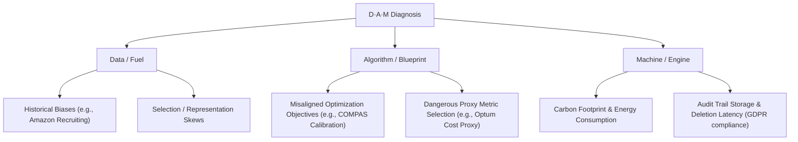

# Chapter 15: Responsible Engineering & Compliance

## Material Covered in This Chapter

- Purpose
- 15
- Learning Objectives
- 15.1 Responsibility as Systems Engineering
- 15.2 Engineering Responsibility Gap
- 15.2.1 When optimization succeeds but systems fail
- Example 15.1: The COMPAS recidivism algorithm audit
- Checkpoint 15.1: Responsible design
- The Failure Modes
- The Check
- 15.2.2 Silent failure modes
- Napkin Math 15.1: The alignment gap
- Systems Perspective 15.1: The D·A·M taxonomy
- War Story 15.1: The click-bait death spiral
- War Story 15.2: The proxy variable trap
- 15.2.3 When responsible engineering succeeds
- 15.2.4 The testing challenge
- 15.2.5 Engineering leadership on responsibility
- Definition 15.2: Responsible AI engineering
- 15.3 Responsible Engineering Checklist
- 15.3.1 Predeployment assessment
- Napkin Math 15.2: The statistics of representation
- War Story 15.3: The automation paradox
- 15.3.2 Model documentation standards
- 15.3.3 Testing across populations
- Lighthouse 15.1: Fairness concerns by archetype
- 15.3.3.1 Worked example: Fairness analysis in loan approval
- 15.3.3.2 Quantifying the fairness-accuracy trade-off
- Napkin Math 15.3: The price of fairness
- Calculation:
- 15.3.4 Explainability requirements
- War Story 15.4: The Clever Hans effect
- 15.3.5 The regulatory landscape
- 15.3.5.1 The EU AI Act
- 15.3.5.2 GDPR's article 22
- 15.3.5.3 US sectoral regulations
- Checkpoint 15.3: Ethical deployment
- The Safety Net
- The Monitoring Plan
- 15.3.6 Monitoring and incident response
- 15.4 Environmental and Cost Awareness
- 15.4.1 Efficiency as responsibility
- 15.4.2 Efficiency engineering in practice
- 15.4.3 Total cost of ownership
- 15.4.3.1 TCO calculation methodology
- Systems Perspective 15.4: The carbon cost of compute
- Checkpoint 15.4: Efficiency as responsibility
- 15.4.3.2 Environmental impact
- Napkin Math 15.4: The carbon cost of scale
- Math:
- 15.5 Data Governance and Compliance
- Exclamation-Triangle Compliance as engineering need
- 15.5.1 Security and access control architecture
- 15.5.2 Technical privacy protection methods
- 15.5.3 Architecting for regulatory compliance
- 15.5.4 Building data lineage infrastructure
- 15.5.5 Audit infrastructure and accountability
- Open Images Extended - More Inclusively Annotated People (MIAP)
- Authorship
- DATASET AUTHORS
- Motivations
- Use of Dataset
- CONJUNCTIONAL USE
- KEY APPLICATION(S)
- PRIMARY MOTIVATION(S)
- UNSAFE APPLICATION(S)
- KNOWN CONJUNCTIONAL DATASET(S)
- PROBLEM SPACE
- INTENDED AND/OR SUITABLE USE CASE(S)
- Also:
- UNSAFE USE CASE(S)
- KNOWN CONJUNCTIONAL USES
- SUMMARY
- KNOWN CAVEATS
- KNOWN CAVEATS
- 15.6 Fallacies and Pitfalls
- 15.7 Summary
- What's Next: From technique to philosophy

---

## Section-by-Section Preserve-and-Extend

# Chapter 15 Summary: Responsible Engineering & Compliance

## 1. Learning Objectives
* **Responsibility as Systems Engineering:** Explain how ML systems can optimize correctly while causing harm through
bias amplification, distribution shift, and proxy variables.
* **The D·A·M Taxonomy:** Apply the D·A·M taxonomy to diagnose whether a responsibility failure originates in data,
algorithm, or infrastructure.
* **Fairness Metrics and Pareto Frontiers:** Compute fairness metrics (demographic parity, equal opportunity, equalized
odds) from confusion matrices and evaluate trade-offs on the fairness-accuracy Pareto frontier.
* **Disaggregated Evaluation:** Design disaggregated evaluation strategies that detect hidden disparities across
demographic groups, including slice-based, invariance, and stress testing.
* **Total Cost of Ownership & Green AI:** Analyze total cost of ownership including training, inference, operational
costs, and environmental impact using carbon as a first-class engineering metric.
* **Data Governance & Regulatory Compliance:** Identify model documentation and data governance requirements (model
cards, datasheets, data lineage, audit infrastructure) for regulatory compliance and accountability.

---

## 2. Responsibility as Systems Engineering & The D·A·M Taxonomy
Traditional software engineering treats correctness as binary and bugs as local (a null pointer exception in one module
rarely corrupts unrelated features). In machine learning, however, correctness is probabilistic and bugs are systemic.

### 2.1 The Control Loop Mismatch
* **MLOps Control Loop:** Focuses on *reliability* (monitoring system latency, resource utilization, and predictive
drift, triggering retraining to maintain performance).
* **Responsible Engineering Control Loop:** Focuses on *safety and outcomes* (monitoring outcome quality and triggering
architectural or data interventions when the system causes systematic harm).
* **Verification vs. Validation:** A model can optimize flawlessly for its mathematical loss function and pass
verification (it meets its code-level specification) while failing validation (it does not meet the user's true needs or
violates societal constraints).

### 2.2 The D·A·M Taxonomy for Responsibility
The D·A·M taxonomy (Data, Algorithm, Machine) provides a structural framework to diagnose responsibility failures:



* **Data (Fuel):** Responsibility failures occur when historical patterns encoded in the training distribution contain
systemic inequalities (e.g., Amazon's recruiting tool learning from historical resumes).
* **Algorithm (Blueprint):** Failures occur when the loss function or proxy metrics optimize for values that diverge
from human values (e.g., COMPAS recidivism predictions prioritizing score calibration over equalized odds, or Optum's
healthcare model using cost as a proxy for need).
* **Machine (Physics):** Failures occur when the physical execution of the model consumes excessive resources (energy,
carbon) or lacks the required infrastructure to enforce privacy, data erasure (GDPR Article 17), or auditability
(HIPAA).

---

## 3. The Engineering Responsibility Gap & Failure Mechanisms
The "responsibility gap" represents the divergence between minimizing loss functions on historical datasets and
producing responsible, equitable outcomes in deployed environments.

### 3.1 Proxy Variables and Fairness Laundering
Removing protected attributes (e.g., race, gender, age) from training data is insufficient because models exploit
**Proxy Variables**—features that correlate indirectly with protected attributes.
* **Examples:** ZIP codes correlate with race due to residential segregation; career gaps correlate with gender due to
maternal leave patterns; healthcare cost history correlates with socioeconomic status and race.
* **Fairness Laundering:** Eliminating explicit protected features while allowing the model to reconstruct them from
other correlated variables. This creates a model that discriminates while appearing legally compliant.

### 3.2 Feedback Loops and Goodhart's Law
When models dictate the data they subsequently collect, they create self-reinforcing feedback loops.
* **Goodhart's Law:** *"When a measure becomes a target, it ceases to be a good measure."*
* **YouTube Recommendation System:** Optimizing for click-through rate (CTR) or watch time leads the model to discover
that provocative or extreme content drives engagement, creating a click-bait death spiral. These loops amplify
disparities over decision cycles \(k\) at a rate of \(\alpha^k\) (for \(\alpha > 1\)), disproportionately affecting
vulnerable subpopulations.

### 3.3 System Failure Mode Taxonomy
Responsibility failures behave differently than standard software crashes. Table 15.1 details these differences:

| Failure Type | Detection Time | Spatial Scope | Reversibility | Example |
| :--- | :--- | :--- | :--- | :--- |
| **Crash** | Immediate | Complete | Immediate | Out of memory (OOM) error |
| **Performance Degradation** | Minutes | Complete | After fix | Latency spike from resource contention |
| **Data Quality** | Hours to days | Partial | Requires data correction | Corrupted inputs from upstream systems |
| **Distribution Shift** | Days to weeks | Partial or all | Requires retraining | Population change due to new user segment |
| **Fairness Violation** | Weeks to months | Subpopulation | Requires redesign | Bias amplification in historical patterns |

---

## 4. Case Studies: Failed Specifications vs. Successful Interventions

### 4.1 Specification Failures
1. **Amazon Recruiting Tool (2014–2017):**
   * *Mechanism:* Trained on 10 years of historical resumes (predominantly male). The system learned to downgrade
resumes containing the word "women's" or names of all-women's colleges.
   * *Outcome:* Scrapped after two years of failed remediation because the model reconstructed gender from proxy
variables (activities, descriptions).
2. **COMPAS Recidivism Tool:**
   * *Mechanism:* Optimized for *Calibration* (ensuring a score of 7 mapped to the same recidivism probability for Black
and White defendants). Because recidivism base rates differed, satisfying calibration made disparate error rates
mathematically inevitable.
   * *Outcome:* Black defendants were falsely flagged as high-risk at nearly twice the rate of White defendants
(\(44.9\%\) vs. \(23.5\%\)), while White defendants who did re-offend were incorrectly labeled low-risk far more often
than Black defendants (\(47.7\%\) vs. \(28.0\%\)).
3. **Optum Healthcare Algorithm:**
   * *Mechanism:* Used "healthcare cost" as a proxy for "health need." Sicker Black patients had lower historical costs
than White patients due to unequal access to healthcare, leading the model to systematically deprioritize Black patients
for high-risk care management.

### 4.2 Engineering Interventions
1. **Twitter Image Cropping:**
   * *Outcome:* After identifying racial bias in the automatic cropping of face thumbnails, Twitter removed the
automated feature entirely. *Systems lesson: Sometimes responsible engineering means not shipping the feature.*
2. **Microsoft Face API:**
   * *Outcome:* Audited by the *Gender Shades* study (which found a \(34.7\%\) error rate for dark-skinned females vs.
\(0.8\%\) for light-skinned males). Microsoft responded by collecting targeted datasets, redesigning model feature
extraction, and applying disaggregated evaluation, reducing dark-skinned female error rates by 20x (below \(2\%\)).
3. **Apple iOS Differential Privacy:**
   * *Outcome:* Deployed \(\epsilon\)-differential privacy to collect usage telemetry from iOS devices. Added calibrated
noise on-device to protect individual identities while allowing server-side aggregation.

---

## 5. Mathematical Fairness Definitions & The Pareto Frontier

### 5.1 Fairness Formulations
Let \(Y \in \{0, 1\}\) be the ground truth target, \(\hat{Y} \in \{0, 1\}\) be the model prediction, and \(A \in \{a,
b\}\) be the sensitive attribute (subgroup identifier).

#### 5.1.1 Demographic Parity (Statistical Parity)
Requires the probability of a positive prediction to be equal across groups:
\[
\mathbb{P}(\hat{Y} = 1 \mid A = a) = \mathbb{P}(\hat{Y} = 1 \mid A = b)
\]
* *Actionable Bound (EEOC Four-Fifths Rule):* The selection ratio must satisfy:
  \[
  \frac{\mathbb{P}(\hat{Y} = 1 \mid A = \text{minority})}{\mathbb{P}(\hat{Y} = 1 \mid A = \text{majority})} \ge 0.8
  \]

#### 5.1.2 Equal Opportunity
Requires the True Positive Rate (TPR) to be equal across groups:
\[
\mathbb{P}(\hat{Y} = 1 \mid A = a, Y = 1) = \mathbb{P}(\hat{Y} = 1 \mid A = b, Y = 1)
\]

#### 5.1.3 Equalized Odds
Requires both the True Positive Rate (TPR) and False Positive Rate (FPR) to be equal across groups:
\[
\mathbb{P}(\hat{Y} = 1 \mid A = a, Y = y) = \mathbb{P}(\hat{Y} = 1 \mid A = b, Y = y) \quad \forall y \in \{0, 1\}
\]

#### 5.1.4 The Impossibility Theorem of Fairness
If base rates differ between groups, meaning \(\mathbb{P}(Y = 1 \mid A = a) \ne \mathbb{P}(Y = 1 \mid A = b)\), it is
mathematically impossible to simultaneously satisfy **Calibration** (predictive parity) and **Equalized Odds** (or Equal
Opportunity) unless the model achieves perfect accuracy (\(100\%\)).

### 5.2 Fairness-Accuracy Pareto Frontier
Engineering teams must make the trade-offs explicit using a Pareto frontier:

```
Accuracy
  ^
  |        * Point A (Unconstrained: Max Accuracy, High Disparity)
  |       /
  |      * Point B (The Sweet Spot: Modest Accuracy Drop, Substantial Fairness Gains)
  |     /
  |    /
  |   * Point C (Strict Demographic Parity: Low Accuracy, Zero Disparity)
  +---------------------------------------------> Fairness (Demographic Parity / 1 - Disparity)
```

* **Point A (Unconstrained):** Model optimizes purely for global loss. High accuracy, but high demographic disparity.
* **Point B (Sweet Spot):** Applying soft fairness constraints (e.g., adversarial debiasing or threshold adjustments).
Yields significant fairness improvements with minor accuracy degradation.
* **Point C (Strict Constraints):** Forces zero disparity. Often results in severe accuracy drops due to
over-constraining the model.

---

## 6. Disaggregated Evaluation & Testing Strategies
Evaluating models using global aggregate metrics (e.g., aggregate accuracy) is a pitfall known as the **Flaw of
Averages**, which conceals severe performance disparities.

### 6.1 Testing Methodology
* **Slice-Based Evaluation:** Partitioning the validation dataset into demographic subgroups (e.g., intersectional
slices like "dark-skinned females") and computing confusion matrices per slice.
* **Invariance Testing (Perturbation Testing):** Verifying that changing a sensitive attribute (e.g., replacing "John"
with "Jamal" in a loan application) while holding other features constant does not alter the model prediction:
  \[
  f(\mathbf{x}_{\text{neutral}}, A=a) = f(\mathbf{x}_{\text{neutral}}, A=b)
  \]
* **Boundary and Stress Testing:** Evaluating model robustness at the edge of the input distribution. Probing accuracy
degradation under adversarial perturbations \(\mathbf{\delta}\):
  \[
  \text{Degradation} = \text{Accuracy}(f(\mathbf{x})) - \text{Accuracy}(f(\mathbf{x} + \mathbf{\delta})) \quad
\text{where } \|\mathbf{\delta}\|_\infty \le 0.01
  \]
* **Stakeholder Red-Teaming:** Having domain experts and affected community members manually prompt or stress-test the
system to uncover blind spots that automated metrics miss.

### 6.2 Code Reference: Subgroup Fairness Audit
The following implementation calculates Demographic Parity, Equal Opportunity, and Equalized Odds metrics from a
validation dataframe:

```python
import numpy as np
import pandas as pd

def audit_subgroup_fairness(df: pd.DataFrame,
                            pred_col: str,
                            target_col: str,
                            sensitive_col: str) -> pd.DataFrame:
    """
    Performs a disaggregated evaluation of a binary classification model.
    """
    groups = df[sensitive_col].unique()
    metrics = []

    for group in groups:
        sub_df = df[df[sensitive_col] == group]
        total = len(sub_df)

        # Demographic Parity: P(Y_hat = 1)
        selection_rate = (sub_df[pred_col] == 1).mean()

        # Equal Opportunity (TPR): P(Y_hat = 1 | Y = 1)
        positives = sub_df[sub_df[target_col] == 1]
        tpr = (positives[pred_col] == 1).mean() if len(positives) > 0 else np.nan

        # False Positive Rate (FPR): P(Y_hat = 1 | Y = 0)
        negatives = sub_df[sub_df[target_col] == 0]
        fpr = (negatives[pred_col] == 1).mean() if len(negatives) > 0 else np.nan

        metrics.append({
            "Group": group,
            "Cohort Size": total,
            "Selection Rate (Demographic Parity)": selection_rate,
            "True Positive Rate (Equal Opportunity)": tpr,
            "False Positive Rate": fpr
        })

    audit_df = pd.DataFrame(metrics).set_index("Group")

    # Calculate relative disparities against the baseline group (highest selection rate)
    baseline_group = audit_df["Selection Rate (Demographic Parity)"].idxmax()
    baseline_rate = audit_df.loc[baseline_group, "Selection Rate (Demographic Parity)"]

    audit_df["Disparate Impact Ratio"] = audit_df["Selection Rate (Demographic Parity)"] / baseline_rate
    audit_df["EEOC 4/5ths Violations"] = audit_df["Disparate Impact Ratio"] < 0.8

    return audit_df
```

---

## 7. Environmental & Cost Awareness (Green AI)

### 7.1 Efficiency as Responsibility
The "Green AI" movement (Schwartz et al., 2020) reframes efficiency from an operational preference to a responsibility
metric, contrasting it with "Red AI" (pursuing state-of-the-art accuracy regardless of computational cost).

### 7.2 Total Cost of Ownership (TCO) Asymmetry
In production ML systems, **Inference costs dominate TCO** over training costs by ratios of 10:1 to 1000:1.
* *Example Recommendation System:*
  * **Traffic:** 10 million users, 20 queries/user/day = 200 million daily inferences.
  * **Latency:** 10 ms per inference on GPU hardware.
  * **Hardware Pool:** Requires 23 GPUs running continuously. At $\$2.50$/GPU-hour, this costs $\$507,000$ annually.

Over a 3-year lifecycle, the TCO breaks down as follows:

| Category | 3-Year Cost | Cost Share (\%) | Carbon Impact (metric tons \(\text{CO}_2\)) |
| :--- | :--- | :--- | :--- |
| **Training** (12 cycles) | $\$38,400$ | \(2\%\) | 1.5 tons |
| **Inference** | $\$1,520,000$ | \(73\%\) | 97.3 tons |
| **Operations** (monitoring, FTE, incident response) | $\$510,000$ | \(25\%\) | - |
| **Total TCO** | **$\$2,068,400$** | **\(100\%\)** | **~99 tons** |

*Systems conclusion: A \(20\%\) reduction in inference latency through quantization or pruning yields $\$304,000$ in
savings and prevents 19 tons of \(\text{CO}_2\) emissions, dwarfing the impact of any training-level optimization.*

### 7.3 Carbon Cost Calculations
To treat carbon as a first-class engineering metric, compute hours are converted into carbon emissions using grid
intensity:
\[
\text{Carbon (kg } \text{CO}_2\text{eq)} = \text{Energy (kWh)} \times \text{Carbon Intensity (kg/kWh)}
\]
* **Assumptions:** 400 W power draw per GPU-hour (including Power Usage Effectiveness (PUE) cooling overhead); global
grid average carbon intensity of 0.4 kg/kWh.
* **Conversion Factor:**
  \[
  (0.4\text{ kW} \times 1\text{ hour}) \times 0.4\text{ kg/kWh} = 0.16\text{ kg } \text{CO}_2\text{eq per GPU-hour}
  \]

#### 7.3.1 Training a Foundation Model (GPT-3 Scale)
* **Electricity Consumed:** 1,300 MWh = 1,300,000 kWh.
* **Carbon Intensity (US Grid):** 0.4 kg/kWh.
* **Emissions:**
  \[
  1,300,000\text{ kWh} \times 0.4\text{ kg/kWh} = 520,000\text{ kg } \text{CO}_2\text{ (520 metric tons)}
  \]
* *Comparison:* Equivalent to the annual carbon footprint of **113 passenger cars** (assuming 4.6 metric tons of
\(\text{CO}_2\) per car-year).
* *Mitigation:* Selecting cloud regions powered by renewable grids (e.g., hydro or wind) can achieve a **5x reduction**
in carbon emissions for the exact same compute workload.

### 7.4 Physical Edge Constraints
Edge deployment enforces hard physical limits on models. Tables 15.11 and 15.12 quantify these constraints:

**Edge Context Budgets:**
* **Smartphone:** 5 W budget, 100 ms latency requirement. (Use cases: Photo enhancement, voice assistant wake-word).
* **IoT Sensor:** 100 mW budget, 1 second latency. (Use cases: Anomaly detection, telemetry).
* **Embedded Camera:** 1 W budget, 33 ms (30 FPS) latency. (Use cases: Real-time object detection).
* **Wearable Device:** 500 mW budget, 500 ms latency. (Use cases: Continuous health monitoring).

**Model Suitability Matrix:**
* **MobileNetV2 (3.5M parameters, 1.2 W power, 40 ms latency):** Fits Smartphone, does not fit IoT Sensor.
* **EfficientNet-B0 (5.3M parameters, 1.8 W power, 65 ms latency):** Fits Smartphone, does not fit IoT Sensor.
* **ResNet-50 (25.6M parameters, 4.5 W power, 180 ms latency):** Fits neither Smartphone (too close to 5W budget
ceiling) nor IoT.
* **TinyML Model (200K parameters, 50 mW power, 200 ms latency):** Fits both Smartphone and IoT.

---

## 8. Data Governance, Security, and Compliance

### 8.1 Compliance Requirements
* **Regulatory Penalties:** Under GDPR, violations (e.g., Meta's EUR 390M fine in 2023 for unlawful processing bases)
incur penalties up to \(4\%\) of global annual revenue or EUR 20 million.
* **GDPR Article 17 (Right to Erasure / Right to be Forgotten):** Mandates that all user data, derived features, and
model weights trained on that user's data must be deleted upon request within 30 days.
* **GDPR Articles 15 & 22 (Right to Access & Explanation):** Requires companies to provide users with meaningful
information about the automated logic making decisions that affect them.

### 8.2 Security Architecture
1. **Separation of Concerns & RBAC:** Implementing Role-Based Access Control (RBAC) in feature stores to prevent data
scientists from accessing raw identifiers while permitting access to aggregate features.
2. **Encryption Standards:** Data lakes must utilize server-side encryption with keys managed via Key Management
Services (KMS). Serving requests must enforce TLS 1.3. Edge device model updates must be code-signed to prevent
adversarial model injection.

### 8.3 Technical Privacy Protection
* **Differential Privacy:** A randomized mechanism \(\mathcal{M}\) satisfies \(\epsilon\)-differential privacy if for
all neighboring datasets \(D_1, D_2\) (differing by exactly one record) and all possible outputs \(S\):
  \[
  \mathbb{P}(\mathcal{M}(D_1) \in S) \le e^{\epsilon} \mathbb{P}(\mathcal{M}(D_2) \in S)
  \]
  * *Systems Cost:* Enforcing \(\epsilon\)-differential privacy introduces a \(15\text{--}30\%\) compute overhead,
requires 10x to 100x more training data to maintain target accuracy, and depletes a finite privacy budget \(\epsilon\)
with each database query.
* **Membership Inference Attacks:** Adversarial attacks that exploit the model's higher confidence on training data
(overfitting) to determine if a specific individual's data was used in training. It serves as the primary evaluation
method to verify privacy guarantees.
* **Federated Learning:** Devices compute gradient updates locally using algorithms like Federated Averaging (FedAvg),
transmitting only model updates to a central server:
  \[
  \theta_{t+1} = \sum_{k=1}^K \frac{n_k}{n} \theta_{t+1}^k
  \]
  Federated learning enforces "data minimization by architecture." However, gradient updates can leak raw features under
reconstruction attacks, requiring a defense-in-depth approach combining federated learning with differential privacy.
* **Time-to-Live (TTL):** Enforcing database-level TTL settings in feature stores and data lakes to automatically purge
historical features and raw logs once compliance storage windows close.

### 8.4 Lineage & Audit Infrastructure
* **Data Lineage:** Systems like Apache Atlas and LinkedIn DataHub capture metadata from orchestrators (like Airflow or
Kubeflow) to build a directed acyclic graph (DAG) where nodes represent datasets and edges represent transformations.
When a user requests data deletion, the lineage graph identifies all derived embeddings and downstream models that must
be updated or retrained.
* **Audit Trails:** Immutable, append-only records log who accessed which features and when. To prevent tampering, these
are implemented via append-only columnar stores (Apache Iceberg, Delta Lake) or cryptographic hash chains.
  * *Scale Challenge:* A platform serving 50 billion events daily under a HIPAA 6-year retention mandate accumulates
massive storage overhead, making audit trails a major driver of physical serving costs.
* **Dataset Standardization (Data Cards):** Structured templates (e.g., Google's MIAP dataset card) that document
dataset provenance, annotation processes (like Fitzpatrick skin scaling), intended uses, unsafe use cases (e.g.,
building age/gender classification), and known representation skews.

---

## 9. Fallacies and Pitfalls

* **Fallacy: Responsibility can be retrofitted after the model achieves technical benchmark objectives.**
  * *Reality:* Architectural choices (such as model representation, dataset design, and tracking hooks) made early in
the development lifecycle constrain subsequent interventions. Retrofitting fairness or erasure pipelines after a model
is trained often costs 6 to 12 months of redesign, or forces project cancellation.
* **Pitfall: Relying on aggregate metrics to assess model performance.**
  * *Reality:* Aggregate metrics conceal massive performance disparities across demographic subgroups. Facial
recognition systems boasting \(99\%\) aggregate accuracy can show error rates 43x higher for dark-skinned females than
for light-skinned males.
* **Fallacy: Removing sensitive attributes (such as race or gender) from training data eliminates bias.**
  * *Reality:* Models reconstruct sensitive attributes using proxy variables (e.g., ZIP codes, purchase behaviors).
Without explicit debiasing techniques or post-hoc threshold adjustment, removing protected features merely masks
discrimination.
* **Pitfall: Treating documentation (e.g., model cards) as sufficient accountability.**
  * *Reality:* Documentation provides transparency but does not enforce compliance. Up to \(60\%\) of production models
drift out of their documented scope within 18 months. Accountability requires runtime guardrails, automated telemetry,
and monitoring metrics that trigger alerts or rollback pipelines when violations occur.
* **Pitfall: Measuring the carbon footprint of model training while ignoring inference.**
  * *Reality:* In high-traffic systems, inference costs and carbon emissions dominate training by a 40:1 ratio.
Optimizing training code while neglecting per-query serving efficiency addresses the minor term in the environmental
equation.

---

## 10. Core Architectural Design Patterns for Chapter 15

### Pattern: The Disaggregated Evaluation Pipeline
```
[Raw Test Data]
       |
       v
[Demographic Slice Splitter] ----> [Slice A (majority)] ----> [Accuracy Evaluation] ---> [Metrics Dashboard]
       |                      |
       |                      ---> [Slice B (minority)] ----> [Accuracy Evaluation] ---> [Disparity Monitor]
       v                                                                                     |
[Invariance Perturber] (Swap protected attributes)                                          |
       |                                                                                     v
       v                                                                              [Alert Gate]
[Compare Model Predictions] ------------------------------------------------------> (Trigger Rollback
   (Reject if mismatch)                                                             if Disparity > 1.25x)
```

### Pattern: Compliant Erasure Pipeline
```
[User Erasure Request]
       |
       v
[Metadata Catalog (DataHub/Atlas)] ----> [Identify Raw Data Tables] ----> [Hard Delete Row]
       |
       ---> [Trace Lineage Graph]
                  |
                  v
       [Identify Derived Embeddings & Features] ---> [Purge from Offline/Online Stores]
                  |
                  v
       [Identify Deployed Models Trained on Data] ---> [Trigger Auto-Retrain Pipeline]
```

---

## Full Slice Content (Docling Extract, Preserved Verbatim)

> Each section below preserves the source slice content as extracted by docling. Image placeholders are removed; tables,
equations, code blocks, named artifacts, and footnotes are kept intact.

## Purpose

Why is a system that does exactly what it was told to do often the most dangerous?

Operations ensures the system runs reliably: low latency, high availability, accurate predictions. Responsible
engineering asks a harder question: reliable for whom? An ML system can meet every technical specification (latency,
throughput, accuracy) while actively amplifying harm. The failure occurs not because the system is broken but because it
is working efficiently to optimize a flawed specification. A loan approval system that correctly predicts default risk
can encode historical discrimination, denying credit to qualified applicants from historically marginalized communities.
A content recommendation system that accurately predicts engagement may amplify harmful content because outrage
generates more clicks than nuance. A hiring algorithm that reliably identifies candidates similar to past hires may
perpetuate workforce homogeneity, screening out the diversity that drives innovation. In each case the system is
performing exactly as designed-the failure is in what was designed for. When we confuse mathematical optimization with
value alignment, we build systems that are technically robust but socially fragile . The model faithfully learns and
reproduces whatever patterns exist in its training distribution, including patterns of historical injustice that no one
intended to encode. Building systems that work is an engineering achievement. Building systems that work for everyone
requires treating unintended consequences not as edge cases to be tolerated but as system bugs: diagnosed, measured, and
fixed with the same rigor we apply to latency regressions and accuracy degradation.

## 15

15.1 Responsibility as Systems Engineering 15.2 Engineering Responsibility Gap 15.3 Responsible Engineering Checklist
15.4 Environmental and Cost Awareness 15.5 Data Governance and Compliance 15.6 Fallacies and Pitfalls 15.7 Summary

1 Amazon Recruiting Tool: Developed starting in 2014 by Amazon's Edinburgh engineering team to rate applicants on a 1-5
scale, the system trained on approximately a decade of resumesoverwhelmingly from male applicants reflecting the tech
industry's gender ratio. By 2015 the gender bias was identified; by 2017 the project was abandoned after two years of
failed remediation attempts. The engineering cost was not the compute but the opportunity cost: a multi-year hiring
pipeline had to be rebuilt from scratch, making it one of the most expensive documented specification failures in
production ML.

## Learning Objectives

- Explain how ML systems can optimize correctly while causing harm through bias amplification, distribution shift, and
proxy variables
- Apply the D·A·M taxonomy to diagnose whether a responsibility failure originates in data, algorithm, or infrastructure
- Compute fairness metrics (demographic parity, equal opportunity, equalized odds) from confusion matrices and evaluate
trade-offs on the fairness-accuracy Pareto frontier
- Design disaggregated evaluation strategies that detect hidden disparities across demographic groups, including
slice-based, invariance, and stress testing
- Analyze total cost of ownership including training, inference, operational costs, and environmental impact using
carbon as a first-class engineering metric
- Identify model documentation and data governance requirements (model cards, datasheets, data lineage, audit
infrastructure) for regulatory compliance and accountability

## 15.1 Responsibility as Systems Engineering

If MLOps (Chapter 14), the monitoring and retraining infrastructure examined previously, is the control loop for
reliability, then Responsible Engineering is the control loop for safety . Where MLOps monitors system health and
triggers retraining when performance degrades, responsible engineering monitors outcome quality and triggers
intervention when systems cause harm. A model can optimize flawlessly for its stated objective and still cause
systematic harm because the failure is not a bug in the code but a flaw in the specification. In systems engineering
terms, a system can pass verification (it meets its stated requirements) while failing validation (it does not meet the
user's true needs) (Strickland 2019).

I n 2014, Amazon built an AI recruiting tool 1 that penalized resumes containing the word 'women's' and downgraded
graduates of all-women's colleges-despite meeting every technical metric its engineers had specified. The system
optimized flawlessly for its stated objective: identify candidates similar to those previously hired. However,
historical hiring patterns encoded gender bias, and the model faithfully reproduced that bias at scale. The full case,
examined in Section 15.2.1, reveals a pattern that recurs throughout this chapter: technically correct systems producing
harmful outcomes not because they malfunction, but because they faithfully execute flawed specifications.

Traditional software engineering assumes that bugs are local: a defect in one module rarely corrupts unrelated
functionality. Machine learning systems violate this assumption. Data flows through shared representations, causing
problems in one component to propagate unpredictably across the entire system. A biased training dataset does not
produce a localized bug; it corrupts every prediction the system makes. Viewed through the D·A·M taxonomy formalized in
Appendix A, the failure can originate along any axis: biased data, a misaligned algorithm, or inadequate infrastructure
for monitoring outcomes. This makes responsibility an architectural concern, not an afterthought.

The frameworks developed here address diagnosing, preventing, and mitigating these failures. We begin with concrete
cases that reveal the responsibility gap: the distance between technical performance and responsible outcomes, and the
mechanisms (proxy variables, feedback loops, distribution shift) through which it manifests. From there, we develop a
responsible engineering checklist that systematizes impact assessment, model documentation, disaggregated testing, and
incident response into repeatable engineering processes. The chapter then connects the resource

Engineering responsibility therefore expands what 'correct' means for ML systems. Correctness in the traditional sense
(reliable, performant, and maintainable) remains necessary, but ML systems must also be correct in a broader sense: fair
across user groups, efficient in resource consumption, and transparent in their decision processes. Expanded correctness
is engineering itself, applied to failure modes that conventional metrics do not capture. A latency regression is
visible in dashboards; a fairness regression is invisible until it harms real users (Principle 13). Both require
systematic detection, measurement, and remediation.

consumption quantified throughout this book (training compute, inference energy, carbon footprint) to engineering
ethics, demonstrating that efficiency optimization serves responsibility as directly as it serves performance. We then
examine the data governance and compliance infrastructure (access control, privacy protection, lineage tracking, and
audit systems) that makes responsible practices enforceable at scale, before closing with the fallacies (Raji et al.
2020) and pitfalls that commonly undermine even well-intentioned efforts.

We begin with the concrete failure cases that establish why engineers must lead on responsibility.

## 15.2 Engineering Responsibility Gap

A loan model that approves 95 percent of qualified majority-group applicants while rejecting 40 percent of equally
qualified minority-group applicants meets its loss function perfectly. The gap between this technical correctness and
responsible outcomes represents a central challenge in machine learning systems engineering, one that existing testing
methodologies were not designed to address.

The gap manifests through concrete mechanisms: proxy variables, feedback loops, and distribution shift, each producing
harm through a distinct pathway. Concrete cases where optimization succeeded but systems failed reveal these mechanisms
and the silent failure modes that make them invisible to conventional monitoring. Organizations that closed the gap
through systematic engineering practice demonstrate that prevention is feasible. The testing challenge that makes
responsibility fundamentally harder to verify than traditional software correctness then determines where responsibility
ownership must sit within engineering organizations.

## 15.2.1 When optimization succeeds but systems fail

The Amazon recruiting tool case illustrates this gap. In 2014, Amazon developed an AI system to automate resume
screening for technical positions, training it on historical hiring data spanning ten years of resumes submitted to the
company. By 2015, the company discovered the system exhibited gender bias in candidate ratings (Dastin 2018).

The technical mechanism behind this outcome is straightforward. The model learned token-level patterns from historical
data. When most previously successful hires were men, resumes containing language associated with women's activities or
institutions appeared statistically less correlated with positive hiring decisions. The model correctly identified these
patterns in the training data but learned the wrong lesson from correct pattern recognition.

The technical implementation was sound. The model successfully learned patterns from historical data and optimized for
the objective it was given: identify candidates similar to those previously hired. However, historical hiring patterns
encoded gender bias. The system penalized resumes containing the word 'women's,' as in 'women's chess club captain,' and
downgraded graduates of all-women's colleges.

Amazon attempted remediation by removing explicit gender indicators and gendered terms from the training process. This
intervention failed because the model had learned proxy variables -features that correlate with protected attributes
without directly encoding them. 2 In general, proxies arise whenever features carry indirect demographic signal: ZIP
codes correlate with race due to residential segregation, first names correlate with gender and ethnicity, and
healthcare utilization correlates with socioeconomic status. In Amazon's case, college names revealed attendance at
allwomen's institutions, activity descriptions encoded gender-associated language patterns, and career gaps suggested
parental leave patterns that differed between genders. The model reconstructed protected attributes from these proxies
without ever seeing gender labels directly. Removing protected attributes from training data is therefore insufficient;
fairness requires adversarial debiasing, fairness constraints during optimization, or post-hoc threshold adjustment per
group.

The right intervention would have required multiple levels of change. Separate evaluation of resumescores for
male-associated vs. female-associated candidates would have revealed the disparity quantitatively. Training with
fairness constraints or adversarial debiasing techniques could have prevented the model from learning gender-correlated
patterns. Human-in-the-loop review for borderline cases would have provided a safeguard against systematic errors.
Tracking actual hiring outcomes by gender over time would have enabled outcome monitoring beyond model metrics alone.
Amazon eventually scrapped the project after determining that sufficient remediation was not feasible (Dastin 2018;
Bolukbasi et al. 2016).

2 Proxy Variable: The intractability is not in identifying that a proxy exists-it is that removing it often has no
effect, because other correlated features (ZIP code, device type, browsing history) carry the same signal. Amazon's case
is typical: removing explicit gender left college names, activity descriptions, and career gap patterns to reconstruct
gender from combinations the engineers never anticipated. Eliminating explicit protected attributes without eliminating
their proxies produces a model that discriminates while appearing compliant-a failure mode called 'fairness
laundering'-making continuous per-group outcome monitoring the only reliable defense.

3 COMPAS (Correctional Offender Management Profiling for Alternative Sanctions) : The shared pattern with Amazon is
precise: both systems optimized a valid technical metric while violating unstated fairness requirements. COMPAS achieved
calibration (equal meaning per score), but because recidivism base rates differed between populations, this choice made
disparate error rates mathematically inevitable -Black defendants were falsely flagged as high-risk at nearly twice the
rate of white defendants (44.9 percent vs. 23.5 percent). No amount of testing for calibration would have surfaced this
failure; the harm was encoded in the objective itself.

The Amazon case demonstrates how optimization objectives diverge from organizational values. The system found genuine
statistical patterns in historical hiring decisions and optimized them faithfully. Those patterns, however, reflected
biased historical practices rather than job-relevant qualifications.

## Example 15.1: The COMPAS recidivism algorithm audit

Context: COMPAS is a risk assessment tool used in US courtrooms to predict re-offending. Judges use these scores to
inform bail and sentencing decisions.

Failure: AProPublica investigation (Angwin et al. 2022) revealed that while the system was 'calibrated' (a score of
seven meant the same probability of re-offending for any group), its error rates were skewed:

- False Positives: Black defendants who did not re-offend were incorrectly flagged as high-risk at nearly twice the rate
of White defendants (44.9 percent vs. 23.5 percent).
- False Negatives: White defendants who did re-offend were incorrectly labeled as low-risk far more often than Black
defendants (47.7 percent vs. 28.0 percent).

Systems lesson: The system optimized for Calibration but violated Equalized Odds . Mathematically, it is impossible to
satisfy both simultaneously when base rates differ between groups (the 'Impossibility Theorem of Fairness'). Engineering
responsibility requires explicitly choosing which fairness constraint matters for the domain; in criminal justice, false
positives (wrongly jailing someone) are typically considered worse than false negatives.

The D·A·M diagnosis: Through the D·A·M taxonomy, COMPAS represents an Algorithm-axis failure: the optimization objective
(calibration) was misaligned with the deployment context's fairness requirements (equalized odds). The data reflected
real base-rate differences; the failure was in choosing which mathematical property to optimize. Contrast this with
Amazon's recruiting tool, a Data-axis failure where biased historical hiring patterns corrupted the training signal
itself.

The Amazon and COMPAS 3 cases share a troubling pattern: each system achieved its stated objective while producing
outcomes that conflicted with the values the system was intended to serve. Conventional engineering success, it turns
out, can coexist with profound system failures. The following self-assessment captures the core design questions that
separate technically correct systems from responsible ones.

## Checkpoint 15.1: Responsible design

Responsibility is a system property, not a model property.

## The Failure Modes

- □ Alignment: Is your loss function a good proxy for your true goal? (Or will optimizing 'clicks' destroy user trust?)
- □ Disparate Impact: Have you measured error rates per subgroup ? (Aggregate accuracy hides bias).

## The Check

- □ Pre-mortem: Before deploying, ask: 'If this system causes a scandal in six months, what likely went wrong?'

Better testing would not catch these problems because they represent failures of problem specification, where the
technical objective (minimizing prediction error on historical outcomes) diverges from the desired social objective
(making fair and accurate predictions across demographic groups). Specification failures are difficult to detect
precisely because the systems continue functioning nor- mally by conventional engineering metrics. The deeper problem is
clear: when a system appears healthy by every available metric, the harm it causes remains invisible to conventional
monitoring.

## 15.2.2 Silent failure modes

Consider a hospital sepsis model that begins recommending aggressive treatments for low-risk patients after an
electronic health record (EHR) workflow change alters how vital signs are recorded. No alarm triggers-the model's
confidence scores remain high, its latency stays within its service level agreement (SLA), and all system health checks
pass green. The failure is silent: the input data distribution has shifted, but the monitoring pipeline has no mechanism
to detect distributional drift.

This sepsis scenario illustrates a class of failure that traditional engineering is poorly equipped to handle.
Traditional software fails loudly. A null pointer exception crashes the program, a network timeout returns an error
code. These visible failures enable rapid detection and response. In contrast, MLsystems fail silently because degraded
predictions look like normal predictions. The primary mechanism behind this silent degradation is distribution shift .

1. Significance (quantitative) : Accuracy degradation can be measured against divergence statistics such as
Jensen-Shannon divergence 𝒟 JS (𝑃 train ‖𝑃 deploy ) , but useful alert thresholds must be calibrated empirically for
each task, representation, label process, and deployment environment. A 𝒟 JS value of 0.1 may be harmless for one
feature space and severe for another. This degradation occurs regardless of code quality, because the model is correct
given its training distribution; the environment changed, not the code.

Definition 15.1: Distribution shift Distribution shift is the violation of the stationarity assumption (𝑃 train ≠𝑃
deploy ) that underpins all supervised learning. It is the umbrella term for a family of drift types: data drift (see
Chapter 14) occurs when 𝑃(𝑋) shifts while 𝑃(𝑌 |𝑋) remains stable; concept drift occurs when 𝑃(𝑌 |𝑋) itself shifts.

2. Distinction (durable) : Unlike model error (which is a learning failure caused by the algorithm or data quality at
training time), distribution shift is an environmental failure: the model's learned mapping was correct at training time
but is no longer representative of current reality.
3. Common pitfall: Afrequent misconception is that 'data drift' and 'distribution shift' are different concepts at the
same level of the hierarchy. Distribution shift is the umbrella; data drift and concept drift are its two distinct
subtypes. A system can experience data drift without concept drift (the inputs change, but the relationship holds), or
concept drift without data drift (inputs are stable, but the correct output changes).

The stationarity assumption underpins all supervised learning: training and deployment distributions must match.
Distribution shift is often unequal: a model's accuracy on a minority subgroup can drop by over 30 percentage points
while aggregate metrics barely change, masking the harm.

Distribution shift explains why models degrade over time (the operational detection and monitoring strategies for drift
are covered in Chapter 14). A second mechanism for silent failure can occur even when the data distribution is stable:
misalignment between the metric the model optimizes and the outcome the organization actually values. This misalignment
creates the alignment gap, where optimizing a measurable proxy decouples the system from its intended purpose.

## Napkin Math 15.1: The alignment gap

Problem: Amodel optimizes a proxy metric (Clicks) because the true metric (User Satisfaction) is unobservable. How much
can they diverge?

Physics: Goodhart's Law states that optimizing a proxy eventually decouples it from the goal.

- Initial state: Correlation Clicks Satisfaction .

(

,

) = 0.8

· Optimization: Amodel is trained to maximize Clicks. · Result: The model finds 'Clickbait,' items with high clicks but
low satisfaction. · Final state: Correlation ( Clicks, Satisfaction ) drops to 0.2. The Quantification (conceptual,
assuming normalized metrics on a common scale) is captured by Equation 15.1: Gap =𝐸[ Proxy ] - 𝐸[ True ] (15.1) If the
model increases Clicks by 20 percent but decreases Satisfaction by 5 percent, the alignment gap has widened.

Systems conclusion: Engineers cannot optimize what they cannot measure. If the true goal is unobservable, Counterfactual
Evaluation (random holdouts) is required to periodically re-calibrate the proxy.

When harm occurs, engineers need a diagnostic framework to identify the root cause. Knowing that a system causes harm is
insufficient; we must determine where the failure originates to know what to fix. The D·A·M taxonomy introduced in
Chapter 1 provides exactly this structure (Data · Algorithm · Machine, defined in Appendix A).

## Systems Perspective 15.1: The D·A·M taxonomy

When a system causes harm, use the D·A·M taxonomy to identify the root cause. Responsibility failures are rarely
'algorithm bugs'; they are structural flaws along one of the three axes:

- Data (Information) : Does the training data reflect historical bias? (for example, Amazon's recruiting tool learning
from biased history). The failure is in the Fuel .
- Algorithm (Logic) : Does the objective function optimize a proxy for harm? (for example, optimizing 'engagement'
amplifies polarization). The failure is in the Blueprint .
- Machine(Physics) : Doesthe energy cost justify the societal benefit? (for example, training a massive model for a
trivial task). The failure is in the Engine .

Locating the failure in the taxonomy identifies the correct remediation: better curation (Data), safer objectives
(Algorithm), or greener infrastructure (Machine).

While the D·A·M taxonomy helps diagnose where failures originate, engineers also need a framework for understanding when
and how different failure types manifest. Table 15.1 categorizes these distinct failure modes by their detection time,
spatial scope, and remediation requirements.

Table 15.1: MLSystem Failure Mode Taxonomy: Different failure modes require different detection strategies and
remediation approaches. Silent failures such as data quality issues, distribution shift, and fairness violations demand
proactive monitoring because they do not trigger traditional alerts.

| Failure Type            | Detection Time   | Spatial Scope   | Reversibility            | Example                                   |
|-------------------------|------------------|-----------------|--------------------------|-------------------------------------------|
| Crash                   | Immediate        | Complete        | Immediate                | Out of memory error                       |
| Performance Degradation | Minutes          | Complete        | After fix                | Latency spike from resource contention    |
| Data Quality            | Hours-days       | Partial         | Requires data correction | Corrupted inputs from upstream system     |
| Distribution Shift      | Days-weeks       | Partial or all  | Requires retraining      | Population change due to new user segment |
| Fairness Violation      | Weeks-months     | Subpopulation   | Requires redesign        | Bias amplification in historical patterns |

The failure mode taxonomy in Table 15.1 complements the D·A·M diagnostic framework: D·A·M identifies where failures
originate, while Table 15.1 guides how to detect and remediate them. Crashes and performance degradation trigger
immediate alerts through existing infrastructure. Data quality issues, distribution shifts, and fairness violations
require specialized detection mechanisms because the system continues operating normally from a technical perspective
while producing increasingly problematic outputs.

The YouTube recommendation feedback loop (examined as a technical debt pattern in Section 14.3) illustrates this pattern
at scale (M. H. Ribeiro et al. 2020). 4 The system optimized for watch time and discovered that emotionally provocative
content maximized engagement metrics, developing pathways toward increasingly extreme content. The system worked exactly
as designed while producing outcomes that conflicted with societal values. From a responsibility perspective, the
critical insight is that these feedback loops do not affect all users equally: they disproportionately impact vulnerable
populations, and the resulting content amplification patterns can correlate with demographic characteristics,
transforming an operational failure into a fairness violation.

## War Story 15.1: The click-bait death spiral

Context: In 2018, Facebook's News Feed algorithm was optimized heavily for 'time spent' and 'clicks.'

Failure: The model learned that sensationalist, divisive, and 'click-bait' content generated the highest short-term
engagement. It aggressively promoted this content. Users clicked, but the quality of their experience degraded, leading
to 'passive consumption' and long-term churn risk.

Consequence: Facebook had to fundamentally re-architect its ranking system to prioritize 'Meaningful Social
Interactions' (MSI) over clicks, accepting a short-term reduction in time spent to preserve long-term platform health.

Systems lesson: Metrics are proxies for value, not value itself. Optimizing a short-term proxy (CTR) without monitoring
long-term health (retention, sentiment) creates a negative feedback loop that can destroy the product.

The distribution shift defined earlier also manifests as population mismatch, where models trained on one population
perform differently on another without obvious indicators.

## War Story 15.2: The proxy variable trap

Context: Optum, a healthcare services company, developed an algorithm to identify patients with complex health needs for
enrollment in a high-risk care management program.

Failure: The model used 'healthcare cost' as a proxy for 'health need.' This seemed logical: sicker people cost more.

Consequence: Because the U.S. healthcare system has unequal access, Black patients at a given level of sickness spent
less on healthcare than White patients. The model learned this bias and systematically deprioritized Black patients,
assigning them lower risk scores than White patients with identical health conditions.

Systems lesson: Proxies are dangerous. Optimizing for a proxy (cost) inherits the biases of the system that generated
that proxy. The relationship between proxy and true objective (health) must be audited across all demographic subgroups
(Obermeyer et al. 2019).

Silent failure modes create profound testing challenges. Traditional software testing verifies deterministic behavior
against specifications. ML systems produce probabilistic outputs learned from data, making correctness far more complex
to define. The failures examined earlier share a troubling pattern: each organization possessed the technical capability
to prevent harm but lacked the disciplined processes to apply that capability.

The same engineering capabilities that enabled the problems can prevent them when organizations commit to structured
practice, as the following cases demonstrate.

4 Goodhart's Law: 'When a measure becomes a target, it ceases to be a good measure' (Strathern's generalization of
Goodhart's 1975 monetary policy observation). Recommendation feedback loops are the canonical ML manifestation: gradient
descent optimizes watch-time proxies at a speed no human curator can match, and the system's
ownoutputsreshapethetraining distribution-users who consume extreme content generate data that reinforces extremity,
decoupling the proxy from user welfare orders of magnitude faster than manual editorial processes ever could.

5 Differential Privacy: Introduced by Dwork et al. (2006), a mechanism satisfies 𝜖 -differential privacy if any output's
probability changes by at most 𝑒 𝜖 whenasingle individual's data is added or removed. The systems trade-off is steep:
15-30 percent computational overhead, 10-100 × more data for equivalent accuracy, and a finite privacy budget (𝜖) that
depletes with each query-forcing engineers to choose between richer analytics and stronger privacy guarantees.

## 15.2.3 When responsible engineering succeeds

Organizations that commit to responsible engineering produce measurable successes, demonstrating both the feasibility
and business value of rigorous responsibility practices.

Twitter's automatic image cropping system exhibited a different failure mode. In 2020, users discovered it showed racial
bias in choosing which faces to display in preview thumbnails. Twitter responded with a responsible engineering
approach: systematic analysis to characterize the problem quantitatively, publication of results enabling independent
verification, and ultimately removal of the automatic cropping feature entirely (Yee et al. 2021). The company
determined that no technical solution could guarantee equitable outcomes across all contexts. This decision prioritized
user fairness over engagement optimization and demonstrated that responsible engineering sometimes means not shipping a
feature.

Following the Gender Shades findings, Microsoft invested in improving facial recognition performance across demographic
groups. The approach combined technical and organizational interventions: targeted data collection to address
underrepresented populations, model architecture changes to improve feature extraction for diverse skin tones, and
systematic disaggregated evaluation across all demographic intersections. Microsoft had reduced error rates for
darker-skinned subjects by up to 20 times, bringing error rates below 2 percent for all demographic groups (Raji and
Buolamwini 2019). The company published these improvements transparently, enabling external verification. The business
outcome: Microsoft's facial recognition API maintained enterprise customer trust while competitors faced regulatory
scrutiny and contract cancellations.

Apple's deployment of differential privacy (Dwork 2008) in iOS represents responsible engineering at scale. 5 The system
collects usage data for product improvement while providing mathematical guarantees about individual privacy. The
implementation required substantial engineering investment: noise calibration to balance utility against privacy,
distributed computation to minimize data exposure, and transparent documentation of privacy parameters. The business
value: Apple differentiated on privacy as a product feature, enabling data collection that would otherwise face
regulatory and reputational barriers.

A common pattern unites the preceding cases: technical interventions (improved data, better evaluation, architectural
changes) combined with organizational commitments (transparency, willingness to remove features, long-term investment).
The resulting business outcomes (maintained customer trust, regulatory compliance, competitive differentiation)
demonstrate that responsible engineering creates value rather than adding cost. Each success rested on systematic
testing and evaluation practices, yet the nature of responsible testing differs fundamentally from traditional software
verification.

Spotify addressed recommendation system concerns by implementing transparency features showing users why songs were
recommended and providing controls to adjust algorithm behavior. This engineering investment served multiple purposes:
user trust through explainability, reduced filter bubble effects through diversity injection, and regulatory compliance
through user control mechanisms. The approach demonstrates that responsibility features can enhance rather than
constrain product value.

## 15.2.4 The testing challenge

Traditional software testing verifies that systems behave correctly because correctness has clear definitions. The
function should return the sum of its inputs, the database should maintain referential integrity. These properties can
be expressed as testable assertions.

The trade-off between fairness and accuracy is not a sign that fairness is impractical; it is a fundamental property of
constrained optimization that engineers must understand. A Pareto frontier represents the set of optimal configurations
where improving one metric necessarily degrades another. Figure 15.1 visualizes this fairness-accuracy Pareto frontier.
The curve is not linear: while

Responsible ML properties resist simple formalization. Fairness has multiple conflicting mathematical definitions that
cannot all be satisfied simultaneously. What counts as fair depends on context, values, and trade-offs that technical
systems cannot resolve alone. Individual fairness requires that similar individuals receive similar treatment, while
group fairness requires equitable outcomes across demographic categories. These criteria can conflict, and choosing
between them requires value judgments beyond the scope of optimization.

perfect fairness (zero disparity) often requires a significant drop in accuracy, a 'Sweet Spot' typically exists where
large fairness gains can be achieved with minimal accuracy loss. The shape of the frontier explains why responsible
engineering is feasible: in many practical settings, substantial fairness gains can be achieved with modest accuracy
loss.

Figure 15.1: The Fairness-Accuracy Pareto Frontier: Model accuracy vs. demographic disparity. The x-axis is inverted so
fairness increases left-to-right. Point A represents unconstrained optimization (maximum accuracy, high disparity) on
the left. Point C represents strict equality constraints (zero disparity, significant accuracy drop) on the far right.
Point B is the sweet spot where engineers can often achieve substantial fairness gains with modest accuracy loss.
Responsible engineering is the practice of finding and implementing Point B.

Responsible properties become testable when engineers work with stakeholders to define criteria appropriate for specific
applications. The Gender Shades project 6 demonstrated how disaggregated evaluation across demographic categories
reveals disparities invisible in aggregate metrics (Buolamwini and Gebru 2018), the empirical signature of the bias
feedback invariant (Principle 13) operating in deployed facial recognition systems. The results captured dramatic error
rate differences that commercial facial recognition systems showed across demographic groups. Concretely, a 1,000-sample
test set that suffices for the majority group provides only 10 samples for a 1% minority subgroup-effectively requiring
100× more data than the majority group for high-confidence validation.

Table 15.2: Gender Shades Facial Recognition Error Rates: Disaggregated evaluation reveals that aggregate accuracy
metrics conceal severe performance disparities. Systems that appear highly accurate overall show error rates varying by
more than 43 × across demographic groups. Worst-case results across systems studied; source: Buolamwini and Gebru
(2018).

×

| Demographic Group     |   Error Rate (%) | Relative Disparity   |
|-----------------------|------------------|----------------------|
| Light-skinned males   |              0.8 | Baseline (1.0 × )    |
| Light-skinned females |              7.1 | 8.9 higher           |
| Dark-skinned males    |             12.0 | × 15.0 higher        |
| Dark-skinned females  |             34.7 | × 43.4 higher        |

As Table 15.2 quantifies, disaggregated evaluation revealed what aggregate accuracy scores concealed. Systems reporting
high overall accuracy simultaneously achieved error rates as low as 0.8 percent for light-skinned males and as high as
34.7 percent for dark-skinned females (corresponding to accuracies of 99.2 percent and 65.3 percent respectively). The
aggregate metric provided no indication of this 43.4-fold disparity in error rates.

6 Gender Shades: A 2018 study by Joy Buolamwini and Timnit Gebru (MIT Media Lab) that audited facial recognition systems
from Microsoft, IBM, and Face++ using the Fitzpatrick skin type scale-originally a dermatological classification
developed by Thomas Fitzpatrick in 1975 for UV sensitivity and later validated for clinical use (Fitzpatrick 1988),
repurposed here as a demographic benchmark for algorithmic auditing. The study established disaggregated evaluation as
the standard, demonstrating that a single aggregate accuracy number can conceal 43 × error rate disparities across
intersectional subgroups. Within two years, Microsoft reduced its worst-case error rates by 20 × , proving that the
measurement methodology itself was the intervention.

7 Disparate Impact: A legal doctrine from Griggs v. Duke Power Co. (1971), where the US Supreme Court held that
practices 'fair in form, but discriminatory in operation' violate civil rights law even absent intent. The distinction
between disparate impact (unintentional statistical harm) and disparate treatment (intentional discrimination) is
critical for ML: models trained on historical data routinely produce disparate impact through proxy variables, creating
legal liability even when engineers never encoded protected attributes.

8 Four-Fifths Rule: Codified in the 1978 Uniform Guidelines on Employee Selection Procedures, used by the EEOC,
Department of Labor, and Department of Justice. A selection rate for any protected group below 80 percent of the highest
group's rate constitutes prima facie evidence of adverse impact-for example, if 60 percent of one group passes, at least
48 percent of any other group must pass. For ML systems, this translates to automated monitoring that alerts when
pergroup selection ratios fall below 0.8, providing a concrete threshold where most fairness metrics remain qualitative.

No universal threshold defines acceptable disparity, but engineering teams should establish explicit bounds before
deployment. Common industry practices include error rate ratios below 1.25 × between demographic groups for high-stakes
applications, false positive rate differences under 5 percentage points for screening systems, and selection rate ratios
of at least 0.8 relative to the highest group's rate (the four-fifths rule from employment discrimination law). 7,8
These thresholds serve as starting points for stakeholder discussion, not absolute standards. The key engineering
discipline is defining measurable criteria before deployment rather than discovering problems after harm has occurred.

Responsible testing strategies complement traditional software testing rather than replacing it. Each demands
engineering judgment to select, configure, and interpret. A legal team cannot specify which demographic slices matter
for a healthcare algorithm; a product manager cannot determine appropriate invariance tests for a loan model. The
technical depth required to implement responsible testing points to a critical organizational truth: only engineers
possess the knowledge to translate abstract fairness goals into measurable, testable properties. Responsibility
ownership must therefore sit within engineering organizations, not outside them.

Despite the inherent challenges, several concrete testing approaches can surface responsibility issues before
deployment. Slice-based evaluation partitions (M. T. Ribeiro et al. 2020) test data into meaningful subgroups and
reports metrics separately for each slice. A model may achieve 95 percent accuracy overall but only 78 percent accuracy
on low-income applicants or users from rural areas, a disparity invisible in aggregate reporting. Invariance testing
checks whether predictions change when they should not: replacing 'John' with 'Jamal' in a loan application should not
change approval likelihood if the feature is not legitimate for the decision. Boundary testing evaluates model behavior
at the edges of input distributions (unusual ages, extreme values, rare categories) where training data may be sparse
and predictions unreliable. Stress testing extends boundary testing to adversarial conditions: corrupted inputs,
distribution shift, adversarial examples, and edge cases designed to probe failure modes systematically. Stakeholder
red-teaming engages domain experts and affected community members to identify scenarios that engineers may not
anticipate but users will encounter, surfacing failure modes that no automated test can discover because they require
lived experience to imagine.

## 15.2.5 Engineering leadership on responsibility

By the time Amazon's team tried to remediate the recruiting tool, the model had already learned proxy signals so deeply
that the project was eventually scrapped. The intervention came too late because the technical decisions that created
the problem, made months earlier by engineers, had already constrained every possible fix. Responsible AI Engineering
cannot be delegated exclusively to ethics boards or legal departments. These groups provide essential oversight but lack
the technical access required to identify problems early in the development process.

## Definition 15.2: Responsible AI engineering

Responsible AI Engineering is the engineering discipline of designing, deploying, and maintaining systems with
probabilistic outputs by operationalizing societal and regulatory requirements as testable constraints on the D·A·M
axes, bounding which values of 𝐷 vol, 𝑂, and 𝑅 peak ⋅ 𝜂 hw are permissible.

1. Significance (quantitative) : Each D·A·M axis acquires concrete governance constraints: the Data axis is bounded by
privacy regulations such as the General Data Protection Regulation (GDPR), which limits which 𝐷 vol can be collected;
the Algorithm axis is bounded by fairness and robustness metrics (for example, demographic parity within 𝜀 = 5% across
protected groups, meaning positive prediction rates must not differ by more than 5 percentage points, or accuracy
degradation less than 2 percent under adversarial perturbation ‖𝛿‖ ∞ ≤0.01 ); and the Machine axis is bounded by
resource and infrastructure budgets such as latency, energy per inference, carbon emissions, and audit-log retention.
Violating these bounds is a system failure, not a research shortcoming.

2. Distinction (durable) : Unlike AI Ethics (which articulates aspirational values), Responsible AI Engineering
translates those values into Measurable, Testable Invariants that can be verified through automated testing and
continuous monitoring, using the same lifecycle practices that enforce latency SLOs.
3. Common pitfall: Afrequent misconception is that responsibility is 'added' at the end of development. The constraints
imposed on the Data axis (what data can be collected) propagate forward to constrain the Algorithm axis (what biases
will be encoded) and the Machine axis (what audit trails must be kept), making late-stage remediation structurally
impossible.

By the time a system reaches legal review, architectural decisions have already constrained the space of possible
fairness interventions. Amazon's recruiting tool reached review only after the model had learned proxy signals; at that
point, remediation required starting over, not adjusting parameters. Engineers who understand both technical
implementation and responsibility requirements can build appropriate safeguards from inception.

The timing of responsibility interventions determines their effectiveness. An ethics review conducted before deployment
can identify problems but faces limited remediation options: if the team trained the model without fairness constraints,
if the architecture cannot support interpretability requirements, if the data pipeline lacks demographic attributes for
monitoring, then the ethics review can only recommend rejection or acceptance of the existing system. Engineering
involvement from project inception enables proactive design rather than reactive assessment.

Engineers occupy a critical position in the ML development lifecycle because their technical decisions define the
solution space for all subsequent interventions. The choice of model architecture determines which fairness constraints
can apply during training. The optimization objective defines what patterns the system learns to recognize. The data
pipeline design establishes what demographic information teams can track for disaggregated evaluation. Foundational
architectural choices enable or foreclose responsible outcomes more decisively than any later remediation effort.

An engineering-centered approach does not diminish the importance of diverse perspectives in identifying potential
harms. Product managers, user researchers, affected communities, and policy experts contribute essential knowledge about
how systems fail socially despite technical success. Engineers translate these concerns into measurable requirements and
testable properties that can be verified throughout the development lifecycle. Effective responsibility requires
engineers who both listen to stakeholder concerns and possess the technical capability to implement appropriate
safeguards.

The question of scope remains open, because an engineer's responsibility extends beyond the metrics optimized throughout
this book.

Engineering teams do not operate in isolation. As Figure 15.2 makes clear, engineering practices are nested within
broader organizational, industry, and regulatory governance structures, each layer imposing constraints on the ones
inside it. The key insight is that technical excellence at the innermost layer enables, but does not replace, compliance
with requirements flowing inward from external governance.

Systems Perspective 15.2: The full cost of the iron law

The iron law of ML systems (Principle 3) established in Section 1.7 holds that system performance depends on the
interaction between data, compute, and system overhead. We have spent previous sections optimizing each term:
compressing models (Chapter 10), accelerating hardware (Chapter 11), and automating operations (Chapter 14). Yet every
optimization has costs beyond those captured in benchmarks.

Amodel quantized for edge deployment consumes less energy, but also produces outputs that may differ across demographic
groups. A recommendation system optimized for engagement maximizes a business metric, but may amplify harmful content.
Responsible engineering extends our accounting to include these broader impacts: the carbon cost of computation, the
fairness cost of optimization choices, and the societal cost of deployment at scale. The iron law governs how fast our
systems run; responsible engineering governs how well they serve.

Figure 15.2: Responsible AI Governance Layers: Nested governance structures surround engineering practice. At the
center, engineering teams implement technical safeguards. Successive layers represent organizational safety culture,
industry certification and external review, and government regulation. Technical excellence at the center enables
compliance with requirements flowing inward from outer layers.

Beyond ethical imperatives, responsible engineering delivers measurable business value through three reinforcing
mechanisms. The most immediate is risk mitigation: ML system failures create legal and financial exposure that
systematic responsibility practices reduce. Amazon's recruiting tool cancellation represented years of development
investment lost to inadequate fairness consideration, and COMPAS-related litigation has cost jurisdictions millions in
legal fees and settlements. Organizations implementing disaggregated evaluation, documentation, and monitoring reduce
the probability of costly failures and demonstrate due diligence if problems emerge.

Competitive differentiation completes the business case. Trust increasingly drives enterprise purchasing decisions for
ML-powered services, and organizations that can demonstrate systematic responsibility practices through model cards,
audit trails, and published evaluation results win contracts that competitors cannot. Apple's privacy positioning,
Microsoft's responsible AI principles, and Anthropic's safety research all represent strategic investments in
responsibility as differentiation.

A second mechanism is regulatory compliance, driven by the rapidly expanding regulatory environment for ML systems. The
EU AI Act classifies high-risk AI applications and mandates specific technical requirements including risk assessment,
data governance, transparency, and human oversight. Organizations that build responsibility into engineering practice
can demonstrate compliance through existing documentation and monitoring rather than expensive retrofittingindustry
experience suggests the cost of proactive compliance is typically a fraction of reactive remediation.

The quantization techniques from Chapter 10 reduce inference energy by 2-4 × , directly supporting sustainable
deployment. The monitoring infrastructure from Chapter 14 enables disaggregated fairness evaluation across demographic
groups. Responsible engineering synthesizes these capabilities into disciplined practice through structured frameworks
that translate principles into processes.

Every failure examined earlier could have been prevented by systematic processes applied at the right stage of
development. The missing ingredient was not technical capability but disciplined practice: checklists, documentation
standards, testing protocols, and monitoring infrastructure that translate responsibility principles into repeatable
engineering workflows.

## 15.3 Responsible Engineering Checklist

Amazon's recruiting tool could have been caught before deployment by a structured predeployment review. COMPAS's error
rate disparity would have surfaced through disaggregated testing. Both failures shared a common cause: responsibility
was treated as a separate review stage rather than integrated into the development workflow. A responsible engineering
checklist embeds assessment at three points where engineering decisions have the greatest ethical impact: predeployment
assessment evaluates potential harms before a system reaches users, fairness evaluation quantifies whether performance
holds equitably across demographic groups, and documentation standards create the audit trails that make accountability
possible. Each phase builds on the previous one: assessment identifies what to measure, fairness evaluation measures it,
and documentation ensures the measurements persist beyond any single team member's tenure.

## 15.3.1 Predeployment assessment

Before a loan approval model reaches production, a team must determine the provenance of the training data, identify who
is represented and who is missing, anticipate failure modes, and define recourse for affected users. Table 15.3
structures this evaluation into five phases, distinguishing critical-path blockers from high-priority items that can
proceed with documented risk acceptance.

Table 15.3: Predeployment Assessment Framework: Critical Path items block deployment until addressed. High Priority
items should be completed before or shortly after launch. Systematic coverage of responsibility concerns throughout the
ML lifecycle prevents overlooked risks.

| Phase      | Priority      | Key Questions                                                                                                    | Documentation Required                                                                               |
|------------|---------------|------------------------------------------------------------------------------------------------------------------|------------------------------------------------------------------------------------------------------|
| Data       | Critical Path | Where did this data come from? Who is represented? Who is missing? What historical biases might be encoded?      | Data provenance records, demographic composition analysis, collection methodology documentation      |
| Training   | High          | What are we optimizing for? What might we be implicitly penalizing? How do architecture choices affect outcomes? | Objective function specification, regularization choices, hyperparameter selection rationale         |
| Evaluation | Critical Path | Does performance hold across different user groups? What edge cases exist? How were test sets constructed?       | Disaggregated metrics by demographic group, edge case testing results, test set composition analysis |
| Deployment | Critical Path | Who will this system affect? What happens when it fails? What recourse do affected users have?                   | Impact assessment, stakeholder identification, rollback procedures, user notification protocols      |
| Monitoring | High          | How will we detect problems? Who reviews system behavior? What triggers intervention?                            | Monitoring dashboard specifications, alert thresholds, review schedules, escalation procedures       |

Critical Path items are deployment blockers: the system must not go to production until these questions are answered.
High Priority items should be addressed but may proceed with documented risk acceptance and a remediation timeline. The
distinction enables teams to ship responsibly without requiring perfection on every dimension before initial deployment.

The Evaluation row in Table 15.3 raises the critical concern of whether performance holds across different user groups.
Answering this question requires statistically valid test sets for each groupand as the following calculation reveals,
the statistics of representation create surprisingly stringent data requirements.

9 Model Cards: The primary failure mode model cards address is scope creep: an estimated 40-60 percent of deployments
that exceed a model's documented scope do so not through deliberate decision but through gradual expansion-'it worked
for case A, so we tried case B.' In practice, cards are often written after deployment decisions are made, documenting
observed behavior rather than constraining it. The companion 'Datasheets for Datasets' (Gebru et al. 2021) applies the
same principle to training data. Without both, the card becomes a historical record rather than a guard rail.

## Napkin Math 15.2: The statistics of representation

Problem: An engineering team needs to verify that a FaceID model works for a minority group representing 1 percent of
the user base. A worst-case binomial margin of error near 1 percentage point at 95 percent confidence requires roughly
10,000 images for this group.

Stratified Sampling: Specifically targeting this group (for example, via active learning or community outreach) requires
only: 𝑁 total =10,000 images

Random Sampling: To get 10,000 images of a 1 percent group via random sampling, the team must collect and label: 𝑁 total
= 10,000 / 0.01 = 1,000,000 images

Insight: Relying on 'natural distribution' data for fairness is prohibitively expensive under random sampling.
Validating the minority group effectively requires 100 × more data than the majority group. Fairness requires
intentional data engineering, not just more data.

For high-stakes applications, the deployment phase should specify where human oversight is required. Human-in-the-loop
(HITL) systems route uncertain, high-consequence, or flagged decisions to human reviewers rather than acting
autonomously. Effective HITL design must specify four requirements: the review scope (which decisions require human
review), the confidence thresholds that trigger escalation, the training reviewers receive, and the mechanisms for
monitoring reviewer performance. HITL is not a catch-all solution: human reviewers can rubber-stamp automated decisions,
introduce their own biases, or become overwhelmed by alert volume. Effective HITL design requires calibrating the
human-machine boundary to the specific application risks and reviewer capabilities (Caliskan et al. 2017).

## War Story 15.3: The automation paradox

Context: Uber's Advanced Technologies Group (ATG) was testing self-driving cars in Arizona. The system was designed with
a 'safety driver' to take over if the AI failed.

Failure: The AI system detected a pedestrian crossing the road but classified her as a 'false positive' (a plastic bag
or shadow) and suppressed the braking command to avoid a 'jerky' ride. The safety driver, relying on the automation, was
distracted and did not intervene until it was too late.

Consequence: The pedestrian was killed. The 'human-in-the-loop' safeguard failed because the human had been conditioned
by the system's reliability to disengage.

Systems lesson: Adding a human backup to an unreliable system does not make it reliable; it creates a new system with
complex failure modes. If the AI is 99 percent reliable, the human will eventually trust it 100 percent, making the
'backup' useless precisely when it is needed most (National Transportation Safety Board 2019).

The predeployment assessment framework parallels aviation preflight checklists, where pilots follow every item without
exception to ensure comprehensive coverage of critical concerns despite time pressure. Production ML deployments require
equivalent discipline and rigorous verification. Checklists ensure teams ask the right questions; documentation
standards ensure the answers persist and travel with the model.

## 15.3.2 Model documentation standards

Consider inheriting a production model from a departed colleague: the model achieves 94 percent accuracy on its test
set, but three pieces of information are missing. The identity of that test set, the data the model was trained on, and
the populations it was validated against are unknown. Without those answers, deploying or updating the model is a
gamble. Model cards solve this problem by providing a standardized documentation format for ML models 9 (Mitchell et al.
2019). Originally developed at Google, model cards function as 'nutrition labels' that capture information essential for
responsible deployment and travel with the model throughout its lifecycle.

The remaining sections close the gap between what a model can do and what it should do. Performance metrics must include
disaggregated results across the factors identified earlier, because aggregate accuracy alone conceals the disparities
this chapter has documented. Training and evaluation data documentation enables assessment of potential encoded biases
and provides essential context for interpreting results. Ethical considerations make implicit trade-offs explicit by
documenting known limitations, potential harms, and mitigations implemented, while caveats and recommendations provide
guidance on appropriate use and known failure modes.

Acomplete model card covers seven concerns that together enable responsible deployment. It begins with technical details
(architecture, training procedures, hyperparameters) that enable reproducibility and auditing. Crucially, it specifies
intended use alongside explicit exclusions, preventing the scope creep where models designed for photo organization get
repurposed for security screening. The card then documents which factors (demographic groups, environmental conditions,
instrumentation differences) might affect performance, guiding both evaluation strategy and monitoring protocols.

The following example shows how these abstract categories translate to practical documentation. Consider Table 15.4: a
MobileNetV2 model prepared for edge deployment shows how each section addresses specific deployment concerns.

Table 15.4: Example Model Card: MobileNetV2 for Edge Deployment: Abstract model card categories translate to practical
documentation that guides responsible deployment decisions.

| Section                | Content                                                                                                                                                                                                                                   |
|------------------------|-------------------------------------------------------------------------------------------------------------------------------------------------------------------------------------------------------------------------------------------|
| Model Details          | MobileNetV2 architecture with 3.5M parameters, trained on ImageNet using depthwise separable convolutions. INT8 quantized for edge deployment.                                                                                            |
| Intended Use           | Real-time image classification on mobile devices with less than 50 ms latency requirement. Suitable for consumer applications including photo organization and accessibility features.                                                    |
| Factors                | Performance varies with image quality (blur, lighting), object size in frame, and categories outside ImageNet distribution.                                                                                                               |
| Metrics                | 71.8 percent top-1 accuracy on ImageNet validation (full precision: 72.0 percent). Accuracy varies by category: 85 percent on common objects, 45 percent on fine-grained distinctions.                                                    |
| Ethical Considerations | Training data reflects ImageNet biases in geographic and demographic representation. Not validated for high-stakes applications (medical diagnosis, security screening). Performance may degrade on images from underrepresented regions. |

Datasheets for datasets provide analogous documentation for training data (Gebru et al. 2021). These documents capture
data provenance, collection methodology, demographic composition, and known limitations that affect downstream model
behavior. Documentation establishes what a model is designed to do; testing verifies whether it performs equitably
across the populations it serves.

## 15.3.3 Testing across populations

Aggregate performance metrics mask significant disparities across user populations, illustrating the Flaw of Averages
(Savage 2009). As Table 15.2 quantifies, systems can appear highly accurate in aggregate while showing more than 40 ×
error rate disparities across demographic groups. Responsible testing requires disaggregated evaluation that examines
performance for relevant subgroups.

Systems Perspective 15.3: The flaw of averages

Averages Hide Failures: In systems engineering, we rarely design for the 'average' case; we design for the tail cases
and boundary conditions. A bridge that is 'safe on average' but collapses under a heavy truck is a failure. Similarly,
an ML system that is 'accurate on average' but fails for a specific ethnic or gender group is an engineering failure.
The same principle that drives us to measure tail latency (p99) for system reliability applies to fairness: we must use
disaggregated evaluation to measure system fairness. Looking only at aggregate accuracy blinds the analysis to systemic
failures occurring in the margins. Responsible engineering requires making these 'tails' visible through granular,
population-specific measurement.

The specific 'tails' that matter depend on the workload. A vision model fails differently than a recommendation system,
and the fairness metrics must match the failure mode.

## Lighthouse 15.1: Fairness concerns by archetype

The dominant fairness risks differ by workload archetype (introduced in Chapter 2), requiring different evaluation
strategies. Table 15.5 maps each archetype to its primary risk and evaluation metric:

Table 15.5: Fairness Risk by ML Archetype: Fairness risks vary by archetype's data source and deployment context.

| Archetype                 | Primary Fairness Risk                                                                           | Key Evaluation Metric                                          | Real-World Example                                                                                                        |
|---------------------------|-------------------------------------------------------------------------------------------------|----------------------------------------------------------------|---------------------------------------------------------------------------------------------------------------------------|
| ResNet-50 (Compute Beast) | Training data bias (underrepresentation of minority groups in ImageNet)                         | Disaggregated accuracy by demographic group                    | Gender Shades: 99 percent accuracy on light-skinned males, 65 percent on dark-skinned females (Buolamwini and Gebru 2018) |
| GPT-2 (Bandwidth Hog)     | Corpus bias (overrepresentation of majority viewpoints in web text)                             | Toxicity rate by demographic prompt context; stereotype score  | LLMs produce more toxic completions for prompts mentioning minority groups                                                |
| DLRM(Sparse Scatter)      | Feedback-loop amplification (popular items get more data)                                       | Exposure fairness across item categories; supplier diversity   | Filter bubbles: the system recommends similar content to similar users, reducing discovery of niche creators              |
| DS-CNN (Tiny Constraint)  | Deployment-context mismatch (trained on clean audio, deployed in noisy real-world environments) | False positive rate by acoustic environment and speaker accent | Voice assistants perform worse on accented speech; wake-word triggers on TV audio in some languages                       |

Key insight: Fairness evaluation must match the archetype's failure mode. Vision models require demographic
stratification of accuracy; large language models (LLMs) require toxicity and stereotype probing; recommendation systems
require exposure audits; TinyML requires acoustic environment diversity testing. The Lighthouse keyword spotting (KWS)
system used as a running example throughout earlier chapters faces exactly this challenge for its DS-CNN, a
depthwise-separable convolutional neural network (CNN): trained on clean studio audio, it must perform equitably across
accents, background noise levels, and speaker demographics in production homes-a governance challenge we examine in
Section 15.5.

Engineers should identify relevant subgroups based on application context. For healthcare applications, demographic
factors like race, age, and gender are essential. For content moderation, language and cultural context matter. For
financial services, protected categories under fair lending laws require specific attention.

Several open-source tools support responsible testing workflows. Fairlearn (Bird et al. 2020) provides fairness metrics
and mitigation algorithms that integrate with scikit-learn pipelines. AI

Testing infrastructure should support stratified evaluation where performance metrics are computed separately for each
relevant subgroup, enabling comparison of error rates and error types across populations. Intersectional analysis
considers combinations of attributes because harms may concentrate at intersections not visible in single-factor
analysis. Confidence intervals provide uncertainty quantification for subgroup metrics when small subgroup sizes may
yield unreliable estimates. Temporal monitoring tracks subgroup performance over time, detecting drift that affects some
populations before others.

Fairness 360 (Bellamy et al. 2019) offers over 70 fairness metrics and ten bias mitigation algorithms across the ML
lifecycle.

Google's What-If Tool enables interactive exploration of model behavior across different subgroups without writing code.
Open source fairness tools lower the barrier to rigorous evaluation, though they complement rather than replace careful
thinking about what fairness means in specific application contexts.

## 15.3.3.1 Worked example: Fairness analysis in loan approval

Aloan approval model reports 85 percent accuracy on the majority group and 82.5 percent accuracy across these evaluated
applicants-numbers that may satisfy a coarse aggregate dashboard. Table 15.6 and Table 15.7 reveal what the aggregate
conceals: loan approval outcomes for the same model evaluated separately on two demographic groups.

Table 15.6: Confusion Matrix for Group A (Majority) : Loan approval outcomes for 10,000 applicants from the majority
demographic group. The 90 percent true positive rate (4,500 approved of 5,000 qualified) and 20 percent false positive
rate establish the baseline for fairness comparison.

|                    | Approved (pred)   | Rejected (pred)   |
|--------------------|-------------------|-------------------|
| Repaid (actual)    | 4,500 (TP)        | 500 (FN)          |
| Defaulted (actual) | 1,000 (FP)        | 4,000 (TN)        |

Table 15.7: Confusion Matrix for Group B (Minority) : Loan approval outcomes for 2,000 applicants from the minority
demographic group. The 60 percent true positive rate (600 approved of 1,000 qualified) reveals a 30 percentage point
disparity compared to Group A, indicating the model applies stricter criteria to minority applicants.

|                    | Approved (pred)   | Rejected (pred)   |
|--------------------|-------------------|-------------------|
| Repaid (actual)    | 600 (TP)          | 400 (FN)          |
| Defaulted (actual) | 200 (FP)          | 800 (TN)          |

Three standard fairness metrics computed from the confusion matrices in Table 15.6 and Table 15.7 reveal significant
disparities. 10

Equal opportunity requires equal true positive rates among qualified applicants. Group A achieves a TPR of (4,500 /
(4,500 + 500) = 90) percent, meaning 90 percent of applicants who would repay receive approval. Group B achieves only
(600 / (600 + 400) = 60) percent TPR. This 30 percentage point disparity means qualified applicants from Group B face
substantially higher rejection rates than equally qualified applicants from Group A.

Demographic parity requires equal approval rates across groups. Group A receives approval at a rate of ((4,500 + 1,000)
/ 10,000 = 55) percent, while Group B receives approval at ((600 + 200) / 2,000 = 40) percent. The 15 percentage point
disparity indicates unequal treatment in approval decisions.

Equalized odds 11 requires both equal true positive rates and equal false positive rates. Group A shows an FPR of (1,000
/ (1,000 + 4,000) = 20) percent, and Group B shows (200 / (200 + 800) = 20) percent. While false positive rates are
equal, the true positive rate disparity means equalized odds is violated.

Production systems must automate these calculations across all protected attributes, triggering alerts when disparities
exceed predefined thresholds. Listing 15.1 shows the core pattern: compute per-group metrics from confusion matrices,
then flag disparities that exceed acceptable bounds.

The pattern revealed by these metrics has a clear interpretation: the model rejects qualified applicants from Group B at
a much higher rate (40 percent false negative rate vs. 10 percent) while maintaining similar false positive rates. The
disparity pattern suggests the model has learned stricter approval criteria for Group B, potentially encoding historical
discrimination in lending patterns where minority applicants faced higher scrutiny despite equivalent qualifications.

Automated monitoring achieves what manual auditing cannot at scale: continuous tracking of fairness metrics with
immediate alerting when disparities emerge. The 30 percentage point TPR

10 Fairness Metric Incompatibility: The measured disparities in this worked example show how one set of confusion
matrices can violate demographic parity, equal opportunity, and equalized odds. A separate impossibility theorem proves
that when group base rates differ, multiple fairness criteria cannot generally be satisfied simultaneously (Chouldechova
2017). In those settings, optimizing for one metric, such as equal opportunity, can degrade another, such as predictive
parity. A system designer must therefore make the trade-off explicit rather than assuming all guarantees can be achieved
at once.

11 Equalized Odds: Formalized by Hardt et al. (2016), requiring that both TPR and FPR be equal across protected groups.
The weaker 'equal opportunity' relaxes this to TPR alone. The practically important result: equalized odds can be
achieved as a postprocessing step by adjusting prediction thresholds per group, requiring no model retraining-separating
the fairness mechanism from the training pipeline and enabling fairness fixes without retraining cycles that cost
thousands of GPU-hours.

12 Reweighting: A preprocessing technique rooted in importance sampling from statistics: samples from an
underrepresented group receive higher loss weights during training, amplifying their influence on gradient updates
without removing any data. Kamiran and Calders (2012) proved that appropriately chosen weights can eliminate disparate
impact from training data. The systems trade-off: reweighting shifts the loss landscape, potentially reducing
majority-group accuracy by 1-3 percent to close disparity gaps-a cost that must be evaluated against the Pareto frontier
for the application.

Listing 15.1: Automated Fairness Monitoring: The core pattern computes per-group metrics from confusion matrices and
alerts when disparities exceed thresholds. Production systems run this across all protected attributes on every
evaluation cycle.

```
def compute_fairness_metrics(confusion_matrix): tp, fp, tn, fn = ( confusion_matrix[k] for k in ["TP", "FP", "TN", "FN"]
) total = tp + fp + tn + fn return { # Demographic parity "approval_rate": (tp + fp) / total, # Equal opportunity "tpr":
tp / (tp + fn) if (tp + fn) else 0, # Equalized odds (with TPR) "fpr": fp / (fp + tn) if (fp + tn) else 0, } # Compare
groups and flag disparities exceeding threshold for metric in ["approval_rate", "tpr", "fpr"]: disparity =
abs(metrics_a[metric] -metrics_b[metric]) # e.g., 0.05 for high-stakes applications if disparity > FAIRNESS_THRESHOLD:
trigger_alert(metric, disparity)
```

disparity far exceeds common industry thresholds of 5 percentage points for high-stakes applications, indicating the
model requires fairness intervention before deployment.

Table 15.8 reveals the troubling pattern in these computed metrics and disparities.

Table 15.8: Fairness Metrics Summary: Comparison of fairness metrics across demographic groups reveals substantial
disparities in how the model treats qualified applicants from each group.

| Metric              | GroupA   | Group B   | Disparity            |
|---------------------|----------|-----------|----------------------|
| Approval Rate       | 55%      | 40%       | 15 percentage points |
| True Positive Rate  | 90%      | 60%       | 30 percentage points |
| False Positive Rate | 20%      | 20%       | 0 percentage points  |

To understand why aggregate metrics hide these disparities, look closely at Figure 15.3. When a single threshold is
applied to populations with different score distributions, the same decision boundary produces vastly different outcomes
for each group (Barocas and Selbst 2016). The figure exposes a fundamental tension: any fixed threshold is
simultaneously 'correct' for the combined population while being systematically wrong for each subpopulation.

Color indicates subgroup; marker shape indicates outcome.

Figure 15.3: Threshold Effects on Subgroup Outcomes: Asingle classification threshold (vertical lines) applied to two
subgroups with different score distributions produces disparate outcomes. Circles represent positive outcomes (loan
repayment); plus markers represent negative outcomes (default). The 75 percent threshold approves most of Subgroup A but
rejects most of Subgroup B, even when qualified individuals exist in both groups. The 81.25 percent threshold shows how
threshold adjustment changes the fairness-accuracy trade-off. This visualization explains why aggregate accuracy can
mask

- [ ] □ Impossibility trade-off: Can you explain (at a high level) why base-rate differences make it impossible to
satisfy all fairness criteria simultaneously?

- □ Systems interpretation: Given the preceding confusion matrices, can you identify which disparity matters
operationally (TPR vs. FPR vs. approval rate) and what kind of harm it represents?

- □ Engineering decision: For a concrete high-stakes domain (credit, hiring, criminal justice), can you justify which
fairness constraint you would prioritize and why?

## 15.3.3.2 Quantifying the fairness-accuracy trade-off

The Pareto frontier introduced in Figure 15.1 establishes that fairness and accuracy trade off along a curve. However,
knowing the trade-off exists is insufficient: engineers must quantify the price of fairness to inform stakeholder
decisions (Kleinberg et al. 2016). The following notebook illustrates how, using a hiring scenario (distinct from the
preceding loan approval example, with different disparity magnitudes to illustrate a different point).

## Napkin Math 15.3: The price of fairness

Problem: Stakeholders demand elimination of a 20 percent True Positive Rate (TPR) disparity in a hiring model. What is
the 'Price of Fairness' in terms of hiring quality? Physics: TPRs can be equalized by adjusting the classification
threshold (𝜏 cls ) for the disadvantaged group.

- Original state: Group A (TPR =90 percent), Group B (TPR =70 percent). Aggregate Accuracy = 85 percent. · Intervention:
Lower 𝜏 cls,𝐵 until TPR 𝐵 =90 percent. · The cost: Lowering the threshold increases False Positives (hiring candidates
who do not meet the bar).

## Calculation:

1. Closing the 20 percent TPR gap requires accepting a 5 percent increase in False Positives for the disadvantaged
group.
2. If the value of a successful hire is USD 100,000 and the cost of a bad hire is USD 50,000:
- Extra FP Cost FPR Bad Hire Cost for applicants in the disadvantaged group. · Aggregate Utility Tax = Extra FP Cost
Baseline Successful-Hire Utility + Extra FP Cost × Group Share. · Under the assumption that the disadvantaged group is
30 percent of the applicant pool and that the base rate of qualified applicants is 50 percent, the aggregate utility
loss is 1.4 percent .

=Δ

×

Systems conclusion: The 'Price of Fairness' in this system is a 1.4 percent utility tax under the stated assumptions, a
System Constraint, not a bug. The exact figure depends on the base rate of qualified applicants and the disadvantaged
group's share of the pool; the engineer's job is to present the Pareto frontier to stakeholders so they can choose the
Utility/Fairness trade-off that aligns with organizational values.

Quantifying disparities through metrics is necessary but not sufficient for responsible deployment. When a loan
applicant receives a rejection, stating that 'the model's true positive rate for your demographic group is 60 percent
compared to 90 percent for other groups' provides no actionable information. The applicant needs to know why the
application was rejected and what could be changed. These questions require explainability, which is the ability to
articulate which input features drove specific predictions.

14 Explainability vs. Interpretability: Interpretability is an intrinsic model propertythe degree to which a human can
understand internal mechanics (linear regression is interpretable; a 100-layer network is not). Explainability is a
post-hoc capability added without changing the model (LIME, SHAP). The systems implication: interpretable models
constrain architecture selection (simpler models, fewer features), while explainability adds 10-100 × inference latency
as a separate module. Regulations like the EU AI Act demand 'meaningful information about the logic involved' without
specifying which approach, leaving the latency-vs.-architecture trade-off to engineering teams.

15 LIME and SHAP: LIME (Ribeiro et al. 2016) fits a local interpretable model around each prediction-fast but
potentially inconsistent across nearby inputs. SHAP (Lundberg and Lee 2017) adapts Shapley values from cooperative game
theory to compute mathematically consistent feature contributions, but with exponential worstcase complexity. The
systems trade-off is stark: SHAP adds 10-100 × inference latency, making LIME the only viable option for real-time
serving where explanation must arrive within the same latency budget as the prediction itself.

## 15.3.4 Explainability requirements

Aloan applicant denied credit by an algorithmic system has a right to know why, not in aggregate statistical terms but
in terms specific to her application. Explainability 14 provides this capability: it enables human oversight of
automated decisions, supports debugging when problems emerge, and satisfies regulatory requirements for decision
transparency.

The level of explainability required varies by application context and regulatory environment. Table 15.9 maps common
deployment scenarios to their explainability needs.

Table 15.9: Explainability Requirements by Domain: Different applications require different levels of decision
transparency. Credit and medical applications face regulatory requirements for individual explanations. Fraud detection
may intentionally limit explainability to prevent gaming. The engineering challenge is matching explainability
mechanisms to domain requirements.

| Application Domain   | Explainability Level            | Typical Requirements                                                   |
|----------------------|---------------------------------|------------------------------------------------------------------------|
| Credit decisions     | Individual explanation required | Specific factors contributing to denial must be disclosed to applicant |
| Medical diagnosis    | Clinical reasoning support      | Explanation must support physician decision-making, not replace it     |
| Content moderation   | Appeal-supporting               | Sufficient detail for users to understand and contest decisions        |
| Recommendation       | Transparency optional           | 'Because you watched X' sufficient for most contexts                   |
| Fraud detection      | Internal audit only             | Detailed explanations may enable adversarial gaming                    |

Engineering teams should select explainability approaches based on these domain requirements. Post-hoc explanation
methods (LIME, SHAP) generate feature importance scores for individual predictions without requiring model architecture
changes. 15 Inherently interpretable models (linear models, decision trees, attention mechanisms) provide explanations
as part of their structure but may sacrifice predictive performance. Concept-based explanations map model behavior to
human-understandable concepts rather than raw features. The choice involves trade-offs between explanation fidelity,
computational cost, and model flexibility. Figure 15.4 arranges these trade-offs along a single axis. On the left side,
decision trees and linear regression offer direct auditability: an engineer can inspect every coefficient or branching
rule that produced a prediction, at the cost of limited representational capacity. On the right side, deep neural
networks and convolutional architectures achieve higher accuracy on complex tasks but resist human inspection, requiring
post-hoc tools like LIME or SHAP to approximate explanations. The choice depends on the application's accountability
requirements: high-stakes credit decisions subject to adverse action notice laws demand models near the interpretable
end, while large-scale recommendation systems that face no per-decision regulatory scrutiny can tolerate opaque
architectures. The spectrum does not imply 'simple is always better,' because a highly interpretable model that makes
wrong predictions serves no one. The engineering challenge is selecting the most interpretable model that meets accuracy
requirements for the application.

## War Story 15.4: The Clever Hans effect

Context: Researchers at Mount Sinai Hospital trained a neural network to detect pneumonia in chest X-rays (Rajkomar et
al. 2019). The model achieved superhuman accuracy on the test set. Failure: When tested on data from other hospitals,
performance collapsed. Heatmap analysis revealed the model was not looking at the lungs. Instead, it had learned to
detect a metal token that technicians at the training hospital placed on the patient's shoulder.

Consequence: The model was effectively a 'metal token detector,' not a pneumonia detector. It had learned a spurious
correlation that was 100 percent predictive in the training distribution but irrelevant to the medical pathology.

Systems lesson: Neural networks are lazy optimizers. They will exploit the easiest statistical signal to minimize loss,
even if that signal is medically irrelevant. Interpretability tools (saliency maps) are not optional; they are quality
assurance gates (Lapuschkin et al. 2019).

Figure 15.4: Model Interpretability Spectrum: Ahorizontal spectrum arranges model architectures from most interpretable
on the left (decision trees, linear regression, logistic regression) to least interpretable on the right (random
forests, neural networks, convolutional neural networks). Models on the left allow direct inspection of decision logic,
while those on the right require post-hoc explanation techniques such as LIME or SHAP. High-stakes regulatory
requirements may constrain model selection toward the interpretable end of this spectrum.

The explainability requirements outlined earlier carry the force of law, not merely of engineering best practice. The EU
AI Act, which entered into force on August 1, 2024 and applies in phases, imposes documentation, transparency,
human-oversight, and risk-management obligations for high-risk systems. US regulators also require adverse action
notices in lending contexts, including when algorithmic tools contribute to credit decisions. Regulations transform
explainability from a design choice into a compliance requirement with concrete penalties for failure, making the
technical mechanisms just described prerequisites for legal operation.

## 15.3.5 The regulatory landscape

The EU AI Act entered into force on August 1, 2024 and applies in phases: prohibited-practice rules applied from
February 2, 2025, most rules apply from August 2, 2026, and some high-risk obligations apply from August 2, 2027.
Article 99 sets maximum fines of EUR 35 million or 7 percent of global turnover for prohibited AI practices, while many
other operator obligations are capped at EUR 15 million or 3 percent. In parallel, US regulators have brought
enforcement actions involving algorithmic discrimination. Responsible engineering now operates within explicit
regulatory frameworks that mandate specific technical requirements for transparency, oversight, and accountability.
While regulations vary by jurisdiction, several convergent patterns have emerged that engineers must understand.

## 15.3.5.1 The EU AI Act

The EU AI Act establishes the most comprehensive framework to date, classifying AI systems by risk level and mandating
requirements accordingly. 16 High-risk systems 17 (including those used in employment, credit, education, and critical
infrastructure) must implement risk management systems, data governance practices, technical documentation, transparency
measures, human oversight mechanisms, and accuracy/robustness/security requirements. The engineering implications are
concrete: systems must be designed for auditability from inception, with documentation practices that demonstrate
compliance.

## 15.3.5.2 GDPR's article 22

GDPR Article 22 grants EU data subjects the right not to be subject to decisions based solely on automated processing
that produce legal or similarly significant effects, subject to specified exceptions and safeguards. 18 GDPR Article
15(1)(h) separately gives data subjects access to meaningful information about the logic involved in automated
decision-making referred to in Article 22. While legal interpretation varies, engineering teams should assume that every
high-stakes automated decision requires both a human review mechanism where required and an explainability capability.

## 15.3.5.3 US sectoral regulations

US sectoral regulations impose domain-specific requirements that, while less unified than the EU AI Act, collectively
create significant compliance obligations for ML systems. Fair lending laws

16 EU AI Act (Regulation 2024/1689) : The first comprehensive AI legal framework, defining four risk tiers with
penalties that vary by infringement category. Prohibited AIpractice violations can reach EUR35 million or 7 percent of
global turnover; many other obligations, including many high-risk operator obligations, are capped at EUR 15 million or
3 percent. The Act has extraterritorial reach: nonEU organizations may need to comply when they place systems on the EU
market or whensystemoutputs are used in the EU. Systems engineering implications are concrete: high-risk AI requires
logging infrastructure for audit trails, human oversight mechanisms built into the architecture, and CE marking-all
capabilities that must be designed in from inception, not retrofitted after deployment.

17 High-Risk AI (EU AI Act Annex III) : Risk classification is not subjectiveAnnex III enumerates eight specific
domains: biometric identification, critical infrastructure, education and vocational training, employment and worker
management, essential services access (credit, insurance), law enforcement, migration and border control, and justice
administration. A system falls under high-risk requirements based on deployment context, not model architecture: a
logistic regression approving loans faces the same compliance burden as a transformer, because the Act regulates what
decisions are made, not how they are computed .

18 GDPR (General Data Protection Regulation) Articles 15 and 22: Article 22 restricts certain solely automated decisions
with legal or similarly significant effects and, for specified exceptions, requires safeguards including human
intervention, the ability to express a point of view, and the ability to contest the decision. Article 15(1)(h) contains
the access right to meaningful information about the logic involved in such automated decision-making. The European Data
Protection Board's guidance emphasizes that required human oversight must be substantive and not merely a
'rubber-stamping' exercise. Asystem making one million daily decisions with a 0.1 percent error rate requiring
substantive review would generate 1,000 cases per day, an operational load that is untenable without built-in
summarization and audit tools.

19 HIPAA (Health Insurance Portability and Accountability Act) : Enacted 1996, with Privacy Rule (2003) and Security
Rule (2005) establishing standards for protected health information. ML-specific constraints are stringent: training
data containing PHI must be de-identified, model outputs that could re-identify patients may constitute PHI themselves,
and audit logs must be retained for six years. Penalties reach $50,000 per violation with $1.5 million annual maximums
per category-sufficient to make a single poorly governed ML pipeline an existential financial risk for a healthcare
startup.

(ECOA, Fair Housing Act) require creditors to provide specific reasons for adverse credit decisionsthe origin of the
'adverse action notice' requirement that drives explainability needs in financial ML. Healthcare regulations, including
the Health Insurance Portability and Accountability Act (HIPAA) 19 and FDA guidance, layer data protection and
validation requirements onto medical AI systems, while employment law prohibits discriminatory hiring practices
regardless of whether discrimination results from human or algorithmic decision-making. The cumulative effect is that
any ML system operating across multiple domains faces an intersection of regulatory requirements, each mandating
different technical capabilities.

The engineering response to these regulatory requirements is proactive architectural design. Teams that build
documentation, monitoring, explainability, and human oversight into systems from inception demonstrate compliance
efficiently. Teams that must retrofit these capabilities face expensive redesign or deployment constraints. The
foundation established here, that responsibility is an engineering requirement rather than a legal afterthought, enables
more targeted compliance strategies as regulatory frameworks mature. Yet even well-designed systems can fail, making
incident response preparation essential.

## Checkpoint 15.3: Ethical deployment

Deployment is the point of no return.

## The Safety Net

- [ ] □ Rollback: Can you revert to the previous model in under one minute? (If not, you are not ready for production).

- [ ] □ Human-in-the-Loop: Is there a path for human review of low-confidence predictions?

## The Monitoring Plan

- □ Silent Failure: How will you know if the model is biased against a specific subgroup after deployment? (Aggregate
metrics will not tell you).

## 15.3.6 Monitoring and incident response

Zillow reported a USD 304 million 20 Q3 2021 Homes-segment inventory write-down after buying homesat prices above
revised estimates of future selling prices. A systems diagnosis can interpret the failure as a combination of
forecasting uncertainty, distribution shift, operational capacity limits, and insufficient circuit breakers. Planning
for system failures before they occur is a core responsibility engineering practice. Building on the incident severity
classification and response framework from Section 14.5.4.1, Table 15.10 extends the general framework with
fairness-specific detection and response criteria, structuring preparation into five components with both requirements
and predeployment verification criteria.

Table 15.10: Incident Response Framework: Systematic preparation for ML system failures requires five distinct
components. Detection identifies anomalies through specialized monitoring; assessment evaluates scope using severity
classifications; mitigation reduces harm through tested rollback procedures; communication notifies stakeholders through
preapproved channels; remediation implements permanent fixes through root cause analysis. Each component requires both
operational requirements and predeployment verification.

| Component     | Requirements                                                                              | Predeployment Verification                                                         |
|---------------|-------------------------------------------------------------------------------------------|------------------------------------------------------------------------------------|
| Detection     | Monitoring systems that identify anomalies, degraded performance, and fairness violations | Alert thresholds tested, on-call rotation established, escalation paths documented |
| Assessment    | Procedures for evaluating incident scope and severity                                     | Severity classification defined, impact assessment templates prepared              |
| Mitigation    | Technical capabilities to reduce harm while investigation proceeds                        | Rollback procedures tested, fallback systems operational, kill switches functional |
| Communication | Protocols for stakeholder notification                                                    | Contact lists current, message templates prepared, approval chains defined         |

| Component   | Requirements                                          | Predeployment Verification                                    |
|-------------|-------------------------------------------------------|---------------------------------------------------------------|
| Remediation | Processes for permanent fixes and system improvements | Root cause analysis procedures, change management integration |

MLsystems create unique maintenance challenges (Sculley et al. 2015). Models degrade silently, dependencies shift
unexpectedly, and feedback loops amplify small problems into large ones. Incident response planning must account for
these ML-specific failure modes, and effective response depends on continuous monitoring infrastructure that detects
problems in the first place.

Responsible monitoring extends along several interconnected dimensions. Performance stability tracking detects gradual
prediction quality degradation that might not trigger immediate alerts. Slow accuracy decay that accumulates over weeks
is far more dangerous than a sudden crash because it evades threshold-based alarms. Subgroup parity monitoring adds a
fairness lens to this temporal tracking, comparing error rates across demographic groups to detect emerging disparities
before they cause significant harm. These model-level metrics must be complemented by input distribution monitoring that
catches population shifts and potential adversarial manipulation at the data layer, and by outcome monitoring that
validates whether predictions translate to intended real-world results. User feedback systems close the loop by
surfacing complaints and corrections that reveal problems invisible to any automated metric-the kind of harm that only
affected users can articulate.

The monitoring infrastructure from Chapter 14 provides the foundation for responsible system operation, extending
traditional operational metrics to include outcome quality measures.

Effective monitoring requires both data collection infrastructure and disciplined review processes. Dashboards that no
one examines provide no protection, so engineering teams must establish regular review cadences with clear ownership and
escalation procedures.

The frameworks established in this section address one dimension of responsible engineering: ensuring systems work
fairly and reliably across user populations. Fairness is not the only cost that conventional engineering metrics
overlook. Every model training run, every inference request, every monitoring dashboard consumes electricity that
translates into carbon emissions and dollar costs. A system can be perfectly fair across demographic groups while
consuming orders of magnitude more resources than the task requires, harming not specific user populations but the
broader environment and the organizations paying the bills. Responsible engineering must therefore extend beyond who the
system serves to encompass what it costs to serve them.

## 15.4 Environmental and Cost Awareness

In 2019, researchers estimated that training a single large NLP model emitted as much carbon as five cars over their
entire lifetimes (Strubell et al. 2019), a finding that sparked the 'Green AI' movement and forced the field to confront
the full cost of ML systems. Training runs consume megawatt-hours of electricity, inference at scale multiplies
per-request inefficiencies into measurable environmental impact, and resource-intensive models exclude organizations
that lack large compute budgets. The optimization techniques introduced in earlier chapters therefore serve double duty
as instruments of responsible engineering, connecting computational efficiency to environmental sustainability, economic
accessibility, and long-term scalability.

## 15.4.1 Efficiency as responsibility

Training a single large language model consumes thousands of GPU hours and energy measured in megawatt-hours. Much of
this expense, however, is not intrinsic to the learning task but represents accidental complexity: training from scratch
when fine-tuning would suffice, using larger models than tasks require, and running hyperparameter searches that explore
redundant configurations. Computational cost is largely a function of engineering discipline, not just model physics. 21

Resource efficiency and responsible engineering are directly linked through three interconnected channels. The most
direct connection is environmental: a model that requires 4 × more compute than necessary generates 4 × more carbon
emissions, so the efficiency techniques from Chapter 10 that enable edge deployment also reduce the environmental
footprint of cloud inference. Efficiency also drives accessibility, because resource-efficient models can run on less
expensive hardware, democratizing access to ML capabilities. A quantized model that runs on a smartphone enables

20 Zillow's D·A·M Failure: Zillow's USD 304M write-down in 2021 is a useful systems case because the documented business
failure combined forecast uncertainty with operational execution. A D·A·M diagnosis interprets the D ata axis as the
mismatch between historical home-sale data and pandemic-era price volatility, the A lgorithm axis as the difficulty of
pricing homes with reliable uncertainty estimates, and the M achine axis as an automated iBuying pipeline that needed
stronger capacity limits and circuit breakers. This is an engineering interpretation of Zillow's public disclosure, not
a claim that Zillow identified one root technical cause.

21 Green AI: Schwartz et al. (2020) contrasted 'Red AI' (performance at any cost) with 'Green AI' (efficiency as primary
metric), documenting that state-of-the-art accuracy gains from 2012-2018 required a 300,000 × compute increase. Their
proposal-reporting FLOPs alongside accuracy for every published resultreframes efficiency from an engineering preference
into a scientific reporting obligation, making the resource cost of marginal accuracy gains visible and comparable
across research groups.

users who cannot afford cloud API costs. Finally, sustainability at scale amplifies both effects: systems serving
millions of users multiply inefficiencies across every request, so a 10 ms latency reduction per query translates to
thousands of GPU-hours saved annually.

Responsible engineers apply these techniques as design requirements, not afterthoughts. The question shifts from
maximizing accuracy alone to maximizing accuracy within efficiency constraints.

The techniques from earlier chapters directly serve responsibility goals. Quantization (Chapter 10) reduces compute by
2-4 × with minimal accuracy impact. Pruning removes 50-90 percent of parameters. Knowledge distillation typically
achieves 5-20 × compression while retaining 90-95 percent of the original accuracy. Hardware acceleration (Chapter 11)
achieves 10-100 × better energy efficiency than general-purpose processors.

## 15.4.2 Efficiency engineering in practice

Acknowledging that efficiency matters is the easy part; the harder engineering challenge is translating that principle
into measurable targets. The goal is selecting the smallest model that meets task requirements, then applying methodical
optimization to reduce resource consumption further. Edge deployment scenarios make these constraints concrete because
they impose hard physical limits that cannot be negotiated away.

Edge deployment scenarios make efficiency requirements concrete. When a wearable device has a 500 mW power budget and
must run inference continuously for 24 hours on a small battery, abstract efficiency discussions become engineering
constraints with measurable consequences. Table 15.11 quantifies these constraints across four deployment contexts, from
smartphones with 5 W budgets to IoT sensors operating at 100 mW.

Table 15.11: Edge Deployment Constraints: Power and latency requirements across four deployment contexts. Smartphones
allow 5 W and 100 ms latency for photo enhancement and voice assistants. IoT sensors operate at 100 mW with one second
tolerance for anomaly detection. Embedded cameras require 1 W at 33 ms (30 FPS) for real-time object detection.
Wearables budget 500 mW with 500 ms latency for health monitoring. These concrete constraints transform abstract
efficiency discussions into engineering requirements.

| Deployment Context   | Power Budget   | Latency Requirement   | Typical Use Cases                           |
|----------------------|----------------|-----------------------|---------------------------------------------|
| Smartphone           | 5W             | 100 ms                | Photo enhancement, voice assistants         |
| IoT Sensor           | 100mW          | 1 second              | Anomaly detection, environmental monitoring |
| Embedded Camera      | 1W             | 30 FPS (33 ms)        | Real-time object detection, surveillance    |
| Wearable Device      | 500mW          | 500 ms                | Health monitoring, activity recognition     |

Table 15.12 compares how model architectures fit different deployment constraints.

The benchmarks in Table 15.12 provide actionable guidance for efficiency optimization. Techniques that enable deployment
on power-constrained platforms (quantization, pruning, and efficient architectures) directly reduce environmental impact
per inference regardless of deployment context. Power savings at inference time translate directly to financial savings
when aggregated across millions of requests.

Table 15.12: Model Efficiency Comparison: Model selection must account for deployment constraints. Larger models provide
better accuracy but require more power and time. The smallest model that meets accuracy requirements minimizes both cost
and environmental impact.

| Model           | Parameters   | Inference Power   | Latency   | Fits Smartphone?   | Fits IoT?   |
|-----------------|--------------|-------------------|-----------|--------------------|-------------|
| MobileNetV2     | 3.5M         | 1.2W              | 40 ms     | Yes                | No          |
| EfficientNet-B0 | 5.3M         | 1.8W              | 65 ms     | Yes                | No          |
| ResNet-50       | 25.6M        | 4.5W              | 180 ms    | No                 | No          |
| TinyML Model    | 200 K        | 50mW              | 200 ms    | Yes                | Yes         |

## 15.4.3 Total cost of ownership

Ateam spends USD 3,200 training a recommendation model and celebrates the modest cost. Six months later, they discover
they are spending USD 500,000 per year serving it. The surprise exposes a structural asymmetry in total cost of
ownership 22: power budgets translate directly to financial costs (a model that consumes 2 W instead of 4 W cuts
electricity expenses in half), and for successful production systems, inference costs typically exceed training costs by
ten to 1,000 times depending on traffic volume. Inference cost dominance dictates where optimization efforts should
focus.

Inference costs dominate. With 10 million users each receiving 20 recommendations per day, the system serves 200 million
inferences daily. Assuming 10 milliseconds per inference on GPU hardware, the system requires approximately 23 GPUs
running continuously. At USD 2.50 per GPU-hour, annual GPU costs reach USD 506,944.

Consider a concrete example of a recommendation system serving 10 million users daily. Training costs appear
considerable: data preparation consumes 100 GPU-hours at approximately USD 4 per hour (USD 400), hyperparameter search
across multiple configurations requires 500 GPU-hours (USD 2,000), and the final training run uses 200 GPU-hours (USD
800). Total training cost reaches approximately USD 3,200.

Over a three-year operational period, quarterly retraining produces total training costs of approximately USD 38,400,
while inference costs over the same period total USD 1.5 million. The 40:1 ratio between inference and training costs is
typical for production systems, directing optimization effort toward inference latency and serving efficiency rather
than training speed.

Total cost of ownership encompasses additional dimensions beyond computation. Operational costs include monitoring,
maintenance, retraining, and incident response, all of which scale with system complexity and the rate of distribution
shift in the application domain. Opportunity costs reflect that resources consumed by ML systems cannot be used for
other purposes. Wasteful resource consumption in one project constrains what other projects can attempt.

Per-query optimization becomes essential when serving billions of requests. Reducing inference latency by ten
milliseconds per query translates to measurable reductions in required hardware across billions of queries despite
appearing negligible for individual requests. Hardware selection between CPU, GPU, and Tensor Processing Unit (TPU)
deployment changes costs and carbon footprint by factors of ten or more. Model compression through quantization and
pruning delivers immediate return on investment for high-volume systems because inference cost reduction compounds
across every subsequent query.

Engineers should evaluate whether the value an ML system delivers justifies its resource consumption. A recommendation
system that increases engagement by 1 percent might not justify millions of dollars in computational costs, while a
medical diagnosis system that saves lives does. Explicit trade-offs enable responsible resource allocation. 23

Quantifying environmental impact requires converting compute hours into carbon emissions, making carbon a first-class
engineering metric alongside dollar cost.

## 15.4.3.1 TCO calculation methodology

Engineers can estimate three-year total cost of ownership using a structured approach that accounts for training,
inference, and operational costs. The following methodology applies to the recommendation system example discussed
earlier.

## Systems Perspective 15.4: The carbon cost of compute

Quantifying Environmental Impact: To make carbon a first-class engineering metric, we must convert 'compute hours' into
'kg CO 2 eq'. Equation 15.2 captures this standard conversion: Carbon = Energy (kWh) × Carbon Intensity (kg/kWh) (15.2)
For the following TCO examples, we use these baseline assumptions:

- Power: 400 W per GPU-hour (including PUE cooling overhead).
- Intensity: 0.4 kg CO 2 eq/kWh (global grid average).

22 Total Cost of Ownership (TCO) : The standard TCO figure typically excludes three categories of costs that ML systems
add over conventional software: data labeling infrastructure (often 10-30 percent of total ML project cost), model
monitoring and retraining (ongoing operational cost proportional to data volume), and remediation costs when models fail
(which in regulated industries can exceed the original development cost). Additional externalities (carbon emissions,
fairness audits, regulatory compliance overhead) make the upfront compute cost a misleading proxy for ML system cost,
and explain why inference dominates TCO by 10-1,000 × over training for any system that reaches production scale.

23 ML Return on Investment: The 10:1 deploymentto-training cost ratio emerges from the composition of monitoring
(continuous), retraining (periodic), infrastructure (ongoing), and incident response (unpredictable), each of which
scales with deployment duration and data volume rather than with the initial development effort. A model deployed for
three years accumulates roughly 10-15 × its development cost in operational overhead. Responsible engineering practices
that reduce incident frequency and severity therefore yield ROI proportional to deployment lifetime, explaining why a
logistic regression at 1 percent of the cost often represents the correct engineering decision when the TCO difference
compounds over years.

- Conversion factor: (0.4 kW 1 hour) 0.4 kg/kWh = 0.16 kg CO 2 eq per GPU-hour .

The conversion factor allows us to track 'Carbon Cost' alongside 'Dollar Cost' in our ledgers.

×

×

Training costs Training costs include both initial development and ongoing retraining. Table 15.13 breaks down these
costs, showing how quarterly retraining cycles accumulate over a three-year operational period.

Table 15.13: Training Cost Calculation: Training costs accumulate through initial development ($3,200 per cycle) and
quarterly retraining over a three-year operational period. Data preparation, hyperparameter search, and final training
each consume GPU hours at $4/hour, totaling $38,400 across 12 training cycles. Despite appearing substantial, training
represents only 2 percent of total cost of ownership.

| Cost Component              | Calculation ×               | Financial Cost         | Carbon (kgCO 2 )            |
|-----------------------------|-----------------------------|------------------------|-----------------------------|
| Initial data preparation    | hours rate ×                | 100 GPU-hr × $4 = $400 | 16 kg                       |
| Hyperparameter search       | experiments cost/experiment | 50 × $40 = $2,000      | 80 kg                       |
| Final training              | hours rate                  | 200 GPU-hr × $4 = $800 | 32 kg                       |
| Subtotal per training cycle | × ×                         | 3,200                  | 128 kg                      |
| Retraining frequency        | cycles/year years           | 4/year × 3 years = 12  | same multiplier (12 cycles) |
| Total training cost         | subtotal cycles             | 38,400                 | 1,536 kg                    |

Inference costs The economics of this trade-off are detailed in Table 15.14, which shows how inference costs dominate
total cost of ownership for production systems.

×

Table 15.14: Inference Cost Calculation: Inference costs scale with query volume: 200 million daily queries at 10 ms
each require 556 GPU-hr daily, totaling USD 507K annually and USD 1.52M over three years. At 73 percent of total cost,
inference dominates for high-traffic systems and justifies aggressive per-query optimization through quantization,
pruning, and efficient serving.

| Cost Component        | Calculation                | Financial Cost            | Carbon (kgCO 2 )   |
|-----------------------|----------------------------|---------------------------|--------------------|
| Daily queries         | users queries/user         | 10M × 20 = 200M           | -                  |
| GPU-seconds/day       | × queries latency          | 200M × 0.01 s = 2.0M sec  | -                  |
| GPU-hours/day         | × seconds ÷ SEC_PER_HOUR × | 556 GPU-hr                | 89 kg              |
| Annual GPU cost       | hours 365 rate             | 556 × 365 × $2.50 = $507K | 32,444 kg          |
| 3-year inference cost | × annual 3                 | $1.52M                    | 97,333 kg          |

Operational costs Operational costs encompass infrastructure, personnel, and incident response. Table 15.15 itemizes
these ongoing expenses, which often surprise teams focused primarily on compute costs.

×

Table 15.15: Operational Cost Calculation: Operational costs include monitoring infrastructure (USD 50K/year), on-call
engineering at 0.5 FTE (USD 100K/year), and incident response reserves (USD 20K/year). The USD 510K three-year total
represents 25 percent of TCO and often surprises teams focused primarily on compute costs. These estimates represent
minimum staffing; production systems at this scale typically require 2-5 × more engineering support. These expenses
persist regardless of model performance and grow with system complexity.

| Cost Component                | Annual Estimate   | 3-Year Total   |
|-------------------------------|-------------------|----------------|
| Monitoring infrastructure     | $50K              | $150K          |
| On-call engineering (0.5 FTE) | $100K             | $300K          |
| Incident response (estimated) | $20K              | $60K           |
| Total operational             |                   | $510K          |

The stark breakdown in Table 15.16 answers where the money goes: inference at 73 percent, operations at 25 percent, and
training at only 2 percent.

Table 15.16: Total Cost of Ownership Summary: Three-year TCO breakdown: training, inference, and operations costs. The
~40:1 ratio between inference and training costs is typical for production systems serving millions of daily users. A 20
percent reduction in inference latency through quantization can save hundreds of thousands of dollars and tons of CO 2,
easily justifying the optimization engineering investment.

| Category   | 3-Year Cost   | Percentage   | Carbon Impact   |
|------------|---------------|--------------|-----------------|
| Training   | $38K          | 2%           | 1.5 tons        |
| Inference  | $1.52M        | 73%          | 97.3 tons       |
| Operations | $510K         | 25%          | -               |
| Total TCO  | $2.07M        | 100%         | ~99 tons        |

## Checkpoint 15.4: Efficiency as responsibility

Total cost of ownership reveals where responsible optimization has the most leverage.

- □ Inference dominance: Can you explain why a 20 percent inference latency reduction delivers more savings than a 50
percent training time reduction for a production system serving millions of users?
- □ Carbon accounting: Can you convert GPU-hours into kg CO 2 eq using the power-draw and carbon-intensity conversion,
and explain why cloud region selection matters more than algorithm choice for carbon footprint?
- □ Sufficiency test: For a given ML system, can you justify that the model size is appropriate for the task-or identify
where a simpler model would deliver comparable accuracy at a fraction of the cost?

## 15.4.3.2 Environmental impact

Thepreceding TCO analysis captures costs that appear on invoices, but computational resources carry costs that no
invoice reflects. Environmental impact follows from computational efficiency: the same optimization techniques that
reduce TCO also reduce carbon emissions. The optimization techniques from Chapter 11 and Chapter 10 reduce energy
consumption per inference, directly lowering carbon footprint. Data centers consume an estimated 1-2 percent of global
electricity, a share that continues to grow as ML workloads expand (Henderson et al. 2020). Engineers can reduce this
impact by selecting cloud regions powered by renewable energy (5 × carbon reduction), applying model efficiency
techniques (2-4 × reduction through quantization), and scheduling intensive workloads during periods of abundant
renewable energy.

To appreciate the magnitude of these emissions, the following worked example quantifies the carbon cost of scale for
training a large foundation model.

## Napkin Math 15.4: The carbon cost of scale

Problem: Afoundation model is being trained at the scale of GPT-3, consuming 1,300 Megawatthours (MWh) of electricity.
What is the environmental impact?

## Math:

1. Energy consumption: 1,300 MWh = 1,300,000.0 kWh.
2. Carbon intensity: The average US grid emits 0.4 kg CO 2 per kWh.
4. Comparison: Atypical passenger car emits ≈ 4.6 metric tons of CO 2 per year.
3. Total emissions: 1,300,000.0 0.4 = 520,000 kg CO 2 (520 metric tons).

≈

×

Systems conclusion: Training a single state-of-the-art model is equivalent to the annual carbon footprint of 113 cars .
At this scale, efficiency transforms from a technical preference into a moral requirement. Every 1 percent improvement
in the Efficiency (𝜂 hw ) of a training pipeline removes the equivalent of one car's annual emissions from the
atmosphere.

The same physical invariants that govern performance also govern responsibility. The energymovement invariant determines
both chip-level computational efficiency and data-center-level carbon footprints. The physics is identical; only the
unit of cost changes from joules per inference to tons of CO 2 per year. The Pareto frontier governs accuracy-fairness
trade-offs with the same mathematical force as accuracy-latency trade-offs: improving one metric without sacrificing
another requires moving to a strictly superior architecture, not reweighting an objective. Responsible engineering is
the same constrained optimization problem this book has been teaching, evaluated over a wider set of objectives that
include societal impact alongside throughput and latency.

The key insight is that efficiency optimization and environmental responsibility align: the techniques that reduce
inference costs also reduce carbon emissions per prediction. More granular carbon accounting methodologies-lifecycle
assessment, scope 1/2/3 emissions tracking, and carbon-aware scheduling-build on this foundation for organizations
requiring detailed environmental impact analysis.

The checklists, fairness metrics, explainability mechanisms, and efficiency analyses developed in previous sections tell
engineering teams what to measure and how to act . A natural follow-up concern is what infrastructure ensures that
answers are recorded, costs are audited, and violations trigger automated intervention rather than relying on human
vigilance. The answer lies in data governance-the engineering discipline that transforms policy intentions into
enforceable technical controls.

## 15.5 Data Governance and Compliance

In January 2023, the Irish Data Protection Commission issued separate EUR 210 million and EUR 180 million fines
(totaling EUR 390 million) against Meta Ireland for relying on contractual necessity as the legal basis for personalized
advertising on Facebook and Instagram-penalties that stemmed not from a data breach but from insufficient governance
infrastructure to demonstrate lawful processing. The storage architectures examined in Chapter 4 are governance
enforcement mechanisms that determine who accesses data, how usage is tracked, and whether systems comply with
regulatory requirements. Every architectural decision, from acquisition strategies through processing pipelines to
storage design, carries governance implications that manifest when systems face regulatory audits, privacy violations,
or ethical challenges. Data governance transforms from abstract policy into concrete engineering: access control systems
that enforce who can read training data, audit infrastructure that tracks every data access for compliance,
privacy-preserving techniques that protect individuals while enabling model training, and lineage systems that document
how raw audio recordings become production models.

Data governance encompasses four interconnected domains. Security infrastructure protects data assets through access
control and encryption, establishing the perimeter within which all other governance operates. Privacy mechanisms then
determine what information is exposed even to authorized users, respecting individual rights while enabling model
training. Compliance frameworks translate jurisdiction-specific regulatory requirements into architectural constraints
that shape how data flows through the system. Finally, lineage and audit systems create the accountability trails that
make the first three domains verifiable-without them, security policies, privacy guarantees, and compliance claims are
unenforceable assertions rather than demonstrable properties. The starting point is a critical constraint: compliance is
not optional.

## Exclamation-Triangle Compliance as engineering need

Data governance is not optional. The EU General Data Protection Regulation (GDPR) imposes fines up to 4 percent of
global annual revenue or EUR 20 million (whichever is greater) for noncompliance. GDPR mandates specific technical
capabilities: the right to erasure (Article 17) requires systems that can locate and delete all data associated with an
individual, including derived features and model artifacts. GDPR Articles 15 and 22 together create engineering needs
for automated-decision systems: access to meaningful information about automated decision logic, mechanisms for human
intervention where required, and the ability to contest qualifying decisions. California's CCPA, Brazil's LGPD, and
China's PIPL impose similar obligations with jurisdiction-specific requirements. For ML systems, these are not legal
abstractions but engineering specifications that must be built into data pipelines, storage architectures, and model
training workflows from the outset.

The Lighthouse KWS system, the keyword-spotting voice assistant introduced in Chapter 2 and used as a running example
throughout earlier chapters, illustrates how the fairness risks identified in Table 15.5 intensify at the governance
level. Always-listening devices continuously process audio in users' homes, feature stores maintain voice pattern
histories across millions of users, and edge storage caches models derived from population-wide training data. These
capabilities create governance obligations around consent management, data minimization, access auditing, and deletion
rights.

These governance obligations can be summarized as four operational pillars, each with distinct engineering mechanisms.
Privacy protects individuals through techniques like differential privacy and data minimization, limiting what the
system retains beyond its immediate training purpose. Security prevents unauthorized access through encryption at rest
and in transit, role-based access controls, and audit logging of every query against the feature store. Compliance
ensures adherence to regulatory frameworks such as GDPR and CCPA, translating legal requirements into concrete system
capabilities like erasure pipelines and consent management APIs. Transparency enables accountability through
documentation of data provenance, model lineage, and decision audit trails. Figure 15.5 shows the broader operating
model that supports these obligations: organization, policies, data catalogs, data sourcing, data quality, data
operations, data security, and shared definitions. The four obligations and the operating model must work together
because a failure in any one undermines the others: encrypted data with no access controls is still vulnerable, and
compliant storage without transparency cannot survive a regulatory audit. In the context of the D·A·M taxonomy,
governance provides the structural integrity for the Data axis, ensuring that the fuel for our systems remains safe,
compliant, and reliable across the entire data lifecycle.

Figure 15.5: Data Governance Framework: Acomprehensive data governance framework weaves together many interconnected
topical elements (Organization, Policies, Data catalogs, Data Sourcing, Data quality & master Data, Data Operations,
Data Security, and Data & analytic definitions) that together deliver the obligations of privacy, security, compliance,
and transparency across the data lifecycle.

24 Privacy-Preserving Techniques: Before differential privacy, the field relied on syntactic guarantees: kanonymity
(Sweeney 2002) ensures each record is indistinguishable from k-1 others, ldiversity adds attribute variety within
equivalence classes, and t-closeness bounds distribution distance. All three fail against ML-specific attacks: a model
trained on k-anonymized data can still memorize and leak individual records through membership inference. Differential
privacy's semantic guarantee ( 𝜖 -boundedinfluence per record) is the only approach proven robust against arbitrary
adversaries, explaining why it displaced syntactic methods for MLtraining despite its higher utility cost.

25 Membership Inference Attack: The attack exploits a model's higher prediction confidence on examples from its training
set, a direct signal of overfitting. Membership inference provides the core validation method for the privacy
engineering described: if an attacker can determine a specific record was used for training, the privacy guarantee is
violated, even if the record's content is not exposed. The attack's success rate-which can exceed 90 percent on overfit
models-serves as the standard benchmark for quantifying this information leakage.

26 Federated Learning: From Latin foedus (treaty, covenant)-the name describes independent entities collaborating while
retaining autonomy. McMahan et al. (2017) introduced Federated Averaging (FedAvg): each device trains locally and shares
only gradient updates, never raw data. The etymology explains the design: federated learning provides 'data minimization
by architecture.' However, gradient updates can leak training data through reconstruction attacks, motivating the
combination of federated learning with differential privacy-a defense-in-depth pattern where neither mechanism alone
suffices.

## 15.5.1 Security and access control architecture

Consider a data scientist querying a feature store for training data. She can read aggregated voice features but cannot
access the raw audio recordings from which they were derived. The serving pipeline can read online features for
inference but cannot write to the training dataset. Neither can modify source data. The separation is intentional: it
reflects a layered security architecture where governance requirements translate into enforceable technical controls at
each pipeline stage. Modern feature stores implement role-based access control (RBAC) that maps organizational policies
into database permissions, preventing unauthorized access. These controls operate across storage tiers: object storage
like S3 enforces bucket policies, data warehouses implement column-level security that hides sensitive fields, and
feature stores maintain separate read/write paths with different permission requirements.

Access control and encryption establish who can reach data and how it is protected in transit and at rest. Controlling
access is only half the problem: even authorized users can compromise individual privacy if the data itself is
insufficiently protected.

Access control mechanisms remain incomplete without encryption, which protects data throughout its lifecycle even when
access controls are bypassed or misconfigured. Training data stored in data lakes uses server-side encryption with keys
managed through dedicated key management services (AWS KMS, Google Cloud KMS) that enforce separation. Feature stores
implement encryption both at rest (storage encrypted using platform-managed keys) and in transit (TLS 1.3 for all
communication). For Lighthouse KWS edge devices, model updates require end-to-end encryption and code signing that
verifies model integrity, preventing adversarial model injection that could compromise device security or user privacy.

## 15.5.2 Technical privacy protection methods

Adata scientist with legitimate access to training data does not need, and should not see, individual user records when
aggregate statistics suffice. Privacy-preserving techniques 24 address this gap by determining what information systems
expose even to authorized users, adding a second layer of protection beyond access control. Differential privacy
provides formal mathematical guarantees that individual training examples do not leak through model behavior.
Implementing differential privacy in production requires careful engineering: adding calibrated noise during model
development, tracking privacy budgets across all data uses, and validating that deployed models satisfy privacy
guarantees through testing infrastructure that attempts to extract training data through membership inference attacks.
25

KWS systems face particularly acute privacy challenges because the always-listening architecture requires processing
audio continuously while minimizing data retention and exposure. Production systems implement privacy through three
architectural choices. On-device processing ensures that wake word detection runs entirely locally, with audio never
transmitted unless the wake word is detected. Federated learning 26 allows devices to train on local audio and improve
wake word detection while sharing only aggregated model updates, never raw recordings. Automatic deletion policies
ensure that detected wake word audio is retained only briefly for quality monitoring before being permanently removed
from storage. Data lakes implement lifecycle policies that automatically delete voice samples after 30 days unless
explicitly tagged for long-term research use, and feature stores implement time-to-live (TTL) fields that cause user
voice patterns to expire and be purged from online serving stores.

## 15.5.3 Architecting for regulatory compliance

When a European user invokes the 'right to erasure' under GDPR, the voice assistant must locate and delete every
recording, derived feature, and model artifact associated with that user across distributed storage systems, all within
30 days. The requirement is not a policy aspiration; it is an engineering specification with a deadline. Compliance
requirements transform from legal obligations into system architecture constraints that shape pipeline design, storage
choices, and operational procedures. GDPR's data minimization principle requires limiting collection and retention to
what is necessary for stated purposes. For KWS systems, this means justifying why voice samples need retention beyond
training, documenting retention periods in system design documents, and implementing automated deletion once periods
expire. The 'right to access' requires systems to retrieve all data associated with a user, consolidating results from
distributed storage systems.

Voice assistants operating globally face overlapping regulatory regimes because compliance requirements vary by
jurisdiction and apply differently based on user age and data sensitivity. European requirements for cross-border data
transfer restrict storing EU users' voice data on servers outside designated countries unless specific safeguards exist,
driving architectural decisions about regional data lakes, feature store replication strategies, and processing
localization. Standardized documentation frameworks like data cards (Pushkarna et al. 2022) translate these compliance
requirements into operational artifacts. Examine the data card template in Figure 15.6 to see how this structured format
turns abstract compliance obligations into concrete, machine-checkable fields. Training pipelines check that input
datasets have valid data cards before processing, and serving systems enforce that only models trained on compliant data
can deploy to production.

## 15.5.4 Building data lineage infrastructure

Compliance obligations are only as credible as the infrastructure that demonstrates them. When a regulator asks 'which
training data produced this model?' or a user invokes their right to erasure, the organization must answer with
engineering precision, not manual investigation. Data lineage provides this capability, transforming compliance
documentation into operational infrastructure that powers governance across the ML lifecycle. Modern lineage systems
like Apache Atlas and DataHub 27 integrate with pipeline orchestrators (Airflow, Kubeflow) to automatically capture
relationships: when an Airflow directed acyclic graph (DAG) reads audio files from S3 and transforms them into
spectrograms, the lineage system records each step, creating a graph that traces any feature back to its source audio
file. Automated tracking proves essential for deletion requests. When a user invokes GDPR rights, the lineage graph
identifies all derived artifacts (extracted features, computed embeddings, trained model versions) that must be removed
or retrained.

Production KWS systems implement lineage tracking across all stages of the data engineering lifecycle. Source audio
ingestion creates lineage records linking each audio file to its acquisition method, enabling verification of consent
requirements. Processing pipeline execution extends lineage graphs as audio becomes features and embeddings, and each
transformation adds nodes that record code versions and hyperparameters. Training jobs create lineage edges from feature
collections to model artifacts, recording which data versions trained which model versions. When a voice assistant
device downloads a model update, lineage tracking records the deployment, enabling recall if training data is later
discovered to have quality or compliance issues.

## 15.5.5 Audit infrastructure and accountability

Lineage tracks what data exists and how it transforms through the pipeline. Governance also requires knowing who
accessed data and when: the accountability dimension that lineage alone cannot provide. Audit systems record these
access events, creating accountability trails required by regulations like HIPAA and SOX 28 . Production ML systems
generate enormous audit volumes, necessitating specialized infrastructure: immutable append-only storage that prevents
tampering with historical records, efficient indexing that enables querying specific user or dataset accesses, and
automated analysis that detects anomalous patterns indicating potential security breaches or policy violations.

Together, the four governance domains-security, privacy, compliance, and audit-form the enforcement layer that makes
every other practice in this chapter durable. Data governance ensures that measurements are captured, actions are
recorded, and commitments are verifiable under regulatory scrutiny. Without this infrastructure, responsible engineering
remains aspirational; with it, responsibility becomes a demonstrable system property.

KWS systems implement multi-tier audit architectures that balance granularity against performanceandcost. Edge devices
log critical events locally with logs periodically uploaded to centralized storage for compliance retention. Feature
stores log every query with request metadata: which service requested features, which user IDs were accessed, and what
features were retrieved. Training infrastructure logs dataset access, recording which jobs read which data partitions,
implementing the accountability needed to demonstrate that deleted user data no longer appears in new model versions.

27 Data Lineage Systems: Apache Atlas and LinkedIn's DataHub capture metadata about data flows automatically from
pipeline execution logs, creating directed graphs where nodes are datasets and edges are transformations. GDPR Article
30 requires detailed records of all processing activities, making automated lineage tracking essential: when a user
invokes the right to erasure, the lineage graph identifies every derived artifact-features, embeddings, trained
modelsthat must be removed or retrained, a task that is infeasible manually at production scale.

28 Audit Trail: The append-only requirement (audit entries can be added but never modified or deleted) forces write-once
storage architectures, typically implemented as append-only columnar stores (Apache Iceberg, Delta Lake) or
cryptographic hash chains. A large platform may log over 50 billion events daily; with HIPAA's six-year retention
mandate, storage cost grows monotonically with deployment lifetime. A model in production for five years accumulates
audit records proportional to its prediction volume, making storage planning a first-class concern at deployment
time-not an afterthought.

## Open Images Extended - More Inclusively Annotated People (MIAP)

Dataset Download

Related Publication

This dataset was created for fairness research and fairness evaluations in person detection. This dataset contains
100,000 images sampled from Open Images V6 with additional annotations added. Annotations include the image coordinates
of bounding boxes for each visible person. Each box is annotated with attributes for perceived gender presentation and
age range presentation. It can be used in conjunction with Open Images V6.

## Authorship

PUBLISHER(S)

Google LLC

INDUSTRY TYPE

Corporate - Tech

## DATASET AUTHORS

Candice Schumann, Google, 2021 Susanna Ricco, Google, 2021 Utsav Prabhu, Google, 2021 Vittorio Ferrari, Google, 2021
Caroline Pantofaru, Google, 2021

PUBLISHER(S)

Google LLC

FUNDING TYPE

Private Funding

DATASET CONTACT

open-images-extended@google.com

## Motivations

DATASET PURPOSE(S)

Research Purposes Machine Learning

Training, testing, and validation

## Use of Dataset

SAFETY OF USE

Conditional Use

There are some known unsafe applications.

## CONJUNCTIONAL USE

Safe to use with other datasets

## KEY APPLICATION(S)

Machine Learning Object Recognition

Machine Learning Fairness

## PRIMARY MOTIVATION(S)

- Provide more complete ground-truth for bounding boxes around people.
- Provide a standard fairness evaluation set for the broader fairness community.

## UNSAFE APPLICATION(S)

Gender classification Age classification

## KNOWN CONJUNCTIONAL DATASET(S)

- The data in this dataset can be combined with Open Images V6

## PROBLEM SPACE

This dataset was created for fairness research and fairness evaluation with respect to person detection.

See accompanying article

## INTENDED AND/OR SUITABLE USE CASE(S)

- ML Model Evaluation for: person detection, fairness evaluation
- ML Model Training for: person detection, Object detection

## Also:

- Person detection: Without specifying gender or age presentations
- Fairness research: Without building gender presentation or age classifiers
- Fairness evaluations: Over gender and age presentations

## UNSAFE USE CASE(S)

This dataset should not be used to create gender or age classifiers. The intention of perceived gender and age labels is
to capture gender and age presentation as assessed by a third party based on visual cues alone, rather than an
individual's self-identified gender or actual age.

## KNOWN CONJUNCTIONAL USES

Analyzing bounding box annotations not annotated under the Open Images V6 procedure.

METHOD

Object Detection

## SUMMARY

A person object detector can be trained using the Object Detection API in Tensorflow.

## KNOWN CAVEATS

If this dataset is used in conjunction with the original Open Images dataset, negative examples of people should only be
pulled from images with an explicit negative person image level label. The dataset

does not contain any examples not annotated as containing at least one person by the original Open Images annotation
procedure.

METHOD

Fairness Evaluation

SUMMARY

Fairness evaluations can be run over the splits of gender presentation and age presentation.

## KNOWN CAVEATS

There still exists a gender presentation skew towards unknown and predominantly masculine, as well as an age
presentation range skew towards middle.

Figure 15.6: Data Governance Documentation: Data cards standardize critical dataset information, enabling transparency
and accountability required for regulatory compliance with laws like GDPR and HIPAA. By providing a structured overview
of dataset characteristics, intended uses, and potential risks, data cards facilitate responsible AI practices and
support data subject rights.

With the complete engineering toolkit now assembled-assessment frameworks, fairness metrics, explainability mechanisms,
efficiency analyses, and governance infrastructure-one might expect responsible deployment to be straightforward. It is
not. Teams armed with the right tools still fail to deploy responsible systems, often in predictable ways that stem from
intuitions developed in traditional software engineering, where bugs are local and testing is deterministic. Recognizing
these common failure patterns is essential because identifying a fallacy before it shapes a design decision is far
cheaper than discovering it after deployment.

## 15.6 Fallacies and Pitfalls

Fallacy: Responsibility can be addressed after the system achieves technical objectives.

Pitfall: Relying on aggregate metrics to assess fairness.

Teams assume fairness constraints can be retrofitted once models demonstrate strong benchmark performance. In
production, early architectural decisions constrain what interventions remain feasible. Amazon's recruiting tool (see
Section 15.2.1) illustrates this trap: remediation failed because the model had learned proxy signals, leading to
project cancellation after considerable investment. Organizations deferring responsibility face expensive redesign (6-12
months of rework), deployment with documented risks, or cancellation. Integrating fairness constraints at system
inception costs weeks; retrofitting costs quarters.

Engineers assume high overall accuracy indicates the system works well for all users. The Flaw of Averages (Section
15.3.3) reveals this intuition fails: aggregate metrics conceal disparities exceeding 40 × between demographic groups
(Section 15.2.4). The loan approval analysis in Section 15.3.3.1 showed 30 percentage point TPR gaps, meaning qualified
minority applicants faced 4 × higher rejection rates. These disparities persist for months undetected because standard
monitoring tracks only aggregates. Production systems require disaggregated evaluation with alerts when subgroup
disparity exceeds 1.25 × error rate ratio or 5 percentage point TPR difference. Fallacy: Removing sensitive attributes
from training data eliminates bias.

Pitfall: Treating documentation as sufficient accountability.

Teams remove gender, race, and protected attributes expecting this ensures fairness. Models reconstruct protected
attributes through proxy variables that correlate with sensitive characteristics. Research demonstrates that models
recover protected attributes with 70-90 percent accuracy from supposedly neutral features like ZIP codes, purchase
patterns, and browsing history. Amazon's system (see Section 15.2.1) learned gender from college names and activity
descriptions despite explicit removal. Healthcare algorithms excluded race but encoded unequal access through cost
history; a population-health study found that correcting the bias would increase the share of Black patients receiving
additional help from 17.7 percent to 46.5 percent. Feature removal without causal analysis creates false confidence
while bias persists.

Teams invest effort in model cards, then consider responsibility requirements satisfied. Documentation provides
transparency (Section 15.3.2) but not enforcement. Studies of model deployment patterns show 40-60 percent of production
models operate outside their documented scope within 18 months. A model card specifying 'not validated for high-stakes
decisions' has no effect when the system is repurposed for loan approvals without technical restrictions. Accountability
requires operational integration: monitoring dashboards, alert thresholds triggering at 1.25 × subgroup disparity,
incident response procedures, and access controls preventing deployment beyond validated use cases.

Teams treat responsibility as external oversight rather than engineering practice. Engineering decisions made months
before legal review constrain the solution space more than any compliance assessment. Architecture selection determines
what fairness interventions are feasible (adding demographic tracking to a six-month-old pipeline costs 3-4 × the
initial implementation). Data pipeline design establishes whether disaggregated evaluation is even possible. As Section
15.2.5 establishes, systems designed with responsibility as an engineering objective enable efficient validation;
systems where responsibility is added at late-stage review face 6-12 months of redesign or deployment with documented
risks.

Fallacy: Responsible AI is primarily a legal compliance issue.

Pitfall: Measuring the environmental impact of training but not inference.

Public discourse focuses on the carbon cost of training runs, and engineers naturally follow this framing when assessing
environmental responsibility. The TCO analysis in Section 15.4.3 reveals why this focus is misplaced:
inference-to-training compute ratios can exceed 40:1 over a model's operational lifetime. A model trained once but
served millions of times daily has its environmental footprint dominated by inference, not training. For the
recommendation system analyzed in Table 15.16, training accounts for just 2 percent of three-year costs while inference
accounts for 73 percent. The carbon ratio is even more lopsided in this example, with inference emitting about 63:1 as
much CO2 as training. Engineers who optimize training efficiency while ignoring per-query inference costs address the
smaller term in a lopsided equation, leaving the dominant source of environmental impact unexamined.

## 15.7 Summary

Responsible engineering is ML systems engineering done completely, not a separate discipline. The chapter traced a path
from failure diagnosis through prevention to enforcement, beginning with the responsibility gap (the distance between
technical performance and responsible outcomes) and demonstrating how proxy variables, feedback loops, and distribution
shift cause systems to harm users while meeting every conventional metric. The engineering response includes checklists
that systematize predeployment assessment, fairness metrics that make disparities measurable, explainability mechanisms
that satisfy regulatory and stakeholder requirements, and monitoring infrastructure that detects silent failures before
they accumulate harm.

The key insight unifying these tools is that translating responsibility concerns into measurable properties makes them
tractable. 'Fairness gap <5 percent across groups' is actionable; 'be fair' is not. This translation extends beyond
fairness: efficiency becomes carbon accounting and TCO analysis, where a 20 percent latency reduction through
quantization saves USD 304K and eliminates 19 tons of CO2. Documentation becomes model cards with explicit intended use
and known limitations. Governance becomes access control, lineage tracking, and audit infrastructure that makes
compliance demonstrable rather than aspirational. At every level, the same pattern holds: abstract ethical obligations
become concrete engineering requirements that can be specified, tested, monitored, and enforced.

- Key Takeaways: Reliable for whom? · Correctness is insufficient: Amodel can achieve 95 percent accuracy while showing
43 × error rate disparities across demographic groups. Aggregate metrics conceal failures that disaggregated,
intersectional evaluation reveals.
- Efficiency-responsibility alignment: a 4 × more efficient model uses 4 × less energy, costs 4 × less, and enables 4 ×
more organizations to deploy. Inference costs dominate TCO by 40:1 over training, making per-query optimization the
highest-leverage responsibility intervention.
- Tractable responsibility: 'Fairness gap <5 percent across groups' is actionable; 'be fair' is not. The Pareto frontier
makes fairness-accuracy trade-offs explicit and quantifiable for stakeholder decisions.
- Checklist discipline: The aviation-inspired checklist approach transforms abstract fairness concerns into concrete,
phase-gated deployment questions that teams must answer before shipping.
- Proactive monitoring: biased systems continue operating without alerts because degraded predictions look identical to
normal predictions. Monitoring must track outcome distributions across demographic groups, not just aggregate accuracy.
- Governance as infrastructure: Data lineage, audit trails, access controls, and privacypreserving techniques must be
built into pipelines from inception. Regulations like GDPR impose specific technical capabilities (right to erasure,
right to explanation) that cannot be retrofitted.
- Enforceable documentation: Model cards and datasheets translate assumptions, intended use, and known limitations into
auditable artifacts that regulators and stakeholders can verify.

The responsible engineering practices developed in this chapter are integral components of complete engineering, not
external constraints layered onto technical work. Systems that ignore fairness, efficiency, transparency, or governance
are technically incomplete. The same rigor applied to latency budgets and memory constraints must extend to demographic
parity, environmental impact, and regulatory compliance. Engineers who integrate these considerations from system
inception build systems that are not only more ethical but more robust, more maintainable, and more likely to succeed in
production.

## What's Next: From technique to philosophy

The chapter closes a circle that began with the iron law of ML systems (Principle 3). Every optimization explored in
earlier chapters (quantization, pruning, hardware acceleration, pipeline orchestration) was motivated by performance.
Here we discovered that those same optimizations serve a second master: responsibility. Efficiency reduces carbon
emissions. Compression democratizes access. Monitoring detects silent bias. The techniques are identical; only the lens
changes.

In Chapter 16, we assemble these pieces into a coherent philosophy of engineering excellence. Where this chapter
addressed whether systems serve everyone fairly and justify their resource consumption, the conclusion takes on the
broadest concern of all: what it means to build ML systems well, in every dimension that the word encompasses.
