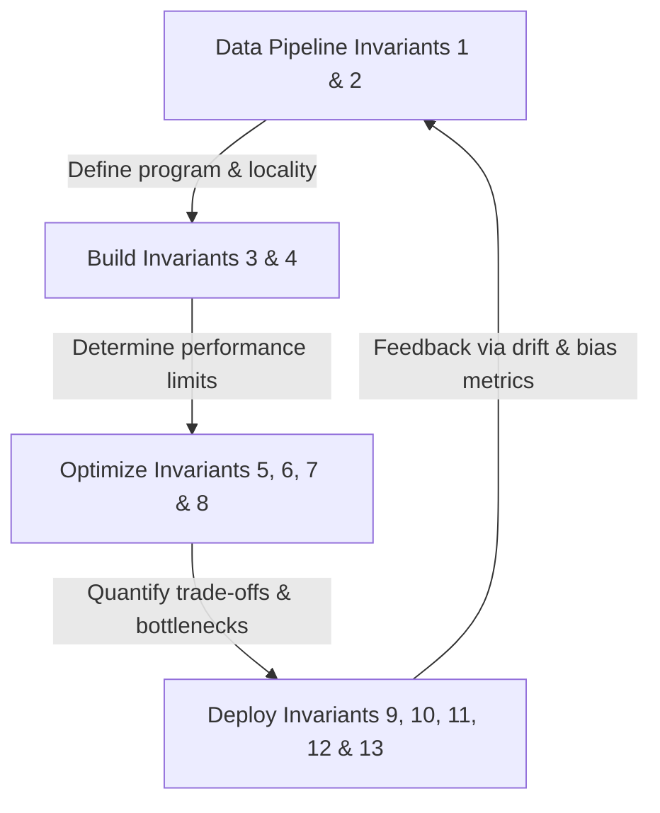

# Chapter 16: Conclusion & Thirteen Quantitative Invariants

## Material Covered in This Chapter

- Purpose
- 16
- Learning Objectives
- Checkpoint 16.1: Systems thinking
- The Integration
- The Holism
- Lighthouse models: Constraint propagation
- 16.2 Thirteen Quantitative Invariants
- Foundations: Where complexity originates (invariants 1-2)
- Build: How complexity becomes computation (invariants 3-4)
- Optimize: How constraints shape trade-offs (invariants 5-8)
- Deploy: How reality defeats assumptions (invariants 9-13)
- The integrated framework
- Checkpoint 16.2: Applying the invariants
- Systems Perspective 16.1: The cost of a token
- Physics:
- 16.3 Principles in Practice
- Building technical foundations
- Engineering for scale
- Navigating production reality
- 16.4 Future Directions
- Applying principles to emerging deployment contexts
- Building robust AI systems
- AI for societal benefit
- The path to AGI
- Systems Perspective 16.2: Anew golden age
- 16.5 Journey Forward
- The engineering responsibility
- Node to fleet
- 16.6 Fallacies and Pitfalls
- 16.7 Summary
- Key Takeaways: Reasoning across boundaries
- What's Next: From node to fleet
- BACK MATTER
- References

---

## Section-by-Section Preserve-and-Extend

# Chapter 16: Conclusion — Synthesizing ML Systems

## Overview & Learning Objectives

Success in machine learning systems engineering requires the capacity of an integrated system, rather than any single
algorithm, to exhibit intelligent behavior. This chapter synthesizes the technical foundations, performance scalability,
and operational realities explored throughout this book into a unified, physics-governed systems engineering framework.

By studying this chapter, you will be able to:
* **Synthesize the 13 quantitative invariants** introduced across the ML systems lifecycle into an integrated framework
governed by the **Conservation of Complexity**.
* **Trace constraint propagation** across the systems stack (from hardware boundaries to architectural styles, training
loops, compression, acceleration, serving, and drift monitoring).
* **Map workload bottlenecks** across diverse deployment paradigms—from resource-rich Warehouse-Scale Computers (WSC) to
resource-constrained TinyML and edge environments.
* **Diagnose and mitigate structural failures** (e.g., training-serving skew, statistical drift, latency tail
violations, and bias feedback loops) using quantitative profiling and analytical checks.
* **Critique socio-technical trade-offs** including democratization, scalability, environmental sustainability, and
demographic fairness constraints.

---

## 16.1 Synthesizing ML Systems: "The System is the Model"

A common industry failure mode involves treating the ML "model" as a static weights file (e.g., a 500 MB blob of
floating-point numbers). In a production environment, however, the weights are only one transient component of a larger
cybernetic loop.

> [!IMPORTANT]
> **The True Model is the System:** The production model is the sum of the data pipeline defining what the model sees,
the training infrastructure determining what it learns, the serving system deciding how it interacts with the world, and
the monitoring loop keeping it tethered to physical reality. Optimizing the system improves the model; neglecting the
system degrades it.

### Constraint Propagation and the Lighthouse Journey
The architectural and hardware decisions made at any level of the stack propagate constraints directly to all other
layers. To make this concrete, the book traced these interactions using five **Lighthouse Models**:
1. **ResNet-50:** Exemplifies compute-bound optimization, showing how batch size transforms memory-bound inference into
compute-bound throughput.
2. **GPT-2/Llama:** Exposes memory-bandwidth boundaries, where autoregressive decoding is memory-bound, KV-caches
dominate serving footprints, and model parallelism becomes necessary at scale.
3. **MobileNetV2:** Demonstrates efficiency under strict edge constraints, utilizing depthwise separable convolutions,
INT8 quantization, and hardware-software co-design for NPUs.
4. **Deep Learning Recommendation Model (DLRM):** Shifts the binding constraint to memory capacity, where terabyte-scale
embedding tables force system architectures to scale around sparse data placement.
5. **Keyword Spotting (KWS) / Wake Vision:** Represents extreme edge computing (TinyML), operating within sub-megabyte
memory footprints and microwatt power budgets.

Table 16.1 traces the systems lifecycle of **MobileNetV2**, showing how upstream decisions propagate and define
downstream constraints.

### Table 16.1: The Lighthouse Journey (MobileNetV2)

| Journey Phase | System Lens | MobileNetV2 Implementation & System Consequences |
| :--- | :--- | :--- |
| **Foundations (Ch. 1 & 4)** | The AI Triad | Bounded strictly by machine physical limits (battery capacity and thermal dissipation). |
| **Architecture (Ch. 6)** | Algorithmic Efficiency | **Depthwise Separable Convolutions:** Yields \(\approx 8\text{--}9\times\) fewer FLOPs than standard convolutions and \(\approx 14\times\) fewer operations than ResNet-50 at ImageNet scale. |
| **Training (Ch. 8)** | Throughput vs. Latency | Optimized for single-request mobile latency; training requires heavy data augmentation and regularization to handle low-capacity representations. |
| **Compression (Ch. 10)** | Pareto Frontier Navigation | **INT8 Quantization:** Achieves \(4\times\) memory footprint reduction with \(< 1\%\) degradation in top-1 accuracy. |
| **Acceleration (Ch. 11)** | Silicon Contract Alignment | Compilation of kernels directly to mobile Neural Processing Units (NPUs) to maximize compute-to-memory reuse. |
| **Serving (Ch. 13)** | Latency Budget Enforcement | Hard \(P_{99} < 50\text{ ms}\) latency target; requires optimized preprocessing pipelines (resizing/normalization) to prevent CPU bottlenecks. |
| **Operations (Ch. 14)** | System Entropy Control | **Drift Monitoring:** Statistical detection of input data and accuracy decay across diverse device populations, sensors, and lighting conditions. |

---

## 16.2 Thirteen Quantitative Invariants

The physics, statistics, and information-theoretic limits of ML systems are captured by thirteen fundamental invariants.
These form a unified framework linked by the **Meta-Principle of the Conservation of Complexity**:

> [!NOTE]
> **Conservation of Complexity:** Complexity in an ML system cannot be eliminated; it can only be redistributed.
Reducing model complexity (e.g., via quantization) increases operational complexity (e.g., monitoring numerical drift
and skew). Simplifying high-level software interfaces shifts optimization complexity down to compilers, kernels, and
runtime engines.

### Table 16.2: The Thirteen Quantitative Invariants of ML Systems Engineering

| # | Invariant | Phase | Mathematical Formulation | Architectural Prediction |
| :-: | :--- | :--- | :--- | :--- |
| **1** | **Data as Code** | I: Foundations | \[\text{System Behavior} \approx f(\mathcal{D})\] | The program is defined by the dataset \(\mathcal{D}\). Changing data changes the program's logical paths. |
| **2** | **Data Gravity** | I: Foundations | \[\text{Cost}_{\text{move}}(\mathcal{D}) \gg \text{Cost}_{\text{move}}(\theta)\] | Data acts as a physical anchor. Compute resources (\(\theta\), optimization loops) must be brought to the data rather than vice versa. |
| **3** | **Iron Law of ML Systems** | II: Build | \[T = \frac{D_{\text{vol}}}{BW} + \frac{O}{R_{\text{peak}} \cdot \eta_{\text{hw}}} + L_{\text{lat}}\] | Optimization is a zero-sum game across data movement ($D_{\text{vol}}/BW$), computation (\(O / (R_{\text{peak}} \cdot \eta_{\text{hw}})\)), and system overhead (\(L_{\text{lat}}\)). |
| **4** | **Silicon Contract** | II: Build | \[\text{Sat}_{\text{HW}} \propto \text{Align}(\text{Kernel}, \text{Architecture})\] | Hardware efficiency (\(\eta_{\text{hw}}\)) drops precipitously if memory layout and matrix tiles mismatch the hardware's vector/tensor core configurations. |
| **5** | **Pareto Frontier** | III: Optimize | \[\mathcal{P} = \{x \in \mathcal{X} \mid \nexists y \in \mathcal{X} \text{ s.t. } y \succ x\}\] | Multi-objective trade-offs are absolute: speed, memory footprint, energy, and accuracy cannot be simultaneously maximized without compromises. |
| **6** | **Arithmetic Intensity** | III: Optimize | \[I = \frac{\text{FLOPs}}{\text{Memory Accesses (Bytes)}}\] | Workloads are memory-bound if \(I < \frac{R_{\text{peak}}}{BW}\) and compute-bound if \(I > \frac{R_{\text{peak}}}{BW}\). Hardware scalability behaves step-wise at this threshold. |
| **7** | **Energy-Movement** | III: Optimize | \[E_{\text{DRAM\_Access}} \approx 100\text{--}1,000 \times E_{\text{FLOP}}\] | Data locality (register and cache retention) dominates hardware efficiency. The cost of arithmetic is trivial compared to the cost of moving bits. |
| **8** | **Amdahl's Law** | III: Optimize | \[\text{Speedup} = \frac{1}{(1-p) + \frac{p}{s}}\] | The serial fraction (\(1-p\)), typically data loading, IO, or single-threaded orchestration, limits the asymptotic gains of GPU/TPU parallelism (\(s\)). |
| **9** | **Verification Gap** | IV: Deploy | \[\Pr(f(X) \approx Y) > 1-\epsilon\] | ML validation is fundamentally statistical. Testing bounds the probability of error (\(\epsilon\)) but cannot prove functional correctness. |
| **10** | **Statistical Drift** | IV: Deploy | \[\text{Accuracy}(t) \approx \text{Accuracy}_0 - \lambda \cdot \mathcal{D}_{\text{JS}}(P_t \parallel P_0)\] | Real-world serving distributions (\(P_t\)) drift from training distributions (\(P_0\)), leading to accuracy erosion without any code changes. |
| **11** | **Training-Serving Skew** | IV: Deploy | \[\Delta\text{Accuracy} \approx \| g_{\text{serve}}(X) - g_{\text{train}}(X) \|\] | Minor discrepancies in preprocessing pipelines ($g(X)$) silently degrade model prediction accuracy in production. |
| **12** | **Latency Budget** | IV: Deploy | \[P_{99} \le \text{Latency SLO}\] | The 99th-percentile tail latency is the governing physical constraint. Average latency is a deceptive metric that ignores queueing delays. |
| **13** | **Bias Feedback Loop** | IV: Deploy | \[\Delta_g(k) \approx \Delta_g(0) \cdot \alpha^k \quad (\alpha > 1)\] | Errors and prediction disparities against subgroups (\(g\)) compound exponentially over decision cycles (\(k\)) when outputs shape future inputs. |

---

## 16.3 Systems Perspective: The Cost of a Token

To see how the **Iron Law** (Invariant 3) and **Arithmetic Intensity** (Invariant 6) apply to system design, let us
calculate the physical cost of generating one token from a **70-Billion Parameter Model** (like Llama-2-70B) in FP16
precision on a single **NVIDIA H100 GPU**.

### The Physics
* **Model Footprint (\(D_{\text{vol}}\)):**
  \[70 \times 10^9 \text{ parameters} \times 2 \text{ bytes/param} = 140 \text{ GB}\]
* **Compute Footprint (\(O\)):**
  Autoregressive decoding processes one token at a time. Each generation step requires loading the entire model weights
and performing approximately 2 FLOPs per parameter:
  \[2 \times 70 \times 10^9 = 140 \text{ GFLOPs per token}\]
* **Hardware Profile:**
  * Memory Bandwidth (\(BW\)) = $3.35 \text{ TB/s} = 3350 \text{ GB/s}$
  * Peak Compute (\(R_{\text{peak}}\)) = $989 \text{ TFLOPs/s} = 989,000 \text{ GFLOPs/s}$ (FP16)

### The Time Breakdown
1. **Time to move weights from HBM to SRAM (\(T_{\text{mem}}\)):**
   \[T_{\text{mem}} = \frac{140 \text{ GB}}{3350 \text{ GB/s}} \approx 41.8 \text{ ms}\]
2. **Time to execute matrix multiplication (\(T_{\text{comp}}\)):**
   \[T_{\text{comp}} = \frac{140 \text{ GFLOPs}}{989,000 \text{ GFLOPs/s}} \approx 0.14 \text{ ms}\]

### Systems Analysis
* **Latency Ratio:**
  \[\frac{T_{\text{mem}}}{T_{\text{comp}}} = \frac{41.8 \text{ ms}}{0.14 \text{ ms}} \approx 298.6\]
  The data movement stage is **\(298.6\times\) slower** than the computation stage. The arithmetic intensity of this
single-batch decoding is:
  \[I = \frac{140 \text{ GFLOPs}}{140 \text{ GB}} = 1.0 \text{ FLOP/byte}\]
  Since $1.0 \ll \frac{R_{\text{peak}}}{BW} \approx 295 \text{ FLOPs/byte}$, the processor stalls, operating at **\(<
0.05\%\)** of its peak compute capability.
* **Systems Engineering Remediation:**
  To honor the silicon contract, a systems engineer must either:
  * **Increase Arithmetic Intensity:** Group multiple concurrent user requests together (continuous batching) so that
the loaded model weights are reused across \(B\) queries:
    \[I = B \text{ FLOPs/byte}\]
  * **Reduce Data Volume (\(D_{\text{vol}}\)):** Compress the model parameters (e.g., via AWQ or GPTQ INT4 quantization)
to shrink the physical model size to \(35 \text{ GB}\), cutting \(T_{\text{mem}}\) to \(\approx 10.4 \text{ ms}\).

---

## 16.4 Principles in Practice

An engineer who understands invariants as isolated mathematical formulas cannot build robust production pipelines. In
practice, these constraints form a web of mutual dependencies:

### 1. Building Technical Foundations (Invariants 1–2)
Foundational layers determine data gravity and code flow. Neural computation routines (Ch. 5) compile into high-level
execution graphs in PyTorch or JAX (Ch. 7). The choice of graph compiler, tensor layout, and intermediate representation
(IR) determines the hardware boundaries of the system.

### 2. Engineering for Scale (Invariants 3–8)
Distributed training (Ch. 8) splits computational graphs across multi-node clusters. The trade-offs are governed by the
interaction of:
* **The Iron Law (3) & Silicon Contract (4):** Mixed-precision training (FP8/FP16) halves \(D_{\text{vol}}\), while
gradient checkpointing trades computation (recomputing activations) for memory capacity.
* **Amdahl's Law (8):** As GPUs accelerate the compute term, the serial preprocessing, tokenization, and multi-node
gradient synchronization routines become the ultimate limits to training throughput.

### 3. Production MLOps and Serving (Invariants 9–13)
Deploying models requires managing statistical risks:
* **Verification Gap (9) & Statistical Drift (10):** Aggregate metrics hide localized failures. Production drift
detection requires monitoring divergence metrics (\(\mathcal{D}_{\text{JS}}(P_t \parallel P_0)\)) for individual
demographic cohorts.
* **Training-Serving Skew (11) & Latency Budget (12):** A chatbot serving pipeline must employ optimizations like
speculative decoding—where a small, fast draft model generates candidate tokens verified in parallel by a larger
model—to keep tail latencies (\(P_{99}\)) within strict interactive budgets.
* **Bias Feedback Loops (13):** Algorithmic audits (Ch. 15) must trace how model decisions influence downstream training
data, preventing reinforcing feedback loops from locking in historical disparities.

---

## 16.5 Future Directions

Systems thinking is the primary tool for navigating four emerging technical frontiers:

### Diverse Deployment Paradigms
* **Cloud Infrastructure:** Optimizes for compute-bound density, leveraging massive cluster topologies, model sharding
(tensor/pipeline/expert parallelism), and liquid cooling to sustain high hardware utilization.
* **Mobile & Edge:** Trades representation capacity for low power. It relies on hardware-software co-design to align
compiler representations with specific on-device NPU data paths.
* **TinyML & Microcontrollers:** Operates under extreme constraints, where physical hardware parameters (e.g., SRAM
capacity under 256 KB) force model pruning and quantization to be joint optimization targets.
* **Generative AI Systems:** Solves memory-bound autoregressive decoding through dynamic cache management (e.g.,
PagedAttention), speculative execution, and structured token streaming.

### Robustness & Uncertainty Quantification
Because ML testing is statistical (Invariant 9), systems must be designed to handle silent errors. This requires
integrating uncertainty quantification directly into the API contracts, enabling models to decline to predict or route
low-confidence outputs to fallback heuristic pipelines or human reviewers.

### Compound AI Systems
Rather than relying on single, monolithic models to resolve complex workflows, compound systems chain multiple
specialized models, vector stores (RAG), and deterministic tools. The engineering challenge is managing latency and
error propagation: if each node in a 3-stage chain has an error rate of \(5\%\), the compound system's failure rate can
compound to \(1 - (0.95)^3 \approx 14.3\%\).

---

## 16.6 Node to Fleet: Warehouse-Scale Computing

The companion volume shifts focus from **Mastering the ML Node** (individual GPUs, compilers, and local pipelines) to
**Orchestrating the ML Fleet**.

> [!TIP]
> **The Data Center as the Computer:** In fleet-scale AI, the Warehouse-Scale Computer (WSC) is the baseline unit.
Single-chip memory bandwidth constraints expand to cross-rack network fabric topologies. Network switches represent the
L3 cache, racks act as execution clusters, and optical fiber interconnects function as the system bus.

In this regime:
* **Fault Tolerance is Dynamic:** In a cluster of $10,000$ accelerators, the Mean Time Between Failures (MTBF) drops to
hours. The training runtime must dynamically handle node failures, partition hardware, and restore progress from
distributed checkpoints without halting the global optimization run.
* **Distributed Consensus:** Synchronizing updates across a fleet turns optimization into a network consensus problem,
where gradient compression and asynchronous all-reduce protocols are critical to mitigate communication bottlenecks.

---

## 16.7 Fallacies and Pitfalls

### Fallacy 1: Systems complexity is eliminated by higher-level tools.
* **Reality:** Complexity is conserved. High-level frameworks (AutoML, serverless serving, automated compilation)
simplify developer interfaces but shift the optimization burden downstream, making low-level bottlenecks (e.g.,
compilation caches, memory fragmentation) harder to diagnose.

### Fallacy 2: More data always improves system performance.
* **Reality:** Datasets have statistical saturation points. Beyond a threshold, adding random training samples yields
logarithmic returns in accuracy while linearly increasing I/O bandwidth, storage gravity, preprocessing costs, and
training duration.

### Fallacy 3: A single accuracy metric captures model quality.
* **Reality:** Aggregate accuracy is a one-dimensional abstraction of a high-dimensional Pareto frontier. It hides tail
latency degradation, throughput bottlenecks, energy costs, and demographic disparities.

### Pitfall 1: Optimizing a single pipeline stage without profiling the full system.
* **Reality:** Violates Amdahl's Law. Accelerating matrix multiplication kernels by \(10\times\) yields negligible
overall speedups if the data loading pipeline is the dominant bottleneck.

### Pitfall 2: Deploying models without automated rollback loops.
* **Reality:** Models are statistical engines that degrade as serving distributions drift. Monitoring without automated
rollback is passive observation, not engineering control. Rollback loops must be programmed into the continuous
deployment pipeline.

---

## Key Takeaways

1. **Thirteen quantitative invariants govern ML systems:** Grounded in physics, information theory, and statistics,
these principles determine performance limits across all hardware architectures and model families.
2. **The system is the model:** Production performance is the integrated product of data pipelines, training clusters,
serving engines, and feedback loops.
3. **The Silicon Contract is unyielding:** Hardware utilization (\(\eta_{\text{hw}}\)) only scales when software kernel
tiles match the hardware’s spatial computing structure.
4. **Statistical drift is inevitable:** Because the physical world is dynamic, model accuracy erodes over time,
requiring designed-in monitoring, validation, and rollback loops.
5. **Democratization requires efficiency:** High-throughput, low-power systems engineering is the only sustainable
mechanism to deploy advanced AI capabilities globally without prohibitive carbon footprints or hardware concentration.
6. **The data center is the new compute node:** Scaling to frontier capabilities requires extending single-node systems
engineering concepts to Warehouse-Scale Computers governed by network fabric physics.

---

## Full Slice Content (Docling Extract, Preserved Verbatim)

> Each section below preserves the source slice content as extracted by docling. Image placeholders are removed; tables,
equations, code blocks, named artifacts, and footnotes are kept intact.

## Purpose

What does mastering the full stack enable that expertise in any single layer cannot?

Data pipelines, architectures, training systems, compression techniques, accelerators, serving infrastructure,
operational practices, responsible engineering: mastered individually, each is a valuable skill. Mastered together, they
become something qualitatively different: the ability to reason across boundaries . An engineer who understands only
compression can shrink a model, but cannot predict whether the accuracy loss matters for the deployment context. An
engineer who understands only serving can optimize latency, but cannot trace a performance regression to a data pipeline
change three stages upstream. The discipline of ML systems engineering is the discipline of seeing these connections:
understanding that a model architecture choice determines memory requirements that constrain hardware selection, which
influences quantization strategy, which affects accuracy, which feeds back to architecture design. Each layer of the
stack interacts with every other, and the interactions are where the hardest problems live; not in any single component
but in the spaces between them, where one team's optimization becomes another team's constraint. The principles
governing these interactions, including constraint propagation, the memory wall, the training-serving inversion, and the
iteration tax, are not tied to any specific framework, hardware generation, or model family. Technologies will change;
the physics and the trade-offs will not. What endures is the ability to look at a system that does not yet exist and
reason about how its pieces will interact, where its bottlenecks will emerge, and which design decisions will prove
irreversible. That ability to think in systems rather than components is what separates an engineer who can build a part
from one who can build the whole.

## 16

16.1 Synthesizing ML Systems 16.2 Thirteen Quantitative Invariants 16.3 Principles in Practice 16.4 Future Directions
16.5 Journey Forward 16.6 Fallacies and Pitfalls 16.7 Summary

1 Artificial Intelligence (Systems Perspective) : The capacity of an integrated system, rather than any single
algorithm, to exhibit intelligent behavior. Throughout this book, we have seen that success depends on coordinating data
pipelines, training infrastructure, inference serving, security, and governance: systems engineering excellence across
all components.

## Learning Objectives

- Synthesize the quantitative invariants introduced across Parts I through IV into an integrated framework governed by
the conservation of complexity
- Analyze how these invariants manifest across technical foundations, performance at scale, and production reality
- Trace how data pipelines, training, model architectures, hardware acceleration, and operations propagate constraints
through integrated ML systems
- Evaluate trade-offs between deployment contexts by applying multiple principles to assess scalability, efficiency, and
reliability
- Critique how technical choices in efficiency, security, and sustainability affect democratization, accessibility, and
environmental impact
- Formulate strategies for applying systems thinking to emerging challenges in robust AI, compound systems, and
artificial general intelligence
- Identify how single-node principles extend to fleet-scale systems where the data center becomes the computer

16.1 Synthesizing ML Systems I magine deploying a new image classification model to a fleet of mobile devices. The
architecture team chose depthwise separable convolutions for efficiency. The compression team quantized to INT8 for
speed. The serving team hit a P99 latency target of 50 ms. Every team succeeded by its own metric-yet within weeks, user
complaints arrive: accuracy has dropped by 4 percentage points on certain device populations. The cause was a subtle
interaction between the quantization scheme and a firmware-specific image preprocessing path that no single team could
have predicted. The data pipeline, the architecture, the compression strategy, the hardware target, and the monitoring
infrastructure all interacted in ways that only a systems-level perspective could diagnose.

Thebookbeganwithamathematical formula: the iron law of ML systems (Principle 3) (Section 1.7). Its terms, data movement,
compute, and overhead, once seemed abstract. Now they serve as primary engineering levers for quantitative analysis of
systems that once seemed opaque. Building intelligence requires more than writing algorithms: it requires honoring the
silicon contract (Principle 4), the physical and economic agreement between the model and the machine. Chapter 11
equipped us to calculate arithmetic intensity and identify whether workloads are memory bound or compute bound,
converting vague performance intuitions into quantitative engineering decisions.

The mobile deployment failure illustrates the central lesson of every chapter in this book. The introduction (Chapter 1)
posed a foundational question: why does building machine learning systems require engineering principles fundamentally
different from those governing traditional software? Every subsequent chapter answered a piece of that question, and the
full answer runs deeper than any single component could reveal.

The quantitative foundation leads to a broader point: contemporary artificial intelligence 1 achievements are the
product of careful integration across interacting components, not any single algorithmic insight. Machine learning
belongs to the same engineering tradition that built reliable computers, where emergent capabilities arise from
coordinating many parts together. The transformer architectures (Vaswani et al. 2017) enabling large language models
exemplify this principle: their mathematical elegance alone does not explain their dominance. Their practical utility
depends on integrating attention mechanisms with distributed training infrastructure, memory-efficient optimization
techniques, and reliable operational frameworks.

Integration has concrete consequences. We often speak of the 'model' as the weights file, a 500 MBblob of floating-point
numbers. In a production environment, however, the weights are only one component of the true model, and often not the
most important one. A model that produces perfect predictions is useless if it receives corrupted inputs, and a model
that trains flawlessly will fail if it cannot be deployed reliably. The true model is the sum of the data pipeline that
defines what the model sees, the training infrastructure that determines what it learns, the serving system that decides
how it interacts with the world, and the monitoring loop that keeps it tethered to reality. Optimize the system, and the
model improves. Neglect the system, and the model degrades. Systems engineering is not a wrapper around ML; it is the
implementation of ML. The system is the model.

## Checkpoint 16.1: Systems thinking

An ML system is greater than the sum of its parts.

## The Integration

- [ ] □ Dependencies: Do you understand how a change in the data pipeline affects the model's latency?

- [ ] □ Feedback Loops: Have you mapped how the model's predictions influence its future training data?

## The Holism

- [ ] □ End-to-End: Can you trace a user request from the UI, through the network, preprocess- ing, model,
postprocessing, and back to the UI?

The insight that system boundaries define model capabilities has guided the exploration throughout this book. The
journey from Part I's foundations through Part IV's production reality traced a deliberate arc, and each stage built on
what came before.

Part III shifted from building to optimizing. Model compression (Chapter 10) renegotiated the silicon contract for
deployment. Hardware acceleration (Chapter 11) maximized the throughput those compressed models could achieve.
Benchmarking (Chapter 12) provided the measurement discipline to verify that optimizations delivered real improvements
rather than illusory gains.

Part II established what ML systems compute and how . The mathematical primitives of neural computation (Chapter 5) and
the architectural families built from them (Chapter 6) defined the computational substrate. Training systems (Chapter 8)
orchestrated billions of optimization steps on that substrate, while frameworks (Chapter 7) compiled high-level model
definitions into hardwarespecific execution plans. Upstream of the model, the data engineering (Chapter 4) and data
selection (Chapter 9) pipelines determined what the model learns from.

Finally, Part IV confronted production reality. Serving systems (Chapter 13) had to meet latency budgets under load.
Operational practices (Chapter 14) maintained model health over time as data distributions shifted. Responsible
engineering (Chapter 15) ensured that systems serve all users fairly, not just the populations best represented in
training data.

The remainder of this chapter distills that integrated perspective into a framework for reasoning about ML systems as
wholes rather than as collections of parts. We begin by revisiting the Lighthouse Models that traced these constraint
interactions across chapters, then formalize thirteen quantitative invariants, rooted in physics, information theory,
and statistics, that govern ML system behavior regardless of framework, hardware generation, or model family. We then
examine how these principles apply across three domains, explore future directions where systems thinking will matter
most, and close with the engineering responsibility that accompanies building systems of this power.

Each chapter contributed a piece. The real lesson, however, lies not in any individual piece but in how the pieces
constrain each other . An architecture choice enabled a compression choice, which enabled an acceleration choice, which
shaped a serving constraint, which defined an operational requirement. Depthwise separable convolutions in MobileNetV2
allowed INT8 quantization with minimal accuracy loss. That quantization in turn enabled mobile NPU deployment, which
shaped a 𝑃99 < 50 ms latency constraint and required drift monitoring across heterogeneous device populations. Every
decision propagated forward, and the engineer who understands only one layer cannot predict how changes ripple through
the rest.

## Lighthouse models: Constraint propagation

The five Lighthouse Models introduced in Section 1.7 made this constraint propagation concrete, serving as systems
detectives throughout the book. Each revealed how different workloads expose different bottlenecks.

ResNet-50 taught compute-bound optimization, showing how batch size transforms memorybound inference into compute-bound
throughput and why the same pruning strategy achieves different speedups on different hardware. GPT-2/Llama exposed a
different wall entirely: memory bandwidth. Their autoregressive decoding is memory bound, KV-caches dominate serving
costs, and model parallelism becomes necessary at scale. Where these two Lighthouses stressed throughput and bandwidth,
MobileNetV2 demonstrated efficiency under constraint: depthwise separable convolutions trading representational capacity
for computational efficiency, quantization enabling deployment on mobile NPUs, and the Pareto frontier between accuracy
and power consumption. Deep Learning Recommendation Model (DLRM) shifted the binding constraint yet again, from memory
bandwidth to memory capacity, where terabyte-scale embedding tables force engineers to design the system architecture
around where the data physically resides and where sparse operations behave fundamentally differently from the dense
matrix multiplications that dominate the other Lighthouses. Finally, Keyword Spotting (KWS) and Wake Vision brought us
to the extreme edge: sub-megabyte models running on microcontrollers with always-on inference under microwatt power
budgets, where every byte and every milliwatt matters.

Table 16.1 traces this journey for a single model, MobileNetV2, demonstrating how every chapter's principles converge on
a single engineering artifact. The table walks through seven phases (from foundational constraints through architecture,
training, compression, acceleration, serving, and operations) showing how each phase's decisions propagate forward to
shape what becomes possible in subsequent phases.

Together, these five workloads span the full deployment spectrum from data center to microcontroller, probing every
bottleneck the invariants predict and testing every optimization strategy the book has taught. The systems thinking we
developed by tracing these Lighthouses across chapters, from architecture design through training, optimization, and
deployment, is the integrated perspective that distinguishes ML systems engineering from isolated algorithm development.

Table 16.1: The Lighthouse Journey (MobileNetV2) : Tracing one model through the entire systems stack reveals how
decisions in one domain (for example, architecture) propagate constraints and opportunities to every other domain (for
example, hardware acceleration and monitoring).

| Journey Phase             | System Lens                    | MobileNetV2 Implementation                                                                                                                                                |
|---------------------------|--------------------------------|---------------------------------------------------------------------------------------------------------------------------------------------------------------------------|
| Foundations (Chapter 1)   | The AI Triad                   | Bounded by Machine constraints (Battery/Thermal)                                                                                                                          |
| Architecture (Chapter 6)  | Algorithmic Efficiency         | Depthwise Separable Convolutions: about 8-9 × fewer FLOPs than comparable standard convolution layers and roughly 14 × fewer operations than ResNet-50 at ImageNet scale |
| Training (Chapter 8)      | Throughput vs. Latency         | Optimized for single-request mobile latency; training requires data augmentation for robustness ×                                                                        |
| Compression (Chapter 10)  | Navigating the Pareto Frontier | INT8 Quantization: 4 memory reduction with minimal accuracy loss (<1 percent)                                                                                            |
| Acceleration (Chapter 11) | Honoring the Silicon Contract  | Mapping kernels to Mobile NPUs (for example, Apple Neural Engine) to maximize hardware utilization                                                                        |
| Serving (Chapter 13)      | Respecting the Latency Budget  | 𝑃99<50 ms constraint; optimizing preprocessing (resize/normalize) to avoid CPU bottlenecks                                                                                |
| Operations (Chapter 14)   | Managing System Entropy        | Drift Monitoring: Detecting accuracy decay across heterogeneous device populations and lighting conditions                                                               |

The table reveals a pattern: every row's decisions constrain the next row's options. Architecture choices (depthwise
separable convolutions) enabled compression choices (INT8 quantization), which in turn enabled acceleration choices
(mobile NPU deployment). Constraint propagation governs every ML system, but the MobileNetV2 journey is one instance of
a deeper structure. The question is which quantitative invariants transcend specific models and technologies. The answer
lies in thirteen principles, each grounded in physics, information theory, or statistics, that recur across every
Lighthouse model and every deployment context.

## 16.2 Thirteen Quantitative Invariants

Throughout this book, each Part introduced quantitative principles that govern ML system behavior. The principles are
not rules of thumb or best practices that evolve with fashion. They are invariants: constraints rooted in physics,
information theory, and statistics. Table 16.2 collects all thirteen in one place, organized by the four Parts that
revealed them. The first two columns identify each principle, the third locates where it was introduced, and the final
two columns capture its mathematical essence and predictive power.

Table 16.2: The Thirteen Quantitative Invariants of ML Systems Engineering: Each invariant was introduced in the Part
where its governing constraint first becomes visible. Together, they form the complete analytical framework for
reasoning about MLsystem design, optimization, and deployment. The meta-principle that unifies them all is the
conservation of complexity: complexity cannot be destroyed, only moved between data, algorithm, and machine.

|   # | Principle                   | Part           | Core Equation/Statement                                                                                      | What It Predicts                                                               |
|-----|-----------------------------|----------------|--------------------------------------------------------------------------------------------------------------|--------------------------------------------------------------------------------|
|   1 | Data as Code Invariant      | I: Foundations | System Behavior ≈𝑓( Data                                                                                     | Changing data changes the program                                              |
|   2 | Data Gravity Invariant      | I: Foundations | ) move move Compute )                                                                                        | Move compute to data, not data to compute                                      |
|   3 | Iron Law ofML Systems       | II: Build      | 𝐶 (𝐷)≫𝐶 ( 𝑇 = 𝐷 vol BW + 𝑂 𝑅 peak ⋅𝜂 hw +𝐿 lat                                                               | Every optimization pulls one of three levers; reducing one may inflate another |
|   4 | Silicon Contract            | II: Build      | Every architecture bets on which hardware resource it saturates                                              | Mismatched hardware wastes money; matched hardware achieves peak throughput    |
|   5 | Pareto Frontier             | III: Optimize  | Multi-objective optimization; no free improvements 𝑅= (𝑅, 𝐼× )                                              | There is no universal optimum; every gain trades against another metric        |
|   6 | Arithmetic Intensity Law    | III: Optimize  | min peak BW                                                                                                  | Adding compute to a memory-bound model yields zero gain                        |
|   7 | Energy-Movement Invariant   | III: Optimize  | 𝐸 move ≫𝐸 compute (100-1,000 × )                                                                             | Data locality, not raw FLOPS, drives efficiency                                |
|   8 | Amdahl's Law                | III: Optimize  | Speedup = 1 (1-𝑝)+ 𝑝 𝑠                                                                                       | The serial fraction caps all parallelism gains                                 |
|   9 | Verification Gap            | IV: Deploy     | Pr (𝑓(𝑋)≈𝑌)>1-𝜖                                                                                              | MLtesting is statistical; it bounds error, not proves correctness              |
|  10 | Statistical Drift Invariant | IV: Deploy     | Accuracy (𝑡)≈ Accuracy 0 -𝜆⋅𝒟(𝑃 𝑡 ‖𝑃 0 )                                                                     | Models decay without code changes; the world drifts away from training data    |
|  11 | Training-Serving Skew Law   | IV: Deploy     | Δ Accuracy ≈ serve train                                                                                     | Even subtle preprocessing differences silently degrade accuracy                |
|  12 | Latency Budget Invariant    | IV: Deploy     | 𝔼[&#124;𝑓 (𝑥)-𝑓 (𝑥)&#124;] P99 is the hard constraint; throughput is optimized within it Δ (𝑘)≈Δ (0)⋅𝛼 𝑘 𝛼>1 | Throughput is optimized within the latency envelope, never at its expense      |
|  13 | Bias Feedback Invariant     | IV: Deploy     | 𝑔 𝑔,                                                                                                        | Errors against subgroups compound across cycles when outputs reshape inputs    |

The thirteen invariants are not independent axioms. They form an integrated framework unified by a single
meta-principle: the conservation of complexity 2 . Complexity in an ML system cannot be destroyed; it can only be moved
between data, algorithm, and machine. Every invariant in Table 16.2 quantifies a specific consequence of where
complexity currently resides. The sections that follow trace how each Part's invariants connect to the Lighthouse models
and to each other.

## Foundations: Where complexity originates (invariants 1-2)

The data as code invariant (Principle 1) and the data gravity invariant (Principle 2), established in Part I and
developed quantitatively in Chapter 4 where data pipelines determine model quality, establish that data is
simultaneously the logical program and the physical anchor of every ML system.

The Lighthouse models illustrate both invariants directly. ResNet-50 and GPT-2 are Data as Code embodied: their
capabilities derive from what they were trained on, not from their architectures

2 Conservation of Complexity: Analogous to conservation laws in physics (conservation of energy, conservation of mass),
this meta-principle asserts that system complexity cannot be eliminated, only redistributed. Quantization reduces model
complexity but increases monitoring complexity. Abstraction layers simplify interfaces but push complexity to
implementation. The term echoes Tesler's Law of Conservation of Complexity in human-computer interaction, which holds
that every application has an inherent amount of irreducible complexity that can only be shifted between the system and
the user.

alone. DLRM is data gravity embodied: its terabyte-scale embedding tables force the system architecture to be designed
around where the data physically resides. These two invariants explain why the 'compute-to-data' pattern recurs in every
deployment context from cloud to edge.

## Build: How complexity becomes computation (invariants 3-4)

The iron law (Principle 3) and the silicon contract (Principle 4) govern every decision in constructing an ML system.
The iron law's three-term decomposition (introduced in Section 1.7) identifies which lever to pull; the silicon contract
determines which term dominates for a given architecturehardware pair. As the Lighthouse Journey showed, each model
represents a different bet: ResNet-50 is compute bound, Llama is bandwidth bound, DLRM is capacity-bound, and
MobileNetV2 reshapes its computation to fit mobile NPU constraints. Chapter 8 confirmed that training time reduces only
when engineers optimize the dominant term rather than distributing effort uniformly.

## Optimize: How constraints shape trade-offs (invariants 5-8)

The four optimization invariants form a tightly coupled diagnostic chain. The Pareto frontier (Principle 5) establishes
that no free improvements exist: quantization trades precision for bandwidth, pruning trades capacity for speed, and
distillation trades training compute for inference efficiency. The arithmetic intensity law (Principle 6) diagnoses
which resource is the bottleneck, revealing whether optimization should target compute or memory. The energy-movement
invariant (Principle 7) explains why data locality dominates efficiency: moving a bit from DRAM costs 100 to 1,000 times
more energy than computing on it. Amdahl's Law (Principle 8) sets the ceiling on any parallelism gain, explaining why
data loading and preprocessing become the ultimate bottlenecks in highly optimized systems.

MobileNetV2 (our Lighthouse from Chapter 6) navigates all four simultaneously: depthwise separable convolutions reshape
the Pareto frontier, quantization to INT8 exploits the arithmetic intensity law by fitting more operations per byte of
bandwidth, and the resulting energy savings respect the energy-movement invariant while Amdahl's Law explains why the
nonaccelerable preprocessing stage limits end-to-end speedup. The KWS Lighthouse pushes these trade-offs to their
extreme, where sub-megabyte models on microcontrollers leave zero margin for waste on any axis.

## Deploy: How reality defeats assumptions (invariants 9-13)

The deployment invariants address a category of failure that the first eight invariants cannot prevent: the system works
correctly on the bench but degrades silently in production. The verification gap (Principle 9) establishes that ML
testing is fundamentally statistical; engineers bound error rather than prove correctness. The statistical drift
invariant (Principle 10) quantifies how accuracy erodes as the world drifts from the training distribution, even when no
code changes. The training-serving skew law (Principle 11) warns that even subtle differences between training and
serving code paths (a different image resize library, a float32 vs. float64 normalization) silently degrade accuracy.
The latency budget invariant (Principle 12) constrains the entire serving architecture: P99 latency is the hard
constraint, and throughput is optimized within that envelope, never at its expense. The bias feedback invariant
(Principle 13) extends silent failure to fairness: when a model's outputs reshape the distribution of its future inputs,
errors against subgroups compound across decision cycles, Δ 𝑔 (𝑘) ≈ Δ 𝑔 (0)⋅𝛼 𝑘 with 𝛼 > 1, producing accuracy
disparities invisible to aggregate metrics.

The five deployment invariants explain why Chapter 14 devoted extensive attention to monitoring, drift detection,
feature stores, and disaggregated subgroup metrics, the operational infrastructure that catches silent failures before
they reach users. A DLRM recommendation system that achieves excellent offline accuracy will lose revenue if
training-serving skew corrupts feature values in production (Principle 11) or if user behavior drifts seasonally without
triggering retraining (Principle 10). GPT-2/Llama serving must respect the latency budget (Principle 12) through
techniques like continuous batching and speculative decoding, as detailed in Chapter 13, because a chatbot that responds
in 10 seconds is a chatbot nobody uses. A loan approval system can satisfy every other invariant while still
systematically denying credit to underserved communities, a feedback loop the bias feedback invariant (Principle 13)
predicts will compound each cycle until disaggregated subgroup monitoring catches it.

## The integrated framework

The thirteen principles are not a checklist to apply sequentially. They form a web of mutual constraints. As the
conservation of complexity dictates, a single engineering decision ripples through multiple invariants simultaneously.

Meanwhile, the data gravity invariant (Principle 2) determines where the model runs, the data as code invariant
(Principle 1) determines what it learned, the iron law (Principle 3) determines how fast it runs, and Amdahl's Law
(Principle 8) determines how much faster it can ever run. The verification gap (Principle 9) reminds us that statistical
tests can only bound the resulting accuracy loss, and the statistical drift invariant (Principle 10) warns that even a
validated deployment will degrade over time. Complexity is conserved; the engineer's task is to allocate it wisely.

To see this concretely, trace what happens when an engineer quantizes a model from FP16 to INT8. This single decision
navigates the Pareto frontier (Principle 5), trading precision for bandwidth. The consequences do not stop there:
quantization changes the model's silicon contract (Principle 4), shifting where it sits on the arithmetic intensity
curve (Principle 6) and altering its energy profile (Principle 7). When that quantized model is deployed, the latency
budget (Principle 12) governs whether the speedup meets the SLO, while the training-serving skew law (Principle 11)
demands verification that reduced precision did not introduce a divergence between training and serving behavior. A
single quantization decision ripples through the Pareto frontier, silicon contract, and latency budget simultaneously,
where a win in one (bandwidth) must be validated against a risk in another (numerical skew).

To see this cycle of mutual constraint in action, trace the flow in Figure 16.1. The four phases (Foundations, Build,
Optimize, Deploy) surround a central hub representing the conservation of complexity, and the arrows map the perpetual
flow of engineering decisions: each phase's choices constrain what becomes possible in the next, and the cycle
eventually feeds back to the beginning. Decisions in the Build phase (governed by the iron law) constrain the Optimize
phase (bounded by arithmetic intensity). Operational realities like drift and skew force feedback into the Foundations,
requiring new data to stabilize the system. The engineer's role is to manage this flow, ensuring that complexity lands
where it can be handled most efficiently.

Figure 16.1: The Cycle of ML Systems (The 13 Invariants) : The complete systems engineering lifecycle. The
meta-principle of conservation of complexity (center) unifies the process: complexity is neither created nor destroyed,
only shifted between data, model, hardware, and operations. Each transition is governed by specific quantitative
invariants that constrain valid engineering decisions.

The critical insight the figure reveals is the Deploy-to-Foundations feedback arrow. Invariants nine through thirteen
expose the signals and constraints that force the system to evolve: verification failures, statistical drift,
training-serving skew, tail-latency violations, and bias amplification. When any of these appears, the system must
return to its foundations: new data, retrained models, fresh optimization passes through the entire stack. The cycle
operates within a single node today, but the same physics governs fleet-scale systems, a transition we return to at the
chapter's close.

## Checkpoint 16.2: Applying the invariants

Acolleague proposes quantizing your model from FP32 to INT8 to reduce serving costs. Trace the Invariants

- □ Pareto Frontier (Principle 5): What accuracy are you trading for the bandwidth gain?
- □ Silicon Contract (Principle 4): Does your hardware have INT8 Tensor Cores to realize the speedup?
- □ Training-Serving Skew (Principle 11): Will the quantized weights behave identically to training?
- □ Latency Budget (Principle 12): Does the speedup bring you within SLO, or create headroom for batching?

## Systems Perspective 16.1: The cost of a token

We can apply the iron law (Principle 3) and Arithmetic Intensity (Principle 6) to a real-world problem: serving one
token from a 70B parameter model (like Llama-2-70B) on an NVIDIA H100.

## Physics:

- Model Size vol: 70B params 2 bytes (FP16) = 140 GB.

- Compute: per token = 140 GFLOPs.

- Hardware: H100 with BW = 3.35 TB/s, peak 989 TFLOPs/s FP16.

(𝐷

)

×

(𝑂)

≈2×𝑃

𝑅

≈

The Cost of a Token calculation illustrates a broader truth: the invariant framework is not an abstract taxonomy but a
diagnostic instrument. Every chapter in this book applied these invariants to specific engineering decisions, often
without naming them explicitly. Tracing those applications across three domains, building foundations, engineering for
scale, and navigating production reality, reveals how the framework we have just formalized has already been guiding our
thinking throughout this book.

Calculation: · Time to move data: 𝑇 𝑚𝑒𝑚 = 140 GB 3350 GB/s ≈41.8 ms · Time to compute: 𝑇 𝑐𝑜𝑚𝑝 = 140×10 9 989×10 12 =0.14
ms Systems insight: The memory time 𝑇 mem is 295 × larger than compute time 𝑇 comp . The system is heavily memorybound
(arithmetic intensity ≈ 1). To honor the silicon contract, we must either increase arithmetic intensity (via batching
users to reuse 𝐷 vol ) or reduce data volume (via quantization to INT4). A systems engineer who optimizes compute
kernels (𝑇 comp ) without addressing memory (𝑇 mem ) can improve only the 0.14 ms compute term while leaving the 41.8 ms
memory term untouched.

## 16.3 Principles in Practice

Ateam that memorizes all thirteen invariants but cannot apply them to a real deployment decision has learned nothing.
Throughout this book, these quantitative constraints have shaped engineering decisions across three domains spanning the
full ML lifecycle: building technical foundations, engineering for scale, and navigating production reality. Each domain
foregrounds different invariants, but all three demonstrate the same underlying lesson: systems thinking connects what
isolated component analysis cannot.

## Building technical foundations

The data as code invariant (Principle 1) shaped Chapter 4 in its entirety, explaining why 'data is the newcode'
(Karpathy 2017) became a rallying cry for production ML teams, and why ResNet-50's and GPT-2's capabilities trace to
their training data, not their architectures. Mathematical foundations (Chapter 5) established the computational
patterns that drive the silicon contract: the matrix multiplications at the heart of neural computation determine
arithmetic intensity, which in turn determines whether a workload is memory bound or compute bound on any given
hardware. Framework selection (Chapter 7) illustrated the silicon contract's practical consequence: the chosen framework
constrains which deployment paths remain open, because each framework makes different bets on graph optimization, memory
management, and hardware backend support. An engineer who selects a framework without considering its silicon contract
implications may discover, too late, that the chosen path forecloses the most efficient deployment option.

Foundational choices (what data to curate, which computational primitives to rely on, which framework to adopt)
propagate forward into every subsequent engineering decision. Nowhere is that propagation more visible than when a
system must scale beyond a single machine, where the iron law's three terms expand from chip-level quantities to
cluster-level constraints.

## Engineering for scale

Training systems (Chapter 8) demonstrated the iron law in action: data parallelism reduces the compute term by
distributing work across GPUs, mixed precision halves the data movement term by using FP16 instead of FP32, and gradient
checkpointing trades recomputation for memory capacity, each technique pulling a different lever of the same three-term
equation. Model compression (Chapter 10) navigated the Pareto frontier directly: MobileNetV2's INT8 quantization and
DLRM's embedding pruning each traded one metric for another, while the arithmetic intensity law diagnosed which
trade-off would yield the greatest return for a given hardware target.

Building and optimizing a model, however, is only half the engineering challenge. The other half begins the moment the
model leaves the training cluster and enters production, where a new set of invariants governs behavior and where the
optimizations that worked on the bench must survive the unpredictability of real-world traffic.

## Navigating production reality

The transition from training to inference inverts optimization objectives: where training maximizes throughput over
days, inference optimizes latency per request in milliseconds. The latency budget invariant makes P99 the governing
constraint, and tracking tail latencies reveals that mean latency tells little about user experience when the
99th-percentile request can be 40 times the mean latency. MLOps (Chapter 14) orchestrates the full system lifecycle,
transforming the statistical drift invariant and the training-serving skew law from abstract equations into monitoring
alerts and automated retraining triggers.

The three domains demonstrate that the thirteen invariants are not theoretical constructs but working tools. The
question now is where these tools will be tested next, as ML systems expand into new deployment contexts, confront new
failure modes, and pursue increasingly ambitious goals.

Beyond technical performance, Chapter 15 broadened the framework to include societal impact. The verification gap
demands monitoring for fairness violations alongside performance: tracking prediction distributions across demographic
groups, detecting bias amplification over time (Principle 13), and alerting on unexplained accuracy disparities. The
statistical drift invariant applies equally to demographic subgroup performance, where accuracy may degrade for
underrepresented populations even as aggregate metrics remain stable. Responsible AI is therefore an integral dimension
of systems engineering, a first-class design constraint governed by the same invariants that govern performance.

3 AI Democratization: Making AI accessible beyond a small number of well-resourced organizations through efficient
systems engineering. Mobile-optimized models and cloud APIs can widen access, but doing so sustainably requires
systematic optimization across hardware, algorithms, and infrastructure to maintain quality at scale.

4 Speculative Decoding: Inference optimization where a smaller draft model generates candidate tokens that a larger
target model verifies in parallel. Since autoregressive generation is memory bound (each token requires loading the full
model), speculative decoding trades compute for latency: the draft model proposes 4-8 tokens; the target verifies them
in a single forward pass. Achieves 2-3 × speedup when draft acceptance rates exceed 70 percent, making it essential for
interactive large language model (LLM) applications.

## 16.4 Future Directions

The invariants formalized in this volume are forward-looking instruments, not retrospective summaries. Four frontiers
will test them in new ways: deploying ML across increasingly diverse contexts, building robust systems under adversarial
conditions, applying ML for societal benefit, and engineering the path toward artificial general intelligence through
compound AI systems.

## Applying principles to emerging deployment contexts

As ML systems move beyond research labs, four deployment paradigms test different combinations of our quantitative
invariants: resource-abundant cloud environments, resource-constrained edge and mobile devices, generative AI systems,
and ultra-constrained TinyML and embedded systems.

In contrast, mobile and edge systems face stringent power, memory, and latency constraints that demand sophisticated
hardware-software co-design. Efficient architectures introduced in Chapter 6 (such as depthwise separable convolutions
and neural architecture search) combined with compression techniques from Chapter 10 (such as quantization and pruning)
enable deployment on devices with 100-1,000 × less computational power than data centers. Systems that cannot run on
billions of edge devices cannot achieve global impact, making edge deployment essential for AI democratization 3 .

Cloud deployment prioritizes throughput and scalability. Dense workloads such as ResNet-50 chase GPU utilization through
kernel fusion, mixed precision training, and gradient compression, while DLRM-style recommendation systems must also
manage embedding-table capacity, placement, and sparse access patterns. Chapter 10 and Chapter 8 explored these
techniques, demonstrating how they combine to balance performance optimization with cost efficiency at scale.

Generative AI systems, the frontier that GPT-2/Llama exposed, apply the principles at unprecedented scale.
Autoregressive generation is inherently memory-bound (each token requires loading the full model weights), making the
arithmetic intensity law the governing constraint. Novel techniques like dynamic model partitioning and speculative
decoding 4 reshape the silicon contract by trading compute for latency, demonstrating how the principles adapt even as
technologies push infrastructure boundaries.

What unites these four paradigms is not their hardware but their physics: the same invariants govern all of them, even
as each foregrounds a different term. Success depends on applying these principles together rather than pursuing
isolated optimizations. Yet successful application assumes one thing: that systems will behave as expected.

At the opposite extreme, TinyML and embedded systems, the domain of our KWS/Wake Vision Lighthouse, face kilobyte memory
budgets, milliwatt power envelopes, and decade-long deployment lifecycles. Success in these contexts validates the full
systems engineering approach: careful measurement reveals actual bottlenecks, hardware co-design maximizes efficiency,
and planning for failure ensures reliability despite severe resource limitations. Mobile deployment constraints have
driven breakthrough techniques like MobileNets and EfficientNets that benefit all AI deployment contexts, demonstrating
how systems constraints catalyze algorithmic innovation.

## Building robust AI systems

MLsystems face unique failure modes that traditional software never encounters. A traditional web server either responds
or crashes; a machine learning system can respond confidently and incorrectly, and no one may notice for weeks.
Distribution shifts degrade accuracy without any code changes. Adversarial inputs exploit vulnerabilities invisible to
standard testing. Edge cases reveal training data limitations that no amount of debugging can fix. The deployment
invariants predict these failures as statistical certainties, not hypothetical risks.

Robustness demands designing for failure from the ground up. Redundant hardware provides fault tolerance when individual
components fail. Ensemble methods reduce single-point failures by

The verification gap (Principle 9) guarantees that ML testing can only bound error, never prove correctness. The
statistical drift invariant (Principle 10) guarantees that systems will degrade over time as the world drifts from the
training distribution. Together, these two invariants establish that some failures will reach production and that system
quality will erode. Continuous monitoring is therefore a design requirement, not an operational afterthought. The
question is not whether the system will fail, but whether the failure will be detected before users do.

distributing prediction responsibility across multiple models. Uncertainty quantification enables graceful degradation:
a system that knows when it does not know can defer to a human or a fallback policy rather than producing a confident
wrong answer. As AI systems assume increasingly autonomous roles in healthcare, transportation, and finance, the gap
between 'works in the lab' and 'works in the world' becomes the critical engineering challenge. Robustness techniques
become even more essential at distributed scale, where failure planning must account for coordination across hundreds or
thousands of machines and where mean time between failures drops from years to hours.

## AI for societal benefit

Robust systems are the prerequisite for deploying AI where it can benefit society most. A medical AI that fails
unpredictably cannot be trusted with patient care. An educational system that degrades under load cannot serve the
students who need it most. A climate model that produces confident but uncalibrated predictions may misdirect policy
decisions affecting millions of lives. In each domain, the thirteen invariants converge, and robustness becomes an
ethical imperative as much as an engineering virtue.

All three applications demonstrate that technical excellence alone is insufficient. Success requires interdisciplinary
collaboration among technologists, domain experts, policymakers, and affected communities. The principles developed
throughout this book (the D·A·M taxonomy, the thirteen invariants, and the quantitative reasoning framework) provide the
systems engineering foundation, but the application of that foundation requires domain knowledge that no single
discipline can supply.

The invariants manifest differently across these domains. Scientific discovery (protein folding, drug interaction
modeling, materials science) requires massive throughput governed by the iron law (Principle 3) and silicon contract
(Principle 4), where distributed training across thousands of GPUs must coordinate to explore vast parameter spaces.
Healthcare AI demands explainable decisions and continuous monitoring, where the statistical drift invariant takes on
life-or-death significance: a diagnostic model trained on one hospital's population may silently degrade when deployed
to another with different demographics, disease prevalence, or imaging equipment. Personalized education needs
privacy-preserving inference at global scale, stressing the latency budget (responsiveness matters for learning
engagement) and the data as code invariant (Principle 1), because the model must learn from student interactions without
compromising student privacy.

Societal applications, however, all operate within defined boundaries: a medical AI diagnoses diseases within a known
taxonomy, a climate model predicts weather within physical constraints. The next frontier removes those boundaries
entirely.

## The path to AGI

The most ambitious application of these invariants lies ahead: engineering the path toward artificial general
intelligence 5 . Where societal benefit applications require robustness within defined domains, AGI demands systems that
generalize across all cognitive tasks while maintaining the reliability, efficiency, and safety that these invariants
ensure. The challenge is not merely algorithmic; it is fundamentally a systems engineering problem.

The realization has driven the emergence of compound AI systems 6: architectures that chain multiple models and
deterministic tools to achieve reliability exceeding their individual components. Rather than building a single model
that does everything, compound systems decompose tasks into specialized steps. A retrieval component finds relevant
information, a reasoning component processes it, and a verification component checks the output. Each step can be
independently

Universal generalization imposes extraordinary systems demands. Every invariant becomes simultaneously active: the iron
law (Principle 3) governs computation at a scale where models may contain trillions of parameters. The silicon contract
(Principle 4) must be honored across heterogeneous hardware spanning GPUs, Tensor Processing Units (TPUs), and custom
accelerators. The Pareto frontier expands from two or three metrics (accuracy, latency, memory) to dozens (safety,
fairness, reasoning quality, factuality, multilinguality). The statistical drift invariant applies not to a single
domain but to the entire distribution of human knowledge and interaction. No monolithic model can navigate this
complexity alone.

5 Artificial General Intelligence (AGI) : A system capable of universal cognitive generalization at or above human
levels. Unlike narrow AI, which is optimized for specific domains, AGI requires transfer learning to novel situations
and reasoning about unfamiliar problems without specific retraining. The term gained currency in the early 2000s to
distinguish humanlevel AI from the task-specific systems that had dominated the field since the 1980s.

6 Compound AI Systems: Coined by researchers at Berkeley AI Research (BAIR) in 2024 to describe systems that compose
multiple AI components (models, retrievers, tools, and verifiers) into pipelines, rather than relying on a single
monolithic model. Examples include retrievalaugmented generation (RAG) and tool-augmented agents. From a systems
perspective, compound AI systems trade single-model simplicity for orchestration complexity, but gain independently
updatable components, debuggable intermediate outputs, and the ability to enforce deterministic constraints alongside
probabilistic generation.

updated, monitored, and debugged. The decomposition trades latency and architectural complexity for control and
correctness, a trade-off that the Pareto frontier predicts and the conservation of complexity demands.

The compound AI systems framework aligns naturally with the systems engineering principles we have studied. Modular
components can be independently compressed and accelerated using the techniques from Chapter 10 and Chapter 11. Each
component has its own silicon contract (Principle 4) and arithmetic intensity profile, allowing hardware-specific
optimization. The interfaces between components create natural monitoring points for detecting drift, skew, and
degradation. The engineering challenges ahead require mastery across the full stack we have explored: reliable
orchestration of multiple models, efficient routing of requests across specialized components, and maintaining
consistency across distributed state all demand integration from data engineering through model optimization to
operational infrastructure. These quantitative invariants, not algorithmic breakthroughs alone, define the path toward
increasingly capable AI systems, an endeavor that unfolds within what Hennessy and Patterson have called a new golden
age for computer architecture .

## Systems Perspective 16.2: Anew golden age

Hennessy and Patterson (2019) declared a 'New Golden Age for Computer Architecture,' driven by the end of Dennard
scaling, the slowdown of Moore's Law, and new opportunities from domain-specific architectures, open instruction sets,
and agile chip development. Frontier AI is one domain where those pressures are visible. Reaching more capable AI will
not be a matter of writing a better loss function alone; it will be a systems engineering challenge involving large
gains in energy efficiency, high-bandwidth interconnects, and software stacks that can manage trillion-parameter-scale
models reliably. The thirteen invariants developed in this book, from the iron law (Principle 3) and silicon contract
(Principle 4) to the statistical drift invariant and latency budget, are the blueprints for this new era.

Whether or not AGI emerges in its fullest form, the systems principles established throughout this book will remain
essential. The principles do not expire; they evolve. Their most immediate evolution is the transition from a single
machine to the fleet-scale infrastructure that frontier AI already demands, a transition that brings with it both
engineering opportunity and engineering responsibility.

The golden age demands concrete engineering advances. Achieving exascale sustained throughput (≥ 10 18 FLOP/s ) and
beyond requires entirely new approaches to power delivery, cooling, interconnects, and software coordination, not merely
faster chips. The analytical tools developed in this volume, applied to those challenges, are what equip engineers to
navigate the regime ahead.

## 16.5 Journey Forward

Every frontier explored in the previous section (diverse deployment contexts, robust systems, societal applications, and
the path to AGI through compound AI systems) rests on a common foundation: the engineering skills this book has
developed. Managing the stochastic nature of data through the data as code invariant (Principle 1) and the statistical
drift invariant, while enforcing deterministic reliability through the iron law (Principle 3), silicon contract
(Principle 4), and latency budget, requires bridging the gap between Software 1.0's explicit logic and Software 2.0's
learned behaviors. That bridge is the engineering rigor required to make probabilistic systems dependable.

Intelligence is a systems property. It emerges from integrating components rather than from any single breakthrough.
GPT-4 (OpenAI et al. 2023) illustrates this directly at a high level: OpenAI reports a Transformer-style multimodal
model trained with public and licensed data, posttrained with reinforcement learning from human feedback, evaluated with
safety mitigations, and deployed through infrastructure designed to behave predictably across scales. The GPT-4
technical report does not disclose the model architecture, hardware count, training compute, or dataset construction in
enough detail to audit those internals. The systems lesson is therefore about integration rather than a specific recipe:
no single component makes a frontier model possible; the integration makes it possible.

## The engineering responsibility

Before looking to the horizon of scale, we must ground ourselves in responsibility. The systems integration perspective
explains why ethical considerations cannot be separated from technical ones. The same iron law (Principle 3) that
enables efficient systems determines who can access them: a model requiring four H100 GPUs for inference excludes
organizations that cannot afford that infrastructure. The same data as code invariant (Principle 1) that gives models
their capabilities also encodes the biases present in training data. The same energy-movement invariant that governs
chip-level efficiency scales to data-center-level carbon footprints that affect the planet. Technical decisions are
ethical decisions, viewed through a wider lens.

Exercising that responsibility at the scale these applications demand, however, requires moving beyond the single
machine. The principles we have established govern individual systems; the next frontier applies them to thousands of
machines working as one.

The question confronting our generation is not whether increasingly capable AI will arrive, but whether it will be built
well. It must be efficient enough to democratize access beyond wealthy institutions, secure enough to resist
exploitation, sustainable enough to preserve our planet, and responsible enough to serve all humanity equitably. The
intelligent systems that will define the coming decades, from planetary-scale climate monitors to personalized medical
assistants, require the engineering expertise this book has developed, guided by the responsibility that Chapter 15
established as a first-class design constraint.

## Node to fleet

Every principle we have established, from measuring bottlenecks to co-designing for hardware, was developed within the
scope of a single system. Training a frontier model, however, requires thousands of GPUs running for months, petabytes
of data flowing through distributed pipelines, and failure rates measured in failures per hour rather than failures per
year. The systems that will define the next decade of AI operate at a scale where individual machines become components
of something far larger. That transition is not merely an increase in quantity; it is a qualitative shift in the
engineering challenges involved.

As we saw in Chapter 8, however, even a perfectly optimized node has a physical ceiling. To train the next generation of
foundation models or serve billions of users, we must leave the single node behind. We must transition from optimizing
the individual unit to Orchestrating the ML Fleet .

This book has deliberately focused on Mastering the ML Node . We established principles that can be directly observed
and experimented with on a single system. Understanding bottlenecks on one machine (whether memory bandwidth
limitations, CPU-GPU data transfer overhead, or preprocessing inefficiencies) enables recognition of when and why
scaling becomes necessary. We learned to calculate arithmetic intensity, optimize data pipelines, and prune models to
fit within strict constraints.

The Warehouse-Scale Computer 7 defines this frontier. In this regime, the data center is no longer a building that
houses computers; the data center is the computer. The memory bandwidth constraints we studied in Chapter 11 expand to
become network topology challenges, where the interconnects between racks become the new system bus. Failure planning
shifts from 'if' to 'when': in a cluster of thousands of GPUs, mean time between failures drops to hours, and the system
must heal itself while computation continues. Training shifts from a local optimization loop to a distributed consensus
problem, where gradient updates must be synchronized across a fleet without stalling the math.

Mastery, however, carries a recurring temptation: the belief that understanding a system means understanding it
completely. Before we close, we confront the misconceptions that even experienced engineers carry, the fallacies and
pitfalls that arise when confidence outpaces humility.

The transition from Node to Fleet is a fundamental shift in which physical constraints dominate, yet the foundation
remains the same. The iron law still governs performance, but the variables now span racks and zones. The AI Triad still
applies, but the 'Machine' is now a global infrastructure. The unit is mastered; the collective awaits.

7 Warehouse-Scale Computer (WSC) : Coined by Barroso et al. (2019). The term reframes a data center from a building that
houses computers to a single computer distributed across thousands of racks. The 'system bus' becomes the network
fabric, 'memory' spans petabytes of distributed storage, and component failures occur continuously rather than
exceptionally. For ML training, the WSC perspective explains why frontier model training is fundamentally an
infrastructure challenge requiring the entire fleet to function as a single programmable system.

## 16.6 Fallacies and Pitfalls

The following errors arise from a common source: treating ML systems as decomposable into independent parts. Each
fallacy assumes that optimizing one dimension, one metric, or one stage suffices; each pitfall shows the consequence
when that assumption meets production reality.

Tools abstract complexity; they do not eliminate it. A high-level framework that hides memory management still consumes
memory. An AutoML system that tunes hyperparameters still faces the Pareto frontier. The conservation of complexity
guarantees that simplifying one interface pushes complexity to another. The engineer who believes tools eliminate
fundamental constraints will be surprised when those constraints resurface at scale, often in forms harder to diagnose
than the original problem.

Fallacy: Systems engineering complexity disappears with better tools and abstractions.

Pitfall: Optimizing a single invariant while ignoring the conservation of complexity.

Fallacy: Mastering individual components equals mastering the system.

When an optimization reduces latency by 50 percent, ask where the cost went. Quantization may have shifted load to the
accuracy monitoring pipeline. Caching may have traded memory capacity for serving speed. Engineers who celebrate gains
in one metric without tracing the compensating costs elsewhere build systems that fail in unexpected ways. Every
invariant connects to others; optimizing one in isolation creates technical debt that compounds over time.

Component expertise is necessary but insufficient. An engineer who understands data pipelines, training, serving, and
operations as isolated domains will still struggle with systems where a data schema change cascades through training,
breaks quantization assumptions, and triggers silent accuracy degradation in production. The integration complexity
exceeds the sum of component complexities because interfaces multiply failure modes. Systems thinking means
understanding how components interact, not just how they work individually.

The intuition that more data yields better models is seductive because it holds true early in model development. Chapter
9 demonstrated the diminishing returns that set in once a dataset achieves sufficient coverage: beyond that threshold,
doubling dataset size yields marginal accuracy gains while doubling storage, preprocessing, and labeling costs. The data
gravity invariant (Principle 2) ensures that data scale decisions cascade through every downstream system, because
larger datasets demand proportionally more I/O bandwidth, longer preprocessing pipelines, and costlier feature stores.
The engineer who scales data without measuring the incremental return per additional sample optimizes the wrong
variable.

Fallacy: More data always improves model quality.

Fallacy: A single accuracy metric captures model quality.

The statistical drift invariant (Principle 10) guarantees that accuracy degrades over time as the serving distribution
drifts from the training distribution, even when no code changes. Without automated rollback, a silently degrading model
continues serving bad predictions until a human notices, a delay that can extend for weeks when the degradation is
gradual. Chapter 14 analyzed how drift detection pipelines must be coupled with automated response: monitoring without
action is surveillance, not engineering. Rollback mechanisms close the loop between detection and correction, converting
the statistical drift invariant from a threat into a manageable constraint.

A model evaluated solely on accuracy inhabits a one-dimensional world. The Pareto frontier (Principle 5) establishes
that accuracy is one dimension of a multi-dimensional trade-off space encompassing latency, throughput, memory, energy,
fairness, and cost. A model achieving 95 percent accuracy with 500 ms latency may be strictly worse for production
serving than one achieving 93 percent accuracy at 50 ms latency, because the latency budget invariant (Principle 12)
enforces P99 as the hard constraint. Chapter 15 showed that even the accuracy dimension itself is misleading when
aggregate metrics conceal 40 × error rate disparities across demographic groups. Evaluation must span the full Pareto
surface, not a single axis. Pitfall: Deploying models without automated rollback mechanisms.

Pitfall: Optimizing a single pipeline stage without profiling the full system. Amdahl's Law (Principle 8) applies
directly to end-to-end ML pipelines. Optimizing inference latency by 10 × yields only 1.1 × system speedup if data
loading accounts for 90 percent of endto-end latency. The iron law of ML systems (Principle 3) decomposes execution time
into data movement, computation, and latency terms precisely so that engineers can identify the dominant term before
investing optimization effort. Chapter 12 formalized this diagnostic process through profiling methodologies that
measure where time actually goes. Engineers who optimize without profiling are guessing, and Amdahl's Law is unforgiving
of guesses that target the wrong term.

All seven fallacies and pitfalls share a common root: the temptation to reduce a system to its parts, whether by
optimizing a single metric, a single stage, or a single moment in time. The key takeaways that follow capture the
integrated perspective that resists that reduction.

## 16.7 Summary

The conclusion distilled the integrated perspective that distinguishes ML systems engineering from isolated component
optimization. The thirteen invariants, unified by the conservation of complexity, and the Lighthouse Journey framework
provide the analytical tools for reasoning about systems as wholes, tools that remain valid regardless of which
frameworks, hardware generations, or model families come to dominate in the years ahead.

## Key Takeaways: Reasoning across boundaries

- Thirteen quantitative invariants define ML systems engineering: From the data as code invariant through the bias
feedback invariant, these principles quantify the constraints that govern every design decision, organized across
Foundations (data physics), Build (computation physics), Optimize (efficiency physics), and Deploy (reliability
physics).
- The conservation of complexity unifies all thirteen: Complexity in an ML system cannot be destroyed; it can only be
moved between data, algorithm, and machine. Every invariant quantifies a specific consequence of where complexity
currently resides.
- The system is the model: The true model is data pipeline + training infrastructure + serving system + monitoring loop.
Optimize the system to improve the model.
- Production ML demands continuous operation and designed-in robustness: The verification gap, statistical drift
invariant, and training-serving skew law guarantee that models degrade without code changes and that some failures reach
production. Redundancy, uncertainty quantification, and continuous monitoring are first-class design requirements, not
optional add-ons.
- Every deployment context stresses different invariants, but no context escapes them: Cloud, edge, generative AI, and
TinyML each foreground different terms of the iron law, but the Pareto frontier and energy-movement invariant govern all
of them; success requires applying multiple principles simultaneously rather than optimizing any single metric.
- Technical excellence must combine with ethical commitment: The verification gap and drift invariants apply equally to
fairness metrics. Build systems that are efficient, accessible, sustainable, and beneficial.
- Mastering the node prepares engineers for the fleet: The principles developed for single systems, from bottleneck
diagnosis to hardware co-design and drift monitoring, scale to the Warehouse-Scale Computer, where the data center
becomes the computer and the iron law spans racks and zones.

In 1990, Hennessy and Patterson gave computer architecture a shared analytical language, a quantitative framework that
transformed a craft practiced by intuition into a discipline governed by measurable principles. Before their work,
architects debated reduced instruction set computer (RISC) vs. CISC with rhetoric; after it, they compared CPI, clock
rates, and instruction counts with arithmetic. The thirteen invariants developed across this volume aspire to the same
role for ML systems engineering. They are a beginning, not an endpoint. Future work will refine their constants, extend
their scope, and discover invariants we have not yet named. What will endure is the intellectual posture they embody:
reasoning from physics rather than reacting to symptoms, quantifying trade-offs rather than following trends, and
treating every design decision as a constrained optimization problem with measurable terms. Specific frameworks will
rise and fall, hardware generations will turn over, and today's model architectures will be superseded. The discipline
of reasoning from first principles about data, computation, and physical constraints will not.

The future of intelligence is not a destiny we will merely witness. It is a system we must engineer.

Prof. Vijay Janapa Reddi, Harvard University

## What's Next: From node to fleet

This book established the principles for mastering the ML node, the single system where data, algorithms, and hardware
converge. Every invariant, every Lighthouse analysis, and every optimization strategy was developed within the scope of
one machine. The companion book extends these principles to the fl eet: the Warehouse-Scale Computer where thousands of
nodes must function as a single programmable system. The iron law expands from chip-level analysis to rack-level and
zone-level decomposition. The silicon contract generalizes from CPU-GPU co-design to heterogeneous fleet orchestration.
The statistical drift invariant scales from monitoring one model to governing thousands of models serving billions of
users. The physics does not change; the scale does. With the unit mastered, the next discipline is the orchestration of
the collective.

## BACK MATTER

## References

- Abadi, Martı́n, Ashish Agarwal, Paul Barham, Eugene Brevdo, Zhifeng Chen, et al. 2016. 'TensorFlow: Large-Scale Machine Learning on Heterogeneous Distributed Systems.' arXiv Preprint arXiv:1603.04467 . http://arxiv.org/abs/1603.04467v2.
- Abadi, Martı́n, Ashish Agarwal, Paul Barham, Eugene Brevdo, et al. 2016. 'TensorFlow: Large-Scale Machine Learning on Heterogeneous Distributed Systems.' arXiv Preprint arXiv:1603.04467, ahead of print. https://doi.org/10.48550/arXiv.1603. 04467.
- ABI Research. 2024. Tiny ML: The Next Big Opportunity in Tech . Whitepaper. ABI Research. https://go.abiresearch.com/lp-tinyml-the-next-big-opportunity-in-tech.
- Agrawal, Amey, Nitin Kedia, Ashish Panwar, et al. 2024. 'Taming Throughput-Latency Tradeoff in LLM Inference with SarathiServe.' 18th USENIX Symposium on Operating Systems Design and Implementation (OSDI 24) , 117-34. https://www.usenix.o rg/conference/osdi24/presentation/agrawal.
- Akidau, Tyler, Robert Bradshaw, Craig Chambers, et al. 2015. 'The Dataflow Model: A Practical Approach to Balancing Correctness, Latency, and Cost in Massive-Scale, Unbounded, Out-of-Order Data Processing.' Proceedings of the VLDB Endowment 8 (12): 1792-803. https://doi.org/10.14778/2824032.2824076.
- Amazon Web Services. 2024a. Amazon Mechanical Turk . https://www.mturk.com/.
- Amazon Web Services. 2024b. Amazon Web Services (AWS) . https://aws.amazon.com/.
- Amazon Web Services. 2024c. AWS CloudFormation . https://aws.amazon.com/cloudformation/.
- Amdahl, Gene M. 1967. 'Validity of the Single Processor Approach to Achieving Large Scale Computing Capabilities.' Proceedings of the April 18-20, 1967, Spring Joint Computer Conference on - AFIPS '67 (Spring) , AFIPS '67 (spring), 483-85. https://doi.org/ 10.1145/1465482.1465560.
- Amershi, Saleema, Andrew Begel, Christian Bird, et al. 2019. 'Software Engineering for Machine Learning: A Case Study.' 2019 IEEE/ACM 41st International Conference on Software Engineering: Software Engineering in Practice (ICSE-SEIP) , 291-300. https://doi.org/10.1109/icse-seip.2019.00042.
- Aminabadi, Reza Yazdani, Samyam Rajbhandari, Ammar Ahmad Awan, et al. 2022. 'DeepSpeed- Inference: Enabling Efficient Inference of Transformer Models at Unprecedented Scale.' SC22: International Conference for High Performance Computing, Networking, Storage and Analysis, 1-15. https://doi.org/10.1109/sc41404.2022.00051.
- Amodei, Dario, and Danny Hernandez. 2018. 'AI and Compute.' OpenAI Blog 6. https://openai.com/research/ai-and-compute.
- Angwin, Julia, Jeff Larson, Surya Mattu, and Lauren Kirchner. 2022. 'Machine Bias.' Machine Bias∗in Ethics of Data and Analytics . Auerbach Publications. https://doi.org/10.1201/9781003278290-37.
- Ansel, Jason, Edward Yang, Horace He, et al. 2024. 'PyTorch 2: Faster Machine Learning Through Dynamic Python Bytecode Transformation and Graph Compilation.' Proceedings of the 29th ACM International Conference on Architectural Support for Programming Languages and Operating Systems, Volume 2, 929-47. https://doi.org/10.1145/3620665.3640366.
- AnyLogic. 2024. Synthetic Data for Artificial Intelligence . https://www.anylogic.com/features/artificial-intelligence/syntheticdata/.
- Apache Software Foundation. 2024. Apache Airflow . https://airflow.apache.org/.
- Ardila, Rosana, Megan Branson, Kelly Davis, et al. 2020. 'Common Voice: A Massively-Multilingual Speech Corpus.' Proceedings of the Twelfth Language Resources and Evaluation Conference, 4218-22. https://aclanthology.org/2020.lrec-1.520.
- Arm Ltd. 2020. Arm Cortex-M55 Processor Technical Reference Manual . https://developer.arm.com/documentation/101051/lates t/.
- Armbrust, Michael, Tathagata Das, Liwen Sun, et al. 2020. 'Delta Lake: High-Performance ACID Table Storage over Cloud Object Stores.' Proceedings of the VLDB Endowment 13 (12): 3411-24. https://doi.org/10.14778/3415478.3415560.
- Authors, Kubeflow. 2024. Kubeflow . https://www.kubeflow.org/.

- Ba, Jimmy Lei, Jamie Ryan Kiros, and Geoffrey E. Hinton. 2016. 'Layer Normalization.' arXiv Preprint arXiv:1607.06450 . http://arxiv.org/abs/1607.06450v1.
- Ba, Jimmy, and Rich Caruana. 2014. 'Do Deep Nets Really Need to Be Deep?' Advances in Neural Information Processing Systems (NeurIPS) 27.https://proceedings.neurips.cc/paper\_files/paper/2014/hash/b0c355a9dedccb50e5537e8f2e3f0810Abstract.html .
- Bahdanau, Dzmitry, Kyunghyun Cho, and Yoshua Bengio. 2014. 'Neural Machine Translation by Jointly Learning to Align and Translate.' arXiv Preprint arXiv:1409.0473 . http://arxiv.org/abs/1409.0473v7.
- Bai, Zhaojun, James Demmel, Jack Dongarra, Julien Langou, and Jenny Wang. 2006. 'Lapack.' In Handbook of Linear Algebra . Chapman; Hall/CRC. https://doi.org/10.1201/9781420010572-75.
- Baidu Research. 2016. DeepBench: Benchmarking Deep Learning Operations on Different Hardware . https://github.com/baiduresearch/DeepBench.
- Banbury, Colby R., Vijay Janapa Reddi, Max Lam, et al. 2020. 'Benchmarking TinyML Systems: Challenges and Direction.' arXiv Preprint arXiv:2003.04821 . http://arxiv.org/abs/2003.04821v4.
- Banbury, Colby, Vijay Janapa Reddi, Peter Torelli, et al. 2021. 'MLPerf Tiny Benchmark.' arXiv Preprint . http://arxiv.org/abs/ 2106.07597v4.
- Barocas, Solon, and Andrew D. Selbst. 2016. 'Big Data's Disparate Impact.' California Law Review 104: 671-732. https: //doi.org/10.2139/ssrn.2477899.
- Barroso, Luiz André, Urs Hölzle, and Parthasarathy Ranganathan. 2019. The Datacenter as a Computer: Designing Warehouse-Scale Machines . Synthesis Lectures on Computer Architecture. Springer International Publishing. https://doi.org/10.1007/978-3031-01761-2.
- Barroso, Luiz, Mike Marty, David Patterson, and Parthasarathy Ranganathan. 2017. 'Attack of the Killer Microseconds.' Communications of the ACM 60 (4): 48-54. https://doi.org/10.1145/3015146.
- Baydin, Atilim Gunes, Barak A. Pearlmutter, Alexey Andreyevich Radul, and Jeffrey Mark Siskind. 2018. 'Automatic Differentiation in Machine Learning: A Survey.' Journal of Machine Learning Research 18 (153): 1-43. https://jmlr.org/papers/v18/17468.html.
- Baylor, Denis, Eric Breck, Heng-Tze Cheng, et al. 2017. 'Tfx: A TensorFlow-Based Production-Scale Machine Learning Platform.' Proceedings of the 23rd ACM SIGKDD International Conference on Knowledge Discovery and Data Mining, 1387-95. https: //doi.org/10.1145/3097983.3098021.
- Beazley, David. 2010. 'Understanding the Python GIL.' PyCon US 2010 PyCon US 2010. http://www.dabeaz.com/python/Un derstandingGIL.pdf.
- Bedford Taylor, Michael. 2017. 'The Evolution of Bitcoin Hardware.' Computer 50 (9): 58-66. https://doi.org/10.1109/mc.2017. 3571056.
- Beede, Emma, Elizabeth Baylor, Fred Hersch, et al. 2020. 'A Human-Centered Evaluation of a Deep Learning System Deployed in Clinics for the Detection of Diabetic Retinopathy.' Proceedings of the CHI Conference on Human Factors in Computing Systems (CHI) , 1-12. https://doi.org/10.1145/3313831.3376718.
- Belkin, Mikhail, Daniel Hsu, Siyuan Ma, and Soumik Mandal. 2019. 'Reconciling Modern Machine-Learning Practice and the Classical Bias-Variance Trade-Off.' Proceedings of the National Academy of Sciences 116 (32): 15849-54. https://doi.org/10.107 3/pnas.1903070116.
- Bellamy, Rachel K. E., Kuntal Dey, Michael Hind, et al. 2019. 'AI Fairness 360: An Extensible Toolkit for Detecting and Mitigating Algorithmic Bias.' IBM Journal of Research and Development 63 (4/5): 4:1-15. https://doi.org/10.1147/jrd.2019.2942287.
- Bender, Emily M., and Batya Friedman. 2018. 'Data Statements for Natural Language Processing: Toward Mitigating System Bias and Enabling Better Science.' Transactions of the Association for Computational Linguistics 6: 587-604. https://doi.org/10 .1162/tacl\_a\_00041.
- Bengio, Emmanuel, Pierre-Luc Bacon, Joelle Pineau, and Doina Precup. 2015. 'Conditional Computation in Neural Networks for Faster Models.' arXiv Preprint arXiv:1511.06297 . http://arxiv.org/abs/1511.06297v2.
- Bengio, Yoshua, Aaron Courville, and Pascal Vincent. 2013. 'Representation Learning: A Review and New Perspectives.' IEEE Transactions on Pattern Analysis and Machine Intelligence 35 (8): 1798-828. https://doi.org/10.1109/tpami.2013.50.
- Bengio, Yoshua, Nicholas Léonard, and Aaron Courville. 2013. 'Estimating or Propagating Gradients Through Stochastic Neurons for Conditional Computation.' arXiv Preprint arXiv:1308.3432 . http://arxiv.org/abs/1308.3432v1.
- Bengio, Yoshua, Jérôme Louradour, Ronan Collobert, and Jason Weston. 2009. 'Curriculum Learning.' Proceedings of the 26th Annual International Conference on Machine Learning, 41-48. https://doi.org/10.1145/1553374.1553380.
- Bergstra, James, Olivier Breuleux, Frédéric Bastien, et al. 2010. 'Theano: A CPU and GPU Math Compiler in Python.' Proceedings of the Python in Science Conference 4: 18-24. https://doi.org/10.25080/majora-92bf1922-003.

- Beyer, Betsy, Chris Jones, Jennifer Petoff, and Niall Richard Murphy. 2016. Site Reliability Engineering: How Google
Runs Production Systems . O'Reilly Media.
- Beyer, Lucas, Olivier J. Hénaff, Alexander Kolesnikov, Xiaohua Zhai, and Aäron van den Oord. 2020. 'Are We Done with ImageNet?' arXiv Preprint arXiv:2006.07159 . http://arxiv.org/abs/2006.07159v1.
- Bird, Sarah, Miro Dudı́k, Richard Edgar, et al. 2020. 'Fairlearn: A Toolkit for Assessing and Improving Fairness in AI.' Microsoft Technical Report MSR-TR-2020-32 .https://www.microsoft.com/en-us/research/publication/fairlearn-a-toolkit-for-assessingand-improving-fairness-in-ai/ .
- Bishop, Christopher M. 2006. Pattern Recognition and Machine Learning . Springer.
- Blake, Geoffrey, Ronald G. Dreslinski, Trevor Mudge, and Krisztián Flautner. 2010. 'Evolution of Thread-Level Parallelism in Desktop Applications.' Proceedings of the 37th Annual International Symposium on Computer Architecture, ISCA '10, 302-13. https://doi.org/10.1145/1815961.1816000.
- Blalock, Davis, Jose Javier Gonzalez Ortiz, Jonathan Frankle, and John Guttag. 2020. 'What Is the State of Neural Network Pruning?' Proceedings of Machine Learning and Systems 2: 129-46. https://proceedings.mlsys.org/paper/2020/hash/6c44dc 73014d66ba49b28d483a8f8b0d-Abstract.html.
- Bobrow, Daniel G. 1964. 'Natural Language Input for a Computer Problem Solving System.' PhD thesis, Massachusetts Institute of Technology. https://dspace.mit.edu/handle/1721.1/6903.
- Boehm, Barry W. 1981. Software Engineering Economics . Prentice-Hall.
- Bolukbasi, Tolga, Kai-Wei Chang, James Y. Zou, Venkatesh Saligrama, and Adam Tauman Kalai. 2016. 'Man Is to Computer Programmer as Woman Is to Homemaker? Debiasing Word Embeddings.' Advances in Neural Information Processing Systems (NeurIPS) , 4349-57. https://papers.nips.cc/paper/2016/hash/a486cd07e4ac3d27471b699b44eb7f76-Abstract.html.
- Bommasani, Rishi, Drew A. Hudson, Ehsan Adeli, et al. 2021. 'On the Opportunities and Risks of Foundation Models.' arXiv Preprint arXiv:2108.07258 . http://arxiv.org/abs/2108.07258v3.
- Boroumand, Amirali, Saugata Ghose, Youngsok Kim, et al. 2018. 'Google Workloads for Consumer Devices: Mitigating Data Movement Bottlenecks.' Proceedings of the Twenty-Third International Conference on Architectural Support for Programming Languages and Operating Systems, ASPLOS '18, 316-31. https://doi.org/10.1145/3173162.3173177.
- Bradbury, James, Roy Frostig, Peter Hawkins, et al. 2018. JAX: Composable Transformations of Python+NumPy Programs . http: //github.com/google/jax.
- Brain, Google. 2022. TensorFlow Documentation . https://www.tensorflow.org/.
- Breck, Eric, Shanqing Cai, Eric Nielsen, Michael Salib, and D. Sculley. 2017. 'The ML Test Score: A Rubric for ML Production Readiness and Technical Debt Reduction.' Proceedings of the 2017 IEEE International Conference on Big Data (Big Data) , 1123-32. https://doi.org/10.1109/bigdata.2017.8258038.
- Breck, Eric, Neoklis Polyzotis, Sudip Roy, Steven Euijong Whang, and Martin Zinkevich. 2019. 'Data Validation for Machine Learning.' Proceedings of the 2nd SysML Conference 1: 334-47.https://proceedings.mlsys.org/paper\_files/paper/2019/hash/928f1160e52192e3e0017fb63ab65391-Abstract.html .
- Brewer, Eric A. 2000. 'Towards Robust Distributed Systems (Abstract).' Proceedings of the Nineteenth Annual ACM Symposium on Principles of Distributed Computing, 7. https://doi.org/10.1145/343477.343502.
- Broder, A. Z. 1997. 'On the Resemblance and Containment of Documents.' Proceedings. Compression and Complexity of SEQUENCES 1997 (Cat. No.97TB100171) , 21-29. https://doi.org/10.1109/sequen.1997.666900.
- Brown, Tom B., Benjamin Mann, Nick Ryder, et al. 2020. 'Language Models Are Few-Shot Learners.' Advances in Neural Information Processing Systems 33: 1877-901. https://doi.org/10.48550/arxiv.2005.14165.
- Buolamwini, Joy, and Timnit Gebru. 2018. 'Gender Shades: Intersectional Accuracy Disparities in Commercial Gender Classification.' Conference on Fairness, Accountability and Transparency, 77-91. http://proceedings.mlr.press/v81/buolamwi ni18a.html.
- Burns, Brendan, Brian Grant, David Oppenheimer, Eric Brewer, and John Wilkes. 2016. 'Borg, Omega, and Kubernetes.' Communications of the ACM 59 (5): 50-57. https://doi.org/10.1145/2890784.
- Caliskan, Aylin, Joanna J. Bryson, and Arvind Narayanan. 2017. 'Semantics Derived Automatically from Language Corpora Contain Human-Like Biases.' Science 356 (6334): 183-86. https://doi.org/10.1126/science.aal4230.
- Campbell, Murray, Jr. Hoane A.Joseph, and Feng-hsiung Hsu. 2002. 'Deep Blue.' Artificial Intelligence 134 (1-2): 57-83. https://doi.org/10.1016/s0004-3702(01)00129-1.
- Cass, Stephen. 2020. 'The History of the ReLU.' IEEE Spectrum 57 (8). https://spectrum.ieee.org/the-history-of-the-relu.
- Chapelle, Olivier, Bernhard Schölkopf, and Alexander Zien, eds. 2006. Semi-Supervised Learning . MIT Press.

- Chen, Andrew, Andy Chow, Aaron Davidson, et al. 2020. 'Developments in MLflow: A System to Accelerate the Machine Learning Lifecycle.' Proceedings of the Fourth International Workshop on Data Management for End-to-End Machine Learning, 1-4. https://doi.org/10.1145/3399579.3399867.
- Chen, Emma, Shvetank Prakash, Vijay Janapa Reddi, David Kim, and Pranav Rajpurkar. 2023. 'A Framework for Integrating Artificial Intelligence for Clinical Care with Continuous Therapeutic Monitoring.' Nature Biomedical Engineering 9 (4): 445-54. https://doi.org/10.1038/s41551-023-01115-0.
- Chen, Mark, Jerry Tworek, Heewoo Jun, et al. 2021. 'Evaluating Large Language Models Trained on Code.' arXiv Preprint arXiv:2107.03374 . http://arxiv.org/abs/2107.03374v2.
- Chen, Tianqi, Thierry Moreau, Ziheng Jiang, et al. 2018. 'TVM: An Automated End-to-End Optimizing Compiler for Deep Learning.' Proceedings of the 13th USENIX Symposium on Operating Systems Design and Implementation (OSDI '18) , 578-94. https://www.usenix.org/conference/osdi18/presentation/chen.
- Chen, Tianqi, Bing Xu, Chiyuan Zhang, and Carlos Guestrin. 2016. 'Training Deep Nets with Sublinear Memory Cost.' arXiv Preprint arXiv:1604.06174 . http://arxiv.org/abs/1604.06174v2.
- Chen, Ting, Simon Kornblith, Mohammad Norouzi, and Geoffrey Hinton. 2020. 'A Simple Framework for Contrastive Learning of Visual Representations.' International Conference on Machine Learning, 1597-607. https://proceedings.mlr.press/v119/che n20j.html.
- Chen, Yanxi, Xuchen Pan, Yaliang Li, Bolin Ding, and Jingren Zhou. 2024. 'EE-LLM: Large-Scale Training and Inference of Early-Exit Large Language Models with 3D Parallelism.' Proceedings of the 41st International Conference on Machine Learning (ICML) . https://arxiv.org/abs/2312.04916.
- Chen, Yu-Hsin, Joel Emer, and Vivienne Sze. 2017. 'Using Dataflow to Optimize Energy Efficiency of Deep Neural Network Accelerators.' IEEE Micro 37 (3): 12-21. https://doi.org/10.1109/mm.2017.54.
- Chen, Yu-Hsin, Tushar Krishna, Joel S. Emer, and Vivienne Sze. 2017. 'Eyeriss: A Spatial Architecture for Energy-Efficient Dataflow for Convolutional Neural Networks.' IEEE Journal of Solid-State Circuits 52 (1): 127-38. https://doi.org/10.1109/JS SC.2016.2616357.
- Chetlur, Sharan, Cliff Woolley, Philippe Vandermersch, et al. 2014. 'cuDNN: Efficient Primitives for Deep Learning.' arXiv Preprint arXiv:1410.0759 . http://arxiv.org/abs/1410.0759v3.
- Cho, Aeree, Grace C. Kim, Alexander Karpekov, et al. 2025. 'TRANSFORMER EXPLAINER: Interactive Learning of TextGenerative Models.' Proceedings of the AAAI Conference on Artificial Intelligence 39 (28): 29625-27. https://doi.org/10.1609/ aaai.v39i28.35347.
- Cho, Kyunghyun, Bart van Merrienboer, Dzmitry Bahdanau, and Yoshua Bengio. 2014. 'On the Properties of Neural Machine Translation: Encoder-Decoder Approaches.' Proceedings of SSST-8, Eighth Workshop on Syntax, Semantics and Structure in Statistical Translation, 103-11. https://doi.org/10.3115/v1/w14-4012.
- Choi, Dami, Christopher J Shallue, Zachary Nado, Jaehoon Lee, Chris J Maddison, and George E Dahl. 2020. 'Data Echoing for Efficient Training.' Proceedings of the 37th International Conference on Machine Learning 119: 1925-34. https://proceedings.mlr. press/v119/choi20a.html.
- Choi, Jungwook, Zhuo Wang, Swagath Venkataramani, Pierce I-Jen Chuang, Vijayalakshmi Srinivasan, and Kailash Gopalakrishnan. 2018. 'PACT: Parameterized Clipping Activation for Quantized Neural Networks.' arXiv Preprint . http://arxiv.org/ab s/1805.06085v2.
- Chollet, François. 2018. Deep Learning with Python . Manning Publications.
- Chollet, François et al. 2024. Keras . https://keras.io/.
- Choquette, Jack. 2023. 'NVIDIA Hopper H100 GPU: Scaling Performance.' IEEE Micro 43 (3): 9-17. https://doi.org/10.1109/ mm.2023.3256796.
- Choquette, Jack, Wishwesh Gandhi, Olivier Giroux, Nick Stam, and Ronny Krashinsky. 2021. 'NVIDIA A100 Tensor Core GPU: Performance and Innovation.' IEEE Micro 41 (2): 29-35. https://doi.org/10.1109/mm.2021.3061394.
- Choudhary, Tejalal, Vipul Mishra, Anurag Goswami, and Jagannathan Sarangapani. 2020. 'A Comprehensive Survey on Model Compression and Acceleration.' Artificial Intelligence Review 53 (7): 5113-55. https://doi.org/10.1007/s10462-020-09816-7.
- Choukroun, Yoni, Eli Kravchik, Fan Yang, and Pavel Kisilev. 2019. 'Low-Bit Quantization of Neural Networks for Efficient Inference.' 2019 IEEE/CVF International Conference on Computer Vision Workshop (ICCVW) , 3009-18. https://doi.org/10.110 9/iccvw.2019.00363.
- Chouldechova, Alexandra. 2017. 'Fair Prediction with Disparate Impact: A Study of Bias in Recidivism Prediction Instruments.' Big Data 5 (2): 153-63. https://doi.org/10.1089/big.2016.0047.
- Chowdhery, Aakanksha, Sharan Narang, Jacob Devlin, et al. 2022. 'PaLM: Scaling Language Modeling with Pathways.' arXiv Preprint arXiv:2204.02311 . http://arxiv.org/abs/2204.02311v5.

- Chu, Grace, Okan Arikan, Gabriel Bender, et al. 2021. 'Discovering Multi-Hardware Mobile Models via Architecture Search.' 2021 IEEE/CVF Conference on Computer Vision and Pattern Recognition Workshops (CVPRW) , 3016-25. https://doi.org/10.1109/ cvprw53098.2021.00337.
- CircleCI. 2024. CircleCI: Continuous Integration and Delivery Platform . https://circleci.com/.
- Clark, Kevin, Urvashi Khandelwal, Omer Levy, and Christopher D. Manning. 2019. 'What Does BERT Look at? An Analysis of BERT's Attention.' Proceedings of the 2019 ACL Workshop BlackboxNLP: Analyzing and Interpreting Neural Networks for NLP, 276-86. https://doi.org/10.18653/v1/w19-4828.
- Cloud, Google. 2019. BFloat16: The Secret to High Performance on Cloud TPUs . https://cloud.google.com/tpu/docs/bfloat16.
- [Cloud, Google. 2024a. Tune Models Overview . https://cloud.google.com/vertex-ai/docs/generative-ai/models/tune-models.](https://cloud.google.com/vertex-ai/docs/generative-ai/models/tune-models)
- [Cloud, Google. 2024b. Vertex AI Model Registry . https://cloud.google.com/vertex-ai/docs/model-registry/introduction.](https://cloud.google.com/vertex-ai/docs/model-registry/introduction)
- Cloud Native Computing Foundation. 2024. Prometheus: Monitoring System and Time Series Database . https://prometheus.io/.
- Cohen, Jacob. 1960. 'A Coefficient of Agreement for Nominal Scales.' Educational and Psychological Measurement 20 (1): 37-46. https://doi.org/10.1177/001316446002000104.
- Cohen, Taco, and Max Welling. 2016. 'Group Equivariant Convolutional Networks.' Proceedings of the 33rd International Conference on Machine Learning (ICML) 48: 2990-99. https://proceedings.mlr.press/v48/cohenc16.html.
- Coleman, Cody, Edward Chou, Julian Katz-Samuels, et al. 2022. 'Similarity Search for Efficient Active Learning and Search of Rare Concepts.' Proceedings of the AAAI Conference on Artificial Intelligence 36 (6): 6402-10. https://doi.org/10.1609/aaai.v36 i6.20591.
- Coleman, Cody, Deepak Narayanan, Daniel Kang, et al. 2017. 'Analysis of DAWNBench, a Time-to-Accuracy Machine Learning Performance Benchmark.' ACM SIGOPS Operating Systems Review 53 (1): 14-25. https://doi.org/10.1145/3352020.3352024.
- Collberg, Christian, and Todd A. Proebsting. 2016. 'Repeatability in Computer Systems Research.' Communications of the ACM 59 (3): 62-69. https://doi.org/10.1145/2812803.
- Courbariaux, Matthieu, Yoshua Bengio, and Jean-Pierre David. 2016. 'BinaryConnect: Training Deep Neural Networks with
Binary Weights During Propagations.' Advances in Neural Information Processing Systems (NeurIPS) 28: 3123-31.
- Cover, Thomas M., and Joy A. Thomas. 2006. Elements of Information Theory . 2nd ed. Wiley. https://doi.org/10.1002/0471200611.
- Crankshaw, Daniel, Gur-Eyal Sela, Xiangxi Mo, et al. 2020. 'InferLine: Latency-Aware Provisioning and Scaling for Prediction Serving Pipelines.' Proceedings of the 11th ACM Symposium on Cloud Computing, 477-91. https://doi.org/10.1145/3419111.34 21285.
- Crankshaw, Daniel, Xin Wang, Guilio Zhou, Michael J. Franklin, Joseph E. Gonzalez, and Ion Stoica. 2017. 'Clipper: A
LowLatency Online Prediction Serving System.' 14th USENIX Symposium on Networked Systems Design and Implementation (NSDI
17) , 613-27.
- CrowdFlower. 2016. Data Science Report 2016 . https://visit.figure-eight.com/data-science-report.html.
- Cubuk, Ekin D., Barret Zoph, Dandelion Mané, Vijay Vasudevan, and Quoc V. Le. 2019. 'AutoAugment: Learning Augmentation Strategies from Data.' 2019 IEEE/CVF Conference on Computer Vision and Pattern Recognition (CVPR) , 113-23. https://doi.or g/10.1109/cvpr.2019.00020.
- Cubuk, Ekin D., Barret Zoph, Jonathon Shlens, and Quoc V. Le. 2020. 'Randaugment: Practical Automated Data Augmentation with a Reduced Search Space.' 2020 IEEE/CVF Conference on Computer Vision and Pattern Recognition Workshops (CVPRW) , 3008-17. https://doi.org/10.1109/cvprw50498.2020.00359.
- Curnow, H. J., and B. A. Wichmann. 1976. 'A Synthetic Benchmark.' The Computer Journal 19 (1): 43-49. https://doi.org/10.109 3/comjnl/19.1.43.
- Cybenko, George. 1989. 'Approximation by Superpositions of a Sigmoidal Function.' Mathematics of Control, Signals, and Systems 2 (4): 303-14. https://doi.org/10.1007/bf02551274.
- Dalal, Navneet, and Bill Triggs. 2005. 'Histograms of Oriented Gradients for Human Detection.' 2005 IEEE Computer Society Conference on Computer Vision and Pattern Recognition (CVPR'05) 1: 886-93. https://doi.org/10.1109/cvpr.2005.177.
- Dally, Bill. 2023. 'Hardware for Deep Learning.' 2023 IEEE Hot Chips 35 Symposium (HCS) , 1-58. https://doi.org/10.1109/hcs5 9251.2023.10254716.
- Dally, William J., Stephen W. Keckler, and David B. Kirk. 2021. 'Evolution of the Graphics Processing Unit (GPU).' IEEE Micro 41 (6): 42-51. https://doi.org/10.1109/mm.2021.3113475.
- Dao, Tri. 2023. 'FlashAttention-2: Faster Attention with Better Parallelism and Work Partitioning.' arXiv Preprint arXiv:2307.08691 . https://arxiv.org/abs/2307.08691.

- Dao, Tri, Beidi Chen, Nimit Sohoni, et al. 2022. 'Monarch: Expressive Structured Matrices for Efficient and Accurate Training.' arXiv Preprint . http://arxiv.org/abs/2204.00595v1.
- Dao, Tri, Daniel Y. Fu, Stefano Ermon, Atri Rudra, and Christopher Ré. 2022. 'FlashAttention: Fast and Memory-Efficient Exact Attention with IO-Awareness.' Advances in Neural Information Processing Systems 35 (NeurIPS 2022) , 16344-59. https: //doi.org/10.52202/068431-1189.
- Dastin, Jeffrey. 2018. 'Amazon Scraps Secret AI Recruiting Tool That Showed Bias Against Women.' Reuters . https://www.reut ers.com/article/us-amazon-com-jobs-automation-insight-idUSKCN1MK08G/.
- Databricks. 2024. MLflow: An Open Source Platform for the Machine Learning Lifecycle . https://mlflow.org/.
- David, Robert, Jared Duke, Advait Jain, et al. 2021. 'Tensorflow Lite Micro: Embedded Machine Learning for Tinyml Systems.' Proceedings of Machine Learning and Systems 3: 800-811.https://proceedings.mlsys.org/paper\_files/paper/2021/hash/6c44dc73014d66ba49b28d4 Abstract.html .
- dbt Labs. 2024. Dbt (Data Build Tool) . https://www.getdbt.com/.
- Dean, Jeff, David Patterson, and Cliff Young. 2018. 'A New Golden Age in Computer Architecture: Empowering the MachineLearning Revolution.' IEEE Micro 38 (2): 21-29. https://doi.org/10.1109/mm.2018.112130030.
- Dean, Jeffrey. 2012. Achieving Rapid Response Times in Large Online Services . Berkeley AMPLab Cloud Seminar. https://research.g oogle/pubs/pub44875/.
- Dean, Jeffrey, and Luiz André Barroso. 2013. 'The Tail at Scale.' Communications of the ACM 56 (2): 74-80. https://doi.org/10.1 145/2408776.2408794.
- Dean, Jeffrey, Greg Corrado, Rajat Monga, et al. 2012. 'Large Scale Distributed Deep Networks.' In Advances in Neural Information Processing Systems 25: 26th Annual Conference on Neural Information Processing Systems 2012. Proceedings of a Meeting Held December 3-6, 2012, Lake Tahoe, Nevada, United States, edited by Peter L. Bartlett, Fernando C. N. Pereira, Christopher J. C. Burges, Léon Bottou, and Kilian Q. Weinberger. Curran Associates. https://proceedings.neurips.cc/paper/2012/hash/6ac a97005c68f1206823815f66102863-Abstract.html.
- Dean, Jeffrey, and Sanjay Ghemawat. 2004. 'MapReduce: Simplified Data Processing on Large Clusters.' Proceedings of the 6th Symposium on Operating Systems Design and Implementation (OSDI) , 137-50.https://www.usenix.org/legacy/publications/library/proceedings/osdi04 papers/dean/dean.pdf .
- Debois, Patrick. 2009. DevOpsDays: The Birth of DevOps . https://devopsdays.org/.
- Dehghani, Zhamak. 2022. Data Mesh: Delivering Data-Driven Value at Scale . O'Reilly Media.
- Deng, Jia, Wei Dong, Richard Socher, Li-Jia Li, Kai Li, and Li Fei-Fei. 2009. 'ImageNet: A Large-Scale Hierarchical Image Database.' 2009 IEEE Conference on Computer Vision and Pattern Recognition, 248-55. https://doi.org/10.1109/cvpr.2009.5206 848.
- Deng, Jia, Wei Dong, Richard Socher, Li-Jia Li, Kai Li, and Li Fei-Fei. 2024. ImageNet . https://www.image-net.org/.
- Dennard, Robert H., Frank H. Gaensslen, Hwa-Nien Yu, Victor L. Rideout, Elias Bassous, and Antoine R. LeBlanc. 1974. 'Design of Ion-Implanted MOSFET's with Very Small Physical Dimensions.' IEEE J. Solid-State Circuits 9 (5): 256-68. https://doi.org/10.1109/jssc.1974.1050511.
- Denning, Peter J. 1968. 'The Working Set Model for Program Behavior.' Communications of the ACM 11 (5): 323-33. https: //doi.org/10.1145/363095.363141.
- Denton, Emily L, Soumith Chintala, and Rob Fergus. 2014. 'Exploiting Linear Structure Within Convolutional Networks
for Efficient Evaluation.' Advances in Neural Information Processing Systems (NeurIPS) , 1269-77.
- Dettmers, Tim, and Luke Zettlemoyer. 2019. 'Sparse Networks from Scratch: Faster Training Without Losing Performance.' arXiv Preprint arXiv:1907.04840 . http://arxiv.org/abs/1907.04840v2.
- Devlin, Jacob, Ming-Wei Chang, Kenton Lee, and Kristina Toutanova. 2019. 'BERT: Pre-Training of Deep Bidirectional Transformers for Language Understanding.' Proceedings of the 2019 Conference of the North, 4171-86. https://doi.org/10.18653/v1/n191423.
- Dongarra, J. J., J. R. Bunch, C. B. Moler, and G. W. Stewart. 1979. LINPACK Users' Guide . SIAM.
- Dongarra, Jack J., Jeremy Du Croz, Sven Hammarling, and Richard J. Hanson. 1988. 'An Extended Set of FORTRAN Basic Linear Algebra Subprograms.' ACMTransactions on Mathematical Software 14 (1): 1-17. https://doi.org/10.1145/42288.42291.
- Dongarra, Jack J., Piotr Luszczek, and Antoine Petitet. 2003. 'The LINPACK Benchmark: Past, Present and Future.' Concurrency Comput. Pract. Exper. 15 (9): 803-20. https://doi.org/10.1002/cpe.728.
- Dosovitskiy, Alexey, Lucas Beyer, Alexander Kolesnikov, et al. 2021. 'An Image Is Worth 16x16 Words: Transformers for Image Recognition at Scale.' International Conference on Learning Representations . https://arxiv.org/abs/2010.11929.
- Dua, Dheeru, and Casey Graff. 2024. UCI Machine Learning Repository . https://archive.ics.uci.edu/.

- Duarte, Javier, Nhan Tran, Ben Hawks, et al. 2022. 'FastML Science Benchmarks: Accelerating Real-Time Scientific Edge Machine Learning.' arXiv Preprint arXiv:2207.07958 . http://arxiv.org/abs/2207.07958v1.
- Dwork, Cynthia. 2008. 'Differential Privacy: A Survey of Results.' In Theory and Applications of Models of Computation . Springer Berlin Heidelberg. https://doi.org/10.1007/978-3-540-79228-4\_1.
- Dwork, Cynthia, Frank McSherry, Kobbi Nissim, and Adam Smith. 2006. 'Calibrating Noise to Sensitivity in Private Data Analysis.' In Theory of Cryptography, vol. 7. Lecture Notes in Computer Science 3. Springer Berlin Heidelberg. https: //doi.org/10.29012/jpc.v7i3.405.
- Elastic NV. 2024. Elasticsearch: Distributed Search and Analytics Engine . https://www.elastic.co/elasticsearch.
- Elman, Jeffrey L. 1990. 'Finding Structure in Time.' Cognitive Science 14 (2): 179-211. https://doi.org/10.1207/s15516709cog14 02\_1.
- Elsen, Erich, Marat Dukhan, Trevor Gale, and Karen Simonyan. 2020. 'Fast Sparse ConvNets.' 2020 IEEE/CVF Conference on Computer Vision and Pattern Recognition (CVPR) , 14617-26. https://doi.org/10.1109/cvpr42600.2020.01464.
- Elsken, Thomas, Jan Hendrik Metzen, and Frank Hutter. 2019. 'Neural Architecture Search.' In The Springer Series on Challenges in Machine Learning, vol. 20. Springer International Publishing. https://doi.org/10.1007/978-3-030-05318-5\_3.
- Esmaeilzadeh, Hadi, Emily Blem, Renee St. Amant, Karthikeyan Sankaralingam, and Doug Burger. 2011. 'Dark Silicon and the End of Multicore Scaling.' Proceedings of the 38th Annual International Symposium on Computer Architecture, 365-76. https://doi.org/10.1145/2000064.2000108.
- Everingham, Mark, Luc Van Gool, Christopher K. I. Williams, John Winn, and Andrew Zisserman. 2009. 'The Pascal Visual Object Classes (VOC) Challenge.' International Journal of Computer Vision 88 (2): 303-38. https://doi.org/10.1007/s11263-009-0275-4.
- Fedus, William, Barret Zoph, and Noam Shazeer. 2022. 'Switch Transformers: Scaling to Trillion Parameter Models with Simple and Efficient Sparsity.' Journal of Machine Learning Research 23 (120): 1-39. https://jmlr.org/papers/v23/21-0998.html.
- Feldman, Andrew, Sean Lie, Michael James, et al. 2020. 'The Cerebras Wafer-Scale Engine: Opportunities and Challenges of Building an Accelerator at Wafer Scale.' IEEE Micro 40 (2): 20-29. https://doi.org/10.1109/MM.2020.2975796.
- Fitzpatrick, Thomas B. 1988. 'The Validity and Practicality of Sun-Reactive Skin Types i Through VI.' Archives of Dermatology 124 (6): 869. https://doi.org/10.1001/archderm.1988.01670060015008.
- Flynn, M. J. 1966. 'Very High-Speed Computing Systems.' Proceedings of the IEEE 54 (12): 1901-9. https://doi.org/10.1109/proc .1966.5273.
- Food, U. S., and Drug Administration. 2021. Artificial Intelligence/Machine Learning (AI/ML)-Based Software as a Medical Device (SaMD) Action Plan . U.S. Department of Health; Human Services. https://www.fda.gov/media/145022/download.
- Fowler, Martin. 2014. Canary Release . Martin Fowler's Blog. https://martinfowler.com/bliki/CanaryRelease.html.
- Frankle, Jonathan, and Michael Carbin. 2019. 'The Lottery Ticket Hypothesis: Finding Sparse, Trainable Neural Networks.' International Conference on Learning Representations . https://openreview.net/forum?id=rJl-b3RcF7.
- Frostig, Roy, Matthew James Johnson, and Chris Leary. 2018. 'Compiling Machine Learning Programs via High-Level Tracing.' Systems for Machine Learning . https://cs.stanford.edu/~rfrostig/pubs/jax-mlsys2018.pdf.
- Gabor, D. 1946. 'Theory of Communication. Part 1: The Analysis of Information.' Journal of the Institution of Electrical Engineers Part III: Radio and Communication Engineering 93 (26): 429-41. https://doi.org/10.1049/ji-3-2.1946.0074.
- Gadre, Samir Yitzhak, Gabriel Ilharco, Alex Fang, et al. 2023. 'DataComp: In Search of the Next Generation of Multimodal Datasets.' Advances in Neural Information Processing Systems 36 36: 27092-112. https://doi.org/10.52202/075280-1179.
- Gale, Trevor, Erich Elsen, and Sara Hooker. 2019. 'The State of Sparsity in Deep Neural Networks.' arXiv Preprint arXiv:1902.09574 . http://arxiv.org/abs/1902.09574v1.
- Gale, Trevor, Deepak Narayanan, Cliff Young, and Matei Zaharia. 2022. 'MegaBlocks: Efficient Sparse Training with Mixture-ofExperts.' arXiv Preprint . http://arxiv.org/abs/2211.15841v1.
- Gale, Trevor, Matei Zaharia, Cliff Young, and Erich Elsen. 2020. 'Sparse GPU Kernels for Deep Learning.' SC20: International Conference for High Performance Computing, Networking, Storage and Analysis 2020: 8955-67. https://doi.org/10.1109/sc41405. 2020.00021.
- Gama, João, Indrė Žliobaitė, Albert Bifet, Mykola Pechenizkiy, and Abdelhamid Bouchachia. 2014. 'A Survey on Concept Drift Adaptation.' ACMComputing Surveys 46 (4): 1-37. https://doi.org/10.1145/2523813.
- Gartner. 2024. Gartner Forecasts Worldwide Public Cloud End-User Spending to Total $679 Billion in 2024 . Gartner, Inc.https://www.gartner.com/en/newsroom/press-releases/2024-05-20-gartner-forecasts-worldwide-public-cloud-end-user-spending-to-total679-billion-in-2024 .
- Gebru, Timnit, Jamie Morgenstern, Briana Vecchione, et al. 2021. 'Datasheets for Datasets.' Communications of the ACM 64 (12): 86-92. https://doi.org/10.1145/3458723.

- Gholami, Amir, Sehoon Kim, Zhen Dong, Zhewei Yao, Michael W. Mahoney, and Kurt Keutzer. 2021. 'A Survey of Quantization Methods for Efficient Neural Network Inference.' arXiv Preprint arXiv:2103.13630 abs/2103.13630: 291-326. https://doi.or g/10.1201/9781003162810-13.
- Gholami, Amir, Zhewei Yao, Sehoon Kim, Coleman Hooper, Michael W. Mahoney, and Kurt Keutzer. 2024. 'AI and Memory Wall.' IEEE Micro 44 (3): 33-39. https://doi.org/10.1109/mm.2024.3373763.
- Gilbert, Seth, and Nancy Lynch. 2002. 'Brewer's Conjecture and the Feasibility of Consistent, Available, Partition-Tolerant Web Services.' ACMSIGACT News 33 (2): 51-59. https://doi.org/10.1145/564585.564601.
- GitHub, Inc. 2024a. GitHub . https://github.com/.
- GitHub, Inc. 2024b. GitHub Actions . https://docs.github.com/en/actions.
- Glorot, Xavier, and Yoshua Bengio. 2010. 'Understanding the Difficulty of Training Deep Feedforward Neural Networks.' Proceedings of the Thirteenth International Conference on Artificial Intelligence and Statistics (AISTATS) 9: 249-56. https://procee dings.mlr.press/v9/glorot10a.html.
- Goldberg, David. 1991. 'What Every Computer Scientist Should Know about Floating-Point Arithmetic.' ACM Computing Surveys 23 (1): 5-48. https://doi.org/10.1145/103162.103163.
- Golub, Gene H., and Charles F. Van Loan. 1996. Matrix Computations . Johns Hopkins University Press.
- Goodfellow, Ian, Yoshua Bengio, and Aaron Courville. 2016. Deep Learning . MIT Press. http://www.deeplearningbook.org.
- Goodhart, Charles A. E. 1984. 'Problems of Monetary Management: The UK Experience.' Monetary Theory and Practice, 91-121. https://doi.org/10.1007/978-1-349-17295-5\_4.
- Google. 2024. Static Vs. Dynamic Inference . Google Machine Learning Crash Course.https://developers.google.com/machinelearning/crash-course/production-ml-systems/static-vs-dynamic-inference .
- Google. 2025. XLA: Optimizing Compiler for Machine Learning . https://tensorflow.org/xla.
- Google Cloud. 2024. Google Cloud Platform Documentation . Https://cloud.google.com/docs. https://cloud.google.com/docs.
- Google DeepMind. 2024. Gemini: A Family of Highly Capable Multimodal Models . https://blog.google/technology/ai/googlegemini-ai/.
- Gordon, Mitchell, Kevin Duh, and Nicholas Andrews. 2020. 'Compressing BERT: Studying the Effects of Weight Pruning on Transfer Learning.' Proceedings of the 5th Workshop on Representation Learning for NLP, 143-55. https://doi.org/10.18653/v1/ 2020.repl4nlp-1.18.
- Goto, Kazushige, and Robert A. van de Geijn. 2008. 'Anatomy of High-Performance Matrix Multiplication.' ACMTrans. Math. Software 34 (3): 1-25. https://doi.org/10.1145/1356052.1356053.
- Gou, Jianping, Baosheng Yu, Stephen J. Maybank, and Dacheng Tao. 2021. 'Knowledge Distillation: A Survey.' International Journal of Computer Vision 129 (6): 1789-819. https://doi.org/10.1007/s11263-021-01453-z.
- Goyal, Priya, Piotr Dollár, Ross Girshick, et al. 2017. 'Accurate, Large Minibatch SGD: Training ImageNet in 1 Hour.' arXiv Preprint arXiv:1706.02677 abs/1706.02677. http://arxiv.org/abs/1706.02677v2.
- Graphcore. 2020. The Colossus MK2 IPU Processor .https://www.graphcore.ai/hubfs/MK2-%20The%20Graphcore%202nd%20Generation%20IPU%20 .
- Groeneveld, Dirk, Iz Beltagy, Pete Walsh, et al. 2024. 'OLMo: Accelerating the Science of Language Models.' Proceedings of the 62nd Annual Meeting of the Association for Computational Linguistics (Volume 1: Long Papers) , 15789-809. https://doi.org/10.1 8653/v1/2024.acl-long.841.
- Gu, Ivy. 2023. Deep Learning Model Compression (II) . https://ivygdy.medium.com/deep-learning-model-compression-ii546352ea9453.
- Gudivada, Venkat N., Dhana Rao Rao, et al. 2017. 'Data Quality Considerations for Big Data and Machine Learning: Going
Beyond Data Cleaning and Transformations.' IEEE Transactions on Knowledge and Data Engineering 59 (11): 1049-59.
- Gujarati, Arpan, Reza Karimi, Safya Alzayat, et al. 2020. 'Clockwork: Predictable and Scalable DNN Inference in the Cloud.' USENIX Symposium on Operating Systems Design and Implementation (OSDI) , 443-62. https://www.usenix.org/conference/ osdi20/presentation/gujarati.
- Gulshan, Varun, Lily Peng, Marc Coram, et al. 2016. 'Development and Validation of a Deep Learning Algorithm for Detection of Diabetic Retinopathy in Retinal Fundus Photographs.' JAMA 316 (22): 2402. https://doi.org/10.1001/jama.2016.17216.
- Gupta, Suyog, Ankur Agrawal, Kailash Gopalakrishnan, and Pritish Narayanan. 2015. 'Deep Learning with Limited
Numerical Precision.' International Conference on Machine Learning, 1737-46.
- Gustafson, John L. 1988. 'Reevaluating Amdahl's Law.' Communications of the ACM 31 (5): 532-33. https://doi.org/10.1145/42 411.42415.

- Halevy, Alon, Peter Norvig, and Fernando Pereira. 2009. 'The Unreasonable Effectiveness of Data.' IEEE Intelligent Systems 24 (2): 8-12. https://doi.org/10.1109/mis.2009.36.
- Han, Song, Xingyu Liu, Huizi Mao, et al. 2016. 'EIE: Efficient Inference Engine on Compressed Deep Neural Network.' 2016 ACM/IEEE 43rd Annual International Symposium on Computer Architecture (ISCA) , 243-54. https://doi.org/10.1109/isca.2016. 30.
- Han, Song, Huizi Mao, and William J. Dally. 2016. 'Deep Compression: Compressing Deep Neural Networks with Pruning, Trained Quantization and Huffman Coding.' arXiv Preprint . http://arxiv.org/abs/1510.00149v5.
- Han, Song, Jeff Pool, John Tran, and William J. Dally. 2015a. 'Learning Both Weights and Connections for Efficient Neural Networks.' Advances in Neural Information Processing Systems 28 (NeurIPS 2015) , 1135-43. https://proceedings.neurips.cc/p aper/2015/hash/ae0eb3eed39d2bcef4622b2499a05fe6-Abstract.html.
- Han, Song, Jeff Pool, John Tran, and William J. Dally. 2015b. 'Learning Both Weights and Connections for Efficient Neural Networks.' CoRR abs/1506.02626: 1135-43. http://arxiv.org/abs/1506.02626v3.
- Harchol-Balter, Mor. 2013. Performance Modeling and Design of Computer Systems: Queueing Theory in Action . Cambridge University Press. https://doi.org/10.1017/cbo9781139226424.
- Hardt, Moritz, Eric Price, and Nathan Srebro. 2016. 'Equality of Opportunity in Supervised Learning.' Advances in Neural Information Processing Systems 29: 3315-23. https://papers.nips.cc/paper/6374-equality-of-opportunity-in-supervisedlearning.
- Harris, Charles R., K. Jarrod Millman, Stéfan J. van der Walt, et al. 2020. 'Array Programming with NumPy.' Nature 585 (7825): 357-62. https://doi.org/10.1038/s41586-020-2649-2.
- Harvard Law School. 2024. Does ChatGPT Violate New York Times Copyrights? https://hls.harvard.edu/today/does-chatgptviolate-new-york-times-copyrights/.
- HashiCorp. 2014. Terraform: Infrastructure as Code . Software available from https://www.terraform.io/. https://github.com/h ashicorp/terraform.
- Hatcher, Blake Douglas. 2024. 'Automating Server Deployments with Ansible: Utilizing Automation in DevOps.' J. Comput. Sci. Coll. 40 (3): 42-43. https://doi.org/10.5555/3722479.3722494.
- He, Kaiming, Haoqi Fan, Yuxin Wu, Saining Xie, and Ross Girshick. 2020. 'Momentum Contrast for Unsupervised Visual Representation Learning.' 2020 IEEE/CVF Conference on Computer Vision and Pattern Recognition (CVPR) , 9726-35. https: //doi.org/10.1109/cvpr42600.2020.00975.
- He, Kaiming, Xiangyu Zhang, Shaoqing Ren, and Jian Sun. 2015. 'Delving Deep into Rectifiers: Surpassing Human-Level Performance on ImageNet Classification.' 2015 IEEE International Conference on Computer Vision (ICCV) , 1026-34. https: //doi.org/10.1109/iccv.2015.123.
- He, Kaiming, Xiangyu Zhang, Shaoqing Ren, and Jian Sun. 2016. 'Deep Residual Learning for Image Recognition.' 2016 IEEE Conference on Computer Vision and Pattern Recognition (CVPR) , 770-78. https://doi.org/10.1109/cvpr.2016.90.
- Henderson, Peter, Jieru Hu, Joshua Romoff, Emma Brunskill, Dan Jurafsky, and Joelle Pineau. 2020. 'Towards the Systematic Reporting of the Energy and Carbon Footprints of Machine Learning.' CoRR abs/2002.05651 (248): 1-43. https://doi.org/ 10.48550/arxiv.2002.05651.
- Henderson, Peter, Riashat Islam, Philip Bachman, Joelle Pineau, Doina Precup, and David Meger. 2018. 'Deep Reinforcement Learning That Matters.' Proceedings of the AAAI Conference on Artificial Intelligence 32 (1): 3207-14. https://doi.org/10.1609/ aaai.v32i1.11694.
- Hendrycks, Dan, Collin Burns, Steven Basart, et al. 2020. 'Measuring Massive Multitask Language Understanding.' arXiv Preprint . http://arxiv.org/abs/2009.03300v3.
- Hendrycks, Dan, and Kevin Gimpel. 2016. 'Gaussian Error Linear Units (GELUs).' arXiv Preprint arXiv:1606.08415 . http: //arxiv.org/abs/1606.08415v5.
- Hennessy, John L., and David A. Patterson. 2019. 'A New Golden Age for Computer Architecture.' Communications of the ACM 62 (2): 48-60. https://doi.org/10.1145/3282307.
- Hermann, Jeremy, and Mike Del Balso. 2017. Meet Michelangelo: Uber's Machine Learning Platform . https://eng.uber.com/miche langelo-machine-learning-platform/.
- Hermann, Jeremy, and Mike Del Balso. 2017. 'Michelangelo: Uber's Machine Learning Platform.' Data Engineering Bulletin
40: 8-21.
- Hernandez, Danny, and Tom B. Brown. 2020. 'Measuring the Algorithmic Efficiency of Neural Networks.' arXiv Preprint arXiv:2005.04305, ahead of print. https://doi.org/10.48550/arxiv.2005.04305.
- Hestness, Joel, Sharan Narang, Newsha Ardalani, et al. 2017. 'Deep Learning Scaling Is Predictable, Empirically.' arXiv Preprint arXiv:1712.00409 . http://arxiv.org/abs/1712.00409v1.

- Hinton, Geoffrey, Oriol Vinyals, and Jeff Dean. 2015. 'Distilling the Knowledge in a Neural Network.' arXiv Preprint . http: //arxiv.org/abs/1503.02531v1.
- Hirschberg, Julia, and Christopher D. Manning. 2015. 'Advances in Natural Language Processing.' Science 349 (6245): 261-66. https://doi.org/10.1126/science.aaa8685.
- Hochreiter, Sepp, and Jürgen Schmidhuber. 1997. 'Long Short-Term Memory.' Neural Computation 9 (8): 1735-80. https: //doi.org/10.1162/neco.1997.9.8.1735.
- Hoefler, Torsten, Dan Alistarh, Tal Ben-Nun, Nikoli Dryden, and Alexandros Nikolaos Ziogas. 2021. 'Sparsity in Deep
Learning: Pruning and Growth for Efficient Inference and Training in Neural Networks.' Journal of Machine Learning
Research 22 (241): 1-124.
- Hoffmann, Jordan, Sebastian Borgeaud, Arthur Mensch, et al. 2022. 'Training Compute-Optimal Large Language Models.' Advances in Neural Information Processing Systems 35, 30016-30. https://doi.org/10.52202/068431-2176.
- Holtzman, Ari, Jan Buys, Li Du, Maxwell Forbes, and Yejin Choi. 2020. 'The Curious Case of Neural Text Degeneration.' Proceedings of the 8th International Conference on Learning Representations (ICLR 2020) . https://openreview.net/forum?id=ry gGQyrFvH.
- Hooker, Sara. 2020. 'The Hardware Lottery.' arXiv Preprint arXiv:2009.06489 . https://arxiv.org/abs/2009.06489.
- Hooker, Sara. 2021. 'The Hardware Lottery.' Communications of the ACM 64 (12): 58-65. https://doi.org/10.1145/3467017.
- Hornik, Kurt, Maxwell Stinchcombe, and Halbert White. 1989. 'Multilayer Feedforward Networks Are Universal Approximators.' Neural Networks 2 (5): 359-66. https://doi.org/10.1016/0893-6080(89)90020-8.
- Horowitz, Mark. 2014. '1.1 Computing's Energy Problem (and What We Can Do about It).' 2014 IEEE International Solid-State Circuits Conference Digest of Technical Papers (ISSCC) , 10-14. https://doi.org/10.1109/isscc.2014.6757323.
- Howard, Andrew G., Menglong Zhu, Bo Chen, et al. 2017. 'MobileNets: Efficient Convolutional Neural Networks for Mobile Vision Applications.' ArXiv Preprint abs/1704.04861. http://arxiv.org/abs/1704.04861v1.
- Howard, Andrew, Mark Sandler, Bo Chen, et al. 2019. 'Searching for MobileNetV3.' 2019 IEEE/CVF International Conference on Computer Vision (ICCV) , 1314-24. https://doi.org/10.1109/iccv.2019.00140.
- Howard, Jeremy, and Sylvain Gugger. 2024. Fast.ai . https://www.fast.ai/.
- Howarth, Jesse. 2020. 'Why Discord Is Switching from Go to Rust.' https://discord.com/blog/why-discord-is-switching-fromgo-to-rust.
- Hu, Jie, Peng Lin, Huajun Zhang, et al. 2023. 'A Dynamic Pruning Method on Multiple Sparse Structures in Deep Neural Networks.' IEEE Access 11: 38448-57. https://doi.org/10.1109/access.2023.3267469.
- Hu, Ting-Kuei, Tianlong Chen, Haotao Wang, and Zhangyang Wang. 2020. 'Triple Wins: Boosting Accuracy, Robustness and Efficiency Together by Enabling Input-Adaptive Inference.' International Conference on Learning Representations (ICLR) . https://openreview.net/forum?id=R2q8VMDpI2.
- Huang, Yanping et al. 2019. 'GPipe: Efficient Training of Giant Neural Networks Using Pipeline Parallelism.' Advances
in Neural Information Processing Systems (NeurIPS) .
- Hubara, Itay, Matthieu Courbariaux, Daniel Soudry, Ran El-Yaniv, and Yoshua Bengio. 2018. 'Quantized Neural Networks: Training Neural Networks with Low Precision Weights and Activations.' Journal of Machine Learning Research 18 (187): 1-30. https://jmlr.org/papers/v18/16-456.html.
- HumanSignal. 2024. Label Studio: Open Source Data Labeling Platform . https://labelstud.io/.
- Hutter, Frank, Lars Kotthoff, and Joaquin Vanschoren. 2019. Automated Machine Learning: Methods, Systems, Challenges . In Automated Machine Learning . The Springer Series on Challenges in Machine Learning. Springer International Publishing. https://doi.org/10.1007/978-3-030-05318-5.
- Hwu, Wen-mei W. 2011. 'Introduction.' In GPU Computing Gems Emerald Edition . Elsevier. https://doi.org/10.1016/b978-0-12384988-5.00064-4.
- IBM. 2024. IBM Watson OpenScale: Data Drift Detection . https://www.ibm.com/docs/en/cloud-paks/cp-data/4.8.x?topic=mod els-monitoring-drift.
- IEEE Standards Association. 2019a. IEEE 2416-2019: Standard for Power Modeling to Enable System-Level Analysis . https://standa rds.ieee.org/ieee/2416/7498/.
- IEEE Standards Association. 2019b. IEEE 754-2019: Standard for Floating-Point Arithmetic . https://doi.org/10.1109/IEEESTD.20 19.8766229.
- IEEE Standards Association. 2024. IEEE Standards Association: Working Groups for AI and ML . https://standards.ieee.org/.
- Ignatov, Andrey, and Radu Timofte. 2024. AI Benchmark . https://ai-benchmark.com/.

Inmon, W. H. 2005. Building the Data Warehouse . Wiley.

- Intel Corporation. 2021a. 'Intel Advanced Matrix Extensions (Intel AMX).' Intel Architecture Instruction Set Extensions Programming Reference .https://software.intel.com/content/www/us/en/develop/download/intel-architecture-instruction-setextensions-programming-reference.html .
- Intel Corporation. 2021b. oneDNN: Intel's Deep Learning Neural Network Library . https://github.com/oneapi-src/oneDNN.
- Ioffe, Sergey, and Christian Szegedy. 2015. 'Batch Normalization: Accelerating Deep Network Training by Reducing Internal Covariate Shift.' Proceedings of the 32nd International Conference on Machine Learning (ICML) 37: 448-56. http://proceedings. mlr.press/v37/ioffe15.html.

ISO. 2024. ISO/IEC JTC 1/SC 42 Artificial Intelligence . https://www.iso.org/committee/45020.html.

Iterative. 2024. Data Version Control (DVC) . https://dvc.org/.

- Jacob, Benoit, Skirmantas Kligys, Bo Chen, et al. 2018. 'Quantization and Training of Neural Networks for Efficient IntegerArithmetic-Only Inference.' 2018 IEEE/CVF Conference on Computer Vision and Pattern Recognition, 2704-13. https://doi.org/ 10.1109/cvpr.2018.00286.
- Janapa Reddi, Vijay et al. 2022. 'MLPerf Mobile V2. 0: An Industry-Standard Benchmark Suite for Mobile Machine Learning.' Proceedings of Machine Learning and Systems 4: 806-23.https://proceedings.mlsys.org/paper\_files/paper/2022/hash/a2b2702ea7e682c5ea2c20e8f71efb0cAbstract.html .
- Janapa Reddi, Vijay, Brian Plancher, Susan Kennedy, et al. 2022. 'Widening Access to Applied Machine Learning with TinyML.' Harvard Data Sci. Rev. 4 (1). https://doi.org/10.1162/99608f92.762d171a.
- Jia, Xianyan, Shutao Song, Wei He, et al. 2018. 'Highly Scalable Deep Learning Training System with Mixed-Precision.' arXiv Preprint arXiv:1807.11205 . https://arxiv.org/abs/1807.11205.
- Jia, Xu, Bert De Brabandere, Tinne Tuytelaars, and Luc Van Gool. 2016. 'Dynamic Filter Networks.' Advances in Neural Information Processing Systems 29. https://proceedings.neurips.cc/paper/2016/hash/8bf1211fd4b7b94528899de0a43b9fb3Abstract.html.
- Jia, Yangqing, Evan Shelhamer, Jeff Donahue, et al. 2014. 'Caffe: Convolutional Architecture for Fast Feature Embedding.' Proceedings of the 22nd ACM International Conference on Multimedia, 675-78. https://doi.org/10.1145/2647868.2654889.
- Jia, Zhihao, James Thomas, Todd Warszawski, Mingyu Gao, Matei Zaharia, and Alex Aiken. 2019. 'Optimizing DNN Computation with Relaxed Graph Substitutions.' Proceedings of Machine Learning and Systems (MLSys) .https://proceedings.mlsys.org/paper\_files/paper/2019/hash/b6d767d2f8ed5d21a44b0e5886680cb9-Abstract.html .
- Jia, Zhihao, Matei Zaharia, and Alex Aiken. 2018. 'Beyond Data and Model Parallelism for Deep Neural Networks.' arXiv Preprint arXiv:1807.05358 . http://arxiv.org/abs/1807.05358v1.
- Johnson-Roberson, Matthew, Charles Barto, Rounak Mehta, Sharath Nittur Sridhar, Karl Rosaen, and Ram Vasudevan. 2017. 'Driving in the Matrix: Can Virtual Worlds Replace Human-Generated Annotations for Real World Tasks?' 2017 IEEE International Conference on Robotics and Automation (ICRA) , 746-53. https://doi.org/10.1109/icra.2017.7989092.
- Jordan, T. L. 1982. 'A Guide to Parallel Computation and Some Cray-1 Experiences.' In Parallel Computations . Elsevier. https://doi.org/10.1016/b978-0-12-592101-5.50006-3.
- Joulin, Armand, Edouard Grave, Piotr Bojanowski, and Tomas Mikolov. 2017. 'Bag of Tricks for Efficient Text Classification.' Proceedings of the 15th Conference of the European Chapter of the Association for Computational Linguistics: Volume 2, Short Papers 18: 427-31. https://doi.org/10.18653/v1/e17-2068.
- Jouppi, Norman P., Doe Hyun Yoon, Matthew Ashcraft, et al. 2021. 'Ten Lessons from Three Generations Shaped Google's TPUv4i: Industrial Product.' 2021 ACM/IEEE 48th Annual International Symposium on Computer Architecture (ISCA) 64: 1-14. https://doi.org/10.1109/isca52012.2021.00010.
- Jouppi, Norman P., Cliff Young, Nishant Patil, et al. 2017. 'In-Datacenter Performance Analysis of a Tensor Processing Unit.' Proceedings of the 44th Annual International Symposium on Computer Architecture, ISCA '17, 1-12. https://doi.org/10.1145/30 79856.3080246.
- Jouppi, Norm, George Kurian, Sheng Li, et al. 2023. 'TPU V4: An Optically Reconfigurable Supercomputer for Machine Learning with Hardware Support for Embeddings.' Proceedings of the 50th Annual International Symposium on Computer Architecture, 1-14. https://doi.org/10.1145/3579371.3589350.
- Jumper, John, Richard Evans, Alexander Pritzel, et al. 2021. 'Highly Accurate Protein Structure Prediction with AlphaFold.' Nature 596 (7873): 583-89. https://doi.org/10.1038/s41586-021-03819-2.
- Kalamkar, Dhiraj, Dheevatsa Mudigere, Naveen Mellempudi, et al. 2019. A Study of BFLOAT16 for Deep Learning Training . https://arxiv.org/abs/1905.12322.
- Kalman, Rudolf E. 1960. 'On the General Theory of Control Systems.' IFAC Proceedings Volumes 1 (1): 491-502. https: //doi.org/10.1016/S1474-6670(17)70094-8.

- Kamiran, Faisal, and Toon Calders. 2012. 'Data Preprocessing Techniques for Classification Without Discrimination.' Knowledge and Information Systems 33 (1): 1-33. https://doi.org/10.1007/s10115-011-0463-8.
- Kaplan, Jared, Sam McCandlish, Tom Henighan, et al. 2020. 'Scaling Laws for Neural Language Models.' arXiv Preprint arXiv:2001.08361 . http://arxiv.org/abs/2001.08361v1.
- Karpathy, Andrej. 2017. 'Software 2.0.' Medium unknown. https://karpathy.medium.com/software-2-0-a64152b37c35.
- Kiela, Douwe, Max Bartolo, Yixin Nie, et al. 2021. 'Dynabench: Rethinking Benchmarking in NLP.' Proceedings of the 2021 Conference of the North American Chapter of the Association for Computational Linguistics: Human Language Technologies 9: 4110-24. https://doi.org/10.18653/v1/2021.naacl-main.324.
- Kim, Wonyoung, Meeta S. Gupta, Gu-Yeon Wei, and David Brooks. 2008. 'System Level Analysis of Fast, Per-Core DVFS Using on-Chip Switching Regulators.' IEEE International Symposium on High-Performance Computer Architecture (HPCA) , HPCA '08, 123-34. https://doi.org/10.1109/hpca.2008.4658633.
- Kingma, Diederik P., and Jimmy Ba. 2014. 'Adam: A Method for Stochastic Optimization.' ICLR in press. http://arxiv.org/abs/ 1412.6980v9.
- Kipf, Thomas N, and Max Welling. 2017. 'Semi-Supervised Classification with Graph Convolutional Networks.'
International Conference on Learning Representations .
- Kleinberg, Jon, Sendhil Mullainathan, and Manish Raghavan. 2016. 'Inherent Trade-Offs in the Fair Determination of Risk Scores.' Innovations in Theoretical Computer Science Conference . https://doi.org/10.4230/LIPIcs.ITCS.2017.43.
- Kleppmann, Martin. 2016. Designing Data-Intensive Applications: The Big Ideas Behind Reliable, Scalable, and Maintainable Systems . O'Reilly Media. http://shop.oreilly.com/product/0636920032175.do.
- Kluyver, Thomas, Benjamin Ragan-Kelley, Fernando Pérez, et al. 2016. 'Jupyter Notebooks &Amp;ndash; a Publishing Format for Reproducible Computational Workflows.' In Positioning and Power in Academic Publishing: Players, Agents and Agendas, edited by Fernando Loizides and Birgit Schmidt. IOS Press. https://doi.org/10.3233/978-1-61499-649-1-87.
- Koh, Pang Wei, Shiori Sagawa, Henrik Marklund, et al. 2021. 'WILDS: A Benchmark of in-the-Wild Distribution Shifts.' In Proceedings of the 38th International Conference on Machine Learning, ICML 2021, 18-24 July 2021, Virtual Event, edited by Marina Meila and Tong Zhang, vol. 139. Proceedings of Machine Learning Research. PMLR. http://proceedings.mlr.press/v139/k oh21a.html.
- Koizumi, Yuma, Shoichiro Saito, Hisashi Uematsu, Noboru Harada, and Keisuke Imoto. 2019. 'ToyADMOS: A Dataset of Miniature-Machine Operating Sounds for Anomalous Sound Detection.' 2019 IEEE Workshop on Applications of Signal Processing to Audio and Acoustics (WASPAA) , 313-17. https://doi.org/10.1109/waspaa.2019.8937164.
- Koomey, Jonathan, Stephen Berard, Marla Sanchez, and Henry Wong. 2011. 'Implications of Historical Trends in the Electrical Efficiency of Computing.' IEEE Annals of the History of Computing 33 (3): 46-54. https://doi.org/10.1109/mahc.2010.28.
- Kreuzberger, Dominik, Niklas Kühl, and Sebastian Hirschl. 2023. 'Machine Learning Operations (MLOps): Overview, Definition, and Architecture.' IEEE Access 11: 31866-79. https://doi.org/10.1109/access.2023.3262138.
- Krishnamoorthi, Raghuraman. 2018. 'Quantizing Deep Convolutional Networks for Efficient Inference: A Whitepaper.' arXiv Preprint arXiv:1806.08342 abs/1806.08342. http://arxiv.org/abs/1806.08342v1.
- Krishnan, Rayan, Pranav Rajpurkar, and Eric J. Topol. 2022. 'Self-Supervised Learning in Medicine and Healthcare.' Nature Biomedical Engineering 6 (12): 1346-52. https://doi.org/10.1038/s41551-022-00914-1.
- Krizhevsky, Alex. 2009. Learning Multiple Layers of Features from Tiny Images . University of Toronto. https://www.cs.toronto.edu /~kriz/cifar.html.
- Krizhevsky, Alex, Ilya Sutskever, and Geoffrey E. Hinton. 2012. 'ImageNet Classification with Deep Convolutional Neural Networks.' Communications of the ACM 60 (6): 84-90. https://doi.org/10.1145/3065386.
- KServe Community. 2024. KServe: Highly Scalable and Standards-Based Model Inference Platform on Kubernetes . https://kserve.githu b.io/website/.
- Kuhn, Max, and Kjell Johnson. 2013. Applied Predictive Modeling . Springer New York. https://doi.org/10.1007/978-1-4614-6849-3.
- Kullback, Solomon, and Richard A. Leibler. 1951. 'On Information and Sufficiency.' The Annals of Mathematical Statistics 22 (1): 79-86. https://doi.org/10.1214/aoms/1177729694.
- Kung, H. T. 1982. 'Why Systolic Architectures?' Computer 15 (1): 37-46. https://doi.org/10.1109/mc.1982.1653825.
- Kung, Hsiang Tsung, and Charles E Leiserson. 1979. 'Systolic Arrays (for VLSI).' Sparse Matrix Proceedings 1978 1:
256-82.
- Kuzmin, Andrey, Mart Van Baalen, Yuwei Ren, Markus Nagel, Jorn Peters, and Tijmen Blankevoort. 2022. 'FP8 Quantization: The Power of the Exponent.' Advances in Neural Information Processing Systems 35, 14651-62. https://doi.org/10.52202/0684311065.

- Kuznetsova, Alina, Hassan Rom, Neil Alldrin, et al. 2020. 'The Open Images Dataset V4: Unified Image Classification, Object Detection, and Visual Relationship Detection at Scale.' International Journal of Computer Vision 128 (7): 1956-81. https://doi.org/10.1007/s11263-020-01316-z.
- Kwon, Woosuk, Zhuohan Li, Siyuan Zhuang, et al. 2023. 'Efficient Memory Management for Large Language Model Serving with PagedAttention.' Proceedings of the 29th Symposium on Operating Systems Principles, 611-26. https://doi.org/10.1145/36 00006.3613165.
- Kwon, Youngeun, and Minsoo Rhu. 2018. 'TensorDIMM: A Practical Near-Memory Processing Architecture for Embeddings and Tensor Operations in Deep Learning.' Proceedings of the 52nd Annual IEEE/ACM International Symposium on Microarchitecture, 740-53. https://doi.org/10.1145/3352460.3358284.
- Labs, Grafana. 2024. Grafana . https://grafana.com/.
- Lam, Monica D., Edward E. Rothberg, and Michael E. Wolf. 1991. 'The Cache Performance and Optimizations of Blocked Algorithms.' Proceedings of the Fourth International Conference on Architectural Support for Programming Languages and Operating Systems - ASPLOS-IV, 63-74. https://doi.org/10.1145/106972.106981.
- Lange, Klaus-Dieter. 2009. 'Identifying Shades of Green: The SPECpower Benchmarks.' IEEE Computer 42 (3): 95-97. https: //doi.org/10.1109/mc.2009.84.
- Lapuschkin, Sebastian, Stephan Wäldchen, Alexander Binder, Grégoire Montavon, Wojciech Samek, and Klaus-Robert Müller. 2019. 'Unmasking Clever Hans Predictors and Assessing What Machines Really Learn.' Nature Communications 10 (1): 1-8. https://doi.org/10.1038/s41467-019-08987-4.
- Lattner, Chris, Mehdi Amini, Uday Bondhugula, et al. 2020. 'MLIR: Scaling Compiler Infrastructure for Domain Specific Computation.' 2021 IEEE/ACM International Symposium on Code Generation and Optimization (CGO) , 2-14. https://doi.org/ 10.1109/cgo51591.2021.9370308.
- Lawson, Charles L., Richard J. Hanson, David R. Kincaid, and Fred T. Krogh. 1979. 'Basic Linear Algebra Subprograms for Fortran Usage.' ACMTransactions on Mathematical Software 5 (3): 308-23. https://doi.org/10.1145/355841.355847.
- Le Sueur, Etienne, and Gernot Heiser. 2010. 'Dynamic Voltage and Frequency Scaling: The Laws of Diminishing Returns.' Proceedings of the 2010 International Conference on Power Aware Computing and Systems, 1-8. https://doi.org/10.5555/1924920. 1924921.
- LeCun, Yann, Yoshua Bengio, and Geoffrey Hinton. 2015. 'Deep Learning.' Nature 521 (7553): 436-44. https://doi.org/10.1038/ nature14539.
- LeCun, Yann, Bernhard Boser, John S. Denker, et al. 1989. 'Backpropagation Applied to Handwritten Zip Code Recognition.' Neural Computation 1 (4): 541-51. https://doi.org/10.1162/neco.1989.1.4.541.
- LeCun, Yann, Léon Bottou, Yoshua Bengio, and Patrick Haffner. 1998. 'Gradient-Based Learning Applied to Document Recognition.' Proceedings of the IEEE 86 (11): 2278-324. https://doi.org/10.1109/5.726791.
- LeCun, Yann, Leon Bottou, Genevieve B. Orr, and Klaus -Robert Müller. 1998. 'Efficient BackProp.' In Neural Networks: Tricks of the Trade, vol. 1524. Springer Berlin Heidelberg. https://doi.org/10.1007/978-3-642-35289-8\_3.
- LeCun, Yann, John S. Denker, and Sara A. Solla. 1989. 'Optimal Brain Damage.' Advances in Neural Information Processing Systems 2 (NIPS 1989) , 598-605. http://papers.nips.cc/paper/250-optimal-brain-damage.
- Lee, Katherine, Daphne Ippolito, Andrew Nystrom, et al. 2021. 'Deduplicating Training Data Makes Language Models Better.' Proceedings of the 60th Annual Meeting of the Association for Computational Linguistics (Volume 1: Long Papers) , 8424-45. https://doi.org/10.18653/v1/2022.acl-long.577.
- Lepikhin, Dmitry et al. 2021. 'GShard: Scaling Giant Models with Conditional Computation and Automatic Sharding.' International Conference on Learning Representations . https://arxiv.org/abs/2006.16668.
- Li, Hao, Asim Kadav, Igor Durdanovic, Hanan Samet, and Hans Peter Graf. 2017. 'Pruning Filters for Efficient
ConvNets.' International Conference on Learning Representations (ICLR) .
- Li, Lisha, Kevin G. Jamieson, Giulia DeSalvo, Afshin Rostamizadeh, and Ameet Talwalkar. 2017. 'Hyperband: A Novel Bandit-Based Approach to Hyperparameter Optimization.' Journal of Machine Learning Research 18: 185:1-52. https: //jmlr.org/papers/v18/16-558.html.
- Li, Mingzhen, Yi Liu, Xiaoyan Liu, et al. 2021. 'The Deep Learning Compiler: A Comprehensive Survey.' IEEE Transactions on Parallel and Distributed Systems 32 (3): 708-27. https://doi.org/10.1109/tpds.2020.3030548.
- Li, Mu, David G. Andersen, Jun Woo Park, et al. 2014. 'Communication Efficient Distributed Machine Learning with the Parameter Server.' Advances in Neural Information Processing Systems 27: 19-27. https://proceedings.neurips.cc/paper/201 4/hash/a49e9411d64ff53eccfdd09ad10a15b3-Abstract.html.
- Li, Tian, Anit Kumar Sahu, Ameet Talwalkar, and Virginia Smith. 2020. 'Federated Learning: Challenges, Methods, and Future Directions.' IEEE Signal Process Mag. 37 (3): 50-60. https://doi.org/10.1109/msp.2020.2975749.

- Li, Zhuohan, Lianmin Zheng, Yinmin Zhong, et al. 2023. ' { AlpaServe } : Statistical Multiplexing with Model Parallelism for Deep Learning Serving.' 17th USENIX Symposium on Operating Systems Design and Implementation (OSDI 23) , 663-79. https://www.usenix.org/conference/osdi23/presentation/li-zhouhan.
- Liang, Percy, Rishi Bommasani, Tony Lee, et al. 2022. 'Holistic Evaluation of Language Models.' arXiv Preprint arXiv:2211.09110 . http://arxiv.org/abs/2211.09110v2.
- Lin, Ji, Wei-Ming Chen, Yujun Lin, John Cohn, Chuang Gan, and Song Han. 2020. 'MCUNet: Tiny Deep Learning on IoT Devices.' In Advances in Neural Information Processing Systems 33: Annual Conference on Neural Information Processing Systems 2020, NeurIPS 2020, December 6-12, 2020, Virtual, edited by Hugo Larochelle, Marc'Aurelio Ranzato, Raia Hadsell, Maria-Florina Balcan, and Hsuan-Tien Lin. Curran Associates. https://proceedings.neurips.cc/paper/2020/hash/86c51678350f656dcc7f490a43946ee5Abstract.html.
- Lin, Ji, Jiaming Tang, Haotian Tang, et al. 2023. 'AWQ: Activation-Aware Weight Quantization for on-Device LLM Compression and Acceleration.' GetMobile: Mobile Computing and Communications 28 (4): 12-17. https://doi.org/10.1145/3714983.3714987.
- Lin, Tsung-Yi, Michael Maire, Serge Belongie, et al. 2014. 'Microsoft COCO: Common Objects in Context.' In Computer Vision ECCV 2014 . Springer. https://doi.org/10.1007/978-3-319-10602-1\_48.
- Lindholm, Erik, John Nickolls, Stuart Oberman, and John Montrym. 2008. 'NVIDIA Tesla: A Unified Graphics and Computing Architecture.' IEEE Micro 28 (2): 39-55. https://doi.org/10.1109/mm.2008.31.
- Linnainmaa, Seppo. 1970. 'The Representation of the Cumulative Rounding Error of an Algorithm as a Taylor Expansion of
the Local Rounding Errors.' Master's thesis, University of Helsinki.
- Liu, Hanxiao, Karen Simonyan, and Yiming Yang. 2019. 'DARTS: Differentiable Architecture Search.' International
Conference on Learning Representations .
- Little, John D. C. 1961. 'A Proof for the Queuing Formula: <I>l</i> = Λ <i>w</i>.' Operations Research 9 (3): 383-87. https: //doi.org/10.1287/opre.9.3.383.
- Loshchilov, Ilya, and Frank Hutter. 2019. 'Decoupled Weight Decay Regularization.' Proceedings of the International Conference on Learning Representations (ICLR) . https://openreview.net/forum?id=Bkg6RiCqY7.
- Lowe, David G. 1999. 'Object Recognition from Local Scale-Invariant Features.' Proceedings of the Seventh IEEE International Conference on Computer Vision 2: 1150-1157 vol.2. https://doi.org/10.1109/iccv.1999.790410.
- Lu, Yucheng, Shivani Agrawal, Suvinay Subramanian, Oleg Rybakov, Christopher De Sa, and Amir Yazdanbakhsh. 2023. 'STEP: Learning n:m Structured Sparsity Masks from Scratch with Precondition.' arXiv Preprint . http://arxiv.org/abs/2302.01172 v1.
- Lucic, Mario, Karol Kurach, Marcin Michalski, Sylvain Gelly, and Olivier Bousquet. 2018. 'Are GANs Created Equal? A Large-Scale Study.' Advances in Neural Information Processing Systems 31. https://proceedings.neurips.cc/paper/2018/file/e 46e7bb42968e44f4b3e72f703b6de8f-Paper.pdf.
- Lundberg, Scott M., and Su-In Lee. 2017. 'A Unified Approach to Interpreting Model Predictions.' Advances in Neural Information Processing Systems 30: 4765-74. https://proceedings.neurips.cc/paper/2017/hash/8a20a8621978632d76c43dfd28b67767Abstract.html.
- Lyons, Richard G. 2011. Understanding Digital Signal Processing . 3rd ed. Prentice Hall.
- Mattson, Peter, Christine Cheng, Cody Coleman, et al. 2020. 'MLPerf Training Benchmark.' Proceedings of Machine Learning and Systems (MLSys) 2: 336-49.https://proceedings.mlsys.org/paper\_files/paper/2020/hash/411e39b117e885341f25efb8912945f7Abstract.html .
- Mazumder, Mark, Sharad Chitlangia, Colby Banbury, et al. 2021. 'Multilingual Spoken Words Corpus.' Advances in Neural Information Processing Systems 35 (NeurIPS 2021) Datasets and Benchmarks Track .https://datasets-benchmarksproceedings.neurips.cc/paper\_files/paper/2021/hash/fe131d7f5a6b38b23cc967316c13dae2-Abstract-round2.html .
- McCarthy, John, Marvin L. Minsky, Nathaniel Rochester, and Claude E. Shannon. 1955. A Proposal for the Dartmouth Summer Research Project on Artificial Intelligence, August 31, 1955 . No. 4. Vol. 27. Dartmouth College. https://doi.org/10.1609/aimag. v27i4.1904.
- McCulloch, Warren S., and Walter Pitts. 1943. 'A Logical Calculus of the Ideas Immanent in Nervous Activity.' The Bulletin of Mathematical Biophysics 5 (4): 115-33. https://doi.org/10.1007/bf02478259.
- McKinsey Global Institute. 2021. The Internet of Things: Catching up to an Accelerating Opportunity . McKinsey & Company.https://www.mckinsey.com/capabilities/mckinsey-digital/our-insights/iot-value-set-to-accelerate-through-2030where-and-how-to-capture-it .
- McMahan, Brendan, Eider Moore, Daniel Ramage, Seth Hampson, and Blaise Agüera y Arcas. 2017. 'Communication-Efficient Learning of Deep Networks from Decentralized Data.' Artificial Intelligence and Statistics, 1273-82. http://proceedings.mlr. press/v54/mcmahan17a.html.

- Meister, Clara, Ryan Cotterell, and Tim Vieira. 2020. 'If Beam Search Is the Answer, What Was the Question?' Proceedings of the 2020 Conference on Empirical Methods in Natural Language Processing (EMNLP) , 2173-85. https://doi.org/10.18653/v1/2020.e mnlp-main.170.
- Mellempudi, Naveen, Sudarshan Srinivasan, Dipankar Das, and Bharat Kaul. 2019. 'Mixed Precision Training with 8-Bit Floating Point.' arXiv Preprint arXiv:1905.12334 . http://arxiv.org/abs/1905.12334v1.
- Merity, Stephen. 2016. The WikiText Long Term Dependency Language Modeling Dataset . https://www.salesforce.com/blog/thewikitext-long-term-dependency-language-modeling-dataset/.
- Merity, Stephen, Caiming Xiong, James Bradbury, and Richard Socher. 2016. 'Pointer Sentinel Mixture Models.' arXiv Preprint arXiv:1609.07843 . http://arxiv.org/abs/1609.07843v1.
- Merkel, Dirk. 2014. 'Docker: Lightweight Linux Containers for Consistent Development and Deployment.' Linux Journal 2014 (239). https://dl.acm.org/doi/10.5555/2600239.2600241.
- Michel, Paul, Omer Levy, and Graham Neumann. 2019. 'Are Sixteen Heads Really Better Than One?' Advances in Neural
Information Processing Systems .
- Micikevicius, Paulius, Sharan Narang, Jonah Alben, et al. 2017. 'Mixed Precision Training.' arXiv Preprint arXiv:1710.03740 . http://arxiv.org/abs/1710.03740v3.
- Micikevicius, Paulius, Dusan Stosic, Neil Burgess, et al. 2022. 'FP8 Formats for Deep Learning.' arXiv Preprint arXiv:2209.05433 . http://arxiv.org/abs/2209.05433v2.
- Microsoft. 2024a. Microsoft Azure . https://azure.microsoft.com/.
- Microsoft. 2024b. ONNXRuntime: Cross-Platform Inference and Training Machine-Learning Accelerator . GitHub. https://github.c om/microsoft/onnxruntime.
- Mikolov, Tomas, Kai Chen, Greg Corrado, and Jeffrey Dean. 2013. 'Efficient Estimation of Word Representations in Vector Space.' ICLR abs/1301.3781. http://arxiv.org/abs/1301.3781v3.
- Minsky, Marvin, and Seymour A. Papert. 1969. Perceptrons: An Introduction to Computational Geometry . The MIT Press.
- Mirhoseini, Azalia, Hieu Pham, Quoc V. Le, et al. 2017. 'Device Placement Optimization with Reinforcement Learning.'
International Conference on Machine Learning (ICML) 70: 2430-39.
- Mitchell, Margaret, Simone Wu, Andrew Zaldivar, et al. 2019. 'Model Cards for Model Reporting.' Proceedings of the Conference on Fairness, Accountability, and Transparency, 220-29. https://doi.org/10.1145/3287560.3287596.
- Mitchell, Tom M. 1980. The Need for Biases in Learning Generalizations . CBM-TR-117. Rutgers University, Department of
Computer Science.
- MLCommons. 2024a. MLPerf Client Benchmark . https://mlcommons.org/en/inference-edge/.
- MLCommons. 2024b. MLPerf Mobile Benchmark . https://mlcommons.org/en/mlperf-mobile/.
- MLCommons. 2024c. MLPerf Power Measurement . https://mlcommons.org/benchmarks/power/.
- Moore, G. E. 1998. 'Cramming More Components onto Integrated Circuits.' Proceedings of the IEEE 86 (1): 82-85. https: //doi.org/10.1109/jproc.1998.658762.
- Moritz, Philipp, Robert Nishihara, Stephanie Wang, et al. 2018. 'Ray: A Distributed Framework for Emerging AI Applications.' Proceedings of the 13th USENIX Symposium on Operating Systems Design and Implementation (OSDI) , 561-77. https://www.us enix.org/conference/osdi18/presentation/nishihara.
- Nagel, Markus, Marios Fournarakis, Rana Ali Amjad, Yelysei Bondarenko, Mart van Baalen, and Tijmen Blankevoort. 2021. 'A White Paper on Neural Network Quantization.' arXiv Preprint arXiv:2106.08295 . http://arxiv.org/abs/2106.08295v1.
- Nair, Vinod, and Geoffrey E. Hinton. 2010. 'Rectified Linear Units Improve Restricted Boltzmann Machines.' Proceedings of the 27th International Conference on Machine Learning (ICML-10) , 807-14. https://icml.cc/Conferences/2010/papers/432.pdf.
- Nakkiran, Preetum, Gal Kaplun, Yamini Bansal, Tristan Yang, Boaz Barak, and Ilya Sutskever. 2019. 'Deep Double Descent: Where Bigger Models and More Data Hurt.' arXiv Preprint arXiv:1912.02292 . http://arxiv.org/abs/1912.02292v1.
- Narayanan, Deepak, Mohammad Shoeybi, Jared Casper, et al. 2021. 'Efficient Large-Scale Language Model Training on GPU Clusters Using Megatron-LM.' Proceedings of the International Conference for High Performance Computing, Networking, Storage and Analysis, 1-15. https://doi.org/10.1145/3458817.3476209.
- National Transportation Safety Board. 2019. Collision Between Vehicle Controlled by Developmental Automated Driving System and Pedestrian . HAR-19/03. National Transportation Safety Board. https://www.ntsb.gov/investigations/AccidentReports/Re ports/HAR1903.pdf.
- Naumov, Maxim, Dheevatsa Mudigere, Hao-Jun Michael Shi, et al. 2019. 'Deep Learning Recommendation Model for Personalization and Recommendation Systems.' arXiv Preprint arXiv:1906.00091 . http://arxiv.org/abs/1906.00091v1.

- Nayak, Prateeth, Takuya Higuchi, Anmol Gupta, et al. 2022. 'Improving Voice Trigger Detection with Metric Learning.' Interspeech 2022, 1896-900. https://doi.org/10.21437/interspeech.2022-11160.
- Netflix. 2024. Metaflow . https://metaflow.org/.
- Neyshabur, Behnam, Srinadh Bhojanapalli, David McAllester, and Nati Srebro. 2017. 'Exploring Generalization in Deep Learning.' Advances in Neural Information Processing Systems 30. https://proceedings.neurips.cc/paper/2017/hash/10ce03a 1ed01077e3e289f3e53c72813-Abstract.html.
- Ng, Andrew. 2021. MLOps: From Model-Centric to Data-Centric AI . DeepLearning.AI.https://www.deeplearning.ai/wpcontent/uploads/2021/06/MLOps-From-Model-centric-to-Data-centric-AI.pdf .
- Nickolls, John, Ian Buck, Michael Garland, and Kevin Skadron. 2008. 'Scalable Parallel Programming with CUDA: Is CUDA the Parallel Programming Model That Application Developers Have Been Waiting For?' Queue 6 (2): 40-53. https: //doi.org/10.1145/1365490.1365500.
- Norrie, Thomas, Nishant Patil, Doe Hyun Yoon, et al. 2021. 'The Design Process for Google's Training Chips: TPUv2 and TPUv3.' IEEE Micro 41 (2): 56-63. https://doi.org/10.1109/mm.2021.3058217.
- Northcutt, Curtis G., Anish Athalye, and Jonas Mueller. 2021. 'Pervasive Label Errors in Test Sets Destabilize Machine Learning Benchmarks.' arXiv Preprint arXiv:2103.14749 34: 19075-90. https://doi.org/10.48550/arxiv.2103.14749.
- NVIDIA. 2017. Training with Mixed Precision . https://docs.nvidia.com/deeplearning/performance/mixed-precisiontraining/index.html.
- NVIDIA.2020a. Accelerating Matrix Multiplication with Block Sparse Format and NVIDIA Tensor Cores .https://developer.nvidia.com/blog/acceleratingmatrix-multiplication-with-block-sparse-format-and-nvidia-tensor-cores/ .
- NVIDIA. 2020b. TensorFloat-32 in the A100 GPU Accelerates AI Training, HPC up to 20x . https://blogs.nvidia.com/blog/2020/05/ 14/tensorfloat-32-precision-format/.
- NVIDIA. 2021. 'TensorRT: High-Performance Deep Learning Inference Library.' NVIDIA Developer Blog 1. https://developer. nvidia.com/tensorrt.
- NVIDIA. 2024a. cuBLAS: CUDA Basic Linear Algebra Subprograms . https://developer.nvidia.com/cublas.
- NVIDIA. 2024b. NVIDIA Omniverse and Simulation . https://www.nvidia.com/en-us/omniverse/.
- NVIDIA. 2024c. NVIDIA TensorRT: Programmable Inference Accelerator . https://developer.nvidia.com/tensorrt.
- NVIDIA. 2024d. NVIDIA Triton Inference Server . https://developer.nvidia.com/triton-inference-server.
- NVIDIA Corporation. 2017. NVIDIA Tesla V100 GPU Architecture . NVIDIA Whitepaper. https://images.nvidia.com/content/ volta-architecture/pdf/volta-architecture-whitepaper.pdf.
- NVIDIACorporation. 2020. NVIDIAA100TensorCoreGPUArchitecture . NVIDIAWhitepaper, V1.0.https://images.nvidia.com/aemdam/en-zz/Solutions/data-center/nvidia-ampere-architecture-whitepaper.pdf .
- NVIDIA, Corporation. 2020. 'NVLink: Scalable High-Performance Interconnect.' NVIDIA Technical Report 2020. https: //www.nvidia.com/en-us/data-center/nvlink/.
- NVIDIA Corporation. 2021. NVIDIA cuDNN Developer Guide . https://docs.nvidia.com/deeplearning/cudnn/developerguide/index.html.
- Oakden-Rayner, Luke, Jared Dunnmon, Gustavo Carneiro, and Christopher Re. 2020. 'Hidden Stratification Causes Clinically Meaningful Failures in Machine Learning for Medical Imaging.' Proceedings of the ACM Conference on Health, Inference, and Learning, 151-59. https://doi.org/10.1145/3368555.3384468.
- Obermeyer, Ziad, Brian Powers, Christine Vogeli, and Sendhil Mullainathan. 2019. 'Dissecting Racial Bias in an Algorithm Used to Manage the Health of Populations.' Science 366 (6464): 447-53. https://doi.org/10.1126/science.aax2342.
- OECD.AI. 2021. Measuring the Geographic Distribution of AI Computing Capacity . <Https://oecd.ai/en/policy-circle/computingcapacity>.
- Olston, Christopher, Noah Fiedel, Kiril Gorovoy, Jeremiah Harmsen, Li Lao, Fangwei Li, Vinu Rajashekhar, Suber Ramesh, et al. 2017. 'TensorFlow-Serving: Flexible, High-Performance ML Serving.' arXiv Preprint arXiv:1712.06139 . https: //arxiv.org/abs/1712.06139.
- Olston, Christopher, Noah Fiedel, Kiril Gorovoy, Jeremiah Harmsen, Li Lao, Fangwei Li, Vinu Rajashekhar, Sukriti Ramesh, et al. 2017. 'TensorFlow-Serving: Flexible, High-Performance ML Serving.' CoRR abs/1712.06139. http://arxiv.org/abs/1712.0 6139v2.
- ONNXContributors. 2019. ONNX: Open Neural Network Exchange . https://github.com/onnx/onnx.

OpenAI, Josh Achiam, Steven Adler, et al. 2023. 'GPT-4 Technical Report.' arXiv Preprint . http://arxiv.org/abs/2303.08774v6.

- Orr, Laurel, Atindriyo Sanyal, Xiao Ling, Karan Goel, and Megan Leszczynski. 2021. 'Managing ML Pipelines: Feature Stores and the Coming Wave of Embedding Ecosystems.' Proceedings of the VLDB Endowment 14 (12): 3178-81. https: //doi.org/10.14778/3476311.3476402.
- Owens, John D., Mike Houston, David Luebke, Simon Green, John E. Stone, and James C. Phillips. 2008. 'GPU Computing.' Proceedings of the IEEE 96 (5): 879-99. https://doi.org/10.1109/jproc.2008.917757.
- Paleyes, Andrei, Raoul-Gabriel Urma, and Neil D. Lawrence. 2022. 'Challenges in Deploying Machine Learning: A Survey of Case Studies.' ACMComputing Surveys 55 (6): 1-29. https://doi.org/10.1145/3533378.
- Palmer, John F. 1980. 'The Intel 8087 Numeric Data Processor.' Proceedings of the 1980 National Computer Conference (AFIPS) , 887-93. https://doi.org/10.1145/1500518.1500674.
- Papineni, Kishore, Salim Roukos, Todd Ward, and Wei-Jing Zhu. 2002. 'Bleu: A Method for Automatic Evaluation of Machine Translation.' Proceedings of the 40th Annual Meeting on Association for Computational Linguistics - ACL '02, 311-18. https: //doi.org/10.3115/1073083.1073135.
- Pareto, Vilfredo. 1896. Cours d'économie Politique . F. Rouge.
- Park, Daniel S., William Chan, Yu Zhang, et al. 2019. 'SpecAugment: A Simple Data Augmentation Method for Automatic Speech Recognition.' Interspeech 2019, 2613-17. https://doi.org/10.21437/interspeech.2019-2680.
- Paszke, Adam, Sam Gross, Francisco Massa, et al. 2019. 'PyTorch: An Imperative Style, High-Performance Deep Learning Library.' Advances in Neural Information Processing Systems 32: 8024-35. https://proceedings.neurips.cc/paper/2019/hash /bdbca288fee7f92f2bfa9f7012727740-Abstract.html.
- Patterson, David A., and John L. Hennessy. 2017. Computer Architecture: A Quantitative Approach . 6th ed. Morgan
Kaufmann.
- Patterson, David A., and John L. Hennessy. 2021. Computer Organization and Design RISC-v Edition: The Hardware
Software Interface . 2nd ed. Morgan Kaufmann.
- Patterson, David, Joseph Gonzalez, Quoc Le, et al. 2021. 'Carbon Emissions and Large Neural Network Training.' arXiv Preprint arXiv:2104.10350 . http://arxiv.org/abs/2104.10350v3.
- Paul, Mansheej, Surya Ganguli, and Gintare Karolina Dziugaite. 2021. 'Deep Learning on a Data Diet: Finding Important Examples Early in Training.' Advances in Neural Information Processing Systems 34: 20596-607. https://proceedings.neurips. cc/paper/2021/hash/ac56f8fe9eea3e4a365f29f0f1957c55-Abstract.html.
- Pineau, Joelle, Philippe Vincent-Lamarre, Koustuv Sinha, et al. 2021. 'Improving Reproducibility in Machine Learning Research (a Report from the Neurips 2019 Reproducibility Program).' Journal of Machine Learning Research 22 (164): 1-20. https://jmlr.org/papers/v22/20-303.html.
- Pope, Reiner, Sholto Douglas, Aakanksha Chowdhery, et al. 2023. 'Efficiently Scaling Transformer Inference.' Proceedings of Machine Learning and Systems (MLSys) 5: 606-24.https://proceedings.mlsys.org/paper\_files/paper/2023/hash/c4be71ab8d24cdfb45e3d06dbfca2780Abstract-mlsys2023.html .
- Prefect Technologies, Inc. 2024. Prefect: Workflow Orchestration Framework for Python . https://www.prefect.io/.
- Project Jupyter. 2024. Project Jupyter . https://jupyter.org/.
- Pushkarna, Mahima, Andrew Zaldivar, and Oddur Kjartansson. 2022. 'Data Cards: Purposeful and Transparent Dataset Documentation for Responsible AI.' Proceedings of the 2022 ACM Conference on Fairness, Accountability, and Transparency (FAccT) , 1776-826. https://doi.org/10.1145/3531146.3533231.
- Putnam, Andrew, Adrian M. Caulfield, Eric S. Chung, et al. 2014. 'A Reconfigurable Fabric for Accelerating Large-Scale Datacenter Services.' ACMSIGARCH Computer Architecture News 42 (3): 13-24. https://doi.org/10.1145/2678373.2665678.
- PyTorch. 2022. Accelerating Neural Network Training with Sparse Tensors . https://pytorch.org/blog/accelerating-neural-networktraining/.
- Qi, Chen, Shibo Shen, Rongpeng Li, et al. 2021. 'An Efficient Pruning Scheme of Deep Neural Networks for Internet of Things Applications.' EURASIP Journal on Advances in Signal Processing 2021 (1): 31. https://doi.org/10.1186/s13634-021-00744-4.
- Rachwan, John, Daniel Zügner, Bertrand Charpentier, Simon Geisler, Morgane Ayle, and Stephan Günnemann. 2022. 'Winning the Lottery Ahead of Time: Efficient Early Network Pruning.' International Conference on Machine Learning, 18293-309. https://proceedings.mlr.press/v162/rachwan22a.html.
- Radford, Alec, Jong Wook Kim, Chris Hallacy, et al. 2021. 'Learning Transferable Visual Models from Natural Language Supervision.' International Conference on Machine Learning, 8748-63. https://proceedings.mlr.press/v139/radford21a.html.
- Radford, Alec, Jeffrey Wu, Rewon Child, David Luan, Dario Amodei, and Ilya Sutskever. 2019. Language Models Are Unsupervised Multitask Learners . OpenAI.https://cdn.openai.com/better-language-models/language\_models\_are\_unsupervised\_multi-task\_learners.pdf .
- Raichle, Marcus E., and Debra A. Gusnard. 2002. 'Appraising the Brain's Energy Budget.' Proceedings of the National Academy of Sciences 99 (16): 10237-39. https://doi.org/10.1073/pnas.172399499.

- Rainio, Oona, Jarmo Teuho, and Riku Klén. 2024. 'Evaluation Metrics and Statistical Tests for Machine Learning.' Scientific Reports 14 (1): 6086. https://doi.org/10.1038/s41598-024-56706-x.
- Rajbhandari, Samyam, Jeff Rasley, Olatunji Ruwase, and Yuxiong He. 2020. 'ZeRO: Memory Optimizations Toward Training Trillion Parameter Models.' SC20: International Conference for High Performance Computing, Networking, Storage and Analysis, 1-16. https://doi.org/10.1109/sc41405.2020.00024.
- Raji, Inioluwa Deborah, Emily M. Bender, Amandalynne Paullada, Emily Denton, and Alex Hanna. 2021. 'AI and the Everything in the Whole Wide World Benchmark.' Proceedings of the Neural Information Processing Systems Track on Datasets and Benchmarks 1. https://arxiv.org/abs/2111.15366.
- Raji, Inioluwa Deborah, and Joy Buolamwini. 2019. 'Actionable Auditing: Investigating the Impact of Publicly Naming Biased Performance Results of Commercial AI Products.' Proceedings of the 2019 AAAI/ACM Conference on AI, Ethics, and Society, 429-35. https://doi.org/10.1145/3306618.3314244.
- Raji, Inioluwa Deborah, Andrew Smart, Rebecca N. White, et al. 2020. 'Closing the AI Accountability Gap: Defining an End-to-End Framework for Internal Algorithmic Auditing.' Proceedings of the 2020 Conference on Fairness, Accountability, and Transparency, 33-44. https://doi.org/10.1145/3351095.3372873.
- Rajkomar, Alvin, Jeffrey Dean, and Isaac Kohane. 2019. 'Machine Learning in Medicine.' New England Journal of Medicine 380 (14): 1347-58. https://doi.org/10.1056/nejmra1814259.
- Rajpurkar, Pranav, Jian Zhang, Konstantin Lopyrev, and Percy Liang. 2016. 'SQuAD: 100,000+ Questions for Machine Comprehension of Text.' Proceedings of the 2016 Conference on Empirical Methods in Natural Language Processing, 2383-92. https://doi.org/10.18653/v1/d16-1264.
- Ranganathan, Parthasarathy, and Urs Hölzle. 2024. 'Twenty Five Years of Warehouse-Scale Computing.' IEEE Micro 44 (5): 11-22. https://doi.org/10.1109/mm.2024.3409469.
- Ranjit, Mercy Prasanna, Gopinath Ganapathy, Kalaivani Sridhar, and Vikram Arumugham. 2019. 'Efficient Deep Learning Hyperparameter Tuning Using Cloud Infrastructure: Intelligent Distributed Hyperparameter Tuning with Bayesian Optimization in the Cloud.' 2019 IEEE 12th International Conference on Cloud Computing (CLOUD) , 520-22. https://doi.org/10.1 109/cloud.2019.00097.
- Rastegari, Mohammad, Vicente Ordonez, Joseph Redmon, and Ali Farhadi. 2016. 'XNOR-Net: ImageNet Classification Using Binary Convolutional Neural Networks.' In Computer Vision - ECCV 2016 . Springer. https://doi.org/10.1007/978-3-31946493-0\_32.
- Ratner, Alexander, Stephen H. Bach, Henry Ehrenberg, Jason Fries, Sen Wu, and Christopher Ré. 2017. 'Snorkel: Rapid Training Data Creation with Weak Supervision.' Proceedings of the VLDB Endowment 11 (3): 269-82. https://doi.org/10.14778/31577 94.3157797.
- Ratner, Alex, Braden Hancock, Jared Dunnmon, Roger Goldman, and Christopher Ré. 2018. 'Snorkel MeTaL: Weak Supervision for Multi-Task Learning.' Proceedings of the Second Workshop on Data Management for End-to-End Machine Learning, 1-4. https://doi.org/10.1145/3209889.3209898.
- Reagen, Brandon, Robert Adolf, Paul Whatmough, Gu-Yeon Wei, and David Brooks. 2017. Deep Learning for Computer Architects . Synthesis Lectures on Computer Architecture. Springer International Publishing. https://doi.org/10.1007/978-3-031-017568.
- Real, Esteban, Alok Aggarwal, Yanping Huang, and Quoc V. Le. 2019. 'Regularized Evolution for Image Classifier Architecture Search.' Proceedings of the AAAI Conference on Artificial Intelligence 33 (01): 4780-89. https://doi.org/10.1609/aaai.v33i01.33 014780.
- Recht, Benjamin, Rebecca Roelofs, Ludwig Schmidt, and Vaishaal Shankar. 2019. 'Do ImageNet Classifiers Generalize to ImageNet?' Proceedings of the 36th International Conference on Machine Learning (ICML) , 5389-400. https://proceedings.mlr. press/v97/recht19a.html.
- Reddi, Vijay Janapa, Christine Cheng, David Kanter, et al. 2019. 'MLPerf Inference Benchmark.' 2020 ACM/IEEE 47th Annual International Symposium on Computer Architecture (ISCA) , 446-59. https://doi.org/10.1109/isca45697.2020.00045.
- Ren, Pengzhen, Yun Xiao, Xiaojun Chang, et al. 2021. 'A Survey of Deep Active Learning.' ACM Computing Surveys 54 (9): 1-40. https://doi.org/10.1145/3472291.
- Ribeiro, Manoel Horta, Raphael Ottoni, Robert West, Virgı́lio A. F. Almeida, and Jr. Meira Wagner. 2020. 'Auditing Radicalization Pathways on YouTube.' Proceedings of the 2020 Conference on Fairness, Accountability, and Transparency, 131-41. https: //doi.org/10.1145/3351095.3372879.
- Ribeiro, Marco Tulio, Sameer Singh, and Carlos Guestrin. 2016. ''Why Should i Trust You?': Explaining the Predictions of Any Classifier.' Proceedings of the 22nd ACM SIGKDD International Conference on Knowledge Discovery and Data Mining, 1135-44. https://doi.org/10.1145/2939672.2939778.
- Ribeiro, Marco Tulio, Tongshuang Wu, Carlos Guestrin, and Sameer Singh. 2020. 'Beyond Accuracy: Behavioral Testing of NLP Models with CheckList.' Proceedings of the 58th Annual Meeting of the Association for Computational Linguistics, 4902-12. https://doi.org/10.18653/v1/2020.acl-main.442.

- Roesch, Jared, Steven Lyubomirsky, Logan Weber, et al. 2018. 'Relay: A New IR for Machine Learning Frameworks.' Proceedings of the 2nd ACM SIGPLAN International Workshop on Machine Learning and Programming Languages, 58-68. https://doi.org/10 .1145/3211346.3211348.
- Romero, Francisco, Qian Li, Neeraja J. Yadwadkar, and Christos Kozyrakis. 2021. 'INFaaS: Automated Model-Less Inference Serving.' 2021 USENIX Annual Technical Conference (USENIX ATC 21) , 397-411. https://www.usenix.org/conference/atc2 1/presentation/romero.
- Rosenblatt, Frank. 1957. The Perceptron: A Perceiving and Recognizing Automaton . Report Nos. 85-460-1. Cornell
Aeronautical Laboratory.
- Rosenblatt, Frank. 1958. 'The Perceptron: A Probabilistic Model for Information Storage and Organization in the Brain.' Psychological Review 65 (6): 386-408. https://doi.org/10.1037/h0042519.
- Royce, Winston W. 1970. 'Managing the Development of Large Software Systems.' Proceedings of IEEE WESCON 26: 328-88.
- Rumelhart, David E., Geoffrey E. Hinton, and Ronald J. Williams. 1986. 'Learning Representations by Back-Propagating Errors.' Nature 323 (6088): 533-36. https://doi.org/10.1038/323533a0.
- Russakovsky, Olga, Jia Deng, Hao Su, et al. 2015. 'ImageNet Large Scale Visual Recognition Challenge.' International Journal of Computer Vision 115 (3): 211-52. https://doi.org/10.1007/s11263-015-0816-y.
- Sabour, Sara, Nicholas Frosst, and Geoffrey E Hinton. 2017. 'Dynamic Routing Between Capsules.' Advances in Neural
Information Processing Systems 30.
- Sambasivan, Nithya, Shivani Kapania, Hannah Highfill, Diana Akrong, Praveen Paritosh, and Lora M Aroyo. 2021. ''Everyone Wants to Do the Model Work, Not the Data Work': Data Cascades in High-Stakes AI.' Proceedings of the 2021 CHI Conference on Human Factors in Computing Systems, 1-15. https://doi.org/10.1145/3411764.3445518.
- Samuel, A. L. 1959. 'Some Studies in Machine Learning Using the Game of Checkers.' IBM J. Res. Dev. 3 (3): 210-29. https://doi.org/10.1147/rd.33.0210.
- Sanh, Victor, Lysandre Debut, Julien Chaumond, and Thomas Wolf. 2019. 'DistilBERT, a Distilled Version of BERT: Smaller, Faster, Cheaper and Lighter.' arXiv Preprint arXiv:1910.01108 . http://arxiv.org/abs/1910.01108v4.
- Savage, Sam L. 2009. The Flaw of Averages: Why We Underestimate Risk in the Face of Uncertainty . John Wiley & Sons.
- Schelter, Sebastian, Matthias Boehm, Johannes Kirschnick, Kostas Tzoumas, and Gunnar Ratsch. 2018. 'Automating
Large-Scale Machine Learning Model Management.' Proceedings of the 2018 IEEE International Conference on Data
Engineering (ICDE) , 137-48.
- Schwartz, Roy, Jesse Dodge, Noah A. Smith, and Oren Etzioni. 2020. 'Green AI.' Communications of the ACM 63 (12): 54-63. https://doi.org/10.1145/3381831.
- scikit-learn developers. 2024a. Feature Selection - Scikit-Learn Documentation . Scikit-learn Documentation. https://scikitlearn.org/stable/modules/feature\_selection.html.
- scikit-learn developers. 2024b. Sklearn.metrics.confusion\_matrix - Scikit-Learn Documentation . Scikit-learn Documentation. https://scikit-learn.org/stable/modules/generated/sklearn.metrics.confusion\_matrix.html.
- Sculley, D., Gary Holt, Daniel Golovin, et al. 2015. 'Technical Debt in Machine Learning Systems.' Advances in Neural Information Processing Systems 28: 2503-11. https://doi.org/10.7551/mitpress/12440.003.0011.
- Seo, Eunbin, Gwanjun Shin, and Eunho Lee. 2023. 'NeuroFlow: Development of Lightweight and Efficient Model Integration Scheduling Strategy for Autonomous Driving System.' arXiv Preprint arXiv:2312.09588 . https://arxiv.org/abs/2312.09588.
- Sergeev, Alexander, and Mike Del Balso. 2018. 'Horovod: Fast and Easy Distributed Deep Learning in TensorFlow.' CoRR abs/1802.05799. http://arxiv.org/abs/1802.05799v3.
- Settles, Burr. 2009. Active Learning . Synth. Lect. Artif. Intell. Mach. Learn., Computer Sciences Technical Report 1648. University of Wisconsin-Madison; Springer International Publishing. https://doi.org/10.1007/978-3-031-01560-1.
- Shah, Jay, Ganesh Bikshandi, Ying Zhang, Vijay Thakkar, Pradeep Ramani, and Tri Dao. 2024. 'FlashAttention-3: Fast and Accurate Attention with Asynchrony and Low-Precision.' Advances in Neural Information Processing Systems 37 (NeurIPS) , 68658-85. https://doi.org/10.52202/079017-2193.
- Shang, Junyang, Gu-Yeon Wang, and Yiran Liu. 2018. 'Accelerating Genomic Data Analysis with Domain-Specific Architectures.' IEEE Transactions on Computers 67 (7): 965-78. https://doi.org/10.1109/TC.2018.2799212.
- Shannon, Claude E. 1948. 'A Mathematical Theory of Communication.' Bell System Technical Journal 27 (3): 379-423. https: //doi.org/10.1002/j.1538-7305.1948.tb01338.x.
- Shazeer, Noam, Youlong Cheng, Niki Parmar, et al. 2018. 'Mesh-TensorFlow: Deep Learning for Supercomputers.' arXiv Preprint arXiv:1811.02084 . http://arxiv.org/abs/1811.02084v1.

- Shazeer, Noam, Azalia Mirhoseini, Krzysztof Maziarz, et al. 2017. 'Outrageously Large Neural Networks: The
Sparsely-Gated Mixture-of-Experts Layer.' International Conference on Learning Representations .
- Shen, Haichen, Lequn Chen, Yuchen Jin, et al. 2019. 'Nexus: A GPU Cluster Engine for Accelerating DNN-Based Video Analysis.' Proceedings of the 27th ACM Symposium on Operating Systems Principles, 322-37. https://doi.org/10.1145/3341301.3359658.
- Shen, Sheng, Zhen Dong, Jiayu Ye, et al. 2020. 'Q-BERT: Hessian Based Ultra Low Precision Quantization of BERT.' Proceedings of the AAAI Conference on Artificial Intelligence 34 (05): 8815-21. https://doi.org/10.1609/aaai.v34i05.6409.
- Sheng, Victor S., and Jing Zhang. 2019. 'Machine Learning with Crowdsourcing: A Brief Summary of the Past Research and Future Directions.' Proceedings of the AAAI Conference on Artificial Intelligence 33 (01): 9837-43. https://doi.org/10.1609/aaai .v33i01.33019837.
- Shoeybi, Mohammad, Mostofa Patwary, Raul Puri, Patrick LeGresley, Jared Casper, and Bryan Catanzaro. 2019. 'MegatronLM: Training Multi-Billion Parameter Language Models Using Model Parallelism.' arXiv Preprint arXiv:1909.08053 . http: //arxiv.org/abs/1909.08053v4.
- Shorten, Connor, and Taghi M. Khoshgoftaar. 2019. 'A Survey on Image Data Augmentation for Deep Learning.' Journal of Big Data 6 (1): 1-48. https://doi.org/10.1186/s40537-019-0197-0.
- Shortliffe, Edward H., Randall Davis, Stanton G. Axline, Bruce G. Buchanan, C.Cordell Green, and Stanley N. Cohen. 1975. 'Computer-Based Consultations in Clinical Therapeutics: Explanation and Rule Acquisition Capabilities of the MYCIN System.' Computers and Biomedical Research 8 (4): 303-20. https://doi.org/10.1016/0010-4809(75)90009-9.
- Shumailov, Ilia, Zakhar Shumaylov, Yiren Zhao, Nicolas Papernot, Ross Anderson, and Yarin Gal. 2024. 'AI Models Collapse When Trained on Recursively Generated Data.' Nature 631 (8022): 755-59. https://doi.org/10.1038/s41586-024-07566-y.
- Sifre, Laurent, and Stéphane Mallat. 2014. 'Rigid-Motion Scattering for Image Classification.' arXiv Preprint arXiv:1403.1687, ahead of print. https://doi.org/10.48550/arXiv.1403.1687.
- Silver, David, Aja Huang, Chris J. Maddison, et al. 2016. 'Mastering the Game of Go with Deep Neural Networks and Tree Search.' Nature 529 (7587): 484-89. https://doi.org/10.1038/nature16961.
- Simonyan, Karen, and Andrew Zisserman. 2015. 'Very Deep Convolutional Networks for Large-Scale Image Recognition.' arXiv Preprint . http://arxiv.org/abs/1409.1556v6.
- Smith, Steven W. 1997. 'Digital Signal Processing.' In Digital Signal Processing Demystified . Elsevier. https://doi.org/10.1016/b9 78-187870716-1/50004-4.
- Snow, Rion, Brendan O'Connor, Daniel Jurafsky, and Andrew Y. Ng. 2008. 'Cheap and Fast-but Is It Good? Evaluating Non-Expert Annotations for Natural Language Tasks.' Proceedings of the Conference on Empirical Methods in Natural Language Processing - EMNLP '08, 254. https://doi.org/10.3115/1613715.1613751.
- Sodani, Avinash. 2015. 'Knights Landing (Knl): 2nd Generation Intel® Xeon Phi Processor.' 2015 IEEE Hot Chips 27 Symposium (HCS) , 1-24. https://doi.org/10.1109/hotchips.2015.7477467.
- Sohn, Kihyuk, David Berthelot, Nicholas Carlini, et al. 2020. 'FixMatch: Simplifying Semi-Supervised Learning with Consistency and Confidence.' Advances in Neural Information Processing Systems 33: 596-608. https://papers.nips.cc/paper/2020/hash/0 6964dce9addb1c5cb5d6e3d9838f733-Abstract.html.
- Sokolova, Marina, and Guy Lapalme. 2009. 'A Systematic Analysis of Performance Measures for Classification Tasks.' Information Processing &Amp; Management 45 (4): 427-37. https://doi.org/10.1016/j.ipm.2009.03.002.
- Sorscher, Ben, Robert Geirhos, Shashank Shekhar, Surya Ganguli, and Ari S. Morcos. 2022. 'Beyond Neural Scaling Laws: Beating Power Law Scaling via Data Pruning.' Advances in Neural Information Processing Systems 35 35: 19523-36. https: //doi.org/10.52202/068431-1419.
- Soviany, Petru, Radu Tudor Ionescu, Paolo Rota, and Nicu Sebe. 2022. 'Curriculum Learning: A Survey.' International Journal of Computer Vision 130 (6): 1526-65. https://doi.org/10.1007/s11263-022-01611-x.
- Statista Research Department. 2024. Number of Sent and Received e-Mails Per Day Worldwide from 2017 to 2027 . Statista. https: //www.statista.com/statistics/456500/daily-number-of-e-mails-worldwide/.
- Steck, Harald, Linas Baltrunas, Ehtsham Elahi, Dawen Liang, Yves Raimond, and Justin Basilico. 2021. 'Deep Learning for Recommender Systems: A Netflix Case Study.' AI Magazine 42 (3): 7-18. https://doi.org/10.1609/aimag.v42i3.18140.
- Stephens, Nigel, Stuart Biles, Matthias Boettcher, et al. 2017. 'The ARM Scalable Vector Extension.' IEEE Micro 37 (2): 26-39. https://doi.org/10.1109/mm.2017.35.
- Stonebraker, Mike, Daniel J. Abadi, Adam Batkin, et al. 2018. 'C-Store: A Column-Oriented DBMS.' In Making Databases Work: The Pragmatic Wisdom of Michael Stonebraker . Association for Computing Machinery. https://doi.org/10.1145/3226595.3226638.
- Strassen, Volker. 1969. 'Gaussian Elimination Is Not Optimal.' Numerische Mathematik 13 (4): 354-56. https://doi.org/10.1007/ bf02165411.

- Strathern, Marilyn. 1997. ''Improving Ratings': Audit in the British University System.' European Review 5 (3): 305-21. https://doi.org/10.1002/(SICI)1234-981X(199707)5:3%3C305::AID-EURO184%3E3.0.CO;2-4.
- Strickland, Eliza. 2019. 'IBM Watson, Heal Thyself: How IBM Overpromised and Underdelivered on AI Health Care.' IEEE Spectr. 56 (4): 24-31. https://doi.org/10.1109/mspec.2019.8678513.
- Strubell, Emma, Ananya Ganesh, and Andrew McCallum. 2019. 'Energy and Policy Considerations for Deep Learning in NLP.' Proceedings of the 57th Annual Meeting of the Association for Computational Linguistics, 3645-50. https://doi.org/10.18653/v1/ p19-1355.
- Sullivan, Gary J., Jens-Rainer Ohm, Woo-Jin Han, and Thomas Wiegand. 2012. 'Overview of the High Efficiency Video Coding (HEVC) Standard.' IEEE Transactions on Circuits and Systems for Video Technology 22 (12): 1649-68. https://doi.org/10.1109/ tcsvt.2012.2221191.
- Sutskever, Ilya, Oriol Vinyals, and Quoc V. Le. 2014. 'Sequence to Sequence Learning with Neural Networks.' Advances in Neural Information Processing Systems 27: 3104-12. https://arxiv.org/abs/1409.3215.
- [Sutton, Richard S. 2019. The Bitter Lesson . http://www.incompleteideas.net/IncIdeas/BitterLesson.html.](http://www.incompleteideas.net/IncIdeas/BitterLesson.html)
- Sweeney, Latanya. 2002. 'K-ANONYMITY: A MODEL for PROTECTING PRIVACY.' International Journal of Uncertainty, Fuzziness and Knowledge-Based Systems 10 (05): 557-70. https://doi.org/10.1142/s0218488502001648.
- Systems, Cerebras. 2021. 'Wafer-Scale Deep Learning Acceleration with the Cerebras CS-2.' Cerebras Technical Paper 2021. https://cerebras.net/wp-content/uploads/2021/04/Cerebras-CS-2-Whitepaper.pdf.
- Sze, Vivienne, Yu-Hsin Chen, Tien-Ju Yang, and Joel S. Emer. 2017. 'Efficient Processing of Deep Neural Networks: A Tutorial and Survey.' Proceedings of the IEEE 105 (12): 2295-329. https://doi.org/10.1109/jproc.2017.2761740.
- Tan, Mingxing, Bo Chen, Ruoming Pang, et al. 2019. 'MnasNet: Platform-Aware Neural Architecture Search for Mobile.' 2019 IEEE/CVF Conference on Computer Vision and Pattern Recognition (CVPR) , 2815-23. https://doi.org/10.1109/cvpr.2019.00293.
- Tan, Mingxing, and Quoc V Le. 2019. 'EfficientNet: Rethinking Model Scaling for Convolutional Neural Networks.'
International Conference on Machine Learning (ICML) , 6105-14.
- Team, The Theano Development, Rami Al-Rfou, Guillaume Alain, et al. 2016. 'Theano: A Python Framework for Fast Computation of Mathematical Expressions.' arXiv Preprint . http://arxiv.org/abs/1605.02688v1.
- Teerapittayanon, Surat, Bradley McDanel, and H. T. Kung. 2017. 'BranchyNet: Fast Inference via Early Exiting from Deep Neural Networks.' 2016 23rd International Conference on Pattern Recognition (ICPR) , 2464-69. https://doi.org/10.1109/icpr.2016.7900 006.
- Telgarsky, Matus. 2016. 'Benefits of Depth in Neural Networks.' Proceedings of the 29th Annual Conference on Learning Theory, 1517-39. http://proceedings.mlr.press/v49/telgarsky16.html.
- Tesla, Inc. 2021. Tesla Dojo Technology: A Guide to Tesla's Configurable Floating Point Formats & Arithmetic . Tesla AI Day, Whitepaper. https://tesla-cdn.thron.com/static/SBY4B9\_tesla-dojo-technology\_OPNZ0M.pdf.
- Thyagarajan, Aditya, Elı́as Snorrason, Curtis G. Northcutt, and Jonas Mueller. 2022. 'Identifying Incorrect Annotations in Multi-Label Classification Data.' In CoRR, abs/2211.13895. OpenReview.net. https://doi.org/10.48550/ARXIV.2211.13895.
- Tibshirani, Robert. 1996. 'Regression Shrinkage and Selection via the Lasso.' J. R. Stat. Soc. B 58 (1): 267-88. https://doi.org/10 .1111/j.2517-6161.1996.tb02080.x.
- Tillet, Philippe, H. T. Kung, and David Cox. 2019. 'Triton: An Intermediate Language and Compiler for Tiled Neural Network Computations.' Proceedings of the 3rd ACM SIGPLAN International Workshop on Machine Learning and Programming Languages, 10-19. https://doi.org/10.1145/3315508.3329973.
- Torvalds, Linus, and Junio Hamano. 2024. Git . https://git-scm.com/.
- Touvron, Hugo, Thibaut Lavril, Gautier Izacard, et al. 2023. 'LLaMA: Open and Efficient Foundation Language Models.' arXiv Preprint arXiv:2302.13971 . https://arxiv.org/abs/2302.13971.
- Turing, Alan M. 1950. 'I.-Computing Machinery and Intelligence.' Mind LIX (236): 433-60. https://doi.org/10.1093/mind/lix .236.433.
- Tschand, Arya, Arun Tejusve Raghunath Rajan, Sachin Idgunji, et al. 2024. 'MLPerf Power: Benchmarking the Energy Efficiency of Machine Learning Systems from 𝜇 Watts to MWatts for Sustainable AI.' 2025 IEEE International Symposium on High Performance Computer Architecture (HPCA) , 1201-16. https://doi.org/10.1109/hpca61900.2025.00092.
- Umuroglu, Yaman, Nicholas J. Fraser, Giulio Gambardella, et al. 2017. 'Finn: A Framework for Fast, Scalable Binarized Neural Network Inference.' Proceedings of the 2017 ACM/SIGDA International Symposium on Field-Programmable Gate Arrays, 65-74. https://doi.org/10.1145/3020078.3021744.
- U.S. Securities and Exchange Commission. 2013. 'Securities Exchange Act of 1934, Release No. 70694: Knight Capital Americas LLC.' https://www.sec.gov/litigation/orders/2013/34-70694.pdf.

- Vasisht, Deepak, Zerina Kapetanovic, Jongho Won, et al. 2017. 'FarmBeats: An IoT Platform for Data-Driven Agriculture.' 14th USENIX Symposium on Networked Systems Design and Implementation (NSDI 17) , 515-29. https://www.usenix.org/conferenc e/nsdi17/technical-sessions/presentation/vasisht.
- Vaswani, Ashish, Noam Shazeer, Niki Parmar, et al. 2017. 'Attention Is All You Need.' Advances in Neural Information Processing Systems 30: 5998-6008. https://doi.org/10.65215/ctdc8e75.
- VentureBeat. 2024. '3 Big Problems with Datasets in AI and Machine Learning.' VentureBeat 1.https://venturebeat.com/uncategorized/3-big-problems-with-datasets-in-ai-and-machine-learning/ .
- Verma, Abhishek, Luis Pedrosa, Madhukar Korupolu, David Oppenheimer, Eric Tune, and John Wilkes. 2015. 'Large-Scale Cluster Management at Google with Borg.' Proceedings of the Tenth European Conference on Computer Systems (EuroSys '15) , 1-17. https://doi.org/10.1145/2741948.2741964.
- Villalobos, Pablo, Anson Ho, Jaime Sevilla, Tamay Besiroglu, Lennart Heim, and Marius Hobbhahn. 2022. 'Will We Run Out of Data? Limits of LLM Scaling Based on Human-Generated Data.' arXiv Preprint arXiv:2211.04325 . http://arxiv.org/abs/22 11.04325v2.
- Viola, Paul, and Michael J. Jones. 2001. 'Rapid Object Detection Using a Boosted Cascade of Simple Features.' Proceedings of the 2001 IEEE Computer Society Conference on Computer Vision and Pattern Recognition. CVPR 2001 1: I-511-I-518. https: //doi.org/10.1109/cvpr.2001.990517.
- Virtanen, Pauli, Ralf Gommers, Travis E. Oliphant, et al. 2020. 'SciPy 1.0: Fundamental Algorithms for Scientific Computing in Python.' Nat. Methods 17 (3): 261-72. https://doi.org/10.1038/s41592-019-0686-2.
- Wang, Alex, Yada Pruksachatkun, Nikita Nangia, et al. 2019. 'SuperGLUE: A Stickier Benchmark for General-Purpose Language Understanding Systems.' arXiv Preprint arXiv:1905.00537 . http://arxiv.org/abs/1905.00537v3.
- Wang, Alex, Amanpreet Singh, Julian Michael, Felix Hill, Omer Levy, and Samuel R. Bowman. 2018. 'GLUE: A MultiTask Benchmark and Analysis Platform for Natural Language Understanding.' Proceedings of the 2018 EMNLP Workshop BlackboxNLP: Analyzing and Interpreting Neural Networks for NLP, 353-55. https://doi.org/10.18653/v1/w18-5446.
- Wang, Linnan, Jinmian Ye, Yiyang Zhao, et al. 2018. 'Superneurons: Dynamic GPU Memory Management for Training Deep Neural Networks.' Proceedings of the 23rd ACM SIGPLAN Symposium on Principles and Practice of Parallel Programming, 41-53. https://doi.org/10.1145/3178487.3178491.
- Wang, Tianlu, Jieyu Zhao, Mark Yatskar, Kai-Wei Chang, and Vicente Ordonez. 2019. 'Balanced Datasets Are Not Enough: Estimating and Mitigating Gender Bias in Deep Image Representations.' 2019 IEEE/CVF International Conference on Computer Vision (ICCV) , 5309-18. https://doi.org/10.1109/iccv.2019.00541.
- Wang, Xin, Fisher Yu, Zi-Yi Dou, Trevor Darrell, and Joseph E. Gonzalez. 2018. 'SkipNet: Learning Dynamic Routing in Convolutional Networks.' In Computer Vision - ECCV 2018 . Springer. https://doi.org/10.1007/978-3-030-01261-8\_25.
- Wang, Yu Emma, Gu-Yeon Wei, and David Brooks. 2019. 'Benchmarking TPU, GPU, and CPU Platforms for Deep Learning.' arXiv Preprint arXiv:1907.10701 . http://arxiv.org/abs/1907.10701v4.
- Wang, Zijie J., Robert Turko, Omar Shaikh, et al. 2021. 'CNN Explainer: Learning Convolutional Neural Networks with Interactive Visualization.' IEEE Transactions on Visualization and Computer Graphics 27 (2): 1396-406. https://doi.org/10.110 9/tvcg.2020.3030418.
- Warden, Pete. 2018. 'Speech Commands: A Dataset for Limited-Vocabulary Speech Recognition.' arXiv Preprint arXiv:1804.03209, ahead of print. https://doi.org/10.48550/arXiv.1804.03209.
- Waterman, Andrew, Yunsup Lee, Rimas Avizienis, Henry Cook, David Patterson, and Krste Asanovic. 2013. 'The RISC-v Instruction Set.' 2013 IEEE Hot Chips 25 Symposium (HCS) , 1-1. https://doi.org/10.1109/hotchips.2013.7478332.
- Wei, Jason, Xuezhi Wang, Dale Schuurmans, et al. 2022. 'Chain-of-Thought Prompting Elicits Reasoning in Large Language Models.' Advances in Neural Information Processing Systems 35 35: 24824-37. https://doi.org/10.52202/068431-1800.
- Weizenbaum, Joseph. 1966. 'ELIZA-a Computer Program for the Study of Natural Language Communication Between Man and Machine.' Communications of the ACM 9 (1): 36-45. https://doi.org/10.1145/365153.365168.
- Wengert, Ralph E. 1964. 'A Simple Automatic Derivative Evaluation Program.' Communications of the ACM 7 (8): 463-64. https://doi.org/10.1145/355586.364791.
- Werchniak, Andrew, Roberto Barra Chicote, Yuriy Mishchenko, et al. 2021. 'Exploring the Application of Synthetic Audio in Training Keyword Spotters.' ICASSP 2021 - 2021 IEEE International Conference on Acoustics, Speech and Signal Processing (ICASSP) , 7993-96. https://doi.org/10.1109/icassp39728.2021.9413448.
- Williams, Samuel, Andrew Waterman, and David Patterson. 2009. 'Roofline: An Insightful Visual Performance Model for Multicore Architectures.' Communications of the ACM 52 (4): 65-76. https://doi.org/10.1145/1498765.1498785.
- Wolpert, D. H., and W. G. Macready. 1997. 'No Free Lunch Theorems for Optimization.' IEEE Transactions on Evolutionary Computation 1 (1): 67-82. https://doi.org/10.1109/4235.585893.

- Wolpert, David H. 1996. 'The Lack of a Priori Distinctions Between Learning Algorithms.' Neural Computation 8 (7): 1341-90. https://doi.org/10.1162/neco.1996.8.7.1341.
- Wu, Bichen, Kurt Keutzer, Xiaoliang Dai, et al. 2019. 'FBNet: Hardware-Aware Efficient ConvNet Design via Differentiable Neural Architecture Search.' 2019 IEEE/CVF Conference on Computer Vision and Pattern Recognition (CVPR) , 10726-34. https://doi.org/10.1109/cvpr.2019.01099.
- Wu, Carole-Jean, David Brooks, Kevin Chen, et al. 2019. 'Machine Learning at Facebook: Understanding Inference at the Edge.' 2019 IEEE International Symposium on High Performance Computer Architecture (HPCA) , 331-44. https://doi.org/10.1109/hpca .2019.00048.
- Wu, Hao, Patrick Judd, Xiaojie Zhang, Mikhail Isaev, and Paulius Micikevicius. 2020. 'Integer Quantization for Deep Learning Inference: Principles and Empirical Evaluation.' arXiv Preprint arXiv:2004.09602 abs/2004.09602. http://arxiv.org/abs/20 04.09602v1.
- Wu, Jian, Hao Cheng, and Yifan Zhang. 2019. 'Fast Neural Networks: Efficient and Adaptive Computation for Inference.'
Advances in Neural Information Processing Systems .
- Wulf, Wm. A., and Sally A. McKee. 1995. 'Hitting the Memory Wall: Implications of the Obvious.' ACMSIGARCH Computer Architecture News 23 (1): 20-24. https://doi.org/10.1145/216585.216588.
- Xin, Ji, Raphael Tang, Yaoliang Yu, and Jimmy Lin. 2021. 'BERxiT: Early Exiting for BERT with Better Fine-Tuning and Extension to Regression.' In Proceedings of the 16th Conference of the European Chapter of the Association for Computational Linguistics: Main Volume, edited by Paola Merlo, Jorg Tiedemann, and Reut Tsarfaty. Association for Computational Linguistics. https://doi.org/10.18653/v1/2021.eacl-main.8.
- Xu, Ruijie, Zengzhi Wang, Run-Ze Fan, and Pengfei Liu. 2024. 'Benchmarking Benchmark Leakage in Large Language Models.' arXiv Preprint arXiv:2404.18824 . http://arxiv.org/abs/2404.18824v1.
- Yang, Le, Yizeng Han, Xi Chen, Shiji Song, Jifeng Dai, and Gao Huang. 2020. 'Resolution Adaptive Networks for Efficient Inference.' 2020 IEEE/CVF Conference on Computer Vision and Pattern Recognition (CVPR) , 2366-75. https://doi.org/10.1109/ cvpr42600.2020.00244.
- Yang, Lei, Zheyu Yan, Meng Li, et al. 2020. 'Co-Exploration of Neural Architectures and Heterogeneous ASIC Accelerator Designs Targeting Multiple Tasks.' arXiv Preprint, 523-87. https://doi.org/10.1002/9783527667703.ch67.
- Yao, Zhewei, Amir Gholami, Sheng Shen, Kurt Keutzer, and Michael W. Mahoney. 2021. 'HAWQ-V3: Dyadic Neural Network Quantization.' Proceedings of the 38th International Conference on Machine Learning (ICML) , 11875-86. https://proceedings.ml r.press/v139/yao21a.html.
- Ye, Wenming, Rachel Hu, and Miro Enev. 2020. 'Put Deep Learning to Work: Accelerate Deep Learning Through Amazon SageMaker and ML Services.' Proceedings of the 26th ACM SIGKDD International Conference on Knowledge Discovery &Amp; Data Mining, 3496-96. https://doi.org/10.1145/3394486.3406698.
- Yee, Kyra, Uthaipon Tantipongpipat, and Shubhanshu Mishra. 2021. 'Image Cropping on Twitter: Fairness Metrics, Their Limitations, and the Importance of Representation, Design, and Agency.' Proc. ACM. Hum. Comput. Interact. 5 (CSCW2): 1-24. https://doi.org/10.1145/3479594.
- Yosinski, Jason, Jeff Clune, Yoshua Bengio, and Hod Lipson. 2014. 'How Transferable Are Features in Deep Neural
Networks?' Advances in Neural Information Processing Systems 27.
- You, Yang, Zhao Zhang, Cho-Jui Hsieh, James Demmel, and Kurt Keutzer. 2019. 'Scaling SGD Batch Size to 32K for
ImageNet Training.' Proceedings of Machine Learning and Systems .
- Yu, Gyeong-In, Joo Seong Jeong, Geon-Woo Kim, Soojeong Kim, and Byung-Gon Chun. 2022. 'Orca: A Distributed Serving System for Transformer-Based Generative Models.' 16th USENIX Symposium on Operating Systems Design and Implementation (OSDI 22) , 521-38. https://www.usenix.org/conference/osdi22/presentation/yu.
- Zaharia, Matei, Andrew Chen, Aaron Davidson, et al. 2018. 'Accelerating the Machine Learning Lifecycle with MLflow.' IEEE Data Engineering Bulletin 41 (4): 39-45. https://people.eecs.berkeley.edu/~matei/papers/2018/ieee\_mlflow.pdf.
- Zaharia, Matei, Mosharaf Chowdhury, Michael J. Franklin, Scott Shenker, and Ion Stoica. 2010. 'Spark: Cluster Computing with Working Sets.' HotCloud 10: 10-10. https://www.usenix.org/conference/hotcloud-10/spark-cluster-computing-workingsets.
- Zaharia, Matei, Ali Ghodsi, Reynold Xin, and Michael Armbrust. 2021. 'Lakehouse: A New Generation of Open Platforms That Unify Data Warehousing and Advanced Analytics.' Proceedings of CIDR 8. http://cidrdb.org/cidr2021/papers/cidr2021\_ paper17.pdf.
- Zhang, Biao, and Rico Sennrich. 2019. 'Root Mean Square Layer Normalization.' Advances in Neural Information Processing Systems (NeurIPS) . https://arxiv.org/abs/1910.07467.
- Zhang, Chengliang, Minchen Yu, Wei Wang, and Feng Yan. 2019. 'MArk: Exploiting Cloud Services for Cost-Effective, SLO-Aware Machine Learning Inference Serving.' 2019 USENIX Annual Technical Conference (USENIX ATC 19) , 1049-62. https://www.usenix.org/conference/atc19/presentation/zhang-chengliang.

- Zhang, Chiyuan, Samy Bengio, Moritz Hardt, Benjamin Recht, and Oriol Vinyals. 2017. 'Understanding Deep Learning Requires Rethinking Generalization.' Communications of the ACM 64 (3): 107-15. https://doi.org/10.1145/3446776.
- Zhang, Hongyi, Moustapha Cisse, Yann N. Dauphin, and David Lopez-Paz. 2018. Mixup: Beyond Empirical Risk Minimization . OpenReview.net. https://arxiv.org/abs/1710.09412.
- Zhang, Li Lyna, Yuqing Yang, Yuhang Jiang, Wenwu Zhu, and Yunxin Liu. 2020. 'Fast Hardware-Aware Neural Architecture Search.' 2020 IEEE/CVF Conference on Computer Vision and Pattern Recognition Workshops (CVPRW) . https://doi.org/10.1109/ cvprw50498.2020.00354.
- Zhang, Qingxue, Dian Zhou, and Xuan Zeng. 2017. 'Highly Wearable Cuff-Less Blood Pressure and Heart Rate Monitoring with Single-Arm Electrocardiogram and Photoplethysmogram Signals.' BioMedical Engineering OnLine 16 (1): 23. https: //doi.org/10.1186/s12938-017-0317-z.
- Zhang, Yi, Jianlei Yang, Linghao Song, Yiyu Shi, Yu Wang, and Yuan Xie. 2021. 'Learning-Based Efficient Sparsity and
Quantization for Neural Network Compression.' IEEE Transactions on Neural Networks and Learning Systems 32 (9): 3980-94.
- Zhang, Y., J. Li, and H. Ouyang. 2020. 'Optimizing Memory Access for Deep Learning Workloads.' IEEE Transactions on
Computer-Aided Design of Integrated Circuits and Systems 39 (11): 2345-58.
- Zhang, Yundong, Naveen Suda, Liangzhen Lai, and Vikas Chandra. 2017. Hello Edge: Keyword Spotting on Microcontrollers . https://arxiv.org/abs/1711.07128.
- Zhao, Jiawei, Zhenyu Zhang, Beidi Chen, Zhangyang Wang, Anima Anandkumar, and Yuandong Tian. 2024. 'GaLore: Memory-Efficient LLM Training by Gradient Low-Rank Projection.' arXiv Preprint . http://arxiv.org/abs/2403.03507v2.
- Zheng, Lianmin, Chengfan Jia, Minmin Sun, et al. 2020. 'Ansor: Generating High-Performance Tensor Programs for Deep Learning.' Proceedings of the 14th USENIX Symposium on Operating Systems Design and Implementation (OSDI) , 863-79. https://www.usenix.org/conference/osdi20/presentation/zheng.
- Zhou, Aojun, Yukun Ma, Junnan Zhu, et al. 2021. 'Learning n:m Fine-Grained Structured Sparse Neural Networks from Scratch.' arXiv Preprint . http://arxiv.org/abs/2102.04010v2.
- Zhu, Chenzhuo, Song Han, Huizi Mao, and William J. Dally. 2017. 'Trained Ternary Quantization.' International
Conference on Learning Representations (ICLR) 4 (4): 1-16.
- Zoph, Barret, and Quoc V Le. 2017. 'Neural Architecture Search with Reinforcement Learning.' International Conference
on Learning Representations (ICLR) .
